# 第一章. 立即开始使用 Ext JS

欢迎使用 *立即开始使用 Ext JS*。这本书特别创建，旨在为你提供所有开始使用 Ext JS @ Sencha JavaScript 框架所需的信息。你将了解框架的功能，开始构建你的第一个基于浏览器的应用程序/小部件，并发现其丰富和现代的 UI 组件。

本文档包含以下部分：

+   *那么，什么是 Ext JS 呢？* 这篇文章探讨了 Ext JS 究竟是什么，你可以用它做什么，以及为什么它如此出色。

+   *安装和环境设置* 教你如何轻松下载和安装 Ext Js，然后如何设置一个快速的工作环境。

+   *快速入门 – 创建和定义你的 Ext JS 应用程序* 向你解释了框架的基本知识、类系统、扩展、应用以及一些其他 EXT JS 内置的基本函数。

+   *你想要了解的顶级功能* 解释了框架的基本知识、类系统、组件类型、如何布局组件及其容器、事件机制以及自定义组件和主题。

+   *你应该了解的人和地方* 为你提供了许多有用的链接到项目页面和论坛，以及一系列有帮助的文章、教程和贡献者。

# 那么，什么是 Ext JS？

**Ext JS** 是一个 JavaScript 库，它使得在 Web 应用程序中创建跨平台的浏览器和桌面风格的用户界面变得（相对）容易。它支持以下功能：

+   组件模型

+   布局

+   无插件图表

+   绘图

+   CSS 主题

JavaScript 是一种无类的、面向原型的语言，但 Ext JS 遵循基于类的方法，使代码随着时间的推移具有可扩展性和可伸缩性。类名可以使用对象属性点符号（`.`）分组到具有命名空间的包中。命名空间允许开发者编写结构化和可维护的代码，使用库而无需担心覆盖函数，避免污染全局命名空间，并提供封装代码的能力。

框架的强大之处在于其组件设计。捆绑的基本默认组件可以轻松扩展以满足你的需求，扩展组件可以重用。也可以通过组合一个或多个默认组件来创建新的组件。

框架包括许多默认组件，如窗口、面板、工具栏、下拉菜单、菜单栏、对话框、网格、树形控件等，每个组件都有自己的配置属性（configs）、组件属性、方法、事件和 CSS 类。

**配置**可以在运行时进行用户配置，而组件属性是类内部使用的对象的引用。**组件属性**属于类的原型，并影响类的所有实例。**属性**决定了组件的外观和感觉。**方法**有助于实现特定动作。**用户交互**除了触发 DOM 事件外，还会触发等效的 Ext JS 事件。

使用 Ext JS 的布局机制、少量默认组件和 CSS 主题，可以轻松创建具有页眉、页脚、左侧链接列、CSS 网格/表格（对网格的每一行具有添加、编辑和删除操作）以及少量文本字段和提交按钮的跨浏览器网页应用。

对于前面的应用，可以使用边框布局，其中北部区域用于页眉，南部区域用于页脚，西部区域用于左侧链接列，中心区域用于内容。内容区域可以采用水平布局，包括带有文本字段和按钮的网格和表单面板组件。

如果不使用框架从头开始创建前面的应用，所需的时间会比使用框架时多得多。此外，这只是一个屏幕，随着开发进程的推进，越来越多的功能，整合新的布局和创建新的组件将是一个繁琐的过程。

可以将所有组件或具有其布局的一组组件制作成自定义组件，并使用不同的数据（即，可以修改网格数据以使用新数据，并在不同的页面上重复使用）进行重用。

开发者无需担心跨平台兼容性问题，因为框架会处理这些问题，他们可以专注于核心逻辑。

可以使用 `Ext.DomQuery` 类的辅助函数来查询 DOM。可以通过使用 `Ext.Error` 类来处理错误，它是对原生 JavaScript Error 对象的包装。

即使是一个具有最小 UI 的简单网页，也可以以多种方式使用这个框架。

原生 JavaScript 提供了如 `Array`、`Number`、`Date`、`Object`、`Function` 和 `String` 等实用类，但在不同浏览器中可以做的事情有限。Ext JS 提供了适用于所有浏览器的这些类的版本，并提供了额外的功能。

可以通过创建其实例来将任何 Ext JS 组件添加到现有网页中。例如，可以通过创建一个新的 Ext JS `Ext.tab` 标签组件并将其添加到现有的 `div` 容器中，通过将 div 元素的 `id` 属性引用到标签的 `renderTo` 配置属性来向现有网页添加标签功能。可以通过使用简化的跨浏览器 `Ext.Ajax` 类方法与服务器端代码进行后端通信。

Ext JS 4 支持从 Internet Explorer 6 到最新版本的 Google Chrome 的所有主要网络浏览器。开发和调试推荐使用的浏览器是 Google Chrome 10+、Apple Safari 5+ 和 Mozilla Firefox 4+。

Ext JS 提供了商业和开源许可证。

# 安装和环境设置

通过五个简单步骤，你就可以准备好 Ext JS 并开始开发。

## 第一步 – 你需要什么？

你需要以下组件来进行安装和环境设置：

+   **网络浏览器**：前一个章节中提到的任何主要浏览器。对于本书，我们将考虑已安装 Firebug 调试插件的网络浏览器。

+   **网络服务器**：最初，不需要本地网络服务器，但如果需要与服务器通信以进行 AJAX 调用，则将需要它。

+   **Ext JS 4 SDK**：从 [`www.sencha.com/products/extjs/download/`](http://www.sencha.com/products/extjs/download/) 下载 Ext JS 包。

点击页面左侧的 **下载** 按钮。

## 第二步 – 安装浏览器和调试器

可以使用前一个章节中提到的任何支持的网络浏览器进行教程。为了简单和调试选项，我们将使用最新的 Firefox 和 Firebug 调试插件。从 [`www.mozilla.org/en-US/firefox/fx/#desktop`](http://www.mozilla.org/en-US/firefox/fx/#desktop) 下载最新的 Firefox 插件，并从 [`getfirebug.com/`](https://getfirebug.com/) 下载 Firebug。

### 注意

其他浏览器调试选项如下：

+   **Google Chrome**：Chrome 开发者工具（**工具** | **开发者工具**）

+   **Safari**：前往 **设置** | **偏好设置** | **高级**，选择 **在菜单栏中显示开发菜单**；导航到 **开发** | **显示 Web 检查器**。

+   **Internet Explorer**：前往 **工具** | **开发者工具**

## 第三步 – 安装网络服务器

安装网络服务器并解压 Ext JS。

提供以下 URL，以获取在各个操作系统上安装 Apache 网络服务器的信息：

+   在 Windows 上安装 Apache 的说明可以在 [`httpd.apache.org/docs/current/platform/windows.html`](http://httpd.apache.org/docs/current/platform/windows.html) 找到。

+   在 Linux 上安装 Apache 的说明可以在 [`httpd.apache.org/docs/current/install.html`](http://httpd.apache.org/docs/current/install.html) 找到。

+   Mac OS X 内置了 Apache 安装，你可以通过导航到 **系统偏好设置** | **共享**，并选择 **Web Sharing** 复选框来启用它。

在你的系统中安装 Apache 或其他任何网络服务器。浏览到 [`yourwebserver.com`](http://yourwebserver.com) 或 `http://localhost`，并检查安装是否成功。

[`yourwebserver.com`](http://yourwebserver.com) 链接将显示类似于以下截图的内容，这证实了 Apache 已成功安装：

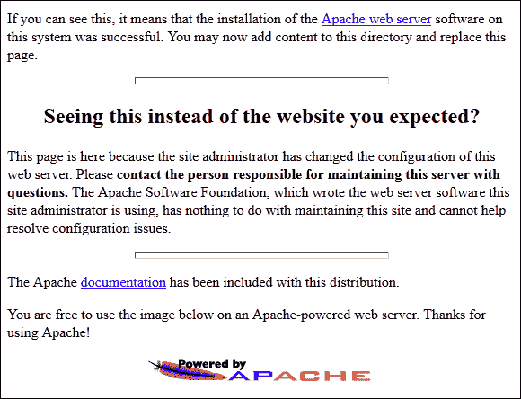

## 第 4 步 – 解压 Ext JS

在这个教程中，我们将使用 Windows 版本的 Apache。将 Ext JS 捆绑包解压到 Web 服务器的根目录（`htdocs`）。将具有长版本号的`Ext JS`文件夹重命名为`extjs4`以简化。根目录因操作系统和 Web 服务器而异。

以下为不同操作系统的 Apache 根目录路径：

+   **Windows**：`C:\Program Files\Apache Software Foundation\Apache2.2\htdocs`

+   **Linux**：`/var/www/`

+   **Mac OS X**：`/Library/WebServer/Documents/`

下载的 EXT JS 捆绑包包含了示例以及所需源代码。浏览到`http://yourwebserver.com/extjs4`，并确保它加载了 Ext JS 索引页面。此页面提供了访问所有示例以与 API 交互的入口。页面右下角的**API Docs**链接列出了 API 信息，并在页面右上角提供了一个搜索文本框。随着教程的进行，请根据需要参考 API：

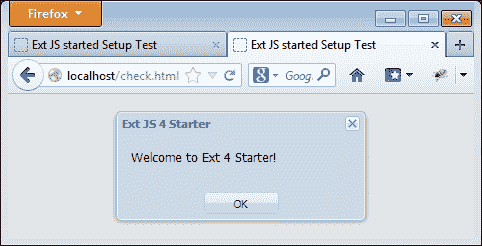

## 第 5 步 – 测试 Ext JS 库。

一个基本的 Ext JS 应用程序页面将包含一个指向 Ext JS CSS 文件（`ext-all.css`）的链接标签，一个指向 Ext JS 库的脚本标签，以及与您自己的应用程序相关的脚本。在这个例子中，我们没有任何特定于应用程序的 JavaScript。

在`httpd`文件夹下创建一个名为`check.html`的 HTML 文件，其中包含下面的代码。

`Ext.onReady`是一个方法，当所有脚本完全加载时执行。`Ext.Msg.alert`是一个消息框，向用户显示消息。第一个参数是标题，第二个参数是消息：

```js
<html>
<head>
<meta http-equiv="Content-Type" content="text/html; charset=utf-8">
<title>Ext JS started Setup Test</title>

<link rel="stylesheet" type="text/css" href="../extjs4/resources/css/ext-all.css"></link>

<script type="text/javascript" src="img/ext-all-dev.js"></script>

<script type="text/javascript">

Ext.onReady(function() {
 Ext.Msg.alert("Ext JS 4 Starter","Welcome to Ext 4 Starter!");
 }); 

</script>

</head>

<body>
</body>

</html> 
```

以下截图显示了`check.html`的实际效果：

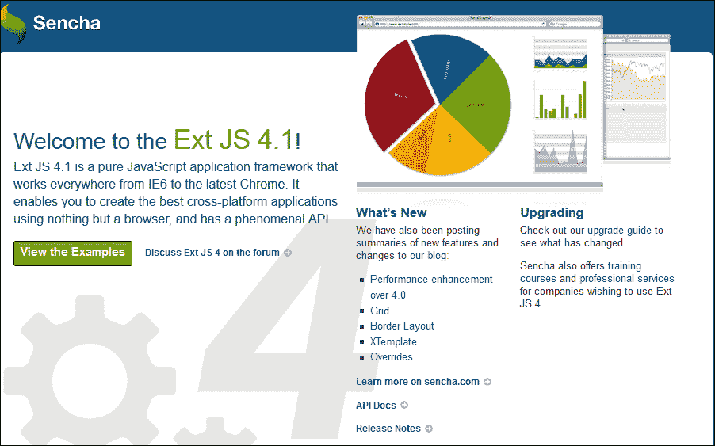

## 就这样

到目前为止，您应该已经安装了 Ext JS，并且能够探索并了解更多关于它的信息。

# 快速入门 – 创建和定义您的 Ext JS 应用程序

本节将解释如何创建应用程序，定义和创建一个类，按需加载类，以及一些 EXT JS 内置的基本函数。

## 第 1 步 – 准备 Ext JS 应用程序

核心库以三种不同的方式打包：

+   `ext.js`：这是生产版本，已压缩

+   `ext-debug.js`：这是未压缩的开发版本

+   `ext-dev.js`：这是未压缩的开发版本，但会输出详细的错误消息和警告

首先，创建以下内容。

+   在`httpd`根文件夹下有一个名为`ExtJSStarter`的文件夹

+   分别命名为`app`、`data`和`resources`的三个文件夹

+   一个`index.html`文件，应用程序将从该文件托管

+   一个`starerApp.js`文件，通过它可以在需要时动态加载所有应用程序级别的 JavaScript 文件

结果结构如下：

httpd

+   `extjs4`（解压的 ExtJS 框架，并重命名为`extjs4`）

+   `ExtJSStarter`

    +   `app`（应用程序特定 JavaScript 文件的文件夹）

    +   `data`（数据文件夹）

    +   `resources`（图像和 CSS 文件的文件夹）

    +   `starterApp.js`

    +   `index.html`

核心库以三种不同的方式打包：

+   `ext.js`：这是生产版本，已压缩和压缩

+   `ext-debug.js`：这是未压缩的开发版本

+   `ext-dev.js`：这是未压缩的开发版本，但会输出详细的错误信息和警告

一个基本的 Ext JS 应用程序页面将有一个带有 Ext JS CSS 文件（`ext-all.css`）的 `link` 标签，一个 `ext-dev.js` 的 `script` 标签，以及与您自己的应用程序相关的脚本：

```js
<!DOCTYPE>
<html>
<head>
<title>Ext JS started Index Page </title>
<meta name="Author" content="Nagarajan Bhava">
<link rel="stylesheet" type="text/css" 
href="../ext-4.1.1a/resources/css/ext-all.css"></link>
<script type="text/javascript" src="img/ext-dev.js">
</script>
<script type="text/javascript" src="img/starterApp.js">
</script>
</head>
<body>
  <h2> Ext JS Starter <h2> 
</body>
</html>
```

### 注意

Ext JS 库也可以从 CDN 以不同的方式加载：

+   [`cdn.sencha.io/ext-4.0.7-gpl/ext-all.js`](http://cdn.sencha.io/ext-4.0.7-gpl/ext-all.js)

+   [`cdn.sencha.io/ext-4.0.7-gpl/resources/css/ext-all.css`](http://cdn.sencha.io/ext-4.0.7-gpl/resources/css/ext-all.css)

以下截图显示了在浏览器中加载的索引页面，Firebug 有 **网络** 选项卡打开。通过点击浏览器窗口右上角的 Firebug 虫图标，使底部的 Firebug 调试器面板可见。它显示了浏览器请求的文件列表：

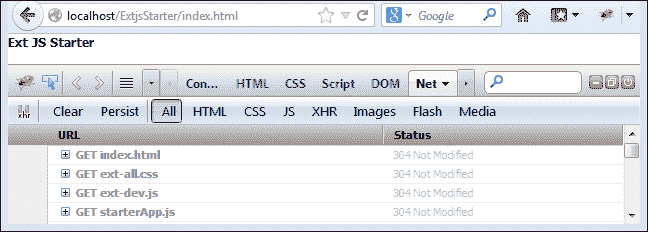

## 步骤 2 – MVC 架构

**模型视图控制器**（**MVC**）是一个著名的软件架构模式，它将信息的表示与用户的交互分离。Ext JS 默认提供此架构，并定义了以下架构。

+   **模型**：它是数据字段的集合，通过数据包持久化。模型可以通过关联和数据流使用代理链接到另一个模型。数据变化时更新视图。

+   **视图**：视图请求模型中所需的信息以生成输出表示。

+   **控制器**：它包含应用逻辑。它还实例化模型、存储和视图。它监听事件并修改模型和视图。

Ext JS 通过 `refs` 属性提供控制器以获取应用程序内组件的引用，并通过 `control` 方法根据引用组件触发的事件采取行动。*您想了解的顶级功能*部分详细介绍了使用控制器处理事件。

## 步骤 3 – 定义您的 Ext JS 应用程序

每个 Ext JS 应用程序都以调用 `Ext.application()` 开始，以提供全局设置、根命名空间、对其他 JavaScript 文件的引用，以及一个 `launch` 函数来执行应用程序。

在 `starterApp.js` 内部，为全局命名空间定义一个名为 `app` 的应用程序。

定义一个 `launch` 函数，在控制台和警告框中输出 `欢迎使用 Ext Starter 教程`。

Firebug 控制台看起来类似于以下代码片段：

```js
Ext.application({
  name :'app',  
requires:['Ext.window.MessageBox'],
  launch:function(){
    console.log("Welcome to Ext Starter Tutorial");
    Ext.Msg.alert("Message"," Welcome to Ext Starter Tutorial");
  }
});
```

上述代码片段创建了一个名为 `app` 的全局变量，并添加了一个 `requires` 属性以按需加载 Ext JS 消息框类。Ext JS 应用程序使用的只是一个全局变量。所有应用程序类都位于这个单一命名空间中。当页面准备就绪时，它调用 `launch` 函数并执行 `console.log` 和 `Ext.Msg.alert()` 语句。

在 JavaScript 中使用命名空间是一种推荐的做法，以减少添加到我们应用程序全局作用域中的对象和函数的数量。命名空间不是语言内建的，但可以通过创建一个单一的对象（即 `app`）并将所有我们的对象和函数添加到这个对象中来达到同样的好处。这也有助于避免在使用一个 JavaScript 库的同时使用另一个库时发生对象冲突：

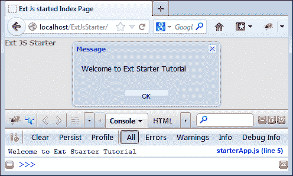

## 步骤 4 – 理解 Ext JS 类层次结构

Ext JS 框架捆绑了许多组织良好的类，它们提供了封装和强类型。Ext JS 中的许多类都作为单例实现，并附带一系列静态方法。

类层次结构从 `Ext.Base` 开始，向下钻取到各种其他类/组件。一个面板组件被定义为 `Ext.panel.panel`，类层次结构将类似于以下内容：

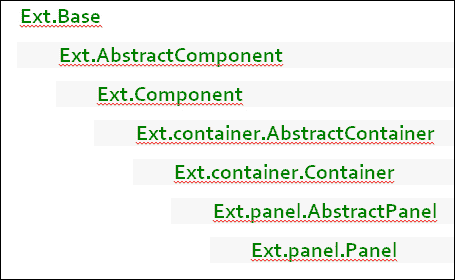

请参考以下链接以获取 API 参考：

+   **离线 API**: [`yourservername.com/extjs4/ docs/index.html`](http://yourservername.com/extjs4/%20docs/index.html)

+   **在线 API**: [`docs.sencha.com/ext-js/4-0/`](http://docs.sencha.com/ext-js/4-0/)

API 提供了一个简单的“搜索”文本字段来搜索特定的组件。搜索 `panel` 会显示一个与单词 `panel` 匹配的项目列表。点击 **Ext.panel.Panel** 会加载面板 API 文档。顶部部分显示了 `panel` 类支持的配置、属性、方法和事件链接。探索所有提供的选项并熟悉其用法。

例如，在 **搜索** 字段中搜索用于在上一步骤中启动应用程序的 `Ext.` 应用程序，并熟悉 API：

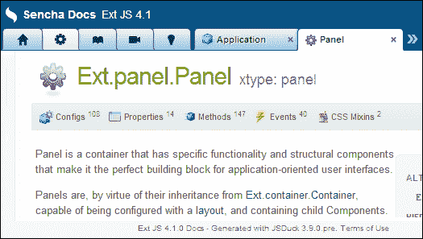

类的名称直接映射到它们存储的文件路径。面板类存储在 [`yourservername.com/extjs4/src/panel/Panel.js`](http://yourservername.com/extjs4/src/panel/Panel.js)。链接 [`yourservername.com/extjs4/src`](http://yourservername.com/extjs4/src) 映射到 `Ext` 类。

## 步骤 5 – 定义和创建 Ext JS 类

在 Ext JS 4 中，类是通过 `Ext.define()` 定义的。`Ext.define()` 会检测并创建所需的新命名空间，扩展一个类，如果被扩展的类尚未定义，则延迟创建新类的创建。

以下代码片段展示了 `app.extJsBook` 类及其属性的类定义示例：

```js
Ext.define('app.extJsBook'){  
  config:{
    title:'',
    price:'',
    author:''
  },
  constructor:function(config){
    this.initConfig(config)
  }
};
```

以下代码片段的解释如下：

+   `配置`：允许在实例化时指定可以更改的参数

+   `构造函数`：在对象实例化期间调用

+   `initConfig(config)`：这为配置属性创建 `setter` 和 `getter` 方法（即 `setTitle()`、`getTitle()`、`setprice()`、`getPrice()`、`setAuthor()` 和 `getAuthor()`）

可以使用 `Ext.create()` 方法实例化 `app.extJsBook` 类，如下面的代码片段所示：

```js
//Setting values using setter methods.

var book = Ext.create('app.extjsBook');
book.setTitle("ExtJSStarter");
book.setPrice("10$");
book.setAuthor('John');

console.log("Message 1 - ",book.getTitle());
//This message will be overridden by the second message
Ext.Msg.alert("Message 1 - ",book.getTitle());

// Setting values during instantiation

var book2 = Ext.create('app.extjsBook',{
  title:'Ext JS Upgrade',
  author:'Alex',
  price:'20$'    
});
Ext.Msg.alert("Message 2 - ",book2.getTitle());
```

在步骤 3 中创建的 `Ext.application` 的 `launch` 方法内部添加类定义和创建的代码片段。

执行 `index.html` 将输出类似于以下截图的内容。请注意，显示的消息框仅是第三个消息，所有之前的消息都已覆盖，但在控制台中显示以增强清晰度：

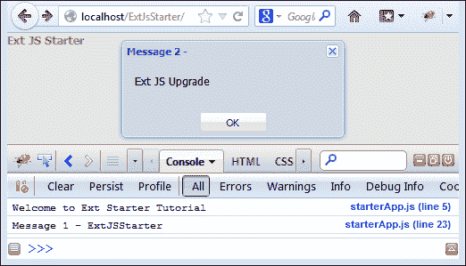

为了理解组件架构，让我们将类定义移动到 `ExtJSStarter/apps` 目录下的一个单独的文件 `extjsBook` 中。将 `app.extjsBook` 类的名称添加到应用程序的 `requires` 属性中，以动态加载该类：

```js
Ext.application({
  name:'app',    
  requires:['Ext.window.MessageBox',
 'app.extjsBook'],
  launch:function(){
    console.log("Welcome to Ext Starter Tutorial");
    Ext.Msg.alert("Message","Welcome to Ext Starter Tutorial");

    var book = Ext.create('app.extjsBook');
    book.setTitle("ExtJSStarter");
    book.setPrice("10$");
    book.setAuthor('John');

    console.log("Message 1 - " +book.getTitle());
    Ext.Msg.alert("Message 2- ",book.getTitle());

    var book2 = Ext.create('app.extjsBook',{
      title:'Ext JS Upgrade',
      author:'Alex',
      price:'20$'    
    });
    Ext.Msg.alert("Message 2 - ",book2.getTitle());
  }

});
```

`Ext.define()` 提供了另外两个重要的方法，即 `applyProperty()` 和 `updateProperty()`。`apply` 属性用于向设置器添加额外的逻辑，而 `update` 属性用于在值设置后进行后处理或通知。为了在控制台中看到新旧值，请将 `author` 设置两次（即在应用程序代码中两次调用 `book.setAuthor()`）。

以下代码片段将书名改为大写，并记录作者的新旧值：

```js
Ext.define('app.extjsBook',{      
  config:{
    title:'',
    price:'',
    author:''
  },
  constructor:function(config){
    this.initConfig(config)
  },
// changing the title to upper case
  applyTitle:function(value){
 return Ext.String.capitalize(value.toUpperCase());
  },
//Logging both new and old value
  updateAuthor:function(newValue, oldValue){
    console.log("NewVal- " +newValue +":"+ "Old Val- " +oldValue);  }
});
```

用于将作者姓名首字母大写的突出显示代码使用了 `Ext.String.capitalize()`，这是 Ext JS 版本的本地 JavaScript `String` 工具类。

### 注意

也可以使用 `mixins` 属性将一个类的功能添加到另一个类中。可以使用 `static` 属性添加静态方法。

## 第 6 步 – 实例化 Ext JS 组件

组件可以通过使用 `Ext.create()` 方法或使用组件的 `xtype` 属性作为父组件 `items` 配置的成员来创建。

+   `Ext.container.AbstractContainer` 在类层次结构中为所有其组件子类提供了 `items` 配置属性，以便添加单个项目或子组件数组到指定的容器中。

+   `Ext.Abstractcomponent` 提供了 `xtype` 属性，这是创建对象时比使用完整类名更短的替代方案。使用 `xtype` 是定义组件实例最常见的方式，尤其是在容器中。

### 注意

`Ext.create` 与使用 `new` 关键字类似，它将立即创建类，而 `xtype` 则不会在需要之前创建类。这被称为 **延迟实例化**。使用 `xtype` 创建的隐藏标签或面板中的组件将不会加载，直到标签或面板可见，从而提高页面加载时间。

例如，以下代码片段演示了一个面板，所有四边都有 5 px 的填充，宽度为 300 px，包含文本字段和两个在文档的 DOM 主体中使用 `renderTo` 属性渲染的自定义按钮：

```js
var extjsBookPanel = Ext.create('Ext.panel.Panel', {
      bodyPadding: 5, 
      width: 300,
      title: 'extjsBookPanel',
      items: [{
 xtype: 'textfield',
          fieldLabel: 'Publish date'        
        },
 Ext.create('app.extjsButton', {
          text: 'Custom button instantiated'+ 
             'using Ext.create()',       
        }),  {
 xtype: 'extjsButton',
          text:'Custom button instantiated using xtype'            }],
 renderTo: Ext.getBody()
    });
```

在项目的配置属性中包含了三个组件。`renderTo` 属性可以是元素的 ID 或元素。`Ext.getBody()` 返回当前文档体作为 `Ext.Element`：

+   文本字段：使用 `xtype` 文本字段实例化文本字段。Ext JS 为其大多数可用组件提供了 `xtype`。

+   自定义按钮组件 1：使用 `Ext.create()` 方法实例化 `app.extjsButton` 按钮组件，如前一步所述。

+   自定义按钮组件 2：使用自定义 `xtype` 名称实例化 `app.extjsButton` 按钮组件。为了使这可行，我们的 `app.extjsBook` 类定义需要指定 `xtype` 和 `extend` 属性，并调用其父 `Button` 类，如下所示：

    ```js
    Ext.define('app.extjsBook',{
     xtype:'extjsButton',
     extend:'Ext.button.Button',
      constructor:function(config){
     //Call Ext.button.Button parent class
        this.callParent(arguments);
      }  
    });
    ```

将前面的代码添加到应用程序的 `launch` 函数中，并使用修改后的 `app.extjsButton` 类属性以支持 `xtype`，将显示类似于以下截图的内容：

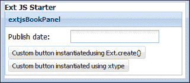

### 注意

所有 EXT JS 组件的 `xtype` 可以在 [`docs.sencha.com/ext-js/4-1/#!/api/Ext.enums.Widget`](http://docs.sencha.com/ext-js/4-1/#!/api/Ext.enums.Widget) 找到。

## 第 7 步 – 使用 Ext JS Lang 函数

原生 JavaScript 提供了各种实用类，如 `Array`、`Date`、`Number`、`Object` 和 `String`。Ext JS 提供了自己版本的实用类，以确保在所有浏览器中都能实现平滑和一致的开发体验。它还提供了原生 JavaScript 中不可用的额外功能。可用的函数提供了额外的优势。这些函数可以在 `Ext.Array`、`Ext.Date`、`Ext.Number` 等下找到。在适用的情况下使用这些函数将有助于集中精力处理核心应用程序逻辑，从而节省在转换实用工具上花费的开发时间。还可以使用 `Ext.Define` 在 `Ext` 命名空间中添加特定方法的开发者特定类：

+   `Ext.Array.contains(array,item)` 可以检查给定的数组是否包含指定的项目。

+   `Ext.Date` 支持广泛的日期格式，这在处理日期时非常有用。

    例如，`Ext.Date.format(new Date(), 'Y-m-d'))` 可以用来以 YEAR-MM-DD 格式显示当前日期。

+   `Ext.Function` 提供了用于管理具有更多功能和控制的函数调用的功能。

    例如，`Ext.Function.defer()` 可以用于在指定的时间（以毫秒为单位）后调用一个函数，可选地在一个特定的作用域内。

+   `Ext.Number` 提供了六种方法来处理数值。

    例如，`Ext.Number.randomInt(10,20)` 返回介于 10 和 20 之间的随机整数。

+   `Ext.Object` 提供了大约 10 种方法来查询和操作对象和 JSON 数据结构。

    例如，`Ext.Object.fromQueryString('bookName=ExtJs&type=ebook')` 输出 `{bookName:'ExtJs', type:'ebook'}`。

+   `Ext.String` 提供了用于操作字符串的有用方法。

    例如，`htmlEncode(value)` 将某些字符（`&`、`<`、`>`、`'` 和 `"`）转换为它们的 HTML 字符等效项，以便在网页中进行字面显示。

# 你需要了解的顶级功能

本节将处理各种 Ext JS 容器、组件、表单、控制器、布局、事件机制、数据包、模板等。

## 1 – 布局机制

Ext JS 容器需要布局来管理子组件的大小、定位和分层。它提供了不同类型的布局，以满足大多数人可能遇到的定位需求。

使用具有 CSS 样式的 `div` HTML 元素作为简单的 HTML 容器，可以通过几行代码轻松渲染，使用布局配置属性。Ext JS 布局机制负责生成具有明确应用样式的 HTML 元素容器，使用默认的 CSS。

下表列出了布局类型、组件位置表示以及说明了它可以在哪里使用。这些布局可以直接使用，也可以组合使用多个，或者以嵌套方式使用。每个布局都提供特定的配置属性来调整和定位子组件。如果没有指定布局配置，它将使用默认的布局管理器，该管理器按顺序渲染组件，一个接一个。随着我们学习不同的组件，将展示不同的布局来定位组件。

布局和组件表示表如下：

| 布局名称 | 组件位置表示 | 适用于何处？ |
| --- | --- | --- |
| 绝对定位 |  | 使用 X-Y 坐标进行定位，类似于 CSS 样式定位 |
| 折叠面板 | 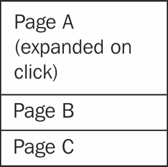 | 在面板堆叠列表中一次显示一个面板（即页面或部分）。 |
| 锚定 |  | 将子组件相对于其容器进行定位。 |
| 边框 | 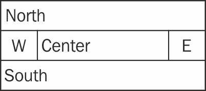 | 在所有四个侧面（即北、南、东和西）放置不同的组件，并带有必要的中心区域。它提供折叠和调整大小的行为。 |
| 卡片（标签面板） | 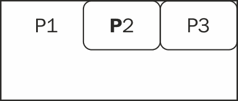 | 为每个部分创建带有标签名称的标签。 |
| 卡片（向导） | 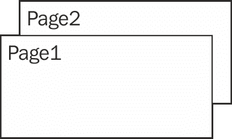 | 以堆叠形式将页面一个叠一个地排列，每次只显示一个页面，隐藏所有其他页面。 |
| 列 | 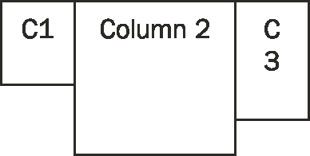 | 在不同的列中拥有内容区域。 |
| Fit | 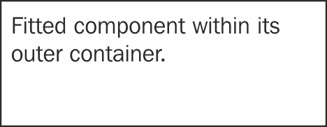 | 将子组件拉伸并填充到其容器中。 |
| 表格 | 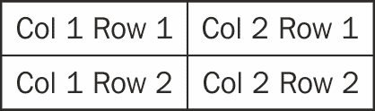 | 以标准 HTML 表格的形式创建表格。 |
| vBox | 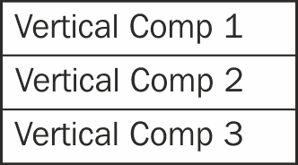 | 以垂直方式显示组件，一个在另一个下方。它需要一个固定高度`height`或相对于其容器的`flex`来扩展到可用高度。 |
| hBox |  | 以横向、依次串联的方式显示组件。它需要一个固定宽度`width`或相对于其容器的`flex`来扩展到可用宽度。 |
| 嵌套布局 | 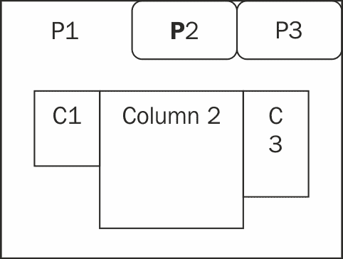 | 列布局嵌套在卡片（标签面板）布局内部。 |

动态布局可以在[`dev.sencha.com/deploy/ext-4.0.0/examples/layout-browser/layout-browser.html`](http://dev.sencha.com/deploy/ext-4.0.0/examples/layout-browser/layout-browser.html)中直观地看到。

## 2 – 容器

Ext JS 提供了三种类型的容器：

+   `Ext.container.Viewport (xtype:viewport)`: 这是一个特殊的容器，它将自己渲染到文档体中，从而占据了整个浏览器可查看区域。一个页面只有一个视口，并且它不提供滚动功能。

+   `Ext.container.Container (xtype: container)`: 这是大多数 Ext JS 组件（如面板和窗口）的顶级容器类。它为所有子组件提供了添加、删除和插入的行为。

+   `Ext.container.ButtonGroup (xtype:buttongroup)`: 此容器提供了一种以表格格式排列按钮的方式。当应用程序需要在面板的顶部或底部显示任务栏时，可以使用此功能。

### Ext.container.Viewport

视口表示与可用高度和宽度相等的可查看浏览器区域。它将自己渲染到页面文档体中，并调整自身大小以适应浏览器的大小。视口仍然需要布局来定位其子组件。以下代码片段使用 `xtype` 和 `fit` 布局创建了一个包含面板的视口。请注意，面板的 `width` 属性没有意义，因为 `fit` 布局覆盖了宽度并将面板拉伸到浏览器窗口的大小。代码片段显示了一个标题为 `Viewport Panel` 的面板和内容 `'A Panel inside viewport'`。

```js
Ext.create("Ext.container.Viewport",{
layout:'fit',
items:[{
 xtype:'panel',
    width:300,
    html:'A Panel inside viewport',
    title:'Viewport Panel'
  }]
});
```

### Ext.container.Container

通过只需将`xtype`属性从`panel`更改为`container`，就可以创建一个容器。`container`只是一个没有标题的容器。`container`的 API 没有为`container`定义`title`属性，因为它只是一个用于放置和组合子组件的容器，不需要任何标题。

下面的代码片段创建了一个包含文本字段和带有顶部 5 像素、右侧 5 像素、底部 0 像素和左侧 5 像素边距的`submit`按钮的容器，并使用`vbox`（垂直框）布局。

注意到文本字段添加了一个`style`属性，以提供自定义 CSS 指定的底部边距和颜色。`defaults`属性用于将其所有子项应用默认设置。在这种情况下，`margin`应用于文本字段和按钮。

尝试将`layout`属性替换为`hbox`（水平框）而不是`vbox`，看看区别。`hbox`布局将组件水平排列，一个接一个：

```js
Ext.create("Ext.container.Viewport",{
  layout:'fit',
  items:[{
    xtype:'container',        
    // html:'A Panel inside viewport',
    defaults:{
      margin:'5 5 0 5'
    },    
    layout:'vbox',
    items:[{
        xtype:'textfield',
        fieldLabel:'Name',
/*
* Custom CSS specification. The 'defaults' margin property need to be * commented in order to see the effect of marginBottom.  
*/
    style:{marginBottom:'20px',color:'blue'}

      },{
        xtype:'button',
        text:'submit'
      }]
    }]
});
```

### 注意

面板提供了额外的功能，例如在配置中包含存储、在所有四个方向上支持工具栏（`lbar`、`tbar`、`fbar`和`rbar`），并且它可以设置为可浮动，这在容器中找不到。

### Ext.container.ButtonGroup

按钮组提供了一个用于分组按钮和菜单的容器。将以下代码片段添加到`Ext.container.Viewport`的`items`配置中，以可视化按钮组。以下代码片段创建了一个带有三个按钮的按钮组类型组件，这些按钮在标题`Days`下分组。`columns`属性决定了按钮列的数量：

```js
{
  xtype:'buttongroup',
  columns:3,
  title:'Days',
  items:[{xtype:'button',text:1},
     {xtype:'button',text:2},
     {xtype:'button',text:2}]
}
```

## 3 – 组件和数据包

Ext JS 包括各种组件。本节处理标签面板和网格面板以及数据包。

### Tabpanel

**Tabpanel**是一个使用无标题面板并为每个面板创建修改后的按钮以看起来像标签的容器。它使用卡片布局来放置子组件。

下面的代码片段创建了一个大小为 400 x 400 像素的标签面板，其中包含两个面板，分别代表文档中的两个名为`Page1`和`Page2`的标签。第一个项目没有指定`xtype`，但 ExtJS 认为默认面板是`xtype`。`renderTo`属性可以是 DOM 元素或元素的 ID。`activeTab`属性用于通过其项目索引位置设置活动标签。取消注释`layout:'fit'`（注释宽度和高度），观察标签面板将占据整个浏览器。取消注释`layout:'absolute'`、`x:'10'`和`y:'10'`（保留`layout:'fit'`注释），观察标签面板在 x 和 y 方向上绝对定位了 10 像素：

```js
Ext.create('Ext.tab.Panel', {  
width: 400,
height: 400,
activeTab:0,
//layout:'fit',
  //layout:'absolute',
  //x:10, y:10,
   renderTo: document.body,
   items: [{    
   title:'Page 1',
    html:'Page1'
    }, {
    xtype:'panel',
   title:'Page 2',
    html:'Page2'   
  }]
});
```

标签面板或面板可以在四个方向上停靠项目以放置工具栏或标签栏。将以下代码添加到标签面板中：

```js
dockedItems:[{
    xtype:'toolbar', dock:'bottom',
    items:[{xtype:'button', text:'Docked Button'}]
  }],
```

上述代码片段创建了一个带有底部停靠按钮的工具栏，并将其设置为`dockedItems`属性。

### 注意

`Ext.tab.Panel`在实现内部使用卡片布局。`Ext.container.Container`在没有对标签按钮有要求的情况下可以使用卡片布局。

### 卡片布局的容器

尝试创建一个包含两个项目的容器，容器布局如以下代码片段所示。只有一个项目（即，标题为`Page 1`的第一个面板）将被显示，因为第二个面板（`Page 2`）位于第一个面板之下。取消注释行`cardComp.getLayout().setActiveItem(1)`将第二个项目（`Page 2`）带到前面并隐藏所有其他项目。`getLayout()`方法提供了容器使用的卡片布局，`setActiveItem(ComponentIndex)`显示指定索引的项目，隐藏所有其他项目：

```js
var cardComp =Ext.create('Ext.container.Container', {
  layout:'card',
  width: 400,
  height: 400,
  renderTo: document.body,
  items: [{
    title: 'Page 1',
    html:'Page1'
  }, {
    title: 'Page 2',
    html:'Page2'

  }]
});
//Show the second item visible by uncommenting this line.
//cardComp.getLayout().setActiveItem(1);
```

### 数据包

新的 ExtJS 4 数据包使您能够检索、解码并在应用程序中使用数据。数据包的核心类是`Model`、`Proxy`和`Store`。

`Model`代表存储中的数据或记录。它还包括字段定义、数据验证规则、其他模型的关联以及连接到服务器的代理信息。它可以有五种类型的验证规则，如`presence`、`length`、`format`、`inclusion`和`exclusion`，字段可以定义多个验证规则。它还可以定义自定义方法。

在`app/model`文件夹下，通过以下示例扩展`Ext.data.Model`类来定义一个模型，并将其保存为`Users.js`。代码片段提供了一个自定义方法`capitalizeName`并为字段`age`添加了`length(to 2)`验证规则。它将 Ajax 代理附加到模型并将模型绑定到存储：

```js
Ext.define('app.model.Users',{
  extend:'Ext.data.Model',
  idProperty:'name', //default to id
  fields: [
      {name: 'name',type:'string'}, 
      {name:'email'},
      {name:'age',type:'int'},
      {name:'employed',type:'boolean'}
  ],      
  capitalizeName:function(){
    this.set('name',Ext.util.Format.uppercase(this.get('name')));
  },
  validations:[
    {type:'length',field:'age',min:2}
  ],
});
```

### 注意

当 Firebug 控制台抱怨时，将新组件类包含到`starterApp.js`应用程序的`require`属性中。

`Proxy`处理数据的加载和保存。它定义了浏览器和服务器之间的连接。它通过代理将加载数据存储到数据模型数组中。有四种类型的服务器代理，即 Ajax、REST、JSONP 和 Direct，以及三种类型的客户端代理，即本地存储、内存存储和会话存储。在本教程中，我们将配置 Ajax `type` 代理：

+   **Ajax**: 它向同一域的服务器发送请求。

+   **JSONP**: 它通过动态实例化`script`标签向不同域发送请求。

+   **REST**: 它通过 RESTful 后端发送请求。

+   **Direct**: 它使用`Ext.direct.Manager`发送请求。它提供了一个从 ExtJS 代码直接调用服务器方法的功能，就像直接从 JavaScript 调用一样。请参阅[`www.sencha.com/products/extjs/extdirect`](http://www.sencha.com/products/extjs/extdirect)获取更多信息。

+   **LocalStorage**: 它使用新的 HTML 5 localStorage API 在客户端浏览器本地保存`Model`数据。HTML 5 本地存储是网页在客户端浏览器内存储命名键/值对的一种方式。

+   **内存中**：它使用局部变量来存储数据，因此页面刷新时数据会丢失。

+   **会话存储**：它使用 HTML 5 会话存储通过唯一 ID 存储和检索数据。

### 注意

**DirectJEngine** ([`code.google.com/p/directjngine/`](http://code.google.com/p/directjngine/)) 为直接从 Ext JS API 调用服务器端 e-Java 类提供了基础设施。

将以下配置属性添加到前面的模型中：

```js
proxy:{
  type:'ajax',
 url:'/ExtjsStarter/data/Users.json'
}
```

在 Apache 的 `htdocs/ExtJSStarter/data` 文件夹下创建一个名为 `Users.json` 的文件，并添加以下 JSON 数据：

```js
[{name:'David',email:'david@motorola.com',age:32,employed:true},
{name:'Jonny',email:'jonny@sencha.com',age:20,employed:false},
{name:'Anthony',email:'anthony@google.com',age:42.5,employed:true},
{name:'Steffi',email:'steffi@facebook.com',age:26,employed:true}]
```

存储类 `Ext.data.Store` 封装了 `Model` 对象的客户端数据。它提供了各种方法来查询、插入、删除、加载、排序和管理记录。在模型下方添加以下代码以将模型绑定到新存储并在创建时自动加载。加载的存储包含从 `Users.json` 绑定的模型数据：

```js
var extJS_UserStore = Ext.create('Ext.data.Store',{
 model:'app.model.Users',
  autoLoad:true    
});
```

让我们利用创建的存储在网格面板中，在下面的部分中在浏览器中可视化数据。

### 网格面板

**网格**被广泛用于以表格形式显示大量数据，具有排序和过滤功能。ExtJS 提供了一个强大的网格组件，具有各种模型来操作行和列。网格由存储和一组用于渲染的网格列组成。

创建一个包含四列的网格面板，每列都与一个 `dataIndex` 属性相关联。列头 `dataIndex` 属性唯一标识了从存储中应该添加到每列的记录。`store` 属性定义了一个已加载的存储。网格面板需要渲染到 DOM 元素中才能在浏览器中看到它：

```js
var extJS_UserGrid = Ext.create('Ext.grid.Panel',{
  title:'Ext JS Users List',
 store:extJS_UserStore, //created in previous chapter
  columns:[
    {header:'Name',dataIndex:'name'},    
    {header:'Age',dataIndex:'age',width:30},
    {header:'Employed',dataIndex:'employed'},
    {header:'Email',dataIndex:'email',flex:1}
  ]

});
```

让我们将网格添加到第一个面板（即 `Page 1`）中。请注意，网格面板被添加到第一个面板项（即 `Page 1`）中：

```js
Ext.create('Ext.tab.Panel', {
  width: 400,
 height: 200,  
  dockedItems:[{
    xtype:'toolbar',
    dock:'bottom',
    items:[{text:'Docked Button'}]
  }],
  renderTo: document.body,
  items: [{    
   title: 'Page 1',
    items:[
 extJS_UserGrid 
    ]
  }, {
    xtype:'panel',
   title: 'Page 2',    
    html:'Page2'

  }]
});
```

在浏览器中加载代码将显示类似于下一张截图的内容。它显示了两个面板（**Page 1** 和 **Page 2**）。默认情况下，**Page 1** 标签页是活动的，并显示了具有四列的网格面板以及从存储中通过 AJAX 代理加载的 JSON 数据。尝试点击标题并观察列是否可以排序：

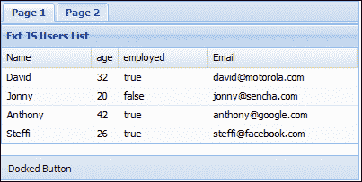

### 无限滚动

使用 `verticalScroller` 属性可以实现网格的无限滚动/分页，以在屏幕上一次性渲染所有记录而不受性能惩罚地滚动数千条记录。

### 注意

**浮动组件**：任何组件子类都可以通过使用 `floating:true` 配置属性来使其可浮动。浮动组件由 `ZindexManager` 管理，并限制在其父容器内。

## 4 – 遍历 Ext JS 组件

Ex JS 提供了两种查询组件的方式，一种是通过全局使用 `Ext.ComponentManager`，另一种是在文档中的 `Ext.container.Container` 内使用类似 CSS 的语法选择器。

可以使用 `id`、`itemId` 和 `xtype` 来检索组件，包括用于模式匹配的选择器和运算符。

考虑一个包含文本字段、按钮和内部面板（其中包含内部文本字段）的外部面板，如下所示：

```js
Ext.create('Ext.Panel',{
  title:'ExtJS',
 id:'outerPanel',
  items:[
  {  
    xtype:'textfield',
 id:'outerTextId',
  },{  
    xtype:'button',
    text:'Submit',
 id:'buttonId'
  },{
    xtype:'panel',
 id:'innerPanel',
    items:[{  
      xtype:'textfield',
      fieldLabel:'Country',
 id:'innerTextId',
      cls:'innerTextCls'
    }]
  }]
});
```

### 注意

`Ext.ComponentQuery.query("#id')` 返回一个数组，而 `Ext.getCmp('id')` 返回一个对象。`Ext.ComponentQuery.query("#id")[0]` 和 `Ext.getCmp('id')` 是相同的。

下表说明了使用不同方法通过不同方法选择和遍历字段的用法：

| 选择方法 | 返回组件对象 |
| --- | --- |
| `Ext.getCmp('outerPanel').down('button');``Ext.getCmp('outerTextId') .nextSibling() Ext.getCmp('outerTextId').next()``Ext.getCmp('outerTextId').nextNode();` | 按钮 |
| `Ext.getCmp('buttonId').previousSibling() and Ext.getCmp('buttonId').prev()` | 外部文本字段 |
| `Ext.ComponentQuery.query('textfield[cls=innerTextCls]')` | 内部文本字段 |
| `Ext.getCmp('outerTextId').up()` | 外部面板 – 表单 |
| `Ext.getCmp('innerPanel').down()` | 内部文本字段 |
| `Ext.getCmp('innerTextId').``findParentByType('panel')` | 内部面板 |
| `Ext.getCmp('buttonId').``findParentByType('panel')` | 外部面板 |

## 5 – 处理表单

在 Ext JS 中，表单指的是 `Ext.form.Panel` 类，它为所有 `form` 元素提供了一个标准容器。它自动创建一个 `BasicForm` 对象来管理添加到容器中的任何 `Ext.form.field.Field` 对象。默认情况下，表单面板使用锚布局配置其子项，如果需要可以更改。它提供各种配置属性和方法来管理和处理字段。

Ext JS 4 支持以下表单字段：

+   复选框和复选框组

+   组合框

+   显示字段（仅显示文本字段）和隐藏

+   HTML 编辑器

+   日期和数字

+   单选按钮和单选按钮组

+   滑块和微调器（带有上/下箭头按钮的字段）

+   文本、触发器（添加可点击按钮的文本包装器）和文本区域

+   时间和文件

所有字段都提供获取器和设置器方法，这些是跟踪和验证值的属性和方法。以下是一些常用的重要基本 `form` 方法：

+   `getFieldValues`：它以键值对的形式返回表单中的所有字段值

+   `getFields`：它返回所有字段

+   `getValues`：它以表单名值对的形式返回所有字符串字段值

+   `findField('id')`：它通过其 ID 查找特定的 Ext JS 字段

+   `isValid`：它检查有效性

+   `markInvalid(error)`：它将字段标记为无效

可以使用 `formBind` 和 `disabled` 属性在验证更改时启用和禁用 `form` 字段。前面的代码片段演示了一个表单面板，其中包含一个文本字段，该字段验证非空字符串长度在 2 到 10 之间，一个复选框和一个提交按钮，只有当文本字段值有效时才启用。

文本字段的验证规则通过指定以下属性来定义：

+   `allowBlank`、`maskRe`、`regex` 和 `stripCharsRe`

+   `maxLength` 和 `minLength`

+   `validator`、`validationChange` 和 `vType`

字段的验证默认发生，可以通过将 `validateOnChange` 属性设置为 `false` 并使用 `validate()`、`isValid()` 和 `hasInvalidField()` 方法来调用验证来延迟验证。

使用 `blanktext`、`maxlengthText`、`regexText` 和 `vTypeText` 来自定义验证错误消息。

`vType`: `Ext.form.field.vTypes` 是一个虚拟类型实现，它定义了 ExtJS 特定的默认和自定义验证（即针对用户特定验证的自定义 `vType`）规则。Ext JS 提供了默认的 `vType` 属性，例如 `email`、`URL`、`alpha` 和 `alphanum`。

以下代码片段演示了一个包含文本字段、复选框和 AJAX 提交按钮的表单面板。高亮行通过属性提供了字段的验证规则。`Ext.form.Basic.submit()` 按钮使用 `url` 属性中指定的 URL 通过 HTTP `post` 动作将数据发送到应用程序服务器，并使用成功或失败消息提醒用户。

以下代码片段是表单面板的代码：

```js
{
  xtype:'form',bodyPadding:10,
  title:'A Form Panel',
  width:300,height:400,
 url:'http://someurl.com/extjs.jsp',
  items:[{
    xtype:'textfield',
    fieldLabel:'Name',
 vType:'alpha', //only alphabets are allowed
 allowBlank:false, minLength:2, maxLength:10 
  } ,{
    xtype:'checkbox',
    boxLabel:'I agree terms and conditions',
    name:'termsCB',
 formBind:true,disabled:true
  }],
  buttons:[{
    text:'Submit',
 formBind:true,
 disabled:true,
    handler:function(){
      var form = this.up('form').getForm();
      if(form.isValid()){  
        form.submit({
          success:function(form,action){Ext.Msg.alert("Success".action.result.msg");
          },
          failure:function(form,action){
            Ext.Msg.alert("Success".action.result.msg);
          }
        });  //submit end
      }//form isValid end

    }}]//buttons end
  }]
}
```

上述表单面板代码由以下服务器响应处理：

```js
//_________ Server Response ___________________________
/**
Note: Please be informed that the response can be of JSON type also. Hence failure case can be categorized with ids and can be reported accordingly. 
{
  "success":true,
  "msg":"Data Submitted Successfully"
}
{
  "success":false,
  "msg":"Data Submission failed"  
}
**/
```

### 注意

基本表单的 `getValue()` 方法仅返回字符串值，而 `getFieldValue()` 返回所有类型特定的数据值（例如，日期字段的 `Date` 对象，组合框的 `Boolean` 等）

## 6 – 模板

`Ext.XTemplate` 用于以下操作：

+   从数组和存储数据生成 HTML 输出

+   基本条件处理（`for` 和 `if` 语句）和自定义成员支持

+   使用内置模板变量执行内联代码

可以使用 `Ext.XTemplate` 构造函数通过传递一个 HTML 片段（如以下代码片段所示，字段在花括号内作为参数）来定义一个简单的模板。它还提供了一个 `<tpl>` 标签，用于重复 `template` 块以处理数组，以及一个 `if` 操作符用于条件处理。它还可以有成员函数。

以下代码片段创建了一个模板并将其应用于对象和数组：

```js
var tplObj = Ext.create('Ext.XTemplate',
  '<div> Hi {user}, How are you?</br> Are you from {city}</div>');
tplObj.compile();
tplObj.applyTemplate({user:'Tony',city:'London'}) //Object

var tplArray = Ext.create('Ext.XTemplate',
    '<div> Hi {0}, How are you?</br> You are from {1}</div>');
tplArray.compile();
tplArray.applyTemplate(['Tony','London']) //Array

<tpl for="xxx">
  //HTML fragment
</tpl>
</tpl>
```

如前述代码片段所示，`html` 片段可以包含字段或数组索引，`applyTemplate` 方法替换模板中的 `{user}` 和 `{city}` 值。模板值可以是数组（如果参数是数字）或对象。

### 注意

在 [`docs.sencha.com/ext-js/4-1/#!/api/Ext.XTemplate`](http://docs.sencha.com/ext-js/4-1/#!/api/Ext.XTemplate) 上查看更多模板示例。

## 7 – 控制器和事件

控制器负责我们应用中发生的各种组件的事件。让我们创建一个网格视图控制器（使用在 *快速入门 – 创建和定义您的 Ext JS 应用程序* 部分中创建的网格面板），一个新的应用程序和一个 HTML 文件，该文件加载应用程序并检查控制器中如何处理事件。它提供了一个集中位置来管理应用程序组件的所有事件。

在 `app/view/ extjsUsersListView.js` 文件中创建一个文件，并将以下代码添加到其中。请注意，网格中定义的存储已经使用 `app.model.Users` (`app/model/users`) 在 *数据包* 部分中加载：

```js
Ext.define('app.view.extjsUsersListView',{
  extend: 'Ext.grid.Panel',
 alias : 'widget.extjsUsersList', 
  title : 'Ext JS Users', 
  initComponent: function() {
 this.store=extJS_UserStore,
    this.columns=[
      {header:'Name',dataIndex:'name'},    
      {header:'age',dataIndex:'age',width:30},
      {header:'employed',dataIndex:'employed'},
      {header:'Email',dataIndex:'email',flex:1}
    ]    
   this.callParent(arguments);
  }
});
```

在 `app/controller/ extjsUsersController.js` 文件中创建一个文件，并将以下代码添加到其中：

以下代码片段通过扩展 `Ext.app.Controller` 定义了一个控制器 `app.controller.extjsUsersController`。控制器的 `views` 属性配置了在上一节中创建的视图。`init()` 方法定义了通过 `control` 函数在控制器中如何处理事件。此函数可以引用引用或 xtypes。引用 `'viewport > panel'` 使用 `Ext.ComponentQuery` 语法指向 UI 组件，并在视图中找到直接子面板。`'extjsUsersList'` xtype 指的是我们想要控制 `itemclick` 和 `afterrender` 事件的网格面板（即 `view extjsUsersListView'`）：

```js
Ext.define('app.controller. extjsUsersController, {
 extend: 'Ext.app.Controller',
  views: [
 extjsUsersListView'
  ],  
  init: function() {
 console.log('Initialized!');

```

```js
    this.control({
      // Events of panel referred through Ext.ComponentQuery
     'viewport > panel': {
      //This event is fired, as the grid panel extends panel. 
        render: this.onPanelRendered
     },
      // Events of grid panel referred through its xtype
 'extjsUsersList': {
      itemclick: this.editUser,
        afterrender:this.gridAfterRender
     }
    });   
  }, 
  onPanelRendered: function() {
 console.log('The panel was rendered');
  },
  gridAfterRender: function(grid, opts) {
 console.log('Grid Component rendered');
 },
  editUser: function(grid, record) {
 console.log('Clicked on ' + record.get('name'));
  }
})
```

### 注意

`'alias'` 是一个属性，它引用了使用 `widget.<xtypeName>` 定义 xtypes 的自定义类的短名称。例如，`widget.usergrid` 和 `widget.userPanel`。

在 `ExtJSStarter` 文件夹下创建一个名为 `mvcApp.js` 的应用程序文件，并将以下代码添加到其中。应用程序中的 `controllers` 属性配置为 `extjsUsersController`，这是在上一节中创建的，并且将网格组件（`extjsUsersList`）添加到视图中。请参考 `grid` 组件的 `alias` 属性中提到的 xtype 名称：

```js
Ext.application({
  name:'app',    
  requires:['Ext.window.MessageBox','app.model.Users',
 'app.controller.extjsUsersController',
 'app.view.extjsUsersListView',
    'Ext.container.Viewport','Ext.grid.Panel'
  ],  
  controllers: [
    'extjsUsersController'
  ],  
  launch:function(){
     Ext.create('Ext.container.Viewport', {     
     items: [
        {xtype:'extjsUsersList' }
      ]
    });
  }
});
```

在 `ExtJSStarter` 文件夹下创建一个名为 `mvcApp.html` 的文件，并将以下代码添加到其中：

```js
<html>
<head>
<title>Ext Js started Index Page </title>
<meta name="Author" content="Nagarajan Bhava">
<link rel="stylesheet" type="text/css"     href="../extjs4/resources/css/ext-all.css"></link>
<script type="text/javascript" src="img/ext-    dev.js"></script>
<script type="text/javascript"     src="img/Users.json"></script>
 <script type="text/javascript"     src="img/mvcApp.js"></script>
</head>
<body>
</body>
</html>

```

使用 Firebug 调试器加载 `http://yourservername.com/ExtJSStarter/mvcApp.html` 将会显示类似于下一张截图的内容。

初始化的应用程序渲染面板和网格面板，并监听 `itemclick` 事件。当页面加载时，应用程序的 `init` 方法被调用，随后是面板的渲染。点击任何行将触发 `itemclick` 事件并在控制台记录消息：

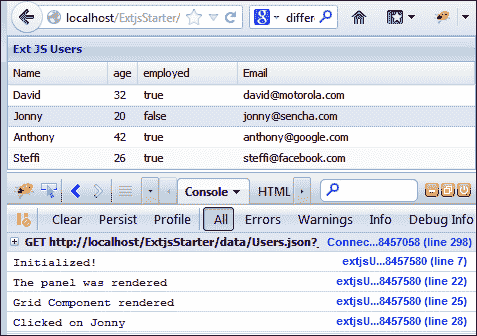

## 8 – 事件处理

Ext JS 中的事件要么是 DOM 或 JavaScript 事件。Ext JS 中的事件源是 `Ext.Observable` 类的扩展。事件属性如下：

+   **事件** 是事件源发送（触发）的消息，以通知监听器在视图中发生了什么

+   **事件源** 是可以触发事件的对象

+   **事件监听器**是在事件源触发事件时被调用的函数

+   可以使用`on`函数触发事件

**DOM 事件**：显示 HTML 页面的浏览器会监视用户操作，如果操作发生在 DOM 元素上，则会触发事件。Ext JS 的`Ext.Element`函数将 DOM 元素及其事件一起包装，并提供了一种以不同方式调用相同事件处理程序的方法：

```js
//Basic way
<div id="divId" onclick="alert('You clicked me')">Click Here!</div>
//Ext JS way
 Ext.get(divId).on('click', function() {alert('You clicked me');});
```

JavaScript 事件：在开发过程中，除了 DOM 事件外，通常还会有来自 JavaScript 对象的其它事件。以下代码片段向 Ext JS 面板添加了一个监听器。

```js
//Create panel
var myPanel = new Ext.Panel({...}); 
// Add event "some_Event"
myPanel.on('some_event', function(…) {…});   
```

可以通过使用`addEvents()`和`fireEvent()`方法添加自定义事件，如下面的代码片段所示：

```js
MyPanel = Ext.extend(Ext.Panel, {
  initComponent:function() {
    ...
     this.callParent(arguments);
    ...
    // add custom events
    this.addEvents('loaded');
  },
  load:function(cfg) {
    ....
    // fire loaded event
    this.fireEvent('loaded', this, cfg);
  }  
});
```

如果事件是由前一个代码的执行触发的，则可以从指定观察结果传递事件。假设前述章节中提到的内容面板位于一个窗口（`win`）内部，它将告诉窗口处理来自内容面板的`'loaded'`事件：

```js
win.relayEvents(MyPanel, ['loaded']); 
win.on( {
   'loaded' : function (panel, obj) {...},
   scope : this
});
```

## 9 – 其他高级功能

以下列出了其他一些高级功能：

+   **JSBuilder**：这是一个跨平台的 Java 应用程序，允许你自定义 JavaScript 和 CSS 文件以构建你的项目。它使用基于 JSON 的配置（[`en.wikipedia.org/wiki/JSON`](http://en.wikipedia.org/wiki/JSON)）和 YUI 压缩器（[`yui.github.com/yuicompressor/`](http://yui.github.com/yuicompressor/））进行压缩。

+   **绘图和图表**：Ext JS 提供了一套强大的基于 HTML 5 的绘图和图表包，允许用户以灵活的方式创建跨浏览器和跨设备的图形。

+   **主题化**：Ext JS 4 有一个全新的主题化系统，可以在支持所有浏览器的同时自定义应用程序的外观。

+   **HTML5 本地存储**：本地存储代理`Ext.data.proxy.LocalStorage`使用新的 HTML5 `localStorage` API 在客户端浏览器本地保存`Model`数据。HTML5 本地存储是网页在客户端浏览器本地存储命名键/值对的一种方式，就像 cookies 一样，即使你离开网站、关闭浏览器标签或退出浏览器，这些数据也会持续存在。

+   **动画**：使用关键帧的基于 CSS 3 的动画可以通过`Ext.fx.Animator`类来实现。

+   **历史管理**：使用`Ext.util.History`进行历史管理允许你在导航操作上注册任意的应用程序状态，这些状态可以在用户通过浏览器历史记录向前或向后导航时用于重置应用程序。

# 你应该了解的人和地方

本教程是根据使用 Ext JS API、论坛、教程和 Sencha 官方网站[http://www.sencha.com/](http://www.sencha.com/)的参考资料所获得的经验创建的。

如果你在使用*Instant Ext JS Starter*时需要帮助，以下是一些将非常有价值的人和地方。

## 官方网站

以下为下载、培训和常见问题解答的官方网站：

+   **Ext JS**: [`www.sencha.com`](http://www.sencha.com)

+   **培训**: [`www.sencha.com/training/`](http://www.sencha.com/training/)

+   **下载**: [`www.sencha.com/products/extjs/download/`](http://www.sencha.com/products/extjs/download/)

+   **许可常见问题解答**: [`www.sencha.com/legal/open-source-faq/`](http://www.sencha.com/legal/open-source-faq/)

## 文章和教程

以下列表提供了有用的文章和教程，帮助你更深入地了解该框架：

+   **API**: [`docs.sencha.com/ext-js/4-0/`](http://docs.sencha.com/ext-js/4-0/)

+   **示例**: [`docs.sencha.com/ext-js/4-0/#!/example`](http://docs.sencha.com/ext-js/4-0/#!/example)

+   **入门指南**: [`docs.sencha.com/ext-js/4-0/#/guide/getting_started`](http://docs.sencha.com/ext-js/4-0/#/guide/getting_started)

+   **Saki 的页面（一个活跃的 Ext JS 论坛成员的示例页面）**: [`examples.extjs.eu/`](http://examples.extjs.eu/)

+   **主题化**: [`docs.sencha.com/ext-js/4-0/#!/guide/theming`](http://docs.sencha.com/ext-js/4-0/#!/guide/theming) 和 [`docs.sencha.com/ext-js/4-0/#!/video/19159630`](http://docs.sencha.com/ext-js/4-0/#!/video/19159630)

+   **绘图和图表**: [`docs.sencha.com/ext-js/4-0/#!/guide/drawing_and_charting`](http://docs.sencha.com/ext-js/4-0/#!/guide/drawing_and_charting)

## 社区

如果你需要任何帮助，那么论坛和支持将非常有用：

+   **Sencha 官方论坛**: 注册可以在 [`www.sencha.com/forum/register.php`](http://www.sencha.com/forum/register.php) 进行

+   **Ext JS 4 论坛**: [`www.sencha.com/forum/forumdisplay.php?79-Ext-JS-Community-Forums-4.x`](http://www.sencha.com/forum/forumdisplay.php?79-Ext-JS-Community-Forums-4.x)

+   **Sencha 支持**: [`www.sencha.com/support/`](http://www.sencha.com/support/)

+   **用户常见问题解答**: [`www.sencha.com/support/faq/`](http://www.sencha.com/support/faq/)

## 链接

以下是一些构建 JavaScript、CSS 和单元测试的链接：

+   **Chrome 开发者工具页面**: [`developers.google.com/chrome-developer-tools/docs/overview`](https://developers.google.com/chrome-developer-tools/docs/overview)

+   **HTML5 离线存储**: [`docs.sencha.com/ext-js/4-0/#!/video/17844271`](http://docs.sencha.com/ext-js/4-0/#!/video/17844271)

+   **使用 Jasmine 进行单元测试**: [`docs.sencha.com/ext-js/4-0/#!/guide/testing`](http://docs.sencha.com/ext-js/4-0/#!/guide/testing)

+   **JSBuilder (JavaScript 和 CSS 构建工具)**: [`www.sencha.com/products/jsbuilder`](http://www.sencha.com/products/jsbuilder)

## 书籍

以下书籍提供了对 JavaScript 内部结构的深入了解，并有助于深入理解 EXT JS 或其他任何 JavaScript 框架的核心：

+   *《JavaScript：良好的部分》*，*道格拉斯·克罗克福德*，*O'Reilly Media/Yahoo Press*

+   *《JavaScript 模式》*，*斯托扬·斯塔诺夫*，*O'Reilly Media*

+   *《专业 JavaScript 技巧》*，*约翰·雷西格*，*Apress*

## 博客

Jozef Sakalos，也被称为 Saki，是论坛的主要成员之一，他积极参与许多查询并提供出色的解决方案。您可以在[`blog.extjs.eu/`](http://blog.extjs.eu/)找到他的博客。

## Twitter

关注 Aaron Conron，他是 Sencha Architect 团队的领导者，您可以在[`twitter.com/aconran`](https://twitter.com/aconran)上找到他。
