# 第一章. 立即使用 IntroJs

欢迎使用 *Instant IntroJs*。这本书特别创建，旨在为您提供所有关于 IntroJs 的信息，以便您能够快速设置。您将学习 IntroJs 的基础知识，开始构建您的第一个逐步介绍，并发现一些技巧。

本文档包含以下部分：

*所以，IntroJs 是什么？* 帮助您了解 IntroJs 实际上是什么，以及您可以用它做什么。

*安装* 将教您如何以最少的麻烦下载和安装 IntroJs，然后设置它，以便您可以尽快使用。

*快速入门* 会向您展示如何执行 IntroJs 的核心任务之一——创建基本介绍。按照步骤创建您自己的基本介绍，这将成为您在 IntroJs 中大部分工作的基础。

*你需要了解的 Top 7 个功能* 将教您如何使用 IntroJs 最重要的功能执行一些任务。在本节结束时，您将能够使用您偏好的样式表自定义 IntroJs，使用 IntroJs 选项和公共 API，更改按钮标签或使用您的语言本地化它们，使用 IntroJs 与 Rails、PHP Yii 和其他框架一起使用，使用 IntroJs 回调函数和事件，构建和压缩库，使用 JSON 配置定义介绍，以及创建多页介绍或帮助。

*您应该了解的人和地方* 提供了许多有用的链接到项目页面和论坛，以及一系列有用的文章、教程、示例、博客和 IntroJs 超级贡献者的 Twitter 动态。这是因为每个开源项目都是围绕一个社区为中心的。

# 那么，IntroJs 是什么？

网络开发者必须意识到，他们的网站需要具有自解释性。网站导航应该是显而易见的。用户不希望花费太多时间来了解如何使用网站。如果需要向访客解释您的网站呢？为了实现这些目标，设计一个信息图表将是最佳方法之一。

用户是最重要的资产，通知他们网站的新变化至关重要。不向他们介绍更新和变化而失去大量用户总是比吸引他们更容易。那么您将如何通知他们这些变化呢？当然，您正在寻找最佳且最快捷的方式以避免浪费时间和精力。

**IntroJs** 是一个帮助用户了解新变化并指示新版本功能的库。当客户或用户访问一个网站时，展示网站的功能和新更新对于提高用户交互、性能以及以更简单、更快的速度与网站工作至关重要。即使是一个大功能也可能因为复杂性而被访客忽略。因此，清楚地展示网站功能可能会对网站的成败产生最大的影响。

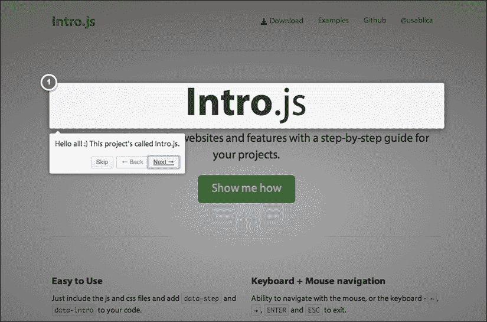

为了在填写大型表单时提高用户的知识并加快这一过程，最好给他们提供更多相关信息。IntroJs 是一个库，允许开发者将网站划分为高亮部分，以帮助客户和用户更好地使用网站。通过使用这个库，他们可以创建逐步介绍来展示网站的功能，并告知用户关于新更改的信息。

## 用途

IntroJs 可用于多种情况，以使事物易于理解并对观众有用。IntroJs 主要用于以下方面：

+   向用户介绍部分

+   创建逐步介绍

+   创建多页介绍

+   向用户展示新更新和更改

IntroJs 是使用 JavaScript 和 CSS3 开发和设计的。要使用 IntroJs，需要在页面中包含 JavaScript 和 CSS 文件，并调用 IntroJs 方法。IntroJs 与其他库之间没有依赖关系，页面上也不需要使用任何其他库。

## 特性

IntroJs 是一个轻量级、开源且易于使用的库，拥有活跃的用户和开发者社区。以下是一些显著特性：

+   小巧（4 KB JavaScript 和 2 KB CSS）

+   易于使用

+   纯 JavaScript 和 CSS

+   无需依赖其他库

+   兼容移动和平板电脑设备

+   兼容旧版浏览器

+   免费且开源

+   MIT 许可证

# 安装

在本节中，我们将涵盖以下要点：

+   IntroJs 的要求是什么？

+   如何下载？

+   如何安装？

IntroJs 是一个客户端库，这意味着所有常规和事件都在客户端环境中管理和执行。所有安装和运行步骤都与客户端部分相关，无需在服务器上安装。

安装和运行 IntroJs 有四个简单的步骤。

## 第 1 步 – 要求

如前所述，要运行 IntroJs，无需在服务器上安装任何东西，所有工作都在客户端；您只需要一个网络浏览器。

要运行 IntroJs，您需要以下之一的网络浏览器：

+   IE 8 或更高版本

+   Firefox 20 或更高版本

+   Google Chrome 26 或更高版本

+   Safari 5.1 或更高版本

+   Opera 12.1 或更高版本

对于移动或平板电脑浏览器也有一些要求：

+   iOS Safari 3.2 或更高版本

+   Opera Mini 5.0-0.7 或更高版本

+   Android 浏览器 2.1 或更高版本

+   BlackBerry 浏览器 7.0 或更高版本

## 第 2 步 – 下载 JavaScript 和 CSS

要安装和运行 IntroJs，请下载最新版本。每个版本的必要文件应分别整理在单独的文件夹中。

IntroJs 的 GitHub 页面是下载最新版本的简单且最便捷的方式，该版本可在 [`github.com/usablica/intro.js/tags`](https://github.com/usablica/intro.js/tags) 找到。

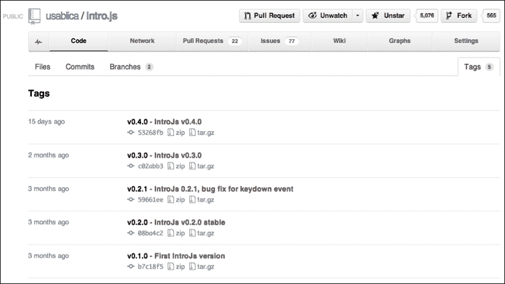

如截图所示，所有版本都提供在 `.zip` 和 `tar.gz` 格式下。下载最新版本。在撰写本书时，可用的最新版本是 0.4.0。

此外，还有一个不稳定版本可在 [`github.com/usablica/intro.js/archive/master.zip`](https://github.com/usablica/intro.js/archive/master.zip) 获取。

注意，正在开发中的版本可能存在一些问题或错误。它仅用于介绍库中的最新功能、更新和更改；对于生产环境来说，它可能没有用。

下载后，提取压缩文件。它通常包括以下文件和目录：

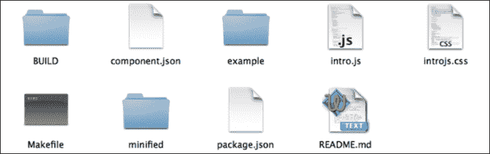

以下是对其中一些的解释：

+   `BUILD` 文件夹用于构建和制作生产文件

+   `example` 文件夹包含了一些使用 IntroJs 的示例

+   `minified` 文件夹包含生产过程中需要的压缩文件

+   `intro.js` 和 `introjs.css` 文件是库的主要文件，适用于开发或修复错误（它们不建议用于生产；用于生产目的，请使用压缩文件）。

+   此外，`component.json` 和 `package.json` 是用于配置目的的包管理工具

## 第 3 步 – 配置

IntroJs 可以通过执行以下步骤在任何 HTML 页面上运行。

`intro.min.js` 和 `intro.min.css` 文件是安装时在压缩文件夹中可用的两个主要文件。这两个文件是为生产环境制作的。它们以压缩模式提供，并且从中移除了所有额外的注释和描述。

调用 IntroJs 文件有两种方法。然而，可以使用任何一种方法，但要实现更高的速度和准确性，第二种方法已被采用。

### 使用 <script> 标签

要使用 `<script>` 标签，请在 HTML 文档中包含以下 JavaScript 和 CSS 文件：

```js
  <!-- Add IntroJs -->
  <script type="text/javascript"src="img/intro.min.js"></script>
  <!-- Add IntroJs styles -->
  <linkhref="introjs.min.css"rel="stylesheet">
```

### AMD 和 CommonJs

IntroJs 的另一个有用特性是它与 AMD 和 CommonJs 模式的兼容性。可以使用这些模式调用 JavaScript 和 CSS 文件，而且不需要使用 `<script>` 标签。通过使用这种方式，可以异步调用 JavaScript 和 CSS 文件。

这种方法提高了文档的加载速度，同时，在加载时网页不会被阻塞。如前所述，这种方法已被推荐代替其他方法。

```js
require(["intro"], function(introJs) {
    //This function is called when intro.js is loaded.
    //Hence, you can write `introJs().start();` here
});
```

这段代码是使用 RequireJs 库编写的。通过使用这种方法，IntroJs 程序的作用域或闭包将被确定。此外，加载文件的请求将以异步方式发送，它不会等待调用流程完成。此外，它还提高了加载速度。

要使用此功能，您需要在您的页面上包含以下库之一：

+   RequireJs

+   curl

+   LSJS

+   Dojo 1.7 或更高版本

此外，通过使用这种方法，还可以调用 `introjs.css`。然而，由于这种方法在不同浏览器中可能引起的问题，不推荐使用，并且 `<link>` 标签已被优先考虑用于调用 CSS 文件。

## 就这样

到目前为止，你应该已经安装了 IntroJs；你现在可以自由地探索并了解更多关于它的信息。

# 快速开始

在本节中，我们将讨论以下主题：

+   设置

+   创建一个新的示例

你需要使用 IntroJs 创建一个介绍页面吗？本节将解释完成此操作的简单两步。

## 步骤 1 – 定义元素

元素可以用以下两种方法定义：

+   使用元素属性

+   使用 JavaScript 对象（JSON）

### 使用元素属性

采用这种方法，你可以轻松设置和定义你的第一个介绍。为了通过属性设置介绍，将一些希望成为故事一部分的自定义属性添加到元素中。`data-intro` 和 `data-step` 属性使得向高亮元素添加一些文本或标题或更改工具提示的位置成为可能。为了实现这些，请执行本节中概述的步骤。

#### data-intro 属性

对于每个介绍步骤，都可以有一个工具提示，向用户简要介绍相关信息。当元素被高亮时，`data-intro` 属性定义了工具提示文本，例如：

```js
<a href='http://google.com/' data-intro='Hello step one!'>I'm a link</a>
```

上述示例生成了 `Hello step one!` 工具提示文本。

#### data-step 属性

`data-step` 属性通过在介绍中的每个步骤设置一个数字来设置每个步骤的优先级，例如：

```js
<a href='http://google.com/' data-intro='Hello step one!' data-step='1'>Link One</a>
<a href='http://yahoo.com/' data-intro='Hello step two!' data-step='2'>Link Two</a>
```

在这个例子中，介绍中有两个元素，它们有不同的优先级或 `data-step` 属性。当介绍开始时，首先高亮的是 `Link One` 的值，而不是 `Link Two` 的值，因为 `data-step` 的优先级更高。此外，在添加具有不同 `data-step` 属性的其他元素后，也可以更改优先级。

#### data-position 属性

`data-position` 属性使得设置工具提示框的位置成为可能。然而，这是一个可选属性，但它让我们能够设置工具提示框的正确位置。默认情况下，工具提示框的位置被设置为高亮元素底部。然而，可以通过 `data-position` 属性来更改它。`data-position` 属性可以取 `top`、`bottom`、`left` 或 `right` 值，例如：

```js
<a href='http://google.com/' data-intro='Hello step one!' data-step='1' data-position='right'>Link One</a>
```

上述示例生成了 `Hello step one!` 工具提示文本，并且工具提示框将出现在右侧。

### 使用 JavaScript 对象（JSON）

JavaScript 对象或 JSON 是定义介绍的另一种方式。这种方法与元素属性之间没有区别。然而，它是一种清晰的方式来程序化生成介绍。

IntroJs 有一个名为 `setOptions` 的方法，它赋予我们设置库中一些选项的能力。这些选项之一是 `steps` 属性，它以数组的形式包含介绍的所有步骤。

首先，创建一个 `introJS` 的实例。然后，调用 `setOptions`（或 `setOption`）来设置所有步骤。现在，我们只需要创建介绍中步骤的数组。每个步骤及其所有属性都包含一个对象，该对象包括以下属性：

+   `element`: 这定义了介绍的目标元素，是一个 CSS 选择器

+   `intro`: 这包括工具提示框的文本

+   `step`: 这包括一个数字来设置每个步骤的优先级

+   `position` : 这代表工具提示框的位置，可以是 `top`、`bottom`、`right` 或 `left`

以下代码是一个步骤的示例：

```js
{
    element:'#step2',
    intro:"Ok, wasn't that fun?",
    position:'right'
}
```

所有步骤的完整示例如下：

```js
var intro =introJs();
          intro.setOptions({
            steps: [
            {
              element:'#step1',
              intro:"This is a tooltip."
            },
            {
              element:'#step2',
              intro:"Ok, wasn't that fun?",
              position:'right'
            },
            {
              element:'#step3',
              intro:'More features, more fun.',
              position:'left'
            }
          ]
});
```

在前面的示例中，我们创建了一个 `introJS` 的实例并定义了介绍的三个步骤。

## 步骤 2 – 调用 start() 方法

我们几乎完成了！从 `introJS` 实例调用 `start()` 方法是创建介绍的最终步骤。

IntroJs 有一个构造函数，它创建库中的一个实例并将其所有选项设置到该实例中。构造函数可以接受一个参数，该参数定义了介绍的农场，例如，为整个页面或特定元素或容器运行介绍。

下面是一个整个页面的示例：

```js
var instance = introJs(); //without selector, start introduction for whole page
```

下面是一个特定容器的示例：

```js
var instance = introJs("#intro-farm"); //start introduction for element id='intro-farm'
```

在前面的示例中，我们创建了 `introJS` 的两个实例，第一个没有指定元素，第二个有 `#intro-farm`。现在我们有一个 `introJS` 的实例，我们只需要调用 `start()` 方法。

```js
instance.start();
```

在调用 `start()` 方法后，介绍开始。要使用 JavaScript 对象定义步骤，我们首先需要调用 `setOptions()`，然后调用 `start()` 方法。

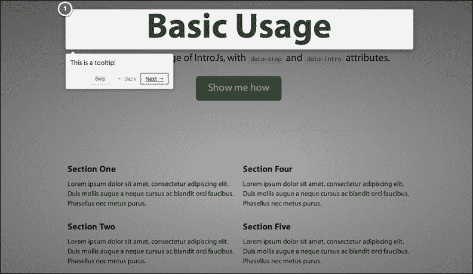

### Hello World

好的，现在让我们使用 IntroJs 的基本功能创建我们的第一个介绍。首先，创建你的 `hello-world.html` 文件如下：

```js
<!DOCTYPE html>
<html lang="en">
<head>
<meta charset="utf-8">
<title>IntroJS-Hello World</title>
<!-- Add IntroJs styles -->
<link href="introjs.css" rel="stylesheet">
</head>
<body>
<div>
<h1 >Basic Usage</span></h1>
<p class="lead" data-step="4" data-intro="Another step.">This is the basic
usage of IntroJs, with <code>data-step</code> and <code>data-intro</code> attributes.
</p>
<a class="btnbtn-large btn-success" href="javascript:void(0);" onclick="javascript:introJs().start();">Start</a>
</div>
<div>
<div>
<h4 data-step="1" data-intro="This is a tooltip!">Section One</h4>
<p>Loremipsum dolor sitamet, consecteturadipiscingelit. Duismollisaugue a nequecursus ac blanditorcifaucibus.Phasellusnecmetuspurus.</p>
<h4 data-step="2" data-intro="This is a tooltip!">Section Two</h4>
<p>Loremipsum dolor sitamet, consecteturadipiscingelit. Duismollisaugue a nequecursus ac blanditorcifaucibus.Phasellusnecmetuspurus.</p>
<h4 data-step="3" data-intro="This is a tooltip!">Section Three</h4>
<p>Loremipsum dolor sitamet, consecteturadipiscingelit. Duismollisaugue a nequecursus ac blanditorcifaucibus.Phasellusnecmetuspurus.</p>
</div>
</div>
</div>
<script type="text/javascript" src="img/intro.js"></script>
</body>
</html>
```

在浏览器中打开 `hello-world.html`。这是使用 IntroJs 库的第一个介绍。

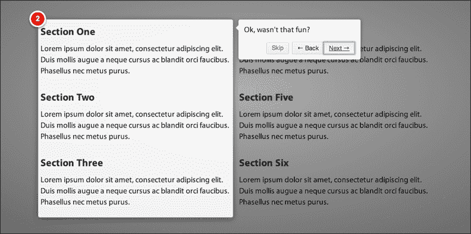

### 它是如何工作的

你已经创建了第一个介绍；它既简单又容易。首先，在页面上包含 JavaScript 和 CSS 文件。然后，向代码中添加三个带有 `data-step` 属性的 `<h4>` 元素。最后，在 `<a>` 标签的 `onClick` 事件中调用 IntroJs 的 `start()` 函数。

IntroJs 的其他功能将在下一节中讨论。

# 你需要知道的 Top 7 个功能

IntroJs 拥有一个强大且完整的 API，它赋予你使用你喜欢的设置来自定义和更改库的能力。

在本节中，将讨论以下主题：

+   选项

+   API

+   自定义 CSS 文件

+   将 IntroJs 集成到其他框架中

+   本地化和从右到左版本

+   构建

+   多页

您已经学习了 IntroJs 的基本功能。在本节中，将涵盖所有库功能。此外，还将讨论如何将 IntroJs 样式定制为开发者所期望的样式。稍后，将回顾如何为不同语言本地化库，最后，通过一些示例，您将学习如何将 IntroJs 与其他框架集成。

## 选项

IntroJs 中有一些默认选项可用于配置库，例如工具提示框中的**下一步**、**上一步**和**完成**按钮标签或工具提示的默认位置。

在本节中，将提供 IntroJs 的所有选项，在接下来的章节中，将介绍一些其他方法来更改这些选项并设置首选值。

### 步骤

要使用 JSON 配置手动定义步骤，`steps` 属性非常有用。在**快速入门**部分，我们讨论了此选项，它具有 JavaScript 对象（JSON）类型。

### nextLabel

`next` `Label` 选项包含要显示在**下一步**按钮工具提示框中的文本。此选项的类型为 `string`，默认值为**下一步** **→**。

### prevLabel

`prevLabel` 选项保存要显示在**上一步**按钮工具提示框中的文本。其类型为 `string`，默认值为**←** **上一步**。

### skipLabel

`skipLa` `bel` 选项用于设置工具提示框中**跳过**按钮的文本。此选项的类型为 `string`，默认值为**跳过**。

### doneLabel

`doneLa` `bel` 选项包含工具提示框中**完成**按钮的文本。当用户达到介绍的最后一步时，此按钮将出现。此外，其类型为 `string`，默认值为**完成**。

### tooltipPosition

`tooltipPosition` 选项用于保存介绍中工具提示框的默认位置。此选项的默认值为 `bottom`，意味着所有工具提示框都将出现在介绍中高亮区域的底部。此外，此选项的可能值还包括 `top`、`bottom`、`right` 和 `left`。

### exitOnEsc

`exitOn` `Esc` 选项是一个 `true` 或 `false` 选项，用于定义用户是否可以通过使用 *Esc* 键退出介绍。此选项的类型为 `boolean`，可能的值为 `true` 和 `false`，默认设置为 `true`。将其设置为 `false`，则 *Esc* 将被禁用。

### exitOnOverlayClick

`exitOnOverlayClick` 选项是一个 `true` 或 `false` 选项，用于定义用户是否可以通过单击介绍中的覆盖层（介绍中的深色背景）来退出介绍。此选项的类型为 `boolean`，可能的值为 `true` 或 `false`，默认设置为 `true`。

### showStepNumbers

`showStepNumbers`选项是另一个`true`或`false`选项。将其设置为`true`，则每个步骤的数字将显示在突出区域的右上角。其可能的值是`true`或`false`，默认值是`true`。

## API

IntroJs 包括允许用户控制和管理介绍执行的功能。例如，可以在执行过程中对意外事件做出决定，或根据用户交互更改介绍流程。稍后，本书编写时 IntroJs 中所有可用的 API 都将被解释。然而，这些功能将在未来扩展和发展。IntroJs 包括以下 API 函数：

+   `start`

+   `goToStep`

+   `exit`

+   `setOption`

+   `setOptions`

+   `oncomplete`

+   `onexit`

+   `onchange`

+   `onbeforechange`

### introJs.start()

如前所述，`introJs.start()`是 IntroJs 的主要函数，允许用户为指定的元素启动介绍并获取`introJS`类的实例。介绍将从指定元素的第一步开始。

此函数没有参数，同时也返回`introJS`类的实例。

### introJs.goToStep(stepNo)

使用此函数跳转到介绍的特定步骤。很明显，介绍总是从第一步开始；然而，可以通过使用此函数更改配置。`goToStep`函数有一个整数参数，接受介绍中步骤的编号。

```js
introJs().goToStep(2).start(); //starts introduction from step 2
```

如示例所示，首先，通过使用`goToStep`函数将默认配置从`1`更改为`2`，然后调用`start()`函数。因此，介绍将从第二步开始。

最后，此函数将返回`introJS`类的实例。

### introJs.exit()

`introJS.exit()`函数允许用户退出并关闭正在运行的介绍。默认情况下，当用户点击**完成**按钮或到达介绍的最后一个步骤时，介绍结束。

```js
introJs().exit()
```

如所示，`exit()`函数没有参数，并返回`introJS`类的实例。

### introJs.setOption(option, value)

如前所述，IntroJs 有一些默认选项，可以通过使用`setOption`方法进行更改。此函数有两个参数。第一个参数用于指定选项名称，第二个参数用于设置值。

```js
introJs().setOption("nextLabel", "Go Next");
```

在前面的示例中，`nextLabel`设置为`Go Next`。此外，还可以通过使用`setOption`方法更改其他选项。

### introJs.setOptions(options)

可以使用`setOption`方法更改选项。但是，要一次性更改多个选项，可以使用`setOptions`。`setOptions`方法接受 JSON 格式的不同选项和值。

```js
introJs().setOptions({ skipLabel: "Exit", tooltipPosition: "right" });
```

在前面的示例中，通过使用 JSON 和`setOptions`方法同时设置了两个选项。

### introJs.oncomplete(providedCallback)

当介绍结束时，会触发`oncomplete`事件。如果传递了一个`oncomplete`方法，库会在介绍结束后调用它。

```js
introJs().oncomplete(function() {
  alert("end of introduction");
});
```

在这个例子中，介绍结束后，传递给`oncomplete`方法的匿名函数将被调用，并显示**介绍结束**的消息。

### introJs.onexit(providedCallback)

如前所述，用户可以使用*Esc*键或点击介绍中的暗区来退出正在运行的介绍。`onexit`事件会在用户退出介绍时被通知。这个函数接受一个参数并返回正在运行的`introJS`实例。

```js
introJs().onexit(function() {
  alert("exit of introduction");
});
```

在前面的例子中，我们向`onexit`方法传递了一个带有`alert()`语句的匿名函数。如果用户退出介绍，匿名函数将被调用，并显示带有消息**介绍退出**的警告框。

### introJs.onchange(providedCallback)

在介绍步骤的每一步都会触发`onchange`事件。这个方法在通知每一步介绍完成时很有用。

```js
introJs().onchange(function(targetElement) {
  alert("new step");
});
```

你可以为匿名函数定义一个参数（如前例中的`targetElement`），当函数被调用时，你可以使用该参数访问介绍中当前突出显示的目标元素。在前面的例子中，当每个介绍步骤结束时，会弹出一个带有**新步骤**消息的警告框。

### introJs.onbeforechange(providedCallback)

有时候，你可能需要在介绍步骤的每一步之前做一些事情。考虑一下，在用户进入介绍步骤之前，你可能需要执行一个 Ajax 调用；你可以通过`onbeforechange`事件来实现这一点。

```js
introJs().onbeforechange(function(targetElement) {  alert("before new step");});
```

我们也可以为匿名函数定义一个参数（如前例中的`targetElement`），当这个函数被调用时，该参数会获取关于当前突出显示的介绍元素的一些信息。因此，使用该参数，你可以知道将要突出显示的介绍步骤是哪一个，或者目标元素的类型，等等。

在前面的例子中，在突出显示介绍步骤之前，会弹出一个带有消息**before new step**的警告框。

## 方法链式调用

**方法链式调用**是 IntroJs 最有用的特性之一。这种方法会连续调用函数。

假设你需要调用两个或三个方法来完成一个动作。例如，设置一个选项，设置一个回调事件，然后调用`start()`方法开始介绍。有两种不同的方法可以实现这个目标。首先，创建类的实例并将其保存在一个变量中，然后使用该变量调用其他函数。其次，使用方法链式调用。在 IntroJs 中，你可以像链一样一个接一个地调用函数。

在这里，你可以看到类和函数的传统用法：

```js
//first of all, create an instance of IntroJs and hold it in a variable
varmyIntro = introJs();

//change skipLabel and tooltipPosition
myIntro.setOptions({ skipLabel: "Exit", tooltipPosition: "right" });

//set function to call in onchange
myIntro.onchange(function(targetElement) {  alert("new step");});

//set funtion to call in onexit
myIntro.onexit(function() {alert("exit of introduction");});

//finally start the introduction
myIntro.start();
```

这包含了很多行代码，使得它变得过于复杂。按照以下代码片段所示进行更改会更好：

```js
introJs.setOptions({ skipLabel: "Exit", tooltipPosition: "right" })
.onchange(function(targetElement) {
  alert("new step");
  })
.onexit(function() {
alert("exit of introduction");
})
.start();
```

如前代码片段所示，我们一个接一个地调用了每个函数。实际上，IntroJs 的所有函数都返回一个`introJS`实例；因此，您不需要在单独的变量中保留实例然后使用它。

### 注意

要了解更多关于方法链的信息，请使用以下链接：[`en.wikipedia.org/wiki/Method_chaining`](http://en.wikipedia.org/wiki/Method_chaining)。

## 将 IntroJs 与其他框架集成

我们可以将服务器端框架与 IntroJs 集成。这有助于在您的服务器端代码中使用 IntroJs，并提供对 IntroJs 例程的更多控制。

已经为许多流行的知名框架完成了与 IntroJs 的集成。在本节中，我们将讨论此主题，并提供一些关于 IntroJs 与其他框架使用的额外描述。

### Ruby on Rails

Ruby on Rails 是开发 Web 应用程序中最受欢迎的框架之一。许多开发者都在使用它，并且很容易在 Rails 中使用 IntroJs。

#### 安装

在 Rails 框架中安装 IntroJs 有几个简单的步骤。首先，使用以下命令安装 IntroJs 包：

```js
gem install introjs-rails

```

您将看到以下输出：

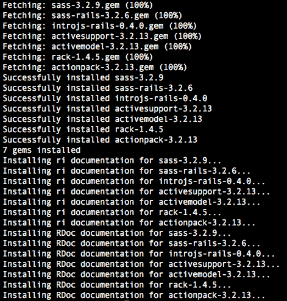

完成此任务的另一种方法是向您的 Gem 文件添加`introjs-rails`包，并使用`bundle install`命令安装该包。您可以在[`rubygems.org/gems/introjs-rails`](https://rubygems.org/gems/introjs-rails)找到 IntroJs Gem 包。

完成安装步骤后，将相关文件添加到您的 Rails 项目中。最后，将 IntroJs 资源添加到代码中。

在`app/assets/javascript/application.js`中添加此行：

```js
//=require introjs
```

此外，在`app/assets/stylesheets/application.css`中添加此行：

```js
*=require introjs
```

现在一切准备就绪，可以使用 IntroJs 库。我们之前提到的所有 IntroJs 功能都可以在您的 Rails 项目中访问。此外，在发布库的新版本后，还可以更新 IntroJs。

### Yii 框架

Yii 是 PHP 中最好的框架之一。如果您使用这个框架，可以轻松地使用 Yii 和 IntroJs 的集成优势。

#### 安装

首先，前往 GitHub 上的`Yii-IntroJS`页面([`github.com/moein7tl/Yii-IntroJS`](https://github.com/moein7tl/Yii-IntroJS))。

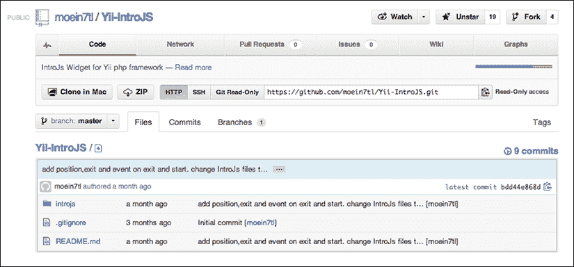

要下载压缩文件，请使用以下链接：[`github.com/moein7tl/Yii-IntroJS/archive/master.zip`](https://github.com/moein7tl/Yii-IntroJS/archive/master.zip)。

`.zip`文件包含`introjs`目录，应将其复制到受保护路径。现在，一切准备就绪，可以开始使用了。

#### 使用方法

要使用 IntroJs，请在 Yii 项目中使用小部件命令访问`application.extentions.introjs.IntroJs`。这个小部件获取一个数组，即所有介绍步骤，并自动生成介绍客户端代码。

```js
$this->widget('application.extensions.introjs.IntroJs',array(
    'data'=>array(
        array('id'=>'introID1','step'=>1,'intro'=>'Hello World!','position'=>'right'),
        array('id'=>'IntroID2','step'=>2,'intro'=>'Step two'),
        /* all step and data should be defined here*/
        array('id'=>'introIDStart','start'=>true,'event'=>'onclick'), // define one element as starter,default event is onclick
        array('id'=>'introIDExit','exit'=>true,'event'=>'onclick'), // you can define elements to exit before ending IntroJs,default event is onclick
    )
));
```

在这个示例中，我们已定义了两个介绍步骤，包括`Hello World`，以及它们的 ID 为`introID1`和`introID2`。

在每个步骤中，可以定义四个标识符：

+   `id`: 这定义了每个步骤的标识

+   `step`: 这定义了每个步骤的顺序

+   `intro`: 这定义了每个步骤的工具提示文本

+   `position`: 这决定了工具提示的位置。它可以是顶部、右侧、底部或左侧

此外，此示例将定义两个元素以开始和结束介绍；例如，它将指定一个链接，当点击时，开始或停止介绍。

通过将`start`参数的值设置为`true`，可以启动自定义元素并为其确定一个事件；例如，事件可以是`onclick`。

```js
array('id'=>'introIDStart','start'=>true,'event'=>'onclick'), // define one element as starter,default event is onclick
```

此外，通过将`exit`参数设置为`true`，可以确定`exit`元素，例如：

```js
array('id'=>'introIDExit','exit'=>true,'event'=>'onclick'), // you can define elements to exit before ending IntroJs,default event is onclickStyle Customization
```

默认情况下，IntroJs 有一个简单的样式，可以使它与您的网站设计达到很好的和谐。

在本节中，将解释 IntroJs 样式，并学习更改 IntroJs 元素样式和外观的方法。

要更改 IntroJs 样式，应更改五个主要项目。它们如下：

+   覆盖层

+   工具提示

+   按钮

+   数字

+   高亮区域

IntroJs 有一个名为`introjs.css`的样式表，在之前已下载。要更改您的介绍样式，创建一个新的 CSS 文件，并按您想要的覆盖`introjs.css`类。之后，将您的 CSS 文件包含在页面中的主 CSS 文件之后，如下例所示：

```js
<!-- Add IntroJs styles -->
<link href="introjs.css" rel="stylesheet">
<!-- Here you should add your own style -->
<link href="mystyle.css" rel="stylesheet">
```

### 覆盖层

打开`introjs.css`文件时，第一个可用的类是`introjs-overlay`，它包含所有覆盖属性。您可以在自己的 CSS 文件中覆盖属性并更改覆盖外观。

### 工具提示

这是`introjs.css`中的另一个重要类`introjs-tooltip`，它包含所有介绍工具提示的属性。例如，要将工具提示的颜色更改为红色，请将以下代码添加到 CSS 文件中：

```js
.introjs-tooltip {
    background-color: red;
}
```

### 按钮

还可以通过覆盖几个类来更改按钮的样式。

#### introjs-tooltipbuttons

`introjs-tooltipbuttons`是一个用于`div`元素的类，它是`buttons`容器。例如，要将按钮的对齐方式更改为右侧，请将以下代码添加到 CSS 文件中：

```js
.introjs-tooltipbuttons {
    text-align: left;
}
```

#### introjs-button

`introjs-button`类包含所有按钮的外观属性。以下示例显示了如何在 CSS 文件中更改其中的一些：

```js
.introjs-button {
    text-shadow: 1px 1px 0 #fff;
    color: #333;
    background-color: #ececec;
    background-image: -webkit-gradient(linear, 0 0, 0 100%, from(#f4f4f4), to(#ececec));
    background-image: -moz-linear-gradient(#f4f4f4, #ececec);
    background-image: -o-linear-gradient(#f4f4f4, #ececec);
    background-image: linear-gradient(#f4f4f4, #ececec);
}
.introjs-button {
    text-shadow: 1px 1px 0 #fff;
    font: 11px/normal sans-serif;
    color: #333;
    background-image: linear-gradient(#f4f4f4, #ececec);
}
```

#### introjs-prevbutton

此类用于**上一步**按钮。

#### introjs-nextbutton

此类用于**下一步**按钮。

#### introjs-skipbutton

此类用于**跳过**按钮。

### 数字

要更改步骤数字的 CSS 属性样式，这些属性位于`introjs-helperNumberLayer`类中，请在 CSS 文件中覆盖此类。

### 高亮区域

要更改高亮区域样式，覆盖`introjs-helperLayerclass`。

## 本地化和从右到左版本

IntroJs 为开发者提供了许多功能和选项，以便更改和自定义库以适应他们使用的语言。在 IntroJs 中，一些按钮和标签作为选项可用，并且可以使用 IntroJs API 和方法进行更改。

### 更改按钮标签

IntroJs 有四个按钮用于各种情况，这些按钮位于工具提示框中。所有这些选项都可以通过`setOption`或`setOptions`方法进行更改。

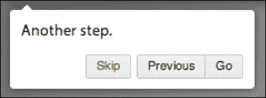

为了更改这些按钮并设置首选文本，请更改以下选项：

+   `nextLabel`：此选项用于更改**下一页**按钮的标签

+   `prevLabel`：此选项用于更改**上一页**按钮的标签

+   `skipLabel`：此选项用于更改**跳过**按钮的标签

+   `doneLabel`：此选项用于更改**完成**按钮的标签

所有的上述选项都可以通过`setOption`方法进行更改。以下是一个使用此函数的示例：

```js
introJs().setOption("skipLabel", "Exit");
```

在前面的示例中，我们将**跳过**按钮的标签从**跳过**更改为`退出`。使用相同的方法，更改所有按钮的标签。

如果你需要一次性更改两个或更多按钮的标签，请使用`setOptions`方法。以下是一个`setOptions`方法的示例：

```js
introJs().setOptions({ nextLabel: 'Go', prevLabel: 'Previous' });
```

### 提示

**下载示例代码**

你可以从你购买的所有 Packt 书籍的账户中下载你购买的所有示例代码文件。[`www.packtpub.com`](http://www.packtpub.com)。如果你在其他地方购买了这本书，你可以访问[`www.packtpub.com/support`](http://www.packtpub.com/support)并注册，以便将文件直接通过电子邮件发送给你。

在前面的示例中，我们使用一个函数调用将**下一页**和**上一页**按钮的标签更改为`Go`和`Previous`。最终结果应该是这样的：

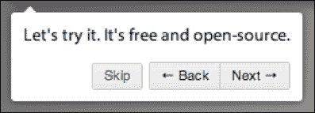

### RTL

IntroJs 最初发布的是**从左到右**版本，但它可以更新到**从右到左**样式表。IntroJs 有一个**RTL**样式表，可以更改介绍为从右到左，并且使用此样式表非常简单。

要使用 RTL 版本，请在主 IntroJs 样式表之后将`introjs-rtl.css`添加到页面中。请确保在主 IntroJs 样式表之后使用 RTL 样式表。

```js
<!-- Add IntroJs styles -->
<link href="introjs.css" rel="stylesheet">
<!-- Add IntroJs RTL styles -->
<link href="introjs-rtl.css" rel="stylesheet">
```

在前面的示例中更改页面后，所有内容都应该是 RTL，例如工具提示框和按钮。以下是一个波斯语 RTL 版本的示例：

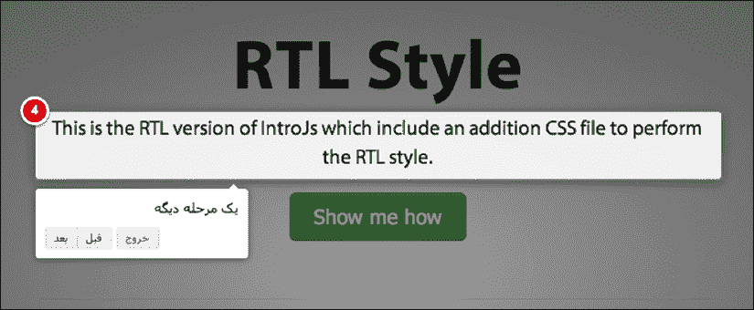

### 构建项目

有时开发者需要更改、开发和定制 IntroJs 以满足他们的使用需求。为了开发和定制 IntroJs，请使用开发文件（`intro.js`和`introjs.css`文件），在更改后，为生产使用准备文件。可以在生产环境中使用开发文件。你所需要做的就是压缩它们并删除冗余的注释和空白。

生产环境是用户所在的地方，也是最终发布版本。用户不喜欢浪费时间下载文件。因此，尽可能减小文件大小。

使用 IntroJs 从开发文件创建生产代码非常简单；你只需要在你的命令工具应用程序中运行一行命令。然后，`MakeFile`将负责准备和创建生产文件。然而，在运行命令之前，你需要准备你的工作空间。

### 准备就绪

IntroJs 的`MakeFile`与 NodeJs 兼容，因此在做任何事情之前，如果你没有 NodeJs，请安装它。你可以使用以下链接下载 NodeJs：[`nodejs.org`](http://nodejs.org)；选择你的操作系统并下载安装文件。下载后，运行并安装 NodeJs。现在，你应该在你的系统中有了 NPM 包管理器。为了确保安装正确完成，打开命令提示符，输入`npm`命令，并按*Enter*键。**节点包管理器**（**NPM**）手册将出现。

现在，一切准备就绪，可以继续进行。打开命令提示符和 IntroJs 文件夹，该文件夹包含如下截图所示的文件：

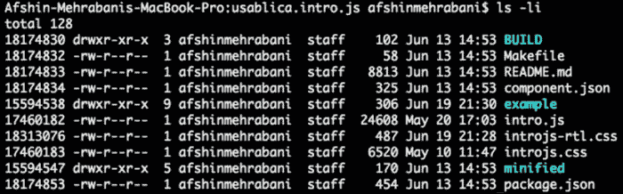

安装其他依赖项以压缩 CSS 和 JavaScript 文件。在命令提示符中，输入`npm`安装命令并按*Enter*键；片刻后，结果应如以下截图所示：

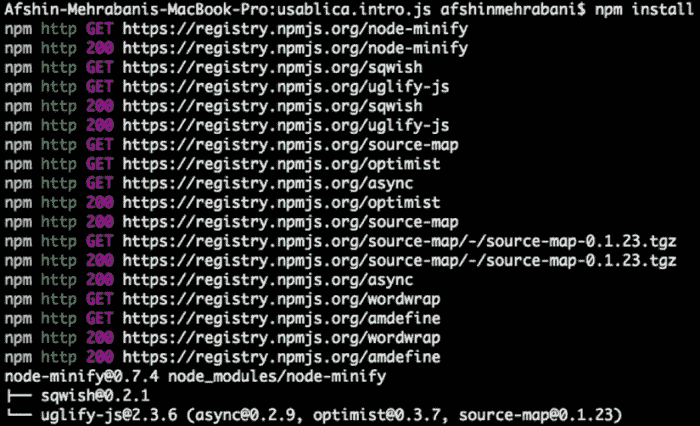

如前截图所示，所有依赖项都自动安装。

### make build

运行命令行工具来创建生产代码片段。为此，前往 IntroJs 的文件夹并运行`make build`命令。运行命令后，会出现如下截图所示的结果：

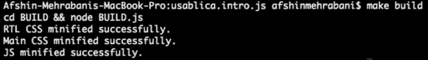

如果应用程序显示成功消息，这意味着你已经有了生产就绪的文件。所有生产文件都存储在 IntroJs 文件夹内的`minified`文件夹中。以下是一个`minified`文件夹的示例：

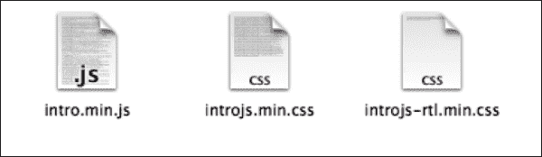

此外，生产就绪的文件在其文件名中具有`.min`后缀，这意味着它们已被压缩。现在这些文件以尽可能小的尺寸准备好用于生产。

## 事件和回调函数

IntroJs 最重要的部分之一是其事件和回调函数。IntroJs 提供了各种事件，可以完全控制介绍过程的每一个部分。例如，可以在介绍结束时显示一条消息。这些事件将在 IntroJs 的后续版本中得到改进。

在本节中，我们将解释 IntroJs 0.4.0（撰写本书时的最后一个稳定版本）中的一些可用事件。

### oncomplete

当所有介绍步骤都已通过且用户达到最后一步时，`oncomplete`事件会发生。用户在按下**完成**按钮或右箭头键时可以访问此事件。

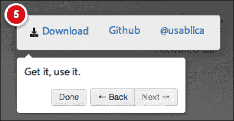

```js
introJs().oncomplete(function() {
alert("end of introduction");
});
```

此事件不会将任何参数传递给您的回调函数。在回调函数中，`this`指向当前的`introJS`实例。

在前一个示例中，介绍结束后，将出现**介绍结束**消息。

### onexit

`onexit`事件在用户退出介绍后发生，这意味着用户可以通过按*Esc*按钮或点击工具提示上的**跳过**按钮来退出整个事件，在介绍完成之前。


```js
introJs().onexit(function() {
  alert("exit of introduction");
});
```

回调方法不为此事件获取任何输入参数。正如前一个示例代码所示，导入的事件没有参数。此外，在回调方法中，`this`值指向当前的`introJS`实例。因此，它可以用于控制动作并接收更多关于已启动在页面上的介绍的数据。

在前一个示例中，当用户退出介绍时，将立即出现**退出介绍**消息。

### onchange

在介绍级别的每个变化之后（通过在工具提示面板中点击**下一步**或**上一步**按钮或在键盘上按左右箭头），将发生`onchange`事件。当开发者想在用户进入介绍的一个级别后执行新的动作时，这可能很有用，例如调用 Ajax 文件或向用户显示已读取的数据。

```js
introJs().onchange(function(targetElement) {
  alert("new step");
});
```

在前一个事件中，回调事件接收一个输入参数，该参数包括在介绍过程中运行的元素。

在前一个代码中，用户进入介绍每个级别后，将弹出**新步骤**消息给用户。

### onbeforechange

在进入介绍的新级别之前，发生`onbeforechange`事件（在`onchange`事件之前）。因此，在用户进入介绍的新级别之前执行一个动作是有用的，动作完成后，新的级别将出现。

```js
introJs().onbeforechange(function(targetElement) {  
  alert("before new step");
});
```

在回调事件中，增加了一个参数；这包括介绍放置的元素和高亮区域。此外，在回调事件中，`this`值指向当前的`introJS`类实例。

在前一个示例中，在进入介绍的新级别之前，将弹出**新步骤**消息。

## 多页介绍

在本节中，将解释 IntroJs 的另一个重要且有趣的用法——多页介绍，这将让开发者了解如何创建多页介绍。

您迄今为止创建的所有介绍都只有一个页面。然而，如果您想有一个多页介绍而不是将所有内容都放在一个页面上，那会怎样？如果您想将介绍的前三个步骤放在`index1.html`中，而将其他部分放在`index2.html`中，那会怎样？当然，没有页面数量的限制，您可以按自己的喜好划分介绍。

因此，让我们使用两页来创建一个多页介绍。为了执行此操作，我们将在每一页添加一个代码块。因此，将此代码添加到第一页：

```js
<script type="text/javascript">
document.getElementById('startButton').onclick = function() {
   //change doneLabel to "Next Page" instead of Done
introJs().setOption('doneLabel', 'Next page').start().oncomplete(function() {
   //redirect to next page
window.location.href = 'second.html?multipage=true';
        });
      };
</script>
```

然后在第二页，添加此代码：

```js
<script type="text/javascript">
   //start introJs if multipage parameter is passed on the url
if (RegExp('multipage', 'gi').test(window.location.search)) {
introJs().start();
      }
</script>
```

### 它是如何工作的

如所示，为了使介绍成为多页，已添加了两块代码片段。但它是如何工作的？让我们在本节中详细了解。

#### 更改完成按钮的标签

在第一页上，首先更改**完成**按钮的标签。这会通知用户介绍尚未完成，并将继续到下一页。

#### 将用户重定向到下一页

如前所述，可以使用`oncomplete`事件来通知介绍何时结束。此外，此事件发生在介绍结束时，我们可以在那时做出决定。

要创建多页介绍，我们应该在`oncomplete`中将用户转移到下一页。为此，更改`window.location.href`。请记住，我们将`multipage`设置为查询字符串参数。此参数也将用于第二页。

```js
window.location.href = 'second.html?multipage=true';
```

#### 从第二页开始介绍

在重定向到第二页后，介绍应该继续并从 IntroJs 调用`introjs.start()`方法。`multipage`参数将被设置为`true`。如果存在`multipage`参数，我们调用`introjs.start()`，介绍将继续。

注意介绍步骤。所有页面中`data-step`值的顺序应该是正确的。例如，如果第一页的最后数字是*4*，则第二页的第一个数字应该是*5*。

# 你应该了解的人和地方

在这里，您可以找到有关 IntroJs 最新版本、新闻和更新的好地方。

## IntroJs 官方网站

官方 IntroJs 网站包括下载链接、API 文档、博客和其他有趣的资源。链接如下：[`introjs.com`](http://introjs.com)。

## 博客

这是一个寻找项目最新新闻的好地方。此外，这也是 IntroJs 开发团队发布更新和未来计划的地方。链接如下：[`blog.introjs.com`](http://blog.introjs.com)。

## API 文档

您可以在[`introjs.com/api`](http://introjs.com/api)找到 IntroJs 的完整 API 文档。

## GitHub 仓库

GitHub 是 IntroJs 的代码仓库。您可以在[`github.com/usablica/intro.js/`](https://github.com/usablica/intro.js/)找到下载最新稳定版本的链接。

## 问题跟踪器

人们在这里写下他们的问题、问题和关于不同项目的自己的想法。其他开发团队和贡献者检查这些问题以修复它们。链接如下：[`github.com/usablica/intro.js/issues`](https://github.com/usablica/intro.js/issues)。

## 社区

您可以参考以下地方来讨论 IntroJs。

### Google 群组

一个用于讨论 IntroJs 的群组如下：[`groups.google.com/forum/#!forum/introjs`](https://groups.google.com/forum/#!forum/introjs)。

### Stackoverflow

在 Stackoverflow 上关于 IntroJs 的问题和讨论都集中在这里，并带有`#introjs`标签：[`stackoverflow.com/questions/tagged/intro.js`](http://stackoverflow.com/questions/tagged/intro.js)。

## Twitter 和个人博客

阿夫辛·梅哈拉巴尼（IntroJs 的主要开发者及 Usablica 的联合创始人）的 Twitter 个人资料和博客网址如下：

+   [`twitter.com/afshinmeh`](http://twitter.com/afshinmeh)

+   [`afshinm.name/`](http://afshinm.name/)

埃桑·阿拉斯特赫（IntroJs 多个版本的贡献者及 Usablica 的首席执行官）的 Twitter 个人资料和博客网址如下：

+   [`twitter.com/ehsandotnet`](http://twitter.com/ehsandotnet)

+   [`blog.ehsandotnet.me`](http://blog.ehsandotnet.me)

Usablica（一个团队，旗下有 IntroJs 和其他许多开源项目和初创企业）的 Twitter 个人资料和博客网址如下：

+   [`twitter.com/usablica`](http://twitter.com/usablica)

+   [`usabli.ca/`](http://usabli.ca/)
