# 第一章. 立即开始使用 RaphaelJS

欢迎来到 *立即开始使用 RaphaelJS*。

这本书特别编写，旨在为您提供所有设置 RaphaelJS 所需的信息。您将学习 RaphaelJS 的基础知识，开始构建您的第一个脚本，并了解一些使用 RaphaelJS 的技巧和窍门。

本文档包含以下部分：

*那么什么是 RaphaelJS？* – 了解 RaphaelJS 究竟是什么，您可以用它做什么，以及为什么它如此出色。

*安装* – 学习如何以最少的麻烦下载和安装 RaphaelJS，然后将其设置好，以便您能尽快使用。

*快速入门* – 本节将向您展示如何执行 RaphaelJS 的核心任务之一，即创建形状。按照步骤创建您自己的形状，这将成为您在 RaphaelJS 中大部分工作的基础。

*您需要了解的顶级功能* – 在这里，您将学习如何使用 RaphaelJS 的最重要功能执行五个任务。

*您应该了解的人物和地点* – 每个开源项目都围绕一个社区展开。本节为您提供许多有用的项目页面和论坛链接，以及一些有用的文章、教程、博客和 RaphaelJS 超级贡献者的 Twitter 动态。

# 那么，什么是 RaphaelJS？

RaphaelJS 是一个矢量图形库，用于在浏览器中绘制对象。

在本节中，我们将了解 RaphaelJS 是什么，它与其他类似绘图库有何不同，以及它是如何区别于 **HTML5 Canvas** 的。

## 双头三字母

几乎十年前，我们有一个伟大的技术叫做 **可伸缩矢量图形** (**SVG**)，它是由 **矢量标记语言** (**VML**) 衍生出来的，用于在浏览器上绘制简单到复杂的 2D 图形。SVG 是一个 **万维网联盟** (**W3C**) 规范，并在高级开发者的脑海中徘徊了大约十年。另一方面，VML 是微软的规范，甚至在 SVG 之前就存在了。虽然 SVG 受到 VML 的启发，但它们从未喜欢过彼此，也从未在同一个浏览器上共存。SVG 在所有浏览器上运行，除了 Internet Explorer（IE 9 及以上版本支持 SVG）反之亦然。

双头三字母的头痛。

## 两个问题的结合与 RaphaelJS 的诞生

SVG 是一个美丽的婴儿，但没有人想要经历分娩的痛苦——使用 SVG 和 VML 编码以实现跨浏览器一致性是如此痛苦，以至于大多数开发者只是使用图像。因此，我们有两种不同的技术，它们都做同样的事情，但它们的语法都显著不同，并且从未在同一个浏览器上运行。这看起来像是在让它们和平共存时存在一个问题。

### JavaScript – 奇特的粘合剂

JavaScript 将这两位巨头联系在一起，他们的婚姻孕育出了 RaphaelJS，继承了父母的最佳魅力。它几乎能够适应任何浏览器的领域，并能随着任何开发者的旋律起舞。

解决方案——RaphaelJS。

## 浏览器支持

大多数浏览器支持 SVG，所有从 IE 5.0 开始的 IE 版本都支持 VML。由于 RaphaelJS 是为了充分利用 SVG 和 VML 而开发的，它几乎可以在任何浏览器中运行，这使得它更加可靠。

RaphaelJS——两栖动物

## 什么是 RaphaelJS，什么不是 RaphaelJS？

我们现在知道了 RaphaelJS 是什么——它是 SVG 和 VML 的结合，使用当前浏览器支持的这两种技术中的任何一种，因此它既灵活又可靠。但同样重要的是也要知道 RaphaelJS 不是什么。

### 关于矢量图形和位图图形的简介

就像世界由两种主要状态组成——水和陆地一样，图形也有两种原始类型——矢量图形和位图图形。矢量图形使用几何元素如线条、曲线、椭圆等绘制。各种这样的元素组合在一起形成图形。矢量图形在屏幕上是数学绘制的。它们可以无失真地缩放。另一方面，位图图形是基于像素的，并且不可缩放。矢量图形的主要优势是它们可以缩放，并且也是真实对象，这意味着我们可以摆弄它们并动态地操作它们。以下图表显示了位图（位图）和矢量图形之间的区别：

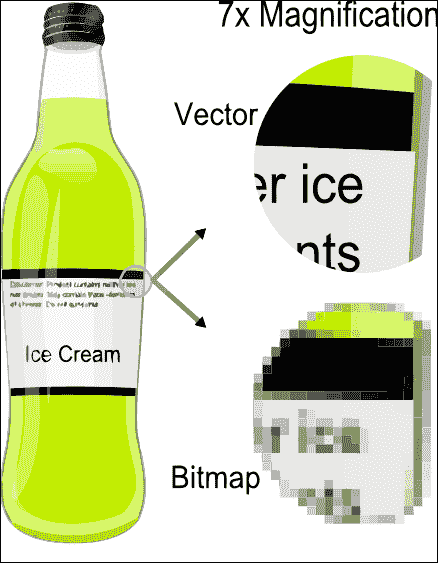

位图（位图）和矢量图形之间的区别

### 作为矢量的 RaphaelJS

RaphaelJS 是一个矢量图形库，因此绘制的图形是真实的 DOM 对象。因此，它们可以在运行时动态访问、操作、调整大小，并且几乎可以锤炼成你想要的任何东西。最好的是，它们可以分配事件，如`click`、`mouseover`、`mouseleave`等。RaphaelJS 的功能令人难以置信。

Raphael 使用矢量图形，而 HTML 5 Canvas 使用位图图形。

## RaphaelJS 使用的 x, y 定位

RaphaelJS 使用 x, y 定位系统进行绘制。屏幕的左上角是 0,0，水平比例是 x 轴，垂直比例是 y 轴。

所以如果代码显示（15,20），那么这意味着这个点将在 x 轴（水平）距离 15 个点，y 轴（垂直）距离 20 个点处。

RaphaelJS 是一个基于矢量图形的库，旨在使在屏幕上绘图更容易。RaphaelJS 使用 SVG 或 VML，取决于当前浏览器支持哪种。使用 RaphaelJS 创建的图形是 DOM 对象，可以动态操作，这使得它们更加灵活，它们也可以分配事件，如`click`、`mouseover`和`mouseleave`。所有这些惊人的特性使得 RaphaelJS 学习和使用起来都令人兴奋。

### 注意

RaphaelJS 和 HTML 5 Canvas 是完全不同的两件事。尽管它们看起来都做类似的事情（绘图），但它们在如何做这件事上有所不同。RaphaelJS 基于矢量图形，而 HTML5 Canvas 基于位图。

# 安装

安装和设置 RaphaelJS 非常简单，就像下载最新的 RaphaelJS 文件并将其包含在 HTML 中一样。

在三个简单步骤中，您可以安装 RaphaelJS 并设置它。

## 第 1 步 – 我需要什么？

在安装 RaphaelJS 之前，您需要检查您是否拥有以下所有必需的元素：

+   网络浏览器

+   文本编辑器

## 第 2 步 – 下载 RaphaelJS

下载 RaphaelJS 的最简单方法是作为压缩的 JS，从[`raw.github.com/DmitryBaranovskiy/raphael/master/raphael-min.js`](https://raw.github.com/DmitryBaranovskiy/raphael/master/raphael-min.js)。

与大多数库不同，RaphaelJS 没有其他依赖项，所以它就是`raphael.js`。

由于 RaphaelJS 是一个 JavaScript 插件，下载链接在浏览器中会显示一个纯 JavaScript 文件。您应该复制文本并将其粘贴到一个名为`raphael.js`的新文件中（或您喜欢的任何名称），并将其保存到您的 JavaScript 目录或服务器上的任何位置。

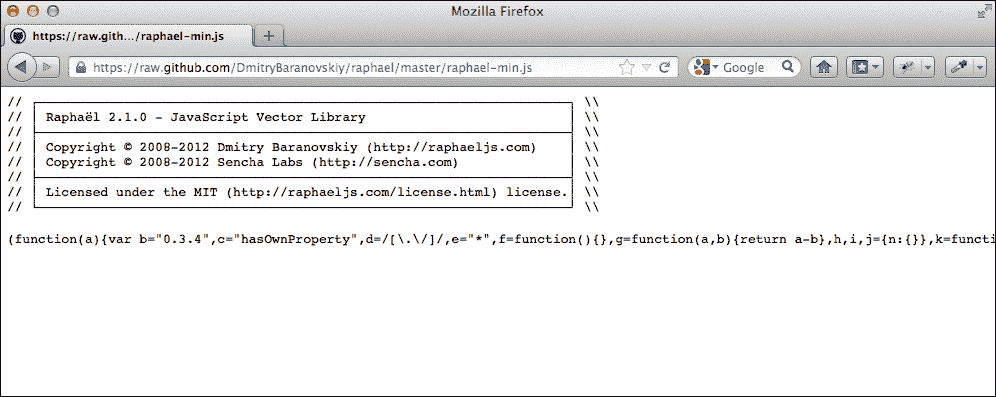

浏览器中显示的 Minified RaphaelJS 代码

## 第 3 步 – 添加到 HTML 中

使用`<script>`标签将其包含在 HTML 页面的底部部分，并将`src`属性指向`raphael.js`文件所在的路径。

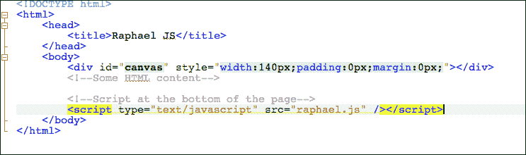

脚本放在底部

### 注意

浏览器以线性方式读取 HTML 代码。如果顶部有脚本标签，浏览器将下载脚本并开始执行它。在这个阶段，浏览器显示一个空白白色屏幕，因为页面的其余部分尚未下载。因此，建议将脚本放在页面底部，这样浏览器将下载所有 HTML 代码，用户在屏幕上会有一些内容，同时 JavaScript 在后台下载。

## 就这样！

到目前为止，您应该已经安装了可工作的 RaphaelJS，可以自由地探索它。

# 快速入门 – 创建您的第一个形状

在这里，我们将通过两个简单的步骤在 Raphael 中创建第一个形状。

## 第 1 步 – 创建绘图画布

初始化 Raphael 对象就像吃香蕉一样简单，有两种吃法。

它可以直接在浏览器视口中（可视区域）创建，也可以在元素中创建。通常建议在元素中创建 Raphael 对象，可能是`Div`标签。重要的是要记住，纸张（绘图区域）是 x、y 网格的边界，而不是浏览器的窗口。

### 在浏览器视口中创建画布

创建 Raphael 对象（这是所有其他 Raphael 方法和函数的基础）的语法如下：

```js
var raphaelObj = Raphael(x,y,width,height);
```

Raphael 函数内部的四个参数不过是创建的画布的 x 位置、y 位置、宽度和高度。

由于它是在浏览器的视口中创建的，因此画布的位置将是绝对的；因此，它将覆盖下面的任何 HTML 元素。

例如：

```js
// Creating the canvas in the browser's viewport
var paper = Raphael(20, 30, 650, 400);
```

### 提示

**下载示例代码**

您可以从您在 [`www.PacktPub.com`](http://www.PacktPub.com) 的账户下载您购买的所有 Packt 书籍的示例代码文件。如果您在其他地方购买了这本书，您可以访问 [`www.PacktPub.com/support`](http://www.PacktPub.com/support) 并注册以直接将文件通过电子邮件发送给您。

在这里，Raphael 对象被初始化并分配给一个名为 `paper` 的变量。这个变量将拥有 RaphaelJS 的所有功能。从现在起，它将成为**Raphael 纸对象**。

### 在元素中创建对象（推荐）

要在元素内部初始化 Raphael 对象，我们必须在定位坐标（x，y）的位置添加元素 ID 或元素本身。

让我们考虑以下示例：

```js
//The element itself is passed 
//This line creates a Raphael paper inside 'paperDiv', which is 650px in width and 400px in height
var elm= document.getElementById("paperDiv");
var paper = Raphael(elm, 650, 400);
//or 
// The element ID is passed directly
//This line also creates a Raphael paper inside 'paperDiv', which is 650px in width and 400px in height
var paper = Raphael("paperDiv", 650, 400);
```

就这样；现在我们的引擎已经启动并运行了。

呼噜噜。

## 步骤 2 – 绘制圆形

现在是时候换挡了。

当我们将 Raphael 对象分配给变量 `paper` 时，它就变成了一个魔杖，让我们能够发挥出最大的想象力来施展技巧。

有一些预定义的方法可以创建基本的几何形状，如圆形、矩形和椭圆。现在我们将用我们的闪亮新魔杖绘制一个圆形。

可以使用 `circle()` 方法绘制圆形。此方法接受三个参数，即 x、y 和半径。将其分配给一个变量，以便我们可以在代码中稍后使用它，特别是为了方便访问矢量对象进行动画、变换和其他效果。

语法如下：

```js
var cir = paper.circle(x,y,r);
// x and y are the positioning co-ordinates, and "r" is the radius of the circle
//Here the circle is assigned to a variable called cir.
//Example
var cir = paper.circle(35,25,20);
// This will create a circle of 20 pixels in radius at 35,25 (X & Y axis).
```

上述代码的输出如下所示：

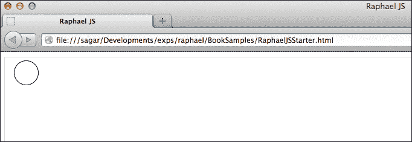

使用 RaphaelJS 创建的圆形

### attr() 方法

我们现在有一个平滑的圆形。它绝对很棒，但如果我们能给它添加一些颜色和其他样式会更好吗？RaphaelJS 给我们提供了添加样式的选项。这是一个相当直接的方法。

使用 `attr()` 方法对我们的新圆形进行样式和其他自定义设置。

此方法接受属性作为参数。属性以键值对的形式作为对象的集合输入。如果你熟悉 jQuery，那么它的语法与 jQuery 的 `attr()` 方法相同。这种格式被称为**JavaScript 对象表示法**（**JSON**），以进一步明确。

此方法的语法如下：

```js
element.attr({
  "Property1":value1,
  "Property2":value2
})
```

让我们考虑以下示例：

```js
//adding the attributes as key value pair
var coloredCircle = paper.circle(35,25,20).attr({
  "fill":"#17A9C6",
  "stroke":"#2A6570",
  "stroke-width":2
});
```

上述代码片段的输出如下所示：


使用 `attr()` 方法应用样式的圆形

Raphael 的纸张允许在 HTML 布局中轻松集成矢量图形，这使得它更具吸引力。

纸——闪亮的新魔杖。

### 注意

每个对象都有大量属性可用，所有对象的列表可以在 Raphael 文档中找到。URL 可以在“你应该了解的人和地方”部分找到，因为整个属性列表超出了本书的范围。

# 你需要了解的顶级功能

随着你学习使用 RaphaelJS，你会意识到你可以用它做很多事情。本节将教你所有关于 RaphaelJS 中最常见的任务和最常用的功能。

到本节结束时，你将能够：

+   创建一个 Raphael 元素

+   操作元素的样式

+   变换元素

+   在元素上执行动画

+   向元素添加 JavaScript 事件

## 创建一个 Raphael 元素

创建一个 Raphael 元素非常简单。为了使其更好，有一些预定义的方法可以创建基本几何形状。

### 基本形状

RaphaelJS 中有三种基本形状，即圆形、椭圆和矩形。由于圆形已在“快速入门”部分介绍，我们将跳过绘制圆形。

#### 矩形

我们可以使用`rect()`方法创建矩形。此方法需要四个必需参数和一个第五个可选参数，`border-radius`。`border-radius`参数将通过指定的像素数使矩形圆角（圆角）。

此方法的语法是：

```js
paper.rect(X,Y,Width,Height,border-radius(optional));
```

可以使用以下代码片段创建一个普通矩形：

```js
// creating a raphael paper in 'paperDiv'
var paper = Raphael ("paperDiv", 650,400);
// creating a rectangle with the rect() method. The four required parameters are X,Y,Width & Height
var rect = paper.rect(35,25,170,100).attr({
  "fill":"#17A9C6", //filling with background color
  "stroke":"#2A6570", // border color of the rectangle
  "stroke-width":2 // the width of the border 
});
```

前述代码片段的输出结果如下所示：

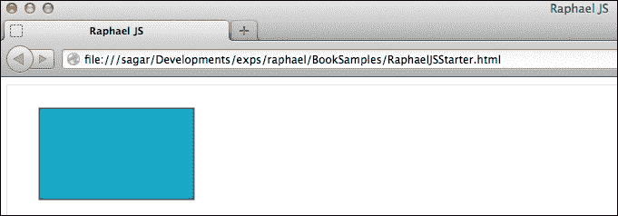

平面矩形

#### 圆角矩形

以下代码将创建一个具有圆角的矩形：

```js
// creating a raphael paper in 'paperDiv'
var paper = Raphael ("paperDiv", 650,400);
//The fifth parameter will make the rectangle rounded by the number of pixels specified – A rectangle with rounded corners
var rect = paper.rect(35,25,170,100,20).attr({
  "fill":"#17A9C6",//background color of the rectangle
  "stroke":"#2A6570",//border color of the rectangle
  "stroke-width":2 // width of the border
});
//in the preceding code 20(highlighted) is the border-radius of the rectangle.
```

前述代码片段的输出是一个具有圆角的矩形，如下所示：

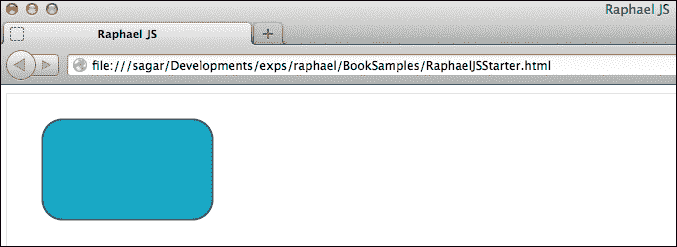

圆角矩形

我们可以用同样的方式创建其他基本形状。让我们用我们的魔杖创建一个椭圆。

#### 椭圆

椭圆是通过`ellipse()`方法创建的，它需要四个必需参数，即 x，y，水平半径和垂直半径。水平半径将是椭圆宽度的一半，垂直半径将是椭圆高度的一半。

创建椭圆的语法是：

```js
paper.ellipse(X,Y,rX,rY);
//rX is the horizontal radius & rY is the vertical radius of the ellipse
```

让我们考虑以下创建椭圆的示例：

```js
// creating a raphael paperin 'paperDiv'
var paper = Raphael ("paperDiv", 650,400);
//The ellipse() method takes four required parameters: X,Y, horizontal radius & vertical Radius
var ellipse = paper.ellipse(195,125,170,100).attr({
  "fill":"#17A9C6", // background color of the ellipse
  "stroke":"#2A6570", // ellipse's border color
  "stroke-width":2 // border width
});
```

前述代码将创建一个宽度为 170 x 2，高度为 100 x 2 的椭圆。

使用`ellipse()`方法创建的椭圆如下所示：


椭圆

### 复杂形状

创建基本形状相当容易，但复杂形状如星星、八边形或其他不是圆形、矩形或椭圆的形状怎么办呢？

是时候进入 Raphael 的下一步了。

复杂形状是通过`path()`方法创建的，该方法只有一个名为`pathString`的参数。尽管路径字符串可能看起来像一条长长的基因序列，由字母数字字符组成，但实际上它非常简单易懂，易于绘制。

在我们深入探讨路径绘制之前，了解其解释方式和那些复杂形状背后的简单逻辑是至关重要的。想象一下，你正在一张纸上用铅笔绘制。要绘制某物，你将在纸上的一点放置铅笔并开始绘制一条线或曲线，然后将铅笔移动到纸上的另一点并再次开始绘制一条线或曲线。经过几次这样的循环后，你将完成一幅杰作——至少，你会称它为杰作。

Raphael 使用类似的方法来绘制，并且使用路径字符串来完成。

一个典型的路径字符串可能看起来像这样：`M0,0L26,0L13,18L0,0`。让我们稍微放大这个路径字符串。

第一个字母是`M`，后面跟着`0,0`。没错，天才，你猜对了。

它表示移动到`0,0`位置，下一个字母`L`是`*line to*` `26,0`。RaphaelJS 将移动到`0,0`，然后从那里绘制一条线到`26,0`。这就是 RaphaelJS 理解路径字符串的方式，以及如何使用这些简单的符号绘制路径。

这里是一个命令及其相应含义的完整列表：

| 命令 | 意义扩展 | 属性 |
| --- | --- | --- |
| `M` | 移动到 | (x, y) |
| `Z` | 关闭路径 | (none) |
| `L` | 线到 | (x, y) |
| `H` | 水平线到 | x |
| `V` | 垂直线到 | y |
| `C` | 曲线到 | (x1, y1, x2, y2, x, y) |
| `S` | 平滑曲线到 | (x2, y2, x, y) |
| `Q` | 二次贝塞尔曲线到 | (x1, y1, x, y) |
| `T` | 平滑二次贝塞尔曲线到 | (x, y) |
| `A` | 椭圆弧 | (rx, ry, x 轴旋转, 大弧标志, 扫描标志, x, y) |
| `R` | Catmull-Rom 曲线到* | x1, y1 (x y) |

大写命令是绝对的（`M20, 20`）；它们是从绘图区域（纸张）的`0,0`位置计算的。小写命令是相对的（`m20, 20`）；它们是从笔最后离开的点计算的。

有这么多命令，可能会觉得难以全部记住——不用担心；没有必要记住每个命令及其格式。因为我们将会使用矢量图形编辑器来提取路径，所以了解每个命令的含义是至关重要的，这样当有人问你“嘿，天才，这是什么意思？”时，你不应该在那里毫无头绪地假装没听到。

`path()`方法的语法如下：

```js
paper.path("pathString");
```

让我们考虑以下示例：

```js
// creating a raphael paper in 'paperDiv'
var paper = Raphael ("paperDiv", 350,200);
// Creating a shape using the path() method and a path string
var tri = paper.path("M0,0L26,0L13,18L0,0").attr({
  "fill":"#17A9C6", // filling the background color
  "stroke":"#2A6570", // the color of the border
  "stroke-width":2 // the size of the border
});
```

### 注意

所有这些命令（"`M0,0L26,0L13,18L0,0`"）都使用大写字母。因此，它们是绝对值。

之前示例的输出如下所示：

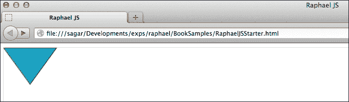

使用路径字符串绘制的三角形形状

## 从编辑器中提取和使用路径

好吧，三角形可能是一个容易放入路径字符串的简单形状。那么一个复杂的形状，比如星形呢？猜测和手动找到点并不容易。创建一个相对复杂的形状，比如简单的花朵或 2D 标志，也是不可能的。

在本节中，我们将看到一个简单但有效的方法，用最少的麻烦和精确的准确性绘制复杂形状。

### 矢量图形编辑器

矢量图形编辑器旨在轻松创建复杂形状，并且它们拥有一些强大的工具来帮助我们绘制。对于这个例子，我们将使用一个名为 Inkscape 的开源编辑器创建一个星形，然后提取这些路径并使用 Raphael 来获取形状！这听起来很简单，并且可以分四个简单步骤完成。

#### 第 1 步 – 在矢量编辑器中创建形状

让我们在 Inkscape 中使用内置的形状工具创建一些星形。

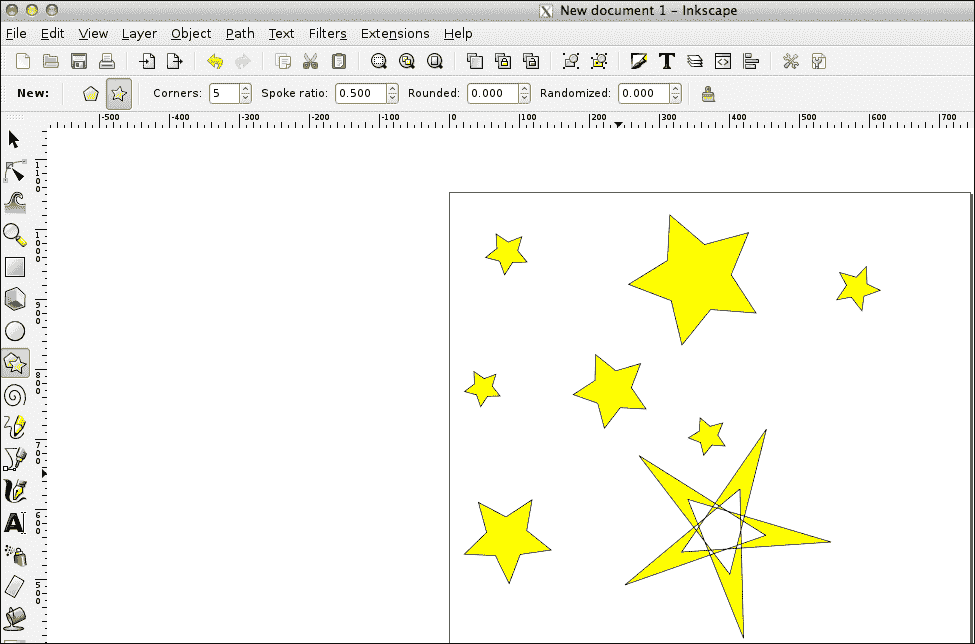

使用内置形状工具创建的星形

#### 第 2 步 – 将形状保存为 SVG

SVG 和 RaphaelJS 使用的路径相似。技巧是使用 RaphaelJS 中矢量图形编辑器生成的路径。为此，形状必须保存为 SVG 文件。

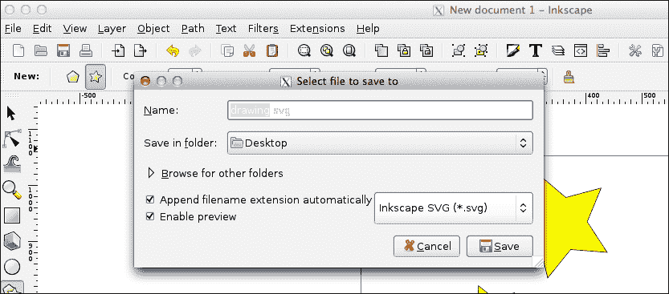

将形状保存为 SVG 文件

#### 第 3 步 – 复制 SVG 路径字符串

下一步是将 SVG 中的路径复制并粘贴到 Raphael 的 `path()` 方法中。

SVG 是一种标记语言，因此它嵌套在标签中。SVG 路径可以在 `<path>` 和 `</path>` 标签中找到。找到路径标签后，查找 `d` 属性。这将包含一个长的路径序列。你现在已经击中了靶心。

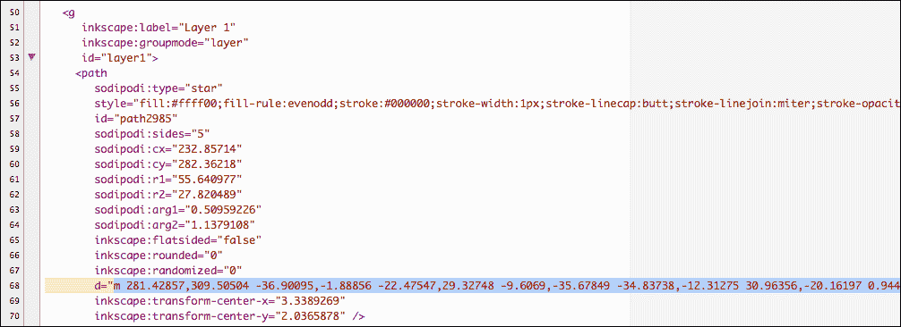

路径字符串被突出显示

#### 第 4 步 – 使用复制的路径作为 Raphael 路径字符串

在从 SVG 中复制路径字符串后，将其粘贴到 Raphael 的 `path()` 方法中。

```js
var newpath=paper.path("copied path string from SVG").attr({
  "fill":"#5DDEF4",
  "stroke":"#2A6570",
  "stroke-width":2
});
```

就这样！我们已经用绝对简单的方式在 RaphaelJS 中创建了一个复杂形状。

### 注意

使用这种技术，我们只能提取路径，而不是样式。因此，SVG 中的背景颜色、阴影或其他样式都不会应用。我们需要使用 `attr()` 方法为路径对象添加自己的样式。

这里展示了一个截图，显示了使用从 SVG 文件中复制的路径字符串在 RaphaelJS 中创建的复杂形状：

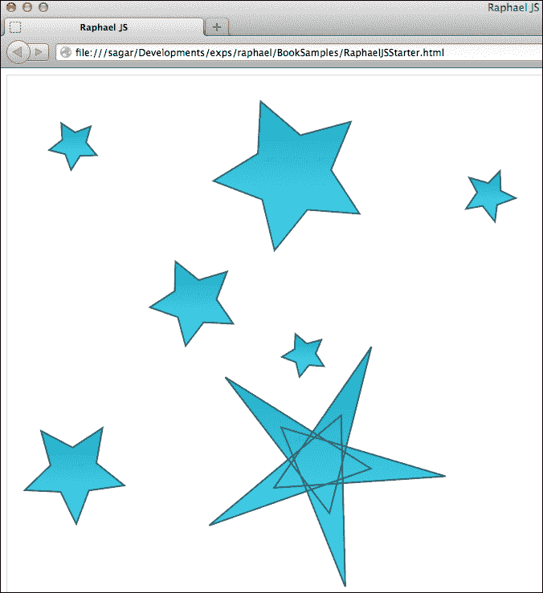

使用路径字符串在 RaphaelJS 中创建的复杂形状

### 创建文本

可以使用 `text()` 方法创建文本。Raphael 给我们一种方法来向文本对象添加一系列样式，从更改颜色到动画物理属性（如位置和大小）。

`text()` 方法需要三个必需参数，即 x、y 和文本字符串。

`text()` 方法的语法如下：

```js
paper.text(X,Y,"Raphael JS Text");
// the text method with X,Y coordinates and the text string
```

让我们考虑以下示例：

```js
// creating a raphael paper in 'paperDiv'
var paper = Raphael ("paperDiv", 650,400);
// creating text
var text = paper.text(40,55,"Raphael Text").attr({
  "fill":"#17A9C6", // font-color
  "font-size":75, // font size in pixels
//text-anchor indicates the starting position of the text relative to the X, Y position.It can be "start", "middle" or  "end" default is "middle"
"text-anchor":"start",
"font-family":"century gothic" // font family of the text
});
```

我很确定 `text-anchor` 属性有点难以理解。好吧，有句话说得好，一张图胜千言。以下图表清楚地解释了 `text-anchor` 属性及其用法。

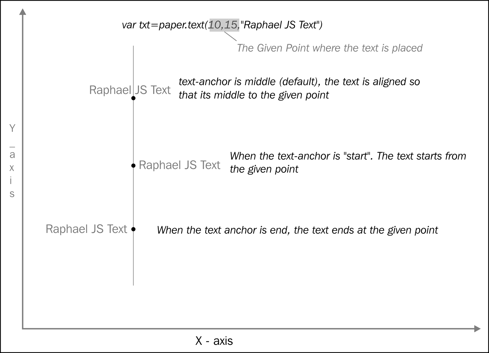

文本锚点属性的简要说明

使用 `text()` 方法渲染的文本截图如下：

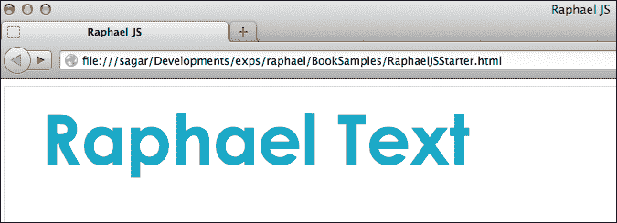

使用 text() 方法渲染文本

## 操作元素的样式

`attr()` 方法不仅为元素添加样式，还修改了元素现有的样式。

以下示例解释了 `attr()` 方法：

```js
rect.attr('fill','#ddd');
// This will update the background color of the rectangle to gray
```

## 变换一个元素

RaphaelJS 不仅创建元素，还允许动态地操作任何元素及其属性。

### 操作一个形状

到本节结束时，你就会知道如何变换一个形状。

可能存在许多场景，你可能需要动态地修改形状。例如，当用户鼠标悬停在圆上时，你可能想放大这个圆，以便给用户一个视觉反馈。在 RaphaelJS 中，可以使用 `transform()` 方法来操作形状。

变换是通过 `transform()` 方法完成的，它与 `path()` 方法类似，我们在方法中添加路径字符串。`transform()` 方法的工作方式相同，但不同的是，它使用的是变换字符串而不是路径字符串。变换字符串和路径字符串之间只有细微的差别。

变换字符串中有四个命令：

| `T` | 翻译 |
| --- | --- |
| `S` | 缩放 |
| `R` | 旋转（度） |
| `M` | 矩阵 |

第四个命令 `M` 不是很重要，让我们把它放在一边，以避免混淆。

### 注意

变换字符串可能看起来与路径字符串相似。实际上，它们是不同的，虽然不是完全不同，但差别很大。路径字符串中的 `M` 表示 *移动到*，而在变换字符串中，它表示 *矩阵*。路径字符串不应与变换字符串混淆。

与路径字符串一样，大写字母表示绝对变换，小写字母表示相对变换。如果变换字符串是 `r90T100,0`，则元素将旋转 90 度并在 x 轴上移动 100px（向左）。如果相同的是 `r90t100,0`，则元素将旋转 90 度，由于变换是相对的，它实际上会垂直向下移动 100px，因为旋转已经倾斜了它的轴。

我确信前面的点会让大多数人感到困惑，所以让我把它分解一下。

想象一个带头的矩形，现在这个头在矩形的右侧。暂时忘记绝对和相对变换；我们的目标是：

1.  将矩形旋转 90 度。

1.  将矩形沿 x 轴移动 100px（即向右移动 100px）。

理解这一点至关重要，即当我们平移元素时，其原始值不会改变，这意味着其 x 和 y 值将保持不变，无论我们如何旋转或移动元素。

现在我们第一个要求是将矩形旋转 90 度。相应的代码是 `rect.transform("r90")`，其中 `r` 代表旋转——太棒了，矩形已经旋转了 90 度。现在请注意下一个重要步骤。我们还需要矩形在 x 轴上移动 100px，因此我们更新之前的代码为 `rect.transform("r90t100,0")`，其中 `t` 代表平移。接下来发生的事情很有趣——平移是通过小写 `t` 实现的，这意味着它是相对的。关于相对平移的一点是，它们会考虑之前应用于元素的任何变换，而绝对平移则简单地重置任何之前的变换后再应用自己的变换。

记得矩形右边的头部吗？嗯，矩形的 x 轴就在右边。所以当我们说在 x 轴上移动 100px 时，它应该向其右边移动 100px，即指向其头部的方向。由于我们已经将矩形旋转了 90 度，其头部不再在右边，而是面向底部。

因此，当我们应用相对平移时，矩形仍然会在 x 轴上移动 100px，但由于旋转，x 轴现在指向下方。这就是为什么当你期望它向右移动时，矩形会向下移动 100px。

当我们应用绝对变换时，发生的事情与之前完全不同。当我们再次更新绝对变换的代码为 `rect.transform("r90T100,0")` 时，矩形的轴没有被考虑。然而，纸张的轴被使用，因为绝对变换不考虑之前的变换，它们在应用自己的变换之前简单地重置它们。因此，矩形在旋转 90 度后，将按照预期向右移动 100px。

### 注意

绝对变换将忽略该元素上所有之前的变换，而相对变换则不会。

理解这个简单的逻辑将让您在开发以及调试过程中节省很多挫败感。

以下是一个展示相对平移的截图：

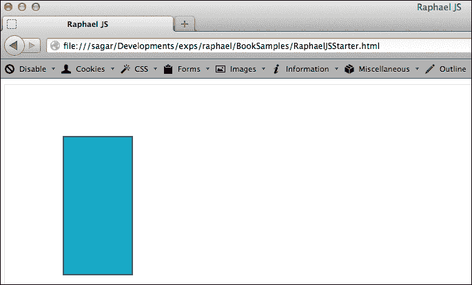

使用相对平移

以下是一个展示绝对平移的截图：

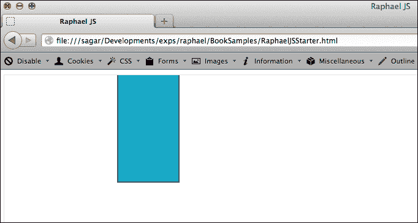

使用绝对平移

注意旋转矩形顶部的间隙；具有相对平移的矩形向上移动了 100px，而具有绝对平移的矩形顶部没有这样的间隙。

默认情况下，transform 方法将附加到元素上已经应用的任何变换。要重置所有变换，请使用`element.transform("")`。向 transform 方法添加空字符串将重置该元素上所有之前的变换。

还需要注意的是，当元素被平移时，元素的原始 x,y 位置不会改变。元素将仅临时改变位置，但其原始位置将保持不变。因此，在平移后，如果我们以编程方式调用元素的位置，我们将得到原始的 x,y，而不是平移后的位置，这样我们就不会从座位上跳起来，指责 RaphaelJS 无趣！

以下是一个缩放和旋转三角形的例子：

```js
//creating a Triangle using the path string
var tri = paper.path("M0,0L104,0L52,72L0,0").attr({
  "fill":"#17A9C6",
  "stroke":"#2A6570",
  "stroke-width":2
});
//transforming the triangle.
    tri.animate({
      "transform":"r90t100,0,s1.5"
    },1000);
//the transformation string should be read as rotating the element by 90 degrees, translating it to 100px in the X-axis and scaling up by 1.5 times
```

以下截图显示了前面代码的输出：

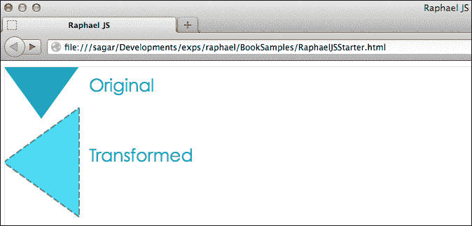

缩放和旋转三角形

三角形使用相对平移（t）进行变换。现在你知道为什么三角形向下移动而不是向右移动的原因了。

## 动画一个形状

如果魔杖不能使无生命物体动起来，它还有什么用！RaphaelJS 可以几乎无缝地动画化从颜色、不透明度、宽度、高度等几乎所有属性，几乎无需费心。

动画是通过`animate()`方法完成的。此方法需要两个必需参数，即`最终值`和`毫秒数`，以及两个可选参数，`easing`和`callback`。

`animate()`方法的语法如下：

```js
Element.animate({
  Animation properties in key value pairs
},time,easing,callback_function);
```

Easing 是动画完成时的特殊效果，例如，如果 easing 是`bounce`，动画将看起来像弹跳的球。以下是在 RaphaelJS 中可用的几个 easing 选项：

+   `linear`

+   `<` 或 `easeIn` 或 `ease-in`

+   `>` 或 `easeOut` 或 `ease-out`

+   `<>` 或 `easeInOut` 或 `ease-in-out`

+   `backIn` 或 `back-in`

+   `backOut` 或 `back-out`

+   `elastic`

+   `bounce`

Callbacks 是当动画完成后将执行的函数，允许我们在动画后执行一些任务。

让我们考虑一个动画矩形宽度和高度的例子：

```js
// creating a raphael paper in 'paperDiv'
var paper = Raphael ("paperDiv", 650,400);
rect.animate({
  "width":200, // final width
  "height":200 // final height
},300,"bounce',function(){
  // something to do when the animation is complete – this callback function is optional
  // Print 'Animation complete' when the animation is complete
  $("#animation_status").html("Animation complete")
})
```

以下截图显示了动画前的矩形：

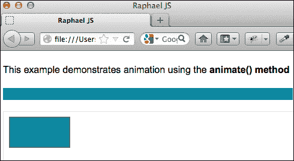

动画前的矩形

以下是一个动画完成后使用回调函数的截图示例。动画完成后，浏览器中将显示文本**动画完成**。

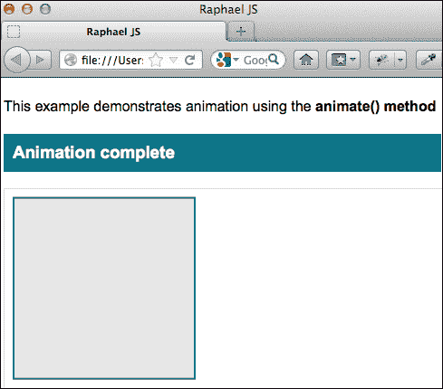

使用回调函数

以下代码动画了一个矩形的背景颜色和不透明度：

```js
rect.animate({
  "fill":"#ddd", // final color,
  "fill-opacity":0.7
},300,"easeIn",function(){
  // something to do when the animation is complete – this call back function is optional
  // Alerts done when the animation is complete
  alert("done");
})
```

这里矩形从蓝色变为灰色，不透明度从 1 变为 0.7，持续时间为 300 毫秒。

### 注意

在 RaphaelJS 中，不透明度与 CSS 中的相同，其中 1 是不透明的，0 是透明的。

## 动画变换

可以使用变换字符串来动画化变换。

让我们考虑以下示例：

```js
//animating the rotation and scaling of a rectangle 
rect.animate({
// animating with a rotation of 45 degree and scaling up 1.5 times
transform:"r45s1.5" 
},500)
```

以下是一个动画前的矩形截图：


动画前

以下是动画后相同矩形的截图：

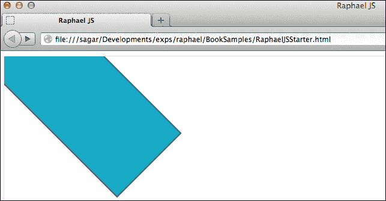

动画后

几乎可以对任何属性进行动画处理。

### 注意

动画是一个很棒的功能，而且非常流畅。但是，它也有代价；它会占用宝贵的浏览器资源。它不会耗尽浏览器资源，但过度使用动画会对最终性能产生重大影响。因此，开发者必须明智地使用动画，使其为整个用户体验增值，而不是让用户感到烦恼。

## 向 Raphael 元素添加事件

向元素添加事件就像注入生命一样。它们将绘图提升到下一个层次。可以使用各种事件处理器向元素添加事件。实际上，所有正常的 JavaScript 事件都适用于任何 Raphael 元素。

这里是一个 `click` 和 `mouseover` 事件的示例。

### 点击事件

可以使用 `click()` 方法添加鼠标点击事件。

让我们考虑以下示例：

```js
//creating a raphael paper in 'paperDiv'
var paper = Raphael("paperDiv", 650, 400);
var blueStyle={
  "fill":"#5DDEF4",
  "stroke":"#2A6570",
  "stroke-width":2
}
//creating a plain circle
var cir = paper.circle(120,120,30).attr(blueStyle);
cir.click(function(){
  alert('Clicked circle');
})
```

以下是一个演示点击事件处理器的截图：

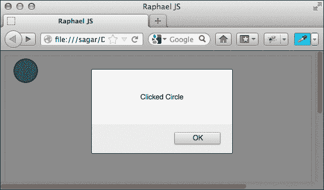

点击事件处理器

### 鼠标悬停事件

可以使用 `mouseover()` 方法添加鼠标悬停事件。

以下是一个 `mouseover()` 方法的示例：

```js
// creating a circle with blue background
var cir = paper.circle(35,25,20).attr({
  "fill":"#17A9C6",
  "stroke":"#2A6570",
  "stroke-width":2
});
// adding mouseover event to the circle with the mouseover() event handler
cir.mouseover(function(){
cir.animate({
  "fill":"#15EA18",
  "transform":"s2"
  },400)
})
// The preceding code animates the background color and scales up the circle twice on mouseover
```

## 你想要了解和使用的方法

本节将仅涵盖最常见和最频繁使用的方法，因为整个属性和方法列表超出了本书的范围。

### 元素方法

这些方法只能与元素一起使用，不能直接使用。例如，`rect.click()`。

#### animate()

`animate()` 方法用于在指定持续时间内对元素的各个属性进行动画处理。

该方法的语法如下：

```js
element.animate({
  Property1:value,
  Property2:value
},time_in_milliseconds,easing(optional),
callback_function(optional));
```

以下是一个 `animate()` 方法的示例：

```js
rect.animate({
  "width":"300",
  "height":"200"
},500,'bounce',function(){
//something to do after animation
  alert("animation complete")
})
```

#### attr()

`attr()` 方法是一个非常重要的方法，用于向元素添加属性，如样式和其他物理属性，如位置、高度、宽度等。它采用键值对的形式。

该方法的语法如下：

```js
element.attr({
  Property1:value,
  Property2:value
})
```

以下是一个 `attr()` 方法的示例：

```js
// Adding background color and stroke to a rectangle
rect.attr({
  "fill":"#17A9C6",   // Adds a background color
  "stroke":"#2A6570", // the color of the border
  "stroke-width":2    // the width of the border
})
```

#### click()

`click()` 方法用于将 `click` 事件绑定到 Raphael 元素上。

以下是一个 `click()` 方法的示例：

```js
rect.click(function(){
  //something to do when the rectangle is clicked
  alert("clicked rectangle");
})
```

#### dblclick()

`dblclick()` 方法将 `double click` 事件添加到元素上。

以下是一个 `dblclick()` 方法的示例：

```js
cir.dblclick(function(){
  //alerts "it's a double click " when double clicked
  alert("It's a double click !");
})
```

#### mousedown()

`mousedown()` 方法将 `mousedown` 事件绑定到 Raphael 元素上——当任何鼠标按钮被按下时触发。

以下是一个 `mousedown()` 方法的示例：

```js
rect.mousedown(function(){
// The rectangle will animate to 200px wide when any mouse button is pressed down
rect.animate({
  'width':'200'
  },400)
})
```

#### mouseup()

`mouseup()` 事件将 `mouseup` 事件绑定到 Raphael 元素上——当任何鼠标按钮被释放时触发。

以下是一个 `mouseup()` 方法的示例：

```js
rect.mouseup(function(){
// The rectangle will animate to 100px wide any mouse button is released
rect.animate({
  'width':'100'
  },400)
})
```

#### mousemove()

当鼠标移至元素上时，会触发 `mousemove()` 方法。

以下是一个 `mousemove()` 方法的示例：

```js
// increases the size of the rectangle as the mouse moves over the rectangle.
var wd=100 // Intial width
rect.mousemove(function(){
  wd++ // incrementing the width on mouse move
  rect.attr({
    //setting the width of the rectangle with the attr() method
    'width':wd
  });
})
```

#### mouseover()

当鼠标进入 Raphael 元素时，会触发`mouseover()`方法。

以下是一个`mouseover()`方法的示例：

```js
//animating the size of the circle when the mouse enters the circle
cir.mouseover(function(){
  cir.animate({
  transform:'s2' // scaling up the circle twice
  },500,'elastic'); //adding and elastic easing function to the animation
})
```

#### mouseout()

当鼠标离开 Raphael 元素时，会触发`mouseout()`方法。

以下是一个`mouseout()`方法的示例：

```js
// scaling down the size of the circle when the mouse leaves it
cir.mouseout(function(){
  cir.animate({
  transform:'s0.5' // scaling down the circle to half of its original size
  },500,'bounce') //adding and elastic easing function to the animation
})
```

#### clone()

有时会想要复制一个元素。有些人可能会说：“啊！这很简单，我只需要将元素复制到一个新变量中，比如`var newrect=rect`”。好吧，看起来你已经复制了，但这肯定不会起作用。变量作为对象的引用，在这种情况下，是矩形。所以当我们复制变量时，我们只是在复制引用。实际上，新变量仍然指向同一个旧对象。以下是一个错误的示例：

```js
// assigning the rect to a new variable called newRect
var newRect=rect;
newRect.attr({
  fill:'#ddd',
  transform:'t100,100'
})
```

以下截图演示了当变量被复制时会发生什么——没有矩形的副本。

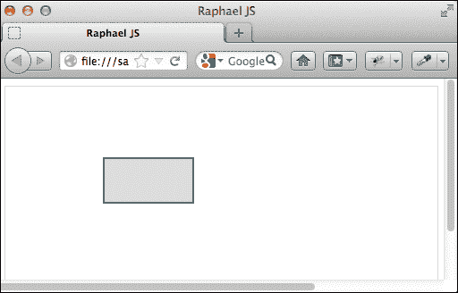

变量被复制

很明显，复制变量没有起作用，因为很明显背景色已经应用于同一个矩形，并且没有第二个矩形，正如预期的那样。

这个问题可以通过`clone()`方法以简单优雅的方式解决。

```js
//To duplicate a rectangle
var newRect=rect.clone();
newRect.attr({
  fill:'#ddd',
  transform:'t100,100'
})
```

使用`clone()`方法而不是复制变量，将产生一个矩形的副本，如下面的截图所示：

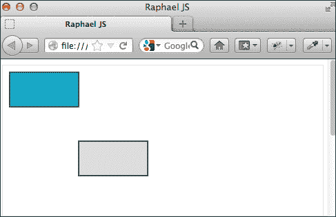

使用 clone()方法产生副本

现在，我们看到了两个矩形，第二个矩形的背景色现在如预期地变为灰色。

#### data()

Raphael 有一种非常简单的方法将一些数据分配给每个元素，并在需要时检索它。这就像在创建元素时分配一些数据，并在必要时召回这些数据一样简单。这是一个简单直接的方法。

可以使用`data()`方法以键值对的形式向元素添加数据。

以下是一个`data()`方法的示例：

```js
//assigning a name to a circle
cir.data('name','Am Raphael JS');
// retrieving the data
cir.click(function(){
  alert(this.data('name'));
})
```

以下是一个截图，展示了点击圆圈时的数据内容：

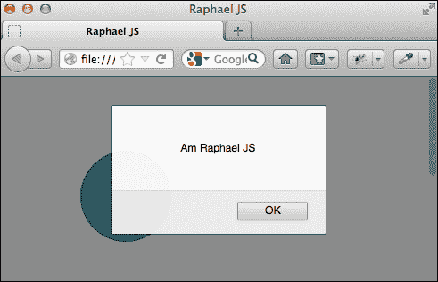

点击圆圈时的数据内容

#### removedata()

`removedata()`方法接受键作为参数。如果没有提供键，它将删除所有相关数据。

此方法的语法如下：

```js
removedata(key)
```

以下是一个`removedata()`方法的示例：

```js
//removing the name of the circle
cir.removeData('name') // removes the name of the circle
```

#### getBBox()

`getBBox()`方法返回元素的边界框。默认情况下，边界框将考虑元素上的任何变换。要获取应用变换之前的元素边界框，必须将`isWithoutTransform`参数设置为`true`。

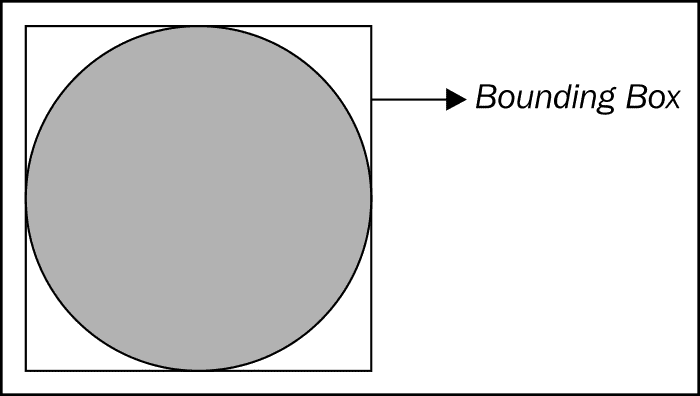

以下是一个`getBBox()`方法的示例：

```js
cir.getBBox() // returns the bounding box 
cir.getBBox({
isWithoutTransform:true // this will return the bouding box values before any transformation that has been applied on the element. It will still return the old values ignoring the transformations
})
```

`getBBox()`方法返回一个包含以下值的对象：

| 值 | 类型 | 描述 |
| --- | --- | --- |
| `X` | 数字 | 左上角的 x 位置 |
| `Y` | 数字 | 左上角的 y 位置 |
| `X2` | 数字 | 右下角的 x 位置 |
| `Y2` | 数字 | 底右角的 y 位置 |
| `Width` | 数字 | 边界框的宽度 |
| `Height` | 数字 | 边界框的高度 |

#### `getPointAtLength()`

`getPointAtLength()` 方法返回路径特定长度的点的坐标。`getPointAtLength()` 方法接受两个参数，即 `path` 和 `length`。

此方法的语法如下：

```js
getPointAtLength(path,length)
```

`path` 必须是路径字符串，而 `length` 必须是数字。

`getPointAtLength()` 方法返回一个包含以下值的对象：

| 值 | 类型 | 描述 |
| --- | --- | --- |
| `X` | 数字 | 点的 x 坐标 |
| `Y` | 数字 | 点的 y 坐标 |
| `Alpha` | 数字 | 导数的角度 |

#### `toFront()`

`toFront()` 方法将元素带到所有其他元素的最前面。它的功能类似于 **CSS z-index**。它不接受任何参数。

下面是 `toFront()` 方法的示例：

```js
cir.toFront();//brings the circle on top of all the elements
```

下面是使用 `toFront()` 方法的截图示例。通过使用 `toFront()` 方法将圆带到前面；因此，它覆盖了矩形。

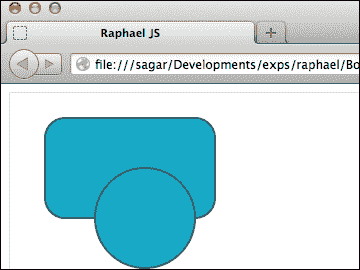

使用 `toFront()` 方法将圆带到前面

#### `toBack()`

`toBack()` 方法与 `toFront()` 方法正好相反，因为它将元素移动到所有其他元素之后。

下面是 `toBack()` 方法的示例：

```js
rect.toBack() // moves the rect behind all the elements
```

#### `hide()`

`hide()` 方法使元素不可见。此方法是 Raphael 中 CSS 的 `visibility:hidden` 或 `display:none` 的等价物。

下面是 `hide()` 方法的示例：

```js
rect.hide()
```

#### `show()`

`show()` 方法使元素可见。

下面是 `show()` 方法的示例：

```js
rect.show()
```

#### `transform()`

`transform()` 方法向给定元素添加转换。它只接受一个参数，即转换字符串。

此方法的语法如下：

```js
transform([transformationString]);
```

下面是 `transform()` 方法的示例：

```js
rect.transform("s1.5t100,100,r90");
//scales the rectangle to 1.5 times larger and then translates it to 100px in the X-axis, 100px in the Y-axis and finally rotating it by 90 degrees
//Transformation can also be done using the attr() method.
element.attr('transform','s1.5t100,100,r90');

```

#### `remove()`

`remove()` 方法从画布中删除元素。

下面是 `remove()` 方法的示例：

```js
rect.remove();
//the preceding line removes the rect from Raphael paper
```

### 画布方法

画布方法只能与 Raphael 画布对象一起使用。

#### `paper.circle()`

`paper.circle()` 方法创建一个圆。

下面是此方法的语法：

```js
circle(x,y,radius);
```

其中 `x` 是圆的 x 位置，`y` 是圆的 y 位置，`radius` 是圆的半径。

下面是 `paper.circle()` 方法的示例：

```js
var cir=paper.circle(100,50,20);
```

#### `paper.ellipse()`

`paper.ellipse()` 方法创建一个椭圆。

此方法的语法如下：

```js
ellipse(x,y,rx,ry);
```

其中 `x` 是圆的 x 位置，`y` 是圆的 y 位置，`rx` 是水平半径，`ry` 是垂直半径。

下面是 `paper.ellipse()` 方法的示例：

```js
var ell = paper.ellipse(15,30,80,50);
```

#### `paper.rect()`

`paper.rect()` 方法创建一个简单的矩形。

下面是此方法的语法：

```js
rect(x,y,width,height,radius(optional));
```

其中`x`是圆的 x 位置，`y`是圆的 y 位置，`width`是矩形的宽度，`height`是矩形的高度。它还有一个最后一个第五个参数——矩形的边框半径，这将给矩形添加一个给定半径的曲线边缘。圆角看起来很平滑。尽管方法的名称是`rect()`，但它可以用来创建任何形状的框。它并不限于创建完美的矩形。

以下是一个`paper.rect()`方法的示例：

```js
// A rectangle with a border radius of 5px
var rectangle = paper.rect(10,10,50,70,5);
```

#### paper.clear()

`paper.clear()`方法用于清除绘图画布。这是神奇的扫帚。`paper.clear()`方法不接受任何参数；它清除所有内容。

以下是一个`paper.clear()`方法的示例：

```js
paper.clear()
```

#### paper.image()

Raphael 擅长绘图，使用 Raphael 我们可以用它替换一些图像。但这并不意味着它是一个图像替换解决方案；Raphael 只能替代。因此，将其视为图像的完全替代品是错误的。然而，在 Raphael 中可以操作图像。

`paper.image()`方法允许我们在画布上导入图像。此方法接受以下五个参数：

| 参数 | 描述 |
| --- | --- |
| `src` | 图像的路径 |
| `X` | 图像应放置的 x 坐标点 |
| `Y` | 图像应放置的 y 坐标点 |
| `Width` | 图像的宽度 |
| `Height` | 图像的高度 |

以下是一个`paper.image()`方法的示例：

```js
var img=paper.image("images/world.png",10,15,80,100);
//imports an image called world.png and places it at 10,15 position. Sets the image's width to 80px and height to 100px
```

现在导入的图像已被转换为 Raphael 对象。所有常规变换都可以应用于该图像对象。

#### paper.setSize()

`paper.setSize()`方法是一个非常实用的方法。此方法允许调整 Raphael 画布对象的大小，这样你就不会用完空间。此方法需要两个必需参数，即宽度（width）和高度（height），这些将是 Raphael 画布的新宽度和高度。

以下是这个方法的语法：

```js
paper.setSize(width,height);
```

以下是一个`paper.setSize()`方法的示例：

```js
paper.setSize(500,600);
//500 and 600 will be the new width and height of the paper.
```

#### paper.set()

`paper.set()`方法将多个 Raphael 对象分组，对集合执行任何操作都将应用于所有元素。`set()`方法仅分组元素，不会创建任何元素的副本。删除集合不会影响元素。

值得注意的是，RaphaelJS 中的集合是有序的。这与 Python 中的集合类型不同，Python 中的集合是无序对象的一组。

以下是这个方法的语法：

```js
var raphaelSet=paper.set();
raphaelSet.push(element1,element2, ...);
```

以下是一个`paper.set()`方法的示例：

```js
// the following code will create a new set called raphaelSet, add elements to it and change the color of the set to red
var raphaelSet=paper.set();//creating a new set
// adding elements to the set using the push() method 
raphaelSet.push(circle,rect,ellipse);
//changing the color of the set – this will affect all the elements in the set.
raphaelSet.attr('fill','red');
```

以下是一个展示在 RaphaelJS 中使用`paperset()`方法的截图。

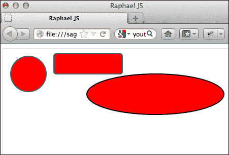

将集合的颜色更改为红色会改变集合中所有元素的颜色。

### 集合方法

集合方法只能与使用`set()`方法创建的集合对象一起使用。

```js
var raphaelSet=paper.set();
//raphaelSet is now a set object to which all the set methods apply.
```

#### set.clear()

`set.clear()`方法从集合中移除所有元素。`set()`方法仅将元素分组在一起，它不会复制任何元素。因此，当集合被清除时，没有元素被移除，它们只是不再有边界。

以下是这个方法的语法：

```js
Set.clear();
```

以下是一个`set.clear()`方法的示例：

```js
raphaelSet.clear();
// The preceding code will remove the set called raphaelSet, not its elements
```

#### set.exclude()

清除集合看起来很简单——调用 clear 方法，然后 kaboom，一切都不见了。那么关于精确选择呢？RaphaelJS 提供了`set.exclude()`方法，可以用来从集合中仅移除特定的元素。此方法仅需要一个必需的参数，即要移除的元素。想要移除一个“黑羊”？没问题。

以下是这个方法的语法：

```js
set.exclude(element);
```

以下是一个`set.exclude()`方法的示例：

```js
raphaelSet.exclude(rect);
//The preceding code removes the element called 'rect' from the set 'raphaelSet'
```

#### set.forEach()

`set.forEach()`方法为集合中的每个元素执行一个函数。回调函数仅接受一个参数，即循环中当前元素的引用。

以下是这个方法的语法：

```js
set.forEach(callback_function,thisArg);
```

以下是一个`set.forEach()`方法的示例：

```js
raphaelSet.forEach(function(elm){
  elm.attr('fill','green');
})
// The preceding code will loop through all the elements in the raphaelSet and change the background color of each and every element to green.
```

#### set.pop()

`set.pop()`方法从集合中移除最后一个元素并返回它。

以下是一个`set.pop()`方法的示例：

```js
raphaelSet.pop();
// the preceding code will remove the last element from the raphaelSet and return the removed element.
```

#### set.splice()

`set.splice()`方法用于删除和插入一个元素。此方法接受三个参数，即`index`、`count`和要插入的`element`。索引是元素应该被删除的位置，count 是从索引位置移除的元素数量，最后是插入的元素。

以下是这个方法的语法：

```js
set.splice(index, count, element);
```

以下是一个`set.splice()`方法的示例：

```js
var rect=paper.rect(10,10,50,100).attr('fill','green');
raphaelSet.splice(1,2,rect);
// The preceding code will remove two elements from the index position of 1 and add a rect element.
```

# 你应该了解的人和地方

如果你需要 RaphaelJS 的帮助，以下是一些人和地方，它们将非常有价值。

## 官方网站

所有关于 RaphaelJS 的官方信息的官方网站是：

+   **主页**: [`raphaeljs.com/`](http://raphaeljs.com/)

+   **手册和文档**: [`raphaeljs.com/reference.html`](http://raphaeljs.com/reference.html)

+   **Twitter**: [`twitter.com/RaphaelJS/`](http://twitter.com/RaphaelJS/)

+   **源代码**: [`github.com/DmitryBaranovskiy/raphael/`](https://github.com/DmitryBaranovskiy/raphael/)

## 文章和教程

以下是一份有用的文章和教程列表，供进一步参考和阅读：

+   [`www.alistapart.com/articles/using-svg-for-flexible-scalable-and-fun-backgrounds-part-i`](http://www.alistapart.com/articles/using-svg-for-flexible-scalable-and-fun-backgrounds-part-i)

+   [`www.alistapart.com/articles/cross-platform-scalable-vector-graphics-with-svgweb/`](http://www.alistapart.com/articles/cross-platform-scalable-vector-graphics-with-svgweb/)

+   [`net.tutsplus.com/tutorials/javascript-ajax/an-introduction-to-the-raphael-js-library/`](http://net.tutsplus.com/tutorials/javascript-ajax/an-introduction-to-the-raphael-js-library/): 来自 net tuts+ 的 RaphaelJS 库介绍

+   [`www.w3.org/TR/SVG11/`](http://www.w3.org/TR/SVG11/): W3C SVG 规范

+   [`www.irunmywebsite.com/raphael/additionalhelp.php#pagetop`](http://www.irunmywebsite.com/raphael/additionalhelp.php#pagetop): RaphaelJS 示例的详尽列表

+   [`inkscape.org/download/`](http://inkscape.org/download/): 下载 Inkscape 的链接

## 社区

官方 RaphaelJS 社区和论坛：

+   **官方论坛**: [`groups.google.com/forum/?fromgroups#!forum/raphaeljs`](https://groups.google.com/forum/?fromgroups#!forum/raphaeljs)

+   **用户常见问题解答**: [`raphaeljs.com/`](http://raphaeljs.com/)

## 博客

官方 RaphaelJS 博客：

+   RaphaelJS 和其他库的创造者 Dmitry Baranovskiy 的博客：[`dmitry.baranovskiy.com/`](http://dmitry.baranovskiy.com/)

## Twitter

RaphaelJS 推文：

+   在 [`twitter.com/RaphaelJS/`](http://twitter.com/RaphaelJS/) 上关注 RaphaelJS

+   想了解更多开源信息，请关注 Packt 在 [`twitter.com/#!/packtopensource`](http://twitter.com/#!/packtopensource) 的动态

# 摘要

RaphaelJS 是一个多才多艺且易于使用的矢量图形库，使我们能够完成几年前无法想象的任务。尽管 HTML5 Canvas 吸收了矢量图形的灵感，但这并不意味着它是 SVG 的替代品，相反，它们是互补的。今天的浏览器拥有更快更好的 JavaScript 引擎，这使得矢量图形的渲染更加出色。

从用户的角度来看，添加一点交互性会使网站更加有趣和吸引人，为此，像 RaphaelJS 这样的矢量图形库是关键。它们使应用程序与众不同，区别于标准的方框和线条。RaphaelJS 为我们的应用程序增添了光彩，并使我们完全重新思考如何展示我们的数据。在最具创意的人手中，RaphaelJS 更加灵活，这正是本书的主题——实现 RaphaelJS 的创意潜力。
