# 第一章. 使用 CasperJS 进行即时测试

欢迎使用*CasperJS 即时测试*。这本书将涵盖如何使用 CasperJS 进行高效和扎实的网页测试。CasperJS 是一个跨平台的命令行工具，能够加载和脚本化任何网页。

# 安装 CasperJS（简单）

在这个菜谱中，我们将介绍如何在 Windows、Mac OS X 和 Linux 上安装 CasperJS 及其依赖项的步骤。

## 准备工作

CasperJS 的源代码在 GitHub 上管理。因此，为了在我们的本地机器上获取它们，我们需要 Git。

要在 Windows 上安装 Git，我们可以使用 msysGit 来部署 Git 命令行工具以及图形界面：

1.  前往[`msysgit.github.io/`](http://msysgit.github.io/)。

1.  前往**下载**页面。

1.  下载最新版本。

1.  运行安装程序。

在 Mac 上安装 Git，最简单的方法是使用 Git for OS X 图形界面：

1.  前往[`code.google.com/p/git-osx-installer/`](https://code.google.com/p/git-osx-installer/)。

1.  前往**下载**页面。

1.  下载最新版本。

1.  运行安装程序。

您还可以从 MacPorts 安装 Git：

1.  确保已安装 MacPorts（如果没有，请访问[`www.macports.org/`](http://www.macports.org/)并遵循说明）。

1.  在命令行中，输入以下命令：

    ```js
    $ sudo port install git-core +svn +doc +bash_completion +gitweb

    ```

要在 Linux 上安装 Git，请使用以下命令：

+   对于 Debian/Ubuntu，输入以下命令：

    ```js
    $ sudo apt-get install git

    ```

+   对于 Fedora，输入以下命令：

    ```js
    $ yum install git-core

    ```

## 如何做到这一点...

1.  首先，我们需要安装 PhantomJS。

    执行以下步骤在 Windows 上安装 PhantomJS：

    1.  前往[`phantomjs.org/download.html`](http://phantomjs.org/download.html)。

    1.  下载 Windows 版本。

    1.  提取其内容。

    1.  将`phantomjs.exe`路径添加到`PATH`环境变量中，假设它位于`C:\PhantomJS`：

        ```js
        ...the existing PATH value...;C:\PhantomJS

        ```

    执行以下步骤在 Mac 和 Linux 上安装 PhantomJS：

    1.  前往[`phantomjs.org/download.html`](http://phantomjs.org/download.html)。

    1.  下载合适的版本（Mac OS X / Linux 32 位 / Linux 64 位）。

    1.  提取其内容。

    1.  使用以下命令使`bin/phamtomjs`在您的系统路径中可用：

        ```js
        ~ sudo ln -s <path-to-extracted-folder>/bin/phantomjs /usr/local/bin

        ```

    现在，我们应该能够从命令行运行`phantomjs`：

    ```js
    ~  phantomjs --version
    1.9.0

    ```

1.  现在，我们可以使用 Git 安装 CasperJS。我们需要从 GitHub 本地克隆官方的 CasperJS 仓库。

    这可以通过以下命令实现：

    ```js
    ~ git clone git://github.com/n1k0/casperjs.git

    ```

    这应该产生类似于以下命令的输出：

    ```js
    Cloning into 'casperjs'...
    remote: Counting objects: 11156, done.
    remote: Compressing objects: 100% (4927/4927), done.
    remote: Total 11156 (delta 6580), reused 10692 (delta 6167)
    Receiving objects: 100% (11156/11156), 6.85 MiB | 113 KiB/s, done.
    Resolving deltas: 100% (6580/6580), done.

    ```

1.  要检出最新稳定版本，我们需要运行以下 Git 命令：

    ```js
    ~ git checkout tags/1.1-beta3

    ```

    我们将得到以下信息：

    ```js
    Note: checking out 'tags/1.1-beta3'.

    ..

    HEAD is now at bc0da16... bump 1.1-beta3

    ```

1.  让我们检查 CasperJS 是否正确安装。

    要检查 Windows 上的 CasperJS 是否正确安装，请使用以下命令：

    ```js
    ~ cd casperjs
    ~ bin\batchbin\casperjs.bat --version

    ```

    要检查 Mac OS X / Linux 上的 CasperJS 是否正确安装，请使用以下命令：

    ```js
    ~ cd ./casperjs
    ~ bin/casperjs --version

    ```

    我们应该获得以下结果：

    ```js
    1.1.0-beta3

    ```

1.  为了完成安装，我们现在将确保`casperjs`可执行文件在我们的系统路径中可用。

    要在 Windows 上完成安装，请将以下路径添加到 `casperjs.bat` 中的 `PATH` 环境变量中，假设仓库位于 `C:\casperjs`：

    ```js
    ...the existing PATH value...;C:\casperjs\batchbin

    ```

    要在 Mac 和 Linux 上完成安装，请使用以下命令将 `bin/casperjs` 链接到 `/usr/local/bin`：

    ```js
    ~ sudo ln -s `pwd`/bin/casperjs /usr/local/bin

    ```

    我们可以使用以下命令检查 `casperjs` 是否在系统路径中：

    ```js
    ~ casperjs --version
    1.1.0-beta3

    ```

设置现在已完成。

## 它是如何工作的...

在克隆仓库后，我们启动了一个 Git 命令以获取版本 1.1（在我们编写这些行的时候，它仍然是一个测试版本）。

如果我们没有启动 Git 命令，我们仍然会有一个正确的 CasperJS 设置，但请注意；Git 已经下载了自 CasperJS 开发初期至今的所有 CasperJS 修订版本，并且*自动检出最新版本*。因此，我们尝试使用以下命令：

```js
~ bin/casperjs --version

```

我们将得到类似以下的结果：

```js
1.1.0-DEV

```

这意味着我们正在运行当前的开发版本，使用开发版本可能不是我们想要的，因为它可能是不稳定的，甚至可能损坏。

这就是为什么我们需要检出特定标记的 1.1 版本修订。

## 更多...

现在，让我们讨论一些安装选项。

### 在 Mac OS X 上使用 Homebrew 安装 CasperJS

Homebrew 是 Mac OS X 的包管理器。它是一种非常方便的方式来部署 PhantomJS 和 CasperJS，使用以下命令：

```js
~ brew install casperjs

```

### 在 Ubuntu 上安装 PhantomJS

请注意；在 Ubuntu 上，如果我们从发行版软件包中安装 PhantomJS，我们将得到一个旧版本（版本 1.4 或 1.6，取决于我们的 Ubuntu 版本）。

但 CasperJS 至少需要 PhantomJS 1.7。因此，包安装不是一个选项。

### 使用 CasperJS Ruby 可执行文件

在 Mac OS X 和 Linux 上，默认的 `casperjs` 可执行文件是一个 Python 脚本。Python 应该在我们的系统中可用（除非我们使用异类的 Linux 发行版），所以这不会造成问题。

然而，如果我们更喜欢使用 Ruby 脚本来启动 CasperJS，我们确实有一个在 `./rubybin` 中。因此，我们只需要以这种方式使它在系统路径中可用：

```js
~ ln -sf `pwd`/rubybin/casperjs /usr/local/bin/casperjs

```

# 使用 CasperJS（简单）入门

这个菜谱将解释如何编写基本的 CasperJS 测试，并帮助我们熟悉 CasperJS 的方法。

## 准备工作

在这个菜谱中，我们将构建简单的网页，以便在适当的环境中运行我们的 CasperJS 测试。

由于我们需要仅提供静态内容（HTML、CSS、JavaScript），我们需要一个非常基本的 HTTP 服务器，最简单的现有 HTTP 服务器是 Python 2 SimpleHTTTPServer，因为它包含在标准的 Python 安装中（因此不需要额外的部署），并且它不需要任何系统配置。

在 Mac OS X 和 Linux 上，Python 2 是系统的一部分；我们只需从包含我们的网页内容的文件夹中启动以下命令行：

```js
~ python -m SimpleHTTPServer

```

前面的命令应该返回以下信息：

```js
Serving HTTP on 0.0.0.0 port 8000 …

```

这条信息意味着我们的本地网络服务器正在 `8000` 端口上运行，我们可以使用以下 URL 使用我们的网络浏览器访问它：

`http://localhost:8000/`

在 Windows 上，我们可以做同样的事情，但 Python 默认并未安装，因此我们首先需要以这种方式安装它：

1.  前往 [`www.python.org/getit/`](http://www.python.org/getit/)。

1.  下载 Python 2.7 Windows 安装程序。

1.  运行它。

1.  将 Python 添加到我们的系统路径中：

    ```js
    ...the existing PATH value...;C:\Python27\

    ```

## 如何操作...

我们现在准备好编写 CasperJS 测试了。对于我们的第一个测试，我们不需要我们的本地 web 服务器，因为我们将使用维基百科网站：

1.  让我们创建以下文件，并将其命名为 `example1.js`：

    ```js
    var casper = require('casper').create();

    casper.start('http://en.wikipedia.org/', function() {
        this.echo(this.getTitle());
    });

    casper.run();
    ```

1.  当我们运行我们的脚本时，我们得到以下输出：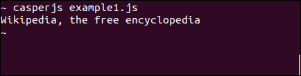

1.  让我们看看它是如何工作的：

    +   在第一行，我们获取一个新的 `'casper'` 实例。

    +   然后，在第二行，我们启动这个实例并打开维基百科页面。

    +   我们给 `start()` 方法一个函数，该函数将在页面加载后执行。在这个函数中，上下文（`this`）是 `casper` 实例。这里，我们只是使用 `echo()` 方法显示当前页面的标题（使用 `getTitle()` 获取）。

    +   在最后一行，我们启动已注册的步骤。

    现在，让我们稍微修改一下我们的脚本，以便在维基百科上搜索 `'javascript'`：

    ```js
    var casper = require('casper').create();

    casper.start('http://en.wikipedia.org/', function() {
        this.echo(this.getTitle());
        this.fill('form#searchform', {
            'search': 'javascript'
        }, true);
    });

    casper.then(function() {
       this.echo(this.getCurrentUrl());
    })

    casper.run();
    ```

1.  让我们运行它：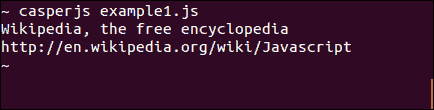

    我们做了两个修改：

    +   我们使用了 `fill()` 方法将我们的搜索关键字提交到维基百科搜索表单。

    +   我们使用 `then()` 方法在脚本中添加了一个新步骤，以确保我们等待搜索结果返回；我们还显示了当前 URL。

    如我们所见，它工作得非常完美，因为我们获得了关于 JavaScript 的维基百科文章的 URL。现在，让我们“断言”一下世界吧！

    我们刚刚编写了一个基本的 CasperJS 脚本，但它不是一个非常高效的测试脚本，因为测试脚本应该检查我们正在测试的网页是否正确地执行了预期的行为。

    为了做到这一点，CasperJS 提供了一个测试器 API，可以通过我们的 CasperJS 实例的 `test` 属性访问。

1.  让我们创建以下示例页面，并将其命名为 `example2.html`：

    ```js
    <html><body>
       <button id="button1" onclick="this.innerText='Done';">Click me</button>
    </body></html>
    ```

    现在，让我们启动我们的 SimpleHTTPServer，通过访问 `http://localhost:8000/example2.html` 来查看页面看起来是什么样子。

    它显示了一个 **点击我** 按钮，如果我们点击它，它的标签将变为 **完成**。

1.  以下是一个 CasperJS 测试，可以验证这种行为：

    ```js
    casper.test.begin('Test my form', 3, function(test) {
        casper.start('http://localhost:8000/example2.html', function() {
            test.assertVisible("button#button1");
            test.assertSelectorHasText("button#button1", "Click me");
        });

        casper.then(function() {
            this.click("button#button1");
        });

        casper.then(function() {
          test.assertSelectorHasText("button#button1", "Done");
        })

        casper.run(function() {
            test.done();
        });
    });
    ```

1.  让我们将这个脚本保存为 `example2.js`，并使用 `casperjs test` 命令运行它：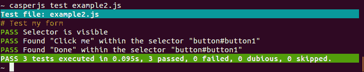

    `casperjs test` 命令允许我们使用 `casper.test` 属性，它提供了所有的测试方法。

    当使用 `casperjs test` 命令时，我们不需要创建 `casper` 实例，但我们需要调用 `begin` 方法，并用 `done` 方法结束测试。

1.  首先，使用 `assertVisible`，我们确保我们的按钮是可见的。指定元素最常见的方式是提供一个准确的 CSS 选择器。

1.  然后，我们使用`assertSelectorHasText`来检查点击按钮前后按钮的文本内容。我们可以看到所有我们的测试都通过了。

    ### 小贴士

    `begin`方法接受一个描述和预期测试次数（除了测试本身）作为参数。成功和失败的测试次数将在最后一行显示。

1.  现在，让我们通过更改第二个`assertSelectorHasText`测试器来破坏我们的测试，如下面的代码所示：

    ```js
    this.test.assertSelectorHasText("button#button1", "You can click again");
    ```

    ### 小贴士

    **下载示例代码**

    您可以从[`www.PacktPub.com`](http://www.PacktPub.com)的账户下载您购买的所有 Packt 书籍的示例代码文件。如果您在其他地方购买了这本书，您可以访问[`www.PacktPub.com/support`](http://www.PacktPub.com/support)并注册，以便将文件直接通过电子邮件发送给您。

1.  结果如下：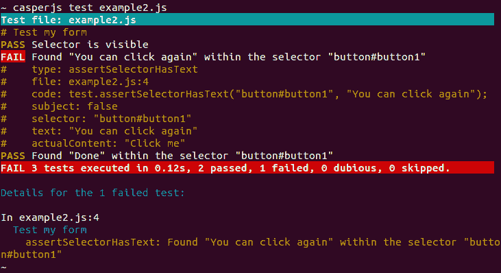

    我们清楚地看到我们的两个断言仍然通过，但现在有一个失败了。

### 时间就是一切

在使用 JavaScript 开发时，我们经常需要链式调用两段代码（例如，首先我们加载一些 JSON 数据，然后我们使用这些数据更新页面内容）。但是，每一步通常是非阻塞的，这意味着即使步骤未完成，其余的代码也会继续执行，而且无法预测第一步何时完成。

解决这个问题的最稳健和常见的方法是**回调**机制。我们将第二段代码放在一个函数中，并将其作为参数传递给第一个函数，这样它就可以在完成时调用该函数。

结果是，代码没有线性且可预测的执行顺序。这使得测试变得有些棘手。

以下是一个示例（`example3.html`）：

```js
<html>
<head>
   <script type='text/javascript' src='http://code.jquery.com/jquery-1.9.1.js'></script>
   <style>
   .searching { color: grey;}
   .success { color: green;}
   .noresults {color: red;}
   </style>
</head>
<body>
   <script>
   function geonamesSearch() {
      $('#results').html("Searching...");
      $('#results').attr('class', 'searching');
      var url = "http://api.geonames.org/searchJSON";
      var query = $('#searchedlocation').val();
        $.getJSON(url + "?username=demo&q="+ query +"&maxRows=25&featureClass=P",null,            function(data) {
                var data = data.geonames;
                var names = [];
                if(data.length > 0) {
                    $.each(data, function(i, val){  
                        names.push(val.name +" ("+val.adminName1+")");
                    });
                    $('#results').html(names.join("<br/>"));
                    $('#results').attr('class', 'success');
                } else {
                    $('#results').html("No matching place.");
                    $('#results').attr('class', 'noresults');
                }
            }
        );
   }
   </script>
   <input type="text" id="searchedlocation" />
   <button id="search" onclick="geonamesSearch();">Click me</button>
   <div id="results"></div>
</body>
</html>
```

我们在这里使用的演示账户用于访问 Geonames.org 服务，有一个每日限制，如果达到限制，我们可以访问[`www.geonames.org/login`](http://www.geonames.org/login)并创建我们自己的账户。前面的代码将创建一个包含文本输入字段、按钮和一个 ID 为`'results'`的空 div 的页面。当我们点击按钮时，JavaScript 函数`geonamesSearch`执行以下操作：

+   它将`'searching'`类添加到`results`div，并插入**正在搜索...**的提及

+   它读取文本输入的当前值

+   它调用 GeoNames JSON 网络服务以获取与您输入的值匹配的地点名称

+   这个 JSON 调用是由 jQuery 执行的，我们提供了一个回调函数，当 GeoNames 网络服务响应并读取结果时将被调用

+   如果没有结果，它将`results`div 类的值更改为`'noresults'`，并将其文本更改为**没有匹配的地点**。

+   如果有一些结果，它将类设置为`'success'`并显示匹配的地点名称

我们可以用我们的网络浏览器尝试它，看看它是否工作得很好。

现在，让我们使用以下脚本（`example3.js`）测试这个页面，该脚本输入值 `'barcelona'` 并断言我们确实得到了结果中的 **巴塞罗那（加泰罗尼亚）**：

```js
casper.userAgent('Mozilla/5.0 (Macintosh; Intel Mac OS X)');

casper.test.begin('Search a city by name', 1, function(test) {
    casper.start('http://localhost:8000/example3.html', function() {
        this.sendKeys("input#searchedlocation", "barcelona");
        this.click("button#search");
    });

    casper.then(function() {
        test.assertTextExists('Barcelona (Catalonia)', 'Barcelona (Catalonia) has been found.');
    })

    casper.run(function() {
        test.done();
    });
});
```

### 注意

我们需要设置一个常规用户代理，以确保 `geonames.org` 会接受处理我们的请求。

如果我们运行它，我们会得到一个失败：

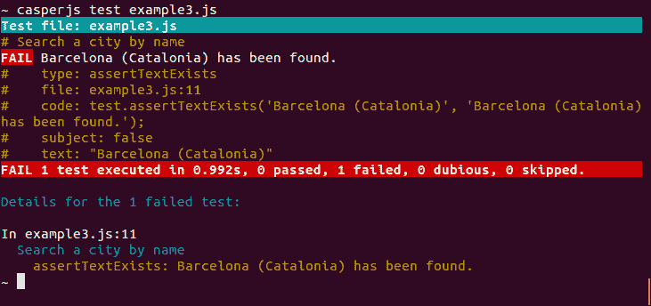

为什么会这样？因为我们的 `this.click()` 触发了 `geonamesSearch` 函数，紧接着我们就尝试断言结果内容。然而，由于 GeoNames 网络服务没有足够的时间响应，所以在断言执行时内容还不是我们预期的。

为了管理这类情况，CasperJS 提供了在执行其余测试之前等待的能力。

以下是一个工作测试脚本：

```js
casper.userAgent('Mozilla/5.0 (Macintosh; Intel Mac OS X)');

casper.test.begin('Search a city by name', 1, function(test) {
    casper.start('http://localhost:8000/example3.html', function() {
        this.sendKeys("input#searchedlocation", "barcelona");
        this.click("button#search");
    });

    casper.waitForSelector('div.success', function() {
        test.assertTextExists('Barcelona (Catalonia)', 'Barcelona (Catalonia) has been found.');
    })

    casper.run(function() {
        test.done();
    });
});
```

我们可以看到，现在测试已经成功通过：

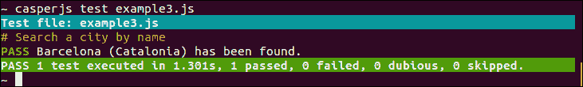

使用 `waitForSelector`，我们确保断言只有在 `results` div 具有 `'success'` 类时才会执行，并且只有在我们的 JSON 加载回调函数被调用后才会发生。

### 注意

`waitForSelector` 方法不会无限期等待；它确实有一个超时时间（默认值为 5000 毫秒，可以更改），并且我们可以提供一个在选择器满足之前达到超时时间的第二个函数。

### 实时录制

编写测试可能需要时间。一个快速方便的方法是直接从我们的网页浏览器中录制实际的用法序列（就像 Firefox 的 Selenium 插件一样）。

要将网页序列录制为 CasperJS 测试，我们可以使用一个名为 **Resurrectio** 的 Chrome 扩展程序。

我们可以从 Chrome 网上应用店安装它（访问 [`chrome.google.com/webstore/`](https://chrome.google.com/webstore/)，搜索 `resurrectio`，然后点击添加按钮），它会在 URL 栏旁边添加一个新按钮：

1.  我们点击 **Resurrectio** 按钮开始录制：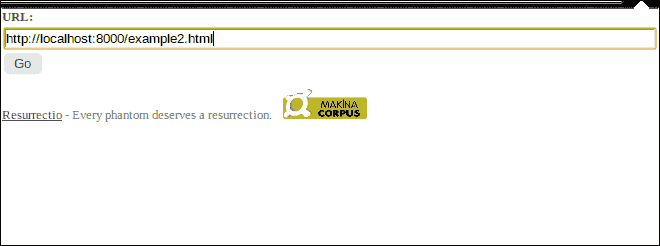

1.  我们可以在窗口中导航或执行任何常规操作。

1.  通过右键单击，我们可以添加一些断言或截图：

1.  通过再次点击 **Resurrectio** 按钮来停止录制，然后可以将之前的序列导出为 CasperJS 测试：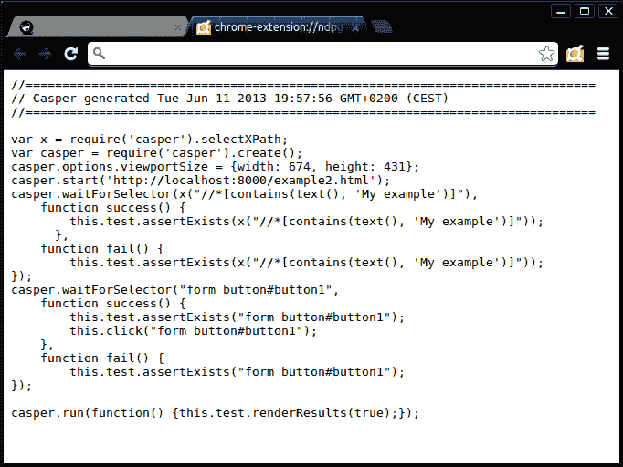

然而，请注意；在某些情况下，我们可能需要手动修改生成的测试，原因如下：

+   它可能包含很多无用的断言（由于录制过程中的额外点击）。

+   它可能过于冗长和复杂，使得维护变得更加困难。因此，我们更愿意简化它，以关注最有意义的方面。

+   并非所有断言都可以从 Resurrectio 注册，我们可能需要不同的断言。

## 它是如何工作的...

CasperJS 的一个关键优点是它能够链式执行测试步骤，因为这些步骤将按照它们注册的顺序执行。

如前所述，在 JavaScript 中通过使用回调函数来链式调用步骤，如下所示：

```js
doStep1AndThen(function() {
   doStep2AndThen(function() {
      doStep3AndThen(function() {
         doStep4AndThen(function() {
            ...
         })
      })
   })
})
```

如果我们直接使用 PhantomJS，那么我们的测试看起来会是这样，并且阅读或维护起来可能不太方便。

但使用 CasperJS，通过 `then()` 或 `waitFor()` 方法，我们可以声明连续的步骤，而无需这种无限回调嵌套级联。

CasperJS 在幕后为我们处理回调链，创建出更多可读性的测试脚本。

## 还有更多...

让我们看看我们刚刚使用的一些不同特性的更多细节。

### XPath 选择器

默认情况下，CasperJS 使用 CSS3 选择器，但如果我们更喜欢或者必须使用的话，也可以使用 XPath 选择器。

XPath 选择器比 CSS3 选择器可读性差，但功能更强大（例如，在匹配文本内容或对 DOM 元素的祖先或后代设置条件时）。

要使用 XPath 选择器，我们只需要加载 CasperJS 的 `selectXPath` 工具：

```js
var x = require('casper').selectXPath;
...
    test.assertExists(x("//*[contains(text(), 'Barcelona (Catalonia)')]"), 'The search results are correct');
```

### 断言方法

CasperJS 测试器 API 提供了大量断言方法。

我们可以通过以下方式断言条件和函数结果：

+   `assert(Boolean condition[, String message])` 方法断言条件严格为 `true`

+   `assertNot(mixed subject[, String message])` 方法断言条件不是 `true`

+   `assertTruthy(Mixed subject[, String message])` 方法断言主题是 `truthy`

+   `assertFalsy(Mixed subject[, String message])` 方法断言主题是 `falsy`

    ### 注意

    让我们解释一下 `true`、`false`、`truthy` 和 `falsy` 是什么意思。

    在 JavaScript 中，`true` 和 `false` 是两个严格的布尔值。例如，`null`、`undefined`、空字符串 `''`、数字 `0`、数字 `NaN` 都是 `falsy`，这意味着如果它们在条件中评估，将返回 `false`。

    而其他任何值都是 `truthy`，这意味着如果它们在条件中评估，将返回 `true`。

+   `assertEquals(mixed testValue, mixed expected[, String message])` 方法断言两个参数相等

+   `assertNotEquals(mixed testValue, mixed expected[, String message])` 方法断言两个参数不相等

+   `assertEval(Function fn[, String message, Mixed arguments])` 方法断言在页面 DOM 中评估的函数返回 `true`

    示例：

    ```js
    this.test.assertEval(function() {
       if(window.jQuery) {
          return true;
       } else {
          return false;
       }
    }, "jQuery is available");
    ```

+   `assertEvalEquals(Function fn, mixed expected[, String message, Mixed arguments])` 方法断言在 DOM 页面中评估的函数返回预期的值

+   `assertMatch(mixed subject, RegExp pattern[, String message])` 方法断言值与正则表达式匹配

+   `assertRaises(Function fn, Array args[, String message])` 方法断言使用提供的参数调用的函数引发错误

+   `assertType(mixed value, String type[, String message])` 方法断言值的类型是预期的类型

我们可以通过以下方式断言 DOM 元素：

+   `assertExists(String selector[, String message])` 方法断言选择器至少匹配页面中的一个元素

+   `assertDoesntExist(String selector[, String message])` 方法断言选择器不匹配页面中的任何元素

+   `assertField(String inputName, String expected[, String message])` 方法断言表单字段具有预期的值

+   `assertVisible(String selector[, String message])` 方法断言元素是可见的

+   `assertNotVisible(String selector[, String message])` 方法断言匹配的元素不可见

+   `assertSelectorHasText(String selector, String text[, String message])` 方法断言匹配的元素包含预期的文本

+   `assertSelectorDoesntHaveText(String selector, String text[, String message])` 方法断言匹配的元素不包含给定的文本

我们可以通过以下方式断言页面信息：

+   `assertHttpStatus(Number status[, String message])` 方法断言当前 HTTP 状态是预期的

+   `assertResourceExists(Function testFx[, String message])` 方法断言资源在页面上存在

    ### 注意

    参数可以是一个字符串（资源名称）、一个正则表达式（预期至少匹配一个现有资源）或一个函数（预期至少返回现有资源中的一个为`true`）。

+   `assertTextExists(String expected[, String message])` 方法断言页面包含预期的文本

+   `assertTextDoesntExist(String unexpected[, String message])` 方法断言页面不包含给定的文本

+   `assertTitle(String expected[, String message])` 方法断言页面标题是预期的

+   `assertTitleMatch(RegExp pattern[, String message])` 方法断言页面标题与给定的正则表达式匹配

+   `assertUrlMatch(Regexp pattern[, String message])` 方法断言页面 URL 与给定的正则表达式匹配

### `WaitFor` 方法

以下列出了 CasperJS 的`waitFor`方法：

+   `waitForText(String|RegExp pattern[, Function then, Function onTimeout, Number timeout])` 方法等待直到文本出现

+   `waitForSelector(String selector[, Function then, Function onTimeout, Number timeout])` 方法等待直到选择器满足条件

+   `waitWhileSelector(String selector[, Function then, Function onTimeout, Number timeout])` 方法等待直到选择器不再满足条件

+   `waitUntilVisible(String selector[, Function then, Function onTimeout, Number timeout])` 方法等待直到选定的元素可见

+   `waitWhileVisible(String selector[, Function then, Function onTimeout, Number timeout])` 方法等待直到选定的元素不再可见

+   `waitFor(Function testFx[, Function then, Function onTimeout, Number timeout])` 方法等待直到函数返回`true`

+   `waitForResource(Function testFx[, Function then, Function onTimeout, Number timeout])`方法等待函数匹配现有资源

+   `waitForPopup(String|RegExp urlPattern[, Function then, Function onTimeout, Number timeout])`方法等待模式匹配弹出 URL

### `wait()`方法

在`waitFor`方法列表中，我们还没有提到以下一个：

```js
wait(Number timeout[, Function then])
```

它只是等待一定的时间（以毫秒为单位）。

但如前所述，在 JavaScript 中，*时间无关紧要，而时机至关重要*。同样，在 JavaScript 中，等待给定的时间并不能保证我们测试的准确性。通常，当我们绝望时，我们会使用`wait()`。例如，如果我们无法修改测试页面，我们无法添加一个有趣的信号来观察，例如我们示例中的`'noresult'`和`'success'`类。

然而，让我们记录一下`wait()`方法的一个相关用法。当我们的页面包含一些渐进式 JPEG 图像，并且我们想要捕获一张新图像（参见*超越测试（高级）*菜谱）时，我们需要在捕获之前等待一段时间，以便让我们的图像完全渲染。

### 从 GitHub 源安装 Resurrectio

Resurrectio 目前还不完全稳定，因此使用当前的开发版本可能很有趣。

要这样做，你必须克隆`resurrectio`GitHub 仓库：

```js
~ git clone git://github.com/ebrehault/resurrectio.git

```

它将生成一个`./resurrectio`文件夹。

然后，在 Chrome 中执行以下步骤：

1.  前往**工具** | **扩展**。

1.  打开**开发者模式**复选框。

1.  点击**加载未打包扩展**按钮。

1.  选择`./resurrectio`文件夹。

# 编写高级测试（中级）

这个菜谱将详细介绍如何使用 CasperJS 模拟丰富的 Web 交互，以实现更复杂的测试。

## 如何做到这一点...

以下章节将涵盖编写高级测试的各个步骤。

### 下载文件

首先，让我们学习如何下载文件。从网页下载文件最常见的方法是提供指向该文件的链接，如下所示（`example4.html`）：

```js
<html><body>
   <h1>My example</h1>
   <a id="link-to-text" href="files/text.txt">Download a text</a>
   <a id="link-to-pdf" href="files/text.pdf">Download a PDF</a>
</body></html>
```

现在，让我们创建以下 CasperJS 脚本（`example4.js`）：

```js
var casper = require('casper').create();

casper.start('http://localhost:8000/example4.html', function() {
    this.click("#link-to-text");
});
casper.then(function() {
   this.echo(this.getCurrentUrl());
});

casper.thenOpen('http://localhost:8000/example4.html', function() {
   this.click("#link-to-pdf");
});

casper.then(function() {
   this.echo(this.getCurrentUrl());
});

casper.run();
```

它应该打开我们的页面，点击第一个链接，记录当前页面 URL，重新打开页面，点击第二个链接，并记录当前页面 URL。

为了完成我们的测试，让我们创建一个名为`files`的文件夹，在这个文件夹中添加两个虚拟文件（`text.txt`和`text.pdf`），并启动我们的 SimpleHTTPServer 网络服务器。

让我们运行脚本：

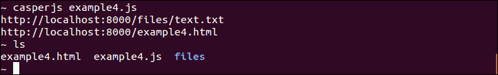

当我们点击第一个链接时，我们实际上是以页面形式打开了`.txt`文件，但当我们点击第二个链接时，我们打开了原始位置保留的文件。如果我们检查当前文件夹内容，我们会看到没有任何文件被下载。

因此，`click()` 方法不会帮助我们下载任何文件；如果 PhantomJS 能够打开它，它将导航到相应的链接，或者它将打开原始位置中保留的文件，不会产生错误和输出。

下载文件的正确方法是使用 `download()` 方法。让我们使用以下代码修复我们的测试：

```js
var casper = require('casper').create();
casper.start('http://localhost:8000/example4.html', function() {
    this.download("http://localhost:8000/files/text.txt", "text.txt");
    this.download("http://localhost:8000/files/text.pdf", "text.pdf");
});

casper.run();
```

结果如下所示：

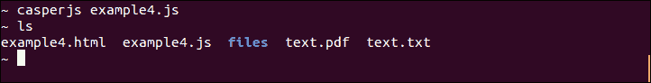

现在我们已经下载了文件，让我们来看看如何上传文件。

### 上传文件

在测试期间执行文件上传，我们将使用 `fill()` 方法。`fill()` 方法允许我们填写表单，并且可选地提交它。此外，它还能够管理文件输入。

以下是一个示例（`example5.js`）：

```js
var x = require('casper').selectXPath;
casper.test.begin('Upload a file', 1, function(test) {
    casper.start('http://imagebin.org/', function() {
        this.click(x("//a[normalize-space(text())='Add your image now!']"));
    });

    casper.then(function() {
        this.fill("form[name=image_form]", {
            'nickname' : 'casper',
            'image': './test.png',
            'title': 'my test',
            'description': 'just a test',
            'disclaimer_agree': 'Y'
        }, true);
    });

    casper.then(function() {
        test.assertExists('img[alt="my test"]', "The image has been uploaded");
        this.echo("It is available here: " + this.getCurrentUrl());
    });

    casper.run(function() {
        test.done();
    });
});
```

您可以使用以下步骤进行此测试：

1.  前往 [`imagebin.org`](http://imagebin.org)。

1.  点击 **立即添加您的图片** 链接。

1.  然后，填写图片提交表单。

1.  断言我们获得了一个包含我们图片的页面。

1.  显示此页面 URL。

如我们所见，`'image'` 字段与其他字段的管理方式相同；其值只是我们本地图片的路径。

在传递包含字段值的第一个参数之后，我们将 `true` 作为第二个参数传递给 `fill()`，以便提交表单。

在运行测试之前，我们确保将一个名为 `test.png` 的图片放在我们的当前文件夹中，当我们运行测试时，以下是我们得到的结果：

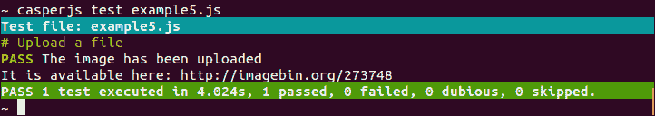

### 认证

让我们看看我们如何管理认证。当我们尝试打开需要认证的页面时，我们得到一个 401 HTTP 错误（`example6.js`）：

```js
casper.test.begin('Log in', 1, function(test) {
    casper.start('http://www.plomino.net/zmiroot/testpage', function() {
        test.assertHttpStatus(401, 'We cannot see the page as we are not logged in.');
    });

    casper.run(function() {
        test.done();
    });
});
```

结果如下所示：

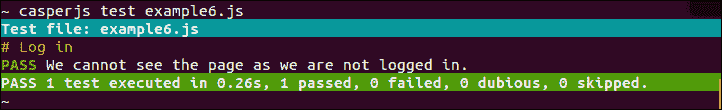

现在，让我们使用 `setHttpAuth()` 方法正确登录：

```js
casper.test.begin('Log in', 1, function(test) {
    casper.start();

    casper.setHttpAuth('demoaccount', 'demoaccount');

    casper.thenOpen('http://www.plomino.net/zmiroot/testpage', function() {
        test.assertTextExists('You are logged in.', 'Now we can see the page.');
    });
    casper.run(function() {
        test.done();
    });
});
```

以下是我们的结果：

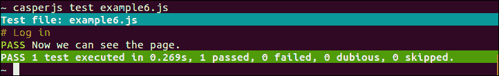

`setHttpAuth()` 方法只能用于 HTTP 认证。当我们的目标页面使用表单认证时，我们只需填写认证表单。以下是一个示例（`example7.js`）：

```js
casper.test.begin('Log in', 1, function(test) {
    casper.start('http://www.plomino.net/samples', function() {
        this.fill('#loginform',
            {
                '__ac_name': 'demouser',
                '__ac_password': 'demouser'
            }, true);
    });

    casper.then(function() {
        test.assertTextExists('Welcome! You are now logged in', 'We are logged in.');
    });

    casper.run(function() {
        test.done();
    });
});
```

输出如下所示：

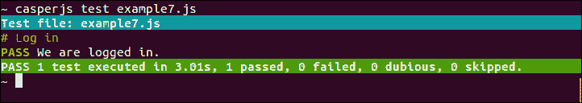

### 键盘和鼠标事件

模拟键盘和鼠标事件是另一个非常常见的用例。让我们考虑以下页面（`example8.html`）：

```js
<html><body>
   <script>
   function updateMessage(element) {
      var message = 'You have entered ' + element.value.length + ' characters.';
      document.querySelector('#message').textContent = message;
   }
   </script>
   <h1>My example</h1>
   <form id="my-form">
      <p>Firstname: <input
         type="text"
         name="firstname"
         onkeyup="updateMessage(this);"/>
      </p>
      <div id="message"></div>
   </form>
</body></html>
```

如果我们启动我们的简单 HTTP 服务器，我们可以尝试打开 `http://localhost:8000/example8.html` 页面。

当我们在输入框中输入值时，会在输入框下方显示一条消息，指示我们已输入的字符数。

要测试此行为，我们可以使用 `sendKeys()` 方法（`example8.js`）：

```js
casper.test.begin('Test key inputs', 1, function(test) {
   casper.start('http://localhost:8000/example8.html', function() {
      this.sendKeys('input[name="firstname"]', 'Eric');
   });
   casper.then(function() {
      test.assertSelectorHasText('#message', "You have entered 4 characters.");
   });
   casper.run(function() {
        test.done();
    });
});
```

当我们运行代码时，我们将看到以下结果。如果您在文本输入框中输入 `Eric`，则消息将显示 **您已输入 4 个字符**：

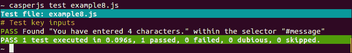

`sendKeys()` 方法将文本插入到文本输入框中，并触发了 `onkeyup` 事件。

`sendKeys()`方法可以在页面的任何元素上产生一个按键事件（不一定是输入）。

让我们将页面`example8.html`修改为使标题可编辑：

```js
<h1 contenteditable="true">My example</h1>
```

现在如果我们点击标题，我们可以更改其文本内容。

让我们修改我们的测试脚本：

```js
casper.test.begin('Test key inputs', 2, function(test) {
   casper.start('http://localhost:8000/example8.html', function() {
      this.sendKeys('input[name="firstname"]', 'Eric');
   });
   casper.then(function() {
      test.assertSelectorHasText('#message', "You have entered 4 characters.");
   });
   casper.then(function() {
      this.click('h1');
      this.sendKeys('h1', 'I have changed my header');
   });
   casper.then(function() {
      test.assertSelectorHasText('h1', "I have changed my header");
   });
   casper.run(function() {
        test.done();
    });
});
```

现在，按照以下步骤进行此测试：

+   点击标题并在其开头输入新文本

+   断言新的标题内容

输出将如下所示：

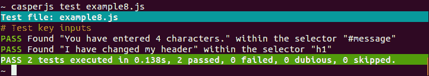

### 注意

由于我们现在在测试脚本中有一个额外的断言，我们将`begin()`方法的第二个参数从`1`更改为`2`。

关于鼠标事件，我们已经在测试脚本中使用了`casper.click()`方法。它接受一个选择器作为参数，并在指定的元素上触发点击事件。

我们使用它来点击链接或按钮，例如。

我们也可以使用`mouseEvent()`方法触发其他鼠标事件；它的第一个参数是事件类型，第二个参数是目标元素选择器。

它可以触发以下事件：

+   `mouseup`

+   `mousedown`

+   `click`

+   `mousemove`

+   `mouseover`

+   `mouseout`

让我们创建以下网页（`example9.html`）：

```js
<html><body>
   <h1 id="chap1">Chapter 1</h1>
   <h1 id="chap2">Chapter 2</h1>
   <h1 id="chap3">Chapter 3</h1>
   <h1 id="chap4">Chapter 4</h1>
   <div>Counter: <span id="counter"></span></div>
   <script>
var counter = 0;
function incrementCounter() {
   counter =  counter + 1;
   document.querySelector('#counter').textContent = counter;
}
for(i=0;i<document.querySelectorAll("h1").length;i++) {
   document.querySelectorAll("h1")[i].onmouseover=incrementCounter;
}
   </script>
</body></html>
```

它显示了一个标题列表，当鼠标悬停在任何一个标题上时，计数器会增加。

我们可以使用`mouseEvent()`测试此页面，如下面的测试（`example9.js`）所示：

```js
casper.test.begin('Test mouse events', 1, function(test) {
   casper.start('http://localhost:8000/example9.html', function() {
      this.mouseEvent('mouseover', '#chap1');
      this.mouseEvent('mouseover', '#chap4');
      this.mouseEvent('mouseover', '#chap1');
      this.mouseEvent('mouseover', '#chap1');
   });
   casper.then(function() {
      test.assertSelectorHasText('#counter', "4");
   });

   casper.run(function() {
        test.done();
    });

});
```

结果如下：

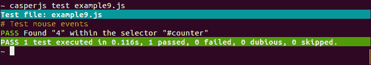

但是 CasperJS 还提供了一个特定的`'mouse'`模块来直接控制鼠标。它允许移动鼠标和控制点击（按下、释放、点击、双击）。

如果我们想要测试像拖放这样的复杂鼠标交互，这可能很有用。以下是一个提供可拖动框（`example10.html`）的网页，它使用 jQueryUI 的`draggable()`方法：

```js
<html>
<head>
<style>
#box {color: white; background-color: blue; width: 100px; position: absolute; top: 0; left: 0;}
</style>
</head>
<body>
   <script src="img/jquery-1.9.1.js"></script>
   <script src="img/jquery-ui.js"></script>
   <script>
$(document).ready(function() {
   $('#box').draggable();
});
   </script>
   <div id="box">My box</div>
</body></html>
```

我们可以使用 CasperJS 鼠标模块（`example10.js`）测试此页面：

```js
casper.options.viewportSize = {width: 1024, height: 768};

casper.test.begin('Test drag&drop', 2, function(test) {
    casper.start('http://localhost:8000/example10.html', function() {
        test.assertEval(function() {
            var pos = $('#box').position();
            return (pos.left == 0 && pos.top == 0);
        }, "The box is at the top");
        this.mouse.down(5, 5);
        this.mouse.move(400, 200);
        this.mouse.up(400, 200);
    });
    casper.then(function() {
        test.assertEval(function() {
            var pos = $('#box').position();
            return (pos.left == 395 && pos.top == 195);
        }, "The box has been moved");
    });
    casper.run(function() {
        test.done();
    });
});
```

输出将如下所示：

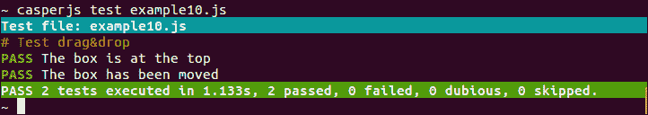

我们可以看到在这个测试中有许多有趣的事情：

+   我们设置了视口大小（使用`viewportSize`选项）。在我们的例子中，这很有用，因为我们需要确保我们有足够的空间移动到我们想要的位置。

+   我们使用 jQuery 获取盒子的当前位置！由于 jQuery 已加载到我们的测试页面中，我们可以通过`assertEval()`使用它，因为它在测试页面上运行代码。

+   我们使用`down()`，然后`move()`，然后`up()`从点(5,5)到点(400,200)产生拖放移动。

## 它是如何工作的...

即使它们可能看起来非常相似，`casper.click()`和`casper.mouse.click()`之间还是有区别的。

首先，`casper.click()`只接受一个选择器作为参数，而`casper.mouse.click()`接受一个选择器或一个(x, y)位置。

但更重要的是，它们的工作方式并不相同；`casper.click()` 创建一个事件并将其 *分发* 到目标事件，而 `casper.mouse.click()` 不处理任何元素，只是在给定位置 *产生鼠标动作*。

如果 `casper.click()` 无法分发事件（因为某个地方的 `preventDefault()` 方法挂起），它将默认使用 `casper.mouse.click()` 方法。

### 注意

`casper.mouseEvent()` 与 `casper.click()` 的工作方式完全相同。

## 还有更多...

让我们探索一下在上一个部分中使用的不同功能的更多细节。

### 将参数传递给 download() 方法

`download()` 方法也可能接受两个额外的参数，如下所示：

```js
download(String url, String target[, String method, Object data])
```

因此，我们可以使用我们想要的方法产生 HTTP 请求，并在数据对象中传递所需的参数。

### setHttpAuth 可能会有令人惊讶的时间延迟

考虑我们回到关于 `setHttpAuth()` 的测试（`example6.js`），并尝试将两个版本串联起来：

```js
casper.test.begin('Log in', 2, function(test) {

    casper.start('http://www.plomino.net/zmiroot/testpage', function() {
        test.assertHttpStatus(401, 'We cannot see the page as we are not logged in.');
    });

    casper.setHttpAuth('demoaccount', 'demoaccount');

    casper.thenOpen('http://www.plomino.net/zmiroot/testpage', function() {
        test.assertTextExists('You are logged in.', 'Now we can see the page.');
    });
    casper.run(function() {
        test.done();
    });
});
```

我们预计测试会成功，因为以下条件：如果我们匿名，我们会收到 401 错误；如果我们登录，我们能够查看页面。

但是，我们得到的结果如下：

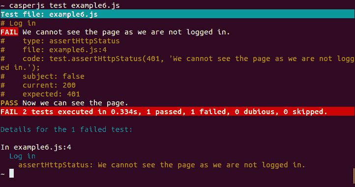

第一个测试失败了；我们没有收到 401 错误，而是收到了 200 状态码！这意味着我们实际上已经登录了。

为什么会这样呢？这是因为 CasperJS 会将包含在 `then()` 块中的步骤串联起来。如果 `setHttpAuth()` 没有包含在 `then()` 块中，它将从开始（`start()` 调用）到结束都有效。

让我们在以下 `then()` 块中包含它：

```js
casper.test.begin('Log in', 2, function(test) {

    casper.start('http://www.plomino.net/zmiroot/testpage', function() {
        test.assertHttpStatus(401, 'We cannot see the page as we are not logged in.');
    });

 casper.then(function() {
 this.setHttpAuth('demoaccount', 'demoaccount');
 })

    casper.thenOpen('http://www.plomino.net/zmiroot/testpage', function() {
        test.assertTextExists('You are logged in.', 'Now we can see the page.');
    });
    casper.run(function() {
        test.done();
    });
});
```

现在，测试通过了如下所示：

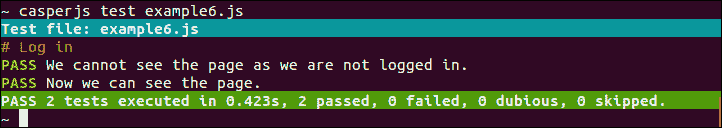

# 最佳实践（中级）

本节将讨论使用 CasperJS 进行 Web 功能测试的基本最佳实践。

## 测试真实的事物

我们的软件质量取决于我们测试的准确性。测试总是好的，但如果我们没有准确测试软件的行为，我们可能会错过一些潜在的问题。为了创建准确的测试，我们必须忘记系统及其工作方式，我们必须专注于用户交互。

这听起来可能很明显，但实际上并非如此，因为大多数时候我们设计和编写系统，但并不经常像标准用户那样使用它。

让我们考虑一个基本的网页表单的典型例子。关于网页表单，这里有一个重要的事情要知道：*用户永远不会提交网页表单*。他们实际上做的是以下事情：

+   在输入框中输入值

+   点击 **提交** 按钮

这些操作确实会产生表单提交，但用户实际上并没有自己提交表单；是他们的网络浏览器或系统为他们做了这件事。

显然，如果我们想测试这个系统，我们不能依赖于它的假设行为。

正因如此，我们的测试必须产生真实的用户交互，然后断言产生的行为是正确的。

让我们看看以下示例（`example11.html`）：

```js
<html><body>
  <form id="form1">
    <p>Firstname: <input type="text" name="firstname"/></p>
    <p>Lastname: <input type="text" name="lastname"/></p>
    <p>Age: <input type="text" name="age"/></p>
    <input type="submit" value="Save" name="save" />
  </form>
  <form id="form2">
    <p>Firstname: <input type="text" name="firstname"/></p>
    <p>Lastname: <input type="text" name="lastname"/></p>
     <p>Age: <input type="text" name="age"/></p>
  </form>
  <form id="form3">
    <p>Firstname: <input type="text" name="firstname"/></p>
    <p>Lastname: <input type="text" name="lastname"/></p>
    <p>Age: <input style="display: none;" type="text" name="age"/></p>
    <input type="submit" value="Save" name="save" />
  </form>
</body></html>
```

这个页面显示了以下三个表单：

+   第一个包含名字、姓氏和年龄，以及一个**保存**按钮

+   第二个有相同的字段，但没有**保存**按钮

+   第三个包含所有字段和一个**保存**按钮，但**年龄**字段是隐藏的

如果我们启动我们的简单 HTTP 服务器，第一个将正常工作，但其他两个将不可用。

现在，让我们按照以下方式测试它（`example11-1.js`）：

```js
var formid = casper.cli.options['formid'];

casper.test.begin('Test form submission', 3, function(test) {

    casper.start('http://localhost:8000/example11.html', function() {
        this.fill("#" + formid, {
            firstname: "Isaac",
            lastname: "Newton",
            age: "370",
        }, true);
    });
    casper.then(function() {
        test.assertUrlMatch(/firstname=Isaac/);
        test.assertUrlMatch(/lastname=Newton/);
        test.assertUrlMatch(/age=370/);
    });
    casper.run(function() {
        test.done();
    });
});
```

这个测试使用`casper.fill()`提交表单，并为每个字段提供一个值，然后断言以获取结果 URL 中的三个值。

### 小贴士

在这个测试中，我们使用`casper.cli.options`读取传递给`casperjs`命令的选项；这样，我们可以使用相同的脚本测试三个不同的表单。

让我们运行它。以下截图显示了输出结果：

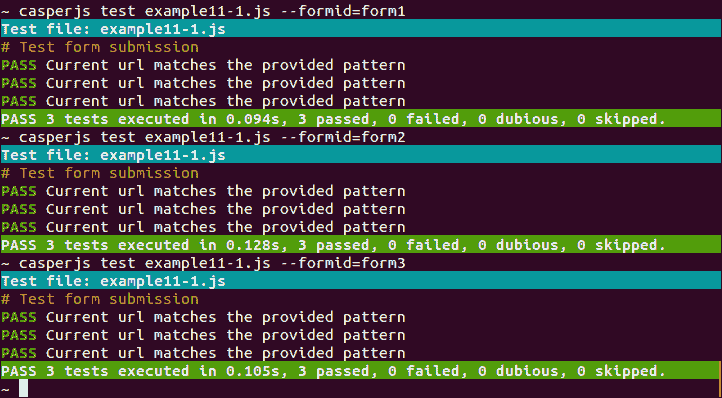

测试如预期地通过了第一个表单，但它们也通过了其他两个！

为什么会这样？这是因为`fill()`方法对我们在表单中引入的错误视而不见；它只是执行提交，而不检查一个真实用户是否真的能做同样的事情。

以下是一个更接近真实用户交互的测试（`example11-2.js`）：

```js
var formid = casper.cli.options['formid'];

casper.test.begin('Test form submission', 3, function(test) {
    casper.start('http://localhost:8000/example11.html', function() {
        this.sendKeys("form#"+formid+" input[name='firstname']", "Isaac");
        this.sendKeys("form#"+formid+" input[name='lastname']", "Newton");
        this.sendKeys("form#"+formid+" input[name='age']", "370");
        this.click("form#"+formid+" input[type=submit][value='Save']");
    });
    casper.then(function() {
        test.assertUrlMatch(/firstname=Isaac/);
        test.assertUrlMatch(/lastname=Newton/);
        test.assertUrlMatch(/age=370/);
    });

    casper.run(function() {
        test.done();
    });
});
```

在这里，我们使用`sendKeys()`在输入框中输入值，并使用`click()`方法点击**提交**按钮。这基本上就是用户会用他们的键盘和鼠标做的事情。

现在让我们运行它。以下截图显示了输出结果：

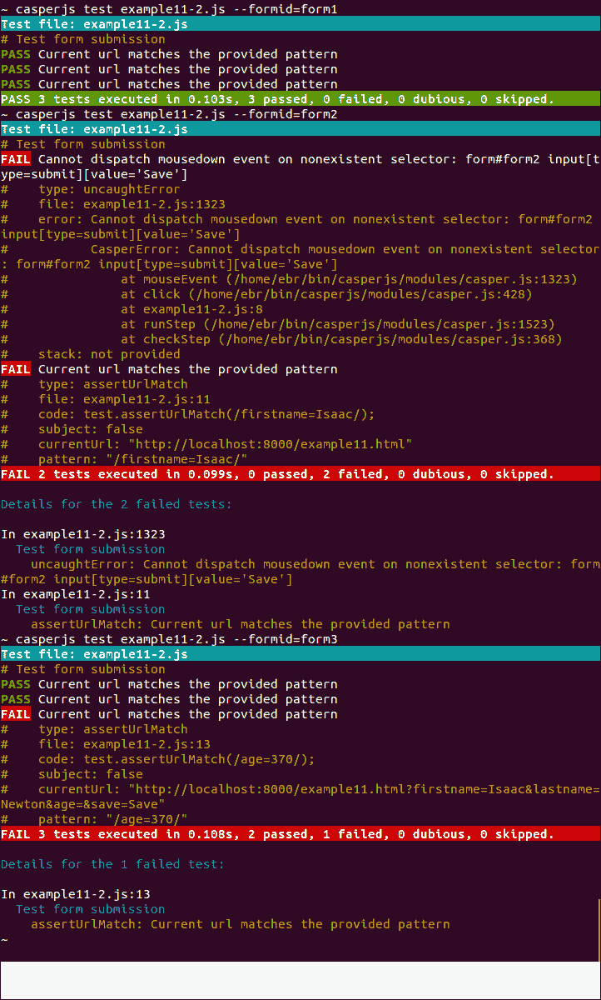

这要好得多；现在我们的测试在第二个和第三个表单中失败了。

这并不意味着我们永远不能使用`fill()`方法。那只是一个例子。这里的主要观点是我们必须始终小心，尽可能接近用户交互。但当然，我们还需要创建简洁且易于维护的测试。

因此，一个好的方法是编写几种不同类型的测试，如下所示：

+   一些针对用户交互的精确测试（例如，我们将使用`sendKeys()`和`click()`而不是`fill()`），以确保每个页面都能独立使用

+   一些针对屏幕链和用例场景的简洁测试（例如，我们可以使用`fill()`），以确保整个应用程序运行良好

## 应对设计变更

有些人喜欢在开发结束时编写测试，那时他们知道一切几乎都很稳定。

但编写测试的最佳时间是从开发开始到结束。这已经在很多书中得到了证明，但最明显的原因之一是我们通常在开发阶段产生我们最大的部分错误，而测试是帮助对抗错误的一大助力。

不幸的是，那些在开发结束时编写测试的人是正确的：网站在开发后（通常）比开发期间更稳定。

可能会改变很多的一个方面是设计。设计变更不应该影响应用程序功能。但有时它们确实会，可能有很多原因，比如一个 CSS 属性可以使按钮不可见，一个元素的 ID 的修改可能会破坏一个 JavaScript 调用，等等。但我们并不太在意这一点，因为如果设计破坏了任何功能，我们的测试会立即警告我们。

问题在于，有时即使设计变更没有破坏任何功能，我们的测试也会失败。这非常糟糕，因为它意味着我们无法信任我们的测试来知道某物是否损坏。

如果所有特性都得到了保留，为什么我们的测试会失败？这仅仅是因为我们的测试比我们的网页特性更不具设计鲁棒性，而设计鲁棒测试的编写主要依赖于选择器。

事实上，我们的测试内部逻辑（例如，如果我们点击 *这里*，我们应该得到 *那个*）不应该受到设计变更的影响。

但如果我们不够小心，很容易破坏的是我们定义 *这里* 和 *那个* 的方式。它们将使用选择器来定义。我们必须选择关注逻辑而不是布局的选择器。

以下是一些示例：

| 替换为 | 更喜欢 | 因为 |
| --- | --- | --- |
| `"div#form-container span input"` | `"form[name='registration'] input[name='firstname']"` | 我们只依赖于表单元素及其名称 |
| `"div ul li:first-child a"` | `"#results .result:first-child a"` | 我们使用 ID 和类而不是标签名 |
| `"a#reset-btn"` | `x("//a[normalize-space(text())='Reset']")` | 我们使用链接文本而不是其 ID（为此，我们切换到 XPath 选择器） |

通过这样做，我们可以更改我们的设计，从 Bootstrap 切换到 Foundation，重新组织布局，等等，并且可以确信如果测试失败，它们是因为一个很好的原因：因为我们实际上破坏了逻辑。

## 创建测试套件

到目前为止，我们已经为不同的示例页面创建了单个测试脚本，但当我们测试我们的真实应用程序时，我们需要测试许多不同的特性和场景。

如果我们在单个长测试脚本中这样做，它肯定能工作，但显然，重构它、维护它、与团队共享它等等会更困难。

因此，一个相当简单、良好的实践是将我们的不同特性测试和测试场景拆分到单独的脚本中。幸运的是，CasperJS 提供了 `casperjs test` 命令，这样我们就可以一次性运行所有测试。

让我们重用上一章中的 `example8.html` 页面。这个页面提出了两个特性：一个可编辑的标题和一个简单的带有文本输入的表单。

让我们想象一下，我们想要为这两个特性创建两个不同的测试。所以，让我们创建一个文件夹（例如命名为 `suit`），在这个文件夹中创建文件 `test_editable_header.js` 和 `test_form.js`。

创建 `test_editable_header.js` 如下：

```js
casper.test.begin('Test editable header', 1, function(test) {
  casper.start('http://localhost:8000/example8.html', function() {
    this.click('h1');
    this.sendKeys('h1', 'I have changed ');
  });
  casper.then(function() {
    test.assertSelectorHasText('h1', "I have changed my header");
  });
  casper.run(function() {
    test.done();
  });
});
```

创建 `test_form.js js` 如下：

```js
casper.test.begin('Test editable header', 1, function(test) {
  casper.start('http://localhost:8000/example8.html', function() {
    this.sendKeys('input[name="firstname"]', 'Eric');
  });
  casper.then(function() {
    test.assertSelectorHasText('#message', "You have entered 4 characters.");
  });

  casper.run(function() {
    test.done();
  });
});
```

现在，让我们启动我们的测试：

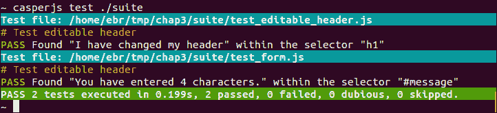

如前一个截图所示，我们已经将文件夹路径传递给`casperjs test`命令，并且它已经运行了该文件夹中包含的所有测试。

`casperjs test`命令提供了以下有趣选项：

+   `--fail-fast`：这个选项用于在测试套件中的第一个错误处停止测试。

+   `--pre=pre-test.js`：这个选项用于在执行测试套件之前运行一个测试。

+   `--post=post-test.js`：这个选项用于在执行测试套件之后运行一个测试。

+   `--includes=file1.js,file2.js`：这个选项用于在运行套件中的每个测试之前包含一些测试。

+   `--direct`：这个选项用于在控制台输出日志消息。

+   `--log-level=<level>`：这个选项用于选择日志级别（`DEBUG`、`INFO`、`WARNING`或`ERROR`）。

+   `--xunit=<filename>`：这个选项用于将测试结果导出为 xUnit 格式。

`--pre`和`--post`选项通常用于实现测试前的设置和测试后的清理。

例如，如果我们的系统允许用户修改他们的首选项，并且我们想要测试它，预测试设置将创建一个假用户配置文件，这样我们就可以测试配置文件首选项的变化。测试后的清理将删除这个假用户配置文件，这样下次我们运行测试套件时，它不会因为配置文件已经存在而中断。

## 在 Jenkins 上运行 CasperJS

编写测试是一个好的起点，但随后我们必须确保我们经常运行它们。**持续集成**（**CI**）的一个原则是每次我们在源仓库中提交更改时都运行测试。为此，我们需要一个 CI 工具，Jenkins 就是其中最广泛使用的一个。

### 注意

我们在这里不会详细讲解 Jenkins 的安装和配置，因为它不是一个桌面应用程序，而是由服务器暴露的服务。我们假设它已经部署在我们的服务器之一上。

要在 Jenkins 上运行我们的 CasperJS 测试，我们首先需要确保 PhantomJS 和 CasperJS 已经安装在了 Jenkins 运行所在的机器上（参考*安装 CasperJS*部分）。

然后，我们打开 Jenkins 的 Web 界面，并点击如下截图所示的**新建任务**：

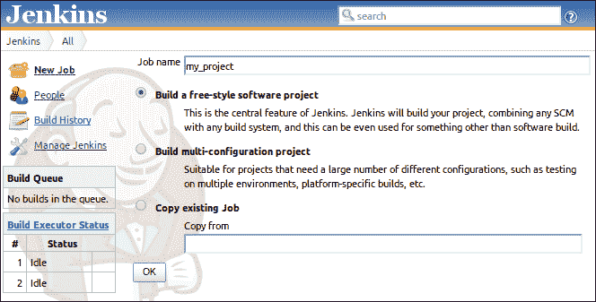

在**构建**部分，我们添加一个新的**执行 shell**步骤：

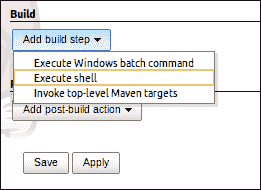

然后我们点击**保存**，并在**构建**部分输入我们的测试命令。

假设我们的测试位于我们仓库根目录下名为`tests`的文件夹中，我们会输入以下内容：

```js
casperjs test ./tests
```

下面的截图显示了我们将添加上述命令的文本框：

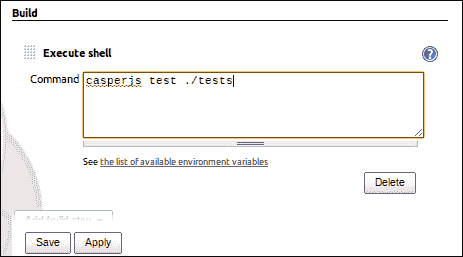

现在，我们可以手动启动构建，或者让 Jenkins 根据我们选择的触发器自动启动构建。Jenkins 将直接解释 CasperJS 的输出，我们将会得到一个显示失败和成功的构建历史记录，如下所示：

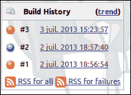

我们还可以看到如下截图所示的特定构建的详细信息：

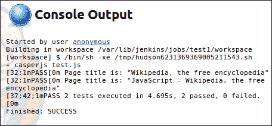

## 在 Travis-CI 上运行 CasperJS

Travis-CI 是一种云服务，可以连接到我们的 GitHub 仓库。对于公共仓库，它是免费的。每次我们向 GitHub 推送更改时，Travis-CI 都会执行以下操作：

+   创建一个空白虚拟机

+   检查来自 GitHub 的当前源代码

+   部署我们的应用程序

+   运行测试

+   通过电子邮件、IRC 等方式通知用户

当我们在 GitHub 仓库收到拉取请求时，它也会做同样的事情，这样我们就可以在合并之前知道提交的拉取请求是否破坏了测试。此信息将直接显示在 GitHub 上。

要在 Travis-CI 上运行 CasperJS 测试，我们需要做以下几步：

1.  前往 [travis-ci.org](http://travis-ci.org) 并使用我们的 GitHub 账户登录。

1.  前往 **配置文件** 并复制令牌。

1.  前往 GitHub 仓库，点击 **设置 / 服务钩子**，选择 **Travis-CI**，输入我们的 GitHub ID 和之前复制的 Travis 令牌，勾选 **激活**，然后点击 **更新**。

1.  在我们的仓库根目录添加一个 `.travis.yml` 文件。

这个 `.travis.yml` 文件用于向 Travis 解释如何部署测试环境以及如何运行测试。

我们只需要部署 CasperJS，因为 PhantomJS 已经在 Travis 上预安装了。

### 小贴士

由于 PhantomJS 是完全无头浏览器，因此不需要运行 Xvfb。

下面的是一个典型的 `.travis.yml` 文件：

```js
install:
  - git clone git://github.com/n1k0/casperjs.git
  - cd casperjs; git checkout tags/1.1; cd -
before_script:
  - "export PHANTOMJS_EXECUTABLE='phantomjs --local-to-remote-url-access=yes --ignore-ssl-errors=yes'"
script:
  - ./casperjs/bin/casperjs test ./tests
```

在 `install` 部分中，我们下载 CasperJS 代码并检查最后一个稳定版本。在 `before_script` 部分中，我们设置 PhantomJS 以允许访问外部 URL，在 `script` 部分中，我们启动测试。

就像 Jenkins 一样，Travis-CI 将将 CasperJS 输出的结果解释为成功或失败，并且我们会相应地收到通知。我们的测试可以针对本地服务器，如果是这样，我们的 `.travis.yml` 文件需要部署所需的 HTTP 服务器及其组件。

但测试也可以针对外部 URL，如果是这样，我们必须确保代码在推送到 GitHub 后立即更新到真实服务器。这可以通过 GitHub Pages 方便地完成。

# 除此之外（高级）

本节将介绍除测试之外的其他 CasperJS 用法。

## 网页脚本

网页脚本意味着运行一个脚本，该脚本将使用网页作为后端服务。

当然，用脚本编写网页是一种相当粗暴的方式来获取服务。使用 REST API（或任何 API）会更为优雅。但在某些情况下没有 API。CasperJS 能够模拟我们在网页上的用户交互，以便测试它们。

但显然，我们可以利用其能力来模拟任何网页上的用户交互，以自动化一个过程。这就是为什么 CasperJS 是一个非常高效的网页脚本工具。

假设我们想要一个脚本来告诉我们 Gmail 邮箱中有多少未读消息。我们可以使用以下脚本（`example12.js`）：

```js
var casper = require('casper').create();

casper.userAgent('Mozilla/5.0 (Macintosh; Intel Mac OS X)');
casper.start("http://mail.google.com");

casper.waitForSelector("form#gaia_loginform", function() {
  this.sendKeys('form#gaia_loginform input[name="Email"]', "<my_account>@gmail.com");
  this.sendKeys('form#gaia_loginform input[name="Passwd"]', "<password>");
});

casper.then(function() {
    this.click("#signIn");
});

casper.then(function() {
    var inbox_link_text = this.fetchText('table.m a[accesskey="i"]');

 var search_unread = /\((\d+)\)/.exec(inbox_link_text );
    if(!search_unread) {
         this.echo("No new emails.", 'INFO');
    } else {
         this.echo("You have " + search_unread[1] + " new emails.", 'INFO');
    }
});

casper.run();
```

在这个脚本中，我们登录并获取**收件箱**链接（在左侧菜单中）的 HTML 代码，因为它包含未读电子邮件的数量，如下所示：

```js
Inbox (53) 
```

为了提取数字，我们使用正则表达式`/\((\d+)\)/`，它将寻找任何括号内的数字。

以下是我们得到的结果：

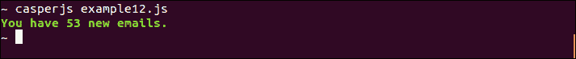

现在，让我们尝试获取本地天气预报（`example13.js`）：

```js
var casper = require('casper').create();

casper.start("http://weather.yahoo.com/");

casper.then(function() {
    var current_location = this.fetchText('#location-chooser .name');
    var current_temp = this.fetchText('.temp .f .num');
    this.echo("Current temperature in " + current_location + ": " + current_temp + "°F");
});
casper.run();
```

在这里，我们只是加载了 Yahoo!天气预报的主页，然后提取我们想要的信息（当前温度、我们的位置和即时的预报）。完成这些后，我们得到以下结果：

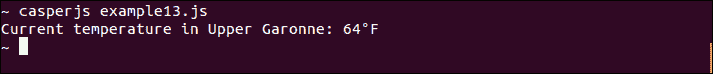

很好！

但请注意；如果 Yahoo!决定更改其天气页面的布局，我们使用的选择器可能变得无效，我们的服务就会中断。这是网络脚本方法的主要弱点。而且，在这个非常用例（获取 Yahoo!天气预报）中，我们将通过使用优秀的 Yahoo!查询语言 REST API 来构建一个更安全的服务。

然而，当我们面对复杂的跨平台集成问题时，网络脚本可能有时是一个轻便且方便的解决方案。

## 截图生成

CasperJS 可以使用以下两种方法从当前页面生成图像：

+   `this.capture(String filepath)`: 这将捕获整个页面的截图

+   `this.captureSelector(String filepath, String selector)`: 这将捕获特定元素

一个简单的例子（`example14.js`）如下：

```js
var casper = require('casper').create();

casper.start('http://en.wikipedia.org/wiki/Solar_System');

casper.then(function() {
    this.capture("screenshot1.png");
});

casper.run();
```

如果我们运行它，它将正常工作，但我们将获得一个非常大的图像，因为维基百科页面非常长，我们已经完全捕获了它。

能够获取一个非常长的页面的截图并不总是容易，所以这个功能可能很有帮助。如果我们想减少捕获区域，我们可以设置视口大小，并在`html`元素上使用`captureSelector`，如下所示：

```js
var casper = require('casper').create();

casper.options.viewportSize = {width: 1300, height: 700};
casper.start('http://en.wikipedia.org/wiki/Solar_System');

casper.then(function() {
 this.captureSelector("screenshot1.png", "html");
});

casper.run();
```

现在我们得到了一个更小的图像。

捕获方法的一个典型用法显然是**调试**；当我们不知道为什么我们的 CasperJS 没有按预期工作，在花费时间记录一切或检查所有元素之前，一个简单的截图可能显示我们只是忘记执行有效的身份验证，因此我们仍然被阻止在登录页面。

另一个有趣的用法是**文档**。编写一个好的用户手册通常需要插入很多截图。生成这些截图可能相当耗时且痛苦，而且当我们不得不更新它们时，痛苦会更大，因为自上次发布用户手册以来，设计可能已经发生了变化。

那么，使用 CasperJS 自动从我们当前版本的 Web 应用程序中生成所有所需的截图怎么样？原理很简单：我们编写一个 CasperJS 脚本来重现我们在文档中描述的使用场景，我们获得一系列图片，并将它们与我们的文档文本融合。Markdown、reStructuredText4、Textile 或类似格式都是不错的选择。

Resurrectio（见 *CasperJS 入门（简单）* 部分）建议以两种版本导出任何记录的序列：一个 CasperJS 版本（其中包含我们的实际测试脚本）和一个 reStructuredText 版本（其中只包含注释和截图）。

因此，我们可以运行测试，获取截图，并编译我们的 reStructuredText（使用 `rst2html`、`rst2doc`、`rst2pdf` 等）以获取我们的文档。每次设计更改时，我们只需重新运行测试、重新编译文本，文档就会自动更新。

我们还可以使用动态生成的渲染的捕获方法来 *生成静态内容*。

例如，如果我们想使用 **d3.js** ([`d3js.org/`](http://d3js.org/)) 在网页上绘制精美的图表，但又希望将它们插入到通讯稿中或允许旧版网页浏览器查看，我们可以使用 CasperJS 将它们转换为图片。

让我们从 [d3js.org](http://d3js.org) 教程的以下示例（`example15.html`）来看一下：

```js
<html>
<head>
<style>
body {
  font: 10px sans-serif;
  color: white;
}
.arc path {
  stroke: #fff;
}
.arc text {
  fill: #fff;
}
</style>
</head>
<body>
<script src="img/d3.v3.min.js"></script>
<script>
var width = 400,
    height = 200,
    radius = Math.min(width, height) / 2;

var color = d3.scale.ordinal()
    .range(["#98abc5", "#8a89a6", "#7b6888", "#6b486b", "#a05d56", "#d0743c", "#ff8c00"]);

var arc = d3.svg.arc()
    .outerRadius(radius - 10)
    .innerRadius(radius - 70);

var pie = d3.layout.pie()
    .sort(null)
    .value(function(d) { return d.population; });

var svg = d3.select("body").append("svg")
    .attr("width", width)
    .attr("height", height)
  .append("g")
    .attr("transform", "translate(" + width / 2 + "," + height / 2 + ")");

d3.csv("data.csv", function(error, data) {

  data.forEach(function(d) {
    d.population = +d.population;
  });

  var g = svg.selectAll(".arc")
      .data(pie(data))
    .enter().append("g")
      .attr("class", "arc");

  g.append("path")
      .attr("d", arc)
      .style("fill", function(d) { return color(d.data.age); });

  g.append("text")
      .attr("transform", function(d) { return "translate(" + arc.centroid(d) + ")"; })
      .attr("dy", ".35em")
      .style("text-anchor", "middle")
      .text(function(d) { return d.data.age; });
});
</script>
</body>
</html>
```

它读取包含按年龄分组的人口数据的 CSV 文件，并使用 SVG 绘制饼图。

让我们提供所需的数据 (`data.csv`)：

```js
age,population
<5,2704659
5-13,4499890
14-17,2159981
18-24,3853788
25-44,14106543
45-64,8819342
≥65,612463
```

现在，我们可以启动我们的简单 HTTP 服务器并查看。如果我们使用 Chrome 等浏览器，它将工作得很好，但与 Internet Explorer 8 不兼容。

CasperJS 可以用来捕获这个图表，这样我们可以向无法渲染 SVG 的网页浏览器提供等效的图片（`example15.js`）：

```js
var casper = require('casper').create();

casper.start('http://localhost:8000/example15.html');

casper.then(function() {
    this.captureSelector("chart.png", 'svg');
});

casper.run();
```

以下是我们的结果：

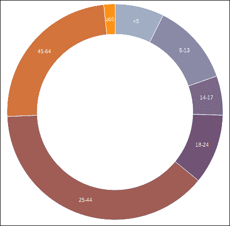

CasperJS 还可以是一种提供 **服务器端打印服务** 的智能方式。

当我们希望用户打印我们的网页时，他们最常见和简单的方法是使用网络浏览器的 `打印` 功能。如果我们需要为打印自定义渲染（隐藏导航栏、更改一些颜色或字体等），我们可以很容易地使用特定的打印 CSS（通过在 `link` 标签中提及 `media="print"`）来实现。然而，有时这还不够。

背景图像是标准打印可能令人烦恼的典型例子；打印时隐藏背景图像，这很合理，因为我们更喜欢在白色背景上打印文本。但如果我们为了特定目的使用它们，例如填充条形图的各个条，打印结果将令人失望。（在我们的例子中，所有条都将变为白色，因此我们将无法区分它们。）

当我们想要在屏幕和打印之间更改显示的信息时，我们也会遇到问题。例如，我们的页面可能包含带有少量标记的地图。在屏幕上，当鼠标悬停在标记上时，我们显示一个标签，但在打印时，我们更希望显示所有标签。

在这些问题案例中，一个很好的解决方案是使用 CasperJS 作为 **后端打印服务**。其目的是突出一个接受任何 URL 作为参数的服务，该服务返回对应页面的图像捕获，以便打印。

我们的服务将简单地运行一个 CasperJS 脚本，该脚本将打开提供的 URL 并捕获它：

```js
var casper = require('casper').create();
var url = casper.cli.options['targeturl'];
var output = casper.cli.options['outputfile'];

casper.start(url);

casper.then(function() {
    this.capture(output);
});

casper.run();
```

由于我们不能使用 `media="print"` 属性来应用一些特定的打印 CSS（因为 CasperJS 将以屏幕模式打开页面），我们可以在捕获之前动态地向 body 元素添加一个特定的类，这样我们就可以轻松地设置渲染样式：

```js
casper.thenEvaluate(function () {
 var bodyclass = document.querySelector('body').getAttribute('class');
 bodyclass = bodyclass + " print-mode";
 document.querySelector('body').setAttribute('class', bodyclass);
});

```

如果我们想在捕获之前允许执行特定的过程（例如，如前所述，在地图上显示所有标记标签），我们可能需要等待特定的选择器可用。选择器的列表如下：

+   在我们的目标页面上，我们添加一段 JavaScript，负责设置打印页面并在 `body` 元素上添加所需的标记类：

    ```js
    if(location.search.indexOf("print") > -1) {
      set_up_as_expected();
      document.querySelector('body').className += " ready-for-printing";
    }
    ```

+   在 CasperJS 中，我们在捕获输出之前等待这个标记类出现：

    ```js
    casper.waitForSelector(".ready-for-printing", function() {
        capture(this, selector, output);
    });
    ```

这个服务可以用任何 Web 框架实现（我们只需要能够调用系统来运行我们的 CasperJS 脚本）。

**Django Screamshot** 是 Django 的一个实现，可以在 [`github.com/makinacorpus/django-screamshot`](https://github.com/makinacorpus/django-screamshot) 找到。
