# 第一章：使用 Ionic 创建我们的第一个应用

在本章中，我们将涵盖以下主题：

+   设置开发环境

+   通过 CLI 创建 HelloWorld 应用

+   通过 Ionic Creator 创建 HelloWorld 应用

+   使用你的网络浏览器查看应用

+   使用 Ionic CLI 查看应用

+   使用 Xcode 查看 iOS 应用

+   使用 Genymotion 查看 Android 应用

+   使用 Ionic View 查看应用

# 简介

现在开发移动应用有很多选择。原生应用需要对每个平台（如 iOS、Android 和 Windows phone）进行独特的实现。在某些情况下，如需要高性能 CPU 和 GPU 处理以及大量内存消耗时，这是必需的。任何不需要过度图形和密集 CPU 处理的程序，都可以从成本效益高、一次编写到处运行的 HTML5 移动实现中受益。

对于选择 HTML5 路线的人来说，市场上有很多不错的选择。一些选项可能很容易开始，但它们可能很难扩展或可能遇到性能问题。商业选项通常对小开发者来说成本很高，难以找到产品/市场契合点。最佳实践是首先考虑用户。有些情况下，简单的响应式网站设计是最好的选择；例如，当业务主要包含固定内容且更新需求最小或内容更适合在网络上进行 SEO 优化时。

Ionic 框架相对于其竞争对手有多个优势，如下所示：

+   Ionic 基于 Angular，这是一个强大的应用开发框架。你可以在其中找到所有构建和结构化应用的组件。

+   UI 性能强大，因为它使用了`requestAnimationFrame()`技术。

+   它提供了一套美丽且全面的默认样式，类似于以移动为中心的 twitter Bootstrap。

+   **Sass**可用于快速、简单和有效的主题定制。

在 AngularJS 1.x 的发布和 Angular 之间发生了许多重大变化。所有这些变化也适用于 Ionic。以下是一些示例：

+   Angular 使用**TypeScript**，它是**ECMAScript 6**（**ES6**）标准的超集，将你的代码编译成 JavaScript。这允许开发者在编译步骤中利用 TypeScript 的特性，如类型检查。

+   在 AngularJS 中不再有控制器和指令。以前，控制器被分配给一个 DOM 节点，而指令将模板转换成类似组件的架构。然而，由于控制器和/或冲突指令的使用不当，大型 AngularJS 1.x 应用很难进行扩展和调试。在 Angular 中，只有一个概念——组件，它最终有一个与 HTML 模板对应的选择器和一个包含函数的类。

+   在 Angular 中，`$scope`对象不再存在，因为所有属性现在都在组件内部定义。这实际上是个好消息，因为在 AngularJS 1.x 中调试`$scope`中的错误（尤其是嵌套场景）非常困难。

+   最后，Angular 提供了更好的性能，并支持 ES5 和 ES6 标准。您可以用 TypeScript、Dart 或纯 JavaScript 编写 Angular。

在本章中，您将通过几个 HelloWorld 示例来引导您的 Ionic 应用程序。这个过程将为您提供基本框架，您可以用它来开始构建更全面的应用程序。大多数应用程序都有类似的用户体验流程，例如标签和侧边菜单。

# 设置开发环境

在创建您的第一个应用程序之前，您的环境必须准备好所需的组件。这些组件确保开发、构建和测试过程顺利。默认的 Ionic 项目文件夹基于 Cordova。因此，您需要 Ionic CLI 来自动添加正确的平台（即 iOS、Android 或 Windows 手机）并构建项目。这将确保所有 Cordova 插件都正确包含。该工具有许多选项，可以在浏览器或模拟器中运行您的应用程序，并实现实时刷新。

# 准备工作

您需要安装 Ionic 及其依赖项以开始。Ionic 本身只是一个 CSS 样式、Angular 组件和标准 Cordova 插件的集合。它也是一个命令行工具，用于帮助管理所有技术，如 Cordova。安装过程将为您提供命令行以生成初始代码并构建应用程序。

Ionic 使用`npm`作为安装程序，它包含在安装 Node.js 时。请从[`nodejs.org/en/download/`](https://nodejs.org/en/download/)安装最新版本的 Node.js。

您需要安装`cordova`、`ios-sim`（一个 iOS 模拟器）和`ionic`：

```js
$ npm install -g cordova ionic ios-sim
```

您可以使用单个命令行安装所有三个组件，而不是分别发出三个命令行。`-g`参数用于全局安装包（而不仅仅是当前目录）。

对于 Linux 和 Mac，您可能需要使用`sudo`命令来允许系统访问，如下所示：

```js
$ sudo npm install -g cordova ionic ios-sim
```

以下是一些常见的**集成开发环境**（**IDE**）选项：

+   Xcode for iOS

+   Android Studio for Android

+   微软 Visual Studio Code (VS Code)

+   JetBrains 的 WebStorm

+   Sublime Text ([`www.sublimetext.com/`](http://www.sublimetext.com/))用于 Web 开发

所有这些都有免费许可。你可以在 Xcode 或 Android Studio 中直接编码，但它们对于网络应用来说有些重量级，尤其是当你有很多窗口打开，只需要简单编码时。Sublime Text 对非商业开发者免费，但如果你是商业开发者，你必须购买许可证。大多数前端开发者更喜欢使用 Sublime Text 进行 HTML 和 JavaScript 编码，因为它非常轻量级，并且拥有一个支持良好的开发者社区。Sublime Text 已经存在很长时间，并且非常用户友好。然而，Ionic 中有许多功能使 Visual Studio Code 非常吸引人。例如，它具有完整 IDE 的外观和感觉，但又不笨重。你可以在 VS Code 中直接调试 JavaScript，以及获得自动完成（例如，IntelliSense）。以下说明涵盖了 Sublime Text 和 VS Code，尽管本书的其余部分将使用 VS Code。

# 如何操作...

VS Code 在 Mac、Windows 和 Linux 上运行。以下是说明：

1.  访问 [`code.visualstudio.com.`](https://code.visualstudio.com)

1.  下载并安装适用于你的特定操作系统

1.  解压下载的文件

1.  将 `.app` 文件拖入 `Applications` 文件夹，并将其拖到 Mac 的 Dock 上

1.  打开 Microsoft Visual Studio Code

1.  按 *Ctrl* + *Shift* + *p* 打开命令面板

1.  在命令面板中输入 shell 命令

1.  点击 shell 命令：在 PATH 命令中安装代码命令以将脚本添加到你的终端 $PATH

1.  重新启动 Visual Studio Code 以使更改生效

之后，你只需直接从 Ionic 项目文件夹和 VS Code 中编写代码（包括点号），VS Code 将自动将该文件夹作为项目打开。

注意以下截图是从 Mac 上拍摄的：

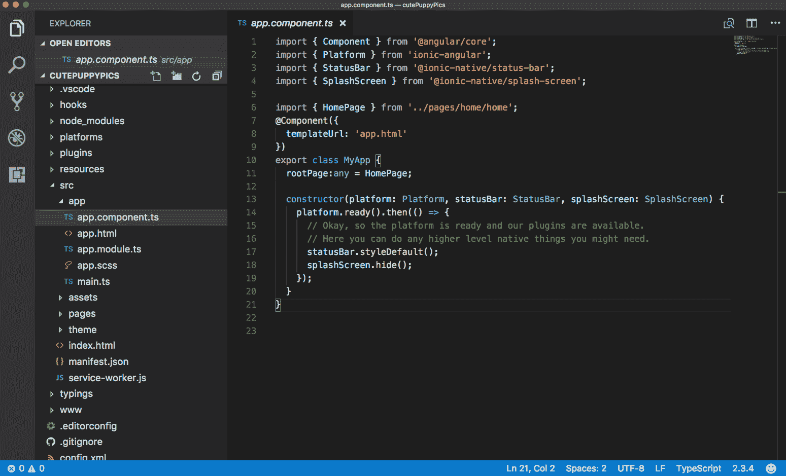

1.  如果你决定使用 Sublime Text，你将需要 Package Control ([`packagecontrol.io/installation`](https://packagecontrol.io/installation))，它类似于插件管理器。由于 Ionic 使用 Sass，安装 Sass 语法高亮包是可选的。

1.  导航到 Sublime Text | 首选项 | Package Control。

1.  前往 Package Control：安装包。你也可以直接输入部分命令（即 `inst`），它将自动选择正确的选项：

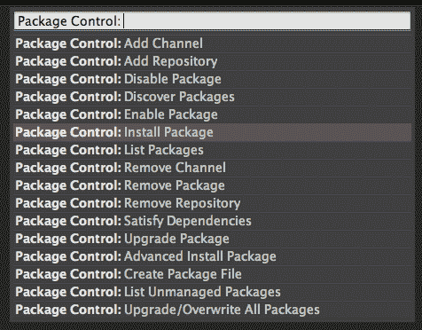

1.  输入 `Sass`，搜索结果将显示一个 TextMate & Sublime Text 的选项。选择该选项进行安装：

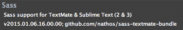

# 还有更多...

有许多 Sublime Text 包你可能想使用，例如 HTML、JSHint、JSLint、Tag 和 ColorPicker。你可以访问 [`sublime.wbond.net/browse/popular`](https://sublime.wbond.net/browse/popular) 以满足额外需求。

# 通过 CLI 创建 HelloWorld 应用程序

最快开始你的应用的方式是使用现有的模板。Ionic 通过命令行为你提供了一些标准模板：

+   **空白**：这是一个带有最少 JavaScript 代码的简单页面

+   **标签页**：这些是带有路由的多页。一个路由 URL 会跳转到标签页

+   **侧边菜单**：这是一个带有左右菜单和中心内容区域的模板

+   **超级**：这是一个带有预构建页面和提供者的模板，强调 Ionic 应用程序开发的最佳实践

# 如何做到这一点...

1.  要使用`blank`模板从`ionic`设置应用程序，请使用以下命令：

```js
$ ionic start HelloWorld_Blank blank
```

1.  如果将`blank`替换为`tabs`，它将创建一个`tabs`模板，如下所示：

```js
$ ionic start HelloWorld_Tabs tabs
```

1.  同样，以下命令将创建一个带有`sidemenu`的应用程序：

```js
$ ionic start HelloWorld_Sidemenu sidemenu
```

4. 同样，以下命令将创建一个带有`super`模板的应用程序：

```js
$ ionic start HelloWorld_Super super
```

在 GitHub 页面上提供了关于 Ionic CLI 的额外指导：[`github.com/ionic-team/ionic-cli`](https://github.com/ionic-team/ionic-cli)。

# 它是如何工作的...

本章将向您展示如何快速启动您的代码库并可视化结果。关于 Angular 及其模板语法的更多细节将在本书的各个章节中讨论，然而，核心概念如下：

+   **组件**：Angular 非常模块化，因为你可以将代码写入一个文件，并使用导出类将其转换为组件。如果你熟悉 AngularJS 1.x，这类似于控制器以及它与 DOM 节点的绑定。组件将有自己的私有和公共属性和方法（即函数）。要判断一个类是否是 Angular 组件，你必须使用`@Component`装饰器。这是 TypeScript 中的另一个新概念，因为你可以对任何类施加特性（元数据），以便它们以某种方式行为。

+   **模板**：模板是一个 HTML 字符串或一个单独的`.html`文件，它告诉 AngularJS 如何渲染一个组件。这个概念与其他任何前端和后端框架非常相似。然而，Angular 有自己的语法，允许在 DOM 上执行简单的逻辑，例如重复渲染（`*ngFor`）、事件绑定（`click`）或自定义标签（`<my-tag>`）。

+   **指令**：这允许你操作 DOM，因为指令绑定到了一个 DOM 对象上。所以，`*ngFor`和`*ngIf`就是指令的例子，因为它们会改变该 DOM 的行为。

+   **服务**：这指的是除了`get`/`set`所需的抽象来管理模型或复杂逻辑的集合。与组件不同，没有服务装饰器。因此，任何类都可以是一个服务。

+   **管道**：这主要用于在模板中处理表达式并返回一些数据（即四舍五入数字和添加货币）使用`{{ expression | filter }}`格式。例如，`{{amount | currency}}`如果`amount`变量是 100，将返回$100。

Ionic 自动创建一个如下所示的项目文件夹结构：

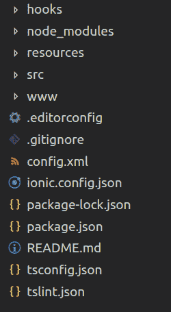

您大部分时间将花费在 `/src` 文件夹中，因为那里将放置您的应用程序组件。这与 Ionic 1.x 非常不同，因为这里的 `/www` 文件夹实际上是由 TypeScript 编译的。如果您为 iOS 构建应用程序，Ionic 构建命令行也会在 `/platforms/ios/www` 创建另一个副本，这是专门为 Cordova 指定的。Angular 中的另一个有趣的变化是，您的应用程序有一个根组件，位于 `/src/app` 文件夹中，所有其他页面或屏幕都在 `/src/pages` 中。由于 Angular 是基于组件的，每个组件都会包含 HTML、CSS 和 JS。如果您添加更多的 JavaScript 模块，可以将它们放在 `/src/assets` 文件夹中，或者更好的做法是使用 `npm install`，这样它就会自动添加到 `/node_modules` 文件夹中。Ionic 完全弃用了 Grunt 和 Bower。所有内容都简化为 `package.json`，其中将列出您的第三方依赖项。

没有必要手动修改 `/platforms` 或 `/plugins` 文件夹，除非需要进行故障排除。否则，Ionic 或 Cordova CLI 将会自动化这些文件夹的内容。

默认情况下，从 Ionic 模板来看，Angular 应用程序名称为 `MyApp`。您将在 `app/app.component.ts` 中看到类似的内容，这是整个应用程序的根组件文件：

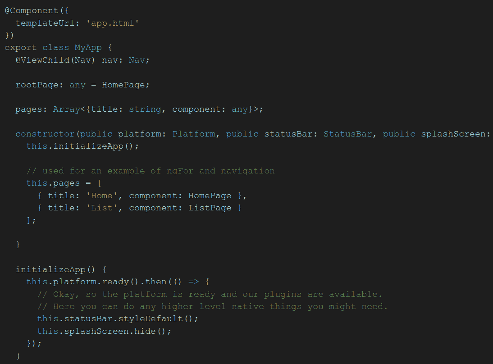

您的应用程序的根组件以及所有内容都将注入到 `index.html` 中的 `<ion-app></ion-app>` 内。

注意，如果您双击 `index.html` 文件在浏览器中打开它，会显示一个空白页面。这并不意味着应用程序没有工作。原因是 Ionic 的 Angular 组件会动态加载所有的 `.js` 文件，这种行为需要通过 `http://` 协议进行服务器访问。如果您在本地打开文件，浏览器会自动将其视为文件协议 (`file://`)，因此 Angular 将没有能力加载额外的 `.js` 模块以正确运行应用程序。有几种运行应用程序的方法，稍后将会讨论。

# 通过 Ionic Creator 创建 HelloWorld 应用程序

另一种开始您的应用程序代码库的方法是使用 **Ionic Creator**。这是一个出色的界面构建器，可以通过拖放风格加速您的应用程序开发。您可以通过基于网络的界面快速获取现有的组件，并将它们定位以可视化应用程序中的外观。大多数常见组件，如按钮、图像和复选框都是可用的。

Ionic Creator 允许用户将所有 `.html`、`.css` 和 `.js` 文件导出为一个项目。您应该能够在 `/app` 文件夹中编辑内容，以在界面之上构建。

# 准备工作

要开始使用 Ionic Creator，您需要在 [`creator.ionic.io/`](https://creator.ionic.io/) 注册一个免费账户。

# 如何操作...

1.  创建一个名为 `myApp` 的新项目：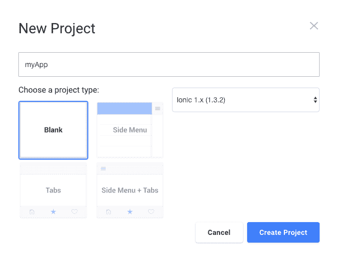

1.  验证，以确保您看到以下屏幕：

![img/03cb16d0-347e-46f5-8cfb-04c0abf3cec0.png]

1.  中心区域是您的应用界面。左侧为您提供页面列表。每个页面都是一个单独的路由。您还可以访问许多 UI 组件，通常您需要手动在 HTML 文件中编码这些组件。右侧的面板显示了任何选中组件的属性。

1.  您可以自由地在这里进行任何需要做的事情，只需将组件拖放到中心屏幕即可。如果您需要创建一个新页面，您必须点击页面面板中的“添加页面”。每个页面都表示为一个链接，这基本上是 Angular UI-Router 定义中的路由。要导航到另一个页面（例如，在点击按钮后），您只需更改链接属性并指向该页面。

1.  顶部有一个编辑按钮，您可以在编辑模式和预览模式之间切换。看到您的应用将如何看起来和表现是非常有用的。

1.  完成后，点击导航栏顶部的导出按钮。您有以下四种选项：

    +   使用 Ionic CLI 工具获取代码

    +   将项目作为 ZIP 文件下载

    +   将其导出到原生代码（类似于 PhoneGap Build），如图所示：![img/0cbcd00b-b04d-4d32-afb2-f0fb5d5d2462.png]

    +   使用 Creator 应用将其导出到预览模式

学习 Ionic Creator 的最佳方式是玩它。

# 还有更多...

要切换到预览模式，在那里您可以在设备模拟器中看到 UI，请点击右上角的切换按钮以启用测试，如图所示：

![img/54cfb320-3ae1-47d6-928e-5999081f1dc3.png]

在此模式下，您应该能够像在设备上实际部署一样，在 Web 浏览器中与组件进行交互。

如果您弄坏了什么，启动一个新的项目非常简单。这是一个用于原型设计和获取初始模板或项目脚手架的出色工具。您应该继续在常规 IDE 中编码其余的应用程序。Ionic Creator 目前还不能为您做所有事情。例如，如果您想访问特定的 Cordova 插件功能，您必须单独编写那段代码。

此外，如果您想在 Ionic Creator 允许的范围之外调整界面，还需要对`.html`和`.css`文件进行特定的修改。

# 使用您的 Web 浏览器查看应用

为了运行 Web 应用，您需要将您的`/www`文件夹转换成一个 Web 服务器。再次强调，有众多方法可以实现这一目标，人们往往倾向于坚持一两种方法以保持事情简单。一些其他选项可能不可靠，例如 Sublime Text 的实时监控包或静态页面生成器（例如，Jekyll 和 Middleman 应用）。它们检测变化的速度较慢，可能会冻结您的 IDE，因此在此不予以提及。

# 准备工作

推荐的方法是使用 Ionic serve 命令行。它基本上启动一个 HTTP 服务器，这样您就可以在桌面浏览器中打开您的应用。

# 如何操作...

1.  首先，你需要进入项目文件夹。让我们假设它是侧边菜单 `HelloWorld`：

```js
$ cd HelloWorld_Sidemenu
```

1.  从那里，只需发出简单的命令行，如下所示：

```js
$ ionic serve
```

就这样！无需进入 `/www` 文件夹或确定使用哪个端口。当网络服务器运行时，命令行将提供以下选项：

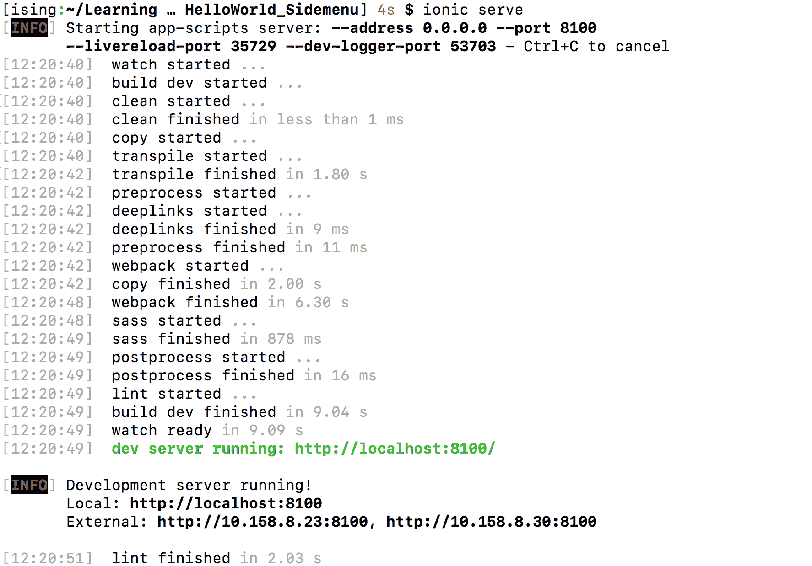

这里最常用的选项是在完成时使用 *Ctrl* + *C* 退出。

要以正确的设备分辨率查看应用程序，还有额外的步骤：

1.  如果你的电脑上还没有安装，请安装 Google Chrome。

1.  从 Ionic serve 中打开链接（例如，`http://localhost:8100/`）

    Google Chrome。

1.  打开开发者工具。例如，在 Mac 的 Google Chrome 中，导航到视图 | 开发者 | 开发者工具：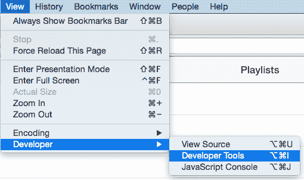

1.  在 Chrome 开发者工具区域点击小型的移动图标，如图所示：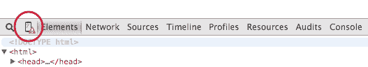

1.  将会有一长串设备可供选择，如图所示：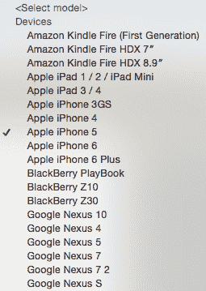

1.  选择设备后，你需要刷新页面以确保 UI 已更新。Chrome 应该会给出设备的精确视图分辨率。

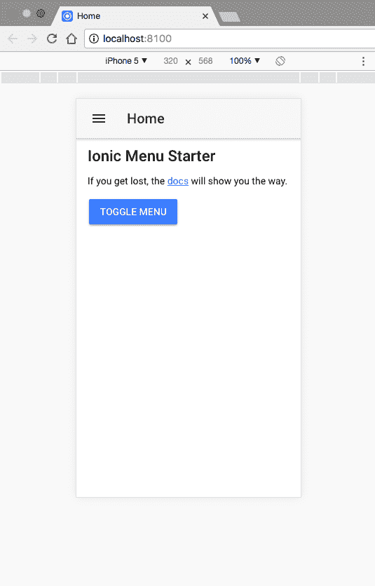

大多数开发者更愿意使用这种方法进行编码，因为你可以使用 Chrome 开发者工具调试应用程序。它的工作方式与任何其他网络应用程序完全相同。你可以在控制台创建断点或输出变量。

# 它是如何工作的...

注意，Ionic serve 实际上正在监视 `/src` 文件夹下的所有内容，并在 `/www` 下即时将 TypeScript 代码转换为 JavaScript。这很有道理，因为系统不需要扫描每个文件，因为其改变的概率非常小。

当网络服务器运行时，你可以回到 IDE 并继续编码。例如，让我们打开 `page1.html` 或任何其他模板文件，并将第一行更改为以下内容：

```js
<ion-view view-title="Updated Playlists">
```

返回到打开新页面的网络浏览器；应用程序界面会立即更改标题栏，无需刷新浏览器。当需要在代码更改和即时检查应用程序的工作或外观之间来回切换时，这是一个非常好的功能。

# 使用 Ionic CLI 查看应用程序

到目前为止，你一直在测试 Ionic 的网络应用程序部分。大多数时候，你需要实际在物理设备或至少在模拟器上运行应用程序，以查看应用程序的行为以及所有原生功能是否正常工作。

# 准备工作

你将需要安装模拟器。iOS 模拟器在执行 npm install `-g ios-sim` 时安装，Android 模拟器与 Android Studio 一起安装。要在物理设备上测试应用程序，你必须通过 USB 连接将设备连接到你的电脑。

# 如何做到...

1.  使用以下命令行添加特定平台（如 iOS）并构建应用程序：

```js
$ ionic cordova platform add ios
$ ionic cordova build ios
```

1.  注意，您需要添加平台来构建应用程序。但是，如果您使用来自 Ionic CLI 的标准模板，它应该已经包含了 iOS 平台。要为 Android 构建和运行，您可以替换 iOS 为 Android。

1.  要使用`ios`模拟器来模拟应用程序，请使用以下命令行：

```js
$ ionic cordova emulate ios
```

1.  要在真实的物理 iPhone 设备上运行应用程序，请使用以下命令行：

```js
$ ionic cordova run ios --device
```

# 使用 Xcode 查看 iOS 应用程序

您也可以使用 Xcode（在 Mac 上）运行应用程序。

# 如何做到...

1.  前往 `/platforms/ios` 文件夹。

1.  查找具有 `.xcodeproj` 的文件夹并在 Xcode 中打开它。

1.  点击 iOS 设备图标并选择您选择的 iOS 模拟器！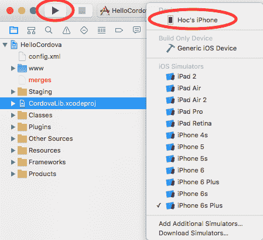

1.  点击运行按钮，您应该能够看到应用程序在运行

    模拟器。

# 更多内容...

您可以通过 USB 端口连接一个物理设备，它将显示在 iOS 设备列表中供您选择。然后，您可以直接在您的设备上部署应用程序。请注意，此操作需要 iOS 开发者会员资格。这种方法比仅通过网页浏览器查看应用程序更复杂。

然而，当您想要测试有关设备功能（如相机或地图）的代码时，这是必须的。如果您更改了 `/src` 文件夹中的代码并想要在 Xcode 中再次运行它，您必须首先执行 Ionic Cordova build ios，因为正在运行的代码位于 Xcode 项目的 Staging 文件夹中，如图所示：

!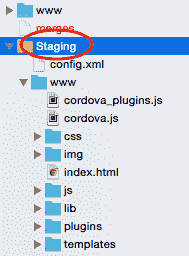

对于调试，Xcode 控制台可以输出 JavaScript 日志。然而，您可以使用 Safari 的更高级的**Web 检查器**（类似于 Google Chrome 的开发者工具）来调试您的应用程序。请注意，只有 Safari 可以调试在连接的物理 iOS 设备上运行的 Web 应用程序，因为 Chrome 在 Mac 上不支持此功能。启用此功能很容易，可以通过以下步骤完成：

1.  通过导航到“设置”|“Safari”|“高级”并启用“Web 检查器”来允许 iOS 设备进行远程调试！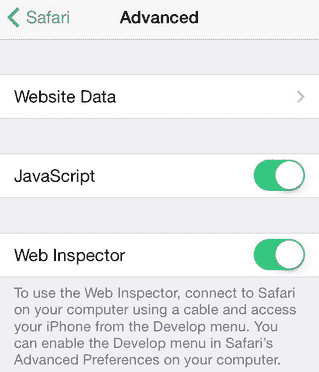

1.  通过 USB 将物理 iOS 设备连接到您的 Mac 并运行应用程序

1.  打开 Safari 浏览器

1.  选择“开发”|“您的设备名称”或**iOS 模拟器**|**index.html**，如图所示：

!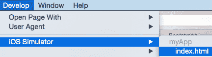

如果您在 Safari 中看不到“开发”菜单，您需要导航到**首选项**|**高级**并勾选“在菜单栏中显示开发菜单”。

Safari 将为该特定设备打开一个新的控制台，就像它在计算机的 Safari 中运行一样。

# 使用 Genymotion 查看 Android 应用程序

虽然可以在 Mac 上安装 Google Android 模拟器，但许多开发者在使用过程中遇到了不一致的体验。有许多商业和免费的替代方案提供更多便利和广泛的设备支持。Genymotion 提供一些独特的优势，例如允许用户切换 Android 模型和版本，支持在应用内进行网络连接，以及允许模拟 SD 卡。

在本节中，您将首先学习如何设置 Android 开发者环境（在本例中为 Mac）。然后，您将安装和配置 Genymotion 以进行移动应用开发。

# 如何做到这一点...

1.  第一步是正确设置 Android 开发环境。从 [`developer.android.com/studio/index.html`](https://developer.android.com/studio/index.html) 下载并安装 Android Studio。

1.  如果您的机器没有正确的依赖项，您可能需要安装其他库。如果是这种情况，您应该从命令行运行 `sudo apt-get install lib32z1 lib32ncurses5 lib32bz2-1.0 lib32stdc++6` 来安装它们。

1.  运行 Android Studio。

1.  您需要安装所有必需的包，例如 Android SDK。只需在设置向导屏幕上点击两次“下一步”，然后点击“完成”按钮以开始安装包。

1.  安装完成后，您需要安装额外的包和其他 SDK 版本。在快速入门屏幕上，选择配置：

1.  然后，选择 SDKManager，如图所示：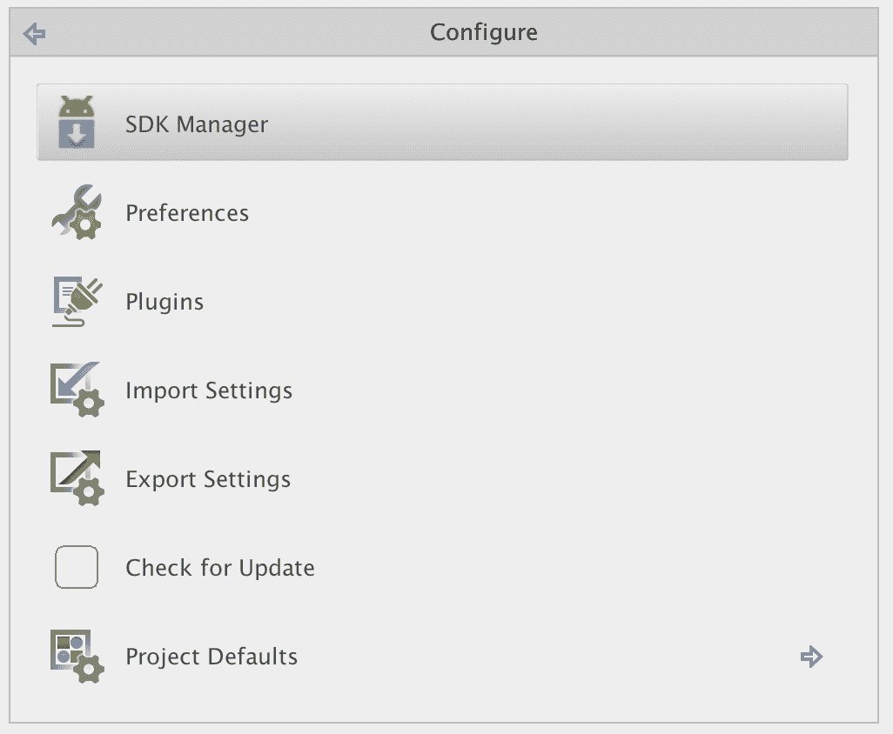

1.  安装上一个版本，如 Android5.0.1 和 5.1.1，是一个好习惯。您可能还希望安装所有工具和附加组件以供以后使用：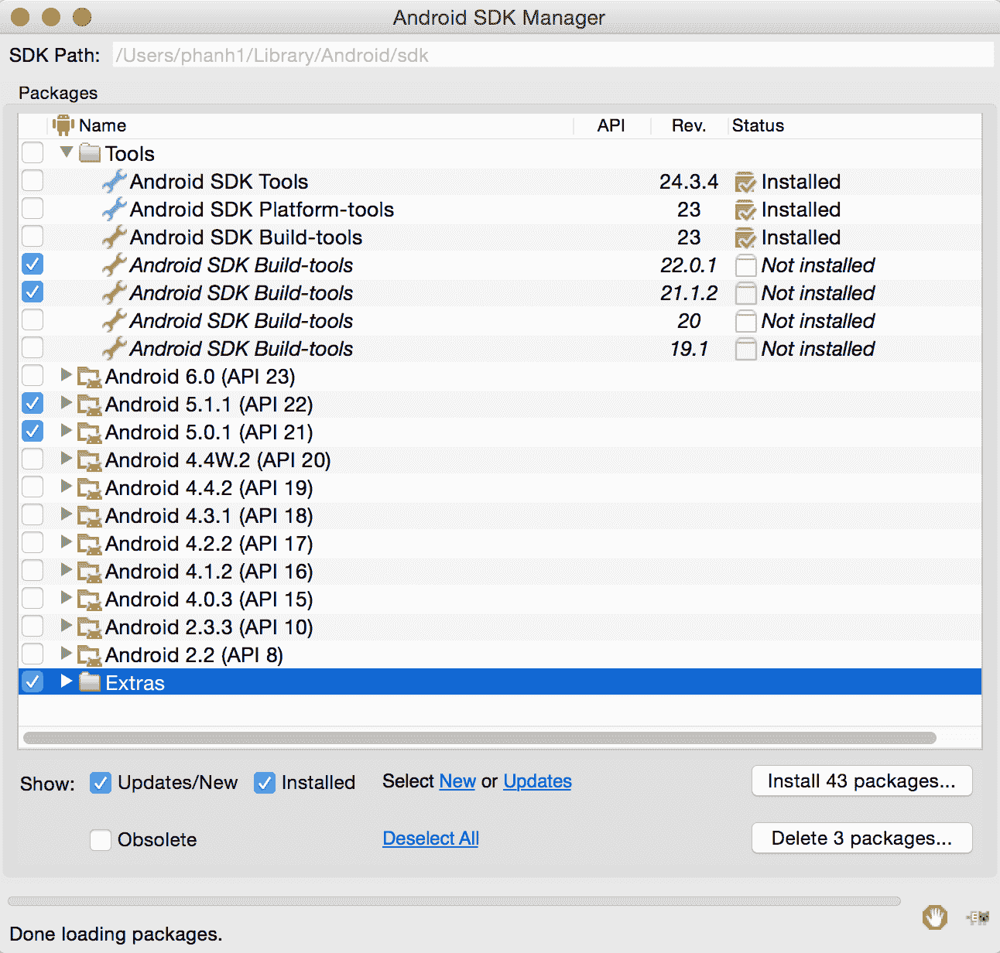

1.  点击安装包...按钮。

1.  在**接受许可**的框中勾选，并选择安装。

1.  SDK 管理器将在顶部显示 SDK 路径。请复制此路径，因为您需要修改环境路径。

1.  进入终端并输入以下命令：

```js
$ touch ~/.bash_profile; open ~/.bash_profile
```

1.  这将打开一个文本编辑器以编辑您的 bash 配置文件。插入以下内容：

    该行，其中 `/YOUR_PATH_TO/android-sdk` 应该是 SDK 路径。

    之前复制的：

```js
export ANDROID_HOME=/YOUR_PATH_TO/android-sdk
export PATH=$ANDROID_HOME/platform-tools:$PATH
export PATH=$ANDROID_HOME/tools:$PATH
```

1.  保存并关闭该文本编辑器。

1.  返回终端并输入：

```js
$ source ~/.bash_profile
$ echo $ANDROID_HOME
```

1.  您应该看到输出的是您的 SDK 路径。这验证了您已正确配置 Android 开发者环境。

1.  下一步是安装和配置 Genymotion。从 `sudo apt-get install lib32z1 lib32ncurses5 lib32bz2-1.0 lib32stdc++6` 下载并安装 Genymotion 和 Genymotion Shell。

1.  运行 Genymotion。

1.  点击添加按钮以开始添加新的 Android 设备，如图所示：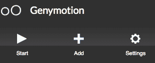

1.  选择您想要模拟的设备。在本例中，让我们选择三星 Galaxy S5，如下所示：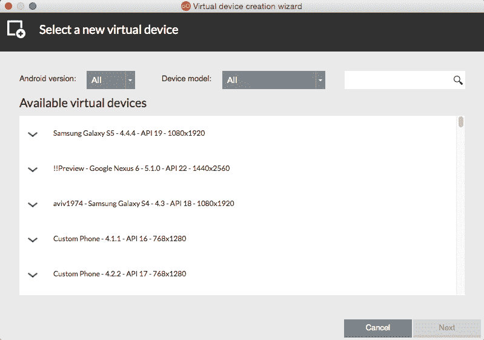

1.  您将看到设备被添加到您的虚拟设备中。点击该设备！

1.  然后点击开始！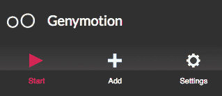

1.  模拟器将花费几秒钟时间启动，并显示另一个窗口。这只是一个空白模拟器，其中还没有运行您的应用程序。

1.  运行 Genymotion Shell。

1.  从 Genymotion Shell，您需要获取设备列表并保留连接的设备的 IP 地址，即三星 Galaxy S5。输入`devices list`。

1.  输入`adb connect 192.168.56.101`（或从设备列表命令行中看到的任何 IP 地址）。

1.  输入`adb devices`以确认已连接。

1.  输入`Ionic Cordova platform`以添加 Android，将 Android 添加为您的应用程序的平台。

1.  最后，输入 Ionic Cordova run android。

1.  您应该能够看到显示您的应用程序的 Genymotion 窗口。

虽然要完成这项工作需要许多步骤，但您不必重复同样的过程的可能性要小得多。一旦您的环境设置完成，您只需要保持 Genymotion 运行，同时编写代码。如果需要在不同 Android 设备上测试应用程序，很容易在 Genymotion 中添加另一个虚拟设备并连接到它。

# 使用 Ionic View 查看应用程序

**Ionic View**是一个可以从 App Store 或 Google Play 下载的应用程序查看器。在开发过程中，当应用程序尚未完成时，您不想立即将其提交给 Apple 或 Google，而是限制测试人员的访问。Ionic View 可以帮助在 Ionic View 中加载您的应用程序，并使其像真实应用程序一样运行，同时可以访问一些原生设备功能。此外，Ionic View 还允许您在 iOS 设备上使用应用程序，而无需任何认证要求。

由于 Ionic View 使用 Cordova 的`InAppBrowser`插件来启动您的应用程序，因此必须对设备功能进行破解才能使其工作。目前，Ionic View 仅支持 SQLite、电池、摄像头、设备运动、设备方向、对话框/通知、地理位置、全球化、网络信息、振动、键盘、状态栏、条形码扫描器和 zip。在使用 Ionic View 之前检查更新的支持列表是一个好主意，以确保您的应用程序能够正常工作。

# 如何操作...

使用 Ionic View 有两种方式。您可以选择上传自己的应用程序或加载他人的应用程序 ID。如果您测试自己的应用程序，请按照以下步骤操作：

1.  从 App Store 或 Google Play 下载 Ionic View。

1.  确保在[ionic.io](http://ionic.io)上注册一个账户。

1.  前往您的应用程序项目文件夹。

1.  搜索 Ionic 上传。

1.  输入您的凭据。

1.  CLI 将上传整个应用程序并为您提供应用程序 ID，在本例中为 152909f7。您可能希望保留此应用程序 ID，以便稍后与其他测试人员分享！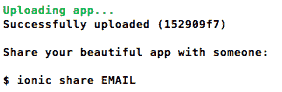

1.  在移动设备上打开 Ionic View 应用程序，如果您尚未登录，请登录。

1.  现在，您应该能够在“我的应用”页面上看到应用名称。按照图示选择应用名称（在本例中为 myApp），如下所示：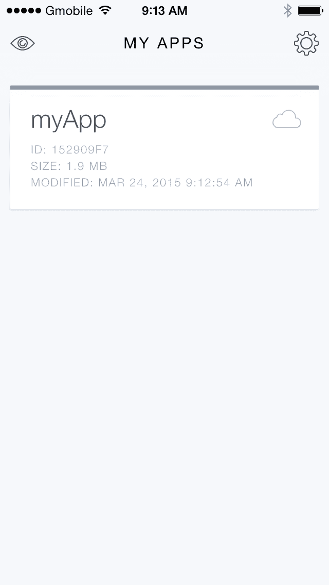

1.  选择“查看应用”来运行应用，如图所示：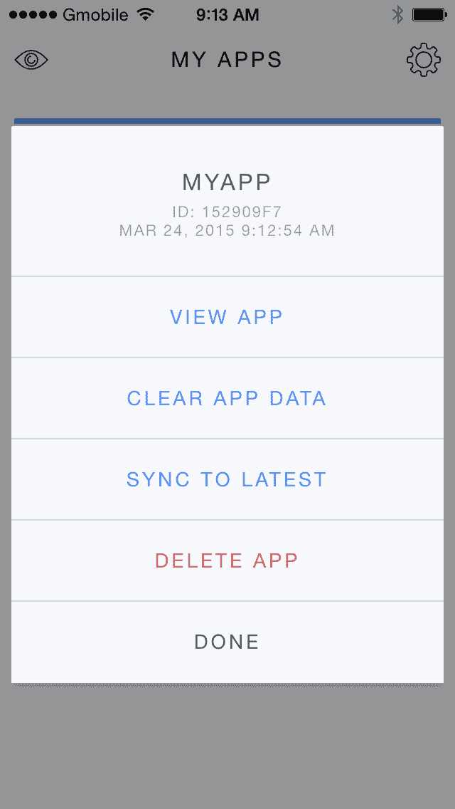

1.  您会看到应用界面出现初始说明，说明如何退出应用。由于您的应用将覆盖 Ionic View 的全屏，您需要像图中所示，用三根手指向下滑动来退出回到 Ionic View：

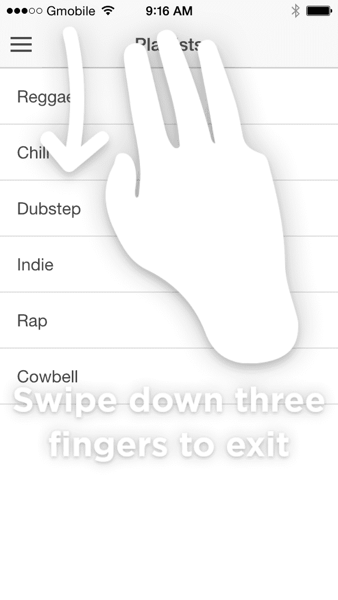

如果没有代码更新，过程相同，只是您需要从菜单中选择“同步到最新”。

# 还有更多...

总结来说，使用 Ionic View 有几个好处，其中一些如下：

+   这很方便，因为只有一个命令行就可以推送应用。

+   任何人都可以通过输入应用 ID 来访问您的应用。

+   使用 Ionic 开始开发不需要 iOS 开发者会员资格。苹果有自己的 TestFlight 应用，非常相似。

+   您可以在开发应用的同时让测试人员测试应用，从而保持敏捷的开发流程。

+   Ionic View 支持广泛的设备功能，并且这种支持还在不断增长。
