# 第二章：添加 Ionic 组件

在本章中，我们将介绍以下与使用 Ionic 组件相关联的任务：

+   使用标签添加多个页面

+   添加左右菜单导航

+   使用状态参数导航多个页面

+   在一个应用中同时使用菜单、标签和段

+   使用 Ionic 网格创建复杂的 UI

# 简介

可以用少量页面编写一个简单的应用。Ionic 提供许多开箱即用的组件，允许简单的即插即用操作。当应用增长时，管理不同视图及其特定时间或触发事件的自定义数据可能会非常复杂。Ionic 对状态和导航的处理进行了一些更改。在 Ionic 1 中，你可以使用 UI-Router 进行高级路由管理机制。在 Ionic 中，`NavController`实现了导航的 push/pop 实现。

由于 Ionic 引入了许多新的组件，你必须理解这些组件如何影响你的应用状态层次结构，以及何时触发每个状态。

# 使用标签添加多个页面

本节将解释如何使用 Ionic 标签界面，并将其扩展到其他用例。所使用的示例非常基础，包含三个标签页，每个标签页中都有一些示例 Ionic 组件。这是你在许多应用中都会遇到的一种非常常见的结构。你将学习 Ionic 如何构建标签界面，以及它是如何转换为单个文件夹和文件的。

在这个示例中，你将构建三个标签页，如下所示：

+   一个显示简单纯文本页面的标签页，以解释组件的放置位置

+   一个显示注册表单的标签页

+   一个显示水平滑块框的标签页

虽然这个应用非常直接，但它将教会你许多 Angular 和 Ionic 的关键概念。其中一些是组件装饰器、主题和 TypeScript 编译器过程。

这是选中中间标签的示例应用的截图：

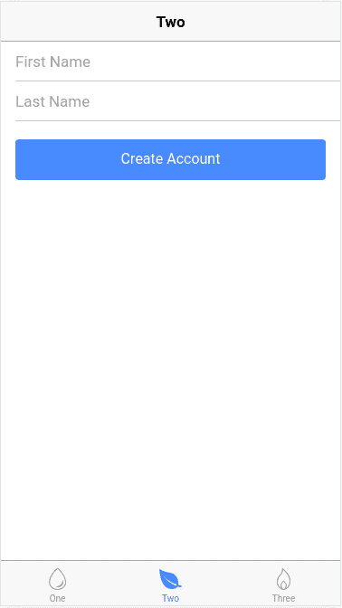

# 准备工作

由于这是你从头开始构建的第一个应用，你需要确保你已经按照第一章，“使用 Ionic 创建我们的第一个应用”，来设置环境和 Ionic CLI。如果你已经有了 Ionic 1，它必须更新。为此，你可以使用安装它时使用的相同命令行，如下所示：

```js
$ sudo npm install -g cordova ionic ios-sim
```

# 如何做到...

以下是为创建示例应用提供说明：

1.  使用`tabs`模板创建一个新的`PagesAndTabs`应用，并进入`PagesAndTabs`文件夹以启动 Visual Studio Code，如下所示：

```js
$ ionic start PagesAndTabs tabs 
$ cd PagesAndTabs
$ code .
```

1.  `blank`模板只提供了一个基本页面。在 Mac 上打开`Finder`应用或在 Windows 上打开 Windows 资源管理器，可以看到以下文件夹结构：

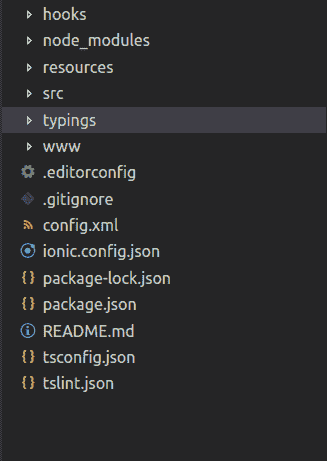

你只需修改 `/src` 文件夹中的内容，而不是 `/www`，正如在 Ionic 1 中那样。`/src` 文件夹中的所有内容都将被构建，而 `/www` 文件夹将自动创建。我们还将尽可能保留文件夹名称和文件名，因为这里的主要目标是理解标签模板的工作方式和你可以修改的区域。

1.  使用以下命令打开并编辑 `/src/pages/tabs/tabs.html` 模板文件：

    以下代码：

```js
<ion-tabs> 
  <ion-tab [root]="tab1Root" tabTitle="One" 
   tabIcon="water"></ion-tab>  <ion-tab [root]="tab2Root" 
   tabTitle="Two" 
   tabIcon="leaf"></ion-tab>  <ion-tab [root]="tab3Root" 
   tabTitle="Three" 
   tabIcon="flame"></ion-tab> 
</ion-tabs> 
```

新的模板只更新标题和图标。这是因为这个示例想要保留 `root` 变量的命名。你可以根据需要使用 `<ion-tab>` 添加更多标签页。

1.  要添加一个页面，你需要确保 `tab1Root` 指向一个现有的文件夹和模板。由于你将重用现有的标签结构，你只需修改 `/src/pages/home/home.html` 模板，如下所示，因为这将是你的第一个页面：

```js
<ion-header>
  <ion-navbar>
    <ion-title>One</ion-title>
  </ion-navbar>
</ion-header>

<ion-content padding>
  <h2>Welcome to Ionic!</h2>
  <p>
    This starter project comes with simple tabs-based layout for 
    apps
    that are going to primarily use a Tabbed UI.
  </p>
  <p>
    Take a look at the <code>src/pages/</code> directory to add or     
    change tabs, update any existing page or create new pages.
  </p>
</ion-content>
```

1.  此外，在同一个 `/home` 文件夹中，编辑 `home.ts`，它与相同的模板相对应，并在其中输入代码：

```js
import { Component } from '@angular/core';
import { NavController } from 'ionic-angular';

@Component({
  selector: 'page-home',
  templateUrl: 'home.html'
})
export class HomePage {

  constructor(public navCtrl: NavController) {

  }

}
```

1.  对于第二页，`tab2Root`，你将遵循类似的过程，通过编辑 `/src/pages/about/about.html` 模板，如下所示：

```js
<ion-header>
  <ion-navbar>
    <ion-title>
      Two
    </ion-title>
  </ion-navbar>
</ion-header>

<ion-content>
  <ion-list>
    <ion-item>
      <ion-input type="text" placeholder="First Name"></ion-input>
    </ion-item>

    <ion-item>
      <ion-input type="text" placeholder="Last Name"></ion-input>
    </ion-item>

    <div padding>
      <button ion-button primary block>Create Account</button>
    </div>
  </ion-list>
</ion-content>
```

1.  在前一步骤相同的文件夹中编辑 `about.ts`：

```js
import { Component } from '@angular/core';
import { NavController } from 'ionic-angular';

@Component({
  selector: 'page-about',
  templateUrl: 'about.html'
})
export class AboutPage {

  constructor(public navCtrl: NavController) {

  }

}
```

1.  最后，对于 `tab3Root` 页面，你可以更改模板，使其在 `/src/pages/contact/contact.html` 中显示滑块，如下所示：

```js
<ion-header>
  <ion-navbar>
    <ion-title>
      Three
    </ion-title>
  </ion-navbar>
</ion-header>

<ion-content>
  <ion-slides #mySlider index=0 (ionSlideDidChange)="onSlideChanged($event)">
    <ion-slide style="background-color: green">
      <h2>Slide 1</h2>
    </ion-slide>

    <ion-slide style="background-color: blue">
      <h2>Slide 2</h2>
    </ion-slide>

    <ion-slide style="background-color: red">
      <h2>Slide 3</h2>
    </ion-slide>

 </ion-slides>
</ion-content>
```

1.  在 `/contact` 文件夹中，你需要使用以下代码编辑 `contact.ts`：

```js
import { Component, ViewChild } from '@angular/core';
import { NavController, Slides } from 'ionic-angular';

@Component({
  selector: 'page-contact',
  templateUrl: 'contact.html'
})
export class ContactPage {
  @ViewChild('mySlider') slider: Slides;
  constructor(public navCtrl: NavController) {

  }
  onSlideChanged(e) {
    let currentIndex = this.slider.getActiveIndex();
    console.log("You are on Slide ", (currentIndex + 1));
  }

}
```

1.  前往你的终端，并输入以下命令行来运行应用：

```js
$ ionic serve
```

# 它是如何工作的...

实际上，这个简单的应用中包含了很多新的信息和许多概念。在更高层次上，这是应用的结构方式：

+   当你运行应用时，Cordova 会加载 `/www/index.html` 文件作为第一个打开的文件。你所有的代码和模板都将合并到一个文件中，即 `/www/build/main.js`。

+   `/app` 文件夹是大多数逻辑所在的地方。它以 `app.component.ts` 作为引导文件。

+   `/pages` 文件夹下的每个子文件夹将代表一个页面，这是 Ionic 中的一个新概念。一个页面由一个 HTML 模板、TypeScript 代码和一个 `.scss` 文件组成，用于自定义该特定模板。

+   `/theme` 文件夹将包含全局级别的变量和自定义设置，以覆盖来自 Ionic 的默认主题。

现在，让我们从 `/app` 文件夹中的所有内容开始。

`app.component.ts` 文件只导入启动应用所需的所有页面和组件。此示例默认需要以下四个导入：

```js
import { Component } from '@angular/core';
import { Platform } from 'ionic-angular';
import { StatusBar } from '@ionic-native/status-bar';
import { SplashScreen } from '@ionic-native/splash-screen';
import { TabsPage } from '../pages/tabs/tabs';
```

你必须始终从 Ionic 中导入 `Component`、`Platform` 和 `StatusBar`，因为这将为你提供 `@Component` 装饰器来引导你的应用。装饰器放置在其类之前，为类提供元数据。以下示例显示 `MyApp` 类具有组件的特性，具有 `template` 属性：

```js
@Component({
  templateUrl: 'app.html'
})
export class MyApp {
  rootPage:any = TabsPage;

  constructor(platform: Platform, statusBar: StatusBar, splashScreen: 
  SplashScreen) {
    platform.ready().then(() => {
      // Okay, so the platform is ready and our plugins are available.
      // Here you can do any higher level native things you might need.
      statusBar.styleDefault();
      splashScreen.hide();
    });
  }
}
```

由于这是一个简单的示例，你不需要声明很多，除了模板信息。类似于 Ionic 1，你可以使用 `template` 或 `templateUrl` 来指向一个本地文件。在我们的例子中，它是 `app.html`，内容如下：

```js
<ion-nav [root]="rootPage"></ion-nav>
```

类是 ES6 中的另一个新概念。然而，开发者已经在各种编程语言中声明了类，例如 Java 和 C#。在 ES6 中，你可以使用类来更有效地重用代码，并实现更好的抽象。类可以仅存在于该文件上下文中。考虑以下示例：

```js
class Example {}
```

然而，如果你想在其他地方使用该类，你必须导出：

```js
export class Example {} 
```

在一个类中，你可以有以下几种：

+   一个变量，例如 `this.a` 或 `this.b`

+   一个方法，例如 `doSomething()`

+   一个在用该类创建对象时自动执行（或初始化）的构造函数

更多关于类的信息可以在以下找到 [`developer.mozilla.org/en-US/docs/Web/JavaScript/Reference/Classes`](https://developer.mozilla.org/en-US/docs/Web/JavaScript/Reference/Classes).

ES6 的另一个优点是箭头函数，如下所示：

```js
platform.ready().then(() => { 

}); 
```

前面的内容等同于：

```js
platform.ready().then(function() { 

}); 
```

一个示例（通过传递参数）如下所示：

```js
var a1 = a.map( s => s.length ); 
```

同样的代码可以重写为如下所示：

```js
var a1 = a.map(function(s){ return s.length }); 
```

更多关于箭头函数的信息可以在以下找到：

[`developer.mozilla.org/en-US/docs/Web/JavaScript/Reference/Functions/Arrow_functions`](https://developer.mozilla.org/en-US/docs/Web/JavaScript/Reference/Functions/Arrow_functions).

在 `app.component.ts` 中有一个重要的事情，那就是你必须声明一个 `root` 页面。你可以从模板中通过 `[root]="rootPage"` 看到它，然后在构造函数中再次通过 `this.rootPage = TabsPage`。围绕 `root` 的方括号 `[]` 表示它是一个 DOM 节点的属性。这是 Angular 的新概念，因为它试图摆脱使用 DOM 属性，如 `ngmodel`（这往往会导致性能降低）。这里的赋值是告诉 Ionic 2 你将使用之前导入的 `TabsPage`，并将其作为 `root` 页面。然后，`ion-nav` 指令将查看自己的 `root` 属性以开始渲染页面。与 Ionic 1 相比，这里似乎有更多的抽象和样板代码。然而，这种做法是为了确保更好的分离和扩展。

一旦你理解了 `app.component.ts` 的工作原理，理解其他页面的概念就会更容易。让我们看看 `/pages/tabs/tabs.ts` 文件，因为在那里你定义了 `TabsPage` 类。从这个文件中，你需要导入三个其他页面，如下所示：

```js
import { Component } from '@angular/core'; 
import { HomePage } from '../home/home'; 
import { AboutPage } from '../about/about'; 
import { ContactPage } from '../contact/contact'; 
```

该页面的模板位于 `tabs.html`。然而，你也可以在 `.ts` 文件中将模板放在一个字符串中，如下所示：

```js
@Component({ 
  template: 
  ` <ion-tabs> 
      <ion-tab [root]="tab1Root" tabTitle="One" 
       tabIcon="water"></ion-tab><ion-tab [root]="tab2Root" tabTitle="Two" 
       tabIcon="leaf"></ion-tab><ion-tab [root]="tab3Root"  
       tabTitle="Three" 
       tabIcon="flame"></ion-tab> 
   </ion-tabs>` 
}) 
```

ES6 还引入了一个新特性，称为多行模板字符串。您可能已经意识到前面的模板字符串没有`join()`或字符串连接(`+`)运算符。原因是您可以使用反引号（`` ` ``）来允许多行模板。

因此，您不需要这样做：

```js
console.log("string text line 1\n"+ 
"string text line 2"); 
```

您现在可以这样做：

```js
console.log(`string text line 1 
string text line 2`); 
```

在页面装饰器下方，您需要导出`TabsPage`（以便您可以在`app.component.ts`中使用它），并告诉构造函数使用`tab1Root`、`tab2Root`和`tab3Root`作为标签导航中其他页面的根，如下所示：

```js
export class TabsPage { 
  tab1Root: any = HomePage; 
  tab2Root: any = AboutPage; 
  tab3Root: any = ContactPage; 

  constructor() { 
  } 
} 
```

Ionic 标签声明与 Ionic 1 非常相似，如下所示：

```js
<ion-tabs> 
    <ion-tab><ion-tab> 
</ion-tabs> 
```

您只需确保`root`属性指向另一个页面。

`tab1Root`实际上非常容易理解，因为它是一个文本页面，您可以在`<ion-content>`元素内添加自己的内容和设计，如下所示：

```js
<ion-content padding> 
  <h2>Welcome to Ionic 2 Tabs!</h2> 
  <p> 
    This starter project comes with simple tabs-based layout for 
     apps that are going to primarily use a Tabbed UI. 
  </p> 
</ion-content> 
```

如果您想更改标题，您可以简单地更改以下行：

```js
<ion-title>One</ion-title>
```

`tab2Root`和`tab3Root`在结构上非常相似。Ionic 为您提供了便利，可以在`AboutPage`类中直接绑定到事件，如下所示：

```js
import { Component } from '@angular/core'; 
import { NavController } from 'ionic-angular'; 

@Component({ 
  selector: 'page-about', 
  templateUrl: 'about.html' 
}) 
export class AboutPage { 

  constructor(public navCtrl: NavController) { 

  } 

  ionViewWillEnter() { 
    console.log('Enter Page 2'); 
  } 
} 
```

在前面的`about.ts`示例中，如果用户输入`tab2Root`，它将自动调用`ionViewWillEnter()`函数。这是一个显著的改进，因为在 Ionic 1 中，您必须在`$scope`变量上使用`$ionicView.enter`。再次强调，`$scope`的概念在 Angular 中不再存在。

对于可扩展的应用，最好将模板分离到不同的文件中，并避免在 JavaScript 代码中混合模板。`templateUrl`必须始终指向`.html`文件的相对位置。

在`./src/pages/contact/contact.html`中，您可以使用滑动框并绑定到滑动更改事件，如下所示：

```js
<ion-header>
  <ion-navbar>
    <ion-title>
      Three
    </ion-title>
  </ion-navbar>
</ion-header>

<ion-content>
  <ion-slides #mySlider index=0 (ionSlideDidChange)="onSlideChanged($event)">
    <ion-slide style="background-color: green">
      <h2>Slide 1</h2>
    </ion-slide>

    <ion-slide style="background-color: blue">
      <h2>Slide 2</h2>
    </ion-slide>

    <ion-slide style="background-color: red">
      <h2>Slide 3</h2>
    </ion-slide>

 </ion-slides>
</ion-content>
```

要在 Angular（或 Ionic）中获取事件，您必须使用括号`( )`，因为`ng-click`或类似的概念已不再可用。在这种情况下，如果幻灯片根据`ionSlideDidChange`更改，`ion-slides`指令将触发`ContactPage`类中的`onSlideChanged()`函数。

您不能在没有 TypeScript 进行代码转译成 JavaScript 的情况下直接运行 TypeScript。当您运行`ionic serve`时，这个过程会在幕后自动发生。同样，当您在项目中更改一些代码时，Ionic 会检测这些更改并在更新浏览器之前重新构建文件。您无需每次都刷新。

# 参见

+   Mozilla 开发者网络提供了关于 ECMAScript 6 的非常广泛的文档，您可以通过以下链接找到：[`developer.mozilla.org/en-US/docs/Web/JavaScript/New_in_JavaScript/ECMAScript_6_support_in_Mozilla`](https://developer.mozilla.org/en-US/docs/Web/JavaScript/New_in_JavaScript/ECMAScript_6_support_in_Mozilla)。

+   对于 Angular 2 特定的信息，您可以直接从 Angular 2 文档中阅读，文档链接为[`angular.io/docs/ts/latest/index.html`](https://angular.io/docs/ts/latest/index.html)。

# 添加左右菜单导航

菜单导航是许多移动应用中非常常见的组件。您可以使用菜单让用户在应用中切换到不同的页面，包括登录和登出。菜单可以放置在应用的左侧或右侧。Ionic 还允许您检测事件并进一步自定义菜单的外观和感觉。

这是您将要开发的应用的截图：

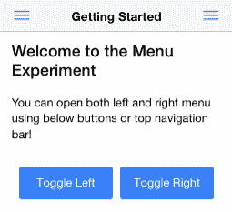

该应用将包含两个页面和两个菜单。您可以切换左侧或右侧菜单（但不能同时切换）。实际上，同时拥有两个菜单的可能性很小，但为了演示目的，这个应用将包含两个菜单，以便展示您可以设置的菜单的不同属性。左侧菜单将改变页面，而右侧菜单将允许您捕捉到点击的确切项目。

# 准备工作

此应用可以在您的网页浏览器上运行，因此不需要有物理设备。再次强调，您只需要在您的计算机上安装 Ionic。

# 如何实现...

下面是创建示例应用的说明：

1.  使用`sidemenu`模板创建一个新的`LeftRightMenu`应用，如图所示，并进入`LeftRightMenu`文件夹：

```js
$ ionic start LeftRightMenu sidemenu
$ cd LeftRightMenu
```

1.  确认您的应用文件夹结构类似于以下结构：

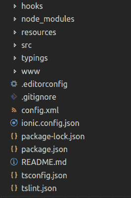

1.  编辑`./src/app/app.component.ts`并将其替换为以下代码：

```js
import { Component, ViewChild } from '@angular/core';
import { Nav, Platform } from 'ionic-angular';
import { StatusBar } from '@ionic-native/status-bar';
import { SplashScreen } from '@ionic-native/splash-screen';

import { HomePage } from '../pages/home/home';
import { ListPage } from '../pages/list/list';

@Component({
  templateUrl: 'app.html'
})
export class MyApp {
  @ViewChild(Nav) nav: Nav;
  text: string = '';
  rootPage: any = HomePage;

  pages: Array<{title: string, component: any}>;

  constructor(public platform: Platform, public statusBar: StatusBar, public splashScreen: SplashScreen) {
    this.initializeApp();

    // used for an example of ngFor and navigation
    this.pages = [
      { title: 'Home', component: HomePage },
      { title: 'List', component: ListPage }
    ];

  }

  initializeApp() {
    this.platform.ready().then(() => {
      // Okay, so the platform is ready and our plugins are available.
      // Here you can do any higher level native things you might need.
      this.statusBar.styleDefault();
      this.splashScreen.hide();
    });
  }

  openPage(page) {
    // Reset the content nav to have just this page
    // we wouldn't want the back button to show in this scenario
    this.nav.setRoot(page.component);
  }

  rightMenuClick(text) {
    this.text = text;
  } 
}
```

1.  打开并编辑以下代码的`./src/app/app.html`文件：

```js
<ion-menu id="leftMenu" [content]="content" side="left" type="overlay">
  <ion-header>
    <ion-toolbar>
      <ion-title>Menu</ion-title>
    </ion-toolbar>
  </ion-header>

  <ion-content>
    <ion-list>
      <button menuClose ion-item *ngFor="let p of pages" 
       (click)="openPage(p)">
        {{p.title}}
      </button>
    </ion-list>
  </ion-content>

</ion-menu>

<ion-menu id="rightMenu" [content]="content" side="right" type="reveal">
  <ion-header>
    <ion-toolbar>
      <ion-title>Items</ion-title>
    </ion-toolbar>
  </ion-header>

  <ion-content>
   <ion-list>
    <button ion-item (click)="rightMenuClick('Item One')">
      Item One
    </button>

    <button ion-item (click)="rightMenuClick('Item Two')"> 
      Item Two 
    </button>

   </ion-list>

   <ion-card *ngIf="text">
    <ion-card-content>
      You just clicked {{ text }}
    </ion-card-content>
   </ion-card>
  </ion-content>

</ion-menu>

<!-- Disable swipe-to-go-back because it's poor UX to combine STGB with side menus -->
<ion-nav [root]="rootPage" #content swipeBackEnabled="false"></ion-nav>
```

在这个模板中，有两个菜单作为兄弟元素。它们也与`ion-nav`处于同一级别，而不是父或子。这种结构对于菜单导航来说很重要。

1.  现在，让我们创建两个页面，您只需要修改`sidemenu`模板中的标准页面。打开并编辑`./src/app/pages/home/home.html`模板：

```js
<ion-header>
  <ion-navbar>
    <ion-title>Getting Started</ion-title>
    <ion-buttons left>
      <button ion-button menuToggle="leftMenu">
        <ion-icon name="menu"></ion-icon>
      </button>
    </ion-buttons>

    <ion-buttons right>
      <button ion-button menuToggle="rightMenu">
        <ion-icon name="menu"></ion-icon>
      </button>
    </ion-buttons>
  </ion-navbar>
</ion-header>

<ion-content padding class="getting-started">
  <h3>Welcome to the Menu Experiment</h3>
  <p>
    You can open both left and right menu using below buttons or top 
    navigation bar!
  </p>
  <ion-row>
    <ion-col width-50>
      <button ion-button primary block menuToggle="leftMenu">Toggle Left</button>
    </ion-col>
    <ion-col width-50>
      <button ion-button primary block menuToggle="rightMenu">Toggle Right</button>
    </ion-col>
  </ion-row>
</ion-content>
```

1.  在同一文件夹中，打开并编辑`.css`类通过`home.scss`，如图所示：

```js
page-home {
    .getting-started {
        p {
            margin: 20px 0;
            line-height: 22px;
            font-size: 16px;
        }
    }
    .bar-button-menutoggle {
        display: inline-flex;
    }
}
```

注意，由于您正在使用`sidemenu`模板，它已经包含了一个第二页（例如，列表）。在这个特定示例中，您不需要修改该页面。

1.  打开并编辑第二个页面的模板`./src/pages/list/list.html`，如图所示：

```js
<ion-header>
  <ion-navbar>
    <button ion-button menuToggle>
      <ion-icon name="menu"></ion-icon>
    </button>
    <ion-title>List</ion-title>
  </ion-navbar>
</ion-header>

<ion-content>
  <ion-list>
    <button ion-item *ngFor="let item of items" (click)="itemTapped($event, item)">
      <ion-icon [name]="item.icon" item-left></ion-icon>
      {{item.title}}
      <div class="item-note" item-right>
        {{item.note}}
      </div>
    </button>
  </ion-list>
  <div *ngIf="selectedItem" padding>
    You navigated here from <b>{{selectedItem.title}}</b>
  </div>
</ion-content>
```

1.  前往您的终端并运行应用：

```js
$ ionic serve
```

# 它是如何工作的...

由于这个应用只是对菜单导航的介绍，它不会管理页面路由和状态参数。在更高层次上，这是应用的流程：

+   `app.ts`在`app.html`中加载了两个`menu`模板。

+   左侧菜单将触发`openPage()`函数以打开`PageTwo`。

+   右侧菜单将触发`rightMenuClick()`函数以改变`this.text`属性并在屏幕上显示。

在`app.html`模板中，左侧菜单具有以下属性：

```js
side="left" type="overlay" 
```

然而，右侧菜单有以下的分配：

```js
side="right" type="reveal" 
```

`side` 属性将决定菜单应在屏幕上的哪个位置显示。有两种类型的菜单。`overlay` 选项将保持中心页面不变，不移动。`reveal` 选项将推动整个屏幕以显示菜单。你选择哪种类型取决于你应用程序的设计。

每个 `ion-menu` 指令都必须声明 `[content]="content"`，因为它将使用内容区域来绑定左右滑动。在这种情况下，它基本上是 `ion-nav` 中的一个局部变量，如下所示：

```js
<ion-nav id="nav" [root]="rootPage" #content swipeBackEnabled="false"></ion-nav> 
```

如果你想要为菜单设置标题，`ion-menu` 内的 `ion-toolbar` 的使用是可选的。要显示菜单项的关键是使用 `ion-list` 和 `ion-item`。你可以通过循环数组来动态显示菜单项，如图所示：

```js
    <ion-list> 
      <button menuClose ion-item *ngFor="let p of pages" 
       (click)="openPage(p)"> 
        {{p.title}} 
      </button> 
    </ion-list>
```

`*ngFor` 是在 Ionic 1 中 `ng-repeat` 的替代品。你需要使用 `let p`，因为它与声明一个名为 `p` 的局部变量相同。这是变量隔离的最佳实践。否则，其概念与 Ionic 1 非常相似，你可以为 `pages` 数组中的每个项目获取 `p.title`。

在右侧菜单中，你不需要通过 `nav.setRoot()` 跳转到不同的页面，你只需设置一些文本，并在菜单中动态显示文本，如图所示：

```js
    <ion-card *ngIf="text"> 
      <ion-card-content> 
        You just clicked {{ text }} 
      </ion-card-content> 
    </ion-card> 
```

因此，如果 `text` 变量不存在（这意味着用户尚未点击任何内容），则 `ion-card` 将不会通过 `*ngIf` 显示任何内容。

对于每个页面，你必须声明相同的 `ion-navbar`。否则，你将失去顶部导航和菜单按钮：

```js
<ion-header> 
  <ion-navbar> 
    <ion-title>Getting Started</ion-title> 

    <ion-buttons start> 
      <button ion-button menuToggle="leftMenu"> 
        <ion-icon name="menu"></ion-icon> 
      </button> 
    </ion-buttons>  

    <ion-buttons end> 
      <button ion-button menuToggle="rightMenu"> 
        <ion-icon name="menu"></ion-icon> 
      </button>  
    </ion-buttons>  
  </ion-navbar> 
</ion-header> 
```

注意，`leftMenu` 和 `rightMenu` 必须与你在 `app.html` 模板中使用的相同 `id`。

在第一页，还有两个按钮可以触发内容页内的菜单，如图所示：

```js
  <ion-row> 
    <ion-col width-50> 
      <button primary block menuToggle="leftMenu">Toggle 
       Left</button> 
    </ion-col> 
    <ion-col width-50> 
      <button primary block menuToggle="rightMenu">Toggle 
       Right</button> 
    </ion-col> 
  </ion-row>
```

这两个按钮同样调用 `menuToggle` 来触发菜单。按钮被放置在 Ionic 网格系统中。由于 Ionic 使用 Flexbox，使用起来非常简单——你只需要创建 `ion-col` 和 `ion-row`。带有数字的 `width` 属性将决定宽度百分比。

# 参见

+   要进一步了解 Ionic 菜单的使用，你可以查看以下链接：

    [`ionicframework.com/docs/v2/components/#menus`](http://ionicframework.com/docs/v2/components/#menus).

+   Ionic 菜单的 API 文档也可在以下地址找到：

    [`ionicframework.com/docs/v2/api/components/menu/Menu/`](http://ionicframework.com/docs/v2/api/components/menu/Menu/).

# 使用状态参数导航多个页面

应用程序导航是一个重要的话题，因为它是一个用户体验的核心。你希望管理用户在提交表单或打开新标签页后对会发生什么的预期。此外，你可能还想确保用户数据在正确的页面或正确的状态下可用。当涉及到返回导航的要求时，这可能会变得更加复杂。

本节将教你如何使用 `NavController` 和 `NavParams`，这两个是管理应用所有导航的重要基类。这是你将开发的应用的截图：

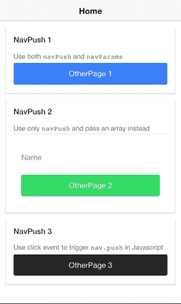

此应用展示了三种不同的导航到不同页面以及如何

传递参数。当你点击任何按钮时，它将显示第二页，该页如下

如下所示：

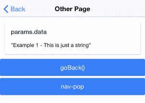

第二页基本上是捕获参数并在屏幕上显示它们。它还提供了三个不同的选项来导航回上一页。

在本例中，你将学习以下内容：

+   如何使用 `NavController` 和 `NavParams`

+   如何在模板中直接使用 `[navPush]` 和 `[navParams]`

+   如何在输入框中添加双向数据绑定

+   如何使用管道将 JSON 对象转换为字符串并在屏幕上渲染

# 准备工作

你只需要有可用的 Ionic CLI 来运行此应用。

# 如何做到...

这里是说明：

1.  使用空白模板创建一个新的 `Navigation` 应用，如图所示，并进入 `Navigation` 文件夹：

```js
$ ionic start Navigation blank
$ cd Navigation
```

1.  使用以下代码编辑 `./src/app/app.module.ts`：

```js
import { BrowserModule } from '@angular/platform-browser';
import { ErrorHandler, NgModule } from '@angular/core';
import { IonicApp, IonicErrorHandler, IonicModule } from 'ionic-angular';
import { SplashScreen } from '@ionic-native/splash-screen';
import { StatusBar } from '@ionic-native/status-bar';

import { MyApp } from './app.component';
import { HomePage } from '../pages/home/home';
import { OtherPage } from '../pages/otherPage/otherPage';

@NgModule({
  declarations: [
    MyApp,
    HomePage,
    OtherPage
  ],
  imports: [
    BrowserModule,
    IonicModule.forRoot(MyApp)
  ],
  bootstrap: [IonicApp],
  entryComponents: [
    MyApp,
    HomePage,
    OtherPage
  ],
  providers: [
    StatusBar,
    SplashScreen,
    {provide: ErrorHandler, useClass: IonicErrorHandler}
  ]
})
export class AppModule {}
```

你必须修改此文件的主要原因是为了通过 `NgModule` 声明 `OtherPage` 为一个动态加载的模块。你将不得不在 `home.ts` 文件中再次声明 `OtherPage`。

1.  编辑 `./src/app/pages/home/home.html`：

```js
<ion-header>
  <ion-navbar>
    <ion-title>
      Home
    </ion-title>
  </ion-navbar>
</ion-header>

<ion-content padding>
  <ion-card>
    <ion-card-header>
      NavPush 1
    </ion-card-header>
    <ion-card-content>
      <p>Use both <code>navPush</code> and 
      <code>navParams</code></p>
        <button ion-button block [navPush]="otherPage" 
        [navParams]="myString">
          OtherPage 1
        </button>
    </ion-card-content>
  </ion-card>

 <ion-card>
  <ion-card-header>
  NavPush 2
  </ion-card-header>
   <ion-card-content>
    <p>Use only <code>navPush</code> and pass an array instead</p>
      <ion-list>
        <ion-item>
          <ion-label floating>Name</ion-label>
          Adding Ionic 2 Components 58
          <ion-input type="text" [(ngModel)]="myJSON.text"></ion-
          input>
        </ion-item>
      </ion-list>
      <div>
        <button ion-button block color="secondary" 
        [navPush]="otherPage" 
        [navParams]="myJSON">OtherPage 2</button>
      </div>
    </ion-card-content>
  </ion-card>

  <ion-card>
    <ion-card-header>
      NavPush 3
    </ion-card-header>
    <ion-card-content>
      <p>Use click event to trigger <code>nav.push</code> in 
      Javascript </p>
      <button ion-button block color="dark" 
      (click)="gotoOtherPage()">OtherPage 3</button>
    </ion-card-content>
  </ion-card>
</ion-content>
```

1.  使用以下代码编辑 `./src/app/pages/home/home.ts`：

```js
import { Component } from '@angular/core';
import { NavController } from 'ionic-angular';
import { OtherPage } from '../otherPage/otherPage';

@Component({
  selector: 'page-home',
  templateUrl: 'home.html'
})
export class HomePage {
  public myString: string = 'Example 1 - This is just a string';
  public myJSON: any = {text: ''};
  otherPage: any = OtherPage;
  constructor(public navCtrl: NavController) {

  }

  gotoOtherPage() {
    this.navCtrl.push(OtherPage, {text: 'Example 3 - This is an object'});
  }

}
```

1.  创建 `./src/app/pages/otherPage` 文件夹

1.  在之前创建的 `otherPage` 文件夹中创建 `otherPage.html` 文件：

```js
<ion-header>
  <ion-navbar>
    <ion-title>Other</ion-title>
  </ion-navbar>
</ion-header>

<ion-content>
 <ion-card *ngIf="navParams.data">
    <ion-card-header>
      navParams.data
    </ion-card-header>
    <ion-card-content>
    {{ navParams.data | json }}
    </ion-card-content>
 </ion-card>

 <button ion-button block (click)="goBack()">
    goBack()
 </button>

 <button ion-button block navPop>
    nav-pop
 </button>
</ion-content>
```

1.  在同一文件夹中，添加 `otherPage.ts`，代码如下：

```js
import { Component } from '@angular/core';
import { NavController, NavParams } from 'ionic-angular';

@Component({
  selector: 'page-other',
  templateUrl: 'otherPage.html',
})
export class OtherPage {

  constructor(public navCtrl: NavController, public navParams: NavParams) {
  }

  ionViewDidLoad() {
    console.log('ionViewDidLoad OtherPage');
  }
  goBack() {
    this.navCtrl.pop();
  }
}
```

1.  进入你的终端并运行应用：

```js
$ ionic serve
```

你也可以使用 Ionic CLI 的生成命令来生成新的页面。例如，要生成一个新页面，你可以使用以下 ionic 命令：`ionic generate page pageName`。在这里，`pageName` 是新页面的名称。

你不仅可以生成页面，还可以生成组件、管道以及许多其他东西。请查看 [`ionicframework.com/docs/cli/generate/`](https://ionicframework.com/docs/cli/generate/)

# 它是如何工作的...

从高层次来看，这是应用的架构：

+   应用将通过 `app.ts` 启动并加载 `home.html` 作为 `root` 页面

+   `/home` 文件夹中的所有内容都是你的第一页

+   `/otherPage` 文件夹中的所有内容都是你的第二页

+   这两个页面使用 `NavParams`（或来自

    （模板））

让我们看看 `home.ts`。你必须导入 `NavController` 和 `NavParams`：

```js
import { NavController, NavParams } from 'ionic-angular';
```

对于你的构造函数，你需要做一些事情，如下所示：

```js
  public myString: string = 'Example 1 - This is just a string'; 
  public myJSON: any = {text: ''}; 
  otherPage: any = OtherPage; 

  constructor(public navCtrl: NavController) { 
  } 
```

`this.navCtrl` 变量将引用导入的 `NavController`。你应该像这样将其引入，以便使用内部导航功能。`myString` 和 `myJSON` 是你将传递给第二页参数的变量。你还需要在模板中稍后使 `OtherPage` 类可用，并使其对 `navPush` 可访问。

如所示，`gotoOtherPage()` 方法做了一件事：将页面推送到当前导航：

```js
  gotoOtherPage() { 
    this.navCtrl.push(OtherPage, {text: 'Example 3 - This is an 
     object'}); 
  } 
```

这样做，你的应用将立即切换到 `OtherPage`，这也会包括参数。

第一页（即 `home.html`）的 `home.html` 模板演示了以下三种情况：

+   你可以直接在模板中使用 `[navPush]` 和 `[navParams]`。你只需要传递处理此页面的类的内部对象。因此，在这种情况下，你必须传递 `otherPage` 而不是 `OtherPage`（注意大写 `O`）：

```js
<button block [navPush]="otherPage" 
 [navParams]="myString">OtherPage 1</button>
```

+   你也可以将 JSON 对象作为参数传递给 `[navPush]`：

```js
<button ion-button block color="secondary" 
 [navPush]="otherPage" [navParams]="myJSON">OtherPage 
 2</button>
```

+   第三种情况是手动导航到新页面，如下所示，使用页面类内部实现的方法：

```js
<button block dark (click)="gotoOtherPage()">OtherPage 3</button> 
```

与 Angular 1 或 Ionic 1 不同，你不能再使用 `ng-model` 进行双向绑定。新的语法将是任何输入元素的 `[(ngModel)]`。

在你的第二页中，你只需要从构造函数中使 `NavController` 和 `NavParams` 可用。

让我们看看你的 `otherPage.js` 文件：

```js
constructor(public navCtrl: NavController, public params: NavParams) { 
} 
```

第二页（即 `otherPage.html`）的模板非常简单。首先，顶部的导航栏是为了启用默认的返回按钮：

```js
<ion-header>
  <ion-navbar>
    <ion-title>Other</ion-title>
  </ion-navbar>
</ion-header>
```

返回按钮是 Ionic 中的自动机制，所以你不必担心它何时会显示。

以下代码将在存在状态参数的情况下显示变量内容：

```js
  <ion-card *ngIf="params.data"> 
    <ion-card-header> 
      params.data 
    </ion-card-header> 
    <ion-card-content> 
      {{ params.data | json }} 
    </ion-card-content> 
  </ion-card>
```

`ion-card` 使用 `*ngIf` 来决定是否渲染此 DOM。由于 `params.data` 可能是一个 JSON 对象，你需要将其转换为字符串以在屏幕上显示。Angular 1 有过滤器，但 Angular 将此功能重命名为管道。然而，基本概念是相同的。`{{ params.data | json }}` 代码基本上告诉 Angular 将 `json` 函数应用于 `params.data` 并渲染输出。

你可以使用 `nav.pop()` 函数返回上一页，如下所示：

```js
  <button block (click)="goBack()"> 
    goBack() 
  </button> 
```

或者，你可以使用指令 `navPop` 返回，并将其放入你的按钮中，如下所示：

```js
  <button block navPop> 
    nav-pop 
  </button> 
```

因此，这些都是 Ionic 导航功能中的可能性。

# 参见

更多信息，请参阅以下链接中的官方 Ionic 文档，了解 `NavController` 和 `NavParams`：

+   [`ionicframework.com/docs/api/navigation/NavController/`](https://ionicframework.com/docs/api/navigation/NavController/)

+   [`ionicframework.com/docs/api/navigation/NavParams/`](https://ionicframework.com/docs/api/navigation/NavParams/)

要了解更多关于 Angular 管道如何工作，您可以查看以下页面，了解关于 JSON 管道的先前示例：[`angular.io/api/common/JsonPipe`](https://angular.io/api/common/JsonPipe)

# 在应用中同时使用菜单、标签页和分段

在前面的示例中，我们使用了标签页和菜单进行导航。我们在两个不同的应用中使用了它们。但是，有时我们可能想在单个应用中使用标签页和菜单。在这个示例中，我们将使用标签页、菜单和分段。应用的第二页将类似于以下截图：

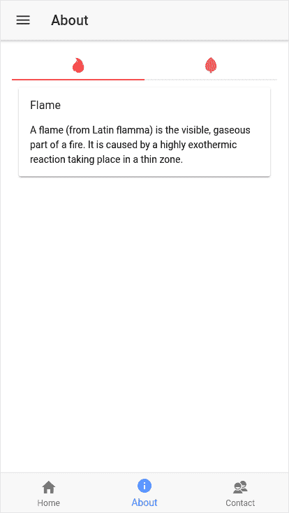

如果您仔细查看前面的截图，您会看到有一个汉堡菜单按钮，底部有三个标签页，以及页面标题之后的两按钮。这两个按钮实际上是分段按钮。在 UX 中，它们与标签页相似，但在工作方式上非常不同。您将在后面的代码中看到它们是如何不同的。

# 准备工作

运行此应用需要 Ionic CLI 和网页浏览器。

# 如何操作...

创建示例应用的说明如下：

1.  使用`tabs`模板创建一个新的`MenuTabsSegment`应用，如图所示，并进入`MenuTabsSegment`文件夹：

```js
$ ionic start MenuTabsSegment tabs
$ cd MenuTabsSegment 
```

1.  使用以下代码编辑`./src/app/app.html`：

```js
<ion-menu [content]="content">
  <ion-header>
    <ion-toolbar>
      <ion-title>Menu</ion-title>
    </ion-toolbar>
  </ion-header>
  <ion-content>
    <ion-list>
      <button ion-item menuToggle>
        Close Menu
      </button>
    </ion-list>
  </ion-content>
</ion-menu>

<ion-nav #content [root]="rootPage"></ion-nav>
```

1.  使用以下代码编辑`./src/app/pages/about/about.ts`：

```js
import { Component } from '@angular/core';
import { NavController } from 'ionic-angular';

@Component({
  selector: 'page-about',
  templateUrl: 'about.html'
})
export class AboutPage {
  seg:string = "flame";
  constructor(public navCtrl: NavController) {

  }

}
```

1.  使用以下代码编辑`./src/app/pages/about/about.html`：

```js
<ion-header>
  <ion-navbar>
    <button ion-button menuToggle icon-only>
      <ion-icon name='menu'></ion-icon>
    </button>
    <ion-title>
      About
    </ion-title>
  </ion-navbar>
</ion-header>

<ion-content padding>
  <ion-segment [(ngModel)]="seg" color="danger">
      <ion-segment-button value="flame">
        <ion-icon name="flame"></ion-icon>
      </ion-segment-button>
      <ion-segment-button value="leaf">
        <ion-icon name="leaf"></ion-icon>
      </ion-segment-button>
  </ion-segment>

  <div *ngIf="seg === 'flame'">
    <ion-card>
      <ion-card-header>
        Flame
      </ion-card-header>
      <ion-card-content>
        A flame (from Latin flamma) is the visible, gaseous part of 
        a fire. It is caused by a highly exothermic reaction taking place in 
        a thin zone.
      </ion-card-content>
    </ion-card>
  </div>

  <div *ngIf="seg === 'leaf'">
     <ion-card>
      <ion-card-header>
        Leaf
      </ion-card-header>
      <ion-card-content>
        A leaf is an organ of a vascular plant and is the principal 
        lateral appendage of the stem.
      </ion-card-content>
    </ion-card>
  </div>
</ion-content>
```

# 它是如何工作的...

到目前为止，我们已经使用了菜单和标签页，但它们在不同的应用中使用。在这个示例中，我们在单个应用中同时使用它们。让我们再次查看我们的`app.html`：

```js
<ion-menu [content]="content">
  <ion-header>
    <ion-toolbar>
      <ion-title>Menu</ion-title>
    </ion-toolbar>
  </ion-header>
  <ion-content>
    <ion-list>
      <button ion-item menuToggle>
        Close Menu
      </button>
    </ion-list>
  </ion-content>
</ion-menu>

<ion-nav #content [root]="rootPage"></ion-nav>
```

您会注意到我们正在使用`ion-menu`来显示菜单。我们还使用`rootPage`初始化 Ionic 导航。如果您检查`app.component.ts`，您会看到我们将`rootPage`初始化为等于`TabsPage`，如下所示：

```js
rootPage:any = TabsPage;
```

这是使用单页面上同时使用侧边菜单和标签页的关键：

此外，我们在`about.html`的应用第二页添加了一个分段。我之所以在菜单和标签页旁边使用分段，是因为分段在用户体验方面与标签页非常相似。用户点击它，会根据分段看到不同的视图/内容。但在 Ionic 中，它与标签页有很大不同。请看以下`about.html`的代码片段：

```js
<ion-segment [(ngModel)]="seg" color="danger">
      <ion-segment-button value="flame">
        <ion-icon name="flame"></ion-icon>
      </ion-segment-button>
      <ion-segment-button value="leaf">
        <ion-icon name="leaf"></ion-icon>
      </ion-segment-button>
  </ion-segment>
```

上述 HTML 代码用于渲染`segment`容器和`segment`按钮。我们通过`ngModel`在`AboutPage`类中使用`seg`属性将分段与`AboutPage`关联起来。当用户点击任何分段按钮时，`seg`属性初始化为分段按钮的值。在这个例子中，`seg`属性可以具有`flame`或`leaf`的值。根据这个值，我们在`about.html`的其他部分向用户展示内容，如下面的代码块所示：

```js
<div *ngIf="seg === 'flame'">
    <ion-card>
      <ion-card-header>
        Flame
      </ion-card-header>
      <ion-card-content>
        A flame (from Latin flamma) is the visible, gaseous part of a 
       fire. 
        It is caused by a highly exothermic reaction taking place in a     
       thin zone.
      </ion-card-content>
    </ion-card>
  </div>

  <div *ngIf="seg === 'leaf'">
     <ion-card>
      <ion-card-header>
        Leaf
      </ion-card-header>
      <ion-card-content>
        A leaf is an organ of a vascular plant and is the principal
        lateral appendage of the stem.
      </ion-card-content>
    </ion-card>
  </div>
```

你还应该记住，当你加载 `AboutPage` 时，`seg` 属性的值将是未定义的。因此，为了进行默认选择，我们必须在 `About.ts` 中初始化 `seg` 属性的值，如下所示：

```js
seg:string = "flame";
```

# 参见

查看 Ionic 的 MenuController 文档[`ionicframework.com/docs/api/components/app/MenuController/`](https://ionicframework.com/docs/api/components/app/MenuController/)。它有很好的示例说明如何在同一个应用中使用多个菜单。

# 使用 Ionic 网格创建复杂 UI

由于本章是关于 Ionic 组件的，我将提到我最喜欢的组件之一是 Ionic 网格——一个非常有用的组件来布局你的应用。基于 Flexbox，它与 Bootstrap 的网格非常相似。Ionic 网格的文档说明：

“网格由三个单元组成——网格、行和列。列将扩展以填充其行，并调整大小以适应额外的列。它基于一个 12 列布局，具有基于屏幕大小的不同断点。列数和断点可以完全使用 Sass 进行自定义。”

我们将使用非常少的代码创建一个复杂的 UI 结构。应用看起来如下所示：

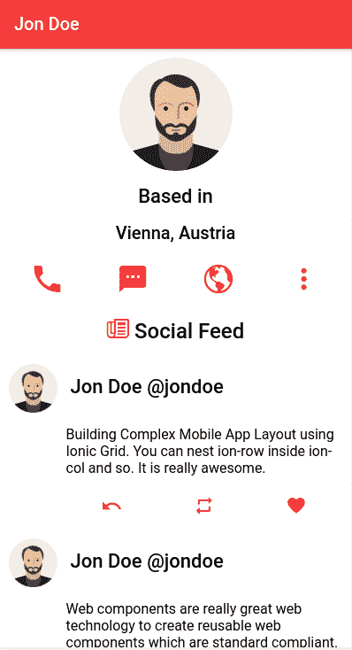

# 准备工作

就像之前的示例一样，你只需要使用 Ionic CLI 来操作和运行这个示例应用。

# 如何操作...

这里是创建示例应用的说明：

1.  使用 `blank` 模板创建一个新的 `IonicGrid` 应用，如图所示，然后进入 `IonicGrid` 文件夹：

```js
$ ionic start IonicGrid blank 
$ cd IonicGrid
```

1.  使用以下代码编辑 `./src/app/pages/home.ts`:

```js
import { Component } from '@angular/core';
import { NavController } from 'ionic-angular';

@Component({
  selector: 'page-home',
  templateUrl: 'home.html'
})
export class HomePage {
  socialFeed:Array<any>;
  constructor(public navCtrl: NavController) {
    this.socialFeed = [
      { post: 'Building Complex Mobile App Layout using Ionic Grid. You can 
       nest ion-row inside ion-col and so. It is really awesome.'},
      { post: 'Web components are really great web technology to create 
      reusable web components which are standard compliant.'},
      { post: 'Nothing is in my mind. I am just writing to make sure there 
      are at least 3 rows in feed'}
    ]
  }

}
```

1.  使用以下代码编辑 `./src/app/pages/home/home.html`:

```js
<ion-header>
  <ion-navbar color="danger">
    <ion-title>
      Jon Doe
    </ion-title>
  </ion-navbar>
</ion-header>

<ion-content>
 <ion-grid>
   <ion-row text-center id="info-row">
     <ion-col>
       <ion-avatar>
         
       </ion-avatar>
       <h3>Based in</h3>
       <h4>Vienna, Austria</h4>
     </ion-col>
   </ion-row>

   <ion-row text-center id="contact-icons">
     <ion-col><ion-icon name="call" color="danger"></ion-icon>
</ion-col><ion-col><ion-icon name="text" color="danger"></ion-icon>
</ion-col><ion-col><ion-icon name="globe" color="danger"></ion-icon>
</ion-col><ion-col><ion-icon name="more" color="danger"></ion-icon>
</ion-col></ion-row>

   <h2 text-center><ion-icon name="paper" color="danger"></ion-icon>  
   Social Feed</h2>
   <ion-row class="social-row" *ngFor="let feed of socialFeed">
     <ion-col col-2>
      <ion-avatar>
         
      </ion-avatar>
     </ion-col>

     <ion-col col-10>
      <ion-row>
        <ion-col><h3>Jon Doe @jondoe</h3></ion-col>
      </ion-row>

      <ion-row>
        <p>{{feed.post}}</p>
      </ion-row>

      <ion-row text-center class="social-interaction-row">
        <ion-col><ion-icon name="undo" color="danger"></ion-icon>
      </ion-col>
        <ion-col><ion-icon name="repeat" color="danger"></ion-icon>
      </ion-col>
        <ion-col><ion-icon name="heart" color="danger"></ion-icon>
      </ion-col>
      </ion-row>

     </ion-col>
   </ion-row>
 </ion-grid>
</ion-content>
```

1.  使用以下代码编辑 `./src/app/pages/home/home.scss`:

```js
page-home {
    #info-row {
        ion-col {
            ion-avatar img{
                margin: 0 auto;
                border-radius:50%;
            }
        }
    }
    #contact-icons {
        ion-icon {
            font-size:40px;
        }
    }

    .social-row {
        ion-avatar {
            margin-top: 0.8rem;
        }
        p {
            font-size:1.6rem;
        }
        .social-interaction-row {
            font-size: 20px;
        }
    }
}
```

# 工作原理...

在 Ionic 网格中，有三种类型的组件。第一种是 `ion-grid`，第二种是 `ion-row`，第三种是 `ion-col`。`ion-grid` 作为 `ion-row` 和 `ion-col` 的容器。它占据父容器的全部宽度。`ion-row` 用于在网格中创建行。它占据 `ion-grid` 的全部宽度。`ion-col` 用于在 `ion-row` 内部创建列。正如我在前面的章节中提到的，它是一个 12 列网格。因此，在一行中你可以有最多十二列，而不需要换行。

现在，让我们了解我们如何构建我们的示例。

我们的 `home.html` 页面是一个模拟社交网站的个人资料页面。我们有一个用户头像，他们的位置，姓名，各种联系图标，然后是社交动态。

这就是用户头像和位置在应用中的样子：

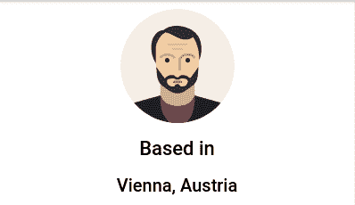

以下是这个的代码：

```js
 <ion-row text-center id="info-row">
     <ion-col>
       <ion-avatar>
         
       </ion-avatar>
       <h3>Based in</h3>
       <h4>Vienna, Austria</h4>
     </ion-col>
 </ion-row>
```

非常简单。我们有一行，一行中有一个列。那个列包含用户头像和位置。请注意，我们已经将头像图片保存在 `assets/img` 文件夹中。

接下来是联系图标。在我们的应用中，它们看起来如下：

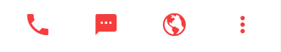

```js
 <ion-row text-center id="contact-icons">
     <ion-col><ion-icon name="call" color="danger"></ion-icon></ion-
     col><ion-col><ion-icon name="text" color="danger"></ion-icon></ion-
     col><ion-col><ion-icon name="globe" color="danger"></ion-icon></ion-
     col><ion-col><ion-icon name="more" color="danger"></ion-icon></ion-
     col></ion-row>
```

这也很直接。但从这个例子中我们学到的是，如果你在 `ion-row` 内部有多个 `ion-col`，Ionic 网格会自动将宽度平均分配给每个 `ion-col`。这是因为 `ion-row` 是一个弹性父元素，而 `ion-col` 是弹性子元素。

最后，我们有了社交动态，其外观如下：

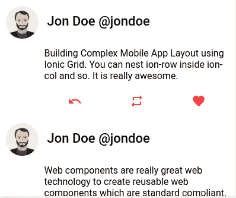

社交动态的代码如下：

```js
<ion-row class="social-row" *ngFor="let feed of socialFeed">
     <ion-col col-2>
      <ion-avatar>
         
      </ion-avatar>
     </ion-col>

     <ion-col col-10>
      <ion-row>
        <ion-col><h3>Jon Doe @jondoe</h3></ion-col>
      </ion-row>

      <ion-row>
        <p>{{feed.post}}</p>
      </ion-row>

      <ion-row text-center class="social-interaction-row">
        <ion-col><ion-icon name="undo" color="danger"></ion-icon></ion-
      col>
        <ion-col><ion-icon name="repeat" color="danger"></ion-icon> 
      </ion-col>
        <ion-col><ion-icon name="heart" color="danger"></ion-icon>
      </ion-col>
      </ion-row>

     </ion-col>
   </ion-row>
```

从这个例子中我们可以学到三件事：

+   你可以使用 `col-width*` 属性强制设置 `col` 的宽度。我们将 `width*` 替换为 1-12 之间的一个值，那么这个列将只占据 `ion-row` 空间的 `width*/12`。

+   我们可以在 `ion-col` 内部嵌套 `ion-row`，依此类推。你会注意到我们有一个占据 `ion-row` 宽度的 10/12 的 `ion-col`。在这个 `ion-column` 内部，我们有一个子 `ion-row` 元素，显示用户的帖子，还有一个 `ion-row` 来显示三个用于社交分享和互动的图标。

+   每个子元素 `ion-row` 将占据其 `ion-col` 父元素的完整宽度。

以下图片展示了这个结构及其说明：

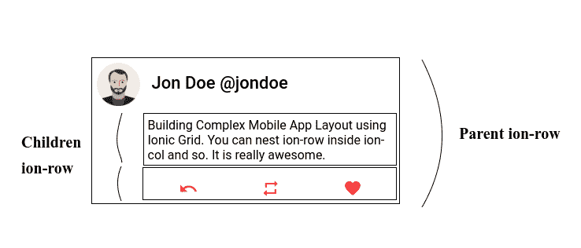

# 参见

+   想了解更多关于 Ionic 网格的信息，请查看 Ionic 文档：[`ionicframework.com/docs/api/components/grid/Grid/`](https://ionicframework.com/docs/api/components/grid/Grid/)。

+   如果你想了解 Flexbox 的工作原理，请查看这个非常好的介绍：[`css-tricks.com/snippets/css/a-guide-to-flexbox/`](https://css-tricks.com/snippets/css/a-guide-to-flexbox/)。
