# 第七章：使用 Ionic Native 支持设备功能

在本章中，我们将介绍与原生设备功能支持相关的以下任务：

+   使用相机插件拍照

+   使用社交分享插件分享内容

+   使用本地通知插件显示本地通知

+   使用指纹 AIO 插件进行指纹认证。

+   创建一个媒体播放器和添加媒体播放器通知控件

+   使用 Google Maps 插件和地理编码支持创建出租车应用程序

# 简介

在本章中，你将学习如何访问设备的一些常见功能，例如相机、联系名单、电子邮件和地图。其中一些功能可以仅使用 JavaScript 环境编写，但性能并不与原生支持相媲美。

Cordova 拥有一个非常支持的社区，拥有许多插件。你可能想查看 [`plugins.cordova.io/`](http://plugins.cordova.io/) 以了解有哪些插件。幸运的是，你不需要直接处理这些插件。你将使用在 Cordova 和 Angular 之上的 Ionic Native ([`ionicframework.com/docs/v2/native/`](http://ionicframework.com/docs/v2/native/)) 服务。请注意，由于兼容性问题，你必须使用 Ionic Native 而不是 ngCordova 来支持 Ionic 2+。你只能为 Ionic 1.x 使用 ngCordova。

# 使用相机插件拍照

在本节中，你将制作一个应用程序，使用设备相机拍照或从设备相册加载现有图片。图片可以是 Base64 格式，也可以保存在与你的应用程序相关的本地文件系统中。以下是该应用程序的截图：

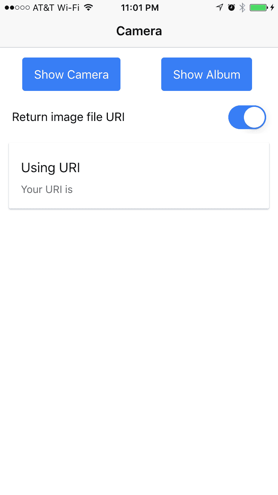

这里是高级流程：

1.  访问 Cordova 相机插件以触发相机捕获，并以 Base64 或 URI 格式获取图像

1.  在 `` DOM 对象上解析 Base64 数据或 URI

1.  如果 URI 格式，则显示 URI

1.  捕获一个切换组件的事件

1.  使用水平滚动显示长数据（例如，URI）

# 准备工作

为了测试相机功能，你应该准备一个物理设备。虽然可以通过模拟器运行代码，但不同平台上的文件系统支持可能会有所不同。

# 如何操作...

以下是为添加相机支持的说明：

1.  开始一个空白项目（例如，`MyCamera`）并进入该文件夹：

```js
$ ionic start MyCamera blank
$ cd MyCamera
```

1.  使用以下代码添加 Cordova 相机插件和该插件的 Ionic Native 封装：

```js
$ ionic plugin add cordova-plugin-camera
$ npm install --save @ionic-native/camera
```

你不应该直接使用 `cordova add` 命令行；而是使用 `ionic cordova plugin add`

你应该能够看到一个新文件夹，`cordova-plugin-camera`，被添加到 `/plugins` 文件夹中。

1.  将 `./src/pages/home/home.html` 替换为以下代码：

```js
<ion-header>
  <ion-navbar>
    <ion-title>
      Camera
    </ion-title>
  </ion-navbar>
</ion-header>

<ion-content padding>
  <ion-row class="center">
    <ion-col width-50>
      <button ion-button (click)="getPicture(1)">Show Camera</ button>
    </ion-col>
    <ion-col width-50>
      <button ion-button (click)="getPicture(0)">Show Album</ button>
    </ion-col>
  </ion-row>
  <ion-item class="no-border">
    <ion-label>Return image file URI</ion-label>
    <ion-toggle energized [(ngModel)]="useURI">
    </ion-toggle>
  </ion-item>
  <ion-card>
    
    <ion-card-content>
      <ion-card-title>
        <div *ngIf="useURI">
          Using URI
        </div>
        <div *ngIf="!useURI">
          Using Base64
        </div>
      </ion-card-title>
      <p *ngIf="useURI">
        Your URI is {{ imageData }}
      </p>
      <p *ngIf="!useURI">
        Your Base64 image has {{ (imageData + '').length }} bytes
      </p>
    </ion-card-content>
  </ion-card>
</ion-content>
```

由于你只有一个页面，这个模板将显示两个按钮和一个用于显示图片的区域。

1.  将 `./src/pages/home/home.ts` 替换为以下代码：

```js
import { Component, Input } from '@angular/core';
import { NavController } from 'ionic-angular';
import { Camera } from '@ionic-native/camera';

@Component({
  selector: 'page-home',
  templateUrl: 'home.html'
})
export class HomePage {
  public imageData: string;
  @Input('useURI') useURI: Boolean = true;
  constructor(public navCtrl: NavController, public camera:Camera) {

  }

  getPicture(sourceType) {
    this.camera.getPicture({
      quality: 50,
      allowEdit: true,
      encodingType: this.camera.EncodingType.JPEG,
      saveToPhotoAlbum: false,
      destinationType: this.useURI ? this.camera.DestinationType.
        FILE_URI : this.camera.DestinationType.DATA_URL,
      targetWidth: 800,
      targetHeight: 800,
      sourceType: sourceType
    }).then((imageData) => {
      if (this.useURI) {
        this.imageData = imageData;
      } else {
        this.imageData = "data:image/jpeg;base64," + imageData;
      }
    }, (err) => {
      console.log(err);
    });
  }

}
```

只有一种方法：`getPicture()`。此方法将返回照片数据，以便模板可以渲染。

1.  将 `.src/pages/home/home.scss` 替换为以下代码：

```js
page-home {
    center {
        text-align: center;
    }
    .no-border .item-inner {
        border-bottom: 0;
    }
}
```

在样式上只有一些小的改动，所以你可以保持它们简单。

1.  将 `./src/app/app.module.ts` 替换为以下代码：

```js
import { BrowserModule } from '@angular/platform-browser';
import { ErrorHandler, NgModule } from '@angular/core';
import { IonicApp, IonicErrorHandler, IonicModule } from 'ionic-angular';
import { SplashScreen } from '@ionic-native/splash-screen';
import { StatusBar } from '@ionic-native/status-bar';
import { Camera } from '@ionic-native/camera';

import { MyApp } from './app.component';
import { HomePage } from '../pages/home/home';

@NgModule({
  declarations: [
    MyApp,
    HomePage
  ],
  imports: [
    BrowserModule,
    IonicModule.forRoot(MyApp)
  ],
  bootstrap: [IonicApp],
  entryComponents: [
    MyApp,
    HomePage
  ],
  providers: [
    StatusBar,
    SplashScreen,
    Camera,
    {provide: ErrorHandler, useClass: IonicErrorHandler}
  ]
})
export class AppModule {}
```

1.  将你的设备连接到电脑。

1.  前往终端并执行以下命令行以进行 iOS 操作：

```js
$ ionic cordova run ios
```

如果你无法使用前面的命令行将应用推送到你的物理设备，你可以使用 `ionic cordova run ios --device` 来指定 CLI 使用物理设备而不是模拟器。

如果你想在 Android 设备上运行应用，请使用以下代码：

```js
$ ionic cordova run android 
```

当你运行应用并拍照时，你应该能看到应用，如下面的截图所示：

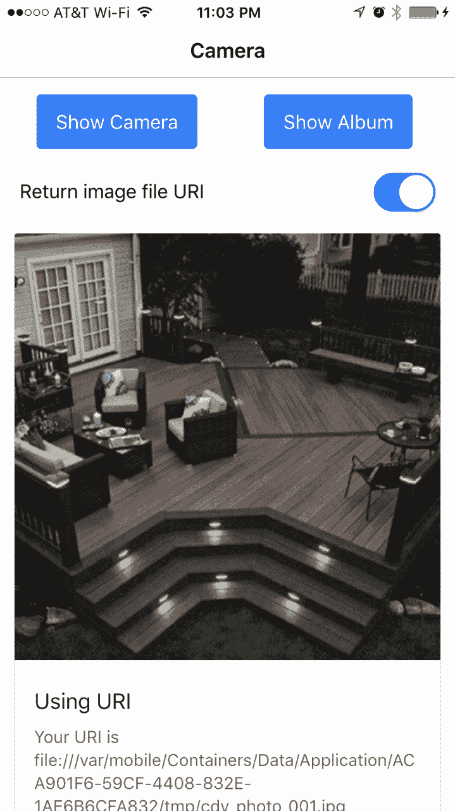

# 它是如何工作的...

`Camera.getPicture()` 只是 Cordova 相机插件的 `navigator.camera.getPicture()` 的抽象。如果你已经熟悉来自 Ionic 1 的 Cordova 或 ngCordova，这应该非常熟悉。让我们从模板开始。你有以下两个按钮，它们将触发相同的 `getPicture()` 方法：

```js
<button ion-buton (click)="getPicture(1)">Show Camera</button>
<button ion-buton (click)="getPicture(1)">Show Camera</button>

```

这些只是访问照片的不同方式：要么从相机本身，要么从手机相册中的现有照片。为了使照片渲染，你需要将照片数据传递到 `src` 属性，如下所示：

```js
 
```

注意，你只想在 `imageData` 存在且包含数据时显示此 `` 标签。`imageData` 变量可以是 Base64 或照片的内部 URL。为了指定此选项，有一个切换按钮，如图所示：

```js
<ion-toggle energized [(ngModel)]="useURI"></ion-toggle> 
```

你将在类中使用 `useURI` 变量，如图所示，以确定返回照片数据的格式：

```js
@Input('useURI') useURI: Boolean = true; 
```

`useURI` 和 `sourceType` 都将在 `getPicture()` 函数中使用，如下所示：

```js
Camera.getPicture({ 
    quality: 50, 
    allowEdit: true, 
    encodingType: Camera.EncodingType.JPEG, 
    saveToPhotoAlbum: false, 
    destinationType: this.useURI ? Camera.DestinationType.FILE_URI
     : Camera.DestinationType.DATA_URL, 
    targetWidth: 800, 
    targetHeight: 800, 
    sourceType: sourceType 
}).then((imageData) => { 
    if (this.useURI) { 
      this.imageData = imageData; 
    } else { 
      this.imageData = "data:image/jpeg;base64," + imageData; 
    } 
}, (err) => { 
    console.log(err); 
}); 
```

调整质量、`targetWidth` 和 `targetHeight` 至低非常重要，这样照片就不会太大，否则可能会使设备崩溃，尤其是在内存不足的情况下。当你返回 Base64 数据时，必须在字符串前加上 `data:image/jpeg;base64`。

还需要注意，在 `app.module.ts` 中，我们正在将 `Camera` 插件添加到 NgModule 的提供者数组中。这非常重要，因为它允许我们通过 Angular 的依赖注入系统使用插件。在本章中，我们必须为每个插件都这样做。

这里没有讨论的一项功能是将图像数据发布到服务器。常见场景是从文件系统中上传文件。由于数据大小是原始二进制大小的两倍，因此将数据作为 Base64 发送不是一个好主意。

# 还有更多...

只使用 JavaScript 就可以创建类似 Instagram 的滤镜效果。你可以利用现有的库，例如 `Filterous` ([`github.com/girliemac/Filterous`](https://github.com/girliemac/Filterous))，直接修改图像画布。

在 GitHub 上有一个针对 Cordova 的 Instagram 插件([`github.com/vstirbu/InstagramPlugin`](https://github.com/vstirbu/InstagramPlugin))。您可以为传递图片到 Instagram 编写一些额外的代码。不过，用户必须首先在手机上安装 Instagram。当您计划在 Instagram 执行照片滤镜操作之前做一些酷炫的图像处理（例如，添加有趣的文字）时，这个想法很不错。

您甚至可以添加 Cordova 的社交网络插件并将生成的图片发布到 Twitter 或 Facebook。

# 使用社交分享插件分享内容

如果您开发了一个具有可分享内容的应用，您可能希望利用设备的原生功能通过设备的授权社交媒体账户进行分享。使用这种方法有几个好处。首先，用户每次想要分享时，不需要打开单独的浏览器来登录他们的社交媒体账户。其次，所有信息都可以通过编程方式填写，例如标题、正文、链接或图片。最后，由于这是设备的原生功能，菜单选择允许用户看到他们已经熟悉的多个账户，从而进行选择。社交分享插件可以极大地提升用户体验。

这就是您将要构建的应用：

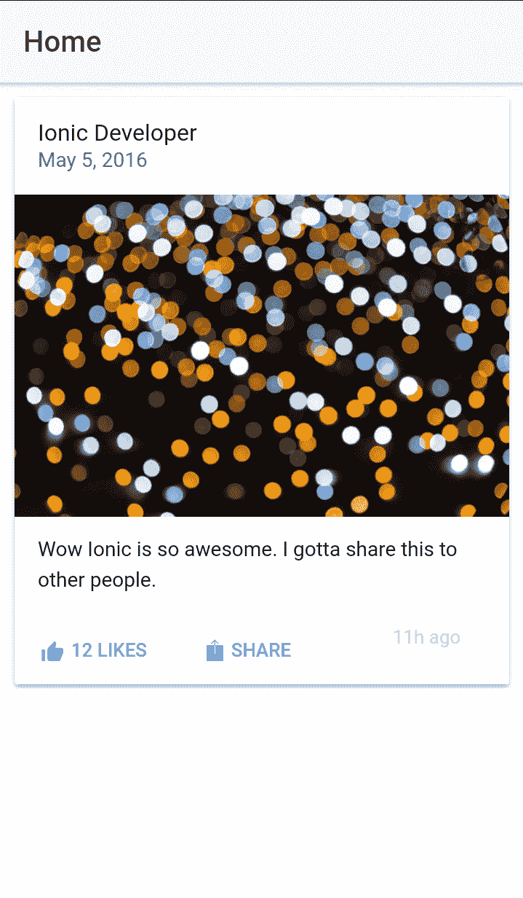

当用户点击分享按钮时，应用将显示以下用于社交媒体账户选择的原生按钮菜单：

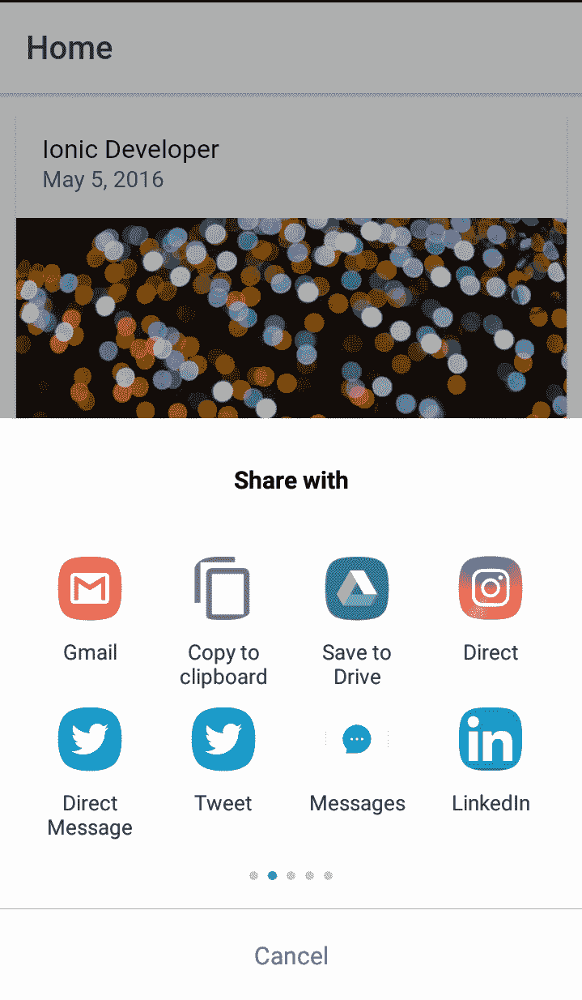

如果用户选择了 Twitter，将会弹出一个包含所有预先填写信息的窗口，如下面的截图所示：

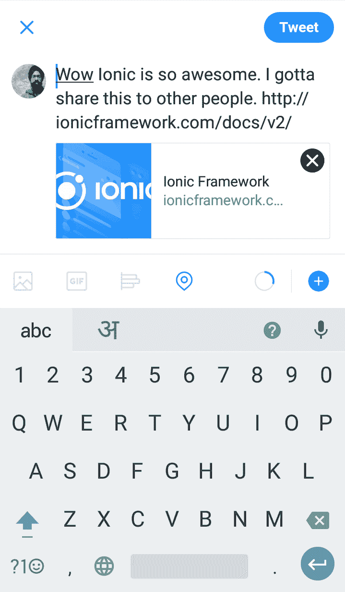

在 Twitter 上发布后，用户可以直接返回应用，而无需离开。

# 准备工作

为了测试社交分享功能，您应该准备好一个物理设备或模拟器。

# 如何操作...

以下是指示：

1.  开始一个空白项目（例如，`LinkSocialShare`），如下所示，并进入该文件夹：

```js
$ ionic start LinkSocialShare blank
$ cd LinkSocialShare
```

1.  使用以下命令行添加社交分享插件和插件的 Ionic Native 包装器：

```js
$ ionic plugin add cordova-plugin-x-socialsharing
$ npm install --save @ionic-native/social-sharing
```

1.  打开`./src/pages/home/home.html`并将其内容替换为以下代码：

```js
<ion-header>
  <ion-navbar>
    <ion-title>
      Home
    </ion-title>
  </ion-navbar>
</ion-header>

<ion-content>
  <ion-card>
    <ion-item>
      <h2 #messageSubject>Ionic Developer</h2>
      <p>May 5, 2016</p>
    </ion-item>
    
    <ion-card-content>
      <p #messageBody>Wow Ionic is so awesome. I gotta share this to other people.</p>
    </ion-card-content>
    <ion-row>
      <ion-col>
        <button ion-button color="primary" clear small icon-left>
          <ion-icon name="thumbs-up"></ion-icon>
          <div>12 Likes</div>
        </button>
      </ion-col>
      <ion-col>
        <button ion-button color="primary" clear small icon-left 
        (click)="sendShare(messageBody.innerText, 
    messageSubject.innerText,'http://ionicframework.com/docs/v2/')">
          <ion-icon name="ios-share"></ion-icon>
          <div>Share</div>
        </button>
      </ion-col>
      <ion-col center text-center>
        <ion-note>
          11h ago
        </ion-note>
      </ion-col>
    </ion-row>
  </ion-card>
</ion-content>
```

这是一个非常简单的页面，包含卡片元素。点赞按钮只是出于美观原因而存在，没有代码实现。然而，所有的 JavaScript 逻辑都将集中在

分享按钮。

1.  打开`./src/pages/home/home.ts`，如下所示：

```js
import { Component } from '@angular/core';
import { NavController } from 'ionic-angular';
import { SocialSharing } from '@ionic-native/social-sharing';
@Component({
  selector: 'page-home',
  templateUrl: 'home.html'
})
export class HomePage {

  constructor(public navCtrl: NavController, public socialSharing: SocialSharing) {

  }

  sendShare(message, subject, url) {
    this.socialSharing.share(message, subject, null, url);
  }

}
```

1.  将`./src/app/app.module.ts`替换为以下代码：

```js
import { BrowserModule } from '@angular/platform-browser';
import { ErrorHandler, NgModule } from '@angular/core';
import { IonicApp, IonicErrorHandler, IonicModule } from 'ionic-angular';
import { SplashScreen } from '@ionic-native/splash-screen';
import { StatusBar } from '@ionic-native/status-bar';
import { SocialSharing } from '@ionic-native/social-sharing';
import { MyApp } from './app.component';
import { HomePage } from '../pages/home/home';

@NgModule({
  declarations: [
    MyApp,
    HomePage
  ],
  imports: [
    BrowserModule,
    IonicModule.forRoot(MyApp)
  ],
  bootstrap: [IonicApp],
  entryComponents: [
    MyApp,
    HomePage
  ],
  providers: [
    StatusBar,
    SplashScreen,
    SocialSharing,
    {provide: ErrorHandler, useClass: IonicErrorHandler}
  ]
})
export class AppModule {}
```

1.  前往终端并执行以下任一命令行：

```js
$ ionic run ios
$ ionic run android
```

# 它是如何工作的...

您可以开始查看模板，因为社交媒体内容是从那里提取的。主题值来自`#messageSubject`局部变量，如下所示：

```js
<ion-item> 
  <h2 #messageSubject>Ionic Developer</h2> 
  <p>May 5, 2016</p> 
</ion-item> 
```

在前面的例子中，主题是`Ionic Developer`，因为您稍后将会访问`messageSubject.innerText`。`messageSubject`只是引用您的 H2 DOM 节点。

类似地，正文来自`#messageBody`，如图所示：

```js
<ion-card-content> 
  <p #messageBody>Wow Ionic 2 is so awesome. I gotta share this to other people.</p> 
</ion-card-content> 
```

当用户点击“分享”按钮时，将触发`sendShare()`方法，如下所示：

```js
<button ion-button color="primary" clear small icon-left 
          (click)="sendShare(messageBody.innerText,
           messageSubject.innerText, 
           'http://ionicframework.com/docs/v2/')">
```

让我们看看您的`home.ts`，了解`sendShare()`是如何工作的。

首先，您需要从 Ionic Native 导入`SocialSharing`模块，如图所示：

```js
import { SocialSharing } from '@ionic-native/social-sharing';
```

要分享内容并触发社交媒体菜单，逻辑，如图所示，非常简单：

```js
sendShare(message, subject, url) { 
  SocialSharing.share(message, subject, null, url); 
} 
```

如果您想分享一个文件，可以将第三个参数（其中为`null`）替换为用户本地文件系统的 URL。当您想让人通过电子邮件发送 PDF 或 JPG 或将其发布在 Facebook 上时，这很有用。

# 更多内容...

要查看社交分享插件的最新更新，您可以访问[`ionicframework.com/docs/v2/native/social-sharing/`](http://ionicframework.com/docs/v2/native/social-sharing/)的文档页面。

# 使用本地通知插件显示本地通知

在开发移动应用程序时，您的应用程序可能需要通知用户某些信息。如果信息来自后端，我们使用推送通知。但是，如果信息是由应用程序在设备本地生成的，我们可以使用本地通知来实现这一点。

这个菜谱旨在帮助您了解本地通知是如何工作的。

当您打开应用程序时，您将看到以下页面。

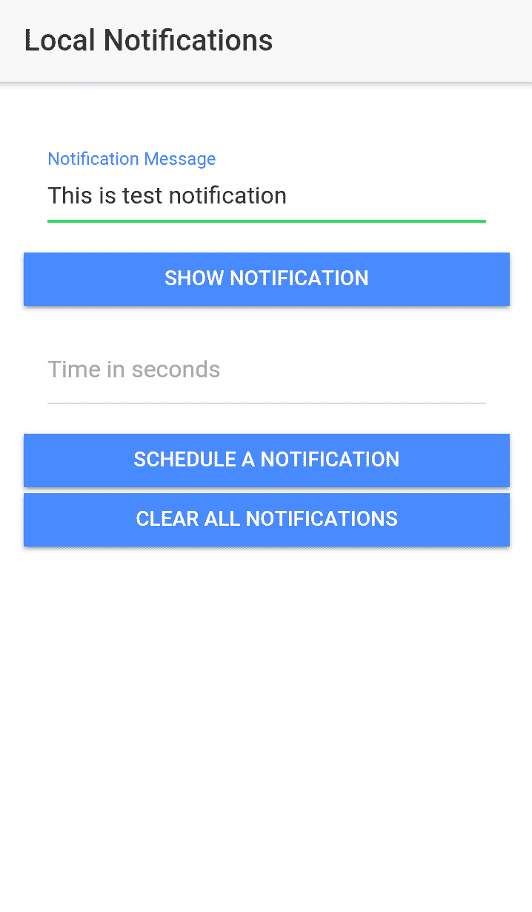

您可以在输入框中输入任何内容，然后点击“显示通知”。您还可以安排稍后显示的通知。这是通知区域中通知的外观：


# 准备工作

您应该准备一个物理设备以便测试本地通知。

# 如何操作...

这里是说明：

1.  创建一个空的 Ionic 应用程序（例如，`Notifications`）并`cd`到该文件夹，如图所示：

```js
$ ionic start Notifications blank
$ cd Notifications
```

1.  使用以下命令安装本地通知插件和插件的 Ionic 本地包装器：

```js
$ ionic cordova plugin add cordova-plugin-local-notification
$ npm install --save @ionic-native/local-notifications
```

1.  打开`./src/pages/home/home.html`并替换以下代码：

```js
<ion-header>
  <ion-navbar>
    <ion-title>
      Local Notifications
    </ion-title>
  </ion-navbar>
</ion-header>

<ion-content padding>
  <ion-item padding>
    <ion-label color="primary" stacked>Notification Message</ion-label>
    <ion-input placeholder="Enter Notification Text here" [(ngModel)]="message"></ion-input>
  </ion-item>
  <button full ion-button color="primary" (click)="showNotification('now')">Show Notification</button>
  <ion-item padding>
    <ion-label>Time in seconds</ion-label>
    <ion-datetime displayFormat="ss Second" placeholder="" [(ngModel)]="time"></ion-datetime>
  </ion-item>
  <button full ion-button color="primary" (click)="showNotification('future')">Schedule a Notification</button>
  <button full ion-button color="primary" (click)="clearNotifications()">Clear all Notifications</button>
</ion-content>

```

1.  打开`./src/pages/home/home.ts`并替换以下代码：

```js
import { Component } from '@angular/core';
import { NavController } from 'ionic-angular';
import { LocalNotifications } from '@ionic-native/local-notifications';

@Component({
  selector: 'page-home',
  templateUrl: 'home.html'
})
export class HomePage {
  notifications:Array<any> = [];
  id: number = 1;
  message:string;
  time:number;
  constructor(public navCtrl: NavController,
    private localNotifications: LocalNotifications) {
  }

  showNotification(type) {
    if(type === 'now') {
      this.localNotifications.schedule({
        id: this.id,
        text: this.message,
      });
    } else {
      this.localNotifications.schedule({
        id: this.id,
        text: this.message,
        at: new Date(new Date().getTime() + this.time * 100),
      });
    }
    this.id++;
  }

  clearNotifications() {
    this.localNotifications.clearAll();
  }

}
```

1.  将`./src/app/app.module.ts`替换为以下代码：

```js
import { BrowserModule } from '@angular/platform-browser';
import { ErrorHandler, NgModule } from '@angular/core';
import { IonicApp, IonicErrorHandler, IonicModule } from 'ionic-angular';
import { SplashScreen } from '@ionic-native/splash-screen';
import { StatusBar } from '@ionic-native/status-bar';
import { LocalNotifications } from '@ionic-native/local-notifications';

import { MyApp } from './app.component';
import { HomePage } from '../pages/home/home';

@NgModule({
  declarations: [
    MyApp,
    HomePage
  ],
  imports: [
    BrowserModule,
    IonicModule.forRoot(MyApp)
  ],
  bootstrap: [IonicApp],
  entryComponents: [
    MyApp,
    HomePage
  ],
  providers: [
    StatusBar,
    SplashScreen,
    LocalNotifications,
    {provide: ErrorHandler, useClass: IonicErrorHandler}
  ]
})
export class AppModule {}
```

1.  在终端中使用以下命令行运行应用程序：

```js
$ ionic run ios
$ ionic run android
```

# 它是如何工作的...

首先，让我们看一下模板`home.html`：

```js
<ion-content padding>
  <ion-item padding>
    <ion-label color="primary" stacked>Notification Message</ion-label>
    <ion-input placeholder="Enter Notification Text here" [(ngModel)]="message"></ion-input>
  </ion-item>
  <button full ion-button color="primary" (click)="showNotification('now')">Show Notification</button>
  <ion-item padding>
    <ion-label>Time in seconds</ion-label>
    <ion-datetime displayFormat="ss Second" placeholder="" [(ngModel)]="time"></ion-datetime>
  </ion-item>
  <button full ion-button color="primary" (click)="showNotification('future')">Schedule a Notification</button>
  <button full ion-button color="primary" (click)="clearNotifications()">Clear all Notifications</button>
</ion-content> 
```

我们有一个输入字段，用于添加通知文本。然后我们有一个按钮用于立即显示通知。然后我们有一个`ion-datetime`输入，用于指定秒数。它将用于通过“安排通知”按钮安排未来的通知。最后，我们有一个清除所有通知按钮，用于清除设备通知区域中的通知。

在您的`home.ts`中，您必须首先导入`LocalNotifications`模块，如图所示：

```js
import { LocalNotifications } from '@ionic-native/local-notifications';
```

当有人点击“显示通知”或“安排通知”按钮时，会触发“显示通知”按钮。以下是`showNotification`方法：

```js
showNotification(type) {
    if(type === 'now') {
      this.localNotifications.schedule({
        id: this.id,
        text: this.message,
      });
    } else {
      this.localNotifications.schedule({
        id: this.id,
        text: this.message,
        at: new Date(new Date().getTime() + this.time * 100),
      });
    }
    this.id++;
  }
```

`The showNotifications` 方法接受一个参数 `type`。`type` 用于确定我们是否希望立即显示通知或在未来的某个时间显示。如果 `type` 等于 `now`，我们立即显示它；否则，我们安排稍后显示通知。为了显示通知，我们使用插件的 `schedule` 方法。我们必须指定 `id`、`text` 和 `at` 值。`at` 值用于安排将来显示的通知。

`The clearNotifications` 方法清除所有通知。

# 还有更多...

查看本地通知插件的 GitHub 页面以获取更多信息，[`github.com/katzer/cordova-plugin-local-notifications`](https://github.com/katzer/cordova-plugin-local-notifications)。

# 使用指纹 AIO 插件进行指纹验证

那些只想使用密码验证系统的日子已经过去了。验证正在变得更强和更直观。如今，大多数 iOS 设备都有指纹传感器，这种趋势现在也开始在 Android 设备中盛行。用户可以使用指纹密码来保护他们的设备。幸运的是，对于像我们这样的开发者来说，我们可以使用相同的技术来保护我们应用程序内的内容，用户在验证后可以访问这些内容。

在这个菜谱中，我们正在创建一个解锁秘密应用程序。它基本上是一个玩笑应用程序。主页看起来如下。

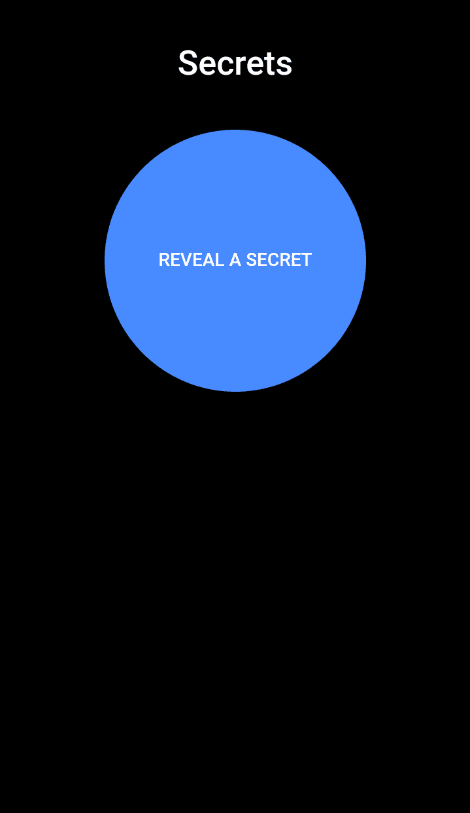

当用户点击 **揭示秘密** 按钮时，它会显示指纹验证对话框：

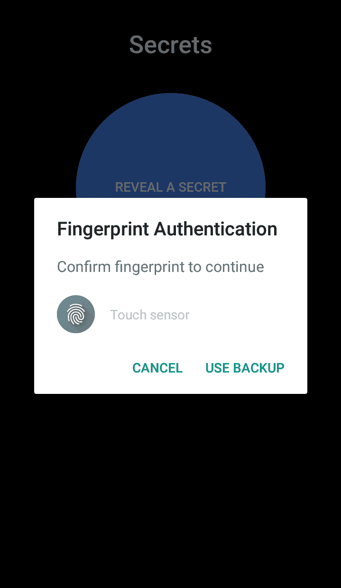

当用户进行验证时，我们在屏幕上显示一个笑话。就这么简单：

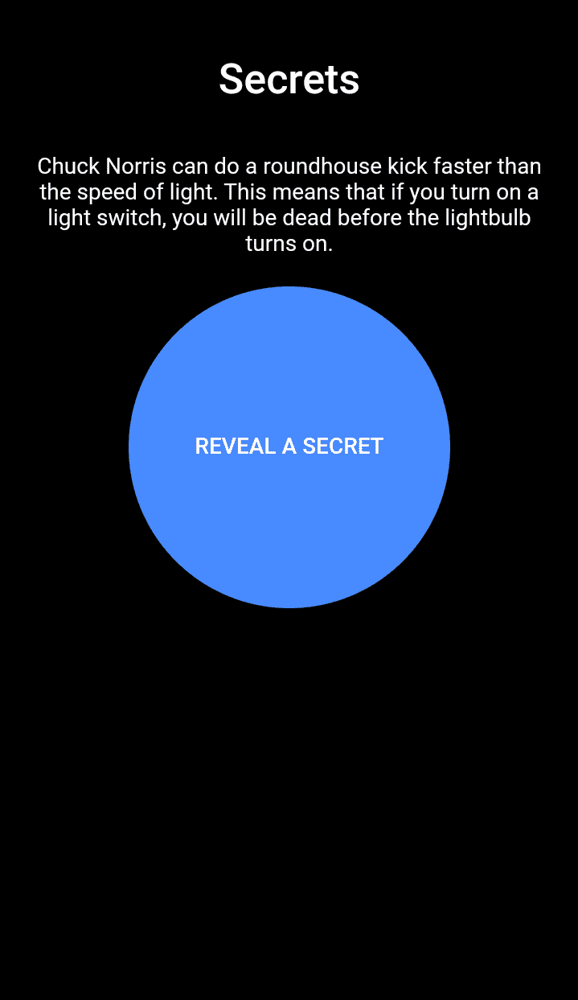

# 准备工作

为了测试这个应用程序，你应该有一个带有指纹传感器的物理设备。

# 如何操作...

这里是说明：

1.  创建一个空白 Ionic 应用程序（例如，`FingerAuth`）并 `cd` 到该文件夹，如下所示：

```js
$ ionic start FingerAuth blank
$ cd FingerAuth
```

1.  使用以下命令安装指纹 `aio` 插件和 Ionic Native 包装器：

```js
$ ionic cordova plugin add cordova-plugin-fingerprint-aio
$ npm install --save @ionic-native/fingerprint-aio
```

1.  打开 `./src/pages/home/home.html` 并替换为以下代码：

```js
<ion-content padding>
  <h1 padding>Secrets</h1>
  <p *ngIf="!isAvailable">This Device doesn't have Fingerprint Sensor</p>
  <p *ngIf="isAvailable && quote">{{quote.joke}}</p>
  <button id="reveal-button" color="primary" *ngIf="!!isAvailable" ion-button round (click)="authenticate()">Reveal a Secret</button>
</ion-content>
```

1.  打开 `./src/pages/home/home.ts` 并替换为以下代码：

```js
import { Component } from '@angular/core';
import { NavController, Platform } from 'ionic-angular';
import { HttpClient } from '@angular/common/http';
import { FingerprintAIO } from '@ionic-native/fingerprint-aio';

@Component({
  selector: 'page-home',
  templateUrl: 'home.html'
})
export class HomePage {
  quote:any = {};
  isAvailable: Boolean;
  constructor(public navCtrl: NavController, 
    private faio: FingerprintAIO,
    private http: HttpClient,
    private platform: Platform) {

  }

  ionViewDidLoad() {
    this.checkAvailablity();
  }

  checkAvailablity() {
    this.platform.ready()
    .then(()=> {
      this.faio.isAvailable().then((value)=> {
        console.log(value);
        this.isAvailable = true
      }).catch(() => {
        this.isAvailable = false;
      });
    });
  }

  authenticate() {
    this.faio.show({
      clientId: 'Ionic Fingerprint Auth',
      clientSecret: 'password', //Only necessary for Android
      localizedFallbackTitle: 'Use Pin', //Only for iOS
      localizedReason: 'Please authenticate' //Only for iOS
    })
    .then((result: any) => {
      this.reveal();
    });
  }

  reveal() {
    const url = "http://api.icndb.com/jokes/random/";
    this.http.get(url)
    .subscribe((data:any) => {
      this.quote = data.value;
    });
  }

}
```

1.  将 `./src/pages/home/home.scss` 替换为以下代码：

```js
page-home {
    ion-content {
        .scroll-content {
            text-align:center;
            background-color: black;
            color:white;

            #reveal-button {
                height:200px;
                width:200px;
                border-radius:100%;
            }
        }
    }

}
```

1.  将 `./src/app/app.module.ts` 替换为以下代码：

```js
import { BrowserModule } from '@angular/platform-browser';
import { ErrorHandler, NgModule } from '@angular/core';
import { IonicApp, IonicErrorHandler, IonicModule } from 'ionic-angular';
import { SplashScreen } from '@ionic-native/splash-screen';
import { StatusBar } from '@ionic-native/status-bar';
import { HttpClientModule } from '@angular/common/http';
import { FingerprintAIO } from '@ionic-native/fingerprint-aio';

import { MyApp } from './app.component';
import { HomePage } from '../pages/home/home';

@NgModule({
  declarations: [
    MyApp,
    HomePage
  ],
  imports: [
    BrowserModule,
    HttpClientModule,
    IonicModule.forRoot(MyApp)
  ],
  bootstrap: [IonicApp],
  entryComponents: [
    MyApp,
    HomePage
  ],
  providers: [
    StatusBar,
    SplashScreen,
    FingerprintAIO,
    {provide: ErrorHandler, useClass: IonicErrorHandler}
  ]
})
export class AppModule {}
```

1.  在终端中运行应用程序，使用以下命令行：

```js
$ ionic cordova run ios
$ ionic cordova run android
```

# 它是如何工作的...

首先，让我们看看模板 `home.html`：

```js
<ion-content padding>
  <h1 padding>Secrets</h1>
  <p *ngIf="!isAvailable">This Device doesn't have Fingerprint Sensor</p>
  <p *ngIf="isAvailable && quote">{{quote.joke}}</p>
  <button id="reveal-button" color="primary" *ngIf="!!isAvailable" ion-button round (click)="authenticate()">Reveal a Secret</button>
</ion-content>
```

如果设备没有指纹传感器，我们会在屏幕上显示一条通知说 This Device doesn't have Fingerprint Sensor。否则，我们显示一个揭示秘密按钮。当用户点击它时，它会打开指纹验证对话框。

在你的 `home.ts` 中，你必须首先导入 `FingerprintAIO` 模块，如下所示：

```js
import { FingerprintAIO } from '@ionic-native/fingerprint-aio'; 
```

当页面加载时，我们通过插件中的`isAvailable`方法在`ionViewDidLoad`钩子中检查传感器的可用性。它返回一个承诺。如果已解析，则表示传感器可用。当用户在 UI 中点击“揭示秘密”按钮时，会触发`authenticate`方法。

这是`authenticate()`方法：

```js
  authenticate() {
    this.faio.show({
      clientId: 'Ionic Fingerprint Auth',
      clientSecret: 'password', //Only necessary for Android
      localizedFallbackTitle: 'Use Pin', //Only for iOS
      localizedReason: 'Please authenticate' //Only for iOS
    })
    .then((result: any) => {
      this.reveal();
    });
  }
```

在此方法中，我们调用插件的`show`方法，它返回一个承诺。如果承诺已解析，则表示用户已认证，我们将揭示笑话。否则，我们不做任何事情。

# 更多内容...

您可以在[`github.com/NiklasMerz/cordova-plugin-fingerprint-aio`](https://github.com/NiklasMerz/cordova-plugin-fingerprint-aio)了解更多关于指纹 AIO 插件的信息。

# 使用媒体播放器通知控件创建媒体播放器

媒体播放器是用户手机中的一个重要应用。现在几乎每个媒体应用都在通知区域有一个控件。在这个菜谱中，我们将创建一个非常简单的媒体播放器，带有**播放**和**暂停**按钮，并将媒体播放器控件添加到通知区域。

这就是我们的应用主页将看起来像：

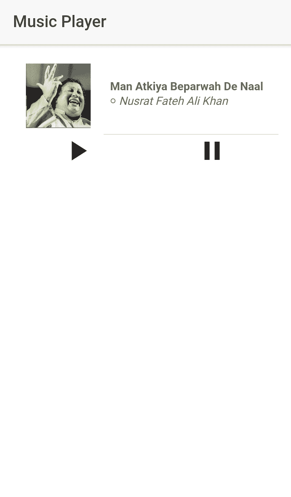

这就是通知区域将看起来像：


当用户在应用内点击**播放**按钮时，它会在通知区域显示控件。当用户在应用内点击**暂停**按钮时，它也会更新音乐控件。这也适用于相反的情况。您可以从通知区域的音乐控件播放和暂停媒体。

# 准备工作

由于该应用使用了 Cordova 插件，因此您应该准备一个物理设备来测试此应用。

# 如何操作...

这里是说明：

1.  创建一个空的 Ionic 应用（例如，`MediaPlayer`），然后`cd`到该文件夹，如下所示：

```js
$ ionic start MediaPlayer blank
$ cd MediaPlayer
```

1.  使用以下命令安装音乐控件插件及其 Ionic Native 包装器：

```js
$ ionic cordova plugin add cordova-plugin-music-controls
$ npm install --save @ionic-native/music-controls
```

1.  打开`./src/pages/home/home.html`并替换为以下代码：

```js
<ion-header>
  <ion-navbar>
    <ion-title>
      Music Player
    </ion-title>
  </ion-navbar>
</ion-header>

<ion-content padding>
    <ion-item> 
      <ion-thumbnail item-left>
        
      </ion-thumbnail>
      <div item-content style="width:100%">
        <p><strong>{{track.title}}</strong> ⚬ 
        <em>{{track.artist}}</em></p>
      </div>
    </ion-item>

    <ion-row id="music-controls">
      <ion-col (click)="play()"><ion-icon name="play"></ion-icon></ion-col>
      <ion-col (click)="pause()"><ion-icon name="pause"></ion-icon></ion-col>
    </ion-row>
</ion-content> 
```

1.  打开`./src/pages/home/home.ts`并替换为以下代码：

```js
import { Component } from '@angular/core';
import { NavController } from 'ionic-angular';
import { MusicControls } from '@ionic-native/music-controls';
import { AudioProvider} from '../../services/audio-service';

@Component({
  selector: 'page-home',
  templateUrl: 'home.html'
})
export class HomePage {
  track = {
    src: 'https://ia801609.us.archive.org/16/items/nusratcollection_20170414_0953/Man%20Atkiya%20Beparwah%20De%20Naal%20Nusrat%20Fateh%20Ali%20Khan.mp3',
    artist: 'Nusrat Fateh Ali Khan',
    title: 'Man Atkiya Beparwah De Naal',
    art: 'https://ia801307.us.archive.org/31/items/mbid-42764450-04e5-459e-b022-00847fc8fb94/mbid-42764450-04e5-459e-b022-00847fc8fb94-12391862253_thumb250.jpg',
    preload: 'metadata' // tell the plugin to preload metadata such as duration for this track, set to 'none' to turn off
  };

  constructor(public navCtrl: NavController, public musicControls:MusicControls,
  public audioProvider: AudioProvider) {}

  play() {
    this.audioProvider.play(this.track.src);
    this.createControls();
  }

  pause() {
    this.audioProvider.pause();
    this.musicControls.updateIsPlaying(false);
  }

  createControls() {
    this.musicControls.create({
      track : this.track.title,
      artist : this.track.artist, 
      cover : this.track.art, 
      isPlaying : true, 
      hasPrev : false,
      hasNext : false,
      dismissable : true, 
    });

    this.musicControls.subscribe().subscribe(action => {
      const message = JSON.parse(action).message;
      switch(message) {
        case 'music-controls-play':
          this.play();
        break;

        case 'music-controls-pause':
          this.pause();
        break;
      }
    });

    this.musicControls.listen();
  }
}
```

1.  将`./src/pages/home/home.scss`替换为以下代码：

```js
page-home {
    #music-controls {
        text-align:center;
        font-size: 2.5rem;
    }
}
```

1.  在`./src/services/audio-service.ts`中创建一个文件并添加以下内容：

```js
import { Injectable } from '@angular/core';

@Injectable()
export class AudioProvider {
    track:any;
    isPaused: Boolean = false;
    url;
    play(url) {
        if(this.url !== url) {
            this.url = url;
            this.track = new Audio(url);
            this.track.load();
        }
        this.track.play();
    }
    pause() {
        this.track.pause();
        this.isPaused = true;
    }
}
```

1.  将`./src/app/app.module.ts`替换为以下代码：

```js
import { BrowserModule } from '@angular/platform-browser';
import { ErrorHandler, NgModule } from '@angular/core';
import { IonicApp, IonicErrorHandler, IonicModule } from 'ionic-angular';
import { SplashScreen } from '@ionic-native/splash-screen';
import { StatusBar } from '@ionic-native/status-bar';
import { MusicControls } from '@ionic-native/music-controls';

import { MyApp } from './app.component';
import { HomePage } from '../pages/home/home';
import { AudioProvider} from '../services/audio-service';

@NgModule({
  declarations: [
    MyApp,
    HomePage
  ],
  imports: [
    BrowserModule, 
    IonicModule.forRoot(MyApp)
  ],
  bootstrap: [IonicApp],
  entryComponents: [
    MyApp,
    HomePage
  ],
  providers: [
    StatusBar,
    SplashScreen,
    MusicControls,
    AudioProvider,
    {provide: ErrorHandler, useClass: IonicErrorHandler}
  ]
})
export class AppModule {}
```

1.  使用以下命令行在终端中运行应用：

```js
$ ionic cordova run ios
$ ionic cordova run android
```

# 工作原理...

首先，让我们看一下模板`home.html`：

```js
<ion-content padding>
    <ion-item> 
      <ion-thumbnail item-left>
        
      </ion-thumbnail>
      <div item-content style="width:100%">
        <p><strong>{{track.title}}</strong> ⚬ <em>{{track.artist}}</em>
      </p>
      </div>
    </ion-item>

    <ion-row id="music-controls">
      <ion-col (click)="play()"><ion-icon name="play"></ion-icon></ion-col>
      <ion-col (click)="pause()"><ion-icon name="pause"></ion-icon></ion-col>
    </ion-row>
</ion-content>
```

非常简单。我们在`ion-item`中显示了轨道的缩略图和轨道标题，以及轨道艺术家。然后我们有`play`和`pause`按钮，它们在`ion-row`内部显示。

在`home.ts`中，我们有媒体播放器的音频轨道列表。为了简化，我只添加了一个轨道，这样我们就不添加太多额外的功能，并保持对插件部分的关注。然后我们有`play`和`pause`方法。这些方法与 UI 中的`play`和`pause`按钮相关联，并且当用户点击它们时会被触发。

在`play`按钮内部，我们使用轨道的源`url`触发 AudioProvider 的`play`方法，并调用`createControls`方法。这个`createControls`方法在设备的通知区域创建**音乐控制**。

在`pause`按钮内部，我们触发 AudioProvider 的`pause`方法，并更新音乐控制，告诉它我们已经暂停了音频，并且它相应地更改了 UI。

在`createControls()`方法中：

```js
 createControls() {
    this.musicControls.create({
      track : this.track.title,
      artist : this.track.artist, 
      cover : this.track.art, 
      isPlaying : true, 
      hasPrev : false,
      hasNext : false,
      dismissable : true, 
    });

    this.musicControls.subscribe().subscribe(action => {
      const message = JSON.parse(action).message;
      switch(message) {
        case 'music-controls-play':
          this.play();
        break;

        case 'music-controls-pause':
          this.pause();
        break;
      }
    });

    this.musicControls.listen();
  }
```

此外，看看我们的微型`AudioProvider`：

```js
export class AudioProvider {
    track:any;
    isPaused: Boolean = false;
    url;
    play(url) {
        if(this.url !== url) {
            this.url = url;
            this.track = new Audio(url);
            this.track.load();
        }
        this.track.play();
        this.isPaused = false;
    }
    pause() {
        this.track.pause();
        this.isPaused = true;
    }

}
```

在`play`方法中，我们获取`url`作为参数。如果新的`url`与之前的不同，我们使用该`url`创建`Audio`对象，并加载媒体，然后播放媒体并将`this.isPaused`设置为`true`。

在`pause`方法中，我们暂停轨道并将`this.isPaused`布尔值设置为`true`，默认设置为`false`。

# 还有更多...

为了简化，我们只使用了播放和暂停按钮。但是，很容易在通知区域以及应用中实现即将到来的下一首和上一首功能。查看插件的 GitHub 页面[`github.com/homerours/cordova-music-controls-plugin`](https://github.com/homerours/cordova-music-controls-plugin)。

# 使用 Google Maps 插件和地理编码支持创建出租车应用

今天，许多移动应用利用不同的地图功能，例如显示当前位置、创建路线和提供建议性的商业搜索。本节将向您展示如何使用 Ionic Native 的 Google Maps 插件提供地图支持。

你将创建一个可以执行以下操作的出租车应用：

+   以全屏显示 Google Maps

+   在地图上添加一个按钮覆盖层

+   检测当前设备位置

+   添加带有任何文本的标记

这是出租车应用的截图：


当用户点击 PICK ME UP 按钮时，它会跳转到当前设备位置并显示经纬度信息：

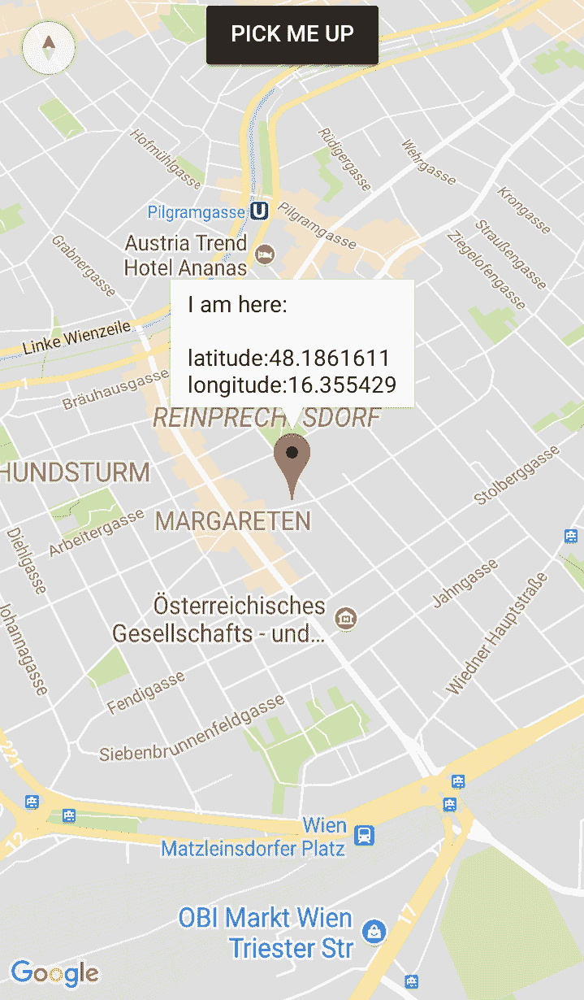

可以使用 HTML5 和 JavaScript 版本的地理位置和地图，而不是 Cordova 插件的。然而，你将看到性能上的负面影响。很明显，如果你使用 SDK，地图渲染和优化通常会更快。此外，HTML5 地理位置有时会有一些奇怪的 bug，需要用户接受两次权限——一次为应用，一次为内部浏览器对象。

# 准备工作

Google Maps 插件需要为你的项目提供一个 Google Maps API 密钥。你需要一个 Google 账户并登录才能开始：

1.  导航到 Google APIs 控制台[`console.developers.google.com/cloud-resource-manager`](https://console.developers.google.com/cloud-resource-manager)。

1.  如果你还没有创建项目，请创建一个。只需填写所需的字段：

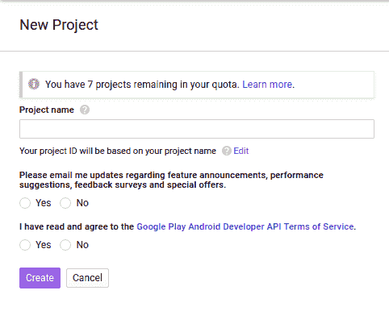

1.  您需要启用 Google Maps SDK for iOS、Google Maps Android API 或两者都启用。这取决于您计划支持多少平台。在这个例子中，让我们选择 Google Maps SDK for iOS：


1.  点击启用按钮：

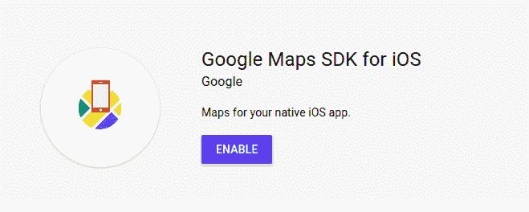

1.  前往凭证以创建您自己的密钥：

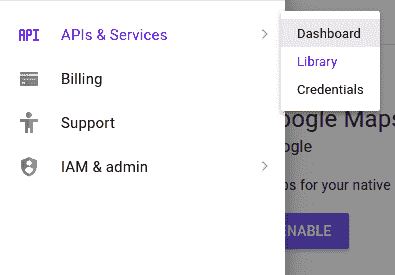

1.  点击创建凭证 | API 密钥选项：

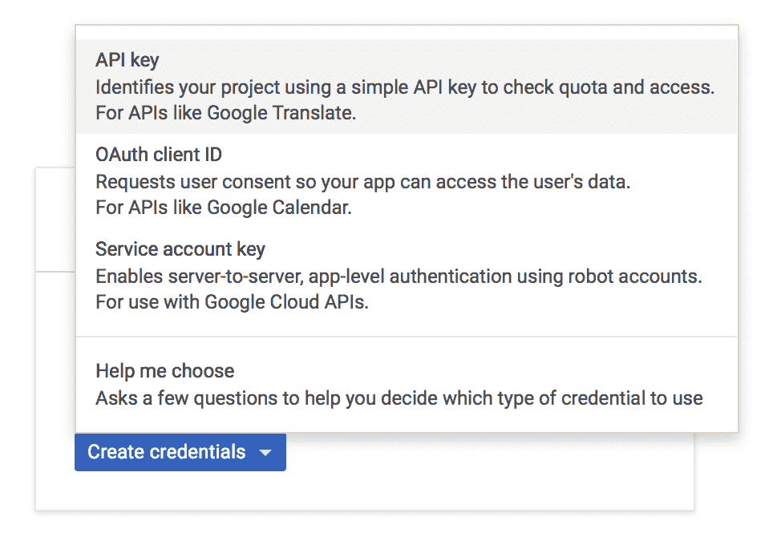

1.  选择 RESTRICT KEY 选项。在以下示例中，您将选择 iOS 应用程序单选按钮：


1.  填写您应用程序的 Bundle ID。您可能还不知道确切是什么，因为 Ionic 将创建一个随机的 ID。所以只需输入 `com.ionicframework.starter` 并稍后更改它：


1.  点击保存按钮。

1.  现在，您应该会看到如下所示的 iOS 应用程序部分的关键字：

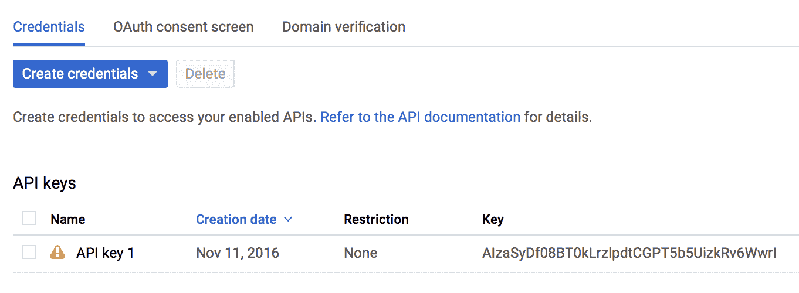

1.  复制 API 密钥，以便您可以使用它来添加 Cordova Google Maps 插件。

# 如何操作...

让我们从零开始创建一个 Ionic 项目并添加 Google Maps 功能，如下所示：

1.  按照所示创建一个空的 Ionic 项目，并进入该文件夹：

```js
    $ ionic start TaxiApp blank
    $ cd TaxiApp
```

1.  使用以下命令行将 iOS 平台替换为版本 3.9.0：

```js
    $ ionic platform remove ios
    $ ionic platform add ios@3.9.0
    $ ionic platform add android
```

您必须特别选择 `ios@3.9.0`，因为当前版本的 Cordova Google Maps 插件仅与此版本兼容。否则，您的构建将失败。如果可能的话，您应该尝试最新的版本。

1.  使用您复制的密钥替换 `` `YOUR_IOS_API_KEY_IS_HERE ``，如下所示安装 Google Maps 插件：

```js
 $ cordova plugin add cordova-plugin-googlemaps --variable 
 API_KEY_FOR_IOS="YOUR_IOS_API_KEY_IS_HERE"` 
```

如果您为 iOS 和 Android 都这样做，请使用以下命令行：

```js
$ cordova plugin add cordova-plugin-googlemaps --variable 
 API_KEY_FOR_ANDROID="key" --variable API_KEY_FOR_IOS="key"
```

您必须在这里使用 Cordova CLI，因为使用 Ionic CLI 添加带有 API 密钥的 Google Maps 不会起作用

1.  打开 `./src/pages/home/home.html` 以修改您的模板，如下所示：

```js
<ion-content [ngClass]="{'no-scroll': mapRendered}">
  <div id="map">
    <button ion-button color="dark" (click)="getMyLocation()">PICK ME UP</button>
  </div>
</ion-content>
```

这里的主要元素是您的具有 `map` ID 的 `div`，因为您必须在这里注入 Google Maps 对象。

1.  在同一文件夹中编辑您的 `./src/pages/home/home.ts`：

```js
import { Component } from '@angular/core';
import { NavController, Platform } from 'ionic-angular';
import {
  GoogleMaps,GoogleMap,GoogleMapsEvent,GoogleMapOptions,
  CameraPosition,LatLng,MarkerOptions,Marker
} from '@ionic-native/google-maps';
@Component({
  selector: 'page-home',
  templateUrl: 'home.html'
})
export class HomePage {
  public map: GoogleMap;
  public mapRendered: Boolean = false;

  constructor(public navCtrl: NavController, public platform: Platform) {
    this.platform.ready().then(() => {
      this.showMap();
    });
  }

  showMap() {
    let mapOptions: GoogleMapOptions = {
      camera: {
        target: {
          lat: 43.0741904,
          lng: -89.3809802
        },
        zoom: 18,
        tilt: 30
      }
    };

    this.map = GoogleMaps.create('map', mapOptions);
    this.map.one(GoogleMapsEvent.MAP_READY)
    .then(() => {
      console.log('Map is ready!');
      this.mapRendered = true;
    });
  }

  getMyLocation() {
    this.map.getMyLocation().then((location) => {
      var msg = ["I am here:\n",
        "latitude:" + location.latLng.lat,
        "longitude:" + location.latLng.lng].join("\n");
      let position = {
        target: location.latLng,
        zoom: 15
      };
      this.map.moveCamera(position);
      let markerOptions: MarkerOptions = {
        'position': location.latLng,
        'title': msg
      };
      this.map.addMarker(markerOptions).then((marker:Marker) => {
        marker.showInfoWindow();
      });
    });
  }
}
```

1.  对样式表进行一些小的调整，以便地图可以占据整个屏幕。编辑 `./src/pages/home/home.scss`，如下所示：

```js
ion-app._gmaps_cdv_ .nav-decor{
    background-color: transparent !important;
}

page-home {
    text-align: center;
    #map {
        height: 100%;
        z-index: 9999;
    }
    .no-scroll {
        .scroll-content {
            overflow-y: hidden;
        }
    }
}
```

1.  前往终端并运行应用程序：

```js
$ ionic cordova run ios
$ ionic cordova run android
```

您可以使用上述任意一条命令行，具体取决于平台。

# 它是如何工作的...

此应用程序的核心主要在 JavaScript 代码 `home.ts` 中。为了使用插件对象，您应该在顶部声明它，如下所示：

```js
import {
  GoogleMaps,GoogleMap,GoogleMapsEvent,GoogleMapOptions,
  CameraPosition,LatLng,MarkerOptions,Marker
} from '@ionic-native/google-maps';
```

虽然看起来有很多部分在移动，但基本流程非常简单，如下所示：

1.  当 Ionic 和 Cordova 准备就绪时，通过在 `HomePage` 构造函数中调用 `showMap()` 来初始化地图，触发 `platform.ready().then`。

1.  当用户点击按钮时，应用程序将调用 `getMyLocation` 来获取位置数据。

1.  这些数据将被用来创建标记并将地图的摄像头移动到该位置的中心。

重要的是要知道 `GoogleMaps.create` 需要一些时间来处理，并且一旦成功创建地图，它将触发一个 *ready* 事件。这就是为什么你需要添加一个事件监听器来监听 `GoogleMapsEvent.MAP_READY`。这个示例在地图准备好后并没有立即做任何事情，但稍后你可以添加更多的处理函数，例如自动跳转到当前位置或向地图上添加更多标记。

当用户点击 `PICK ME UP` 按钮时，它将触发 `getMyLocation()` 方法。返回的位置对象将包含纬度 (`location.latLng.lat`) 和经度 (`location.latLng.lng`)。要移动摄像头到任何地方，只需通过传递位置坐标 (`location.latLng`) 调用 `map.moveCamera`。要添加标记，使用位置和标题作为 HTML 调用 `map.addMarker`。

# 更多内容...

Cordova Google Maps 插件还有许多其他功能，例如以下内容：

+   显示 `InfoWindow`

+   添加多行标记

+   修改图标

+   文本样式

+   Base64 编码的图标

+   点击标记

+   点击信息窗口

+   创建可拖动的标记

+   拖动事件

+   创建平面标记

由于你无法在原生 Google Maps 之上弹出 `div`，标记功能非常实用。一些额外的场景如下：

+   **触摸标记并跳转到页面**：你只需要监听

    `GoogleMapsEvent.MARKER_CLICK` 事件并执行任何操作

    在回调函数中需要的。

+   **将头像/个人资料图片作为标记显示**：`addMarker` 接受 Base64 图像字符串。因此，你可以在参数标题中传递类似这样的内容 `-` `canvas.toDataURL()`。

注意，Google 对免费 API 使用量有限额。例如，每个用户每秒只能请求一次，每天只能请求几千次。这个限额会不断变化，但了解这一点很重要。无论如何，如果你遇到密钥问题，你必须回到凭证页面并重新生成密钥。为了在应用中手动更改密钥，你必须编辑 ```/plugins/ios.json```。查找以下两个位置：

```js
"*-Info.plist": { 
  "parents": { 
    "Google Maps API Key": [ 
      { 
        "xml": "<string>YOUR_IOS_API_KEY_IS_HERE</string>", 
        "count": 1 
      } 
    ] 
  } 
} 
```

以下代码：

```js
"plugin.google.maps": { 
  "API_KEY_FOR_IOS": "YOUR_IOS_API_KEY_IS_HERE", 
  "PACKAGE_NAME": "com.ionicframework.starter" 
} 
```

你只需要编辑 `YOUR_IOS_API_KEY_IS_HERE` 这一行，并将其替换为你的新密钥。

有很多种方法可以与 Google Maps 一起工作。你可以访问 Google Maps 插件的 GitHub 页面了解更多信息，网址为 [`github.com/mapsplugin/cordova-plugin-googlemaps`](https://github.com/mapsplugin/cordova-plugin-googlemaps.)。
