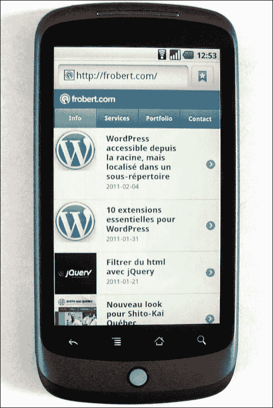
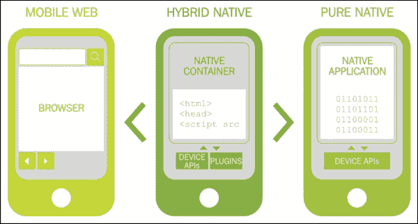
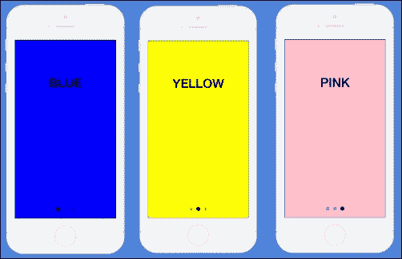
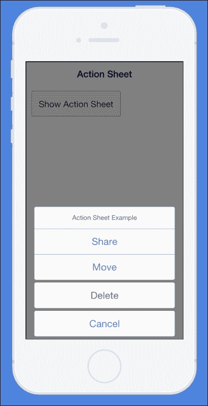
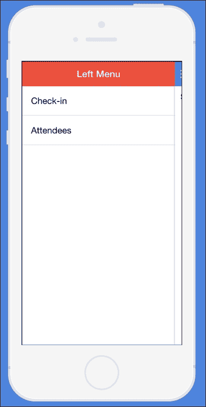
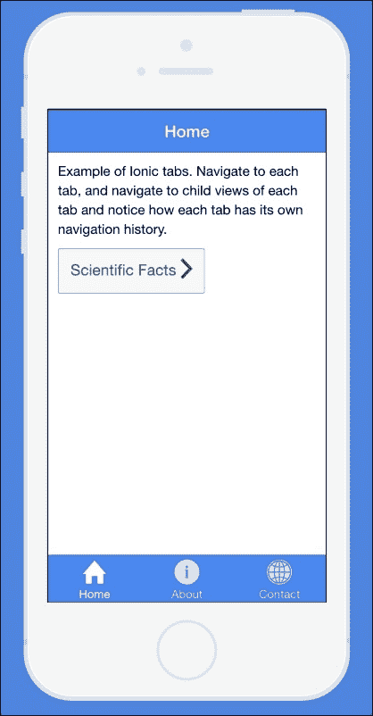
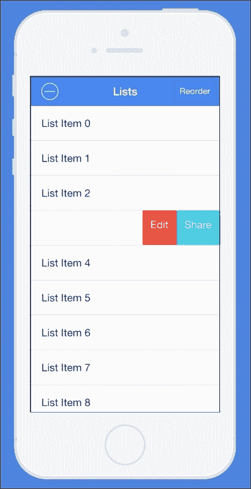

# 第一章. 初识 Ionic

在我们开始这本书之前，了解我们正在处理的内容非常重要。了解这个问题的最好方式是通过简要回顾移动开发的历史，并了解像 Ionic 这样的工具如何帮助移动开发者创建美观的移动应用程序。

# 开始

2006 年，随着苹果公司推出 iPhone，智能手机时代开始了。到 2008 年，谷歌推出了对苹果 iOS 操作系统的回应。这个新的操作系统被称为**Android**，到 2010 年，iOS 和 Android 主导的智能手机在移动生态系统中占据了主导地位。快进到今天，尽管微软的 Windows 移动在移动领域取得了一些进展，但 iOS 和 Android 的统治地位并没有太大变化。可以说，Android、iOS 和 Windows 构成了生态系统的主体，其中前两者以很大的优势处于前沿。

智能手机时代的到来也催生了移动应用程序的概念。移动应用程序是我们通过手机获取和传递大部分内容的中介。它们非常出色，几乎每个智能手机用户都在他们的设备上下载了多个应用程序来执行特定操作或实现特定目标。这对开发者来说是一个巨大的机遇，软件供应商也提供了工具，使开发者能够为用户创建自己的第三方移动应用程序。我们把这些使用软件供应商提供的工具构建的应用程序称为**原生移动应用程序**。

## 问题

尽管移动应用非常出色，但它们的发展方式存在一个小问题。首先，对于每个移动开发平台，软件供应商都提供自己独特的一套工具来为其平台构建应用程序。我们把这些工具称为 SDK。下表展示了每个平台在工具和 SDK 选项方面的差异，以及如何为它们的生态系统创建原生移动应用程序：

| 操作系统 | SDK | 编程语言 |
| --- | --- | --- |
| iOS | iOS SDK | Objective-C/Swift |
| Android | Android SDK | JAVA |
| Windows for mobile | Windows SDK | .NET |

为了明确表达，我们并不是试图贬低原生工具的使用。如前所述，原生工具虽然很好，但代价高昂且时间紧迫。首先，你不能使用同一套工具为不同的平台构建相同的应用程序。对于你的应用程序的 Android 版本，你需要一支熟练的 Android 开发者团队。对于 iOS 版本，你需要一支 Objective-C 或 Swift 开发者团队来创建相同应用程序的 iOS 版本。此外，这两个团队之间没有代码共享，这意味着在一个平台上开发的功能必须完全在另一个平台上再次开发。这在开发方面非常低效，且耗时很长。

另一个问题是因为你雇佣了两个完全独立的团队，尽管他们都在尝试创造相同的东西，但你却面临不断上升的成本。例如，如果你决定你想为你的移动应用创建一个移动版的 Windows，你需要招募另一个.NET 开发团队，他们必须从头开始构建其他现有平台上的所有内容，因为他们不能重用任何已经构建的工具。

对于像 Facebook 这样的公司来说，它以数十亿美元的收入为生，选择原生开发路径可能是有意义的，因为原生开发的成本和人才可能不是他们关心的问题。然而，对于大多数人来说，他们想要尽快推出一个简单、出色、强大的应用。此外，有些人希望利用他们现有的技能集为多个平台构建应用，而无需学习新的编程语言。

在移动应用出现之前，Web 应用在很大程度上统治了世界。我们拥有更多人为 Web 技术开发，这些技术主要由 HTML、CSS 和 JavaScript 组成。我们习惯于 Web 的一个伟大之处在于它的平台无关性。这意味着只要你在任何设备上有一个浏览器应用程序，你就能无任何问题地与任何 Web 应用进行交互。

因此，当移动应用出现时，这对大多数 Web 开发者来说是一个巨大的变化，因为移动应用每个平台都是自给自足的，为某个平台制作的移动应用在另一个平台上将无法工作。

# Apache Cordova

Apache Cordova 是一种技术，它允许任何 Web 应用被打包成原生移动应用，同时提供对设备功能的访问。多亏了 Adobe 和开源社区，这项技术在过去几年中取得了巨大的增长，越来越多的应用正在使用 Cordova 构建。用 Cordova 构建的应用通常被称为**混合应用**。但什么是混合应用呢？

在 Cordova 的上下文中，混合应用实际上是一个存在于原生移动应用薄容器中的 Web 应用。

事实上，在它们能做什么方面，原生移动应用和 Web 应用之间唯一的区别是原生移动应用可以访问设备硬件功能。

事实上，混合应用实际上是一个在手机浏览器视图中提供 Web 应用的本地应用。它表现得像一个正常的应用程序，并且可以完全访问设备功能，这要归功于 Cordova。

然而，Cordova 相比于原生开发技术的主要优势在于，你只需要维护一个代码库，并且可以使用这个相同的代码库为多个平台构建应用程序。这是 Cordova 到目前为止的主要卖点，因为使用这种技术，你可以获得巨大的成本和时间节省优势。

## 早期的混合应用程序

当第一批混合应用程序开始推出时，有几个问题似乎持续存在。第一个问题是很多人抱怨这些混合应用程序没有与原生移动应用程序相同的用户界面和用户体验。主要原因是在构建原生应用程序时，所有构建块都已经为你准备好了。例如，我们有预提供的动画、滑动手势、标签等。混合应用程序未能提供类似的功能，因为在网络上，我们只有 HTML、CSS 和 JS。没有预提供的组件来处理动画、手势和标签等。

这意味着几乎所有试图构建混合应用程序的人都必须从头开始构建这些功能。这并不好，不同的人对相同的功能有不同的实现。因此，许多通过混合方式构建的应用程序在视觉上并不吸引人。我们需要的是一个由中心维护的框架，它为我们提供了构建具有原生应用程序功能的网络技术所需的所有工具。

# 什么是 Ionic？

Ionic 是一个框架，它允许你使用 HTML5、CSS 和 JavaScript 等网络技术构建混合移动应用程序。但 Ionic 的功能远不止于此。Ionic 提供了你可以用来为移动应用程序构建类似原生功能的组件。将 Ionic 视为制作你的混合移动应用程序的 SDK。大多数你在原生应用程序上拥有的功能，如模态框、手势、弹出窗口等，都是由 Ionic 提供的，并且可以轻松扩展以添加新功能或根据你的需求进行定制。

Ionic 本身并不赋予你与设备功能如 GPS 和摄像头进行通信的能力；相反，它与 Cordova 并行工作以实现这一功能。Ionic 的另一个优点是它的所有组件耦合度都很低。如果你愿意，你可以选择只使用一些 Ionic 来构建现有的混合应用程序。

Ionic 框架是用 AngularJS 构建的，这可能是最经过测试和广泛使用的 JavaScript 框架。这个特性特别强大，因为它为您提供了 Angular 的所有优点，作为您开发的任何 Ionic 应用的一部分。在过去，构建混合应用证明是困难的，但有了 Angular，我们可以使用**单页应用**（**SPA**）技术来创建移动应用。Angular 还使组织您的应用以进行开发和跨团队协作变得非常容易，同时为您提供轻松添加自定义功能或库的可能性。

## ionic 的简短历史

在我们深入探讨之前，首先让我们回顾一下关于混合应用及其工作原理的知识。记住，混合移动应用实际上是一个运行在轻量级原生包装环境中的网页应用。

还要记住，原生应用已经内置了组件，使您能够为移动应用创建美观的用户界面。由于混合应用使用 Web 技术，没有提供 SDK 或组件来创建移动 UI。Ionic 团队看到了这个问题，并创建了一个解决方案，即 Ionic 框架。Ionic 框架提供了 UI 组件来构建美观的混合应用。

### Ionic 的功能

Ionic 为您提供了许多酷炫的功能和技巧，帮助您快速创建美观且功能完善的混合应用。Ionic 的功能可以分为三个类别：

+   CSS 功能

+   JavaScript 功能

+   Ionic CLI

#### CSS 功能

首先，Ionic 自带一个优秀的 CSS 库，提供了一些样板样式。这些 Ionic CSS 样式是用**SASS**生成的，它是用于更高级 CSS 样式操作的 CSS 预处理器。

ionic 内置了一些酷炫的 CSS 功能，包括：

+   按钮

+   卡片

+   标题和页脚

+   列表

+   表单元素

+   网格系统

所有这些功能以及更多，都已经为您准备好，并且易于自定义。它们还具有与原生组件相同的视觉和感觉，因此您无需进行任何编辑即可使它们看起来像原生组件。

#### JavaScript 功能

JavaScript 功能是 Ionic 框架的核心，对于构建 Ionic 应用至关重要。它们还包括其他功能，让您能够从底层进行操作，例如自定义您的应用或提供帮助函数，使您的应用开发更加愉快。实际上，许多这些 JavaScript 功能都作为 HTML 自定义元素存在，这使得声明式使用这些功能变得容易。

其中一些功能包括：

+   模态

+   滑块

+   操作表

+   侧边菜单

+   标签

+   复杂列表

+   集合重复

Ionic 的所有 JavaScript 功能都是用 Angular 构建的，并且大多数都可以轻松地作为 Angular 指令插入。每个功能也执行不同的操作，帮助你实现特定功能，并在 Ionic 网站上都有文档说明。

#### The Ionic CLI

这是构成 Ionic 框架三大支柱的最后一部分。Ionic CLI 是一个非常重要的工具，它允许你通过命令行/终端使用 Ionic 命令。它还使我们能够访问一些使我们的应用开发过程更加流畅的 Ionic 功能。它可以说是 Ionic 中最重要的部分，也是你将用于执行大多数操作的功能。

Ionic CLI 的功能让你可以执行以下操作：

+   创建 Ionic 项目

+   执行 Cordova 命令

+   开发和测试

+   Ionic 启动画面/图标生成器

+   Ionic 实验室

+   SASS

+   将应用上传到 Ionic View

+   访问 `Ionic.IO` 工具

The Ionic CLI 是一个非常强大的工具，在大多数情况下，我们将在这本书中使用它来执行特定操作。这就是为什么我们首先要做的是设置 Ionic CLI。

## 设置 Ionic

以下步骤将简要介绍如何设置 Ionic：

1.  **安装 NodeJS**：要设置 Ionic，你首先需要在电脑上安装 NodeJS，以便你可以访问 **Node 包管理器**（**NPM**）。如果你已经在电脑上安装了 NodeJS，你可以跳过此步骤并进入步骤 2。要在电脑上安装 NodeJS，请执行以下步骤：

    1.  前往 [www.nodejs.org](http://www.nodejs.org) 并点击适合你电脑的最新稳定版本。这应该在你的电脑上下载最新版本的 NodeJS。如果你使用的是 Mac、PC 或 Linux，适合你操作系统的正确版本将被自动下载。不用担心，如果你使用的是 Mac、PC 或 Linux，正确的版本将自动下载。

    1.  下载完成后，在你的电脑上安装下载的软件。如果你使用的是 Windows，你可能需要重新启动电脑。

    1.  如果你使用的是 Mac/Linux，请打开终端；如果你使用的是 Windows，请打开命令行窗口。输入命令 `node –v` 并按 *Enter*。

    你应该能看到你当前 NodeJS 安装版本的版本号。如果你看不到版本号，这可能意味着你没有正确安装 NodeJS，应该尝试再次运行步骤 1。

1.  **安装 Ionic CLI**：下一步是使用 NPM 安装 Ionic CLI。

    1.  在 Mac/Linux 上打开一个新的终端或 Windows 上的命令行窗口，并运行以下命令：`npm install ionic –g`。如果你使用的是 Linux/OS X，你可能需要运行 `sudo npm install ionic –g`。此命令旨在全局安装 Ionic。

    1.  在此运行完成后，在你的终端/命令行上运行命令 `ionic –v` 并按 *Enter*。

    你应该能看到你的 Ionic CLI 的版本号。这意味着你已经正确安装了 Ionic，可以继续操作。如果你使用的是 Windows 机器，你可能需要重新启动机器才能看到版本号出现。

    如果你没有看到版本号，那么你的机器上安装的 Ionic 不正确，应该再次执行步骤 2。

# 摘要

在本章中，我们首先了解了一些关于移动应用程序的一般背景。我们学习了原生移动应用程序是如何工作的，它们是如何使用原生 SDK 构建的，以及每个平台是如何使用一套完全不同的工具构建的，它们之间没有任何资源共享。然后我们简要讨论了 Apache Cordova 以及它旨在解决跨平台开发问题的方法。

我们接着讨论了 exactly what Ionic 的含义以及它旨在解决什么问题。我们还简要讨论了 Ionic 框架的 CSS、JS 和 Ionic CLI 特性。

在下一章中，我们将使用 Ionic CLI 创建我们的第一个 Ionic 应用程序，并且我们将创建一个具有一些出色 Ionic 特性的简洁待办事项列表应用程序。
