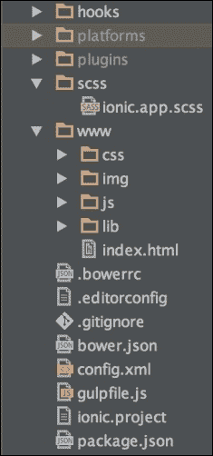

# 第二章。待办事项应用

在本章中，我们将深入探讨 Ionic，并会使用大量的 Ionic CLI 工具。我们将创建我们的第一个 Ionic 应用程序，并添加一些基本的 Ionic 功能到我们的应用程序中。我们将使用 Ionic 首次运行我们的应用程序，并在 Chrome 中调试我们的应用程序。我们将通过创建一个待办事项应用程序来结束本章。此应用程序将简单地让我们添加项目到我们的应用程序中，并提供一种删除这些项目或标记它们为完成的方法。

# 创建我们的第一个应用程序

使用 Ionic 创建新项目实际上是一个非常轻松的过程，因为有了 Ionic CLI。创建新的 Ionic 项目有多种方法，但最简单和最标准的技巧是使用 Ionic 模板。这是迄今为止最简单的方法，它允许我们使用 Ionic 提供的三个标准模板中的任何一个。

这些模板包括：

+   **空白模板**：这会创建一个新的项目，其中包含一些样板代码，以帮助您设置空白应用程序

+   **标签模板**：这与第一个模板相同，但您将获得一个具有标签设计的应用程序，而不是空白应用程序

+   **侧边菜单模板**：这会创建一个具有侧边菜单设计和一些样板代码的新应用程序

我们将在本书的某个时候使用这些工具。现在，我们将从第一个开始，使用空白模板创建一个全新的 Ionic 项目。在我们继续之前，让我们看看 Ionic CLI 用于创建新应用程序的命令：

```js
ionic create [Name Of App] [template]

```

Ionic CLI 的 `create` 命令允许我们提供两个参数，第一个是我们希望应用程序被称作的名称。这个第一个参数也将是生成文件时创建的文件夹的名称。第二个参数是模板名称。如前所述，有三种模板样式。您可以通过传递 blank、tabs 或 side menu 作为参数来表示您想要生成的应用程序模板类型。

## 创建我们的待办事项应用程序

我们将创建我们的待办事项应用程序。我们将使用空白模板来完成这个任务。为了保持一致性，我们将把我们的应用程序称为 `todo`。要创建 `todo` 应用程序，请运行以下命令：

```js
ionic start todo blank

```

此命令将创建一个名为 `todo` 的新空白 Ionic 应用程序。当此命令运行完成后，通过在命令行中运行以下命令进入您的应用程序项目：

```js
cd todo

```

要进一步探索我们新创建的 `todo` 应用程序，请打开您最喜欢的 IDE 中的 `todo` 应用程序文件夹。

# Ionic 工作流程

当您创建一个新的 Ionic 项目时，有几个文件夹和文件作为生成项目的一部分提供。您的目录应类似于以下截图所示：



你看到的结构基本上与每个 Cordova 项目相同，除了几个文件和文件夹。例如，有一个 `scss` 文件夹。这个文件夹包含一个文件，允许我们自定义应用的外观和感觉，将在后面的章节中详细说明。还有 `platforms` 和 `plugins` 文件夹。在大多数情况下，`platforms` 文件夹是自动生成的，但在这本书中我们不会涉及它们，所以你可以暂时忽略它们。

你还会注意到在你的 `www/lib` 文件夹中，有一个名为 `ionic` 的文件夹，它包含运行 Ionic 所需的所有文件。这里有 `css`、`fonts`、`js` 和 `scss` 文件夹。

+   `css`: 这个文件夹包含一个 Ionic 应用附带的所有默认 CSS。

+   `fonts`: Ionic 自带自己的字体和图标库，称为 **Ionicons**。这个 Ionicons 库包含数百个图标，所有这些图标都可以在你的应用中使用。

+   `js`: 这包含了核心 Ionic 库的所有代码。由于 Ionic 是用 Angular 构建的，这里有一个 Angular 版本和一些其他文件，这些文件共同构成了 Ionic 框架。

+   `scss`: 这是一个包含用于构建美丽的 Ionic 框架 CSS 样式的 SASS 文件的文件夹。这里的一切都可以轻松覆盖，以使你的应用感觉更加定制化，我们将在 第七章，*自定义应用* 中讨论你如何做到这一点。

如果你查看根文件夹，你会看到很多其他文件，这些文件是作为 Ionic 工作流程的一部分为你生成的。这些文件现在并不特别重要，但让我们在下面的列表中查看一些更重要的文件：

+   `bower.json`: 这是包含从 bower 包管理器获取的一些依赖项的文件。浏览器依赖项在 `bowerrc` 文件中指定的 `lib` 文件夹中解析。这是一个指定你项目可能需要的其他第三方依赖项的好地方。

+   `config.xml`: 这是由任何 Phonegap/Cordova 项目附带的标准 `config` 文件。在这里，你可以请求设备功能的权限，并指定你应用的通用和平台特定配置。

+   `gulpfile`: Ionic 使用 Gulp 构建工具，这个文件包含一些由 Ionic 提供的代码，可以让你做一些令人惊叹的事情。我们将在 第七章，*自定义应用* 中使用这个文件的一些功能，当我们进行一些自定义任务时。

+   `ionic.project`: 这是一个专门用于 Ionic 服务的文件。它是 Ionic CLI 和 `ionic.IO` 服务用来指定一些特定于 Ionic 的配置的文件。当我们使用 第三章 中的 Ionic view 应用时，我们会使用这个文件的一些功能，即 *运行 Ionic 应用*。

+   `package.json`: 这是一个由 node 用于指定一些 node 依赖的文件。当您使用 Ionic CLI 创建项目时，Ionic 会使用 Node 和 Bower 包管理器来解决一些依赖项。如果您在开发 Ionic 应用时需要 node 模块，您可以在该处指定这些依赖项。

这些文件是默认包含在用 Ionic CLI 创建的项目中的某些较为重要的文件。目前您不需要过分担心它们，但了解它们的存在以及它们代表的内容总是一个好主意。

## 对我们的项目的深入了解

在我们开始任何开发工作之前，了解如何实际向我们的应用添加功能和在哪里进行这些操作是至关重要的。我们将特别关注两个文件：

+   `index.html`: 这个文件是您应用的实际入口点。它是一个基于空白 Ionic 模板的正常 HTML 页面，包含一些样板代码。如果您仔细观察，您会看到一些自定义 HTML 标签，如 `<ion-pane>`、`<ion-header>` 和 `<ion-content>`。这些自定义标签实际上是使用 Angular 构建的 Ionic 组件，目前您不需要担心它们的功能，因为我们很快就会讨论这个问题。更仔细地查看 `<body>` 标签，您也会发现属性 `ng-app=starter`。这是 Angular 提供的一个自定义属性，我们用它来提供 Angular 应用的主模块名称。

+   `app.js`: 这个文件位于 `js` 文件夹中，它是包含我们应用主模块的文件。在 Angular 中，模块为我们提供了一种创建应用使用的隔离代码块的方法。主模块是当应用启动时实际加载到应用中的模块。将主模块视为应用的入口点。如果您仔细查看 `app.js` 文件，您会看到我们如何创建模块并将其名称指定为 starter：

    ```js
    angular.module('starter', ['ionic'])

    .run(function($ionicPlatform) {
      $ionicPlatform.ready(function() {
        // Hide the accessory bar by default (remove this to show the accessory bar above the keyboard
        // for form inputs)
        if(window.cordova && window.cordova.plugins.Keyboard) {
          cordova.plugins.Keyboard .hideKeyboardAccessoryBar(true);
        }
        if(window.StatusBar) {
          StatusBar.styleDefault();
        }
      });
    })
    ```

    ### 提示

    **下载示例代码**

    您可以从 [`www.packtpub.com`](http://www.packtpub.com) 下载您购买的所有 Packt 出版物的示例代码文件。如果您在其他地方购买了这本书，您可以访问 [`www.packtpub.com/support`](http://www.packtpub.com/support) 并注册，以便将文件直接通过电子邮件发送给您。

    你还会看到它接受一个第二个参数，一个包含一个名为 `ionic` 的字符串的数组。在 Angular 中，这个数组用于提供应用程序依赖的任何模块的名称。所以，就像我们在 `index.html` 文件中将我们的主模块名称 `starter` 指定给 `ng-app` 属性一样，我们指定了一个列表，其中包含我们的主模块所依赖的模块，在这种情况下，是 `ionic`。

    你也会注意到 `app.js` 中有一个 `run` 函数。这个函数是在我们的应用程序准备好并且所有依赖的 Angular 模块和工厂都已加载时触发的函数。`run` 函数是一个很好的地方，可以在应用程序开始时立即完成一些整理工作。

这两个文件是你需要关注的，因为它们是我们构建待办事项列表应用程序时将主要使用的两个文件。

## 想象我们的应用程序

在构建任何应用程序之前进行一点简单的线框设计总是好的。这使你能够在实际开始编码应用程序之前了解应用程序的工作方式和外观。以下截图是我们 `todo` 应用程序的大致线框：


我们的 `todo` 应用程序允许用户简单地将他们想要添加到待办事项列表中的任何任务输入进去。想象这个应用就像一个迷你日记，你可以把想要稍后完成的任务记录进去。在本节中，我们只将构建我们 `todo` 应用程序的最基本功能，并且只允许用户添加新项目。在后面的章节中，随着我们对 Ionic 的了解加深，我们将添加更多复杂的功能，比如使用复杂列表，并允许用户编辑、删除，甚至存档待办事项列表项。

## 构建我们的 todo 应用程序

要开始构建我们的 `todo` 应用程序，我们需要将我们想要实现的目标进一步分解成更小的步骤。我们首先需要做的是创建我们应用程序的界面。

### 创建用户界面

要开始构建我们的 `todo` 应用程序，我们首先要构建用户界面。我们将构建输入表单和添加当前输入框中 `todo` 项的按钮。在编写完这段代码后，我们将添加我们想要显示任何输入 `todo` 项的列表的标记。以下代码中我已经为您编译了这些标记：

```js
<div class="list">
    <div class="item item-input-inset">
        <label class="item-input-wrapper">
            <input type="text" placeholder="enter todo item">
        </label>
        <button class="button button-small">
            Add
        </button>
    </div>
</div>
<ul class="list">
    <li class="item>

    </li>
</ul>
```

从前面的代码中，你可以看到我们用户界面的外观已经准备好了。我们有一个接收我们想要输入到待办事项列表中的内容的输入框。我们有一个 HTML 无序列表，它将被放置在待办事项列表项所在的位置。你可以在我们的某些元素上看到一些类。这些实际上是来自自动生成的 Ionic CSS 样式的类，这些样式是任何 Ionic 项目的一部分。

### 代码

由于我们已经为我们的应用程序编写了用户界面，我们还需要编写 Angular 代码来使其能够工作。我们需要做的是创建一个数组来保存待办事项列表，并创建一个函数，以便在点击我们之前创建的**添加**按钮时将待办事项项添加到这个列表中。我们将通过在主模块中创建一个 Angular 控制器并插入所有这些逻辑来实现这一点。我已经编写了这段代码，您可以从以下链接复制它并将其添加到您的项目中：

```js
.controller('TodoController', function ($scope) {
  $scope.todos = [];
  $scope.todoModel = {};
  $scope.todoModel.todo = '';
  $scope.addTodo = function () {
    $scope.todos.push($scope.todoModel.todo);
    $scope.todoModel = {
        todo: ''
    };
  };
})
```

从前面的代码中，您可以看到我们创建了一个名为`TodoController`的控制器。在这个`TodoController`中，我们有一个`todos`数组。这个数组将保存所有的`todo`项。我们还有一个`todoModel`对象，它是一个空对象，将保存我们输入的`todo`项。最后，我们有一个名为`addTodo`的函数，它将`todoModel`对象中的当前值添加到`todos`数组中，然后将当前`todoModel`对象的值设置为空字符串，以便我们可以从头开始输入。

### 连接组件

现在我们已经创建了用户界面的模板代码，并且为它编写了代码，现在是时候将它们连接起来并指定它们应该出现在哪里：

```js
<ion-content ng-controller="TodoController">
    <div class="list">
        <div class="item item-input-inset">
            <label class="item-input-wrapper">
                <input type="text" placeholder="enter todo item" ng-model="todoModel.todo">
            </label>
            <button class="button button-small" ng- click="addTodo()">
                Add
            </button>
        </div>
    </div>
    <ul class="list">
        <li class="item" ng-repeat="todo in todos track by $index">
            {{todo}}
        </li>
    </ul>
</ion-content>
```

如果您查看前面的代码，您会看到 UI 代码现在看起来有些不同。首先，我们已经将我们的`<ion-content>`元素与`TodoController`关联起来。这样做是为了创建一个绑定上下文，这意味着`TodoController`中的任何变量现在都可以用于与其所有后代的数据绑定。其次，您也会注意到我们的输入现在有一个新的`ng-model`属性，它绑定到`TodoController`中的`todoModel`变量。这是将任何时间点的输入标签的值绑定到`todoModel`对象。第三，我们在**添加 todo**按钮上设置了一个`ng-click`属性，以确保每次点击时都会向我们的数组中添加一个新的`todo`项。最后，我们在 UL 元素内进行了`ng-repeat`操作，以指定我们想要将`todo`数组的所有子项渲染为 LI。

通过这种方式，我们已经成功完成了`todo`应用的开发，剩下的就是看到它实际运行的效果。在下一章中，我们将学习如何以不同的方式运行我们刚刚构建的应用程序，所以请继续学习如何运行和实时测试您的应用程序。

# 摘要

在本章中，我们使用 Ionic 空白应用程序模板创建了我们的第一个 Ionic 应用程序。我们查看了一下 Ionic 的工作流程，并看到了组成工作流程的一些文件。然后我们深入讨论了我们打算如何构建我们的待办事项列表应用程序。我们进一步进行了实际操作，根据线框实现了待办事项列表应用程序的 UI。我们编写了一些 Angular 代码，并将其连接到我们创建的用户界面。

在下一章中，我们将学习使用 Ionic CLI 首次运行和测试我们的应用程序的不同方法。
