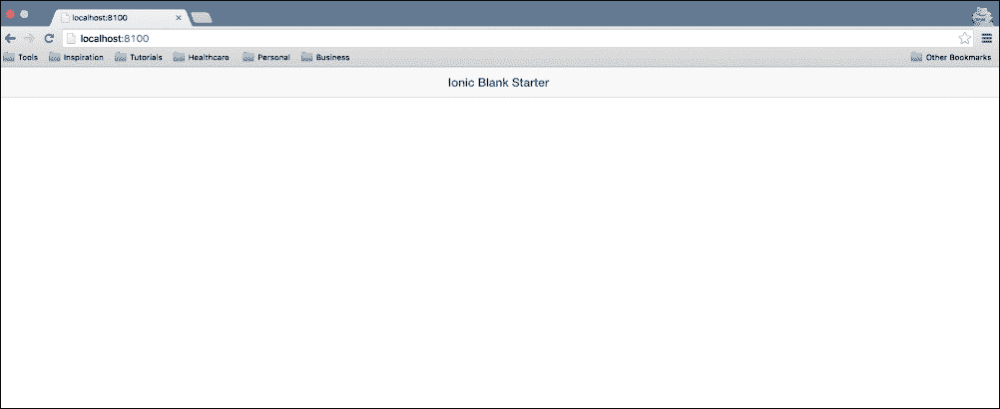
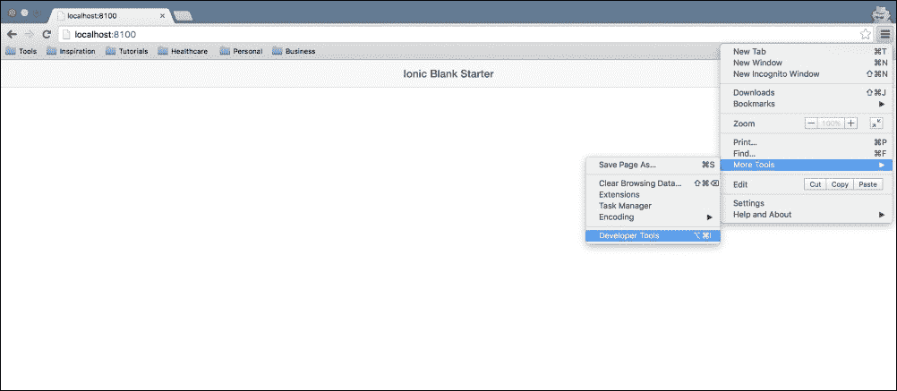
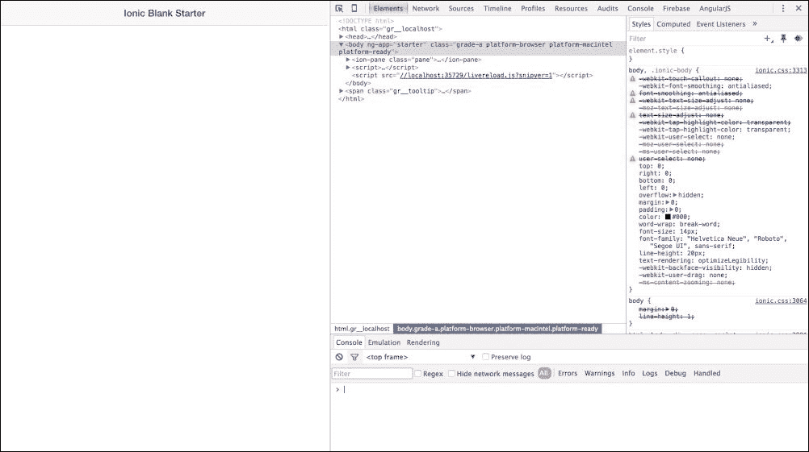
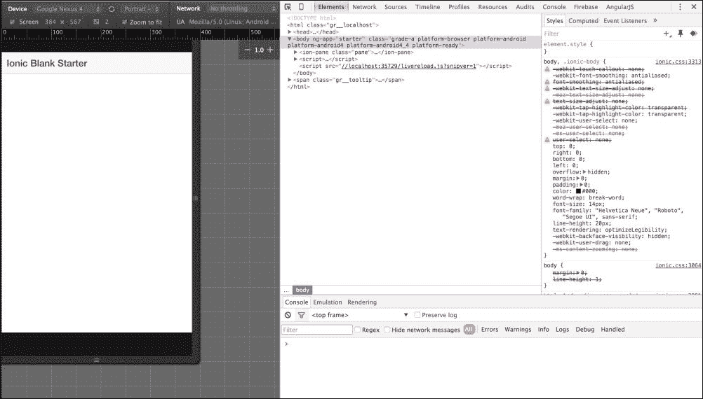
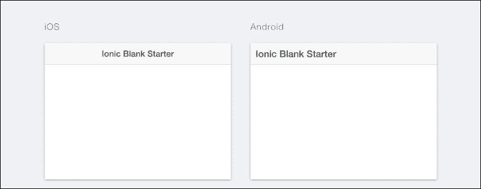
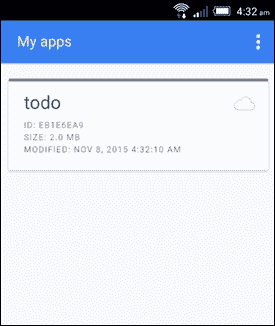

# 第三章：运行 Ionic 应用程序

在本章中，我们将学习如何使用各种方法测试和运行我们的 Ionic 应用程序。我们将从学习使用最简单的 Ionic 技术开始：通过使用`ionic serve`命令将我们的应用程序部署到 Chrome 浏览器。然后，我们将继续使用 Ionic view 移动应用程序（iOS/Android）来了解我们如何在移动设备上测试我们的应用程序。最后，我们将学习如何使用我们各自平台的原生 SDK 的传统构建系统运行和部署我们的 Ionic 应用程序。

# 运行我们的待办事项应用程序

在上一章中，我们使用 Ionic 空白模板创建了我们的第一个 Ionic 应用程序。我们进一步工作于该应用程序，并制作了一个待办事项列表应用程序。我们编写了一些 Angular 代码，并对一些 Ionic 代码有了一些初步的了解。然而，我们没有看到我们的应用程序在运行。我们可以通过许多方式运行 Ionic 应用程序，我们将学习的第一种技术是`ionic serve`技术。

## ionic serve 技术

`ionic serve`技术是查看您的应用程序运行情况的最简单方法。在安装 Ionic CLI 之后，不需要额外的设置，只需要您有一个网络浏览器。我们现在将使用`ionic serve`技术测试我们创建的`todo`应用程序，该应用程序是在上一章中创建的。要使用此技术测试您的应用程序，只需打开一个新的命令行窗口并按照以下步骤操作。

### 小贴士

**浏览器选择**

建议您使用 Google Chrome 作为默认浏览器。Google Chrome 有一些非常强大的开发工具，并且本书中的所有练习都假设您已经安装了 Google Chrome 作为默认浏览器。您可以通过访问此 URL 下载 Google Chrome 的副本：[`www.google.com/chrome`](http://www.google.com/chrome)。

1.  从你的终端导航到你的 Ionic `todo`应用程序的根目录。

1.  在您的命令行窗口中运行以下命令：

    ```js
    ionic serve

    ```

    ### 注意

    如果您被提示选择一个 IP 地址，您可以从提示的列表中选择任何一个，然后按*Enter*键启动。

如果你正确地遵循了步骤，你应该会看到一个浏览器窗口弹出，其中运行着你的应用程序。你也会注意到，你输入命令的命令行窗口中正在进行一些操作。

通过这种方式，我们已经成功地将我们的应用程序部署到浏览器中，并且可以像测试其他任何 Chrome 上的 Web 应用程序一样测试我们的 Ionic 应用程序。这个技术的优点是，不需要额外的设置，你只需要在你的机器上安装 Ionic CLI 和 Chrome 浏览器。

### 使用 Chrome 进行模拟

尽管我们的应用程序在 Chrome 浏览器上运行，但它全屏显示，就像一个普通的全屏 Web 应用程序。这对我们来说并不理想，因为我们的应用程序是一个移动应用程序。幸运的是，Chrome 有一个很棒的模拟工具，它允许你模拟你的应用程序，就像它在普通手机上运行一样。

要使用 Chrome 的模拟功能，请按照以下步骤操作。

### 注意

这些步骤假设您已经将您的应用在 Chrome 浏览器上运行，并且您当前位于该应用运行的标签页上。

1.  点击如图所示的 Chrome 菜单图标：

1.  滚动到**更多工具**选项并选择**开发者工具**选项，如图所示：

1.  点击如图所示的**设备模式**切换图标：

这应该会弹出一个包含您应用运行的 Chrome 模拟器窗口。您可能需要刷新页面以正确渲染应用。如果您查看窗口，您将看到一个位于左上角的下拉菜单，其中列出了您可以模拟的设备。我通常推荐使用 Nexus 5 来测试 Android，以及使用 iPhone 6 来测试 iOS。这是因为 Nexus 5 的分辨率超过了今天许多可用的 Android 手机，因此将其作为基础是非常有意义的。同样，对于 iPhone 6 也是如此；由于它是撰写本文时的苹果旗舰设备，因此用于模拟也是合理的。



您可以像在模拟器中运行一样完全与您的应用交互。您还拥有 Chrome 开发者工具的全部功能，可以检查元素并查看您的应用程序代码是如何表示的。为什么不尝试使用您的应用并添加一些待办事项列表项，看看它们是如何填充的呢。

## Ionic serve labs

`ionic serve`技术中还有一种风味，让我们能够同时看到我们的应用在 iOS 和 Android 上的样子。这种技术被称为 Ionic labs 技术。

### 小贴士

这种技术应仅用于查看应用，并不打算用于调试。

要使用 Ionic labs 技术查看您的应用，请按照以下步骤操作。

### 小贴士

如果您已经使用`ionic serve`技术查看您的应用，只需按*Q*键退出当前会话或关闭命令行窗口，然后打开一个新的窗口。

1.  确保您位于项目的根目录中。

1.  在您的终端中输入以下命令：

    ```js
    ionic serve --lab

    ```

    

运行此命令应该会像第一次运行 `ionic serve` 命令时一样弹出一个新的浏览器窗口；只是这次，你会看到两个针对你的应用的模拟，一个用于 iOS，一个用于 Android，如前一张截图所示。这是同时查看你的应用在两个平台上运行的一个非常好的方式。Ionic 有一个术语叫做 **Continuum**，你将在后面的章节中看到它的实际应用。这种现象指的是某些元素在不同平台上看起来不同。例如，iOS 上的标签通常放在底部，而 Android 上则传统地放在顶部。Ionic 提供了这些功能，并提供了一种进一步覆盖这些行为的方式。`ionic serve` 技巧是同时查看像在不同平台上标签位置不同的功能的一个很好的方法。

## The Ionic view

另一种查看 Ionic 应用程序的技术是使用 Ionic view 应用程序。Ionic view 应用程序是由 Ionic 创建的一个移动应用程序，它提供了在 iOS 和 Android 上的 Ionic 框架。该应用程序用于查看你正在开发的任何 Ionic 应用程序，并与 Ionic IO 平台紧密协作。Ionic IO 平台是 Ionic 提供的一套工具，用于提供一些额外服务，如推送通知、分析等。

### 使用 Ionic view 测试 todo 应用程序

为了使用 Ionic view 应用程序，你必须拥有一个 iOS 或 Android 设备。你还需要一个 Ionic IO 账户。导航到 [`apps.ionic.io`](http://apps.ionic.io) 创建你的 Ionic IO 账户。然后访问你的移动设备上的 [`view.ionic.io`](http://view.ionic.io) 并下载适用于你的移动设备的正确版本。

为了测试我们的 `todo` 应用程序，请按照以下步骤使用 Ionic view 应用程序进行测试：

1.  打开一个终端窗口，并从 `第二章` 导航到你的 `todo` 应用程序的根目录。

1.  简单地在你的终端中输入以下命令：

    ```js
    ionic upload

    ```

此命令将请求你的 Ionic IO 账户的电子邮件和密码详细信息。当提示时输入这些详细信息，如果应用程序上传正确，你应该会看到一个消息说 `成功上传 (APP_ID)`，其中 `APP_ID` 是为你应用自动生成的标识符。

现在，你已准备好在移动设备上查看应用程序。为此，只需在你的手机上打开你的 Ionic view 应用程序，并使用你上传应用程序的相同 Ionic IO 账户登录。你应该以类似以下截图的方式看到你的应用程序。



从这里，你只需轻触 `todo` 应用程序，就会弹出一个包含多个选项的提示。你应该选择 **下载文件** 选项。完成此操作后，你可以简单地点击 **查看应用程序** 选项。如果你正确地遵循了说明，`todo` 应用程序应该会替换你的当前视图，你应该在 Ionic view 应用程序中看到它正在运行。

### 小贴士

你可以简单地用三根手指轻触屏幕，在任何时候返回到 Ionic 视图菜单。

Ionic view 是查看你的应用程序的好方法，当你想要与朋友、客户或老板分享应用程序的进度时，它非常有用。它有一个功能允许你通过电子邮件分享，你可以在 Ionic 官方文档中找到这些功能的文档。你还可以通过应用程序内部或通过 Ionic IO 网站 [`apps.ionic.io`](http://apps.ionic.io) 在线管理你上传到 Ionic view 的应用程序。

## 设备

你也可以通过在物理设备上运行你的 Ionic 应用来测试你的 Ionic 应用程序。但是，为了这样做，你必须在你电脑上安装每个平台的本地 SDK。让我们简要看看如何在你的设备上运行一个 Ionic 应用。

### Android

要在物理设备上运行 Ionic 应用，首先你需要确保你的 Android 设备已经通过 USB 连接到电脑。同时，你还需要确保在电脑上开启了开发者模式，并且启用了 USB 调试。

### 注意

这一假设你已经在你电脑上设置了 Android SDK，并且你也在你的机器上设置了 Cordova 和 Ionic。

确保你在终端窗口中处于项目的根目录，并运行以下命令：

```js
ionic run android

```

如果你已经正确设置了所有配置，这个命令将会自动构建你的应用并在连接到电脑的设备上运行。

### iOS

要在 iOS 设备上运行 Ionic 应用，首先你需要确保你已经安装了 `iOS-deploy` 包。

### 注意

你只能使用 Mac 电脑将你的应用部署到 iOS 设备上。这一步还假设你已经正确地在你的 Mac 电脑上设置了 iOS SDK 和 X-Code。

如果你没有安装 `iOS-deploy` 包，你可以通过运行以下命令使用 NPM 安装它：

```js
npm install ios-deploy -g

```

将你的设备连接到你的 Mac 电脑，并确保它没有启用锁屏。只需运行以下命令即可将你的 Ionic 应用部署到设备上：

```js
ionic run ios --device

```

这个命令应该在你的连接的 iOS 设备上自动构建和运行你的应用程序。

# 摘要

在本章中，我们学习了测试和部署我们应用的各种方法。我们首先使用 `ionic serve` 命令将我们的应用部署到浏览器上，使用 Chrome 浏览器。然后我们查看如何使用 Ionic labs 来提供我们的应用程序。接着我们使用 Ionic view 应用程序来查看如何在安装了 Ionic view 应用的 iOS 和 Android 设备上运行我们的应用。最后，我们简要介绍了如何在真实的 Android 或 iOS 设备上运行我们的 Ionic 应用程序。

在下一章中，我们将深入探讨一些更复杂的 Ionic 控件，我们将使用 Angular 的 `$http` 服务来了解如何在 Ionic 应用程序中执行 Ajax 调用并检索数据。
