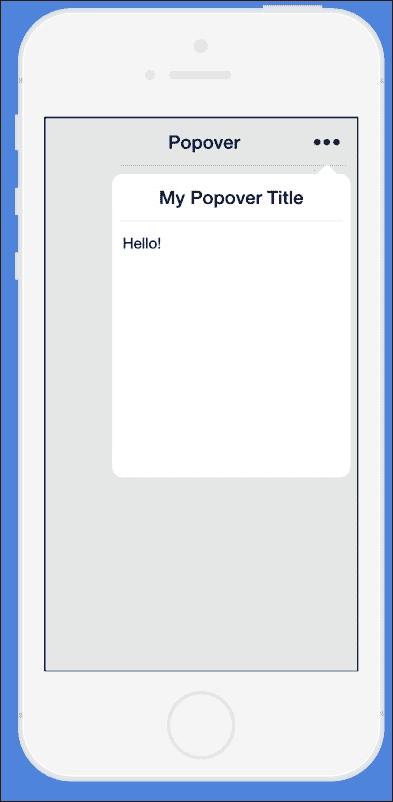
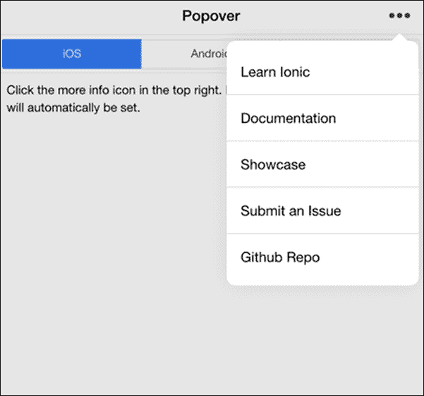
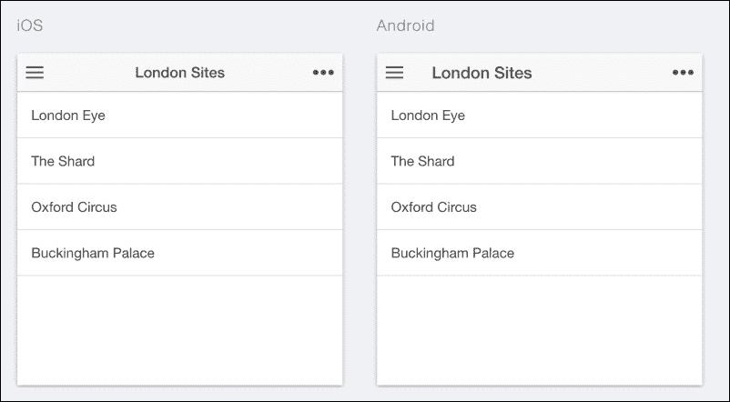
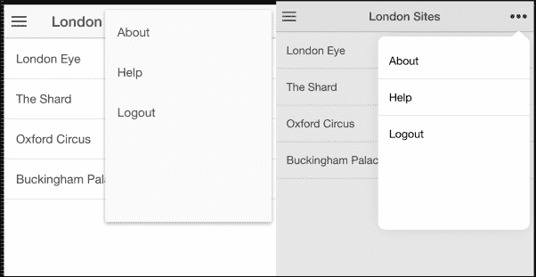
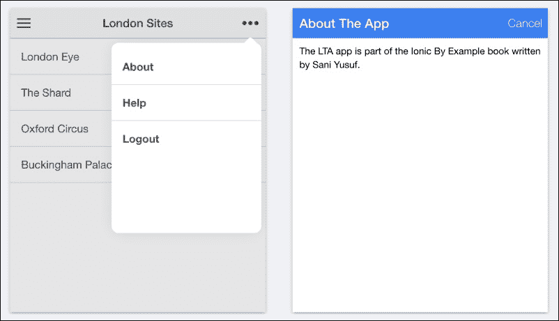

# 第六章。高级 Ionic 组件

在本章中，我们将扩展我们在第五章中创建的应用程序，即*伦敦旅游应用程序*。我们将学习如何将一些更复杂的功能，如 Ionic Popover 和 Ionic Modal 组件，添加到我们的当前应用程序中。在本章结束时，我们将拥有一个弹出菜单和模态窗口作为我们应用程序的一部分。

# Ionic Popover

Ionic Popover 组件允许我们在应用程序中添加弹出菜单。弹出菜单是一个上下文菜单，用于提供隐藏菜单或额外菜单选项。它通常在我们空间有限且想要展示选项列表时使用。我们不是拥挤我们有限的可用空间，而是创建某种按钮，当点击时，弹出菜单可以弹出并显示这些菜单项。

以下截图展示了弹出窗口在实际中做什么的很好描述：



## 实现弹出窗口

我们将在现有的应用程序中实现我们的弹出窗口。你应该做的第一件事是打开你的应用程序，因为你已经在上一章中离开了伦敦旅游应用程序。我们的目标是创建一个包含三个额外选项的弹出窗口列表。这三个选项是**关于**、**帮助**和**注销**。这三个选项不会执行任何操作，因为我们只是为了示例而放置它们。以下截图展示了我们将要实现的目标样本。

+   对于 iOS：

+   对于 Android：

要开始实现我们的弹出窗口，请打开 LTA 应用程序项目中的`playlists.html`文件。请记住，这个`playlists.html`文件可以通过导航到`www`文件夹并在其中查看`templates`文件夹来找到。路径如下：`www/templates/playlists.html`。

现在，你应该有一个文件，其代码与以下代码非常相似：

```js
<ion-view view-title="London Sites">
  <ion-content>
    <ion-list>
      <ion-item ng-repeat="site in sites">
        {{site.name}}
      </ion-item>
    </ion-list>
  </ion-content>
</ion-view>
```

### 添加菜单按钮

我们将要做的第一件事是添加我们想要触发弹出窗口的菜单按钮。当点击时，此菜单将显示弹出窗口。以下代码块表示我们弹出窗口的按钮图标代码：

```js
<ion-nav-buttons side="right">
    <button class="button button-clear icon ion-more"></button>
</ion-nav-buttons>
```

你需要在`playlists.html`页面的`<ion-view>`标签之后复制前面的代码。前面的代码使用`<ion-nav-buttons>`元素来指定我们想在页眉中放置一个导航按钮。此元素还有一个`side`属性，其值为`right`。这个`side`属性是用来告诉`<ion-nav-buttons>`元素将自身定位在页面标题的哪一侧。在`<ion-nav-buttons>`元素中有一个简单的按钮，它具有一些 ionic 样式，确保按钮有一个图标（`ion-more`）作为我们的弹出视图图标。如果你已经遵循了所有步骤并正确复制了代码块，你的代码应该非常类似于以下代码块：

```js
<ion-view view-title="London Sites">

  <ion-nav-buttons side="right">
    <button class="button button-clear icon ion-more"></button>
  </ion-nav-buttons>

  <ion-content>
    <ion-list>
      <ion-item ng-repeat="site in sites">
        {{site.name}}
      </ion-item>
    </ion-list>
  </ion-content>
</ion-view>
```

目前，测试我们的应用程序并查看我们的图标按钮的外观可能是个好主意。使用我们过去使用过的`Ionic serve`技术，在 Chrome 浏览器上启动你的应用程序。你的屏幕应该看起来接近以下截图中的样子。

### 提示

如果你在使用 Chrome 上的 Android 模拟器时标题居左，这是完全正常的。iOS 的等效操作也将居中。



### 编写弹出视图代码

下一步是编写我们的弹出菜单的实际逻辑。首先，我们需要进入我们的`controller.js`文件。你可以通过从项目根目录查找以下路径来找到此文件：

```js
www/js/controller.js
```

在`controller.js`文件中，找到`PlaylistsCtrl`控制器。我们将在这个控制器中实现我们的弹出视图，因为它与我们的`playlists.html`相关联。

### 添加`$ionicPopover`服务

为了使用 Ionic Popover，Ionic 有一个名为`$ionicPopover`的特殊服务，这使得操作变得非常简单。通过在`PlaylistsCtrl`控制器中将`$ionicPopover`指定为参数来将其添加为依赖项。如果你已经正确完成，你的`PlaylistsCtrl`控制器现在应该类似于以下代码：

```js
.controller('PlaylistsCtrl', function($scope, $http, $ionicPopover) {
      $scope.sites = [];
      $http.get('/sites.json')
          .then(function (response) {
            $scope.sites = response.data;
          });
})
```

#### 完成弹出视图代码

下一步是使用`$ionicPopover`服务编写创建弹出视图的实际代码，如下所示：

```js
$ionicPopover.fromTemplateUrl('templates/popover.html', {
        scope: $scope
      }).then(function(popover) {
        $scope.popover = popover;
      });

      $scope.openPopover = function($event) {
        $scope.popover.show($event);
      };
```

前面的代码块使用`$ionicPopover`服务实例化一个新的弹出视图。我们还使用`$ionicPopover`的`.fromTemplateUrl`函数来创建弹出视图。此函数允许我们传递一个包含我们的弹出视图 HTML 的文件的 URL。`.fromTemplateUrl`函数还返回一个 promise，该 promise 返回创建的弹出视图实例。然后我们将此弹出视图实例绑定到我们的作用域，以便在视图中使用。然而，我们还有一个小的部分还没有完成。我们传递了一个文件路径`templates/popover.html`作为包含我们的弹出视图代码的文件。但是，这个`popover.html`文件目前不存在，因此我们需要创建它。

### 创建`popover.html`文件

要创建我们的 `popover.html` 文件，在项目的根目录下的 `templates` 文件夹中创建一个名为 `popover.html` 的新文件。这个 `templates` 文件夹位于 `www` 文件夹中，而 `www` 文件夹位于项目的根目录。路径如下：`www/templates/popover.html`。

现在我们已经创建了该文件，下一步就是填充这个文件。记住，我们试图实现的是在 `popover.html` 中有一个菜单项列表。我们希望这三个选项是 **关于**、**帮助** 和 **注销**，以模拟一组假定的弹出选项。

要开始创建弹出内容，将以下代码块复制到您的 `popover.html` 文件中：

```js
<ion-popover-view>
    <ion-content>
        <div class="list">
        <b class="item" href="#">
            About
        </b>
        <b class="item" href="#">
            Help
        </b>
        <b class="item" href="#">
            Logout
        </b>
    </div>
    </ion-content>
</ion-popover-view>
```

如果您已经完成了这个操作，您已经完成了弹出模板的实现。现在，让我们了解我们刚刚在 `popover.html` 文件上实现的 HTML 代码的作用。`<ion-popover-view>` 元素是一个表示特定视图是弹出视图的必要元素。它还包含一个 `<ion-content>` 元素，这是一个容器，用于包含我们视图的所有可见部分，在这种情况下是弹出视图。我们在这个 `div` 标签中放入一个具有 `list` 类的标签，这是 Ionic 的内置类之一。在这个 `div` 内部，有三个 HTML 粗体标签代表我们的三个假选项。这就是我们完成模板实现所需的所有内容。最后一步是将弹出功能连接起来，确保其按预期工作。

### 弹出功能的连接

这是使弹出功能正常工作的最后一步。请记住，我们在 `PlayListsCtrl` 控制器中创建了一个名为 `openPopover()` 的函数，该函数接受一个 `$event` 参数。当这个函数被调用时，它将启动弹出视图。我们还将必须传递 `$event` 参数，这是一个保留参数，代表从视图发送的事件。

为了将这个功能付诸实践，我们首先需要将这个 `openPopover()` 函数连接到我们之前创建的弹出图标点击时执行。这个弹出按钮位于我们之前步骤中的 `playlists.html` 文件中。您当前的 `playlists.html` 文件应该看起来接近以下代码块中的内容：

```js
<ion-view view-title="London Sites">

  <ion-nav-buttons side="right">
    <button class="button button-clear icon ion-more"></button>
  </ion-nav-buttons>

  <ion-content>
    <ion-list>
      <ion-item ng-repeat="site in sites">
        {{site.name}}
      </ion-item>
    </ion-list>
  </ion-content>
</ion-view>
```

我们需要做的是在创建的弹出图标按钮上添加一个 Ionic 点击事件。我们可以使用 Ionic 提供的属性指令 `on-tap` 来完成这个操作。这个 `on-tap` 属性指令接受一个函数，当包含的元素被点击时，该函数将被执行。在我们的例子中，我们希望这个函数是 `openPopover` 函数。目前我们的弹出图标按钮代码如下所示：

```js
<ion-nav-buttons side="right">
    <button class="button button-clear icon ion-more"></button>
  </ion-nav-buttons>
```

现在，`<button>` 的 `on-tap` ionic 属性指令的代码如下所示：

```js
on-tap="openPopover($event)"
```

您可以看到 `$event` 被作为参数传递。请记住，这非常重要，必须严格按照这种方式传递。您最终的 `playlists.html` 代码将如下所示：

```js
<ion-view view-title="London Sites">

  <ion-nav-buttons side="right">
    <button class="button button-clear icon ion-more" on- tap="openPopover($event)"></button>
  </ion-nav-buttons>

  <ion-content>
    <ion-list>
      <ion-item ng-repeat="site in sites">
        {{site.name}}
      </ion-item>
    </ion-list>
  </ion-content>
</ion-view>
```

完成这些操作后，我们已经完全完成了弹出功能的实现。现在，我们可以使用 `ionic serve` 技术在浏览器中运行它，以查看其外观。

如果您使用`ionic serve`技术正确运行了您的应用程序，当您点击弹出图标按钮时，您应该看到以下截图所示的内容。视图将根据您是否使用 Android 或 iOS 模拟器设置进行测试而有所不同：



弹出菜单是一个很好的上下文菜单工具，用于添加额外的菜单选项。它还有一个根据显示的移动操作系统自动显示不同版本的功能。现在我们已经学会了如何使用 Ionic Popover，让我们学习如何使用 Ionic Modal。

# Ionic Modal

Ionic Modal 是 Ionic 提供的一个组件功能，用于在我们的应用程序中创建模态窗口。模态窗口是一个弹出在现有页面上的视图，而不会丢失当前操作上下文。一旦它被取消，之前的视图状态就会恢复。这是一个收集额外信息或在屏幕上显示某些内容而不丢失当前状态的好工具。

## 创建模态

Ionic 通过一个名为`$ionicModal`的服务公开模态功能。此服务为我们提供了一种在应用程序中创建模态的方法。在我们开始实现模态之前，让我们了解我们希望通过应用程序中的模态功能实现什么。

我们将继续使用我们的 LTA 应用程序并添加一个模态。我们希望这个模态模仿应用程序的示例**关于**页面，其中将包含一些关于应用程序的详细信息。记住，我们已经有了一个来自我们之前创建的弹出按钮的按钮，上面标有**关于**文本。我们将把这个弹出项连接起来，以便在点击时简单地打开模态。

## 实现模态

要开始实现模式，请打开您的`controller.js`文件并定位到`PlaylistsCtrl`控制器。首先要做的是在`PlaylistsCtrl`控制器上添加对`$ionicModal`服务的依赖。这是通过将`$ionicModal`作为`PlaylistsCtrl`控制器函数定义的参数来完成的。正确执行此操作后，您的`PlaylistsCtrl`控制器应该看起来像以下代码块中的内容：

```js
.controller('PlaylistsCtrl', function($scope, $http, $ionicPopover, $ionicModal) {
      $scope.sites = [];
      $http.get('/sites.json')
          .then(function (response) {
            $scope.sites = response.data;
          });

      $ionicPopover.fromTemplateUrl('templates/popover.html', {
        scope: $scope
      }).then(function(popover) {
        $scope.popover = popover;
      });

      $scope.openPopover = function($event) {
        $scope.popover.show($event);
      };
})
```

接下来，我们将要在`PlaylistsCtrl`控制器中编写我们的模态代码。以下代码表示我们的模态代码：

```js
$ionicModal.fromTemplateUrl('templates/modal.html', {
            scope: $scope
        }).then(function(modal) {
            $scope.modal = modal;
        });
        $scope.openModal = function() {
            $scope.modal.show();
        };
        $scope.closeModal = function() {
            $scope.modal.hide();
        };
```

将前面的代码复制到您的`PlaylistsCtrl`控制器中。如果您正确执行了此操作，您的`PlaylistsCtrl`控制器的代码块应该看起来像以下内容：

```js
.controller('PlaylistsCtrl', function($scope, $http, $ionicPopover, $ionicModal) {
        $ionicModal.fromTemplateUrl('templates/modal.html', {
            scope: $scope
        }).then(function(modal) {
            $scope.modal = modal;
        });

        $scope.openModal = function() {
            $scope.modal.show();
        };

        $scope.closeModal = function() {
            $scope.modal.hide();
        };

        $scope.sites = [];
        $http.get('/sites.json')
          .then(function (response) {
            $scope.sites = response.data;
          });

        $ionicPopover.fromTemplateUrl('templates/popover.html', {
        scope: $scope
        }).then(function(popover) {
        $scope.popover = popover;
        });

        $scope.openPopover = function($event) {
        $scope.popover.show($event);
        };
    })
```

现在，让我们理解一下模态代码的作用。我们使用了 `$ionicModal` 服务通过其 `.fromTemplateUrl()` 方法创建模态。这个方法接受两个参数；第一个是包含模态的 HTML 文件的路径，第二个是一个 `options` 对象。这个 `options` 对象让我们可以自定义模态，并提供给我们自定义诸如使用哪种动画等事物的途径。目前，我们只指定了模态应该使用的范围，在这个例子中是控制器的范围。

`.fromTemplateUrl` 方法返回一个包含创建的模态的承诺，我们将它设置到 `$scope` 上。以下代码是模态创建的反映：

```js
$ionicModal.fromTemplateUrl('templates/modal.html', {
            scope: $scope
        }).then(function(modal) {
            $scope.modal = modal;
        });
```

我们还创建了两个函数。这些函数是 `.openModal()` 和 `.closeModal()`。`openModal()` 函数绑定到 `$scope`，它所做的只是使用创建的模态的 `.show()` 方法。`.closeModal()` 函数通过实现创建的模态的 `.hide()` 方法来做相反的操作。我们还没有做的事情是创建我们传递的 HTML 模板，在这个例子中是 `modal.html`。

## 创建 modal.html 文件

导航到你的 `templates` 文件夹，创建一个名为 `modal.html` 的新 HTML 文件。以下代码代表我们的模态模板文件，你需要将此代码复制到你的 `modal.html` 文件中：

```js
<ion-modal-view>
    <ion-header-bar class="bar bar-header bar-positive">
        <h1 class="title">About The App</h1>
        <button class="button button-clear button-primary" on- tap="closeModal()">Cancel</button>
    </ion-header-bar>

    <ion-content class="padding">
        The LTA app is part of the Ionic By Example book written by Sani Yusuf.
    </ion-content>
</ion-modal-view>
```

如果你仔细查看这段代码，你可以看到 `<ion-modal-view>` 元素作为代码的根元素。这个 `<ion-modal-view>` 元素是任何模态模板的根元素。我们还可以看到我们有一个 `<ion-header-bar>` 元素，这个元素有一个 `<h1>` 元素用来声明模态标题。还有一个 `<button>` 元素，它有一个 `on-tap` 属性，指向我们之前创建的 `closeModal()` 函数。

还有一个 `<ion-content>` 元素，用于包含模态的可见主体部分。有一些占位文本来模拟 LTA 应用程序的 **关于** 页面，但你可以自由添加一些自己的 HTML 文本。我们需要做的最后一步是将我们的弹出按钮连接到我们的模态。

## 连接模态

要连接我们的模态，请记住我们希望当点击时，**关于** 弹出菜单项可以打开模态。首先，打开你的项目中的 `popover.html` 文件。你目前有的内容如下：

```js
<ion-popover-view>
    <ion-content>
      <div class="list">
        <b class="item">
            About
        </b>
        <b class="item">
            Help
        </b>
        <b class="item">
            Logout
        </b>
      </div>
    </ion-content>
</ion-popover-view>
```

我们需要做的只是使用 Ionic 的 `on-tap` 属性在 `About` 条目上引用 `openModal()` 函数。正确地这样做会使我们的弹出代码看起来如下：

```js
<ion-popover-view>
    <ion-content>
        <div class="list">
        <b class="item" on-tap="openModal()">
            About
        </b>
        <b class="item">
            Help
        </b>
        <b class="item">
            Logout
        </b>
    </div>
    </ion-content>
</ion-popover-view>
```

完成这些后，我们已经完成了模态窗口的实现。接下来要做的事情是进行测试。为此，使用 `Ionic serve` 技术运行你的应用程序。当你的应用程序在浏览器中运行时，点击弹出图标并选择 **关于** 选项。这应该会弹出一个类似于以下截图中的模态窗口：



# 摘要

在本章中，我们使用了 Ionic 的两个非常重要的特性，并学会了创建弹出窗口和模态窗口。我们仍然使用了上一章中的 LTA 应用程序。Ionic 弹出窗口是一个很棒的功能，用于添加额外的菜单项或提供上下文菜单选项。我们还了解了 Ionic 模态窗口，它用于在保持上下文的同时，提供对应用中另一个视图的查看。

在下一章中，我们将学习如何使用 Ionic 的一些自定义技术，以及如何自定义我们的 Ionic 应用程序。
