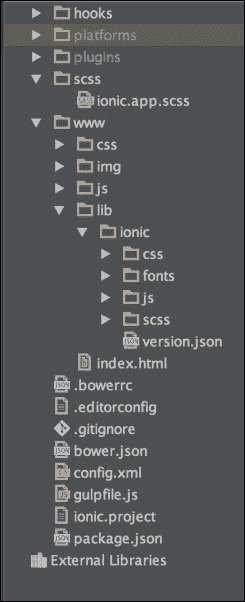
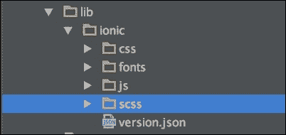
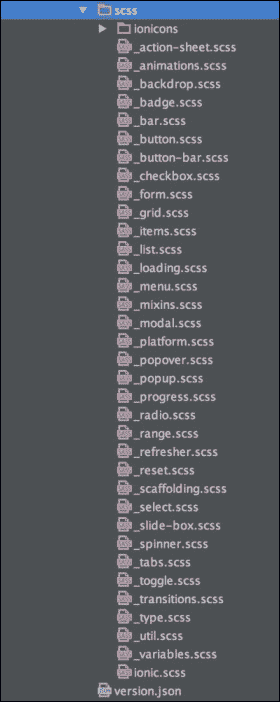
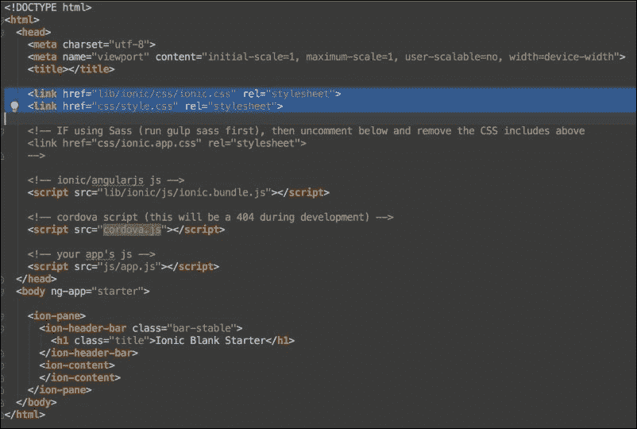
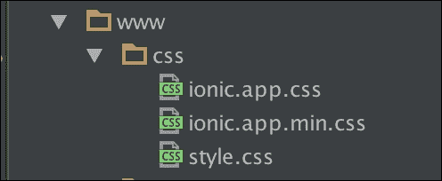
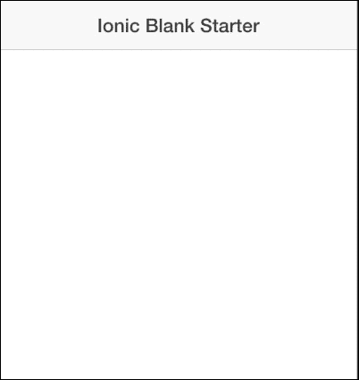
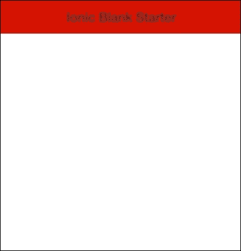

# 第七章. 自定义应用

在上一章中，我们深入探讨了 Ionic 的一些更高级的功能，如弹出和模态功能。在本章中，我们将专注于自定义 Ionic 应用。Ionic SDK 默认附带一些优秀的工具，这些工具使得自定义应用程序以适应您品牌的视觉指南变得容易。这得益于其内置的 Gulp 集成，用于构建过程的需求，以及 SCSS 用于 CSS 预处理。

Ionic 还有一个特殊的 Angular 提供者，称为 `$ionicConfigProvider`。这个提供者可以用来进行大量的配置和自定义，例如指定应用程序应使用哪种类型的动画，甚至更高级的功能，如指定您想要在缓存中保留多少缓存项。`$ionicConfigProvider` 还允许您在全局级别或按平台基础指定这些配置。

# 自定义应用的视觉和感觉

当您使用其中一个 Ionic 模板创建 Ionic 应用程序时，您现在应该已经注意到它附带了一些内置的默认 CSS 样式。很多时候，您会想知道如何在保留一些内置的 Ionic 样式的同时添加您自己的颜色和样式。

## 使用 SASS 的 Ionic 样式

这是由 Ionic 团队深思熟虑的结果，因此他们实际上使用 SCSS 创建了所有他们的 CSS 样式。SCSS 是基于 SASS 的一个独立技术，它允许您以面向对象的方式编写 CSS，然后将其编译成 CSS。SCSS 是编写 CSS 规则的一种非常酷的方式，因为它允许我们创建变量并使用它们来创建样式表。如果您对 SCSS 完全陌生，并且想了解一些关于 SCSS 的简要信息，请随时访问 [`sass-lang.com`](http://sass-lang.com)。

现在，让我们再次查看 Ionic 项目的文件夹结构，同时考虑到使用 SCSS 自定义样式。

# Ionic SCSS 概览

为了了解 Ionic 的 SCSS 结构概览，我们将创建一个全新的应用程序，使用 Ionic 空模板。我们将把这个应用程序称为 `custom-app`。以下创建这个新应用程序的命令。在您的计算机上打开一个终端窗口，切换到您选择的目录，并运行以下命令：

```js
ionic start custom-app blank

```

在您创建了新的 `custom-app` 应用程序之后，在您最喜欢的 IDE 中打开这个新项目，以了解文件夹结构概览。您应该看到以下截图中的内容：



有两个文件夹您应该特别注意。第一个文件夹是位于项目根目录中的 `scss` 文件夹。这个文件夹中有一个名为 `ionic.app.scss` 的文件；我们将更详细地查看这个文件。以下是这个文件夹的截图：


第二个文件夹也命名为 `scss`，但您可以通过从根文件夹 `www/lib/ionic/scss` 导航到以下路径来找到此文件夹。

以下截图显示了此文件夹：



现在，如果您进一步查看这个第二个 `scss` 文件夹，您应该会看到一些与以下截图相似的内容，其中包含 `scss` 文件夹中的多个 SCSS 文件：



此 `scss` 文件夹包含大量文件，您可能会想知道这些文件是做什么用的。作为本书的一部分，您不需要理解这些文件整个过程的全部内容，但您需要知道它们是包含每个 Ionic 元素 SCSS 代码的文件。整个 Ionic CSS 样式表是通过编译这些 SCSS 文件生成的。您可以选择进入这些文件以更改任何 SCSS 文件，但这可能不是一个好主意，因为您可能会破坏 SCSS 代码中的任何依赖项。因此，Ionic 提供了一种更简单的方法来实现这一点，这得益于我们之前简要提到的 `ionic.app.scss`，现在我们将对其进行详细探讨。

## ionic.app.scss 文件

`ionic.app.scss` 文件可以在项目根目录下的 `scss` 目录中找到，如下面的截图所示：


此文件是自定义您的 Ionic 应用样式最重要的文件。将此文件视为一个接口，可以覆盖 `www/lib/ionic/scss` 路径中包含的任何 SCSS 文件中的任何 SCSS 样式。如果您现在查看此 `ionic.app.scss` 文件，它应该看起来像以下代码中的内容：

```js
/*
To customize the look and feel of Ionic, you can override the variables in ionic's _variables.scss file.

For example, you might change some of the default colors:

$light:                           #fff !default;
$stable:                          #f8f8f8 !default;
$positive:                        #387ef5 !default;
$calm:                            #11c1f3 !default;
$balanced:                        #33cd5f !default;
$energized:                       #ffc900 !default;
$assertive:                       #ef473a !default;
$royal:                           #886aea !default;
$dark:                            #444 !default;
*/

// The path for our ionicon's font files, relative to the built CSS in www/css
$ionicons-font-path: "../lib/ionic/fonts" !default;

// Include all of Ionic
@import "www/lib/ionic/scss/ionic";
```

从前面的代码中，您甚至可以看到一些注释，告诉您如何使用此文件来覆盖您的 SCSS 样式。现在，在我们开始学习如何实际覆盖这些文件之前，首先让我们学习如何为我们的项目设置 SCSS。

## 设置 SCSS

在我们设置 SCSS 之前，我们首先简要地看看我们的 CSS 目前是如何集成的。当您创建一个新的 Ionic 项目时，项目默认使用两个来源的样式。

第一个来源是位于路径 `lib/ionic/css/ionic.css` 的 `ionic.css` 文件。此文件包含所有 Ionic 默认样式的已编译 CSS 代码。它只是对项目根目录相对路径 `www/lib/ionic/scss/ionic` 目录中找到的所有 SCSS 文件进行 CSS 编译。

第二个来源是位于项目根目录相对路径 `css/style.css` 的 `style.css` 文件。在您创建项目时，此文件通常是空的，并且是一个可以输入您自己的自定义 CSS 的地方，如果您不想使用 SCSS。查看以下截图中的 `index.html` 文件显示了这两个文件如何默认作为 CSS 样式表被引用：



解释到这里，我们将继续在我们的 Ionic 应用程序上设置 SCSS。

传统的设置 SCSS 可能相当具有挑战性，但 Ionic 内置了一些工具，使得这个过程变得简单。要开始设置你项目中的 SCSS，打开一个终端窗口，并简单地通过运行`cd custom-app`命令进入你项目的根目录。

下一步是在你的电脑上安装`bower`，如果你还没有安装的话。你可以通过运行以下命令来完成：

```js
npm install bower –g

```

### 注意

如果你使用的是 Linux 或 Mac 电脑，你可能需要为`sudo`命令添加前缀。这将变为`sudo npm install bower –g`。

然后，设置 SCSS 的最后一步是通过运行以下命令来完成的：

```js
ionic setup sass

```

这个命令会在幕后完成所有必要的操作，使你的项目能够与 SCSS 一起工作。完成这个命令后，你会在项目的根目录中注意到一个新的文件夹，名为`node-modules`文件夹。这是完全正常的，这个文件夹包含了使你的项目能够与 SCSS 一起工作的所有包。

到目前为止，我们已经成功地为我们的项目设置了 SCSS。你应该首先查看你的`index.html`文件。你的`index.html`应该类似于以下代码块：

```js
<!DOCTYPE html>
<html>
  <head>
    <meta charset="utf-8">
    <meta name="viewport" content="initial-scale=1, maximum- scale=1, user-scalable=no, width=device-width">
    <title></title>

    <!-- compiled css output -->
    <link href="css/ionic.app.css" rel="stylesheet">

    <!-- ionic/angularjs js -->
    <script src="img/ionic.bundle.js"></script>

    <!-- cordova script (this will be a 404 during development) -->
    <script src="img/cordova.js"></script>

    <!-- your app's js -->
    <script src="img/app.js"></script>
  </head>
  <body ng-app="starter">

    <ion-pane>
      <ion-header-bar class="bar-stable">
        <h1 class="title">Ionic Blank Starter</h1>
      </ion-header-bar>
      <ion-content>
      </ion-content>
    </ion-pane>
  </body>
</html>
```

在页眉中，你首先会注意到与之前简短讨论的内容相比，对 CSS 文件的引用已经发生了变化。现在，在`index.html`的`<head>`部分只有一个 CSS 引用指向`css/ionic.app.css`。你可能想知道这是怎么发生的。好吧，基本上，当你像我们在本章中到目前为止所做的那样设置 SCSS 时，Ionic 会自动设置 SCSS 来编译所有的 SCSS 并将它们输出到`ionic.app.css`。



如果你导航到`www/css`路径，你会看到我们现在有三个文件，而不是之前看到的那个。你会看到一个`ionic.app.css`文件和一个`ionic.app.min.css`文件。这两个文件是相同的，其中`ionic.app.min.css`是`ionic.app.css`的压缩版本。它们是我们之前检查出的所有 SCSS 文件的输出，编译成一个文件。在幕后还有许多其他事情发生以确保 SCSS 编译能够完成，但为了简单起见，我们不会在本章深入探讨这一点。

## 自定义 SCSS

要开始自定义我们的应用程序，你首先想要做的是使用本书前几章中学到的`ionic serve`技术运行你的应用程序，使用以下命令：

```js
ionic serve

```

这应该会弹出一个在浏览器中运行的应用程序，你应该看到的东西与我们以下截图中的非常相似：



### 注意

确保你从现在开始不要关闭你的终端或终止 serve 会话，以便遵循即将到来的说明。

现在来解释我们将尝试做什么，首先让我们看看这个应用头部代码。代码块是应用的代码，你可以在项目的`www`文件夹中的`index.html`文件中找到这个代码块：

```js
<!DOCTYPE html>
<html>
  <head>
    <meta charset="utf-8">
    <meta name="viewport" content="initial-scale=1, maximum- scale=1, user-scalable=no, width=device-width">
    <title></title>

    <!-- compiled css output -->
    <link href="css/ionic.app.css" rel="stylesheet">

    <!-- ionic/angularjs js -->
    <script src="img/ionic.bundle.js"></script>

    <!-- cordova script (this will be a 404 during development) -->
    <script src="img/cordova.js"></script>

    <!-- your app's js -->
    <script src="img/app.js"></script>
  </head>
  <body ng-app="starter">

    <ion-pane>
      <ion-header-bar class="bar-stable">
        <h1 class="title">Ionic Blank Starter</h1>
      </ion-header-bar>
      <ion-content>
      </ion-content>
    </ion-pane>
  </body>
</html>
```

仔细注意代表前面代码块主要视图部分的代码片段，它也在以下代码块中表示：

```js
    <ion-pane>
      <ion-header-bar class="bar-stable">
        <h1 class="title">Ionic Blank Starter</h1>
      </ion-header-bar>
      <ion-content>
      </ion-content>
    </ion-pane>
```

如果你查看开头的`<ion-header>`标签，你会看到它有一个名为`bar-stable`的类。这是一个 Ionic 内置的类，它给标题带来了一种类似浅灰色的颜色，就像我们在之前查看的截图中所看到的那样。

假设我们想要自定义这个标题以适应我们的品牌颜色，比如说，我们的品牌颜色和这个品牌恰好是我的最喜欢的红色色调，其十六进制代码为`#D71300`。

现在，你可能想进入`ionic.app.css`文件，查找 CSS 样式表中所有这个样式的出现，并更改它。但请记住，这个`ionic.app.css`是基于我们的 SCSS 文件生成的。Ionic 通过`ionic.app.scss`文件为我们提供了一个很好的方法来用 SCSS 覆盖默认样式，这个文件可以在`scss`目录中找到。我们之前已经看过这个文件，现在我们再次查看它：

```js
/*
To customize the look and feel of Ionic, you can override the variables in ionic's _variables.scss file.

For example, you might change some of the default colors:

$light:                           #fff !default;
$stable:                          #f8f8f8 !default;
$positive:                        #387ef5 !default;
$calm:                            #11c1f3 !default;
$balanced:                        #33cd5f !default;
$energized:                       #ffc900 !default;
$assertive:                       #ef473a !default;
$royal:                           #886aea !default;
$dark:                            #444 !default;
*/

// The path for our ionicons font files, relative to the built CSS in www/css
$ionicons-font-path: "../lib/ionic/fonts" !default;

// Include all of Ionic
@import "www/lib/ionic/scss/ionic";
```

前面的代码块类似于你目前在`ionic.app.scss`文件中拥有的内容。为了覆盖标题的颜色，我们将覆盖我们 SCSS 中的`$stable`变量的当前颜色。

这个代码如下所示：

```js
$stable: #D71300;
```

你应该在以下代码块的最后一行之前任何地方复制前面的代码：

```js
@import "www/lib/ionic/scss/ionic";
```

现在，你的最终代码应该类似于以下内容：

```js
/*
To customize the look and feel of Ionic, you can override the variables in ionic's _variables.scss file.

For example, you might change some of the default colors:

$light:                           #fff !default;
$stable:                          #f8f8f8 !default;
$positive:                        #387ef5 !default;
$calm:                            #11c1f3 !default;
$balanced:                        #33cd5f !default;
$energized:                       #ffc900 !default;
$assertive:                       #ef473a !default;
$royal:                           #886aea !default;
$dark:                            #444 !default;
*/

$stable: #D71300;

// The path for our ionicons font files, relative to the built CSS in www/css
$ionicons-font-path: "../lib/ionic/fonts" !default;

// Include all of Ionic
@import "www/lib/ionic/scss/ionic";
```

完成这些后，保存`ionic.app.scss`文件。通过这样做，你就完成了覆盖应用的过程，现在你的标题应该是红色的。如果你没有在浏览器中打开你的应用，或者没有运行`ionic serve`命令，请回到你的应用，你应该会看到以下截图中的类似内容：



你现在可以看到，标题现在采用了我们在`ionic.app.scss`文件中提供的十六进制代码的颜色。我们可以用这个文件覆盖任何默认文件。你所需做的只是浏览一下`lib/ionic/scss`文件夹，识别出你想要覆盖的 SCSS 规则，然后在`ionic.app.scss`中进行覆盖。

完成这些后，我们就完成了学习如何覆盖和设置我们的 Ionic 应用 SCSS 的过程。下一步是学习关于`$ionicConfigProvider`的内容。

# $ionicConfigProvider

`$ionicConfigProvider`是一个 Ionic 公开的提供者，它允许我们进行一些非常强大的配置。我们不会为这个写任何代码，因为它是一个高级特性，但你应该对其存在有很好的了解。

`$ionicConfigProvider`允许你做的某些功能包括以下内容：

+   指定你应用的过渡类型

+   设置最大缓存

+   启用/禁用动画

+   启用/启用原生滚动

+   指定标签位置

这些以及更多功能都是 `$ionicConfigProvider` 允许你调整的。记住，这个功能是一个相当高级的功能，并且很可能在不使用它的情况下完全设计你的应用。大多数应用可能不会使用它的功能，但如果你发现自己需要使用它，你可以访问 `$ionicConfigProvider` 的官方文档，查看其在 [`ionicframework.com/docs/api/provider/$ionicConfigProvider/`](http://ionicframework.com/docs/api/provider/%24ionicConfigProvider/) 上的全部潜力。

# 摘要

在本章中，我们学习了如何通过为我们的 Ionic 应用设置 SCSS 来自定义我们的应用。我们还简要地了解了 `$ionicConfigProvider` 并看到了它的一些精彩功能。在下一章中，我们将学习如何根据标签模板创建新的类型 Ionic 应用。
