# 第八章：构建简单的社交应用

在本章中，我们将专注于学习如何使用 Ionic 标签模板创建具有标签的 Ionic 应用。我们还将查看构成标签模板的一些内容，并学习如何将其添加到其中。

# Ionic 标签应用

标签是移动应用中非常常见的菜单系统。它们为用户提供了一种简单而有效的方式，在应用中创建类似应用内应用的自独立视图。

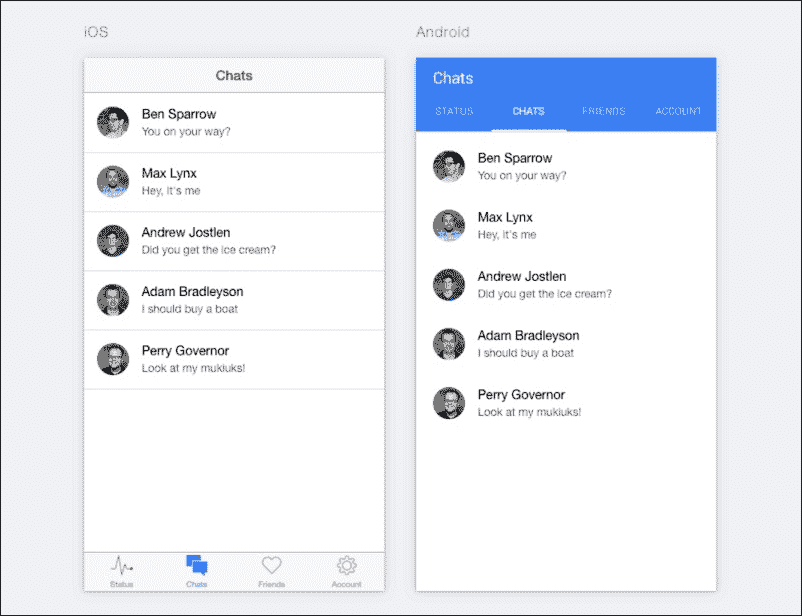

上述截图是示例 Ionic 标签应用的视图。标签菜单系统提供的一个非常棒的功能是能够在每个单独的标签菜单中保持独立上下文。无论您在应用中的哪个位置，您都可以在任何时候切换到另一个标签。标签菜单还提供了导航历史记录功能。您可以在每个标签内导航到不同的视图，并且在您在任意标签菜单之间切换时不会丢失这个导航历史记录。现在我们已经对标签应用包含的内容有了清晰的认识，让我们继续创建一个新的标签应用，并详细查看其工作方式。

## 创建 Ionic 标签应用

创建一个 Ionic 标签应用与我们在本书前几章中创建侧边菜单和空白 Ionic 应用并没有太大的不同。我们将创建一个新的 Ionic 标签应用，并将其命名为 `tabs-app`。要创建这个新应用，请打开一个终端窗口并运行以下命令：

```js
ionic start tabs-app tabs

```

使用前面的命令，您将成功创建 `tabs-app` ionic 应用。接下来，我们将对刚刚创建的应用进行概述。为此，只需在您最喜欢的 IDE 中打开 `tabs-app` 项目。您应该有一个类似于以下截图所示的项目文件夹结构：

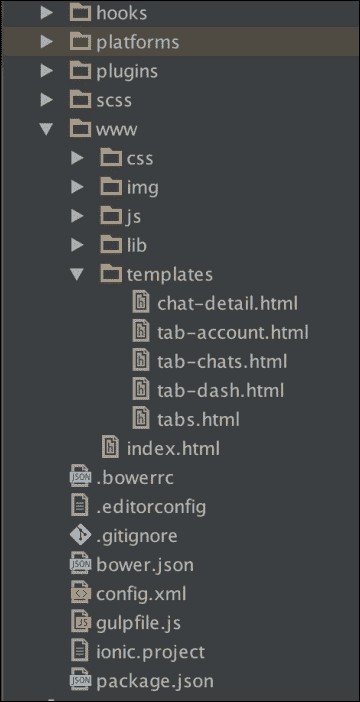

### 运行 tabs-app 应用

现在我们已经创建了我们的应用，让我们来看看它的实际运行情况。为此，请在您的计算机上打开一个终端窗口，并使用 `ionic serve` 技巧运行您的应用。

### 提示

确保您位于项目文件夹内，通过运行 `cd tabs-app`。要使用 `ionic serve` 技巧运行您的应用，请在终端中运行 `ionic serve` 命令。

您应该看到一个有三个标签的应用，其外观类似于以下截图。

+   对于 iOS：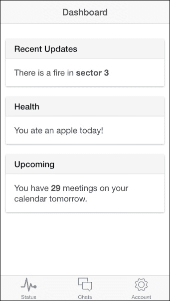

+   对于 Android：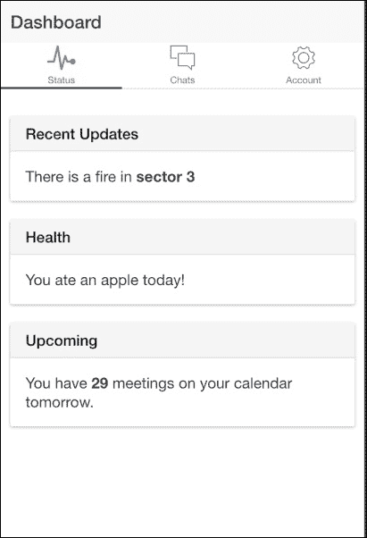

### tabs-app 应用概述

要开始理解我们的 `tabs-app` Ionic 标签应用的生命周期，我们首先需要查看我们应用的入口模块。我们的入口模块通常通过 `ng-app` 指令在应用的 `index.html` 文件中指定。

### 注意

`index.html` 文件位于你的应用程序的 `www` 目录中。

通过查看你的 `index.html` 文件，你会发现一个文件，这与以下屏幕截图中的内容非常相似：

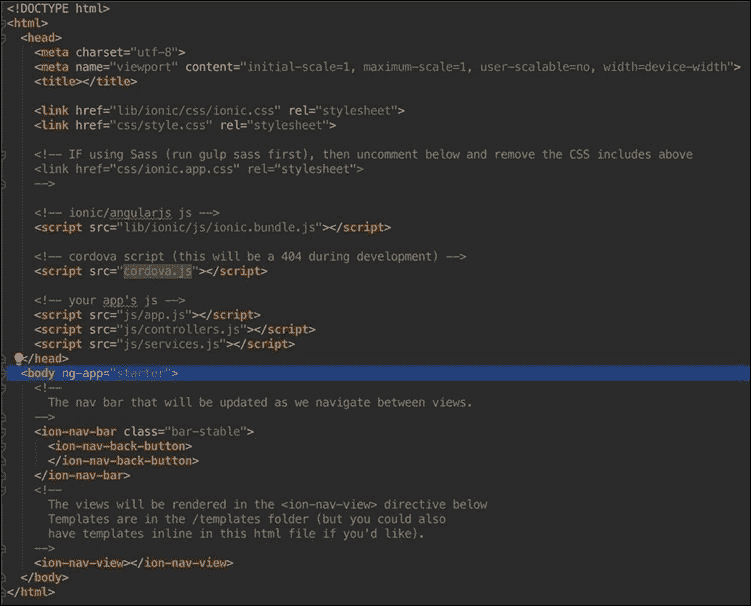

你会看到一个名为 `starter` 的 Angular 模块，它通过页面的 `<body>` 标签上的 `ng-app` 指令指定。这可以在前面的屏幕截图中看到高亮显示。这个 `starter` 模块通常位于我们的 `app.js` 文件中，我们将深入研究它以更深入地理解该模块。

### 注意

`app.js` 文件位于你的项目的 `www/js` 路径中。

打开你的 `app.js` 文件，并密切注意配置你的路由的 `.config()` 函数。特别注意名为 `tab` 的第一个路由定义。这个路由定义在下面的屏幕截图中表示：

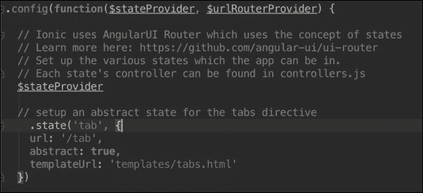

这个 `tab` 状态是一个抽象状态。在 Angular 中，一个**抽象状态**是一个你不能直接导航到的状态，但它可以包含可以被导航到的子状态。这是一种为你的状态创建某种层次结构的好方法。

根据前面屏幕截图中高亮的 tabs 状态定义，你可以看到它引用了 `templateUrl` 到位于 `templates/template.html` 目录中的 `tabs.html` 文件。为了理解 Ionic 如何与标签页一起工作，让我们来探索 `tabs.html` 文件。

### tabs.html 文件概览

当你打开你的 `tabs.html` 文件时，你会看到一些内容，这与我在以下屏幕截图中的内容非常相似：

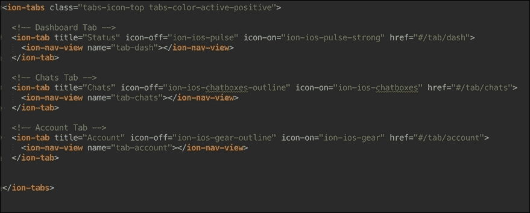

你会清楚地看到整个标记都被 `<ion-tabs>` 元素包裹。这个 `<ion-tabs>` 元素是像容器一样作用于你声明在 Ionic 标签应用中的标签页的根元素。你会看到打开的 `<ion-tabs>` 标签还有一个带有一些内置 Ionic CSS 类的 `class` 属性。这是因为 `<ion-tabs>` 元素就像其他任何元素一样，并服从某些 CSS 样式。

# `<ion-tab>` 元素

在 `<ion-tabs>` 元素内部，你会看到三个不同的 `<ion-tab>` 元素。`<ion-tab>` 元素是用来创建标签页的元素，并且必须是 `<ion-tabs>` 元素的子元素。你会注意到每个 `<ion-tab>` 元素都有一些属性。`title` 属性用于指定特定标签页将显示的标题。`icon-on` 和 `icon-off` 是用于定义当标签页处于焦点和未焦点状态时显示哪些图标的属性。最后，`href` 属性用于提供当选择特定标签页时应导航到的路由路径。

### 注意

`<ion-tab>` 元素有更多可用于不同自定义和操作的属性，这些都在官方 Ionic 文档页面上有详细说明。

在每个 `<ion-tab>` 元素中，你将找到一个 `<ion-nav-view>` 声明。`<ion-nav-view>` 是一个用于引用 Angular 视图的元素。如果你仔细观察，你会看到 `<ion-nav-view>` 元素有一个 `name` 属性，它有值。这个 `name` 属性用于指定在 `app.js` 文件中定义的特定视图的名称。如果你再次查看 `app.js` 文件，就像我们在本章前面做的那样，你会看到一些状态有视图定义。以下截图显示了 `tab.dash` 状态的清晰演示：

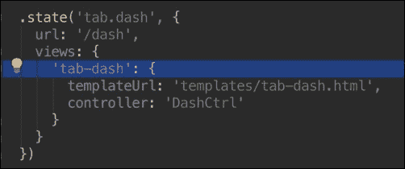

你可以看到，在 `views` 对象中有一个名为 `tab-dash` 的视图，并且这个 `tab-dash` 视图也有一个 `templateUrl` 定义以及一个类似于正常状态定义的 `controller` 定义。这就是 Ionic 提供的层次结构，使得每个标签都可以有一个独立的 `<ion-nav-view>`，其中视图被放置。为了更好地理解这个标签系统是如何工作的，我们将在我们的应用程序中添加另一个标签。

## 将标签添加到 tabs-app 应用程序

我们将添加一个新标签页，它将包含一个功能，允许用户发布消息，就像留言板一样，并看到它看起来类似于 Facebook 墙或 Twitter 墙。我们将把这个新标签页称为 `wall` 标签。要添加这个新标签，我们首先需要为我们的新标签添加路由。

### 添加新标签页的状态

要为我们的新标签页添加状态，我们需要在定义所有默认标签路由的 `app.js` 文件中定义此标签。在 `app.js` 文件中找到的 `.config()` 函数内，在标签抽象状态的 `state` 定义之后放置以下代码块：

```js
.state('tab.wall', {
    url: '/wall',
    views: {
      'tab-wall': {
        templateUrl: 'templates/tab-wall.html',
        controller: 'WallController'
      }
    }
  })
```

如果你已经正确完成，你的 `app.js` 文件的 `.config()` 函数的部分应该看起来像这样：

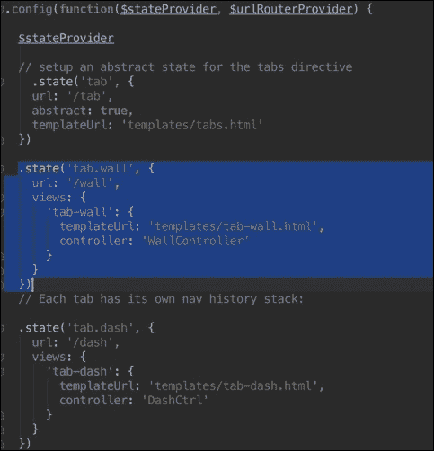

让我们尝试理解我们刚才做了什么。我们创建了一个名为 `tab.wall` 的新状态，它有一个 `/tab` 路由。这意味着我们能够作为我们的 Angular 应用程序的一部分导航到这个 `tab.wall` 状态或 `/tab` 路由。我们还创建了一个名为 `tab-wall` 的新视图，在本章的后面，我们将使用这个 `tab-wall` 视图来引用它，作为我们新创建的标签内容显示的地方。

如果你仔细查看我们的新状态定义，你会看到我们引用了一个 `templateUrl` 到路径为 `templates/tab-wall.html` 的文件和一个控制器 `WallController`，这两个我们还没有创建。我们需要创建这个 `tab-wall.html` 文件，并创建 `WallController` 控制器。

## 创建 tab-wall.html 文件

要正确创建 `tab-wall.html` 文件，我们需要确保我们在 `templates` 目录中创建它，以便它与我们在声明状态定义时传递的 `templates/tab-wall.html` 目录相匹配。

在你的 `templates` 文件夹中创建一个名为 `tab-wall.html` 的文件。如果你操作正确，你的 `templates` 目录应该看起来与以下截图中的非常相似：

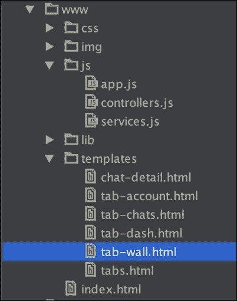

下一步是实际填充新创建的 `tab-wall.html` 文件。将以下代码块中的代码放入你的 `tab-wall.html` 文件中：

```js
<ion-view view-title="Wall">
  <ion-content class="padding">

    <div class="list">
      <div class="item item-input-inset">
        <label class="item-input-wrapper">
          <input type="text" placeholder="enter your message">
        </label>
        <button class="button button-small">
          Post
        </button>
      </div>
    </div>

    <div class="card">
      <div class="item item-text-wrap">
        This Is A Sample Message Post
      </div>
    </div>

  </ion-content>
</ion-view>
```

如果你操作正确，你的 `tab-wall.html` 应该看起来如下截图所示：

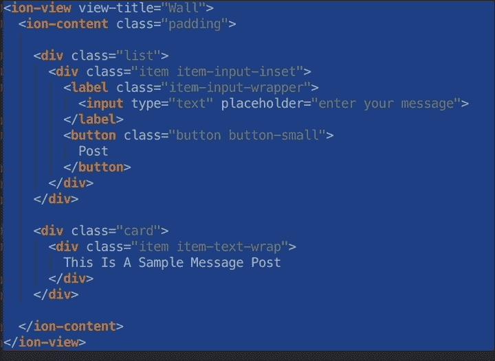

下一步是创建我们在状态定义中定义的控制器。

## 创建 WallController 控制器

要创建 `WallController` 控制器，首先我们需要打开 `controller.js` 文件。这个文件可以在与我们的 `app.js` 文件相同的文件夹中找到，即 `JS` 文件夹。你的 `controller.js` 文件应该与以下截图中的非常相似：

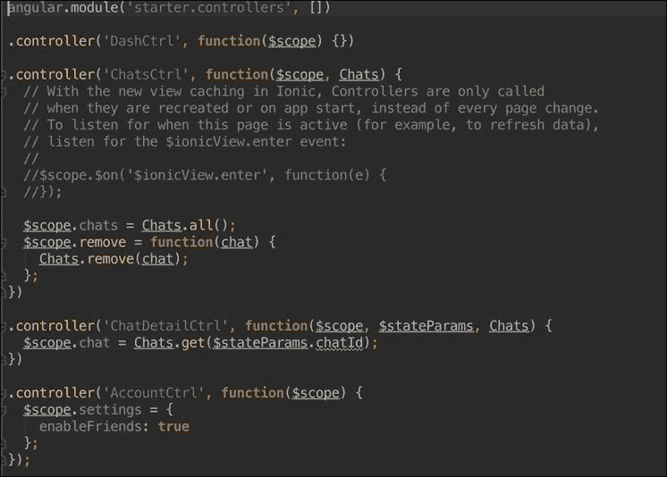

要创建 `WallController` 文件，只需将以下代码块中找到的代码放置在可以找到代码行的第一行之后，即 `angular.module('starter.controllers', [])` 这行代码之后：

```js
.controller('WallController', function($scope) {

  })
```

如果你正确复制了此代码，你的 `controller.js` 文件应该与以下截图非常相似：

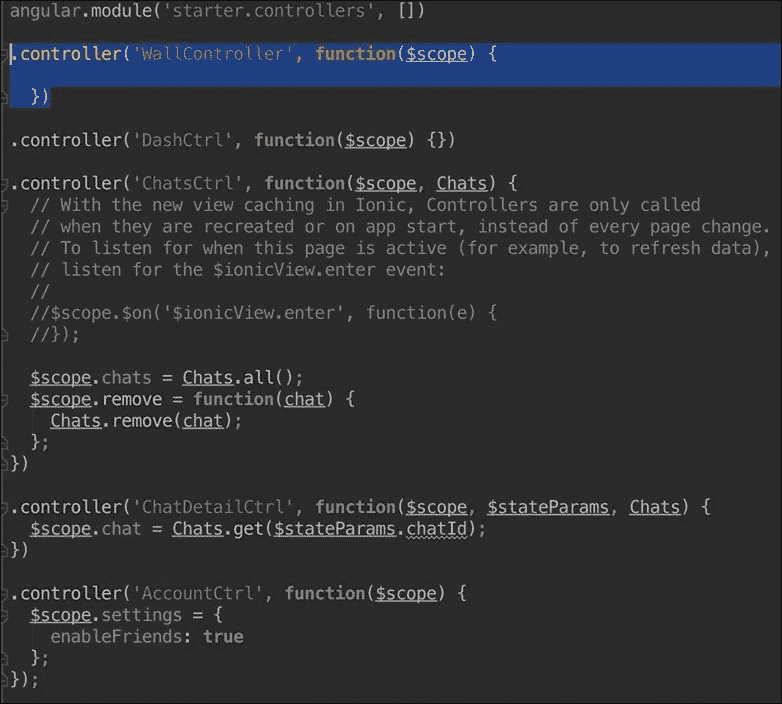

通过这样做，我们已经成功创建了 `WallController` 控制器。然而，我们还需要完成最后一步来实现我们新标签页的实现。我们需要实际创建标签页本身，使用 `<ion-tab>` 元素。

## 创建标签页

要创建我们的标签页，我们需要重新访问 `tabs.html` 文件。在文件中，找到开头的 `<ion-tabs>` 标签，并在其后放置以下代码块中提到的代码：

```js
<!-- Wall Tab -->
  <ion-tab title="Wall" icon-off="ion-ios-compose-outline" icon- on="ion-ios-compose" href="#/tab/wall">
    <ion-nav-view name="tab-wall"></ion-nav-view>
  </ion-tab>
```

如果你操作正确，你的 `tabs.html` 文件应该看起来如下截图所示：

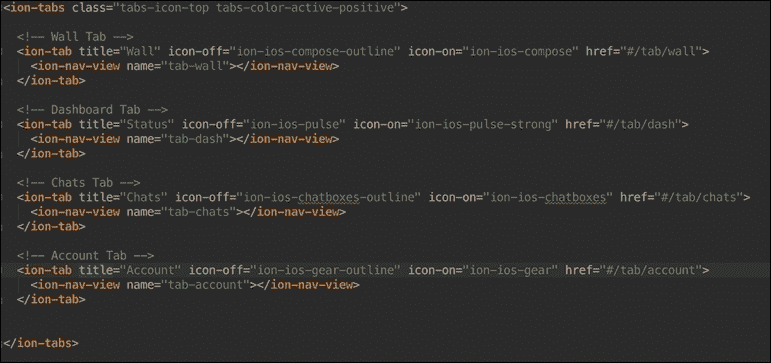

通过这样做，我们在应用程序中成功创建了一个新的标签页。让我们回顾一下我们是如何实现这一壮举的。首先，我们为我们的标签创建了一个新的状态定义，并引用了控制器和模板文件。然后我们继续创建标签本身，如前一个截图所示，使用 `<ion-tab>` 元素。

如果你查看前面的截图并仔细注意我们刚刚从代码块中复制的 `<ion-tab>`，你会看到它的 `<ion-nav-view>` 子元素有一个值为 `tab-wall` 的 `name` 属性。这仅仅是指我们在 `app.js` 文件中定义 `tab.wall` 状态时定义的视图。这些步骤完成了我们的标签实现。

现在，下一步是运行我们的应用并看到它的实际效果。为此，只需使用`ionic serve`技术运行您的应用程序。

### 注意

要使用`ionic serve`技术运行您的应用，只需从`tab-app`应用程序的根目录运行`ionic serve`。

如果您操作正确，您应该看到一些与以下截图非常相似的内容。

+   对于 iOS：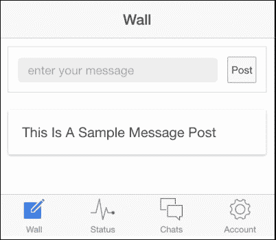

+   对于 Android：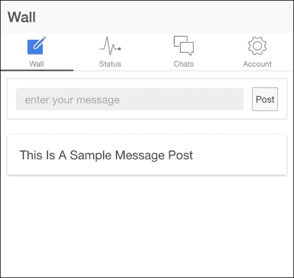

# 摘要

在本章中，我们学习了 Ionic 标签应用模板。我们还创建了一个名为`tabs-app`的标签应用，甚至添加了我们自己的新标签。在下一章中，我们将使用这个相同的应用程序来学习如何使用 Firebase 为我们的应用程序添加后端服务。
