# 第九章。连接到 Firebase

在本章中，我们将专注于学习如何使用 Firebase 将后端集成到我们的 Ionic 应用程序中。Firebase 是一种实时数据存储技术，它使用 JSON 风格的数据库结构，让您能够将数据存储在云端。我们还将使用在第八章中创建的`tabs-app`应用程序，即*Building a Simple Social App*，来学习如何将 Firebase 集成到我们的应用程序中。

# 扩展我们的 tabs-app Ionic 应用程序

在第八章 *Building a Simple Social App* 中，我们创建了`tabs-app`。如果您记得正确，我们添加了一个名为`walls`的新标签页。

我们为新增的`wall`标签页所持有的基本想法是，它将像一块公告板，用户可以在其中输入帖子，然后点击标有**发布**的按钮，在公告板上查看帖子，如下面的截图所示：

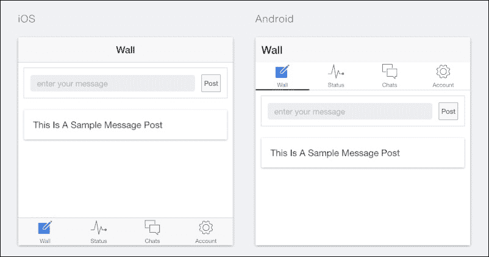

我们需要做的第一件事是实现允许用户发布的功能，因为目前我们的`tab-app`应用程序中还没有这个功能。

## 实现帖子墙功能

为了回顾我们对`wall`标签页的需求，我们希望能够在消息框中输入消息，就像前面截图所示，并且消息能够像示例消息帖子一样显示。首先，我们从在我们的控制器中实现添加帖子的代码开始。

以下代码块提供了这段代码：

```js
$scope.post = {
      message : ''
    };

    $scope.posts = [];

    $scope.addPost = function () {
      $scope.posts.unshift($scope.post);

      $scope.post = {
        message: ''
      };
    };
```

您需要在您的`WallController`控制器中复制前面代码块中提供的代码。这个`WallController`控制器位于您的`tabs-app`应用程序的`controller.js`文件中。`WallController`控制器可以在路径`www/js/controller.js`中找到。

如果您操作正确，您的`WallController`控制器将看起来如下面的截图所示：

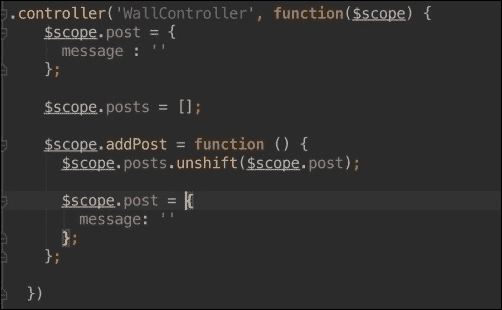

让我们了解这段代码的作用。我们只是将一个`post`对象附加到控制器上。我们还声明了一个`posts`数组，所有帖子都将存储在这个数组中。

最后，我们有一个名为`addPost()`的函数，每次它被触发时，都会将一个新的帖子添加到`posts`数组中。

下一步是将这个控制器连接到我们的`Wall`标签页的视图。这个视图的标记位于`tab-wall.html`文件中。现在，这个文件看起来如下面的截图所示：

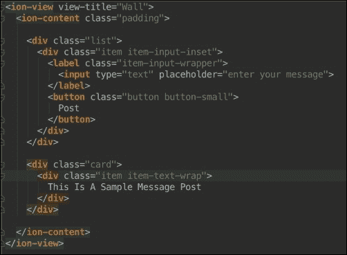

您需要完全替换`<ion-content>`中找到的标记，使用以下代码块中提供的标记：

```js
<div class="list">
      <div class="item item-input-inset">
        <label class="item-input-wrapper">
          <input type="text" placeholder="enter your message" ng-model="post.message">
        </label>
        <button class="button button-small" on-tap="addPost()">
          Post
        </button>
      </div>
    </div>

    <div class="card" ng-repeat="post in posts">
      <div class="item item-text-wrap">
        {{post.message}}
      </div>
    </div>
```

如果您操作正确，您的`tab-wall.html`文件将有一个如下截图所示的标记：

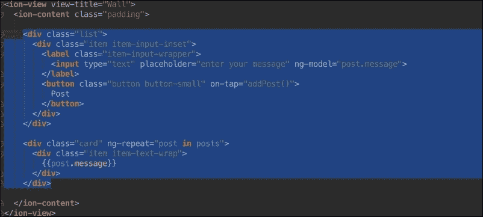

通过这样做，我们已经完成了在“墙”标签页上实现和布线我们的墙帖子功能的流程。下一步是使用`ionic serve`技术进行测试。使用`ionic serve`技术运行你的应用，你应该会在浏览器中看到你的应用正在运行。

如果你尝试在“墙”标签页中的文本框中添加消息并点击**发布**按钮，你将看到一条消息出现，就像我们在以下屏幕截图中所看到的那样：

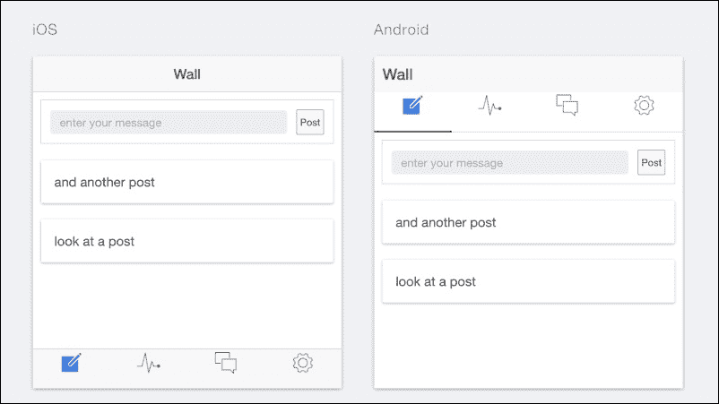

### 后端挑战

我们当前应用程序遇到的一个问题或挑战是它不具备持久性。通过这种方式，我们的意思是，一旦我们刷新浏览器，所有我们的数据都会消失，我们必须重新开始。如果我们可以输入一个帖子，当我们再次访问我们的应用时，我们可以从我们离开的地方继续，就像在其他应用中的每个消息板一样，那会多么酷啊？嗯，我们可以通过一个叫做 Firebase 的伟大技术来实现这一点。我们首先要做的是尝试理解 Firebase 以及它究竟是什么。

# Firebase

在我们开始这一章之前，非常重要的一点是我们必须理解我们将要用来集成后端的技术。这个技术被称为 Firebase。Firebase 是一种让我们能够存储实时数据的技术。与需要运行服务器的传统后端数据库不同，你不需要使用 Firebase 托管服务器。

你只需要一个活跃的 Google 账户就可以开始使用 Firebase 了。让我们设置一个新的 Firebase 账户。

如果你没有 Google 账户，你可以通过访问[`www.gmail.com`](http://www.gmail.com)来创建一个。

## 设置新的 Firebase 账户

设置你的 Firebase 账户的第一件事是访问 Firebase 网站，它是[`www.firebase.com`](http://www.firebase.com)。

你应该会看到一个看起来像我们在以下屏幕截图中所展示的屏幕：

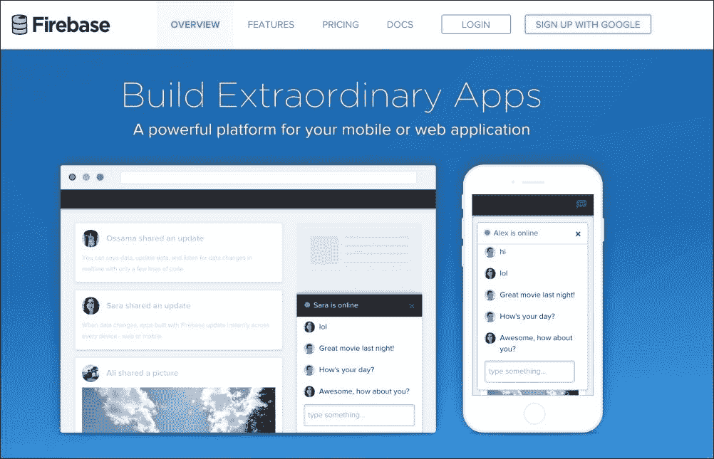

一旦完成这些，你应该会在右上角看到一个标有**使用 Google 注册**的按钮。

当你点击这个按钮时，你应该会看到一个 Gmail 窗口要求你选择或登录一个 Google 账户。在你选择了你想要使用的 Google 账户之后，你应该会被重定向到你的全新 Firebase 账户。你将被重定向到的窗口应该看起来像我们在以下屏幕截图中所展示的那样：

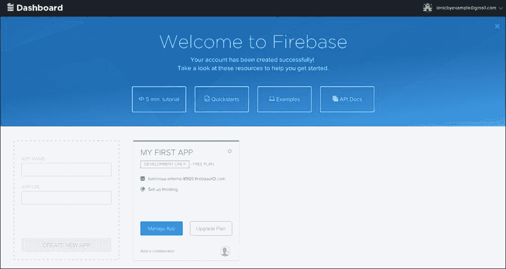

### 注意

我们这里所有的示例都是基于我们的示例账户。你不应该使用前一个屏幕截图中的 URL，而应该使用你自己在窗口中看到的 URL。如果你不这样做，你的示例将不会工作。

您会看到为您创建了一个名为**我的第一个应用**的 Firebase 应用。当使用 Firebase 时，对于每个我们创建的应用，我们也会在 Firebase 仪表板上为它创建一个应用。这是因为 Firebase 使用不同的 URL 为您提供访问您创建的每个独特应用的数据的权限。所以，将这个**我的第一个应用**Firebase 应用视为一个数据库。

现在，让我们更仔细地看看**我的第一个应用**：

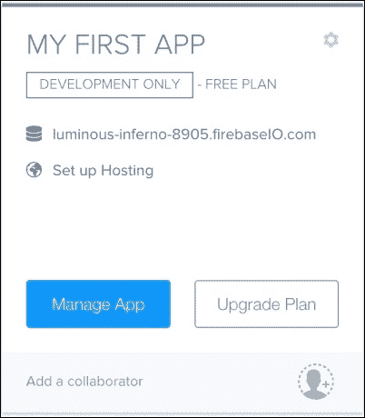

您应该看到与前述截图非常相似的内容。您可以通过点击带有`.firebaseIO.com` URL 的帖子来访问您的 Firebase 数据库的 URL。请记住，截图中的 URL 将不同于您在仪表板中看到的 URL，您应使用仪表板上的 URL。

您可以看到，我们在这里用于演示的 URL 是[luminous-inferno-8905.firebaseIO.com](http://luminous-inferno-8905.firebaseIO.com)。

点击您仪表板上的 URL，这将带您进入 Firebase 数据库，其外观应类似于以下截图：

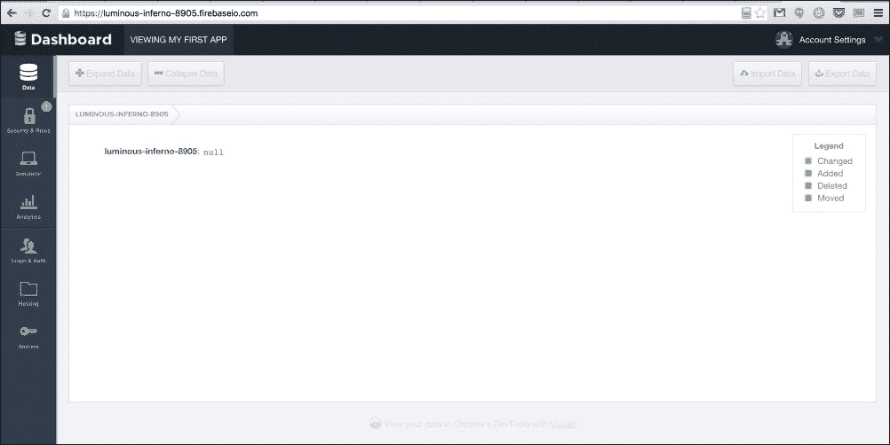

再次明确一下，Firebase 使用 URL 来访问数据库。您在前述截图中所看到的是数据库的仪表板。您也可以在浏览器的地址栏中看到相同的数据库 URL。Firebase 使用 JSON 风格的数据库结构，因此我们发送给它的是 JSON，我们存储的也是 JSON。

当我们向数据库添加数据时，我们将在仪表板中看到它。

## 将 Firebase 集成到 tabs-app 应用中

现在我们已经有了 Firebase 账户，并且知道了如何获取 Firebase 数据库的 URL，下一步是将它集成到我们的应用中。

### 添加 Firebase 和 Angular-Fire 脚本

我们需要做的第一件事是添加所需的脚本。我们需要两个脚本。第一个是 Firebase 库。第二个脚本是 Angular-Fire 库。Angular-Fire 是一个 Angular 库，它使得在 AngularJS 应用中使用 Firebase 变得更加简单。

最简单的方法是使用托管库引用。要将此添加到我们的应用中，打开您的`index.html`文件，并在应用的`<head>`部分添加以下脚本引用：

```js
<!-- Firebase -->
<script src="img/firebase.js"></script>
<!-- AngularFire -->
<script src="img/ angularfire.min.js"></script>
```

如果您操作正确，`index.html`的`head`部分应类似于以下截图：

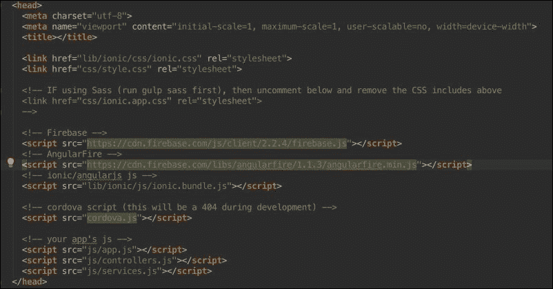

### 注意

确保您的引用位于前述截图中所见的 Ionic 包下方。这一点非常重要，否则您的应用将无法正常工作。

下一步是引用您的 Angular-Fire 模块。这一步将确保我们可以在应用中使用 Angular-Fire。此模块的名称是`firebase`。它将被添加到您的应用根模块中，在`app.js`文件中称为`starter`。

目前，此模块的声明看起来类似于以下截图：


您需要将`firebase`模块作为依赖模块添加。这样做会使模块声明看起来类似于以下截图所示：

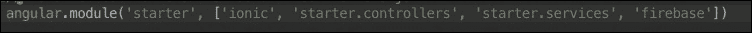

您可以看到，`firebase`模块现在作为依赖项添加到了模块声明中。通过这样做，我们已经成功地将 Firebase 集成到我们应用程序的皮肤中。下一步是实际实现它以保存我们的数据。

### 在我们的应用程序中实现 Firebase

要在我们的应用程序中实现 Firebase，我们将在`WallController`控制器中做一些工作。首先，我们需要编写代码以从数据库中提取项目。其次，我们需要编写代码以将项目添加到数据库中。

### 从数据库中提取

我们需要做的第一件事是将`$firebaseArray`服务依赖项添加到我们的`WallController`控制器中。这个服务是 Angular-Fire 库的一部分，使我们能够轻松地在 Firebase 中处理数组。

正确添加服务依赖项应该会使你的`WallController`控制器定义看起来如下截图所示：

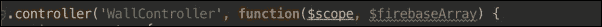

下一步是实际编写从数据库中提取数据的代码。在`WallController`控制器中复制以下代码块提供的代码：

```js
        var postsDatabaseRef = new Firebase("https://<YOUR- FIREBASE-APP>.firebaseio.com").child('posts');
    var postsData = $firebaseArray(postsDatabaseRef);
```

这段代码首先创建一个新的 Firebase 引用。我们传递了之前创建的 Firebase 数据库的 URL。请确保将占位文本（`YOUR-FIREBASE-APP`）更改为反映您的 Firebase 数据库的 URL。

在此之后，我们使用了之前添加的`$firebase`服务来创建一个名为`postData`的路径。我们需要做的最后一步是允许我们的应用程序从这个`postData`路径加载数据并使用它。为此，我们需要稍微编辑一下我们的`WallController`代码。目前，我们的`WallController`控制器的代码如下截图所示：

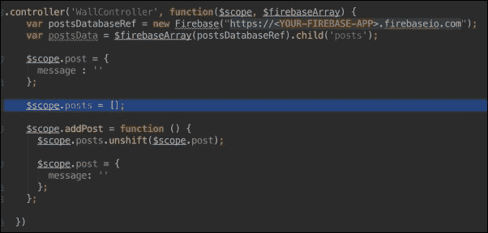

请密切注意前一张截图中所高亮的代码片段。我们需要编辑这段代码，使其不再等于一个空数组，而是等于我们的`postData`变量。正确地完成这一步应该会使我们最终得到一个如下截图所示的`WallController`控制器：

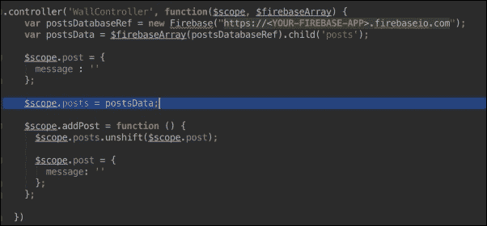

通过这样做，我们已经实现了第一部分；我们的 Firebase 实现和应用程序现在从我们的数据库加载数据。下一步是实现将我们的帖子添加到数据库中的代码。

#### 添加到数据库

向数据库添加实际上非常简单。我们只需要稍微编辑一下我们的`addPost()`函数。目前，我们的`addPost()`函数如下截图所示：

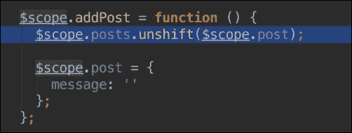

要使我们的数据在数据库中持久化，我们只需要将前面截图中突出显示的代码替换为以下代码块：

```js
      $scope.posts.$add($scope.post);
```

现在，你的`addPost()`函数应该看起来像下面截图中的那样：


我们所做的只是将`unshift()`方法更改为`$add()`方法。`$add()`方法是 Firebase 提供的一个方法，用于将项目添加到 Firebase 数据库中。到目前为止，我们已经完成了后端实现的全部工作。尽管这个过程很简单，但我们只需几个简单的步骤就建立了一个工作数据库，现在可以对其进行测试。你的最终`WallController`控制器应该看起来像以下代码块：

```js
.controller('WallController', function($scope, $firebaseArray) {
    var postsDatabaseRef = new Firebase("https://<YOUR-FIREBASE- APP>.firebaseio.com").child('posts');
    var postsData = $firebaseArray(postsDatabaseRef);

    $scope.post = {
      message : ''
    };

    $scope.posts = postsData;

    $scope.addPost = function () {
      $scope.posts.$add($scope.post);

      $scope.post = {
        message: ''
      };
    };

  })
```

要测试你的应用程序，只需使用`ionic serve`技术运行你的应用程序。当你这样做时，你应该能够在你的应用程序中输入消息，即使你刷新浏览器，你之前发布的数据仍然存在。此外，如果你查看你的数据库的 Firebase 仪表板，你将看到你在应用程序中输入的数据已经存在那里。

# 摘要

在本章中，我们学习了一些非常酷的方法，使用 Firebase 轻松地为我们的 Ionic 应用添加后端。我们只是触及了 Firebase 能让我们做什么，你可以查看[`www.firebase.com/docs/`](https://www.firebase.com/docs/)提供的 Firebase 文档，以了解 Firebase 的完整功能。

到目前为止，我们几乎已经接近本书的结尾。下一章将是最后一章，你绝对应该阅读它。它包含了一些如何利用本书中学到的技能来进一步提升使用 Ionic 能力的非常有用信息。
