# 第一章. 使用 Ionic 2 创建我们的第一个应用

在本章中，我们将涵盖以下主题：

+   设置开发环境

+   通过 CLI 创建 HelloWorld 应用

+   通过 Ionic Creator 创建 HelloWorld 应用

+   使用您的网络浏览器查看应用

+   使用 Ionic CLI 查看应用

+   使用 Xcode for iOS 查看应用

+   使用 Genymotion for Android 查看应用

+   使用 Ionic View 查看应用

# 简介

现在开发移动应用程序有很多选择。原生应用程序需要对每个平台（如 iOS、Android 和 Windows phone）进行独特的实现。在一些情况下，如高性能 CPU 和 GPU 处理以及大量内存消耗，这是必需的。任何不需要过度图形和密集 CPU 处理的应用程序都可以从成本效益、一次编写到处运行 HTML5 移动实现中受益。

对于选择 HTML5 路线的开发者来说，在这个活跃的市场中有许多不错的选择。一些选项可能很容易开始，但它们可能很难扩展或可能面临性能问题。商业选项通常对小开发者来说成本很高，难以发现产品和市场匹配。最佳实践是首先考虑用户。有些情况下，一个简单的响应式设计网站是一个更好的选择；例如，当业务主要包含固定内容且更新需求最小或内容更适合用于 SEO 时。

如下所示，Ionic 框架相对于其竞争对手具有几个优势：

+   它是基于 AngularJS 编写的。Ionic 1.x 基于 AngularJS 1.x，而 Ionic 2.0 则基于 AngularJS 2.0。

+   由于使用了 `requestAnimationFrame()` 技术，UI 性能强大。

+   它提供了一套美丽且全面的默认样式，类似于以移动设备为中心的 Twitter Bootstrap。

+   **Sass** 可用于快速、简单、有效的主题定制。

AngularJS 1.x 和 2.0 的发布之间发生了许多重大变化。所有这些变化都适用于 Ionic 2。考虑以下示例：

+   AngularJS 2.0 使用 **TypeScript**，它是 **ECMAScript 6**（**ES6**）标准的超集，将您的代码编译成 JavaScript。这允许开发者在编译步骤中利用 TypeScript 的功能，如类型检查。

+   在 AngularJS 中将不再有控制器和指令。以前，控制器被分配给 DOM 节点，而指令将模板转换为类似组件的架构。然而，由于控制器和/或指令冲突的问题，大型 AngularJS 1.x 应用程序的扩展和调试非常困难。迁移到 AngularJS 2.0 后，只有一个组件的概念，它最终有一个与 HTML 模板对应的选择器和一个包含函数的类。

+   在 AngularJS 2.0 中，`$scope`对象将不再存在，因为所有属性现在都在组件内部定义。这实际上是个好消息，因为在 AngularJS 1.x 中调试`$scope`中的错误（尤其是嵌套场景）非常困难。

+   最后，AngularJS 2.0 承诺将拥有更好的性能，并支持 ES5 和 ES6 标准。你可以使用 TypeScript、Dart 或纯 JavaScript 来编写 AngularJS 2.0。

在本章中，你将学习几个 HelloWorld 示例来 Bootstrap 你的 Ionic 应用。这个过程将为你提供一个快速骨架，以便开始构建更全面的应用。大多数应用都有类似的用户体验流程，例如标签和侧边菜单。

# 设置开发环境

在你创建第一个应用之前，你的环境必须准备好所需的组件。这些组件确保开发、构建和测试过程顺利。默认的 Ionic 项目文件夹基于 Cordova 的。因此，你需要 Ionic CLI 来自动添加正确的平台（即 iOS、Android 或 Windows 手机）并构建项目。这将确保所有 Cordova 插件都正确包含。该工具有许多选项，可以在浏览器或模拟器中运行你的应用并实现实时刷新。

## 准备工作

你需要安装 Ionic 及其依赖项以开始。Ionic 本身只是一个 CSS 样式、AngularJS 组件和标准 Cordova 插件的集合。它也是一个命令行工具，用于帮助管理所有技术，如 Cordova 和 Bower。安装过程将为你提供一个命令行来生成初始代码并构建应用。

Ionic 使用 npm 作为安装程序，它包含在安装 Node.js 时。请从[`nodejs.org/en/download/`](https://nodejs.org/en/download/)安装最新版本的 Node.js。

你需要安装 Cordova、`ios-sim`（iOS 模拟器）和 Ionic：

```js
$ npm install -g cordova ionic ios-sim

```

你可以使用这个单个命令行安装所有三个组件，而不是分别发出三个命令行。`-g`参数是为了全局安装包（而不仅仅是当前目录）。

对于 Linux 和 Mac，你可能需要使用`sudo`命令来允许系统访问，如下所示：

```js
$ sudo npm install -g cordova ionic ios-sim

```

以下是一些常见的**集成开发环境**（**IDE**）选项：

+   Xcode 用于 iOS

+   Android Studio 用于 Android

+   微软 Visual Studio Code (VS Code)

+   Sublime Text ([`www.sublimetext.com/`](http://www.sublimetext.com/))用于 Web 开发

所有这些都有免费许可。您可以直接在 Xcode 或 Android Studio 中编码，但它们对于 Web 应用来说有些重量级，尤其是在您有很多窗口打开且只需要简单编码时。Sublime Text 对非商业开发者免费，但如果您是商业开发者，则必须购买许可证。大多数前端开发者更喜欢使用 Sublime Text 进行 HTML 和 JavaScript 编码，因为它非常轻量级，并拥有一个支持良好的开发者社区。Sublime Text 已经存在很长时间，并且非常用户友好。然而，Ionic 2 中有许多功能使 Visual Studio Code 非常有吸引力。例如，它具有完整 IDE 的外观和感觉，但又不笨重。您可以直接在 VS Code 中调试 JavaScript，以及获取自动完成（例如，IntelliSense）。以下说明涵盖了 Sublime Text 和 VS Code，尽管本书的其余部分将使用 VS Code。

## 如何操作…

VS Code 在 Mac、Windows 和 Linux 上运行。以下是说明

1.  访问[`code.visualstudio.com`](https://code.visualstudio.com)。

1.  下载并为您特定的操作系统安装。

1.  解压下载的文件。

1.  将`.app`文件拖入`Applications`文件夹，并将其拖到 Mac 的 Dock 上。

1.  打开 Microsoft Visual Studio code。

1.  按*Ctrl* + *Shift* + *p* 打开命令面板。

1.  在命令面板中输入`shell command`。

1.  点击`Shell Command: 在 PATH 中安装'code'命令`命令，将脚本安装到您的终端`$PATH`中。

1.  重新启动 Visual Studio Code 以生效。

1.  之后，您可以直接从 Ionic 项目文件夹中执行`code.`（包括点）直接打开该文件夹作为项目：

    ### 注意

    注意，以下截图是通过 Mac 完成的。

    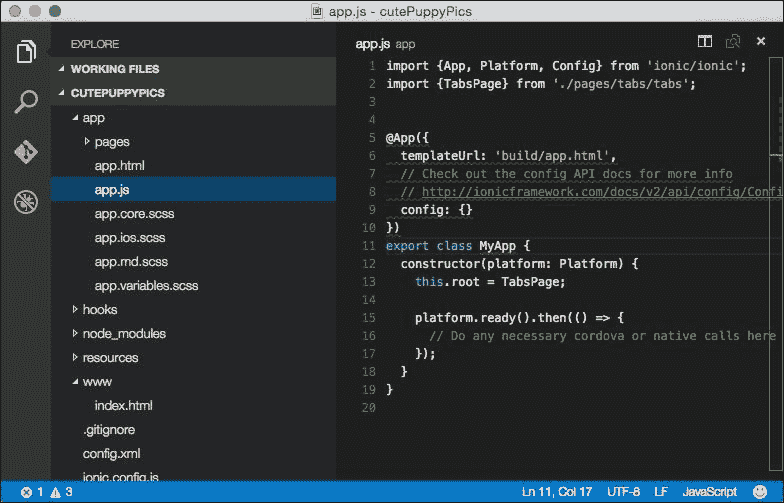

1.  如果您决定使用 Sublime Text，您将需要 Package Control ([`packagecontrol.io/installation`](https://packagecontrol.io/installation))，它类似于**插件管理器**。由于 Ionic 使用 Sass，安装 Sass 语法高亮包是可选的。

1.  导航到**Sublime Text** | **首选项** | **Package Control**：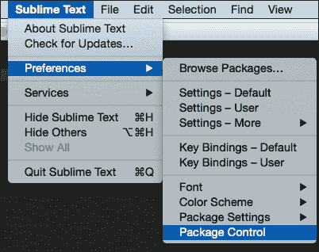

1.  前往**Package Control: 安装包**。您也可以只输入命令的部分内容（即，`inst`），它将自动选择正确的选项：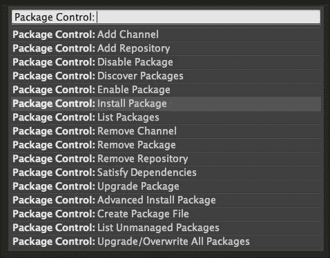

1.  输入`Sass`，搜索结果将显示一个针对**TextMate & Sublime Text**的选项。选择该选项进行安装：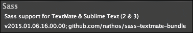

## 还有更多…

有许多 Sublime Text 包您可能想要使用，例如 HTML、JSHint、JSLint、Tag 和 ColorPicker。您可以通过[`sublime.wbond.net/browse/popular`](https://sublime.wbond.net/browse/popular)获取更多需求。

# 通过 CLI 创建 HelloWorld 应用

使用现有的模板启动应用是最快的。Ionic 通过命令行提供了以下三个标准模板：

+   **空白**：这是一个带有最小 JavaScript 代码的简单页面。

+   **标签页**：这些是带有路由的多页。一个路由 URL 会跳转到标签页。

+   **侧边菜单**：这是一个带有左右菜单和中心内容区域的模板。

## 如何做到这一点…

1.  要使用 Ionic 从空白模板设置应用，使用以下命令：

    ```js
     $ ionic start HelloWorld_Blank blank --v2

    ```

    ### 注意

    如果你没有在[ionic.io](http://ionic.io)上的账户，命令行会要求你创建。你可以按*y*或*n*继续。在这个步骤中拥有账户不是强制性的。

1.  如果你用制表符替换空白，它将创建一个标签模板，如下所示：

    ```js
     $ ionic start HelloWorld_Tabs tabs

    ```

1.  类似地，以下命令将创建一个带有侧边菜单的应用：

    ```js
     $ ionic start HelloWorld_Sidemenu sidemenu --v2

    ```

侧边菜单模板是最常见的模板，因为它提供了一个非常好的路由示例，其中包含`/app/pages`文件夹中的不同页面。

在 GitHub 页面[`github.com/driftyco/ionic-cli`](https://github.com/driftyco/ionic-cli)上提供了关于 Ionic CLI 的额外指导。

## 它是如何工作的…

本章将向你展示如何快速启动你的代码库并可视化结果。关于 AngularJS 2.0 及其模板语法的更多细节将在本书的各个章节中讨论。然而，核心概念如下：

+   **组件**：AngularJS 2.0 非常模块化，因为你可以将代码写在文件中，并使用导出类将其转换为组件。如果你熟悉 AngularJS 1.x，这类似于控制器以及它与 DOM 节点的绑定。组件将拥有自己的私有和公共属性和方法（即函数）。要判断一个类是否是 AngularJS 组件，你必须使用`@Component`装饰器。这是 TypeScript 中的另一个新概念，因为你可以对任何类施加特性（元数据），使它们以某种方式行为。

+   **模板**：模板是一个 HTML 字符串或一个单独的`.html`文件，它告诉 AngularJS 如何渲染组件。这个概念与其他任何前端和后端框架非常相似。然而，AngularJS 2.0 有自己的语法，允许在 DOM 上执行简单的逻辑，例如重复渲染（`*ngFor`）、事件绑定（点击）或自定义标签（`<my-tag>`）。

+   **指令**：这允许你操作 DOM，因为指令绑定到了一个 DOM 对象上。所以，`*ngFor`和`*ngIf`就是指令的例子，因为它们会改变该 DOM 的行为。

+   **服务**：这指的是管理模型或复杂逻辑集合的抽象，除了 get/set 所需之外。没有像组件那样的服务装饰器。所以，任何类都可以是服务。

+   **管道**：这主要用于在模板中处理表达式并返回一些数据（即四舍五入数字和添加货币），使用`{{ expression | filter }}`格式。例如，`{{amount | currency}}`如果`amount`变量是`100`，将返回`$100`。

Ionic 会自动创建一个项目文件夹结构，其结构如下所示：

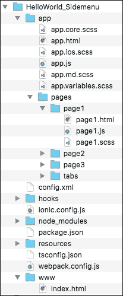

你将大部分时间花在`/app`文件夹中，因为你的应用组件将放置在这里。这与 Ionic 1.x 非常不同，因为这里的`/www`文件夹实际上是由 TypeScript 编译的。如果你为 iOS 构建应用，Ionic 构建命令行也会在`/platforms/ios/www`创建另一个副本，这是专门为 Cordova 指向的。AngularJS 2.0 中的另一个有趣的变化是，所有自定义 JS 和 CSS 文件都放置在同一个子文件夹或`/app/pages`中。由于 AngularJS 2.0 是基于组件的，每个组件都会包含 HTML、CSS 和 JS。如果你添加更多的 JavaScript 模块，你可以将它们放在`/app`文件夹中，或者更好的做法是使用`npm install`，这样它就会自动添加到`/node_modules`文件夹中。Ionic 2 完全摒弃了 Grunt 和 Bower。所有内容都简化为`package.json`，其中将列出你的第三方依赖项。

没有必要手动修改`/platforms`或`/plugins`文件夹，除非需要进行故障排除。否则，Ionic 或 Cordova CLI 将自动化这些文件夹中的内容。

默认情况下，从 Ionic 模板中，AngularJS 应用名称被称作`MyApp`。你会在`app.js`中看到类似的内容，这是整个应用的启动文件：

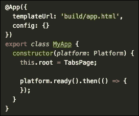

这充当着你的应用`根`目录，所有内容都将注入到`index.html`中的`<ion-app></ion-app>`内。

注意，如果你双击`index.html`文件在浏览器中打开它，会显示一个空白页面。这并不意味着应用没有工作。原因是 Ionic 的 Angular 组件会动态加载所有的`.js`文件，这种行为需要通过`http://`协议进行服务器访问。如果你在本地打开文件，浏览器会自动将其视为文件协议（`file://`），因此 Angular 将无法加载额外的`.js`模块以正确运行应用。有几种运行应用的方法，稍后将会讨论。

# 通过 Ionic Creator 创建 HelloWorld 应用

另一种开始你的应用代码库的方法是使用**Ionic Creator**。这是一个优秀的界面构建器，可以通过拖放风格加速你的应用开发。你可以快速将现有的组件拖放到基于 Web 的界面中，以可视化它们在应用中的样子。最常见的组件，如按钮、图片和复选框，都是可用的。

Ionic Creator 允许用户将所有`.html`、`.css`和`.js`文件作为一个项目导出。你应该能够编辑`/app`文件夹中的内容，以构建在界面之上。

## 准备工作

使用 Ionic Creator 开始之前，需要在[`creator.ionic.io/`](https://creator.ionic.io/)注册一个免费账户。

## 如何操作…

1.  创建一个名为**myApp**的新项目：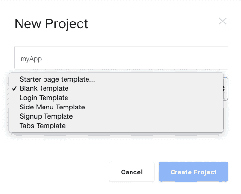

1.  验证以确保你看到以下屏幕：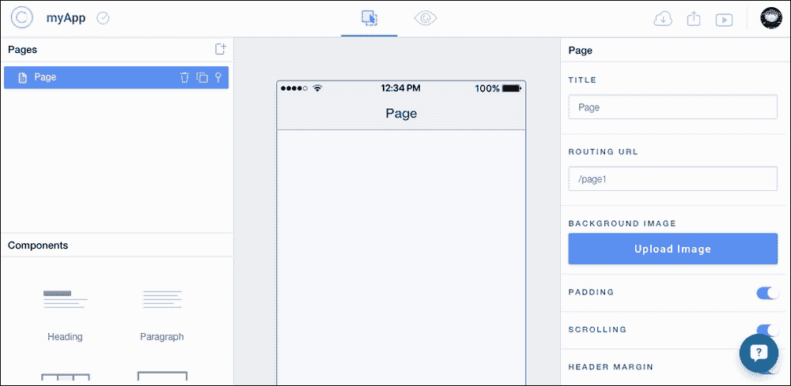

    中心区域是你的应用界面。左侧为你提供了一个**页面**列表。每个页面是一个单独的路由。你还可以访问许多 UI 组件，你通常需要在 html 文件中手动编码。右侧面板显示了任何选中组件的属性。

    你可以在这里自由地做任何需要的事情，只需将组件拖放到中心屏幕即可。如果你需要创建一个新页面，你必须点击**页面**面板中的加号。每个页面都表示为链接，这基本上是 Angular UI Router 定义中的一个路由。要导航到另一个页面（例如，点击按钮后），你只需更改链接属性并指向该页面。

    顶部有一个编辑按钮，你可以在此之间切换编辑模式和预览模式。看到你的应用将如何看起来和表现是非常有用的。

1.  完成后，点击导航栏顶部的导出按钮。你有以下四个选项：

    +   使用 Ionic CLI 工具获取代码

    +   将项目作为 ZIP 文件下载

    +   将其导出到原生代码（类似于 PhoneGap Build），如图所示：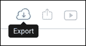

    +   使用 Creator 应用将其导出到预览模式，如下所示：

    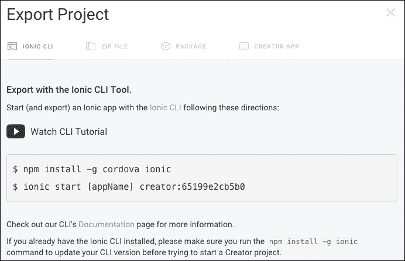

学习 Ionic Creator 的最佳方式是亲自尝试。你可以添加一个新页面并选择任何现有的模板。以下示例显示了**登录**页面模板：

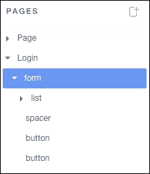

这是它应该看起来的样子（导出或下载后）：

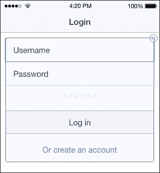

## 还有更多…

要切换到预览模式，在那里你可以看到设备模拟器中的 UI，请点击右上角的切换按钮以启用测试，如图所示：


在这种模式下，你应该能够像它们实际部署在设备上一样，在网页浏览器中与组件进行交互。

如果你弄坏了某些东西，重新开始一个新项目非常简单。这是一个用于原型设计和获取初始模板或项目框架的出色工具。你应该继续在常规 IDE 中编码其余的应用程序。Ionic Creator 目前还不能为你做所有事情。例如，如果你想访问特定的 Cordova 插件功能，你必须单独编写那段代码。

此外，如果你想在 Ionic Creator 允许的范围之外调整界面，也需要对`.html`和`.css`文件进行特定的修改。

# 使用你的网页浏览器查看应用

为了运行网络应用，您需要将您的 `/www` 文件夹变成一个网络服务器。再次强调，有很多人方法可以做到这一点，人们倾向于坚持一两种方法以保持简单。一些其他选项可能不可靠，例如 Sublime Text 的实时观察包或静态页面生成器（例如，Jekyll 和 Middleman 应用）。它们检测更改的速度很慢，可能会冻结您的 IDE。因此，这里不会提及这些。

## 准备工作

推荐的方法是使用 `ionic serve` 命令行。它基本上启动了一个 HTTP 服务器，这样您就可以在桌面浏览器中打开您的应用。

## 如何操作…

1.  首先，您需要处于 `project` 文件夹中。假设它是 Side Menu HelloWorld：

    ```js
     $ cd HelloWorld_Sidemenu

    ```

1.  从那里，只需发出简单的命令行，如下所示：

    ```js
     $ ionic serve

    ```

就这样！您不需要进入 `/www` 文件夹或找出要使用的端口号。当网络服务器运行时，命令行将提供以下选项：

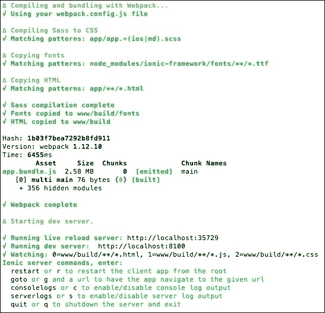

这里最常用的选项是 `r` 用于重启或 `q` 用于完成工作后退出。

查看具有正确设备分辨率的应用的额外步骤：

1.  如果您的电脑上还没有安装 Google Chrome，请安装它。

1.  在 Google Chrome 中打开 ionic serve 中的链接（例如，`http://localhost:8100/`）。

1.  打开开发者工具。例如，在 Mac 的 Google Chrome 中，导航到 **查看** | **开发者** | **开发者工具**。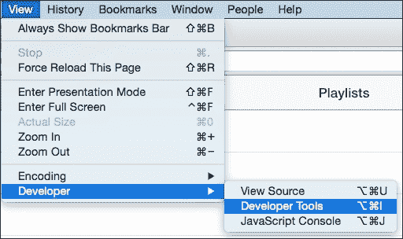

1.  在 Chrome 开发者工具区域单击小型的移动图标，如图所示：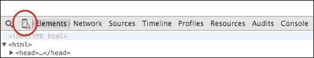

1.  将会显示一个长长的设备列表供您选择，如下所示：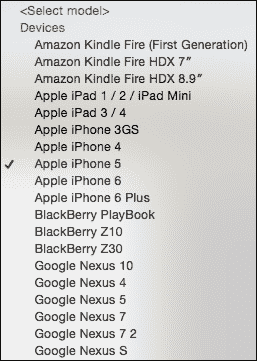

1.  选择设备后，您需要刷新页面以确保 UI 已更新。Chrome 应该会给出设备的精确视图分辨率。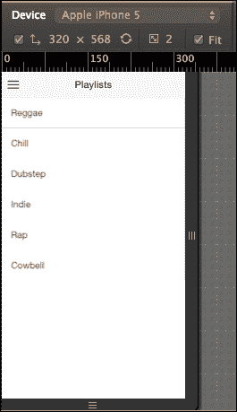

大多数开发者更喜欢使用这种方法进行编码，因为您可以使用 Chrome 开发者工具调试应用。它的工作方式与任何其他网络应用完全相同。您可以在控制台创建断点或输出变量。

## 它是如何工作的…

注意，ionic serve 实际上正在监视 `/app` 文件夹下的所有内容，并在 `/www` 下即时将 TypeScript 代码编译成 JavaScript。这很有道理，因为系统不需要扫描每个文件，因为其更改的概率非常小。

当网络服务器运行时，您可以返回到 IDE 并继续编码。例如，让我们打开 `page1.html` 或任何其他模板文件，并将其第一行更改为以下内容：

```js
<ion-view view-title="Updated Playlists">
```

返回到 Ionic 打开新页面的网页浏览器；应用界面会立即更改标题栏，无需您刷新浏览器。当需要在代码更改和检查应用的实际工作或外观之间来回切换时，这是一个非常棒的功能。

# 使用 Ionic CLI 查看应用

到目前为止，你已经测试了 Ionic 的 Web 应用程序部分。大多数时候，你需要实际上在物理设备或至少在模拟器上运行应用程序，以查看应用程序的行为以及所有原生功能是否正常工作。

## 准备工作

你需要安装模拟器。iOS 模拟器在执行`npm install -g ios-sim`时安装，Android 模拟器随 Android Studio 一起安装。要在物理设备上测试应用程序，你必须通过 USB 连接将设备连接到你的计算机。

## 如何做到这一点...

1.  使用以下命令行添加特定的平台（例如 iOS）并构建应用程序：

    ```js
     $ ionic platform add ios
     $ ionic build ios

    ```

    ### 注意

    注意，在构建应用程序之前，你需要执行`platform add`。然而，如果你使用 Ionic CLI 的标准模板，它应该已经包含了 iOS 平台。要为 Android 构建和运行，你可以将 iOS 替换为 Android。

1.  要使用 iOS 模拟器模拟应用程序，请使用以下命令行：

    ```js
     $ ionic emulate ios

    ```

1.  要在真实的物理 iPhone 设备上运行应用程序，请使用以下命令行：

    ```js
     $ ionic run ios --device

    ```

# 使用 Xcode 为 iOS 查看应用程序

你也可以使用 Mac 上的 Xcode 运行应用程序。

## 如何做到这一点...

1.  前往`/platforms/ios`文件夹。

1.  查找包含`.xcodeproj`的文件夹，并在 Xcode 中打开它。

1.  点击 iOS 设备图标，并选择你选择的 iOS 模拟器：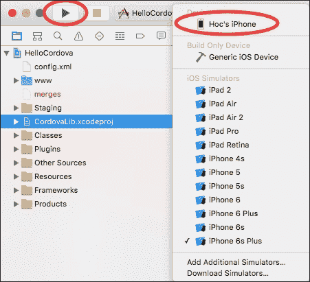

1.  点击运行按钮，你应该能在模拟器中看到应用程序正在运行。

## 还有更多…

你可以通过 USB 端口连接一个物理设备，它将出现在 iOS 设备列表中供你选择。然后，你可以在你的设备上直接部署应用程序。请注意，此方法需要 iOS 开发者会员资格。这种方法比仅通过网页浏览器查看应用程序更复杂。

然而，当你想要测试与设备功能相关的代码时，例如相机或地图，这是必须的。如果你在`/app`文件夹中更改代码并想在 Xcode 中再次运行它，你必须首先执行`ionic build ios`，因为正在运行的代码位于你的 Xcode 项目的`Staging`文件夹中，如图所示：

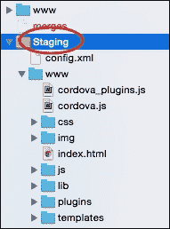

对于调试，Xcode 控制台也可以输出 JavaScript 日志。然而，你可以使用 Safari 的**Web Inspector**（类似于 Google Chrome 的开发者工具）的高级功能来调试你的应用程序。请注意，只有 Safari 可以调试在连接的物理 iOS 设备上运行的 Web 应用程序，因为 Chrome 在 Mac 上不支持这一点。启用此功能很容易，可以通过以下步骤完成：

1.  通过导航到`设置` | **Safari** | **高级**并启用**Web** **Inspector**来允许 iOS 设备进行远程调试：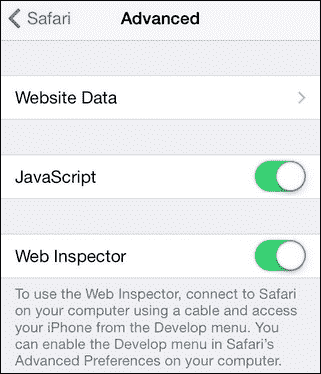

1.  通过 USB 将物理 iOS 设备连接到你的 Mac 并运行应用程序。

1.  打开 Safari 浏览器。

1.  选择**开发** | **你的设备名称（或 iOS 模拟器）** | **index.html**，如图所示：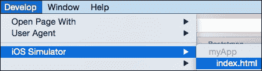

    ### 注意

    如果你没有在 Safari 中看到 **Develop** 菜单，你需要导航到 **Preferences** > **Advanced** 并勾选 **Show Develop menu in menu bar**

Safari 将为该特定设备打开一个新的控制台，就像它在计算机的 Safari 中运行时一样。

# 使用 Genymotion for Android 查看应用

虽然安装 Google Android 模拟器是可能的，但许多开发者在 Mac 上有不一致的体验。有许多商业和免费的替代品提供了更多便利和广泛的设备支持。**Genymotion** 提供了一些独特的优势，例如允许用户切换 Android 模型和版本，支持从应用内部进行网络连接，并允许模拟 SD 卡。

在本节中，你将学习如何首先设置 Android 开发环境（在本例中为 Mac）。然后，你将安装和配置 Genymotion 以进行移动应用开发。

## 如何操作…

1.  第一步是正确设置 Android 开发环境。从 [`developer.android.com/studio/index.html`](https://developer.android.com/studio/index.html) 下载并安装 Android Studio。

    ### 注意

    如果你的机器没有正确的依赖项，可能会要求你安装其他库。如果是这种情况，你应该在命令行中运行 `sudo apt-get install lib32z1 lib32ncurses5 lib32bz2-1.0 lib32stdc++6` 来安装。

1.  运行 Android Studio。

1.  你需要安装所有必需的包，例如 Android SDK。只需在设置向导屏幕上点击 **Next** 两次，然后点击 **Finish** 按钮开始安装包。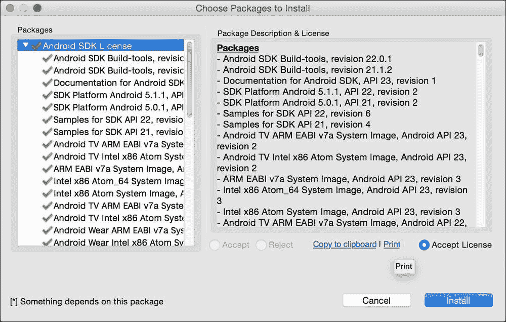

1.  安装完成后，你需要安装额外的包和其他 SDK 版本。在 **Quick Start** 屏幕上，选择 **Configure**，如图所示：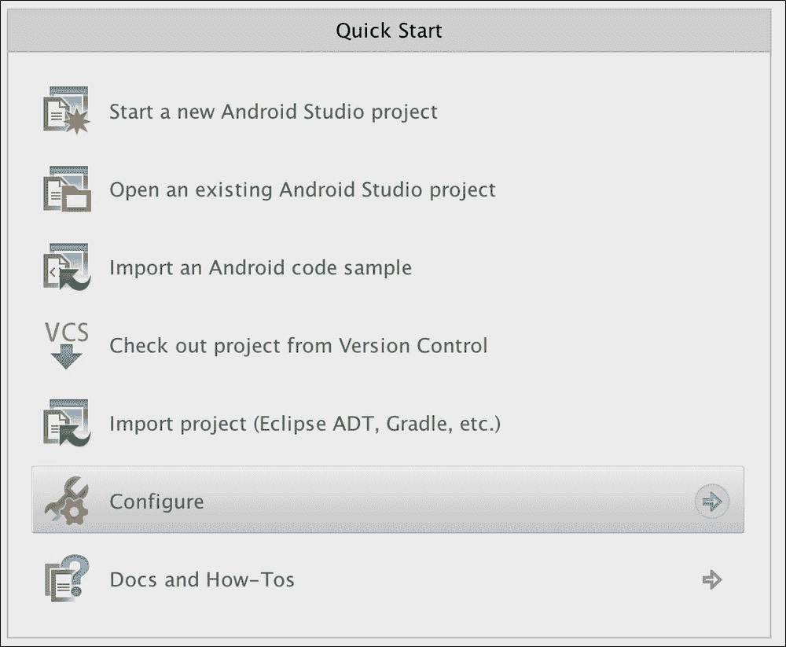

1.  然后，选择 **SDK** **Manager**，如图所示：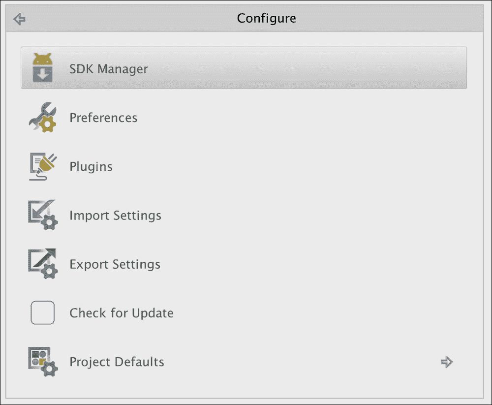

1.  安装上一个版本，例如 **Android** **5.0.1** 和 **5.1.1** 是一个好习惯。你可能还希望安装所有 `Tools` 和 `Extras` 以供以后使用：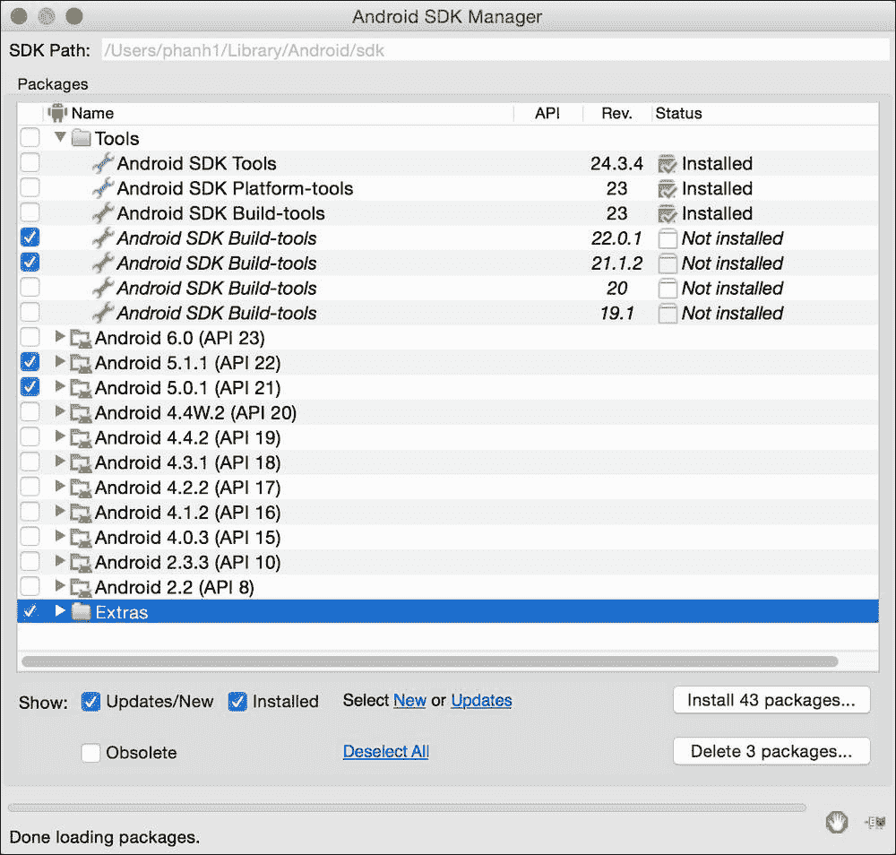

1.  点击 **Install packages…** 按钮。

1.  勾选 **Accept License** 复选框并选择 **Install**。

1.  SDK Manager 将在顶部显示一个 SDK 路径。复制此路径，因为你需要修改环境路径。

1.  前往终端并输入以下命令：

    ```js
     $ touch ~/.bash_profile; open ~/.bash_profile.

    ```

1.  这将打开一个文本编辑器以编辑你的 `bash profile` 文件。在 `/YOUR_PATH_TO/android-sdk` 应该是之前复制的 SDK 路径的位置插入以下行：

    ```js
     export ANDROID_HOME=/YOUR_PATH_TO/android-sdk
     export PATH=$ANDROID_HOME/platform-tools:$PATH
     export PATH=$ANDROID_HOME/tools:$PATH

    ```

1.  保存并关闭该文本编辑器。

1.  返回终端并输入。

    ```js
     $ source ~/.bash_profile
     $ echo $ANDROID_HOME

    ```

1.  你应该看到输出你的 SDK 路径。这验证了你已经正确配置了 Android 开发环境。

1.  下一步是安装和配置 Genymotion。从 [genymotion.com](http://genymotion.com) 下载并安装 Genymotion 和 Genymotion Shell。

1.  运行 Genymotion。

1.  点击**添加**按钮以开始添加新的 Android 设备，如图所示：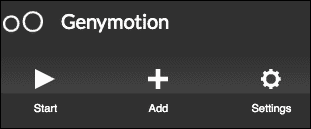

1.  选择您想要模拟的设备。在本例中，让我们选择**三星 Galaxy S5**，如下所示：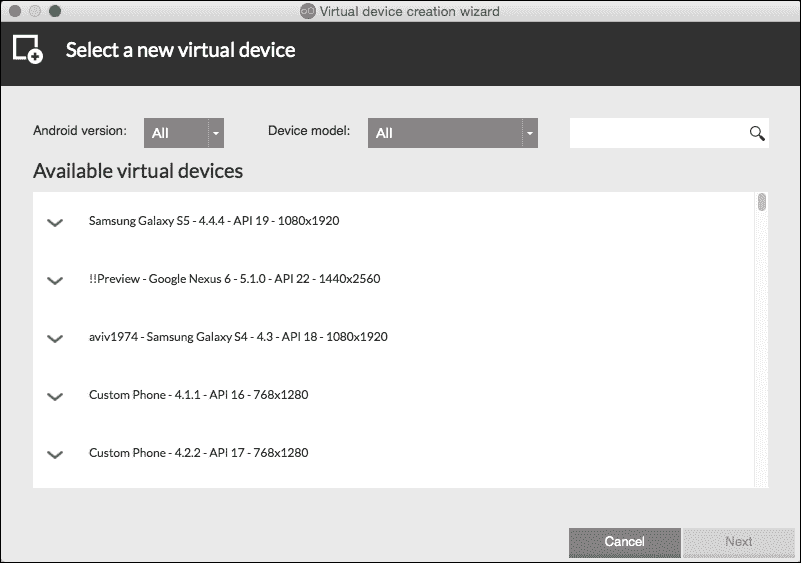

1.  您将看到设备正在添加到您的虚拟设备中。点击该设备。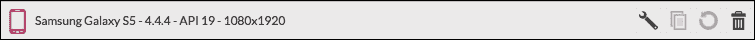

1.  然后点击**开始**：

1.  模拟器将花费几秒钟时间启动，并显示另一个窗口。这是一个还没有运行您的应用的空白模拟器：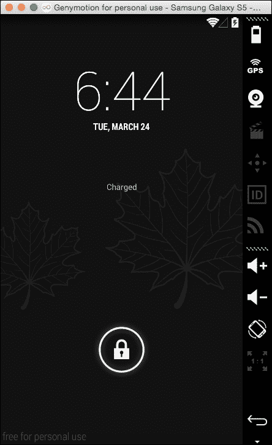

1.  运行 Genymotion Shell。

1.  从 Genymotion Shell 中，您需要获取设备列表并保留连接的设备的 IP 地址，即三星 Galaxy S5。输入`devices list:`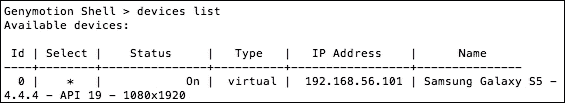

1.  输入`adb connect 192.168.56.101`（或从`设备列表`命令行中看到的任何 IP 地址）。

1.  输入`adb devices`以确认它已连接。

1.  输入`ionic platform add android`以将 Android 添加为您的应用平台。

1.  最后，输入`ionic run android`。

1.  您应该能够看到显示您的应用的 Genymotion 窗口。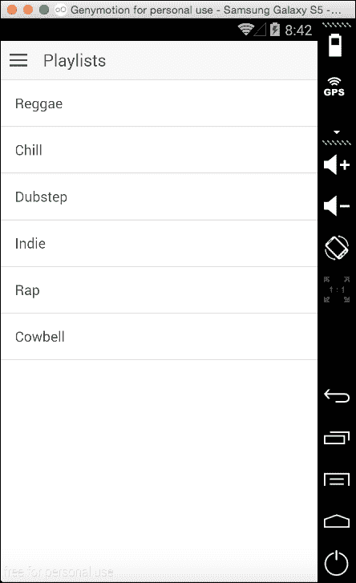

虽然要使此功能正常工作需要许多步骤，但您不必重复相同的过程的可能性要小得多。一旦您的环境设置完成，您需要做的就是保持 Genymotion 运行，同时编写代码。如果需要在不同 Android 设备上测试应用，很容易在 Genymotion 中添加另一个虚拟设备并连接到它。

# 使用 Ionic View 查看应用

**Ionic View**是一个可以从 App Store 或 Google Play 下载的应用查看器。在开发过程中，当应用尚未完成时，您不想立即将其提交给 Apple 或 Google，但希望限制测试者的访问。Ionic View 可以帮助在 Ionic View 中加载您的应用，并使其像真实应用一样运行，同时可以访问一些原生设备功能。此外，Ionic View 还允许您在 iOS 设备上使用您的应用，而无需任何证书要求。

由于 Ionic View 使用 Cordova **InAppBrowser**插件来启动您的应用，因此必须对设备功能进行破解才能使其工作。目前，Ionic View 仅支持 SQLite、电池、摄像头、设备运动、设备方向、对话框/通知、地理位置、全球化、网络信息、振动、键盘、状态栏、条形码扫描器和 zip。在使用 Ionic View 之前检查更新的支持列表是一个好主意，以确保您的应用能够正常运行。

## 如何操作…

使用 Ionic View 有两种方式。您可以选择上传自己的应用或加载他人的应用 ID。如果您测试自己的应用，请按照以下步骤操作：

1.  从 App Store 或 Google Play 下载 Ionic View。

1.  确保在[ionic.io](http://ionic.io)上注册一个账户。

1.  前往您应用的`项目`文件夹。

1.  搜索 ionic upload。

1.  输入您的凭证。

1.  CLI 会上传整个应用并给你一个应用 ID，在本例中为`152909f7`。你可能想保留这个应用 ID 以便稍后与其他测试人员分享。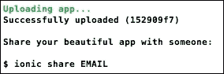

1.  在移动设备上打开 Ionic View 应用，如果你还没有登录，请登录。

1.  现在，你应该能在你的**我的应用**页面上看到应用名称。请继续选择应用名称（在本例中为**myApp**），如图所示：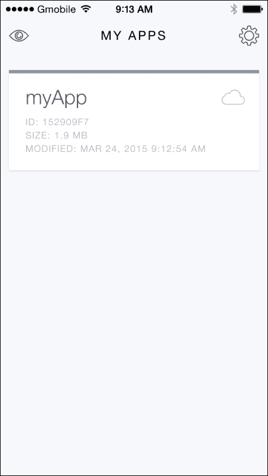

1.  选择**查看应用**来运行应用，如图所示：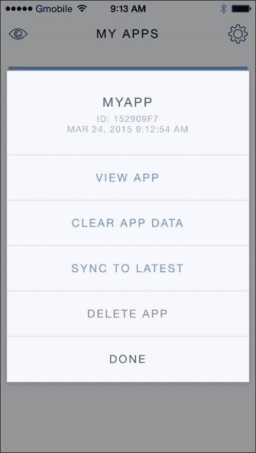

1.  你会看到应用界面出现初始说明，说明如何退出应用。由于你的应用将覆盖 Ionic View 的全屏，你需要像图示那样用三根手指向下滑动，才能返回到 Ionic View：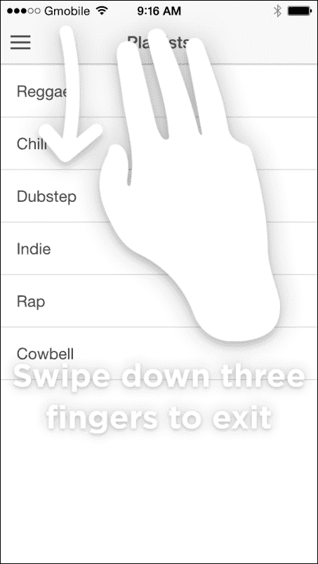

如果没有代码更新，过程相同，只是你需要从菜单中选择**同步到最新**。

## 还有更多…

总结来说，使用 Ionic View 有几个好处，以下是一些：

+   这很方便，因为只有一个命令行可以推送应用

+   任何人都可以通过输入应用 ID 来访问你的应用

+   即使没有 iOS 开发者会员资格，你也可以开始使用 Ionic 进行开发。苹果有自己的`TestFlight`应用，其用例非常相似

+   你可以通过在开发过程中让测试人员测试你的应用来保持开发过程的敏捷性

+   Ionic View 支持广泛的设备功能，并且还在不断增长
