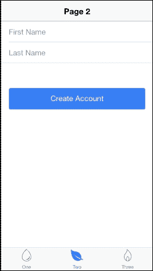
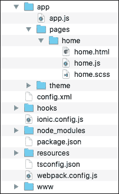
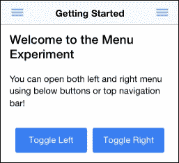
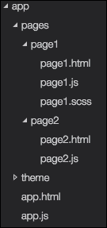
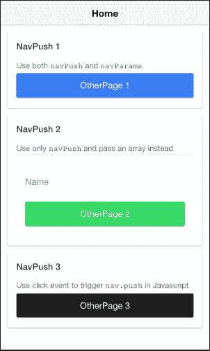
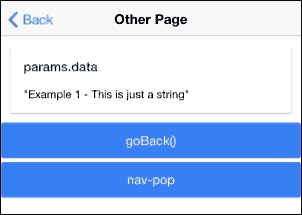

# 第二章。添加 Ionic 2 组件

在本章中，我们将介绍与使用 Ionic 2 组件相关的以下任务：

+   使用标签添加多个页面

+   添加左右菜单导航

+   使用状态参数导航多个页面

# 简介

可以用几页简单编写一个应用。Ionic 提供了许多开箱即用的组件，允许简单的即插即用操作。当应用增长时，管理不同视图及其在特定时间或触发事件时的自定义数据可能会非常复杂。Ionic 2 在处理状态和导航方面有一些变化。在 Ionic 1 中，您可以使用 UI-Router 进行高级路由管理机制。在 Ionic 2 中，`NavController`将启用导航的 push/pop 实现。

由于 Ionic 2 引入了许多新的组件，您必须了解这些组件如何影响您的应用状态层次结构以及何时触发每个状态。

# 使用标签添加多个页面

本节将解释如何使用 Ionic 标签界面，并扩展它以适应其他情况。所使用的示例非常基础，包含三个标签和每个标签中的一些示例 Ionic 组件。这是您将在许多应用中找到的一个非常常见的结构。您将学习 Ionic 2 如何构建标签界面，以及它如何转换为单独的文件夹和文件。

在此示例中，您将构建三个标签，如下所示：

+   展示一个仅包含文本的简单页面，以说明组件应放置的位置

+   展示注册表单

+   展示水平滑块框

虽然应用非常直接，但它将教会您许多 Angular 2 和 Ionic 2 的关键概念。其中一些是组件装饰器、主题以及 TypeScript 编译器过程。

这是应用的一个截图，其中选中了中间标签：



## 准备工作

由于这是您从头开始构建的第一个应用，您需要确保您已经遵循了第一章，*使用 Ionic 2 创建我们的第一个应用*，以设置环境和 Ionic CLI。如果您已经有了 Ionic 1，则必须更新它。为此，您可以使用与安装相同的命令行，如下所示：

```js
$ sudo npm install -g cordova ionic ios-sim

```

## 如何操作…

以下是指示：

1.  使用`tabs`模板创建一个新的`PagesAndTabs`应用，并进入`PagesAndTabs`文件夹以启动 Visual Studio Code，如图所示：

    ```js
    $ ionic start PagesAndTabs tabs --v2 
    $ cd PagesAndTabs
    $ code .

    ```

1.  空模板仅提供基本页面。在 Mac 上打开`Finder`应用或在 Windows 上打开 Windows 资源管理器，以查看以下文件夹结构：

    ### 小贴士

    您只需修改`/src`文件夹内的内容，而不是`/www`，正如在 Ionic 1 中那样。`/src`文件夹中的所有内容都将被构建，而`/www`文件夹将自动创建。我们还将尽可能保留文件夹名称和文件名，因为这里的主要目标是了解标签模板的工作原理以及您可以修改的区域。

1.  使用以下代码打开并编辑`/src/pages/tabs/tabs.html`模板文件：

    ```js
    <ion-tabs>
      <ion-tab [root]="tab1Root" tabTitle="One" tabIcon="water"></ion-tab>
      <ion-tab [root]="tab2Root" tabTitle="Two" tabIcon="leaf"></ion-tab>
      <ion-tab [root]="tab3Root" tabTitle="Three" tabIcon="flame"></ion-tab>
    </ion-tabs>
    ```

    ### 提示

    新的模板仅更新标题和图标。这是因为此示例想要保留标签`root`变量的命名。你可以根据需要使用`<ion-tab>`添加更多标签。

1.  要添加一个页面，你需要确保`tab1Root`指向一个现有的文件夹和模板。由于你将重用现有的标签结构，你只需修改`/src/pages/home/home.html`模板，如下所示，因为这将是你的第一个页面：

    ```js
    <ion-header>
      <ion-navbar>
        <ion-title>One</ion-title>
      </ion-navbar>
    </ion-header>

    <ion-content padding>
      <h2>Welcome to Ionic 2 Tabs!</h2>
      <p>
        This starter project comes with simple tabs-based layout for apps
        that are going to primarily use a Tabbed UI.
      </p>
    </ion-content>
    ```

1.  同样，在同一个`/home`文件夹中，编辑与同一模板对应的`home.ts`文件，并在此处输入代码：

    ```js
    import { Component } from '@angular/core';

    import { NavController } from 'ionic-angular';

    @Component({
      selector: 'page-home',
      templateUrl: 'home.html'
    })
    export class HomePage {

      constructor(public navCtrl: NavController) {

      }

      ionViewWillEnter() {
        console.log('Enter Page 1');
      }

    }
    ```

1.  对于第二个页面，`tab2Root`，你将按照类似的过程通过编辑`/src/pages/about/about.html`模板，如下所示：

    ```js
    <ion-header>
      <ion-navbar>
        <ion-title>
          Two
        </ion-title>
      </ion-navbar>
    </ion-header>

    <ion-content>
      <ion-list>
        <ion-item>
          <ion-input type="text" placeholder="First Name"></ion-input>
        </ion-item>

        <ion-item>
          <ion-input type="text" placeholder="Last Name"></ion-input>
        </ion-item>
      </ion-list>
      <div padding>
        <button ion-button primary block>Create Account</button>
      </div>
    </ion-content>
    ```

1.  编辑`about.ts`，在前面步骤中的同一文件夹：

    ```js
    import { Component } from '@angular/core';
    import { NavController } from 'ionic-angular';

    @Component({
      selector: 'page-about',
      templateUrl: 'about.html'
    })
    export class AboutPage {

      constructor(public navCtrl: NavController) {

      }

      ionViewWillEnter() {
        console.log('Enter Page 2');
      }
    }
    ```

1.  最后，对于`tab3Root`页面，你可以更改模板，使其在`/src/pages/contact/contact.html`中显示滑块，如下所示：

    ```js
    <ion-header>
      <ion-navbar>
        <ion-title>
          Three
        </ion-title>
      </ion-navbar>
    </ion-header>

    <ion-content>
      <ion-slides #mySlider index=0 (ionDidChange)="onSlideChanged($event)">

        <ion-slide style="background-color: green">
          <h2>Slide 1</h2>
        </ion-slide>

        <ion-slide style="background-color: blue">
          <h2>Slide 2</h2>
        </ion-slide>

        <ion-slide style="background-color: red">
          <h2>Slide 3</h2>
        </ion-slide>

      </ion-slides>
    </ion-content>
    ```

1.  在`/contact`文件夹中，你需要使用以下代码编辑`contact.ts`：

    ```js
    import { Component, ViewChild } from '@angular/core';
    import { Slides, NavController } from 'ionic-angular';

    @Component({
      selector: 'page-contact',
      templateUrl: 'contact.html'
    })
    export class ContactPage {
      @ViewChild('mySlider') slider: Slides;

      constructor(public navCtrl: NavController) {

      }

      ionViewWillEnter() {
        console.log('Enter Page 3');
      }

      onSlideChanged(e) {
        let currentIndex = this.slider.getActiveIndex();
        console.log("You are on Slide ", (currentIndex + 1));
      }

    }
    ```

1.  前往你的终端，并输入以下命令行来运行应用：

    ```js
    $ ionic serve

    ```

## 它是如何工作的...

实际上，在这个简单的应用中有很多新的信息和概念。在更高层次上，这是应用的架构：

+   当你运行应用时，Cordova 首先加载`/www/index.html`文件以打开。所有代码和模板都合并到一个文件中，即`/www/build/main.js`。

+   `/app`文件夹是大多数逻辑所在的地方。它以`app.component.ts`作为引导文件。

+   `/pages`文件夹下的每个子文件夹将代表一个页面，这是 Ionic 2 中的新概念。一个页面由一个 HTML 模板、TypeScript 代码和一个`.scss`文件组成，用于仅自定义该特定模板。

+   `/theme`文件夹将包含全局级别的变量和自定义设置，以覆盖 Ionic 2 的默认主题。

现在，让我们从`/app`文件夹中的所有内容开始。

`app.component.ts`文件仅导入启动应用所需的所有页面和组件。此示例默认需要以下四个导入：

```js
import { Component } from '@angular/core';
import { Platform } from 'ionic-angular';
import { StatusBar } from 'ionic-native';
import { TabsPage } from '../pages/tabs/tabs';
```

你必须始终从 Ionic 导入`Component`、`Platform`和`StatusBar`，因为这将为你提供`@Component`装饰器来引导你的应用。装饰器放置在其类之前，为类提供元数据。以下示例说明`MyApp`类具有组件的特性，具有`template`属性：

```js
@Component({
  template: `<ion-nav [root]="rootPage"></ion-nav>`
})
export class MyApp {
  rootPage = TabsPage;

  constructor(platform: Platform) {
    platform.ready().then(() => {
      StatusBar.styleDefault();
    });
  }
}
```

由于这是一个简单的示例，你不需要声明很多除了模板信息之外的内容。类似于 Ionic 1，你可以使用`template`或`templateUrl`来指向本地文件。

类是 ES6 中的另一个新概念。然而，开发者已经在各种编程语言中声明了类，例如 Java 和 C#。在 ES6 中，你可以使用类来更有效地重用代码，并具有更好的抽象。类可以仅存在于该文件上下文中。考虑以下示例：

```js
class Example {}
```

然而，如果你想在其他地方使用那个类，你必须导出：

```js
export class Example {}
```

在一个类中，你可以有如下所示的内容：

+   变量，例如 `this.a` 或 `this.b`

+   方法，例如 `doSomething()`

+   当使用类创建对象时自动执行（或初始化）的构造函数

    ### 小贴士

    更多关于类的信息可以在 [`developer.mozilla.org/en-US/docs/Web/JavaScript/Reference/Classes`](https://developer.mozilla.org/en-US/docs/Web/JavaScript/Reference/Classes) 找到。

ES6 在这里还有一个很好的特性，就是箭头函数，如下所示：

```js
platform.ready().then(() => {

});
```

上述内容等同于：

```js
platform.ready().then(function() {

});
```

一个示例（通过传递参数）如下所示：

```js
var a1 = a.map( s => s.length );
```

同样的代码可以重写为如下所示：

```js
var a1 = a.map(function(s){ return s.length });
```

### 小贴士

更多关于箭头函数的信息可以在 [`developer.mozilla.org/en-US/docs/Web/JavaScript/Reference/Functions/Arrow_functions`](https://developer.mozilla.org/en-US/docs/Web/JavaScript/Reference/Functions/Arrow_functions) 找到。

在 `app.component.ts` 中有一个重要的事情，那就是你必须声明一个 `root` 页面。你可以从模板中通过 `[root]="rootPage"` 看到它，然后在构造函数中再次通过 `this.rootPage = TabsPage`。围绕 `root` 的方括号 `[]` 表示它是一个 DOM 节点的属性。这是 Angular 2 的一个新概念，因为它试图摆脱使用 DOM 属性，例如 `ngmodel`（这往往会导致性能降低）。这里的赋值是告诉 Ionic 2 你将使用之前导入的 `TabsPage`，并将其作为 `root` 页面。然后，`ion-nav` 指令将查看其自己的 `root` 属性以开始渲染页面。与 Ionic 1 相比，这里似乎有更多的抽象和样板代码。然而，这种做法是为了确保更好的分离和扩展。

一旦你理解了 `app.component.ts` 的工作方式，就更容易掌握其他页面的概念。让我们看看 `/pages/tabs/tabs.ts` 文件，因为在那里你定义了 `TabsPage` 类。从这个文件中，你需要导入三个其他页面，如下所示：

```js
import { Component } from '@angular/core';
import { HomePage } from '../home/home';
import { AboutPage } from '../about/about';
import { ContactPage } from '../contact/contact';
```

该页面的模板位于 `tabs.html` 中。然而，你也可以将模板放在 `.ts` 文件中的字符串里，如下所示：

```js
@Component({
  template:
  ` <ion-tabs>
      <ion-tab [root]="tab1Root" tabTitle="One" tabIcon="water"></ion-tab>
      <ion-tab [root]="tab2Root" tabTitle="Two" tabIcon="leaf"></ion-tab>
      <ion-tab [root]="tab3Root" tabTitle="Three" tabIcon="flame"></ion-tab>
   </ion-tabs>`
})
```

ES6 还引入了一个新特性，称为多行模板字符串。你可能已经意识到，上述模板字符串没有使用任何 `join()` 或字符串连接 (`+`) 操作符。原因是你可以使用反引号（`` ` `` `` ` ``）来允许多行模板。

因此，你不必这样做：

```js
console.log("string text line 1\n"+
"string text line 2");
```

你现在可以这样做：

```js
console.log(`string text line 1
string text line 2`);
```

在页面装饰器下面，你需要导出 `TabsPage`（以便在 `app.component.ts` 中使用），并告诉构造函数使用 `tab1Root`、`tab2Root` 和 `tab3Root` 作为根，如下所示，用于其他页面的标签导航：

```js
export class TabsPage {
  tab1Root: any = HomePage;
  tab2Root: any = AboutPage;
  tab3Root: any = ContactPage;

  constructor() {
  }
}
```

Ionic 2 的标签声明与 Ionic 1 非常相似，如下所示：

```js
<ion-tabs>
    <ion-tab><ion-tab>
</ion-tabs>
```

你只需确保 `root` 属性指向另一个页面。

`tab1Root`实际上非常容易理解，因为它是一个文本页面，你可以在`<ion-content>`元素内添加自己的内容和设计，如下所示：

```js
<ion-content padding>
  <h2>Welcome to Ionic 2 Tabs!</h2>
  <p>
    This starter project comes with simple tabs-based layout for apps that are going to primarily use a Tabbed UI.
  </p>
</ion-content>
```

如果你想要更改标题，你可以简单地更改以下行：

```js
<ion-title>One</ion-title>
```

`tab2Root`和`tab3Root`在结构上非常相似。Ionic 2 为你提供了在`page`类中直接绑定事件的便利性，如下所示：

```js
import { Component } from '@angular/core';
import { NavController } from 'ionic-angular';

@Component({
  selector: 'page-about',
  templateUrl: 'about.html'
})
export class AboutPage {

  constructor(public navCtrl: NavController) {

  }

  ionViewWillEnter() {
    console.log('Enter Page 2');
  }
}
```

在前面的`about.ts`示例中，如果用户进入`tab2Root`，它将自动调用`ionViewWillEnter()`函数。这是一个显著的改进，因为在 Ionic 1 中，你必须在`$scope`变量上使用`$ionicView.enter`。再次强调，`$scope`的概念在 Angular 2 中不再存在。

对于可扩展的应用程序，最好将模板分离到不同的文件中，并避免在 JavaScript 代码中将模板混合在一起。`templateUrl`必须始终指向`.html`文件的相对位置。

在`./src/pages/contact/contact.html`中，你可以使用滑动框并绑定滑动变化事件，如下所示：

```js
<ion-header>
  <ion-navbar>
    <ion-title>
      Three
    </ion-title>
  </ion-navbar>
</ion-header>

<ion-content>
  <ion-slides #mySlider index=0 (ionDidChange)="onSlideChanged($event)">

    <ion-slide style="background-color: green">
      <h2>Slide 1</h2>
    </ion-slide>

    <ion-slide style="background-color: blue">
      <h2>Slide 2</h2>
    </ion-slide>

    <ion-slide style="background-color: red">
      <h2>Slide 3</h2>
    </ion-slide>

  </ion-slides>
</ion-content>
```

要在 Angular 2（或 Ionic 2）中获取事件，你必须使用括号（），因为`ng-click`或类似的概念不再可用。在这种情况下，如果滑动基于`ionDidChange`而改变，`ion-slides`指令将在`ContactPage`类中触发`onSlideChanged()`函数。

你实际上不能在没有 TypeScript 将代码转换为 JavaScript 的情况下直接运行 TypeScript。当你运行`ionic serve`时，这个过程会在幕后自动发生。此外，当你更改项目中的某些代码时，Ionic 会检测到这些更改并在更新浏览器之前重新构建文件。你不需要每次都点击刷新按钮。

## 参见

+   Mozilla 开发者网络提供了关于 ECMAScript 6 的非常广泛的文档，你可以通过以下链接找到：[`developer.mozilla.org/en-US/docs/Web/JavaScript/New_in_JavaScript/ECMAScript_6_support_in_Mozilla`](https://developer.mozilla.org/en-US/docs/Web/JavaScript/New_in_JavaScript/ECMAScript_6_support_in_Mozilla)。

+   对于 Angular 2 的特定信息，你可以直接从 Angular 2 文档中阅读，文档链接为[`angular.io/docs/ts/latest/index.html`](https://angular.io/docs/ts/latest/index.html)。

# 添加左右菜单导航

菜单导航是许多移动应用中非常常见的组件。你可以使用菜单让用户在应用中切换到不同的页面，包括登录和登出。菜单可以放置在应用的左侧或右侧。Ionic 2 还允许你检测事件并进一步自定义菜单的外观和感觉。

这是您将要开发的应用的截图：



应用将有两个页面和两个菜单。你可以切换左侧或右侧菜单（但不能同时切换）。实际上，你同时拥有两个菜单的可能性很小，但为了演示目的，这个应用将包括两个菜单，以展示你可以设置的菜单的不同属性。左侧菜单将改变页面，而右侧菜单将允许你捕获点击的确切项目。

## 准备工作

这个应用可以在你的网页浏览器上运行，因此不需要有物理设备。再次强调，你只需要在电脑上安装 Ionic 2。

## 如何操作…

这里是说明：

1.  使用`sidemenu`模板创建一个新的`LeftRightMenu`应用，如下所示，并进入`LeftRightMenu`文件夹：

    ```js
    $ ionic start LeftRightMenu sidemenu --v2
    $ cd LeftRightMenu

    ```

1.  验证你的应用文件夹结构，确保它与以下结构相似：

1.  编辑`./src/app/app.component.ts`并替换为以下代码：

    ```js
    import { Component, ViewChild } from '@angular/core';
    import { Nav, Platform } from 'ionic-angular';
    import { StatusBar, Splashscreen } from 'ionic-native';

    import { Page1 } from '../pages/page1/page1';
    import { Page2 } from '../pages/page2/page2';

    @Component({
      templateUrl: 'app.html'
    })
    export class MyApp {
      @ViewChild(Nav) nav: Nav;
      text: string = '';
      rootPage: any = Page1;
      pages: Array<{title: string, component: any}>;

      constructor(public platform: Platform) {
        this.initializeApp();

        // used for an example of ngFor and navigation
        this.pages = [
          { title: 'Page One', component: Page1 },
          { title: 'Page Two', component: Page2 }
        ];

      }

      initializeApp() {
        this.platform.ready().then(() => {
          // Okay, so the platform is ready and our plugins are available.
          // Here you can do any higher level native things you might need.
          StatusBar.styleDefault();
          Splashscreen.hide();
        });
      }

      openPage(page) {
        // Reset the content nav to have just this page
        // we wouldn't want the back button to show in this scenario
        this.nav.setRoot(page.component);
      }

      rightMenuClick(text) {
        this.text = text;
      }  
    }
    ```

1.  使用以下代码创建`./src/app/app.html`：

    ```js
    <ion-menu id="leftMenu" [content]="content" side="left" type="overlay">
      <ion-header>
        <ion-toolbar>
          <ion-title>Menu</ion-title>
        </ion-toolbar>
      </ion-header>

      <ion-content>
        <ion-list>
          <button menuClose ion-item *ngFor="let p of pages" (click)="openPage(p)">
            {{p.title}}
          </button>
        </ion-list>
      </ion-content>

    </ion-menu>

    <ion-menu id="rightMenu" [content]="content" side="right" type="reveal">
      <ion-header>
        <ion-toolbar>
          <ion-title>Items</ion-title>
        </ion-toolbar>
      </ion-header>

      <ion-content>
        <ion-list>
          <button ion-item (click)="rightMenuClick('Item One')">
            Item One
          </button>
          <button ion-item (click)="rightMenuClick('Item Two')">
            Item Two
          </button>
        </ion-list>

        <ion-card *ngIf="text">
          <ion-card-content>
            You just clicked {{ text }}
          </ion-card-content>
        </ion-card>
      </ion-content>

    </ion-menu>

    <!-- Disable swipe-to-go-back because it's poor UX to combine STGB with side menus -->
    <ion-nav [root]="rootPage" #content swipeBackEnabled="false"></ion-nav>
    ```

    ### 小贴士

    在这个模板中，有两个菜单作为兄弟元素。它们也与`ion-nav`处于同一级别，而不是作为父或子元素。这种结构对于菜单导航的正常工作非常重要。

1.  现在，让我们创建两个页面，你只需要修改来自“sidemenu”模板的标准页面。打开并编辑`./src/app/pages/page1/page1.html`模板：

    ```js
    <ion-header>
      <ion-navbar>
        <ion-title>Getting Started</ion-title>

        <ion-buttons start>
          <button ion-button menuToggle="leftMenu">
            <ion-icon name="menu"></ion-icon>
          </button>
        </ion-buttons> 

        <ion-buttons end>
          <button ion-button menuToggle="rightMenu">
            <ion-icon name="menu"></ion-icon>
          </button> 
        </ion-buttons> 
      </ion-navbar>
    </ion-header>

    <ion-content padding class="getting-started">
      <h3>Welcome to the Menu Experiment</h3>
      <p>
         You can open both left and right menu using below buttons or top navigation bar!
      </p>
      <ion-row>
        <ion-col width-50>
          <button ion-button primary block menuToggle="leftMenu">Toggle Left</button>
        </ion-col>
        <ion-col width-50>
          <button ion-button primary block menuToggle="rightMenu">Toggle Right</button>
        </ion-col>
      </ion-row>

    </ion-content>
    ```

1.  在同一文件夹中，通过`page1.scss`打开并编辑`css`类，如下所示：

    ```js
    .getting-started {

      p {
        margin: 20px 0;
        line-height: 22px;
        font-size: 16px;
      }

    }

    .bar-button-menutoggle {
      display: inline-flex;
    }
    ```

    ### 小贴士

    注意，由于你使用的是 sidemenu 模板，它已经包含了一个第二页（例如，page2）。在这个特定示例中，不需要修改该页面。

1.  在`./src/pages/page2/page2.html`中打开并编辑第二页的模板，如下所示：

    ```js
    <ion-header>
      <ion-navbar>
        <ion-title>Page Two</ion-title>

        <ion-buttons start>
          <button ion-button menuToggle="leftMenu">
            <ion-icon name="menu"></ion-icon>
          </button>
        </ion-buttons> 

        <ion-buttons end>
          <button ion-button menuToggle="rightMenu">
            <ion-icon name="menu"></ion-icon>
          </button> 
        </ion-buttons> 
      </ion-navbar>
    </ion-header>

    <ion-content>
      <ion-list>
        <button ion-item *ngFor="let item of items" (click)="itemTapped($event, item)">
          <ion-icon [name]="item.icon" item-left></ion-icon>
          {{item.title}}
          <div class="item-note" item-right>
            {{item.note}}
          </div>
        </button>
      </ion-list>
      <div *ngIf="selectedItem" padding>
        You navigated here from <b>{{selectedItem.title}}</b>
      </div>
    </ion-content>
    ```

1.  最后，由于你在`page1`文件夹中添加了一个`scss`文件，你需要确保它在`/src/app/app`中导入，你可以按照以下方式操作：Scss

    ```js
    @import "../pages/page1/page1";
    ```

1.  进入你的终端并运行应用：

    ```js
    $ ionic serve

    ```

## 工作原理…

由于这个应用只是对菜单导航的介绍，它不会管理页面路由和状态参数。在更高层次上，这是应用的流程：

+   `app.js`加载了`app.html`中的两个菜单模板

+   左侧菜单将触发`openPage()`函数以打开 PageTwo

+   右侧菜单将触发`rightMenuClick()`函数以更改`this.text`属性并在屏幕上显示

在`app.html`模板中，左侧菜单有以下属性：

```js
side="left" type="overlay"
```

然而，右侧菜单被分配了以下内容：

```js
side="right" type="reveal"
```

`side`属性将决定菜单在屏幕上的显示位置。有两种类型的菜单。`overlay`选项将保持中心页面不变，不移动。`reveal`选项将推动整个屏幕以显示菜单。这取决于你的应用设计来选择不同的类型。

每个`ion-menu`指令都必须声明`[content]="content"`，因为它将使用内容区域来绑定左右滑动。在这种情况下，它基本上是`ion-nav`中的一个局部变量，如下所示：

```js
<ion-nav id="nav" [root]="rootPage" #content swipeBackEnabled="false"></ion-nav>
```

如果您想要为菜单添加标题，则 `ion-toolbar` 在 `ion-menu` 内的使用是可选的。要显示菜单项的关键是使用 `ion-list` 和 `ion-item`。您可以通过循环数组动态显示菜单项，如图所示：

```js
    <ion-list>
      <button menuClose ion-item *ngFor="let p of pages" (click)="openPage(p)">
        {{p.title}}
      </button>
    </ion-list>
```

`*ngFor` 是在 Ionic 1 中 `ng-repeat` 的替代品。您需要使用 `#p` 因为它与声明一个名为 `p` 的局部变量相同。这是变量隔离的最佳实践。否则，其概念与 Ionic 1 非常相似，您可以为 `pages` 数组中的每个项目获取 `p.title`。

在右侧菜单中，您不需要通过 `nav.setRoot()` 跳转到不同的页面，只需设置一些文本并在菜单中动态显示该文本，如下所示：

```js
    <ion-card *ngIf="text">
      <ion-card-content>
        You just clicked {{ text }}
      </ion-card-content>
    </ion-card>
```

因此，如果文本变量不存在（这意味着用户尚未点击任何内容），则 `ion-card` 将不会通过 `*ngIf` 显示任何内容。

对于每个页面，您必须声明相同的 `ion-navbar`。否则，您将丢失顶部导航和菜单中的按钮：

```js
<ion-header>
  <ion-navbar>
    <ion-title>Getting Started</ion-title>

    <ion-buttons start>
      <button ion-button menuToggle="leftMenu">
        <ion-icon name="menu"></ion-icon>
      </button>
    </ion-buttons> 

    <ion-buttons end>
      <button ion-button menuToggle="rightMenu">
        <ion-icon name="menu"></ion-icon>
      </button> 
    </ion-buttons> 
  </ion-navbar>
</ion-header>
```

注意，`leftMenu` 和 `rightMenu` 必须与您在 `app.html` 模板中之前使用的相同 `id`。

在第一页，还有两个按钮可以触发内容页面内的菜单，如下所示：

```js
  <ion-row>
    <ion-col width-50>
      <button primary block menuToggle="leftMenu">Toggle Left</button>
    </ion-col>
    <ion-col width-50>
      <button primary block menuToggle="rightMenu">Toggle Right</button>
    </ion-col>
  </ion-row>
```

这两个按钮也调用 `menuToggle` 来触发菜单。按钮放置在 Ionic 网格系统中。由于 Ionic 使用 flexbox，因此使用起来非常简单，您只需创建 `ion-col` 和 `ion-row`。带有数字的 `width` 属性将确定宽度百分比。

## 参见

+   关于进一步使用 Ionic 菜单，您可以查看以下链接：[`ionicframework.com/docs/v2/components/#menus`](http://ionicframework.com/docs/v2/components/#menus)

+   有关 Ionic 菜单的 API 文档也可在 [`ionicframework.com/docs/v2/api/components/menu/Menu/`](http://ionicframework.com/docs/v2/api/components/menu/Menu/) 找到

# 使用状态参数导航多个页面

应用导航是一个重要的话题，因为它是一个用户体验的核心。您希望管理用户在提交表单或切换到新标签页后对会发生什么的预期。此外，您可能还想确保用户数据在正确的页面或正确的状态下可用。当涉及到返回导航的要求时，这可能会变得更加复杂。

本节将向您介绍如何使用 `NavController` 和 `NavParams`，这两个是管理应用所有导航的重要基类。这是您将要开发的应用的截图：



此应用展示了三种不同的导航到不同页面以及如何传递参数的示例。当您点击任何按钮时，它将显示第二页，如下所示：



第二页基本上是捕获参数并在屏幕上显示它们。它还提供了三种不同的选项来导航回上一页。

在这个应用中，你将学习以下内容：

+   如何使用 `NavController` 和 `NavParams`

+   如何在模板中直接使用 `[navPush]` 和 `[navParams]`

+   如何在输入框中添加双向数据绑定

+   如何使用 **pipe** 将 JSON 对象转换为字符串并在屏幕上渲染

## 准备工作

你只需要确保有 Ionic 2 CLI 可用即可运行此应用。

## 如何做到这一点…

这里是说明：

1.  使用空白模板创建一个新的 `Navigation` 应用，如下所示，然后进入 `Navigation` 文件夹：

    ```js
    $ ionic start Navigation blank --v2
    $ cd Navigation

    ```

1.  使用以下代码编辑 `./src/app/app.module.ts`：

    ```js
    import { NgModule } from '@angular/core';
    import { IonicApp, IonicModule } from 'ionic-angular';
    import { MyApp } from './app.component';
    import { HomePage } from '../pages/home/home';
    import { OtherPage } from '../pages/otherPage/otherPage';

    @NgModule({
      declarations: [
        MyApp,
        HomePage,
        OtherPage
      ],
      imports: [
        IonicModule.forRoot(MyApp)
      ],
      bootstrap: [IonicApp],
      entryComponents: [
        MyApp,
        HomePage,
        OtherPage
      ],
      providers: []
    })
    export class AppModule {}
    ```

    ### 小贴士

    你必须修改此文件的主要原因是为了通过 `NgModule` 声明 `OtherPage` 为动态加载的模块。你将不得不在 `home.ts` 文件中再次声明 `OtherPage`。

1.  使用以下代码编辑 `./src/app/pages/home/home.html`：

    ```js
    <ion-header>
      <ion-navbar>
        <ion-title>
          Home
        </ion-title>
      </ion-navbar>
    </ion-header>

    <ion-content padding>
      <ion-card>
        <ion-card-header>
          NavPush 1
        </ion-card-header>
        <ion-card-content>
          <p>Use both <code>navPush</code> and <code>navParams</code></p>
          <button ion-button block [navPush]="otherPage" [navParams]="myString">OtherPage 1</button>
        </ion-card-content>
      </ion-card>

      <ion-card>
        <ion-card-header>
          NavPush 2
        </ion-card-header>
        <ion-card-content>
          <p>Use only <code>navPush</code> and pass an array instead</p>
          <ion-list>
            <ion-item>
              <ion-label floating>Name</ion-label>
              <ion-input type="text" [(ngModel)]="myJSON.text"></ion-input>
            </ion-item>
          </ion-list>
          <div>
            <button ion-button block color="secondary" [navPush]="otherPage"[navParams]="myJSON">OtherPage 2</button>
          </div>
        </ion-card-content>
      </ion-card>

      <ion-card>
        <ion-card-header>
          NavPush 3
        </ion-card-header>
        <ion-card-content>
          <p>Use click event to trigger <code>nav.push</code> in Javascript </p>
          <button ion-button block color="dark" (click)="gotoOtherPage()">OtherPage 3</button>
        </ion-card-content>
      </ion-card>
    </ion-content>
    ```

1.  使用以下代码编辑 `./src/app/pages/home/home.ts`：

    ```js
    import { Component } from '@angular/core';
    import { NavController } from 'ionic-angular';
    import { OtherPage } from '../otherPage/otherPage';

    @Component({
      selector: 'page-home',
      templateUrl: 'home.html'
    })
    export class HomePage {
      public myString: string = 'Example 1 - This is just a string';
      public myJSON: any = {text: ''};
      otherPage: any = OtherPage;

      constructor(public navCtrl: NavController) {
      }

      gotoOtherPage() {
        this.navCtrl.push(OtherPage, {text: 'Example 3 - This is an object'});
      }
    }
    ```

1.  创建 `./src/app/pages/otherPage` 文件夹。

1.  在之前创建的 `otherPage` 文件夹中创建 `otherPage.html` 文件：

    ```js
    <ion-header>
      <ion-navbar>
        <ion-title>
          Other Page
        </ion-title>
      </ion-navbar>
    </ion-header>

    <ion-content>
      <ion-card *ngIf="params.data">
        <ion-card-header>
          params.data
        </ion-card-header>
        <ion-card-content>
          {{ params.data | json }}
        </ion-card-content>
      </ion-card>

      <button ion-button block (click)="goBack()">
        goBack()
      </button>
      <button ion-button block navPop>
        nav-pop
      </button>
    </ion-content>
    ```

1.  在同一文件夹中，添加 `otherPage.ts`，代码如下：

    ```js
    import { Component } from '@angular/core';
    import { NavController, NavParams } from 'ionic-angular';

    @Component({
      selector: 'other-page',
      templateUrl: 'OtherPage.html'
    })
    export class OtherPage {
      constructor(public navCtrl: NavController, public params: NavParams) {
      }

      goBack() {
        this.navCtrl.pop();
      }

      onPageWillEnter() {
        console.log('Enter OtherPage');
      }
    }
    ```

1.  进入你的终端并运行应用：

    ```js
    $ ionic serve

    ```

## 它是如何工作的…

从高层次来看，这是应用的结构：

+   应用将通过 `app.ts` 启动并加载 `home.html` 作为 `root` 页面

+   `/home` 文件夹中的所有内容都是你的第一页

+   `/otherPage` 文件夹中的所有内容都是你的第二页

+   这两个页面通过 `NavParams`（或模板中的 `navParams`）进行通信

让我们看看 `home.ts`。你必须导入 `NavController` 和 `NavParams`：

```js
import {Page, NavController, NavParams} from 'ionic/ionic';
```

对于构造函数，你需要做一些事情，如下所示：

```js
  public myString: string = 'Example 1 - This is just a string';
  public myJSON: any = {text: ''};
  otherPage: any = OtherPage;

  constructor(public navCtrl: NavController) {
  }
```

`this.navCtrl` 变量将引用导入的 `NavController`。你应该像这样将其引入，以便使用内部导航功能。`myString` 和 `myJSON` 只是变量，你将它们作为参数传递给第二页。你还要引入 `OtherPage` 类，并在模板中的 `navPush` 中使其可访问。

如所示，`gotoOtherPage()` 方法只做了一件事——它将页面推送到当前导航：

```js
  gotoOtherPage() {
    this.navCtrl.push(OtherPage, {text: 'Example 3 - This is an object'});
  }
```

通过这样做，你的应用将立即切换到 `OtherPage` 页面，并且这也会包括参数。

第一页的 `home.html` 模板用于演示以下三个场景：

+   你可以直接在模板中使用 `[navPush]` 和 `[navParams]`。你只需要传递处理此页面的类的内部对象。所以在这种情况下，你必须传递 `otherPage`，而不是 `OtherPage`（注意大写的 O）：

    ```js
    <button block [navPush]="otherPage" [navParams]="myString">OtherPage 1</button>
    ```

+   你还可以将一个 JSON 对象作为参数传递给 `[navPush]`：

    ```js
    <button ion-button block color="secondary" [navPush]="otherPage" [navParams]="myJSON">OtherPage 2</button>
    ```

+   第三种情况是手动导航到新页面，如下所示，使用页面类内部实现的方法：

    ```js
    <button block dark (click)="gotoOtherPage()">OtherPage 3</button>
    ```

    ### 小贴士

    与 Angular 1 或 Ionic 1 不同，你不能再使用 ng-model 进行双向绑定。新的语法将是 `[(ngModel)]` 用于任何输入元素。

在你的第二页中，你只需在构造函数中将 `NavController` 和 `NavParams` 在类中可用。

让我们看看你的 `otherPage.js` 文件：

```js
constructor(public navCtrl: NavController, public params: NavParams) {
}
```

第二页（即 `otherPage.html`）的模板非常简单。首先，顶部的导航栏用于启用默认的返回按钮：

```js
<ion-header>
  <ion-navbar>
    <ion-title>
      Other Page
    </ion-title>
  </ion-navbar>
</ion-header>
```

返回按钮是 Ionic 2 中的一个自动机制，因此你不必担心它何时会显示。

以下代码将在存在状态参数的情况下显示变量内容：

```js
  <ion-card *ngIf="params.data">
    <ion-card-header>
      params.data
    </ion-card-header>
    <ion-card-content>
      {{ params.data | json }}
    </ion-card-content>
  </ion-card>
```

`ion-card` 使用 `*ngIf` 来决定是否渲染此 DOM。由于 `params.data` 可能是一个 JSON 对象，你需要将其转换为字符串以在屏幕上显示。Angular 1 有一个过滤器，但 Angular 2 将此功能重命名为管道。然而，基本概念是相同的。`{{ params.data | json }}` 代码基本上告诉 Angular 2 应用 `json` 函数到 `params.data`，并渲染输出。

你可以使用 `nav.pop()` 函数返回上一页，如下所示：

```js
  <button block (click)="goBack()">
    goBack()
  </button>
```

或者，你可以使用指令 `navPop` 返回，并将其放入你的按钮中，如下所示：

```js
  <button block navPop>
    nav-pop
  </button>
```

因此，这些都是 Ionic 2 导航功能中的可能性。

## 参见

更多信息请参考以下链接中的官方 Ionic 2 文档，关于 `NavController` 和 `NavParams`：

+   [`ionicframework.com/docs/v2/api/components/nav/NavController/`](http://ionicframework.com/docs/v2/api/components/nav/NavController/)

+   [`ionicframework.com/docs/v2/api/components/nav/NavParams/`](http://ionicframework.com/docs/v2/api/components/nav/NavParams/)

要了解更多关于 Angular 管道如何工作，你可以查看以下页面，关于 JSON 管道的先前示例：

+   [`angular.io/docs/js/latest/api/common/JsonPipe-class.html`](https://angular.io/docs/js/latest/api/common/JsonPipe-class.html)
