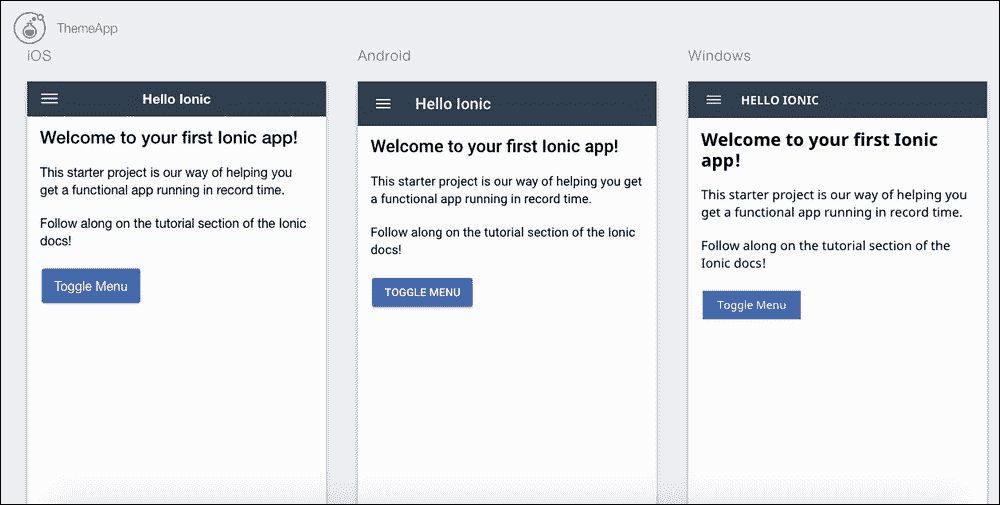
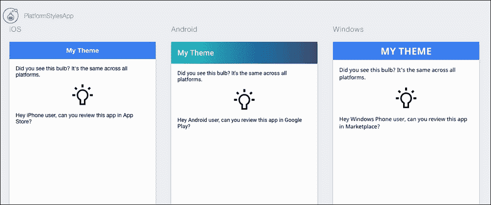
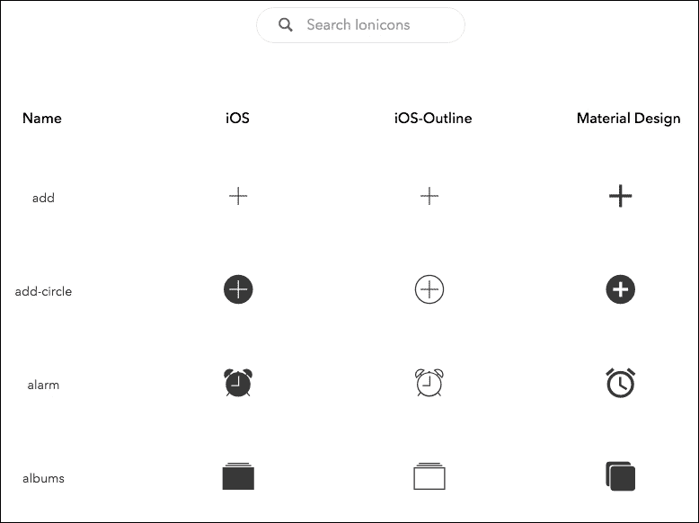
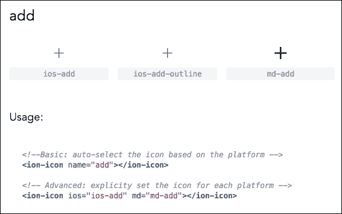
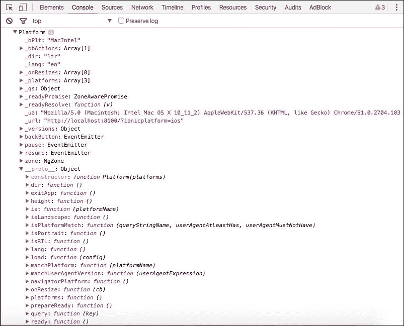

# 第八章：应用主题设计

在本章中，我们将介绍与应用主题定制相关的以下任务：

+   查看和调试特定平台的主题

+   根据平台定制主题

# 简介

虽然 Ionic 自带一些开箱即用的默认主题，但你可能还想进一步自定义你应用的视觉和感觉。有以下几种方法：

+   在 Sass 文件中更改样式表

+   在 JavaScript 中检测特定平台类型（iOS、Android、Windows）并应用自定义类或 AngularJS 条件

以上两种方法中的任何一种都应该有效，但强烈建议在构建应用之前，在 Sass 文件中应用自定义，以实现最佳渲染性能。

# 查看和调试特定平台的主题

开发应用时最大的挑战之一是确保它在每个平台上都有期望的视觉和感觉。具体来说，你希望编写一次代码和主题，并确保它能够正常工作。另一个挑战是确定日常的工作流程，从编写代码并在浏览器中预览到部署到设备进行测试。你希望最小化许多不必要的步骤。如果你必须为每个移动平台独立重建应用并测试它，这当然是非常困难的。

Ionic 2 CLI 提供了无缝集成，以改善你的工作流程，确保你可以在构建应用之前提前捕捉到每个平台的所有问题。你可以在同一个浏览器窗口中快速查看应用在不同平台上的表现。这个功能非常强大，因为现在可以针对每个屏幕进行并排比较，并执行特定的交互。如果你想调试 JavaScript 代码，你可以使用在浏览器中已经使用的相同网页开发者工具。这种能力将为你节省大量时间，而不是等待将应用推送到物理设备，如果你的应用变得更大，这可能需要几分钟。

在这个例子中，你将学习如何使用 Sass 变量快速修改主题。然后，你将运行应用并检查不同平台以保持 UI 一致性。

## 准备工作

没有必要在物理设备上测试主题，因为 Ionic 可以在浏览器中渲染 iOS、Android 和 Windows Phone。

## 如何操作…

这里是操作说明：

1.  使用如图所示的 `tutorial` 模板创建一个新的应用，并转到以下文件夹：

    ```js
    $ ionic start ThemeApp tutorial --v2
    $ cd ThemeApp

    ```

    ### 小贴士

    在 Ionic 1 中，你需要设置 Sass 依赖项，因为 Ionic 为此使用了许多外部库。然而，Ionic 2 没有这样的要求，因为所有依赖项都是在创建项目时添加的。

1.  打开 `/app/theme/app.variable.scss` 文件，并用以下命令替换 `$colors` 变量：

    ```js
    $colors: (
     primary:    #2C3E50, // #387ef5,
     clear:      white,
     secondary:  #446CB3, // #32db64,
     danger:     #96281B, // #f53d3d,
     light:      #BDC3C7, // #f4f4f4,
     dark:       #6C7A89, // #222,
     favorite:   #16A085 // #69BB7B
    );

    ```

    ### 小贴士

    默认的颜色代码可以像前面代码所示那样进行注释。

1.  打开 `app.html` 文件，并将 `clear` 属性添加到以下代码块中：

    ```js
      <ion-toolbar clear>
        <ion-title>Pages</ion-title>
      </ion-toolbar>
    ```

1.  打开 `./src/pages/hello-ionic/hello-ionic.html` 文件，并用给定的代码替换其内容：

    ```js
    <ion-header>
      <ion-navbar primary>
        <button ion-button menuToggle>
          <ion-icon name="menu"></ion-icon>
        </button>
        <ion-title>Hello Ionic</ion-title>
      </ion-navbar>
    </ion-header>

    <ion-content padding class="getting-started">

      <h3>Welcome to your first Ionic app!</h3>

      <p>
        This starter project is our way of helping you get a functional app running in record time.
      </p>
      <p>
        Follow along on the tutorial section of the Ionic docs!
      </p>
      <p>
        <button ion-button color="secondary" menuToggle>Toggle Menu</button>
      </p>

    </ion-content>
    ```

1.  在浏览器中运行测试应用，你应该能看到如下屏幕：

    ```js
    $ ionic serve -l

    ```

    ### 小贴士

    `-l`（lima）命令意味着为所有三个平台渲染应用。

    

## 工作原理…

Ionic 2 使得开发不同平台的主题变得非常容易。你的典型流程是首先修改 `app.variables.scss` 中的主题变量。你不应该直接修改任何 `.css` 文件。此外，Ionic 2 项目现在确保你无法意外编辑错误的主题核心文件，因为这些核心文件不再位于应用文件夹位置。

要更新默认颜色，你只需修改 `app.variables.scss` 中的颜色代码。你甚至可以添加更多颜色名称，例如 `clear: white`，Ionic 2 将自动处理其余部分。这意味着 `clear` 关键字可以作为属性应用于任何接受颜色名称的 Ionic 元素。以下是一些示例：

```js
<ion-navbar primary>
<button ion-button color="secondary" menuToggle>
<ion-toolbar clear>
```

Ionic CLI 是一个非常有用的工具，可以帮助你在不同平台上调试主题。要获取有关如何使用 Ionic CLI 的帮助，你可以在控制台中输入以下命令行：

```js
$ ionic -h

```

这将列出所有可供你选择的选项。在 `serve` 选项下，你应该熟悉一些重要功能，如下所示：

| 参数 | 描述 |
| --- | --- |
| `--consolelogs | -c` | 将应用控制台日志打印到 Ionic CLI |
| `--serverlogs | -s` | 将开发服务器日志打印到 Ionic CLI |
| `--browser | -w` | 指定要使用的浏览器（Safari、Firefox 和 Chrome） |
| `--browseroption | -o` | 指定要打开的路径（`/#/tab/dash`） |
| `--lab | -l` | 在多个屏幕尺寸和平台类型上测试你的应用 |

## 更多内容…

你可以通过访问 Matheus Cruz Rocha 的克隆仓库来获取更多调色板：[`github.com/innovieco/ionic-flat-colors`](https://github.com/innovieco/ionic-flat-colors)。

# 基于平台自定义主题

每个移动平台供应商都有自己的设计指南。本节将介绍一个典型的开发、查看、调试和针对 iOS、Android 和 Windows Phone 不同的应用主题的工作流程示例。在传统开发（使用本地语言或其他混合应用解决方案）中，你必须为每个平台维护单独的仓库以自定义主题。从长远来看，这可能会非常低效。

Ionic 2 提供了许多内置功能来支持基于检测到的平台进行主题更改。通过为每个平台分离 Sass 变量，这使得操作非常方便。这将消除许多不必要的自定义。作为开发者，你更愿意专注于应用体验，而不是花时间管理平台。

本节中的示例涵盖了使用 Sass 和 JavaScript 的两种可能的定制方式。以下截图显示了一个 iOS、Android 和 Windows 应用，具有不同的标题栏颜色和文本：



## 准备工作

没有必要在物理设备上测试主题，因为 Ionic 可以在浏览器中渲染所有三个平台。

## 如何做到这一点...

这里是说明：

1.  使用`blank`模板创建一个新应用，并进入项目文件夹：

    ```js
    $ ionic start PlatformStylesApp blank --v2
    $ cd PlatformStylesApp

    ```

1.  打开`./src/app/app.module.ts`文件，并将整个主体替换为以下内容：

    ```js
    import { NgModule } from '@angular/core';
    import { IonicApp, IonicModule } from 'ionic-angular';
    import { MyApp } from './app.component';
    import { HomePage } from '../pages/home/home';

    @NgModule({
      declarations: [
        MyApp,
        HomePage
      ],
      imports: [
        IonicModule.forRoot(MyApp, {
          backButtonText: 'Go Back',
          iconMode: 'md',
          modalEnter: 'modal-slide-in',
          modalLeave: 'modal-slide-out',
          tabbarPlacement: 'bottom',
          pageTransition: 'ios',
        })
      ],
      bootstrap: [IonicApp],
      entryComponents: [
        MyApp,
        HomePage
      ],
      providers: []
    })
    export class AppModule {}
    ```

    这个例子扩展了 Ionic 引导的使用，现在将进行讨论。

1.  打开`./src/pages/home/home.ts`文件，并将代码替换为以下内容：

    ```js
    import { Component } from '@angular/core';
    import { Platform } from 'ionic-angular';
    import { NavController } from 'ionic-angular';

    @Component({
      selector: 'page-home',
      templateUrl: 'home.html'
    })
    export class HomePage {
      platform: any;
      isIOS: Boolean;
      isAndroid: Boolean;
      isWP: Boolean;

      constructor(private navController: NavController, platform: Platform) {
        this.platform = platform;
        this.isIOS = this.platform.is('ios');
        this.isAndroid = this.platform.is('android');
        this.isWP = this.platform.is('windows');
        console.log(this.platform);
      }
    }
    ```

1.  打开`./src/pages/home/home.html`文件，并将模板更改为以下内容：

    ```js
    <ion-header>
      <ion-navbar primary [ngClass]="{'large-center-title': isWP}">
        <ion-title>
          My Theme
        </ion-title>
      </ion-navbar>
    </ion-header>

    <ion-content padding>
      Did you see this bulb? It's the same across all platforms.
      <p class="center">
        <ion-icon class="large-icon" name="bulb"></ion-icon>
      </p>

      <p *ngIf="isIOS">
        Hey iPhone user, can you review this app in App Store? 
      </p>
      <p *ngIf="isAndroid">
        Hey Android user, can you review this app in Google Play? 
      </p>
      <p *ngIf="isWP">
        Hey Windows Phone user, can you review this app inMarketplace? 
      </p>
    </ion-content>
    ```

    这是应用唯一的模板，但它的 UI 将根据检测到的平台而有所不同。

1.  将`./src/pages/home/home.scss`替换为以下样式表：

    ```js
    .large-icon {
      font-size: 60px;
    }

    .center {
      text-align: center;
    }

    .md .toolbar[primary] .toolbar-background {
      background: #1A2980; 
      background: -webkit-linear-gradient(right, #1A2980, #26D0CE);
      background: -o-linear-gradient(right, #1A2980, #26D0CE);
      background: linear-gradient(to left, #1A2980, #26D0CE); 
    }

    .large-center-title {
      text-align: center;
      .toolbar-title {
        font-size: 25px;
      }
    }
    ```

    没有必要更改全局变量。因此，您只需修改一个页面的样式。目的是展示为每个平台定制的能力。

1.  使用以下命令在浏览器中测试运行应用：

    ```js
    $ ionic serve -l

    ```

## 它是如何工作的...

Ionic 自动创建了平台特定的父类，并将它们放在`<body>`标签中。iOS 应用将包含`.ios`类。安卓应用将包含`.md`类。因此，对于样式表定制，您可以利用这些现有的类来改变您应用的外观和感觉。

Ionic 2 文档列出了所有平台模式和配置属性[`ionicframework.com/docs/v2/theming/platform-specific-styles/`](http://ionicframework.com/docs/v2/theming/platform-specific-styles/)。

| 平台 | 模式 | 详情 |
| --- | --- | --- |
| iPhone/iPad/iPad | `ios` | iOS 样式用于所有苹果产品 |
| 安卓 | `md` | *md*代表**Material Design**，这是安卓设备的默认设计 |
| Windows Phone | `wp` | 在 Cordova 或 Electron 中的任何 Windows 设备上查看都使用 Windows 样式 |
| 核心 | `md` | 对于所有其他平台，Material Design 是默认的 |

首先，让我们看看 Ionic Angular 中的 Ionic Bootstrap 类。您在`app.ts`文件中声明了它：

```js
IonicModule.forRoot(MyApp, {
    backButtonText: 'Go Back',
    iconMode: 'md',
    modalEnter: 'modal-slide-in',
    modalLeave: 'modal-slide-out',
    tabbarPlacement: 'bottom',
    pageTransition: 'ios',
})
```

这个声明基本上指示应用使用`MyApp`对象进行引导。第三个参数是您可以注入自定义配置属性的地方。所有`Config`属性列表可以在[`ionicframework.com/docs/v2/api/config/Config/`](http://ionicframework.com/docs/v2/api/config/Config/)找到。

这里要指出的一点是`iconMode`。在 Ionic 2 中，每个平台的图标都大不相同。整个 Ionicons 集现在根据平台名称分开。根据 Ionic 2 的文档页面，有三个平台，在[`ionicframework.com/docs/v2/ionicons/`](http://ionicframework.com/docs/v2/ionicons/)。

您甚至可以使用以下**搜索 Ionicons**按钮搜索图标名称：



注意，你不需要担心为哪个平台选择哪个图标。即使在这个例子中，代码强制你为三个平台都选择 iOS 图标，你也可以只使用图标名称，让 Ionic 2 决定使用哪个图标：



例如，当你声明图标名称为`"add"`时，如果用户使用 Android，Ionic 2 将使用`"md-add"`，如下所示：

```js
<ion-icon name="add">
</ion-icon>
```

根据平台，有几种方法可以为你的应用设置主题。首先，你可以在`HomePage`类中添加变量来检测当前平台，如下所示：

```js
export class HomePage {
  platform: any;
  isIOS: Boolean;
  isAndroid: Boolean;
  isWP: Boolean;

  constructor(private navController: NavController, platform: Platform) {
    this.platform = platform;
    this.isIOS = this.platform.is('ios');
    this.isAndroid = this.platform.is('android');
    this.isWP = this.platform.is('windows');
    console.log(this.platform);
  }
}
```

`this.platform = platform`是 Ionic 2 提供的。如果你在运行应用时打开浏览器控制台，你可以检查`platform`对象：



这个`platform`对象包含大量信息。这与 Ionic 1 中的`ionic.platform`类似。然而，它已经进行了重大重构。

通过将平台变量提供给视图，你可以使用它来通过`ngIf`隐藏或显示特定的 DOM。建议使用`ngIf`而不是`ngShow`，因为`ngShow`可能会立即显示和隐藏元素，从而产生*闪烁*效果。以下是与使用这些平台变量相关的模板中的代码：

```js
  <p *ngIf="isIOS">
    Hey iPhone user, can you review this app in App Store? 
  </p>
  <p *ngIf="isAndroid">
    Hey Android user, can you review this app in Google Play? 
  </p>
  <p *ngIf="isWP">
    Hey Windows Phone user, can you review this app in Marketplace? 
  </p>
```

最后，你可以直接使用平台类来更改主题。考虑以下示例：

```js
.md .toolbar[primary] .toolbar-background {
  background: #1A2980; 
  background: -webkit-linear-gradient(right, #1A2980, #26D0CE);
  background: -o-linear-gradient(right, #1A2980, #26D0CE);
  background: linear-gradient(to left, #1A2980, #26D0CE); 
}
```

这意味着，每当它是 Material Design 模式（`.md`类）时，你将用自己的样式覆盖这些类。前面的例子显示了一个有趣的 CSS 渐变，它在移动设备上工作得非常好。

## 还有更多…

此外，设备信息可以通过`Platform`类获取。你甚至可以在[`ionicframework.com/docs/v2/api/platform/Platform/`](http://ionicframework.com/docs/v2/api/platform/Platform/)检测 iPad 设备。
