# 第九章。在不同平台上发布应用程序

在本章中，我们将介绍以下与发布和确保应用程序长期可用性相关的任务：

+   为确保应用程序的长期可用性添加版本控制

+   构建并发布 iOS 应用程序

+   构建并发布 Android 应用程序

# 简介

在过去，构建和成功发布应用程序非常繁琐。然而，如今互联网上有大量的文档和非官方指南，几乎可以解决你可能遇到的所有问题。此外，Ionic 还自带 CLI 来协助这个过程。本章将指导你完成应用程序构建和发布的步骤。你将学习如何完成以下事情：

+   为确保应用程序的长期可用性添加版本控制

+   将你的应用程序发布到 App Store 或 Google Play

本章的目的是提供关于要寻找的内容以及一些需要注意的问题的想法。苹果和谷歌不断更新他们的平台和流程；因此，随着时间的推移，步骤可能不会完全相同。

# 为确保应用程序的长期可用性添加版本控制

通常情况下，你可能不会考虑跟踪特定用户的版本。然而，随着应用程序的用户数量和发布次数的增加，你很快就会面临更新问题和兼容性问题。例如，一个用户可能运行你应用程序的旧版本，但你现在所有的后端 API 都期望从较新版本的应用程序中获取新参数。因此，你可能需要考虑一种策略来本地检测应用程序版本，以便通知用户更新需求。如果你的后端针对特定应用程序版本有不同的处理方式，这也有帮助。

你将要构建的应用程序非常简单。它将检测当前版本并将信息存储在服务中。这是应用程序的截图：

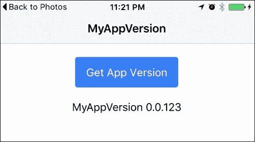

## 准备工作

此应用程序示例必须在物理设备或模拟器上运行。

## 如何操作...

以下是一些注意事项：

1.  使用`blank`模板创建一个新的`MyAppVersion`应用程序，如下所示，然后转到`MyAppVersion`文件夹：

    ```js
    $ ionic start MyAppVersion blank --v2
    $ cd MyAppVersion 

    ```

1.  安装`app-version`插件：

    ```js
    $ ionic plugin add cordova-plugin-app-version

    ```

1.  通过更改版本号编辑`./config.xml`，如下所示：

    ```js
    <widget id="com.ionicframework.myappversion637242" version="0.0.123"  >

    ```

注意，你的`widget id`可能与这里提到的不同。你只需要更改版本号。在这种情况下，是`0.0.123`版本。

1.  在应用程序文件夹内创建名为`services`的文件夹，如下所示：

    ```js
    $ mkdir ./src/services

    ```

1.  在`services`文件夹中创建`myenv.ts`，代码如下：

    ```js
    import {Injectable} from '@angular/core';
    import {AppVersion} from 'ionic-native';

    @Injectable()
    export class MyEnv {
      public appVersion: any;

      constructor() {
        this.appVersion = AppVersion;
      }

      getAppVersion() {
        return this.appVersion.getVersionCode();
      }
    }
    ```

    这是此应用程序的唯一服务。在现实世界的项目中，你需要多个服务，因为其中一些将需要直接与你的后端进行通信。

1.  打开并编辑你的`.src/app/app.module.ts`，如下所示：

    ```js
    import { NgModule } from '@angular/core';
    import { IonicApp, IonicModule } from 'ionic-angular';
    import { MyApp } from './app.component';
    import { HomePage } from '../pages/home/home';
    import { MyEnv } from '../services/myenv';

    @NgModule({
      declarations: [
        MyApp,
        HomePage
      ],
      imports: [
        IonicModule.forRoot(MyApp)
      ],
      bootstrap: [IonicApp],
      entryComponents: [
        MyApp,
        HomePage
      ],
      providers: [MyEnv]
    })
    export class AppModule {}
    ```

    此文件的主要修改是在整个应用程序中注入`MyEnv`提供者。

1.  打开并替换`.src/pages/home/home.html`为以下代码：

    ```js
    <ion-header>
      <ion-navbar>
        <ion-title>
          MyAppVersion
        </ion-title>
      </ion-navbar>
    </ion-header>

    <ion-content padding class="center home">
      <button ion-button (click)="getVersion()" >Get App Version</button>
      <p class="large" *ngIf="ver">
        MyAppVersion {{ ver }}
      </p>
    </ion-content>
    ```

1.  打开并替换`./src/pages/home/home.ts`为以下代码：

    ```js
    import { Component } from '@angular/core';
    import { NavController } from 'ionic-angular';
    import { MyEnv } from '../../services/myenv';

    @Component({
      selector: 'page-home',
      templateUrl: 'home.html'
    })
    export class HomePage {
      public ver: string;

      constructor(private navCtrl: NavController, public myEnv: MyEnv) {
        this.myEnv = myEnv;
      }

      getVersion() {
        console.log(this.myEnv.getAppVersion());
        this.myEnv.getAppVersion().then((data) => this.ver = data);
      }
    }
    ```

1.  在同一文件夹中打开并编辑`home.scss`：

    ```js
    .home {
      p.large {
        font-size: 16px;
      }
    }

    ion-content {
      &.center {
        text-align: center;
      }
    }
    ```

1.  前往您的终端并运行应用。如果您想在您的物理设备上运行应用，请输入以下命令：

    ```js
    $ ionic run ios

    ```

    对于 Android，请输入以下命令：

    ```js
    $ ionic run android

    ```

## 它是如何工作的...

简而言之，`AppVersion`插件做了所有*繁重的工作*。使用 JavaScript，Ionic 应用无法在其代码中找到当前版本。您可能会认为使用本地存储或 cookie 是一个替代方案，但用户也可以手动删除该存储。为了有一个永久的解决方案，应该使用`AppVersion`插件，因为它可以读取您的`config.xml`文件并为您获取版本。

为所有环境变量创建一个单独的服务是最佳实践。这就是为什么您应该有一个名为`MyEnv`的服务。此外，您应该在*应用级别*注入`MyEnv`作为提供者，因为您只想实例化一次，而不是每次创建新组件时都这样做。观察以下代码：

```js
providers: [MyEnv]
```

由于所有`AppVersion`方法都是基于`promise`的，您应该返回整个对象作为一个 promise。让我们看看您的`myenv.ts`文件中的`getAppVersion()`方法：

```js
  getAppVersion() {
    return this.appVersion.getVersionCode();
  }
```

然后，在您的页面文件中，例如`home.ts`，您应该像下面这样调用`getAppVersion`方法，并使用`.then()`方法获取结果：

```js
  getVersion() {
    console.log(this.myEnv.getAppVersion());
    this.myEnv.getAppVersion().then((data) => this.ver = data);
  }
```

如果您打开控制台来检查`promise`对象，您将看到它包含您的应用版本值和`.then()`方法。观察以下截图：

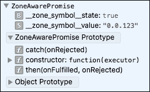

如需了解更多关于`AppVersion`插件的信息，您可以参考官方 AppVersion 文档，网址为[`github.com/whiteoctober/cordova-plugin-app-version`](https://github.com/whiteoctober/cordova-plugin-app-version)。

# 构建和发布 iOS 应用

如果您没有提前做好准备，发布到 App Store 可能会是一个令人沮丧的过程。在本节中，您将了解如何在 Apple Developer Center、iTunes Connect 和本地 Xcode 项目中正确配置所有内容。

## 准备工作

您必须注册 Apple Developer Program 才能访问[`developer.apple.com/macos/touch-bar/`](https://developer.apple.com/macos/touch-bar/)和[`itunesconnect.apple.com`](https://itunesconnect.apple.com)，因为那些网站将需要一个已批准的账户。

此外，以下是对这些组件特定版本的说明：

+   Mac OS X El Capitan 10.11.2

+   Xcode 7.2

+   Ionic CLI 2.0

+   Cordova 5.4.1

## 如何操作...

这里是说明：

1.  确保您在应用文件夹中，并为 iOS 平台构建：

    ```js
    $ ionic build ios

    ```

    前往`/platforms/ios`文件夹，在 Xcode 中打开`.xcodeproj`文件。观察以下截图：

    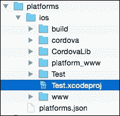

1.  通过**常规**选项卡，如图所示的以下截图，确保你拥有所有正确的信息，特别是**包标识符**和**版本**。如有需要，进行更改并保存：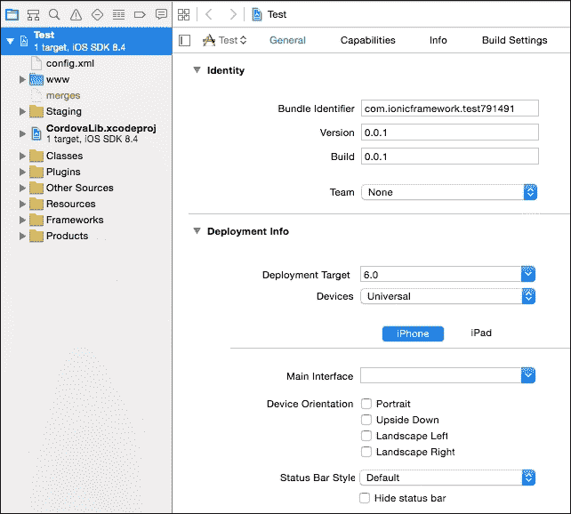

1.  访问 Apple 开发者网站并点击**证书、标识符和配置文件**，如图所示：

1.  选择你正在针对的正确设备平台。在这种情况下，它将是**iOS、tvOS、watchOS**，如图所示：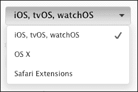

1.  对于 iOS 应用，你需要证书、App ID、测试设备和配置文件。要从证书开始，导航到**证书** | **所有**，如下所示：

1.  点击如下所示的加号（**+**）按钮：

1.  你只需按照网站上的步骤填写必要的信息，如下面的截图所示：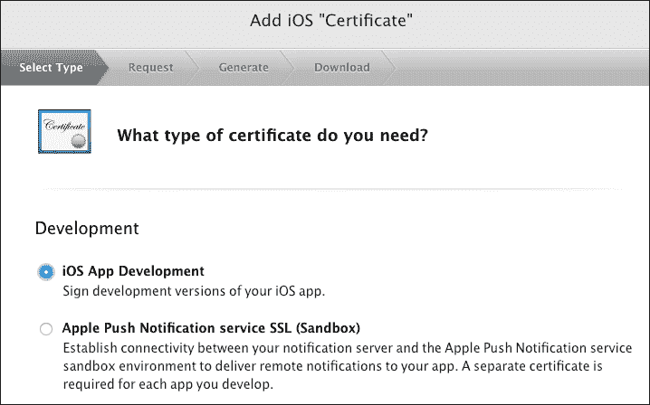

1.  完成表格后，你可以保存 CSR 文件并将其导入到 Mac 的**钥匙串访问**中。

1.  按照如下所示导航到**标识符** | **App ID**以创建一个 App ID：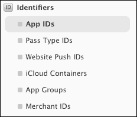

1.  点击屏幕右上角的加号（**+**）按钮，如下所示：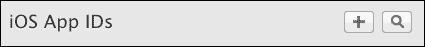

1.  按照如下所示填写表格以注册你的**App ID**：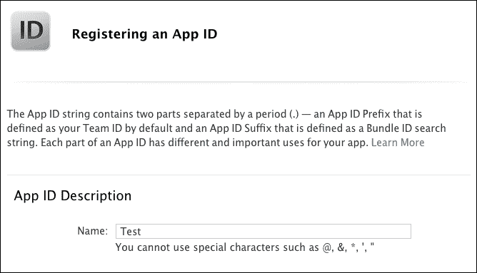

1.  这里需要正确完成的重要部分是**包标识符**，如下面的截图所示，因为它必须与 Xcode 中的**Bundle Identifier**匹配：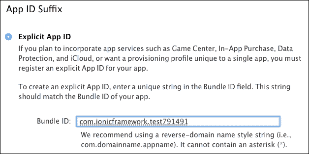

1.  如果你的应用需要**推送通知**或其他**应用服务**，你需要在页面上检查这些服务：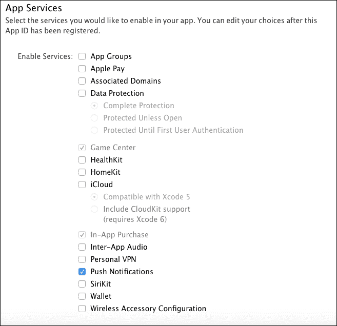

1.  如果你需要将应用推送到特定设备，你必须注册该设备。导航到**设备** | **所有**，如图所示：

1.  点击显示的加号（**+**）按钮，如图所示：

1.  提供设备的**UDID**，如下所示，并保存以注册设备：

1.  最后，如果你还没有配置文件，你需要一个。通常，Xcode 会自动创建一个。然而，你可以通过导航到**配置文件** | **所有**来创建自己的，如下所示：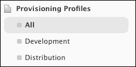

1.  点击如下所示的加号（**+**）按钮：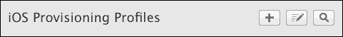

1.  选择**App Store**作为你的配置文件，如图所示：

1.  在下拉菜单中选择正确的**App ID**并保存，以完成你的配置文件创建，如下所示：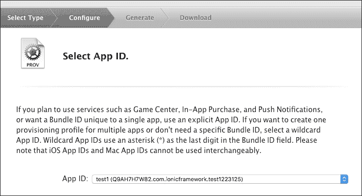

1.  访问[iTunes Connect](https://itunesconnect.apple.com)并点击**我的应用**按钮，如图所示：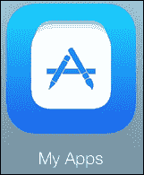

1.  选择加号（**+**）图标以选择**新建应用**，如图所示：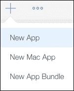

1.  填写表格并确保您选择了应用的正确**捆绑标识符**：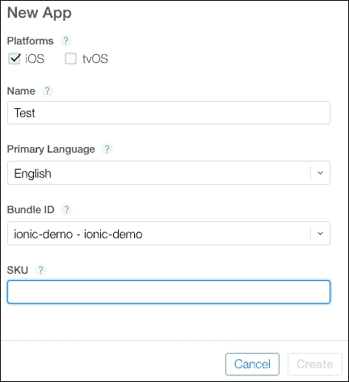

    有几个额外的步骤来提供有关应用的信息，例如截图、图标和地址。如果您只想测试应用，您可以最初提供一些占位符信息，稍后再回来编辑。

    准备您的开发者账号和 iTunes Connect 账号就到这里。

1.  现在，打开 **Xcode** 并选择**iOS 设备**作为存档目标。否则，**存档**功能将无法启用。您需要在提交到应用商店之前存档您的应用：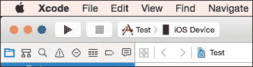

1.  在顶部菜单中导航到**产品** | **存档**，如图所示：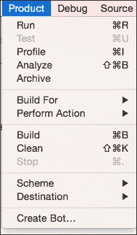

1.  存档过程完成后，选择**提交到应用商店**以完成发布过程。

1.  要发布，选择**提交进行 Beta 应用审查**。您可能想浏览其他标签页，如**定价**和**应用内购买**，以配置您自己的要求。

## 工作原理…

显然，本节没有涵盖发布过程中的所有细节。一般来说，您只需确保在提交到应用商店之前，在物理设备上（通过 USB 或 *TestFlight*）彻底测试您的应用即可。

如果由于某些原因**存档**功能无法构建，您可以手动前往您的本地 Xcode 文件夹删除该特定临时存档应用以清除缓存，如图所示：

```js
~/Library/Developer/Xcode/Archives
```

## 还有更多…

*TestFlight* 是一个独立的话题。*TestFlight* 的好处是您不需要您的应用获得苹果的批准就可以在物理设备上进行测试和开发安装。您可以在 [`developer.apple.com/library/content/documentation/LanguagesUtilities/Conceptual/iTunesConnect_Guide/Chapters/BetaTestingTheApp.html`](http://developer.apple.com/library/content/documentation/LanguagesUtilities/Conceptual/iTunesConnect_Guide/Chapters/BetaTestingTheApp.html) 上找到更多关于 *TestFlight* 的信息。

# 为 Android 构建和发布应用

构建 Android 应用比 iOS 更直接，因为您只需与命令行接口来构建 .apk 文件并将其上传到 Google Play 开发者控制台。

Ionic 框架文档也为此提供了很好的说明页面，链接为 [`ionicframework.com/docs/guide/publishing.html`](http://ionicframework.com/docs/guide/publishing.html)。

## 准备工作

要求是您的 Google 开发者账户已准备好并登录到 [`play.google.com/apps/publish`](https://play.google.com/apps/publish)。

您的本地环境也应具备正确的 SDK 以及针对该特定版本的 `keytool`、`jarsigner` 和 `zipalign` 命令行。

## 如何操作…

这里是说明：

1.  进入你的应用文件夹，使用以下命令为 Android 构建：

    ```js
    $ ionic package build --release android

    ```

1.  你将在`/platforms/android/build/outputs/apk`文件夹中看到`android-release-unsigned.apk`。在终端中转到该文件夹：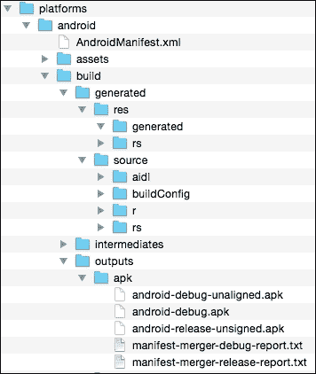

1.  如果这是你第一次创建此应用，你必须有一个`keystore`文件。此文件用于在发布时识别你的应用。如果你丢失了它，你以后无法更新你的应用。要创建`keystore`，请输入以下命令行，并确保它与 SDK 的`keytool`版本相同：

    ```js
    $ keytool -genkey -v -keystore my-release-key.keystore -alias alias_name -keyalg RSA -keysize 2048 -validity 10000

    ```

1.  一旦填写了命令行中的信息，请将此文件复制到某个安全的地方，因为以后你需要它。

1.  下一步是使用该文件来*签名*你的应用，以便它将创建一个新的`.apk`文件，Google Play 允许用户安装：

    ```js
    $ jarsigner -verbose -sigalg SHA1withRSA -digestalg SHA1 -keystore my-release-key.keystore HelloWorld-release-unsigned.apk alias_name

    ```

1.  在上传之前准备最终的`.apk`，你必须使用`zipalign`打包，如下所示：

    ```js
    $ zipalign -v 4 HelloWorld-release-unsigned.apk HelloWorld.apk

    ```

你需要确保`zipalign`在`PATH`中，或者你必须指定绝对路径。应用名称可以是任何你喜欢的，或者你可以使用本章创建的相同名称：

1.  登录 Google 开发者控制台，点击**添加新应用**，如图所示：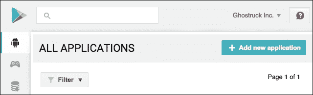

1.  使用左侧菜单尽可能填写你的应用的内容评级和其他信息：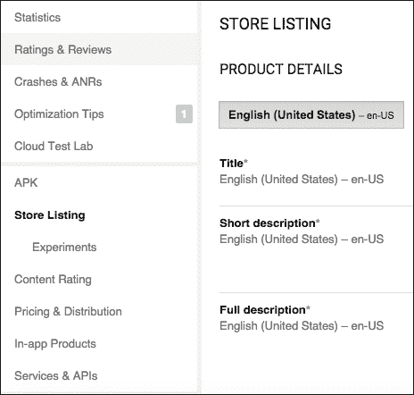

1.  现在，你已经准备好上传你的`.apk`文件。首先是要进行 Beta 测试：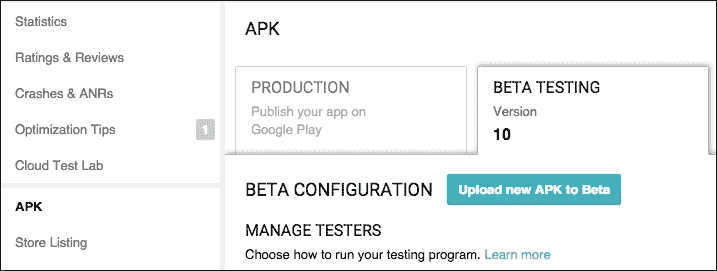

1.  一旦完成 Beta 测试，你可以按照开发者控制台的说明将应用推送到生产环境。

### 注意

如果你在发布应用时遇到任何问题，查看仪表板右上角的“为什么我不能发布？”链接会有帮助。Google 会指导你完成或修复必须完成的特定步骤。

## 它是如何工作的…

本节不涵盖其他 Android 市场，例如 Amazon 应用商店，因为它们各自有不同的流程。然而，共同的想法是，你需要完全构建`.apk`的无签名版本，使用现有的或新的`keystore`文件进行签名，最后`zipalign`以准备上传。
