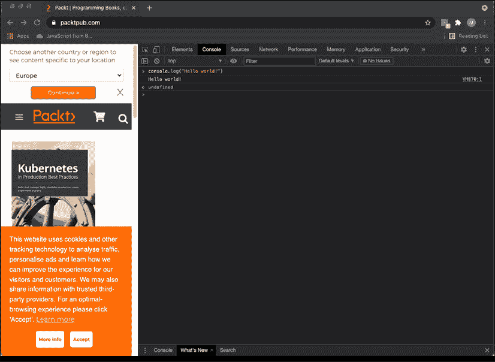
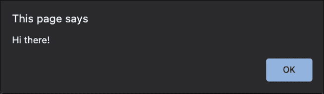
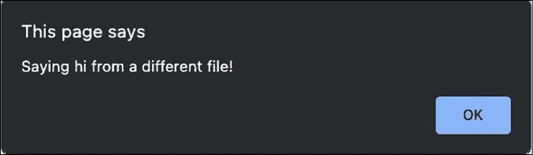
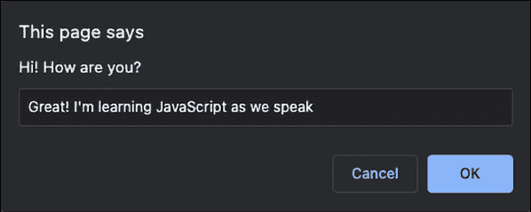

# 第一章：开始学习 JavaScript

看起来你已经决定开始学习 JavaScript。这是一个非常好的选择！JavaScript 是一种可以在应用程序的客户端和服务器端使用的编程语言。应用程序的服务器端是通常在数据中心运行的计算机上的后端逻辑，并与数据库交互，而客户端是运行在用户设备上的部分，通常是 JavaScript 的浏览器。

你可能已经使用过用 JavaScript 编写的功能。如果你使用过像 Chrome、Firefox、Safari 或 Edge 这样的网络浏览器，那么你肯定已经使用过了。JavaScript 遍布整个网络。如果你进入一个网页，它要求你接受饼干，并且你点击了确定，那么弹出窗口就会消失。这就是 JavaScript 在起作用。如果你想要导航到一个网站，并且一个子菜单展开，这意味着有更多的 JavaScript。通常，当你在一个网店中过滤产品时，这涉及到 JavaScript。那么，当你在一个网站上停留了一段时间后，开始与你交谈的这些聊天是什么？好吧，你已经猜到了——JavaScript！

几乎我们与网页的所有交互都是因为 JavaScript；你点击的按钮、你创建的生日卡片，以及你进行的计算。任何需要比静态网页更复杂的功能的东西都需要 JavaScript。

在本章中，我们将涵盖以下主题：

+   你为什么应该学习 JavaScript？

+   设置你的环境

+   浏览器是如何理解 JavaScript 的？

+   使用浏览器控制台

+   将 JavaScript 添加到网页中

+   编写 JavaScript 代码

注意：练习、项目和自我检查测验的答案可以在*附录*中找到。

# 你为什么应该学习 JavaScript？

有很多原因让你想要学习 JavaScript。JavaScript 诞生于 1995 年，通常被认为是使用最广泛的编程语言。这是因为 JavaScript 是网络浏览器支持并理解的语言。如果你有网络浏览器和文本编辑器，你电脑上已经安装了所有你需要来解释它的东西。然而，有更好的设置，我们将在本章后面讨论这些。

它是一种非常适合初学者的编程语言，大多数高级软件开发者至少会知道一些 JavaScript，因为他们会在某个时候遇到它。JavaScript 是初学者的一个很好的选择，原因有很多。第一个原因是你可以比想象中更快地开始使用 JavaScript 构建真正酷的应用程序。当你到达*第五章*，*循环*时，你将能够编写相当复杂的脚本，与用户交互。到本书结束时，你将能够编写动态网页，做各种事情。

JavaScript 可以用来编写许多不同类型的应用程序和脚本。它可以用于网页浏览器的编程，也可以用于我们看不到的应用程序逻辑层代码（例如与数据库的通信），这些代码可以用 JavaScript 编写，包括游戏、自动化脚本以及众多其他用途。JavaScript 还可以用于不同的编程风格，我们这里指的是结构化和编写代码的方式。你如何进行取决于你的脚本目的。如果你之前从未编码过，你可能不太理解这些概念，在这个阶段也不是完全必要的，但 JavaScript 可以用于（半）面向对象、函数式和过程式编程，这些都是不同的编程范式。

一旦你掌握了 JavaScript 的基础知识，你就可以使用大量的库和框架。这些库和框架将真正提升你的软件开发生活，使你在更短的时间内完成更多的工作。这些优秀的库和框架包括 React、Vue.js、jQuery、Angular 和 Node.js。现在不必担心这些；只需把它们看作是未来的额外奖励。我们将在本书的最后简要介绍其中的一些。

最后，我们将提到 JavaScript 社区。JavaScript 是一种非常流行的编程语言，很多人在使用它。特别是对于初学者来说，你几乎可以在互联网上找到所有问题的解决方案。

JavaScript 的社区非常庞大。流行的 Stack Overflow 论坛包含大量各种编码问题的帮助，并且有一个关于 JavaScript 的巨大部分。你会发现自己在搜索问题和技巧时经常会遇到这个网页。

如果 JavaScript 是你的第一门编程语言，你对整个软件社区都是新手，那么你将有一个美好的体验。软件开发者，无论使用哪种语言，都喜欢互相帮助。网上有论坛和教程，你可以找到几乎所有问题的答案。然而，作为一个初学者，理解所有答案可能很困难。坚持下去，继续尝试和学习，你很快就会理解。

# 设置你的开发环境

你可以通过许多方式设置 JavaScript 编码环境。首先，你的电脑可能已经拥有了你编写 JavaScript 所需要的所有最小组件。我们建议你让生活变得更轻松一些，并使用集成开发环境（IDE）。

## 集成开发环境

集成开发环境（IDE）是一种特殊的应用程序，用于编写、运行和调试代码。你可以像打开任何程序一样打开它。例如，要编写一个文本文档，你需要打开程序，选择正确的文件，然后开始编写。编码也是如此。你打开 IDE 并编写代码。如果你想执行代码，IDE 通常有一个特殊的按钮用于此目的。按下此按钮将在 IDE 内部运行代码。对于 JavaScript，你可能会在某些情况下手动打开浏览器。

然而，IDE 的功能远不止于此；它通常具有语法高亮功能。这意味着你的代码中的某些元素将具有特定的颜色，你可以轻松地看到哪里出了问题。另一个出色的功能是自动建议功能，编辑器会帮助你完成你正在编码的地方的选项。这通常被称为代码补全。许多 IDE 都有特殊的插件，你可以使与其他工具的协作更加直观，并为其添加功能，例如浏览器中的热重载。

目前市面上有许多集成开发环境（IDE），它们提供的功能各不相同。我们在本书中使用了 Visual Studio Code，但这只是个人偏好。在撰写本书时，其他流行的 IDE 包括 Atom、Sublime Text 和 WebStorm。IDE 种类繁多，而且还在不断出现，所以当你阅读本书时，最流行的 IDE 可能不在本列表中。还有很多其他选择。你可以在网上快速搜索 JavaScript IDE。在选择 IDE 时，有几个需要注意的事项。确保它支持 JavaScript 的语法高亮、调试和代码补全功能。

## 网络浏览器

你还需要一个网络浏览器。大多数浏览器都适合这个用途，但最好不要使用不支持最新 JavaScript 功能的 Internet Explorer。两个不错的选择是 Chrome 和 Firefox。它们支持最新的 JavaScript 功能，并且有可用的有用插件。

## 额外工具

在编码过程中，你可以使用许多额外的东西，例如可以帮助你调试或使事物更容易查看的浏览器插件。在这个阶段，你实际上并不需要任何这些工具，但当你遇到其他人非常兴奋的工具时，请保持开放的心态。

## 在线编辑器

你可能没有电脑可以使用，也许只有平板电脑，或者你无法在你的笔记本电脑上安装任何东西。在这些情况下，也有出色的在线编辑器。我们不会列出任何名称，因为它们正在快速发展，可能在你阅读本书时就已经过时了。但如果你在网上搜索“在线 JavaScript IDE”，你会找到许多在线选项，你可以在那里开始编写 JavaScript 代码，并点击按钮来运行它。

# 浏览器是如何理解 JavaScript 的？

JavaScript 是一种解释型语言，这意味着计算机在运行时理解它。有些语言在运行前会先进行处理，这称为编译，但 JavaScript 不是。计算机可以直接解释 JavaScript。理解 JavaScript 的“引擎”在这里被称为解释器。

一个网页不仅仅是 JavaScript。网页是用三种语言编写的：HTML、CSS 和 JavaScript。

HTML 决定了页面上有什么；页面的内容就在那里。如果页面上有一个段落，页面的 HTML 包含一个段落。如果有标题，HTML 被用来添加标题，等等。HTML 由元素组成，也称为标签。它们指定页面上有什么。以下是一个小示例，它将创建一个包含文本`Hello world`的网页：

```js
<html>
  <body>
    Hello world!
  </body>
</html> 
```

在*第九章*，*文档对象模型*中，我们有一个关于 HTML 的简要课程，所以如果你从未见过它，请不要担心。

CSS 是网页的布局。例如，如果文本颜色是蓝色，这是由 CSS 完成的。字体大小、字体家族和页面上的位置都是由 CSS 决定的。JavaScript 是拼图中最后一块，它定义了网页能做什么以及如何与用户或后端交互。

当处理 JavaScript 时，你迟早会遇到**ECMAScript**这个术语。这是 JavaScript 语言的规范或标准化。当前的标准是**ECMAScript 6**（也称为**ES6**）。浏览器使用这个规范来支持 JavaScript（除了我们后面会看到的**文档对象模型**（**DOM**）等其他一些主题）。JavaScript 有许多实现，可能略有不同，但 ECMAScript 可以被认为是 JavaScript 实现一定会包含的基本规范。

# 使用浏览器控制台

你可能已经看到了，或者没有看到，但网络浏览器有一个内置选项可以查看使你所在的网页成为可能的代码。如果你在 Windows 计算机上的网络浏览器中按`F12`，或者在 macOS 系统上右键单击并选择**Inspect**，你将看到一个出现的屏幕，类似于下面的截图。

它可能在你的机器上的浏览器中略有不同，但通常右键单击并选择**Inspect**就能解决问题：


图 1.1：Packt 网站上的浏览器控制台

这个截图包含顶部多个标签页。我们现在正在查看元素标签页，它包含所有的 HTML 和 CSS（还记得吗？）。如果你点击控制台标签页，你将在面板底部找到一个可以直接插入代码的地方。你可能在这个标签页中看到一些警告或错误消息。这是很常见的，如果页面正在工作，请不要担心。

开发者使用控制台来记录正在发生的事情并进行任何调试。调试是在应用程序未显示预期行为时寻找问题的过程。如果你记录了有意义的消息，控制台会提供一些关于正在发生什么的见解。这实际上是我们将要学习的第一个命令：

```js
console.log("Hello world!"); 
```

如果你点击这个控制台标签，输入上面的第一段 JavaScript 代码，然后按 `Enter`，这将显示你代码中的输出。它看起来像以下截图：



图 1.2：浏览器控制台中的 JavaScript

在本书中，你将大量使用 `console.log()` 语句来测试你的代码片段并查看结果。还有其他控制台方法，例如 `console.table()`，当输入的数据可以表示为表格时，它会创建一个表格。另一个控制台方法是 `console.error()`，它将记录输入的数据，但以一种吸引注意力的样式显示，表明它是一个错误。

## 练习 1.1

使用控制台：

1.  打开浏览器控制台，输入 `4 + 10` 并按 `Enter`。你看到了什么响应？

1.  使用 `console.log()` 语法，在圆括号内放置一个值。尝试输入你的名字，并用引号括起来（这是为了表明它是一个文本字符串——我们将在下一章中讨论这一点）。

# 在网页中添加 JavaScript

有两种方法可以将 JavaScript 链接到网页。第一种方法是在 HTML 中直接在两个 `<script>` 标签之间输入 JavaScript。在 HTML 中，第一个标签 `<script>` 是用来声明下面的脚本将被执行。然后我们有应该放在这个元素内的内容。接下来，我们用相同的标签关闭脚本，但前面有一个向前斜杠，`</script>`。或者，你可以使用 HTML 页面顶部的脚本标签将 JavaScript 文件链接到 HTML 文件。

## 直接在 HTML 中

这里是一个如何编写一个非常简单的网页的示例，该网页将弹出一个显示 `Hi there!` 的对话框：

```js
<html>
  <script type="text/javascript">
    alert("Hi there!");
  </script>
</html> 
```

如果你将其保存为 `.html` 文件，并在浏览器中打开该文件，你将得到以下截图类似的内容。我们将将其保存为 `Hi.html`：



图 1.3：JavaScript 使文本 "Hi there!" 的弹出窗口出现

`alert` 命令将创建一个弹出窗口，显示一条消息。这条消息位于 `alert` 后面的括号内。

目前，我们的内容直接位于 `<html>` 标签内。这不是最佳实践。我们需要在 `<html>` 内创建两个元素——`<head>` 和 `<body>`。在 `<head>` 元素中，我们写入元数据，并且我们稍后会使用这部分来将外部文件连接到我们的 HTML 文件。在 `<body>` 中，我们有网页的内容。

我们还需要通过 `<!DOCTYPE>` 声明让浏览器知道我们正在处理哪种类型的文档。由于我们在 HTML 文件中编写 JavaScript，我们需要使用 `<!DOCTYPE html>`。以下是一个示例：

```js
<!DOCTYPE html>
<html>

<head>
  <title>This goes in the tab of your browser</title>
</head>

<body>
The content of the webpage 
  <script>
    console.log("Hi there!");
  </script>
</body>

</html> 
```

这个示例网页将显示以下内容：`网页内容`。如果你查看浏览器控制台，你会发现一个惊喜！它已经执行了 JavaScript，并在控制台中记录了 `Hi there!`。

### 练习 1.2

HTML 页面中的 JavaScript：

1.  打开你的代码编辑器并创建一个 HTML 文件。

1.  在你的 HTML 文件中，设置 HTML 标签、文档类型、HTML、head 和 body，然后继续添加脚本标签。

1.  在脚本标签内放置一些 JavaScript 代码。你可以使用 `console.log("hello world!")`。

## 将外部文件链接到我们的网页

你也可以将外部文件链接到 HTML 文件。这被认为是一种更好的做法，因为它更好地组织代码，并且你可以避免由于 JavaScript 而导致的非常长的 HTML 页面。除了这些好处之外，你可以在你的网站的其他网页上重用 JavaScript，而无需复制和粘贴。比如说，你有 10 页相同的 JavaScript，你需要对这个脚本进行修改。如果你按照我们在这个示例中展示的方式来做，你只需要更改一个文件。

首先，我们将创建一个单独的 JavaScript 文件。这些文件有 `.js` 后缀。我将称之为 `ch1_alert.js`。这将是我们文件的内容：

```js
alert("Saying hi from a different file!"); 
```

然后，我们将创建一个单独的 HTML 文件（再次使用 `.html` 后缀）。我们将给它以下内容：

```js
<html>
  <script type="text/javascript" src="img/ch1_alert.js"></script>
</html> 
```

确保将文件放在同一位置，或者在你的 HTML 中指定 JavaScript 文件的路径。文件名区分大小写，应该完全匹配。

你有两种选择。你可以使用相对路径和绝对路径。我们先来谈谈后者，因为它最容易解释。你的计算机有一个根目录。对于 Linux 和 macOS，它是 `/`，对于 Windows，通常是 `C:/`。从根目录开始到文件的路径是绝对路径。这是最容易添加的，因为它在你的机器上会起作用。但是有一个问题：在你的机器上，如果这个网站文件夹后来被移动到服务器，绝对路径将不再有效。

第二种更安全的选择是相对路径。你指定从你当前所在的文件如何到达那里。所以如果它在同一个文件夹中，你只需要插入名称。如果它在名为 "example" 的文件夹中，而这个文件夹又位于你的文件所在的文件夹内，你将需要指定 `example/文件名.js`。如果是上一级文件夹，你将需要指定 `../文件名.js`。

如果你打开 HTML 文件，你应该得到以下内容：



图 1.4：JavaScript 在不同文件中创建的弹出窗口

### 练习 1.3

链接到 JS JavaScript 文件：

1.  创建一个扩展名为 `.js` 的名为 `app` 的单独文件。

1.  在`.js`文件中添加一些 JavaScript 代码。

1.  在你创建的*练习 1.2*中的 HTML 文件内链接到单独的`.js`文件。

1.  在你的浏览器中打开 HTML 文件，并检查 JavaScript 代码是否正确运行。

# 编写 JavaScript 代码

因此，我们现在有很多上下文，但你是如何实际编写 JavaScript 代码的呢？有一些重要的事情需要记住，比如如何格式化代码，使用正确的缩进级别，使用分号，以及添加注释。让我们从格式化代码开始。

## 代码格式化

代码需要很好地格式化。如果你有一个很长的文件，有很多行代码，而你又没有坚持一些基本的格式化规则，那么理解你所写的内容将会很困难。所以，基本格式化规则是什么？目前最重要的两个是缩进和分号。还有命名约定，但这些问题将在未来的每个主题中讨论。

### 缩进和空白

当你编写代码时，通常一行代码属于某个特定的代码块（两个大括号`{}`之间的代码）或父语句。如果是这样，你给该块中的代码一个缩进，以确保你可以轻松地看到哪些是块的一部分，以及何时开始新的块。你不需要理解下面的代码片段，但它将展示有缩进和无缩进时的可读性。

不使用新行：

```js
let status = "new"; let scared = true; if (status === "new") { console.log("Welcome to JavaScript!");  if (scared) { console.log("Don't worry you will be fine!"); } else { console.log("You're brave! You are going to do great!"); } } else { console.log("Welcome back, I knew you'd like it!"); } 
```

使用新行但不缩进：

```js
let status = "new";
let scared = true;
if (status === "new") {
console.log("Welcome to JavaScript!");
if (scared) {
console.log("Don't worry you will be fine!");
} else {
console.log("You're brave! You are going to do great!");
}
} else {
console.log("Welcome back, I knew you'd like it!");
} 
```

使用新行和缩进：

```js
let status = "new";
let scared = true;
if (status === "new") {
  console.log("Welcome to JavaScript!");
  if (scared) {
    console.log("Don't worry you will be fine!");
  } else {
    console.log("You're brave! You are going to do great!");
  }
} else {
  console.log("Welcome back, I knew you'd like it!");
} 
```

如你所见，你现在可以很容易地看到代码块何时结束。这就是`if`在相同缩进级别有相应的`}`的地方。在未缩进的例子中，你将不得不数括号来确定`if`块何时结束。即使对于工作代码来说这不是必要的，但请确保正确使用缩进。你会在以后感谢自己的。

### 分号

在每个语句之后，你应该插入一个分号。JavaScript 非常宽容，会理解许多你忘记添加分号的情况，但最好养成在每行代码后都添加分号的习惯。当你声明一个代码块，如`if`语句或循环时，你不应该以分号结束。这只是为了单独的语句。

## 代码注释

使用注释，你可以告诉解释器忽略文件中的某些行。如果它们是注释，则不会执行。能够避免执行文件的一部分通常很有用。这可能是以下原因之一：

1.  你不希望在运行脚本时执行一段代码，所以你将其注释掉，这样它就会被解释器忽略。

1.  元数据。为代码添加一些上下文，例如作者，以及文件涵盖的描述。

1.  在代码的特定部分添加注释来解释正在发生的事情或为什么做出了某个选择。

写注释有两种方式。你可以写单行注释或者多行注释。以下是一个例子：

```js
// I'm a single line comment
// console.log("single line comment, not logged");
/* I'm a multi-line comment. Whatever is between the slash asterisk and the asterisk slash will not get executed.
console.log("I'm not logged, because I'm a comment");
*/ 
```

```js
// on the line will get ignored. The second one is multiline; it is written by starting with /* and ending with */.
```

### 练习 1.4

添加注释：

1.  通过设置变量值向你的 JavaScript 代码中添加一个新语句。由于我们将在下一章中介绍这个内容，你可以使用以下行：

    ```js
    let a = 10; 
    ```

1.  在语句末尾添加注释，说明你设置了 `10` 的值。

1.  使用 `console.log()` 打印值。添加注释说明这将做什么。

1.  在你的 JavaScript 代码末尾使用多行注释。在实际的生产脚本中，你可能可以使用这个空间来添加文件目的的简要概述。

## 提示

我们还想在这里向你展示另一个命令提示符。它的工作方式与警报非常相似，但它会从用户那里获取输入。我们将很快学习如何存储变量，一旦你知道这一点，你就可以存储这个提示函数的结果并对其进行处理。例如，将 `alert()` 改为 `prompt()` 在 `Hi.html` 文件中，如下所示：

```js
prompt("Hi! How are you?"); 
```

然后，刷新 HTML。你将看到一个带有输入框的弹出窗口，你可以在其中输入文本，如下所示：



图 1.5：页面提示用户输入

你（或任何其他用户）输入的值将被返回到脚本中，并可以在你的代码中使用！这对于获取用户输入以塑造代码的工作方式非常有用。

## 随机数

为了在这本书的前几章进行有趣的练习，我们希望你知道如何在 JavaScript 中生成一个随机数。即使你现在还不完全理解发生了什么，也没有关系；只需知道这是创建随机数的命令：

```js
Math.random(); 
```

我们可以在控制台中执行它，并查看结果是否出现：

```js
console.log(Math.random()); 
```

这个数字将在 0 和 1 之间的小数。如果我们想要一个介于 0 和 100 之间的数字，我们可以将其乘以 100，如下所示：

```js
console.log(Math.random() * 100); 
```

不要担心，我们将在 *第二章*，*JavaScript 基础* 中介绍数学运算符。

如果我们不希望得到小数结果，我们可以使用 `Math.floor` 函数，它将向下取整到最接近的整数：

```js
console.log(Math.floor(Math.random() * 100)); 
```

不要担心现在还没有掌握这个。这本书后面会更详细地解释。在 *第八章*，*内置 JavaScript 方法* 中，我们将更详细地讨论内置方法。在此之前，请相信我们这确实会在 0 到 100 之间生成一个随机数。

# 章节项目

## 创建一个 HTML 文件和一个链接的 JavaScript 文件

创建一个 HTML 文件，创建一个单独的 JavaScript 文件。然后，从 HTML 文件连接到 JavaScript 文件。

1.  在 JavaScript 文件中，将你的名字输出到控制台，并在你的代码中添加一个多行注释。

1.  尝试在 JavaScript 文件中注释掉控制台消息，这样控制台就不会显示任何内容。

# 自我检查测验

1.  添加外部 JavaScript 文件的 HTML 语法是什么？

1.  你能在浏览器中运行扩展名为 JS 的文件中的 JavaScript 代码吗？

1.  你如何在 JavaScript 中编写多行注释？

1.  最好的方法是什么，可以从正在运行的代码中移除一行代码，同时你希望保留它以供调试？

# 摘要

干得漂亮！你已经开始了 JavaScript 的学习！在本章中，我们讨论了许多背景知识，这些知识在你开始编写 JavaScript 代码之前需要了解。我们了解到 JavaScript 可以用于许多目的，其中最受欢迎的使用场景之一是网页。浏览器可以与 JavaScript 协同工作，因为它们有一个特殊的部分，称为解释器，可以处理 JavaScript。我们看到了在电脑上编写 JavaScript 的多种选择。我们需要一个 IDE，这是一个我们可以用来编写和运行代码的程序。

将 JavaScript 添加到网页中可以通过几种方式完成。我们看到了如何在脚本元素中包含它，以及如何将单独的 JavaScript 文件添加到页面中。我们以一些关于如何编写结构良好、易于阅读和维护的代码的重要一般性说明结束本章，这些代码通过注释进行了良好的文档记录。我们还看到，我们可以使用`console.log()`方法向控制台写入，并使用`prompt()`方法请求用户输入。最后，我们还看到，我们可以使用`Math.random()`函数生成随机数。

接下来，我们将探讨 JavaScript 的基本数据类型以及可以用来操作它们的运算符！
