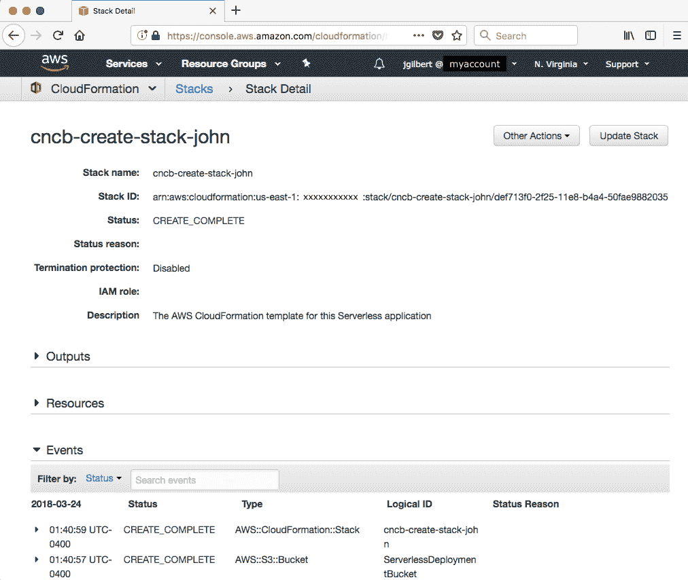
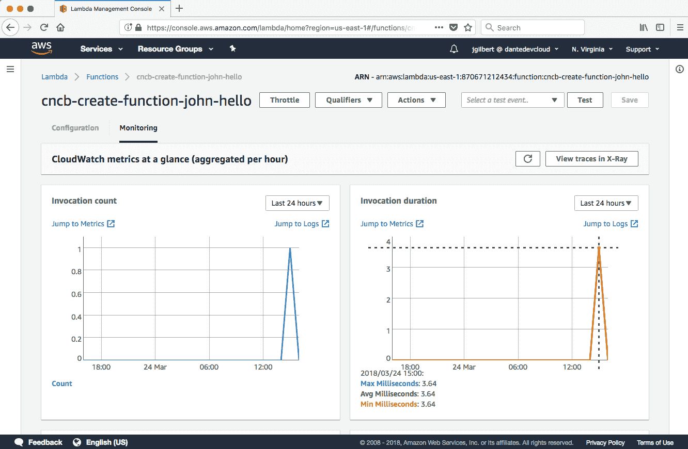
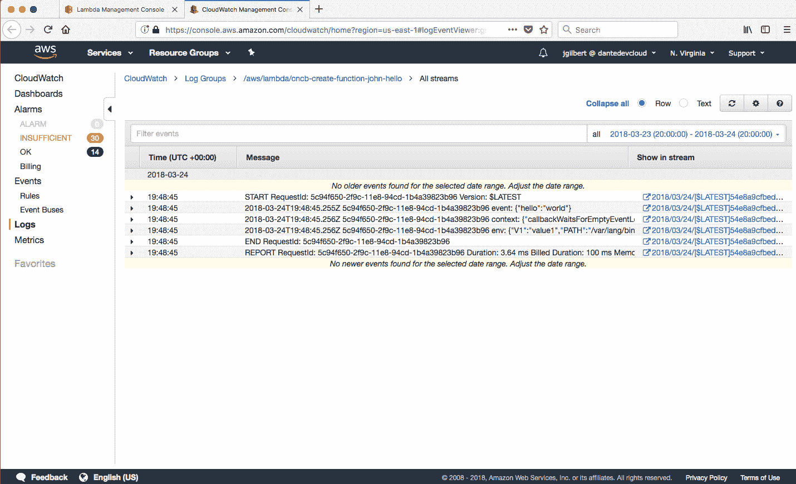
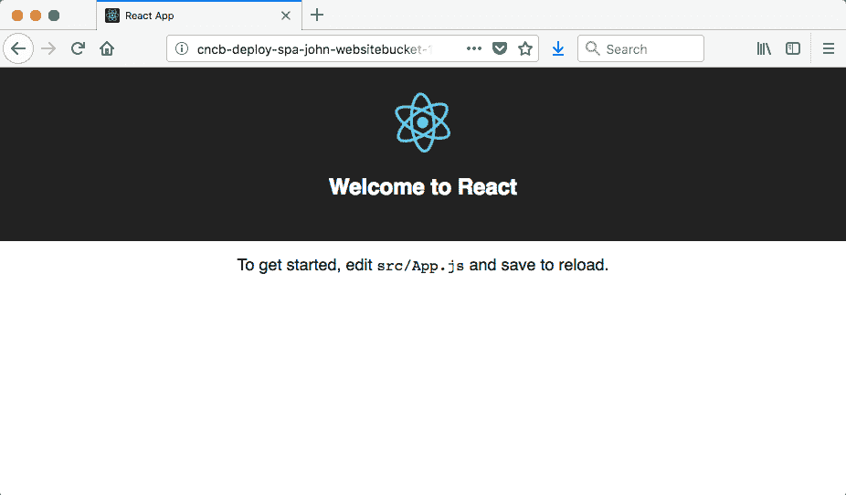

# 第一章：开始使用云原生

本章将涵盖以下食谱：

+   创建一个栈

+   创建一个函数并处理指标和日志

+   创建一个事件流并发布一个事件

+   创建一个流处理器

+   创建一个 API Gateway

+   部署单页应用程序

# 简介

云原生是精简的。今天的公司必须不断尝试新的产品想法，以便能够适应不断变化的市场需求；否则，它们可能会落后于竞争对手。为了以这种速度运营，它们必须利用完全托管的云服务和完全自动化的部署，以最小化上市时间，降低运营风险，并赋予自给自足的全栈团队以更少的努力完成更多的工作。

本食谱中的食谱展示了如何使用完全托管的无服务器云服务来开发和部署精简且自主的服务。本章包含简化的食谱，没有杂乱，以便专注于部署云原生组件的核心方面，并为本书的其余部分建立一个坚实的基础。

# 创建一个栈

每个自主的云原生服务和其所有资源都作为一个统一且自包含的组进行配置，称为**栈**。在 AWS 上，这些是**CloudFormation**栈。在本食谱中，我们将使用 Serverless Framework 来创建和管理一个基础栈，以突出部署云原生服务所涉及的步骤。

# 准备工作

在开始本食谱之前，您需要按照*前言*中的说明配置您的开发环境，包括 Node.js、Serverless Framework 和 AWS 账户凭证。

# 如何操作...

1.  从以下模板创建项目：

```js
$ sls create --template-url https://github.com/danteinc/js-cloud-native-cookbook/tree/master/ch1/create-stack --path cncb-create-stack
```

1.  使用 `cd cncb-create-stack` 切换到 `cncb-create-stack` 目录。

1.  查看名为 `serverless.yml` 的文件，内容如下：

```js
service: cncb-create-stack

provider:
  name: aws
```

1.  查看名为 `package.json` 的文件，内容如下：

```js
{
  "name": "cncb-create-stack",
  "version": "1.0.0",
  "private": true,
  "scripts": {
    "test": "sls package -r us-east-1 -s test",
    "dp:lcl": "sls deploy -r us-east-1",
    "rm:lcl": "sls remove -r us-east-1"
  },
  "devDependencies": {
    "serverless": "1.26.0"
  }
}
```

1.  使用 `npm install` 安装依赖项。

1.  使用 `npm test` 运行测试。

1.  查看在 `.serverless` 目录中生成的内容。

1.  部署栈：

```js
$ npm run dp:lcl -- -s $MY_STAGE

> cncb-create-stack@1.0.0 dp:lcl <path-to-your-workspace>/cncb-create-stack
> sls deploy -r us-east-1 "-s" "john"

Serverless: Packaging service...
Serverless: Creating Stack...
Serverless: Checking Stack create progress...
.....
Serverless: Stack create finished...
Serverless: Uploading CloudFormation file to S3...
Serverless: Uploading artifacts...
Serverless: Validating template...
Serverless: Updating Stack...
Service Information
service: cncb-create-stack
stage: john
region: us-east-1
stack: cncb-create-stack-john
api keys:
 None
endpoints:
 None
functions:
 None
```

1.  在 AWS 控制台中查看栈：



1.  使用 `npm run rm:lcl -- -s $MY_STAGE` 删除栈。

# 它是如何工作的...

**Serverless Framework**（**SLS**）([`serverless.com/framework/docs`](https://serverless.com/framework/docs)）是我部署云资源的首选工具，无论是否部署无服务器资源，如函数。SLS 实质上是建立在**基础设施即代码**工具（如 AWS CloudFormation）之上的抽象层，具有插件和动态变量等可扩展功能。我们将使用 SLS 在所有食谱中。每个食谱都从使用 SLS 功能通过克隆模板来 `创建` 一个新项目开始。您最终可能希望创建自己的模板，以便快速启动自己的项目。

这个第一个项目尽可能简单。它本质上创建了一个空的 CloudFormation 堆栈。在 `serverless.yml` 文件中，我们定义了 `service` 名称和 `provider`。`service` 名称将与即将讨论的 `stage` 结合，以在您的账户和 `region` 内创建一个唯一的堆栈名称。我已将所有堆栈的前缀设置为 `cncb`，以便在您使用共享账户（如工作中的开发或沙盒账户）时，在 AWS 控制台中轻松筛选这些堆栈。

我们下一个最重要的工具是 **Node 包管理器**（**NPM**）([`docs.npmjs.com/`](https://docs.npmjs.com/))。我们不会打包任何 Node 模块（也称为库），但我们将利用 NPM 的依赖关系管理和脚本功能。在 `package.json` 文件中，我们声明了对 Serverless Framework 的开发依赖，以及三个自定义脚本，用于测试、部署和删除我们的堆栈。我们执行的第一条命令是 `npm install`，它将安装所有声明的依赖项到项目的 `node_modules` 目录中。

接下来，我们执行 `npm test` 脚本。这是 NPM 提供的几个标准脚本之一，用于提供快捷别名。我们定义了 `test` 脚本来调用 `sls package` 命令，以断言一切配置是否正确，并帮助我们了解底层发生了什么。此命令处理 `serverless.yml` 文件，并在 `.serverless` 目录中生成 CloudFormation 模板。Serverless Framework 的一个优点是它体现了最佳实践，并采用 **异常配置** 方法，在 `serverless.yml` 文件中只声明少量内容，并将其扩展为更详细的 CloudFormation 模板。

现在，我们已经准备好部署堆栈。作为开发者，我们需要能够独立于其他开发者和其他环境（如生产环境）部署堆栈并进行工作。为了支持这一需求，SLS 使用了 **阶段** 的概念。阶段 (`-s $MY_STAGE`) 和区域 (`-r us-east-1`) 是调用 SLS 命令时的两个必需的命令行选项。堆栈被部署到特定的区域，阶段用作堆栈名称的前缀，以使其在账户和区域内部独特。使用此功能，每个开发者都可以使用他们的名字作为阶段，通过 `npm run dp:lcl -- -s $MY_STAGE` 来 *部署*（`dp`）我所说的 *本地*（`lcl`）堆栈。在示例中，我使用我的名字作为阶段。我们在 *准备就绪* 部分中声明了 `$MY_STAGE` 环境变量。双横线（`--`）是 NPM 让我们向自定义脚本传递额外选项的方式。在 第六章，*构建持续部署管道* 中，我们将讨论将堆栈部署到共享环境，如 **预发布** 和 **生产**。

CloudFormation 在 API 请求中对模板体的大小有限制。典型的模板很容易超过这个限制，必须上传到 S3。Serverless Framework 为我们处理了这个复杂性。在`.serverless`目录中，您会注意到有一个`cloudformation-template-create-stack.json`文件，它声明了一个`ServerlessDeploymentBucket`。在`sls deploy`输出中，您可以看到 SLS 首先使用这个模板，然后它将`cloudformation-template-update-stack.json`文件上传到桶中并更新堆栈。这个问题已经为我们解决是很令人高兴的，因为通常是通过困难的方式才了解到这个限制。

初看起来，创建一个空堆栈可能似乎是一个愚蠢的想法，但实际上它非常有用。从某种意义上说，您可以将 CloudFormation 视为云资源的 CRUD 工具。CloudFormation 跟踪堆栈中所有资源的状态。它知道何时一个资源是新添加到堆栈中并且必须被创建，何时一个资源已从堆栈中移除并且必须被删除，以及何时资源已更改并且必须被更新。它还管理资源之间的依赖关系和顺序。此外，当堆栈的更新失败时，它会回滚所有更改。

不幸的是，当部署大量更改时，如果在最后更改的资源中发生错误，这些回滚操作可能会非常耗时且痛苦。因此，最好以小批量逐步进行更改。在第六章《构建持续部署管道》中，我们将讨论小批量大小、任务分支工作流程以及将部署与发布解耦的实践。目前，如果您是从经过验证的模板创建新服务，那么请初始化新项目，并使用所有模板默认设置通过第一次拉取请求将堆栈部署到生产环境。然后，为每个增量更改创建一个新的分支。然而，如果您正在开发一个没有经过验证的起始点的实验性服务，那么对于您的第一次生产部署，一个空堆栈是完全合理的。

在您的日常开发工作中，当您完成一个任务或故事的工作后，清理您的本地堆栈是很重要的。当孤儿堆栈积累且很少被移除时，开发账户的成本可能会意外地很高。`npm run rm:lcl -- -s $MY_STAGE` 脚本就是为了这个目的。

# 创建函数以及与指标和日志一起工作

**函数即服务**是云原生架构的基石。函数使自给自足的全栈团队能够专注于交付精简的业务解决方案，而无需被运行云基础设施的复杂性所拖累。没有要管理的服务器，并且函数隐式地扩展以满足需求。它们与其他增值云服务（如流、数据库、API 网关、日志和指标）集成，以进一步加速开发。函数是可丢弃的架构，赋予团队能够尝试不同解决方案的能力。这个配方演示了部署函数是多么简单。

# 如何操作...

1.  从以下模板创建项目：

```js
$ sls create --template-url https://github.com/danteinc/js-cloud-native-cookbook/tree/master/ch1/create-function --path cncb-create-function
```

1.  使用 `cd cncb-create-function` 命令导航到 `cncb-create-function` 目录。

1.  查看以下内容的 `serverless.yml` 文件：

```js
service: cncb-create-function

provider:
  name: aws
  runtime: nodejs8.10
  environment:
    V1: value1

functions:
  hello:
    handler: handler.hello
```

1.  查看以下内容的 `handler.js` 文件：

```js
module.exports.hello = (event, context, callback) => {
  console.log('event: %j', event);
  console.log('context: %j', context);
  console.log('env: %j', process.env);

  callback(null, 'success');
};
```

1.  使用 `npm install` 安装依赖项。

1.  使用 `npm test` 运行测试。

1.  查看在 `.serverless` 目录中生成的内容。

1.  部署堆栈：

```js
$ npm run dp:lcl -- -s $MY_STAGE

> cncb-create-function@1.0.0 dp:lcl <path-to-your-workspace>/cncb-create-function
> sls deploy -r us-east-1 "-s" "john"

Serverless: Packaging service...
Serverless: Excluding development dependencies...
Serverless: Creating Stack...
Serverless: Checking Stack create progress...
.....
Serverless: Stack create finished...
Serverless: Uploading CloudFormation file to S3...
Serverless: Uploading artifacts...
Serverless: Uploading service .zip file to S3 (881 B)...
Serverless: Validating template...
Serverless: Updating Stack...
Serverless: Checking Stack update progress...
.................
Serverless: Stack update finished...
Service Information
service: cncb-create-function
stage: john
region: us-east-1
stack: cncb-create-function-john
api keys:
 None
endpoints:
 None
functions:
 hello: cncb-create-function-john-hello
```

1.  在 AWS 控制台中查看堆栈和函数。

1.  使用以下命令调用函数：

```js
$ sls invoke -r us-east-1 -f hello -s $MY_STAGE -d '{"hello":"world"}'
"success"
```

1.  在 AWS 控制台中查看函数指标：



1.  在 AWS 控制台中查看函数日志：



1.  在本地查看日志：

```js
$ sls logs -f hello -r us-east-1 -s $MY_STAGE
START RequestId: ... Version: $LATEST
2018-03-24 15:48:45 ... event: {"hello":"world"}
2018-03-24 15:48:45 ... context: {"functionName":"cncb-create-function-john-hello","memoryLimitInMB":"1024", ...}
2018-03-24 15:48:45 ... env: {"V1":"value1","TZ":":UTC","AWS_REGION":"us-east-1", "AWS_ACCESS_KEY_ID":"...", ...}
END RequestId: ...
REPORT ... Duration: 3.64 ms Billed Duration: 100 ms ... Max Memory Used: 20 MB    
```

1.  完成操作后，使用 `npm run rm:lcl -- -s $MY_STAGE` 命令删除堆栈。

# 它是如何工作的...

Serverless 框架处理繁重的工作，这使我们能够专注于编写实际的函数代码。首先要注意的是，我们必须在 `serverless.yml` 文件中定义 `runtime: nodejs8.10`。接下来，我们在 `functions` 部分定义一个函数，包括一个名称和处理程序。所有其他设置都默认，遵循**异常配置**方法。当你查看生成的 CloudFormation 模板时，你会看到仅从 `serverless.yml` 文件中声明的几行代码就生成了超过 100 行。生成模板的大部分内容都用于定义样板化的安全策略。深入查看 `.serverless/cloudformation-template-update-stack.json` 文件以查看详细信息。

我们还在 `serverless.yml` 中定义了 `environment` 变量。这允许函数根据部署阶段进行参数化。我们将在第六章构建持续部署管道中更详细地介绍这一点。这也允许设置，如调试级别，可以临时调整而不需要重新部署函数。

当我们部署项目时，Serverless Framework 会将函数及其在`package.json`文件中指定的运行时依赖项打包到一个 ZIP 文件中。然后，它将 ZIP 文件上传到`ServerlessDeploymentBucket`，以便 CloudFormation 可以访问。部署命令的输出显示了这一过程。您可以在`.serverless`目录中查看 ZIP 文件的内容或从部署存储桶中下载它。我们将在第九章《优化性能》中介绍高级打包选项。

AWS Lambda 函数的签名很简单。它必须导出一个接受三个参数的函数：一个事件对象、一个上下文对象和一个回调函数。我们的第一个函数将仅记录事件、内容和环境变量，以便我们可以稍微了解执行环境。最后，我们必须调用回调。这是一个标准的 JavaScript 回调。我们将错误传递给第一个参数或成功的结果传递给第二个参数。

日志记录是**函数即服务**（**FaaS**）的一个重要标准功能。由于云资源的短暂性，轻描淡写地说，云中的日志记录可能会很繁琐。在 AWS Lambda 中，控制台日志是异步执行的，并记录在 CloudWatch 日志中。这是一个内置的完全托管日志解决方案。花点时间查看此函数写入的日志语句的详细信息。环境变量尤其有趣。例如，我们可以看到每个函数调用都会获得一个新的临时访问密钥。

函数还提供了一套标准的指标，例如调用次数、持续时间、错误、节流等。我们将在第七章《优化可观察性》中详细介绍这一点。

# 创建事件流并发布事件

云原生服务是自治的。每个服务都是完全自给自足的，并且独立运行以最小化任何给定服务出现故障时的影响范围。为了实现这种隔离，必须在服务之间建立**防波堤**。**事件流**是创建这些防波堤的一种机制。自治的云原生服务通过流异步执行所有服务间通信，从而解耦上游服务与下游服务。在第二章，《应用事件源和 CQRS 模式》中，我们将更深入地探讨我们如何创建有界、隔离和自治的云原生服务。此配方创建了我们将在整个食谱中使用的的事件流，并提供了一个将事件发布到流的函数。

# 如何操作...

1.  从以下模板创建项目：

```js
$ sls create --template-url https://github.com/danteinc/js-cloud-native-cookbook/tree/master/ch1/event-stream --path cncb-event-stream
```

1.  使用 `cd cncb-event-stream` 命令进入 `cncb-event-stream` 目录。

1.  查看名为 `serverless.yml` 的文件，其内容如下：

```js
service: cncb-event-stream

provider:
  name: aws
  runtime: nodejs8.10
  iamRoleStatements:
    - Effect: Allow
      Action:
        - kinesis:PutRecord
      Resource:
        Fn::GetAtt: [ Stream, Arn ]

functions:
  publish:
    handler: handler.publish
    environment:
      STREAM_NAME:
        Ref: Stream

resources:
  Resources:
    Stream:
      Type: AWS::Kinesis::Stream
      Properties:
        Name: ${opt:stage}-${self:service}-s1
        RetentionPeriodHours: 24
        ShardCount: 1

  Outputs:
    streamName:
      Value: 
        Ref: Stream
    streamArn:
      Value: 
        Fn::GetAtt: [ Stream, Arn ]
```

1.  查看以下内容的`handler.js`文件：

```js
const aws = require('aws-sdk');
const uuid = require('uuid');

module.exports.publish = (event, context, callback) => {
  const e = {
    id: uuid.v1(),
    partitionKey: event.partitionKey || uuid.v4(),
    timestamp: Date.now(),
    tags: {
      region: process.env.AWS_REGION,
    },
    ...event,
  }

  const params = {
    StreamName: process.env.STREAM_NAME,
    PartitionKey: e.partitionKey,
    Data: Buffer.from(JSON.stringify(e)),
  };

  const kinesis = new aws.Kinesis();

```

```js
  kinesis.putRecord(params, callback);
};
```

1.  使用`npm install`安装依赖项。

1.  使用`npm test`运行测试。

1.  查看在`.serverless`目录中生成的内容。

1.  部署堆栈：

```js
$ npm run dp:lcl -- -s $MY_STAGE

> cncb-create-stream@1.0.0 dp:lcl <path-to-your-workspace>/cncb-create-stream
> sls deploy -v -r us-east-1 "-s" "john"

Serverless: Packaging service...
...
Serverless: Stack update finished...
Service Information
service: cncb-event-stream
stage: john
region: us-east-1
stack: cncb-event-stream-john
...
functions:
 publish: cncb-event-stream-john-publish

Stack Outputs
PublishLambdaFunctionQualifiedArn: arn:aws:lambda:us-east-1:999999999999:function:cncb-event-stream-john-publish:3
streamArn: arn:aws:kinesis:us-east-1:999999999999:stream/john-cncb-event-stream-s1
streamName: john-cncb-event-stream-s1
...
```

1.  在 AWS 控制台中查看堆栈、流和函数。

1.  使用以下命令调用函数：

```js
$ sls invoke -r us-east-1 -f publish -s $MY_STAGE -d '{"type":"thing-created"}'
{
    "ShardId": "shardId-000000000000",
    "SequenceNumber": "49582906351415672136958521359460531895314381358803976194"
}
```

1.  查看日志：

```js
$ sls logs -f publish -r us-east-1 -s $MY_STAGE
START ...
2018-03-24 23:20:46 ... event: {"type":"thing-created"}
2018-03-24 23:20:46 ... event:
{
  "type":"thing-created",
  "id":"81fd8920-2fdb-11e8-b749-0d2c43ec73d0",
  "partitionKey":"6f4f9a38-61f7-41c9-a3ad-b8c16e42db7c",
  "timestamp":1521948046003,
  "tags":{
    "region":"us-east-1"
  }
}
2018-03-24 23:20:46 ... params: {"StreamName":"john-cncb-event-stream-s1","PartitionKey":"6f4f9a38-61f7-41c9-a3ad-b8c16e42db7c","Data":{"type":"Buffer","data":[...]}}
END ...
REPORT ... Duration: 153.47 ms    Billed Duration: 200 ms ... Max Memory Used: 39 MB    
```

1.  完成后，使用`npm run rm:lcl -- -s $MY_STAGE`删除堆栈。

此堆栈是其他菜谱的先决条件，如每个菜谱的*准备就绪*部分所示。如果你正在继续相关菜谱，那么你可以让这个堆栈运行，直到你完成相关菜谱。然而，此堆栈中的流不包括在 AWS 免费层中，因此你可能想先删除此堆栈，并在需要时重新创建它。

# 它是如何工作的...

`serverless.yml`文件的`resources`部分用于创建由服务使用的云资源。这些资源使用标准的 AWS CloudFormation 资源类型定义。在这个菜谱中，我们创建了一个 AWS *Kinesis* 流。我们给流起了一个名字，定义了保留期，并指定了分片数量。Serverless Framework 提供了一个强大的机制来动态替换变量。

在这里，我们使用命令行中传入的`${opt:stage}`选项和`serverless.yml`文件中定义的`${self:service}`名称来创建一个唯一的流名称。标准保留期是 24 小时，最大是 7 天。对于我们的菜谱，一个分片将绰绰有余。我们将在不久的将来讨论分片，并在第七章，*优化可观察性*和第九章，*优化性能*中再次讨论。

`serverless.yml`文件的`Outputs`部分是我们定义要在外部堆栈中使用的值的区域，例如生成的 ID 和名称。我们输出**Amazon Resource Names**（**ARNs**）`streamName`和`streamArn`，这样我们就可以在其他项目中使用 Serverless Framework 变量来引用它们。这些值在部署完成后也会在终端上显示。

在`serverless.yml`文件中定义的`publish`函数用于演示如何将事件发布到流中。我们将`STREAM_NAME`作为环境变量传递给函数。在`iamRoleStatements`部分，我们授予函数`kinesis: PutRecord`权限，允许它将事件发布到这个特定的流。

`handler.js` 函数文件依赖于两个外部库——`aws-sdk` 和 `uuid`。Serverless 框架将自动包含在 `package.json` 文件中定义的运行时依赖项。查看生成的 `.serverless/cncb-event-stream.zip` 文件。`aws-sdk` 是一个特殊情况。它已经在 AWS Lambda `Node.js` 运行时中可用，因此不包括在内。这很重要，因为 `aws-sdk` 是一个大型库，ZIP 文件的大小会影响冷启动时间。我们将在第九章 *优化性能* 中更详细地讨论这个问题。

`publish` 函数期望接收一个事件对象作为输入，例如 `{"type":"thing-created"}`。然后我们为事件添加额外的信息，以符合我们的标准事件格式，我们将在稍后讨论。最后，该函数创建所需的 `params` 对象，然后从 `aws-sdk` 调用 `kinesis.putRecord`。我们将在本食谱和其他食谱中使用此函数来模拟事件流量。

我们云原生系统中的所有事件都将符合以下 **事件结构**，以便在所有服务中进行一致的处理。额外的字段是事件类型特定的：

```js
interface Event {
    id: string;
    type: string;
    timestamp: number;
    partitionKey: string;
    tags: { [key: string]: string };
}
```

+   `type` 描述了事件，例如 `thing-created`

+   `timestamp` 是一个纪元值，由 `Date.now()` 返回

+   `id` 应该是一个 V1 UUID，基于时间

+   `partitionKey` 应该是一个 V4 UUID，基于随机数

+   `tags` 是一个包含有用数据值的哈希表，这些值被用于基于内容的路由和聚合事件度量

使用一个 *V4 UUID* 作为 `partitionKey` 非常重要，以避免热点分片并最大化并发性。如果使用 *V1 UUID*，则同一时间产生的所有事件都会进入同一个分片。`partitionKey` 通常将是产生事件的域实体的 ID，这也应该使用 V4 UUID，原因相同。这还有一个额外的优点，即确保所有同一域实体的所有事件都按接收顺序通过同一个分片进行处理。

# 创建流处理器

**流处理器** 在云原生服务中承担大部分繁重的工作。自主云原生服务通过事件流异步执行所有服务间通信，从而解耦上游服务与**下游服务**。**上游服务**将事件发布到流中，无需了解最终将消费这些事件的特定下游服务。下游服务部署流处理函数以消费感兴趣的事件。流处理器将在整个烹饪书中进行详细说明。本食谱演示了如何创建一个监听来自 **AWS Kinesis** 流的事件的函数，并快速介绍了使用函数式响应式编程范式实现流处理。

# 准备工作

在开始此配方之前，您需要一个 AWS Kinesis Stream，例如在 *创建事件流* 配方中创建的那个。

# 如何做...

1.  从以下模板创建项目：

```js
$ sls create --template-url https://github.com/danteinc/js-cloud-native-cookbook/tree/master/ch1/create-stream-processor --path cncb-create-stream-processor
```

1.  使用 `cd cncb-create-stream-processor` 命令进入 `cncb-create-stream-processor` 目录。

1.  查看名为 `serverless.yml` 的文件，其内容如下：

```js
service: cncb-create-stream-processor

provider:
  name: aws
  runtime: nodejs8.10

functions:
  listener:
    handler: handler.listener
    events:
      - stream:
          type: kinesis
          arn: ${cf:cncb-event-stream-${opt:stage}.streamArn}
          batchSize: 100
          startingPosition: TRIM_HORIZON
```

1.  查看名为 `handler.js` 的文件，其内容如下：

```js
const _ = require('highland');

module.exports.listener = (event, context, cb) => {
  _(event.Records)
    .map(recordToEvent)
    .tap(printEvent)
    .filter(forThingCreated)
    .collect()
    .tap(printCount)
    .toCallback(cb);
};

const recordToEvent = r => JSON.parse(Buffer.from(r.kinesis.data, 'base64'));
const forThingCreated = e => e.type === 'thing-created';

const printEvent = e => console.log('event: %j', e);
const printCount = events => console.log('count: %d', events.length);
```

1.  使用 `npm install` 命令安装依赖项。

1.  使用 `npm test -- -s $MY_STAGE` 命令运行测试。

1.  查看 `.serverless` 目录中生成的内容。

1.  部署堆栈：

```js
$ npm run dp:lcl -- -s $MY_STAGE

> cncb-create-stream-processor@1.0.0 dp:lcl <path-to-your-workspace>/cncb-create-stream-processor
> sls deploy -r us-east-1 "-s" "john"

Serverless: Packaging service...
...
Serverless: Stack update finished...
Service Information
service: cncb-create-stream-processor
stage: john
region: us-east-1
stack: cncb-create-stream-processor-john
...
functions:
  listener: cncb-create-stream-processor-john-listener
```

1.  在 AWS 控制台中查看堆栈和函数。

1.  使用以下命令从另一个终端发布事件：

```js
$ cd <path-to-your-workspace>/cncb-event-stream
$ sls invoke -r us-east-1 -f publish -s $MY_STAGE -d '{"type":"thing-created"}'
{
    "ShardId": "shardId-000000000000",
    "SequenceNumber": "49582906351415672136958521360120605392824155736450793474"
}
```

1.  查看原始终端的日志：

```js
$ sls logs -f listener -r us-east-1 -s $MY_STAGE
START ...
2018-03-25 00:16:32 ... event:
{
  "type":"thing-created",
  "id":"81fd8920-2fdb-11e8-b749-0d2c43ec73d0",
  "partitionKey":"6f4f9a38-61f7-41c9-a3ad-b8c16e42db7c",
  "timestamp":1521948046003,
  "tags":{
    "region":"us-east-1"
  }
}
2018-03-25 00:16:32 ... event:
{
  "type":"thing-created",
  "id":"c6f60550-2fdd-11e8-b749-0d2c43ec73d0",
  ...
}
2018-03-25 00:16:32 ... count: 2
END ...
REPORT ... Duration: 7.73 ms    Billed Duration: 100 ms ... Max Memory Used: 22 MB    

START ...
2018-03-25 00:22:22 ... event:
{
  "type":"thing-created",
  "id":"1c2b5150-2fe4-11e8-b749-0d2c43ec73d0",
  ...
}
2018-03-25 00:22:22 ... count: 1
END ...
REPORT ... Duration: 1.34 ms    Billed Duration: 100 ms ... Max Memory Used: 22 MB    

```

1.  完成后，使用 `npm run rm:lcl -- -s $MY_STAGE` 命令删除堆栈。

# 它是如何工作的...

流处理器监听来自流服务（如 **Kinesis** 或 **DynamoDB Streams**）的数据。部署流处理器是完全声明式的。我们使用 `stream` 事件类型和相关设置（如 `type`、`arn`、`batchSize` 和 `startingPosition`）配置一个函数。`arn` 使用 CloudFormation 变量 `${cf:cncb-event-stream-${opt:stage}.streamArn}` 动态设置，该变量引用 `cnbc-event-stream` 堆栈的输出值。

流是唯一在自主云原生服务之间共享的资源。

我们将在第八章 设计故障和第九章 优化性能中详细讨论批量大小和起始位置。目前，您可能已经注意到新的流处理器记录了在过去 24 小时内发布到流中的所有事件。这是因为 `startingPosition` 被设置为 `TRIM_HORIZON`。如果它被设置为 `LATEST`，那么它只会接收在函数创建后发布的事件。

流处理与 Node.js 流的函数式响应式编程非常匹配。术语可能有点令人困惑，因为“流”这个词被过度使用了。我喜欢将流想象成“宏观”或“微观”。例如，Kinesis 是“宏观”流，而我们流处理器函数中的代码是“微观”流。我最喜欢的实现“微观”流的库是 **Highland.js** ([`highlandjs.org`](https://highlandjs.org))。一个流行的替代方案是 **RxJS** ([`rxjs-dev.firebaseapp.com`](https://rxjs-dev.firebaseapp.com))。正如您在这个配方中可以看到的，函数式响应式编程非常直观且易于阅读。其中一个原因是没有任何循环。如果您尝试使用 **命令式编程** 实现流处理器，您会发现它很快就会变得非常混乱。您还会丢失背压，我们将在第八章 设计故障中讨论这一点。

`listener` 函数中的代码创建了一系列步骤，Kinesis 流中的数据最终将通过这些步骤流动。第一步，`_(event.Records)`，将 Kinesis 记录的数组转换为 Highland.js 流对象，允许数组中的每个元素在下游步骤准备好接收下一个元素时依次通过流。`.map(recordToEvent)` 步骤解码 Kinesis 记录中的 Base64 编码数据，并将 JSON 解析为事件对象。下一步，`.tap(printEvent)`，简单地记录事件，以便我们可以看到配方中的情况。

Kinesis 和事件流，通常来说，是高性能、哑管道-智能端点生成消息中间件的一员。这意味着 Kinesis，这个哑管道，不会浪费其处理能力来过滤端点数据。相反，所有这些逻辑都分散在智能端点的处理能力上。我们的流处理器函数是智能端点。为此，`.filter(forThingCreated)` 步骤负责过滤掉处理器不感兴趣的事件。所有剩余的步骤都可以假设它们正在接收预期的事件类型。

我们这个简单的流处理器需要做一些有趣但简单的事情。因此，我们统计并打印批次中 `thing-created` 事件的数量。我们已经过滤掉了所有其他事件类型，所以 `.collect()` 步骤将所有剩余的事件收集到一个数组中。然后，`.tap(printCount)` 步骤记录数组的长度。最后，`.toCallback(cb)` 步骤将在批次中的所有数据都处理完毕后调用回调函数。此时，Kinesis 检查点将前进，并处理下一批事件。我们将在第八章 设计故障处理中介绍错误处理及其与批次和检查点的关联。

# 创建 API 网关

API 网关是云原生架构的一个基本元素。它为我们云原生系统的边界提供了一个安全且高效的防护。边界是系统与系统外部的一切（包括人类和其他系统）交互的地方。我们将利用 API 网关在创建边界组件（如 **Backend For Frontend**（BFF）或外部服务网关）的配方中。本配方演示了部署 API 网关是多么简单。

# 如何操作...

1.  从以下模板创建项目：

```js
$ sls create --template-url https://github.com/danteinc/js-cloud-native-cookbook/tree/master/ch1/create-api-gateway --path cncb-create-api-gateway
```

1.  使用 `cd cncb-create-api-gateway` 切换到 `cncb-create-api-gateway` 目录。

1.  查看名为 `serverless.yml` 的文件，其内容如下：

```js
service: cncb-create-api-gateway

provider:
  name: aws
  runtime: nodejs8.10

functions:
  hello:
    handler: handler.hello
    events:
      - http:
          path: hello
          method: get
          cors: true
```

1.  查看名为 `handler.js` 的文件，其内容如下：

```js
module.exports.hello = (event, context, callback) => {
  console.log('event: %j', event);

  const response = {
    statusCode: 200,
    headers: {
      'Access-Control-Allow-Origin': '*',
    },
    body: JSON.stringify({
      message: 'JavaScript Cloud Native Development Cookbook! Your function executed successfully!',
      input: event,
    }),
  };

  callback(null, response);
};
```

1.  使用 `npm install` 安装依赖项。

1.  使用 `npm test` 运行测试。

1.  查看在 `.serverless` 目录中生成的内容。

1.  部署堆栈：

```js
$ npm run dp:lcl -- -s $MY_STAGE

> cncb-create-api-gateway@1.0.0 dp:lcl <path-to-your-workspace>/cncb-create-api-gateway
> sls deploy -r us-east-1 "-s" "john"

Serverless: Packaging service...
.....
Serverless: Stack update finished...
Service Information
service: cncb-create-api-gateway
stage: john
region: us-east-1
stack: cncb-create-api-gateway-john
api keys:
  None
endpoints:
  GET - https://k1ro5oasm6.execute-api.us-east-1.amazonaws.com/john/hello
functions:
  hello: cncb-create-api-gateway-john-hello
```

1.  在 AWS 控制台中查看堆栈、API 和函数。

1.  在以下命令中调用堆栈输出中显示的 `endpoint`：

```js
$ curl -v https://k1ro5oasm6.execute-api.us-east-1.amazonaws.com/john/hello | json_pp

{
   "input" : {
      "body" : null,
      "pathParameters" : null,
      "requestContext" : { ... },
      "resource" : "/hello",
      "headers" : { ... },
      "queryStringParameters" : null,
      "httpMethod" : "GET",
      "stageVariables" : null,
      "isBase64Encoded" : false,
      "path" : "/hello"
   },
   "message" : "JavaScript Cloud Native Development Cookbook! Your function executed successfully!"
}
```

1.  查看日志：

```js
$ sls logs -f hello -r us-east-1 -s $MY_STAGE

START ...
2018-03-25 01:04:47 ... event: {"resource":"/hello","path":"/hello","httpMethod":"GET","headers":{ ... },"requestContext":{ ... },"body":null,"isBase64Encoded":false}
END 
REPORT ... Duration: 2.82 ms    Billed Duration: 100 ms ... Max Memory Used: 20 MB    
```

1.  完成操作后，使用 `npm run rm:lcl -- -s $MY_STAGE` 删除堆栈。

# 它是如何工作的...

创建 API 网关是完全声明式的。我们只需配置一个具有 `http` 事件类型和相关设置的函数，例如 `path` 和 `method`。所有其他设置都遵循 **异常配置** 方法默认设置。当你查看生成的 `.serverless/cloudformation-template-update-stack.json` 文件时，你会看到仅从 `serverless.yml` 文件中声明的几行代码就生成了超过 100 行。API 名称是根据 `serverless.yml` 文件顶部的服务名称和指定的阶段组合计算得出的。无服务器项目和 API 网关之间存在一对一的映射。项目中所有使用 `http` 事件声明的函数都包含在 API 中。

函数的签名与其他函数相同；然而，事件的内容和预期的响应格式是针对 API 网关服务的。`event` 包含 HTTP 请求的全部内容，包括路径、参数、头部、主体等。`response` 需要一个 `statusCode` 和选项头部和主体。主体必须是一个字符串，头部必须是一个对象。我使用 `cors: true` 设置声明了函数，以便食谱可以包括一组合法的响应头部。我们将在 第五章，*保护云原生系统* 中详细讨论安全性。目前，知道 SSL、节流和 DDoS 保护是 AWS API 网关的默认功能。

API 网关的 `endpoint` 被声明为堆栈输出，并在部署堆栈后显示。我们将在 第四章，*利用云的边缘* 和 第十章，*部署到多个区域* 中看到自定义端点的方法。一旦调用服务，你将能够看到输入和输出的详细信息，包括编码的 HTTP 响应以及函数的日志。同时查看 AWS 控制台中的 API 网关。然而，自动化和 *Serverless Framework* 的目标是消除在控制台中进行更改的需要。我在写这本书时查看控制台中的 API，但除此之外，我不记得上一次我真正需要进入 API 网关控制台是什么时候了。

# 部署单页应用程序

当我意识到可以将单页应用，如 Angular，部署到 S3 存储桶，并无需服务器和负载均衡器即可在全球范围内提供时，云原生灯泡首先在我的脑海中亮起。这是我第一次云原生 W*ow!*时刻。这是我开始理解云原生完全遵循一套不同规则的时刻。S3 和基于 JavaScript 的 UI 的组合提供了一种几乎无限可扩展、几乎无成本和几乎没有操作烦恼的 Web 表示层。这个配方展示了部署单页应用是多么简单。

# 如何操作...

1.  从以下模板创建项目：

```js
$ sls create --template-url https://github.com/danteinc/js-cloud-native-cookbook/tree/master/ch1/deploy-spa --path cncb-deploy-spa
```

1.  使用`cd cncb-deploy-spa`导航到`cncb-deploy-spa`目录。

1.  检查名为`serverless.yml`的文件，其内容如下：

```js
service: cncb-deploy-spa

provider:
  name: aws

plugins:
  - serverless-spa-deploy

custom:
  spa:
    files:
      - source: ./build
        globs: '**/*'
        headers:
          CacheControl: max-age=300

resources:
  Resources:
    WebsiteBucket:
      Type: AWS::S3::Bucket
      Properties:
        AccessControl: PublicRead
        WebsiteConfiguration:
          IndexDocument: index.html
          ErrorDocument: index.html

  Outputs:
    WebsiteBucketName:
      Value:
        Ref: WebsiteBucket
    WebsiteURL:
      Value:
        Fn::GetAtt: [ WebsiteBucket, WebsiteURL ]
```

1.  检查名为`package.json`的文件，其内容如下：

```js
{
  "name": "cncb-deploy-spa",
  "version": "1.0.0",
  "private": true,
  "scripts": {
    "start": "react-scripts start",
    "build": "react-scripts build",
    "test": "sls package -r us-east-1 -s test",
    "dp:lcl": "sls deploy -v -r us-east-1",
    "rm:lcl": "sls remove -r us-east-1"
  },
  "dependencies": {
    "react": "16.2.0",
    "react-dom": "16.2.0"
  },
  "devDependencies": {
    "react-scripts": "1.1.1",
    "serverless": "1.26.0",
    "serverless-spa-deploy": "¹.0.0"
  }
}
```

1.  使用`npm install`安装依赖。

1.  使用`npm start`在本地运行应用。

1.  使用`npm test`运行测试。

1.  检查`.serverless`目录中生成的内容。

1.  使用`npm run build`构建应用。

1.  检查`build`目录中生成的内容。

1.  部署栈：

```js
$ npm run dp:lcl -- -s $MY_STAGE

> cncb-deploy-spa@1.0.0 dp:lcl <path-to-your-workspace>/cncb-deploy-spa
> sls deploy -v -r us-east-1 "-s" "john"

Serverless: Packaging service...
...
Serverless: Stack update finished...
...
Stack Outputs
WebsiteBucketName: cncb-deploy-spa-john-websitebucket-1s8hgqtof7la7
WebsiteURL: http://cncb-deploy-spa-john-websitebucket-1s8hgqtof7la7.s3-website-us-east-1.amazonaws.com
...
Serverless: Path: ./build
Serverless: File: asset-manifest.json (application/json)
Serverless: File: favicon.ico (image/x-icon)
Serverless: File: index.html (text/html)
Serverless: File: manifest.json (application/json)
Serverless: File: service-worker.js (application/javascript)
Serverless: File: static/css/main.c17080f1.css (text/css)
Serverless: File: static/css/main.c17080f1.css.map (application/json)
Serverless: File: static/js/main.ee7b2412.js (application/javascript)
Serverless: File: static/js/main.ee7b2412.js.map (application/json)
Serverless: File: static/media/logo.5d5d9eef.svg (image/svg+xml)
```

1.  在 AWS 控制台中检查栈和存储桶。

1.  浏览栈输出中显示的`WebsiteURL`：



1.  完成操作后，使用`npm run rm:lcl -- -s $MY_STAGE`删除栈。

# 它是如何工作的...

首先要注意的是，我们正在使用全套相同的开发工具。这是使用 JavaScript 进行后端开发的优势之一。一个单一、自给自足的全栈团队能够使用相同的编程语言开发前端应用和 BFF 服务。这可以允许更有效地利用团队资源。

有两个新的标准脚本——`start`和`build`。`npm start`将使用 Node.js 作为网络服务器在本地运行前端应用。`npm run build`将为部署准备应用。我使用了`react-scripts`库，以便不使示例因详细的 ReactJS 构建过程而变得杂乱。这个配方使用了一个小型、预制的 ReactJS 示例，原因相同。我想创建一个足够大的应用，以便有东西可以部署。ReactJS 不是这个配方或食谱的重点。已经有大量关于 ReactJS 和类似框架的书籍。

我们正在创建一个 S3 存储桶，名为`WebsiteBucket`，并将其配置为网站。栈输出显示了用于访问 SPA 的`WebsiteUrl`。SPA 将从无需服务器的存储桶中提供。在这种情况下，我们可以将 S3 视为一个全球性的网络服务器。

我们在这个菜谱中首次使用无服务器插件。`serverless-spa-deploy` 插件将在栈部署后从 `./build` 目录上传 SPA 文件。请注意，我们没有明确命名存储桶。CloudFormation 将使用随机后缀生成名称。这很重要，因为存储桶名称必须是全局唯一的。插件推断生成的存储桶名称。该插件有合理的默认设置，可以进行自定义，例如更改不同文件的 `CacheControl` 头部。插件还会在栈移除前清空存储桶。

我们将在 第四章 中构建这个架构，*利用云的边缘*。
