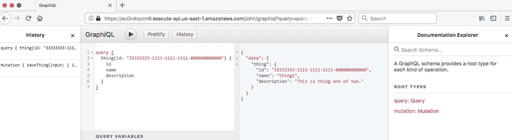
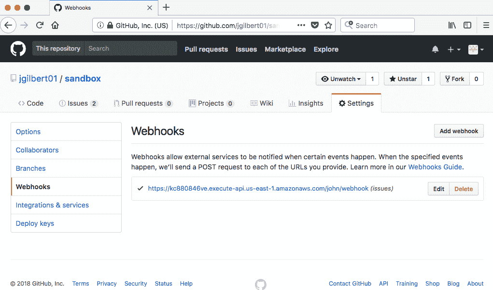

# 第三章：实现自治服务

在本章中，将涵盖以下食谱：

+   实现 GraphQL CRUD BFF

+   实现搜索 bff

+   实现分析 bff

+   实现入站外部服务网关

+   实现出站外部服务网关

+   协调服务之间的协作

+   实现一个 Saga

# 简介

在第一章，*云原生入门*中，我们开始了了解为什么云原生是精简和自治的旅程。我们专注于展示如何利用完全管理的云服务赋予自给自足的全栈团队能够自信地快速和持续地交付创新的食谱。在第二章，*应用事件源和 CQRS 模式*中，我们通过食谱展示了这些模式如何建立防波堤，从而能够创建自治服务。

在本章中，我们将所有这些基础组件通过实现自治服务模式的食谱汇集在一起。在我的书中，[云原生开发模式和最佳实践](https://www.packtpub.com/application-development/cloud-native-development-patterns-and-best-practices)，我讨论了将云原生系统分解为有界、隔离和自治服务的各种方法。

每个服务当然应该有一个边界上下文和单一职责，但我们也可以根据其他维度分解服务。数据生命周期是定义服务时的重要考虑因素，因为随着数据变老，用户、需求和持久化机制可能会发生变化。我们还可以根据边界和控制模式分解服务。边界服务，如**前端后端**（**BFF**）或**外部服务网关**（**ESG**），与系统外的事物交互，如人类和其他系统。控制服务协调这些解耦边界服务之间的交互。本章中的食谱展示了这些分解策略的常见排列组合。

# 实现 GraphQL CRUD BFF

BFF 模式加速了创新，因为实现前端服务的团队也拥有并实现了支持前端的后端服务。这使得团队能够自给自足，不受对共享后端服务的竞争需求的束缚。在本食谱中，我们将创建一个支持其生命周期初期的数据的 CRUD BFF 服务。该服务的单一职责是为特定边界上下文编写数据。它利用*数据库优先*的事件源将领域事件发布到下游服务。该服务公开了一个基于 GraphQL 的 API。

# 准备工作

在开始此食谱之前，您需要一个 AWS Kinesis 流，例如在*创建事件流*食谱中创建的流。

# 如何做...

1.  从以下模板创建项目：

```js
$ sls create --template-url https://github.com/danteinc/js-cloud-native-cookbook/tree/master/ch3/bff-graphql-crud --path cncb-bff-graphql-crud
```

1.  使用 `cd cncb-bff-graphql-crud` 命令导航到 `cncb-bff-graphql-crud` 目录。

1.  检查名为 `serverless.yml` 的文件，其内容如下：

```js
service: cncb-bff-graphql-crud

provider:
  name: aws
  runtime: nodejs8.10
  iamRoleStatements:
    ...

functions:
  graphql:
    handler: handler.graphql
    events:
      - http:
          path: graphql
          method: post
          cors: true
    environment:
      TABLE_NAME:
        Ref: Table
  graphiql:
    handler: handler.graphiql
    ...
  trigger:
    handler: handler.trigger
    events:
      - stream:
          type: dynamodb
          ...

resources:
  Resources:
    Table:
      Type: AWS::DynamoDB::Table
      ...
```

1.  检查名为 `./schema/thing/typedefs.js` 的文件，其内容如下：

```js
module.exports = `
  type Thing {
    id: String!
    name: String
    description: String
  }

  type ThingConnection {
    items: [Thing!]!
    cursor: String
  }

  extend type Query {
    thing(id: String!): Thing
    things(name: String, limit: Int, cursor: String): ThingConnection
  }

  input ThingInput {
    id: String
    name: String!
    description: String
  }

  extend type Mutation {
    saveThing(
      input: ThingInput
    ): Thing
    deleteThing(
      id: ID!
    ): Thing
  }
`;
```

1.  检查名为 `./schema/thing/resolvers.js` 的文件，其内容如下：

```js
module.exports = {
  Query: {
    thing(_, { id }, ctx) {
      return ctx.models.Thing.getById(id);
    },
    things(_, { name, limit, cursor }, ctx) {
      return ctx.models.Thing.queryByName(name, limit, cursor);
    },
  },
  Mutation: {
    saveThing: (_, { input }, ctx) => {
      return ctx.models.Thing.save(input.id, input);
    },
    deleteThing: (_, args, ctx) => {
      return ctx.models.Thing.delete(args.id);
    },
  },
};
```

1.  检查名为 `handler.js` 的文件，其内容如下：

```js
...
const { graphqlLambda, graphiqlLambda } = require('apollo-server-lambda');
const schema = require('./schema');
const Connector = require('./lib/connector');
const { Thing } = require('./schema/thing');

module.exports.graphql = (event, context, cb) => {
  graphqlLambda(
    (event, context) => {
      return {
        schema, context: { models: {
            Thing: new Thing( new Connector(process.env.TABLE_NAME) )
          } }
      };
    }
  )(event, context, (error, output) => {
    cb(error, ...);
  });
};
. . .
```

1.  使用 `npm install` 安装依赖项。

1.  使用 `npm test -- -s $MY_STAGE` 运行测试。

1.  检查 `.serverless` 目录中生成的内容。

1.  部署堆栈：

```js
$ npm run dp:lcl -- -s $MY_STAGE

> cncb-bff-graphql-crud@1.0.0 dp:lcl <path-to-your-workspace>/cncb-bff-graphql-crud
> sls deploy -v -r us-east-1 "-s" "john"

Serverless: Packaging service...
...
Serverless: Stack update finished...
...
endpoints:
  POST - https://ac0n4oyzm6.execute-api.us-east-1.amazonaws.com/john/graphql
  GET - https://ac0n4oyzm6.execute-api.us-east-1.amazonaws.com/john/graphiql
functions:
  graphql: cncb-bff-graphql-crud-john-graphql
  graphiql: cncb-bff-graphql-crud-john-graphiql
  trigger: cncb-bff-graphql-crud-john-trigger

Stack Outputs
...
ServiceEndpoint: https://ac0n4oyzm6.execute-api.us-east-1.amazonaws.com/john
...
```

1.  在 AWS 控制台中检查堆栈。

1.  使用以下 `curl` 命令调用函数：

确保将端点中的 API 网关 ID（即 `ac0n4oyzm6`）替换为部署期间输出的值。

```js
$ curl -X POST -H 'Content-Type: application/json' -d '{"query":"mutation { saveThing(input: { id: \"33333333-1111-1111-1111-000000000000\", name: \"thing1\", description: \"This is thing one of two.\" }) { id } }"}' https://ac0n4oyzm6.execute-api.us-east-1.amazonaws.com/$MY_STAGE/graphql | json_pp

{
   "data" : {
      "saveThing" : {
         "id" : "33333333-1111-1111-1111-000000000000"
      }
   }
}

$ curl -X POST -H 'Content-Type: application/json' -d '{"query":"mutation { saveThing(input: { id: \"33333333-1111-1111-2222-000000000000\", name: \"thing2\", description: \"This is thing two of two.\" }) { id } }"}' https://ac0n4oyzm6.execute-api.us-east-1.amazonaws.com/$MY_STAGE/graphql | json_pp

{
   "data" : {
      "saveThing" : {
         "id" : "33333333-1111-1111-2222-000000000000"
      }
   }
}

$ curl -X POST -H 'Content-Type: application/json' -d '{"query":"query { thing(id: \"33333333-1111-1111-1111-000000000000\") { id name description }}"}' https://ac0n4oyzm6.execute-api.us-east-1.amazonaws.com/$MY_STAGE/graphql | json_pp

{
   "data" : {
      "thing" : {
         "description" : "This is thing one of two.",
         "id" : "33333333-1111-1111-1111-000000000000",
         "name" : "thing1"
      }
   }
}

$ curl -X POST -H 'Content-Type: application/json' -d '{"query":"query { things(name: \"thing\") { items { id name } cursor }}"}' https://ac0n4oyzm6.execute-api.us-east-1.amazonaws.com/$MY_STAGE/graphql | json_pp

{
   "data" : {
      "things" : {
         "items" : [
            {
               "id" : "33333333-1111-1111-1111-000000000000",
               "name" : "thing1"
            },
            {
               "name" : "thing2",
               "id" : "33333333-1111-1111-2222-000000000000"
            }
         ],
         "cursor" : null
      }
   }
}

$ curl -X POST -H 'Content-Type: application/json' -d '{"query":"query { things(name: \"thing\", limit: 1) { items { id name } cursor }}"}' https://ac0n4oyzm6.execute-api.us-east-1.amazonaws.com/$MY_STAGE/graphql | json_pp

{
   "data" : {
      "things" : {
         "items" : [
            {
               "id" : "33333333-1111-1111-1111-000000000000",
               "name" : "thing1"
            }
         ],
         "cursor" : "eyJpZCI6IjMzMzMzMzMzLTExMTEtMTExMS0xMTExLTAwMDAwMDAwMDAwMCJ9"
      }
   }
}

$ curl -X POST -H 'Content-Type: application/json' -d '{"query":"query { things(name: \"thing\", limit: 1, cursor:\"CURSOR VALUE FROM PREVIOUS RESPONSE\") { items { id name } cursor }}"}' https://ac0n4oyzm6.execute-api.us-east-1.amazonaws.com/$MY_STAGE/graphql | json_pp

{
   "data" : {
      "things" : {
         "items" : [
            {
               "id" : "33333333-1111-1111-2222-000000000000",
               "name" : "thing2"
            }
         ],
         "cursor" : "eyJpZCI6IjMzMzMzMzMzLTExMTEtMTExMS0yMjIyLTAwMDAwMDAwMDAwMCJ9"
      }
   }
}

$ curl -X POST -H 'Content-Type: application/json' -d '{"query":"mutation { deleteThing( id: \"33333333-1111-1111-1111-000000000000\" ) { id } }"}' https://ac0n4oyzm6.execute-api.us-east-1.amazonaws.com/$MY_STAGE/graphql | json_pp

{
   "data" : {
      "deleteThing" : {
         "id" : "33333333-1111-1111-1111-000000000000"
      }
   }
}

$ curl -X POST -H 'Content-Type: application/json' -d '{"query":"mutation { deleteThing( id: \"33333333-1111-1111-2222-000000000000\" ) { id } }"}' https://ac0n4oyzm6.execute-api.us-east-1.amazonaws.com/$MY_STAGE/graphql | json_pp

{
   "data" : {
      "deleteThing" : {
         "id" : "33333333-1111-1111-2222-000000000000"
      }
   }
}

$ curl -X POST -H 'Content-Type: application/json' -d '{"query":"query { things(name: \"thing\") { items { id } }}"}' https://ac0n4oyzm6.execute-api.us-east-1.amazonaws.com/$MY_STAGE/graphql | json_pp

{
   "data" : {
      "things" : {
         "items" : []
      }
   }
}
```

1.  使用部署期间输出的端点通过 GraphiQL 执行相同的突变和查询。



1.  查看触发函数的日志：

```js
$ sls logs -f trigger -r us-east-1 -s $MY_STAGE
```

1.  检查数据湖存储桶中收集的事件。

1.  完成后，使用 `npm run rm:lcl -- -s $MY_STAGE` 删除堆栈。

# 它是如何工作的...

此配方基于第二章“应用 DynamoDB 的数据库优先事件源模式”配方，在 第二章 中，*应用事件源和 CQRS 模式*，通过暴露通过 GraphQL API 在有界上下文中编写数据的能力。*GraphQL* 由于结果 API 的灵活性和客户端库（如 Apollo 客户端）的强大功能而越来越受欢迎。我们实现了一个单一的 `graphql` 函数来支持我们的 API，然后通过 `schema`、`resolvers`、`models` 和 `connectors` 添加必要的功能。

GraphQL 模式是我们定义 `types`、`queries` 和 `mutations` 的地方。在这个配方中，我们可以通过 ID 和名称查询 `thing` 类型，以及 `save` 和 `delete`。`resolvers` 将 GraphQL 请求映射到封装业务逻辑的 `model` 对象。`models` 然后与封装数据库 API 的 `connectors` 通信。`models` 和 `connectors` 在 `handler` 函数中使用基于构造函数的依赖注入的非常简单但有效的方式注册到 `schema` 中。在云原生中，我们并不经常使用依赖注入，因为函数非常小且专注，这可能是过度设计且可能影响性能。使用 GraphQL，这种简单形式对于促进测试非常有效。`Graphiql` 工具对于暴露 API 的自文档特性非常有用。

此服务的单一职责是编写数据并发布事件，使用数据库优先的事件溯源，针对特定的有界上下文。服务内部的代码遵循非常可重复的编码约定，包括 `types`、`resolvers`、`models`、`connectors` 和 `triggers`。因此，即使服务中的业务域数量增加，也很容易推断代码的正确性。因此，在单个编写 BFF 服务中拥有更多的域是合理的，只要这些域是内聚的，属于同一个有界上下文，并且由一组一致的用户编写。

# 实现搜索 BFF

在 *实现 GraphQL CRUD BFF* 的配方中，我们讨论了 *BFF* 模式如何加速创新。我们还讨论了不同用户群体在不同数据生命周期阶段如何与数据交互，以及在不同阶段哪些持久机制更合适。在这个配方中，我们将创建一个支持数据只读消费的 BFF 服务。此服务的单一职责是针对特定的有界上下文进行 *索引* 和检索数据。它应用了 *CQRS* 模式来创建两个协同工作的 *物化视图*，一个在 Elasticsearch 中，另一个在 S3 中。该服务公开了一个 RESTful API。

# 如何操作...

1.  从以下模板创建项目：

```js
$ sls create --template-url https://github.com/danteinc/js-cloud-native-cookbook/tree/master/ch3/bff-rest-search --path cncb-bff-rest-search
```

1.  使用 `cd cncb-bff-rest-search` 切换到 `cncb-bff-rest-search` 目录。

1.  查看名为 `serverless.yml` 的文件，其内容如下：

```js
service: cncb-bff-rest-search

provider:
  name: aws
  runtime: nodejs8.10
  iamRoleStatements:
    ...
  environment:
    BUCKET_NAME:
      Ref: Bucket
    DOMAIN_ENDPOINT:
      Fn::GetAtt: [ Domain, DomainEndpoint ]
...

functions:
  listener:
    handler: handler.listener
    events:
      - stream:
          type: kinesis
          arn: ${cf:cncb-event-stream-${opt:stage}.streamArn}
          ...
  trigger:
    handler: handler.trigger
    events:
      - sns:
          arn: 
            Ref: BucketTopic
          topicName: ${self:service}-${opt:stage}-trigger
  search:
    handler: handler.search
    events:
      - http:
          path: search
          method: get
          cors: true

resources:
  Resources:
    Bucket:
      Type: AWS::S3::Bucket
      ...
      Properties:
        NotificationConfiguration:
          TopicConfigurations:
            - Event: s3:ObjectCreated:Put
              Topic:
                Ref: BucketTopic
    BucketTopic: 
      Type: AWS::SNS::Topic
    ...

    Domain:
      Type: AWS::Elasticsearch::Domain
  ...
```

1.  查看名为 `handler.js` 的文件，其内容如下：

```js
module.exports.listener = (event, context, cb) => {
  _(event.Records)
    .map(recordToEvent)
    .filter(forThingCreated)
    .map(toThing)
    .flatMap(put)
    .collect()
    .toCallback(cb);
};

...

module.exports.trigger = (event, context, cb) => {
  _(event.Records)
    .flatMap(messagesToTriggers)
    .flatMap(get)
    .map(toSearchRecord)
    .flatMap(index)
    .collect()
    .toCallback(cb);
};

const messagesToTriggers = r => _(JSON.parse(r.Sns.Message).Records);

const get = (trigger) => {
  const params = {
    Bucket: trigger.s3.bucket.name,
    Key: trigger.s3.object.key,
  };

  const s3 = new aws.S3();
  return _(
    s3.getObject(params).promise()
      .then(data => ({
        trigger: trigger,
        thing: JSON.parse(Buffer.from(data.Body)),
      }))
  );
};

const toSearchRecord = uow => ({
  id: uow.thing.id,
  name: uow.thing.name,
  description: uow.thing.description,
  url: `https://s3.amazonaws.com/${uow.trigger.s3.bucket.name}/${uow.trigger.s3.object.key}`,
});

...
```

1.  使用 `npm install` 安装依赖项。

1.  使用 `npm test -- -s $MY_STAGE` 运行测试。

1.  查看在 `.serverless` 目录中生成的内容。

1.  部署堆栈：

```js
$ npm run dp:lcl -- -s $MY_STAGE

> cncb-bff-rest-search@1.0.0 dp:lcl <path-to-your-workspace>/cncb-bff-rest-search
> sls deploy -v -r us-east-1 "-s" "john"

Serverless: Packaging service...
... 
Serverless: Stack update finished...
...
endpoints:
  GET - https://n31t5dsei8.execute-api.us-east-1.amazonaws.com/john/search
functions:
  listener: cncb-bff-rest-search-john-listener
  trigger: cncb-bff-rest-search-john-trigger
  search: cncb-bff-rest-search-john-search

Stack Outputs
...
BucketArn: arn:aws:s3:::cncb-bff-rest-search-john-bucket-1xjkvimbjtfj2
BucketName: cncb-bff-rest-search-john-bucket-1xjkvimbjtfj2
TopicArn: arn:aws:sns:us-east-1:123456789012:cncb-bff-rest-search-john-trigger
DomainEndpoint: search-cncb-bf-domain-xavolfersvjd-uotz6ggdqhhwk7irxhnkjl26ay.us-east-1.es.amazonaws.com
DomainName: cncb-bf-domain-xavolfersvjd
...
ServiceEndpoint: https://n31t5dsei8.execute-api.us-east-1.amazonaws.com/john
...
```

1.  在 AWS 控制台中查看堆栈和资源。

1.  从单独的终端使用以下命令发布事件：

```js
$ cd <path-to-your-workspace>/cncb-event-stream
$ sls invoke -f publish -r us-east-1 -s $MY_STAGE -d '{"type":"thing-created","thing":{"new":{"name":"thing three","id":"33333333-2222-0000-1111-111111111111"}}}'

{
    "ShardId": "shardId-000000000000",
    "SequenceNumber": "49583553996455686705785668952918833314346020725338406914"
}
```

1.  在更新 `API-ID` 和 `BUCKET-SUFFIX` 后，调用以下 `curl` 命令以搜索数据和从 `S3` 获取详细数据：

```js
$ curl https://<API-ID>.execute-api.us-east-1.amazonaws.com/$MY_STAGE/search?q=three | json_pp

[
   {
      "id" : "33333333-2222-0000-1111-111111111111",
      "url" : "https://s3.amazonaws.com/cncb-bff-rest-search-john-bucket-1xjkvimbjtfj2/things/33333333-2222-0000-1111-111111111111",
      "name" : "thing three"
   }
]

$ curl https://s3.amazonaws.com/cncb-bff-rest-search-$MY_STAGE-bucket-<BUCKET-SUFFIX>/things/33333333-2222-0000-1111-111111111111 | json_pp

{
   "asOf" : 1526026359761,
   "name" : "thing three",
   "id" : "33333333-2222-0000-1111-111111111111"
}
```

1.  查看触发函数的日志：

```js
$ sls logs -f trigger -r us-east-1 -s $MY_STAGE
```

1.  完成后使用 `npm run rm:lcl -- -s $MY_STAGE` 删除堆栈。

# 它是如何工作的...

此配方结合并建立在 *在 S3 中创建物化视图* 和 *在 Elasticsearch 中创建物化视图* 的配方之上，以创建一个高度可扩展、高效且成本效益高的有界上下文数据只读视图。首先，`listener` 函数原子性地在 *S3* 中创建物化视图。S3 的 `Bucket` 配置为向名为 `BucketTopic` 的 **简单通知服务**（**SNS**）主题发送事件。我们使用 SNS 传递 S3 事件，因为只有一个观察者可以消费 S3 事件，而 SNS 则可以传递给任何数量的观察者。接下来，`trigger` 函数原子性地索引 Elasticsearch `域` 中的数据，并在 S3 中的物化视图中包含 `url`。

API 网关公开的 RESTful 搜索服务可以明确地扩展以满足需求，并有效地搜索大量索引数据。然后，可以根据返回的 URL 以成本效益地从 S3 检索详细数据，无需通过 API 网关、函数和数据库。我们首先在 S3 中创建数据，然后在 Elasticsearch 中索引数据，以确保搜索结果不包含尚未成功存储在 S3 中的数据。

# 实现分析 BFF

在*实现 GraphQL CRUD BFF*配方中，我们讨论了*BFF*模式如何加速创新。我们还讨论了不同用户群体如何在数据生命周期的不同阶段与数据交互，以及在不同阶段哪些持久机制更合适。在这个配方中，我们将创建一个 BFF 服务，该服务提供有关数据生命周期的统计信息。该服务的单一职责是累积和聚合特定边界上下文中数据的指标。它应用事件溯源模式创建一个*微事件存储库*，用于持续计算指标的*物化视图*。该服务公开 RESTful API。

# 如何做到这一点...

1.  从以下模板创建项目：

```js
$ sls create --template-url https://github.com/danteinc/js-cloud-native-cookbook/tree/master/ch3/bff-rest-analytics --path cncb-bff-rest-analytics
```

1.  使用`cd cncb-bff-rest-analytics`导航到`cncb-bff-rest-analytics`目录。

1.  检查名为`serverless.yml`的文件，其内容如下：

```js
service: cncb-bff-rest-analytics

provider:
  name: aws
  runtime: nodejs8.10
  iamRoleStatements:
    ...
  environment:
    EVENTS_TABLE_NAME:
      Ref: Events
    VIEW_TABLE_NAME:
      Ref: View

functions:
  listener:
    handler: handler.listener
    events:
      - stream:
          type: kinesis
          arn: ${cf:cncb-event-stream-${opt:stage}.streamArn}
          ...
  trigger:
    handler: handler.trigger
    events:
      - stream:
          type: dynamodb
          arn:
            Fn::GetAtt: [ Events, StreamArn ]
          ...
  query:
    handler: handler.query
    events:
      - http:
          ...

resources:
  Resources:
    Events:
      Type: AWS::DynamoDB::Table
      Properties:
        ...
        KeySchema:
          - AttributeName: partitionKey
            KeyType: HASH
          - AttributeName: timestamp
            KeyType: RANGE
        TimeToLiveSpecification:
          AttributeName: ttl
          Enabled: true
        ...
        StreamSpecification:
          StreamViewType: NEW_AND_OLD_IMAGES
    View:
      Type: AWS::DynamoDB::Table
      Properties:
        ...
        KeySchema:
          - AttributeName: userId
            KeyType: HASH
          - AttributeName: yearmonth
            KeyType: RANGE
        ...
```

1.  检查名为`handler.js`的文件，其内容如下：

```js
module.exports.listener = (event, context, cb) => {
  _(event.Records)
    .map(recordToEvent)
    .filter(byType)
    .flatMap(putEvent)
    .collect()
    .toCallback(cb);
};

...
const byType = event => event.type.match(/.+/); // any

const putEvent = (event) => {
  const params = {
    TableName: process.env.EVENTS_TABLE_NAME,
    Item: {
      partitionKey: event.partitionKey,
      timestamp: event.timestamp,
      event: event,
      ttl: moment(event.timestamp).add(1, 'h').unix()
    }
  };

  const db = new aws.DynamoDB.DocumentClient();
  return _(db.put(params).promise());
};

module.exports.trigger = (event, context, cb) => {
  _(event.Records)
    .flatMap(getMicroEventStore)
    .flatMap(store => _(store) // sub-stream
 .reduce({}, count)
 .flatMap(putCounters)
 )
    .collect()
    .toCallback(cb);
};

const getMicroEventStore = (record) => {
  ...
}

const count = (counters, cur) => {
 return Object.assign(
 {
 userId: cur.partitionKey,
 yearmonth: moment(cur.timestamp).format('YYYY-MM'),
 },
 counters,
 {
 total: counters.total ? counters.total + 1 : 1,
 [cur.event.type]: counters[cur.event.type] ? counters[cur.event.type] + 1 : 1,
 }
 );
 ;
}

const putCounters = counters => {
  ...
};

module.exports.query = (event, context, cb) => {
  ...
};
```

1.  使用`npm install`安装依赖项。

1.  使用`npm test -- -s $MY_STAGE`运行测试。

1.  检查`.serverless`目录中生成的内容。

1.  部署堆栈：

```js
$ npm run dp:lcl -- -s $MY_STAGE

> cncb-bff-rest-analytics@1.0.0 dp:lcl <path-to-your-workspace>/cncb-bff-rest-analytics
> sls deploy -v -r us-east-1 "-s" "john"

Serverless: Packaging service...
...
Serverless: Stack update finished...
...
endpoints:
  GET - https://efbildhw0h.execute-api.us-east-1.amazonaws.com/john/query
functions:
  listener: cncb-bff-rest-analytics-john-listener
  trigger: cncb-bff-rest-analytics-john-trigger
  query: cncb-bff-rest-analytics-john-query

Stack Outputs
...
ServiceEndpoint: https://efbildhw0h.execute-api.us-east-1.amazonaws.com/john
...
```

1.  在 AWS 控制台中检查堆栈和资源。

1.  从单独的终端使用以下命令从单独的终端发布几个事件：

```js
$ cd <path-to-your-workspace>/cncb-event-stream
$ sls invoke -r us-east-1 -f publish -s $MY_STAGE -d '{"type":"purple","partitionKey":"33333333-3333-1111-1111-111111111111"}'

$ sls invoke -r us-east-1 -f publish -s $MY_STAGE -d '{"type":"orange","partitionKey":"33333333-3333-1111-1111-111111111111"}'

$ sls invoke -r us-east-1 -f publish -s $MY_STAGE -d '{"type":"green","partitionKey":"33333333-3333-1111-2222-111111111111"}'

$ sls invoke -r us-east-1 -f publish -s $MY_STAGE -d '{"type":"green","partitionKey":"33333333-3333-1111-2222-111111111111"}'
```

1.  更新`<API-ID>`后，调用以下`curl`命令来查询分析：

```js
$ curl https://<API-ID>.execute-api.us-east-1.amazonaws.com/$MY_STAGE/query | json_pp

[
   {
      "userId" : "33333333-3333-1111-1111-111111111111",
      "yearmonth" : "2018-05",
      "purple" : 1,
      "orange" : 1,
      "total" : 2
   },
   {
      "userId" : "33333333-3333-1111-2222-111111111111",
      "yearmonth" : "2018-05",
      "green" : 2,
      "total" : 2
   }
]
```

1.  查看触发函数日志：

```js
$ sls logs -f trigger -r us-east-1 -s $MY_STAGE
```

1.  完成后，使用`npm run rm:lcl -- -s $MY_STAGE`删除堆栈。

# 它是如何工作的...

这个配方结合并建立在第二章中*创建微事件存储库*和*在 DynamoDB 中创建物化视图*配方的基础上，*应用事件溯源和 CQRS 模式*以创建一个高级物化视图，该视图按`type`、`user`、`month`和`year`计数事件。该服务使用两个 DynamoDB 表、微事件存储库和物化视图。事件存储库的`HASH`键是`partitionKey`，其中包含`userId`，这样我们就可以根据用户关联事件。范围键是`timestamp`，这样我们就可以整理事件并按月份查询。视图表的哈希键也是`userId`，范围键是`monthyear`，这样我们就可以按用户、月份和年份检索统计数据。在这个示例中，我们正在计数所有事件，但在典型解决方案中，您将根据特定的事件类型集过滤`byType`。

`listener` 函数执行了将事件过滤、关联和整理到微事件存储库中的关键任务，但在这个配方中真正有趣的逻辑在于 `trigger` 函数。该逻辑基于 *ACID 2.0* 事务模型的概念。**ACID** 2.0 代表 **关联性、交换性、幂等性和分布式**。本质上，这个模型允许我们无论事件是否按正确顺序到达，甚至是否多次接收到相同的事件，都能得到相同、正确的答案。微事件存储库中的哈希键和范围键处理幂等性。对于每个新的键，我们根据新事件的上下文查询事件存储库，并基于最新的已知数据进行计算，从而重新计算物化视图。如果事件顺序错误到达，它将简单地触发重新计算。在这个特定示例中，最终用户期望统计信息最终会在月底或之后不久变得一致。

计算可以是任意复杂的。计算是在内存中进行的，微事件存储库查询的结果可以以许多不同的方式切片和切块。对于这个配方，流上的 `reduce` 方法非常适合计数。需要注意的是，`sub-stream` 确保计数是通过 `userId` 进行的，因为这是事件存储库返回的结果的哈希键。结果以 JSON 文档的形式存储在物化视图中，以便可以有效地检索。

**TimeToLive** (**TTL**) 功能已设置在事件表上。此功能可以用来防止事件存储库无限制地增长，但也可以用来触发周期性的汇总计算。我将 TTL 设置为一小时，这样如果你等待足够长的时间，就可以看到它执行，但通常你会将此设置为适合你计算值的值，大约为一个月、一个季度或一年。

# 实现入站外部服务网关

**外部服务网关** (**ESG**) 模式在云原生系统和它所交互的任何外部服务之间提供了一个反腐败层。每个网关充当系统与特定外部系统之间交换事件的桥梁。在这个配方中，我们将创建一个允许事件从外部服务流入的 ESG 服务。这个服务的单一职责是封装外部系统的细节。该服务向外部系统公开了一个 RESTful webhook。外部事件被转换成内部格式，并使用 *事件优先* 事件溯源进行发布。

# 如何做到这一点...

1.  从以下模板创建项目：

```js
$ sls create --template-url https://github.com/danteinc/js-cloud-native-cookbook/tree/master/ch3/esg-inbound --path cncb-esg-inbound
```

1.  使用 `cd cncb-esg-inbound` 命令导航到 `cncb-esg-inbound` 目录。

1.  查看名为 `serverless.yml` 的文件，其内容如下：

```js
service: cncb-esg-inbound

provider:
  name: aws
  runtime: nodejs8.10
  iamRoleStatements:
    ...

functions:
  webhook:
    handler: handler.webhook
    events:
      - http:
          path: webhook
          method: post
    environment:
      STREAM_NAME: ${cf:cncb-event-stream-${opt:stage}.streamName}
```

1.  查看名为 `handler.js` 的文件，其内容如下：

```js
module.exports.webhook = (request, context, callback) => {
  const body = JSON.parse(request.body);

  const event = {
    type: `issue-${body.action}`,
    id: request.headers['X-GitHub-Delivery'],
    partitionKey: String(body.issue.id),
    timestamp: Date.parse(body.issue['updated_at']),
    tags: {
      region: process.env.AWS_REGION,
      repository: body.repository.name,
    },
    issue: body, // canonical
    raw: request
  };

  ...

  kinesis.putRecord(params, (err, resp) => {
    const response = {
      statusCode: err ? 500 : 200,
    };

    callback(null, response);
  });  
};
```

1.  使用 `npm install` 安装依赖项。

1.  使用 `npm test -- -s $MY_STAGE` 运行测试

1.  查看在 `.serverless` 目录中生成的内容。

1.  部署堆栈：

```js
$ npm run dp:lcl -- -s $MY_STAGE

> cncb-esg-inbound@1.0.0 dp:lcl <path-to-your-workspace>/js-cloud-native-cookbook/workspace/cncb-esg-inbound
> sls deploy -v -r us-east-1 "-s" "john"

Serverless: Packaging service...
...
Serverless: Stack update finished...
...
endpoints:
  POST - https://kc880846ve.execute-api.us-east-1.amazonaws.com/john/webhook
functions:
  webhook: cncb-esg-inbound-john-webhook

Stack Outputs
...
ServiceEndpoint: https://kc880846ve.execute-api.us-east-1.amazonaws.com/john
...
```

1.  在 AWS 控制台中查看堆栈和资源。

1.  在你的 GitHub 项目中设置 webhook：

    1.  将有效载荷 URL 设置为 webhook 的端点

    1.  将内容类型设置为 `application/json`

    1.  将密钥设置为随机值

    1.  仅选择 `Issues` 事件复选框

有关创建 GitHub webhook 的详细说明，请参阅 [`developer.github.com/webhooks/creating.`](https://developer.github.com/webhooks/creating)



1.  在你的 GitHub 项目中创建和/或更新一个或多个问题以触发 webhook。

1.  查看 `webhook` 函数日志：

```js
$ sls logs -f webhook -r us-east-1 -s $MY_STAGE
```

1.  查看数据湖中的事件。

1.  使用 `npm run rm:lcl -- -s $MY_STAGE` 完成后删除堆栈

# 它是如何工作的...

我选择在这个食谱中使用 GitHub 作为外部系统，因为它对每个人都是免费可用的，并且代表了典型的需求。在这个食谱中，我们的入站 ESG 服务需要提供一个外部系统将调用的 API，并符合外部系统 webhook 的签名。我们使用 API Gateway 和 `webhook` 函数来实现这个 webhook。该函数的单一职责是将外部事件转换为内部事件，并使用事件优先的事件溯源原子性地发布它。

注意，外部事件 ID 被用作内部事件 ID 以提供幂等性。外部事件数据以原始格式包含在内部事件中，以便它可以作为数据湖中的审计记录。外部格式也转换为内部规范格式以支持不同外部系统的可插拔性。入站 ESG 服务中的逻辑故意保持简单，以最大限度地减少错误的可能性并帮助确保系统之间事件交换的原子性。

# 实现出站外部服务网关

在 *实现入站外部服务网关* 食谱中，我们讨论了 ESG 模式如何在云原生系统和其外部依赖之间提供反腐败层。在这个食谱中，我们将创建一个 ESG 服务，允许事件流出到外部服务。这个服务的单一职责是封装外部系统的细节。该服务应用了 CQRS 模式。内部事件被转换为外部格式并通过其 API 发送到外部系统。

# 准备工作

在开始这个食谱之前，你需要一个 AWS Kinesis Stream，例如在 *创建事件流* 食谱中创建的那个。

你需要一个 GitHub 账户和一个存储库。我建议创建一个名为 `sandbox` 的存储库。使用以下命令创建 GitHub 个人访问令牌，或遵循 GitHub UI 中的说明：

```js
curl https://api.github.com/authorizations \
--user "your-github-id" \
--data '{"scopes":["repo"],"note":"recipe"}'
```

# 如何操作...

1.  从以下模板创建项目：

```js
$ sls create --template-url https://github.com/danteinc/js-cloud-native-cookbook/tree/master/ch3/esg-outbound --path cncb-esg-outbound
```

1.  使用 `cd cncb-esg-outbound` 命令进入 `cncb-esg-outbound` 目录。

1.  查看以下内容的 `serverless.yml` 文件：

```js
service: cncb-esg-outbound

provider:
  name: aws
  runtime: nodejs8.10
  environment:
    REPO: enter-your-github-project
    OWNER: enter-your-github-id
    TOKEN: enter-your-github-token

functions:
  listener:
    handler: handler.listener
    events:
      - stream:
          type: kinesis
          arn: ${cf:cncb-event-stream-${opt:stage}.streamArn}
          ...
```

1.  在 `serverless.yml` 文件中更新 `REPO`、`OWNER` 和 `TOKEN` 环境变量。

1.  查看名为 `handler.js` 的文件，其内容如下：

```js
module.exports.listener = (event, context, cb) => {
  _(event.Records)
    .map(recordToEvent)
    .filter(byType)
    .flatMap(post)
    .collect()
    .toCallback(cb);
};

...
const byType = event => event.type === 'issue-created';

const post = event => {
  // transform internal to external
  const body = {
    title: event.issue.new.title,
    body: event.issue.new.description,
  };

  return _(
    fetch(`https://api.github.com/repos/${process.env.OWNER}/${process.env.REPO}/issues`, {
      method: 'POST',
      headers: {
        'Content-Type': 'application/json',
        'Authorization': `Bearer ${process.env.TOKEN}`
      },
      body: JSON.stringify(body)
    })
  );
};
```

1.  使用 `npm install` 安装依赖。

1.  使用 `npm test -- -s $MY_STAGE` 运行测试。

1.  查看在 `.serverless` 目录中生成的内容。

1.  部署堆栈：

```js
$ npm run dp:lcl -- -s $MY_STAGE

> cncb-esg-outbound@1.0.0 dp:lcl <path-to-your-workspace>/cncb-esg-outbound
> sls deploy -v -r us-east-1 "-s" "john"

Serverless: Packaging service...
...
Serverless: Stack update finished...
...
functions:
  listener: cncb-esg-outbound-john-listener
...
```

1.  在 AWS 控制台中查看堆栈和资源。

1.  从单独的终端使用以下命令发布事件：

```js
$ cd <path-to-your-workspace>/cncb-event-stream
$ sls invoke -f publish -r us-east-1 -s $MY_STAGE -d '{"type":"issue-created","issue":{"new":{"title":"issue one","description":"this is issue one.","id":"33333333-55555-1111-1111-111111111111"}}}'

{
    "ShardId": "shardId-000000000000",
    "SequenceNumber": "49583655996852917476267887119095157508589012871374962690"
}
```

1.  确认问题已在您的 GitHub 项目中创建。

1.  查看 `listener` 函数日志：

```js
$ sls logs -f listener -r us-east-1 -s $MY_STAGE
```

1.  使用 `npm run rm:lcl -- -s $MY_STAGE` 完成后删除堆栈。

# 它是如何工作的...

我选择在这个菜谱中使用 GitHub 作为外部系统，因为它对每个人都是免费可用的，并且它的 API 代表了典型需求。ESG 服务封装的一个主要细节是访问外部 API 所需的安全凭证。在这个菜谱中，我们必须创建并保护一个长期有效的 *个人访问令牌*，并将其作为授权头包含在每个 API 请求中。然而，如何保护令牌的细节超出了这个菜谱的范围，但是通常使用像 AWS Secret Manager 这样的服务。对于这个菜谱，令牌被存储为环境变量。

`listener` 函数消费所需的事件，将它们转换为外部格式，并原子性地调用外部 API。这就是 ESG 服务的责任极限。这些服务有效地使外部服务看起来像系统中的任何其他服务，同时封装细节，以便将来可以轻松切换这些外部依赖。转换逻辑可能变得复杂。在 *实现双向同步* 菜谱中讨论的锁定技术可能会发挥作用，以及需要交叉引用外部 ID 到内部 ID。在许多情况下，外部数据可以被视为物化视图，在这种情况下，*微事件存储*技术可能很有用。在一个作为服务提供的系统中，ESG 服务将提供您的自己的出站 webhook 功能。

# 协调服务之间的协作。

自主云原生服务通过流异步执行所有服务间通信，以解耦上游服务与下游服务。尽管上游和下游服务之间没有直接耦合，但它们与它们产生和消费的事件类型耦合。*事件编排*控制模式充当*调解者*，通过在事件类型之间进行转换，完全解耦事件生产者与事件消费者。

在本菜谱中，我们将创建一个控制服务，该服务协调两个边界服务之间的交互。该服务的单一职责是封装协作的细节。上游事件被转换为下游期望的事件类型，并使用 *event-first* 事件源进行发布。

# 如何操作...

1.  从以下模板创建项目：

```js
$ sls create --template-url https://github.com/danteinc/js-cloud-native-cookbook/tree/master/ch3/event-orchestration --path cncb-event-orchestration
```

1.  使用 `cd cncb-event-orchestration` 命令进入 `cncb-event-orchestration` 目录。

1.  查看名为 `serverless.yml` 的文件，其内容如下：

```js
service: cncb-event-orchestration

provider:
  name: aws
  runtime: nodejs8.10
  iamRoleStatements:
    ...

functions:
  listener:
    handler: handler.listener
    events:
      - stream:
          type: kinesis
          arn: ${cf:cncb-event-stream-${opt:stage}.streamArn}
          ...
    environment:
      STREAM_NAME: ${cf:cncb-event-stream-${opt:stage}.streamName}
```

1.  查看名为 `handler.js` 的文件，其内容如下：

```js
const transitions = [
  {
    filter: 'order-submitted',
    emit: (uow) => ({
      id: uuid.v1(),
      type: 'make-reservation',
      timestamp: Date.now(),
      partitionKey: uow.event.partitionKey,
      reservation: {
        sku: uow.event.order.sku,
        quantity: uow.event.order.quantity,
      },
      context: {
        order: uow.event.order,
        trigger: uow.event.id
      }
    })
  },
  {
    filter: 'reservation-confirmed',
    emit: (uow) => ({
      id: uuid.v1(),
      type: 'update-order-status',
      timestamp: Date.now(),
      partitionKey: uow.event.partitionKey,
      order: {
        status: 'reserved',
      },
      context: {
        reservation: uow.event.reservation,
        order: uow.event.context.order,
        trigger: uow.event.id
      }
    })
  },
];

module.exports.listener = (event, context, cb) => {
  _(event.Records)
    .map(recordToUow)
    .filter(onTransitions)
    .flatMap(toEvents)
    .flatMap(publish)
    .collect()
    .toCallback(cb);
};

const recordToUow = r => ({
  record: r,
  event: JSON.parse(Buffer.from(r.kinesis.data, 'base64')),
});

const onTransitions = uow => {
  // find matching transitions
  uow.transitions = transitions.filter(trans => trans.filter === uow.event.type);

  // proceed forward if there are any matches
  return uow.transitions.length > 0;
};

const toEvents = uow => {
  // create the event to emit for each matching transition
  return _(uow.transitions.map(t => t.emit(uow)));
};

const publish = event => {
  . . .
}
```

1.  使用 `npm install` 命令安装依赖项。

1.  使用 `npm test -- -s $MY_STAGE` 命令运行测试。

1.  查看在 `.serverless` 目录中生成的内容。

1.  部署堆栈：

```js
$ npm run dp:lcl -- -s $MY_STAGE

> cncb-event-orchestration@1.0.0 dp:lcl <path-to-your-workspace>/cncb-event-orchestration
> sls deploy -v -r us-east-1 "-s" "john"

Serverless: Packaging service...
...
Serverless: Stack update finished...
...
functions:
  listener: cncb-event-orchestration-john-listener
...
```

1.  在 AWS 控制台中查看堆栈和资源。

1.  使用以下命令从单独的终端发布这些事件：

```js
$ cd <path-to-your-workspace>/cncb-event-stream
$ sls invoke -f publish -r us-east-1 -s $MY_STAGE -p ../cncb-event-orchestration/data/order.json

{
    "ShardId": "shardId-000000000000",
    "SequenceNumber": "49583655996852917476267896339723499436825420846818394114"
}

$ sls invoke -f publish -r us-east-1 -s $MY_STAGE -p ../cncb-event-orchestration/data/reservation.json

{
    "ShardId": "shardId-000000000000",
    "SequenceNumber": "49583655996852917476267896340117609254019790713686851586"
}
```

1.  查看以下 `listener` 函数日志：

```js
$ sls logs -f listener -r us-east-1 -s $MY_STAGE
```

1.  查看数据湖中的事件。

1.  完成后，使用 `npm run rm:lcl -- -s $MY_STAGE` 命令删除堆栈。

# 它是如何工作的...

此 *控制* 服务有一个单一的 *流处理器* 函数，该函数监听特定事件，并通过使用事件-first 事件源发出更多事件来做出反应。它监听的事件在 `transitions` 元数据中描述，这实际上定义了长期业务流程的状态机。每个业务流程都作为实现为自主控制服务的独立实例来实施，该服务协调一组完全解耦的边界服务之间的协作。每个参与协作的 *边界* 服务独立定义其产生和消费的事件集。控制服务提供粘合剂，将这些服务聚集在一起，以提供更高的价值结果。

由发出的事件触发的 *下游* 服务确实有一个要求，即它们在定义其传入和传出事件类型时必须支持。传入的事件类型必须接受 `context` 元素作为不透明的数据集，并在传出事件中传递上下文数据。下游服务可以利用上下文数据，但不应显式更改上下文数据。上下文数据允许控制服务在不显式存储和检索数据的情况下关联特定协作实例中的事件。然而，控制服务可以维护自己的 *微事件存储* 以便于复杂的转换逻辑，例如在前进之前将多个并行流程合并在一起。

# 实施一个 Saga

Saga 模式是基于最终一致性和补偿事务的长期事务解决方案。它首次在 Hector Garcia-Molina 和 Kenneth Salem 的论文中讨论（[`www.cs.cornell.edu/andru/cs711/2002fa/reading/sagas.pdf`](https://www.cs.cornell.edu/andru/cs711/2002fa/reading/sagas.pdf)）。长期事务中的每一步都是原子的。当下游步骤失败时，会产生一个违规事件。上游服务通过执行补偿操作来响应违规事件。在这个菜谱中，我们将创建一个提交数据以供下游处理的服务。该服务还监听违规事件并采取纠正措施。

# 如何操作...

1.  从以下模板创建项目：

```js
$ sls create --template-url https://github.com/danteinc/js-cloud-native-cookbook/tree/master/ch3/saga --path cncb-saga
```

1.  使用 `cd cncb-sage` 命令导航到 `cncb-saga` 目录。

1.  查看名为 `serverless.yml` 的文件，其内容如下：

```js
service: cncb-saga

provider:
  name: aws
  runtime: nodejs8.10
  iamRoleStatements:
    ...
  environment:
    TABLE_NAME:
      Ref: Table

functions:
  submit:
    handler: handler.submit
  trigger:
    handler: handler.trigger
    events:
      - stream:
          type: dynamodb
          arn:
            Fn::GetAtt: [ Table, StreamArn ]
          ...
    environment:
      STREAM_NAME: ${cf:cncb-event-stream-${opt:stage}.streamName}
  listener:
    handler: handler.listener
    events:
      - stream:
          type: kinesis
          arn: ${cf:cncb-event-stream-${opt:stage}.streamArn}
          ...
  query:
    handler: handler.query

resources:
  Resources:
    Table:
      Type: AWS::DynamoDB::Table
      Properties:
        TableName: ${opt:stage}-${self:service}-orders
        ...
        StreamSpecification:
          StreamViewType: NEW_AND_OLD_IMAGES
```

1.  查看名为 `handler.js` 的文件，其内容如下：

```js
...

module.exports.listener = (event, context, cb) => {
  _(event.Records)
    .map(recordToEvent)
    .filter(forReservationViolation)
    .flatMap(compensate)
    .collect()
    .toCallback(cb);
};

const forReservationViolation = e => e.type === 'reservation-violation';

const compensate = event => {
  const params = {
    TableName: process.env.TABLE_NAME,
    Key: {
      id: event.context.order.id
    },
    AttributeUpdates: {
      status: { Action: 'PUT', Value: 'cancelled' }
    },
  };

  const db = new aws.DynamoDB.DocumentClient();
  return _(db.update(params).promise());
};

...
```

1.  使用 `npm install` 安装依赖。

1.  使用 `npm test -- -s $MY_STAGE` 运行测试。

1.  查看在 `.serverless` 目录中生成的内容。

1.  部署堆栈：

```js
$ npm run dp:lcl -- -s $MY_STAGE

> cncb-saga@1.0.0 dp:lcl <path-to-your-workspace>/cncb-saga
> sls deploy -v -r us-east-1 "-s" "john"

Serverless: Packaging service...
...
Serverless: Stack update finished...
...
functions:
  submit: cncb-saga-john-submit
  trigger: cncb-saga-john-trigger
  listener: cncb-saga-john-listener
  query: cncb-saga-john-query
...
```

1.  在 AWS 控制台中查看堆栈和资源。

1.  使用以下命令调用 `submit` 和 `query` 函数：

```js
$ sls invoke -f submit -r us-east-1 -s $MY_STAGE -p data/order.json

$ sls invoke -f query -r us-east-1 -s $MY_STAGE -d 33333333-7777-1111-1111-111111111111
{
    "Item": {
        "quantity": 1,
        "id": "33333333-7777-1111-1111-111111111111",
        "sku": "1",
        "status": "submitted"
    }
}
```

1.  从单独的终端使用以下命令发布违规事件：

```js
$ cd <path-to-your-workspace>/cncb-event-stream
$ sls invoke -f publish -r us-east-1 -s $MY_STAGE -p ../cncb-saga/data/reservation.json

{
    "ShardId": "shardId-000000000000",
    "SequenceNumber": "49584174522005480245492626573048465901488330636951289858"
}
```

1.  再次使用以下命令调用 `query` 函数，并注意更新的 `状态`：

```js
$ sls invoke -r us-east-1 -f query -s $MY_STAGE -d 33333333-7777-1111-1111-111111111111

{
    "Item": {
        "quantity": 1,
        "id": "33333333-7777-1111-1111-111111111111",
        "sku": "1",
        "status": "cancelled"
    }
}
```

1.  查看以下 `trigger` 函数日志：

```js
$ sls logs -f trigger -r us-east-1 -s $MY_STAGE
```

1.  查看以下 `listener` 函数日志：

```js
$ sls logs -f listener -r us-east-1 -s $MY_STAGE
```

1.  完成后使用 `npm run rm:lcl -- -s $MY_STAGE` 删除堆栈。

# 它是如何工作的...

此菜谱基于我们已覆盖的菜谱。我们使用 *数据库优先* 事件源提交订单域对象，并且有一个 `query` 函数来检索订单的当前状态。`listener` 函数是这个菜谱中最有趣的部分。它监听 `reservation-violation` 事件并执行补偿操作。在这种情况下，`补偿` 简单地是将 `状态` 改为 `已取消`。补偿操作可以是任意复杂的，并且特定于给定的服务。例如，一个服务可能需要反转一个复杂的计算，同时考虑到中间变化并触发级联变化。事件源和 *微事件存储* 提供的审计跟踪可能有助于重新计算新状态。

在这个例子中，需要注意的是，协作是通过 *事件* *编排* 而不是 *事件编排* 实现的。换句话说，此服务明确耦合到 `reservation-violation` 事件类型。事件编排通常用于较小和/或较新的系统，或者在高相关服务之间使用。随着系统的成熟和增长，*事件编排* 的灵活性变得更加有价值。我们在 *编排服务之间的协作* 菜谱中使用了事件编排。
