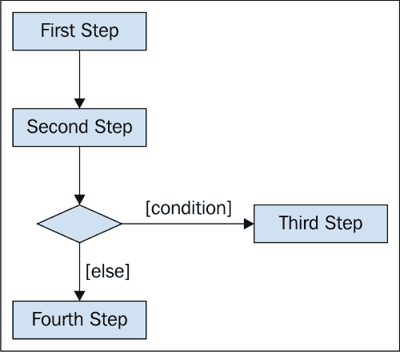
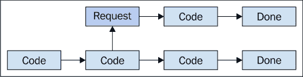
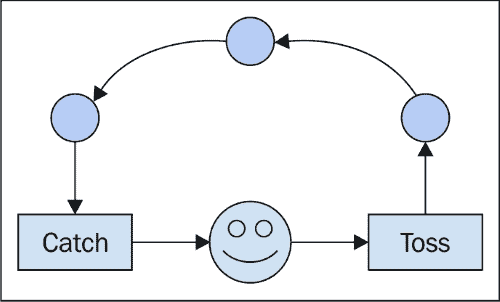
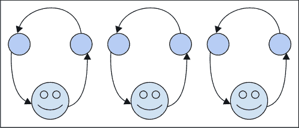
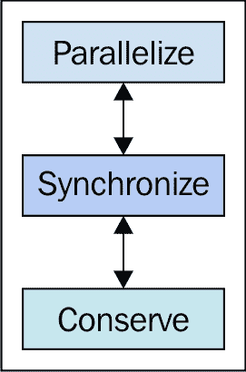
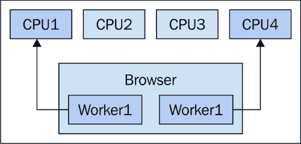
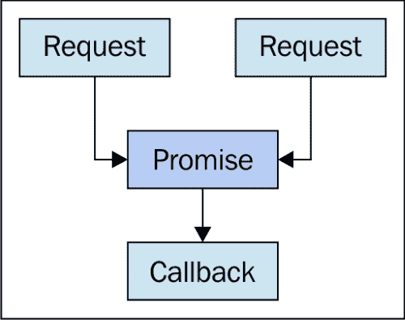
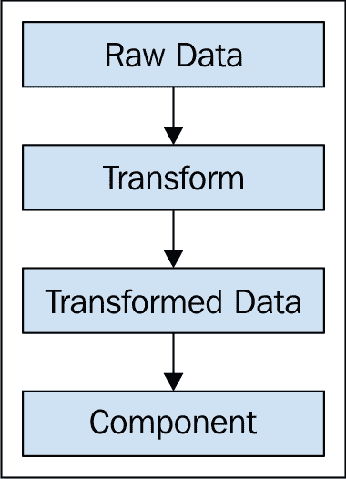
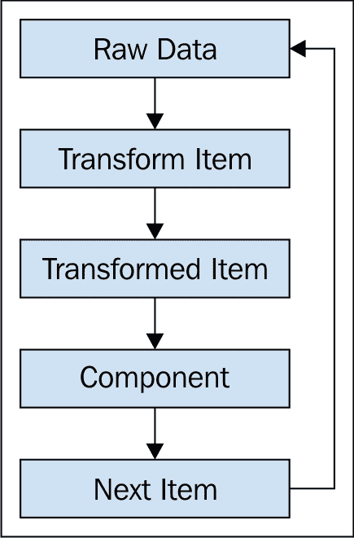

# 第一章. 为什么需要 JavaScript 并发？

JavaScript 并不是一个与并发相关的语言。实际上，它通常与完全相反的并发挑战相关联。然而，在过去的几年里，这种情况发生了很大的变化，尤其是在 ES 2015 中引入了新的语言特性。Promise 在 JavaScript 中已经使用了多年；而现在，它们已经成为了一种原生类型。Generators 是语言中的另一个补充，它改变了我们思考 JavaScript 中并发方式的方式。Web workers 已经在浏览器中存在了几年，但我们很少看到它们被使用。也许，这更多与 workers 无关，而与我们对于并发在我们应用程序中扮演的角色理解有关。

本章的目标是探讨一些通用的并发思想，从并发究竟是什么开始。如果你没有任何形式的并发编程背景，那没关系，因为本章是你完美的起点。如果你过去使用 JavaScript 或其他语言进行过并发编程，那么将本章视为一个复习，只是以 JavaScript 为背景。

我们将本章总结为一些基本的并发原则。这些是有价值的编程工具，我们在编写并发代码时应该将其放在心中。一旦我们学会了应用这些原则，它们将告诉我们我们的并发设计是否正确，或者我们需要退一步，问问自己我们真正想要实现什么。这些原则采用自上而下的方法来设计我们的应用程序。这意味着它们适用于从开始到结束的整个过程。在整个书中，我们将参考这些原则，所以如果你只阅读本章的一个部分，确保是最后的*并发原则*。

# 同步 JavaScript

在我们开始构建大规模并发 JavaScript 架构之前，让我们将注意力转向我们所有人都熟悉的经典同步 JavaScript 代码。这些是作为点击事件的结果而被调用的 JavaScript 代码块，或者作为加载网页的结果而运行。一旦开始，它们就不会停止。也就是说，它们是**运行至完成**的。我们将在下一章更深入地探讨运行至完成的概念。

### 注意

我们会在章节中偶尔看到**同步**和**串行**这两个术语被交替使用。它们都指的是依次运行的代码语句，直到没有更多可运行的内容为止。

尽管 JavaScript 被设计为单线程、运行至完成的环境，但网络的本质使得这一点变得复杂。想想看网络浏览器及其所有移动部件。有用于渲染用户界面的**文档对象模型**（**DOM**）和用于获取远程数据源的**XMLHttpRequest**（**XHR**）对象，仅举两例。让我们来看看 JavaScript 的同步特性和网络的异步特性。

## 同步性容易理解

当代码是同步的，它更容易理解。它更容易将我们在屏幕上看到的指令映射到我们头脑中的顺序步骤；这样做，然后那样做；检查这个，如果为`true`，则那样做，等等。这种串行处理类型足够容易理解，因为没有惊喜，假设代码不是完全糟糕。以下是我们可能如何可视化一段同步代码的示例：



另一方面，并发编程并不容易掌握。这是因为我们的代码编辑器中没有线性逻辑可以遵循。相反，我们不断地跳来跳去，试图将这段代码相对于那段代码的行为映射出来。时间是在并发设计中一个重要的因素；这是与大脑自然理解代码的方式相悖的。当我们阅读代码时，我们自然会将其在脑海中执行。这就是我们弄清楚它在做什么的方式。当实际执行与我们在脑海中想象的不一致时，这种方法就会失效。通常，代码读起来像一本书——并发代码就像一本页码编号但顺序混乱的书。让我们看看一些简单的伪 JavaScript 代码：

```js
var collection = [ 'a', 'b', 'c', 'd' ];
var results = [];

for (let item of collection) {
    results.push(String.fromCharCode(item.charCodeAt(0)));
}
//    [ 'b', 'c', 'd', 'e' ]
```

在传统的多线程环境中，线程是与其他线程异步运行的某个东西。我们使用线程来利用大多数系统上找到的多个 CPU，从而提高性能。然而，这也有代价，因为它迫使我们重新思考代码在运行时的执行方式。不再是通常的逐步执行。这段代码可能在与另一个 CPU 上的其他代码并行运行，或者它可能在与同一 CPU 上的其他线程争夺时间。

当我们将并发引入同步代码时，很多简单性都会消失——这是代码中的“大脑冻结”。这就是我们编写并发代码的原因：代码预先假设并发。随着我们通过本书的进展，我们将详细阐述这个概念。对于 JavaScript 来说，假设并发设计很重要，因为这就是网络的工作方式。

## 异步性是不可避免的

JavaScript 中的并发之所以如此重要，是因为网络在非常高的层次和实现细节层面上都是并发的。换句话说，网络之所以是并发的，是因为在任何给定的时间点，都有大量的数据在跨越全球的纤维中流动。这与部署到网络浏览器的应用程序本身有关，以及后端服务器如何处理对数据的请求清单。

### 异步浏览器

让我们更仔细地看看浏览器和其中发现的异步操作类型。当用户加载网页时，页面将执行的第一项操作之一是下载并评估与页面一起的 JavaScript 代码。这本身就是一个异步操作，因为当我们的代码下载时，浏览器将继续执行其他任务，例如渲染页面元素。

另一个通过网络到达的异步数据源是应用程序数据本身。一旦我们的页面加载完成并且我们的 JavaScript 代码开始运行，我们就需要向用户展示一些数据。这实际上是我们的代码要做的第一件事，以便用户可以立即看到一些内容。同样，当我们等待这些数据到达时，JavaScript 引擎会继续执行我们的代码，直到到达下一组指令。以下是一个请求远程数据但不等待响应就继续执行代码的示例：



在页面元素全部渲染并填充数据后，用户开始与我们的页面交互。这意味着会触发事件——点击一个元素会触发点击事件。触发这些事件的 DOM 环境是一个沙盒环境。这意味着在浏览器中，DOM 是一个子系统，与运行我们代码的 JavaScript 解释器分开。这种分离使得某些 JavaScript 并发场景特别困难。我们将在下一章深入探讨这些问题。

在所有这些异步源的影响下，我们的页面可能会因为处理不可避免出现的边缘情况而变得臃肿。异步思考并不自然，因此这种同步思维的结果很可能是这种猴子补丁式的修改。最好接受网络的异步本质。毕竟，同步的网络可能导致无法忍受的用户体验。现在，让我们进一步探讨我们可能在 JavaScript 架构中遇到的并发类型。

# 并发类型

JavaScript 是一种运行至完成的语言。这一点无法避免，尽管在其之上可能添加了任何并发机制。换句话说，我们的 JavaScript 代码在 `if` 语句的中间不会将控制权交给另一个线程。这一点之所以重要，是因为我们可以选择一个合理的抽象层次，帮助我们思考 JavaScript 并发。让我们看看在 JavaScript 代码中发现的两种并发动作类型。

## 异步动作

异步动作的一个定义特征是它们不会阻塞后续的其他动作。异步动作并不一定意味着“触发并忘记”。相反，当我们等待的动作部分完成时，我们运行一个回调函数。这个回调函数与我们的代码的其他部分不同步；因此，术语异步。

在网络前端，这通常意味着从远程服务获取数据。这些获取动作相对较慢，因为它们必须穿越网络连接。这些动作异步进行是有意义的，仅仅因为我们的代码正在等待某些数据返回以便触发回调函数，并不意味着用户必须坐着等待。此外，用户当前查看的任何屏幕都不太可能只依赖于一个远程资源。因此，顺序处理多个远程获取请求会对用户体验产生不利影响。

这里有一个关于异步代码的一般概念：

```js
var request = fetch('/foo');

request.addEventListener((response) => {
    // Do something with "response" now that it has arrived.
});

// Don't wait with the response, update the DOM immediately.
updateUI();
```

### 小贴士

**下载示例代码**

您可以从您在 [`www.packtpub.com`](http://www.packtpub.com) 的账户下载示例代码文件，以获取您购买的所有 Packt 出版物的所有示例代码。如果您在其他地方购买了这本书，您可以访问 [`www.packtpub.com/support`](http://www.packtpub.com/support) 并注册，以便将文件直接通过电子邮件发送给您。

我们不仅限于从远程数据源获取数据，作为异步动作的唯一来源。当我们发起网络请求时，这些异步控制流实际上离开了浏览器。但是，关于限制在浏览器内的异步动作怎么办？以 `setTimeout()` 函数为例。它遵循与网络获取请求相同的回调模式。函数传递一个回调，该回调在稍后执行。然而，没有任何东西离开浏览器。相反，动作被排队在任意数量的其他动作之后。这是因为异步动作仍然只是由一个 CPU 执行的一个控制线程。这意味着随着我们的应用程序规模和复杂性的增长，我们面临着并发扩展问题。但是，也许异步动作并不是为了解决单 CPU 问题而设计的。

也许更好地思考在单个 CPU 上执行的异步操作的方式是将它们想象成一个杂技演员。杂技演员的大脑是 CPU，协调他的动作。被抛来抛去的球是我们操作的数据。我们只关心两种基本动作——*抛*和*接*：



由于杂技演员只有一个大脑，他不可能一次集中精力完成多个任务。然而，杂技演员经验丰富，他知道他不需要将太多的注意力集中在抛或接的动作上。一旦球被抛起，他就可以将注意力转移到即将落下的球上。

对于任何观察这个正在表演的杂技演员的人来说，他似乎在全心全意地关注着所有的六个球，但实际上，他在任何时刻都在忽略其中的五个球。

## 并行操作

就像异步性一样，并行性允许控制流在等待操作完成之前继续进行。与异步性不同，并行性依赖于硬件。这是因为我们无法在单个 CPU 上同时进行两个或更多控制流的并行操作。然而，将并行性与异步性区分开来的主要方面是使用它的理由。这两种并发方法解决不同的问题，并且都需要不同的设计原则。

最终，我们希望执行原本如果同步进行将耗时过长的并行操作。想象一下，一个用户正在等待三个昂贵的操作完成。如果每个操作需要 10 秒钟完成（在用户体验的时间尺度上仿佛是永恒），那么这意味着用户将不得不等待 30 秒钟。如果我们能够并行执行这些任务，我们可以将总等待时间缩短至接近 10 秒。以更少的代价获得更多，从而实现性能良好的用户界面。

这一切都不是免费的。就像异步操作一样，并行操作会导致回调作为通信机制。一般来说，设计并行性是困难的，因为除了与工作线程通信外，我们还要担心手头上的任务，即我们希望通过使用工作线程实现什么？以及我们如何将问题分解成更小的操作？以下是我们引入并行性后代码的大致样子：

```js
var worker = new Worker('worker.js');
var myElement = document.getElementById('myElement');

worker.addEventListener('message', (e) => {
    myElement.textContent = 'Done working!';
});

myElement.addEventListener('click', (e) => {
    worker.postMessage('work');
});
```

不要担心这段代码的机制，因为它们将在后面的章节中深入探讨。重要的是，当我们把工作线程加入进来时，我们向已经充斥着回调的环境中添加了更多的回调。这就是为什么我们必须在代码中设计并行性，这是本书的一个主要焦点，从第五章 Chapter 5 *与工作线程一起工作*开始。

让我们思考一下上一节中的杂技演员类比。抛接动作是由杂技演员异步执行的；也就是说，他只有一个大脑/CPU。但是假设我们周围的环境不断变化。我们的抛接表演的观众越来越多，一个杂技演员不可能让所有的人都保持愉快：



解决方案是引入更多的杂技演员。这样我们就能增加更多的计算能力，能够在同一瞬间执行多个抛接动作。这对于单个异步运行的杂技演员来说是不可能的。

我们还没有走出困境，因为我们不能让新增加的杂技演员站在一个地方，像我们的单个杂技演员那样表演。观众更多，更多样化，需要娱乐。杂技演员需要能够处理不同的物品。他们需要在地板上移动，以便让观众的不同部分都保持愉快。他们甚至可能开始相互抛接。这取决于我们能否设计出一个能够协调这种抛接表演的设计。

# JavaScript 并发原则：并行化、同步、节约

既然我们已经了解了并发的概念及其在前端 Web 开发中的作用，让我们来看看 JavaScript 开发的一些基本并发原则。这些原则仅仅是工具，在我们编写并发 JavaScript 代码时，它们会指导我们的设计选择。

当我们应用这些原则时，它们迫使我们退后一步，在实施之前提出适当的问题。特别是，它们是关于为什么和如何的问题：

+   我们为什么要实施这种并发设计？

+   我们希望通过它得到什么，而无法通过更简单的同步方法得到？

+   我们如何实现并发，同时又不影响我们应用程序的功能？

这里是每个并发原则的参考可视化，它们在开发过程中相互依赖。有了这个，我们将转向每个原则进行进一步探索：



## 并行化

并行化原则意味着利用现代 CPU 的能力，在更短的时间内计算结果。这在任何现代浏览器或 NodeJS 环境中都是可能的。在浏览器中，我们可以通过使用 web workers 实现真正的并行性。在 Node 中，我们可以通过启动新进程来实现真正的并行性。以下是浏览器视角下的 CPU 样子：



目标是在更短的时间内进行更多计算，我们现在必须问自己为什么要这样做？除了原始性能本身非常酷之外，用户必须能够感受到一些实际的影响。这个原则让我们审视我们的并行代码，并问——用户从这能得到什么？答案是，我们可以使用更大的数据集作为输入进行计算，并且由于长时间运行的 JavaScript，用户无响应体验的机会更小。

仔细审查并行化的实际收益很重要，因为当我们这样做时，我们给代码增加了不必要的复杂性。所以如果用户无论我们做什么都能看到相同的结果，那么并行化原则可能不适用。另一方面，如果可扩展性很重要，并且有很强的可能性数据集大小会增长，那么为了并行化而牺牲代码简单性的代价可能是值得的。以下是在考虑并行化原则时需要遵循的清单：

+   我们的应用程序是否对大型数据集执行昂贵的计算？

+   随着我们的数据集增长，是否存在潜在的瓶颈，这会负面影响用户体验？

+   我们的用户目前是否在我们的应用程序性能中遇到瓶颈？

+   在其他约束条件下，我们的设计中并行化有多可行？有哪些权衡？ 

+   我们并发实现的收益是否超过了开销成本，无论是从用户感知的延迟还是从代码可维护性的角度来看？

## 同步

同步原则是关于协调并发动作的机制及其抽象。回调函数是 JavaScript 的一个概念，有着深厚的根源。当我们需要运行一些代码，但又不想立即运行时，它是显而易见的选择工具。总的来说，这种方法本身并没有什么固有的错误。单独使用回调模式可能是我们能够使用的最简洁、最易读的并发模式。当回调很多，并且它们之间有很多依赖关系时，回调就会崩溃。

### Promise API

Promise API 是核心 JavaScript 语言结构，在 ECMAScript 6 中引入，以解决地球上每个应用程序面临的同步难题。这是一个简单的 API，实际上使用了回调（是的，我们正在用回调对抗回调）。Promise 的目标不是消除回调，而是移除不必要的回调。以下是一个用于同步两个网络 fetch 调用的 Promise 示例：



关于承诺（promises）的关键之处在于它们是一种通用的同步机制。这意味着它们并不是专门为网络请求、Web Workers 或 DOM 事件而设计的。我们，程序员，必须将我们的异步操作用承诺包裹起来，并在必要时解决它们。这样做的好处是，依赖于承诺接口的调用者并不关心承诺内部正在发生什么。正如其名所示，它承诺在某个时刻解决一个值。这可能是在 5 秒后或立即发生。数据可以来自网络资源或 Web Worker。调用者并不关心，因为它假设并发，这意味着我们可以以任何我们喜欢的方式实现它，而不会破坏应用程序。以下是对前面图表的修改版本，这将让我们尝到承诺能实现什么：


当我们学会在未来某个时刻将值视为值时，并发代码突然变得更容易接近。承诺和类似机制可以用来同步仅网络请求或仅 Web Worker 事件。但它们的真正力量在于使用它们来编写并发应用程序，其中并发是默认的。以下是一个清单，当思考同步原则时可以参考：

+   我们的应用程序是否严重依赖于回调函数作为同步机制？

+   我们是否经常需要同步多个异步事件，如网络请求？

+   我们的回调函数是否包含比应用程序代码更多的同步样板代码？

+   我们的代码对驱动异步事件的并发机制有什么样的假设？

+   如果我们有一个神奇的**终止并发**按钮，我们的应用程序是否还会按预期运行？

## 保存

保存原则是关于节省计算和内存资源。这是通过使用懒加载技术来实现的。名称“懒”来源于这样的想法：我们只有在确定确实需要它时才会计算新的值。想象一个渲染页面元素的组件。我们可以向这个组件传递它需要渲染的确切数据。这意味着在组件实际需要之前会有几个计算发生。这也意味着需要将使用的数据分配到内存中，以便我们可以将其传递给组件。这种方法没有问题。事实上，这是我们 JavaScript 组件中传递数据的标准方式。

另一种方法使用懒加载（lazy evaluation）来实现相同的结果。我们不是先计算要渲染的值，然后在结构中分配它们以传递，而是计算一个项目，然后渲染它。把这想象成一种合作多任务处理，其中较大的操作被分解成更小的任务，控制焦点在它们之间来回传递。

这里有一个急切的方法来计算数据并将其传递给渲染 UI 元素的组件：



这种方法有两个不理想的地方。首先，转换操作是在一开始就发生的，这可能会是一个昂贵的计算。如果由于某种约束，组件无法渲染它，会发生什么——比如因为某些限制？那么我们就进行了这个计算来转换不需要的数据。作为推论，我们为转换后的数据分配了一个新的数据结构，以便我们可以将其传递给我们的组件。这个短暂的内存结构实际上并没有任何作用，因为它会被立即回收。让我们看看懒惰方法可能是什么样子：



使用懒惰方法，我们能够移除一开始发生的昂贵转换计算。相反，我们一次只转换一个项目。我们也能够移除转换数据结构的提前分配。相反，只有转换后的项目被传递到组件中。然后，组件可以请求另一个项目或停止。节省原则使用并发作为仅计算所需内容并仅分配所需内存的手段。

以下清单将帮助我们思考在编写并发代码时考虑节省原则：

+   我们是否在计算永远不会使用的值？

+   我们是否仅仅将数据结构作为传递给下一个组件的手段？

+   我们是否将数据转换操作链式连接起来？

# 摘要

在本章中，我们介绍了一些在 JavaScript 中使用并发的动机。虽然同步 JavaScript 易于维护和理解，但在网络上异步 JavaScript 代码是不可避免的。因此，在编写 JavaScript 应用程序时，将并发作为我们的默认假设是很重要的。

我们对两种主要的并发类型感兴趣——异步操作和并行操作。异步性是关于操作的时间顺序，这给人一种事情同时发生的印象。没有这种类型的并发，用户体验会大大受损，因为用户会不断等待其他操作完成。并行性是另一种类型的并发，它解决不同类型的问题，我们希望通过更快地计算结果来提高性能。

最后，我们探讨了 JavaScript 编程中的三个并发原则。并行化原则是关于利用现代系统中发现的多个核心 CPU。同步原则是关于创建抽象，使我们能够编写并发代码，隐藏并发机制从我们的功能代码中。节省原则使用懒惰评估来仅计算所需内容，并避免不必要的内存分配。

在下一章中，我们将关注 JavaScript 执行环境。为了有效地使用 JavaScript 并发，我们需要了解代码运行时实际发生的事情。
