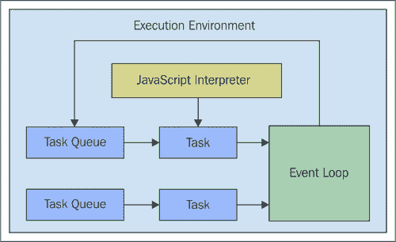
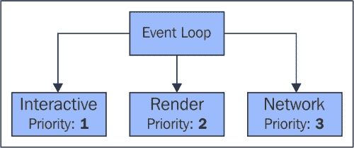
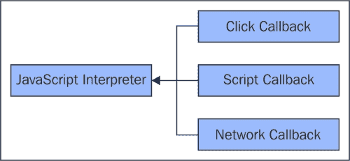
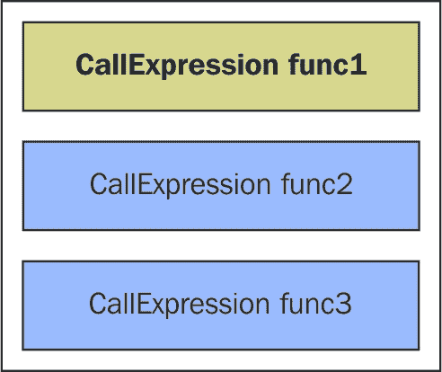
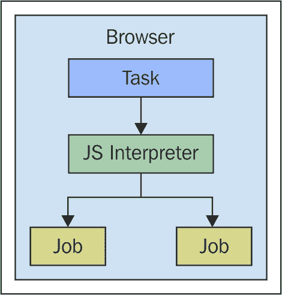
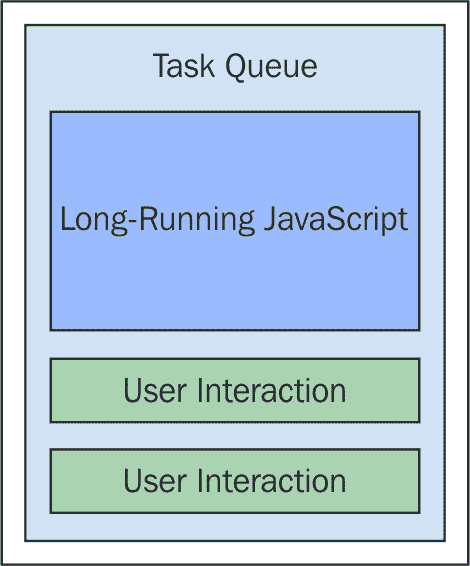

# 第二章：JavaScript 执行模型

本书的第一章探讨了 JavaScript 并发的状态。一般来说，处理 JavaScript 应用程序中的并发并不是一件简单的事情。在编写并发 JavaScript 代码时有很多事情要考虑，我们提出的解决方案通常是非正统的。有很多回调，浏览它们足以让人发疯。我们还瞥见了我们的并发 JavaScript 代码编写模式如何随着现有的并发组件而开始改变。Web Workers 已经开始成熟，而 JavaScript 语言的并发结构刚刚被引入。

语言和运行环境只能带我们走一半的路。我们需要在设计层面考虑并发，而不是事后。并发应该是默认的。这话说起来容易，做起来却非常困难。在这本书中，我们将探讨 JavaScript 并发特性所能提供的一切，以及我们如何最好地利用它们作为设计工具。但是，在我们这样做之前，我们需要深入了解 JavaScript 运行时真正发生的事情。这种知识是设计并发应用程序的必要输入，因为我们将确切知道在选择一种并发机制而不是另一种机制时可以期待什么。

在本章中，我们将从浏览器环境开始，通过查看我们的代码所触及的所有子系统——例如 JavaScript 解释器、任务队列以及 DOM 本身。然后我们将通过一些代码来揭示幕后真正发生的事情，以编排我们的代码。我们将以对这个模型所面临的挑战的讨论来结束本章。

# 一切都是任务

当我们访问一个网页时，浏览器为我们创建了一个整个环境。这个环境有几个子系统，使得我们查看的网页能够根据**万维网联盟**（**W3C**）规范看起来和表现如它应该的样子。任务是在网页浏览器内部的基本抽象。任何发生的事情要么是一个任务本身，要么是更大任务的一部分。

### 注意

如果你正在阅读任何 W3C 规范，术语“用户代理”将用于代替“网页浏览器”。在 99.9%的情况下，我们阅读的是主要浏览器供应商。

在本节中，我们将查看这些环境的主要组件，以及任务队列和事件循环如何促进这些组件之间的通信，以实现网页的整体外观和行为。

## 认识参与者

让我们介绍一些术语，这些术语将帮助我们贯穿本章的各个部分：

+   **执行环境**：每当打开一个新的网页时，就会创建这个容器。这是一个包罗万象的环境，其中包含我们的 JavaScript 代码将与之交互的一切。它还充当一个沙盒——我们的 JavaScript 代码无法超出这个环境。

+   **JavaScript 解释器**：这是负责解析和执行我们的 JavaScript 源代码的组件。浏览器的工作是向解释器添加全局变量，例如`window`和`XMLHttpRequest`。

+   **任务队列**：每当需要发生某些事情时，就会将任务排队。执行环境至少有一个这样的队列，但通常有几个。

+   **事件循环**：执行环境有一个负责服务所有任务队列的单个事件循环。只有一个事件循环，因为只有一个线程。

看一下在网页浏览器中创建的以下执行环境可视化。任务队列是浏览器中发生任何事情的入口点。例如，一个任务可以通过传递给 JavaScript 解释器来执行一个脚本，而另一个任务用于渲染挂起的 DOM 更改。现在我们将深入了解构成环境的各个部分。



## 执行环境

网络浏览器执行环境中最能揭示其本质的方面可能是我们的 JavaScript 代码及其解释器所扮演的相对较小的角色。我们的代码只是在一个更大机器中的一个齿轮。在这些环境中，确实有很多事情在进行，因为浏览器实现的平台具有巨大的作用。这不仅仅是在屏幕上渲染元素，然后通过样式属性增强这些元素。DOM 本身就像一个微型平台，就像网络设施、文件访问、安全等。所有这些部分对于网站功能的网络经济和最近的应用程序都是必不可少的。

在并发上下文中，我们主要对将所有这些平台部件联系在一起的机制感兴趣。我们的应用程序主要用 JavaScript 编写，解释器知道如何解析和运行它。但是，这最终如何转化为页面上的视觉变化？浏览器的网络组件如何知道发起一个 HTTP 请求，以及如何在响应到达后调用 JavaScript 解释器？

正是这些运动部件的协调限制了 JavaScript 中的并发选项。这些限制是必要的，因为没有它们，编写网络应用程序将变得过于复杂。

## 事件循环

一旦执行环境建立，事件循环就是最先启动的组件之一。它的任务是处理环境中的一个或多个任务队列。浏览器厂商可以自由地根据需要实现队列，但至少必须有一个队列。如果浏览器愿意，可以将每个任务都放在一个队列中，并给予每个任务相同的优先级。这样做的问题在于，如果队列出现拥堵，必须优先处理的任务，如鼠标或键盘事件，就会陷入等待。

实际上，拥有几个队列是有意义的，至少可以按优先级分离任务。这一点尤为重要，因为只有一个控制线程——意味着只有一个 CPU——会处理这些队列。以下是一个通过不同优先级级别服务多个队列的事件循环的示例：



尽管事件循环与执行环境同时启动，但这并不意味着它总是有任务可以处理。如果总是有任务需要处理，那么实际应用将没有 CPU 时间。事件循环会等待更多任务，并且优先级最高的队列会首先得到服务。例如，使用前面图像中使用的队列，*交互*队列将始终首先得到服务。即使事件循环正在处理*渲染*队列的任务，如果有一个*交互*任务被排队，事件循环也会先处理这个任务，然后再继续处理渲染任务。

## 任务队列

理解队列任务的概念对于理解浏览器的工作方式至关重要。实际上，“浏览器”这个术语是有误导性的。我们曾用它们来浏览早期、较为稀疏的静态网页。现在，大型和复杂的应用程序在浏览器中运行——它实际上更像是一个网络平台。服务这些任务的任务队列和事件循环可能是处理这么多动态部分的最佳设计。

我们在本章前面看到，从执行环境的视角来看，JavaScript 解释器以及它解析和运行的代码实际上只是一个黑盒。事实上，调用解释器本身就是一个任务，这也反映了 JavaScript 的运行至完成特性。许多任务都涉及到调用 JavaScript 解释器，如图所示：



任何这些事件——用户点击一个元素、页面中加载脚本，或者从之前的 API 调用中到达浏览器中的数据——都会创建一个调用 JavaScript 解释器的任务。它告诉解释器运行特定的代码片段，并且它会继续运行直到完成。这就是 JavaScript 的运行至完成特性。接下来，我们将深入探讨由这些任务创建的执行上下文。

# 执行上下文

现在是时候看看 JavaScript 解释器本身了——当事件发生且需要运行代码时，它从其他浏览器组件接管。始终有一个活动的 JavaScript 上下文，在解释器内部，我们会找到一个上下文堆。这类似于许多编程语言，其中堆控制活动上下文。

将活动上下文视为我们 JavaScript 代码当前发生情况的快照。使用堆结构是因为活动上下文可以改变为其他内容，例如当函数被调用时。当这种情况发生时，一个新的快照会被推入堆中，成为活动上下文。当它运行完成后，它会被从堆中弹出，留下下一个上下文作为活动上下文。

在本节中，我们将探讨 JavaScript 解释器如何处理上下文切换，以及管理上下文堆的内部工作队列。

## 维护执行状态

JavaScript 解释器内的上下文堆不是一个静态结构——它是不断变化的。在整个堆的生命周期中，有两件重要的事情发生。首先，在堆的顶部，我们有活动上下文。这是解释器在执行其指令时当前执行的代码。以下是一个 JavaScript 执行上下文堆的示例，其中活动上下文始终位于顶部：



调用堆的其他重要职责是在活动上下文被停用时标记其状态。例如，假设在几个语句之后，`func1()`调用`func2()`。在这个点上，上下文被标记为`func2()`调用之后的直接位置。然后，它被新的活动上下文——`func2()`所取代。当它完成时，这个过程会重复，`func1()`再次成为活动上下文。

这种上下文切换在我们的代码中到处发生。例如，有一个全局上下文，它是我们代码的入口点，有函数本身，它们有自己的上下文。还有语言中较新的添加，它们也有自己的上下文，例如模块和生成器。接下来，我们将查看负责创建新执行上下文的工作队列。

## 任务队列

任务队列类似于我们之前查看的任务队列。区别在于任务队列是针对 JavaScript 解释器的。也就是说，它们被封装在解释器中——浏览器不会直接与这些队列交互。然而，当解释器被浏览器调用，例如响应加载的脚本或事件回调任务时，解释器会创建新的任务。



JavaScript 解释器中的作业队列实际上比用于协调所有网络浏览器组件的任务队列要简单得多。只有两个基本队列。一个是用于创建新的执行上下文堆栈（调用堆栈）。另一个是针对承诺解析回调函数的特定队列。

### 注意

我们将在下一章更深入地探讨如何让承诺解析回调作业工作。

考虑到这些内部 JavaScript 作业队列的责任限制，人们可能会得出结论，它们是不必要的——过度工程化的行为。但这并不正确，因为虽然今天在这些工作中找到了有限的责任，但作业队列的设计使得语言的扩展和改进变得更加容易。特别是，在考虑语言未来版本的新的并发构造时，作业队列机制是有利的。

# 使用计时器创建任务

到目前为止，在本章中，我们已经了解了网络浏览器环境中的所有内部工作者，以及 JavaScript 解释器在这个环境中的位置。所有这些与将并发原则应用于我们的代码有什么关系呢？通过了解底层发生的事情，我们对代码运行时发生的事情有了更深入的了解。特别是，我们知道相对于其他代码块发生的事情；时间顺序是并发的一个重要属性。

话虽如此，让我们实际编写一些代码。在本节中，我们将使用计时器显式地将任务添加到任务队列中。我们还将了解 JavaScript 解释器何时何地介入并开始执行我们的代码。

## 使用 `setTimeout()`

`setTimeout()` 函数是任何 JavaScript 代码中的基本组成部分。它用于在未来的某个时间点执行代码。新 JavaScript 程序员经常遇到 `setTimeout()` 函数，因为它是一个计时器。在未来的某个设定点，比如说 3 秒后，将调用一个回调函数。当我们调用 `setTimeout()` 时，我们会得到一个 `atimer` ID，稍后可以使用 `clearTimeout()` 清除它。以下是 `setTimeout()` 的基本用法：

```js
// Creates a timer that calls our function in no less
// than 300MS. We can use the "console.time()" and the
// "console.timeEnd()" functions to see how long it actually
// takes.
//
// This is typically around 301MS, which isn't at all 
// noticeable by the user, but is unreliable for
// accurately scheduling function calls.
var timer = setTimeout(() => {
    console.timeEnd('setTimeout');
}, 300);

console.time('setTimeout');
```

下面是 JavaScript 新手容易误解的部分；它是一个尽力而为的计时器。当我们使用 `setTimeout()` 时，我们唯一可以保证的是我们的回调函数不会被调用得比我们传递给它的分配时间早。所以如果我们说在 300 毫秒后调用这个函数，它永远不会在 275 毫秒时调用它。一旦 300 毫秒过去，就会排队一个新的任务。如果在这个任务之前没有其他任务等待，回调就会准时运行。即使在其前面有少量任务在队列中，影响几乎不明显——它看起来是在正确的时间运行的。

但正如我们所见，JavaScript 是单线程的，并且是运行到完成的。这意味着一旦 JavaScript 解释器开始，它不会停止，直到完成；即使有任务等待计时器事件回调。所以，即使我们要求计时器在 300 毫秒后执行回调，它也可能在 500 毫秒后执行。让我们看看一个例子，看看这是如何可能的：

```js
// Be careful, this function hogs the CPU...
function expensive(n = 25000) {
    var i = 0;
    while (++i < n * n) {}
    return i;
}

// Creates a timer, the callback uses
// "console.timeEnd()" to see how long we
// really waited, compared to the 300MS
// we were expecting.
var timer = setTimeout(() => {
    console.timeEnd('setTimeout');
}, 300);

console.time('setTimeout');

// This takes a number of seconds to
// complete on most CPUs. All the while, a
// task has been queued to run our callback
// function. But the event loop can't get
// to that task until "expensive()" completes.
expensive();
```

## 使用`setInterval()`

`setTimeout()`的表亲是`setInterval()`函数。正如其名所示，它接受一个在固定时间间隔被调用的回调函数。实际上，`setInterval()`与`setTimeout()`接受完全相同的参数。唯一的区别是，它将每隔 x 毫秒调用该函数，直到使用`clearInterval()`清除计时器。

当我们想要反复调用同一个函数时，这个函数很有用。例如，如果我们轮询 API 端点，`setInterval()`是一个很好的候选解决方案。然而，请记住，回调的调度是固定的。也就是说，一旦我们用 1000 毫秒调用`setInterval()`，就不能在不先清除计时器的情况下更改这 1000 毫秒。对于需要动态间隔的情况，使用`setTimeout()`效果更好。回调安排下一个间隔，这使得间隔可以动态调整。例如，通过增加间隔来减少对 API 轮询的频率。

在我们之前看到的`setTimeout()`示例中，我们看到了运行 JavaScript 代码如何会干扰事件循环。也就是说，它阻止事件循环消耗调用 JavaScript 解释器并带有我们的回调函数的任务。这允许我们将代码执行推迟到未来的某个点，但没有保证准确性。让我们看看使用`setInterval()`安排任务会发生什么。之后还有一些阻塞的 JavaScript 代码运行：

```js
// A counter for keeping track of which
// interval we're on.
var cnt = 0;

// Set up an interval timer. The callback will
// log which interval scheduled the callback.
var timer = setInterval(() => {
    console.log('Interval', ++cnt);
}, 3000);

// Block the CPU for a while. When we're no longer
// blocking the CPU, the first interval is called,
// as expected. Then the second, when expected. And
// so on. So while we block the callback tasks, we're
// also blocking tasks that schedule the next interval.
expensive(50000);
```

# 响应 DOM 事件

在上一节中，我们看到了如何安排 JavaScript 代码在将来某个时间运行。这是通过其他 JavaScript 代码显式完成的。大多数时候，我们的代码是响应用户交互而运行的。在本节中，我们将探讨不仅由 DOM 事件使用，而且由网络和 web worker 事件等使用的一个通用接口。我们还将探讨一种处理大量类似事件的技术——称为防抖。

## 事件目标

`EventTarget`接口被许多浏览器组件使用，包括 DOM 元素。它是我们向元素派发事件以及通过执行回调函数来监听事件和响应的方式。实际上，这是一个非常直接且易于理解的接口。这对于许多不同类型的组件使用此相同接口进行事件管理至关重要。随着我们继续阅读本书，我们将看到这一点。

在前一章中，我们介绍了用于执行定时器的回调函数的任务队列机制，这与`EventTarget`事件相关。也就是说，如果发生了事件，就会排队一个任务来调用 JavaScript 解释器并执行适当的回调。这里面临的与使用`setTimeout()`相同的限制也适用于此。以下是当存在长时间运行的阻塞用户事件的 JavaScript 代码时任务队列的样子：



除了将监听器函数附加到对用户交互做出反应的事件目标外，我们还可以手动触发这些事件，如下面的代码所示：

```js
// A generic event callback, logs the event timestamp.
function onClick(e) {
    console.log('click', new Date(e.timeStamp));
}

// The element we're going to use as the event
// target.
var button = document.querySelector('button');

// Setup our "onClick" function as the
// event listener for "click" events on this target.
button.addEventListener('click', onClick);

// In addition to users clicking the button, the
// EventTarget interface lets us manually dispatch
// events.
button.dispatchEvent(new Event('click'));
```

在可能的情况下，给用于回调的函数命名是一个好习惯。这样，当我们的代码出错时，追踪问题会容易得多。使用匿名函数并非不可能，只是更耗时。另一方面，箭头函数更简洁，具有更多的绑定灵活性。明智地权衡你的选择。

## 管理事件频率

用户交互事件的一个挑战是，在非常短的时间内可能会有很多事件。例如，当用户在屏幕上移动鼠标时，会触发数百个事件。如果我们有监听这些事件的事件目标，任务队列会很快填满，用户体验会变得缓慢。

即使我们在高频事件（如鼠标移动）上已经设置了事件监听器，我们也不一定需要响应所有这些事件。例如，如果有 150 次鼠标移动事件在 1-2 秒内发生，那么很可能是我们只关心最后一次移动——鼠标指针的最新位置。也就是说，JavaScript 解释器调用我们的事件回调代码的次数比实际需要的多 149 次。

为了处理这些类型的事件频率场景，我们可以利用一种称为“防抖”的技术。防抖函数意味着如果在给定的时间框架内连续多次调用，则实际上只使用最后一次调用，而忽略之前的调用。让我们通过一个例子来看看我们如何实现这一点：

```js
// Keeps track of the number of "mousemove" events.
var events = 0;

// The "debounce()" takes the provided "func" an limits
// the frequency at which it is called using "limit"
// milliseconds.
function debounce(func, limit) {
    var timer;

    return function debounced(...args) {
        // Remove any existing timers.
        clearTimeout(timer);

        // Call the function after "limit" milliseconds.
        timer = setTimeout(() => {
            timer = null;
            func.apply(this, args);
        }, limit);
    };
}

// Logs some information about the mouse event. Also log
// the total number of events.
function onMouseMove(e) {
    console.log(`X ${e.clientX} Y ${e.clientY}`);
    console.log('events', ++events);
}

// Log what's being typed into the text input.
function onInput(e) {
    console.log('input', e.target.value);
}

// Listen to the "mousemove" event using the debounced
// version of the "onMouseMove()" function. If we 
// didn't wrap this callback with "debounce()"
window.addEventListener('mousemove', debounce(onMouseMove, 300));

// Listen to the "input" event using the debounced version
// of the "onInput()" function to prevent triggering events
// on every keystroke.
document.querySelector('input')
    .addEventListener('input', debounce(onInput, 250));
```

使用防抖技术来避免给 CPU 带来不必要的额外工作，是节约原则在起作用的一个例子。通过忽略 149 个事件，我们节省了（节约）了本应执行但没有任何实际价值的 CPU 指令。我们还节省了在这些事件处理程序中可能发生的任何类型的内存分配。

JavaScript 并发原则在第一章的末尾介绍，即“为什么 JavaScript 并发？”，并在本书剩余部分的代码示例中会指出。

# 响应网络事件

任何前端应用中的另一个关键部分是网络交互，获取数据，发布命令等等。由于网络通信本质上是一种异步活动，我们必须依赖于事件——具体来说是`EventTarget`接口。

我们首先将探讨将我们的回调函数与请求和从后端获取响应连接起来的通用机制。然后，我们将看看尝试同步多个网络请求是如何创建一个看似无望的并发场景的。

## 发起请求

为了与网络交互，我们创建一个新的`XMLHttpRequest`实例。然后我们告诉它我们想要发起的请求类型——GET 还是 POST 以及请求端点。这些请求对象也实现了`EventTarget`接口，这样我们就可以监听来自网络的数据。以下是一个示例代码：

```js
// Callback for successful network request,
// parses JSON data.
function onLoad(e) {
    console.log('load', JSON.parse(this.responseText));
}

// Callback for problematic network request,
// logs error.
function onError() {
    console.error('network', this.statusText || 
        'unknown error');
}

// Callback for a cancelled network request,
// logs warning.
function onAbort() {
    console.warn('request aborted...');
}

var request = new XMLHttpRequest();

// Uses the "EventTarget" interface to attach event 
// listeners, for each of the potential conditions.
request.addEventListener('load', onLoad);
request.addEventListener('error', onError);
request.addEventListener('abort', onAbort);

// Sends a "GET" request for "api.json".
request.open('get', 'api.json');
request.send();
```

我们可以看到，网络请求有几种可能的状态。成功的路径是服务器响应我们所需的数据，并且我们能够将其解析为 JSON。错误状态是当出现问题时，比如服务器不可达。我们在这里关心的最后一个状态是请求被取消或中止。这意味着我们不再关心成功的路径，因为在我们请求进行过程中，我们的应用程序中发生了某些变化。例如，用户导航到了另一个部分。

尽管之前的代码足够容易使用和理解，但并非总是如此。我们正在查看单个请求和一些回调。我们的应用程序组件通常不会只包含一个网络请求。

## 协调请求

在前面的章节中，我们看到了使用`XMLHttpRequest`实例进行网络请求的基本交互。当有多个请求时，挑战就会出现。大多数时候，我们发起多个网络请求，以便我们有渲染 UI 组件所需的数据。后端的所有响应都将在不同时间到达，并且可能相互依赖。

某种程度上，我们需要同步这些异步网络请求的响应。让我们看看我们可以如何使用`EventTarget`回调函数来完成这项工作：

```js
// The function that's called when a response arrives ,
// it's also responsible for coordinating responses.
function onLoad() {

    // When the response is ready, we push the parsed
    // response onto the "responses" array, so that we
    // can use responses later on when the rest of them
    // arrive.
    responses.push(JSON.parse(this.responseText));

    // Have all the respected responses showed up yet?
    if (responses.length === 3) {
        // How we can do whatever we need to, in order
        // to render the UI component because we have
        // all the data.
        for (let response of responses) {
            console.log('hello', response.hello);
        }
    }
}

// Creates our API request instances, and a "responses"
// array used to hold out-of-sync responses.
var req1 = new XMLHttpRequest(),
    req2 = new XMLHttpRequest(),
    req3 = new XMLHttpRequest(),
    responses = [];

// Issue network requests for all our network requests.
for (let req of [ req1, req2, req3 ]) {
    req.addEventListener('load', onLoad);

    req.open('get', 'api.json');
    req.send();
}
```

当有多个请求时，需要考虑很多额外的因素。由于它们都在不同时间到达，我们需要在数组中存储解析后的响应，并且每当有响应到达时，我们需要检查我们是否已经得到了我们期望的一切。这个简化的例子甚至没有考虑到失败的或取消的请求。正如这段代码所暗示的，回调函数方法在同步方面是有限的。在接下来的章节中，我们将学习如何克服这一限制。

# 此模型下的并发挑战

我们将本章结束于对 JavaScript 并发执行模型所面临的挑战的讨论。有两个基本障碍。第一个是无论什么情况，任何运行的 JavaScript 代码都会阻塞其他任何事情的发生。第二个障碍是尝试使用回调函数同步异步操作，导致回调地狱。

## 并行性有限

以前，JavaScript 缺乏并行性并不是真正的问题。没有人会想念它，因为 JavaScript 被视为 HTML 页面的渐进增强工具。当前端开始承担更多责任时，这种情况发生了变化。如今，应用程序的大部分实际上都驻留在前端。这使得后端组件能够专注于 JavaScript（从浏览器角度来看，NodeJS 完全是另一回事，我们将在本书稍后讨论）无法解决的问题。

例如，将映射和减少 API 数据源到某个功能所需的表示形式可以在后端实现。这意味着前端 JavaScript 代码只需要查询这个端点。问题是这个 API 端点是针对某些特定的 UI 功能创建的，而不是作为我们数据模型的基本支持支柱。如果我们能在前端执行这些任务，我们就将 UI 功能和它们所需的数据转换紧密耦合在一起。这使后端能够专注于更紧迫的问题，如复制和负载均衡。

我们可以在前端执行这些类型的数据转换，但它们会破坏界面的可用性。这主要是因为所有移动部件都在争夺相同的计算资源。换句话说，这种模型使我们无法实现并行化原则并利用多个资源。我们将通过后续章节中介绍的 Web workers 克服这种网络浏览器的限制。

## 通过回调进行同步

通过回调进行同步难以实现且扩展性不佳。这是回调地狱，一个在 JavaScript 程序员中流行的术语。不用说，代码中无尽的回调同步会引发问题。我们经常不得不创建某种状态跟踪机制，例如全局变量。当问题确实出现时，一大堆回调函数在心理上非常耗时去遍历。

通常来说，同步多个异步操作的回调方法需要大量的开销。也就是说，存在只是为了处理异步操作而存在的样板代码。同步并发原则是关于编写不将主要目标嵌入到同步处理逻辑迷宫中的并发代码。通过减少回调函数的使用，Promise 帮助我们在整个应用程序中一致地编写并发代码。

# 概述

本章的重点一直是网络浏览器平台以及 JavaScript 在其中所处的位置。在我们查看和与网页互动时，总会有很多事件发生。这些事件被处理为任务，从队列中取出。其中一项任务就是使用代码调用 JavaScript 解释器来运行。

当 JavaScript 解释器运行时，它包含一个执行上下文栈。函数、模块和全局脚本代码——这些都是 JavaScript 执行上下文的例子。解释器还有它自己的内部作业队列；一个用于创建新的执行上下文栈，另一个用于调用承诺解析回调函数。

我们编写了一些代码，使用`setTImeout()`函数手动创建任务，并明确展示了长时间运行的 JavaScript 代码对这些任务可能造成的问题。然后我们研究了`EventTarget`接口，该接口用于监听 DOM 事件，以及网络请求，以及其他我们没有在本章中探讨的内容，如 web workers 和文件读取器。

我们总结了 JavaScript 程序员在使用此模型时面临的挑战。特别是，遵循我们的 JavaScript 并发原则很难。我们无法并行化，而仅使用回调函数来尝试同步则是一场噩梦。

在下一章中，我们将探讨一种使用承诺（promises）来思考同步的新方法。这将使我们能够真正开始设计和构建并发 JavaScript 应用程序。
