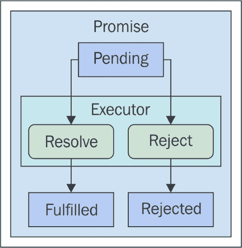
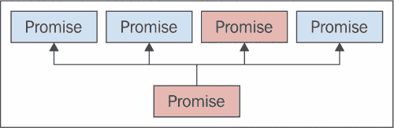
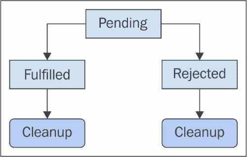
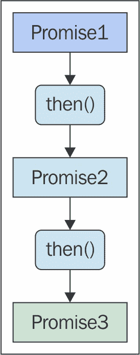
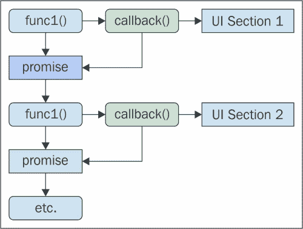

# 第三章。使用承诺进行同步

JavaScript 库中已经存在了许多年的承诺（promises）实现。这一切始于 Promises/A+ 规范。库们实现了这个规范的自己的变体，直到最近（确切地说，是 ES6）承诺规范才被纳入 JavaScript 语言。它们做了章节标题所暗示的事情——帮助我们应用同步原则。

在本章中，我们将从对承诺术语的温和介绍开始，这样本章的其余部分就会更容易理解。然后，我们将探讨承诺被用来解决未来值的各种方式，以及我们在处理并发时如何使生活变得更轻松。准备好了吗？

# 承诺术语

在我们深入代码示例之前，让我们花一分钟时间确保我们对承诺周围的术语有一个牢固的掌握。有承诺实例，但还有各种状态和动作需要考虑。以下各节将更加有意义，如果我们能够确定承诺词汇表。这些解释简短而直接，所以如果你已经使用过承诺，你可以快速浏览这些定义以验证你的知识。

## 承诺

正如名称所暗示的，承诺就是承诺。将承诺想象为一个代理，它代表一个尚未存在的值。承诺让我们能够编写更好的并发代码，因为我们知道值最终会存在，我们不必编写大量的状态检查样板代码。

## 状态

承诺始终处于三种状态之一：

+   **挂起**：这是承诺创建后的第一个状态。它保持在挂起状态，直到它被解决或拒绝。

+   **已解决**：承诺的值已经被解决，并且可以通过 `then()` 回调函数访问。

+   **已拒绝**：在尝试解决承诺的值时出了问题。今天没有数据。

承诺状态的一个有趣特性是它们只转换一次。它们要么从挂起（pending）状态转换为已解决（fulfilled）状态，要么从挂起状态转换为已拒绝（rejected）状态。一旦它们完成这种状态转换，它们就会在这个状态下持续存在。

## 执行者

执行器函数负责以某种方式解决调用者所等待的值。这个函数在承诺创建后立即被调用。它接受两个参数：一个 `resolver` 函数和一个 `rejector` 函数。

## 解决者

解决者是一个作为参数传递给执行器函数的函数。实际上，这非常方便，因为我们可以将解决者函数传递给另一个函数，依此类推。解决者函数在哪里被调用并不重要，但一旦被调用，承诺就会进入已解决状态。这种状态的变化将触发任何 `then()` 回调——我们很快就会看到这些是什么。

## 拒绝者

拒绝者与解决者类似。它是传递给`executor`函数的第二个参数，可以从任何地方调用。当它被调用时，它会将承诺的状态从挂起更改为拒绝。这种状态变化将调用传递给`then()`或`catch()`的任何`error`回调函数。

## Thenable

一个对象是 thenable 的，如果它有一个接受满足回调和拒绝回调作为参数的`then()`方法。换句话说，一个承诺是 thenable 的。但有时我们可能想要实现专门的解决语义。

# 解决和拒绝承诺

如果前面的部分引入了几个听起来令人困惑的新术语，那么请不要担心。我们将从本节开始，看看所有这些承诺术语在实际中的样子。在这里，我们将执行一些直接的承诺解决和拒绝。

## 解决承诺

解决者是一个函数，正如其名所示，为我们解决承诺。这不是解决承诺的唯一方法——我们将在本章后面探索更高级的技术。但这种方法无疑是最常见的。它作为第一个参数传递给执行者函数。这意味着执行者可以直接通过调用解决函数来解决承诺。但这不会给我们带来很多实用性，对吧？

在更普遍的情况下，承诺`executor`函数会设置即将发生的异步操作——比如进行网络调用。然后，在这些异步操作的回调函数中，我们可以解决承诺。一开始，在代码中传递一个解决函数可能有点反直觉，但一旦我们开始使用它们，这就会更有意义。

解决函数是一个绑定到承诺的不可见函数。它只能解决一个承诺一次。我们可以多次调用解决函数，但只有第一次调用会改变承诺的状态。以下是一个图解，描述了承诺的可能状态；它还显示了它们是如何改变的：



现在，让我们看看一些承诺代码。在这里，我们将解决一个承诺，这将导致`then()`满足回调函数被调用：

```js
// The executor function used by our promise.
// The first argument is the resolver function,
// which is called in 1 second to resolve the promise.
function executor(resolve) {
    setTimeout(resolve, 1000);
}

// The fulfillment callback for our promise. This
// simply stopsthe fullfillment timer that was
// started after our executor function was run.
function fulfilled() {
    console.timeEnd('fulfillment');
}

// Creates the promise, which will run the executor
// function immediately. Then we start a timer to see
// how long it takes for our fulfillment function to
// be called.
var promise = new Promise(executor);
promise.then(fulfilled);
console.time('fulfillment');
```

如我们所见，当调用解决函数时，会调用`fulfilled()`函数。执行者实际上并没有调用解决函数。相反，它将解决函数传递给另一个异步函数——`setTimeout()`。执行者函数本身并不是我们试图控制的异步代码。执行者可以被视为一种协调者，协调异步操作以确定何时解决承诺。

上述示例没有解决任何值。当某些动作的调用者需要确认它成功或失败时，这是一个有效的用例。相反，这次让我们尝试解决一个值，如下所示：

```js
// The executor function used by our promise.
// Sets a timeout that calls "resolve()" one second
// after the promise is created. It's resolving
// a string value - "done!".
function executor(resolve) {
    setTimeout(() => {
        resolve('done!');
    }, 1000);
}

// The fulfillment callback for our promise accepts
// a value argument. This is the value that's passed
// to the resolver.
function fulfilled(value) {
    console.log('resolved', value);
}

// Create our promise, providing the executor and
// fulfillment function callbacks.
var promise = new Promise(executor);
promise.then(fulfilled);
```

我们可以看到，这段代码与前面的例子非常相似。不同之处在于，我们的解析函数实际上是在传递给`setTimeout()`的回调函数的作用域内被调用的。这是因为我们正在解析一个字符串值。还有传递给我们的`fulfilled()`函数的参数，它就是解析的值。

## 拒绝承诺

承诺的`executor`函数并不总是按计划进行，当这种情况发生时，我们需要拒绝承诺。这是从挂起状态到另一个可能的状态转换。承诺不是移动到满足状态，而是移动到拒绝状态。这导致执行不同的回调，而不是满足回调。幸运的是，拒绝承诺的机制与解析它们非常相似。让我们看看这是如何完成的：

```js
// This executor function rejects the promise after
// a timeout of one second. It uses the rejector function
// to change the state, and to provide the rejected
// callbacks with a value.
function executor(resolve, reject) {
    setTimeout(() => {
        reject('Failed');
    }, 1000);
}

// The function used as a rejected callback function. It
// expects a reason for the rejection to be provided.
function rejected(reason) {
    console.error(reason);
}

// Creates the promise, and runs the executor. Uses the
// "catch()" method to assing the rejector callback function.
var promise = new Promise(executor);
promise.catch(rejected);
```

这段代码看起来与我们在上一节中查看的解析代码非常相似。我们设置了一个超时，而不是解析函数，我们拒绝了解析。这是通过`rejector`函数完成的，并将其作为第二个参数传递给执行器。

我们使用`catch()`方法而不是`then()`方法来设置我们的拒绝回调函数。我们将在本章后面部分探讨如何使用`then()`方法来处理满足和拒绝回调。在这个例子中，拒绝回调简单地记录失败原因作为错误。始终提供这个值是很重要的。当我们解析承诺时，一个值是常见的，尽管不是严格必要的。另一方面，对于拒绝，即使回调只是记录错误，不提供拒绝原因的情况也是没有可行性的。

让我们看看另一个例子，这个例子在执行器中捕获异常，并为拒绝回调提供对失败更具有意义的解释：

```js
// This promise executor throws an error, and the rejected
// callback function is called as a result.
new Promise(() => {
    throw new Error('Problem executing promise');
}).catch((reason) => {
    console.error(reason);
});

// This promise executor catches an error, and rejects
// the promise with a more useful message.
new Promise((resolve, reject) => {
    try {
        var size = this.name.length;
    } catch(error) {
        reject(error instanceof TypeError ?
            'Missing "name" property' : error);
    }
}).catch((reason) => {
    console.error(reason);
});
```

在前面的例子中，第一个承诺有趣的是，它确实改变了状态，尽管我们并没有明确使用`resolve()`或`reject()`来改变承诺的状态。然而，对于承诺最终改变状态来说，这是很重要的；我们将在下一节探讨这个话题。

## 空承诺

尽管`executor`函数传递了一个`resolver`函数和一个`rejector`函数，但承诺改变状态永远没有保证。在这种情况下，承诺只是挂起，既没有触发解析回调也没有触发拒绝回调。这看起来可能不是问题，实际上，对于简单的承诺来说，诊断和修复这些无响应的承诺很容易。然而，随着我们在本章后面部分遇到更复杂的情况，一个承诺可能因为其他几个承诺解析而解析。如果这些承诺中的一个没有解析或拒绝，那么整个流程就会崩溃。这种情况的调试非常耗时；以下图表是问题的可视化：



从视觉上看，我们可以看到哪个 promise 导致依赖的 promise 挂起，但通过遍历代码来找出这一点并不理想。现在让我们看看一个导致 promise 挂起的`executor`函数：

```js
// This promise is able to run the executor
// function without issue. The "then()" callback
// is never executed.
new Promise(() => {
    console.log('executing promise');
}).then(() => {
    console.log('never called');
});

// At this point, we have no idea what's
// wrong with the promise.
console.log('finished executing, promise hangs');
```

但如果有一种更安全的方式来处理这种不确定性呢？一个`executor`函数如果无限期地挂起而不解析或拒绝，这几乎是我们不希望出现在代码中的。让我们看看实现一个 executor 包装函数，它通过拒绝解析时间过长的 promise 来作为安全网。这将使诊断复杂的 promise 场景变得不再神秘：

```js
// A wrapper for promise executor functions, that
// throws an error after the given timeout.
function executorWrapper(func, timeout) {

    // This is the function that's actually called by the
    // promise. It takes the resolver and rejector functions
    // as arguments.
    return function executor(resolve, reject) {
        // Setup our timer. When time runs out, we can
        // reject the promise with a timeout message.
        var timer = setTimeout(() => {
            reject(`Promise timed out after ${timeout}MS`);
        }, timeout);

        // Call the original executor function that we're
        // wrapping. We're actually wrapping the resolver
        // and rejector functions as well, so that when the
        // executor calls them, the timer is cleared.
        func((value) => {
            clearTimeout(timer);
            resolve(value);
        }, (value) => {
            clearTimeout(timer);
            reject(value);
        });
    };
}

// This promise executor times out, and a timeout
// error message is passed to the rejected callback.
new Promise(executorWrapper((resolve, reject) => {
    setTimeout(() => {
        resolve('done');
    }, 2000);
}, 1000)).catch((reason) => {
    console.error(reason);
});

// This promise resolves as expected, since the executor
// calls "resolve()" before time's up.
new Promise(executorWrapper((resolve, reject) => {
    setTimeout(() => {
        resolve(true);
    }, 500);
}, 1000)).then((value) => {
    console.log('resolved', value);
});
```

# 对 promise 做出反应

现在我们对执行 promise 的机制有了更好的理解，这一节将更深入地探讨使用 promises 来解决特定问题。通常，这意味着当 promise 被实现或拒绝时，有目的地做出反应。

我们将从查看 JavaScript 解释器内部的作业队列开始，以及这些对我们解析回调函数的意义。然后我们将查看利用 promised 数据，处理错误，创建更好的抽象来响应 promises 和 thenables。让我们开始吧。

## 解析工作队列

JavaScript 工作队列的概念在第二章*JavaScript 执行模型*中引入。其主要职责是启动新的执行上下文栈。这是主要的工作队列。然而，还有一个队列，专门用于处理由 promises 执行的回调函数。这意味着负责选择下一个要运行的工作的算法可以从这两个队列中选择任何一个，如果它们都满了的话。

Promises 内置了并发语义，这是有充分理由的。如果一个 promise 用于确保一个值最终被解析，那么给响应它的代码以高优先级是有意义的。否则，当值到达时，处理它的代码可能不得不在更长的队列中等待其他工作。让我们编写一些代码来演示这些并发语义：

```js
// Creates 5 promises that log when they're
// executing, and when they're reacting to a
// resolved value.
for (let i = 0; i < 5; i++) {
    new Promise((resolve) => {
        console.log('executing promise');
        resolve(i);
    }).then((value) => {
        console.log('resolved', i);
    });
}

// This is called before any of the fulfilled
// callbacks, because this call stack job needs
// to complete before the interpreter reaches into
// the promise resolution callback queue, where
// the 5 "then()" callbacks are currently sitting.
console.log('done executing');

// →
// executing promise
// executing promise
// ...
// done executing
// resolved 1
// resolved 2
// ...
```

### 注意

拒绝回调也遵循相同的语义。

## 使用 promised 数据

到目前为止，我们在这个章节中看到了几个例子，其中解析函数使用一个值解析 promise。传递给这个函数的值是最终传递给实现回调函数的值。执行者的想法是设置任何异步操作，例如`setTimeout()`，稍后它会用这个值调用解析器。但在这些例子中，调用者实际上并没有等待任何值；我们只是用`setTimeout()`作为一个异步操作的例子。让我们看看一个我们实际上没有值的例子，并且需要异步网络请求来获取它：

```js
// A generic function used to fetch resources
// from the server, returns a promise.
function get(path) {
    return new Promise((resolve, reject) => {
        var request = new XMLHttpRequest();

        // The promise is resolved with the parsed
        // JSON data when the data is loaded.
        request.addEventListener('load', (e) => {
            resolve(JSON.parse(e.target.responseText));
        });

        // When there's an error with the request, the
        // promise is rejected with the appropriate reason.
        request.addEventListener('error', (e) => {
            reject(e.target.statusText || 'unknown error');
        });

        // If the request is aborted, we simply resolve the
        // request.
        request.addEventListener('abort', resolve);

        request.open('get', path);
        request.send();
    });
}

// We can attach our "then()" handler directly
// to "get()" since it returns a promise. The
// value used here was a true asynchronous operation
// that had to go fetch a remote value, and parse it,
// before resolving it here.
get('api.json').then((value) => {
    console.log('hello', value.hello);
});
```

对于像`get()`这样的函数，它们不仅始终返回一个同步原语，如承诺，而且还封装了一些讨厌的异步细节。在我们的代码中到处处理`XMLHttpRequest`对象并不愉快。我们还简化了响应可能返回的各种模式。我们不必总是为`load`、`error`和`abort`事件创建处理程序，我们只有一个接口需要担心——承诺。这就是同步并发原则的全部内容。

## 错误回调

有两种方式来响应拒绝的承诺。换句话说，提供错误回调。第一种方法是用`catch()`方法，它接受一个回调函数。另一种方法是作为`then()`的第二个参数传入拒绝回调函数。

在某些场景下，用于提供拒绝回调函数的`then()`方法更优越，可能应该用它来代替`catch()`。第一种场景是我们编写代码，使得承诺和 thenable 对象可以互换。`catch()`方法不一定属于 thenable。第二种场景是我们构建回调链，我们将在本章稍后探讨。

让我们看看一些比较两种向承诺提供拒绝回调函数方法的代码：

```js
// This promise executor will randomly resolve
// or reject the promise.
function executor(resolve, reject) {
    cnt++;
    Math.round(Math.random()) ?
        resolve(`fulfilled promise ${cnt}`) :
        reject(`rejected promise ${cnt}`);
}

// Make "log()" and "error()" functions for easy
// callback functions.
var log = console.log.bind(console),
    error = console.error.bind(console),
    cnt = 0;

// Creates a promise, then assigns the error
// callback via the "catch()" method.
new Promise(executor).then(log).catch(error);

// Creates a promise, then assigns the error
// callback via the "then()" method.
new Promise(executor).then(log, error);
```

我们可以看到，这两种方法实际上非常相似。在代码美观方面，两者之间没有真正的优势。然而，当涉及到使用 thenables 时，`then()`方法在几个场景中更优越，我们将在稍后看到。但是，由于我们实际上并没有以任何方式使用承诺实例，除了添加回调之外，我们实际上没有必要担心`catch()`与`then()`在注册错误回调方面的区别。

## 始终响应

承诺最终会进入满足状态或拒绝状态。我们通常为这两种状态分别有独立的回调函数。然而，有很大可能性我们希望对这两种状态执行一些相同的操作。例如，如果一个使用承诺的组件在承诺挂起时改变状态，我们希望在承诺解决或拒绝后确保状态被清理。

我们可以编写代码，使得满足和拒绝状态下的回调各自执行这些操作，或者它们可以各自调用一些公共函数来完成清理。以下是问题的可视化表示：



将清理责任分配给承诺，而不是分配给个别结果，不是更有意义吗？这样，当承诺解决时运行的回调函数将专注于它需要处理的价值，而拒绝回调将专注于处理错误。让我们看看我们能否编写一些代码来扩展承诺的`always()`方法：

```js
// Extends the promise prototype with an "always()"
// method. The given function will always be called,
// whether the promise is fulfilled or rejected.
Promise.prototype.always = function(func) {
    return this.then(func, func);
};

// Creates a promise that's randomly resolved or
// rejected.
var promise = new Promise((resolve, reject) => {
    Math.round(Math.random()) ?
        resolve('fulfilled') : reject('rejected');
});

// Give the promise fulfillment and rejection callbacks.
promise.then((value) => {
    console.log(value);
}, (reason) => {
    console.error(reason);
});

// This callback is always called after the one of
// the callbacks above.
promise.always((value) => {
    console.log('cleaning up...');
});
```

### 注意

注意这里的顺序很重要。如果我们先调用`always()`然后再调用`then()`，那么函数仍然会始终运行，但它会在提供给`then()`的回调之前运行。我们实际上可以在`then()`前后调用`always()`，以便在满足或拒绝回调之前和之后始终运行代码。

## 解决其他承诺

本章中我们迄今为止看到的承诺中的大多数要么是由执行器函数直接解析的，要么是在异步操作中调用解析器作为结果，当值准备好解析时。以这种方式传递解析器函数实际上非常灵活。例如，执行器甚至不需要执行任何工作，除了将其解析器函数存储在某个地方，以便稍后可以调用它来解析承诺。

这在我们发现自己处于需要多个值（这些值已经承诺给调用者）的更复杂的同步场景时特别有用。如果我们有解析函数，我们可以解析这个承诺。让我们看看存储几个承诺的`解析器`函数的代码，以便稍后可以解析每个承诺：

```js
// Keeps a list of resolver functions.
var resolvers = [];

// Creates 5 new promises, and in each executor
// function, the resolver is pushed onto the
// "resolvers" array. We also give each promise
// a fulfillment callback.
for (let i = 0; i < 5; i++) {
    new Promise((resolve) => {
        resolvers.push(resolve);
    }).then((value) => {
        console.log(`resolved ${i + 1}`, value);
    });
}

// Sets a timeout that runs the function after 2
// seconds. When it runs, we iterate over every
// resolver function in the "resolvers" array,
// and we call it with a value.
setTimeout(() => {
    for (let resolver of resolvers) {
        resolver(true);
    }
}, 2000);
```

正如这个例子所清楚显示的，我们不需要在`executor`函数内部解析任何内容。事实上，我们甚至不需要在创建并设置好执行器和满足函数后显式地引用承诺实例。解析器函数已经被存储在某个地方，并且它持有对承诺的引用。

## 类似承诺的对象

`Promise`类是一个原始的 JavaScript 类型。然而，我们并不总是需要创建新的承诺实例来实现同步动作的相同行为。有一个静态的`Promise.resolve()`方法，我们可以用它来解析这样的对象。让我们看看这个方法是如何使用的：

```js
// The "Promise.resolve()" method can resolve thenable
// objects. This is an object with a "then()" method
// which serves as the executor. This executor will
// randomly resolve or reject the promise.
Promise.resolve({ then: (resolve, reject) => {
    Math.round(Math.random()) ?
        resolve('fulfilled') : reject('rejected');

// This method returns a promise, so we're able
// to setup our fulfilled and rejected callbacks as
// usual.
}}).then((value) => {
    console.log('resolved', value);
}, (reason) => {
    console.error('reason', reason);
});
```

我们将在本章的最后部分重新访问`Promise.resolve()`方法，以查看更多用例。

# 构建回调链

在本章中，我们迄今为止检查的每个承诺方法都返回承诺。这允许我们再次在返回值上调用这些方法，从而产生一系列`then().then()`调用，等等。将承诺调用链在一起的一个挑战性方面是，承诺方法返回的实例是新的实例。也就是说，承诺具有某种不可变性，我们将在本节中探讨这一点。

随着我们的应用程序变大，并发挑战也随之增长。这意味着我们需要考虑更好的方法来利用同步原语，例如承诺。就像 JavaScript 中的任何其他原始值一样，我们可以将它们从一个函数传递到另一个函数。我们必须以相同的方式处理承诺——传递它们，并在回调函数链上构建。

## 承诺只改变状态一次

承诺从挂起状态开始，并在解决或拒绝状态中结束。一旦承诺过渡到这些状态之一，它们就会卡在这个状态。这有两个有趣的副作用。

首先，多次尝试解决或拒绝承诺会被忽略。换句话说，解析器和拒绝器是幂等的——只有第一次调用对承诺有影响。让我们看看代码是如何体现的：

```js
// This executor function attempts to resolve the
// promise twice, but the fulfilled callback is
// only called once.
new Promise((resolve, reject) => {
    resolve('fulfilled');
    resolve('fulfilled');
}).then((value) => {
    console.log('then', value);
});

// This executor function attempts to reject the
// promise twice, but the rejected callback is
// only called once.
new Promise((resolve, reject) => {
    reject('rejected');
    reject('rejected');
}).catch((reason) => {
    console.error('reason');
});
```

承诺只改变状态一次的另一个含义是，承诺实际上可能在添加履行或拒绝回调之前就解决了。这种类型的竞态条件是并发编程的残酷现实。通常，回调函数是在创建承诺时添加的。由于 JavaScript 是运行到完成，处理承诺解决回调的工作队列直到回调被添加才会服务。但是，如果承诺在执行器中立即解决怎么办？如果回调在另一个 JavaScript 执行上下文中添加到承诺怎么办？让我们通过一些代码来看看我们是否可以更好地说明这些想法：

```js
// This executor function resolves the promise immediately.
// By the time the "then()" callback is added, the promise
// is already resolved. But the callback is still called
// with the resolved value.
new Promise((resolve, reject) => {
    resolve('done');
    console.log('executor', 'resolved');
}).then((value) => {
    console.log('then', value);
});

// Creates a new promise that's resolved immediately by
// the executor function.
var promise = new Promise((resolve, reject) => {
    resolve('done');
    console.log('executor', 'resolved');
});

// This callback is run immediately, since the promise
// has already been resolved.
promise.then((value) => {
    console.log('then 1', value);
});

// This callback isn't added to the promise for another
// second after it's been resolved. It's still called
// right away with the resolved value.
setTimeout(() => {
    promise.then((value) => {
        console.log('then 2', value);
    });
}, 1000);
```

这段代码说明了承诺的一个非常重要的特性。无论我们的履行回调是在承诺的挂起状态还是履行状态时添加，都不会影响使用承诺的代码。表面上，这可能看起来不是什么大问题。但这类竞态条件检查需要我们维护更多的并发代码。相反，Promise 原语为我们处理了这个问题，我们可以开始将异步值视为原始类型。

## 不可变承诺

承诺并不是真正不可变的。它们会改变状态，`then()` 方法向承诺添加回调函数。然而，有一些承诺的不可变特性在这里值得讨论，因为它们在某些情况下会影响我们的承诺代码。

从技术上来说，`then()` 方法实际上并没有修改承诺对象。它创建了一个称为承诺能力的内部 JavaScript 记录，该记录引用了承诺和添加的函数。所以，它不是 JavaScript 术语中的真正引用。

下面是一个可视化，说明了当我们链式调用两个或多个 `then()` 调用时会发生什么：



如我们所见，`then()` 方法并不返回与它被调用的上下文相同的实例。相反，`then()` 创建一个新的承诺实例并返回它。让我们看看一些代码，以更仔细地检查当我们使用 `then()` 链接承诺时会发生什么：

```js
// Creates a promise that's resolved immediately, and
// is stored in "promise1".
var promise1 = new Promise((resolve, reject) => {
    resolve('fulfilled');
});

// Use the "then()" method of "promise1" to create a
// new promise instance, which is stored in "promise2".
var promise2 = promise1.then((value) => {
    console.log('then 1', value);
    // → then 1 fulfilled
});

// Create a "then()" callback for "promise2". This actually
// creates a third promise instance, but we don't do anything
// with it.
promise2.then((value) => {
    console.log('then 2', value);
    // → then 2 undefined
});

// Make sure that "promise1" and "promise2" are in fact
// different objects.
console.log('equal', promise1 === promise2);
// → equal false
```

我们可以清楚地看到，在这个例子中创建的两个承诺实例是独立的承诺对象。另一个值得指出的是，第二个承诺绑定到第一个承诺上——当第一个承诺解决时，它也会解决。然而，我们可以看到值并没有传递给第二个承诺。我们将在下一节解决这个问题。

## 许多`then`回调，许多承诺

如前所述，使用`then()`创建的承诺与其创建者绑定。也就是说，当第一个承诺解决时，绑定到它的承诺也会解决，依此类推。然而，我们也注意到了一个轻微的问题。解决后的值并没有通过第一个回调函数。这是因为每个针对承诺解决而运行的回调，其返回值被传递到第二个回调，依此类推。我们的第一个回调之所以得到值作为参数，是因为这发生在承诺机制中是透明的。

让我们看看另一个承诺链的示例。这次，我们将明确从我们的回调函数中返回值：

```js
// Creates a new promise that's randomly resolved or
// rejected.
new Promise((resolve, reject) => {
    Math.round(Math.random()) ?
        resolve('fulfilled') : reject('rejected');
}).then((value) => {
    // Called when the original promise is resolved,
    // returns the value in case there's another
    // promise chained to this one.
    console.log('then 1', value);
    return value;
}).catch((reason) => {
    // Chained to the second promise, called
    // when it's rejected.
    console.error('catch 1', reason);
}).then((value) => {
    // Chained to the third promise, gets the
    // value as expected, and returns it for any
    // downstream promise callbacks to consume.
    console.log('then 2', value);
    return value;
}).catch((reason) => {
    // This is never called - rejections do not
    // proliferate through promise chains.
    console.error('catch 2', reason)
});
```

这看起来很有希望。现在我们可以看到解决后的值是如何通过承诺链的。但是有一个问题——拒绝不是累积的。相反，链中的第一个承诺实际上是拒绝的。剩余的承诺只是解决，而不是拒绝。这意味着最后一个`catch()`回调永远不会运行。

当我们以这种方式链式连接承诺时，我们的实现回调函数需要能够处理错误条件。例如，解决后的值可能有一个错误属性，可以对其进行特定检查。

## 传递承诺

在本节中，我们将扩展将承诺视为原始值的概念。我们经常对原始值做的事情是将它们作为参数传递给函数，并从函数中返回它们。承诺与其他原始值之间的关键区别在于我们如何使用它们。其他值现在存在，而承诺值最终将存在。因此，我们需要通过回调函数定义一些行动方案，以便在值到达时执行。

关于承诺（promises）的优点在于，用于提供这些回调函数的接口既小又一致。当我们能够将值与其将要作用其上的代码耦合时，我们不需要临时发明同步机制。这些单元可以像任何其他值一样在我们的应用程序中移动，并且并发语义是无侵入性的。以下是一些传递承诺的函数的示例：



到这个函数调用栈结束时，我们有一个承诺对象，它反映了多个承诺的解决情况。整个解决链是由第一个承诺的解决触发的。比值如何穿越承诺链的机制更重要的是，所有这些函数都可以自由使用这个承诺值，而不会影响其他函数。

这里有两个并发原则在起作用。首先，我们将通过执行异步操作来获取值只一次；每个回调函数都可以自由使用这个解析值。其次，我们做得很好，抽象了我们的同步机制。换句话说，代码感觉没有负担着样板并发代码。让我们看看传递承诺的代码实际上是什么样子：

```js
// Simple utilty to compose a larger function, out
// of smaller functions.
function compose(...funcs) {
    return function(value) {
        var result = value;

        for (let func of funcs) {
            result = func(value);
        }

        return result;
    };
}

// Accepts a promise or a resolved value. If it's a promise,
// it adds a "then()" callback and returns a new promise.
// Otherwise, it performs the "update" and returns the
// value.
function updateFirstName(value) {
    if (value instanceof Promise) {
        return value.then(updateFirstName);
    }

    console.log('first name', value.first);
    return value;
}

// Works the same way as the above function, except it
// performs a different UI "update".
function updateLastName(value) {
    if (value instanceof Promise) {
        return value.then(updateLastName);
    }

    console.log('last name', value.last);
    return value;
}

// Works the same way as the above function, except it
// performs a different UI "update".
function updateAge(value) {
    if (value instanceof Promise) {
        return value.then(updateAge);
    }

    console.log('age', value.age);
    return value;
}

// A promise object that's resolved with a data object
// after one second.
var promise = new Promise((resolve, reject) => {
    setTimeout(() => {
        resolve({
            first: 'John',
            last: 'Smith',
            age: 37
        });
    }, 1000);
});

// We compose an "update()" function that updates the
// various UI components.
var update = compose(
    updateFirstName,
    updateLastName,
    updateAge
);

// Call our update function with a promise.
update(promise);
```

这里关键的功能是我们的更新函数——`updateFirstName()`、`updateLastName()` 和 `updateAge()`。它们非常灵活，可以接受一个承诺或由承诺解析的值。如果这些函数中的任何一个接收到一个承诺作为参数，它们将通过添加一个 `then()` 回调函数返回一个新的承诺。请注意，它添加的是同一个函数。`updateFirstName()` 将添加 `updateFirstName()` 作为回调。当回调触发时，它将带有这次用于更新 UI 的普通对象。因此，承诺检查失败，我们可以继续更新 UI。

每个函数的承诺检查只需要三行，这并不算特别显眼。最终结果是灵活且易于阅读的代码。顺序并不重要；我们可以在不同的顺序中组合我们的 `update()` 函数，UI 组件将以相同的方式更新。我们可以直接将普通对象传递给 `update()`，一切都会正常工作。看起来不像并发代码的并发代码是我们的大胜利。

# 同步多个承诺

到目前为止，我们本章已经探讨了单个承诺实例，这些实例解析一个值，触发回调，并可能引起其他承诺解析。在本节中，我们将探讨几个静态的承诺方法，这些方法有助于我们在需要同步多个承诺值解析的场景中。

首先，我们将解决一个常见的情况，即我们开发的组件需要同步访问多个异步资源。然后，我们将探讨一个不太常见的场景，即由于 UI 中发生的事件，异步操作在解析之前变得无关紧要。

## 等待承诺

在我们等待多个承诺解析的情况下，可能需要将多个数据源转换为 UI 组件可消费的格式，我们可以使用 `Promise.all()` 方法。它接受一组承诺实例作为输入，并返回一个新的承诺实例。这个新实例只有在所有输入承诺都解析后才会解析。

我们提供给由 `Promise.then()` 创建的新承诺的 `then()` 回调函数，输入的是一个解析值的数组。这些值在索引位置上对应于输入的承诺。这是一个非常强大的同步机制，它帮助我们实现同步并发原则，因为它隐藏了所有的记录。

我们不是有多个回调，每个回调都需要协调它们所绑定承诺的状态，而是一个回调，它包含了我们需要的所有已解决数据。以下是一个示例，说明如何同步多个承诺：

```js
// Utility to send a "GET" HTTP request, and return
// a promise that's resolved with the parsed response.
function get(path) {
    return new Promise((resolve, reject) => {
        var request = new XMLHttpRequest();

        // The promise is resolved with the parsed
        // JSON data when the data is loaded.
        request.addEventListener('load', (e) => {
            resolve(JSON.parse(e.target.responseText));
        });

        // When there's an error with the request, the
        // promise is rejected with the appropriate reason.
        request.addEventListener('error', (e) => {
            reject(e.target.statusText || 'unknown error');
        });

        // If the request is aborted, we simply resolve the
        // request.
        request.addEventListener('abort', resolve);

        request.open('get', path);
        request.send();
    });
}

// For our request promises.
var requests = [];

// Issues 5 API requests, and places the 5 corresponding
// promises in the "requests" array.
for (let i = 0; i < 5; i++) {
    requests.push(get('api.json'));
}

// Using "Promise.all()" let's us pass in an array of
// promises, returning a new promise that's resolved
// when all promises resolve. Our callback gets an array
// of resolved values that correspond to the promises.
Promise.all(requests).then((values) => {
    console.log('first', values.map(x => x[0]));
    console.log('second', values.map(x => x[1]));
});
```

## 取消承诺

在本书中，我们迄今为止看到的 XHR 请求都有处理已取消请求的处理程序。这是因为我们可以手动取消请求，防止任何`load`回调运行。需要这种功能的一个典型场景是用户点击取消按钮，或者导航到应用程序的不同部分，使得请求变得多余。

如果我们将抽象层次提升到承诺层面，同样的原则适用。在并发操作执行过程中，可能会发生某些事情，使得承诺变得毫无意义。当然，承诺与 XHR 请求之间的区别在于，前者没有`abort()`方法。我们最不想做的事情就是在我们的承诺回调中引入不必要的取消逻辑。

这就是`Promise.race()`方法能帮到我们的地方。正如其名所示，该方法返回一个新承诺，该承诺由第一个解决的输入承诺解决。这可能听起来不多，但实现`Promise.race()`的逻辑并不容易。这是同步原则在起作用，隐藏了并发复杂性，使其从应用程序代码中消失。让我们看看这个方法如何帮助我们处理由于用户交互而取消的承诺：

```js
// The resolver function used to cancel data requests.
var cancelResolver;

// A simple "constant" value, used to resolved cancel
// promises.
var CANCELLED = {};

// Our UI components.
var buttonLoad = document.querySelector('button.load'),
    buttonCancel = document.querySelector('button.cancel');

// Requests data, returns a promise.
function getDataPromise() {

    // Creates the cancel promise. The executor assigns
    // the "resolve" function to "cancelResolver", so
    // it can be called later.
    var cancelPromise = new Promise((resolve) => {
        cancelResolver = resolve;
    });

    // The actual data we want. This would normally be
    // an HTTP request, but we're simulating one here
    // for brevity using setTimeout().
    var dataPromise = new Promise((resolve) => {
        setTimeout(() => {
            resolve({ hello: 'world' });
        }, 3000);
    });

    // The "Promise.race()" method returns a new promise,
    // and it's resolved with whichever input promise is
    // resolved first.
    return Promise.race([
        cancelPromise,
        dataPromise
    ]);
}

// When the cancel button is clicked, we use the
// "cancelResolver()" function to resolve the
// cancel promise.
buttonCancel.addEventListener('click', () => {
    cancelResolver(CANCELLED);
});

// When the load button is clicked, we make a request
// for data using "getDataPromise()".
buttonLoad.addEventListener('click', () => {
    buttonLoad.disabled = true;

    getDataPromise().then((value) => {
        buttonLoad.disabled = false;

        // The promise was resolved, but it was because
        // the user cancelled the request. So we exit
        // here by returning the CANCELLED "constant".
        // Otherwise, we have data to work with.
        if (Object.is(value, CANCELLED)) {
            return value;
        }

        console.log('loaded data', value);
    });
});
```

### 注意

作为练习，尝试想象一个更复杂的场景，其中`dataPromise`是由`Promise.all()`创建的承诺。我们的`cancelResolver()`函数将能够无缝取消许多复杂的异步操作。

# 没有执行者的承诺

在本节的最后，我们将探讨`Promise.resolve()`和`Promise.reject()`方法。我们已经在本章前面看到`Promise.resolve()`如何解决 thenable 对象。它还可以直接解决值或其他承诺。当我们实现一个可能既同步又异步的函数时，这些方法非常有用。我们不希望在使用具有模糊并发语义的函数时陷入这种境地。

例如，这是一个既是同步又是异步的函数，导致混淆，并且几乎肯定会导致后续的 bug：

```js
// Example function that returns "value" from
// a cache, or "fetchs" it asynchronously.
function getData(value) {

    // If it exists in the cache, we return
    // this value.
    var index = getData.cache.indexOf(value);

    if (index > -1) {
        return getData.cache[index];
    }

    // Otherwise, we have to go "fetch" it. This
    // "resolve()" call would typically be found in
    // a network request callback function.
    return new Promise((resolve) => {
        getData.cache.push(value);
        resolve(value);
    });
}

// Creates the cache.
getData.cache = [];

console.log('getting foo', getData('foo'));
// → getting foo Promise 
console.log('getting bar', getData('bar'));
// → getting bar Promise
console.log('getting foo', getData('foo'));
// → getting foo foo
```

我们可以看到最后一个调用返回了一个缓存值，而不是一个承诺。这从直觉上是有意义的，因为我们不是承诺一个最终值，我们已经有它了！问题是，我们向使用我们的`getData()`函数的任何代码暴露了一个不一致性。也就是说，调用`getData()`的代码需要处理并发语义。这段代码不是并发的。让我们通过引入`Promise.resolve()`来改变这一点：

```js
// Example function that returns "value" from
// a cache, or "fetchs" it asynchronously.
function getData(value) {
    var cache = getData.cache;

    // If there's no cache for this function, let's
    // reject the promise. Gotta have cache.
    if (!Array.isArray(cache)) {
        return Promise.reject('missing cache');
    }

    // If it exists in the cache, we return
    // a promise that's resolved using the
    // cached value.
    var index = getData.cache.indexOf(value);

    if (index > -1) {
        return Promise.resolve(getData.cache[index]);
    }

    // Otherwise, we have to go "fetch" it. This
    // "resolve()" call would typically be found in
    // a network request callback function.
    return new Promise((resolve) => {
        getData.cache.push(value);
        resolve(value);
    });
}

// Creates the cache.
getData.cache = [];

// Each call to "getData()" is consistent. Even
// when synchronous values are used, they still
// get resolved as promises.
getData('foo').then((value) => {
    console.log('getting foo', `"${value}"`);
}, (reason) => {
    console.error(reason);
});

getData('bar').then((value) => {
    console.log('getting bar', `"${value}"`);
}, (reason) => {
    console.error(reason);
});

getData('foo').then((value) => {
    console.log('getting foo', `"${value}"`);
}, (reason) => {
    console.error(reason);
});
```

这样更好。使用`Promise.resolve()`和`Promise.reject()`，任何使用`getData()`的代码都会默认获得并发性，即使数据获取操作是同步的。

# 摘要

本章详细介绍了 ES6 中引入的`Promise`对象，帮助 JavaScript 程序员解决多年来困扰该语言的同步问题。随着异步性的出现，带来了回调——大量的回调。这导致了我们想尽一切办法避免的回调地狱。

通过实现一个足够通用的简单接口来解析任何值，Promise 帮助我们处理同步问题。Promise 始终处于三种状态之一——挂起、已解决或已拒绝，并且它们只改变一次状态。当这些状态变化发生时，会触发回调。Promise 有一个执行器函数，其任务是设置使用 Promise `resolver`或`rejector`函数来改变 Promise 状态的异步操作。

Promise 带来的大部分价值在于它们如何帮助我们简化复杂场景。因为，如果我们只需要处理一个运行带有已解决值的回调的单个异步操作，Promise 几乎就没有价值。这不是一个常见的情况。常见的情况是多个异步操作，每个操作都解析值；并且这些值需要同步和转换。Promise 有方法允许我们这样做，因此我们能够更好地将同步并发原则应用到我们的代码中。

在下一章中，我们将探讨另一种新引入的语言原语——生成器。与 Promise 类似，生成器是帮助我们应用并发原则——节省资源的机制。
