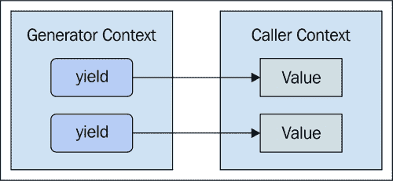
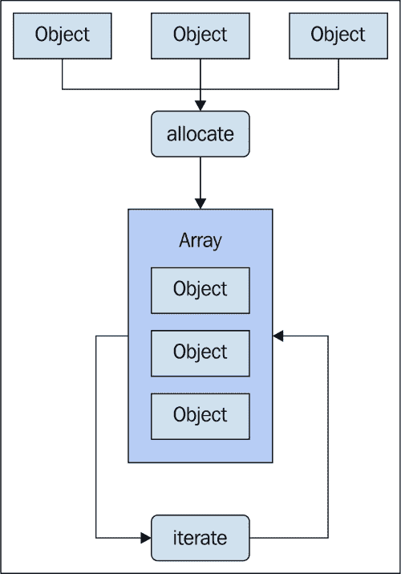
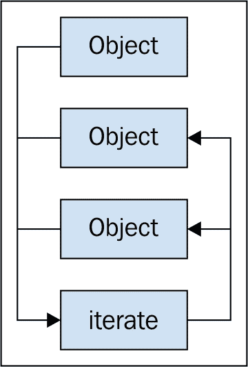
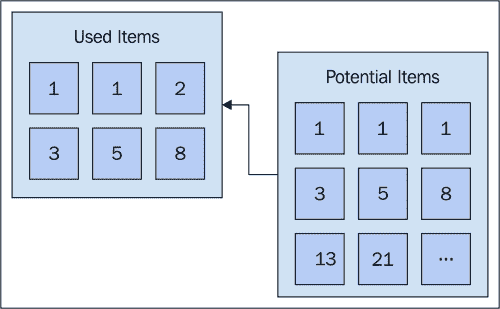
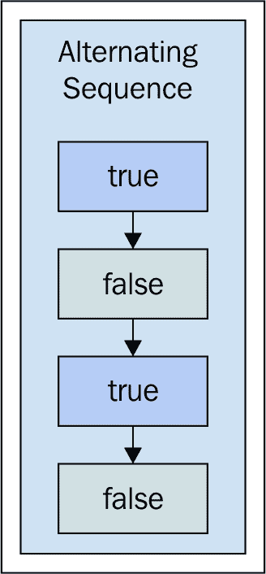
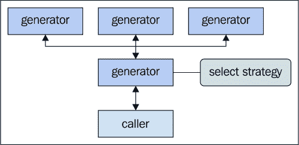
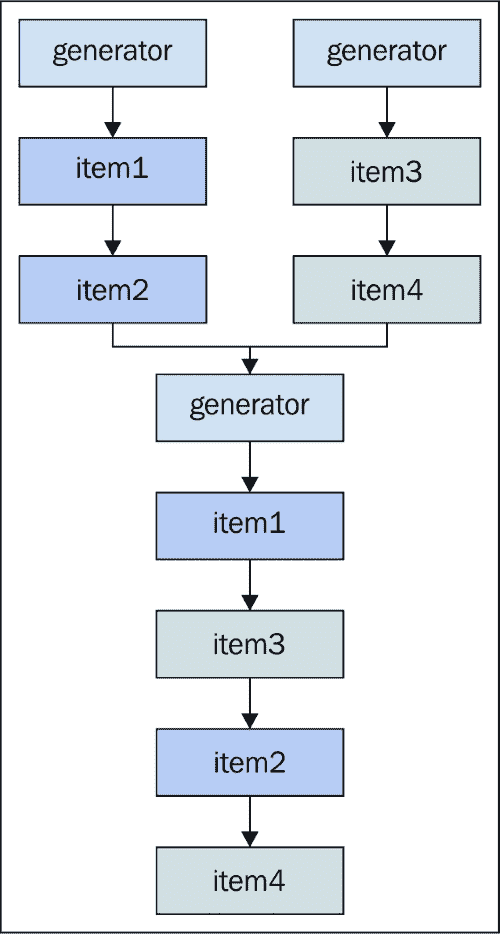
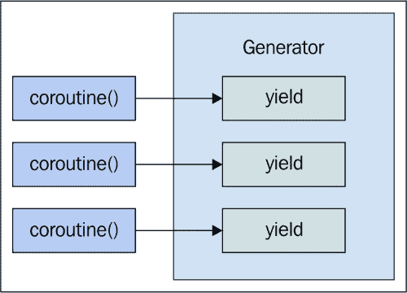

# 第四章：使用生成器进行延迟评估

延迟评估是一种编程技术，当我们不想在最后一刻计算值时使用。这样，我们就可以确定我们确实需要它。相反的方法，即急切评估，可能会计算几个不需要的值。这通常不是问题，直到我们的应用程序的大小和复杂性增长到用户无法察觉这些浪费计算的程度。

`生成器`是 JavaScript 语言 ES6 规范中引入的一种新原始类型。生成器帮助我们实现代码中的延迟评估技术，并且作为推论，帮助我们实现节省并发原则。

我们将从一些简单的生成器介绍开始本章，这样我们就可以了解它们的行为。然后，我们将转向更高级的延迟评估场景，并以协程的概述结束本章。让我们开始吧。

# 调用栈和内存分配

内存分配是任何编程语言的必要条件。没有它，我们就没有数据结构可以工作，甚至没有原始类型。内存很便宜，看起来似乎有足够的内存可用；这还不是庆祝的理由。虽然今天在内存中分配较大的数据结构比 10 年前更容易，但我们仍然需要在完成时释放内存。JavaScript 是一种垃圾回收语言，这意味着我们的代码不需要显式地在内存中销毁对象。然而，垃圾回收器会带来 CPU 的惩罚。

因此，这里有两个因素在起作用。我们想要节省两种资源，我们将尝试使用生成器来实现延迟评估。我们不希望无谓地分配内存，如果我们能避免这一点，那么我们就可以避免频繁地调用垃圾回收器。在本节中，我将介绍一些生成器概念。

## 标记函数上下文

在正常的函数调用栈中，一个函数返回一个值。`return`语句激活一个新的执行上下文，并丢弃旧的上下文，因为我们已经返回了，所以我们已经完成了。生成器函数是一种特殊的 JavaScript 函数，用它们自己的语法表示，它们的调用栈与`return`语句相比并不那么简单明了。以下是调用生成器函数时发生的情况的视觉表示，它开始产生值：



正如`return`语句将值传递给调用上下文一样，`yield`语句将值返回。然而，与普通函数不同，生成器函数上下文不会被丢弃。实际上，它们被标记，以便当控制权返回给生成器上下文时，它可以从中断的地方继续产生值，直到完成。这个标记数据非常微不足道，因为它仅仅指向我们代码中的一个位置。

## 序列而不是数组

在 JavaScript 中，当我们需要遍历一系列事物，如数字、字符串、对象等时，我们使用数组。数组是通用且强大的。在延迟评估的上下文中，数组的挑战在于数组本身是需要分配的数据。因此，数组内的元素需要在内存中分配某个位置，我们还需要有关数组中元素元数据。

如果我们正在处理大量对象，与数组相关的内存开销是显著的。此外，我们还需要以某种方式将这些对象放入数组中。这是一个额外的步骤，会增加 CPU 时间。另一种概念是序列。序列并不是一个实际的 JavaScript 语言结构。它是一个抽象概念——实际上不分配数组的数组。序列有助于延迟评估。正因为如此，没有需要分配的内容，也没有初始填充步骤。以下是迭代数组所涉及的步骤的示意图：



如我们所见，在我们能够遍历这三个对象之前，我们首先必须分配一个数组，然后填充这些对象。让我们通过以下图表来对比这种方法和序列的概念：



在序列中，我们没有为我们要迭代的对象提供一个显式的容器结构。与序列相关的唯一开销是当前项的指针。我们可以使用生成器函数作为在 JavaScript 中生成序列的机制。正如我们在前一节中看到的，生成器在向调用者返回值时，会标记其执行上下文。这正是我们所寻找的最小开销。它使我们能够延迟评估对象，并以序列的形式迭代它们。

# 创建生成器和产生值

在本节中，我将介绍生成器函数的语法，并带大家了解如何从生成器中产生值。我们还将探讨两种可以用来遍历生成器产生的值的途径。

## 生成器函数语法

生成器函数的语法几乎与普通函数相同。声明中的区别在于`function`关键字后面跟着一个星号。更深刻的不同之处在于返回值，它始终是一个生成器实例。此外，尽管创建了一个新对象，但不需要`new`关键字。让我们看看生成器函数的样子：

```js
// Generator functions use an asterisk to
// denote a that a generator instance is returned.
// We can return values from generators, but instead
// of the caller getting that value, they'll always
// get a generator instance.
function* gen() {
    return 'hello world';
}

// Creates the generator instance.
var generator = gen();

// Let's see what this looks like.
console.log('generator', generator);
// → generator Generator

// Here's how we get the return value. Looks awkward,
// because we would never use a generator function
// that simply returns a single value.
console.log('return', generator.next().value);
// → return hello world
```

我们几乎不可能以这种方式使用生成器，但这是一个很好的方式来展示生成器函数的细微差别。例如，`return`语句在生成器函数中是完全有效的，然而，它们对调用者产生了完全不同的结果，正如我们所看到的。在实践中，我们更有可能遇到生成器中的`yield`语句，所以让我们看看它们。

## 产生值

生成器函数的常见情况是产生值并将控制权交还给调用者。将控制权交还给调用者是生成器的定义特征。当我们产生值时，生成器会标记我们的代码位置。它这样做是因为调用者很可能会从生成器请求另一个值，当它这样做时，生成器只需从上次离开的地方继续即可。让我们看看一个多次产生值的生成器函数：

```js
// This function yields values, in order. There's no
// container structure, like an array. Instead, each time
// the yield statement is called, control is yielded
// back to the caller, and the position in the function
// is bookmarked.
function* gen() {
    yield 'first';
    yield 'second';
    yield 'third';
}

var generator = gen();

// Each time we call "next()", control is passed back
// to the generator function's execution context. Then,
// the generator looks up the bookmark for where it
// last yielded control.
console.log(generator.next().value);
console.log(generator.next().value);
console.log(generator.next().value);
```

之前的代码展示了序列的样子。我们有三个值，它们按顺序从我们的函数中产生。它们也没有被放入任何容器结构中。第一次调用`yield`将`first`传递给`next()`，这就是它被使用的地方。对于其他两个值也是同样的情况。实际上，这就是惰性求值的作用。我们有三个`console.log()`调用。`gen()`的急切实现会返回一个值集合供我们记录。相反，当我们需要记录一个值时，我们会去生成器中获取它。这就是惰性因素；我们直到实际需要时才保存我们的努力，避免分配和计算。

我们之前示例的不太理想之处在于，我们实际上在重复调用`console.log()`，而实际上我们想要迭代序列，为序列中的每个项目调用`console.log()`。现在让我们迭代一些生成器序列。

## 迭代生成器

`next()`方法，不出所料，给我们生成器序列中的下一个值。`next()`实际返回的对象有两个属性：产生的`value`和生成器是否`done`。然而，我们通常不想硬编码我们的`next()`调用。相反，我们希望随着生成器产生值而迭代地调用它。以下是一个使用`while`循环迭代生成器的示例：

```js
// A basic generator function that yields
// sequential values.
function* gen() {
    yield 'first';
    yield 'second';
    yield 'third';
}

// Creates the generator.
var generator = gen();

// Loop till the sequence is finished.
while(true) {

    // Gets the next item from the sequence.
    let item = generator.next();

    // Is there a next value, or are we done?
    if (item.done) {
        break;
    }

    console.log('while', item.value);
}
```

这个循环将继续，直到产生的项目的`done`属性为`true`；在这个时候，我们知道没有更多项目了，因此我们可以停止。这允许我们迭代一个产生的值序列，而无需创建一个仅用于迭代的数组。然而，这个循环中有许多样板代码，与生成器迭代的管理比实际迭代更多。让我们看看另一种方法：

```js
// The "for..of" loop removes the need to explicitly
// call generator constructs, like "next()", "value",
// and "done".
for (let item of generator) {
    console.log('for..of', item);
}
```

这要好得多。我们已经将代码压缩成更专注于当前任务的东西。这段代码本质上与我们的`while`循环做的是完全相同的事情，除了`for..of`语句，它理解当可迭代对象是生成器时应该做什么。在并发 JavaScript 应用程序中迭代生成器是一种常见模式，因此在这里优化为紧凑和可读的代码是一个明智的决定。

# 无穷序列

一些序列是无限的，如素数、斐波那契数、奇数等。无穷序列不仅限于数字集合；还可以考虑更抽象的概念为无限。例如，一个无限重复的字符串集合，一个无限切换的布尔值，等等。在本节中，我们将探讨生成器如何使我们能够处理无穷序列。

## 无尽头

从无穷序列中分配项目从内存消耗的角度来看并不实用。事实上，甚至无法分配整个序列——它是无限的。内存是有限的。因此，最好是完全避开整个分配问题，并使用生成器按需生成序列中的值。在任何给定的时间点，我们的应用程序只会使用无穷序列的一小部分。以下是无穷序列的使用与这些序列潜在大小的可视化：



如我们所见，有大量的项目可用，但我们永远不会在这个序列中使用。让我们看看一些生成器代码，它可以从无穷大的斐波那契序列中懒加载项目：

```js
// Generates an infinite Fibonacci sequence.
function* fib() {
    var seq = [ 0, 1 ],
        next;

    // This loop doesn't actually run infinitely,
    // only as long as items from the sequence
    // are requested using "next()".
    while (true) {

        // Yields the next item in the sequence.
        yield (next = seq[0] + seq[1]);

        // Stores state necessary to compute the
        // item in the next iteration.
        seq[0] = seq[1];
        seq[1] = next;
    }
}

// Launch the generator. This will never be "done"
// generating values. However, it's lazy - it only
// generates what we ask for.
var generator = fib();

// Gets the first 5 items of the sequence.
for (let i = 0; i < 5; i++) {
    console.log('item', generator.next().value);
}
```

## 交替序列

无穷序列的变体可以是循环序列或交替序列。当达到序列的末尾时，这些类型的序列是循环的；它们从开始处重新开始。以下是一个在两个值之间交替的序列的示例：



这些类型的序列将无限期地生成值。当我们有一组规则来定义序列以及生成的项目集合时，这很有用；然后，我们再次从头开始这个集合。现在，让我们看看一些代码，看看如何使用生成器实现这些序列。以下是一个通用的生成器函数，我们可以用它来在值之间交替：

```js
// A generic generator that will infinitely iterate
// over the provided arguments, yielding each item.
function* alternate(...seq) {
    while (true) {
        for (let item of seq) {
            yield item;
        }
    }
}
```

这是我们第一次声明一个接受参数的生成器函数。实际上，我们正在使用扩展运算符来遍历传递给函数的参数。与参数不同，我们使用扩展运算符创建的`seq`参数是一个真正的数组。当我们遍历这个数组时，我们从生成器中产生每个项目。乍一看，这可能并不那么有用，但正是`while`循环在这里增加了真正的力量。由于`while`循环永远不会退出，`for`循环将简单地重复自己。也就是说，它会交替。这消除了显式记账代码的需要（我们是否到达了序列的末尾？我们如何重置计数器并回到开始？等等）让我们看看这个生成器函数是如何工作的：

```js
// Create a generator that alternates between
// the provided arguments.
var alternator = alternate(true, false);

console.log('true/false', alternator.next().value);
console.log('true/false', alternator.next().value);
console.log('true/false', alternator.next().value);
console.log('true/false', alternator.next().value);
// → 
// true/false true
// true/false false
// true/false true
// true/false false
```

很酷。所以`alternator`将一直生成`true`/`false`值，只要我们继续请求它们。这里的主要好处是我们不需要知道下一个值，`alternator`会为我们处理这个问题。让我们看看这个生成器函数，它使用不同的序列进行迭代：

```js
// Create a new generator instance, with new values
// to alternate with each iteration.
alternator = alternate('one', 'two', 'three');

// Gets the first 10 items from the infinite sequence.
for (let i = 0; i< 10; i++) {
    console.log('one/two/three',
        `"${alternator.next().value}"`);
}
// → 
// one/two/three "one"
// one/two/three "two"
// one/two/three "three"
// one/two/three "one"
// one/two/three "two"
// one/two/three "three"
// one/two/three "one"
// one/two/three "two"
// one/two/three "three"
// one/two/three "one"
```

如我们所见，`alternate()`函数在交替传递给它的任何参数时非常有用。

# 委托给其他生成器

我们已经看到`yield`语句能够暂停`生成器`函数的执行上下文，并将值返回到调用上下文。`yield`语句有一个变体，允许我们委托给其他`生成器`函数。另一种技术是通过交织几个生成器源来创建一个生成器网格。在本节中，我们将探讨这两个想法。

## 选择策略

委托给其他生成器使我们的函数能够在运行时决定，将控制权从一个生成器传递给另一个生成器。换句话说，它允许根据策略选择更合适的生成器函数。以下是一个生成器函数的视觉表示，该函数做出决定并委托给几个其他生成器函数之一：



我们这里有三个专门的生成器，我们希望在应用程序的各个地方使用它们。也就是说，它们各自以独特的方式工作。也许，它们是为特定类型的输入量身定制的。然而，这些生成器只是对它们所提供的输入做出假设。这可能不是最佳工具，因此，我们必须弄清楚使用哪个生成器。我们想要避免的是在各个地方实现这个策略选择代码。如果能够将所有这些封装到一个通用目的的生成器中，该生成器可以捕捉到代码中的常见情况，那就太好了。

假设我们有以下生成器函数，并且它们在我们的整个应用程序中都被同等使用：

```js
// Generator that maps a collection of objects
// to a specific property name.
function* iteratePropertyValues(collection, property) {
    for (let object of collection) {
        yield object[property];
    }
}

// Generator that yields each value of the given object.
function* iterateObjectValues(collection) {
    for (let key of Object.keys(collection)) {
        yield collection[key];
    }
}

// Generator that yields each item from the given array.
function* iterateArrayElements(collection) {
    for (let element of collection) {
        yield element;
    }
}
```

这些函数都是小而简洁的，并且它们在需要的地方很容易使用。问题是每个这些函数都对传入的集合做出了假设。它是对象的数组，每个对象都有特定的属性吗？它是字符串数组吗？它是一个对象而不是数组吗？由于这些生成器函数在我们的代码中用于类似的目的，并且经常被使用，我们可以实现一个更通用的迭代器，其任务是确定使用哪个最佳生成器函数，然后将其委托给它。让我们看看这个函数是什么样子：

```js
// This generator defers to other generators. But first,
// it executes some logic to determine the best strategy.
function* iterateNames(collection) {

    // Are we dealing with an array?
    if (Array.isArray(collection)) {

        // This is a heuristic where we check the first
        // element of the array. Based on what's there, we
        // make assumptions about the remaining elements.
        let first = collection[0];

        // Here is where we defer to other more specialized
        // generators, based on what we find out about the
        // first array element.
        if (first.hasOwnProperty('name')) {
            yield* iteratePropertyValues(collection,
                'name');
        } else if (first.hasOwnProperty('customerName')) {
            yield* iteratePropertyValues(collection,
                'customerName');
        } else {
            yield* iterateArrayElements(collection);
        }
    } else {
        yield* iterateObjectValues(collection);
    }
}
```

将`iterateNames()`函数视为其他三个生成器中的任何一个的简单代理。它检查输入并根据集合做出选择。我们本可以实施一个大的生成器函数，但那样会阻止我们在需要直接使用较小生成器的情况下使用。如果我们想将它们用于组合新功能，或者如果另一个组合生成器想使用它怎么办？始终保持生成器函数小而专注是一个好主意。`yield*`语法允许我们将控制权传递给更合适的生成器。

现在，让我们看看这个通用生成器函数是如何通过委托给最适合处理数据的生成器来使用的：

```js
var collection;

// Iterates over an array of string names.
collection = [ 'First', 'Second', 'Third' ];

for (let name of iterateNames(collection)) {
    console.log('array element', `"${name}"`);
}

// Iterates over an object, where the names
// are the values - the keys aren't relevant here.
collection = {
    first: 'First',
    second: 'Second',
    third: 'Third'
};

for (let name of iterateNames(collection)) {
    console.log('object value', `"${name}"`);
}

// Iterates over the "name" property of each object
// in the collection.
collection = [
    { name: 'First' },
    { name: 'Second' },
    { name: 'Third' }
];

for (let name of iterateNames(collection)) {
    console.log('property value', `"${name}"`);
}
```

## 交织生成器

当一个生成器委托给另一个生成器时，控制权不会在第二个生成器完全完成后交还给第一个生成器。在前面的例子中，我们的生成器只是寻找一个更好的生成器来完成工作。然而，在其他时候，我们可能想要使用两个或更多数据源。因此，而不是将控制权传递给一个生成器，然后传递给另一个，如此类推，我们将交替使用各种来源，轮流消耗数据。

下面是一个图解，说明了将多个数据源交织在一起以创建单个数据源的生成器概念：



策略是轮询数据源，而不是清空一个源，然后另一个，如此类推。当没有单个大型集合供我们工作时，这种生成器非常有用，而是有两个或更多集合。使用这种生成器技术，我们实际上可以将多个数据源视为一个大型源，而无需为大型结构分配内存。让我们看看以下代码示例：

```js
'use strict';

// Utility function that converts the input array to a
// generator by yielding each of it's values. If its
// not an array, it assumes it's already a generator
// and defers to it.
function* toGen(array) {
    if (Array.isArray(array)) {
        for (let item of array) {
            yield item;
        }
    } else {
        yield* array;
    }
}

// Interweaves the given data sources (arrays or
// generators) into a single generator source.
function* weave(...sources) {

    // This controls the "while" loop. As long as
    // there's a source that's yielding data, the
    // while loop is still valid.
    var yielding = true;

    // We have to make sure that each of our
    // sources is a generator.
    var generators = sources.map(
        source =>toGen(source));

    // Starts the main weaving loop. It makes it's
    // way through each source, yielding one item
    // from each, then starting over, till every
    // source is empty.
    while (yielding) {
        yielding = false;

        for (let source of generators) {
            let next = source.next();

            // As long as we're yielding data, the
            // "yielding" value is true, and the
            // "while" loop continues. As soon as
            // "done" is true for every source, the
            // "yielding" variable stays false, and
            // the "while loop exits.
            if (!next.done) {
                yielding = true;
                yield next.value;
            }
        }
    }
}

// A basic filter that generates values by
// iterating over the given source, and yielding items
// that are not disabled.
function* enabled(source) {
    for (let item of source) {
        if (!item.disabled) {
            yield item;
        }
    }
}

// These are the two data sources we want to weave
// together into one generator, which can then be
// filtered by another generator.
var enrolled = [
    { name: 'First' },
    { name: 'Sencond' },
    { name: 'Third', disabled: true }
];

var pending = [
    { name: 'Fourth' },
    { name: 'Fifth' },
    { name: 'Sixth', disabled: true }
];

// Creates the generator, which yields user objects
// from two data sources.
var users = enabled(weave(enrolled, pending));

// Actually performs the weaving and filtering.
for (let user of users) {
    console.log('name', `"${user.name}"`);
}
```

# 将数据传递给生成器

`yield`语句不仅将控制权交还给调用者，还返回一个值。这个值通过`next()`方法传递给生成器函数。这就是我们在生成器创建后如何将数据传递给生成器的方式。在本节中，我们将讨论生成器的双向特性，以及创建反馈循环可以产生一些简洁的代码。

## 重复使用生成器

一些生成器是通用型的，并在我们的代码中频繁使用。在这种情况下，我们是否需要不断地创建和销毁这些生成器实例？或者我们可以重用它们？例如，考虑一个主要依赖于初始条件的序列。假设我们想要生成一个偶数序列。我们会从 2 开始，当我们遍历这个生成器时，值会增加。下次我们想要遍历偶数时，我们必须创建一个新的生成器。

这有点浪费，因为我们所做的只是重置一个计数器。如果我们采取不同的方法，一种可以让我们继续使用相同的生成器实例来处理这些类型的序列的方法会怎样？生成器的`next()`方法是实现这种功能的可能途径之一。我们可以传递一个值，然后重置我们的计数器。因此，每次我们需要遍历偶数时，我们不必创建一个新的生成器实例，只需用重置生成器初始条件的值调用`next()`即可。

实际上，`yield`关键字返回一个值——传递给`next()`的参数。大多数情况下，这是未定义的，例如当生成器在`for..of`循环中迭代时。然而，这就是我们能够在生成器开始运行后传递参数给生成器的方式。这与传递参数给生成器函数不同，这对于生成器的初始配置很有用。传递给`next()`的值是我们需要更改下一个要生成的值时与生成器交流的方式。

让我们看看我们如何可以使用`next()`方法创建一个可重用的偶数序列生成器：

```js
// This generator will keep generating even numbers.
function* genEvens() {

    // The initial value is 2\. But this can change based
    // on the input passed to "next()".
    var value = 2,
        input;

    while (true) {

        // We yield the value, and get the input. If 
        // input is provided, this will serve as the
        // next value.
        input = yield value;

        if (input) {
            value = input;
        } else {
            // Make sure that the next value is even.
            // Handles the case when an odd value is
            // passed to "next()".
            value += value % 2 ? 1 : 2;
        }
    }
}

// Creates the "evens" generator.
var evens = genEvens(),
    even;

// Iterate over evens up to 10.
while ((even = evens.next().value) <= 10) {
    console.log('even', even);
}
// →
// even 2
// even 4
// even 6
// even 8
// even 10

// Resets the generator. We don't need to
// create a new one.
evens.next(999);

// Iterate over evens between 1000 - 1024.
while ((even = evens.next().value) <= 1024) {
    console.log('evens from 1000', even);
}
// → 
// evens from 1000 1000
// evens from 1000 1002
// evens from 1000 1004
// evens from 1000 1006
// evens from 1000 1008
// evens from 1000 1010
// evens from 1000 1012
// evens from 1000 1014
// ...
```

### 注意

如果你想知道为什么我们不使用`for..of`循环而使用`while`循环，那是因为你使用`for..of`循环来遍历生成器。当你这样做时，一旦循环退出，生成器就会被标记为*完成*。因此，它将不再可用。

## 轻量级 map/reduce

我们还可以使用`next()`方法将一个值映射到另一个值。例如，假设我们有一个包含七个项目的集合。为了映射这些项目，我们会遍历这个集合，将每个项目传递给`next()`。正如我们在前面的部分中看到的，这种方法可以重置生成器的状态，但它也可以用来提供输入数据流，就像它提供输出数据流一样。

让我们看看我们是否可以编写一些代码来实现这一点——通过将集合项目通过`next()`馈入生成器来映射集合项目：

```js
// This generator will keep iterating, as
// long as "next()" is called. It's expecting
// a value as well, so that it can call the
// "iteratee()" function on it, and yield the
// result.
function* genMapNext(iteratee) {
    var input = yield null;

    while (true) {
        input = yield iteratee(input);
    }
}

// Our array of values we want to map.
var array = [ 'a', 'b', 'c', 'b', 'a' ];

// A "mapper" generator. We pass an iteratee
// function as an argument to "genMapNext()".
var mapper = genMapNext(x =>x.toUpperCase());

// Our starting point for the reduction.
var reduced = {};

// We have to call "next()" to bootstrap the
// generator. 
mapper.next();

// Now we can start iterating over the array.
// The "mapped" value is yielded from the
// generator. The value we want mapped is fed
// into the generator by passing it to "next()".
for (let item of array) {
    let mapped = mapper.next(item).value;

    // Our reduction logic takes the mapped value,
    // and adds it to the "reduced" object, counting
    // the number of duplicate keys.
    if (reduced.hasOwnProperty(mapped)) {
        reduced[mapped]++;
    } else {
        reduced[mapped] = 1;
    }
}

console.log('reduced', reduced);
// → reduced { A: 2, B: 2, C: 1 }
```

如我们所见，这确实可行。我们可以使用这种方法执行轻量级的 map/reduce 作业。映射生成器具有应用于集合中每个项目的`iteratee`函数。当我们遍历数组时，我们可以通过将它们作为参数传递给`next()`方法来将这些项目馈入生成器。

但是，关于之前的方法，总感觉它并不那么优化——需要这样启动生成器，并且每次迭代都要显式调用`next()`，感觉有点笨拙。实际上，我们能否直接应用`iteratee`函数，而不是调用`next()`呢？在使用生成器时，我们需要留意这些事情；特别是在向生成器传递数据时。仅仅因为我们能够这样做，并不意味着这是一个好主意。

如果我们像对待其他所有生成器一样简单地迭代生成器，映射和归约可能会感觉更自然。我们仍然想要生成器提供的轻量级映射，以避免内存分配。让我们尝试一种不同的方法——一种不需要`next()`方法的方法：

```js
// This generator is a more useful mapper than
// "genMapNext()" because it doesn't rely on values
// coming into the generator through "next()".
//
// Instead, this generator accepts an iterable, and
// an iteratee function. The iterable is then
// iterated-over, and the result of the iteratee
// is yielded.
function* genMap(iterable, iteratee) {
    for (let item of iterable) {
        yield iteratee(item);
    }
}

// Creates our "mapped" generator, using an iterable
// data source, and an iteratee function.
var mapped = genMap(array, x =>x.toUpperCase());
var reduced = {}

// Now we can simply iterate over our genrator, instead
// of calling "next()". The job of each loop iteration
// is to perform the reduction logic, instead of having
// to call "next()".
for (let item of mapped) {
    if (reduced.hasOwnProperty(item)) {
        reduced[item]++;
    } else {
        reduced[item] = 1;
    }
}

console.log('reduce improved', reduced);
// → reduce improved { A: 2, B: 2, C: 1 }
```

这看起来像是一个改进。代码更少，生成器的流程也更容易理解。区别在于我们提前将数组和我们自己的`iteratee`函数传递给生成器。然后，当我们迭代生成器时，每个项目都会被惰性地映射。将这个数组归约成一个对象的代码也更容易阅读。

我们刚刚实现的`genMap()`函数是通用的，这对我们来说是有利的。在实际应用中，映射将比大写转换更复杂。更有可能的是，会有多个映射级别。也就是说，我们映射集合，然后映射它 N 次，然后再进行归约。如果我们已经很好地设计了我们的代码，那么我们将想要将较小的迭代函数组合成生成器。

但是，我们如何保持这种通用性和惰性呢？想法是拥有几个生成器，每个生成器都作为下一个生成器的输入。这意味着当我们的归约代码迭代这些生成器时，只有一个项目会通过映射的各个层次，到达归约代码。让我们尝试实现这一点：

```js
// This function composes a generator
// function out of iteratees. The idea is to create
// a generator for each iteratee, so that each item
// from the original iterable, flows down, through
// each iteratee, before mapping the next item.
function composeGenMap(...iteratees) {

    // We're returning a generator function. That way,
    // the same mapping composition can be used on
    // several iterables, not just one.
    return function* (iterable) {

        // Creates the generator for each iteratee
        // passed to the function. The next generator
        // gets the previous generator as the "iterable"
        // argument.
        for (let iteratee of iteratees) {
            iterable = genMap(iterable, iteratee);
        }

        // Simply defer to the last iterable we created.
        yield* iterable;
    }
}

// Our iterable data source.
var array = [ 1, 2, 3 ];

// Creates a "composed" mapping generator, using 3
// iteratee functions.
var composed = composeGenMap(
    x => x + 1,
    x => x * x,
    x => x - 2
);

// Now we can iterate over the composed generator,
// passing it our iterable, and lazily mapping
// values.
for (let item of composed(array)) {
    console.log('composed', item)
}
// →
// composed 2
// composed 7
// composed 14
```

# 协程

协程是一种并发技术，允许协作式多任务处理。这意味着如果我们的应用程序的某个部分需要执行任务的一部分，它可以这样做，然后将控制权交给应用程序的另一个部分。想想子程序，或者更近期的函数。这些子程序通常依赖于其他子程序。然而，它们并不是依次运行，而是相互协作。

在 JavaScript 中，没有内建的协程机制。生成器不是协程，但它们有相似的性质。例如，生成器可以暂停函数的执行，将控制权交给另一个上下文，然后重新获得控制权并继续执行。这让我们前进了一步，但生成器是用来生成值的，这并不一定是协程的目标。在本节中，我们将探讨一些使用生成器在 JavaScript 中实现协程的技术。

## 创建协程函数

生成器为我们提供了在 JavaScript 中实现`coroutine`函数所需的大部分功能；它们可以暂停和恢复执行。我们只需要在生成器周围实现一些小的抽象，这样我们正在处理的函数就会感觉像是调用`coroutine`函数，而不是迭代生成器。以下是我们希望我们的协程在调用时表现的大致示例：



想法是调用`coroutine`函数会从一个`yield`语句移动到下一个。我们可以通过传递一个参数来向协程提供输入，然后该参数由`yield`语句返回。这有很多东西需要记住，所以让我们在函数包装器中概括这些协程概念：

```js
// Taken from: http://syzygy.st/javascript-coroutines/
// This utility takes a generator function, and returns
// a coroutine function. Any time the coroutine is invoked,
// it's job is to call "next()" on the generator.
//
// The effect is that the generator function can run
// indefinitely, pausing when it hits "yield" statements.
function coroutine(func) {

    // Creates the generator, and moves the function
    // ahead to the first "yield" statement.
    var gen = func();
    gen.next();

    // The "val" is passed to the generator function
    // through the "yield" statement. It then resumes
    // from there, till it hits another yield.
    return function(val) {
        gen.next(val);
    }
}
```

非常简单——只有五行代码，但功能强大。Harold 的包装函数返回的函数只是将生成器推进到下一个`yield`语句，如果提供了参数，则将其提供给`next()`。声称有用是一回事，但让我们实际使用这个工具来创建一个`coroutine`函数：

```js
// Creates a coroutine function that when called,
// advances to the next yield statement.
var coFirst = coroutine(function* () {
    var input;

    // Input comes from the yield statement, and is
    // the argument value passed to "coFirst()".
    input = yield;
    console.log('step1', input);
    input = yield;
    console.log('step3', input);
});

// Works the same as the coroutine created above...
var coSecond = coroutine(function* () {
    var input;
    input = yield;
    console.log('step2', input);
    input = yield;
    console.log('step4', input);
});

// The two coroutines cooperating with one another,
// to produce the expected output. We can see that
// the second call to each coroutine picks up where
// the last yield statement left off.
coFirst('the money');
coSecond('the show');
coFirst('get ready');
coSecond('go');
// → 
// step1 the money
// step2 the show
// step3 get ready
// step4 go
```

当涉及到一系列步骤来完成某个任务时，我们通常需要记账代码、临时值等等。但在协程中这些都不是必需的，因为函数只是暂停，保留任何局部状态不变。换句话说，当协程能够很好地为我们隐藏这些细节时，我们不需要将并发逻辑与我们的应用逻辑交织在一起。

## 处理 DOM 事件

我们还可以在 DOM 事件处理程序中使用协程。这是通过将相同的`coroutine()`函数作为事件监听器添加到多个元素上实现的。让我们回顾一下，对这些协程函数的每次调用都对应一个单独的生成器。这意味着我们设置来处理 DOM 事件的协程被作为流传递。这几乎就像我们正在迭代这些事件。

由于这些`coroutine`函数使用相同的生成器，元素之间使用这种技术进行通信变得很容易。处理 DOM 事件的典型方法涉及回调函数，这些函数与某种中央源进行通信，该源在元素之间共享并维护状态。使用协程，元素通信的状态隐含在我们的函数代码中。让我们在 DOM 事件处理程序的上下文中使用我们的协程包装器：

```js
// Coroutine function that's used with mousemove
// events.
var onMouseMove = coroutine(function* () {
    var e;

    // This loop continues indefinitely. The event
    // object comes in through the yield statement.
    while (true) {
        e = yield;

        // If the element is disabled, do nothing.
        // Otherwise, log a message.
        if (e.target.disabled) {
            continue;
        }

        console.log('mousemove', e.target.textContent);
    }
});

// Coroutine function that's used with click events.
var onClick = coroutine(function* () {

    // Store references to our two buttons. Since
    // coroutines are stateful, they'll always be 
    // available.
    var first = document.querySelector(
        'button:first-of-type');
    var second = document.querySelector(
        'button:last-of-type'),
    var e;

    while (true) {
        e = yield;

        // Disables the button that was clicked.
        e.target.disabled = true;

        // If the first button was clicked, toggle
        // the state of the second button.
        if (Object.is(e.target, first)) {
            second.disabled = !second.disabled;
            continue;
        }

        // If the second button was clicked, toggle
        // the state of the first button.
        if (Object.is(e.target, second)) {
            first.disabled = !first.disabled;
        }
    }
});

// Sets up the event handlers - our coroutine functions.
for (let button of document.querySelectorAll('button')) {
    button.addEventListener('mousemove', onMouseMove);
    button.addEventListener('click', onClick);
}
```

## 处理承诺值

在前面的章节中，我们看到了如何使用`coroutine()`函数来处理 DOM 事件。我们不是随意添加响应 DOM 事件的回调函数，而是使用相同的`coroutine()`函数，它将事件视为数据流。由于它们共享相同的生成器上下文，DOM 事件处理程序之间的协作变得更加容易。

我们可以将同样的原则应用到 promise 的`then()`回调中，这与 DOM 协程方法类似。我们不是传递一个常规函数，而是将协程传递给`then()`。当 promise 解决时，`coroutine`会随着解决值一起前进到下一个`yield`语句。让我们看一下以下代码：

```js
// An array of promises.
var promises = [];

// Our resolution callback is a coroutine. This means
// that every time it's called, a new resolved promise
// value shows up here.
var onFulfilled = coroutine(function* () {
    var data;

    // Continue to process resolved promise values
    // as they arrive.
    while (true) {
        data = yield;
        console.log('data', data);
    }
});

// Create 5 promises that resolve at random times,
// between 1 and 5 seconds.
for (let i = 0; i< 5; i++) {
    promises.push(new Promise((resolve, reject) => {
    setTimeout(() => {
        resolve(i);
    }, Math.floor(
        Math.random() * (5000 - 1000)) + 1000);
    }));
}

// Attach our fulfillment coroutine as a "then()" callback.
for (let promise of promises) {
    promise.then(onFulfilled);
}
```

这非常有用，因为它提供了一些静态 promise 方法所不具备的东西。`Promise.all()`方法强制我们等待所有 promise 解决后，才解决返回的 promise。然而，在解决 promise 值之间没有相互依赖的情况下，我们可以简单地遍历它们，以它们解决的任何顺序做出响应。

我们可以通过将普通函数附加到`then()`作为回调来实现类似的效果，但那样的话，我们就没有一个共享的上下文来处理解决时的 promise 值。另一种我们可以采用的方法是将 promise 与协程结合使用，声明一些响应不同，取决于它们响应的数据类型的协程。然后，这些协程将在整个应用期间存在，当它们被创建时，会传递给 promise。

# 摘要

本章向您介绍了生成器的概念，这是 ES6 中的一种新结构，它允许我们实现惰性求值。生成器帮助我们实现节省并发原则，因为我们能够避免计算和中间内存分配。与生成器相关联有一些新的语法形式。首先，是生成器函数，它总是返回一个生成器实例。这些函数的声明方式与常规函数不同。这些函数负责生成值，这依赖于`yield`关键字。

我们随后探讨了更高级的生成器和惰性求值主题，包括委派给其他生成器、实现 map/reduce 功能以及将数据传递到生成器中。我们以如何使用生成器创建协程函数来结束本章。

在下一章中，我们将探讨 Web Workers——这是我们在浏览器环境中首次接触利用并行性的方法。
