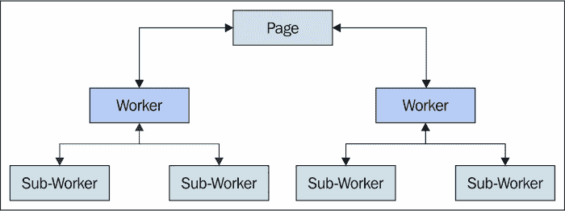

# 第五章。与 Workers 一起工作

Web Workers 允许在网页浏览器内实现真正的并行处理。它们已经经过了一段时间的成熟发展，并且现在得到了很好的供应商支持。在 Web Workers 出现之前，我们的 JavaScript 代码被限制在 CPU 上，我们的执行环境从页面首次加载时开始。Web Workers 出现是由于需求的推动——Web 应用程序的能力在不断增强。同时，它们也开始需要更多的计算能力。在今天，多个 CPU 核心变得很常见——甚至在低端硬件上也是如此。

在本章中，我们将探讨 Web Workers 的概念，以及它们如何与我们试图在应用程序中实现的并发原则相关联。然后，你将通过示例学习如何使用 Web Workers，这样在本书的后续部分，我们就可以开始将并行性与其他我们已经探索过的想法联系起来，例如承诺（promises）和生成器（generators）。

# 工作者是什么？

在我们深入实现示例之前，本节将快速概述 Web Workers 的概念，以及它们在系统内部如何与其他部分协同工作。Web Workers 是操作系统线程——一个我们可以调度事件的目标，并且它们以真正的并行方式执行我们的 JavaScript 代码。

## 操作系统线程

在本质上，Web Workers 仅仅是操作系统级别的线程。线程有点像进程，但它们需要的开销更少，因为它们与创建它们的进程共享内存地址。由于驱动 Web Workers 的线程处于操作系统级别，我们依赖于系统和其进程调度器。大多数时候，这正是我们想要的——让内核决定我们的 JavaScript 代码何时运行，以便最佳地利用 CPU。

这里有一个图表展示了浏览器如何将 Web Workers 映射到操作系统线程，以及这些线程如何映射到 CPU 核心：  


最后，最好让操作系统负责处理它擅长的事情——在物理硬件上调度软件任务。在更传统的多线程编程环境中，我们的代码与操作系统内核的距离更近。Web Workers 的情况并非如此。虽然底层机制是线程，但暴露的编程接口看起来更像是你可能在 DOM 中找到的东西。

## 事件目标

Web Workers 实现了熟悉的事件目标接口。这使得 Web Workers 的行为与其他我们习惯使用的组件相似，例如 DOM 元素或 XHR 请求。Workers 触发事件，这就是我们如何在主线程中从它们那里接收数据的方式。我们也可以向 Workers 发送数据，但这使用的是简单的方法调用。

当我们将数据传递到工作者中时，我们实际上触发了另一个事件；只是这次，它是在工作者的执行上下文中，而不是主页面的执行上下文中。除此之外没有更多的事情：数据输入，数据输出。没有`互斥`构造或类似的东西。这实际上是一件好事，因为作为平台的网络浏览器已经有很多移动部件。想象一下，如果我们加入一个更复杂的基于事件目标的线程模型，而不是简单的基于事件目标的模型，我们已经有足够的 bug 要修复了。

下面是一个关于 web worker 布局的大致概念，相对于产生这些工作者的主线程：


## 真正的并行化

Web workers 是我们架构中实现并行化原则的手段。众所周知，工作者是操作系统线程，这意味着运行在其内部的 JavaScript 代码可能与主线程中某些 DOM 事件处理器的代码在同一确切时刻运行。能够做这样的事情一直是 JavaScript 程序员的一个目标。在 Web workers 出现之前，真正的并行化根本不可能实现。我们能做到的最好的事情就是假装它，给用户一种许多事情同时发生的印象。

然而，始终在相同的 CPU 核心上运行存在一些问题。我们在给定时间窗口内可以执行的运算量受到根本性的限制。当引入真正的并行化时，这种限制会发生变化，因为可以运行的运算时间窗口会随着每个添加的 CPU 核心而增长。

话虽如此，对于我们的应用程序所做的许多事情，单线程模型工作得很好。今天的机器很强大。我们可以在很短的时间内完成很多事情。问题出现在我们遇到峰值时。这些可能是任何干扰我们代码处理效率的事件。我们的应用程序不断被要求做更多的事情——更多功能、更多数据、更多这样和那样的事情。

我们能够更好地利用我们面前坐着的硬件的简单想法，这就是 Web workers 的全部内容。如果使用得当，Web workers 不必成为我们项目中永远不会使用的那种不可逾越的新事物，因为它包含了一些超出我们舒适区概念。

# 工作者类型

在开发并发 JavaScript 应用程序的过程中，我们可能会遇到三种类型的 Web workers。在本节中，我们将比较这三种类型，以便我们能够理解在任何特定情况下哪种类型的工作者是有意义的。

## 专用工作者

专用工作者可能是最常见的工作者类型。它们被认为是 Web workers 的默认类型。当我们的页面创建一个新的工作者时，它仅专注于页面的执行上下文，而不关注其他任何事情。当我们的页面消失时，由页面创建的所有专用工作者也会随之消失。

页面与其创建的任何专用工作者之间的通信路径是直接的。页面向工作者发送消息，工作者随后将消息回传给页面。这些消息的确切编排取决于我们使用 Web 工作者试图解决的问题。在整个书中，我们将深入探讨这些消息模式。

### 注意

在本书中，主线程和页面是同义的。主线程是你的典型执行上下文，在那里我们可以操作页面并监听输入。Web 工作者上下文在很大程度上是相同的，只是可以访问的组件更少。我们将在稍后讨论这些限制。

这里展示了页面与其专用工作者之间的通信情况：


如我们所见，专用工作者确实是“专用”的。它们只存在于帮助服务创建它们的页面。它们不会直接与其他工作者通信，也不能与任何其他页面通信。

## 子工作者

子工作者与专用工作者非常相似。主要区别在于它们是由专用工作者创建的，而不是由主线程创建的。例如，如果一个专用工作者有一个可以从并行执行中受益的任务，它可以生成自己的工作者并编排子工作者之间任务的执行。

除了拥有不同的创建者外，子工作者与专用工作者具有相同的特征。子工作者不会直接与主线程中运行的 JavaScript 通信。这是创建子工作者的工作者负责促进他们的通信。以下是如何将子工作者融入整个方案的示意图：



## 共享工作者

第三种类型的 Web 工作者被称为共享工作者。共享工作者之所以被称为共享工作者，是因为多个页面可以共享同一实例的这种类型的工作者。可以访问特定共享工作者实例的页面受同源策略的限制，这意味着如果页面是从与工作者不同的域提供的，那么工作者不允许与该页面通信。

共享工作者解决的是与专用工作者解决的问题不同类型的问题。将专用工作者视为没有副作用的功能。你向它们传递数据，并得到不同的数据作为回报。将共享工作者视为遵循单例模式的程序对象。它们是不同浏览上下文之间共享状态的一种方式。例如，我们不会仅仅为了计算数字而创建共享工作者；我们可以使用专用工作者来完成这项工作。

当内存中有我们希望从同一应用中的任何页面访问的应用数据时，使用共享工作者是有意义的。想想用户在新标签页中打开链接。这创建了一个新的浏览上下文。这也意味着我们的 JavaScript 组件需要经过获取页面所需所有数据的流程，执行所有初始化步骤等等。这既重复又浪费。为什么不在不同的浏览上下文之间共享这些资源呢？以下是同一应用中的多个页面与共享工作者实例通信的示意图：


实际上，还有一种名为 Service Worker 的第四种 Web Worker 类型。这些是增加了与缓存网络资源和离线功能相关额外能力的共享工作者。Service Workers 仍处于其规范的早期阶段，但看起来很有希望。今天我们能从共享工作者中学到的任何东西，如果它们最终成为可行的 Web 技术，都将适用于 Service Workers。

在这里需要考虑的另一个重要因素是 Service Worker 增加的复杂性。主线程与 Service Worker 之间的通信机制涉及使用端口。同样，在共享工作者中运行的代码需要确保它通过正确的端口进行通信。我们将在本章后面更深入地介绍共享工作者通信。

# 工作者环境

Web Worker 环境与我们的代码通常运行的典型 JavaScript 环境不同。在本节中，我们将指出主线程 JavaScript 环境和 Web Worker 线程之间的关键差异。

## 有什么可用，有什么不可用？

对于 Web Workers 的一个常见误解是，它们与默认的 JavaScript 执行环境截然不同。确实，它们是不同的，但并没有大到无法接近的程度。也许正因为如此，JavaScript 开发者才会在 Web Workers 可能有益的情况下回避使用它们。

显而易见的一个差距是 DOM——它不存在于 Web Worker 执行环境中。规范编写者的这一决定是有意为之。通过避免将 DOM 集成到工作线程中，浏览器供应商可以避免许多潜在的边缘情况。我们都重视浏览器的稳定性胜过便利性，至少我们应该这样。从 Web Worker 内部访问 DOM 真的会那么方便吗？在本书接下来的几章中，我们将看到工作者擅长许多其他任务，这些任务最终有助于成功实现并发原则。

在我们的 web worker 代码中没有 DOM 访问，我们就不太可能犯错误。这实际上迫使我们真正思考我们最初为什么要使用 workers。我们可能实际上会退一步，重新思考我们的方法。除了 DOM 之外，我们日常使用的几乎所有东西都正好在我们期望的地方。这包括在 web workers 中使用我们最喜欢的库。

### 注意

要详细了解 web worker 执行环境中缺少的内容，请参阅此页面 [`developer.mozilla.org/en-US/docs/Web/API/Worker/Functions_and_classes_available_to_workers`](https://developer.mozilla.org/en-US/docs/Web/API/Worker/Functions_and_classes_available_to_workers)。

## 加载脚本

我们永远不会将整个应用程序写在一个 JavaScript 文件中。相反，我们将通过将源代码分解成文件来提高模块化，这样我们可以逻辑上分解设计，使其能够在大脑中映射。同样，我们可能也不希望创建由数千行代码组成的 web workers。幸运的是，web workers 自带一种机制，允许我们将代码导入到我们的 web workers 中。

第一个场景是将我们自己的代码导入到 web worker 上下文中。我们可能有很多专门针对我们应用程序的低级实用工具。有很大可能性我们需要在常规脚本上下文和 worker 线程中同时使用这些实用工具。我们希望保持我们的代码模块化，并希望我们的代码在 workers 中的表现与其他任何上下文相同。

第二个场景是在 web workers 中加载第三方库。这与将我们的模块加载到 web workers 中的原理相同——我们的代码将在任何上下文中工作，只有少数例外，如 DOM 代码。让我们看看一个创建 web worker 并加载`lodash`库的示例。首先，我们将启动 worker：

```js
// Loads the worker script, and starts the
// worker thread.
var worker = new Worker('worker.js');
```

接下来，我们将使用`loadScripts()`函数将`lodash`库引入我们的库中：

```js
// Imports the lodash library, making the global "_"
// variable available in the worker context.
importScripts('lodash.min.js');

// We can use the library within the worker now.
console.log('in worker', _.at([ 1, 2, 3], 0, 2));
// → in worker [1, 3]
```

我们不需要担心在开始使用脚本之前等待脚本加载——`importScripts()`是一个阻塞操作。

# 与 workers 通信

上述示例创建了一个 web worker，它确实在其自己的线程中运行。但是，这对我们来说并不很有帮助，因为我们需要能够与我们创建的 workers 进行通信。在本节中，我们将介绍涉及从 web workers 发送和接收消息的基本机制，包括这些消息是如何序列化的。

## 发送消息

当我们想要将数据传递给 web worker 时，我们使用`postMessage()`方法。正如其名所示，此方法将给定消息发送到 worker。如果 worker 中设置了任何消息事件处理器，它们将对此调用做出响应。让我们看看一个基本示例，它将一个字符串发送到 worker：

```js
// Launches the worker thread.
var worker = new Worker('worker.js');

// Posts a message to the worker, triggering
// any "message" event handlers.
worker.postMessage('hello world');
```

现在让我们看看这个通过为消息事件设置事件处理器来响应此消息的 worker：

```js
// Setup an event listener for any "message"
// events dispatched to this worker.
addEventListener('message', (e) => {

    // The posted data is accessible through
    // the "data" property of the event.
    console.log(e.type, `"${e.data}"`);
    // → message "hello world"
});
```

### 注意

`addEventListener()` 函数在全局专用工作线程上下文中隐式调用。我们可以将其视为 Web Worker 的窗口对象。

## 消息序列化

从主线程传递到工作线程的消息数据会经过序列化转换。当这个序列化数据到达工作线程时，它会进行反序列化，数据就可以作为 JavaScript 原始类型使用。当工作线程想要将数据发送回主线程时，也存在同样的过程。

不言而喻，这增加了一个额外的步骤，可能会给我们的应用程序增加负担。因此，在线程间传递数据时，我们必须仔细考虑，因为这并不是一个免费的 CPU 成本操作。在这本书的整个 Web Worker 代码示例中，我们将把消息序列化视为我们并发决策过程中的一个关键因素。

所以问题是——为什么要走这么长的路？如果我们使用的 JavaScript 代码中的工作线程仅仅是线程，那么从技术上讲，我们应该能够使用相同的对象，因为这些线程使用相同的内存地址部分。当线程共享资源，如内存中的对象时，很可能会出现资源竞争的场景。例如，如果一个工作线程锁定了一个对象，而另一个工作线程试图使用它，那么这就是一个错误。我们必须实现逻辑，优雅地等待对象变得可用，并且我们必须在工作线程中实现释放锁定资源的逻辑。

简而言之，这是一个容易出错且令人头疼的问题，我们最好避免它。幸运的是，线程之间没有共享资源——只有序列化的消息。这意味着我们在将哪些类型的数据传递给工作线程方面受到限制。一般来说，传递可以编码为 JSON 字符串的东西是安全的。记住，工作线程必须从这个序列化字符串中重建对象，所以函数或类实例的字符串表示形式将不起作用。让我们通过一个例子来看看这是如何工作的。首先，一个简单的用于记录接收到的消息的工作线程：

```js
// Simply display the content of any
// messages received.
addEventListener('message', (e) => {
    console.log('message', e.data);
});
```

现在我们来看看我们可以使用 `postMessage()` 将什么类型的数据序列化并发送到这个工作线程：

```js
// Launches the worker.
var worker = new Worker('worker.js');

// Sends a plain object.
worker.postMessage({ hello: 'world' });
// → message { hello: "world" }

// Sends an array.
worker.postMessage([ 1, 2, 3 ]);
// → message [ 1, 2, 3 ]

// Tries to send a function, results in
// an error being thrown.
worker.postMessage(setTimeout);
// → Uncaught DataCloneError
```

如我们所见，当我们尝试将一个函数传递给 `postMessage()` 时，会出现一点小问题。这种类型的数据一旦到达工作线程，就无法重建，因此 `postMessage()` 简单地抛出一个异常。这类限制可能看起来过于严格，但它们确实消除了许多并发问题的可能性。

## 从工作线程接收消息

没有将数据传回主线程的能力，工作者对我们来说并不那么有用。在某个时候，工作者执行的工作需要在 UI 中反映出来。我们可能会记得工作者实例是事件目标。这意味着我们可以监听消息事件，并在工作者发送回数据时相应地做出反应。把这看作是向工作者发送数据的逆过程。工作者只是通过向其发送消息将主线程视为另一个工作者，而主线程则监听消息。我们在前一节中探讨的相同的序列化限制在这里也是相关的。

让我们看看一些将消息发送回主线程的工作者代码：

```js
// After 2 seconds, post some data back to
// the main thread using the "postMessage()"
// function.
setTimeout(() => {
    postMessage('hello world');
}, 2000);
```

正如我们所见，这个工作者启动后，2 秒后向主线程发送一个字符串。现在，让我们看看我们如何在主页面 JavaScript 中处理这些传入的消息：

```js
// Launches the new worker.
var worker = new Worker('worker.js');

// Adds an event listener for the "message"
// event. Notice that the "data" property
// contains the actual message payload, the
// same way messages sent to workers do.
worker.addEventListener('message', (e) => {
    console.log('from worker', `"${e.data}"`);
});
```

### 注意

你可能已经注意到我们没有明确终止任何我们的工作者线程。这是可以的。当浏览上下文被终止时，所有活跃的工作者线程都会随之终止。我们可以使用`terminate()`方法显式地终止工作者，这将显式地停止线程，而无需等待现有代码完成。然而，显式终止工作者是罕见的。一旦创建，工作者通常会在页面的整个生命周期中存活。启动工作者不是免费的，它会产生开销，因此我们应该尽可能只做一次。

# 共享应用程序状态

在本节中，我们将介绍共享工作者。首先，我们将探讨内存中相同的数据对象如何被多个浏览上下文访问。然后，我们将探讨获取远程资源，以及如何通知多个浏览上下文关于新数据到达的消息。最后，我们将探讨如何利用共享工作者来实现浏览器上下文之间的直接消息传递。

### 注意

请将本节视为实验性编码的高级材料。目前浏览器对共享工作者的支持并不太好（只有 Firefox 和 Chrome）。Web 工作者在 W3C 仍处于候选推荐阶段。一旦它们成为推荐，并且对共享工作者的浏览器支持更好，我们就可以开始使用它们了。为了额外的动力，随着服务工作者规范的成熟，共享工作者的熟练度将变得更加相关。

## 共享内存

我们在 Web 工作者中看到的序列化机制存在，因为我们不能直接从多个线程引用相同的对象。然而，共享工作者有一个不受单个页面限制的内存空间，这意味着我们可以通过各种消息传递方法间接访问这些内存中的对象。实际上，这是一个展示我们如何使用端口传递消息的好机会。让我们开始吧。

在共享工作者的场景中，端口的观念是必要的。没有它们，就没有控制共享工作者消息流入和流出的管理机制。例如，假设我们有三个页面使用相同的工作者，那么我们就需要创建三个端口来与这个工作者进行通信。将端口想象成从外部世界进入工作者的一个网关。这是一个小的间接操作。

下面是一个基本的共享工作者示例，让我们了解设置这类工作者涉及的内容：

```js
// This is the shared state between the pages that
// connect to this worker.
var connections = 0;

// Listen for pages that connect to this worker, so
// we can setup the message ports.
addEventListener('connect', (e) => {

    // The "source" property represents the
    // message port created by the page that's
    // connecting to this worker. We have to call
    // "start()" to actually establish the connection.
    e.source.start();

    // We post a message back to the page, the payload
    // is the updated number of connections.
    e.source.postMessage(++connections);
});
```

有一个`connect`事件，一旦页面与这个工作者连接就会被触发。`connect`事件有一个`source`属性，这是一个消息端口。我们必须通过调用`start()`来告诉工作者它准备好与之通信。注意，我们必须在端口上调用`postMessage()`，而不是在全局上下文中。否则，工作者如何知道要将消息发送到哪个页面？端口在工作者和页面之间充当代理，如下面的图示所示：


现在，让我们看看如何从多个页面使用这个共享工作者：

```js
// Launches the shared worker.
var worker = new SharedWorker('worker.js');

// Sets up our "message" event handler. By connecting
// to the shared worker, we're actually causing a
// a message to be posted to our messaging port.
worker.port.addEventListener('message', (e) => {
    console.log('connections made', e.data);
});

// Starts the messaging port, indicating that we're
// ready to start sending and receiving messages.
worker.port.start();
```

与专用工作者相比，这种共享工作者只有两个主要区别。具体如下：

+   我们有一个`port`对象，我们可以通过发布消息和附加事件监听器来与工作者进行通信。

+   我们通过在端口上调用`start()`方法来告诉工作者我们已准备好开始通信，就像工作者做的那样。将这些`start()`调用想象成共享工作者和其新客户端之间的握手。

## 资源获取

之前的例子让我们尝到了来自同一应用程序的不同页面如何共享数据，避免了每次页面加载时都需要分配完全相同的结构。让我们在此基础上构建，并使用共享工作者来获取远程资源，以便与任何依赖它的页面共享结果。以下是工作者代码：

```js
// Where we store the ports of connected
// pages so we can broadcast messages.
var ports = [];

// Fetches a resource from the API.
function fetch() {
    var request = new XMLHttpRequest();

    // When the response arrives, we only have
    // to parse the JSON string once, and then
    // broadcast it to any ports.
    request.addEventListener('load', (e) => {
        var resp = JSON.parse(e.target.responseText);

        for (let port of ports) {
            port.postMessage(resp);
        }
    });

    request.open('get', 'api.json');
    request.send();
}

// When a page connects to this worker, we push the
// port to the "ports" array so the worker can keep
// track of it.
addEventListener('connect', (e) => {
    ports.push(e.source);
    e.source.start();
});

// Now we can "poll" the API, and broadcast the result
// to any pages.
setInterval(fetch, 1000);
```

当页面连接到工作者时，我们不是响应端口，而是简单地将其引用存储在`ports`数组中。这就是我们跟踪连接到工作者的页面的方式，这在当前情况下很重要，因为并非所有消息都遵循命令-响应模式。在这种情况下，我们希望向任何可能监听它的页面广播更新的 API 资源。一个常见的情况是一个页面，但在有多个浏览器标签页打开查看同一应用程序的情况下，我们可以使用相同的数据。

例如，如果 API 资源是一个需要解析的大型 JSON 数组，如果需要由三个不同的浏览器标签页解析相同的数据，这将变得非常低效。另一个节省之处在于我们不是每秒对 API 进行三次轮询，如果每个页面都运行自己的轮询代码，就会是这样。在共享工作者上下文中，它只发生一次，并将数据分发到连接的页面。这也减轻了后端的负担，因为在总体上，请求的数量要少得多。现在让我们看看使用此工作者的代码：

```js
// Launch the worker.
var worker = new SharedWorker('worker.js');

// Listen to the "message" event, and log
// any data that's sent back from the worker.
worker.port.addEventListener('message', (e) => {
    console.log('from worker', e.data);
});

// Inform the shared worker that we're ready
// to start receiving messages.
worker.port.start();
```

## 页面间的通信

到目前为止，我们将共享工作者中的数据视为中央资源。也就是说，它来自一个集中位置，例如 API，然后由连接到工作者的页面读取。我们还没有直接从页面直接修改任何数据。例如，假设我们甚至没有连接到后端，并且一个页面正在共享工作者中操作一个数据结构。其他页面随后需要了解这些更改。

但是，假设用户切换到这些页面之一并做一些调整。我们必须支持双向更新。让我们看看我们将如何使用共享工作者来实现这些功能：

```js
// Stores the ports of any connected pages.
var ports = [];

addEventListener('connect', (e) => {

    // The received message data is distributed to any
    // pages connected to this worker. The page code
    // decides how to handle the data.
    e.source.addEventListener('message', (e) => {
        for (let port of ports) {
            port.postMessage(e.data);
        }
    });

    // Store the port reference for the connected page,
    // and start communications using the "start()"
    // method.
    ports.push(e.source);
    e.source.start();
});
```

这个工作者不过是一个卫星；它只是将接收到的任何内容传输到所有连接的端口。这就是我们所需要的，为什么还要添加更多呢？让我们看看连接到这个工作者的页面代码：

```js
// Launch the shared worker, and store a reference
// to the main UI element we're working with.
var worker = new SharedWorker('worker.js');
var input = document.querySelector('input');

// Whenever the input value changes, post the input
// value to the worker for other pages to consume.
input.addEventListener('input', (e) => {
    worker.port.postMessage(e.target.value);
});

// When we receive input data, update the value of our
// text input. That is, unless the value is already
// updated.
worker.port.addEventListener('message', (e) => {
    if (e.data !== input.value) {
        input.value = e.data;
    }
});

// Starts worker communications.
worker.port.start();
```

真是令人兴奋！现在，如果我们打开两个或更多带有此页面的浏览器标签页，我们对输入值所做的任何更改都会立即反映在其他页面上。这个设计的巧妙之处在于它的工作方式相同；无论哪个页面正在执行更新，任何其他页面都会接收到更新后的数据。换句话说，页面承担着数据生产者和数据消费者的双重角色。

### 注意

你可能已经注意到，在这个最后的例子中，工作者向所有端口发送消息，包括发送消息的端口。我们可能不想这样做。为了避免向发送者发送消息，我们需要在`for..of`循环中排除发送端口。

这实际上并不容易做，因为`message`事件中没有发送任何端口标识信息。我们可以建立端口标识，并让消息包含 ID。这里有很多工作要做，而且好处并不大。这里的并发设计权衡是在页面代码中简单地检查消息是否确实与页面相关。

# 使用子工作者执行子任务

在本章中我们创建的所有工作者——专用工作者和共享工作者——都是由主线程启动的。在本节中，我们将讨论子工作者的概念。它们与专用工作者类似，只是创建者不同。例如，子工作者不能直接与主线程交互，只能通过创建子工作者的线程进行代理。

我们将探讨如何将较大的任务分解成较小的任务，并还将探讨围绕子工作者的一些挑战。

## 将工作分解为任务

我们的网络工作者（web workers）的职责是以一种方式执行任务，使得主线程可以继续服务其他事物，例如 DOM 事件，而不会被打断。有些任务对于网络工作者线程来说处理起来很简单。它们接收输入，计算结果，并将结果作为输出返回。但是，如果任务更大呢？如果它涉及多个较小的离散步骤，允许我们将较大的任务分解成较小的任务呢？

对于这样的任务，将其分解成更小的子任务是有意义的，这样我们就可以进一步利用所有可用的 CPU 核心。然而，将任务分解成更小的任务本身可能会带来沉重的性能惩罚。如果分解留在主线程中，我们的用户体验可能会受到影响。我们将会利用的一种技术是启动一个网络工作者，其任务是分解任务成更小的步骤，并为每个步骤启动一个子工作者。

让我们创建一个工作者，它在数组中搜索特定项，如果该项存在则返回 true。如果输入数组很大，我们会将其分成几个较小的数组，每个数组都并行搜索。这些并行搜索任务将被创建为子工作者。首先，我们将看看子工作者：

```js
// Listens for incoming messages.
addEventListener('message', (e) => {

    // Posts a result back to the worker.
    // We call "indexOf()" on the input
    // array, looking for the "search" data.
    postMessage({
        result: e.data.array
            .indexOf(e.data.search) > -1
    });
});
```

因此，我们现在有一个子工作者，它可以处理数组的一部分并返回结果。这很简单。现在到了棘手的部分，让我们实现一个将输入数组分解成更小输入的工作者，这些输入随后被喂给子工作者。

```js
addEventListener('message', (e) => {

    // The array that we're going to divide into
    // 4 smaller chunks.
    var array = e.data.array;

    // Computes the size, roughly, of a quarter
    // of the array - this is our chunk size.
    var size = Math.floor(0.25 * array.length);

    // The search data we're looking for.
    var search = e.data.search;

    // Used to divide the array into chunks in
    // the "while" loop below.
    var index = 0;

    // Where our chunks go, once they've been sliced.
    var chunks = [];

    // We need to store references to our sub-workers,
    // so we can terminate them.
    var workers = [];

    // This is for counting the number of results
    // returned from sub-workers.
    var results = 0;

    // Splits the array into proportionally-sized chunks.
    while (index < array.length) {
    chunks.push(array.slice(index, index + size));
        index += size;
    }

    // If there's anything left over (a 5th chunk),
    // throw it into the chunk before it.
    if (chunks.length > 4) {
        chunks[3] = chunks[3].concat(chunks[4]);
        chunks = chunks.slice(0, 4);
    }

    for (let chunk of chunks) {

        // Launches our sub-worker and stores a
        // reference to it in "workers".
        let worker = new Worker('sub-worker.js');
        workers.push(worker);

        // The sub-worker has a result.
        worker.addEventListener('message', (e) => {
            results++;

            // The the result is "truthy", we can post
            // a response back to the main thread.
            // Otherwise, we check if all the
            // responses are back yet. If so, we can
            // post a false value back. Either way, we
            // terminate all sub-workers.
            if (e.data.result) {
                postMessage({
                    search: search,
                    result: true
                });

                workers.forEach(x => x.terminate());
            } else if (results === 4) {
                postMessage({
                    search: search,
                    result: false
                });

                workers.forEach(x => x.terminate());
            }
        });

        // Give the worker a chunk of array to search.
        worker.postMessage({
            array: chunk,
            search: search
        });
    }
});
```

这种方法的优点是，一旦我们得到一个肯定的结果，我们就可以终止所有现有的子工作者。所以，如果我们处理一个特别大的数据集，我们可以避免在后台让一个或多个子工作者无谓地运行。

我们采取的方法是将输入数组切成四个比例（25%）的块。这样，我们限制并发级别为四。在下一章中，我们将进一步讨论细分任务和确定使用并发级别的策略。

现在，让我们通过编写一些代码来完成我们的示例，以便在页面上使用这个工作者：

```js
// Launches the worker...
var worker = new Worker('worker.js');

// Generates some input data, an array
// of numbers for 0 - 1041.
var input = new Array(1041)
    .fill(true).map((v, i) => i);

// When the worker responds, display the
// results of our search. 
worker.addEventListener('message', (e) => {
    console.log(`${e.data.search} exists?`, e.data.result);
});

// Search for an item that exists.
worker.postMessage({
    array: input,
    search: 449
});
// → 449 exists? true

// Search for an item that doesn't exist.
worker.postMessage({
    array: input,
    search: 1045
});
// → 1045 exists? false
```

我们能够与工作者通信，传递给它一个输入数组和要搜索的数据。结果被传递到主线程，并且包括搜索词，这样我们就能将输出与发送给工作者的原始消息进行匹配。然而，这里有一些重大的障碍需要克服。虽然这确实很有用，能够细分任务以更好地利用多核 CPU，但其中涉及了很多复杂性。一旦我们得到了每个子工作者的结果，我们就必须处理协调问题。

如果这个简单的例子可以变得像现在这样复杂，那么想象一下在大型应用程序上下文中类似的代码。我们可以从两个角度来处理这些并发问题。第一个是关于并发的初步设计挑战。这些将在下一章中解决。然后，还有同步挑战——我们如何避免回调地狱？这个主题在第七章*抽象并发*中进行了深入探讨。

## 警告

虽然前面的例子是一个强大的并发技术，可以提供巨大的性能提升，但也有一些需要注意的缺点。所以在深入涉及子工作者实现的实现之前，考虑一下这些挑战和你必须做出的权衡。

子工作者没有直接与其通信的父页面。这使设计变得复杂，因为即使是子工作者的一个简单响应也需要通过一个由主线程中运行的 JavaScript 直接创建的工作者代理。这导致了一系列复杂的通信路径。换句话说，通过添加比实际需要的更多移动部件，很容易使设计复杂化。因此，在决定将子工作者作为设计选项之前，让我们首先排除一个可以依赖于专用工作者的方法。

第二个问题是，由于 Web 工作者仍然是一个候选的 W3C 推荐，并非所有浏览器都一致地实现了 Web 工作者的某些方面。共享工作者和子工作者是我们可能会遇到跨浏览器问题的两个领域。另一方面，专用工作者得到了大多数浏览器的良好支持，并且在大多数供应商之间表现一致。再次强调，从一个简单的专用工作者设计开始，如果不起作用，再考虑引入共享工作者和子工作者。

# Web 工作者中的错误处理

本章中所有代码都做了一个天真假设，即运行在我们工作者中的代码是无错误的。显然，我们的工作者会遇到抛出异常的情况，或者我们在开发过程中可能会编写出有错误的代码——这是我们作为程序员面临的现实。然而，如果没有适当的错误事件处理器，调试 Web 工作者可能会变得困难。我们可以采取的另一方法是明确发送一个消息，表明它处于错误状态。在本节中，我们将介绍这两个错误处理主题。

## 错误条件检查

假设我们的主应用程序代码向工作者线程发送一个消息，并期望得到一些数据作为回应。如果出了问题，需要让期待数据的代码知道这一点怎么办？一个可能性是仍然发送主线程期望的消息；只是它有一个字段表示操作的错误状态。以下插图为我们提供了这个样子的一些想法：


现在让我们看看一些实现这种方法的代码。首先，确定要返回的消息状态的工人，要么返回成功状态，要么返回错误状态：

```js
// When a message arrives, check if the provided
// data is an array. If not, post a response
// with the "error" property set. Otherwise,
// compute and respond with the result.
addEventListener('message', (e) => {
    if (!Array.isArray(e.data)) {
        postMessage({
            error: 'expecting an array'
        });
    } else {
        postMessage({
            result: e.data[0]
        });
    }
});
```

这个工人总是会通过发送消息来响应，但它并不总是计算结果。首先，它检查输入值是否可接受。如果它没有得到期望的数组，它就会发送一个设置错误状态的消息。否则，它会像正常一样发送结果。现在，让我们编写一些代码来使用这个工人：

```js
// Launches the worker.
var worker = new Worker('worker.js');

// Listens for messages coming from the worker.
// If we get back an error, we log the error
// message. Otherwise, we log the successful result.
worker.addEventListener('message', (e) => {
    if (e.data.error) {
        console.error(e.data.error);
    } else {
        console.log('result', e.data.result);
    }
});

worker.postMessage([ 3, 2, 1 ]);
// → result 3

worker.postMessage({});
// → expecting an array
```

## 异常处理

即使我们在工人中明确检查错误条件，就像我们在上一个例子中所做的那样，仍然有可能抛出异常。从我们的主应用程序线程的角度来看，我们需要处理这些类型的未捕获错误。如果没有适当的错误处理机制，我们的 Web Workers 将默默地失败。有时，似乎工人甚至没有加载——处理这种无线电静默是一个噩梦，调试起来非常困难。

让我们看看一个监听 Web Worker 的`error`事件的例子。这里有一个尝试访问不存在属性的 Web Worker：

```js
// When a message arrays, post a response
// that contains the "name" property of
// the input data. The what if data isn't
// defined?
addEventListener('message', (e) => {
    postMessage(e.data.name);
});
```

这里没有错误处理代码。我们只是在读取`name`属性并将其发送回去时响应消息。让我们看看一些使用这个工人并展示它如何响应在这个工人中引发的异常的代码：

```js
// Launches our worker.
var worker = new Worker('worker.js');

// Listen to messages sent back from the worker,
// and log the result.
worker.addEventListener('message', (e) => {
    console.log('result', `"${e.data}"`);
});

// Listen to errors sent back from the worker,
// and log the error message.
worker.addEventListener('error', (e) => {
    console.error(e.message);
});

worker.postMessage(null);
// → Uncaught TypeError: Cannot read property 'name' of null

worker.postMessage({ name: 'JavaScript' });
// → result "JavaScript"
```

在这里，我们可以看到第一个发送给工人的消息导致工人在内部抛出异常。然而，这个异常被封装在工人内部——它并没有在我们的主线程中抛出。由于我们在主线程中监听`error`事件，我们可以相应地做出反应。在这种情况下，我们只是记录错误信息。然而，在其他情况下，我们可能需要采取更复杂的纠正措施，例如释放资源或向工人发送不同的消息。

# 摘要

在本章中，我们介绍了使用 Web Workers 进行并行执行的概念。在 Web Workers 出现之前，我们的 JavaScript 无法利用大多数硬件上找到的多个 CPU 核心。

我们从对 Web Workers 的概述开始。它们是基于操作系统的线程。从 JavaScript 的角度来看，它们是事件目标，我们可以向它们发送消息并监听`message`事件。工人有三种类型——专用、共享和子工人。

您学习了如何通过发送消息和监听事件与 Web Workers 进行通信。您了解到在消息中可以传递的内容存在限制。这是由于所有消息数据都在目标线程中进行序列化和重建。

我们在查看如何在 Web Workers 中处理错误和异常的章节中结束了这一章。在下一章中，我们将讨论并行化的实际方面——我们应该并行执行哪些类型的工作，以及如何最好地实现它。
