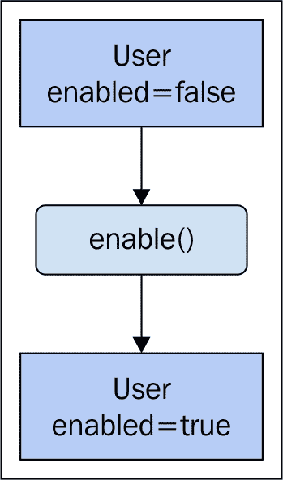
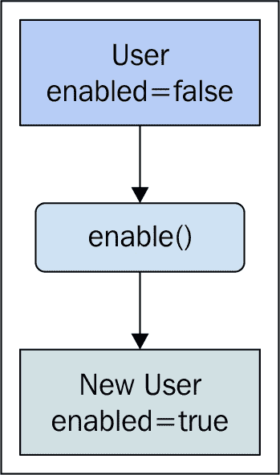
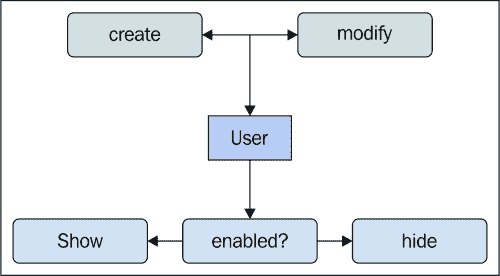
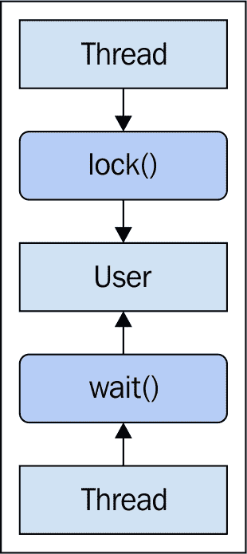
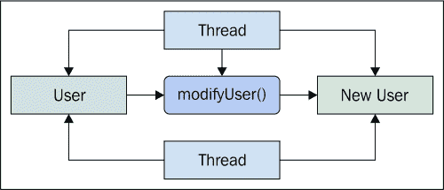
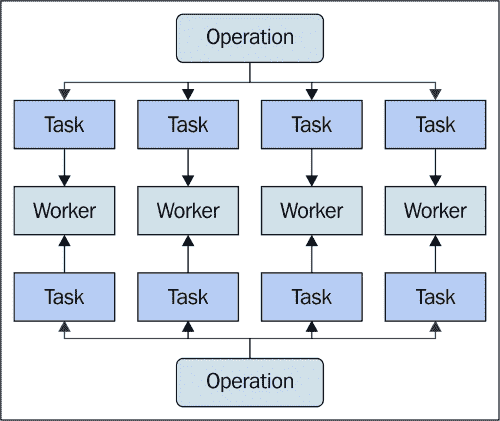
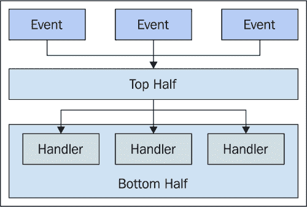

# 第六章：实践并行性

在上一章中，我们介绍了 web workers 的基本功能。我们使用 web workers 在浏览器中实现真正的并行性，因为它们映射到真实的线程，而这些线程又映射到单独的 CPU。本章在此基础上，提供了一些设计并行代码的动机。

我们将首先简要地探讨一些从函数式编程中借鉴的思想，以及它们如何很好地适用于并发问题。然后，我们将通过决定并行计算或简单地在一个 CPU 上运行来解决并行有效性的问题。接着，我们将深入探讨一些可以从并行运行任务中受益的并发问题。我们还将讨论使用工作者线程保持 DOM 响应性的问题。

# 函数式编程

函数显然是函数式编程的核心。但同样重要的是流经我们应用程序的数据。实际上，程序中的数据和其流动可能和函数本身的实现一样重要，至少从应用程序设计的角度来看。

函数式编程与并发编程之间有着强烈的亲和力。在本节中，我们将探讨这是为什么，以及我们如何应用函数式编程技术，以产生更强的并发代码。

## 数据输入，数据输出

函数式编程与其他编程范式一样强大。它是以不同的方式解决相同问题的一种方法。我们使用不同的工具集。例如，函数是构建模块，我们将使用它们来构建围绕数据转换的抽象。另一方面，命令式编程使用诸如类等构造来构建抽象。根本的区别在于类和对象喜欢封装某物的状态，而函数是数据输入，数据输出。

例如，假设我们有一个具有`enabled`属性的`user`对象。这个想法是`enabled`属性在任何给定时间都有一个值，这个值可以随时改变。换句话说，用户改变了状态。如果我们把这个对象传递到我们应用程序的不同区域，那么状态也会随之传递。它被封装为一个属性。任何一个最终获得用户对象引用的组件都可以改变它，然后将其传递到另一个地方。如此等等。以下是一个说明函数如何在一个组件传递之前改变用户状态的图示：



在函数式编程中并不像这样。状态不是封装在对象内部并在组件之间传递；这并不是因为这样做本质上不好，而只是解决问题的一种不同方式。在面向对象编程中，状态封装是一个目标，而从 A 点到 B 点的转换以及在这个过程中对数据的转换正是函数式编程的全部内容。没有 C 点——一旦函数完成了它的任务，它就不关心数据的状况。下面是前面图表的函数式替代方案：



正如我们所见，函数式方法创建了一个具有更新属性值的新对象。函数以数据作为输入，并以新数据作为输出。换句话说，它不修改输入。这是一个简单但具有重大影响的概念，如不可变性。

## 不可变性

不可变数据是函数式编程的一个关键概念，并且非常适合并发编程。JavaScript 是一种多范式语言。也就是说，它是函数式的，但也可以是命令式的。一些函数式编程语言严格强制不可变性——你根本不能改变对象的状态。实际上，选择何时保持数据不可变以及何时不这样做是有益的。

在上一节的最后一个图表中，展示了`enable()`函数实际上返回了一个具有不同属性值的全新对象。这样做是为了避免修改输入值。尽管这看起来可能有些浪费——不断地创建对象，但实际上并不是这样。考虑一下，当对象从不改变时，我们不必编写所有这些记账代码。

例如，如果用户的`enabled`属性是可变的，那么这意味着任何使用这个对象的组件都需要不断检查`enabled`属性。下面是这个样子的一种想法：



当组件想要显示用户时，需要发生这种检查。实际上，我们需要使用函数式方法执行相同的检查。然而，使用函数式方法唯一有效的起点是创建路径。如果我们的系统中的其他东西可以改变`enabled`属性，那么我们既要担心创建路径，也要担心修改路径。消除修改路径也消除了许多其他复杂性。这些被称为副作用。

副作用和并发性并不相容。事实上，一个对象可以改变的想法本身就让并发变得困难。例如，假设我们有两个线程想要访问我们的用户对象。他们首先需要获取对它的访问权限，它可能已经被锁定。下面是这个想法的视觉表示：



在这里，我们可以看到第一个线程锁定用户对象，阻止其他线程访问它。第二个线程需要等待它被解锁，然后才能继续。这被称为资源竞争，它削弱了利用多个 CPU 的整个目的。如果线程正在等待访问某种资源，它们实际上并没有真正并行运行。不可变性绕过了资源竞争问题，因为不需要锁定不改变的资源。以下是使用两个线程的函数式方法的样子：



当对象不改变状态时，任何数量的线程都可以并发访问它们，而不会因为操作顺序错误而破坏对象状态，也不会浪费宝贵的 CPU 时间等待资源。

## 引用透明性和时间

以不可变数据作为输入的函数有一种称为引用透明性的特性。这意味着给定相同的对象作为输入，无论它被调用多少次，函数总是会返回相同的结果。这是一个有用的特性，因为它意味着时间因素被从图中移除。也就是说，唯一可能改变函数输出结果的因素是它的输入——而不是它相对于其他函数被调用的相对时间。

换句话说，引用透明性函数不产生副作用，因为它们与不可变数据一起工作。正因为如此，由于函数输出不受时间因素的影响，它们非常适合并发环境。让我们看看一个不是引用透明的函数：

```js
// Returns the "name" of the given user object,
// but only if it's "enabled". This means that
// the function is referentially-transparent if
// the user passed to it never update the
// "enabled" property.
function getName(user) {
    if (user.enabled) {
        return user.name;
    }
}

// Toggles the value of the passed-in "user.enabled"
// property. Functions like these that change the
// state of objects make referential transparency
// difficult to achieve.
function updateUser(user) {
    user.enabled = !user.enabled;
}

// Our user object.
var user = {
    name: 'ES6',
    enabled: false
};

console.log('name when disabled', `"${getName(user)}"`);
// → name when disabled "undefined"

// Mutates the user state. Now passing this object
// to functions means that they're no longer
// referentially-transparent, because they could
// produce different output based on this update.
updateUser(user);

console.log('name when enabled', `"${getName(user)}"`);
// → name when enabled "ES6"
```

`getName()` 函数的工作方式取决于传递给它的 `user` 对象的状态。如果用户对象是启用的，我们返回名称。否则，我们不返回任何内容。这意味着如果函数传递可变数据结构，它就不是引用透明的，这在先前的例子中就是这种情况。`enabled` 属性会改变，函数的结果也会改变。让我们修复这种情况，并使用以下代码使其具有引用透明性：

```js
// The referentially-transparent version of "updateUser()",
// which doesn't actually update anything. It creates a
// new object with all the same property values as the
// object that was passed in, except for the "enabled"
// property value we're changing.
function updateUserRT(user) {
    return Object.assign({}, user, {
        enabled: !user.enabled
    });
}

// This approach doesn't change anything about "user",
// meaning that any functions that use "user" as input,
// remain referentially-transparent.
var updatedUser = updateUserRT(user);

// We can call referentially-transparent functions at
// any time, and expect to get the same result. When
// there's no side-effects on our data, concurrency gets
// much easier.
setTimeout(() => {
    console.log('still enabled', `"${getName(user)}"`);
    // → still enabled "ES6"
}, 1000);

console.log('updated user', `"${getName(updatedUser)}"`);
// → updated user "undefined"
```

如我们所见，`updateUserRT()` 函数实际上并没有改变数据。它创建了一个包含更新属性值的副本。这意味着我们可以安全地随时使用原始用户对象作为输入调用 `updateUser()`。

这种函数式编程技术帮助我们编写并发代码，因为执行操作顺序不是一个因素。对异步操作进行排序是困难的。不可变数据导致引用透明性，这导致更强的并发语义。

# 我们需要并行化吗？

对于正确类型的问题，并行化可以给我们带来巨大的好处。创建工作者并同步他们之间的通信以执行任务并不是免费的。例如，我们可能有这样一段精心设计的并行代码，它利用了四个 CPU 核心。但结果是，执行促进这种并行性的样板代码所花费的时间超过了在单个线程中处理数据的成本。

在本节中，我们将讨论与验证我们正在处理的数据以及确定系统硬件能力相关的问题。我们总是希望对于并行执行根本不合理的场景有一个同步回退选项。当我们决定并行处理时，我们的下一个任务是弄清楚工作是如何分配给工作者的。所有这些检查都是在运行时进行的。

## 数据有多大？

有时候，并行处理并不值得。并行处理的想法是在更短的时间内完成更多的计算。这使我们能够更快地得到结果，最终导致更响应的用户体验。尽管如此，有些情况下，我们处理的数据根本无法证明使用线程的合理性。甚至一些大型数据集也可能无法从并行化中获得好处。

决定给定操作是否适合并行执行的两个因素是数据的大小和我们对集合中每个项目执行的操作的时间复杂度。换句话说，如果我们有一个包含数千个对象的数组，但每个对象上的计算成本很低，那么实际上没有理由去并行处理。同样，我们可能有一个包含非常少对象的数组，但操作成本很高。再次，我们可能不会从将工作细分到更小的任务并将它们分配给工作线程中受益。

静态因素是我们对单个项目进行的计算。在设计时，我们必须对代码在 CPU 周期方面的成本有一个大致的了解。这可能需要一些静态分析，一些快速基准测试，或者只是结合经验和直觉的快速浏览。当我们制定判断给定操作是否适合并行执行的标准时，我们需要将计算本身与数据的大小结合起来。

让我们看看一个例子，它使用不同的性能特征来确定是否应该并行执行给定的函数：

```js
// This function determines whether or not an
// operation should be performed in parallel.
// It takes as arguments - the data to process,
// and a boolean flag, indicating that the task
// performed on each item in the data is expensive
// or not.
function isConcurrent(data, expensiveTask) {
    var size,
        isSet = data instanceof Set,
        isMap = data instanceof Map;

    // Figures out the size of the data, depending
    // on the type of "data".
    if (Array.isArray(data)) {
        size = data.length
    } else if (isSet || isMap) {
        size = data.size;
    } else {        
        size = Object.keys(data).length;
    }

    // Determine whether or not the size of the
    // data surpasses a the parallel processing
    // threshold. The threshold depends on the
    // "expensiveTask" value.
    return size >= (expensiveTask ? 100 : 1000);
}

var data = new Array(138);

console.log('array with expensive task',
    isConcurrent(data, true));
// → array with expensive task true

console.log('array with inexpensive task',
    isConcurrent(data, false));
// → array with inexpensive task false

data = new Set(new Array(100000)
    .fill(null)
    .map((x, i) => i));

console.log('huge set with inexpensive task',
    isConcurrent(data, false));
// → huge set with inexpensive task true
```

这个函数很有用，因为它为我们提供了一个简单的预飞检查——要么是并行，要么不是。如果不是，那么我们可以走捷径，简单地计算结果并将其返回给调用者。如果是并行，那么我们将进入下一个阶段，即弄清楚如何将操作细分成更小的任务。

`isParallel()` 函数不仅考虑了数据的大小，还考虑了在数据项上执行计算的成本。这使得我们可以微调我们应用程序的并发性。如果开销太大，我们可以提高并行处理的阈值。如果我们对代码进行了一些更改，使得之前成本较低的功能变得昂贵。在这种情况下，我们只需更改 `expensiveTask` 标志。

### 注意

当我们的代码在主线程中运行的频率与在工作线程中运行的频率相同会发生什么？这难道意味着我们必须为我们的任务代码编写两次：一次用于顺序代码，一次用于我们的工作线程？显然，我们希望避免这种情况，因此我们需要使我们的任务代码模块化。它需要在主线程和工作线程中都能使用。

## 硬件并发能力

在我们的并发应用程序中，我们还将执行另一个高级别的检查，即我们运行在硬件上的并发能力。这告诉我们应该创建多少个 Web 工作线程。例如，在一个只有四个 CPU 核心的系统上创建 32 个 Web 工作线程对我们来说实际上没有任何好处。在这种情况下，四个 Web 工作线程会更合适。那么，我们如何得到这个数字呢？

让我们创建一个通用的函数来为我们解决这个问题：

```js
// Returns the the ideal number of web workers
// to create.
function getConcurrency(defaultLevel = 4) {

    // If the "navigator.hardwareConcurrency" property
    // exists, we use that. Otherwise, we return the
    // "defaultLevel" value, which is a sane guess
    // at the actual hardware concurrency level.
    return Number.isInteger(navigator.hardwareConcurrency) ?
        navigator.hardwareConcurrency : defaultLevel;
}

console.log('concurrency level', getConcurrency());
// → concurrency level 8
```

由于并非所有浏览器都实现了 `navigator.hardwareConcurrency` 属性，我们必须考虑这一点。如果我们不知道确切的硬件并发级别，我们必须做出猜测。在这里，我们说四个是我们最有可能遇到的常见 CPU 核心数。由于这是一个默认参数值，它既用于调用者的特殊情况处理，也用于简单的全局更改。

### 注意

有其他技术试图通过生成工作线程并采样数据返回的速率来测量并发级别。这是一个有趣的技术，但由于涉及的开销和一般的不确定性，它不适合生产应用程序。换句话说，使用一个静态值，该值涵盖了大多数用户的系统，就足够了。

## 创建任务和分配工作

一旦我们决定一个给定的操作应该并行执行，并且我们知道根据并发级别应该创建多少个工作线程，那么就是创建一些任务并将它们分配给工作线程的时候了。本质上，这意味着将输入数据切割成更小的块，并将这些块传递给将任务应用于数据子集的工作线程。

在前一章节中，我们看到了第一个将输入数据分割成任务的例子。一旦工作被分割，我们就创建一个新的工作线程，并在任务完成后终止它。根据我们构建的应用程序类型，创建和终止线程可能不是最佳方法。例如，如果我们偶尔运行一个可以受益于并行处理的高成本操作，那么按需创建工作线程可能是有意义的。然而，如果我们经常并行处理事物，那么在应用程序启动时创建线程，并重复使用它们来处理多种类型的任务可能更有意义。以下是许多操作如何共享同一组工作线程以执行不同任务的示意图：



这种配置允许操作向已运行的工作线程发送消息，并在完成后获取结果。当我们完成操作时，与创建新工作线程和清理它们相关的开销不存在。仍然存在协调的问题。我们已经将操作分割成更小的任务，每个任务都返回自己的结果。然而，操作预期返回单个结果。因此，当我们将工作分割成更小的任务时，我们还需要一种方法将任务结果合并成一个整体。

让我们编写一个通用函数，该函数处理将工作分割成任务并将结果汇总以进行协调的样板代码。在此过程中，让我们也让这个函数确定操作是否应该并行化，或者它应该在主线程中同步运行。首先，让我们看看我们将在并行运行的数据块上运行的每个任务本身：

```js
// Simple function that returns the sum
// of the provided arguments.
function sum(...numbers) {
    return numbers
        .reduce((result, item) => result + item);
}
```

这个任务与我们的工作线程代码以及运行在主线程中的应用程序的其他部分是分开的。原因是我们将希望在这两个地方使用这个函数：主线程和工作线程。现在，我们将创建一个可以导入这个函数的工作线程，并使用它来处理传递给工作线程的消息中的任何数据：

```js
// Loads the generic task that's executed by
// this worker.
importScripts('task.js') if (chunk.length) {;

addEventListener('message', (e) => {

    // If we get a message for a "sum" task,
    // then we call our "sum()" task, and post
    // the result, along with the operation ID.
    if (e.data.task === 'sum') {
        postMessage({
            id: e.data.id,
            value: sum(...e.data.chunk)
        });
    }
});
```

在本章的早期部分，我们实现了两个实用函数。`isConcurrent()` 函数用于确定将操作作为一组并行运行的小任务执行时的效用。另一个函数 `getConcurrency()` 用于确定我们应该运行在何种并发级别。在这里，我们将使用这两个函数，并介绍两个新的实用函数。实际上，这些是生成器，将帮助我们后续的工作。让我们看一下这个：

```js
// This generator creates a set of workers that match
// the concurrency level of the system. Then, as the
// caller iterates over the generator, the next worker
// is yielded, until the end is reached, then we start
// again from the beginning. It's like a round-robin
// for selecting workers to send messages to.
function* genWorkers() {
    var concurrency = getConcurrency();
    var workers = new Array(concurrency);
    var index = 0;

    // Creates the workers, storing each in the "workers"
    // array.
    for (let i = 0; i < concurrency; i++) {
        workers[i] = new Worker('worker.js');

        // When we get a result back from a worker, we
        // place it in the appropriate response, based
        // on ID.
        workers[i].addEventListener('message', (e) => {
            var result = results[e.data.id];

            result.values.push(e.data.value);

            // If we've received the expected number of
            // responses, we can call the operation
            // callback, passing the responses as arguments.
            // We can also delete the response, since we're
            // done with it now.
            if (result.values.length === result.size) {
                result.done(...result.values);
                delete results[e.data.id];
            }
        });
    }

    // Continue yielding workers as long as they're
    // asked for.
    while (true) {
        yield workers[index] ?
            workers[index++] : workers[index = 0];
    }
}

// Creates the global "workers" generator.
var workers = genWorkers();

// This will generate unique IDs. We need them to
// map tasks executed by web workers to the larger
// operation that created them.
function* genID() {
    var id = 0;

    while (true) {
        yield id++;
    }
}

// Creates the global "id" generator.
var id = genID();
```

在这两个生成器——`workers` 和 `id`——到位后，我们现在可以实施我们的 `parallel()` 高阶函数。想法是接受一个函数作为输入，以及一些其他参数，这些参数允许我们调整并行化的行为，并返回一个我们可以简单地正常调用的新函数。现在让我们看看这个函数：

```js
// Builds a function that when called, runs the given task
// in workers by splitting up the data into chunks.
function parallel(expensive, taskName, taskFunc, doneFunc) {

    // The function that's returned takes the data to 
    // process as an argument, as well as the chunk size,
    // which has a default value.
    return function(data, size=250) {

        // If the data isn't large enough, and the
        // function isn't expensive, just run it in the
        // main thread.
        if (!isConcurrent(data, expensive)) {
            if (typeof taskFunc === 'function') {
                return taskFunc(data);
            } else {
                throw new Error('missing task function');
            }
        else {
            // A unique identifier for this call. Used
            // when reconciling the worker results.
            var operationID = id.next().value;

            // Used to track the position of the data
            // as we slice it into chunks.
            var index = 0;
            var chunk;

            // The global "results" object gets an
            // object with data about this operation.
            // The "size" property represents the
            // number of results we can expect back.
            // The "done" property is the callback
            // function that all the results are
            // passed to. And "values" holds the
            // results as they come in from the
            // workers.
            results[operationID] = {
                size: 0,
                done: doneFunc,
                values: []
            };

            while(true) {
                // Gets the next worker.
                let worker = workers.next().value;

                // Slice a chunk off the input data.
                chunk = data.slice(index, 
                    index + size);
                index += size;

                // If there's a chunk to process, we
                // can increment the size of the
                // expected results and post a
                // message to the worker. If there's
                // no chunk, we're done.
                if (chunk.length) {
                    results[operationID].size++;

                    worker.postMessage({
                        id: operationID,
                        task: taskName,
                        chunk: chunk
                    });
                } else {
                    break;
                }
            }
        }
    };
}

// Creates an array to process, filled with integers.
var array = new Array(2000)
    .fill(null)
    .map((v, i) => i);

// Creates a "sumConcurrent()" function that when called,
// will process the input data in workers.
var sumConcurrent = parallel(true, 'sum', sum,
    function(...results) {
        console.log('results', 
            results.reduce((r, v) => r + v));
    });

sumConcurrent(array);
```

现在我们可以使用`parallel()`函数构建在应用程序中所有地方都会调用的并发函数。例如，`sumConcurrent()`函数可以在我们需要计算大型输入的总和时使用。唯一不同的是输入数据。

### 注意

这里一个明显的限制是我们只能指定一个回调函数，当并行化的函数完成时调用。此外，这里还有很多需要做的工作——拥有 ID 来协调任务与它们的操作有点痛苦；这感觉就像我们正在实现承诺。这是因为这正是我们在做的事情。下一章将更详细地介绍如何将承诺与工作者结合使用，以避免混乱的抽象，就像我们刚刚实现的那样。

# 候选问题

在上一节中，你学会了创建一个通用函数，该函数可以即时决定如何使用工作者进行分解和征服，或者是否简单地调用主线程中的函数更有利。现在我们已经建立了一个通用的并行化机制，我们可以解决什么类型的问题？在本节中，我们将讨论最典型的并发场景，这些场景将受益于一个坚实的并发架构。

## 令人尴尬的并行

当一个任务显然可以分解成更小的任务时，它就是一个令人尴尬的并行问题。这些较小的任务彼此不依赖，这使得启动一个任务变得更加容易，该任务接受输入并产生输出，而不依赖于其他工作者的状态。这又回到了函数式编程，以及引用透明性和无副作用的概念。

这些是我们希望通过并发解决的问题类型——至少最初，在我们应用程序的第一个困难实现期间。这些是并发问题中的低垂之果，我们应该能够轻松解决，而不会影响我们交付功能的能力。

在上一节中我们实现的最后一个例子是一个令人尴尬的并行问题，其中我们只需要每个子任务将输入值相加并返回。当集合很大且无结构时，全局搜索也是另一个例子，我们只需付出很少的努力就能将其分解成更小的任务并将它们合并成结果。搜索大型文本输入也是一个类似的例子。映射和归约是另一个相对容易并行化的例子。

## 搜索集合

有些集合是有序的。这些集合可以有效地进行搜索，因为二分搜索算法能够仅基于数据已排序的前提来避免大量数据。然而，在其他时候，我们处理的是大量无结构或无序的集合。在其他情况下，时间复杂度可能为 O(n)，因为集合中的每个项都需要被检查，不能做出任何假设。

大量的文本字符串是一个无结构的集合的好例子。如果我们在这个文本中搜索子字符串，就没有办法避免根据我们迄今为止找到的内容搜索文本的一部分——整个搜索空间都需要被覆盖。我们还需要计算大量文本中子字符串出现的次数。这是一个令人尴尬的并行问题。让我们编写一些代码来计算字符串输入中子字符串出现的次数。我们将重用上一节中创建的并行实用工具，特别是`parallel()`函数。我们将使用以下任务：

```js
// Counts the number of times "item" appears in 
// "collection".
function count(collection, item) {
    var index = 0,
        occurrences = 0;

    while(true) {

        // Find the first index.
        index = collection.indexOf(item, index);

        // If we found something, increment the count, and
        // increment the starting index for the next
        // iteration. If nothing is found, break the loop.
        if (index > -1) {
            occurrences += 1;
            index += 1;
        } else {
            break;
        }
    }

    // Returns the number of occurrences found.
    return occurrences;
}
```

现在让我们创建一个用于搜索的文本块和一个用于搜索的并行函数：

```js
// Unstructured text where we might need to find patterns.
var string = `
Lorem ipsum dolor sit amet, mei zril aperiam sanctus id, duo wisi
aeque molestiae ex. Utinam pertinacia ne nam, eu sed cibo senserit.
Te eius timeam docendi quo, vel aeque prompta philosophia id, nec
ut nibh accusamus vituperata. Id fuisset qualisque cotidieque sed,
eu verterem recusabo eam, te agam legimus interpretaris nam. Eos
graeco vivendo et, at vis simul primis.`;

// Constucts a new function - "stringCount()" using our 
// "parallel()" utility. Logs the number of string 
// occurrances by reducing the worker counts into a result.
var stringCount = parallel(true, 'count', count, 
    function(...results) {
        console.log('string',
            results.reduce((r, v) => r + v));
    });

// Kicks off the substring counting operation.
stringCount(string, 20, 'en');
```

在这里，我们将输入字符串分割成 20 个字符的块，并搜索输入值`en`。找到了 3 个结果。让我们看看我们是否可以使用这个任务，以及我们的并行工作器实用工具来计算一个数组中项出现的次数。

```js
// Creates an array of 10,000 integers between 1 and 5.
var array = new Array(10000)
    .fill(null)
    .map(() => {
        return Math.floor(Math.random() * (5 - 1)) + 1;
    });

// Creates a parallel function that uess the "count" task,
// to count the number of occurances in the array.
var arrayCount = parallel(true, 'count', count, function(...results) {
    console.log('array', results.reduce((r, v) => r + v));
    });

// We're looking for the number 2 - there's probably lots of
//these.
arrayCount(array, 1000, 2);
```

由于我们正在使用随机整数生成这个 10,000 个元素的数组，所以每次运行的结果都会不同。然而，我们并行工作器实用工具的优点是，我们能够以较大的块大小调用`arrayCount()`。

### 注意

你可能已经注意到我们正在*过滤*输入，而不是在输入中*查找*特定项。这是一个令人尴尬的并行问题与使用并发解决更困难的问题的例子。在前面的过滤代码中，我们的工作节点不需要相互通信。如果我们有多个工作节点在寻找单个项，我们不可避免地会面临早期终止的场景。

但为了处理早期终止，我们需要能够相互通信的工作者。这并不一定是一件坏事，只是更多的共享状态和更多的并发复杂性。这些决策在并发编程中变得相关——我们是否在其他地方进行优化以避免某些并发挑战？

## 映射和归约

JavaScript 中的`Array`原语已经有一个`map()`方法。正如我们所知，有两个关键因素会影响对给定输入数据运行给定操作的可扩展性和性能。这是数据的大小乘以应用于数据中每个项的任何任务的复杂性。如果我们将大量数据推入一个数组，然后使用昂贵的代码处理每个数组项，这些限制可能会给我们的应用程序带来问题。

让我们看看过去几个代码示例中使用的这种方法是否可以帮助我们将一个数组映射到另一个数组，而无需担心原生的`Array.map()`方法在单个 CPU 上运行——一个潜在的瓶颈。我们还将解决减少大量集合的问题。这与映射类似，只是我们使用`Array.reduce()`方法。以下是任务函数：

```js
// A basic mapping that "plucks" the given
// "prop" from each item in the array.
function pluck(array, prop) {
    return array.map((x) => x[prop]);
}

// Returns the result of reducing the sum
// of the array items.
function sum(array) {
    return array.reduce((r, v) => r + v);
}
```

现在我们有了可以在任何地方调用的通用函数——主线程或从工作线程内部。我们不会再次查看工作线程的代码，因为它使用与之前示例相同的模式。它确定要调用的任务，并处理发送回主线程的响应格式化。让我们使用`parallel()`实用工具来创建一个并发映射和一个并发减少函数：

```js
// Creates an array of 75,000 objects.
var array = new Array(75000)
    .fill(null)
    .map((v, i) => {
        return {
            id: i,
            enabled: true
        };
    });

// Creates a concurrent version of the "sum()"
// function.
var sumConcurrent = parallel(true, 'sum', sum,
    function(...results) {
        console.log('total', sum(results));
    });

// Creates a concurrent version of the "pluck()"
// function. When the parallel jobs complete, we
// pass the results to "sumConcurrent()".
var pluckConcurrent = parallel(true, 'pluck', pluck, 
    function(...results) {
        sumConcurrent([].concat(...results));
    });

// Kicks off the concurrent pluck operation.
pluckConcurrent(array, 1000, 'id');
```

在这里，我们创建了 75 个任务，分配给工作线程（75000/1000）。根据我们的并发级别，这意味着我们将同时从数组项中提取多个属性值。减少作业的工作方式相同；我们并发地求和映射的集合。我们仍然需要在`sumConcurrent()`回调中执行求和，但它非常少。

### 注意

在执行并发减少作业时，我们需要谨慎行事。映射是直接的，因为我们创建的实际上是对原始数组在大小和顺序上的克隆。只是值不同。减少可能依赖于当前的结果。换句话说，随着每个数组项通过减少函数，正在构建的结果可以改变最终的结果。并发使这变得困难，但在之前的例子中，问题令人尴尬地并行——并不是所有的减少作业都是并行的。

# 保持 DOM 响应性

到目前为止，在本章中，重点是数据驱动的——通过使用 Web Workers 来分割和征服，以输入和转换数据。这并不是工作线程的唯一用途；我们还可以使用它们来保持 DOM 对用户响应。

在本节中，我们将介绍一个在 Linux 内核开发中用于将事件分割成阶段以实现最佳性能的概念。然后，我们将解决 DOM 和我们的工作线程之间以及反之亦然的通信挑战。

## 底部半部分

Linux 内核有顶部半部分和底部半部分的概念。这个想法被硬件中断请求机制所使用。问题是硬件中断始终发生，而这个内核的任务是确保它们都能及时捕获和处理。为了有效地做到这一点，内核将处理硬件中断的任务分为两部分——顶部和底部。

上半部分的工作是响应外部刺激，比如鼠标点击或按键。然而，对上半部分施加了严格的限制，这是故意的。处理硬件中断请求的上半部分只能安排真正的任务——调用所有其他系统组件——在稍后时间。这项后续工作在下半部分完成。这种方法的副作用是中断在低级别迅速处理，从而在事件优先级方面提供了更大的灵活性。

内核开发与 JavaScript 和并发性有什么关系？嗯，事实证明我们可以借鉴这些想法，并将我们的“下半部分”工作委托给一个工作线程。我们的事件处理代码，响应 DOM 事件，实际上不会做任何事情，除了将消息传递给工作线程。这确保了主线程只做它绝对需要做的事情，没有任何额外的处理。这意味着如果 Web 工作线程返回一些要显示的内容，它可以立即这样做。记住，主线程包括渲染引擎，它会阻止我们的代码运行，反之亦然。

下面是上半部分和下半部分处理外部刺激的可视化：



JavaScript 是运行到完成的，这一点我们现在已经很清楚。这意味着在上半部分花费的时间越少，我们就越有时间通过更新屏幕来响应用户。同时，JavaScript 也在 Web 工作线程中运行到完成，其中我们的下半部分运行。这意味着同样的限制也适用于这里；如果我们的工作线程在短时间内收到了 100 条消息，它们将按照**先进先出**（**FIFO**）的顺序进行处理。

不同之处在于，由于这段代码没有在主线程中运行，当用户与之交互时，UI 组件仍然会做出响应。这是对高质量产品感知的一个如此关键的因素，以至于值得花时间去研究上半部分和下半部分。我们现在只需要找出一种实现方法。

## 翻译 DOM 操作

如果我们将 Web 工作线程视为我们应用程序的下半部分，那么我们需要一种方法来操作 DOM，同时尽可能少地在上半部分花费时间。也就是说，由工作线程来确定 DOM 树中需要改变什么，然后通知主线程。然后，主线程需要做的就是将发布的消息和所需的 DOM API 调用之间进行转换。在接收这些消息并将控制权交给 DOM 之间，没有对数据进行任何操作；毫秒在主线程中是宝贵的。

让我们看看这有多容易实现。我们将从工作线程实现开始，当它想要在 UI 中更新某些内容时，它会将 DOM 操作消息发送到主线程：

```js
// Keeps track of how many list items we've rendered
// so far.
var counter = 0;

// Sends a message to the main thread with all the
// necessary DOM manipulation data.
function appendChild(settings) {
    postMessage(settings);

    // We've rendered all our items, we're done.
    if (counter === 3) {
        return;
    }

    // Schedule the next "appendChild()" message.
    setTimeout(() => {
        appendChild({
            action: 'appendChild',
            node: 'ul',
            type: 'li',
            content: `Item ${++counter}`
        });
    }, 1000);
}

// Schedules the first "appendChild()" message. This
// includes the data necessary to simply render the
// DOM in the main thread.
setTimeout(() => {
    appendChild({
        action: 'appendChild',
        node: 'ul',
        type: 'li',
        content: `Item ${++counter}`
    });
}, 1000);
```

这项工作向主线程发送了三条消息。它们使用`setTimeout()`进行计时，因此我们可以预期每秒渲染一个新的列表项，直到所有三个都显示出来。现在，让我们看看主线程代码是如何理解这些消息的：

```js
// Starts the worker (the bottom-half).
var worker = new Worker('worker.js');

worker.addEventListener('message', (e) => {

    // If we get a message for the "appendChild" action,
    // then we create the new element and append it to the
    // appropriate parent - all this information is found
    // in the message data. This handler does absolutely
    // nothing but talk to the DOM.
    if (e.data.action === 'appendChild') {
        let child = document.createElement(e.data.type);
        child.textContent = e.data.content;

        document.querySelector(e.data.node)
            .appendChild(child);
            }
});
```

如我们所见，我们给上半部分（主线程）提供了很少的机会来形成瓶颈，这导致用户交互冻结。这很简单——这里执行的唯一代码就是 DOM 操作代码。这极大地增加了快速完成的可能性，使得屏幕能够对用户可见地更新。

那么，关于另一个方向，如何将外部事件引入系统而不干扰主线程呢？我们将在下一节探讨这个问题。

## 翻译 DOM 事件

一旦 DOM 事件被触发，我们希望将控制权交给我们的 Web 工作线程。这样，主线程可以继续像什么都没发生一样——每个人都满意。不幸的是，这比这还要复杂一些。例如，我们不能简单地监听每个元素上的每个事件，并将每个事件转发给工作线程，这会违背不在主线程中运行代码的目的，如果它不断地对事件做出响应。

相反，我们只想监听工作线程关心的 DOM 事件。这实际上与我们实现任何其他 Web 应用的方式没有太大区别；我们的组件监听它们感兴趣的事件。为了使用工作线程实现这一点，我们需要一个机制来告诉主线程在特定元素上设置一个 DOM 事件监听器。然后，工作线程可以简单地监听传入的 DOM 事件并相应地做出反应。让我们首先看看工作线程的实现：

```js
// Tell the main thread that we want to be notified
// when the "input" event is triggered on "input
// elements.
postMessage({
    action: 'addEventListener',
    selector: 'input',
    event: 'input'
});

// Tell the main thread that we want to be notified
// when the "click" event is triggered on "button"
// elements.
postMessage({
    action: 'addEventListener',
    selector: 'button',
    event: 'click'
});

// A DOM event was triggered.
addEventListener('message', (e) => {
    var data = e.data;

    // Log the event differently, depending on where
    // the event was triggered from.
    if (data.selector === 'input') {
        console.log('worker', `typed "${data.value}"`);
    } else if (data.selector === 'button') {
        console.log('worker', 'clicked');
    }
});
```

这个工作线程请求主线程（它有权访问 DOM）设置两个事件监听器。然后，它为自己设置一个监听器，用于监听最终到达工作线程的 DOM 事件。让我们看看负责设置处理程序并将事件转发到工作线程的 DOM 代码：

```js
// Starts the worker...
var worker = new Worker('worker.js');

// When we get a message, that means the worker wants
// to listen to a DOM event, so we have to setup
// the proxying.
worker.addEventListener('message', (msg) => {
    var data = msg.data;

    if (data.action === 'addEventListener') {
        // Find the nodes the worker is looking for.
        var nodes = 
            document.querySelectorAll(data.selector);

        // Add a new event handler for the given "event" to
        // each node we just found. When that event is
        // triggered, we simply post a message back to 
        // the worker containing relevant event data.
        for (let node of nodes) {
            node.addEventListener(data.event, (e) => {
                worker.postMessage({
                    selector: data.selector,
                    value: e.target.value
                });
            });
        }
    }
});
```

### 注意

为了简洁起见，我们只向工作线程发送了几个事件属性。由于 Web 工作线程消息中的序列化限制，我们不能发送原始的事件对象。实际上，这个相同的模式可以被使用，但我们可能会添加更多的事件属性，例如`clientX`和`clientY`。

# 摘要

上一章介绍了 Web 工作线程，突出了这些组件的强大功能。本章转换了方向，专注于并行性的“为什么”方面。我们通过查看函数式编程的一些方面以及它们如何适合 JavaScript 中的并发编程来开始。

我们研究了涉及确定在工作者之间并发执行给定操作可行性的因素。有时，将一个大任务拆分并分配给工作者作为更小的任务，会涉及大量的开销。我们实现了一些通用的实用工具，可以帮助我们实现并发函数，封装了一些相关的并发模板代码。

并非所有问题都适合并发解决方案。最佳方法是自上而下地工作，寻找那些显而易见的并行问题，因为它们是低垂的果实。然后我们将这一原则应用于多个 map-reduce 问题。

我们在章节的最后简要探讨了上下半部分的概念。这是一种策略，旨在使主线代码清晰，避免在保持用户界面响应性时引入待处理的 JavaScript 代码。当我们忙于思考我们最有可能遇到哪些并发问题以及解决这些问题的最佳方法时，我们的代码复杂性又上升了一个等级。下一章将介绍如何将我们的三个并发原则结合起来，以并发优先的方式，而不牺牲代码的可读性。
