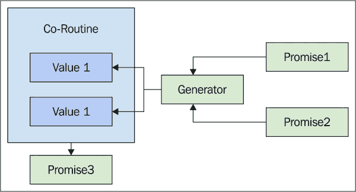
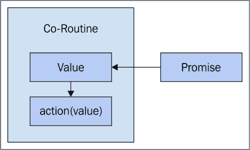
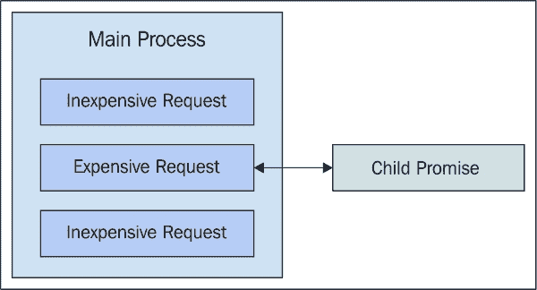
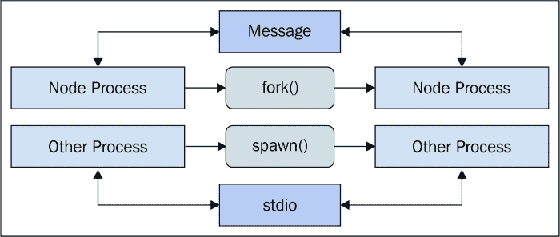
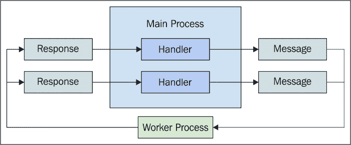
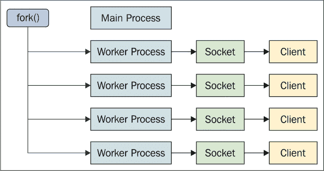
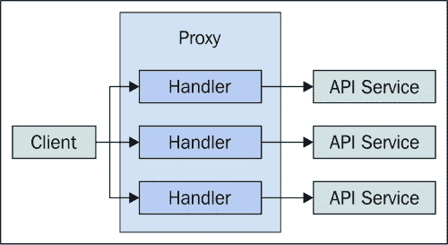

# 第九章。高级 NodeJS 并发

在 第八章 中，*使用 NodeJS 的事件驱动 IO*，你学习了 NodeJS 应用程序中核心的并发机制——IO 事件循环。在本章中，我们将深入研究一些既补充事件循环又与事件循环相反的更高级的主题。

我们将从讨论在 Node 中使用 `Co` 库实现协程开始。接下来，我们将探讨创建子进程以及与这些进程通信。之后，我们将深入研究 Node 内置的创建进程集群的能力，每个集群都有自己的事件循环。我们将以查看创建大规模 Node 服务器集群的集群结束本章。

# 使用 Co 的协程

我们已经在 第四章 中看到了一种在前端使用生成器实现协程的方法，*使用生成器的懒加载评估*。在本节中，我们将使用 `Co` 库 ([`github.com/tj/co`](https://github.com/tj/co)) 来实现协程。这个库也依赖于生成器和承诺。

我们将首先概述 `Co` 的一般原理，然后编写一些使用承诺等待异步值的代码。接下来，我们将探讨如何将已解析的值从承诺传递到我们的协程函数中，异步依赖关系，以及创建协程实用函数。

## 生成承诺

在其核心，`Co` 库使用一个 `co()` 函数来创建协程。实际上，其基本用法与我们在本书早期创建的协程函数看起来很相似。下面是它的样子：

```js
co(function* () {
    // TODO: co-routine amazeballs.
});
```

`Co` 库和我们的早期协程实现之间的另一个相似之处是，值通过 `yield` 语句传递。然而，与调用返回的函数来传递值不同，这个协程使用承诺来传递值。效果是相同的——异步值被传递到同步代码中，如图所示：


实际上，异步值来自承诺。已解析的值进入协程。我们将在稍后深入了解其工作原理的机制。即使我们没有产生承诺，比如说我们产生了一个字符串，`Co` 库也会为我们将其包装成一个承诺。但是，这样做就违背了在同步代码中使用异步值的目的。

### 注意

当我们发现像 `Co` 这样的工具，它封装了混乱的同步语义时，这对我们程序员来说是多么有价值。我们在协程内部的代码是同步的且可维护的。

## 等待值

由 `co()` 函数创建的协程工作方式与 ES7 异步函数非常相似。`async` 关键字将一个函数标记为异步——意味着它在其内部使用异步值。`await` 关键字与承诺一起使用，暂停函数的执行，直到值解析。如果这感觉与生成器所做的工作非常相似，那是因为它确实就是生成器所做的工作。以下是 ES7 语法的样子：

```js
// This is the ES7 syntax, where the function is
// marked as "async". Then, the "await" calls
// pause execution till their operands resolve.
(async function() {
    var result;
    result = await Promise.resolve('hello');
    console.log('async result', `"${result}"`);
    // → async result "hello"

    result = await Promise.resolve('world');
    console.log('async result', `"${result}"`);
    // → async result "world"
}());
```

在这个例子中，承诺立即解析，所以实际上没有必要暂停执行。然而，即使承诺解析一个需要几秒钟的网络请求，它也会等待。我们将在下一节更深入地探讨解析承诺。鉴于这是 ES7 语法，如果我们可以今天使用相同的方法那就太好了。以下是使用 `Co` 实现相同方法的示例：

```js
// We need the "co()" function.
var co = require('co');

// The differences between the ES7 and "co()" are
// subtle, the overall structure is the same. The
// function is a generator, and we pause execution
// by yielding generators.
co(function*() {
    var result;
    result = yield Promise.resolve('hello');
    console.log('co result', `"${result}"`);
    // → co result "hello"

    result = yield Promise.resolve('world');
    console.log('co result', `"${result}"`);
    // → co result "world"
});
```

毫不奇怪，`Co` 库正朝着 ES7 的方向发展；`Co` 的作者们做得很好。

## 解析值

在给定的 `Co` 协程中至少有两个地方会解析承诺。首先，有一个或多个从生成器函数中产生的承诺，我们将将其传递给 `co()`。如果没有在这个函数中产生任何承诺，使用 `Co` 就没有太多意义。调用 `co()` 时的返回值是另一个承诺，这相当酷，因为它意味着协程可以作为其他协程的依赖项。我们稍后将更深入地探讨这个想法。现在，让我们看看如何解析承诺以及如何实现。以下是协程承诺解析顺序的说明：



承诺的解析顺序与它们命名的顺序相同。例如，第一个承诺会导致协程中的代码暂停执行，直到其值解析。然后，在等待第二个承诺时再次暂停执行。从 `co()` 返回的最后一个承诺使用生成器函数的返回值解析。现在让我们看看一些代码：

```js
var co = require('co');

co(function* () {

    // The promise that's yielded here isn't resolved
    // till 1 second later. That's when the yield statement
    // returns the resolved value.
    var first = yield new Promise((resolve, reject) => {
        setTimeout(() => {
            resolve([ 'First1', 'First2', 'First3' ]);
        }, 1000);
    });

    // Same idea here, except we're waiting 2 seconds
    // before the "second" variable gets it's value.
    var second = yield new Promise((resolve, reject) => {
        setTimeout(() => {
            resolve([ 'Second1', 'Second2', 'Second3' ]);
        }, 2000);
    });

    // Both "first" and "second" are resolved at this
    // point, so we can use both to map a new array.
    return first.map((v, i) => [ v, second[i] ]);

}).then((value) => {
    console.log('zipped', value);
    // → 
    // [ 
    //   [ 'First1', 'Second1' ],
    //   [ 'First2', 'Second2' ],
    //   [ 'First3', 'Second3' ] 
    // ]
});
```

如我们所见，生成器的返回值最终成为解析的承诺值。回想一下，从生成器返回将返回与使用 `value` 和 `done` 属性产生相同的对象。`Co` 知道使用 `value` 属性解析承诺。

## 异步依赖

当协程中的某个操作依赖于稍后异步值时，使用 `Co` 创建的协程表现得非常好。否则，原本会是回调和状态混乱的一团糟，而现在只需将赋值放置在正确的顺序即可。依赖的操作只有在值解析后才会被调用。以下是这个想法的说明：



现在让我们编写一些代码，其中包含两个异步操作，第二个操作依赖于第一个操作的结果。即使使用承诺，这也可能很棘手：

```js
var co = require('co');

// A simple user collection.
var users = [
    { name: 'User1' },
    { name: 'User2' },
    { name: 'User3' },
    { name: 'User4' }
];

co(function* () {

    // The "userID" value is asynchronous, and execution
    // pause at this yield statement till the promise
    // resolves.
    var userID = yield new Promise((resolve, reject) => {
        setTimeout(() => {
            resolve(1);
        }, 1000);
    });

    // At this point, we have a "userID" value. This
    // nested co-routine will look up the user based
    // on this ID. We nest coroutines like this because
    // "co()" returns a promise.
    var user = yield co(function* (id) {
        let user = yield new Promise((resolve, reject) => {
            setTimeout(() => {
                resolve(users[id]);
            }, 1000);
        });

        // The "co()" promise is resolved with the
        // "user" value.
        return user;
    }, userID);

    console.log(user);
    // → { name: 'User2' }
});
```

在这个例子中，我们使用了嵌套协程，但它可以是任何需要参数并返回 Promise 的函数类型。这个例子如果不是其他的话，至少可以突出 Promise 在并发环境中的多功能性。

## 包装协程

我们将要查看的最后一个`Co`示例使用`wrap()`实用工具将一个普通的协程函数包装成一个可重复调用的函数。正如其名所示，协程只是被包装在一个函数中。当我们向协程传递参数时，这特别有用。让我们看看我们构建的代码示例的修改版：

```js
var co = require('co');

// A simple user collection.
var users = [
    { name: 'User1' },
    { name: 'User2' },
    { name: 'User3' },
    { name: 'User4' }
];

// The "getUser()" function will create a new
// co-routine whenever it's called, forwarding
// any arguments as well.
var getUser = co.wrap(function* (id) {
    let user = yield new Promise((resolve, reject) => {
        setTimeout(() => {
            resolve(users[id]);
        }, 1000);
    });

    // The "co()" promise is resolved with the
    // "user" value.
    return user;
});

co(function* () {

    // The "userID" value is asynchronous, and execution
    // pause at this yield statement till the promise
    // resolves.
    var userID = yield new Promise((resolve, reject) => {
        setTimeout(() => {
            resolve(1);
        }, 1000);
    });

    // Instead of a nested co-routine, we have a function
    // that can now be used elsewhere.
    var user = yield getUser(userID);

    console.log(user);
    // → { name: 'User2' }
});
```

因此，我们不是使用嵌套协程，而是使用`co.wrap()`创建一个可重复使用的协程函数。也就是说，每次调用时都会创建一个新的协程，传递给它函数获取的所有参数。实际上，这并没有什么更多，但收益是明显的，值得的。我们不再有一个嵌套的协程函数，而是一个可能被组件间共享的东西。

# 子进程

我们知道 NodeJS 使用事件驱动的 IO 循环作为其主要并发机制。这是基于我们的应用程序进行大量 IO 操作和很少的 CPU 密集型工作的假设。这可能适用于我们代码中大多数处理器的多数情况。然而，总会有一些特殊情况需要比通常更多的 CPU 时间。

在本节中，我们将讨论处理器如何阻塞 IO 循环，以及为什么只需要一个不良处理器就足以破坏其他所有人的体验。然后，我们将探讨通过创建新的 Node 子进程来绕过这种限制的方法。我们还将探讨如何启动其他非 Node 进程以获取我们所需的数据。

## 阻塞事件循环

在第八章，“使用 NodeJS 的事件驱动 IO”，我们看到了一个示例，演示了一个处理器如何在执行昂贵的 CPU 操作时阻塞整个 IO 事件循环。我们在这里重申这一点，以突出问题的全貌。我们阻塞的不仅仅是单个处理器，而是所有处理器。这可能是数百个，也可能是数千个，具体取决于应用程序及其使用方式。

由于我们在硬件级别不是并行处理请求，这与多线程方法的情况不同——只需要一个昂贵的处理器就可以阻塞所有处理器。如果有一个请求能够触发这个昂贵的处理器运行，那么我们很可能会接收到几个这样的昂贵请求，使我们的应用程序陷入停滞。让我们看看一个阻塞其后所有其他处理器的处理器：

```js
// Eat some CPU cycles...
// Taken from http://adambom.github.io/parallel.js/
function work(n) {
    var i = 0;
    while (++i < n * n) {}
    return i;
}

// Adds some functions to the event loop queue.
process.nextTick(() => {
    var promises = [];

    // Creates 500 promises in the "promises"
    // array. They're each resolved after 1 second.
    for (let i = 0; i < 500; i++) {
        promises.push(new Promise((resolve) => {
            setTimeout(resolve, 1000);
        }));
    }

    // When they're all resolved, log that
    // we're done handling them.
    Promise.all(promises).then(() => {
        console.log('handled requests');
    });
});

// This takes a lot longer than the 1 second
// it takes to resolve all the promises that
// get added to the queue. So this handler blocks
// 500 user requests till it finishes..
process.nextTick(() => {
    console.log('hogging the CPU...');
    work(100000);
});
```

第一次调用 `process.nextTick()` 通过安排函数在一秒后运行来模拟实际客户端请求。所有这些都导致一个单一的承诺得到解决；并记录了所有请求都已处理的事实。下一次调用 `process.nextTick()` 是昂贵的，并且完全阻塞了这 500 个请求。这绝对不利于我们的应用程序。在 NodeJS 内运行 CPU 密集型代码的唯一方法就是跳出单进程方法。这个话题将在下一部分进行讨论。

## 进程创建

我们的应用程序已经到了一个点，没有其他办法可以绕过。我们有一些相对昂贵的请求需要处理。我们需要在硬件层利用并行性。在 Node 中，这意味着只有一件事——在主进程之外创建子进程来处理 CPU 密集型工作，以便正常请求可以不间断地进行。以下是这种策略的示意图：



现在，让我们编写一些使用 `child_process.fork()` 函数来生成新的 Node 进程的代码，当我们需要处理一个 CPU 密集型请求时。首先，主模块：

```js
// We need the "child_process" to fork new
// node processes.
var child_process = require('child_process');

// Forks our worker process.
var child = child_process.fork(`${__dirname}/child`);

// This event is emitted when the child process
// responds with data.
child.on('message', (message) => {

    // Displays the result, and kills the child
    // process since we're done with it.
    console.log('work result', message);
    child.kill();
});

// Sends a message to the child process. We're
// sending a number on this end, and the
// "child_process" ensures that it arrives as a
// number on the other end.
child.send(100000);
console.log('work sent...');

// Since the expensive computation is happening in
// another process, normal requests flow through
// the event loop like normal.
process.nextTick(() => {
    console.log('look ma, no blocking!');
});
```

我们现在面临的最大开销实际上是生成新进程的开销，与我们需要执行的实际工作相比微不足道。我们可以清楚地看到，主 I/O 循环没有被阻塞，因为主进程没有占用 CPU。另一方面，子进程正在猛烈地敲击 CPU，但这没关系，因为它可能发生在不同的核心上。以下是我们的子进程代码的样子：

```js
// Eat some CPU cycles...
// Taken from http://adambom.github.io/parallel.js/
function work(n) {
    var i = 0;
    while (++i < n * n) {}
    return i;
}

// The "message" event is emitted when the parent
// process sends a message. We then respond with
// the result of performing expensive CPU operations.
process.on('message', (message) => {
    process.send(work(message));
});
```

## 生成外部进程

有时候，我们的 Node 应用程序需要与其他程序通信，而这些程序不是 Node 进程。这些可能是我们用不同平台或基本系统命令编写的其他应用程序。我们可以生成这些类型的进程并与它们通信，但它们的工作方式与创建另一个节点进程不同。以下是这种差异的示意图：



如果我们愿意，可以使用 `spawn()` 创建一个子 Node 进程，但这在某些情况下会让我们处于不利地位。例如，我们得不到 `fork()` 自动为我们设置的消息传递基础设施。然而，最佳通信路径取决于我们想要实现的目标，而且大多数时候，我们实际上并不需要消息传递。

让我们看看一些生成进程并读取该进程输出的代码：

```js
// Our required modules...
var child_process = require('child_process');
var os = require('os');

// Spawns our child process - the "ls" system
// command. The command line flags are passed
// as an array.
var child = child_process.spawn('ls', [
    '-lha',
    __dirname
]);

// Our output accumulator is an empty string
// initially.
var output = '';

// Adds output as it arrives from process.
child.stdout.on('data', (data) => {
    output += data;
});

// We're done getting output from the child
// process - so log the output and kill it.
child.stdout.on('end', () => {
    output = output.split(os.EOL);
    console.log(output.slice(1, output.length - 2));
    child.kill();
});
```

### 注意

我们生成的 `ls` 命令在 Windows 系统上不存在。在这里，我没有其他安慰性的智慧之词——这只是一个事实。

## 进程间通信

在我们刚才看到的例子中，子进程被生成，我们的主进程收集了输出，杀死了进程；但是，当我们编写服务器和其他类型的长期程序时，我们会怎么做？在这种情况下，我们可能不想不断地生成和杀死子进程。相反，可能更好的是让进程与主程序一起保持活跃，并继续向其发送消息，就像这里所展示的：



即使工作者正在同步处理请求，它仍然对我们的主应用程序有好处，因为它不会阻止它服务请求。例如，不需要 CPU 进行繁重操作的任务可以继续提供快速响应。现在让我们看看一个代码示例：

```js
var child_process = require('child_process');

// Forks our "worker" process and creates a "resolvers"
// object to store our promise resolvers.
var worker = child_process.fork(`${__dirname}/worker`),
    resolvers = {};

// When the worker responds with a message, pass
// the message output to the appropriate resolver.
worker.on('message', (message) => {
    resolversmessage.id;
    delete resolvers[message.id];  
});

// IDs are used to map responses from the worker process
// to the promise resolver functions.
function* genID() {
    var id = 0;

    while (true) {
        yield id++;
    }
}

var id = genID();

// This function sends the given "input" to the worker,
// and returns a promise. The promise is resolved with
// the return value of the worker.
function send(input) {
    return new Promise((resolve, reject) => {
        var messageID = id.next().value;

        // Store the resolver function in the "resolvers"
        // map.
        resolvers[messageID] = resolve;

        // Sends the "messageID" and the "input" to the
        // worker.
        worker.send({
            id: messageID,
            input: input
        });
    });
}

var array;

// Builds an array of numbers to send to the worker
// individually for processing.
array = new Array(100)
    .fill(null)
    .map((v, i) => (i + 1) * 100);

// Sends each number in "array" to the worker process
// as a message. When each promise is resolved, we can
// reduce the results.
var first = Promise.all(array.map(send)).then((results) => {
    console.log('first result', 
        results.reduce((r, v) => r + v));
    // → first result 3383500000
});

// Creates a smaller array, with smaller numbers - it 
// should take less time to process than the previous 
// array.
array = new Array(50)
    .fill(null)
    .map((v, i) => (i + 1) * 10);

// Process the second array, log the reduced result.
var second = Promise.all(array.map(send))
    .then((results) => {
        console.log('second result',
            results.reduce((r, v) => r + v));
        // → second result 4292500
});

// When both arrays have finished being processed, we need
// to kill the worker in order to exit our program.
Promise.all([ first, second ]).then(() => {
    worker.kill();
});
```

现在让我们看看从主模块分叉的`worker`模块：

```js
// Eat some CPU cycles...
// Taken from http://adambom.github.io/parallel.js/
function work(n) {
    var i = 0;
    while (++i < n * n) {}
    return i;
}

// Respond to the main process with the result of
// calling "work()" and the message ID.
process.on('message', (message) => {
    process.send({
        id: message.id,
        output: work(message.input)
    });
});
```

我们创建的数组中的每个数字都会传递给执行繁重工作的工作者进程。结果会传回主进程，并用于解决一个承诺。这种技术与我们用第七章中的网络工作者采取的承诺方法非常相似，*抽象并发*。

我们在这里试图计算两个结果——一个用于`first`数组，另一个用于`second`。第一个数组比第二个数组有更多的数组项，数字也更大。这意味着这将需要更长的时间来计算，事实上也是如此。但是，如果我们运行这段代码，我们不会在第一个完成之前看到第二个数组的输出。

这是因为尽管第二个任务所需的 CPU 时间更少，但它仍然因为发送给工作者的消息顺序被保留而被阻塞。换句话说，在开始处理第二个数组之前，必须先处理来自第一个数组的所有 100 条消息。乍一看，这似乎是个坏消息，因为它实际上并没有为我们解决问题。好吧，这并不完全正确。

被阻塞的只有到达工作者进程的队列消息。因为工作者正忙于 CPU，所以它不能像消息到达时那样立即处理它们。然而，这个工作者的目的是从需要它的网络请求处理器中移除繁重的处理。并不是每个请求处理器都有这种类型的繁重负载，你知道吗？它们可以继续正常运行，因为没有在进程中占用 CPU 的资源。

然而，随着我们的应用程序因为添加的功能以及它们与其他功能交互的方式而变得更大、更复杂，我们将需要一个更好的方法来处理昂贵的请求处理器，因为我们将有更多的处理器。这就是我们将在下一节中要讨论的内容。

# 进程集群

在上一节中，我们介绍了 NodeJS 中的子进程创建。当请求处理器开始消耗越来越多的 CPU 时，这是 Web 应用程序所必需的措施，因为这种方式可能会阻塞系统中的其他所有处理器。在本节中，我们将在此基础上进行扩展，但我们将维护一个通用进程池，它能够处理任何请求。

我们将首先重申手动管理这些帮助我们处理 Node 中并发场景的流程所面临的挑战。然后，我们将探讨 Node 的内置进程集群功能。

## 进程管理的挑战

在我们的应用程序中手动编排进程的明显问题是，并发代码就在那里，公之于众，与我们的其他应用程序代码交织在一起。实际上，我们在本书早期实现 Web Workers 时就遇到了完全相同的问题。如果没有封装同步和一般的工作者管理，我们的代码主要由并发样板代码组成。一旦发生这种情况，就很难将并发机制与使我们的产品独特的功能代码区分开来。

使用 Web Workers 的一个解决方案是创建一个工作进程池并在其后隐藏一个统一的 API。这样，需要并行执行操作的功能代码可以这样做，而不会在我们的编辑器中散布并发同步语义。

结果表明，NodeJS 解决了利用大多数系统上可用的硬件并行性的问题，这与我们使用 Web Workers 所做的是类似的。接下来，我们将深入了解这是如何工作的。

## 抽象进程池

我们可以使用 `child_process` 模块手动分叉 Node 进程以实现真正的并行性。这在进行可能阻塞主进程的 CPU 密集型工作时非常重要，从而阻塞主 IO 事件循环，该循环处理传入的请求。我们可以将并行级别提升到仅单个工作进程之上，但这将需要我们进行大量的手动同步逻辑。

`cluster` 模块需要一点设置代码，但工作进程和主进程之间的实际通信编排对我们的代码来说是完全透明的。换句话说，它看起来我们只是在运行一个单独的 Node 进程来处理我们的传入 Web 请求，但事实上，有几个克隆进程来处理它们。由 `cluster` 模块负责将这些请求分配给工作节点，默认情况下，它使用轮询方法，这对于大多数情况来说已经足够好了。

在 Windows 上，默认不是轮询方式。我们可以手动更改我们想要使用的方法，但轮询方法使事情变得简单且平衡。唯一的挑战是我们有请求处理器比大多数处理器运行成本高得多时。那时，我们可能会将请求分配给过载的工作进程。这只是在调试此模块时需要注意的事情。

这是一张显示工作节点进程相对于主节点进程的视觉图：



在集群场景中，主进程有两个职责。首先，它需要与工作进程建立通信通道。其次，它需要接受传入的连接并将它们分配给工作进程。这实际上很难绘制，所以没有在图中表示。在我进一步解释之前，让我们看看一些代码：

```js
// The modules we need...
var http = require('http');
var cluster = require('cluster');
var os = require('os');

// Eat some CPU cycles...
// Taken from http://adambom.github.io/parallel.js/
function work(n) {
    var i = 0;
    while (++i < n * n) {}
    return i;
}

// Check which type of process this is. It's either
// a master or a worker.
if (cluster.isMaster) {

    // The level of parallelism that goes into
    // "workers".
    var workers = os.cpus().length;

    // Forks our worker processes.
    for (let i = 0; i < workers; i++) {
        cluster.fork();
    }

    console.log('listening at http://localhost:8081');
    console.log(`worker processes: ${workers}`);

// If this process isn't the master, then it's
// a worker. So we create the same HTTP server as
// every other worker.
} else {
    http.createServer((req, res) => {
        res.setHeader('Content-Type', 'text/plain');
        res.end(`worker ${cluster.worker.id}: ${work(100000)}`);
    }).listen(8081);
}
```

这种并行化我们的请求处理器的做法真正令人愉快的是，并发代码并不显眼。总共有大约 10 行。一眼望去，我们就可以轻松地看到这段代码做了什么。如果我们想看到这个应用程序的实际运行情况，我们可以打开几个浏览器窗口并将它们同时指向服务器。由于请求处理器在 CPU 周期上成本较高，我们应该能够看到每个页面都响应了计算出的值以及计算它的工作进程 ID。如果我们没有分叉这些工作进程，那么我们可能还在等待每个浏览器标签加载。

唯一有点棘手的部分是我们实际创建 HTTP 服务器的那部分。因为每个工作进程都会运行相同的代码，所以在同一台计算机上使用相同的宿主和端口——这怎么可能呢？好吧，这实际上并不是正在发生的事情。`net` 模块，`http` 模块使用的低级网络库，实际上是集群感知的。这意味着当我们要求 `net` 模块监听一个套接字以接收传入的请求时，它会首先检查它是否是工作节点。如果是，那么它实际上会共享主进程使用的相同的套接字句柄。这很酷。有很多复杂的后勤工作需要将请求分配给工作进程并实际传递请求，所有这些都被 `cluster` 模块为我们处理了。

# 服务器集群

通过启用通过进程管理实现并行性来扩展运行我们的 NodeJS 应用程序的单台机器是一回事。这是一个充分利用我们的物理硬件或虚拟硬件的好方法——它们都花钱。然而，仅扩展一台机器存在固有的局限性——它只能走这么远。在我们扩展问题的某个维度达到某个阈值之前，我们会遇到障碍。在这之前，我们需要考虑将 Node 应用程序扩展到多台机器。

在本节中，我们将介绍将我们的 Web 请求代理到其他机器而不是在它们到达的机器上处理它们的概念。然后，我们将探讨实现微服务以及它们如何帮助构建合理的应用程序架构。最后，我们将实现一些针对我们应用程序定制的负载均衡代码，以及它是如何处理请求的。

## 代理请求

NodeJS 中的请求代理正是其名称所暗示的。请求到达服务器，在那里它被 Node 进程处理。然而，请求并不是在这里得到满足——它是代理到另一台机器。所以问题是，为什么要使用代理呢？为什么不直接去响应我们请求的目标机器呢？

这个想法的问题在于，Node 应用程序通常响应来自浏览器的 HTTP 请求。这意味着我们通常需要一个单一的入口点进入后端。另一方面，我们并不一定希望这个单一的入口点是一个单独的 Node 服务器。当我们的应用程序变得更大时，这会变得有点限制性。相反，我们希望有扩展我们的应用程序或水平扩展它们的能力，就像他们说的那样。代理服务器消除了地理限制；我们的应用程序的不同部分可以部署在世界上的不同部分，同一个数据中心的不同部分，甚至作为不同的虚拟机。关键是，我们有权改变应用程序组件的存放位置以及它们的配置，而不会影响应用程序的其他部分。

通过代理分发 Web 请求的另一个有趣方面是，我们实际上可以编写我们的代理处理程序来修改请求和响应。因此，虽然我们的代理所依赖的各个服务可以实施我们应用程序的一个特定方面，但代理可以实施适用于每个请求的通用部分。以下是代理服务器和实际满足每个请求的 API 端点的可视化：



## 促进微服务

根据我们构建的应用程序类型，我们的 API 可以是一个单体服务，也可以由几个微服务组成。一方面，单体 API 对于没有大量功能和数据的较小应用程序来说，维护起来通常更容易。另一方面，大型应用程序的 API 往往会变得极其复杂，以至于难以维护，因为有许多区域都相互交织在一起。如果我们将它们拆分成微服务，那么将它们部署到适合它们需求的具体环境中会容易得多，并且可以有一个专门的团队专注于一个运行良好的服务。

### 注意

微服务架构是一个非常大的主题，显然超出了这本书的范围。这里的重点是微服务启用——机制比设计更重要。

我们将使用 node-http-proxy ([`github.com/nodejitsu/node-http-proxy`](https://github.com/nodejitsu/node-http-proxy))模块来实现我们的代理服务器。这不是 Node 的核心模块，因此我们的应用程序需要将其作为`npm`依赖项包含在内。让我们看看一个基本的示例，该示例将请求代理到适当的服务：

### 注意

此示例启动了三个网络服务器，每个服务器在不同的端口上运行。

```js
// The modules we need...
var http = require('http'),
    httpProxy = require('http-proxy');

// The "proxy" server is how we send
// requests to other hosts.
var proxy = httpProxy.createProxyServer();

http.createServer((req, res) => {

    // If the request is for the site root, we
    // return some HTML with some links'.
    if (req.url === '/') {
        res.setHeader('Content-Type', 'text/html');
        res.end(`
            <html>
                <body>
                    <p><a href="hello">Hello</a></p>
                    <p><a href="world">World</a></p>
                </body>
            </html>
        `);

    // If the URL is "hello" or "world", we proxy
    // the request to the appropriate micro-service
    // using "proxy.web()".
    } else if (req.url === '/hello') {
        proxy.web(req, res, {
            target: 'http://localhost:8082'
        });
    } else if (req.url === '/world') {
        proxy.web(req, res, {
            target: 'http://localhost:8083'
        });
    } else {
        res.statusCode = 404;
        res.end();
    }
}).listen(8081);
console.log('listening at http://localhost:8081');
```

这两个服务 hello 和 world 实际上并没有列在这里，因为它们对任何请求都只返回一行纯文本。它们分别监听端口`8082`和`8083`。`http-proxy`模块使我们能够使用最少的逻辑简单地将请求转发到适当的服务。

## 信息负载均衡

在本章的早期，我们探讨了进程聚类。这是我们在其中使用`cluster`模块创建一个进程池的地方，每个进程都能够处理来自客户端的请求。在这种情况下，主进程充当代理，默认情况下以轮询的方式将请求分配给工作进程。我们可以使用`http-proxy`模块做类似的事情，但采用比轮询更不简单的方法。

例如，假设我们运行了相同微服务的两个实例。其中一个服务可能会比另一个更繁忙，这会导致服务失去平衡，因为繁忙的节点将继续接收请求，即使它不能立即处理它们。等到服务可以处理请求时再保留请求是有意义的。首先，我们将实现一个随机花费一段时间才能完成的服务：

```js
var http = require('http');

// Get the port as a command line argument,
// so we can run multiple instances of the
// service.
var port = process.argv[2];

// Eat some CPU cycles...
// Taken from http://adambom.github.io/parallel.js/
function work() {
    var i = 0,
        min = 10000,
        max = 100000,
        n = Math.floor(Math.random() * (max - min)) + min;
    while (++i < n * n) {}
    return i;
}

// Responds with plain text, after blocking
// the CPU for a random interval.
http.createServer((req, res) => {
    res.setHeader('Content-Type', 'text/plain');
    res.end(work().toString());
}).listen(port);

console.log(`listening at http://localhost:${port}`); 
```

现在我们可以启动这些进程的两个实例，监听不同的端口。在实践中，这些进程将在不同的机器上运行，但在此阶段我们只是测试这个想法。现在我们将实现需要确定给定请求将发送到哪个服务工作者的代理服务器：

```js
var http = require('http'),
    httpProxy = require('http-proxy');

var proxy = httpProxy.createProxyServer();

// These are the service targets. They have a "host",
// and a "busy" property. Initially they're
// not busy because we haven't sent any work.
var targets = [
    {
        host: 'http://localhost:8082',
        busy: false
    }
    {
        host: 'http://localhost:8083',
        busy: false
    }
];

// Every request gets queued here, in case all
// our targets are busy.
var queue = [];

// Process the request queue, by proxying requests
// to targets that aren't busy.
function processQueue() {

    // Iterates over the queue of messages.
    for (let i = 0; i < queue.length; i++) {

        // Iterates over the targets.
        for (let target of targets) {

            // If the target is busy, skip it.
            if (target.busy) {
                continue;
            }

            // Marks the target as busy - from this
            // point forward, the target won't accept
            // any requests untill it's unmarked.
            target.busy = true;

            // Gets the current item out of the queue.
            let item = queue.splice(i, 1)[0];

            // Mark the response, so we know which service
            // worker the request went to when it comes
            // back.
            item.res.setHeader('X-Target', i);

            // Sends the proxy request and exits the
            // loop.
            proxy.web(item.req, item.res, {
                target: target.host
            });

            break;
        }
    }
}

// Emitted by the http-proxy module when a response
// arrives from a service worker.
proxy.on('proxyRes', function(proxyRes, req, res) {

    // This is the value we set earlier, the index
    // of the "targets" array.
    var target = res.getHeader('X-Target');

    // We use this index to unmark it. Now it'll
    // except new proxy requests.
    targets[target].busy = false;

    // The client doesn't need this internal
    // information, so remove it.
    res.removeHeader('X-Target');

    // Since a service worker just became available,
    // process the queue again, in case there's pending
    // requests.
    processQueue();
});

http.createServer((req, res) => {

    // All incoming requests are pushed onto the queue.
    queue.push({
        req: req,
        res: res
    });

    // Reprocess the queue, leaving the request there
    // if all the service workers are busy.
    processQueue();
}).listen(8081);

console.log('listening at http://localhost:8081');
```

关于这种代理工作方式的关键点是，只有当服务不忙于处理请求时，才会将请求代理到服务。这是信息部分——代理知道服务器何时可用，因为它会响应它正忙于处理的最后一个请求。当我们知道哪些服务器正在忙碌时，我们就知道不要让它们过载更多的工作。

# 摘要

在本章中，我们探讨了 NodeJS 中事件循环作为并发机制之外的内容。我们首先使用`Co`库实现协程。从那里，我们学习了启动新进程，包括在 Node 进程之间 fork 和在其他非 Node 进程中 spawn 之间的区别。然后，我们探讨了使用`cluster`模块管理并发的另一种方法，该方法使并行处理 Web 请求尽可能透明。最后，我们通过查看使用`node-http-proxy`模块在机器级别并行化我们的 Web 请求来结束本章。

这就结束了 JavaScript 并发主题。我们在浏览器和 Node 中覆盖了很多内容。但是，这些想法和组件是如何组合在一起形成一个并发应用的？在这本书的最后一章，我们将探讨一个并发应用的实现过程。
