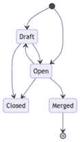
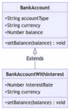
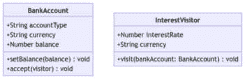

# 第三章：利用行为设计模式

行为设计模式有助于组织对象之间的通信。这包括在不修改这些现有类的情况下扩展功能的能力。通过实现本章中涵盖的行为设计模式以及它们在 JavaScript 生态系统中的应用，我们将学习如何构建可以扩展而不触及现有功能的 JavaScript 应用程序。

本章将涵盖以下主题：

+   对行为设计模式分类的理解

+   观察者模式的实现以及常见的 Web **EventTarget** API 如何暴露它

+   状态模式和策略模式的实现，包括基于类的方法和基于函数的方法

+   一个简化的访问者示例，以及访问者模式在 JavaScript 生态系统中的常见用法

到本章结束时，您将能够利用 JavaScript 中的行为设计模式来扩展您的代码库并公开功能扩展点。

# 技术要求

您可以在 GitHub 上找到本章的代码文件，网址为[`github.com/PacktPublishing/Javascript-Design-Patterns`](https://github.com/PacktPublishing/Javascript-Design-Patterns)

# 什么是行为设计模式？

对象之间的通信是构建软件的关键。行为设计模式帮助我们组织这种通信，并且通常将可能的实现与其他对象解耦。这使得我们更有能力扩展我们的代码库。

行为设计模式帮助我们遵循开闭原则，我们可以扩展功能而不修改现有的实现模块。

我们将要涵盖的所有模式都允许我们“添加功能”而不修改现有的消费者/具体实现。在大型软件代码库中，这很有用，因为它意味着我们可以限制更改的范围并降低破坏现有功能的风险。我们能够有效地将“添加功能”与“更改其他无关功能的现有代码”解耦，并且可以添加新功能和行为，而无需对现有消费者进行修改。

使用行为设计模式，新的行为可以是纯粹的增加性的。观察者模式允许多个解耦的消费者（也称为监听器）。通过状态、策略和访问者模式，可以添加新的实现和转换，而不会干扰现有的实现。

在下一节中，我们将探讨我们的第一个行为设计模式，即 JavaScript 中的观察者模式。

# JavaScript 中的观察者模式

观察者模式允许一个对象（可观察的或主题）维护一个依赖于它的其他对象列表（观察者）。当主题的状态更新发生时，例如实体对象被创建或更新，它会通知观察者。

## 实现

观察者模式的示例用例是一个内存队列。`Queue`实例将具有`subscribe`、`unsubscribe`和`notify`方法。

`subscribe`将添加一个额外的“处理”函数，`unsubscribe`将删除已注册的特定“处理”函数，最后，`notify`将使用“消息”有效负载调用每个处理函数。这是“观察者的通知”部分，其中可观察对象或主题确保每个已注册的观察者都被通知。

`subscribe`和`unsubscribe`分别用于开启和关闭“观察者”功能。`subscribe`必须使用来成为“观察者”，而`unsubscribe`在不再需要观察某些情况时（例如，我们已经达到一个结束状态）非常有用。同时，`notify`方法确保每个“已订阅”的观察者都能收到更新。

“处理”函数，正如其名所示，是将传递给另一个模块以供其自行执行的功能，通常是对“事件”的响应：

```js
class Queue {
  constructor() {
    this.handlers = [];
  }
  subscribe(handlerFn) {
    this.handlers.push(handlerFn);
  }
  unsubscribe(handlerFn) {
    this.handlers = this.handlers.filter((handler) =>
      handler !== handlerFn);
  }
  notify(message) {
    this.handlers.forEach((handler) => {
      handler(message);
    });
  }
}
```

我们可以实现三个简单的“订阅者”，分别只记录`'CREATE'`消息、只记录`'UPDATE'`消息和记录所有消息：

```js
const queue = new Queue();
const createMessages = [];
queue.subscribe((message) => {
  if (message.type === 'CREATE') {
    createMessages.push(message);
  }
});
const updateMessages = [];
queue.subscribe((message) => {
  if (message.type === 'UPDATE') {
    updateMessages.push(message);
  }
});
const allMessages = [];
queue.subscribe((message) => {
  allMessages.push(message);
});
```

当我们通过调用`notify`来触发通知时，我们可以通过检查它们存储消息的数组来确保订阅者按预期工作：

```js
queue.notify({ type: 'CREATE', data: { user: { id: 1 } }
});
queue.notify({ type: 'CREATE', data: { user: { id: 2 } } });
queue.notify({ type: 'CREATE', data: { user: { id: 3 } } });
queue.notify({ type: 'UPDATE', data: { user: { id: 1, role:
  'ADMIN' } } });
queue.notify({
  type: 'UPDATE',
  data: { user: { id: 3, role: 'DEVELOPER' } },
});
queue.notify({ type: 'UPDATE', data: { user: { id: 3, role:
  'ADMIN' } } });
console.assert(
  createMessages.length === 3,
  '%o collects CREATE messages',
  allMessages
);
console.assert(
  updateMessages.length === 3,
  '%o collects UPDATE messages',
  allMessages
);
console.assert(
  allMessages.length === 6,
  '%o collects all message',
  allMessages
);
```

注意，我们的观察者实现利用了 JavaScript 对函数的一等支持，这意味着我们可以将回调函数传递给`subscribe`方法，而不是`notify`必须在一个实例上调用一个方法。

在不支持或几乎没有一等函数支持的编程语言中，例如较老的 Java 和 PHP 版本，这种方法将需要传递一个*观察者*给`subscribe`和`notify`，并在每个观察者实例上调用一个方法。在 JavaScript 中，如果我们不使用“处理”函数，我们将创建一个`observer`对象，该对象被实例化并具有一个`handle`函数，该函数接受一个*消息*并围绕它实现一些逻辑；在这种情况下，它只是将其存储在一个实例变量上：

```js
class UpdateMessageObserver {
  constructor() {
    this.updateMessages = [];
  }
  handle(message) {
    if (message.type === 'UPDATE') {
      this.updateMessages.push(message);
    }
  }
}
```

这将需要修改`Queue`类以正确工作：

```js
class QueueObserverObjects {
  constructor() {
    this.observers = [];
  }
  subscribe(observerObj) {
    this.observers.push(observerObj);
  }
  unsubscribe(observerObj) {
    this.observers = this.observers.filter(
      (observer) => observer !== observerObj,
    );
  }
  notify(message) {
    this.observers.forEach((observer) => {
      observer.handle(message);
    });
  }
}
```

我们可以通过调用`notify`方法并检查`UpdateMessageObserver().updateMessages`的内容来确保它按预期工作，如下面的代码示例所示：

```js
const queueObserverObjects = new QueueObserverObjects();
const updateMessageObserver = new UpdateMessageObserver();
queueObserverObjects.subscribe(updateMessageObserver);
queueObserverObjects.notify({
  type: 'CREATE',
  data: { user: { id: 1 } },
});
queueObserverObjects.notify({
  type: 'UPDATE',
  data: { user: { id: 1, role: 'ADMIN' } },
});
queueObserverObjects.notify({
  type: 'UPDATE',
  data: { user: { id: 3, role: 'DEVELOPER' } },
});
console.assert(
  updateMessageObserver.updateMessages.length === 2,
  '%o collects update messages',
  updateMessageObserver.updateMessages,
);
```

我们现在已经看到了如何使用“处理”函数和`Observer`对象实例实现观察者模式，使用`Queue`可观察对象。接下来，我们将探讨观察者模式在 JavaScript 中的使用情况。

## 观察者模式的用例

观察者模式非常适合处理松散耦合的事件或消息。在 Web 应用程序的上下文中，这可能是 DOM 事件。`EventTarget.addEventListener()`和`EventTarget.removeEventListener()`，这些方法在`Window`、`Document`和`Element`对象上可用，是观察者模式的一种广泛实现。它们被客户端 JavaScript 应用程序用于注册用户交互的处理程序（例如，点击、表单提交、悬停和鼠标悬停）。

## 局限性和改进

在我们的队列实现中，处理程序可以从实例外部读取。处理程序是队列的实现细节，我们应该能够在不影响消费模块的情况下更改它。这意味着我们想要封装处理程序，使它们对于`Queue`类之外的代码不可用。如果我们保持`handlers`数组可用，那么`Queue`类之外的代码就可以访问并修改它，这意味着`Queue`抽象就会崩溃，因为消费者针对实现细节进行集成。这意味着消费者与`Queue`的内部实现紧密耦合。

因此，我们可以使用私有字段；在现代 JavaScript 中，这可以通过使用`#`语法来实现。对于处理程序，它将涉及在类中声明`#handlers`，然后访问`this.#handlers`：

```js
class Queue {
  #handlers;
  constructor() {
    this.#handlers = [];
  }
  subscribe(handlerFn) {
    this.#handlers.push(handlerFn);
  }
  unsubscribe(handlerFn) {
    this.#handlers = this.#handlers.filter((handler) =>
      handler !== handlerFn);
  }
  notify(message) {
    this.#handlers.forEach((handler) => {
      handler(message);
    });
  }
}
```

我们可以对我们的队列进行另一项改进，那就是提供一个流畅的接口，以便我们可以“链式”调用。为此，我们只需从每个`subscribe`、`unsubscribe`和`notify`处理程序中返回`this`即可。这允许我们在单个“链”中调用实例方法；而不是使用`queue.subscribe()`后跟`queue.notify()`，我们可以将其写为单个语句 - `queue.subscribe().notify()`：

```js
class Queue {
  #handlers;
  constructor() {
    this.#handlers = [];
  }
  subscribe(handlerFn) {
    this.#handlers.push(handlerFn);
    return this;
  }
  unsubscribe(handlerFn) {
    this.#handlers = this.#handlers.filter((handler) =>
      handler !== handlerFn);
    return this;
  }
  notify(message) {
    this.#handlers.forEach((handler) => {
      handler(message);
    });
    return this;
  }
}
```

我们可以通过验证队列在通知观察者方面的功能以及使用流畅（“链式”）接口的可用性来验证队列是否按预期工作：

```js
const queue = new Queue();
const createMessages = [];
const updateMessages = [];
const allMessages = [];
queue
  .subscribe((message) => {
    if (message.type === 'CREATE') {
      createMessages.push(message);
    }
  })
  .subscribe((message) => {
    if (message.type === 'UPDATE') {
      updateMessages.push(message);
    }
  })
  .subscribe((message) => {
    allMessages.push(message);
  });
queue
  .notify({ type: 'CREATE', data: { user: { id: 1 } } })
  .notify({ type: 'CREATE', data: { user: { id: 2 } } })
  .notify({ type: 'CREATE', data: { user: { id: 3 } } })
  .notify({ type: 'UPDATE', data: { user: { id: 1, role:
    'ADMIN' } } })
  .notify({
    type: 'UPDATE',
    data: { user: { id: 3, role: 'DEVELOPER' } },
  })
  .notify({ type: 'UPDATE', data: { user: { id: 3, role:
    'ADMIN' } } });
console.assert(
  createMessages.length === 3,
  '%o collects CREATE messages',
  allMessages
);
console.assert(
  updateMessages.length === 3,
  '%o collects UPDATE messages',
  allMessages
);
console.assert(
  allMessages.length === 6,
  '%o collects all message',
  allMessages
);
```

我们现在已经看到了如何在 JavaScript 中实现观察者模式，以及如何使用私有字段和流畅接口来改进我们的实现。

在下一节中，我们将实现状态模式和策略模式。

# JavaScript 中的状态和策略以及简化方法

状态模式和策略模式密切相关，因为它们允许通过更改解耦的实现对象来扩展软件系统的功能，而不是更改核心主题对象。

状态允许对象根据其所在的状态显示不同的行为。这对于建模状态机非常有用。每个状态都提供相同的接口，核心对象会在不同的状态上调用方法。

策略模式同样允许对象在运行时动态选择一个实现。为了做到这一点，实现被注入到对象中并使用。

我们可以将状态模式归类为策略模式的一个子集，其中实现是通过状态实例动态改变的。

接下来，我们将看到如何使用状态模式在 JavaScript 中实现状态机，以及使用策略模式实现对象合并的抽象。

## 实现

对于我们实现的状态模式，我们将使用简化的拉取请求/合并请求/变更请求示例。

拉取请求从草稿或打开状态开始。从那里，它可以在打开和草稿之间转换，然后转换为关闭或合并状态。合并状态是一个最终状态；关闭可以通过重新打开拉取请求来撤销，因此它不是最终状态。

为了可视化所有状态之间的转换，我们可以使用表示拉取请求状态和允许转换的状态图。在 *图 3.1* 中，初始状态是草稿或打开。这两种状态都可以相互转换。打开可以变为合并或关闭，其中合并是一个有效的结束状态。草稿也可以变为关闭。



图 3.1：拉取请求状态图

首先绘制我们的 `PullRequest` 类很有用。在 `PullRequest` 上可能执行的操作有 `open`、`markDraft`、`markReadyForReview`、`close` 和 `merge`。

为了实现该状态模式，我们还公开了一个 `setState` 方法。每个状态都将 `PullRequest` 实例作为构造函数参数，`PullRequest` 的初始状态是 `DraftState` 或 `OpenState`，基于一个 `isDraft` 布尔参数：

```js
class PullRequest {
  constructor(isDraft = false) {
    this.state = isDraft ? new DraftState(this) : new
      OpenState(this);
  }
  setState(state) {
    this.state = state;
  }
  open() {
    this.state.open();
  }
  markDraft() {
    this.state.markDraft();
  }
  markReadyForReview() {
    this.state.markReadyForReview();
  }
  close() {
    this.state.close();
  }
  merge() {
    this.state.merge();
  }
}
```

我们将实现状态机，从初始状态和最终状态开始。对于初始状态，我们有 `DraftState` 和 `OpenState`；对于最终状态，我们有 `MergedState`。

`DraftState` 只实现了 `markReadyForReview` 和 `close`，分别将 `pullRequest` 转换为 `OpenState` 或 `ClosedState`：

```js
class DraftState {
  constructor(pullRequest) {
    this.pullRequest = pullRequest;
  }
  markReadyForReview() {
    this.pullRequest.setState(new OpenState
      (this.pullRequest));
  }
  close() {
    this.pullRequest.setState(new ClosedState
      (this.pullRequest));
  }
}
```

`OpenState` 实现了 `markDraft`、`close` 和 `merge`，分别将 `pullRequest` 转换为 `DraftState`、`ClosedState` 和 `MergedState`：

```js
class OpenState {
  constructor(pullRequest) {
    this.pullRequest = pullRequest;
  }
  markDraft() {
    this.pullRequest.setState(new DraftState
      (this.pullRequest));
  }
  close() {
    this.pullRequest.setState(new ClosedState
      (this.pullRequest));
  }
  merge() {
    this.pullRequest.setState(new MergedState
      (this.pullRequest));
  }
}
```

作为最终状态，`MergedState` 不实现任何方法：

```js
class MergedState {
  constructor(pullRequest) {
    this.pullRequest = pullRequest;
  }
}
```

最后，`ClosedState` 实现了 `open` 方法，它将 `pullRequest` 转换为 `OpenState`：

```js
class ClosedState {
  constructor(pullRequest) {
    this.pullRequest = pullRequest;
  }
  open() {
    this.pullRequest.setState(new OpenState
      (this.pullRequest));
  }
}
```

我们可以检查我们的拉取请求和状态是否按预期工作。

使用 `isDraft` 设置为 `true` 实例化的 `PullRequest` 将从 `DraftState` 开始。调用 `markReadyForReview` 将将其转换为 `OpenState`：

```js
const pullRequest1 = new PullRequest(true);
console.assert(pullRequest1.state instanceof DraftState,
  pullRequest1.state);
pullRequest1.markReadyForReview();
console.assert(pullRequest1.state instanceof OpenState,
  pullRequest1.state);
```

一旦使用 `pullRequest.merge()` 合并了拉取请求，就没有任何方法可用（它们都会抛出错误）：

```js
pullRequest1.merge();
console.assert(
  captureError(() => pullRequest1.open()) instanceof Error,
  pullRequest1.state
);
console.assert(
  captureError(() => pullRequest1.markReadyForReview())
    instanceof Error,
  pullRequest1.state
);
console.assert(
  captureError(() => pullRequest1.close()) instanceof
    Error,
  pullRequest1.state
);
```

从打开状态开始的拉取请求可以被关闭。一旦进入 `ClosedState`，除了在它上面执行 `open()` 方法之外，无法执行任何其他操作——例如，`markDraft` 将会因错误而失败：

```js
const pullRequest2 = new PullRequest(false);
console.assert(pullRequest2.state instanceof OpenState,
  pullRequest2.state);
pullRequest2.close();
console.assert(pullRequest2.state instanceof ClosedState,
  pullRequest2.state);
console.assert(
  captureError(() => pullRequest2.markDraft())
    instanceof Error,
  pullRequest2.state
);
pullRequest2.open();
console.assert(pullRequest2.state instanceof OpenState,
  pullRequest2.state);
```

我们现在已经看到了如何使用状态模式实现拉取请求状态机。

接下来，我们将查看如何实现策略。

我们的例子是一个`ObjectMerger`类，它合并 JavaScript 对象。在 JavaScript 中有多种实现方式，因此我们构建`ObjectMerger`以接受一个`strategy`对象，并允许通过`setStrategy`方法对其进行更新。最后，我们公开一个`combinedObjects`方法，该方法调用实例的策略的`combineObjects`方法，并传入两个对象：

```js
class ObjectMerger {
  constructor(defaultStrategy) {
    this.strategy = defaultStrategy;
  }
  setStrategy(newStrategy) {
    this.strategy = newStrategy;
  }
  combineObjects(obj1, obj2) {
    return this.strategy.combineObjects(obj1, obj2);
  }
}
```

在这种情况下，一个示例策略是使用`Object.assign`与`{}`（一个新对象字面量）作为赋值的目标。这有一个好处，就是不会修改`obj1`和`obj2`参数：

```js
class PureObjectAssignStrategy {
  constructor() {}
  combineObjects(obj1, obj2) {
    return Object.assign({}, obj1, obj2);
  }
}
```

我们的`ObjectMerger`可以使用`PureObjectAssignStrategy`进行实例化，如下所示：

```js
const objectMerger = new ObjectMerger
  (new PureObjectAssignStrategy());
```

然后，它可以用来合并对象，而不会修改`obj1`或`obj2`：

```js
const obj1 = {
  keys: '123',
};
const obj2 = {
  keys: '456',
};
const defaultMergeStrategyOutput =
  objectMerger.combineObjects(obj1, obj2);
console.assert(defaultMergeStrategyOutput.keys === '456',
  '%o has keys = 456');
console.assert(obj1.keys === '123' && obj2.keys === '456',
  obj1, obj2);
```

一个使用`Object.assign`的简单实现示例，它不使用新对象作为赋值目标（因此，会修改`obj1`），如下所示：

```js
class MutatingObjectAssignStrategy {
  constructor() {}
  combineObjects(obj1, obj2) {
    return Object.assign(obj1, obj2);
  }
}
```

它可以这样使用，并且确实会修改`obj1`：

```js
objectMerger.setStrategy(new
  MutatingObjectAssignStrategy());
const mutatingMergedStrategyOutput =
  objectMerger.combineObjects(obj1, obj2);
console.assert(
  mutatingMergedStrategyOutput.keys === '456',
  '%o has keys = 456',
  mutatingMergedStrategyOutput
);
console.assert(
  obj1.keys === '456' && obj2.keys === '456',
  'Mutates the original object obj1 %o, obj2 %o',
  obj1,
  obj2
);
```

与我们的初始`Object.assign({}, obj1, obj2)`策略等效的策略是使用扩展语法：

```js
class ObjectSpreadStrategy {
  constructor() {}
  combineObjects(obj1, obj2) {
    return { ...obj1, ...obj2 };
  }
}
```

我们可以验证将`obj1`和`obj2`展开会产生与我们的早期`PureObjectAssignStrategy`相同的策略特征：

```js
objectMerger.setStrategy(new ObjectSpreadStrategy());
const newObj1 = { keys: '123' };
const newObj2 = { keys: '456', obj1: newObj1 };
const objectSpreadStrategyOutput =
  objectMerger.combineObjects(
  newObj1,
  newObj2
);
console.assert(
  objectSpreadStrategyOutput.keys === '456',
  '%o has keys = 456',
  objectSpreadStrategyOutput
);
console.assert(
  newObj1.keys === '123' && newObj2.keys === '456',
  'Does not mutate the original object newObj1 %o,
    newObj2 %o',
  newObj1,
  newObj2
);
```

一个有趣的方面是，这种方法只创建了一个浅拷贝；对象内部的对象引用被复制，但目标对象的内容是相同的：

```js
console.assert(
  objectSpreadStrategyOutput.obj1 === newObj1,
  'Does a shallow clone so objectSpreadStrategyOutput.obj1
    references newObj1'
);
```

我们可以通过实现基于`structuredClone`的深度克隆策略来解决这个问题：

```js
class DeepCloneObjectAssignStrategy {
  constructor() {}
  combineObjects(obj1, obj2) {
    return Object.assign(structuredClone(obj1),
      structuredClone(obj2));
  }
}
```

`DeepCloneObjectAssignStrategy`具有`PureObjectAssignStrategy`和`ObjectSpreadStrategy`的所有属性，并且增加了深度复制的功能，递归地复制嵌套对象的内 容，而不是复制这些对象的引用：

```js
objectMerger.setStrategy(new DeepCloneObjectAssignStrategy());
const deepCloneStrategyOutput = objectMerger.
  combineObjects(newObj1, newObj2);
console.assert(
  deepCloneStrategyOutput.keys === '456',
  '%o has keys = 456',
  deepCloneStrategyOutput
);
console.assert(
  newObj1.keys === '123' && newObj2.keys === '456',
  'Does not mutate the original object newObj1 %o,
    newObj2 %o',
  newObj1,
  newObj2
);
console.assert(
  deepCloneStrategyOutput.obj1 !== newObj1 &&
    deepCloneStrategyOutput.obj1.keys === newObj1.keys,
  'Does a shallow clone so deepCloneStrategyOutput.obj1
    references newObj1'
);
```

我们现在已经看到了如何实现状态和策略模式。接下来，我们将探讨状态和策略模式在 JavaScript 中最常被使用的地方。

## 状态模式和策略模式的使用案例

如本章前面所述，状态模式对于实现状态机是有用的。

状态和策略之间的一个关键区别是，在状态模式中，通常不同状态之间是相互了解的——例如，`ClosedState`创建一个`OpenState`的新实例以过渡到它。同样，`OpenState`了解它可以过渡到的所有潜在状态（`DraftState`、`ClosedState`和`MergedState`）。相比之下，在实现策略模式时，不同的策略是自包含的，并且不了解彼此。例如，`PureObjectAssignStrategy`和`MutatingObjectAssignStrategy`不会相互引用。

策略模式有助于提供具有不同内部实现的统一接口。当不同的实现算法应该可互换，而集成消费者不需要了解它时，这是一个有用的抽象。

## 局限性和改进

在我们的国家示例中，请注意我们代码中有多少是重复的类构造函数，它接受一个`pullRequest`实例。我们可以通过提供一个`PullRequestBaseState`类来重构我们的代码，该类为每个状态方法抛出`IllegalOperationError`：

```js
class IllegalOperationError extends Error {
  constructor(stateInstance) {
    this.stateInstance = stateInstance;
    throw new Error('Illegal operation for State');
  }
}
class PullRequestBaseState {
  constructor(pullRequest) {
    this.pullRequest = pullRequest;
  }
  markDraft() {
    throw new IllegalOperationError(this);
  }
  markReadyForReview() {
    throw new IllegalOperationError(this);
  }
  open() {
    throw new IllegalOperationError(this);
  }
  close() {
    throw new IllegalOperationError(this);
  }
  merge() {
    throw new IllegalOperationError(this);
  }
}
```

这意味着我们可以通过扩展`PullRequestBaseState`来定义我们的不同状态：

```js
class ClosedState extends PullRequestBaseState {
  open() {
    this.pullRequest.setState(new OpenState
      (this.pullRequest));
  }
}
class DraftState extends PullRequestBaseState {
  markReadyForReview() {
    this.pullRequest.setState(new OpenState
      (this.pullRequest));
  }
  close() {
    this.pullRequest.setState(new ClosedState
      (this.pullRequest));
  }
}
class OpenState extends PullRequestBaseState {
  markDraft() {
    this.pullRequest.setState(new DraftState
      (this.pullRequest));
  }
  close() {
    this.pullRequest.setState(new ClosedState
      (this.pullRequest));
  }
  merge() {
    this.pullRequest.setState(new MergedState
      (this.pullRequest));
  }
}
class MergedState extends PullRequestBaseState {}
```

`PullRequest`类没有改变，这些新的状态实现与我们的先前实现工作相同：

```js
const pullRequest1 = new PullRequest(true);
console.assert(pullRequest1.state instanceof DraftState,
  pullRequest1.state);
pullRequest1.markReadyForReview();
console.assert(pullRequest1.state instanceof OpenState,
  pullRequest1.state);
pullRequest1.merge();
console.assert(
  captureError(() => pullRequest1.open()) instanceof Error,
  pullRequest1.state
);
console.assert(
  captureError(() => pullRequest1.markReadyForReview())
    instanceof Error,
  pullRequest1.state
);
console.assert(
  captureError(() => pullRequest1.close()) instanceof
   Error,
  pullRequest1.state
);
const pullRequest2 = new PullRequest(false);
console.assert(pullRequest2.state instanceof OpenState,
  pullRequest2.state);
pullRequest2.close();
console.assert(pullRequest2.state instanceof ClosedState,
  pullRequest2.state);
console.assert(
  captureError(() => pullRequest2.markDraft())
    instanceof Error,
  pullRequest2.state
);
pullRequest2.open();
console.assert(pullRequest2.state instanceof OpenState,
  pullRequest2.state);
```

对于策略，我们可以利用的是 JavaScript 的一等函数支持。我们不需要将每个策略实现为一个对象，而是可以将其作为函数。

我们的`ObjectMerger`实现如下：

```js
class ObjectMerger {
  constructor(defaultStrategy) {
    this.strategy = defaultStrategy;
  }
  setStrategy(newStrategy) {
    this.strategy = newStrategy;
  }
  combineObjects(obj1, obj2) {
    return this.strategy(obj1, obj2);
  }
}
```

我们可以将所有策略重新实现为函数：

```js
function pureObjectAssignStrategy(obj1, obj2) {
  return Object.assign({}, obj1, obj2);
}
function mutatingObjectAssignStrategy(obj1, obj2) {
  return Object.assign(obj1, obj2);
}
function objectSpreadStrategy(obj1, obj2) {
  return { ...obj1, ...obj2 };
}
function deepCloneObjectAssignStrategy(obj1, obj2) {
  return Object.assign(structuredClone(obj1),
    structuredClone(obj2));
}
```

基于函数的策略`ObjectMerger`类具有与之前实现的基于类的相同属性。构造函数接受一个“策略函数”，并将其设置在实例上；每个实例公开一个`setStrategy`方法，该方法覆盖策略函数，以及一个`combineObjects`方法，我们可以调用它来合并对象。

这意味着我们可以使用我们的`ObjectMerger`与所有四个基于函数的策略（`pureObjectAssignStrategy`、`mutatingObjectAssignStrategy`、`objectSpreadStrategy`和`deepCloneObjectAssignStrategy`），如下所示：

```js
const objectMerger = new ObjectMerger
  (pureObjectAssignStrategy);
const obj1 = {
  keys: '123',
};
const obj2 = {
  keys: '456',
};
const defaultMergeStrategyOutput =
  objectMerger.combineObjects(obj1, obj2);
console.assert(defaultMergeStrategyOutput.keys === '456',
  '%o has keys = 456');
console.assert(obj1.keys === '123' && obj2.keys === '456',
  obj1, obj2);
objectMerger.setStrategy(mutatingObjectAssignStrategy);
const mutatingMergedStrategyOutput =
  objectMerger.combineObjects(obj1, obj2);
console.assert(
  mutatingMergedStrategyOutput.keys === '456',
  '%o has keys = 456',
  mutatingMergedStrategyOutput
);
console.assert(
  obj1.keys === '456' && obj2.keys === '456',
  'Mutates the original object obj1 %o, obj2 %o',
  obj1,
  obj2
);
objectMerger.setStrategy(objectSpreadStrategy);
const newObj1 = { keys: '123' };
const newObj2 = { keys: '456', obj1: newObj1 };
const objectSpreadStrategyOutput =
  objectMerger.combineObjects(
  newObj1,
  newObj2
);
console.assert(
  objectSpreadStrategyOutput.keys === '456',
  '%o has keys = 456',
  objectSpreadStrategyOutput
);
console.assert(
  newObj1.keys === '123' && newObj2.keys === '456',
  'Does not mutate the original object newObj1 %o,
    newObj2 %o',
  newObj1,
  newObj2
);
console.assert(
  objectSpreadStrategyOutput.obj1 === newObj1,
  'Does a shallow clone so objectSpreadStrategyOutput.obj1
    references newObj1'
);
objectMerger.setStrategy(deepCloneObjectAssignStrategy);
const deepCloneStrategyOutput = objectMerger.combineObjects
  (newObj1, newObj2);
console.assert(
  deepCloneStrategyOutput.keys === '456',
  '%o has keys = 456',
  deepCloneStrategyOutput
);
console.assert(
  newObj1.keys === '123' && newObj2.keys === '456',
  'Does not mutate the original object newObj1 %o,
    newObj2 %o',
  newObj1,
  newObj2
);
console.assert(
  deepCloneStrategyOutput.obj1 !== newObj1 &&
    deepCloneStrategyOutput.obj1.keys === newObj1.keys,
  'Does a shallow clone so deepCloneStrategyOutput.
    obj1 references newObj1'
);
```

我们已经展示了如何在 JavaScript 中实现状态和策略模式，以及它们的局限性和改进，这些都可以使用现代 JavaScript 特性来完成。

在下一节中，我们将介绍访问者模式及其在 JavaScript 生态系统中的应用。

# JavaScript 中的访问者

访问者设计模式关注的是在不修改对象结构的情况下向对象添加功能。

在经典继承中，我们经常遇到一个“基类”，它不是直接使用的；它被用作一个“抽象类”，从该“抽象类”继承出我们的“基类”。例如，对于`BankAccount`和`BankAccountWithInterest`，我们的类图如下所示，其中`BankAccountWithInterest`扩展了`BankAccount`并覆盖了`setBalance`。



图 3.2：继承自 BankAccount 的 BankAccountWithInterest 类图

我们可以使用访问者模式定义`BankAccount`，它接受一个访问者和`InterestRateVisitor`访问者类。作为一个类图，它看起来如下。`BankAccount`和`InterestRateVisitor`不是通过继承链接的；它们将在`InterestRateVisitor`被`BankAccount().accept`方法调用时在运行时链接。这意味着`InterestRateVisitor`了解`BankAccount`的结构，但反之则不然。此外，访问者可能不需要了解它访问的完整结构，只需要了解实现访问者功能的相关部分。



图 3.3：BankAccount 类和独立的 InterestRateVisitor 类的类图

现在，我们将看到如何实现`BankAccount`和`InterestRateVisitor`场景。

## 实现

要实现一个访问者，让我们从一个简单的`BankAccount`类开始。构造函数设置账户类型（要么是活期账户，要么是储蓄账户）、货币和初始余额。`BankAccount`有一个`setBalance`方法，可以设置账户余额的值。`accept`方法将允许我们接受访问者并在实例上调用他们的`visit`方法：

```js
class BankAccount {
  /**
   *
   * @param {'CURRENT' | 'SAVINGS'} accountType
   * @param {String} currency
   * @param {Number} balance - balance in minor currency
     unit
   */
  constructor(accountType = 'CURRENT', currency = 'USD',
    balance = 0) {
    this.accountType = accountType;
    this.currency = currency;
    this.balance = balance;
  }
  setBalance(balance) {
    this.balance = balance;
  }
  accept(visitor) {
    visitor.visit(this);
  }
}
```

一种结构化`InterestVisitor`的方式是使用利率和货币初始化它。`visit`方法接受`bankAccount`，如果账户匹配货币并且是储蓄账户，则根据利率和当前余额应用新的余额：

```js
class InterestVisitor {
  constructor(interestRate, currency) {
    this.interestRate = interestRate;
    this.currency = currency;
  }
  /**
   * @param {BankAccount} bankAccount
   */
  visit(bankAccount) {
    if (
      bankAccount.currency === this.currency &&
      bankAccount.accountType === 'SAVINGS'
    ) {
      bankAccount.setBalance((bankAccount.balance *
        this.interestRate) / 100);
    }
  }
}
```

给定一组账户，我们可以创建 USD 和 GBP 的`InterestVisitor`实例：

```js
const accounts = [
  new BankAccount('SAVINGS', 'GBP', 500),
  new BankAccount('SAVINGS', 'USD', 500),
  new BankAccount('CURRENT', 'USD', 10000),
];
const usdInterestVisitor = new InterestVisitor(105, 'USD');
const gbpInterestVisitor = new InterestVisitor(110, 'GBP');
```

然后，我们可以遍历账户并使用相关访问者调用`accept`方法：

```js
accounts.forEach((account) => {
  account.accept(usdInterestVisitor);
  account.accept(gbpInterestVisitor);
});
console.assert(
  accounts[0].balance === 550 &&
    accounts[1].balance === 525 &&
    accounts[2].balance === 10000,
  '%o',
  accounts
);
```

我们现在已经看到了如何在银行账户场景中实现访问者模式。接下来，我们将探讨 JavaScript 中访问者模式的流行用例。

## 访问者模式的用例

访问者模式为库作者提供了一个简单的接口，允许消费者扩展库的功能。这在处理树或其他“节点集”的库中特别有效。这也解释了为什么访问者模式在自定义解析系统（如 GraphQL 实现）或编译器（如 Babel）的插件中很受欢迎。

例如，在 Apollo Server v2 中编写自定义指令的方式是扩展`SchemaDirectiveVisitor`：

```js
import { SchemaDirectiveVisitor } from 'apollo-server';
class CustomDirective extends SchemaDirectiveVisitor {
  visitFieldDefinition(field) {
    // we can replace/augment the field's resolver
       implementation here
  }
}
'@babel/parser' package:
```

```js
import * as parser from '@babel/parser';
import traverse from '@babel/traverse';
const ast = parser.parse(`function triple(n) {
  return n * 3;
}`);
const CustomVisitor = {
  FunctionDeclaration(path) {
    console.assert(path.node.id.name === 'triple');
  },
};
traverse(ast, CustomVisitor);
```

我们现在已经看到了访问者模式是如何在操作树数据结构的库中使用的。接下来，我们将回顾本章所学的内容。

# 概述

在本章中，我们看到了行为设计模式如何通过支持不同的实现和解耦代码库的各个部分来扩展功能。

观察者模式对于支持松散耦合的可观察/观察者对之间的通信很有用。状态模式和策略模式可以用来实现状态机和有效地交换实现。访问者模式是暴露一个与操作对象的结构解耦的扩展机制的好方法。

现在我们知道了如何使用行为设计模式来组织不同对象和类之间的通信，在下一章中，我们将介绍 React 中的响应式视图库模式。
