# 第五章：渲染策略和页面激活

渲染策略和页面激活方法允许我们利用 JavaScript 客户端和服务器生态系统来提供高性能和可扩展的 Web 应用程序，这取决于我们最终用户的需求。本章中涵盖的 React 和 JavaScript 技术是增强 *第四章* 的另一套工具。我们将利用客户端（浏览器）和服务器（特别是 Node.js）运行时的优势，为用户提供快速和可扩展的 React 网站。

在本章中，我们将涵盖以下主题：

+   通过实现纯客户端和服务器端渲染应用程序，了解 React 应用程序客户端和服务器渲染之间的权衡

+   框架如 Next.js 通过静态站点生成功能和服务器端渲染功能可以带来的优势类型

+   使用 React 页面激活示例及其注意事项来弥合客户端-服务器渲染差距

+   React 中的流式服务器端渲染

到本章结束时，你将能够使用 React 选择合适的渲染和页面激活策略，并能够实现框架级别的功能，从而让你做出更好的技术选择。

# 技术要求

你可以在 GitHub 上找到本章的代码文件，网址为 [`github.com/PacktPublishing/Javascript-Design-Patterns`](https://github.com/PacktPublishing/Javascript-Design-Patterns)

# 使用 React 的客户端和服务器渲染

在网络环境中，客户端渲染是通过在用户的浏览器中使用 JavaScript 生成或更新页面内容的过程。一个完全客户端渲染的应用程序只有在相关的 JavaScript 代码完成下载、解析和运行后才会显示有意义的内容。

在下面的序列图中，我们使用“origin”而不是“服务器”等术语，因为全客户端渲染的一个好处是，为我们内容“提供服务”的资源可以是所谓的 *静态托管*。这包括 AWS 简单存储服务（**S3**）、Netlify、Cloudflare Pages 和 GitHub Pages 等服务。在这些服务中没有动态的服务器端组件。

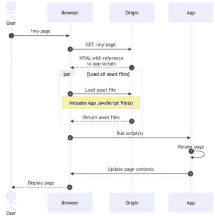

图 5.1：客户端渲染序列图

相比之下，服务器端渲染指的是当浏览器请求时，服务器生成一个完整的 HTML 文档并返回的过程。

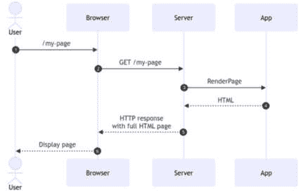

图 5.2：服务器端渲染序列图

## React 中的客户端渲染

在 React 中，客户端渲染是默认的渲染方法。让我们从头开始构建一个从客户端渲染的应用程序：

1.  我们从一个渲染一些文本及其 **type** 属性的 **App** 组件开始：

    ```js
    export function App({ type = '' }) {
      return (
        <div>
          <p>Hello from the {type + ' '}app</p>
        </div>
      );
    }
    ```

1.  然后，我们创建一个入口点文件，**client.jsx**，它导入应用程序并使用 **ReactDOM** 来渲染它，将 **type** 属性设置为 **"****client render"**。

    ```js
    import React from 'react';
    import ReactDOM from 'react-dom/client';
    import { App } from './src/app';
    ReactDOM.createRoot(document.querySelector
      ('#app')).render(
      <App type={`"client render"`} />
    );
    ```

1.  为了使此示例运行，我们需要一个允许 **ReactDOM.createRoot** 成功运行的 HTML 文档。换句话说，我们需要一个具有 **id=app** 元素并引用我们的入口点的 HTML 文档：

    ```js
    <div id="app"></div>
    <script src="img/client.js"></script>
    ```

1.  注意，入口点是 **dist/client.js** 而不是 **client.jsx**。这是因为 React 的 JSX 语法不能在浏览器中本地运行。相反，我们通过使用 **esbuild** 进行编译和打包步骤来运行我们的入口点文件，**client.jsx**。我们的构建命令看起来像这样：

    ```js
    npx esbuild client.jsx --bundle --outdir=dist
    ```

现在，如果我们加载浏览器中的 `index.html` 文件，我们会看到以下内容：

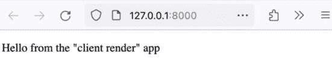

图 5.3：来自“客户端渲染”应用，在浏览器中渲染

## React 的服务器端渲染

Node.js，在其网站上介绍为“一个开源、跨平台的 JavaScript 运行时环境”，使我们能够在服务器上运行 JavaScript。在 Node.js 中构建服务器的常用包是 Express。

在本节中，我们将了解如何使用 Node.js 和 Express 来服务器端渲染一个 React 应用程序。

一个简单的 Express 服务器，当加载根路径时返回 `'Server-rendered hello'`，如下所示：

```js
import express from 'express';
const app = express();
app.get('/', (_req, res) => {
  res.send('Server-rendered hello');
});
const { PORT = 3000 } = process.env;
app.listen(PORT, () => {
  console.log(`Server started on
    http://localhost:${PORT}`);
});
```

再次，我们将使用 `esbuild` 来打包和编译 JSX 到 JavaScript：

```js
npx esbuild server.js --bundle --platform=node --outdir=dist
```

然后，我们可以使用以下命令启动服务器：

```js
node dist/server.js
```

默认情况下，它运行在端口 `3000`，但可以通过环境变量来覆盖。

当我们加载 `localhost:3000` 时，在浏览器中会看到以下消息。

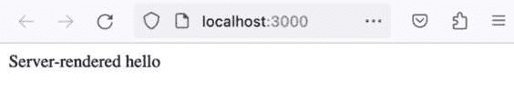

图 5.4：在浏览器中渲染的服务器端渲染的“hello”

这是一个使用 Node.js 和 Express 进行服务器端渲染的非常简单的示例。

接下来，我们将了解如何利用 **ReactDOM** 包将 React 组件服务器端渲染：

1.  **ReactDOM** 包提供了两个入口点：**react-dom/client**（我们在上一节中使用过）和 **react-dom/server**。正如名称所暗示的，客户端入口点旨在在客户端（在浏览器中，“客户端”JavaScript）使用，而服务器入口点则旨在在服务器（通过 Node.js 或其他服务器端 JavaScript 运行时）使用。

1.  我们将使用两种方法：**ReactDOMServer.renderToStaticMarkup** 和 **ReactDOMServer.renderToString**；这两个方法将允许我们将 React 应用程序服务器端渲染为 HTML。

1.  在一个 **src/server-render.jsx** 文件中，我们有以下 **renderNav** 和 **serverRenderApp** 函数，它们分别使用 **ReactDOMServer.renderToStaticMarkup** 和 **ReactDOMServer.renderToString** 来渲染 **Nav** 和 **App**：

    ```js
    import React from 'react';
    import ReactDOMServer from 'react-dom/server';
    import { App } from './app';
    import { Nav } from './nav';
    export function renderNav() {
      return ReactDOMServer.renderToStaticMarkup(<Nav />);
    }
    export function serverRenderApp() {
      return ReactDOMServer.renderToString(<App
        type={`"server render"`} />);
    }
    ```

    这里，`app.jsx` 与上一节中的相同，而 `nav.jsx` 如下所示：

    ```js
    import React from 'react';
    export function Nav() {
      return (
        <ul>
          <li>
            <a href="/">Server-render only</a>
          </li>
        </ul>
      );
    }
    ```

1.  然后，我们可以在**server.js**中使用**renderNav**和**serverRenderApp**。我们修改**app.get('/')**处理程序以渲染导航和应用程序：

    ```js
    // no other changes
    app.get('/', (_req, res) => {
      res.send(`
        <!DOCTYPE html>
        ${renderNav()}
        <h1>Server-render only</h1>
        <div id="app">${serverRenderApp()}</div>
      `);
    });
    ```

1.  当我们重新构建服务器时，我们运行**node dist/server.js**并打开**localhost:3000**以查看以下内容：

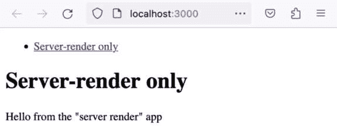

图 5.5：来自“服务器渲染”应用，与标题和导航一起渲染

`ReactDOMServer.renderToStaticMarkup`和`ReactDOMServer.renderToString`之间的区别是什么？简短的回答是`renderToStaticMarkup`不能在客户端重新激活；换句话说，它不能用作初始 HTML，然后相同的 React 应用程序代码可以在客户端运行以提供完全交互式的体验。我们将在本章的后续部分重新讨论这个问题。

## 客户端和服务器渲染之间的权衡

那么，客户端和服务器渲染有什么优点和缺点？

客户端渲染的主要优势在于应用程序的“工作”完全在用户的浏览器中完成，这使得它具有高度的可扩展性，因为使用该系统的用户数量不会对原始服务器造成压力。客户端渲染的主要缺点与仅在服务器端可用的功能相关——例如，仅服务器端 cookie 或设置社交媒体预览的`meta`标签。

服务器渲染的主要缺点是工作必须在服务器上完成。如前所述，服务器作为一个“受控”环境有一些好处，即其与其他协同定位系统的延迟通常低于完整的浏览器-服务器往返，因为服务器的网络是已知的，并且不太可能像最终用户网络那样有太多的性能差异。通过不等待完整页面加载，然后是资产加载，然后是 JavaScript“解析和执行”级联，服务器渲染可以提高“核心 Web 指标”，如**最大内容绘制**（**LCP**）和**累积布局偏移**（**CLS**）。

最终，客户端渲染的功能是我们使用 JavaScript 的关键原因，这意味着在受限的使用案例中移除这种能力才有意义，例如内容网站（例如博客、新闻网站和文档网站）。

我们现在已经看到了客户端和服务器渲染之间的区别，以及如何使用 React 和 Node.js 实现它们。在接下来的部分，我们将探讨 Next.js 框架为 React 提供的渲染方法。

# 使用 Next.js 进行静态渲染

Next.js 是一个用于创建全栈 Web 应用的 React 框架。这意味着它提供了工具和观点，将帮助开发者短期和长期内提高生产力。

Next.js 包括用于“页面”的文件系统路由器、一组 React 路由原语、客户端和服务器渲染支持以及数据获取原语等。

我们将关注的 Next.js 功能是 **静态站点生成**（**SSG**）。这种渲染方法类似于服务器端渲染，但通过在构建时而不是在请求时进行渲染，缓解了一些缺点。

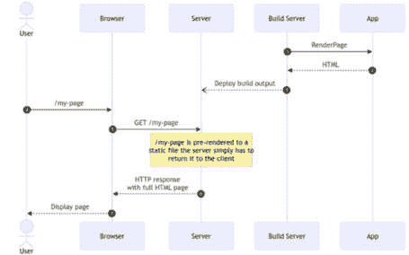

图 5.6：预渲染/静态站点生成用例的序列图

现在我们已经了解了当用户请求一个网站时，静态站点生成如何改变数据流，接下来我们将探讨 Next.js 的自动静态生成。

# 自动静态生成

在 Next.js 中，基于文件系统的路由意味着您的 Web 应用程序中的每个路径都对应于应用程序 `pages` 目录中的一个文件。例如，`/` 对应于 `pages/index.js`。

当给定页面没有使用 Next.js 数据获取方法时，Next.js 默认使用静态生成。您可以从 Next.js 文档中找到更多信息 – *自动静态优化* ([`nextjs.org/docs/pages/building-your-application/rendering/automatic-static-optimization`](https://nextjs.org/docs/pages/building-your-application/rendering/automatic-static-optimization))。

如果一个页面没有阻塞数据需求（即，可以被预渲染），Next.js 会自动确定该页面是静态的。这种判断是通过页面上不存在 `getServerSideProps` 和 `getInitialProps` 来实现的。

例如，在 Next.js 应用程序中的以下页面将会被静态生成，因为它只导出了一个页面组件（`Index` 的默认导出）；没有导出 `getServerSideProps` 或 `getInitialProps` 函数：

```js
import React from 'react';
import Head from 'next/head';
import Link from 'next/link';
export default function Index() {
  return (
    <>
      <Head>
        <title>Next Static Rendering - Automatic Static
          Generation</title>
        <meta name="viewport" content="width=device-width,
          initial-scale=1" />
      </Head>
      <main>
        <ul>
          <li>
            <Link href="/products">Products Page (SSG)
            </Link>
          </li>
          <li>
            <Link href="/cart">Cart Page (SSR)</Link>
          </li>
        </ul>
      </main>
    </>
  );
}
```

我们可以在以下屏幕截图中的 `next build` 过程中看到这一点；输出中的 `/ route (page)` 被标记为 `Static`：

```js
npx next build
info  - Linting and checking validity of types
info  - Creating an optimized production build
info  - Compiled successfully
info  - Collecting page data
info  - Generating static pages (3/3)
info  - Finalizing page optimization
Route (pages)                              Size     First Load JS
┌ ○ /                                      2.73 kB        75.8 kB
└ ○ /404                                   182 B          73.2 kB
+ First Load JS shared by all              73.1 kB
  ├ chunks/framework-fcfa81c6fe8caa42.js   45.2 kB
  ├ chunks/main-7039e34bfb6f1a68.js        26.9 kB
  ├ chunks/pages/_app-c7a111f3ee9d686c.js  195 B
  └ chunks/webpack-8fa1640cc84ba8fe.js     750 B
○  (Static)  automatically rendered as static HTML (uses no initial props)
```

当我们使用 `next start` 运行构建的 Next.js 输出时，页面会按预期行为。


图 5.7：产品页和购物车页面的链接渲染

由于我们没有动态数据获取需求，这个例子是一个相对受限的用例。它仍然展示了如果页面没有使用任何排除静态生成的功能，Next.js 默认会进行静态渲染。对于更高级的用例，Next.js 还允许使用“构建时”动态数据，这意味着我们可以使用第三方数据源来生成页面内容，等等。

我们已经看到了 Next.js 默认使用自动静态生成。接下来，我们将看到如何配置 Next.js 页面以加载数据以将页面作为静态内容渲染。

# 使用第三方数据源的静态生成

Next.js 有一个 `getStaticProps` 数据获取方法，允许我们在构建时加载数据，这些数据将被传递给页面。

以下序列图展示了这涉及的内容：

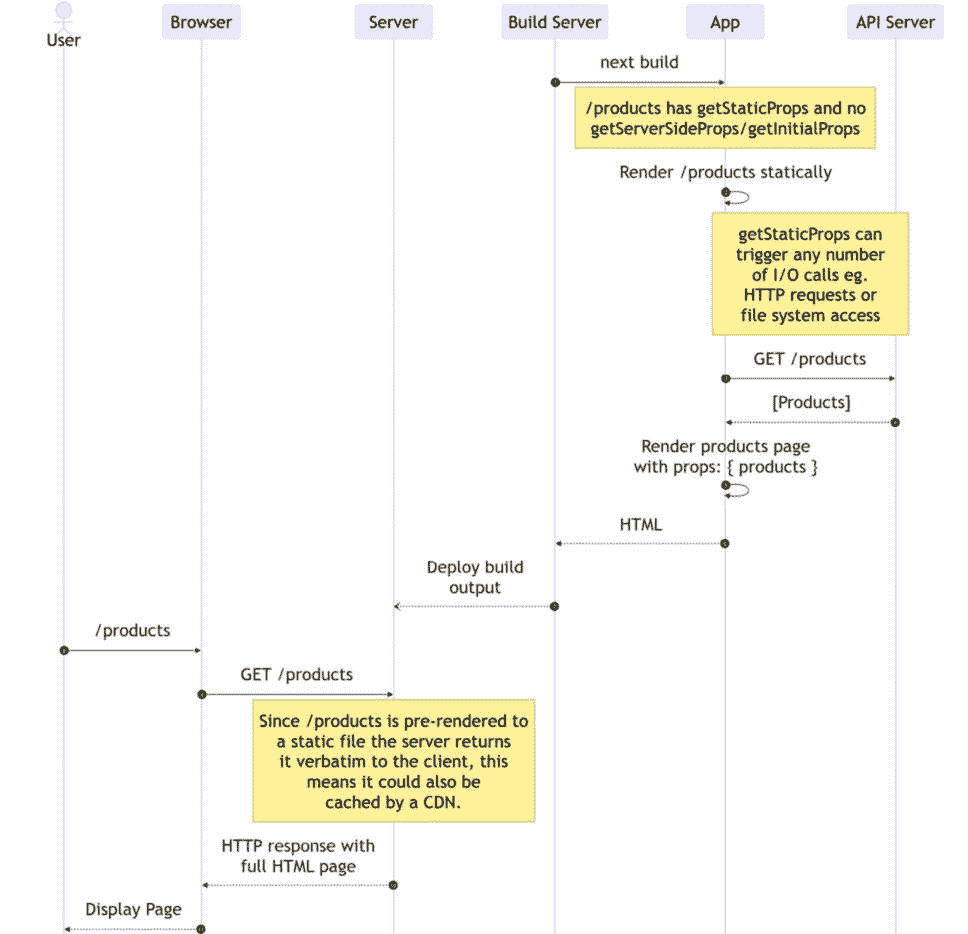

图 5.8：使用 getStaticProps 的 Next.js 预渲染序列图

例如，如果我们想基于 `fakestoreapi.com` 的数据构建一个“产品列表”页面，我们可以在 `pages/products/index.js` 页面中编写以下 `getStaticProps` 方法：

```js
export async function getStaticProps() {
  const products = await fetch
    ('https://fakestoreapi.com/products').then(
    (res) => res.json()
  );
  return {
    props: {
      products,
    },
  };
}
```

这里是一个 `product` 示例，以说明数据结构：

```js
{
  id: 1,
  title: 'Fjallraven - Foldsack No. 1 Backpack, Fits 15
    Laptops',
  price: 109.95,
  description: 'Your perfect pack for everyday use and
  walks in the forest. Stash your laptop (up to 15 inches)
  in the padded sleeve, your everyday',
  category: "men's clothing",
  image: 'https://fakestoreapi.com/img/
    81fPKd-2AYL._AC_SL1500_.jpg',
  rating: { rate: 3.9, count: 120 }
}
```

根据 `getStaticProps` 提供的数据，我们可以构建一个 `ProductIndexPage` 组件。我们将遍历 `props.products` 中的每个产品，并将它们渲染在一个无序列表中。每个条目将包括一个链接到 `/products/[id]` 页面（该页面尚不存在）：

```js
import React from 'react';
import Link from 'next/link';
import Head from 'next/head';
export default function ProductIndexPage({ products }) {
  return (
    <>
      <Head>
        <title>Products</title>
      </Head>
      <div>
        <h2>Products</h2>
        <ul>
          {products.map((product) => {
            return (
              <li key={product.id}>
                <Link
                  href={{
                    pathname: '/products/[id]',
                    query: { id: product.id },
                  }}
                >
                  {product.title}
                </Link>
              </li>
            );
          })}
        </ul>
      </div>
    </>
  );
}
// no change to getStaticProps
```

当运行 `next build` 时，此页面现在将被构建。正如我们从输出中可以看到的，`/products` 页面被标记为 `SSG`（静态站点生成）：

```js
info  - Linting and checking validity of types...
info  - Creating an optimized production build...
info  - Compiled successfully
info  - Collecting page data
info  - Generating static pages (4/4)
info  - Finalizing page optimization
Route (pages)                              Size     First Load JS
┌ ○ /                                      464 B          75.9 kB
├ ○ /404                                   182 B          73.2 kB
└ ● /products                              426 B          75.9 kB
+ First Load JS shared by all              73.1 kB
  ├ chunks/framework-fcfa81c6fe8caa42.js   45.2 kB
  ├ chunks/main-7039e34bfb6f1a68.js        26.9 kB
  ├ chunks/pages/_app-c7a111f3ee9d686c.js  195 B
  └ chunks/webpack-8fa1640cc84ba8fe.js     750 B
○  (Static)  automatically rendered as static HTML (uses no initial props)
●  (SSG)     automatically generated as static HTML + JSON (uses getStaticProps)
```

当我们使用 `next start` 启动 Next.js 服务器并导航到 `/products` 时，我们会看到以下内容。请注意，除非我们重新构建应用程序，否则页面上的产品不会改变。


图 5.9：使用 fakestoreapi.com 的产品静态预渲染的产品列表页面

我们已经看到如何使用 `getStaticProps` 根据第三方 API 生成页面，但在请求之前如何生成 `/products/[id]` 页面呢？为了做到这一点，我们需要能够提供 Next.js 需要生成所需的“必需路径”（或 URL）。这就是我们将在下一节中要查看的内容。

# 基于动态路径的静态生成

预先生成具有动态路径和内容的页面可能很有用。

我们可以使用 `getServerSideProps` 并按需渲染页面。在我们工作的上下文中，这对于“购物车”页面是有效的。

`getServerSideProps` 是服务器端渲染，正如我们之前所看到的。一个购物车页面可能应该使用服务器端渲染的原因是它可以根据最终用户的交互快速变化。一个动态但不会根据最终用户操作快速变化的页面示例是“查看单个产品”页面。我们将在购物车页面示例之后看到如何静态生成它。

我们创建一个 `pages/cart.js` 文件，其中我们提供了以下 `getServerSideProps`，它加载购物车，确定相关的产品 ID（按购物车内容），并加载它们（以便显示有关它们的信息）：

```js
export async function getServerSideProps({ query }) {
  const { cartId = 1 } = query;
  const cart = await fetch(`https://fakestoreapi.com/carts/${cartId}`).then(
    (res) => res.json()
  );
  const productsById = (
    await Promise.all(
      cart.products.map(async (product) => {
        return await fetch(
          `https://fakestoreapi.com/products/
            ${product.productId}`
        ).then((res) => res.json());
      })
    )
  ).reduce((acc, curr) => {
    acc[curr.id] = curr;
    return acc;
  }, {});
  return {
    props: {
      cart,
      productsById,
    },
  };
}
```

然后，我们可以构建一个页面组件并将其作为默认导出。在组件中，我们遍历购物车产品，根据 `props.productsById` 渲染一些计数信息和一些产品信息：

```js
import Head from 'next/head';
import React from 'react';
export default function CartPage({ cart, productsById }) {
  return (
    <>
      <Head>
        <title>Cart Page</title>
      </Head>
      <div>
        <ul>
          {cart.products.map((product) => {
            return (
              <li key={product.productId}>
                {product.quantity} x {productsById
                  [product.productId]?.title}
              </li>
            );
          })}
        </ul>
      </div>
    </>
  );
}
```

我们知道这是一个服务器端渲染的页面，因为当我们运行 `next build` 时，它会将其标记为这样的（并且不会增加“生成静态”页面计数）：

```js
npx next build
info  - Linting and checking validity of types
info  - Creating an optimized production build
info  - Compiled successfully
info  - Collecting page data
info  - Generating static pages (4/4)
info  - Finalizing page optimization
Route (pages)                              Size     First Load JS
┌ ○ /                                      464 B          75.9 kB
├ ○ /404                                   182 B          73.2 kB
├ λ /cart                                  445 B          73.5 kB
└ ● /products                              426 B          75.9 kB
+ First Load JS shared by all              73.1 kB
  ├ chunks/framework-fcfa81c6fe8caa42.js   45.2 kB
  ├ chunks/main-7039e34bfb6f1a68.js        26.9 kB
  ├ chunks/pages/_app-c7a111f3ee9d686c.js  195 B
  └ chunks/webpack-8fa1640cc84ba8fe.js     750 B
λ  (Server)  server-side renders at runtime (uses
  getInitialProps or getServerSideProps)
○  (Static)  automatically rendered as static HTML (uses no
  initial props)
●  (SSG)     automatically generated as static HTML + JSON
   (uses getStaticProps)
```

我们可以通过带有 `?cartId=1` 查询参数加载 `/carts` 页面并查看购物车 1。

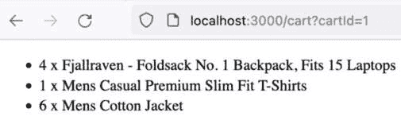

图 5.10：已加载购物车 1 并显示内容的购物车页面

我们还可以通过 `cartId=3` 查询参数加载 `/carts` 页面，并查看购物车 3。

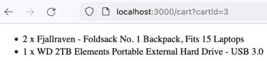

图 5.11：已加载购物车 3 并显示内容的购物车页面

我们现在已经看到了如何按需渲染购物车页面；我们提到的一个非常适合构建时预渲染（即静态站点生成）的页面是 `products/[id]` 页面。为了渲染此页面，我们需要提供 Next.js 需要尝试预渲染的“路径”，因为 `[id]` 是动态的。

以下图表展示了 `getStaticPaths` 和 `getStaticProps` 之间的交互方式。简而言之，`getStaticPaths` 返回一个“路径”列表；然后对路径列表中的每个项目调用 `getStaticProps`，并可以执行相关的 I/O 调用来提供页面的 props。

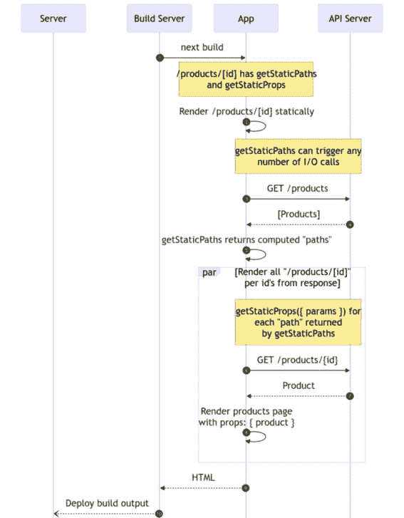

图 5.12：使用 getStaticPaths 和 getStaticProps 的 Next.js 预渲染序列图

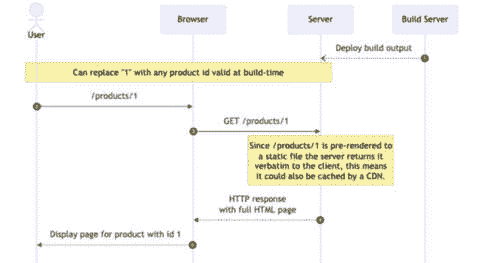

图 5.13：对预渲染的 Next.js 应用程序请求的序列

在我们的示例 Next.js 应用程序中，我们可以创建一个 `pages/products/[id].js` 文件，并包含以下 `getStaticPaths` 和 `getStaticProps` 函数：

```js
export async function getStaticPaths() {
  const products = await fetch('https://fakestoreapi.com/
    products')
    .then((res) => res.json())
    .then((json) => json);
  const paths = products.map((product) => ({
    params: { id: String(product.id) },
  }));
  return { paths, fallback: false };
}
```

`paths` 生成的一个特点是，我们将 `product.id` 从数字转换为字符串，因为 `[id]` 路径参数需要是字符串。否则，Next.js 会报错 `Error: A required parameter (id) was not provided as a string received number in getStaticPaths for /``products/[id]`。

`getStaticProps` 接收包含在 `getStaticPaths` 返回的对象中的 `params` 对象，并进一步进行 `fetch` 调用来通过 ID 加载产品。最后，它为 `Page` 组件返回 `product`：

```js
export async function getStaticProps({ params }) {
  const product = await fetch(
    `https://fakestoreapi.com/products/${params.id}`
  ).then((res) => res.json());
  return {
    props: {
      product,
    },
  };
}
```

我们的 `ProductPage` 组件可以如下所示，其中我们使用 `product.title` 既是页面的标题也是页面 `h2` 元素的内容。从这里，我们可以显示产品响应中包含的任何内容，包括价格和库存信息以及图片：

```js
import React from 'react';
import Link from 'next/link';
import Head from 'next/head';
export default function ProductPage({ product }) {
  return (
    <>
      <Head>
        <title>{product.title}</title>
      </Head>
      <div>
        <Link href={'/products'}>Back</Link>
        <h2>{product.title}</h2>
      </div>
    </>
  );
}
```

当我们运行 `next build` 时，构建将花费更长的时间，因为每个 `products/[id]` 页面都需要向 `fakestoreapi.com` 发送请求。请注意，`products/[id]` 页面被标记为 `SSG`。我们还看到生成的静态页面数量增加到 24，以及 `products/[id]` 页面的截断子集：

```js
npx next build
info  - Linting and checking validity of types
info  - Creating an optimized production build
info  - Compiled successfully
info  - Collecting page data
info  - Generating static pages (24/24)
info  - Finalizing page optimization
Route (pages)                              Size     First Load JS
┌ ○ /                                      464 B          75.9 kB
├ ○ /404                                   182 B          73.2 kB
├ λ /cart                                  445 B          73.5 kB
├ ● /products                              426 B          75.9 kB
└ ● /products/[id]                         383 B          75.9 kB
    ├ /products/1
    ├ /products/2
    ├ /products/3
    └ [+17 more paths]
+ First Load JS shared by all              73.1 kB
  ├ chunks/framework-fcfa81c6fe8caa42.js   45.2 kB
  ├ chunks/main-7039e34bfb6f1a68.js        26.9 kB
  ├ chunks/pages/_app-c7a111f3ee9d686c.js  195 B
  └ chunks/webpack-8fa1640cc84ba8fe.js     750 B
λ  (Server)  server-side renders at runtime (uses getInitialProps or getServerSideProps)
○  (Static)  automatically rendered as static HTML (uses no initial props)
●  (SSG)     automatically generated as static HTML + JSON (uses getStaticProps)
```

在使用 `next start` 构建并启动服务器后，当我们加载 `/products/1` 路径时，我们看到产品 1 的名称。


图 5.14：/products/1 内容

当我们加载 `/products/8` 路径时，我们看到产品 8 的名称。

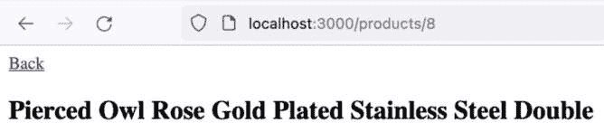

图 5.15：/products/8 内容

我们现在已经看到了如何利用 Next.js 的功能，自动静态渲染页面而不进行数据获取，`getStaticProps` 和 `getStaticPaths` 在构建时渲染具有动态内容和动态路径的页面，以及这些方法与 `getServerSideProps` 的对比。

接下来，我们将深入探讨如何在客户端重新激活服务器端渲染的 React 页面。

# 页面激活策略

如我们在本章第一部分所见，React 提供了在服务器和客户端渲染应用程序的原语。然而，我们只看了只进行客户端或服务器端渲染的示例。React 框架（如 Next.js）的一个关键特性是它们允许您无缝地在静态、客户端和服务器端渲染之间切换。我们将探讨如何使用 React 原语实现这一点。

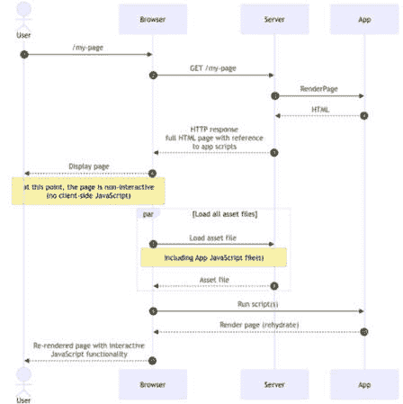

图 5.16：一个服务器端渲染并在客户端随后重新激活的页面的序列图

我们将首先通过添加一个 `ClientCounter` 组件来扩展我们的 React 客户端/服务器端渲染的 `app.jsx`。事件处理器是观察交互原语的最简单方法之一。我们的 `ClientCounter` 组件显示一个计数器，其初始值为 `0`，并且每当点击 `src/client-counter.jsx` 文件时：

```js
import React, { useState } from 'react';
export function ClientCounter() {
  const [count, setCount] = useState(0);
  return (
    <div>
      Dynamic Counter, count: {count}
      <br />
      <button onClick={() => setCount(count + 1)}>
        Add</button>
    </div>
  );
}
```

我们可以在 `app.jsx` 组件中渲染它，如下所示：

```js
import React from 'react';
import { ClientCounter } from './client-counter';
export function App({ type = '' }) {
  return (
    <>
      <div>
        <p>Hello from the {type + ' '}app</p>
        <ClientCounter />
      </div>
    </>
  );
}
```

如果我们构建客户端入口点并在浏览器中加载它，它将正常工作，每次点击 **添加** 都会增加：

```js
npx esbuild client.jsx --bundle --outdir=dist
```

如果我们打开 `index.html` 文件（它没有改变），我们将能够看到计数器并增加它，如下面的截图所示。

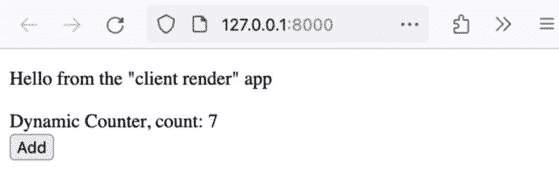

图 5.17：显示增加 7 的 React 客户端渲染计数器

然而，如果我们构建并运行我们的服务器端入口点，组件仍然保持在 0：

```js
npx esbuild server.js --bundle --platform=node --outdir=dist
```

然后我们可以使用以下命令启动服务器：

```js
node dist/server.js
```

如以下截图所示，无论我们点击 **添加** 多少次，组件只显示 **0**。

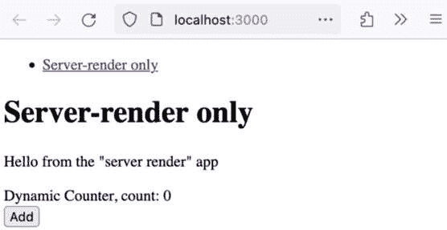

图 5.18：React 服务器端渲染不允许交互式计数组件，尽管多次点击添加按钮，计数仍然显示为 0

为了“激活”我们的服务器端渲染页面，我们可以创建一个新的入口点，`rehydrate.jsx`。它使用 `react-dom/client` 的 `hydrateRoot` 函数在包含我们的应用程序的元素上：

```js
import React from 'react';
import ReactDOM from 'react-dom/client';
import { App } from './src/app';
ReactDOM.hydrateRoot(
  document.querySelector('#app'),
  <App type={`"server render"`} />
);
```

我们将使用 `esbuild` 打包重新激活的入口点，类似于之前的入口点：

```js
npx esbuild rehydrate.jsx --bundle --outdir=dist
```

一旦我们的新 `dist/rehydrate.js` 文件构建完成，我们需要在我们的服务器端渲染应用程序中使用它。我们修改 `server.js` 以静态服务 `dist`，这意味着 `dist/rehydrate.js` 可用作为 `rehydrate.js`。然后我们创建一个新的 `GET` 路由，`/rehydrate`。此路由返回之前看到的导航元素，但现在应用程序还有一个将加载 `rehydrate.js` 的脚本：

```js
// no changes to other routes
app.use(express.static('./dist'));
app.get('/rehydrate', (_req, res) => {
  res.send(`
    <!DOCTYPE html>
    ${renderNav()}
    <h1>Server-render with client-side rehydration</h1>
    <div id="app">${serverRenderApp()}</div>
    <script src="img/rehydrate.js"></script>
  `);
});
// no changes to server startup
```

我们还在 `nav.jsx` 中包含了 `/rehydrate`，现在看起来如下：

```js
import React from 'react';
export function Nav() {
  return (
    <ul>
      <li>
        <a href="/">Server-render only</a>
      </li>
      <li>
        <a href="/rehydrate">Server-render with client-side
          rehydration</a>
      </li>
    </ul>
  );
}
```

然后，我们可以重新构建我们的入口点并启动服务器。当我们导航到 `/rehydrate` 时，计数器是交互式的，我们看到导航和 `h1` 是在服务器端渲染的。


图 5.19：重新激活的服务器端渲染应用程序允许客户端计数器的交互式使用，此处显示计数为 5

我们现在已经看到了如何重新激活服务器端渲染的 React 应用程序，接下来我们将深入了解常见的 React 重新激活问题。

## 常见的 React 重新激活问题

重新激活有一些关键陷阱。

在应用程序中看到以下运行时环境检测代码是很常见的。

```js
export const isServer = () => typeof window ===
  'undefined';
```

假设我们将 `isServer` 放在 `src/rendering-utils.js` 文件中；我们可以如下使用它来条件性地渲染内容，例如 `'from client'` 或 `'not from client'`，或者在服务器端渲染时完全避免渲染 `ClientCounter`：

```js
import React from 'react';
import { ClientCounter } from './client-counter';
import { isServer } from './rendering-utils';
export function App({ type = '' }) {
  return (
    <>
      <div>
        <p>Hello from the {type + ' '}app</p>
        <p>Rendering: {isServer() ? 'not from client' :
           'from client'}</p>
        {!isServer() && <ClientCounter />}
      </div>
    </>
  );
}
```

在纯粹的服务器端渲染用例中，这运行得很好，我们显示 `'not from client'` 并隐藏 `ClientCounter`。

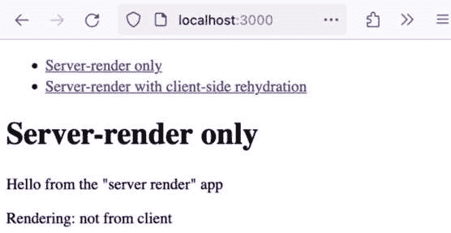

图 5.20：isServer 检测成功用于仅服务器端渲染

初看起来，它似乎适用于服务器端渲染后跟客户端侧重新激活的使用案例。它显示 **from client** 并显示客户端计数器组件。


图 5.21：isServer 检测是否适用于服务器端渲染后重新激活

然而，如果我们查看控制台，我们可以看到我们有一些错误。

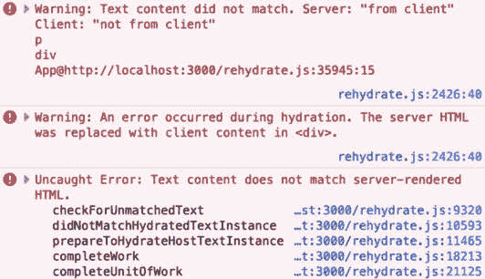

图 5.22：重新激活期间的控制台错误

问题在于客户端渲染与服务器端渲染不匹配 - 例如，`ReactDOM.rehydrateRoot` 预期应用程序在服务器和客户端以相同的方式渲染。在这种情况下，React 会回退到完全的客户端渲染（**在激活过程中发生错误。服务器端 HTML 被客户端内容替换在 <div> 中。**），这意味着服务器端渲染的 HTML 完全被丢弃。

为了解决这个问题，需要更好地检测服务器与客户端。简单的检测将涉及使用`useEffect`的钩子。`useClientRenderingOnly`函数将在应用程序运行我们的`useEffect`之前始终为`false`，而`useEffect`只在客户端运行：

```js
export function useClientRenderingOnly() {
  const [hasMounted, setHasMounted] = useState(false);
  useEffect(() => {
    setHasMounted(true);
  });
  return hasMounted;
}
```

它可以在`src/client-counter.jsx`中使用，而不是在`app.jsx`中使用`isServer`：

```js
import React, { useState } from 'react';
import { useClientRenderingOnly } from './rendering-utils';
export function ClientCounter() {
  const isClientRendering = useClientRenderingOnly();
  const [count, setCount] = useState(0);
  if (!isClientRendering) return null;
  // no change to JSX return
}
```

`app.jsx`可以变成以下形式，利用`isClientRendering`来显示`'from client'`和`'not from client'`：

```js
import React from 'react';
import { ClientCounter } from './client-counter';
import { isClientRendering } from './rendering-utils';
export function App({ type = '' }) {
  return (
    <>
      <div>
        <p>Hello from the {type + ' '}app</p>
        <p>
          Rendering: {isClientRendering ? 'from client' :
            'not from client'}
        </p>
        <ClientCounter />
      </div>
    </>
  );
}
```

在仅服务器端渲染的情况下，这可以工作，在重新激活的情况下，我们现在知道是否在服务器或客户端显示某些内容，而不会出现重新激活问题。

其他导致重新激活错误的常见问题包括无效的标记（某些 HTML 标签不应该放在其他 HTML 标签内）。

React 提供了一种额外的渲染方法，允许服务器通过流式传输更早地开始向客户端返回数据。

## React 流式服务器端渲染

React 流式服务器端渲染利用流式传输，使得服务器可以更早地开始向浏览器返回数据（流中的数据块而不是一次性响应）。这也意味着浏览器可以更早地开始渲染工作。

流式传输的一个主要缺点是，它相对于非流式服务器端渲染的一个关键优势是它支持新的 suspense 原语。这个原语由特定的库和框架支持，并且很难使用 React 原语来展示。

根据 React 关于 suspense 使用的文档（[`react.dev/reference/react/Suspense#usage`](https://react.dev/reference/react/Suspense#usage)）：

不使用有偏见的框架进行启用 Suspense 的数据获取尚不支持。实现启用 Suspense 的数据源的要求不稳定且未记录。将在 React 的下一个版本中发布一个官方 API，用于将数据源与 Suspense 集成。

在重新激活 React 流式服务器渲染的页面时，我们需要替换整个文档，因此我们将创建一个新的`<Page>`组件，它将是一个完整的页面。我们还将创建一个用于客户端的`streaming-rehydrate.jsx`入口点。

以下是一个新的`src/page.jsx`文件的内容。为了进行流式服务器端渲染，需要包括`html`和`head`在内的完整页面：

```js
import React from 'react';
import { App } from './app';
import { Nav } from './nav';
export default function Page() {
  return (
    <html>
      <head>
        <title>Streaming</title>
      </head>
      <body>
        <Nav />
        <h1>Server-render with streaming</h1>
        <div id="app">
          <App type={`"streaming server render"`} />
        </div>
      </body>
    </html>
  );
}
```

我们的`streaming-rehydrate.jsx`入口点与我们的`rehydrate.jsx`入口点非常相似，唯一的区别是它激活`document`，而不是具有`app` ID 的元素。这是由于上述流式服务器端渲染的限制——整个文档必须由 React 控制：

```js
import React from 'react';
import ReactDOM from 'react-dom/client';
import Page from './src/page';
ReactDOM.hydrateRoot(document, <Page />);;
```

我们将使用以下方式构建 JavaScript 的入口点：

```js
npx esbuild streaming-rehydrate.jsx.jsx --bundle --outdir=dist
```

我们现在可以开始在`src/server-rendering.jsx`中处理服务器端渲染。我们创建了一个新的`serverRenderAppStream`函数，它接受一个 Express/Node.js 的`res`对象作为参数。它调用`ReactDOMServer.renderToPipeableStream`函数，使用`Page`组件，并将`bootstrapScripts`设置为包含我们的`streaming-rehydrate.js`入口点：

```js
import React from 'react';
import ReactDOMServer from 'react-dom/server';
// no changes to other imports
import Page from './page';
export function serverRenderAppStream(res) {
  const { pipe } = ReactDOMServer.renderToPipeableStream
    (<Page />, {
    bootstrapScripts: ['./streaming-rehydrate.js'],
  });
  pipe(res);
}
```

在`server.js`中，我们可以为`/streaming`路径创建一个新的`GET`路由，该路由简单地调用`serverRenderAppStream`函数，并按照 Express 路由处理器的定义使用`res`对象：

```js
// no change to other imports
import {
  // no change to other imports
  serverRenderAppStream,
} from './src/server-render';
// no change to other routes
app.get('/streaming', (_req, res) => {
  serverRenderAppStream(res);
});
// no change to startup logic
```

我们还将`/streaming`路由添加到`src/nav.jsx`中：

```js
import React from 'react';
export function Nav() {
  return (
    <ul>
      {/* no change to the other li elements */}
      <li>
        <a href="/streaming">Server-render with streaming
          </a>
      </li>
    </ul>
  );
}
```

我们现在可以加载`/streaming`页面并看到它的实际效果。

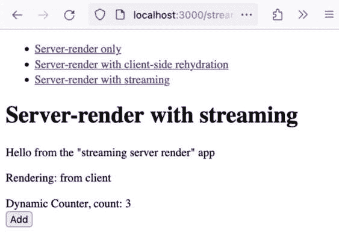

图 5.23：带有重新加湿的 React 流式服务器端渲染

我们现在已经看到了如何实现带有重新加湿的 React 流式服务器端渲染。

# 摘要

在本章中，我们介绍了如何通过更深入地理解渲染和页面加湿策略，可以帮助我们使用 React 提供最优和可扩展的 Web 用户界面。

客户端和服务器渲染各有优缺点，它们是互补的。客户端渲染启动时间较长，但提供了更多的交互性，并且不需要太多的服务器端计算能力；服务器渲染可以更快地返回内容，但需要基础设施，并且不提供相同的交互性水平。

Next.js 的静态站点生成功能可以与经典服务器端渲染结合使用，根据访问模式和内容更改的频率，明智地决定一组页面的渲染策略。

最后，页面加湿和重新加湿与流式服务器端渲染结合，弥合了服务器和客户端渲染之间的差距，使得两者的优点都能包含在一个页面中。

现在我们已经熟悉了渲染和页面加湿策略，我们可以在下一章中探讨使用“区域”和“岛屿”架构实现微前端。
