# 第六章：微前端、区域和岛屿架构

微前端架构，特别是“区域”和“岛屿”模式，与后端系统的微服务架构相呼应。有了合适的工具，它们允许多个团队在单一产品上进行高速开发。本章介绍的技术探讨了系统级交互和集成模式。每个系统都可以利用创建、结构、行为和反应视图库模式，分别如第一章、第二章、第三章和第四章所述。微前端架构有助于将系统连接起来，而不是在它们内部更好地组织代码。

本章将涵盖以下主题：

+   微前端解决的问题空间，包括一些常见方法和它们的缺点

+   利用 Next.js 功能构建“区域”微前端设置

+   使用**is-land**包在 Preact 和 Vue.js 中实现“岛屿”微前端设置

到本章结束时，你将能够讨论权衡并交付现代 JavaScript 微前端方法。

# 技术要求

你可以在 GitHub 上找到本章的代码文件：[`github.com/PacktPublishing/Javascript-Design-Patterns`](https://github.com/PacktPublishing/Javascript-Design-Patterns)

# 微前端概述

微前端设置是指多个前端应用程序或组件的组合。这类似于微服务，其中微前端将封装功能子集，或“边界上下文”。

例如，在电子商务环境中，我们可能会有“搜索”微前端和“购物车”或“结账”微前端。

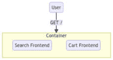

图 6.1：简化的微前端图

我们现在已经介绍了微前端架构；接下来，我们将看到微前端提供的关键优势。

## 关键优势

微前端模式的好处与微服务的好处相似。它们通常出现在开发的社会技术方面。

每个微前端可以使用不同的技术集，这意味着可以选择适合工作的正确工具。一个非常关注页面加载性能的页面可能使用与管理员界面或高流量 SVG 可视化页面不同的堆栈。

可提供增量升级，并且可以在将更改部署到所有组件之前在一个组件中进行测试。

不同微前端的发布不是锁定在一起的。这有助于在扩展时，每个团队可能都在一个或多个微前端上工作。它们可以独立于其他团队发布，这意味着节奏可以加快；这与我们将讨论的最后一个优势相关。

每个微前端都可以有自己的代码库，并且可以严格实施“边界上下文”。

## “经典”微前端模式

我们将涵盖创建微前端设置的五种不同的“经典”方法。

第一种方法是使用服务器端包含的“容器应用”。这利用了一个服务器，它会从不同的微前端获取内容并将它们拼接在一起。以下图示说明了这一点，其中容器应用加载了一个“购物车”HTML 部分和一个“搜索”HTML 部分，并将它们注入到自己的模板中，然后再返回给客户端。

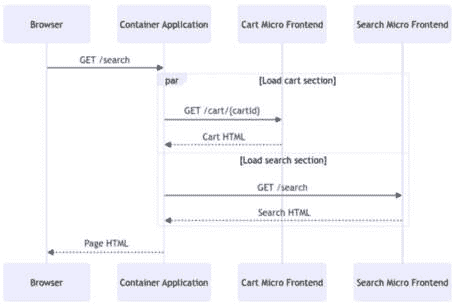

图 6.2：“容器应用”序列

服务器端包含或“容器应用”的好处是，每个微前端的部署是解耦的（例如，我们可以部署购物车的更改，而不必部署搜索部分或容器的更改）；此外，它完全不受技术限制，因为微前端甚至不需要使用 JavaScript。

接下来我们将看到的是另一种“经典”方法，它使用“构建时”组合，其中每个微前端都是一个包，通常是 npm 包（Node.js/JavaScript 工具链的一部分）。然后，每个包在需要的地方导入，并在“构建时”进行组合（即每个应用程序打包用于部署时）。

“构建时”组合的关键缺点是，现在发布需要部署级联。为了使所有应用程序都能接收到“购物车”的更新，我们需要更新版本并发布所有应用程序。

最后三种“经典”方法在概念上相似，尽管使用了不同的技术。它们都是“运行时集成”；技术包括 iframe、JavaScript 和 Web 组件。运行时集成意味着微前端从浏览器请求微前端资源。

在 iframe 的情况下，这涉及到使用 iframe 的`src`属性。这种做法的主要缺点是，每个微前端都需要防范所有公开网络攻击。更重要的是，如果操作不当，允许应用内容的 iframe 可能导致点击劫持漏洞，因此存在安全影响。

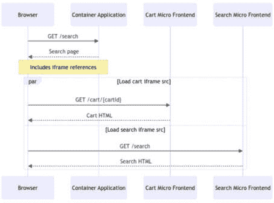

图 6.3：使用 iframe 的运行时集成

在 JavaScript 或 Web 组件“运行时”集成的情况下，组合是通过加载 JavaScript 文件来管理的。这比使用 iframe 更理想，因为将 JavaScript 提供给浏览器比允许内容被框架化有更少的潜在安全影响。在 Web 组件的情况下，你会在 HTML 的主体中引用 Web 组件，并且还需要引用运行 Web 组件所需的脚本。

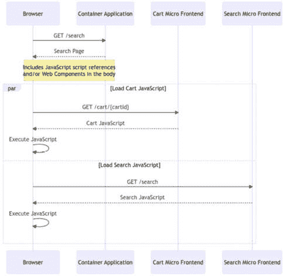

图 6.4：使用 JavaScript 或 Web 组件的运行时集成

运行时集成对用户体验有性能影响，如图表之间“服务器端包含”和“运行时集成”的差异所示。在“服务器端包含”的情况下，服务器在返回给客户之前会组合一个完整的应用程序。在“运行时集成”中，服务器返回给浏览器的是本质上是对资源的引用，然后浏览器必须加载这些资源。

当我们探索微前端的“区域”和“岛屿”现代实现时，我们将遇到这些技术共同使用的几个实例。

## 微前端世界中的其他关注点

类似于微服务架构，允许不同团队以自己的方式构建的微前端可以是一种优势，也可能是一种劣势。

最后，大多数前端系统最终都需要与后端服务进行通信。如何做这仍然是一个待定的问题——每个团队是否应该部署自己的**前端后端**（**BFF**），是否应该部署一个单一的网关来暴露相关的服务端点，或者它应该是一个将服务封装在不同查询系统（如 GraphQL）中的网关？

微前端也给测试带来了挑战。当每个微前端都有自己的测试套件时，我们如何可靠地在“用户旅程”级别进行测试，这可能涉及多个微前端？

与关于使用哪种后端集成的问题类似，还有一个与共享样式和潜在组件库相关的挑战。进行微前端开发的团队可能会在某个技术（如 React、Vue 等）上实现标准化，以获得组件库的好处。在多种技术中维护组件库更为困难，但公司有时会选择这种方式来支持工程师选择合适的工具。

微前端的一个大挑战是如何保持它们的性能。即使在所有团队都使用相同技术的案例中，同一依赖项也可能在微前端之间重复，这会影响性能。当技术和构建和部署流程出现分歧（微前端是可能的）时，这个问题会加剧。

例如，与“服务器端包含”相关的另一个性能问题是，页面将只以页面中最慢的组件的速度加载。在运行时集成中，这不太成问题，但每个微前端可能会影响整个页面的性能，这在使用微前端构建系统时是一个相关的问题。

最后，正如我们关于测试微前端所暗示的，它会导致操作和治理复杂性。例如，环境不匹配问题更难检测。在多个微前端的情况下，运行或部署用于开发或测试的完整环境比单体应用程序更复杂。

现在我们已经定义并对比了微前端的一般优势和劣势以及特定的微前端方法，我们可以看看微前端在现代的实现。在下一节中，我们将探讨利用 Next.js 和“zones”来构建灵活的微前端。

# 使用 Next.js“zones”组合应用程序

Next.js “zones”是一种基于 URL“基本路径”的方法，用于组合 Next.js 应用程序。这允许我们使用 Next.js 构建一个微前端设置。

如下图中所示，这意味着一个电子商务用例，其中用户可能请求四组 URL（`GET /, GET /careers, GET /search, 和 GET /cart/{id}`），`{id}`表示购物车有一个动态段，即请求的购物车 ID。对于`GET /`和`GET /careers`请求，请求首先发送到`root`前端，它直接处理渲染。对于`GET /search`请求，请求发送到`root`前端，它将请求转发到搜索前端。同样，对于`GET /cart/{id}`请求，请求最初发送到`root`前端，它将请求代理到结账前端。

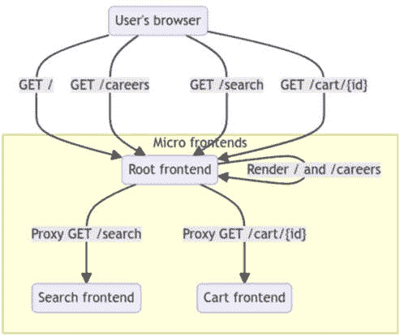

图 6.5：三个应用 Next.js 区域设置的概述流程图

我们现在已经介绍了 Next.js“zones”和我们的实现概述，接下来我们将实现“root app”。

## 根应用程序

根应用程序包含两个页面，`/`（`pages/index.js`）和`/careers`（`pages/careers.js`）。这两个页面都是静态渲染的，`index.js`通过自动静态生成（因为它没有`getServerSideProps`或`getInitialProps`），而`careers.js`通过静态站点生成（因为它有`getStaticProps`）。

`index.js`包含一个标题以及`Head`内容。

```js
import React from 'react';
import Head from 'next/head';
export default function Home() {
  return (
    <>
      <Head>
        <title>Homepage (Root zone)</title>
      </Head>
      <main>
        <h1>Root</h1>
      </main>
    </>
  );
}
```

当我们加载`GET` `/`路径时，我们的根应用程序渲染我们放置其中的`h1`元素，内容为`'Root'`。


图 6.6：根页面的渲染效果

`/careers`页面使用`getStaticProps`从 API 加载角色，并以列表形式显示它们。

我们可以从`pages/careers.js`中的`getStaticProps`函数开始。这个函数从一个“虚假工作”API 加载数据，并返回一个`roles`属性，它包括 API 返回的数据：

```js
export async function getStaticProps() {
  const jobs = await fetch(
    'https://apis.camillerakoto.fr/fakejobs/
      jobs?fulltime=true').then((res) => res.json());
  return {
    props: { roles: jobs },
  };
}
```

接下来，我们将添加一个`CareersPages`组件。它包括带有`title`和`h1`的页面框架。它还会遍历`roles`属性，将其渲染为列表，使用`ul`和`li`：

```js
import React from 'react';
import Head from 'next/head';
export default function CareersPage({ roles }) {
  return (
    <>
      <Head>
        <title>Careers (Root zone)</title>
      </Head>
      <main>
        <h1>Careers</h1>
        <ul>
          {roles.map((role) => {
            return (
              <li key={role.id}>
                {role.title} ({role.country})
              </li>
            );
          })}
        </ul>
      </main>
    </>
  );
}
```

它显示如下。


图 6.7：根区域中的职业页面

`next build`输出显示`index.js`确实被静态渲染，而`/careers`使用静态站点生成：

```js
Route (pages)                              Size     First Load JS
┌ ○ /                                      430 B          77.7 kB
├ ○ /404                                   182 B          77.5 kB
├ λ /api/health                            0 B            77.3 kB
└ ● /careers                               498 B          77.8 kB
+ First Load JS shared by all              77.3 kB
  ├ chunks/framework-4725d5bb117f1d8e.js   45.2 kB
  ├ chunks/main-7a398668474d4dd1.js        31.1 kB
  ├ chunks/pages/_app-ecd5712b2c05cb6a.js  195 B
  └ chunks/webpack-8fa1640cc84ba8fe.js     750 B
λ  (Server)  server-side renders at runtime (uses getInitialProps or getServerSideProps)
○  (Static)  automatically rendered as static HTML (uses no initial props)
●  (SSG)     automatically generated as static HTML + JSON (uses getStaticProps)
```

我们现在已经开始了根应用程序的实现，接下来我们将转向我们的第二个区域，“搜索”区域。

## 添加/search 应用程序

接下来，我们将构建和挂载一个`/search`页面。

`search/pages/index.js` 显示一个输入并在更改时调用 `/search/api/search` 路由：

```js
import React, { useState } from 'react';
import Head from 'next/head';
export default function Home() {
  const [searchResult, setSearchResult] = useState({
    count: 0,
    matches: [],
  });
  return (
    <>
      <Head>
        <title>Search Page (Search zone)</title>
      </Head>
      <main>
        <h1>Search</h1>
        <input
          type="search"
          onChange={async (event) => {
            const data = await fetch(
              `/search/api/search?q=${event.target.value}`
            ).then((res) => res.json());
            setSearchResult(data);
          }}
        />
        <div>
          <h2>Results ({searchResult.count})</h2>
          {searchResult.matches.map((product) => {
            return <div key={product.id}>
              {product.title}</div>;
          })}
        </div>
      </main>
    </>
  );
}
```

要实现 `search/pages/api/search` API 路由，我们创建 `pages/api/search`，它从 `fakestoreapi` 加载产品，并在标题、描述和类别之间找到匹配项：

```js
export default async function handler(req, res) {
  const allProducts = await fetch
    ('https://fakestoreapi.com/products').then(
      (res) => res.json()
  );
  const { q } = req.query;
  const searchQuery = Array.isArray(q) ? q[0] : q;
  const matches = allProducts.filter(
    (product) =>
      product.title.includes(searchQuery) ||
      product.description.includes(searchQuery) ||
      product.category.includes(searchQuery)
  );
  return res.status(200).json({ matches,
    count: matches.length });
}
```

为了使 `search-app/` 在 `search-app/search` 下挂载，我们将在搜索应用程序的 `next.config.js` 中使用 `basePath`：

```js
module.exports = {
  basePath: '/search',
};
```

我们将通过根应用程序的 `next.config.js` 暴露 `search`：

```js
module.exports = {
  async rewrites() {
    return [
      {
        source: '/search/:path*',
        destination: 'http://localhost:3001/search/:path*',
      },
    ];
  },
};
```

然后，我们可以加载 **搜索** 页面，其显示如下：


图 6.8：加载时的搜索页面

搜索功能正常工作——例如，使用 `jacket` 搜索词。

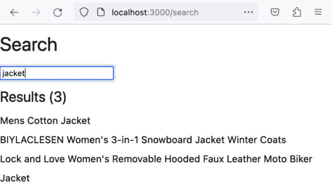

图 6.9：包含夹克搜索词的搜索页面

`/search` 通过自动静态渲染进行静态渲染：

```js
Route (pages)                              Size     First Load JS
┌ ○ /                                      607 B          73.7 kB
├   └ css/776983a5dfcef528.css             271 B
├ ○ /404                                   182 B          73.2 kB
├ λ /api/health                            0 B            73.1 kB
└ λ /api/search                            0 B            73.1 kB
+ First Load JS shared by all              73.1 kB
  ├ chunks/framework-4725d5bb117f1d8e.js   45.2 kB
  ├ chunks/main-ee0b7fc0f7162449.js        26.9 kB
  ├ chunks/pages/_app-ecd5712b2c05cb6a.js  195 B
  └ chunks/webpack-ab5c478f511867a3.js     756 B
λ  (Server)  server-side renders at runtime (uses getInitialProps or getServerSideProps)
○  (Static)  automatically rendered as static HTML (uses no initial props)
```

我们现在已经实现了搜索“区域”，接下来我们将实现结账“区域”。

## 添加 /checkout 应用

我们将在新的 Next.js 应用程序 `pages/cart/[id].js` 下添加一个“查看购物车”页面。

购物车页面从 `fakestoreapi` 加载购物车及其包含的产品，并通过 `CartContents` 组件显示它们。

首先，我们将定义一个 `CartContents` 组件，该组件接受 `cart` 和 `productsById` 属性。然后它遍历 `cart.products`，提取购物车中的产品标题和请求的数量，然后使用 `.toLocaleString` 计算并格式化欧元价格。

我们需要 `cart` 和 `productsById` 的原因是购物车以规范化的数据格式返回，这意味着它只包含购物车特定的信息，不包含任何相关产品的信息，除了产品 ID。因此，我们需要根据产品 ID 进行查找。

我们使用的渲染逻辑是一个无序列表容器（`ul` HTML 元素）和列表项元素（`li` HTML 元素）。我们将标题渲染为 `h3` 标题，其余信息使用 `span` 元素：

```js
import React from 'react';
function CartContents(props) {
  const { cart, productsById } = props;
  return (
    <ul>
      {cart.products.map((product) => {
        const fullProductInformation = productsById
          [product.productId];
        return (
          <li key={product.productId} className=
            "cart-item-product">
            <h3 className="cart-item-product-name">
              {fullProductInformation?.title}
            </h3>
            <span className="cart-item-product-quantity">
              {' '}
              x {product.quantity}
            </span>
            <span className="cart-item-product-price">
              Price:
              {(
                product.quantity *
                  fullProductInformation?.price)
                  .toLocaleString('en', {
                style: 'currency',
                currency: 'EUR',
              })}
            </span>
          </li>
        );
      })}
    </ul>
  );
}
```

现在我们正在渲染购物车的内容，我们将添加到 `CartContents` 的附加功能是显示购物车的总价。

这是通过添加另一个 `li` 实现的，它显示“总计:”并计算总价，使用 `reduce` 对 `cart.products` 进行操作。记住，从之前的代码块中，`cart.products` 是规范化的，这意味着它不包含任何关于产品（例如，其价格）的信息，除了产品的 ID。这意味着我们的 reduce 处理器在 `productsById[product.productId]` 上进行查找，以便访问产品的价格。

一旦我们有了购物车中给定产品的数量和产品的价格，我们只需将它们相乘，然后将数量乘以价格的结果加到累加器上，我们将其初始化为 0。

与购物车项类似，我们使用 `toLocaleString` 将总价格式化为欧元作为 en 本地化的字符串：

```js
// no change to imports
function CartContents(props) {
  // no change to the function body
  return (
    <ul>
      {/* no change to `cart.products` mapping */}
      <li className="cart-item-product">
        <strong className="cart-item-product-price">
          Total:
          {cart.products
            .reduce((acc, curr) => {
              const fullProductInformation = productsById
                [curr.productId];
              return acc + curr.quantity *
                fullProductInformation.price;
            }, 0)
            .toLocaleString('en', {
              style: 'currency',
              currency: 'EUR',
            })}
        </strong>
      </li>
    </ul>
  );
}
```

我们将利用 `getServerSideProps` 来加载购物车，然后从 `fakestoreapi` 加载相关产品。如前述代码块中所述，`fakestoreapi` 的购物车响应是规范化的，因此不包含我们需要的所有产品数据，这就是为什么我们通过 ID 加载产品的原因。

一旦我们有了购物车响应和所有相关的产品响应，我们将处理产品以允许通过 ID 查找它们。最后，`getServerSideProps` 在一个对象的 `props` 属性中返回 `id`（Next.js 上下文中的购物车 ID）、`productsById` 和 `cart`，以便 Next.js 可以将它们传递给我们的页面组件：

```js
// no changes to imports
// no changes to CartContents definition
export async function getServerSideProps(ctx) {
  const { params } = ctx;
  const cartId = params.id;
  const cart = await fetch(`https://fakestoreapi.com/carts
    /${cartId}`).then(
    (res) => res.json()
  );
  if (!cart?.products) {
    return {
      props: {
        id: cartId,
      },
    };
  }
  const productsById = (
    await Promise.all(
      cart.products.map(async (product) => {
        return await fetch(
          `https://fakestoreapi.com/products/$
             {product.productId}`
        ).then((res) => res.json());
      })
    )
  ).reduce((acc, curr) => {
    acc[curr.id] = curr;
    return acc;
  }, {});
  return {
    props: {
      id: cartId,
      cart,
      productsById,
    },
  };
}
```

最后，我们将添加我们的 `GetCartPage` 组件，该组件将接受 Next.js 传递的属性（基于 `getServerSideProps` 的输出），并使用它们来渲染 `CartContents`，以及一个标题和标题：

```js
import Head from 'next/head';
import React from 'react';
// no changes to CartContents definition
export default function GetCartPage({ id, cart, productsById }) {
  return (
    <>
      <Head>
        <title>GetCartPage (Checkout zone)</title>
      </Head>
      <main>
        <h1>GetCartPage (Checkout zone)</h1>
        <CartContents cart={cart} productsById=
          {productsById} />
      </main>
    </>
  );
}
// no changes to getServerSideProps definition
```

为了让结账应用在正确的路径下挂载，我们在其 `next.config.js` 中设置 `basePath`：

```js
module.exports = {
  basePath: '/checkout',
};
```

我们还需要修改根应用的 `next.config.js`，以便相关请求被代理到结账应用：

```js
module.exports = {
  async rewrites() {
    return [
      // no change to other entries
      {
        source: '/checkout/:path*',
       destination:'http://localhost:3002/checkout/:path*',
      },
    ];
  },
};
```

我们可以加载 `/checkout/cart/2`，以下内容将显示：

![图 6.10：结账区域中加载了购物车 2 的购物车/[id] 页面](img/B19109_06_10.jpg)

图 6.10：结账区域中加载了购物车 2 的购物车/[id] 页面

在构建输出中，我们可以看到 `/cart/[id]` 是服务器端渲染的，因为它使用了 `getServerSideProps`：

```js
Route (pages)                              Size     First Load JS
┌ ○ /                                      445 B          73.5 kB
├ ○ /404                                   182 B          73.3 kB
└ λ /cart/[id]                             3.95 kB          77 kB
λ  (Server)  server-side renders at runtime (uses getInitialProps or getServerSideProps)
○  (Static)  automatically rendered as static HTML (uses no initial props)
```

我们现在已经看到了如何将结账“区域”添加到我们的微前端设置中，接下来我们将介绍微前端“区域”架构的益处，特别是关于在增长团队中工作的益处。

## 优势/支持团队扩展

使用带有 `basePath` 的“区域”意味着 Next.js 的功能可以无缝工作。例如，客户端过渡和 `getServerSideProps` 重新获取功能正常工作（Next.js 加载 `{basePath}/_next/...`），以及我们在搜索示例中使用的 API 路由。

添加新页面也“只需如此”；在 `/cart/[id]/checkout` 的新页面不需要对根应用进行任何更改即可对用户可用。

我们只有在需要添加一个全新的应用（顶级路径）时才会更改根应用配置——例如，如果我们想要一个管理应用，我们就需要创建它并配置根 `next.config.js`。

在流量很大且我们想要更有效地使用资源的情况下，我们不需要使用 `root` 应用将所有请求转发到其他微前端；我们可以利用任何反向代理（如 NGINX 和 Caddy）或甚至基础设施提供商的 CDN（例如 Fastly、Akamai、Cloudflare 和 AWS）来配置，以便将所有来自 `domain.tld/{path}/*`（以 `{path}` 开头的 `domain.tld` 的所有请求）转发到特定的源。

通过拥有一系列都使用 Next.js 的应用，可以在根应用中进行实验性页面构建，然后将其扩展为完整的 Next.js 应用。

为了调试和沟通目的，在 URL 中包含应用程序名称可以帮助在与技术团队和非技术团队成员讨论应用程序和页面时。例如，即使是非技术团队成员也会理解“URL 的这个第一部分是应用程序名称。”

使用区域的一个其他好处是，在反向代理传递期间请求不会被重写。例如，在某些配置中，反向代理会接收到`/search`，但在搜索应用程序中加载`/`。这意味着在本地运行搜索应用程序与代理时存在细微的不匹配。

在这里使用了 Next.js 的所有系统，但并非必需；大多数工具都可以配置为从“子路径”或 Next.js 所说的`basePath`提供服务。

## Next.js 区域的缺点

在我们展示的设置中，主要缺点是“框架”包在应用程序之间没有共享。这意味着当用户从一个区域移动到另一个区域时，他们会加载不同版本的 Next.js、React 和 React DOM。这不太理想，但可能适用于许多用例。当这不适用时，可以部署模块联邦或其前身，供应商包。

另一个缺点是，在本地开发时，使用`next dev`并使用根应用程序代理请求，我们会失去诸如快速刷新/实时重新加载等特性。这可以通过在本地开发期间直接访问微前端来解决这个问题。

现在我们已经了解了如何使用 Next.js 基于路径的路由、代理和基本 URL 功能来提供“区域”实现，其中微前端各自服务于 URL 的不同子集，我们现在将探讨如何使用`is-land`包中的“岛屿”架构来提供微前端应用程序，使得所有微前端都显示在单个页面上。微前端将使用 Preact 和 Vue.js 构建。

# 使用“岛屿”架构扩展性能敏感页面的规模

根据 is-land 库文档([`github.com/11ty/is-land`](https://github.com/11ty/is-land))，is-land 是*“一种新的以性能为导向的方法，用于向您的网站添加交互式客户端组件。或者，更技术性地：一个框架无关的局部水合岛屿架构实现。”*

让我们先看看“岛屿架构”是什么。岛屿架构是一种模式，其中页面主要是由服务器渲染的，并且只在必要时添加交互性。这减少了页面加载时间，以及传递的 JavaScript 数量（JavaScript 仅用于特定的客户端交互）。这与 JavaScript 应用程序“接管”整个页面的情况形成对比——例如，在 Next.js 应用程序中，客户端 JavaScript 将重新挂载已由服务器渲染的内容，这意味着默认情况下在客户端运行的 JavaScript 的最小量是 Next.js 客户端代码 + React + React DOM。

以下图显示了如何利用岛屿架构来提供微前端体验。

每个岛屿都负责从服务器获取自己的数据。

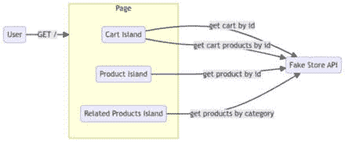

图 6.11：由岛屿组成的 app 页面

岛屿架构中的一个额外元素是在用户交互时加载 JavaScript – 例如，在点击、悬停或元素滚动到视图中时。`is-land`包提供了创建具有这些类型的水合策略的岛屿的原始方法。

## 使用 is-land 设置的岛屿

我们将探讨如何实现包含立即初始化的产品岛屿、交互时初始化的购物车岛屿以及滚动到视图中时初始化的相关产品岛屿的三岛屿页面。

我们的示例将演示在没有打包器的情况下使用所有工具的用法。我们将使用 Preact 与*htm*（因为我们没有 JSX 编译管道）以及 Vue 与 DOM 模板。

为了在我们的脚本中启用简单的导入，我们将利用导入映射，从[unpkg.com](http://unpkg.com) CDN 加载：

```js
<script type="importmap">
  {
    "imports": {"@11ty/is-land/is-land.js":
      "https://unpkg.com/@11ty/is-land@4.0.0/is-land.js",
      "htm/preact": "https://unpkg.com/htm@3.1.1/
         preact/index.module.js",
      "htm": "https://unpkg.com/htm@3.1.1/dist/htm.mjs",
      "preact": "https://unpkg.com/preact@10.15.1/
         dist/preact.mjs",
      "vue": "https://unpkg.com/vue@3.2.36/dist
        /vue.esm-browser.prod.js"
    }
  }
</script>
```

为了初始化岛屿，我们将在页面末尾包含`is-land`包：

```js
<script type="module">
  import '@11ty/is-land/is-land.js';
</script>
```

我们现在已经介绍了将要构建的页面，并配置了`is-land`在页面加载时初始化，接下来我们将实现产品岛屿。

## 产品岛屿

我们将使用 Vue 构建我们的产品岛屿。

第一步是创建一个`<is-land>`元素和脚本。

我们设置`on:visible`，以便当元素在视口中时，岛屿的内容由`is-land`初始化；由于我们的 HTML 中只包含产品岛屿，这将发生在页面加载时。

我们将创建一个 Vue 应用，在`mount`时向`fakestoreapi.com`发起 API 调用以根据查询参数获取产品。在`fetch` API 调用周围，我们将设置`this.loading = true`（在 API 调用开始之前）和`this.loading = false`（当 API 调用完成时）。

Vue 应用的数据方法将从 URL 查询字符串中读取`productId`，将加载设置为`true`，并将`product`设置为空对象字面量（`{}`）：

```js
<is-land on:visible>
  <div id="vue-product-island"></div>
  <template data-island>
    <script type="module">
      import { createApp } from 'vue';
      createApp({
        async mounted() {
          this.loading = true;
          const product = await fetch(
            `https://fakestoreapi.com/
              products/${this.productId}`
          ).then((res) => res.json());
          this.product = product;
          this.loading = false;
        },
        data: () => ({
          productId:
            new URLSearchParams(window.location.search).
              get('productId') || '1',
          loading: true,
          product: {},
        }),
      }).mount('#vue-product-island');
    </script>
  </template>
</is-land>
```

现在数据已加载，我们可以专注于模板；我们将渲染标题、描述和其他产品信息：

```js
<is-land on:visible>
  <div id="vue-product-island" class="product-container">
    <h2 v-text="product.title"></h2>
    <p v-text="product.description"></p>
    <p v-cloak>
      <span
        v-text="product.price?.toLocaleString('en', {
          style: 'currency', currency: 'EUR'})"
      ></span>
      <br /><span v-text="product?.rating?.rate">
        </span>/5.0 (<span
        v-text="product?.rating?.count"
      ></span
      >)
    </p>
    
  </div>
  <style>
    .product-container {
      min-height: 100vh;
      border-bottom: solid 1px black;
    }
    [v-cloak] {
      display: none;
    }
  </style>
  <template data-island>
    <style>
      .product-image {
        min-width: 320px;
        display: block;
        margin: auto;
      }
    </style>
    <!-- no change to the script -->
  </template>
</is-land>
```

当我们使用`productId=1`或没有`productId`（因为它已默认）加载此页面时，我们看到以下输出：

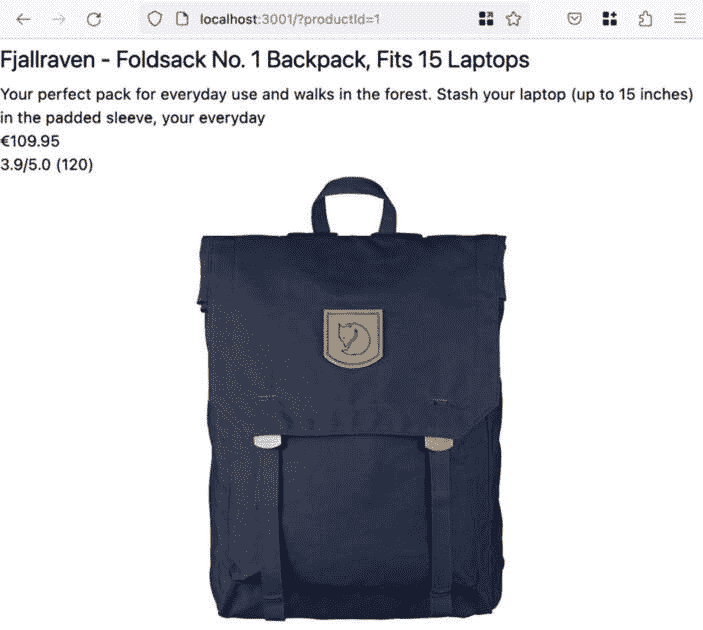

图 6.12：在产品岛屿中显示 ID 为 1 的产品

我们现在已经看到了如何使用`is-land`和 Vue 实现产品岛屿。接下来，我们将构建购物车岛屿。

## 购物车岛屿

再次，我们将从一个`is-land`元素开始，这次是`on:interaction`，这意味着岛屿只有在用户点击它时才会初始化（我们将显示一个按钮供他们点击）：

```js
<is-land on:interaction>
  <div id="preact-cart-island">
    <button>My Cart</button>
  </div>
</is-land>
```

接下来，我们将构建一个`CartContainer`组件，它将使用 Preact 挂载。

`CartContainer` 从 `fakestoreapi.com` 加载购物车和产品信息，并将其存储在状态中，以便 `CartContents` 组件进行渲染：

```js
<is-land on:interaction>
  <div id="preact-cart-island">
    <button>My Cart</button>
  </div>
  <template data-island>
    <script type="module">
      import { html, render } from 'htm/preact';
      import { useState, useEffect } from 'preact/hooks';
      function CartContents() {
        // empty for now
        return null;
      }
      function CartContainer(props) {
        const cartId = props.id ?? 1;
        const [open, setOpen] = useState(true);
        const [isLoading, setIsLoading] = useState(false);
        const [cartContents, setCartContents] = useState({
          cart: null,
          productsById: null,
        });
        useEffect(async () => {
          setIsLoading(true);
          const cart = await fetch(
            `https://fakestoreapi.com/carts/${cartId}`
          ).then((res) => res.json());
          if (!cart?.products) {
            return {
              props: {
                id: cartId,
              },
            };
          }
          const productsById = (
            await Promise.all(
              cart.products.map(async (product) => {
                return await fetch(
                   `https://fakestoreapi.com/
                     products/${product.productId}`
                ).then((res) => res.json());
              })
            )
          ).reduce((acc, curr) => {
            acc[curr.id] = curr;
            return acc;
          }, {});
          setCartContents({
            cart,
            productsById,
          });
          setIsLoading(false);
        }, [cartId]);
        const cartItemCount = cartContents?.
          cart?.products?.length;
        return html`<div>
          <button onClick=${() => setOpen(!open)}>
            My Cart ${cartItemCount !== undefined ? `
              (${cartItemCount})` : ''}
          </button>
          ${open && isLoading && html`<div>
            Loading...</div>`} ${open &&
          !isLoading &&
          cartContents.cart &&
          cartContents.productsById &&
          html`<${CartContents}
            cart=${cartContents.cart}
            productsById=${cartContents.productsById}
          />`}
        </div>`;
      }
      const appContainer = document.querySelector
        ('#preact-cart-island');
      render(
        html`<${CartContainer}
          id=${new URLSearchParams(window.location.search)
            .get('cartId')}
        />`,
        appContainer,
        appContainer
      );
    </script>
  </template>
</is-land>
```

最后，我们将实现 `CartContents`，在其中遍历购物车并渲染定价信息：

```js
<template data-island>
  <script type="module">
    import { html, render } from 'htm/preact';
    // no changes to imports
    function CartContents(props) {
      const { cart, productsById } = props;
      return html`<ul>
        ${cart.products.map((product) => {
          const lineItemQueryParams = new URLSearchParams([
            ['productId', product.productId],
            ['cartId', cart.id],
          ]);
          const fullProductInformation = productsById
            [product.productId];
          return html`<li class="cart-item-product"
            key=${product.productId}>
            ${html`<a href=${'?' +
              lineItemQueryParams.toString()}
              >${fullProductInformation?.title}</a
            >`}
            <span class="cart-item-product-quantity"
              >x ${product.quantity}</span
            >
            <span class="cart-item-product-price">
              Price:${' '}${(
                product.quantity * fullProductInformation
              ?.price).toLocaleString(navigator.language, {
                style: 'currency',
                currency: 'EUR',
              })}
            </span>
          </li>`;
        })}
        <li class="cart-item-product">
          <strong class="cart-item-product-price">
            Total:${' '} ${cart.products
              .reduce((acc, curr) => {
                const fullProductInformation =
                   productsById[curr.productId];
                return acc + curr.quantity *
                  fullProductInformation.price;
              }, 0)
              .toLocaleString(navigator.language, {
                style: 'currency',
                currency: 'EUR',
              })}
          </strong>
        </li>
      </ul> `;
    }
    // no changes to CartContainer component
  </script>
</template>
```

当我们使用 `cartId 1` 和 `productId 1` 加载我们的页面并打开购物车内容时，我们可以看到它渲染了 ID 为 1 的购物车，包括三个项目，它们的数量，每个项目的小计，以及购物车总额。

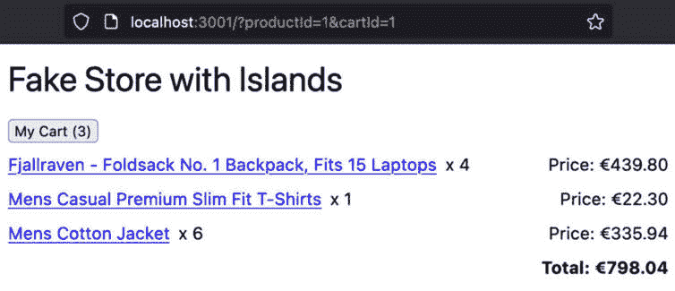

图 6.13：购物车岛上的购物车 1 渲染

我们现在已经使用 Preact 实现了购物车岛，接下来我们将实现一个相关产品岛，它仅在可见时初始化。

## 一个相关产品岛

最后，我们将构建我们的相关产品岛。岛屿本身相当直接，但传达展示的产品及其类别则更为复杂。

我们将构建一个岛屿，等待可见性来初始化自己，再次使用 `on:visible` 但也使用 `on:idle`。这意味着岛屿将在可见或其他处理完成时加载。

如果岛屿接收到 `product-category-load` 自定义事件，它将挂载。

我们将首先构建 `RelatedProducts` 组件，该组件将接收三个属性——`selectedProductId`、`category` 和 `from`。`from` 值将在我们渲染的 `h3` 元素中显示，以说明岛屿如何接收其数据：

```js
<is-land on:visible on:idle id="related-products-island-wrapper">
  <template data-island="">
    <script type="module">
      import { html } from 'htm/preact';
      function RelatedProducts({ selectedProductId,
        category, from }) {
        return html`<div>
          <h3>Related Products (from ${from})</h3>
        </div>`;
      }
    </script>
  </template>
</is-land>
```

接下来，根据类别，我们希望从 `fakestoreapi.com` 加载所有可能的产品。我们将使用 `useState()` 钩子存储值，并且加载相关产品将在组件挂载时完成，使用 `useEffect()` 钩子。

数据获取逻辑如下。我们将使用提供的类别调用 `fakestoreapi.com` 的 API。为了满足“相关产品”的“相关”要求，我们将排除当前显示的产品——即从产品列表中移除 ID 等于 `selectedProductId` 的产品。最后，我们按评分对相关产品进行排序，并使用 `setRelatedProducts` 将前三个项目持久化到状态中：

```js
<is-land on:visible on:idle id="related-products-island-wrapper">
  <template data-island="">
    <script type="module">
      // no changes to other imports
      import { useState, useEffect } from 'preact/hooks';
      function RelatedProducts({ selectedProductId,
        category, from }) {
        const [relatedProducts, setRelatedProducts] =
          useState([]);
        useEffect(async () => {
          const productsInCategory = await fetch(
            `https://fakestoreapi.com/products/category/$
              {encodeURIComponent(
              category
            )}`
          ).then((res) => res.json());
          const topRelatedProductsByRating =
             productsInCategory
            .filter((el) => {
              return el.id !== parseInt(selectedProductId,
                10);
            })
            .sort((a, b) => b.rating.rate – a.rating.rate);
          setRelatedProducts
            (topRelatedProductsByRating.slice(0, 3));
        }, [selectedProductId, category]);
        // no change to returned template
      }
    </script>
  </template>
</is-land>
```

将数据持久化到 `relatedProducts` 后，我们可以现在使用 `.map` 函数渲染它们，该函数返回一个列表。对于每个产品，我们希望显示一个标题，该标题也是一个查看产品的链接，其价格，一张图片，以及评分信息：

```js
<is-land on:visible on:idle id="related-products-island-wrapper">
  <template data-island="">
    <script type="module">
      // no changes to imports
      function RelatedProducts({ selectedProductId,
        category, from }) {
        const [relatedProducts, setRelatedProducts] =
          useState([]);
        // no change to useEffect
        return html`<div>
          <h3>Related Products (from ${from})</h3>
          <ul class="related-product-card-row">
            ${relatedProducts.map((product) => {
              const productSearchParams = new
                URLSearchParams([
                ['productId', product.id],
              ]);
              const currentCartId = new URLSearchParams(
                window.location.search
              ).get('cartId');
              if (currentCartId) {
                productSearchParams.set('cartId',
                  currentCartId);
              }
              return html`<li class="related-product-card">
                <a href=${'?' + productSearchParams
                  .toString()}>
                  <h4>${product.title}</h4>
                  <p>
                    ${product.price.toLocaleString
                      (navigator.language, {
                      style: 'currency',
                      currency: 'EUR',
                    })}
                  </p>
                  
                  <p>${product.rating.rate}/5.0
                    (${product.rating.count})</p>
                </a>
              </li>`;
            })}
          </ul>
        </div>`;
      }
    </script>
  </template>
</is-land>
```

最后，我们将添加逻辑来挂载 `RelatedProducts`，基于对 `product-category-load` 自定义事件的监听器：

```js
<is-land on:visible on:idle id="related-products-island-wrapper">
  <div id="preact-related-products-island">
    <h3>Related Products</h3>
    <div class="related-product-card-row">Loading...</div>
  </div>
  <template data-island="">
    <script type="module">
      import { html, render } from 'htm/preact';
      // no change to preact/hooks import or
         RelatedProducts
      const relatedProductsIslandContainer =
        document.querySelector(
        '#preact-related-products-island'
      );
      function mountRelatedProductsIsland(
        relatedProductsIslandContainer,
        category,
        selectedProductId,
        from
      ) {
        if (category && selectedProductId) {
          render(
            html`<${RelatedProducts}
              category=${category}
              selectedProductId=${selectedProductId}
              from=${from}
            />`,
            relatedProductsIslandContainer,
            relatedProductsIslandContainer
          );
        }
      }
      document.addEventListener('product-category-load',
        (event) => {
        const category = event.detail.category;
        const selectedProductId = event.detail.
          selectedProductId;
        mountRelatedProductsIsland(
          relatedProductsIslandContainer,
          category,
          selectedProductId,
          'custom-event'
        );
      });
    </script>
  </template>
</is-land>
```

现在，我们需要确保从产品岛发出 `product-category-load` 事件。我们需要对 Vue.js 产品岛脚本的“mounted”生命周期钩子进行以下更改：

```js
<script type="module">
  import { createApp } from 'vue';
  createApp({
    async mounted() {
      // no changes
      document.dispatchEvent(
        new CustomEvent('product-category-load', {
          detail: {
            category: this.product.category,
            selectedProductId: this.product.id,
          },
        })
      );
    },
    // no changes to other properties
  });
</script>
```

还有一个条件，即在初始化相关产品岛之前会发出 `product-category-load` 事件；为了解决这个问题，我们将在 `#related-products-island-wrapper` 元素的 `dataset` 属性中存储信息：

```js
<script>
  document.addEventListener('product-category-load',
    (event) => {
    const category = event.detail.category;
    const selectedProductId = event.detail.
      selectedProductId;
    Object.assign(
      document.querySelector('#related-products-island-
        wrapper').dataset,
      { category, selectedProductId }
    );
  });
</script>
```

然后，我们可以将此信息用作挂载条件：

```js
<is-land on:visible on:idle id="related-products-island-wrapper">
  <!-- no changes to template -->
  <script type="module">
    // no changes to the rest of the code
    const { selectedProductId, category } =
      document.querySelector(
      '#related-products-island-wrapper'
    ).dataset;
    mountRelatedProductsIsland(
      relatedProductsIslandContainer,
      category,
      selectedProductId,
      'data-*'
    );
  </script>
</is-land>
```

我们使用 `from` 来说明基于 `dataset` 的方法和基于事件的方法都在不同的场景下工作。

如果我们加载页面并向下滚动到相关产品（最初位于视口外），我们会看到以下内容：

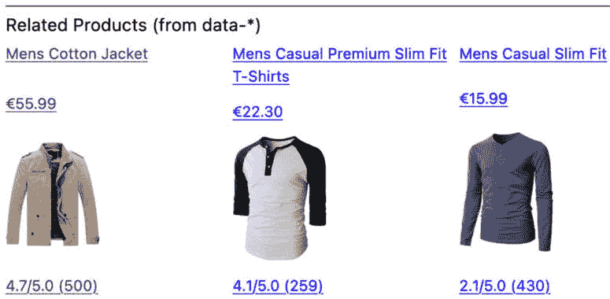

图 6.14：带有来自数据属性的类别信息的相关产品岛屿

如果我们重新加载页面，滚动位置将使得相关产品岛屿可见并立即初始化，这意味着数据直接来自自定义事件。

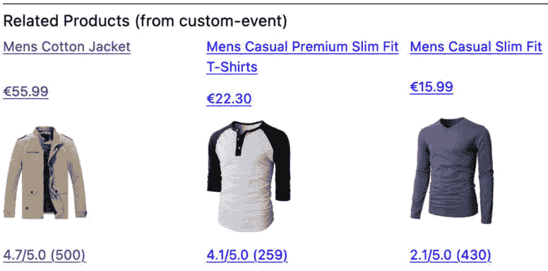

图 6.15：带有来自自定义事件的类别信息的相关产品岛屿

我们现在已经实现了使用 Preact 的相关产品岛屿，并采用了两种读取产品类别的方案。接下来，我们将看到如何结合岛屿架构使用捆绑。

## 与团队一起扩展 - 捆绑岛屿

我们可以将特定岛屿的大部分代码移动到外部文件，然后使用 `esbuild` 等工具将其捆绑在一起。以下使用 `.jsx` 文件为 Preact，但使用 `htm` 复制粘贴现有文件也会有效：

```js
npx esbuild ./src/preact-cart-island.jsx --jsx-import-source=preact --jsx=automatic --bundle --outdir=dist --format=esm --minify
npx esbuild ./src/vue-product-island.js --alias:vue=vue/dist/vue.esm-bundler.js --bundle --outdir=dist --format=esm --minify
npx esbuild ./src/preact-related-products-island.jsx --jsx-import-source=preact --jsx=automatic --bundle --outdir=dist --format=esm --minify
```

输出的文件可以按以下方式使用：

```js
<script type="module" src="./dist/
   preact-cart-island.js"></script>
<script type="module" src="./dist/
  vue-product-island.js"></script>
<script type="module">
  import { mountRelatedProductsIsland } from './dist/
    preact-related-products-island.js';
  // use mountRelatedProductsIsland
</script>
```

每个团队可以通过提供 JavaScript 包和/或模板（模板需要是服务器端包含）来拥有一个或多个岛屿。

## 缺点

在捆绑用例中，我们的两个 Preact 岛屿不共享 Preact 版本，这意味着这个依赖将在浏览器中加载两次。这可以通过供应商捆绑或模块联邦来解决，如前所述。此外，请注意，对于岛屿脚本位于页面本身的初始代码版本，这不是一个问题。

岛屿架构中的挑战主要与组件通信（正如我们通过相关产品岛屿所展示的）以及用于在统一页面上组合模板和脚本的机制有关。

# 摘要

在本章中，我们介绍了微前端、常见方法以及如何使用 Next.js 和 `is-land` 构建高开发速度的系统，同时不损害用户体验。

微前端允许团队在没有损害用户体验的情况下对前端生态系统的不同部分进行强有力的治理。微前端允许更多团队及其技能有效地发挥作用，从而提高整体交付速度。常见的方法包括具有“服务器端包含”的容器应用程序、通过共享包在构建时集成以及运行时集成（例如 iframe、JavaScript 和 Web 组件）。

推荐的 Next.js “zones” 方法允许不同的微前端在不同的“基础路径”上挂载。zones 方法是一种更灵活的服务端包含类型；应用通过反向代理和 URL 被包含。从概念上讲，能够提供多个页面和 API 路由的特定领域应用是大型团队可以利用的强大工具。

最后，我们讨论了通过 `is-land` 包实现的“islands”架构，它展示了使用多个基于 JavaScript 的库为不同组件提供轻量级微前端方法。`is-land` 进行部分激活的能力对最终用户来说是一个明显的优势。岛屿间的通信，岛屿架构的常见挑战，通过包括 `CustomEvent` 和 HTML 数据属性的方法得到了解决。

现在我们已经涵盖了现代微前端方法和“zones”以及“islands”架构，我们将在下一章中探讨在 JavaScript 中进行高效异步编程的模式。
