# 第十章：资产加载策略和主线程之外的代码执行

在应用程序的生命周期中，有些情况下不可避免地需要加载更多 JavaScript。本章详细介绍了减轻此类情况影响的技术。你将了解资产加载优化，如脚本元素的 `async`、`defer` 属性的影响、`type="module"` 的影响以及链接元素的 `rel`（关系）属性的 `preconnect`、`preload` 和 `prefetch` 值。接下来，你将使用 Next.js 的 `Script` 组件及其不同选项进一步优化脚本加载。本章最后将探讨执行 JavaScript 代码离开主线程的原因以及实现此目标的方法。

在本章中，我们将涵盖以下主题：

+   如何通过脚本的自定义 `async` 和 `defer` 属性以及 `preconnect`、`preload` 和 `prefetch` 链接来更细致地控制资产加载

+   在 Next.js 中使用 **Script** 组件及其 **strategy** 属性的进一步优化机会

+   如何以及何时通过 Next.js 和 Partytown 在主线程之外运行代码

到本章结束时，你将具备更多控制资产加载和 Web 环境中 JavaScript 加载与执行技能。

# 技术要求

你可以在 GitHub 上找到本章的代码文件，地址为 [`github.com/PacktPublishing/Javascript-Design-Patterns`](https://github.com/PacktPublishing/Javascript-Design-Patterns)

# 资产加载优化 – 异步、延迟、预连接、预加载和预取

当使用 `script` 来加载和执行 JavaScript 时，我们可以使用 `script` 的 HTML 属性来控制加载和执行。

我们可以依赖外部脚本和内联脚本之间的差异；我们还可以使用 `async`、`defer` 和 `type="module"` 属性。

我们将首先定义外部和内联脚本，然后是 `async` 和 `defer` 属性。最后，我们将探讨 `type="module"` 属性。

外部脚本使用 `src` 属性指向一个单独的 JavaScript 文件；例如，以下是一个外部脚本，当遇到时会加载并评估 `./script.js`：

**<script src="img/script.js"></script>**

与内联脚本进行对比，内联脚本没有 `src` 属性；相反，JavaScript 代码位于 `script` 标签的内容中：

```js
<script>
  console.log('inline script');
</script>
```

脚本的默认加载/执行周期就是我们所说的 `script` 标签的 JavaScript 完成执行。

`script` HTML 标签上的 `async` 和 `defer` 属性可以改变脚本加载和执行的行为。

将 `async` 添加到脚本意味着它在解析其余 HTML 文档的同时被获取。一旦加载，`async` 脚本就会被评估。这是对 `script` 的默认文档解析行为的重大改变。

假设我们有一个 `async.js` 文件，它插入一个包含文本 `async.js: async script executed` 的段落：

```js
(() => {
  const node = document.createElement('p');
  node.innerText = 'async.js: async script executed';
  document.body.appendChild(node);
})();
```

假设我们还有一个 `script.js` 文件，它也会插入一个包含 `script.js: blocking script executed` 的段落：

```js
(() => {
  const node = document.createElement('p');
  node.innerText = 'script.js: blocking script executed';
  document.body.appendChild(node);
})();
```

最后，假设我们有一个文档，其中包含内联脚本片段，这些片段在两个额外的 `script` 标签之前和之后添加段落以跟踪它们的执行。一个脚本使用具有 `async` 属性的脚本加载 `async.js`，而第二个脚本使用默认的渲染阻塞加载方式加载 `script.js` 元素：

```js
<script>
  (() => {
    const node = document.createElement('p');
    node.innerText = 'inline: script 1 executed';
    document.body.appendChild(node);
  })();
</script>
<script src="img/async.js" async></script>
<script src="img/script.js"></script>
<script>
  (() => {
    const node = document.createElement('p');
    node.innerText = 'inline: script 2 executed';
    document.body.appendChild(node);
  })();
</script>
```

当在空缓存中加载时，以下是在浏览器中显示的：内联脚本 1 首先执行，然后是 `script.js`，然后是内联脚本 2，最后是 `async.js`。注意 `async.js` 在文档中位于 `script.js` 之前，但执行在后；这是 `async` 属性的效果：

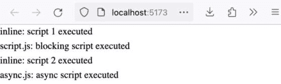

图 10.1：内联脚本、外部脚本和具有 async 执行顺序的外部脚本

接下来，我们将看到 `defer` 如何影响脚本的加载。

`defer` 告诉浏览器脚本应该在文档解析后才能加载。然而，`DOMContentLoaded` 事件将在所有具有 `defer` 属性的脚本加载并执行后才触发。

假设我们添加一个 `defer.js` 文件，该文件将插入一个包含 `defer.js: defer script executed` 的段落，如下面的代码块所示：

```js
(() => {
  const node = document.createElement('p');
  node.innerText = 'defer.js: defer script executed';
  document.body.appendChild(node);
})();
```

接下来，我们通过在 `<script src="img/defer.js" defer></script>` 之前添加 `<script src="img/async.js" async></script>` 来扩展上一个 `async` 示例中的 HTML 文档。这将如下所示：

```js
<!-- no change to inline script 1 -->
<script src="img/defer.js" defer></script>
<script src="img/async.js" async></script>
<script src="img/script.js"></script>
<!-- no change to inline script 2 -->
```

当我们在浏览器中加载此文档时，我们看到以下输出，其中延迟执行的脚本在所有其他脚本之后添加其段落，尽管它在文档的解析顺序中位于 `async.js`、`script.js` 和内联脚本 2 之前。

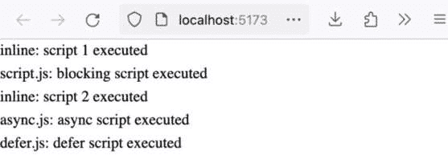

图 10.2：内联脚本、外部脚本、具有 async 的外部脚本和具有 defer 执行顺序的外部脚本

接下来，我们将看到“模块”脚本和“经典”脚本如何受到 `async` 和 `defer` 的不同影响。

当一个脚本接收到具有 `module` 值的属性类型时，该脚本将被解释为 JavaScript 模块。我们将这些称为“模块”脚本，与没有类型属性的“经典”脚本相对。

`type="module"` 延迟脚本的执行。这意味着“模块”脚本不受 `defer` 属性的影响（因为默认情况下该行为应用于它们的执行）。

`async` 属性总体上对“模块”脚本和“经典”脚本的影响相似，即脚本将在文档解析的同时并行加载，并在加载完成后执行。

`async` 属性对“模块”脚本的一个额外影响是，由于 JavaScript 模块具有表示依赖项加载的语法，模块脚本本身以及一旦加载，通过 `import` 语法加载的所有依赖项都将与文档解析并行加载。

假设我们有一个名为 `module.js` 的模块，它在运行时插入 `module.js: type="module" executed`：

```js
const node = document.createElement('p');
node.innerText = 'module.js: type="module" executed';
document.body.appendChild(node);
```

假设我们还有一个名为 `module-async.js` 的模块，它在运行时插入 `module-async.js: type="module" async executed`：

```js
const node = document.createElement('p');
node.innerText = 'module-async.js: type="module"
  async executed';
document.body.appendChild(node);
```

我们添加了带有 `type="module"` 的脚本标签，其中包含一个内联模块，该模块在运行时插入 `inline: type="module" executed`，以及引用 `module.js` 和 `module-async.js` 的模块脚本：

```js
<!-- no change to inline scripts -->
<script type="module">
  const node = document.createElement('p');
  node.innerText = 'inline: type="module" executed';
  document.body.appendChild(node);
</script>
<script src="img/module-async.js" type="module" async>
  </script>
<script src="img/module.js" type="module"></script>
<!-- no change to existing external scripts -->
```

当我们在浏览器中加载此文档时，我们会看到以下内容。这表明 `type="module"` 的默认加载/执行是延迟的，因为即使内联模块脚本也在 `async` 脚本之后执行。一个有趣的观点是，模块脚本的 `async` 可以使其比没有 `async` 的脚本执行得更早。这是有道理的，因为 `async` 表示并行加载，执行是“一旦可用”，而与模块脚本的默认执行方法相反，其默认方法是 `defer`：

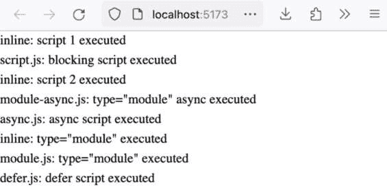

图 10.3：内联脚本、外部脚本、带有 `async` 的外部脚本、带有 `defer` 执行顺序的外部脚本、内联模块脚本以及带有 `async` 和不带 `async` 的外部模块脚本

我们现在已经对比了脚本加载/执行的不同特性：内联与外部，`async` 和 `defer` 属性的影响，以及经典与模块。以下图表总结了执行顺序：

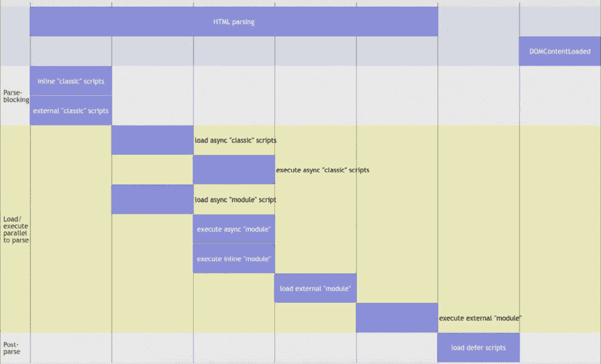

图 10.4：脚本加载/执行顺序与浏览器文档解析

我们现在已经看到了如何通过调整 JavaScript 的加载和执行方式来提高页面性能。接下来，我们将学习如何使用资源提示来提高页面性能。

根据 HTML 规范，资源提示允许消费者预先完成一个操作。它们用作链接元素上的 `rel` 值。与我们用例相关的值是 `preconnect`、`prefetch` 和 `preload`。

根据 HTML 标准，`preconnect` 的定义如下：

“`preconnect`：指定用户代理应预先连接到目标资源的源”，HTML 标准 – 4.6.7 链接类型：[`html.spec.whatwg.org/#linkTypes`](https://html.spec.whatwg.org/#linkTypes)

总结来说，`preconnect` 允许开发者“告诉”浏览器创建到源的服务器连接，从而使得后续对该源的服务器请求能够更快地发生，尤其是在 HTTP/2 上下文中，可以并行执行更多请求（通过多路复用）并且连接能够被高效重用。

```js
link element:
```

```js
<head>
  <link rel="preconnect" href="https://example.com" />
</head>
```

接下来，根据 HTML 规范，`preload`的定义如下：

“`preload`：指定用户代理必须根据由 as 属性给出的潜在目的地（以及与相应目的地关联的优先级）预先获取并缓存目标资源，用于当前导航。” HTML 标准 – 4.6.7 链接类型：[`html.spec.whatwg.org/#linkTypes`](https://html.spec.whatwg.org/#linkTypes)

`preload`可以在检测到页面上的资源之前加载资源。这在单页应用或其他高度动态的 JavaScript 驱动环境中特别有用，在这些环境中，资源可能不在初始返回的 HTML 有效负载中，但我们知道哪些资源可能是必需的。

注意，`preload`需要一个完全限定的资源路径（例如，[`example.com/assets/resource-1.js`](https://example.com/assets/resource-1.js)），这与仅使用源地址的`preconnect`不同。此外，请注意，`preload`不是为模块脚本设计的；为此，我们需要`rel="modulepreload"`，这在 HTML 标准规范中定义如下：

“`modulepreload`：指定用户代理必须预先获取模块脚本并将其存储在文档的模块映射中以便稍后评估。可选地，还可以获取模块的依赖项。” HTML 标准 – 4.6.7 链接类型：[`html.spec.whatwg.org/#linkTypes`](https://html.spec.whatwg.org/#linkTypes)

在我们当前的示例中，我们可以在浏览器在 HTML 中“看到”它们之前（提前）请求预加载一些`async`资源，我们的资源加载默认如下。加载顺序由 HTML 元素中脚本标签的顺序和所有资源的优先级定义，所有资源的优先级默认为`Normal`：

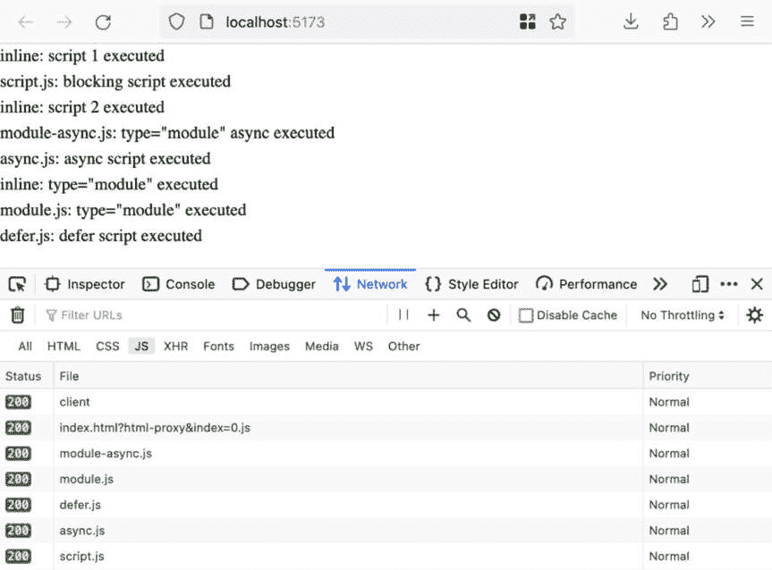

图 10.5：页面加载包括网络标签，但没有预加载

为了说明`preload`，我们可以在 HTML 的`head`元素内添加一个针对`async.js`的`preload`链接和一个针对`module-async.js`的`modulepreload`链接，如下面的代码片段所示：

```js
<head>
  <link rel="preload" href="async.js" as="script" />
  <link rel="modulepreload" href="module-async.js"
    as="script" />
</head>
```

如果我们重新加载我们的示例页面，我们会看到`async.js`和`module-async.js`现在以`最高`优先级加载，并且在页面上的其他脚本之前。此外，由于`async`属性加载较早，脚本执行也较早。

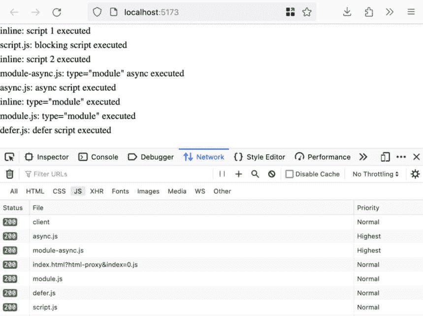

图 10.6：页面加载包括网络标签，async.js 有预加载，module-async.js 有 modulepreload

最后，在 HTML 规范中，`prefetch`被定义为如下：

“`prefetch`：指定用户代理应预先获取并缓存目标资源，因为它可能对于后续导航是必需的” HTML 标准 – 4.6.7 链接类型：[`html.spec.whatwg.org/#linkTypes`](https://html.spec.whatwg.org/#linkTypes)

这意味着 `prefetch` 不仅会连接（就像 `preconnect` 所做的那样），还会进行完整的加载和缓存周期。`prefetch` 在资源将在下一次加载时而不是在当前页面上（在这种情况下应使用 `preload` 和 `modulepreload`）需要时很有用。

我们已经看到了如何通过 `script` 元素的 `async` 和 `defer` 属性以及通过 `link` 元素的 `preconnect`、`preload` 和 `prefetch` 来优化资产加载。接下来，我们将探讨如何使用 Next.js `Script` 组件的 `strategy` 在 Next.js 应用程序中实现类似的结果。

# 使用 Next.js 脚本策略选项优化资产加载

Next.js 的 `Script` 组件让我们对脚本加载行为有更多的控制，从而可以改善页面加载性能。

`strategy` 属性允许我们控制加载策略；它默认为 `afterInteractive`，这意味着在 Next.js 代码运行之后开始加载。它可以设置为 `beforeInteractive`，在这种情况下，脚本将在所有 Next.js 代码之前加载和执行。`lazyOnLoad` 可以用于低优先级的脚本，以延迟加载直到浏览器空闲时间。

最后一个选项是实验性的；它是 `worker` 策略，它将在 Web Worker 中加载和运行脚本。

根据 Next.js 文档中关于 `Script#strategy` 选项的说明，以下列表包含了脚本的加载策略（请参阅文档：[`nextjs.org/docs/pages/api-reference/components/script#strategy`](https://nextjs.org/docs/pages/api-reference/components/script#strategy)）。

可以使用四种不同的策略：

+   **beforeInteractive**：在任何 Next.js 代码和任何页面激活之前加载

+   **afterInteractive**（默认）：在页面某些激活之后早期加载

+   **lazyOnload**：在浏览器空闲时加载

+   **worker**（实验性）：在 Web Worker 中加载

`Script` 组件相对于原生的 `script` 元素的一个优点是，即使在内联脚本上也可以使用加载策略。例如，假设我们在 Next.js 应用程序中有一个 `pages/index.js` 页面；我们添加了一些 `Script` 组件，并采用两种方法添加内联脚本。我们将后者 `Script` 设置为使用 `beforeInteractive`，记住默认策略是 `afterInteractive`：

```js
import React from 'react';
import Script from 'next/script';
export default function Index() {
  return (
    <>
      <h1>Next.js Script Strategy</h1>
      <Script>{`console.log('inline script 1');`}</Script>
      <Script
        strategy="beforeInteractive"
        dangerouslySetInnerHTML={{
          __html: `console.log('inline script 2');`,
        }}
      ></Script>
    </>
  );
}
```

当我们使用 `npx next dev` 或 `npx next build && npx next start` 运行 Next.js 服务器时，我们看到控制台中打印的是 `inline script 2` 在 `inline script 1` 之前；这是 `Script` 策略正在应用：

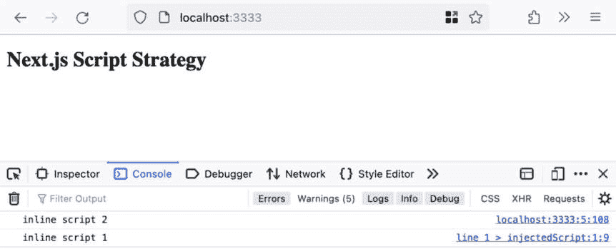

图 10.7：第二个内联脚本由于每个脚本的策略在第一个脚本之前记录到控制台

现在，我们将展示如何使用加载策略与外部脚本一起使用。

假设我们有一个 `public/afterInteractive.js`，其中包含以下内容：

**console.log('afterInteractive.js: loaded');**

同样，`public/beforeInteractive.js` 和 `public/lazyOnload.js` 包含一个带有相关内容的 `console.log` 函数调用，分别是 `beforeInteractive.js: loaded` 和 `lazyOnload.js: loaded`。

我们可以使用以下对 `pages/index.js` 的更改来加载它们；请注意，我们将它们按大致的“反向”顺序加载，以展示 `strategy` 的影响：

```js
import React from 'react';
import Script from 'next/script';
export default function Index() {
  return (
    <>
      {/* no change to h1 or inline script 1 */}
      <Script src="img/lazyOnload.js" strategy="lazyOnload" />
      <Script src="img/afterInteractive.js" strategy=\
        "afterInteractive" />
      <Script src="img/beforeInteractive.js" strategy=
        "beforeInteractive" />
      {/* no change to inline script 2 */}
    </>
  );
}
```

当我们使用 `npx next dev` 或 `npx next build && npx next start` 运行 Next.js 服务器时，我们会看到在控制台打印出 `beforeInteractive` 之前，会先打印出 `afterInteractive`，而 `lazyOnLoad` 在 `afterInteractive` 之前打印：

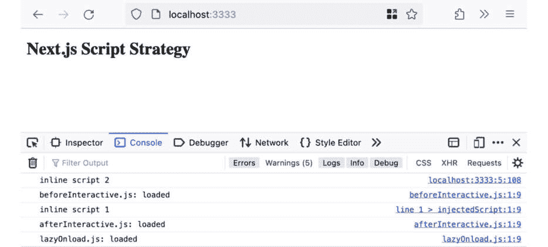

图 10.8：基于策略的脚本登录顺序

我们现在已经看到了 Next.js `Script` 和其 `strategy` 属性如何让我们在 Next.js 环境中控制脚本资产加载，以实现额外的页面加载性能。接下来，我们将介绍如何在工作线程中运行脚本。

# 在工作线程中加载和运行脚本

Next.js `Script` 策略选项之一是 `worker`，它会在一个 Web Worker 中加载和运行脚本。在当前的 Next.js 版本中，这是通过一个名为 **Partytown** 的库实现的 ([`partytown.builder.io/`](https://partytown.builder.io/))。以下内容来自 Partytown 文档：

“Partytown 是一个懒加载库，用于将资源密集型脚本重新定位到 Web Worker 中，并从主线程上移除。它的目标是帮助通过将主线程专用于你的代码，并将第三方脚本卸载到 Web Worker 中来加速网站。” Partytown 主页 – [`partytown.builder.io/`](https://partytown.builder.io/)

为了扩展这个定义，JavaScript 在浏览器中运行在一个单线程的环境中。“单线程”意味着我们只有一个实体能够执行计算操作；非异步工作不能并行执行。在这个上下文中，主线程是浏览器的 JavaScript 执行线程。当加载和执行计算密集型脚本时，它们可能会剥夺其他脚本的执行环境。通过在工作线程中运行这些计算密集型脚本，它获得了一个不同的 JavaScript 环境或执行线程，这意味着主线程被释放出来以服务其余的 JavaScript 执行。

由于 Next.js `Script` 的 `strategy="worker"` 是实验性的，为了使用它，我们需要在 `next.config.js` 中启用它，如下所示：

```js
const nextConfig = {
  // no change necessary to other config fields
  experimental: {
    nextScriptWorkers: true,
  },
};
module.exports = nextConfig;
```

当运行 `npx run dev` 时，你会在运行命令的终端中看到一个关于 `nextScriptWorkers` 实验性功能的警告：

```js
▲ Next.js 13.5.4
- Local:        http://localhost:3000
- Experiments (use at your own risk):
    · nextScriptWorkers
✓ Ready in 2.4s
```

为了说明我们如何使用由 Partytown 提供的 `strategy="worker"`，我们可以编写一个 `analytics.js` 脚本，该脚本将记录登录、加载，并对 `jsonplaceholder` 进行一些关于页面的 API 调用。我们将 `analytics.js` 存储在 `public/analytics.js` 中，以模拟加载第三方脚本（或更普遍地，无法打包的依赖项，即我们无法将其导入到我们的应用程序代码中）：

```js
console.log('analytics.js: loaded');
async function trackPageLoad() {
  const responseJson = await fetch(
    'https://jsonplaceholder.typicode.com/posts',
    {
      method: 'POST',
      body: JSON.stringify({
        page: window.location.pathname,
        origin: window.location.origin,
      }),
      headers: {
        'Content-type': 'application/json; charset=UTF-8',
      },
    },
  ).then((response) => response.json());
  console.log('analytics.js: page load fetch response',
    responseJson);
}
trackPageLoad();
```

然后，我们可以在 Next.js 应用程序中创建一个新的`pages/worker.js`文件，该文件渲染一个标题和一些 Next.js 脚本，包括`/analytics.js`。其他脚本是为了说明`worker`策略与替代策略值的加载顺序：

```js
import React from 'react';
import Script from 'next/script';
export default function Worker() {
  return (
    <>
      <h1>Next.js Script "worker" experimental
         Strategy</h1>
      <Script src="img/analytics.js" strategy="worker" />
      <Script src="img/lazyOnload.js" strategy="lazyOnload" />
      <Script src="img/afterInteractive.js" strategy=
        "afterInteractive" />
      <Script src="img/beforeInteractive.js" strategy=
        "beforeInteractive" />
    </>
  );
}
```

当我们加载`npx next build && npx next start`时，生产服务器启动，并且使用`strategy="worker"`在所有其他策略之后加载。我们还看到对`jsonplaceholder`的`fetch()`调用成功完成：

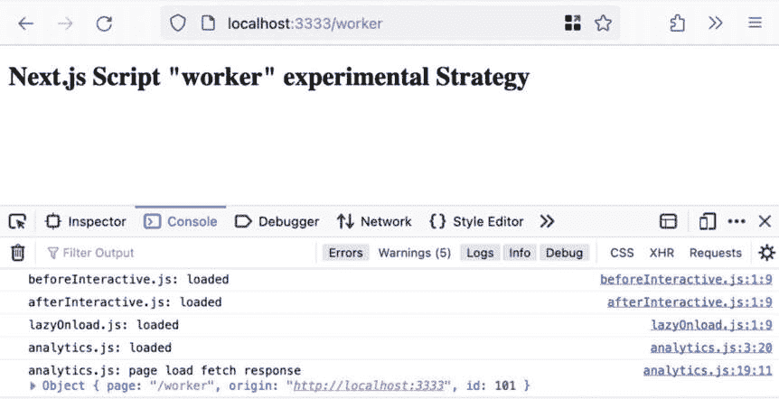

图 10.9：在其它策略和 fetch 调用响应日志之后加载 worker 策略

通过`worker`策略加载的另一个方面是`analytics.js`不是作为脚本加载的；它是通过`fetch`加载的。这可以通过检查`XMLHttpRequest`（`fetch`的前身）以及检查`jsonplaceholder`请求在这里出现（作为两个请求，一个`OPTIONS`请求以确保我们可以进行跨源请求，随后是`POST`请求）来看到。

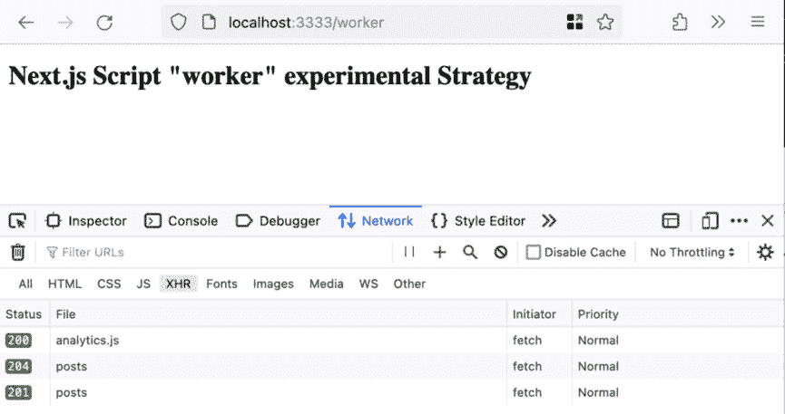

图 10.10：analytics.js 通过 fetch 加载，以及 jsonplaceholder 的请求

如果我们进一步挖掘`analytics.js`请求，我们会看到`Referer`头部的值（它帮助我们跟踪请求的来源）是`_next/static/~partytown/partytown-sandbox-sw.html`，这是一个 Parytown 生成的文档。

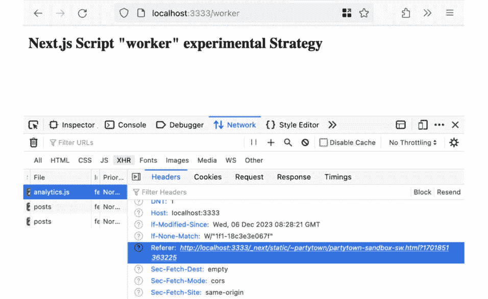

图 10.11：analytics.js 的 Referer 是 Parytown 服务工作者生成的 HTML 文件

简而言之，使用`strategy="worker"`在不同的 JavaScript 上下文中加载和执行我们的脚本，尽管 Parytown 被设计成应该与原始窗口有高度的相似性。

我们已经看到了如何使用`strategy="worker"`和 Parytown 在 web worker 环境中执行主线程之外的脚本。

# 摘要

在本章中，我们介绍了控制资产和 JavaScript 加载的更细粒度技术。

为了使用浏览器内置功能控制脚本加载，我们可以使用`async`和`defer`属性；我们讨论了它们对模块脚本与经典脚本的影响。我们还探讨了在`link`元素上使用`rel`属性进行资源提示，以及`preconnect`、`preload`、`modulepreload`和`prefetch`对资源加载的影响。

我们可以利用 Next.js `Script`组件的`strategy`属性来控制 Next.js 应用程序上下文中的脚本加载和执行，而不仅仅是`async`和`defer`。

最后，我们探讨了使用 Next.js `Script` `worker`策略，由 Parytown 库提供支持，在主 JavaScript 线程之外运行某些脚本的可能性。

在本章的最后，我们讨论了资产加载策略和优化，例如在主线程之外执行代码。

这就带我们来到了本书的结尾。希望您已经对 JavaScript 中的设计模式及其实现有了更深入的理解。您将能够讨论和对比实现方式，以及属于创建型、结构型和行为型设计模式类别的语言无关模式的实用性。此外，您应该对有助于您扩展应用的 JavaScript 特定模式充满信心，例如响应式视图库模式、渲染策略、以及 JavaScript 中的异步和事件驱动编程模式。此外，您现在对与 JavaScript 相关的性能和架构模式也应该很熟悉，例如微前端、懒加载、代码拆分以及进一步的资产加载优化。

当然，所有这些模式都是为了使用而设计的，您将发现新的组合它们的方法，甚至可能在您意想不到的地方注意到它们。JavaScript 和 Web 平台空间是不断演变的，我希望这本书能帮助您更好地利用其出色的功能。
