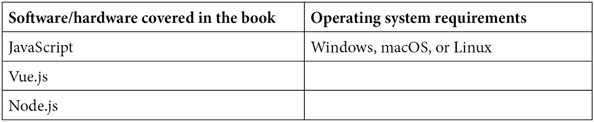

# 前言

JavaScript 是世界上使用最广泛的编程语言。它拥有众多的库和模块，以及令人眼花缭乱的必须了解的主题。选择一个起点可能很困难。这本简洁实用的指南将让您在极短的时间内掌握所需技能。

# 本书面向的对象

这本书是为那些希望加强他们的核心 JavaScript 概念并在构建全栈应用程序中实现它们的 JavaScript 开发者而写的。

# 本书涵盖的内容

*第一章*，*探索 JavaScript 的核心概念*，是您发现如何在 JavaScript 中使用变量、条件和循环的地方。

*第二章*，*探索 JavaScript 的高级概念*，是您学习如何在 JavaScript 中使用面向对象编程的地方。

*第三章*，*Vue.js 入门*，是您学习 Vue.js 的基础，包括组件和指令的地方。

*第四章*，*Vue.js 的高级概念*，是您深入探索 Vue.js，包括组件间通信和视觉效果的地方。

*第五章*，*使用 Vue.js 管理列表*，是您学习如何使用 Vue.js 构建一个完整项目的地方。

*第六章*，*创建和使用 Node.js 模块*，是您学习使用模块进行 Node.js 编程基础的地方。

*第七章*，*使用 Express 与 Node.js*，是您探索用于构建 Node.js 应用程序的主要库的地方。

*第八章*，*使用 MongoDB 与 Node.js*，是您学习如何使用 Mongoose 模块在 Node.js 中使用 MongoDB 数据库的地方。

*第九章*，*整合 Vue.js 与 Node.js*，是您学习如何构建一个整合 Vue.js 和 Node.js 的完整项目的地方。

# 要充分利用这本书

对 HTML 和 CSS 的先验知识是这本书的必备条件。



**如果您正在使用这本书的数字版，我们建议您亲自输入代码或从书的 GitHub 仓库（下一节中有一个链接）获取代码。这样做将帮助您避免与代码复制粘贴相关的任何潜在错误。**

# 下载示例代码文件

您可以从 GitHub（[`github.com/PacktPublishing/JavaScript-from-Frontend-to-Backend`](https://github.com/PacktPublishing/JavaScript-from-Frontend-to-Backend)）下载本书的示例代码文件。如果代码有更新，它将在 GitHub 仓库中更新。

我们还有其他来自我们丰富的书籍和视频目录的代码包，可在[`github.com/PacktPublishing/`](https://github.com/PacktPublishing/)找到。去看看吧！

# 下载彩色图片

我们还提供了一份包含本书中使用的截图和图表彩色图像的 PDF 文件。您可以从这里下载：[`packt.link/xdibe`](https://packt.link/xdibe)

# 使用的约定

本书使用了多种文本约定。

`文本中的代码`：表示文本中的代码单词、数据库表名、文件夹名、文件名、文件扩展名、路径名、虚拟 URL、用户输入和 Twitter 昵称。以下是一个示例：“所以 `{ lastname: "Clinton" }` 也可以通过将 `lastname` 属性用单引号或双引号包围来写成 `{ "lastname": "Clinton" }`。”

代码块设置如下：

```js
var p = { lastname : "Clinton", firstname : "Bill" };
```

```js
console.log("The person is", p);
```

当我们希望您注意代码块中的特定部分时，相关的行或项目将以粗体显示：

```js
class Person {
```

```js
  firstname;
```

```js
  lastname;
```

```js
  age;
```

```js
}
```

```js
var p = new Person;
```

```js
console.log(p);
```

**粗体**：表示新术语、重要单词或您在屏幕上看到的单词。例如，菜单或对话框中的单词以**粗体**显示。以下是一个示例：“这种写作格式也称为**JavaScript 对象表示法**（**JSON**）格式。”

小贴士或重要注意事项

看起来像这样。

# 联系我们

我们读者的反馈总是受欢迎的。

**一般反馈**：如果您对本书的任何方面有疑问，请通过 customercare@packtpub.com 给我们发邮件，并在邮件主题中提及书名。

**勘误**：尽管我们已经尽最大努力确保内容的准确性，但错误仍然可能发生。如果您在这本书中发现了错误，我们将不胜感激，如果您能向我们报告，我们将不胜感激。请访问[www.packtpub.com/support/errata](https://www.packtpub.com/support/errata)并填写表格。

**盗版**：如果您在互联网上发现我们作品的任何形式的非法副本，我们将不胜感激，如果您能提供位置地址或网站名称，我们将不胜感激。请通过 copyright@packt.com 与我们联系，并提供材料的链接。

**如果您有兴趣成为作者**：如果您在某个主题上具有专业知识，并且您有兴趣撰写或为本书做出贡献，请访问[authors.packtpub.com](https://authors.packtpub.com)。

# 分享您的想法

一旦您阅读了 *从前端到后端的 JavaScript*，我们很乐意听听您的想法！请[点击此处直接访问此书的亚马逊评论页面](https://packt.link/r/1801070318)并分享您的反馈。

您的评论对我们和科技社区都非常重要，它将帮助我们确保我们提供高质量的内容。
