# 第一章：*第一章* 探索 JavaScript 的核心概念

JavaScript 语言是在 1990 年代中期创建的，用于在互联网浏览器中执行，以便使网站更加流畅。最初，它被用来控制输入表单中的内容。例如，它被用来做以下事情：

+   允许在字段中输入数字字符——并且只有数字字符。在这种情况下，其他字符，例如字母，必须被拒绝。这使得由于浏览器中包含的 JavaScript 语言，可以不验证表单的输入并避免将数据发送到服务器，在这种情况下会表明输入错误。

+   在将表单字段发送到服务器之前，检查表单的所有必填字段是否都已填写。

这两个示例（以及其他许多示例）表明，在将用户输入的数据发送到服务器之前，检查数据的有效性是可取的。这避免了在输入的数据不正确的情况下，从浏览器到服务器的数据传输。对于更复杂的检查，例如检查两个人是否具有相同的标识符，这可以在服务器上继续进行，因为服务器可以访问所有现有的标识符。

因此，JavaScript 的目标是在其初期，让浏览器尽可能多地检查，然后将输入的信息传输到服务器进行处理。

为了这个目的，创建了一种内部浏览器语言：JavaScript 语言，其名称包含当时一个非常流行的词——“Java”（尽管 Java 和 JavaScript 这两种语言之间没有任何关系）。

多年来，开发者们有了将之与服务器端关联起来的想法，以便在客户端和服务器端使用相同的语言。这允许创建 Node.js 服务器，它今天被广泛使用。

不论是客户端还是服务器端，JavaScript 语言使用一种基本的语法，允许你编写自己的程序。这是我们将在本章中要探讨的。

在本章中，我们将涵盖以下主题：

+   JavaScript 中使用的变量类型

+   运行 JavaScript 程序

+   在 JavaScript 中声明变量

+   编写条件测试的条件

+   创建处理循环

+   使用函数

# 技术要求

要在 JavaScript 中开发，并在此书中编写和运行程序，你需要以下内容：

+   用于计算机程序的文本编辑器，例如 Notepad++、Sublime Text、EditPlus 或 Visual Studio。

+   一个互联网浏览器，例如 Chrome、Firefox、Safari 或 Edge。

+   一个 PHP 服务器，例如 XAMPP 或 WampServer。PHP 服务器将用于在 HTML 页面上执行包含 `import` 语句的 JavaScript 程序，因为这些 `import` 语句只能在 HTTP 服务器上工作。

+   Node.js 服务器：Node.js 服务器将通过 Node.js 安装创建。我们还将安装并使用 MongoDB 数据库，以将 Node.js 服务器与数据库关联。

+   您可以在 GitHub 上找到本章的代码文件：[`github.com/PacktPublishing/JavaScript-from-Frontend-to-Backend/blob/main/Chapter%201.zip`](https://github.com/PacktPublishing/JavaScript-from-Frontend-to-Backend/blob/main/Chapter%201.zip)。

让我们现在开始探索 JavaScript，通过研究它为我们提供的不同类型的变量。

# JavaScript 中使用的变量类型

与任何语言一样，JavaScript 允许你创建用于操作数据的变量。JavaScript 是一种非常简单的语言，因此，例如，数据类型非常基础。因此，我们将以下内容作为主要数据类型：

+   数值

+   布尔值

+   字符串

+   数组

+   对象

让我们快速浏览这些不同类型的数据。

## 数值

数值可以是正数或负数，甚至可以是小数形式（例如，0，-10，10.45）。所有称为实数的数学数都包含数值或数据点。

## 布尔值

当然，这是两种布尔值——true 或 false，这在大多数语言中都可以找到。这些值用于表达条件：如果条件为真，则执行特定过程，否则执行另一个过程。因此，条件的结果是 true 或 false 值，分别用两个值 `true` 和 `false` 表示。

我们将在本章后面的“编写条件”部分中看到如何表达条件。

## 字符串

字符串指的是像 `"a"`，`"abc"` 或 `"Hello, how are you?"` 这样的值。空字符串将表示为 `""`（连续的引号，里面没有任何内容）。注意，你可以使用双引号（`"`）或单引号（`'`）。因此，字符串 `"abc"` 也可以写成 `'abc'`（使用单引号）。

## 数组

数组，如 `[10, "abc", -36]`，可以包含任何类型的值，例如这里我们既有数值也有字符串。空数组将表示为 `[]`，这意味着它不包含任何值。

存储在数组中的值通过索引访问，索引从 0（用于访问数组中放置的第一个元素）到数组的长度减 1（用于访问数组的最后一个元素）。因此，如果数组 `[10, "abc", -36]` 通过变量 `tab` 表示，例如，以下情况会发生：

+   `tab[0]` 将允许访问数组的第一个元素：`10`。

+   `tab[1]` 将允许访问数组的第二个元素：`"abc"`。

+   `tab[2]` 将允许访问数组的第三个和最后一个元素：`-36`。

    注意

    注意，你可以在数组为空的情况下向数组中添加元素。因此，如果我们访问前面数组 `tab` 的索引 3，我们可以写 `tab[3] = "def"`。因此，数组 `tab` 现在将是 `[10, "abc", -36, "def"]`。

## 对象

对象类似于数组。它们用于存储任意信息，例如，值`43`，`"Clinton"`，和`"Bill"`。但与使用索引的数组不同，你必须指定一个名称来访问这些值中的每一个。这个名称被称为键，因此它允许访问它所代表的值。

假设之前的值`43`是某人的年龄，而`"Clinton"`是他们的姓，`"Bill"`是他们的名。那么我们将对象写成以下形式：`{ age: 43, lastname: "Clinton", firstname: "Bill" }`。对象的定义是通过花括号完成的，内部是`key: value`形式的键值对，由逗号分隔。这种书写格式也称为**JavaScript 对象表示法**（**JSON**）格式。

因此，如果之前的对象与变量`person`相关联，我们可以通过编写`person["age"]`（在这里将是`43`）来访问他们的年龄，但也可以编写`person.age`，这也会是`43`。同样，我们也可以编写`person.lastname`或`person["lastname"]`以及`person.firstname`或`person["firstname"]`来分别访问该人的姓和名。

键也被称为对象的属性。因此，`age`键也被称为`age`属性。我们可以为键选择任何名称；你只需指出键，然后使用这个名称。所以，如果你在`person`对象中将`age`指定为属性，你必须使用`person.age`或`person["age"]`中的术语；否则它将不起作用。

注意，如果你写`person[age]`而不是`person["age"]`，JavaScript 会将`age`视为一个具有先前定义值的变量，而在这里它不是，因此在这种情况下无法工作。你必须将`age`变量设置为具有值`"age"`才能使其工作。

数组的元素按照它们的索引顺序排列（从 0 开始，然后是 1，依此类推），而包含在对象中的元素按照每个元素指定的键顺序排列。尽管`lastname`键在`person`对象中列在`firstname`键之前，但这并不区分对象`{ age: 43, lastname: "Clinton", firstname: "Bill" }`和对象`{ firstname: "Bill", lastname: "Clinton", age: 43 }`，因为键写入对象的顺序是不相关的。

最后，存在空对象，例如那些不包含键（因此没有值）的对象。我们以`{ }`的形式写一个空对象，表示里面没有任何内容。然后我们可以向一个对象添加一个或多个键，即使它最初是空的。

现在我们已经看到了 JavaScript 中使用的的主要变量类型，让我们看看如何使用它们在我们的程序中定义变量。

# 运行 JavaScript 程序

JavaScript 是一种可以在浏览器（Edge、Chrome、Firefox、Safari 等等）或安装了 Node.js 的服务器上执行的语言。让我们看看如何为这两种配置编写 JavaScript 程序。

## 在浏览器中运行 JavaScript 程序

要在浏览器中运行 JavaScript 程序，必须将 JavaScript 代码插入到 HTML 文件中。然后，该 HTML 文件将在浏览器中显示，这将导致文件中包含的 JavaScript 代码执行。

JavaScript 代码可以在 HTML 文件中以两种不同的方式指定：

+   第一种方式是直接在 HTML 文件中的 `<script>` 和 `</script>` 标签之间编写。`<script>` 标签表示 JavaScript 代码的开始，而 `</script>` 标签表示其结束。在这两个标签之间编写的任何内容都被认为是 JavaScript 代码。

+   第二种方式是将 JavaScript 代码写入外部文件，然后将其包含在 HTML 文件中。外部文件通过在 HTML 文件中包含一个 `<script>` 标签来包含，其中 `src` 属性指示的值是要包含在 HTML 页面中的 JavaScript 文件的名称。

让我们来看看这两种在浏览器中运行的 JavaScript 代码的编写方式。

### 在 <script> 和 </script> 标签之间编写 JavaScript 代码

使用 `.html` 扩展名的文件；例如，`index.html` 文件。这是一个传统的 HTML 文件，我们在其中插入了 `<script>` 和 `</script>` 标签，如下面的代码片段所示：

index.html 文件

```js
<html>
```

```js
  <head>
```

```js
    <meta charset="utf-8" />
```

```js
    <script>
```

```js
alert("This is a warning message displayed by 
```

```js
      JavaScript");
```

```js
    </script>
```

```js
  </head>
```

```js
  <body>
```

```js
  </body>
```

```js
</html>
```

我们在 HTML 页面的 `<head>` 部分插入了 `<script>` 标签（及其结束标签 `</script>`）。`<meta>` 标签用于指示要使用的字符编码。在前面的代码中，我们使用了 `utf-8`，以便正确显示带重音的字符。

在此处插入的 JavaScript 代码非常基础。我们使用了 `alert()` 函数，该函数会在浏览器屏幕上显示一个对话框，显示函数第一个参数中指示的消息文本。

要运行此 HTML 文件，只需将其（通过拖放）从文件管理器移动到任何浏览器；例如，Firefox。然后会显示以下屏幕：

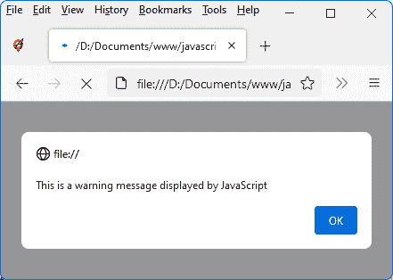

图 1.1 – 在浏览器窗口中显示消息

在 `<script>` 标签中存在的 JavaScript 代码在 HTML 页面加载时运行。因此，`alert()` 函数中指示的消息会被显示出来。点击 **确定** 按钮验证显示的消息并继续执行 JavaScript 代码。正如我们所看到的，程序中没有任何其他内容；程序立即通过在屏幕上显示空白页面结束（因为没有将 HTML 代码插入到页面中）。

### 将 JavaScript 代码写入外部文件

而不是直接将 JavaScript 代码集成到 HTML 文件中，我们可以将其放在一个外部文件中，然后通过在 `<script>` 标签的 `src` 属性中指定其名称来将此文件插入到我们的 HTML 文件中。

让我们首先编写将包含 JavaScript 代码的文件。这个文件具有 `.js` 文件扩展名，将被命名为 `codejs.js`，例如，其代码如下：

codejs.js 文件（位于 index.html 同一目录下）

```js
alert("This is a warning message displayed by JavaScript");
```

`codejs.js` 文件包含我们之前在 `<script>` 和 `</script>` 标签之间插入的 JavaScript 代码。

`index.html` 文件被修改以包含 `codejs.js` 文件，使用 `<script>` 标签的 `src` 属性如下：

index.html 文件

```js
<html>
```

```js
  <head>
```

```js
    <meta charset="utf-8" />
```

```js
    <script src="img/codejs.js"></script>
```

```js
  </head>
```

```js
  <body>
```

```js
  </body>
```

```js
</html>
```

注意

注意 `<script>` 和 `</script>` 标签的使用。它们是连续的（也就是说，它们之间没有空格或换行符），这对于代码的正常运行是必要的。

在我们接下来的示例中，我们将主要使用直接在 HTML 文件中插入 JavaScript 代码，但使用外部文件会产生相同的结果。

现在让我们解释另一种显示消息的方法，这种方法不会像之前使用 `alert(message)` 函数那样阻塞程序。

### 使用 console.log() 方法代替 alert() 函数

之前使用的 `alert()` 函数在 HTML 页面上显示一个窗口，JavaScript 程序会挂起等待用户在窗口中点击 **确定** 按钮。因此，该函数需要用户的干预才能继续程序的执行。

一种替代方法使得可以在不阻塞程序执行的情况下使用显示。这是在控制台中，使用 `console.log()` 方法。

注意

`console.log()` 写法意味着我们使用与 `console` 对象关联的 `log()` 方法。这将在下一章中详细解释。

让我们再次编写程序，这次使用 `console.log()` 方法而不是 `alert()` 函数。`index.html` 文件将按如下方式修改：

使用 console.log() 方法的 index.html 文件

```js
<html>
```

```js
  <head>
```

```js
    <meta charset="utf-8" />
```

```js
    <script>
```

```js
      // display a message in the console
```

```js
      console.log("This is a warning message displayed by 
```

```js
      JavaScript");
```

```js
    </script>
```

```js
  </head>
```

```js
  <body>
```

```js
  </body>
```

```js
</html>
```

注意

在 JavaScript 程序中使用注释需要将 `//` 放在需要注释的内容之前（在同一行上）。您也可以通过在开头和结尾使用 `/*` 和 `*/` 来注释多行。

通过按键盘上的 *F5* 键来运行此程序以刷新窗口。会出现一个空白屏幕，没有任何消息。

事实上，消息只会在控制台中显示。控制台只有在您按下 *F12* 键时才会可见（可以通过再次按下 *F12* 来移除）。

注意

您可以访问网站 [`balsamiq.com/support/faqs/browserconsole/`](https://balsamiq.com/support/faqs/browserconsole/)，该网站解释了在 *F12* 键无效的情况下如何显示控制台。

以下是在控制台显示的内容：

 并下载和安装服务器。请注意，如果你使用 macOS，Node.js 已经安装了。

我们可以通过打开一个壳并输入命令 `node -h` 来验证 Node.js 的正确安装。如果命令帮助显示如下，则表示 Node.js 已正确安装：

![Figure 1.3 – node -h 命令显示帮助信息

![img/Figure_1.3_B17416.jpg]

图 1.3 – 显示帮助信息的 node -h 命令

一旦安装了 Node.js，它就可以运行你想要的任何 JavaScript 程序。你所要做的就是创建一个包含 JavaScript 代码的文件，例如，`testnode.js`。该文件的内容将由服务器使用 `node testnode.js` 命令执行。

这里是一个非常简单的 JavaScript 文件示例，它可以由 Node.js 执行：它在服务器控制台中显示一条消息。这里的“服务器控制台”代表命令解释器，你在其中输入命令以执行 `testnode.js` 文件：

testnode.js 文件

```js
console.log("This is a warning message displayed by JavaScript");
```

让我们在前面的终端窗口中输入命令 `node testnode.js`。

![Figure 1.4 – 运行 Node.js 程序

![img/Figure_1.4_B17416.jpg]

图 1.4 – 运行 Node.js 程序

我们看到消息直接显示在命令解释器中。

在前面的例子中，我们编写的 JavaScript 代码既可以在客户端（浏览器）运行，也可以在服务器端运行。可以提出的问题是：相同的代码是否可以在客户端和服务器端以完全相同的方式运行？

## 为浏览器和服务器编写的 JavaScript 代码之间的差异

虽然这两段代码很相似，但我们不能说它们是相同的，因为在两种情况下要处理的问题不同。实际上，在客户端，我们主要会想用 JavaScript 管理用户界面，而在服务器端，我们更想管理文件或数据库。因此，在这两种情况下要使用的库将不会相同。

另一方面，我们在两种情况下都找到了相同的基本语言，那就是我们将要描述的 JavaScript 语言。

# 在 JavaScript 中声明变量

在“JavaScript 中使用的变量类型”部分之前描述的变量类型，如我们所知，包括数值、布尔值、字符字符串、数组和对象。

JavaScript 是一种弱类型语言，这意味着你可以在任何时候更改变量的类型。例如，数值变量可以被转换成字符字符串，甚至可以变成数组。

当然，在程序中做出这样的自愿更改是不明智的，并且为了理解，保持变量的类型在整个程序中是谨慎的。然而，重要的是要知道 JavaScript 允许更改变量类型。一种名为 *TypeScript* 的 JavaScript 变体通过防止这些类型更改来提供更多的安全性。

现在，让我们学习如何定义变量。我们将使用以下关键字之一：`const`、`var` 或 `let`。

## 使用 const 关键字

`const` 关键字用于定义一个值将保持不变的变量。任何后续尝试更改值都将产生错误。

让我们定义一个常量变量 `c1`，其值为 `12`。尝试修改其值，给它赋予一个新的值：控制台将显示错误：

注意

将我们定义一个常量变量称为语言上的滥用。我们更应该说我们在定义一个常量值。

定义常量值（index.html 文件）

```js
<html>
```

```js
  <head>
```

```js
    <meta charset="utf-8" />
```

```js
    <script>
```

```js
      const c1 = 12;
```

```js
      console.log(c1);
```

```js
      c1 = 13;   // attempt to modify the value of a 
```

```js
                 // constant: error
```

```js
      console.log(c1);  // no display because an error 
```

```js
                        // occurred above
```

```js
    </script>
```

```js
  </head>
```

```js
  <body>
```

```js
  </body>
```

```js
</html>
```

在实现前面的代码后，我们还将看到控制台（如果控制台不可见，可以通过按 *F12* 键显示）中显示的错误如下：

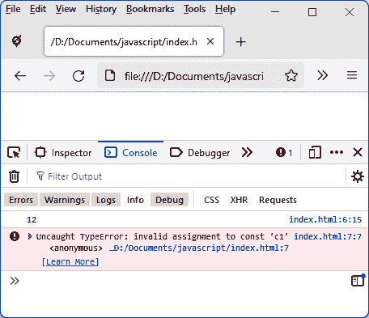

Figure 1.5 – 修改常量值时的错误

从前面的图中我们可以看到，常量 `c1` 的第一次显示值为 `const`，关键字不应被修改。

## 使用 var 关键字

定义变量（其值可以修改）的另一种方式是使用 `var` 关键字。让我们通过以下代码示例来看看如何使用：

几个变量的定义

```js
<html>
```

```js
  <head>
```

```js
    <meta charset="utf-8" />
```

```js
    <script>
```

```js
      var a = 12;
```

```js
      var b = 56;
```

```js
      var c = a + b;
```

```js
      var s1 = "My name is ";
```

```js
      var firstname = "Bill";
```

```js
      console.log("a + b = " + a + b);
```

```js
      console.log("c = " + c);
```

```js
      console.log(s1 + firstname);    
```

```js
    </script>
```

```js
  </head>
```

```js
  <body>
```

```js
  </body>
```

```js
</html>
```

我们通过在变量前加上关键字 `var` 并赋予它们默认值来定义变量 `a`、`b`、`s1` 和 `firstname`。变量 `c` 对应于变量 `a` 和 `b` 的和。

注意

变量的名称由字母数字字符组成，但必须以字母字符开头。在编写变量名称时，大小写很重要（变量的名称是区分大小写的）。因此，变量 `a` 与变量 `A` 不同。

前一个程序的结果在浏览器控制台中显示（如果不可见，必须通过按 *F12* 键显示）：


Figure 1.6 – 使用 var 关键字

在前面的图中，我们可以看到一个可能看起来令人惊讶的结果。确实，`a + b` 的直接计算第一次显示为 **1256**，然后第二次显示为 **68**。

事实上，当我们写 `console.log("a + b = " + a + b);` 时，我们开始通过写入 `"a + b = "` 来显示字符的事实意味着 JavaScript 将将显示的其余部分解释为字符字符串；特别是，位于同一行的 `a` 和 `b` 的值。因此，`a` 和 `b` 的值不再被解释为数值，而是作为字符字符串 `12` 和 `56`。当这些字符字符串通过 `+` 运算符连接时，这并不对应于加法，而是连接。

相反，变量 `c` 的计算不涉及字符字符串，因此这里 `a + b` 的结果是变量 `a` 和 `b` 的值的总和，因此 **68**。

注意，同样的程序可以在 Node.js 服务器上运行。为此，我们可以在 `testnode.js` 文件中这样编写：

testnode.js 文件

```js
var a = 12;
```

```js
var b = 56;
```

```js
var c = a + b;
```

```js
var s1 = "My name is ";
```

```js
var firstname = "Bill";
```

```js
console.log("a + b = " + a + b);
```

```js
console.log("c = " + c);
```

```js
console.log(s1 + firstname);
```

然后，我们可以使用 `node testnode.js` 命令执行前面的代码。在 Node.js 下显示的结果与在浏览器控制台显示的结果相似：

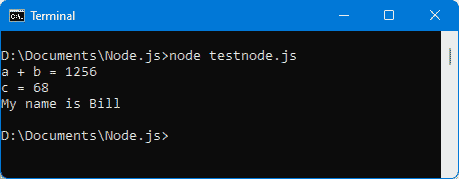

图 1.7 – 在 Node.js 下运行程序

我们学习了用于定义变量的 `const` 和 `var` 关键字；现在我们还需要学习如何使用 `let` 关键字。

## 使用 let 关键字

要理解 `let` 关键字的使用并看到它与 `var` 关键字的区别，我们必须在我们的程序中使用大括号。大括号用于创建程序块，在其中插入指令，特别是在条件 `if` 和 `else` 指令之后（我们将在 *编写条件* 部分看到）。

让我们写一个简单的 `if(true)` 条件，它总是 `true`：因此，条件后面的括号内的代码总是被执行：

包含条件的 index.html 文件

```js
<html>
```

```js
  <head>
```

```js
    <meta charset="utf-8" />
```

```js
    <script>
```

```js
      var a = 12;
```

```js
      if (true) {  // always executed (because always true)
```

```js
        var b = 56;
```

```js
        let c = 89;
```

```js
        console.log("In the brace:");
```

```js
        console.log("a = " + a);
```

```js
        console.log("b = " + b);
```

```js
        console.log("c = " + c);
```

```js
      }
```

```js
      console.log("After the brace:");
```

```js
      console.log("a = " + a);
```

```js
      console.log("b = " + b);
```

```js
      console.log("c = " + c);
```

```js
    </script>
```

```js
  </head>
```

```js
  <body>
```

```js
  </body>
```

```js
</html>
```

在前面的代码中，我们在任何大括号之外定义了变量 `a`。因此，一旦定义，这个变量将在任何地方（包括和不包括大括号）都是可访问的。

变量 `b` 和 `c` 在条件之后的大括号内定义。变量 `b` 使用 `var` 定义，而变量 `c` 使用 `let` 关键字定义。两个变量之间的区别在退出大括号块时就会显现出来。确实，变量 `c`（由 `let` 定义）在其定义的大括号块外部不再被识别，而变量 `b`（由 `var` 定义）即使在块外部也是可访问的。

这可以通过在浏览器中按如下方式运行程序来检查：

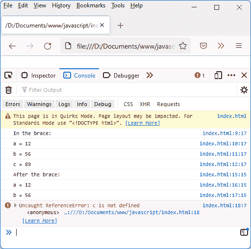

图 1.8 – 由 let 定义的变量 c 在其定义的块外部不可访问

注意，同样的程序在 Node.js 服务器上也会得到类似的结果，如下面的屏幕截图所示：使用 `let` 定义的变量 `c` 在块外部变得不可知。

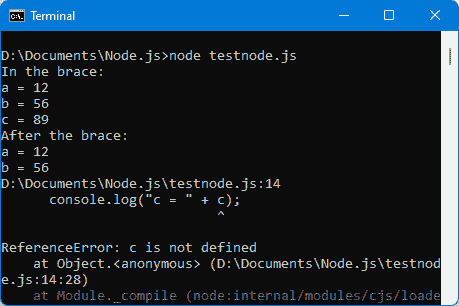

图 1.9 – Node.js 服务器上的相同结果

正如我们在前面的屏幕上所看到的，由 `let` 在块中定义的变量 `c` 在块外变得不可知。

## 如果我们不使用 var 或 let 来定义一个变量会怎样？

有可能不使用 `var` 或 `let` 关键字来定义一个变量。我们可以简单地写出变量的名称，然后写出它的值（由 `=` 符号分隔）。让我们通过以下示例看看这样做会怎样：

不指定 var 或 let 创建变量

```js
a = 12;
```

```js
b = 56;
```

```js
console.log("a = " + a);    // displays the value 12
```

```js
console.log("b = " + b);    // displays the value 56
```

在前面的例子中，变量在没有 `var` 或 `let` 前被初始化，这些变量是全局变量。一旦它们被初始化，它们就可以在程序的其他任何地方访问。当我们学习本章 *使用函数* 部分的函数时，这一点将变得明显。

注意

强烈建议在程序中尽可能少地使用全局变量，因为这会复杂化包含它们的程序的设计和调试。

## 未初始化的变量有什么价值？

前面的每个变量都是通过初始化其值（使用 `=` 符号，即赋值符号）来声明的。让我们看看如果我们不对变量赋值，只使用 `var` 或 `let` 声明会发生什么：

未初始化的变量声明

```js
<html>
```

```js
  <head>
```

```js
    <meta charset="utf-8" />
```

```js
    <script>
```

```js
      var a;
```

```js
      let b;
```

```js
console.log("a = " + a);    // displays the value 
```

```js
                                  // undefined
```

```js
console.log("b = " + b);    // displays the value 
```

```js
                                  // undefined
```

```js
    </script>
```

```js
  </head>
```

```js
  <body>
```

```js
  </body>
```

```js
</html>
```

在前面的代码中，我们定义了两个变量，`a` 和 `b` – 一个使用 `var`，另一个使用 `let`。这两个变量都没有初始值（也就是说，它们后面没有 `=` 符号）。

在这种情况下，对于这些未初始化的变量显示的结果是 JavaScript 中的一个值，称为 `undefined`。这对应于尚未有值的变量。`undefined` 值是 JavaScript 语言中的一个重要关键字。

注意

变量 `a` 和 `b` 没有被初始化，必须使用 `var` 或 `let` 来声明它们。实际上，你不能简单地写 `a;` 或 `b;`，因为这会导致运行时错误。

让我们在浏览器中运行前面的程序，并观察控制台显示的结果：

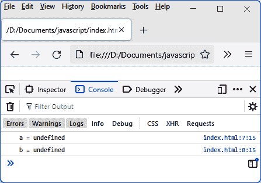

图 1.10 – 未初始化的变量是未定义的

注意

如果使用 Node.js 服务器端的 JavaScript，`undefined` 值也与未初始化的变量相关联。

我们现在知道了如何在 JavaScript 中定义变量。要创建有用的 JavaScript 程序，你必须编写一系列指令。最常用的指令之一允许你使用 `if` 语句编写条件测试，我们将在下一节讨论这一点。

# 编写条件测试的条件

JavaScript 显然允许你在程序中编写条件。条件通过 `if (condition)` 语句表达：

+   如果条件是 `true`，则执行后面的语句（或花括号中的块）。

+   如果条件为 `false`，则执行 `else` 关键字后面的语句（如果存在）。

## 编写指令的形式

我们可以使用以下形式来表示条件：

使用 if (condition) 的条件表达式形式

```js
// condition followed by a statement
```

```js
if (condition) statement;   // statement executed if condition is true
```

```js
// condition followed by a block
```

```js
if (condition) {
```

```js
  // block of statements executed if condition is true
```

```js
  statement 1;   
```

```js
  statement 2;   
```

```js
  statement 3;   
```

```js
}
```

使用 if (condition) … else … 的条件表达式形式

```js
// condition followed by a statement
```

```js
if (condition) statement 1;   // statement 1 executed if 
```

```js
                              // condition is true
```

```js
else statement 2;             // statement 2 executed if 
```

```js
                              // condition is false
```

```js
// condition followed by a block
```

```js
if (condition) {
```

```js
  // block of statements executed if condition is true
```

```js
  statement 1;   
```

```js
  statement 2;   
```

```js
  statement 3;   
```

```js
}
```

```js
else {
```

```js
  // block of statements executed if condition is false
```

```js
  statement 5;   
```

```js
  statement 6;   
```

```js
  statement 7;   
```

```js
}
```

注意

如果要执行的过程包含多个指令，这些指令将组合在一起，用大括号括起来形成一个块。一个块可以只包含一个语句，即使在这个情况下，块是可选的（不需要大括号）。

让我们在 `testnode.js` 文件中编写以下程序，我们将使用命令解释器中的 `node testnode.js` 命令来执行它，如下所示：

testnode.js 文件

```js
var a = 12;
```

```js
console.log("a = " + a);
```

```js
if (a == 12) console.log("a is 12");
```

```js
else console.log("a is not 12");
```

在前面的代码中，条件以 `a == 12` 的形式表达。实际上，习惯上通过连续两次重复使用等号 `=` 来测试两个值之间的相等性（因此是 `==`）。

注意

我们使用 `==` 表示相等，`!=` 表示不等，`>` 或 `>=` 检查大于或等于，`<` 或 `<=` 检查小于或等于。

在前面的代码中，由于变量 `a` 的值为 `12`，可以看到以下结果：

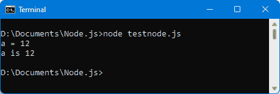

图 1.11 – 使用条件测试

如果我们将值 `13` 赋给变量 `a`，则语句的 else 部分将被执行：

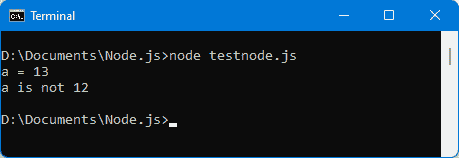

图 1.12 – 运行测试的 else 部分

我们已经看到了如何根据条件执行代码的一部分或另一部分。现在让我们研究如何编写比之前写过的更复杂的条件。

## 用于编写条件的表达式

之前编写的条件是两个值之间简单相等性的测试。但有时需要编写的测试可能更复杂。目标是得到条件的最终结果，即 `true` 或 `false`，这将使系统能够决定下一步的行动。

条件用布尔形式书写，使用 *OR* 关键字（写作 `||`）或使用 *AND* 关键字（写作 `&&`）。不同条件之间可能需要括号来表示最终条件，如下所示：

使用 “or” 表达的条件

```js
var a = 13;
```

```js
var b = 56;
```

```js
console.log("a = " + a);
```

```js
console.log("b = " + b);
```

```js
if (a == 12 || b > 50) console.log("condition a == 12 || b > 50 is true");
```

```js
else console.log("condition a == 12 || b > 50 is false");
```

在前面的代码中，由于变量 `b` 大于 50，条件为 `true`，如 *图 1.13* 所示。

注意

在 *OR* 条件中，只要其中一个条件为 `true`，最终条件就为 `true`。

在 *AND* 条件中，所有条件都必须为 `true`，最终条件才为 `true`。


图 1.13 – 使用 or 条件

默认情况下，`if(condition)` 中表达的条件与值 `true` 进行比较。有时我们可能更喜欢与值 `false` 进行比较。在这种情况下，只需在条件前加上符号 `!` 即可，这对应于对后续条件的否定。

有时需要根据前一个测试的结果连续进行几个测试。这时，我们就有了一系列的测试，称为级联测试。

## 嵌套测试套件

在要执行的过程中可以链式测试。以下是一个示例：

测试嵌套

```js
var a = 13;
```

```js
var b = 56;
```

```js
console.log("a = " + a);
```

```js
console.log("b = " + b);
```

```js
if (a == 12) console.log("condition a == 12 is true");
```

```js
else {
```

```js
  console.log("condition a == 12 is false");
```

```js
  if (b > 50) console.log("condition b > 50 is true");
```

```js
  else console.log("condition b > 50 is false");
```

```js
}
```

`else` 部分由多个语句组成，并放在由大括号包围的块中：

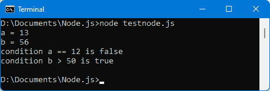

图 1.14 – 测试嵌套

我们学习了如何在 JavaScript 程序中编写条件。现在我们将学习如何编写处理循环，这使得在程序中只需编写一次指令成为可能。然而，这些指令可以根据需要执行多次。

# 创建处理循环

有时需要多次重复一个指令（或指令块）。而不是在程序中多次编写它，我们将其放入处理循环中。这些指令将根据需要重复执行多次。

JavaScript 中有两种处理循环类型：

+   使用 `while()` 语句的循环

+   使用 `for()` 语句的循环

让我们来看看这两种循环类型。

## 使用 `while()` 循环

`while(condition)` 指令允许你重复执行后面的指令（或指令块）。只要条件为 `true`，就会执行该语句（或块）。当条件变为 `false` 时停止执行。

使用这个 `while()` 语句，让我们显示从 `0` 到 `5` 的数字：

显示从 0 到 5 的数字

```js
var i = 0;
```

```js
while (i <= 5) {
```

```js
  console.log("i = " + i);
```

```js
  i++;
```

```js
}
```

前面的 `console.log()` 指令在程序中只写一次，但由于它被插入到循环（`while()` 指令）中，所以当条件为 `true` 时，它将被重复执行多次。

变量 `i` 允许你在循环中管理条件。每次通过循环时，变量 `i` 都会增加 1（通过 `i++`），并且当值超过 `5` 时我们停止：

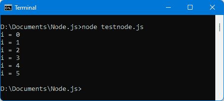

图 1.15 – 显示数字从 0 到 5

我们可以验证这个程序在客户端（即网页浏览器）中以类似的方式工作，如下所示：

在浏览器控制台中显示数字 0–5

```js
<html>
```

```js
  <head>
```

```js
    <meta charset="utf-8" />
```

```js
    <script>
```

```js
      var i = 0;
```

```js
      while (i <= 5) {
```

```js
        console.log("i = " + i);
```

```js
        i++;
```

```js
      }
```

```js
    </script>
```

```js
  </head>
```

```js
  <body>
```

```js
  </body>
```

```js
</html>
```

结果在浏览器控制台中以类似的方式显示：

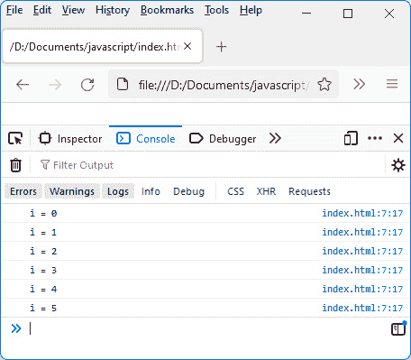

图 1.16 – 在浏览器控制台中显示从 0 到 5 的数字

## 使用 `for()` 循环

另一种广泛使用的循环形式是使用 `for()` 语句的循环。它通过减少要编写的指令数量来简化前面循环的编写。

让我们用 `for()` 语句而不是 `while()` 语句编写与之前相同的程序来显示从 0 到 5 的数字：

```js
for (var i=0; i <= 5; i++) console.log("i = " + i);
```

如前所述的代码所示，一行代码可以替代几行代码。

`for()` 语句有三个部分，由 `;` 分隔：

+   第一个对应于初始化指令。在这里，它是变量 `i` 的声明，初始化为 `0`（这是循环的开始）。

+   第二个对应于条件：只要这个条件是 `true`，就会执行语句（或随后的语句块）。在这里，条件对应于变量 `i` 没有超过最终值 `5`。

+   第三个对应于每次循环迭代后执行的指令。在这里，我们通过 1 增加变量 `i`。这确保了在某个时刻，条件将变为 `false`，以便退出循环。

让我们验证它是否与 `while()` 语句完全相同：


图 1.17 – 使用 for()语句的循环

在本节中，我们学习了如何使用 `while()` 和 `for()` 语句编写将被多次执行的语句序列。现在让我们看看如何使用所谓的函数来组合语句。

# 使用函数

函数用于给一组指令命名，以便可以在程序的不同地方使用。通常，在函数中，我们将一组用于执行特定任务的指令分组，例如：

+   显示前 10 个整数的列表。

+   计算前 10 个数字（从 0 到 9）的和。

+   计算前 N 个数字（从 0 到 N-1）的和。在这种情况下，`N` 将是函数的一个参数，因为每次调用（或使用）函数时它都可能改变（或使用）。

上文所述的函数非常简单，但展示了函数的作用是通过总结一句话来封装任何过程。赋予函数的名称象征着期望执行的动作，这允许开发者轻松理解指令序列（包括未参与开发的外部开发者）。让我们逐一讨论我们列出的三个函数。

## 显示前 10 个整数的函数

让我们编写第一个函数，该函数显示前 10 个整数的列表。我们将把这个函数命名为 `display_10_first_integers()`。名称必须尽可能明确，因为一个 JavaScript 程序由许多函数组成，这些函数的名称在程序中必须是唯一的（如果两个函数名称相同，则只考虑最后一个，因为它会覆盖前面的）。

函数是通过使用关键字 `function`，然后是函数的名称，然后是括号来定义的。然后，我们在随后的花括号中指示组成函数的指令。每次在程序中调用函数时，将执行这个指令块。

让我们编写函数 `display_10_first_integers()`，该函数显示前 10 个整数：

使用函数显示前 10 个整数（testnode.js 文件）

```js
function display_10_first_integers() {
```

```js
  for (var i=0; i <= 10; i++) console.log("i = " + i);
```

```js
}
```

函数使用 `function` 关键字定义，后跟函数名和括号。

函数声明被分组在接下来的花括号之间的块中。我们找到了之前的 `for()` 循环作为指令，但它也可能是 `while()` 循环，它们的工作方式相同。

假设它包含在 `testnode.js` 文件中，让我们运行这个程序：

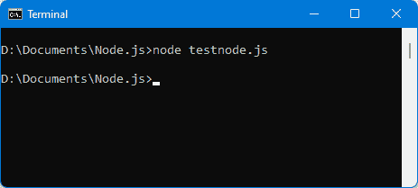

图 1.18 – 使用函数显示 1 到 10 的数字

如前图所示，屏幕保持空白，因为在控制台中没有注册任何显示。

事实上，我们只是简单地定义了函数，但我们还必须使用它，即在程序中调用它。你可以按需多次调用它——这是函数的目的：我们应该能够在任何时间调用（或使用）它们。但至少必须调用一次；否则，它就毫无用处，如前图所示。

让我们在函数定义之后添加函数调用：

函数的定义和调用

```js
// function definition
```

```js
function display_10_first_integers() {
```

```js
  for (var i=0; i <= 10; i++) console.log("i = " + i);
```

```js
}
```

```js
// function call
```

```js
display_10_first_integers();
```

前面代码的结果可以在以下图中看到：

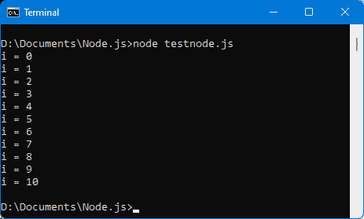

图 1.19 – 调用 display_10_first_integers() 函数

有趣的是，函数可以在程序的多个地方调用。让我们在以下示例中看看如何：

依次调用 display_10_first_integers() 函数

```js
// function definition
```

```js
function display_10_first_integers() {
```

```js
  for (var i=0; i <= 10; i++) console.log("i = " + i);
```

```js
}
```

```js
// function call
```

```js
console.log("*** 1st call *** ");
```

```js
display_10_first_integers(); 
```

```js
console.log("*** 2nd call *** ");
```

```js
display_10_first_integers(); 
```

```js
console.log("*** 3rd call *** ");
```

```js
display_10_first_integers();  
```

在前面的代码中，函数连续调用了三次，显示前 10 个整数的列表多次。每次调用前的顺序如下所示：

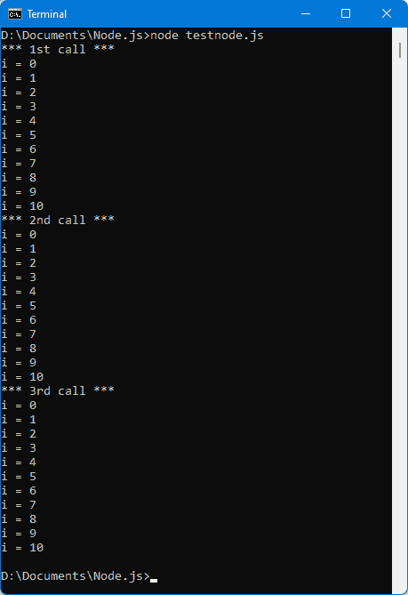

图 1.20 – 依次调用 display_10_first_integers() 函数

## 计算前 10 个整数和的函数

现在我们想要创建一个函数，该函数计算前 10 个整数的和，即 `1+2+3+4+5+6+7+8+9+10`。结果是 `55`。这将使我们能够展示函数如何将结果返回到外部（即使用它的程序）。在这里，函数应该返回 `55`。

让我们调用函数 `add_10_first_integers()`。它可以写成以下形式：

添加前 10 个整数的函数

```js
// function definition
```

```js
function add_10_first_integers() {
```

```js
  var total = 0;
```

```js
  for (var i = 0; i <= 10; i++) total += i;
```

```js
  return total;
```

```js
}
```

```js
// function call
```

```js
var total = add_10_first_integers();
```

```js
console.log("Total = " + total);
```

我们在函数中定义了 `total` 变量。因为这个变量是使用 `var` 或 `let` 关键字定义的，所以它是函数的局部变量。这允许这个 `total` 变量与函数外部定义的变量不同，即使名称相同。

注意

如果函数中的 `total` 变量不是使用 `var` 或 `let` 关键字定义的，它将创建一个所谓的全局变量，该变量即使在函数外部也可以直接访问。这不是好的编程，因为你希望尽可能少地使用全局变量。

该函数使用 `for()` 循环来累加前 10 个整数，然后使用 `return` 关键字返回这个总和。这个关键字使得在函数外部可以访问任何变量的值，在我们的例子中，是 `total` 变量。

让我们运行之前的程序。我们应该看到以下输出：


图 1.21 – 计算前 10 个整数的和

## 计算前 N 个整数和的函数

之前的函数不是很实用，因为它总是返回相同的结果。一个更有用的函数是计算前 `N` 个整数的和，其中 `N` 可以在每次函数调用时不同。

在这种情况下，`N` 将是函数的一个参数。它的值在使用函数时在括号中指示。

让我们调用 `add_N_first_integers()` 函数来计算这个和。参数 `N` 将在函数名称后面的括号中指示。一个函数可以使用多个参数，只需按顺序用逗号分隔即可。在我们的例子中，一个参数就足够了。

让我们编写 `add_N_first_integers(n)` 函数，并使用它来计算前 10 个、然后 25 个、然后 100 个整数的和。在函数连续调用过程中，将使用值 10、25 和 100 作为参数，并将替换函数定义中指示的参数 `n`：

添加前 N 个整数的函数

```js
// function definition
```

```js
function add_N_first_integers(n) {
```

```js
  var total = 0;
```

```js
  for (var i = 0; i <= n; i++) total += i;
```

```js
  return total;
```

```js
}
```

```js
// calculation of the first 10 integers
```

```js
var total_10 = add_N_first_integers(10);
```

```js
console.log("Total of the first 10 integers = " + total_10);
```

```js
// calculation of the first 25 integers
```

```js
var total_25 = add_N_first_integers(25);
```

```js
console.log("Total of the first 25 integers = " + total_25);
```

```js
// calculation of the first 100 integers
```

```js
var total_100 = add_N_first_integers(100);
```

```js
console.log("Total of the first 100 integers = " + total_100);
```

`add_N_first_integers(n)` 函数与之前编写的 `add_10_first_integers()` 函数非常相似。它使用括号中指示的参数 `n`，并且不像之前那样从 `0` 到 `10` 循环，而是从 `0` 到 `n`。根据调用函数时使用的 `n` 的值，循环将不同，函数返回的结果也将不同。

调用函数时，它传递参数 `10`、`25`，然后 `100`，正如所期望的那样。函数的 `total` 变量返回结果，然后由函数外部的 `total_10`、`total_25` 和 `total_100` 变量使用：

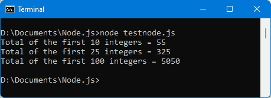

图 1.22 – 计算前 10 个、然后 25 个、然后 100 个整数的和

# 摘要

本章介绍了 JavaScript 的基本特性：不同类型的变量、条件测试、循环和函数。它们在客户端和服务器端都得到应用。

在下一章中，我们将探讨 JavaScript 的更多深入特性，例如使用 JavaScript 进行面向对象编程。
