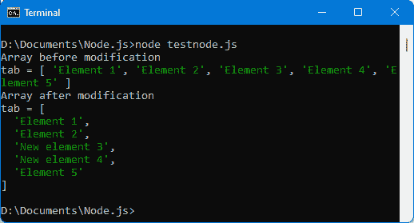

# 第二章：*第二章*：探索 JavaScript 的高级概念

在本章中，我们将探讨 JavaScript 的高级特性，例如面向对象编程。我们还将研究 JavaScript 中广泛使用的两种类型的对象：数组和字符串。最后，我们将看到 JavaScript 如何允许你使用所谓的回调函数来触发延迟处理。

在本章中，我们将涵盖以下主题：

+   类和对象

+   数组

+   字符串

+   多任务

+   使用承诺

所有这些主题对于构建 JavaScript 应用程序都是基本的。现在让我们开始吧！

# 技术要求

你可以在 GitHub 上找到本章的代码文件：[`github.com/PacktPublishing/JavaScript-from-Frontend-to-Backend/blob/main/Chapter%202.zip`](https://github.com/PacktPublishing/JavaScript-from-Frontend-to-Backend/blob/main/Chapter%202.zip)。

# 类和对象

类和对象的概念是编程语言的基础。JavaScript 允许它们被使用。

类用于表示任何类型的数据。例如，人、客户、汽车等等。我们可以定义一个类来表示这些类型的元素，例如，一个`Person`类来表示人，一个`Client`类来表示客户，一个`Car`类来表示汽车。

注意

注意，类名传统上以大写字母开头。

另一方面，一个对象将是类的一个特定元素（这个元素也将被称为实例）。例如，在`Person`类中的所有人中，被其名字“Clinton”和名字“Bill”所标识的人代表了这个类`Person`的一个特定对象。这个对象可以与程序中的变量`p`相关联。因此，我们可以创建变量来标识与该类关联的每个对象。

## 定义一个类

创建类时，你需要问自己的问题是，你想要对这个数据类型执行哪些操作。

例如，如果我们创建`Person`类，我们应该问什么特征可以定义一个人，以及我们可以在该类上执行哪些操作。例如，我们可以说`Person`类由人的姓氏、名字和年龄来定义。你也可以添加地址、电话号码、电子邮件等。

至于对人的可能操作，我们可以想象，例如，与另一个人结婚的操作，搬到另一个城市的操作，更换雇主的操作等等。

注意

姓氏、名字、年龄等这样的特征被称为类的属性，而结婚、搬家等这样的操作被称为类的方法。因此，一个类将把一组属性和一组方法组合在一起。

使用`class`关键字后跟类名，然后是描述内容的括号来创建 JavaScript 类。例如，`Person`类的创建如下所示：

人员类

```js
class Person {
```

```js
}
```

这种 `Person` 类的定义现在不会很有用，因为它内部没有定义属性或方法。我们将在以后看到如何改进它。

## 通过使用类创建对象

一旦定义了类，我们就可以创建与该类关联的对象。为此，我们使用关键字 `new` 后跟类的名称。这创建了一个表示该类对象的变量：

创建 Person 类的对象 p

```js
// define the Person class
```

```js
class Person {
```

```js
}
```

```js
// create an object of class Person
```

```js
var p = new Person;  // object p of class Person
```

```js
console.log(p);
```

这是你将看到的内容：


图 2.1 – 创建 Person 类对象

`p` 对象在控制台中显示。我们被告知它是一个 `Person` 类对象，它是空的 `{}`。对象以花括号形式表示的传统在 JavaScript 中，正如我们在上一章的 *JavaScript 中使用的变量类型* 部分中看到的。

我们可以验证它也可以在客户端，在浏览器中工作。HTML 文件如下：

index.html 文件

```js
<html>
```

```js
  <head>
```

```js
    <meta charset="utf-8" />
```

```js
    <script>
```

```js
      class Person {
```

```js
      }
```

```js
      var p = new Person;
```

```js
      console.log(p);
```

```js
    </script>
```

```js
  </head>
```

```js
  <body>
```

```js
  </body>
```

```js
</html>
```


图 2.2 – 在浏览器中创建对象

我们找到了花括号的显示，这表示了 JavaScript 对象的显示。

## 不使用类创建对象

没有先创建类，也可以创建对象。你只需使用花括号 `{` 和 `}` 的符号。

例如，我们可以编写以下内容：

使用花括号符号创建对象

```js
var p = { lastname : "Clinton", firstname : "Bill" };
```

```js
console.log("The person is", p);
```

这将创建具有 `lastname` 和 `firstname` 属性的对象 `p`。请注意，你可以通过将属性名称用引号括起来或不括起来来指定属性名称。因此，`{ lastname: "Clinton" }` 也可以写成 `{ "lastname": "Clinton" }`，通过将 `lastname` 属性用单引号或双引号包围。

现在让我们看看如何通过向其中添加属性和方法来改进之前创建的 `Person` 类。

## 向类中添加属性

在我们的例子中，一个人有一个姓氏、一个名字和一个年龄。我们将为 `Person` 类的人创建这三个属性。

你只需在 `Person` 类的主体中按名称指示这些属性即可。首先，不要使用 `var` 或 `let` 关键字来定义它们：

在 Person 类中添加 firstname、lastname 和 age 属性

```js
class Person {
```

```js
  firstname;
```

```js
  lastname;
```

```js
  age;
```

```js
}
```

```js
var p = new Person;
```

```js
console.log(p);
```


图 2.3 – 在 Person 类中创建 lastname、firstname 和 age 属性

`Person` 类对象 `p` 现在具有在类中添加的属性。这个类的任何其他对象也将具有它们。

注意，添加的属性值是 `undefined`。这是正常的，因为这些属性在 `p` 对象或 `Person` 类中尚未指定值。

让我们修改 `Person` 类，以便属性具有默认值，而不是 `undefined`：

具有默认值的属性

```js
class Person {
```

```js
  firstname = "";
```

```js
  lastname = "";
```

```js
  age = 0;
```

```js
}
```

```js
var p = new Person;
```

```js
console.log(p);
```

每个属性都使用其默认值进行初始化。`lastname` 和 `firstname` 属性使用空字符串 `""` 进行初始化，而 `age` 默认初始化为 `0`。

![图 2.4 – 具有默认值的属性![图 2.4 – 使用 display() 方法图 2.4 – 具有默认值的属性一个类既有属性，也有方法。现在让我们看看如何向类中添加方法。## 向类中添加方法您可以向类中添加方法。从该类（使用 `new`）创建的对象将能够直接使用这些方法。例如，让我们创建一个 `display()` 方法，该方法显示包含人员的名字和姓氏的文本行。指令 `p.display()`（假设 `p` 是 `Person` 类对象）用于显示与对象 `p` 相关的人员的姓氏和名字：在 Person 类中创建 display() 方法```jsclass Person {``````js  // class properties``````js  firstname = "";``````js  lastname = "";``````js  age = 0;``````js  // class methods``````js  display() {``````jsconsole.log("The person's lastname is = " + ``````js                this.lastname +``````js                ", firstname = " + this.firstname);``````js  }``````js}``````jsvar p = new Person;``````jsconsole.log("Variable p = ", p);``````jsp.display();  // use of the display() method on the p object```类的属性可以通过在它们前面加上关键字 `this` 在类的方法中访问。例如，`this.lastname` 提供了对类中 `lastname` 属性的访问。`this` 关键字指的是使用 `display()` 方法的对象本身，因此在这里是 `p` 对象。如果您省略 `this` 关键字并直接使用 `lastname` 属性，您将得到一个语法错误，因为属性只有在使用 `this` 关键字时才是可访问的。上述代码片段的输出显示在此处：![图 2.5 – 使用 display() 方法![图 2.5 – 使用 display() 方法图 2.5 – 使用 display() 方法`display()` 方法显示与变量 `p` 相关人员的 `firstname` 和 `lastname`，但由于 `lastname` 和 `firstname` 已经被初始化为空字符串，因此没有显示姓氏或名字。让我们看看如何修改属性的值。## 修改对象的属性值您可以通过直接使用这些属性来修改对象的属性值，例如，`p.lastname` 允许您读取或修改对象 `p` 的 `lastname` 属性的值：初始化人员的 `lastname` 和 `firstname````jsclass Person {``````js  // class properties``````js  lastname = "";``````js  firstname = "";``````js  age = 0;``````js  // class methods``````js  display() {``````js    console.log(" The person's lastname = " + this.lastname +``````js                ", firstname = " + this.firstname);``````js  }``````js}``````jsvar p = new Person;``````jsp.lastname = "Clinton";  // initialization of the lastname ``````js                         // property of the object p``````jsp.firstname = "Bill";    // initialization of the firstname ``````js                         // property of the object p``````jsconsole.log("Variable p = ", p);``````jsp.display();```这就是您将看到的内容：![图 2.6 – 初始化 `lastname` 和 `firstname` 属性![图 2.6 – 初始化 `lastname` 和 `firstname` 属性图 2.6 – 初始化 `lastname` 和 `firstname` 属性一旦使用 `new` 操作符创建了对象 `p`，我们就将其 `lastname` 和 `firstname` 属性初始化为指示的值。这里没有修改 `age` 属性，因此它将保持等于值 0。我们使用 `p.lastname` 和 `p.firstname` 修改了使用 `new` 创建的对象 `p` 的 `lastname` 和 `firstname` 属性的值。这种属性值的修改是在对象 `p` 创建之后进行的。在创建对象的过程中进行这种修改也是可能的，这需要定义一个名为 `constructor()` 的方法，它允许这种初始化。## 使用类构造函数`constructor()` 方法被称为类的构造函数。如果类中存在 `constructor()` 方法，则在每次使用 `new` 语句创建对象时都会自动调用它。如果我们想在每次在这个类中创建对象时执行特定的过程，我们就在类中定义它。`constructor()` 方法可以有任何数量的参数，也可以没有任何参数。这里指示的参数将用于初始化人的 `lastname` 和 `firstname` 属性：使用构造函数创建 Person 类```jsclass Person {``````js  // class properties``````js  lastname = "";``````js  firstname = "";``````js  age = 0;``````js  // class methods``````js  constructor(lastname, firstname, age) {``````js    this.lastname = lastname;``````js    this.firstname = firstname;``````js    this.age = age;``````js  }``````js  display() {``````js    console.log(" The person's lastname = " + this.lastname +``````js                ", firstname = " + this.firstname);``````js  }``````js}``````jsvar p = new Person("Clinton", "Bill");``````jsconsole.log("Variable p = ", p);``````jsp.display();````constructor()` 方法是通过提供三个参数 `lastname`、`firstname` 和 `age` 来定义的。它们通过 `this.lastname`、`this.firstname` 和 `this.age` 的方式被转移到对象的属性中。最后，通过将 `lastname`、`firstname` 和 `age` 的值作为参数传递给 `new` 来创建对象 `p`。在这里，`age` 在 `new` 指令中没有指定参数；因此，它将是一个 `undefined` 值，将被传递给构造函数。

图 2.7 – 使用构造函数

我们发现 `lastname` 和 `firstname` 属性已初始化，但 `age` 属性现在初始化为 `undefined` 而不是 `0`。要为其分配另一个值，只需在创建对象时传递一个额外的值。这个额外的值将代表人的年龄，例如：

在创建 Person 类对象时使用年龄

```js
class Person {
```

```js
  // class properties
```

```js
  lastname = "";
```

```js
  firstname = "";
```

```js
  age = 0;
```

```js
  // class methods
```

```js
  constructor(lastname, firstname, age) {
```

```js
    this.lastname = lastname;
```

```js
    this.firstname = firstname;
```

```js
    this.age = age;
```

```js
  }
```

```js
  display() {
```

```js
    // the age of the person is also displayed
```

```js
    console.log("The person's lastname = " + this.lastname +
```

```js
", firstname = " + this.firstname + 
```

```js
                ", age = " + this.age);         
```

```js
  }
```

```js
}
```

```js
var p = new Person("Clinton", "Bill", 33);    // age is now 
```

```js
                                              // transmitted
```

```js
console.log("Variable p = ", p);
```

```js
p.display();
```


图 2.8 – 人的年龄现在被传输

我们已经看到了如何通过直接使用类定义其属性和方法来创建一个对象。然而，我们也可以从一个对象创建另一个对象。让我们看看如何做到这一点。

## 合并一个对象与另一个对象

有可能存在需要从一个旧对象创建新对象的情况。让我们看看如何做到这一点。

如果对象 `p` 包含一个值，则语句 `var p2 = p` 并不会创建一个新的对象 `p2`，它与对象 `p` 是不同的，而只是一个指向与引用 `p` 相同值的引用 `p2`。因此，对对象 `p` 的属性所做的任何修改都将反映在对象 `p2` 中，因为它们都指向相同的内存位置。

这可以通过以下示例进行验证：

修改内存中的对象

```js
var p = { lastname : "Clinton", firstname : "Bill" };
```

```js
console.log("p (before modification of p2) =", p);  
```

```js
       // p = { lastname : "Clinton", firstname : "Bill" }
```

```js
var p2 = p;
```

```js
p2.city = "Washington";
```

```js
console.log("p (after modification of p2) =", p);  
```

```js
       // p = { lastname : "Clinton", firstname : "Bill", 
```

```js
       // city : "Washington"}
```

```js
console.log("p2 =", p2);  
```

```js
       // p2 = { lastname : "Clinton", firstname : "Bill", 
```

```js
       // city : "Washington"}
```

即使只修改了 `p2` 对象，`p` 对象也会被修改，因为它们是内存引用，指向相同的位置。如果内存位置的内容发生变化，两个引用都会看到相同的变化。

为了避免这种情况，不需要编写 `p2 = p`，而是将对象 `p` 的属性复制到对象 `p2` 的属性中，从而创建一个新的内存位置。为此，JavaScript 提供了扩展运算符，其形式为 `…`，它允许这样做：

使用扩展运算符 ...

```js
var p = { lastname : "Clinton", firstname : "Bill" }
```

```js
console.log("p (before modification of p2) =", p);
```

```js
var p2 = { ...p};   // copy the properties of object p into 
```

```js
                    // object p2
```

```js
p2.city = "Washington";
```

```js
console.log("p (after modification of p2) =", p);
```

```js
console.log("p2 =", p2);
```

扩展运算符通过在大括号`{}`周围包围原始对象，并在对象前使用扩展运算符（例如，`{...p}`）来使用。


图 2.9 – 使用扩展运算符...

当对象`p2`被修改时，对象`p`不再被修改。

也可以用简化的形式来写：

从对象`p`创建对象`p2`，添加城市

```js
// to avoid writing p2.city = "Washington"
```

```js
var p2 = { ...p, city : "Washington" };  
```

现在我们已经了解了类和对象以及如何使用它们，让我们看看一个重要的类对象：`Array`类。

# 数组

数组按照它们的索引顺序存储数据集合。索引也称为数组的索引。它从 0 开始，增加到数组的总元素数减 1（0 到 n-1）。

让我们首先学习如何创建一个数组。

## 使用方括号创建数组

在 JavaScript 中，数组对应于`Array`类对象。因此，我们使用`new Array`指令来创建一个数组。

然而，由于数组在 JavaScript 程序中广泛使用，因此也可以使用方括号表示法`[`和`]`来创建它们。这是一种更简单的方法，无需通过`Array`类即可使用它们。

让我们详细看看这两种创建数组的方式（使用方括号和使用`Array`类）。

### 使用方括号[和]创建数组

创建数组最简单、最快的方法是使用方括号表示法：

使用方括号创建数组

```js
var tab = ["Element 1", "Element 2", "Element 3", "Element 4", "Element 5"];
```

```js
console.log(tab);
```

数组以一个开方括号`[`开始，以一个闭方括号`]`结束。数组中的元素由逗号分隔。我们在这里插入的是字符串元素，但实际上，任何类型的元素都可以插入到数组中。


图 2.10 – 插入到数组中的元素

注意，可以创建一个空数组（没有任何元素）。我们将其写为`[]`，不在方括号内指定任何元素。然后就可以向这个数组中添加元素。

### 使用`Array`类创建数组

您还可以使用`Array`类来创建数组。`Array`类包括一个构造函数，其中我们指定数组元素的列表，每个元素之间由逗号分隔。

可以通过`new Array`语句以以下方式创建与之前相同的数组：

使用`new Array`创建数组

```js
var tab = new Array("Element 1", "Element 2", "Element 3", "Element 4", "Element 5");
```

```js
console.log(tab);
```


图 2.11 – 使用`new Array`创建数组

创建的数组与之前相同。

要创建一个空数组，只需在构造函数中不传递任何参数，如下所示：

使用`new Array()`创建空数组

```js
var tab = new Array();    // or new Array;
```

```js
console.log(tab);
```

![图 2.12 – 创建空数组 []

](img/Figure_2.12_B17416.jpg)

图 2.12 – 创建空数组 []

现在我们已经看到了如何创建一个数组，接下来让我们看看如何访问它的每个元素。

## 访问数组元素

在之前的程序中，我们使用`console.log(tab)`语句显示了整个数组。可以单独访问数组的每个元素。每个元素可以按以下方式访问：

+   通过索引

+   使用`for()`循环

+   使用`forEach()`方法

让我们看看这三种方法中的每一种。

### 通过索引访问元素

让我们以之前包含五个元素的数组为例，即`tab = ["元素 1", "元素 2", "元素 3", "元素 4", "元素 5"]`：

+   第一个元素可以通过其索引 0 访问，即`tab[0]`。

+   下一个，索引为 1 的，将通过`tab[1]`访问。

+   最后一个，索引为 4 的，将通过`tab[4]`访问。

这是您显示每个元素的方式：

通过索引显示数组中的每个元素

```js
var tab = ["Element 1", "Element 2", "Element 3", "Element 4", "Element 5"];
```

```js
console.log("tab =", tab);
```

```js
console.log("tab[0] =", tab[0]);
```

```js
console.log("tab[1] =", tab[1]);
```

```js
console.log("tab[2] =", tab[2]);
```

```js
console.log("tab[3] =", tab[3]);
```

```js
console.log("tab[4] =", tab[4]);
```

```js
console.log("tab[5] =", tab[5]);
```

结果将在以下图中显示：


图 2.13 – 通过索引显示每个元素

该数组包含五个元素，这意味着索引从 0 到 4。然而，为了进行测试，我们也访问了索引为 5 的元素。可以访问数组中不存在的元素的索引。在这种情况下，结果是 JavaScript 值`undefined`，这意味着此元素的值尚未分配。

注意，使用这种访问方法可以修改数组元素的值——只需给它一个新的值：

修改数组索引 2 和 3 中元素的值

```js
var tab = ["Element 1", "Element 2", "Element 3", "Element 4", "Element 5"];
```

```js
console.log("Array before modification");
```

```js
console.log("tab =", tab);
```

```js
// modification of elements, index 2 and 3
```

```js
tab[2] = "New element 3";
```

```js
tab[3] = "New element 4";
```

```js
console.log("Array after modification");
```

```js
console.log("tab =", tab);
```

这是结果：



图 2.14 – 修改数组元素

接下来，我们将查看使用`for()`或`while()`循环访问元素。

### 使用 for()或 while()循环访问元素

在上一章中已经研究过的`for()`和`while()`循环允许您浏览数组的所有元素。循环的索引从 0 开始（为了访问数组的第一个元素，即索引为 0 的元素）并结束于数组的最后一个索引。

要知道最后一个索引，JavaScript 在`Array`类中提供了`length`属性，这允许我们知道数组中元素的总数。最后一个索引将是值为`length – 1`的索引：

使用 for()循环访问数组元素

```js
var tab = ["Element 1", "Element 2", "Element 3", "Element 4", "Element 5"];
```

```js
console.log("tab =", tab);
```

```js
console.log("Access to each element by a for() loop");
```

```js
for (var i = 0; i < tab.length; i++) console.log("tab[" + i + "]=", tab[i]);
```

注意，循环的结束是通过测试值`i < tab.length`来写的。这相当于写`i <= tab.length – 1`。


图 2.15 – 使用 for()循环访问数组元素

接下来，我们将查看使用`forEach(callback)`方法访问元素。

### 使用 forEach(callback)方法访问元素

`forEach(callback)`方法是由 JavaScript 在`Array`类上定义的方法。它通过将数组的每个元素传递给作为参数传递的函数来遍历数组的元素。因此，作为参数指定的函数可以访问数组的每个元素（如果需要，还可以访问其索引）。

回调函数

在 JavaScript 中，将函数作为方法参数的指示原则非常常见。参数中的函数被称为回调函数，这意味着实际要执行的处理是在回调函数中指定的。

我们在这里展示了如何使用`forEach(callback)`方法参数中指定的回调函数。

我们使用之前看到的五个元素的`tab`数组，并对其应用`forEach()`方法：

使用`forEach()`方法访问数组元素

```js
var tab = ["Element 1", "Element 2", "Element 3", "Element 4", "Element 5"];
```

```js
console.log("tab =", tab);
```

```js
console.log("Access to each element by the forEach() method");
```

```js
tab.forEach(function(elem, i) {
```

```js
  console.log("tab[" + i + "]=", elem);
```

```js
});
```

我们将函数作为`forEach()`方法的参数。这个所谓的回调函数将由 JavaScript 自动为`tab`数组（使用`forEach()`方法）的每个元素调用。

回调函数将其第一个参数作为被调用的函数的数组元素（参数`elem`），以及其索引（参数`i`）。


图 2.16 – 使用`forEach()`方法访问数组元素

结果与`for()`循环得到的结果相同。然而，我们立即发现了一个（小）差异。

### `for()`循环和`forEach()`方法的区别

之前的程序在访问数组元素时没有显示`for()`循环和`forEach()`方法结果之间的任何差异。

为了展示这两种方法之间的区别，让我们在数组中引入一个新的元素，在索引 10 处，我们知道在创建数组时使用的最后一个索引是 4。因此，我们创建了一个比数组当前最后一个元素远得多的新元素。数组会如何对这个扩展做出反应？

在索引 10 处添加元素

```js
// original array
```

```js
var tab = ["Element 1", "Element 2", "Element 3", "Element 4", "Element 5"];
```

```js
// adding a new element in the array, at index 10
```

```js
tab[10] = "Element 9";
```

```js
console.log("tab =", tab);
```

```js
// display the array with a for() loop
```

```js
console.log("Access to each element by a for() loop");
```

```js
for (var i = 0; i < tab.length; i++) console.log("tab[" + i + "]=", tab[i]);
```

```js
// display the array by the forEach() method
```

```js
console.log("Access to each element by the forEach() method");
```

```js
tab.forEach(function(elem, i) {
```

```js
  console.log("tab[" + i + "]=", elem);
```

```js
});
```

我们使用`tab[10] = "Element 9"`向数组中添加一个元素，然后使用`for()`循环和`forEach()`方法显示数组的所有内容。

结果显示在下图中：


图 2.17 – 在数组索引 10 处添加元素

`for()`循环的显示表明索引 5 到 9 的元素存在，但它们的值为`undefined`，因为实际上没有为这些数组的索引插入任何值。然而，`for()`循环显示了具有`undefined`值的索引 5 到 9。

相反，`forEach()`方法只提供参数中指定的回调函数，该回调函数具有数组中实际受影响的数组元素。因此，避免了索引 5 到 9 的元素，这些元素在程序中没有分配。

我们已经看到了如何创建一个数组，然后如何访问其每个元素。现在让我们看看如何向数组中添加新元素。

## 向数组中添加项目

一旦创建数组（空或非空），就可以向其中添加元素。我们将主要使用以下两种技术之一：

+   在数组中通过索引添加元素

+   使用 push() 方法添加项目

现在，让我们来看看这两种技术。

### 通过索引添加元素

这对应于赋值 `tab[i] = value`。我们之前在写 `tab[10] = "Element 9"` 时使用了它。

注意，如果使用的索引大于数组中当前元素的数量，这将通过创建初始化为值 `undefined` 的新元素来扩大数组。如果使用的索引小于数组中的元素数量，它将修改目标元素的当前值。

### 使用 push() 方法添加元素

`push()` 方法定义在 `Array` 类中。它允许你添加一个新元素到数组中，而无需担心插入索引，因为它会自动将元素插入数组的末尾：

使用 push() 方法插入元素

```js
// original array
```

```js
var tab = ["Element 1", "Element 2", "Element 3", "Element 4", "Element 5"];
```

```js
// insert an element using the push() method
```

```js
tab.push("Element 6");
```

```js
console.log("tab =", tab);
```

```js
// display the array with a for() loop
```

```js
console.log("Access to each element by a for() loop");
```

```js
for (var i = 0; i < tab.length; i++) console.log("tab[" + i + "]=", tab[i]);
```

```js
// display the array by the forEach() method
```

```js
console.log("Access to each element by the forEach() method");
```

```js
tab.forEach(function(elem, i) {
```

```js
  console.log("tab[" + i + "]=", elem);
```

```js
});
```

指令 `tab.push("Element 6")` 将此元素插入数组的末尾。然后使用之前看到的各种方法显示数组。


图 2.18 – 使用 push() 方法添加元素

我们知道如何添加和修改数组中的元素。剩下的就是知道如何从数组中删除元素。

## 删除数组元素

JavaScript 允许我们以两种方式删除数组元素：

+   删除数组中元素的值，同时保留具有 `undefined` 值的元素在数组中

+   从数组中删除元素本身

现在我们来探讨这两种可能性。

### 删除元素值（不删除数组中的元素）

我们使用 `delete` 关键字来删除数组中元素的值。例如，`delete tab[0]` 通过将其赋值为 `undefined` 来删除数组 `tab` 中索引为 0 的元素的值。元素没有被从数组中删除，数组仍然保留与之前相同的元素数量：

删除索引为 0 的元素的值

```js
// original array
```

```js
var tab = ["Element 1", "Element 2", "Element 3", "Element 4", "Element 5"];
```

```js
// delete the value of the element with index 0
```

```js
delete tab[0];
```

```js
console.log("tab =", tab);
```

```js
// display the array with a for() loop
```

```js
console.log("Access to each element by a for() loop");
```

```js
for (var i = 0; i < tab.length; i++) console.log("tab[" + i + "]=", tab[i]);
```

```js
// display the array by the forEach() method
```

```js
console.log("Access to each element by the forEach() method");
```

```js
tab.forEach(function(elem, i) {
```

```js
  console.log("tab[" + i + "]=", elem);
```

```js
});
```


图 2.19 – 删除索引为 0 的元素的值

我们可以看到，`for()` 循环显示了元素的 `undefined` 值，而 `forEach()` 方法不再显示元素，因为它的值已经被删除。

注意

注意，如果我们不使用 `delete tab[0]`，而是使用 `tab[0] = undefined`，则 `forEach()` 方法将索引 0 的元素显示为数组的第一个元素，因为元素的值实际上并没有被删除，而是被分配了新的值，这里为 `undefined`。

现在我们来看第二种从数组中删除元素的方法。

### 从数组中删除元素

使用 `delete` 关键字不会从数组中删除元素，数组保留相同的元素数量。

在 `Array` 类中定义的 `splice(begin, count)` 方法允许你从数组中物理删除元素，因此在使用后数组将至少少一个元素。

`splice(begin, count)` 方法包含 `begin` 和 `count` 参数，这允许你指定从哪个索引开始删除（`begin` 参数）元素，以及你想要删除的连续元素的数量（`count` 参数）。

因此，要从数组 `tab` 中删除索引为 0 的元素，只需编写 `tab.splice(0, 1)`：

使用 splice() 方法删除数组中的索引为 0 的元素

```js
// original array
```

```js
var tab = ["Element 1", "Element 2", "Element 3", "Element 4", "Element 5"];
```

```js
// remove 1 element from index 0
```

```js
tab.splice(0, 1);
```

```js
console.log("tab =", tab);
```

```js
// display the array with a for() loop
```

```js
console.log("Access to each element by a for() loop");
```

```js
for (var i = 0; i < tab.length; i++) console.log("tab[" + i + "]=", tab[i]);
```

```js
// display the array by the forEach() method
```

```js
console.log("Access to each element by the forEach() method");
```

```js
tab.forEach(function(elem, i) {
```

```js
  console.log("tab[" + i + "]=", elem);
```

```js
});
```

这是你将看到的内容：


图 2.20 – 删除索引为 0 的元素

我们已经看到了如何在数组中添加和删除元素。现在让我们看看如何从当前数组中的元素提取一个新的数组。

## 在数组中过滤元素

过滤数组元素是常见的操作，例如，保留特定元素或返回新的元素。`Array` 类有两个方法——`filter(callback)` 和 `map(callback)`——允许我们根据条件返回一个新数组。

### 使用 filter(callback) 方法

`tab.filter(callback)` 方法返回一个新数组，同时只保留 `tab` 数组中所需的元素。

形式为 `callback(element, index)` 的回调函数会对数组 `tab` 的每个元素进行调用。如果决定保留该元素，则必须返回 `true`；否则，该元素将被排除。`tab.filter()` 方法返回一个新数组作为结果，但原始 `tab` 数组不会被修改（除非在方法返回时将其赋值，如下例所示）。

让我们使用 `filter()` 方法来保留数组中索引大于或等于 2 的元素：

使用 filter() 方法

```js
// original array
```

```js
var tab = ["Element 1", "Element 2", "Element 3", "Element 4", "Element 5"];
```

```js
console.log("initial tab =", tab);
```

```js
// keep only items with index >= 2
```

```js
tab = tab.filter(function(element, index) {
```

```js
  if (index >= 2) return true;   // keep this element
```

```js
});
```

```js
console.log("\nfinal tab =", tab);
```

如果回调函数返回 `true`，则保留该元素；否则，将其排除。回调函数也可以返回 `false`，甚至可以返回空值，就像这里一样，在这种情况下，该元素将被排除：


图 2.21 – 使用 filter() 方法

这就结束了 `filter()` 方法的介绍。

### 使用 map(callback) 方法

`tab.map(callback)` 方法用于从初始 `tab` 数组的元素返回一个新数组。初始数组中的每个元素都会传递给形式为 `callback(element, index)` 的回调函数，该回调函数必须为每个元素返回一个新元素，该元素将替换原始元素。

让我们使用 `map(callback)` 方法来返回一个新数组，其中所有元素都已大写：

使用 map() 方法

```js
// original array
```

```js
var tab = ["Element 1", "Element 2", "Element 3", "Element 4", "Element 5"];
```

```js
console.log("initial tab =", tab);
```

```js
// capitalize all elements
```

```js
tab = tab.map(function(element, index) {
```

```js
  return element.toUpperCase();
```

```js
});
```

```js
console.log("\nfinal tab =", tab);
```

`toUpperCase()` 方法是在 `String` 类上定义的方法（以下截图），允许你将使用该方法字符字符串大写。

结果显示在下图中：


图 2.22 – 使用 map() 方法

在本节中，我们研究了使用 `Array` 类的对象。JavaScript 中还有另一类广泛使用的对象：字符串，它们由 `String` 类表示。现在让我们看看如何使用 `String` 类的对象。

# 字符串

字符串在编程语言中被广泛使用。它们用于表示用户输入的文本或将要显示给用户的文本。

## 创建一个字符串

字符串由 `String` 类的对象表示。但由于字符串在 JavaScript 中被广泛使用，因此语言允许通过用双引号 `" "` 或单引号 `' '` 包围它们来使用它们。在某些情况下，也可以使用反引号（反向引号 `' '`）。

注意

在这种情况下，字符串字面量必须以相同类型的引号开始和结束。

现在让我们看看如何使用这些不同的方法创建字符串。

### 使用双或单引号创建字符串字面量

创建字符串字面量的最简单方法是使用单引号或双引号记法：

使用双引号创建字符串字面量

```js
var s = "String 1";
```

```js
console.log("s =", s);
```

或者，使用单引号：

使用单引号创建字符串字面量

```js
var s = 'String 1';
```

```js
console.log("s =", s);
```

在这两种情况下，显示的字符字符串是相同的。


图 2.23 – 创建字符字符串

使用单/双引号选项的优势

如果字符串本身包含引号，使用单或双引号的可能性优势就显而易见了。例如，如果字符串是 `"I'll love JavaScript"`，使用单引号创建字符串将产生错误，因为字符串将被假定以单词 `I'll` 中的撇号结束。在这种情况下，你必须使用双引号以避免错误。

### 使用反引号创建字符串字面量

你也可以使用反引号。这在需要以更简单的方式在字符串中使用变量的值时非常有用。

例如，假设你想显示一个包含一个人的姓和名的字符串。姓和名分别存储在名为 `lastname` 和 `firstname` 的变量中：

连接字符串和变量

```js
var lastname = "Clinton";
```

```js
var firstname = "Bill";
```

```js
// old way of concatenating strings and variables
```

```js
var s1 = "lastname is " + lastname + ", firstname is " + firstname;
```

```js
// new way of concatenating strings and variables
```

```js
var s2 = `lastname is ${lastname}, firstname is ${firstname}`;
```

```js
console.log("s1 =", s1);
```

```js
console.log("s2 =", s2);
```

当使用反向引号时，不再使用 `+` 符号来连接字符串和变量。所有内容都写在一个字符串中，变量通过“符号” `${variable}` 来识别。

大括号 `{` 和 `}` 之间可以是一个简单的变量（如这里所示），也可以是一个更复杂的可以计算的 JavaScript 表达式（例如，`{a+b}`）。

我们可以看到，这两个结果字符串是相同的。


图 2.24 – 使用 String 类创建字符串的字符字符串和变量序列

最后，可以使用 `String` 类来创建字符字符串。`String` 类有一个构造函数，其中要构造的字符串作为参数指示：

使用 String 类

```js
var s = new String("I'll love JavaScript");
```

```js
console.log("s =", s);
```

下图显示了结果：


图 2.25 – 使用 String 类

`String` 类具有属性和方法。例如，`length` 属性可以让你知道字符串中的字符数，因此可以比较，例如，两个字符字符串的长度。

让我们使用 `length` 属性来显示使用引号和 `String` 类创建的两个字符串的长度：

使用 String 类的 length 属性

```js
var s1 = new String("I'll love JavaScript");
```

```js
var s2 = "I'll love JavaScript";
```

```js
console.log("s1 =", s1);
```

```js
console.log("s2 =", s2);
```

```js
console.log("s1.length =", s1.length);
```

```js
console.log("s2.length =", s2.length);
```

这是结果：


图 2.26 – 使用 String 类的 length 属性

无论字符串是如何创建的，它的长度都是相同的（这里，20 个字符）。我们已经看到了如何创建字符字符串，现在让我们看看如何访问组成它的字符。

## 访问字符串中的字符

`String` 类定义了用于访问字符串中字符的方法。特别是，这些方法是 `charAt(index)` 和 `slice(start, end)`。`charAt(index)` 用于检索字符串中索引指示的字符，从索引 0 开始。最大索引是 `length` 属性的值减去 1。`slice(start, end)` 通过提取从 `start` 索引（包含）到 `end` 索引（排除）的字符来将字符串分割成子字符串。

### 使用 charAt(index) 方法

让我们使用 `charAt(index)` 方法逐个显示字符串中的字符：

显示字符串中的字符

```js
var s = "Hello";
```

```js
console.log("s =", s);
```

```js
for (var i = 0; i <s.length; i++) console.log(`s.charAt(${i}) = ${s.charAt(i)}`);
```

注意使用反引号来显示结果字符串。

结果显示在下图中：


图 2.27 – 使用 charAt() 方法

现在，让我们看看 `slice(start, end)` 方法。

### 使用 slice(start, end) 方法

之前的 `charAt(index)` 方法从字符串中检索单个字符，而 `slice(start, end)` 方法可以检索多个连续的字符：

注意

注意，`slice(start, end)` 方法不会修改应用该方法的原字符串，而是返回一个新的字符串。原始字符串不会被修改，因此可以保持完整。

在“Hello”字符串上使用 slice()

```js
var s = "Hello";
```

```js
console.log("s =", s);
```

```js
console.log(`s.slice(0,2) = ${s.slice(0,2)}`);
```

```js
console.log(`s.slice(0,3) = ${s.slice(0,3)}`);
```

```js
console.log(`s.slice(1,3) = ${s.slice(1,3)}`);
```

```js
console.log(`s.slice(0,-1) = ${s.slice(0,-1)}`);
```

```js
console.log(`s.slice(0,-2) = ${s.slice(0,-2)}`);
```

```js
console.log(`s.slice(1,-2) = ${s.slice(1,-2)}`);
```

如果 `slice(start, end)` 方法的 `end` 索引（第二个参数）是负数，这意味着计数从字符串的末尾开始（如果它是正数，则从开头开始）。

我们得到以下结果：


图 2.28 – 使用 slice() 方法

现在我们已经看到了如何获取组成字符串的字符，让我们看看如何修改字符串。

## 修改字符字符串

要修改字符串，只有一个可能性：必须从它构建一个新的字符串。原始字符串不能直接更改。

因此，我们将使用之前的`slice()`和`charAt()`方法，这将使我们能够提取原始字符串的部分，以便构建结果字符串。

但为了搜索或修改字符字符串的部分，最好使用正则表达式。我们将在下面学习它们。

## 使用正则表达式

正则表达式与字符串相关。它们用于检查字符串是否具有某种格式（例如，电子邮件格式、电话号码格式等），或者用其他字符替换这些格式的字符。

因此，`String`类有`match(regexp)`方法来检查字符字符串是否具有特定的格式，以及`replace(regexp, str)`方法来将此格式中的字符串部分替换为新字符串`str`。

在这两种方法中，`regexp`参数对应于正则表达式，其含义我们将在下面学习。

### 检查字符串是否具有特定的格式

`match(regexp)`方法用于检查方法所用的字符字符串是否与`regexp`中指示的格式相符。`regexp`参数被称为正则表达式。

正则表达式

正则表达式是由`/`和`/`包围的字符序列，例如，`/abc/`。正则表达式`/abc/`表示我们在字符字符串中寻找字符序列`abc`。如果字符串包含序列`abc`，则`match(/abc/)`方法将返回此字符序列作为结果，否则返回值`null`。

正则表达式的完整描述可以在[`developer.mozilla.org/fr/docs/Web/JavaScript/Reference/Global_Objects/RegExp`](https://developer.mozilla.org/fr/docs/Web/JavaScript/Reference/Global_Objects/RegExp)找到。

下面是一些正则表达式的示例，以及当在字符串`"Hello"`上使用`match()`方法时返回的值：

使用 match(regexp)

```js
var s = "Hello";
```

```js
console.log("s =", s);
```

```js
// search for "Hel"
```

```js
console.log(`s.match(/Hel/) = ${s.match(/Hel/)}`);
```

```js
// search for "hel"
```

```js
console.log(`s.match(/hel/) = ${s.match(/hel/)}`);  
```

```js
// search for "hel" ignoring upper/lower case
```

```js
console.log(`s.match(/hel/i) = ${s.match(/hel/i)}`);
```

```js
// search for H followed by a or b or e followed by l
```

```js
console.log(`s.match(/H[abe]l/) = ${s.match(/H[abe]l/)}`);
```

```js
// search for He followed by 0 or 1 a followed by l
```

```js
console.log(`s.match(/Hea?l/) = ${s.match(/Hea?l/)}`);
```

```js
// search for He followed by 0 (min) to 1 (max) followed by l
```

```js
console.log(`s.match(/Hea{0,1}l/) = ${s.match(/Hea{0,1}l/)}`);
```

```js
// search for He followed 1 (min) to 2 (max) followed by l
```

```js
console.log(`s.match(/Hea{1,2}l/) = ${s.match(/Hea{1,2}l/)}`);
```

当正则表达式在`"Hello"`字符串中找到时，`match()`方法将返回找到的字符串部分，否则返回`null`。

正则表达式末尾的`i`标志表示必须忽略大小写字母。

一系列字母周围的方括号`[`和`]`表示只需要这些字母中的一个。

问号`?`表示前面的字符是可选的（它可以出现，也可以不出现）。

大括号`{min,max}`表示前面的字符至少出现`min`次，最多出现`max`次。

之前程序的输出如下：


图 2.29 – 使用正则表达式

注意

编写正则表达式有时可能比较复杂。网站[`regex101.com/`](https://regex101.com/)允许您测试您想要的正则表达式。

正则表达式也可以使用 `replace()` 方法修改字符字符串的部分。

### 使用 replace() 方法替换字符串的一部分

`replace(regexp, str)` 方法用于将字符串中符合正则表达式 `regexp` 格式的部分替换为字符串 `str`。它返回一个新的字符串，而原始字符串不会被修改。如果正则表达式指示的格式未找到，则返回原始字符串，不做任何修改。

让我们取前一个示例中的正则表达式，并使用正则表达式将找到的字符串替换为字符串“abc”：

使用 replace() 方法

```js
var s = "Hello";
```

```js
console.log("s =", s);
```

```js
// search for "Hel" and replace with "abc"
```

```js
console.log(`s.replace(/Hel/, "abc") => ${s.replace(/Hel/, "abc")}`);
```

```js
// search for "hel" and replace with "abc"
```

```js
console.log(`s.replace(/hel/, "abc") => ${s.replace(/hel/, "abc")}`);  
```

```js
// search for hel ignoring upper/lower case and replacing with 
```

```js
// "abc"
```

```js
console.log(`s.replace(/hel/i, "abc") => ${s.replace(/hel/i, "abc")}`);
```

```js
// search for H followed by a or b or e followed by l and 
```

```js
// replace with "abc"
```

```js
console.log(`s.replace(/H[abe]l/, "abc") => ${s.replace(/H[abe]l/, "abc")}`);
```

```js
// search for He followed by 0 or 1 a followed by l and 
```

```js
// replaced by "abc"
```

```js
console.log(`s.replace(/Hea?l/, "abc") => ${s.replace(/Hea?l/, 
```

```js
"abc")}`);
```

```js
// search for He followed by 0 (min) to 1 (max) followed by l 
```

```js
// and replaced by "abc"
```

```js
console.log(`s.replace(/Hea{0,1}l/, "abc") => ${s.replace(/Hea{0,1}l/, "abc")}`);
```

```js
// search for He followed by 1 (min) to 2 (max) followed by l 
```

```js
// and replaced by "abc"
```

```js
console.log(`s.replace(/Hea{1,2}l/, "abc") => ${s.replace(/Hea{1,2}l/, "abc")}`);
```

输出如下所示：


图 2.30 – 使用 replace() 方法

所有之前的程序执行都是立即执行的。我们现在将研究如何执行延迟处理。

# JavaScript 中的多任务处理

当你开始用 JavaScript 编码时，经常会遇到一个问题：是否可以同时执行多个过程（在计算机中称为多任务处理）？如果需要执行的过程将花费很长时间，这将非常有用，以免阻塞其他同样紧急的过程。

JavaScript 不允许同时执行多个处理操作。另一方面，可以通过使用回调函数（在我们研究 *使用 forEach(callback) 方法访问元素* 部分时已经讨论过的）不阻塞程序（在浏览器客户端和 Node.js 服务器端）。

回调函数

回调函数对应于用作 JavaScript 方法或函数参数的处理函数。回调函数将由使用它的方法或函数在期望的时间执行。

Node.js 广泛使用此功能。例如，在读取文件时，`readFile(callback)` 方法在文件被读取时将回调函数作为参数调用，这允许程序不阻塞待读取文件的挂起处理。

JavaScript 定义了两个主要的标准函数，它们使用此回调函数概念：`setTimeout()` 和 `setInterval()` 函数。这两个函数都使用回调函数作为参数。我们将在下面描述这两个函数。

## 使用 setTimeout() 函数

`setTimeout(callback, timeout)` 函数用于定位一个将在 `timeout`（以毫秒为单位）表示的时间间隔过去后执行的执行函数（`callback` 函数）。

这允许你，例如，在 5 秒后（即 5,000 毫秒）执行处理。你可以在等待这个延迟的同时执行其他指令，因此程序在这段时间内不会被阻塞：

延迟 5 秒后的处理指令

```js
console.log("Before setTimeout()");
```

```js
setTimeout(function() {
```

```js
  console.log("In the callback function");
```

```js
}, 5000);  // 5000 milliseconds, or 5 seconds
```

```js
console.log("After setTimeout()");
```

我们在程序开始时在控制台中显示一条消息（`"Before setTimeout()"`）。我们编程一个 5 秒的延迟，之后触发一个回调函数，在控制台中显示另一条消息（`"In the callback function"`）。最后，我们通过显示一条新消息（`"After setTimeout()"`）来结束程序。

例如，使用 `node testnode.js` 命令运行此程序。要在浏览器中测试此程序，只需将前面的 JavaScript 代码放置在 `index.html` 文件的 `<script>` 和 `</script>` 标签之间。

以下截图显示了 1 秒后的显示效果：


Figure 2.31 – 使用 setTimeout()

注意，开始显示的消息和结束显示的消息是连续的，即使 5 秒的时间限制还没有结束。这表明程序没有被阻塞，等待超时到期。

以下截图显示了至少 5 秒后的显示效果（当 `setTimeout()` 方法中使用的延迟已过去）。


Figure 2.32 – 5 秒延迟后的显示

我们可以看到，当 5 秒的延迟过去后，`setTimeout()` 函数中注册的回调函数会自动由 `setTimeout()` 函数调用。

让我们通过显示消息显示的时间来改进程序。这使得可以验证是否遵守了 5 秒的时间限制：

显示消息发布的时间

```js
console.log(time(), "Before setTimeout()");
```

```js
setTimeout(function() {
```

```js
  console.log(time(), "In the callback function");
```

```js
}, 5000);   // 5000 = 5 seconds
```

```js
console.log(time(), "After setTimeout()");
```

```js
function time() {
```

```js
 // return time as HH:MM:SS
```

```js
 var date = new Date();
```

```js
 var hour = date.getHours();
```

```js
 var min = date.getMinutes();
```

```js
 var sec = date.getSeconds();
```

```js
 if (hour < 10) hour = "0" + hour;
```

```js
 if (min < 10) min = "0" + min;
```

```js
 if (sec < 10) sec = "0" + sec;
```

```js
 return "" + hour + ":" + min + ":" + sec + " ";
```

```js
}
```

`time()` 函数用于生成一个包含 HH:MM:SS 格式的字符字符串。这个时间在每个显示在控制台中的消息的开头显示。

这里使用的 `Date` 类是一个 JavaScript 类，它允许你管理日期并提取小时、分钟和秒。

我们现在得到以下结果：


Figure 2.33 – 显示在控制台中消息显示的时间

我们可以清楚地看到，回调函数是在 `setTimeout()` 函数参数中指定的 5 秒周期的末尾执行的。

## 使用 setInterval() 函数

`setInterval(callback, timeout)` 函数与之前看到的 `setTimeout()` 函数类似。但与 `setTimeout()` 函数只在延迟结束时只执行一次回调函数不同，`setInterval()` 函数会在每次回调函数执行结束后设置一个新的延迟，从而重复执行回调函数。因此，回调函数会以固定的时间间隔执行。停止这个循环的唯一方法是使用 `clearInterval()` 函数。

`setInterval()` 函数对于定期运行进程非常有用。

让我们使用 `setInterval()` 函数每秒显示一个初始化为 `1` 的计数器的值。计数器每秒递增：

每秒增加计数器

```js
console.log(time(), "Start of timer");
```

```js
var count = 1;
```

```js
setInterval(function() {
```

```js
  console.log(time(), `count = ${count}`);
```

```js
  count++;
```

```js
}, 1000);    // 1000 = 1 second
```

```js
function time() {
```

```js
 // return time as HH:MM:SS
```

```js
 var date = new Date();
```

```js
 var hour = date.getHours();
```

```js
 var min = date.getMinutes();
```

```js
 var sec = date.getSeconds();
```

```js
 if (hour < 10) hour = "0" + hour;
```

```js
 if (min < 10) min = "0" + min;
```

```js
 if (sec < 10) sec = "0" + sec;
```

```js
 return "" + hour + ":" + min + ":" + sec + " ";
```

```js
}
```

这是你将看到的内容：


图 2.34 – 每秒增加计数器

计数器每秒增加一次，无限进行。要停止这个无休止的循环，你必须使用一个新的 JavaScript 函数，即 `clearInterval()`。

## 使用 clearInterval() 函数

`clearInterval(timer)` 函数用于停止由 `setInterval()` 指令启动的循环。

注意

注意，可以通过多次调用 `setInterval()` 函数启动多个计时器。因此，`clearInterval(timer)` 函数必须指定它想要停止哪个计时器：`timer` 参数用于告诉它。

要做到这一点，`setInterval()` 函数返回将在调用 `clearInterval(timer)` 函数时使用的 `timer` 参数。

让我们使用 `clearInterval()` 函数在 `count` 计数器达到值 `5` 时停止计时器：

使用 clearInterval() 函数停止计时器

```js
console.log(time(), "Start of timer");
```

```js
var count = 1;
```

```js
var timer = setInterval(function() {
```

```js
  console.log(time(), `count = ${count}`);
```

```js
  if (count == 5) {
```

```js
    clearInterval(timer);  // timer stop
```

```js
    console.log(time(), "End of timer");
```

```js
  } else count++;
```

```js
}, 1000);
```

```js
function time() {
```

```js
 // return time as HH:MM:SS
```

```js
 var date = new Date();
```

```js
 var hour = date.getHours();
```

```js
 var min = date.getMinutes();
```

```js
 var sec = date.getSeconds();
```

```js
 if (hour < 10) hour = "0" + hour;
```

```js
 if (min < 10) min = "0" + min;
```

```js
 if (sec < 10) sec = "0" + sec;
```

```js
 return "" + hour + ":" + min + ":" + sec + " ";
```

```js
}
```

回调函数的程序被修改：一旦计数器达到 `5`，计时器就会停止。否则，计数器会增加 1。

检查计数在 5 次后停止：


图 2.35 – 计数器计数 5 次后停止

在 `setTimeout()` 或 `setInterval()` 函数中使用的回调函数直接包含在每个函数的参数中。JavaScript 通过使用称为 Promise 的新类型对象来简化回调函数的编写。

# 使用 Promise

Promise 是使用回调函数的另一种方式。而不是将回调函数集成到方法调用中（作为参数），我们将其用作新 `then(callback)` 方法的参数。这种方式简化了使用回调函数的 JavaScript 代码的阅读。

要使用 `then(callback)` 方法，对象必须是 `Promise` 类对象。`Promise` 类是在 JavaScript 语言中定义的一个类。

Promise 类

`Promise` 类对象使用形式为 `callback(resolve, reject)` 的回调函数作为其构造函数的参数。

`resolve` 和 `reject` 参数是函数，它们将从 Promise 的回调中调用：

+   当 `resolve()` 函数被调用时，它触发 `then(callback)` 方法。

+   当 `reject()` 函数被调用时，它触发 `catch(callback)` 方法。

`resolve()` 函数必须被调用，否则 `then(callback)` 方法无法执行。另一方面，调用 `reject()` 函数是可选的，如果未使用，则 `catch(callback)` 方法将不会调用（因此不需要在程序中存在）。

多亏了 `resolve` 和 `reject` 参数，因此我们有执行成功情况（使用 `then(callback)` 方法）和失败情况（使用 `catch(callback)` 方法）的可能性。这种编写方式确保了 JavaScript 代码的可读性更高。

为了说明这一点，让我们以之前看到的`setTimeout(callback, timeout)`函数为例。这里的回调函数包含在方法调用中，我们希望使用 Promise 来避免这种情况。让我们编写新的`wait(timeout)`方法，它可以以`wait(timeout).then(callback)`的形式使用。现在，回调函数已经从`wait()`方法外部化。

当超时到期时，将调用在`then(callback)`方法中注册的回调函数。

这种写法比之前的`setTimeout()`写法更易读，因为它显示了在执行过程之前的时间延迟。

要实现这一点，`wait(timeout)`方法必须返回一个`Promise`对象：

创建 Promise 对象，然后使用 then()方法

```js
function time() {
```

```js
 // return time as HH:MM:SS
```

```js
 var date = new Date();
```

```js
 var hour = date.getHours();
```

```js
 var min = date.getMinutes();
```

```js
 var sec = date.getSeconds();
```

```js
 if (hour < 10) hour = "0" + hour;
```

```js
 if (min < 10) min = "0" + min;
```

```js
 if (sec < 10) sec = "0" + sec;
```

```js
 return "" + hour + ":" + min + ":" + sec + " ";
```

```js
}
```

```js
function wait(sec) {
```

```js
  return new Promise(function(resolve, reject) {
```

```js
    setTimeout(function() {
```

```js
      resolve(sec);  // triggers the then() method
```

```js
    }, sec*1000);
```

```js
  });
```

```js
}
```

```js
console.log(time(), "Start of timer");
```

```js
wait(2).then(function(sec) {
```

```js
  console.log(time(), `End of timer of ${sec} seconds`);
```

```js
});
```

`wait()`方法通过`return new Promise()`语句返回一个`Promise`对象。在`callback(resolve, reject)`函数中，当我们认为`then()`方法可以执行时，我们调用`resolve()`函数，这里是在超时结束时。

可以为`resolve()`和`reject()`方法指定参数。这些参数将在`then(callback)`或`catch(callback)`方法中使用的回调函数中使用。例如，在这里，我们调用`resolve(sec)`方法，这使得我们可以在`then()`方法的回调函数中使用`sec`参数。

注意

注意，在我们的示例中未使用`reject()`函数，因为没有错误情况可以发生。然而，必须调用`resolve()`函数；否则，`then()`方法将永远不会执行。

`time()`函数用于显示每个过程的执行时间，以检查执行是否正确。


图 2.36 – 使用 then()方法

这就带我们结束了本章的内容。

摘要

在本章中，我们学习了与 JavaScript 相关的高级概念。

我们学习了如何使用类和对象，特别是`Array`和`String`类。我们还看到了如何延迟指令的执行。

在本书的其余部分，我们将发现与客户端应用开发相关的 Vue.js JavaScript 库的使用。

我们将看到如何利用在这里获得的知识，使我们能够在客户端和服务器端编程的各个方面使用这种语言。
