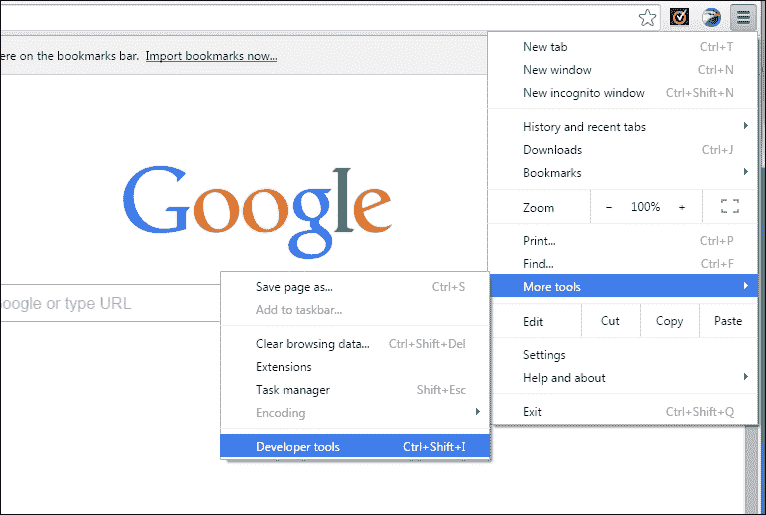
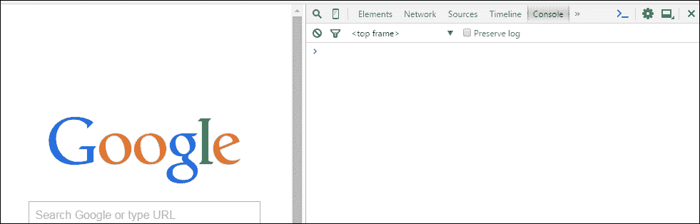

# 第一章：在控制台中探索 JavaScript

在我们开始讨论代码行，对象，变量等之前，我们需要知道 JavaScript 是什么。 JavaScript 是一种用于向网页添加交互性并构建 Web 应用程序的编程语言。静态网站如今并不太受欢迎，因此我们使用 JavaScript 使我们的网站具有交互性。

有些人也将其称为脚本语言，因为它是一种简单的语言，不像其他语言那样需要编译器。 JavaScript 并不是设计为通用编程语言，而是设计为操纵网页。您可以使用 JavaScript 编写桌面应用程序。 JavaScript 还可以访问您计算机的硬件。您可以尝试使用**软件开发工具包**（**SDK**）（例如 PhoneGap 用于移动设备或 Microsoft 应用程序 SDK 用于桌面）制作桌面应用程序。 JavaScript 代码在网页上被解释，然后由浏览器运行。例如 Firefox，Safari，Google Chrome，UC 浏览器，Opera 等任何现代互联网浏览器都支持 JavaScript。

### 注意

*编译器*是一种处理代码并将其转换为机器语言的计算机程序。使网站*交互*意味着向网站添加由用户控制的功能。例如，在线注册表格，在线计算器等。*静态*网站具有固定的对象和内容，并向所有访问者显示相同的信息。

基本上，JavaScript 包含在 HTML 页面上或写在具有`.js`扩展名的单独文件中。如果您对 HTML 一无所知，不用担心，因为您将在第三章 *介绍 HTML 和 CSS*中学习到。那么，您可以在哪里使用 JavaScript？

答案很简单，您可以执行以下操作：

+   您可以创建一个活跃的用户界面。

+   您可以控制网络浏览器。

+   您可以验证用户输入（如果输入错误）。

+   您可以创建自定义网页，可以在浏览器上弹出，包含信息或图像。

+   您可以创建动态页面而无需**公共网关接口**（**CGI**）。 CGI 由 Web 服务器用于处理浏览器的信息。

### 注意

您应该记住的是 JavaScript 不是由 Sun Microsystem 开发的编程语言 Java。

在本书中，我们将使用**Google Chrome**作为默认浏览器，**Atom**作为文本编辑器。

如果您的计算机上尚未安装这两个软件，则需要下载并安装它们。

我们将使用 Atom 文本编辑器，因为它是跨平台编辑器，具有内置包管理器，智能自动完成功能，并具有许多其他优势。

# 安装谷歌浏览器

要安装谷歌浏览器，请转到[`www.google.com/chrome`](http://www.google.com/chrome)并单击**立即下载**，如下面的屏幕截图所示：


然后按下**接受并安装**按钮，如下面的屏幕截图所示：


安装将根据您的网络速度和计算机硬件配置而完成。

### 注意

如果您不想将谷歌浏览器设置为默认浏览器，请取消选中**将谷歌浏览器设置为我的默认浏览器**。

# 安装 Atom

要安装 Atom 文本编辑器，请转到[`atom.io/`](https://atom.io/)链接并单击**下载 Windows 安装程序**，如下面的屏幕截图所示：


名为`AtomSetup.exe`的文件将开始下载。

单击`AtomSetup.exe`文件开始安装 Atom。

### 提示

确保在安装时赋予管理权限以获得更好的性能。

安装完成后，Atom 将自动启动。

如果您在另一个平台上，请使用**其他平台**链接：

+   如果您是 Mac 用户，请转到[`github.com/atom/atom/releases/latest`](https://github.com/atom/atom/releases/latest)链接，并下载`atom-X.X.X-full.nupkg`文件，其中`X.X.X`是 Atom 的版本号。双击该文件进行安装。

+   如果您是 Ubuntu 用户，您可以按照[`github.com/atom/atom/releases/latest`](https://github.com/atom/atom/releases/latest)链接并下载`atom-amd64.deb`文件。下载后，在相同的文件夹中启动您的**终端**，然后编写以下代码：

```js
sudo dpkg --install atom-amd64.deb

```

您可能需要管理员密码来安装它。安装完成后，您可以通过在终端中输入`Atom`并按*Enter*来运行 Atom。

# Chrome 开发者工具

让我们来看看用于 JavaScript 的**Chrome 开发者工具**，特别是*控制台*。由于 Google Chrome 已下载并安装在您的计算机上，打开 Google Chrome 浏览器，转到菜单（右上角），悬停在**更多工具**上，然后选择**开发者工具**，如下图所示：



您将看到以下工具：

+   **元素**

+   **网络**

+   **资源**

+   **时间线**

+   **配置文件**

+   **资源**

+   **审核**

+   **控制台**

# 我们的第一个程序

现在，让我们检查 JavaScript 是否在您的计算机上运行。

从工具中选择**控制台**。如果找不到**控制台**，请点击**>>**符号，如下所示：



一旦您的控制台打开，输入以下代码并在键盘上按*Enter*：

```js
document.write("Hello World");

```

如果您可以在左侧面板上看到如下所示的输出，那么您已成功在浏览器上配置了 JavaScript：


您将看到以下输出：

**Hello World**

恭喜！

### 注意

**下载示例代码**

您可以从[`www.packtpub.com`](http://www.packtpub.com)的帐户中下载您购买的所有 Packt 图书的示例代码文件。如果您在其他地方购买了这本书，您可以访问[`www.packtpub.com/support`](http://www.packtpub.com/support)并注册，以便直接将文件发送到您的电子邮件。

如果您看不到文本，请检查您的代码或以管理员权限安装 Google Chrome。

您还可以单击控制台的齿轮按钮。检查**禁用 JavaScript**是否未选中：


您还可以使用此工具调试您的 JavaScript 代码。

如果您输入任何错误；考虑到您忘记了`Hello World`字符串的引号，您将会得到以下错误：


为了加快编写代码的速度，您可以学习一些控制台和 Atom 文本编辑器的键盘快捷键。

以下是控制台的一些键盘快捷键：

+   *Ctrl* + *L*：清除控制台

+   *Tab*：自动完成常见前缀

+   右箭头：接受建议

+   *Ctrl* + *U*：清除控制台提示

+   上/下：下一行/上一行

+   *Enter*：执行命令

以下是 Atom 文本编辑器的一些键盘快捷键：

+   *Ctrl* + *B*：浏览打开文件列表

+   *Ctrl* +*Alt* + *R*：重新加载 Atom

+   *Ctrl* +*Shift* + *L*：更改语法高亮

+   *Alt* +*Shift* + *S*：显示可用代码片段

+   *Ctrl* +*Shift* + *M*：Markdown 预览

+   *Ctrl* +*Alt* + *I*：切换开发者工具

+   *Ctrl* + *N*：新文件

+   *Ctrl* +*Shift* + *N*：新窗口

+   *Ctrl* + *P*：打开文件（输入名称进行搜索）

+   *Ctrl* + *O*：打开文件

+   *Ctrl* +*Shift* + *O*：打开文件夹

+   *Ctrl* + *S*：保存

+   *Ctrl* +*Shift* + *S*：另存为

+   *Ctrl* + *W*：关闭标签

+   *Ctrl* +*Shift* + *W*：关闭窗口

+   *Ctrl* + *G*：转到行

+   *Ctrl* + *L*：选择行

+   *Ctrl* +*Shift* + *D*：复制行

+   *Ctrl* +*Shift* + *K*：删除行

+   *Ctrl* + 上/下：上移/下移行

+   *Ctrl* + */*：切换注释行

+   *Ctrl* + *Enter*：在下方插入新行

+   *Ctrl* + *[*/*]*：缩进/取消缩进所选行

+   *Ctrl* + *J*：连接行

+   *Ctrl* + *Alt* + *.*：完成括号

+   *Ctrl* + *M*：转到匹配的括号

+   *Ctrl* + *Alt* + *M*：选择匹配括号内的代码

+   *Ctrl* + *Alt* + */*：折叠/展开代码

+   *Ctrl* + *Alt* + *F*：折叠选定的代码

+   *Ctrl* + *Alt* + *[*/*]*：折叠/展开所有代码

+   *Ctrl* + *F*：在当前文件中查找

+   *Ctrl* + *Shift* + *F*：在项目中查找

+   *F3*：查找下一个

+   *Shift* + *F3*：查找上一个

+   *Ctrl* + *Enter*：替换所有

+   *Ctrl* + *Alt* + */*：在搜索中使用正则表达式

+   *Ctrl* + *Shift* + *=*/*-*：增加/减少文本大小

+   *Ctrl* + *0*（零）：重置文本大小

+   *F11*：切换全屏

# 为什么我们要使用 Chrome 开发者工具？

以下是 Chrome 开发者工具的使用方法：

+   易于查看错误

+   使用行号轻松编辑/调试代码

+   实时输出（无需刷新页面）

# 为什么我们要使用 Atom 作为文本编辑器？

以下是 Atom 作为文本编辑器的使用方法：

+   可嵌入性和可用性的零妥协组合

+   一个开源文本编辑器

+   每个 Atom 窗口本质上都是一个本地渲染的网页

# 练习

为了增进对 JavaScript 的了解，编写一个能打印您的名字的程序。

# 总结

在本章中，我们看到了如何下载 Google Chrome 和 Atom，并安装它们。

您学会了如何使用 Chrome 开发者工具（**控制台**）编写您的第一行代码。您还学会了一些 Chrome 开发者工具和 Atom 文本编辑器的键盘快捷键。

您还了解了 JavaScript 是什么，为什么学习 JavaScript 很重要，以及 JavaScript 与其他语言的不同之处。

现在我们可以进入 JavaScript 的世界。

您的旅程始于第二章，*使用 JavaScript 解决问题*。
