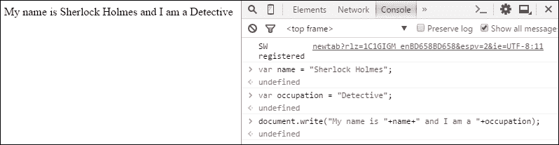
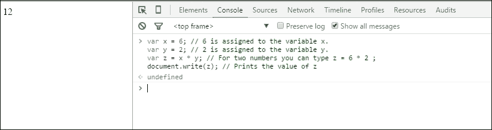
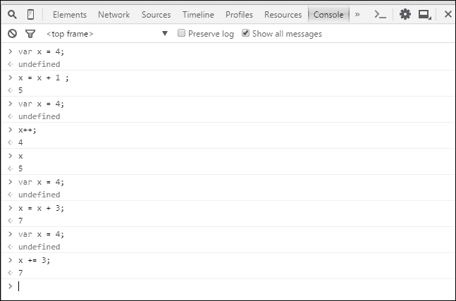
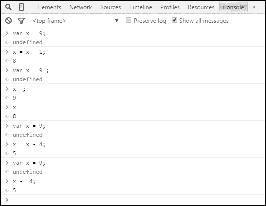
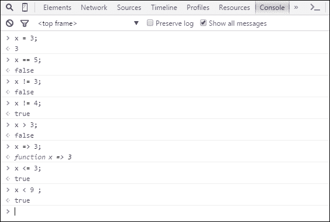

# 第二章：使用 JavaScript 解决问题

在上一章中，你已经学会了如何使用 JavaScript 在控制台上打印东西。现在，让我们看看 JavaScript 语法、变量、算术运算符和注释背后的基本原理。

在计算机世界中，除了数据什么都没有。你可以读取、修改和创建新的数据；然而，任何不是数据的东西根本就不存在。在 JavaScript 中，我们需要处理数据来开发网站。

要理解 JavaScript 的基本语法，首先你需要知道 JavaScript 是*区分大小写*的。你不能在 JavaScript 中交换大小写字母。因此，在处理 JavaScript 语法时，你需要记住写代码不是唯一重要的任务，你还必须注意语法是否写得正确。

让我给你举个例子。在上一章中，你已经成功地使用`document.write();`语法在浏览器上打印了**Hello World**。

如果你写了`Document.write("Hello World");`会发生什么？是的！它不会成功运行。你会得到一个错误消息。这种错误被称为**未捕获的语法错误**。

JavaScript 语句通常写在一行上。你可以用分号结束你的语句，也可以不用。结束语句不是强制性的。然而，每个语句后面加上分号是一个好习惯。

让我们考虑以下例子：

```js
document.write("Hello");
document.write("World");
document.write("!");
```

它的输出将如下所示：


### 注意

JavaScript 关键字（如 for、while、if、switch、case 等）始终是小写的。内置对象（如 Date、Math、Number 等）以大写字母开头。

# 变量

我们已经知道计算机世界除了数据什么都没有。

有不同类型的数据（我们称之为*数据类型*），如下所示：

+   你的名字是一种数据

+   你的年龄是数据

+   你的成绩也是数据

然而，它们都是不同的。它们之间有什么区别？你的名字只包含一组*字符*，或者有些人也称之为**字符串**。你的年龄是一个**整数**类型的数据。你的成绩是一个**浮点数**类型的数据。JavaScript 中的奇妙之处在于，在写一个*变量*的名字之前，你不必指定数据类型。

### 注意

JavaScript 允许使用三种数据类型。字符串（例如，`"这是一个字符串的例子"`），数字（例如，`2015`，`3.1415`等），和布尔值（例如，`true`或`false`）。

我们讨论过*变量*了吗？好吧，你已经知道了数据类型。你需要*某物*来存储你的数据。这个*某物*就叫做*变量*。在 JavaScript 中，我们在变量名之前使用`var`。记住，`var`以小写字母开头。

让我们考虑以下例子：

```js
var x;
var y;
var sum;
var name;
```

假设我们有 14 个苹果和 6 个橙子。为了把它们存储在变量中，我们将使用以下方法：

```js
var apples = 14;
var oranges = 6;
```

下面的例子不一样。你能告诉为什么吗？

```js
var Apples = 14;
var apples = 14;
var APPLES = 14;
var appleS = 14;
```

是的，JavaScript 是区分大小写的。所有的变量在这里都是不同的，尽管变量的值是相同的。

现在，让我们做一些编码。之前在控制台上，你打印了你的名字作业。我希望你能毫无困难地完成。现在我们用一个变量来以不同的方式打印你的名字，怎么样？假设你的名字是`夏洛克·福尔摩斯`。这是什么类型的数据？

你说得对，它是*字符串*类型。通常对于字符串类型的数据，我们把字符串放在两个引号之间。

让我们考虑以下例子：

```js
var name = "Sherlock Holmes";
var occupation = "Detective"
```

要在控制台上打印它们，你需要输入每个语句并按*Enter*。看一下下面的图片：


### 注意

不要在控制台上复制和粘贴代码。你可能会得到一个语法错误。

当你按下*Enter*后，会出现一个额外的行，显示`undefined`。现在不用担心这个。这只是返回了一个控制台日志。

您将`福尔摩斯`字符串存储在`name`变量中，将`侦探`存储在`occupation`中。每次访问`name`或`occupation`时，您都可以访问到这些字符串。

假设您想要在屏幕上打印**福尔摩斯**。只需输入以下内容：

```js
document.write(name);
```

输入后，按*Enter*。您将看到**福尔摩斯**被打印在屏幕上，如下所示：


输入`document.write(occupation);`并按*Enter*，如下截图所示：


您可能会想知道为什么**福尔摩斯**和**侦探**之间没有空格。因为在控制台上，左侧的网页历史不会自动从上一个字符串之后移除，并且在您为第二个输出（`occupation`）按*Enter*之后，字符串会直接放在前一个字符串的后面。这种情况将一直发生，除非您使用*Ctrl* + *L*键盘快捷键清除控制台，并按*F5*键重新加载网页。

### 注意

当重新加载网页时，您存储的变量也将从内存中被擦除。不用担心，下一章节将教您如何在文件中使用存储的变量。

如果您想要连接两个（或多个）变量，您需要在两个变量之间添加加号（`+`），如下所示：

```js
document.write(name+occupation);
document.write(occupation+name);
```

您能告诉我这些命令的输出将是什么吗？

是的，您是对的。输出将如下所示：

**福尔摩斯侦探**

**侦探福尔摩斯**

### 注意

您的输出可能会在网页上显示为一行。如果您想要换行，可以添加`<br>`HTML 标签。最简单的方法是输入`document.write("<br>");`并按*Enter*。您的下一个输出将在新的一行上。

如果您想在两个字符串之间添加任何字符串（例如空格），而不是任何变量，只需输入以下内容：

```js
document.write(name+" "+occupation);
```

输出将如下所示：

**福尔摩斯侦探**

当您输入以下代码并按*Enter*时会发生什么？

```js
document.write("My name is "+name+" and I am a "+occupation);
```

是的！您是绝对正确的。输出将如下所示：

**我的名字是福尔摩斯，我是一名侦探**



现在，在控制台上添加另一个变量。考虑`福尔摩斯`是 24 岁。您还记得年龄是什么类型的数据吗？

是的，这是一个整数类型的数字。因此，输入以下代码并按*Enter*：

```js
var age = 24;
```

您现在有以下三个变量：

+   姓名

+   职业

+   年龄

让我们在网页上打印以下输出：

**我的名字是福尔摩斯，我今年 24 岁，我是一名侦探**

我们的控制台代码将是什么？

代码如下：

```js
document.write("My name is "+name+", I\'m "+age+" years old and I am a "+occupation);
```

输出如下所示：


### 提示

**打印引号/倒置逗号**

如果您想使用`document.write();`语法打印**莎士比亚说：“生存还是毁灭，这是一个问题！”**，您可能会输入以下代码：

```js
document.write("Shakespeare said, "To be, or not to be: that is the question!"");
```

然而，这将导致一个名为**SyntaxError**的错误。为了摆脱这个错误，您需要在两个倒置逗号之前使用反斜杠（`\`）。正确的代码将如下所示：

```js
document.write("Shakespeare said, \"To be, or not to be: that is the question!\"");
```

输出将如下所示：

**莎士比亚说：“生存还是毁灭，这是一个问题！”**

单引号（`'`）也适用相同的规则。

这里有一个快速练习给你：

1.  假设`汤姆`有一只猫（`露西`）。这只猫，`露西`，今年`2.4`岁。将姓名、猫的名字和年龄分别存储在三个不同的变量中，并使用控制台打印以下输出：

**汤姆的猫露西今年 2.4 岁。**

1.  假设您购买了`4`磅的苹果。每磅花费了您`$1.2`。将苹果的价格和数量分别存储在两个不同的变量中，并使用控制台打印以下输出：

**我买了 4 磅的苹果。每磅我需要支付 1.2 美元。**

# 评论

假设你已经做了很多编码和一些逻辑操作，并在 JavaScript 中使用了许多变量，如果出现任何错误，你希望我帮你处理代码。当你把代码发给我时，除非我对 JavaScript 有清楚的了解，或者你在重要的行上做了注释，否则我不会知道你输入了什么。

注释基本上是浏览器在运行时忽略的一行文本或代码。你可以把注释比作便利贴或提醒。

让我们考虑以下例子：

```js
Var name = "Sherlock Holmes"; // This is a string
Var occupation = "Detective"; // This variable stores information
Var age = 14; // This is an integer type of data.
```

如何创建多行注释？你可以这样提到注释：

```js
/*
  This is a multiline comment.
  The browser will ignore this.
  You can type any important information on your comment.
*/
```

你的多行注释应该在`/*`和`*/`之间，如下截图所示：


# 算术运算符

在 JavaScript 中，就像其他编程语言一样，我们可以进行一些算术运算。在学校里，你可能已经学会了如何将两个数字相加，从一个数字中减去另一个数字，将两个数字相乘，并将一个数字除以另一个数字。你可以用几行代码在 JavaScript 中做所有这些事情。

在 JavaScript 中，我们使用以下算术符号进行运算：

| 运算符 | 描述 |
| --- | --- |
| + | 加法 |
| - | 减法 |
| * | 乘法 |
| / | 除法 |
| % | 找到余数（称为取模运算符） |

## 加法

假设你有两个变量`x`和`y`，它们的值分别是`3`和`4`。我们应该在控制台上做什么来存储变量的值？

是的，我们做以下操作：

```js
var x = 3; // 3 is stored on variable x
var y = 4; // 4 is stored on variable y
```

然后，按*Enter*。

再取另一个变量，它将保存`x`和`y`的总和，如下所示：

```js
var z = x+y; // This syntax stores the sum of x and y on z
```

你能告诉我当我们打印`z`时会发生什么吗？

```js
document.write(z);
```

是的，你是对的，这将打印**7**，如下截图所示：


## 减法

要从一个数字中减去另一个数字，你需要在它们之间放一个减号（-）。

让我们考虑以下例子：

```js
var x = 9; // 9 is assigned to the variable x.
var y = 3; // 3 is assigned to the variable y.
var z = x - y ; // This syntax subtracts y from x and stores on z.
document.write(z); // Prints the value of z.
```

这段代码的输出是**6**，如下截图所示：


## 乘法

要对存储在两个整数或浮点类型数据的变量或数字进行乘法，只需在变量或数字之间放一个星号（`*`）。

让我们看下面的例子：

```js
var x = 6; // 6 is assigned to the variable x.
var y = 2; // 2 is assigned to the variable y.
var z = x * y; // For two numbers you can type z = 6 * 2 ;
document.write(z); // Prints the value of z
```

这段代码的输出是**12**，如下截图所示：



## 除法

要将一个数字除以另一个数字，你需要在数字之间放一个斜杠（`/`）。

让我们看下面的例子：

```js
var x = 14; // assigns 14 on variable x.
var y = 2; // assigns 2 on variable y. 
var z = x / y; // divides x with y and stores the value on z. 
document.write(z); // prints the value of z. 
```

这段代码的输出是**7**，如下截图所示：


## 取模

如果你想找到一个数字与另一个数字的模，你需要在数字之间放一个百分号（`%`）。

让我们考虑以下例子：

```js
var x = 34; // assigns 34 on the variable x. 
var y = 3; // assigns 3 on the variable y. 
var z = x % y ; // divides x with y and returns the reminder and stores on the variable z
document.write(z);
```

这段代码的输出是**1**，如下截图所示：


### 提示

**取模（%）运算符是做什么的？**

好吧，从你的数学课上，你已经学会了如何将一个数字除以另一个。比如，你将 10 除以 2。结果将是 5，这是一个整数类型的数字。然而，如果你将 10 除以 3 会发生什么？答案不会是一个整数。值是 3.333333333333。你也可以说答案是 3，余数是 1。考虑以下：

`10 = 9 + 1;`

也就是，`(9+1)/3`

`= 9/3+1/3`

`= 3 + 1/3;`

因此，余数是 1。取模的作用是找出余数并返回它。因此，`10%3 = 1`。

现在，让我们总结我们迄今为止学到的所有算术运算符在一个单一的代码中。

你能告诉我以下行的输出是什么吗？

```js
var x = 5 ;
var y = 4 ;
var sum = x + y ;
var sub = x - y ;
var mul = x * y ;
var div = x / y ;
var mod = x % y ;
document.write("The summation of x and y is "+ sum + "<br>") ;
document.write("The subtraction of x and y is " + sub + "<br>") ;
document.write("The multiplication of x and y is " + mul + "<br>");
document.write("The division of x and y is " + div + "<br>") ;
document.write("The modulus of x and y is " + mod + "<br>") ;
```

你将得到以下输出：

**x 和 y 的总和是 9**

**x 和 y 的减法是 1**

**x 和 y 的乘积是 20**

**x 和 y 的除法是 1.25**

**x 和 y 的模是 1**

这个输出可以在以下截图中看到：


我猜你做对了。现在，让我们在下面解释它们：

+   我们分别给`x`和`y`分配了`5`和`4`

+   我们将`x`和`y`的总和分配给`sum`变量，`x`和`y`的减法分配给`sub`变量，`x`和`y`的乘法分配给`mul`变量，`x`和`y`的除法分配给`div`变量，`x`和`y`的模数分配给`mod`变量

+   然后，我们使用`document.write();`语法打印它们

+   我们使用`<br>`HTML 标签来分隔每行的输出

考虑以下示例：

约翰有 56 支笔。他想把它们排成七行。每行将有相等数量的笔。编写一个代码，将打印出每行的笔数。

（提示：为笔的数量和行数取两个变量，将笔的数量除以行数并将值存储在一个新变量中。）

示例输出如下：

**约翰将不得不在每行放置 XX 支笔。 // XX 是笔的数量**

# 更多的运算符和操作

JavaScript 有更多的运算符，除了前面提到的那些。让我们深入一点。

## 增量或减量运算符

如果您有一个整数，想要将其增加 1 或任何数字，您可以输入以下内容：

```js
var x = 4; // assigns 4 on the variable x.
x = x + 1;
/* since x=4, and you are adding 1 with x, so the final value is 4 + 1 = 5, and 5 is stored on the same variable x. */
```

您也可以通过输入以下内容将变量增加 1：

```js
var x = 4; // assigns 4 on the variable x.
x++; // This is similar to x = x + 1.
```

如果您想要将变量增加多于 1，您会怎么做？好吧，您可以按照以下步骤：

```js
var x = 4; // assigns 4 on the variable x.
x = x + 3; // Say, you want to increment x by 3.
/* since x = 4, and you are adding 3 with x, so the final value is 4 + 3 = 7, and 7 is stored on the same variable x. */
```

您也可以通过输入以下内容来增加您的变量：

```js
var x = 4; // assigns 4 on the variable x.
x += 3; // This is similar to x = x + 3.
```

### 提示

请记住，您不应该在运算符（例如+，-，*，/等）和等号（=）之间放置空格。

输出将在控制台上看起来类似于以下截图：



那么减量运算符呢？是的，你完全正确。减量操作与增量操作相同。唯一改变的是符号。您的加法（`+`）运算符将被减法运算符（`-`）替换。让我们看一个例子：

```js
var x = 9; // assigns 9 on the variable x.
x = x - 1;
/* since x = 9, and you are subtracting 1 from x, so the final value is 9 - 1 = 8, and 8 is stored on the same variable x. */
```

您还可以通过输入以下内容将变量减少`1`：

```js
var x = 9; // assigns 9 on the variable x.
x--; // This is similar to x = x - 1.
```

如果您想要将变量减少多于`1`，您可以按照以下步骤：

```js
var x = 9; // assigns 9 on the variable x.
x = x - 4; // Say, you want to decrement x by 4.
/* since x = 9, and you are subtracting 4 from x, so the final value is 9 - 4 = 5, and 5 is stored on the same variable x. */
```

您还可以通过输入以下内容将变量减少：

```js
var x = 9; // assigns 9 on the variable x.
x -= 4; // This is similar to x = x - 4.
```

这些代码的输出可以在以下截图中看到：



这种类型的操作对于 JavaScript 中的逻辑操作非常重要。您将在第四章*深入了解*中了解它们的用途。

## 赋值运算符

赋值运算符将一个值分配给一个运算符。我相信你已经了解了赋值运算符，不是吗？好吧，你在一个变量和它的值之间使用一个等号(`=`)。通过这样做，您将值分配给变量。

让我们看看以下示例：

```js
var name = "Sherlock Holmes"
```

`Sherlock Holmes`字符串被分配给`name`变量。您已经学习了增量和减量运算符。你能告诉我以下代码的输出将是什么吗？

```js
var x = 3; 
x *= 2; 
document.write(x); 
```

输出将是**6**。

您还记得为什么会发生这种情况吗？

`x *= 2;`等式类似于`x = x * 2;`，因为`x`等于`3`，然后乘以`2`。最终的数字（`3 x 2 = 6`）被分配给相同的`x`变量。这就是为什么我们得到以下输出的原因：


让我们进行以下练习：

以下代码的输出是什么？

```js
var w = 32;
var x = 12;
var y = 9;
var z = 5;
w++;
w--;
x*2;
y = x;
y--;
z%2;
document.write(" w = "+w+ ", x = "+x+ ", y =  "+ y+", z =  "+z  );
```

我们将得到以下输出：

**w = 32, x = 12, y = 11, z = 5**

这个输出可以在以下截图中看到：


## JavaScript 比较和逻辑运算符

如果您想在 JavaScript 中做一些逻辑操作并比较两个数字或变量，您需要使用一些逻辑运算符。以下是一些比较运算符的示例：

| 运算符 | 描述 |
| --- | --- |
| == | 等于 |
| != | 不等于 |
| > | 大于 |
| < | 小于 |
| => | 等于或大于 |
| <= | 小于或等于 |

以下是使用这些运算符的一些示例：



您将在接下来的章节中了解更多关于这些运算符的用法。

让我们讨论一些位逻辑运算符和位运算符：

| 运算符 | 描述 |
| --- | --- |
| && | 这意味着 AND 运算符。我们使用它来检查两个或更多语句是否为真。 |
| &#124;&#124; | 这意味着 OR 运算符。我们使用它来检查任何语句是否为真。 |
| ~ | 这意味着 NOT 运算符。 |
| ^ | 这意味着 XOR 运算符。 |
| >> | 这意味着右移运算符。 |
| << | 这意味着左移运算符。 |

它们可能对您现在来说很难学。不用担心，您现在不必使用它们。我们将在第四章，*深入了解*中使用它们。

# 总结

在本章中，您学习了 JavaScript 语法。我们讨论了 JavaScript 变量以及如何为变量赋值。您学会了如何对代码进行注释。您现在知道了为什么注释很重要。最后，您学会了一个重要的主题：运算符和操作。如今，JavaScript 如果不使用运算符和逻辑函数，就不会那么丰富。因此，学习逻辑运算是获得 JavaScript 良好知识的关键。

我建议您在家里练习本章中的所有代码。您只需在控制台上输入它们，避免复制和粘贴代码。这将妨碍您的学习。作为程序员必须有良好的打字速度，复制和粘贴代码不会提高这一技能。您可能在输入代码时遇到问题；然而，您会学到的。

您可以使用 JavaScript 解决任何算术问题。您还可以在控制台上检查您的逻辑是真还是假。如果您能做到这一点，我们可以继续下一章，第三章，*介绍 HTML 和 CSS*，在那里您将学习有关 HTML、CSS 等的知识。
