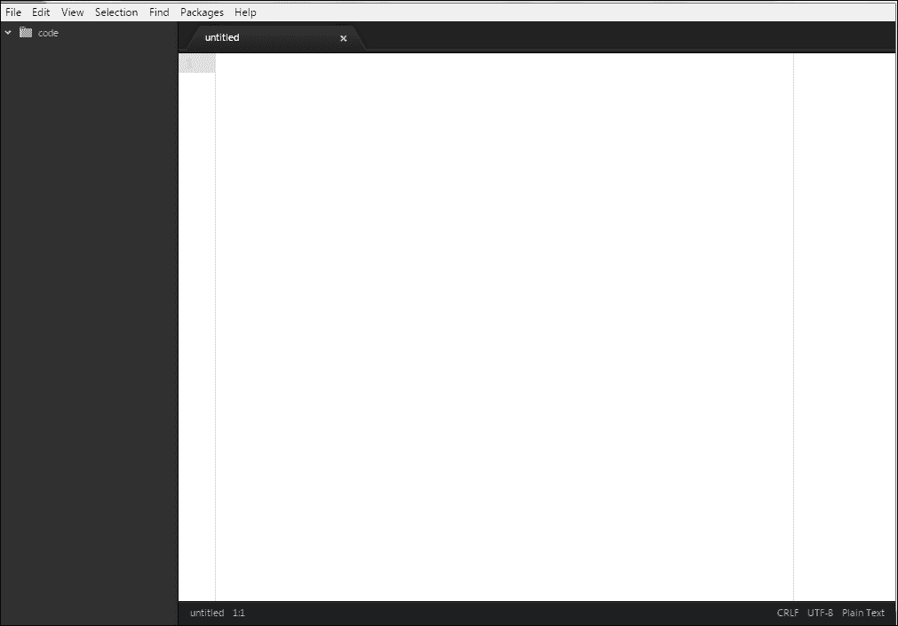
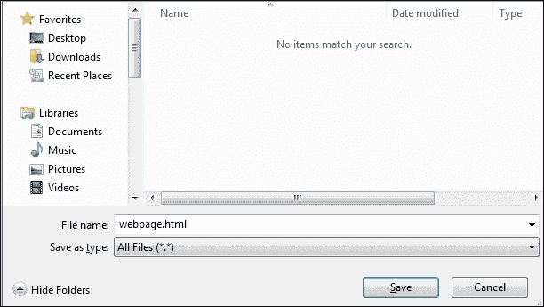
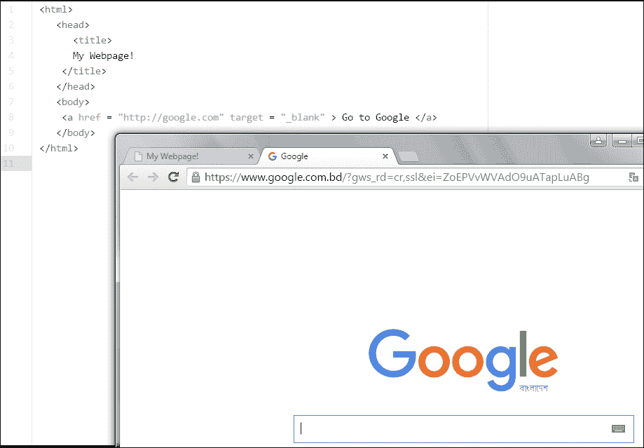
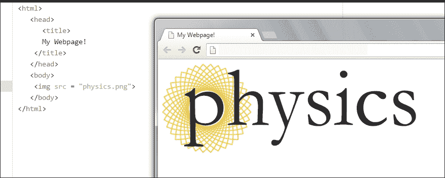

# 第三章。介绍 HTML 和 CSS

您已经在上一章学习了 JavaScript 语法、算术运算符和注释。我们用控制台来实现这些目的。现在，您想学习一些有趣的东西，这将为您成为一名优秀的 JavaScript 程序员铺平道路吗？在本章中，我们将学习**超文本标记语言**（**HTML**）语法、**层叠样式表**（**CSS**）语法以及如何在 HTML 页面中使用 JavaScript。

HTML 是网页的源代码。您在 Web 浏览器上加载的所有网页都是用 HTML 构建的。转到任何网站（例如，[`www.google.com`](https://www.google.com)）并在键盘上按*Ctrl* + *U*（在 Mac 上，点击*command* + *U*），您将获得网页的源代码。这适用于所有现代 Web 浏览器，如 Firefox，Google Chrome，UC 等。

您将看到的整个代码都是 HTML。您还可能会找到一些带有 JavaScript 的行。因此，为了了解网页的结构（页面背后的代码），您需要了解 HTML。这是网络上最简单的语言之一。

# HTML

HTML 是一种标记语言。这是什么意思？嗯，标记语言使用特定的代码来处理和呈现文本，用于格式、样式和布局设计。有很多标记语言（例如，**业务叙述标记语言**（**BNML**），**ColdFusion 标记语言**（**CFML**），**Opera** **二进制标记语言**（**OBML**），**系统** **生物标记语言**（**SBML**），**虚拟人标记语言**（**VHML**）等）；然而，在现代网络中，我们使用 HTML。HTML 基于**标准通用标记语言**（**SGML**）。SGML 基本上用于设计文档纸。

### 注意

有许多 HTML 版本。HTML 5 是最新版本。在本书中，我们将使用最新版本的 HTML。

在开始学习 HTML 之前，让我问问您最喜欢的网站是什么。网站包含什么？一些网页？您可能会看到一些文本，一些图像，一两个文本字段，按钮以及每个网页上的一些其他元素。所有这些元素都是由 HTML 格式化的。

让我向您介绍一个网页。在您的互联网浏览器中，转到[`www.google.com`](https://www.google.com)。您将看到以下图像中显示的页面：


您在浏览器顶部看到的第一件事是网页的标题。让我们观察一下刚刚加载的页面：

+   在这里，标记的框，**1**，是我们加载的网页的标题。

+   第二个框，**2**，表示一些链接或文本。

+   页面中间的**Google**是一个图像。

+   第三个框，**3**，包含两个按钮。

+   你能告诉我页面右上角的**登录**是什么吗？是的，这是一个按钮。

让我们演示 HTML 的基本结构。术语*标签*将经常用于演示结构。

HTML 标签只是在小于号（`<`）和大于号（`>`）之间的一些预定义词。因此，标签的结构是`<WORD>`，其中`WORD`是互联网浏览器识别的预定义文本。这种类型的标签称为开放标签。还有另一种类型的标签，称为关闭标签。关闭标签的结构类似于`</WORD>`。您只需在小于号后面放一个斜杠。

在本节之后，您将能够使用 HTML 制作自己的网页。HTML 页面的结构类似于以下图像。这个图像有八个标签。让我们介绍所有这些标签及其活动，如下所示：


+   **1**：标签`<html>`是一个开放标签，在第**15**行关闭，使用`</html>`标签。

+   这些标签告诉您的互联网浏览器，这两个标签中的所有文本和脚本都是 HTML 文档。

+   **2**：这是`<head>`标签，是一个开放标签，在第**7**行关闭，使用`</head>`标签。

+   这些标签包含网页的标题、脚本、样式和元数据。

+   **3**：这是`<title>`标签，在第**4**行关闭，使用`</title>`标签。

+   此标签包含网页的标题。上一张图片的标题是**Google**。要在 Web 浏览器上看到这个，您需要输入以下内容：

```js
<title> Google </title>
```

+   **4**：这是`<title>`标签的关闭标签。

+   **5**：这是`<head>`标签的关闭标签。

+   **6**：这是`<body>`标签，在第**13**行关闭，使用`</body>`标签。

您在网页上看到的所有内容都是在这两个标签之间编写的。每个元素、图像、链接等都在这里格式化。要在浏览器上看到这是一个网页，您需要输入以下内容：

```js
<body>
This is a web page.
</body>
```

+   **7**：`</body>`标签在此处关闭。

+   **8**：`</html>`标签在此处关闭。

## 您的第一个网页

您刚刚学习了 HTML 页面的八个基本标签。现在您可以制作自己的网页。怎么做？为什么不和我一起尝试一下呢？

1.  打开您的文本编辑器（您已经在本书的第一章中安装了 Atom，*在控制台中探索 JavaScript*）。

1.  按下*Ctrl* + *N*，将打开一个新的`untitled`文件，如下图所示：

1.  在空白页面上输入以下 HTML 代码：

```js
<html>
  <head>
    <title>
      My Webpage!
    </title>
  </head>
  <body>
    This is my webpage :)
  </body>
</html>
```

1.  然后，按下*Ctrl* + *Shift* + *S*，这将提示您在计算机上的某个位置保存您的代码：

1.  在**文件名：**字段中输入一个合适的名称。我想将我的 HTML 文件命名为`webpage`，因此我输入了`webpage.html`。您可能想知道为什么我添加了一个扩展名（`.html`）。

### 注意

由于这是一个 HTML 文档，您需要在给网页命名后添加`.html`或`.htm`。`.htm`扩展名是`.html`的旧形式。它的限制是保持文件扩展名为三个字符，因此人们使用`.htm`而不是`.html`。您也可以使用`.htm`。

1.  按下**保存**按钮。这将在您的计算机上创建一个 HTML 文档。转到您刚刚保存 HTML 文件的目录。

### 注意

请记住，您可以给您的网页任何名称。但是，这个名称不会显示在您的浏览器上。这不是您网页的标题。最好不要在网页名称中保留空格。例如，您想将 HTML 文件命名为`这是我的第一个网页.html`。您的计算机在 Internet 浏览器上显示结果时不会遇到问题；但是，当您的网站在服务器上时，这个名称可能会遇到问题。因此，我建议您在需要添加空格的地方使用下划线（`_`），例如`This_is_my_first_webpage.html`。

1.  您会发现一个类似以下图像的文件：

1.  现在，双击文件。您将在 Internet 浏览器上看到您的第一个网页！！您的第一个网页

您在`<title>`和`</title>`标签之间输入了`My Webpage!`，这就是为什么您的浏览器在第一个选择框中显示这个。**1**。您在`<body>`和`</body>`标签之间输入了`This is my webpage :)`。因此，您可以在第二个选择框中在浏览器上看到文本。**2**。

恭喜！您创建了您的第一个网页！

### 注意

你可以通过右键单击文件并选择**使用 Atom 打开**来编辑`webpage.html`文件的代码和其他文本。在重新在浏览器中打开文件之前，您必须保存（*Ctrl* + *S*）您的代码和文本。

## 更多 HTML 标签

有许多 HTML 标签可用于格式化网页的文本和对象。我们现在来学习其中一些吧？

| 描述 | 带示例的语法 | 浏览器上的结果 |
| --- | --- | --- |
| 粗体文本 | `<b>这是粗体</b>` | **这是粗体** |
| 斜体文本 | `<i>这是斜体</i>` | *这是斜体* |
| 下划线文本 | `<u>下划线文本</u>` |  |
| 删除的文本 | `<del>删除我</del>` |  |
| 下标文本 | `CO<sub>2</sub>` | CO2 |
| 上标 | `3x10<sup>8</sup>` | 3x108 |
| 最大标题 | `<h1>嗨，孩子们！</h1>` |  |
| 最小标题 | `<h6>嗨，孩子们</h6>` |  |
| 段落文本 | `<p>这是一个段落</p>` | 这是一个段落 |
| 断开标签 | `This <br>is <br>a break;` | This is a break; |

### 注意

有六个标题标签（`<h1>`到`<h6>`）。如果需要，你可以为一个文本添加多个标签。例如：`<b><i><u> JavaScript </b></i></u>`将有以下输出：。关闭标签的顺序没有特定的顺序。最好的做法是遵循打开标签的顺序。

## 着色 HTML 文本

要给 HTML 文本着色，我们可以输入以下内容：

```js
<font color = "Green"> I am green </font>
```

你可以在两个引号之间输入任何标准颜色名称（`" "`）。你也可以使用十六进制颜色代码，如下所示：

```js
<font color = "#32CD32"> I am green </font>
```

这里，`32CD32`是绿色的十六进制代码。看看下面的图片。左边是代码，我们在其中使用了颜色名称和十六进制代码。右边是我们浏览器的输出： 


### 注意

十六进制颜色代码由六位数字组成（它是一个十六进制数）。它以井号或哈希号（`#`）开头，我们在其后放置六位十六进制数。十六进制数表示红色、蓝色和绿色的数量。每两位数字表示`00`到`FF`（十六进制数）。在这个例子中，我们使用`#32CD32`表示绿色。`32`、`CD`和`32`分别是十六进制中红色、蓝色和绿色的数量。

如果你不知道什么是十六进制数，记住我们使用十进制数，其中使用了 10 个数字（0、1、2、3、4、5、6、7、8 和 9）。然而，在十六进制数中，我们使用 16 个数字（0、1、2、3、4、5、6、7、8、9、A、B、C、D、E 和 F）。

我建议你使用这个网站（[`html-color-codes.info/`](http://html-color-codes.info/)）获取你喜欢的颜色的十六进制代码，而不用考虑十六进制代码。

## 链接 HTML 文本

要创建文本超链接，我们使用锚标签如下所示：

```js
<a href = "http://www.google.com"> Go to Google </a>
```

这段代码的输出将是一个链接。如果你点击链接，它会将你发送到我们在引号中使用的 URL（这里是[`www.google.com`](http://www.google.com)）。

如果你想在浏览器的新标签中打开你的链接，你需要添加一个目标，如下所示：

```js
<a href = "http://google.com" target = "_blank" > Go to Google </a>
```

这里，`target="_blank"`是一个属性，告诉你的浏览器在新标签中打开链接。还有一些其他属性。你可以在家里尝试它们，然后告诉我们你在浏览器上看到了什么。

其他属性还有`_parent`、`_self`和`_top`。以下图像具有带有`_blank`属性的代码。它在新标签中打开[`google.com`](http://google.com)。我建议你找出其他属性的作用：



## 插入图像

在 HTML 文档中插入图像非常容易。你只需要找到图像文件的扩展名。我们用来插入图像的标签如下所示：

```js

```

`src`属性是你的图像来源。如果你的图像放在 HTML 文件的同一个目录中，你不需要写整个文件来源。在本书中，我们将保持我们的图像文件在同一个目录中，我们保存我们的 HTML 文件。

假设我在保存 HTML 文档的同一个文件夹中有一张图片。图片的名称是`physics`，扩展名是`.png`。现在，要在 HTML 文档中添加这个图片，我需要添加以下代码：

```js

```



### 注意

在 HTML 文档中使用三种类型的图像。**可移植网络图形**（**PNG**），**图形交换格式**（**GIF**）和**联合图像专家组**（**JPG**或**JPEG**）。要找到图像的扩展名，请右键单击图像，转到**属性**，然后点击**详细信息**选项卡，直到找到**名称**字段。您将找到带有扩展名的图像名称。根据您的操作系统，您的机器上的程序可能有所不同。

如果您想设置图像的高度和宽度，您需要使用两个属性，如下所示：

```js
< img src = "physics.png" width="100" height="40">
```

这里，`100`和`40`是图像的像素。在以前的 HTML 版本中，它被定义为像素或百分比。

### 注意

像素是图像的最小单位。如果您希望在不同屏幕尺寸上看到相同比例的图像，最好使用百分比（`%`），否则，您可以使用像素（`px`）单位。

输出将类似于以下内容：


还有更多的 HTML 标签；但是，我们已经涵盖了大部分用于构建网页的标签。您能想象以下代码的输出吗？

```js
<html>
  <head>
    <title>
      Example
    </title>
  </head>
  <body>
    <h1> This is a headline </h1>
    <h2> This is a headline </h2>
    <h3> This is a headline </h3>
    <h4> This is a headline </h4>
    <h5> This is a headline </h5>
    <h6> This is a headline </h6>
    <b>This is a bold text</b>. But <i>This is an italic text</i>. We can <u> underline</u> our text. <a href = "http://www.google.com">Go to Google </a> <br>
    <font color = "#AA2FF">This is colorful text</font>
    <br>
    
  </body>
</html>
```

代码的输出将类似于以下图像：


# CSS

如果您想要使您的网页美观，您必须了解 CSS。CSS 是一种语言，允许您描述您的网页，为文本着色，更改文本的字体，并修改网页的布局。

CSS 语法有两个部分：

+   选择器

+   装饰器

在继续学习 CSS 之前，您需要介绍自己使用 HTML 标签：

```js
<style>

</style>
```

此标签应保留在`<head></head>`标签之间。因此，代码的结构将如下所示：

```js
<html>
  <head>
    <title>
    </title>
    <style>
      // your codes will be typed here
    </style>
  </head>
  <body>
  </body>
</html>
```

CSS 代码将被写在`<style></style>`标签之间。

要格式化文本，您需要记住用于文本的标签。假设您在 HTML 文档的正文中使用`<h1></h1>`标签中有一段文本，如下所示：

```js
<h1> This is an example of HTML text. </h1>
```

要应用 CSS，您需要在`<style> </style>`标签之间输入以下内容：

```js
<html>
  <head>
    <title>
    </title>
    <style>
      h1 {
      color:green;
      text-decoration: underline;
      text-align: center;
      }
    </style>
  </head>
  <body>
    <h1>This is an example of HTML text </h1>
  </body>
</html>
```

代码的输出将如下所示：


仔细看代码。我们在`<h1></h1>`标签中的文本中使用了以下 CSS：

```js
      h1 {
      color:green;
      text-decoration: underline;
      text-align: center;
      }
```

在这里，我们使用了一些 CSS 语法（`color`，`text-decoration`等）。还有许多 CSS 语法，也称为属性（每个属性可能包含多个值）。

# HTML 页面上的 JavaScript

您已经学会了如何在控制台上使用 JavaScript 打印内容。在 HTML 页面上怎么样？在这之前，让我们介绍一个 HTML 标签，`<script></script>`。我们的 JavaScript 代码将在这些标签之间。

由于有很多脚本语言，我们需要在这些标签之间定义我们正在使用的语言类型。因此，我们输入以下内容：

```js
<script type = "text/javascript">
  // Our JavaScript Codes will be here. 
</script>
```

让我们看一个例子。在上一章中，您学会了如何在控制台上使用 JavaScript 进行基本操作。现在，我们将在 HTML 页面的`<script></script>`标签之间执行一些操作。仔细看以下代码：

```js
<html>
  <head>
    <title>
      JavaScript Example
    </title>
  </head>
  <body>
    <script type="text/javascript">
      var x = 34;
      var y = 93;
      var sum = x+y;
      document.write("The sum of "+x+" and "+y+" is "+sum);
    </script>
  </body>
</html>
```

代码的输出将如下所示：


我希望你能自己猜出代码的输出。

# 摘要

在本章中，您学会了 HTML，CSS 及其语法和用法。我们还介绍了如何在 HTML 文档中实现 JavaScript。现在，您可以构建自己的网页，并使用 JavaScript 使其更加美妙。我建议您不要跳过本章的任何部分，以便更好地理解下一章，第四章，*深入了解*。
