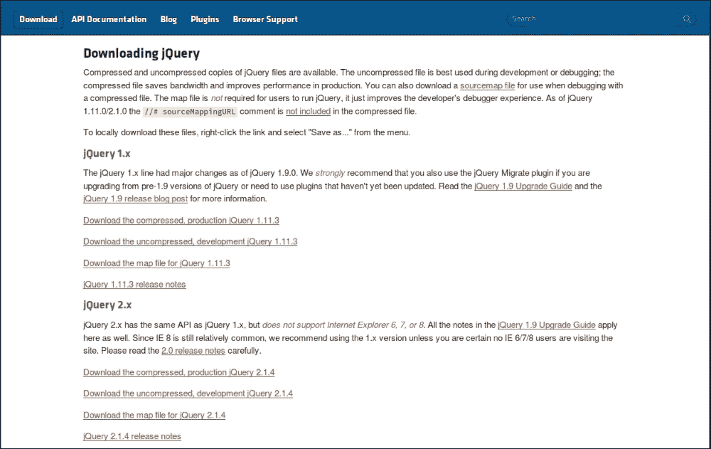

# 第六章：探索 jQuery 的好处

如果你已经阅读了上一章，你可能已经在你的**战舰**游戏中实现了**jQuery**。在本章中，我们将详细讨论 jQuery。

jQuery 库是一个 JavaScript 框架。它于 2006 年发布。人们过去称它为**jSelect**。我们在我们的网站中使用 jQuery，这样我们就可以更轻松地使用 JavaScript 并为我们的网页添加效果。你可能会认为 jQuery 与 JavaScript 不同。不！jQuery 只是另一个 JavaScript 文件。它是一个非常轻量级的库，可以帮助你更轻松地装饰你的网页，编写更少的代码。

我们使用 jQuery 是因为以下优势：

+   它是开源的；如果需要，你可以编辑或修改它的代码

+   它是一个小型库（大约 150 KB 文件）

+   jQuery 的社区支持非常强大；你可以轻松地从用户那里获得帮助

+   它用户友好且流行

+   它支持跨浏览器

+   它是公开开发的；你可以通过编辑代码来修复任何错误或添加功能

+   它帮助开发人员通过使用 AJAX 构建响应式网站

+   它具有内置的动画功能，帮助开发人员在他们的网站中创建动画

# 安装 jQuery

问题是在哪里找到 jQuery。嗯，你可以在[`jquery.com/`](http://jquery.com/)找到它。我也在这本书中附上了文件。你可以从那里下载。

如果你去[`jquery.com/`](http://jquery.com/)，你会看到以下屏幕：


点击**下载 jQuery**按钮。你将被重定向到以下页面：



jQuery 有两个版本：`1.x.x`和`2.x.x`。这些版本之间只有一些差异。压缩版本的代码不可读，因为该版本没有空格和注释；然而，未压缩版本的代码清晰且格式良好，它还有重要的注释来理解代码和函数的工作。如果你想学习 jQuery 的函数如何工作，我建议你阅读 jQuery 未压缩版本。

在本章中，我们将使用`2.x.x`版本。最新版本的`2.x.x`是`2.2.0`。

### 注意

你可以下载压缩或未压缩版本的 jQuery。

我建议你使用压缩版本，因为它很轻量级。

我们将在本章中使用未压缩版本，这样你就可以学习`jquery.js`并清楚地了解它的工作原理。点击**下载未压缩的开发版 jQuery** `2.2.0`后，你将在浏览器上看到 jQuery 库。按下键盘上的*Ctrl* + *S*来保存文件，如下面的截图所示：


下载 jQuery 后，将其放在你的电脑上。为了简单起见，将其重命名为`jquery`。

在同一个文件夹中创建一个新的 HTML 文件，并通过在`<head></head>`标签中输入以下代码将`jquery.js`包含在你的 HTML 文档中：

```js
<script src="img/jquery.js"></script>
```

要检查你导入的`jquery.js`是否工作，输入以下代码。我稍后会解释代码：

```js
<html>
  <head>
    <script type="text/JavaScript" src="img/jquery.js"></script>
  </head>
  <script type="text/JavaScript">
    jQuery(document).ready(function()
    {
      jQuery('h1').click(function()
      {
        alert("jQuery is working!");
      } //click function ends here.
      );
    } // ready function ends here.
    );
  </script>
  <body>
    <h1>Click Here!</h1>
  </body>
</html>
```

打开 HTML 文件后，点击**点击这里！** 你会看到以下屏幕：


这意味着你的 jQuery 正在工作。

让我们讨论一下我们写的代码。

### 注意

你也可以在不下载的情况下安装 jQuery。这种安装方式称为**内容交付网络**（**CDN**）安装。

你需要将以下行添加到你的 HTML 文档中，如果你在线连接，你的浏览器将自动加载 jQuery。

```js
<script type = "text/javascript" src = "http://ajax.googleapis.com/ajax/libs/jquery/2.1.3/jquery.min.js"></script>
```

# 解释代码

现在，让我们讨论我们之前使用的代码。我们在我们的代码中使用了以下函数：

```js
jQuery(document).ready(function(){
//our codes. 
});
```

这是一个 jQuery 函数，允许你设置你的 jQuery 准备好被使用。你可以用下面的代码将`jQuery`替换为美元符号（`$`）：

```js
$(document).ready(function(){
//our codes.
});
```

您需要考虑在哪里应用 jQuery。我们在 body 标签中写了`<h1>点击这里！</h1>`。我们希望我们的`点击这里！`在被点击时做一些事情，这就是为什么我们添加了一个类似于以下格式的`click`函数：

```js
  jQuery('h1').click(function(){
    //our codes.
  });
```

`jQuery`可以被替换为`$`，如前所述。

我们添加了一个`alert`函数，这样当我们点击文本时，就会出现一个警报框。

# 深入了解

让我们详细讨论我们经常使用的 jQuery 函数/方法。

所有方法都应该写在`ready()`函数中。一些常用的方法如下：

+   加载

+   keyup

+   按键

+   更改

+   焦点

+   模糊

+   调整大小

+   滚动

## load()方法

使用这种方法，您可以在浏览器上加载文件。考虑您想要从浏览器上的`.txt`文件中获取一些文本。您可以进行以下编码：

```js
<html>
  <head>
    <script type="text/JavaScript" src="img/jquery.js"></script>
  </head>
  <script>
    $(document).ready(function(){
      $("button").click(function(){
        $("#click").load("test.txt");
      });
    });
  </script>
  <body>
    <div id="click">
      Hello;
    </div>
    <button type="button" name="button">Click to replace "Hello" from text file</button>
  </body>
</html>
```

单击按钮后，`click` div 中的文本将更改为**恭喜！您已经加载了您的文件！！**，如下所示：

！load()方法

## keyup()和 keydown()方法

使用这种方法，您可以控制键盘按钮的按键。当按下或未按下键时，您可以让浏览器执行某些操作。假设您有一个文本框，您想从中获取输入。当按下键时，您希望您的文本框变为红色；否则颜色应保持为绿色。您可以通过实现/编写以下代码来实现这一点：

```js
<html>
  <head>
    <script type="text/JavaScript" src="img/jquery.js"></script>
  </head>
  <script>
    $(document).ready(function(){
      $("input").keydown(function(){
        $("input").css("background-color", "green");
      });
      $("input").keyup(function(){
        $("input").css("background-color", "red");
      });
    });
  </script>
  <body>
    Type Something:  <input type="text">
  </body>
</html>
```

！keyup()和 keydown()方法

## change()方法

要更改一些文本，您可以使用以下代码来使用此方法：

```js
<html>
  <head>
    <script type="text/JavaScript" src="img/jquery.js"></script>
  </head>
  <script>
  $(document).ready(function(){
    $("input").change(function(){
      alert("The text has been changed.");
    });
  });
  </script>
  <body>
    Type Something:  <input type="text">
  </body>
</html>
```

您的输出将类似于以下图像：

！change()方法

## 模糊()和聚焦()方法

要使您的文本或按钮模糊或聚焦，您可以实现以下代码：

```js
<html>
  <head>
    <script type="text/JavaScript" src="img/jquery.js"></script>
  </head>
  <script>
  $(document).ready(function(){
    $("button").blur(function(){
      alert("Your button is not focused!");
    });
  });
  </script>
  <body>
    <button type="button">CLick Me!</button>
  </body>
</html>
```

您也可以对`focus()`方法执行此操作，如下所示：

！blur()和 focus()方法

## resize()方法

如果您想查看浏览器调整大小了多少次，您可以在 HTML 文档中执行以下操作：

！resize()方法

## scroll()方法

您可以使用以下代码为鼠标滚动添加动作：

```js
<html>
  <head>
    <script src="img/jquery.js"></script>
    <script>
      $(document).ready(function(){
        $("div").scroll(function(){
          $("span").text("You are scrolling!");
        });
      });
    </script>
  </head>
  <body>
    <div style="border:2px solid black;width:200px; height:200px;overflow:scroll;">
      Cowards die many times before their deaths;<br>
      The valiant never taste of death but once.<br>
      Of all the wonders that I yet have heard,<br>
      It seems to me most strange that men should fear;<br>
      Seeing that death, a necessary end,<br>
      Will come when it will come.<br>
    </div>
    <span></span>
  </body>
</html>
```

当您用鼠标滚动时，您可以看到您在`scroll()`函数中创建的事件，如下所示：

！scroll()方法

# 总结

jQuery 库非常有趣且易于新学习者使用。您所要做的就是练习 jQuery 的方法和函数。有很多 jQuery 插件在线。您也可以下载并将它们安装到您的网页上。使用 jQuery 及其插件，您可以轻松地美化和编写您的网站。对我来说，jQuery 最有趣的部分是动画。我将在下一章中解释如何使用 jQuery 来制作动画。
