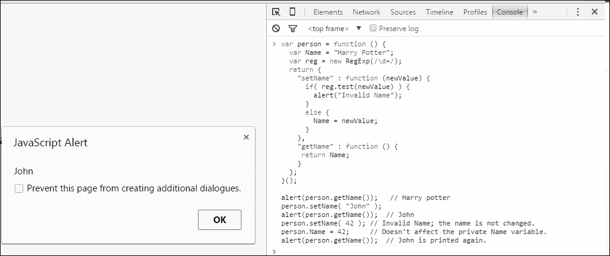

# 第九章：使用 OOP 整理您的代码

在本章中，我们将学习**面向对象编程**（**OOP**）并讨论著名游戏**Hangman**的代码。

“OOP 是一种使用抽象来创建基于现实世界的模型的编程范式。OOP 使用了几种来自先前建立的范式的技术，包括模块化、多态和封装。”或者“OOP 语言通常通过使用类来标识，以创建具有相同属性和方法的多个对象。”

您可能已经假定 JavaScript 是一种面向对象的编程语言。是的，你是完全正确的。让我们看看它为什么是一种 OOP 语言。如果计算机编程语言具有以下几个特点，我们称之为面向对象：

+   继承

+   多态

+   封装

+   抽象

在继续之前，让我们讨论**对象**。我们以以下方式在 JavaScript 中创建对象：

```js
var person = new Object();
person.name = "Harry Potter";
person.age = 22;
person.job = "Magician";
```

我们为一个人创建了一个对象。我们添加了一些人的属性。

如果我们想要访问对象的任何属性，我们需要调用该属性。

假设您想要弹出前面`person`对象的`name`属性。您可以使用以下方法来实现：

```js
person.callName = function(){
  alert(this.name);
};
```

我们可以将前面的代码写成以下形式：

```js
var person = {
  name: "Harry Potter",
  age: 22,
  job: "Magician",
  callName: function(){
  alert(this.name);
  }
};
```

# JavaScript 中的继承

继承意味着从父母或祖先那里获得某些东西（如特征、品质等）。在编程语言中，当一个类或对象基于另一个类或对象以保持父类或对象的相同行为时，这被称为**继承**。

我们还可以说这是获得其他东西的属性或行为的概念。

假设，X 从 Y 那里继承了一些东西；这就像 X 是 Y 的一种类型。

JavaScript 占据了继承的能力。让我们来看一个例子。鸟从动物那里继承，因为鸟是动物的一种。因此，鸟可以做与动物相同的事情。

JavaScript 中的这种关系有点复杂，需要一种语法。我们需要使用一个名为`prototype`的特殊对象，它将属性分配给一种类型。我们需要记住只有函数有原型。我们的`Animal`函数应该类似于以下内容：

```js
function Animal(){
//We can code here. 
}; 
```

要添加函数的一些属性，我们需要添加一个原型，如下所示：

```js
Animal.prototype.eat = function(){
  alert("Animal can eat.");
};
```

让我们为我们的`Bird`函数创建原型。我们的函数和原型应该类似于以下内容：

```js
function Bird(){
};
Bird.prototype = new Animal();
Bird.prototype.fly = function(){
  alert("Birds can fly.");
};
Bird.prototype.sing = function(){
  alert("Bird can sing.");
};
```

原型和函数的结果是，您创建的任何`Bird`都将具有`Animal`和`Bird`的属性。但是，如果您创建`Animal`，那么它只会具有`Animal`的属性。`Bird`继承了`Animal`的属性。

因此，我们可以说 JavaScript 具有继承属性。

# JavaScript 中的封装

在面向对象编程中，**封装**是一个非常重要的概念，它允许对象将公共和私有类的成员组合在一个名称下。我们使用封装来保护我们的类免受意外或故意的愚蠢。封装意味着将某物封装在内，就好像某物在胶囊中一样。

现在，我们将看看 JavaScript 是否支持封装。如果是这样，我们可以说 JavaScript 是一种 OOP 语言。让我们看看以下例子：

```js
var person = {
  "name" : "Harry Potter",
  "age" : 22,
};
alert(person.name);
person.name = "John";
alert(person.name);
```

如果我们在控制台上运行这个。第一个警报框将打印以下图像：


我们将变量`name`更改为`John`。因此，第二个警报框将类似于以下图像：


如果我们意外地将一个数字赋给`name`变量会发生什么？

将数字赋给`name`变量是完全可以接受的。就 JavaScript 而言，变量可以接受任何类型的数据作为其值。但是，我们不希望在名字的位置上出现数字。我们该怎么办？我们可以使用 JavaScript 的封装属性，如下所示：

```js
var person = function () {
  var Name = "Harry Potter";
  var reg = new RegExp(/\d+/);
  return { 
    "setName" : function (newValue) {
      if( reg.test(newValue) ) {
        alert("Invalid Name");
      }
      else {
        Name = newValue;
      }
    },
    "getName" : function () {
      return Name; 
    }
  }; 
}(); 

alert(person.getName());   // Harry potter
person.setName( "John" );
alert(person.getName());  // John
person.setName( 42 ); // Invalid Name; the name is not changed.
person.Name = 42;     // Doesn't affect the private Name variable.
alert(person.getName());  // John is printed again.
```

现在，如果我们在控制台上运行上面的代码，第一个输出将显示一个弹出窗口，其中包含**Harry Potter**，因为我们只调用了`getName()`函数。`getName()`函数有一个初始值，即`Harry Potter`：


第二个输出将如下，因为我们将`person`的`Name`属性更改为`John`，然后再次调用`getName()`函数：



第三个输出将如下所示，因为我们试图将一个数字推送到一个字符串变量中。一个名字不能是整数，因此，在`if`语句下出现了**Invalid Name**：


第四个输出将如下所示，因为数字没有添加到`Name`属性。因此，我们将得到我们推送到`Name`属性的最后数据：


我们现在可以确认 JavaScript 支持封装。

JavaScript 还支持**多态**和**抽象**。如果您想了解它们，可以参考以下链接：

[`developer.mozilla.org/en-US/docs/Web/JavaScript/Introduction_to_Object-Oriented_JavaScript`](https://developer.mozilla.org/en-US/docs/Web/JavaScript/Introduction_to_Object-Oriented_JavaScript)

让我们做一些有趣的事情。你可能听说过一个叫做“绞刑架”的游戏。我们将讨论该游戏中的面向对象编程。首先，让我们向您介绍这个游戏。

玩家需要猜一个单词。如果他能猜对单词，他就安全了；否则，他将被绞死。看一下以下图像，以清楚地了解游戏：


# 解剖绞刑架

绞刑架游戏有两个文件夹和一个 HTML 文件。这两个文件夹的名称分别为`css`和`js`。`index.html` HTML 文件应包含以下代码：

```js
<html lang="en" ng-app="hangman"> 
  <head>
    <title>Hangman</title>
    <link rel="stylesheet" href="css/styles.css">
    <script src="img/angular.min.js"></script>
  </head>
  <body ng-controller="StartHangman">
    <p>Hangman</p>
    <svg width="400" height="400">
      <rect ng-show="failedGuess.length >= 1" x="0" y="0" width="40" height="400"></rect>
      <rect ng-show="failedGuess.length >= 2" x="40" y="20" width="200" height="40"></rect>
      <rect ng-show="failedGuess.length >= 3" x="173" y="50" width="4" height="100"></rect>
      <circle ng-show="failedGuess.length >= 3" cx="175" cy="120" r="40"></circle>
      <line ng-show="failedGuess.length >= 4" x1="175" y1="150" x2="175" y2="185" style="stroke:rgb(0,0,0)" stroke-width="10"></line>
      <line ng-show="failedGuess.length >= 4" x1="175" y1="180" x2="100" y2="240" style="stroke:rgb(0,0,0)" stroke-width="10"></line>
      <line ng-show="failedGuess.length >= 5" x1="175" y1="180" x2="250" y2="240" style="stroke:rgb(0,0,0)" stroke-width="10"></line>
      <line ng-show="failedGuess.length >= 6" x1="175" y1="180" x2="175" y2="265" style="stroke:rgb(0,0,0)" stroke-width="10"></line>
      <line ng-show="failedGuess.length >= 7" x1="175" y1="260" x2="120" y2="340" style="stroke:rgb(0,0,0)" stroke-width="10"></line>
      <line ng-show="failedGuess.length >= 8" x1="175" y1="260" x2="230" y2="340" style="stroke:rgb(0,0,0)" stroke-width="10"></line>
    </svg>

    <div ng-show="stage == 'initial'">
      <h2>Please enter your secret words:</h2>
      <input type="text" ng-model="secretWords" autofocus ng-keyup="$event.keyCode == 13 ? startGame() : null">
      <button ng-click="startGame()">Enter</button>
    </div>

    <div ng-show="stage == 'play'">
      <h1>{{ answer }}</h1>
      <h2>Failed guess ({{ failedGuess.length }}) = {{ failedGuess}}</h2>

      <input type="text" ng-model="charGuess" id="char-guess" ng-keyup="$event.keyCode == 13 ? guess(charGuess) : null" placeholder="Guess a letter">
      <button ng-click="guess(charGuess)">Enter</button>
    </div>

    <div ng-show="stage == 'won'">
      <h1>You Win! :)</h1>
      <h2>That's right, the secret words is {{ secretWords }}</h2>
      <p>Press F5 to replay</p>
    </div>

    <div ng-show="stage == 'lost'">
      <h1>You Lose! :(</h1>
      <h2>The secret word is {{ secretWords }}</h2>
      <p>Press F5 to replay</p>
    </div>

    <script src="img/hangman.js"></script>
  </body>
</html>
```

`css`文件夹应该有一个`styles.css`文件。`styles.css`文件应包含以下代码：

```js
body {
  font-family: monospace;
  text-align: center;
  font-size: 16px;
  line-height: 1.40;
}

input[type="text"] {
  padding: 5px;
  font-family: monospace;
  height: 30px;
  font-size: 1.8em;
  background-color: #fff;
  border: 2px solid #000;
  vertical-align: bottom;
}

svg {
  margin: 0 0 30px;
}

button {
  cursor: pointer;
  margin: 0;
  height: 44px;
  background-color: #fff;
  border: 2px solid #000;
}
```

`js`文件夹中应该有两个 JavaScript 文件，`angular.min.js`和`hangman.js`。

`angular.min.js`文件是一个框架。您可以从[`angularjs.org/`](https://angularjs.org/)下载它，或者它可以与本书的代码捆绑包一起提供。

`hangman.js`文件应该包含以下代码：

```js
var hangman = angular.module('hangman', []).controller('StartHangman', StartHangman);
  function StartHangman($scope, $document) {
    $scope.stage = "initial";
    $scope.secretWords = "";
    $scope.answer = "";
    $scope.failedGuess = [];
    var hasWon = function() {
      var foundDash = $scope.answer.search(/-/);
      return (foundDash == -1);
    }
    var hasLost = function() {
      return ($scope.failedGuess.length >= 8);
    }
    $scope.startGame = function() {
      $scope.secretWords = $scope.secretWords.toLowerCase();
      for(i in $scope.secretWords) {
        $scope.answer += $scope.secretWords[i] == ' ' ? ' ' : '-';
      }
      $scope.stage = "play"
    }
    $scope.guess = function(ch) {
      ch = ch.toLowerCase();
      $scope.charGuess = "";
      if(ch.length != 1) {
        if(ch.length > 1) {
          alert("Please only enter one character at a time");
        }
      return ;
    }
    /* If ch is already in the failed guess list */
    for(i in $scope.failedGuess) {
      if(ch == $scope.failedGuess[i]) return ;
    }
    /* Check if it's part of the answer */
    var found = false;
    $scope.answer = $scope.answer.split(""); /* convert to array of char */
    for(i in $scope.secretWords) {
      if($scope.secretWords[i] === ch) {
        found = true;
        $scope.answer[i] = ch;
      }
    }
    $scope.answer = $scope.answer.join(""); /* convert back to string */
    if(!found) {
      $scope.failedGuess.push(ch);
    }
    if(hasWon()) {
      $scope.stage = "won";
    }
    if(hasLost()) {
      $scope.stage = "lost";
    }
  }
}
```

让我们讨论一下代码。

我们使用`var hangman = angular.module('hangman', []).controller('StartHangman', StartHangman);`来导入我们的`angular.min.js`文件，并开始控制游戏其余的代码。

我们编写了一个`StartHangman($scope, $document) {}`函数，在这里我们将编写我们的代码。我们从我们的`angular.min.js`文件中传递了两个变量，`$scope`和`$document`。

我们初始化了一些变量，如下所示：

```js
$scope.stage = "initial";
$scope.secretWords = "";
$scope.answer = "";
$scope.failedGuess = [];
```

我们为赢得和输掉游戏编写了两个函数，如下所示：

```js
var hasWon = function() {
  var foundDash = $scope.answer.search(/-/);
  return (foundDash == -1);
}
var hasLost = function() {
  return ($scope.failedGuess.length >= 8);
}
```

我们在这里固定了我们的猜测次数。然后，我们编写了一个函数来开始我们的游戏。我们创建了一个对象，并使用了 JavaScript 的继承属性，如下所示：

```js
$scope.startGame = function() {
  $scope.secretWords = $scope.secretWords.toLowerCase();
  for(i in $scope.secretWords) {
    $scope.answer += $scope.secretWords[i] == ' ' ? ' ' : '-';
  }
  $scope.stage = "play"
}
```

我们从玩家那里得到一个输入，以便将其作为我们的秘密单词存储。

游戏的提示页面将类似于以下图像：


然后，我们介绍了我们最重要的函数`$scope.guess = function(ch){}`。我们向函数传递一个字符，并检查它是否与玩家输入的任何字母匹配秘密单词。

# 总结

在本章中，您学习了面向对象编程语言的特性。我们还看到了面向对象编程特性在著名游戏“绞刑架”中的用途！希望您喜欢创建和玩“绞刑架”。在本书的下一章和最后一章中，我们将看到 JavaScript 的可能性。
