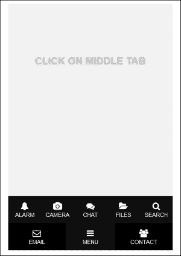

# 第十章。可能性

在整本书中，我们已经探讨了许多与 JavaScript 相关的主题。您学会了如何使用控制台玩耍；用 JavaScript 解决问题，HTML 标签，CSS 属性和控制语句；使用 jQuery；用画布绘图；构建项目；等等。然而，您是否曾想过通过阅读本书和学习 JavaScript 获得的机会？

好吧，在这一章中，我们将看到为什么学习 JavaScript 很重要，以及 JavaScript 的领域是什么。

# JavaScript 作为您的第一种编程语言

JavaScript 是最容易开始学习的语言。它不需要任何软件来运行。现代浏览器和记事本就足够开始使用 JavaScript 进行编码。JavaScript 拥有一些最好的在线学习材料。

诸如 Codecademy（[`www.codecademy.com`](https://www.codecademy.com)）、Code School（[`www.codeschool.com`](https://www.codeschool.com)）、CodePen（[`codepen.io`](http://codepen.io)）、JS Bin（[`jsbin.com`](https://jsbin.com)）和 JSFiddle（[`jsfiddle.net`](https://jsfiddle.net)）等网站将帮助您在短时间内学习 JavaScript。

## JavaScript 随处可见

JavaScript 是几乎在每个浏览器中运行的唯一语言；甚至在智能手机浏览器中也是如此。由于 Web 无处不在，JavaScript 也无处不在。

## 作为 JavaScript 开发人员的职业

如果您喜欢编程并希望通过编程来建立您的职业，JavaScript 是最好的语言之一。我可以说，选择 JavaScript 比 JavaScript 更好的选择可能会更困难。如果您看一些 Web 开发的趋势，您会发现实时网站就像桌面应用程序。网站上的大量用户交互，例如拖放，音频和视频交互以及数据可视化，现在都很常见。所有这些大部分都是使用 JavaScript 完成的。没有 JavaScript，我们将无法获得很酷的 Web 应用程序（Google 地图，Google 地球，Gmail，Facebook 等）。JavaScript 使一切成为可能。在构建 Web 应用程序时，没有其他语言像 JavaScript 那样强大。现在的世界是基于 Web 的，Web 是由 JavaScript 驱动的，以使其美观，动态和安全。因此，选择 JavaScript 与 HTML 和 CSS 作为您未来的职业将是您生活中最好的决定之一。开发人员被称为前端或全栈开发人员。

# 所有的琐事都可以由 JavaScript 完成

使用 JavaScript，您可以做很多令人惊叹的事情。从机器人技术到 Web 应用程序开发，JavaScript 都是一个强大的工具。让我们看看人们如何在他们的技术生活中使用 JavaScript：

+   机器人技术

+   3D 游戏

+   为智能手机制作应用程序

+   运行 Web 服务器

+   运行 Ruby 和 Python

+   编写独立于操作系统的桌面应用程序

+   Web 抓取和截图

+   Web 分析

+   响应式和交互式内容

+   动画

+   创建 Cookie

## 机器人技术

在机器人技术中，您需要用逻辑控制您的机器人。在现实世界中，逻辑由微控制器处理。您可能听说过 Arduino，这是一种处理微电子的开源硬件。基本上，Arduino 使用 C 代码控制微控制器。然而，如果您了解 JavaScript，您也可以为其编写代码；以处理微处理器/微控制器并制作您的第一个机器人。您可以从[`nodebots.io/`](http://nodebots.io/)获取帮助，以了解 JavaScript 如何用于构建机器人。以下是 Arduino UNO 板的图像：

Arduino UNO

## 3D 游戏

在本书中，我们已经构建和开发了 2D 游戏。然而，请相信我，您也可以用 JavaScript 构建令人惊叹的 3D 游戏。您甚至可以通过您喜爱的游戏手柄来玩。要使用游戏手柄玩游戏，您需要使用游戏手柄 API（[`wiki.mozilla.org/GamepadAPI`](https://wiki.mozilla.org/GamepadAPI)）。

您可以在以下网址玩一些用 JavaScript 构建的在线 3D 游戏：[`www.babylonjs.com/`](http://www.babylonjs.com/)。

## 为智能手机制作应用程序

你是否曾想过为你的智能手机构建应用程序？你可以使用 JavaScript 为你的智能手机构建应用程序。智能手机有不同类型的平台（例如 Android、iOS、Tizen、Firefox OS 等）。每个平台都有自己的 API，并使用不同的编程语言。因此，我们需要考虑我们的代码库可能在任何设备上运行。为了确保这一点，我们可以使用 JavaScript 引擎，因为它可以在任何平台上运行。你可以使用**Cordova** ([`cordova.apache.org/`](http://cordova.apache.org/))来了解如何使用 JavaScript 构建应用程序。Cordova 是一个基于每个设备 API 的 JavaScript 框架。你可以使用**PhoneGap** ([`phonegap.com/`](http://phonegap.com/))或**Meteor** ([`www.meteor.com/`](https://www.meteor.com/))来使用 JavaScript 构建智能手机应用程序。

## 运行 Web 服务器

你可能听说过 Web 服务器。服务器用于广播网站。你可以使用 JavaScript 来管理你的服务器。JavaScript 可以处理所有操作并确认你的域的安全性。你可以使用**Node.js** ([`nodejs.org/`](https://nodejs.org/))来运行最简单的 Web 服务器。要了解更多关于 JavaScript Web 服务器的信息，你可以查看[`www.firebase.com/`](https://www.firebase.com/)。你可能需要基本的 JavaScript 知识来执行 Web 服务器的任务。使用其他框架构建 Web 服务器可能成本高昂；然而，使用 JavaScript，你可以免费完成。你甚至不需要购买任何软件。

## 运行 Ruby 和 Python

JavaScript 还可以用于在浏览器上运行**Python**或**Ruby**，只需添加少量外部代码。你可以通过添加库在浏览器上包含这些编程语言的运行环境。要了解更多关于在浏览器上包含库和运行 Ruby 和 Python 代码的信息，你可以查看[`www.firebase.com`](https://www.firebase.com)。

## 编写独立于操作系统的桌面应用程序

由于 JavaScript 是平台无关的，你可以使用 JavaScript 构建 Web 应用程序，并在任何平台上运行它们。任何平台上的用户都可以在他们的浏览器上运行基于 JavaScript 的应用程序。你甚至可以使用 JavaScript 制作桌面应用程序。查看[`appjs.com/`](http://appjs.com/)和[`electron.atom.io/`](http://electron.atom.io/)来制作基于 JavaScript 的第一个桌面应用程序。

## 网页抓取和截图

从网站中提取信息的技术称为网页抓取。要了解更多关于网页抓取的信息，你可以访问[`www.webscraper.io/`](http://www.webscraper.io/)。JavaScript 可以帮助你进行网页抓取。你可以查看[`nrabinowitz.github.io/pjscrape/`](http://nrabinowitz.github.io/pjscrape/)了解更多关于使用 JavaScript 进行网页抓取的信息。

你可以查看[`html2canvas.hertzen.com/`](https://html2canvas.hertzen.com/)了解更多关于网站截图的信息。截图可以使用 JavaScript 完成。

## Web 分析

有时候，你可能需要知道谁在访问你的网站，你的网站经常被哪个 IP 地址访问，访问者属于哪个国家，以及关于跟踪访问者的更多信息。所有这些信息都可以使用 JavaScript 获得。

## 响应式和交互式内容

使用 JavaScript，你可以在你的网站和 Web 应用程序上制作响应式和交互式内容。你可以查看[`beta.rallyinteractive.com/`](http://beta.rallyinteractive.com/)，[`www.unfold.no/`](http://www.unfold.no/)，[`www.2advanced.com/`](http://www.2advanced.com/)和[`www.newquest.fr/`](http://www.newquest.fr/)，看看他们如何使用 JavaScript 制作响应式和交互式的网站。

## 动画

JavaScript 的精彩之处在于你可以用它做动画。有很多很酷的 JavaScript 动画库。查看[`greensock.com/gsap`](http://greensock.com/gsap)了解更多关于**GreenSock**，一个著名的 JavaScript 动画库。还有另一个著名的 JavaScript 动画库叫做**Velocity.js** ([`julian.com/research/velocity/`](http://julian.com/research/velocity/))。

## 创建 cookie

你可能听说过网页 cookie。假设你在一个网站上输入你的用户名和密码，然后弹出一个警告，说明你可以保存用户名和信息。你点击**记住密码**，然后信息就会存储在你的计算机上作为 cookie。你的网页 cookie 是由 JavaScript 创建的。网页 cookie 对于网站加载更快很重要。你可以从[`www.allaboutcookies.org/cookies/`](http://www.allaboutcookies.org/cookies/)了解更多关于网页 cookie 的信息。

# 精彩的 JavaScript 示例

有一些网站可以展示用户最新的 JavaScript 作品。其中之一是[`creativejs.com/`](http://creativejs.com/)。你也会在那里找到一些教程。`CreativeJS.com`是寻找令人兴奋的 JavaScript 演示、项目、游戏以及其他任何他们认为很棒的地方。他们有一个团队来为您带来最好的东西。以下截图是`CreativeJS.com`的主页：

以下是一些 JavaScript 项目的示例及其链接：

+   **精彩的计算器**：以下计算器是用 JavaScript、HTML 和 CSS 构建的。发光按钮的动画是由 JavaScript 完成的：

这个计算器可以在[`codepen.io/giana/pen/GJMBEv`](http://codepen.io/giana/pen/GJMBEv)找到。

+   **拖放**：你可以拖动一个块并用鼠标放到另一个块上。拖动是使用 JavaScript 完成的。以下是这个项目的截图：

这个项目可以在[`greensock.com/draggable`](http://greensock.com/draggable)找到。

+   **随机迷宫生成器**：你建立了一个名为 Rat-man 的游戏，你需要为猫和老鼠绘制地图。路径就像一个迷宫。以下链接将为您生成一个随机迷宫。我希望你注意一下他们在那里使用的 JavaScript：

这个游戏可以在[`codepen.io/GabbeV/pen/viAec`](http://codepen.io/GabbeV/pen/viAec)找到。

+   **粒子连接**：你可以在[`codepen.io/garyconstable/pen/fEoLz`](http://codepen.io/garyconstable/pen/fEoLz)玩连接粒子。这些粒子的运动由 JavaScript 控制。以下是这个项目的截图：

+   **可撕裂的布料**：如果你想模拟一块布料，你可以去链接[`codepen.io/dissimulate/pen/KrAwx`](http://codepen.io/dissimulate/pen/KrAwx)并在这里玩弄一块布料。布料的运动由 JavaScript 控制。以下是这个项目的截图：

+   **霓虹灯**：你可以在你的网站上使用以下东西作为按钮。我希望你学习一下它的代码是如何工作的。以下是这个项目的截图：

这个项目可以在[`codepen.io/simeydotme/details/Gzfuh`](http://codepen.io/simeydotme/details/Gzfuh)找到。

+   智能手机子菜单：如果您想用 JavaScript 制作智能手机应用程序，那么您肯定需要一个应用程序的子菜单。您可以访问[`codepen.io/berdejitendra/pen/AgEzJ`](http://codepen.io/berdejitendra/pen/AgEzJ)并学习如何为您的移动应用程序制作一个很酷的子菜单。以下是该项目的屏幕截图：

+   **3D 太阳系**：如果您热爱天文学和行星的运动，链接[`codepen.io/juliangarnier/pen/idhuG`](http://codepen.io/juliangarnier/pen/idhuG)将为您带来一个令人惊叹的可视化效果，展示了邻近行星及其信息。所有动态元素都是使用 JavaScript 创建的。以下是该项目的屏幕截图：

# 总结

我们到了书的结尾。这本书并非关于 JavaScript 的全部内容。这是 JavaScript 的开始。我希望您喜欢这本书，并练习了书中讨论的所有练习和项目。我希望您会访问本章中的网站，并观察每个项目的代码，以便更多地了解 JavaScript。我希望有一天您能够借助 JavaScript 创建自己的动态网站，用 JavaScript 构建智能手机应用程序，甚至可能用 JavaScript 构建机器人。你永远不知道！

我希望您已经学到了很多关于 JavaScript 的令人惊叹的东西；现在是您尝试编写代码和玩转 JavaScript 的时候了。如果出了什么问题，不要担心。请记住：

|   | *"第一次做对并不重要，最后一次做对才是至关重要的。"* |   |
| --- | --- | --- |
|   | --*Andrew Hunt and David Thomas* |
