# 第二章。使用 JavaScript 解决问题

你在前一章中学习了如何使用 JavaScript 在控制台打印某些内容。现在，让我们看看 JavaScript 语法、变量、算术运算符和注释的基础知识。

在计算机世界中，只有数据。你可以读取、修改和创建新的数据；然而，任何不是数据的东西根本不存在。在 JavaScript 中，我们需要处理数据来开发网站。

要了解 JavaScript 的基本语法，首先你需要知道 JavaScript 是 *区分大小写的*。在 JavaScript 中你不能互换大小写字母。因此，在处理 JavaScript 语法时，你需要记住，编写代码不是唯一重要的任务，你还必须检查语法是否正确。

让我给你举一个例子。在前一章中，你已经成功地使用 `document.write();` 语法在你的浏览器上打印了 **Hello World**。

如果你写了 `Document.write("Hello World");` 会发生什么？是的！它将无法成功运行。你会得到一个错误信息。这种错误被称为 **未捕获的语法错误**。

JavaScript 语句通常在一行上编写。你可以用分号结束你的语句，也可以不结束。结束语句以分号不是强制性的。然而，在每条语句后添加分号是一个好习惯。

让我们考虑以下示例：

```js
document.write("Hello");
document.write("World");
document.write("!");
```

它的输出将如下所示：

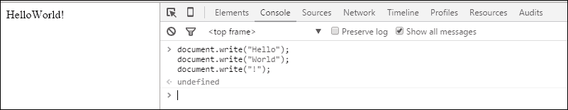

### 注意

JavaScript 关键字（如 for、while、if、switch、case 等）总是小写。内置对象（如 Date、Math、Number 等）以大写字母开头。

# 变量

我们已经知道计算机世界只有数据。

有不同类型的数据（我们称之为 *数据类型*），如下所示：

+   你的名字是一种数据

+   你的年龄是数据

+   你的成绩也是数据

然而，它们都是不同的。它们之间有什么区别？你的名字只包含一组 *字符*，或者有些人也称之为 **字符串**。你的年龄是 **整数** 类型数据。你的成绩是 **浮点数** 类型数据。JavaScript 的奇妙之处在于，你不需要在编写 *变量* 的名字之前指定数据类型。

### 注意

JavaScript 允许处理三种数据类型。字符串（例如，`"This is an example of string"`），数字（例如，`2015`，`3.1415` 等），和布尔值（例如，`true` 或 `false`）。

我们是否讨论过 *变量*？好吧，你已经知道了数据类型。你需要 *某种东西* 来存储你的数据。这个 *东西* 被称为 *变量*。在 JavaScript 中，我们在变量名前使用 `var`。记住 `var` 是小写字母开头的。

让我们考虑以下示例：

```js
var x;
var y;
var sum;
var name;
```

假设我们有两个苹果和六个橙子。为了将它们存储在变量中，我们将使用以下：

```js
var apples = 14;
var oranges = 6;
```

以下示例不同。你能说出为什么吗？

```js
var Apples = 14;
var apples = 14;
var APPLES = 14;
var appleS = 14;
```

是的，JavaScript 是区分大小写的。这里的所有变量都不同，尽管变量的值是相同的。

现在，让我们进行一些编码。之前，在控制台中，你作为作业打印了你的名字。我希望你没有遇到任何麻烦。我们现在用变量来打印你的名字，怎么样？假设你的名字是`Sherlock Holmes`。这是什么类型的数据？

你是对的，它是*字符串*类型。通常对于字符串类型的数据，我们将其放在两个引号之间。

让我们考虑以下示例：

```js
var name = "Sherlock Holmes";
var occupation = "Detective"
```

要使用控制台打印它们，你需要输入每个语句并按*Enter*键。看看以下图片：

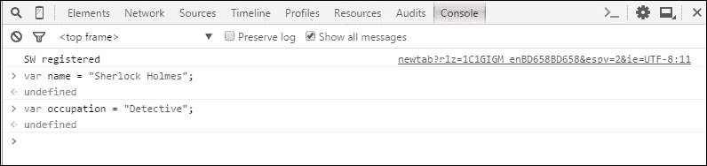

### 注意

不要在控制台中复制和粘贴代码。你可能会得到语法错误。

当你按*Enter*键后，你会看到多出一行，显示`undefined`。现在不用担心这个问题。这只是返回了一个控制台日志。

你将`Sherlock Holmes`字符串存储在`name`变量中，将`Detective`存储在`occupation`中。每次你访问`name`或`occupation`时，你都可以访问指定的字符串。

假设你想在屏幕上打印**福尔摩斯**。只需输入以下内容：

```js
document.write(name);
```

输入后，按*Enter*键。你会在屏幕上看到**福尔摩斯**被打印出来，如下所示：

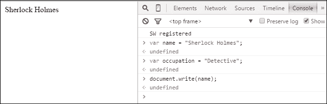

输入`document.write(occupation);`并按*Enter*键，如下所示截图所示：

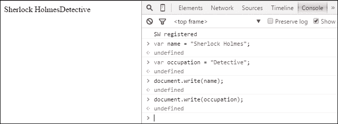

你可能想知道为什么**福尔摩斯**和**侦探**之间没有空格。因为，在控制台中，历史记录不会自动从网页左侧删除，在你为第二个输出（`occupation`）按*Enter*键后，字符串会自动放置在之前的字符串之后。这总是会发生的，除非你使用*Ctrl* + *L*键盘快捷键清除控制台，并通过按*F5*键重新加载网页。

### 注意

当你重新加载网页时，你存储的变量也将从内存中删除。别担心，你将在下一章学习如何使用文件存储变量。

如果你想要连接两个（或多个）变量，你可以在两个变量之间添加一个加号（`+`），如下所示：

```js
document.write(name+occupation);
document.write(occupation+name);
```

你能告诉我这些命令的输出结果吗？

是的，你说得对。输出将如下所示：

**福尔摩斯侦探**

**DetectiveSherlock Holmes**

### 注意

你的输出可能在网页上是一行。如果你想分行，请添加一个`<br>` HTML 标签。添加这个标签最简单的方法是输入`document.write("<br>");`并按*Enter*键。你的下一个输出将在新的一行。

如果你想在两个字符串（例如，一个空格）之间添加任何字符串（除了变量），请输入以下内容：

```js
document.write(name+" "+occupation);
```

输出将如下所示：

**福尔摩斯侦探**

当你输入以下代码并按*Enter*键时会发生什么？

```js
document.write("My name is "+name+" and I am a "+occupation);
```

是的！你完全正确。输出将如下所示：

**我的名字是福尔摩斯，我是一个侦探**

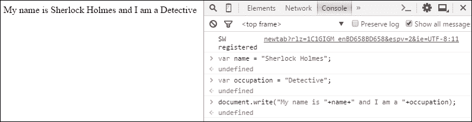

现在，在控制台上添加另一个变量。假设`夏洛克·福尔摩斯`是 24 岁。你还记得年龄的数据类型是什么吗？

是的，它是一个整数类型的数字。因此，输入以下代码并按*Enter*键：

```js
var age = 24;
```

你现在有以下三个变量：

+   姓名

+   职业

+   年龄

让我们在网页上打印以下输出：

**我的名字是夏洛克·福尔摩斯，我 24 岁，我是一个侦探**

我们的代码在控制台上会是什么样子？

代码如下：

```js
document.write("My name is "+name+", I\'m "+age+" years old and I am a "+occupation);
```

输出结果如下：

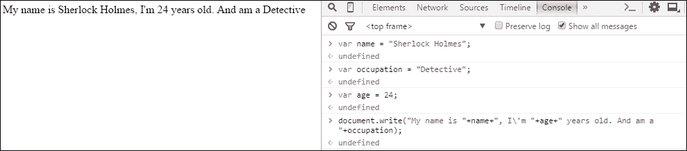

### 小贴士

**打印引号/反引号**

如果你想使用`document.write();`语法打印**莎士比亚说，“生存还是毁灭，这是一个值得考虑的问题！”**，你可能需要输入以下代码：

```js
document.write("Shakespeare said, "To be, or not to be: that is the question!"");
```

然而，这将导致一个名为**SyntaxError**的错误。要消除这个错误，你需要在两个反引号之前使用一个反斜杠（`\`）。正确的代码如下：

```js
document.write("Shakespeare said, \"To be, or not to be: that is the question!\"");
```

输出结果将如下所示：

**莎士比亚说，“生存还是毁灭，这是一个值得考虑的问题！”**

对于单引号（`'`）也适用同样的规则。

这里有一个快速练习给你：

1.  假设`汤姆`有一只猫（`露西`）。这只猫，`露西`，已经 2.4 岁了。将名字、猫的名字和它的年龄存储在三个不同的变量中，并使用控制台打印以下输出：

    **汤姆的猫露西 2.4 岁了。**

1.  假设你购买了`4`磅苹果。每磅苹果的价格是`$1.2`。将苹果的价格和数量存储在两个不同的变量中，并使用控制台打印以下输出：

    **我买了 4 磅苹果。我不得不为每磅苹果支付$1.2。**

# 注释

假设你已经编写了很多代码，进行了一些逻辑操作，并在 JavaScript 中使用了多个变量，如果你在代码中遇到错误，希望我帮助你检查。当你把代码发给我时，除非我清楚了解 JavaScript，或者你在重要行上进行了注释，否则我不知道你输入了什么。

注释基本上是一行文本或代码，在浏览器运行时会被忽略。你可以将注释比作便利贴或提醒。

让我们考虑以下示例：

```js
Var name = "Sherlock Holmes"; // This is a string
Var occupation = "Detective"; // This variable stores information
Var age = 14; // This is an integer type of data.
```

如何制作多行注释？你可以按照以下方式提及注释：

```js
/*
  This is a multiline comment.
  The browser will ignore this.
  You can type any important information on your comment.
*/
```

你的多行注释应该位于`/*`和`*/`之间，如下所示：

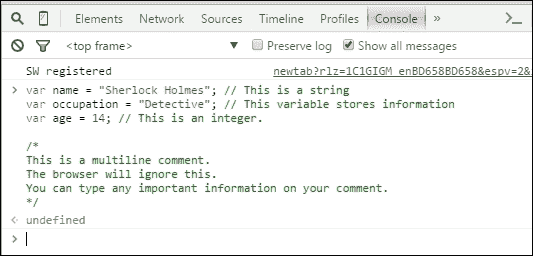

# 算术运算符

在 JavaScript 中，就像其他编程语言一样，我们可以进行一些算术运算。在你的学校，你可能已经学会了如何将两个数字相加，从一个数字中减去另一个数字，将两个数字相乘，以及用另一个数字除以一个数字。你可以在 JavaScript 的帮助下，用几行代码完成所有这些操作。

在 JavaScript 中，我们使用以下算术符号进行操作：

| 运算符 | 描述 |
| --- | --- |
| + | 用于加法 |
| - | 用于减法 |
| * | 用于乘法 |
| / | 用于除法 |
| % | 用于找到余数（称为模运算符） |

## 加法

假设你有两个变量 `x` 和 `y`，分别具有 `3` 和 `4` 的值。我们在控制台上应该做什么来存储这些变量的值？

是的，我们这样做：

```js
var x = 3; // 3 is stored on variable x
var y = 4; // 4 is stored on variable y
```

然后，按 *Enter*。

取另一个变量来保存 `x` 和 `y` 的和，如下所示：

```js
var z = x+y; // This syntax stores the sum of x and y on z
```

你能告诉我打印 `z` 时会发生什么吗？

```js
document.write(z);
```

是的，你是对的，这将打印 **7**，如下截图所示：

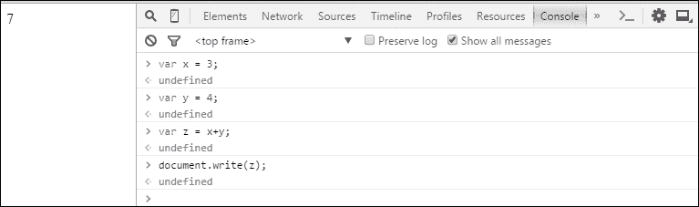

## 减法

要从一个数减去另一个数，需要在它们之间放置一个减号（`-`）。

让我们考虑以下示例：

```js
var x = 9; // 9 is assigned to the variable x.
var y = 3; // 3 is assigned to the variable y.
var z = x - y ; // This syntax subtracts y from x and stores on z.
document.write(z); // Prints the value of z.
```

以下截图显示了此代码的输出 **6**：

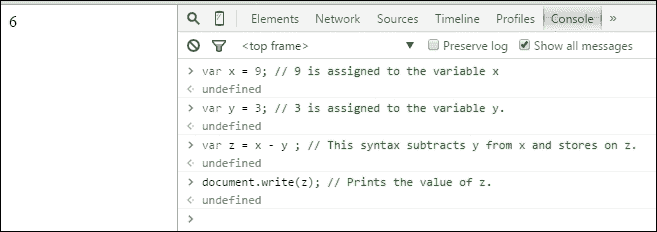

## 乘法

要乘以两个整数或浮点类型数据的数字或变量，只需在变量或数字之间放置一个星号（`*`）即可。

让我们看看以下示例：

```js
var x = 6; // 6 is assigned to the variable x.
var y = 2; // 2 is assigned to the variable y.
var z = x * y; // For two numbers you can type z = 6 * 2 ;
document.write(z); // Prints the value of z
```

以下截图显示了此代码的输出 **12**：

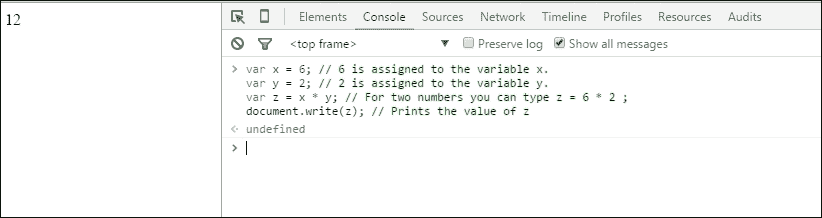

## 除法

要用另一个数除以一个数，需要在两个数之间放置一个正斜杠（`/`）。

让我们看看以下示例：

```js
var x = 14; // assigns 14 on variable x.
var y = 2; // assigns 2 on variable y. 
var z = x / y; // divides x with y and stores the value on z. 
document.write(z); // prints the value of z. 
```

以下截图显示了此代码的输出 **7**：

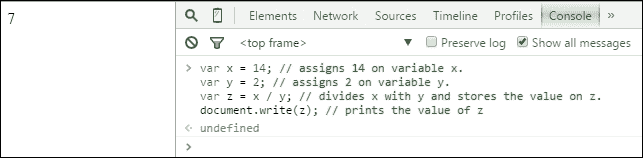

## 模数

如果你想找到一个数与另一个数的模数，需要在两个数之间放置一个百分号（`%`）。

让我们考虑以下示例：

```js
var x = 34; // assigns 34 on the variable x. 
var y = 3; // assigns 3 on the variable y. 
var z = x % y ; // divides x with y and returns the reminder and stores on the variable z
document.write(z);
```

以下截图显示了此代码的输出 **1**：

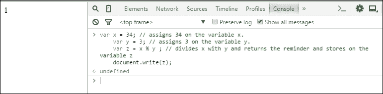

### 提示

**模数（%）运算符的作用是什么？**

好吧，从你的数学课中，你已经学会了如何用另一个数除以一个数。比如说，你用 10 除以 2。结果将是 5，这是一个整数类型的数字。然而，如果你用 10 除以 3 会发生什么？答案将不是一个整数。值是 3.333333333333。你也可以说答案是 3，余数是 1。考虑以下：

`10 = 9 + 1;`

即，`(9+1)/3`

`= 9/3+1/3`

`= 3 + 1/3;`

因此，余数是 1。模数的作用是找出余数并返回它。因此，`10%3 = 1`。

现在，让我们将我们迄今为止学到的所有算术运算符总结在一个单独的代码中。

你能告诉我以下行的输出吗？

```js
var x = 5 ;
var y = 4 ;
var sum = x + y ;
var sub = x - y ;
var mul = x * y ;
var div = x / y ;
var mod = x % y ;
document.write("The summation of x and y is "+ sum + "<br>") ;
document.write("The subtraction of x and y is " + sub + "<br>") ;
document.write("The multiplication of x and y is " + mul + "<br>");
document.write("The division of x and y is " + div + "<br>") ;
document.write("The modulus of x and y is " + mod + "<br>") ;
```

你将得到以下输出：

**x 和 y 的和是 9**

**x 和 y 的差是 1**

**x 和 y 的乘法是 20**

**x 和 y 的除法是 1.25**

**x 和 y 的模数是 1**

以下截图显示了此输出：

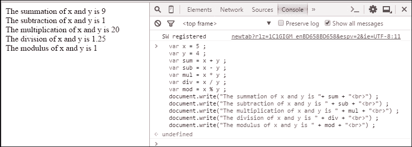

我猜你已经答对了。现在，让我们在以下内容中解释它们：

+   我们将 `5` 和 `4` 分别赋值给 `x` 和 `y`

+   我们将 `x` 和 `y` 的和赋值给 `sum` 变量，`x` 和 `y` 的差赋值给 `sub` 变量，`x` 和 `y` 的乘积赋值给 `mul` 变量，`x` 和 `y` 的除法赋值给 `div` 变量，`x` 和 `y` 的模数赋值给 `mod` 变量

+   然后，我们使用`document.write();`语法打印它们

+   我们使用了`<br>`HTML 标签来分隔每行的输出

考虑以下示例：

约翰有 56 支笔。他想将它们排列在七行中。每一行将有相同数量的笔。编写一个代码，打印每行笔的数量。

（提示：为笔的数量和行数取两个变量，将笔的数量除以行数，并将值存储在一个新变量中。）

样本输出如下：

**约翰必须将 XX 支笔放在每一行上。// XX 是笔的数量**

# 更多运算符和操作

JavaScript 除了之前提到的运算符之外，还有更多。让我们更深入地了解一下。

## 递增或递减运算符

如果你有一个整数，并且想将其增加 1 或任何数字，你可以输入以下内容：

```js
var x = 4; // assigns 4 on the variable x.
x = x + 1;
/* since x=4, and you are adding 1 with x, so the final value is 4 + 1 = 5, and 5 is stored on the same variable x. */
```

你也可以通过输入以下内容来递增你的变量`1`：

```js
var x = 4; // assigns 4 on the variable x.
x++; // This is similar to x = x + 1.
```

如果你想将变量增加超过 1，你会怎么做？嗯，你可以按照以下步骤操作：

```js
var x = 4; // assigns 4 on the variable x.
x = x + 3; // Say, you want to increment x by 3.
/* since x = 4, and you are adding 3 with x, so the final value is 4 + 3 = 7, and 7 is stored on the same variable x. */
```

你也可以通过输入以下内容来递增你的变量：

```js
var x = 4; // assigns 4 on the variable x.
x += 3; // This is similar to x = x + 3.
```

### 小贴士

记住，你不需要在运算符（例如 +, -, *, / 等）和等号（=）之间放置空格。

输出将类似于以下控制台截图：

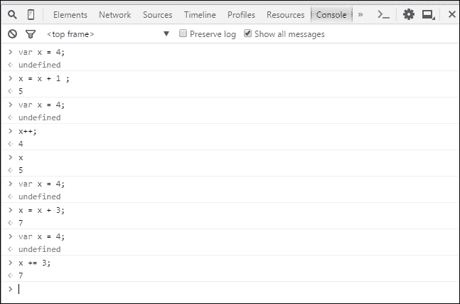

那递减运算符呢？是的，你完全正确。递减操作与递增操作相同。唯一不同的是符号。你的加号（`+`）运算符将被减号（`-`）运算符替换。让我们看看一个例子：

```js
var x = 9; // assigns 9 on the variable x.
x = x - 1;
/* since x = 9, and you are subtracting 1 from x, so the final value is 9 - 1 = 8, and 8 is stored on the same variable x. */
```

你也可以通过输入以下内容来递减你的变量`1`：

```js
var x = 9; // assigns 9 on the variable x.
x--; // This is similar to x = x - 1.
```

如果你想将变量减少超过`1`，你会怎么做？嗯，你可以按照以下步骤操作：

```js
var x = 9; // assigns 9 on the variable x.
x = x - 4; // Say, you want to decrement x by 4.
/* since x = 9, and you are subtracting 4 from x, so the final value is 9 - 4 = 5, and 5 is stored on the same variable x. */
```

你也可以通过输入以下内容来递减你的变量：

```js
var x = 9; // assigns 9 on the variable x.
x -= 4; // This is similar to x = x - 4.
```

这些代码的输出可以在以下截图看到：

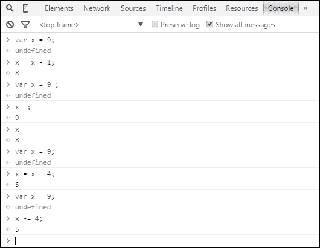

这种类型的操作对于 JavaScript 中的逻辑运算非常重要。你将在第四章*深入探讨*中了解它们的用法。

## 赋值运算符

赋值运算符将值赋给运算符。我相信你已经了解了赋值运算符，不是吗？嗯，你使用一个变量和它的值之间的等号（`=`）。通过这样做，你将值赋给了变量。

让我们看看以下示例：

```js
var name = "Sherlock Holmes"
```

将`Sherlock Holmes`字符串赋值给`name`变量。你已经学习了递增和递减运算符。你能告诉我以下代码的输出会是什么吗？

```js
var x = 3; 
x *= 2; 
document.write(x); 
```

输出将是**6**。

你还记得为什么会发生这种情况吗？

`x *= 2;`这个等式与`x = x * 2;`类似，因为`x`等于`3`，后来它乘以`2`。最终的数字（`3 x 2 = 6`）被分配给相同的`x`变量。这就是为什么我们得到了以下输出：

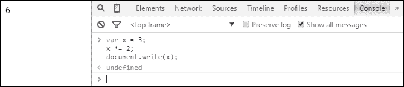

让我们进行以下练习：

以下代码的输出是什么？

```js
var w = 32;
var x = 12;
var y = 9;
var z = 5;
w++;
w--;
x*2;
y = x;
y--;
z%2;
document.write(" w = "+w+ ", x = "+x+ ", y =  "+ y+", z =  "+z  );
```

我们将得到以下输出：

**w = 32, x = 12, y = 11, z = 5**

此输出可以在以下屏幕截图中看到：

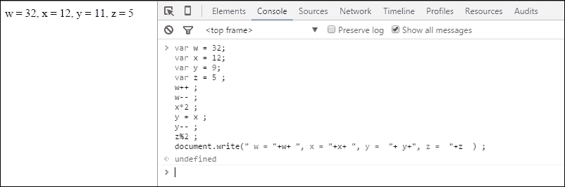

## JavaScript 比较和逻辑运算符

如果您想在 JavaScript 中进行逻辑操作并比较两个数字或变量，您需要使用一些逻辑运算符。以下是一些比较运算符的示例：

| 运算符 | 描述 |
| --- | --- |
| == | 等于 |
| != | 不等于 |
| > | 大于 |
| < | 小于 |
| => | 等于或大于 |
| <= | 小于或等于 |

以下是一些使用这些运算符的示例：

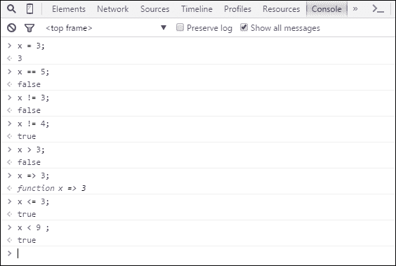

您将在接下来的章节中了解更多关于这些运算符的使用。

让我们讨论一些位运算逻辑运算符和位运算符：

| 运算符 | 描述 |
| --- | --- |
| && | 这表示与运算符。要检查两个或多个语句是否为真，我们使用这个。 |
| &#124;&#124; | 这表示或运算符。要检查任何语句是否为真，我们使用这个。 |
| ~ | 这表示非运算符。 |
| ^ | 这表示异或运算符。 |
| >> | 这表示右移运算符。 |
| << | 这表示左移运算符。 |

这些可能对您来说现在很难学。不用担心，您现在不必使用它们。我们将在第四章，*深入探讨*中使用它们。

# 摘要

在本章中，您学习了 JavaScript 的语法。我们讨论了 JavaScript 变量以及如何给变量赋值。您学习了如何注释代码。现在您知道为什么注释很重要。您最终学习了一个重要的话题：运算符和操作。没有使用运算符和逻辑函数，JavaScript 现在不会如此丰富。因此，了解逻辑操作是掌握 JavaScript 知识的关键。

我建议您在家练习本章中的所有代码。您只需在控制台输入它们，避免复制粘贴代码。这将妨碍您的学习。作为一个程序员，必须具备良好的打字速度，复制粘贴代码不会提高这项技能。您可能会在打字代码时遇到问题；然而，您会学会的。

您可以使用 JavaScript 解决任何算术问题。您还可以在控制台检查您的逻辑是否正确或错误。如果您能这样做，我们就可以继续到下一章，第三章，*介绍 HTML 和 CSS*，在那里您将学习 HTML、CSS 等内容。
