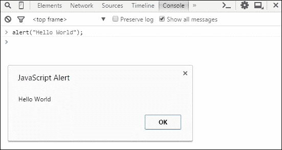
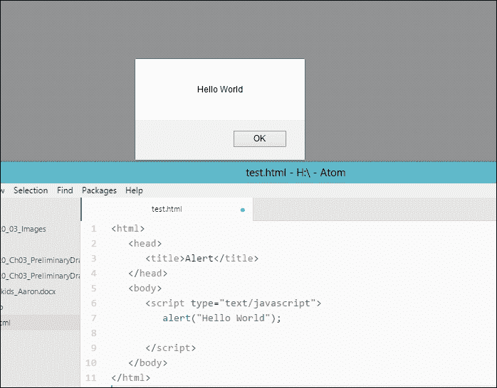
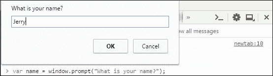
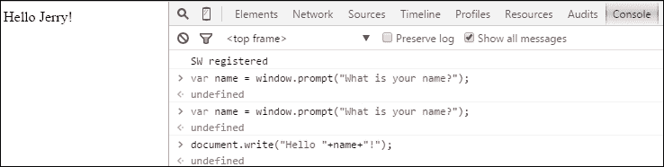
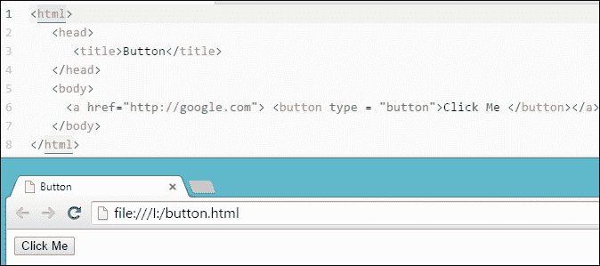
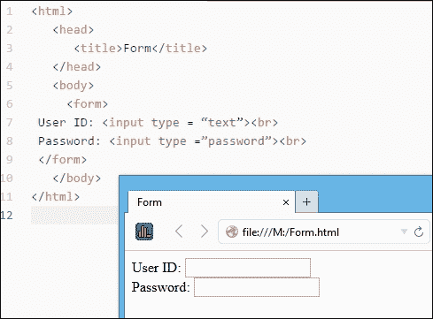
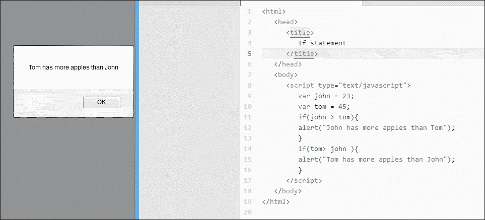
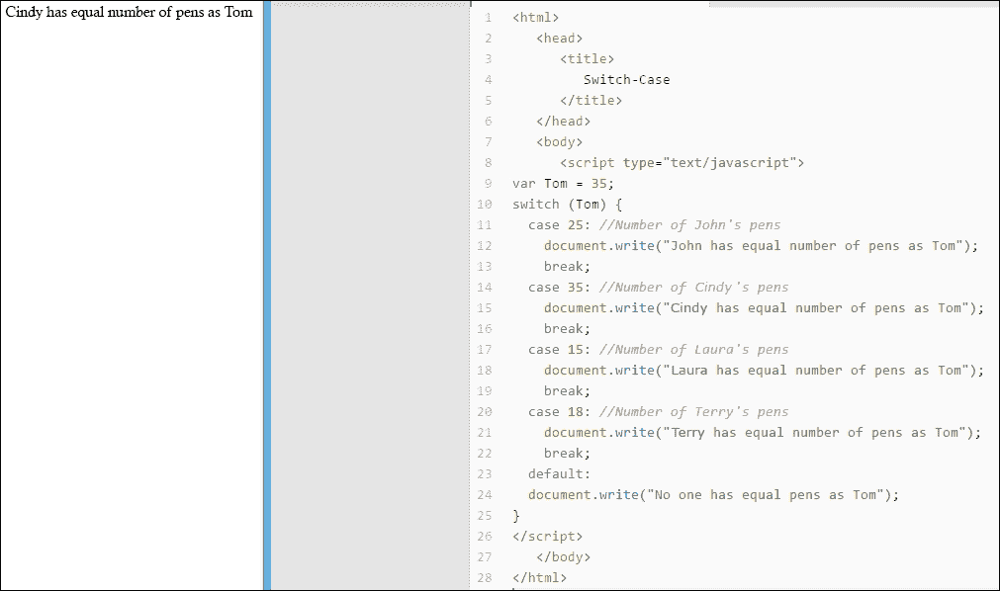
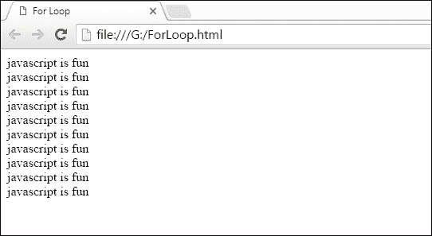

# 第四章. 深入探索

在我们迄今为止学习的多数 JavaScript 程序中，代码的执行顺序与它们在程序中出现的顺序相同。每行代码只执行一次。因此，代码中不包含测试条件是否为真或假的测试，或者我们没有执行任何逻辑语句。

在本章中，你将学习一些逻辑编程。你将了解以下主题：

+   循环

+   If 语句

+   Switch case

你已经知道如何在 HTML 文档中嵌入 JavaScript 代码。在开始本章之前，你将学习一些 HTML 标签和 JavaScript 方法。这些方法和标签将在整本书中使用。

### 注意

在面向对象编程中，我们不会直接对对象外部的数据进行任何操作；我们通过传递一个或多个参数来请求对象执行操作。这个任务被称为对象的方法。

# JavaScript 方法

在前面的章节中，你学习了如何使用`document.write()`打印一些内容。现在，你将学习更多。

我们将检查控制台和 HTML 文档上的方法，如下所示：

+   要使用 JavaScript 显示一个警告或弹窗，我们使用以下方法：

    ```js
    alert("Hello World");
    ```

    在控制台输入以下内容并按*Enter*键，你将看到一个显示**Hello World**的弹窗：

    

    你可以在 HTML 文档上编写代码以显示类似于以下弹窗：

    ```js
    <html>
      <head>
        <title>Alert</title>
      </head>
      <body>
        <script type="text/javascript">
          alert("Hello World");

        </script>
      </body>
    </html>
    ```

    输出将如下所示：

    

+   如果你想要从用户那里获取信息，你需要使用提示框来完成这个操作。以下是一个例子：

    +   你想要获取用户名并将其打印在主网页上。

    +   你可以使用`window.prompt()`方法来完成这个操作。

    +   `window.prompt()`的结构类似于以下内容：

        ```js
        window.prompt("What is your name?"); // You can type anything between the inverted commas.
        ```

    +   现在，你需要将信息存储在一个变量中。你已经从前面的章节中知道了如何做。输入以下内容并按*Enter*键：

        ```js
        var name = window.prompt("what is your name?");
        ```

    +   在控制台运行此代码后，你将在文本框中输入一些信息。输入你的信息后，你需要按下**确定**按钮。现在，你的信息已经存储在`name`变量中：

    +   如果你想在网页上打印变量，你可以使用`document.write();`方法，如下所示：

        ```js
        document.write("Hello "+name+"!");
        ```

    +   这些步骤的输出可以在以下屏幕截图中看到：

    +   HTML 文档上的代码将如下所示：

        ```js
        <html>
          <head>
            <title>Prompt</title>
          </head>
          <body>
            <script type="text/javascript">
              var name = window.prompt("What is your name?");
              document.write("Hello "+name+"!"); 
            </script>
          </body>
        </html>
        ```

# HTML 按钮和表单

在上一章中，你学习了几个 HTML 标签。现在，我们将研究一些会使学习 HTML 更有趣的标签。

## 按钮

如果你想在你的 HTML 网页上添加按钮，你可以使用`<button></button>`标签。标签的结构如下：

```js
<button type="button">Click Here </button>
```

如果你想让你的按钮执行某些操作，例如打开一个 URL；你可以考虑以下代码：

```js
<a href="http://google.com/"><button type="button">Click Me </button> </a>
```

代码的输出将如下所示：



## 表单

在 HTML 中，我们使用表单来表示包含交互控件以提交信息到 Web 服务器的文档部分。HTML 表单的基本结构如下所示：

```js
<form>
  User ID: <input type = "text"><br>
  Password: <input type ="password"><br>
</form>
```

代码的输出将如下所示：



现在让我们深入一点！

# If 语句

假设约翰有 23 个苹果，汤姆有 45 个苹果。我们想使用 JavaScript 编程来检查谁有更多的苹果。我们需要让浏览器理解**if 语句**。

### 注意

If 语句比较两个变量。

要检查我们的条件，我们需要声明包含苹果数量的两个变量，如下所示：

```js
var john = 23;
var tom = 45;
```

要检查哪个数字更大，我们可以应用如下的 if 语句：

```js
if(john > tom)
{
  alert("John has more apples than tom");
}
```

假设我们不知道哪个变量更大。然后，我们需要检查两个变量。因此，我们需要将以下代码包含到我们的程序中：

```js
if(tom > john )
{
  alert("Tom has more apples than John");
}
```

HTML 页面中的整个代码如下所示：

```js
<html>
  <head>
    <title>
      If statement
    </title>
  </head>
  <body>
    <script type="text/javascript">
      var john = 23;
      var tom = 45;
      if(john > tom){
        alert("John has more apples than Tom");
      }
    if(tom> john ){
      alert("Tom has more apples than John");
    }
    </script>
  </body>
</html>
```

输出将如下所示：



在前面的章节中，你学习了条件运算符。在 if 语句中，你可以使用所有这些。以下是一些带有注释的示例：

```js
If(tom => john){
//This will check if the number of apples are equal or greater. 
}
If(tom <= john)
{
//This will check if the number of apples are equal or less. 
}
If(tom == john)
{
//This will check if the number of apples are equal. 
}
```

要检查多个条件，你需要使用 OR（`||`）或 AND（`&&`）。

考虑以下示例：

```js
If(john == 23 || john => tom)
{
/* This will check if John has 23 apples or the number of John's apple is equal to or greater than Tom's. This condition will be full filled if any of these two conditions are true. 
*/
}
If(tom == 23 && john <= tom)
{
/* This will check if Tom has 23 apples or the number of john's apple is less than Tom's or equal. This condition will be full filled if both of these two conditions are true. 
*/
}
```

# Switch-case

如果你有多于三个条件，使用**switch-case**语句是一个好的做法。switch-case 的基本结构如下所示：

```js
switch (expression) {
  case expression1:
    break;
  case expression2:
    break;
  case expression3:
    break;
//-------------------------------
//-------------------------------
//  More case
//-------------------------------
//  -------------------------------
  default:    
}
```

每个`case`都有一个`break`。然而，`default`不需要`break`。

考虑到汤姆有 35 支笔。他的朋友约翰、辛迪、劳拉和特里分别有 25、35、15 和 18 支笔。现在，约翰想检查谁有 35 支笔。我们需要比较汤姆的笔数和每个人的笔数。我们可以使用 switch-case 来做这种类型的比较。代码如下：

```js
<html>
  <head>
    <title>
      Switch-Case
    </title>
  </head>
  <body>
    <script type="text/javascript">
      var Tom = 35;
      switch (Tom) {
        case 25: //Number of John's pens
          document.write("John has equal number of pens as Tom");
        break;
        case 35: //Number of Cindy's pens
          document.write("Cindy has equal number of pens as Tom");
        break;
        case 15: //Number of Laura's pens
          document.write("Laura has equal number of pens as Tom");
        break;
        case 18: //Number of Terry's pens
          document.write("Terry has equal number of pens as Tom");
        break; 
        default:
          document.write("No one has equal pens as Tom");
      }
    </script>
  </body>
</html>
```

输出将如下所示：



### 注意

现在，将第二个 case（`35`）的值更改为其他值并检查你的结果。

## 练习

1.  假设你除了周六和周日外每天都需要去学校。编写一个代码，其中你可以输入今天的日期数字，网页会显示你是否需要去学校。（提示：使用 switch case。）

1.  考虑到你有一个花园，你会在每月的双日给所有的植物浇水。编写一个代码，它会显示你那天是否需要给植物浇水。（提示：使用 if 条件和取模运算符（`%`）。）

# 循环

在本段中，我们将学习一个有趣的概念，称为**循环**。

考虑到你需要使用 JavaScript 打印一行 100 次。你会怎么做？

你可以在你的程序中输入`document.write("The line I want You to Write");` 100 次，或者你可以使用循环。

循环的基本用法是做多次同一件事。比如说，你需要打印出从 1 到 100 的所有整数，即*1 + 2 + 4 + 6 +……+100*系列。计算是相同的，你只需要多次做这件事。在这些情况下，我们使用循环。

我们将讨论两种类型的循环，即**for 循环**和**while 循环**。

## for 循环

for 循环的基本结构如下：

```js
for(starting ; condition ; increment/decrement)
{
  statement
}
```

`starting`参数是循环的初始化。你需要初始化循环才能启动它。`condition`参数是控制循环的关键元素。`increment/decrement`参数定义了循环如何增加/减少。

让我们看看一个例子。你想要打印**javascript is fun** 10 次。代码如下所示：

```js
<html>
  <head>
    <title>For Loop</title>
  </head>
  <body>
  <script type="text/javascript">
    var java; 
    for(java=0;java<10;java++){
      document.write("javascript is fun"+"<br>");
    }
  </script>
  </body>
</html>
```

输出将类似于以下内容：



是的！你打印了 10 次行。如果你仔细查看代码，你会看到以下内容：

+   我们声明了一个名为`java`的变量

+   在`for`循环中，我们将`0`初始化为其值

+   我们添加了一个`java<10`条件，使得浏览器从`0`计数到`10`

+   我们将变量增加了`1`；这就是为什么我们添加了`java++`

### 练习

1.  使用 JavaScript 编写一个代码，将打印以下输出：

    ```js
    I have 2 apples.
    I have 4 apples.
    I have 6 apples.
    I have 8 apples.
    I have 10 apples.
    I have 12 apples.
    I have 14 apples.
    I have 16 apples.
    I have 18 apples.
    I have 20 apples.
    ```

1.  编写一个代码，将打印从 2 到 500 的所有偶数。

## while 循环

你已经学习了如何使用 for 循环多次执行某个操作。现在，我们将学习另一种循环，称为 while 循环。while 循环的结构如下：

```js
initialize;
while(condition){
  statement; 
  increment/decrement; 
}
```

之前示例的代码如下：

```js
<html>
  <head>
    <title>For Loop</title>
  </head>
  <body>
    <script type="text/javascript">
      var java = 0;
      while(java < 10){
        document.write("javascript is fun"+"<br>");
        java++;
      }
    </script>
  </body>
</html>
```

输出将与`for`循环相同。

### 练习

1.  编写一个代码，使用 while 循环打印从 1 到 600 的所有奇数。（提示：使用取模运算符。）

1.  编写一个代码，将打印以下输出：

    ```js
    5 x 1  = 5
    5 x 2  = 10
    5 x 3  = 15
    5 x 4  = 20
    5 x 5  = 25
    5 x 6  = 30
    5 x 7  = 35
    5 x 8  = 40
    5 x 9  = 45
    5 x 10 = 50
    ```

# 概述

在本章中，你学习了使用 JavaScript 进行逻辑运算。你学习了循环、条件运算和其他 HTML 标签。

我们需要关注本章，因为我们在这里讨论了 JavaScript 中最重要的属性。如果你练习本章和最后三章，你就可以成为 JavaScript 大师。我建议你在没有掌握所有四个章节之前不要继续前进。如果你已经学习了我们之前讨论的所有主题，那么让我们继续到第五章，*嘿！战斗中的航行*。
