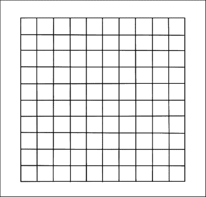
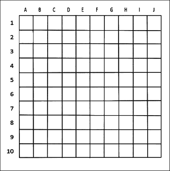
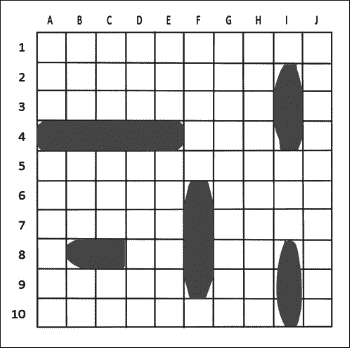
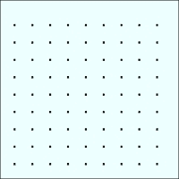
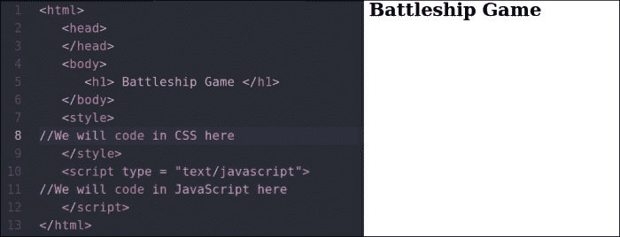
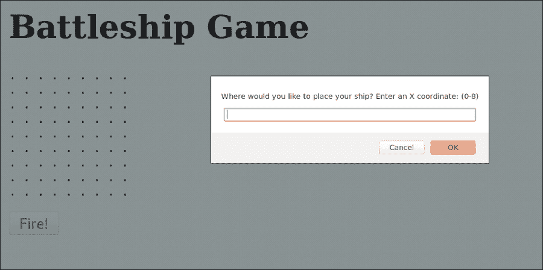
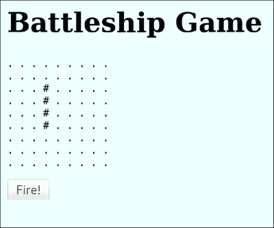
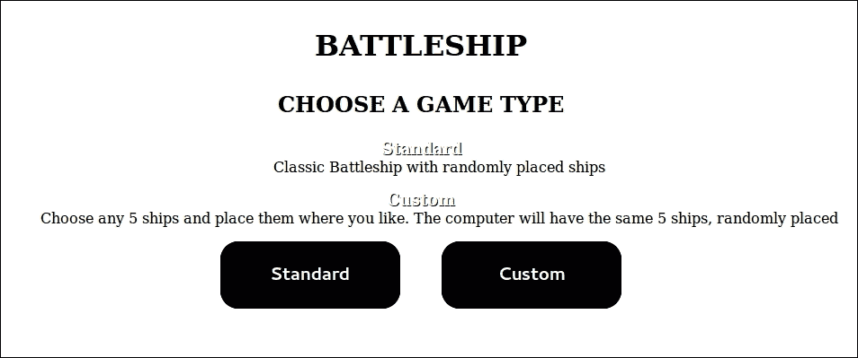
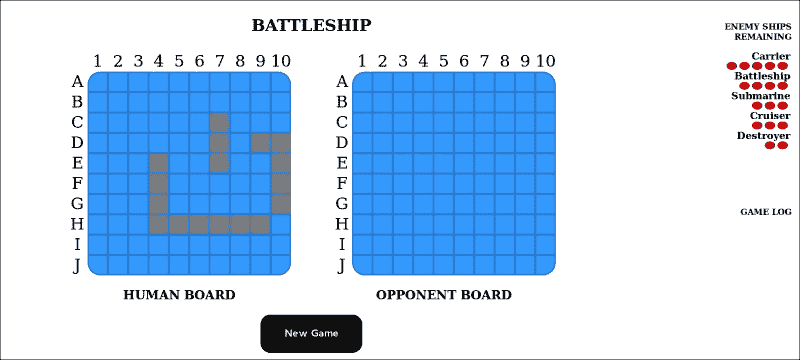
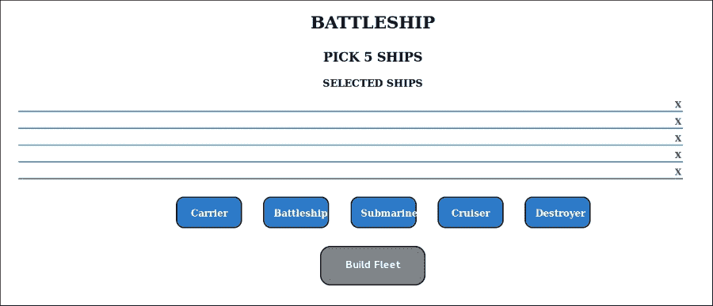

# 第五章。Ahoy! Sailing into Battle

在本章中，我们将使用 HTML、CSS 和 JavaScript 开发一个完整的游戏。我们将专注于 JavaScript 编程，因此，我们不会关心游戏的图形。我们将编写一个名为**Battleship**的游戏。你们中的许多人以前都听说过它。这是一个记忆游戏。你的想象力和直觉将帮助你赢得游戏。游戏有多种玩法。

让我们讨论一下游戏的外观。以下图中展示了几个相互连接的方形几何物体：



行和列通常用数字系统或字母来命名。比如说，行是**1**、**2**、**3**、**4**、**5**、**6**、**7**、**8**、**9**和**10**。列是**A**、**B**、**C**、**D**、**E**、**F**、**G**、**H**、**I**和**J**。我们可以用数字或字母来命名它们：



这是一个两人游戏。以下是其规则：

+   两位玩家将秘密地将他们的船（可以是不同类型的船只或水上交通工具）放置在他们的矩阵/网格上。

+   玩家可以将他们的船只垂直或水平放置；然而，不能对角放置。

+   玩家必须在开始游戏之前将所有船只放置在网格上。

+   他们的船只不能相互重叠。

+   当所有船只都放置好后，玩家不能将他们的船只从网格中移动。

+   放置所有船只后，第一位玩家将声明第二位玩家的坐标，如果第二位玩家有船，则该船将被击沉。

+   然后，第二位玩家将声明第一位玩家的坐标。如果第一位玩家有船，它将被击沉。

+   坐标可能看起来像**A2**、**B2**、**D5**等等。第一个字母将是网格的*x*轴，数字将代表网格的*y*轴。

+   击沉对手所有船只的玩家将获胜。

以下图显示了网格上放置的一些船只：



现在，我们将进入游戏的编程部分。

我们将坚持以下规则，以便我们的游戏不会变得难以编码：

1.  将有一艘属于两位玩家的船。

1.  船将占据网格的四个部分。

1.  玩家必须在提示符中输入*x*和*y*轴的坐标。

1.  网格将是 9 x 9。

1.  玩家需要输入`h`或`v`来表示船的水平或垂直位置。

1.  为了简化绘图，我们将在网格的位置上放置点（**.**）。网格看起来将类似于以下图像：

1.  我们需要一个**Fire**按钮来开始游戏。

# HTML 部分

HTML 部分将类似于以下代码：

```js
<html>
  <head>
  </head>
  <body>
    <h1> Battleship Game </h1>
  </body>
  <style>
// We will code in CSS here
  </style>
  <script type = "text/javascript">
//We will code in JavaScript here
  </script>
</html>
```

代码的输出将如下所示：



# CSS 部分

我们在`<style></style>`标签中使用 CSS 代码来设置页面样式。因为我们只关注 JavaScript 的编码，所以我们不会关心游戏的视觉部分。为了使游戏页面更加多彩，我们将使用以下代码：

```js
  <style>
    body { 
      background-color: #eff; 
    }
  </style>
```

# JavaScript 部分

这部分是游戏的主要部分，我们将最关注这部分。我们将在`<script></script>`标签中编写所有代码。

对于网格，我们需要一个二维数组。我们将使用一个`game`变量来存储数据，如下所示：

### 注意

许多程序可能需要处理具有共同特征的多项数据项。在这种情况下，将数据项放置在数组中通常很方便，它们将共享相同的名称。单个数据可以是字符、浮点数、整数等。然而，它们必须都是同一类型和类。

```js
var game = [    [".", ".", ".", ".", ".", ".", ".", ".", "."],
                [".", ".", ".", ".", ".", ".", ".", ".", "."],
                [".", ".", ".", ".", ".", ".", ".", ".", "."],
                [".", ".", ".", ".", ".", ".", ".", ".", "."],
                [".", ".", ".", ".", ".", ".", ".", ".", "."],
                [".", ".", ".", ".", ".", ".", ".", ".", "."],
                [".", ".", ".", ".", ".", ".", ".", ".", "."],
                [".", ".", ".", ".", ".", ".", ".", ".", "."],
                [".", ".", ".", ".", ".", ".", ".", ".", "."],
           ];
```

我们将使用一个变量来在 HTML 页面上显示二维数组：

```js
var board = document.createElement("PRE");
```

我们现在将此代码附加到主体并创建一个按钮：

```js
document.body.appendChild(board);
var button=document.createElement("BUTTON");
```

此按钮将调用`fire`函数（我们稍后会编写该函数）：

```js
button.onclick = fire;
```

现在，我们将按钮放置在页面主体部分：

```js
var t=document.createTextNode("Fire!");
  document.body.appendChild(button);
  button.appendChild(t);
```

让我们创建一个绘制棋盘的函数：

```js
  function drawBoard() {
    var boardContents = "";
    var i;
    var j;
    for (i=0; i<9; i++) {
      for (j=0; j<9; j++) {
        boardContents = boardContents + game[i][j]+" ";
        // Append array contents for each board square
      }
      boardContents = boardContents + "<br>";
      // Append a line break at the end of each horizontal line
    }
    return boardContents;
    // Return string representing board in HTML
  }
```

现在，通过编写以下代码在 HTML 页面上绘制棋盘：

```js
board.innerHTML = drawBoard();
```

我们将使用`prompt()`函数询问玩家他想要将船只放置在哪里：

```js
var x=prompt("Where would you like to place your ship? Enter an X coordinate: (0-8)");
  var y=prompt("Where would you like to place your ship? Enter a Y coordinate: (0-8)");
  var direction=prompt("Place (h)orizontally, (v)ertically");
  x = Number(x);  // Convert the string returned by "prompt" into a number
  y = Number(y);  // Convert the string returned by "prompt" into a number
```

如果玩家选择水平方向放置他们的船只，我们需要用以下代码替换点：

```js
if (direction[0] == "h") {
  var c;
  for (c = x; c < (x + 4); c++)
  {
    game[y][c] = '#';
  }
}
```

如果玩家选择垂直方向放置他们的船只，我们需要用以下代码替换点：

```js
if (direction[0] == "v") {
  var c;
  for (c = y; c < (y + 4); c++)
  {
    game[c][x] = '#';
  }
}
```

在放置船只后，我们需要重新绘制棋盘，如下所示：

```js
  board.innerHTML = drawBoard();
```

让我们创建`fire()`函数。

我们的`fire()`函数如下所示：

```js
function fire() {
//We will write codes here.
}
```

当调用`fire()`函数时，我们需要从玩家那里获取输入，如下所示：

```js
  var fireX=prompt("Where would you like to fire? Enter an X coordinate: (0-8)");
  var fireY=prompt("Where would you like to fire? Enter a Y coordinate: (0-8)");
```

将输入转换为数字，如下所示：

```js
  fireX = Number(fireX);
  // Convert the string returned by "prompt" into a number
  fireY = Number(fireY);
  //  Convert the string returned by "prompt" into a number
```

如果输入不匹配`#`字符，我们将使用以下代码打印`You Missed.`：

```js
  if (game[fireY][fireX] == ".") {
    // Check if the specified coordinate is occupied by the cruiser
    alert("You Missed.");
  }
```

如果输入击中船只，我们将打印一些消息并重新绘制棋盘：

```js
  else if (game[fireY][fireX] == "*") {
    alert("You already hit the ship there.");
  } else {
    alert("Kaboom! You hit a ship");
    game[fireY][fireX] = "*";
    board.innerHTML = drawBoard();
    // Redraw board with hit marker at specified coordinate
  }
```

现在，我们需要检查棋盘上是否还有剩余船只。我们将使用以下代码：

```js
  var shipfound;
  var i;
  var j;
  // Check if there are any ships remaining on the board
  for (i=0; i<9; i++) {
    for (j=0; j<9; j++) {
      if (game[i][j] != "." && game[i][j] != "*") {
        shipfound = true;
        // Taking a boolean data type to set it if a ship is found
      }
    }
  }
```

如果没有剩余船只，我们将结束游戏：

```js
if (!shipfound) {
  // If no ships are found end the game
  alert("All ships have been sunk. Well done Captain! Game over");
  document.body.removeChild(button);
  // Remove the fire button from the page after game over
}
```

# 最终代码

我们最终的代码将类似于以下内容：

```js
<html>
  <head>
  </head>
  <body>
    <h1> Battleship Game </h1>
  </body>
  <style>
  body {
    background-color: #eff;
  }
  </style>
  <script>
    var game = [  [".", ".", ".", ".", ".", ".", ".", ".", "."],
                  [".", ".", ".", ".", ".", ".", ".", ".", "."],
                  [".", ".", ".", ".", ".", ".", ".", ".", "."],
                  [".", ".", ".", ".", ".", ".", ".", ".", "."],
                  [".", ".", ".", ".", ".", ".", ".", ".", "."],
                  [".", ".", ".", ".", ".", ".", ".", ".", "."],
                  [".", ".", ".", ".", ".", ".", ".", ".", "."],
                  [".", ".", ".", ".", ".", ".", ".", ".", "."],
                  [".", ".", ".", ".", ".", ".", ".", ".", "."],
               ];
    var board = document.createElement("PRE");
    // preparing the HTML <pre> element to display the board on the page
    document.body.appendChild(board);
    var button=document.createElement("BUTTON");
    // Preparing the "Fire! button to allow the player to fire at the ship
    button.onclick = fire;       // Clicking the button calls the fire() function
    var t=document.createTextNode("Fire!");
    document.body.appendChild(button);
    button.appendChild(t);
    function drawBoard() {
      var boardContents = "";
      var i;  var j;
      for (i=0; i<9; i++) {
        for (j=0; j<9; j++) {
          boardContents = boardContents + game[i][j]+" ";
          // Append array contents for each board square
        }
        boardContents = boardContents + "<br>";
        // Append a line break at the end of each horizontal line
      }  return boardContents;
      // Return string representing board in HTML
    }
    board.innerHTML = drawBoard();
    // Display the board on the page using the above function
    var x=prompt("Where would you like to place your cruiser? Enter an X coordinate: (0-8)");
    var y=prompt("Where would you like to place your cruiser? Enter a Y coordinate: (0-8)");
    var direction=prompt("Place (h)orizontally, (v)ertically");
    x = Number(x);  // Convert the string returned by "prompt" into a number
    y = Number(y);  // Convert the string returned by "prompt" into a number
    if (direction[0] == "h") {
      var c;
      for (c = x; c < (x + 4); c++)
      {
        game[y][c] = '4';
      }
    }
    // Draw cruiser vertically
    if (direction[0] == "v") {
      var c;
      for (c = y; c < (y + 4); c++)
      {
        game[c][x] = '4';
      }
    }
    board.innerHTML = drawBoard(); // Redraw board with cruiser added
    // Function for firing a shot when the "Fire! button is pressed
    function fire() {
      var fireX=prompt("Where would you like to fire? Enter an X coordinate: (0-8)");
      var fireY=prompt("Where would you like to fire? Enter a Y coordinate: (0-8)");
      fireX = Number(fireX);
      // Convert the string returned by "prompt" into a number
      fireY = Number(fireY);
      //  Convert the string returned by "prompt" into a number
      if (game[fireY][fireX] == ".") {
        // Check if the specified coordinate is occupied by the cruiser
        alert("Missed.");
      }
      else if (game[fireY][fireX] == "*") {
        alert("You already hit the ship there.");
      } else {
        alert("Kaboom! You hit a ship");
        game[fireY][fireX] = "*";
        board.innerHTML = drawBoard();
        // Redraw board with hit marker at specified coordinate
      } 
      var shipfound;  
      var i;  
      var j;
      // Check if there are any ships remaining on the board
      for (i=0; i<9; i++) {
        for (j=0; j<9; j++) {
          if (game[i][j] != "." && game[i][j] != "*") {
            shipfound = true;
            // Set to true if a ship is found
          }
        }
      }if (!shipfound) {
        // If no ships are found end the game
        alert("All ships have been sunk. Well done Captain! Game over");
        document.body.removeChild(button);
        // Remove the fire button from the page after game over
      }
    }
  </script>
</html>
```

如果运行前面的代码，您将看到以下提示：



让我们玩我们创建的游戏。第一位玩家必须放置他的船只。他必须输入船只的坐标。

假设我们在*x*轴上输入`3`，在*y*轴上输入`2`。将我们的船只放置在垂直方向。游戏屏幕将如下所示：



你可以看到你的船只已经放置好了。现在，你可以通过按下**开火**按钮来射击对手（电脑）。你将被要求输入你想要射击的网格坐标。如果你射偏了，你会看到一个我们编写的消息，**你错过了**。

我希望你能玩到你构建的游戏。

恭喜！

如果你想要进一步开发你的游戏（例如增强图形、船只数量等），你只需要开发 CSS 和 JavaScript。

现在，我们将看到 Battleship 游戏的更好代码，如下所示：

1.  在你的电脑的任何位置创建一个`js`文件夹。

1.  在`js`文件夹中，放置本章包含的三个文件：`battleship.js`、`functions.js`和`jquery.min.js`。

1.  在`js`文件夹外，放置`battleship.css`和`index.html`文件。

在记事本中打开`index.html`文件，你会看到以下代码：

```js
<html>
  <head>
    <title>Battleship</title>
    <meta name="viewport" content="width=device-width" />
    <link href="battleship.css" rel="stylesheet" type="text/css"/>
  </head>
  <body>
    <h1>BATTLESHIP</h1>
    <div class="game-types">
      <h2 class='game-choice'>Choose a game type</h2>
      <dl class="game-description">
        <dt>Standard</dt>
        <dd>Classic Battleship with randomly placed ships</dd>
        <dt>Custom</dt>
        <dd>Choose any 5 ships and place them where you like. The computer will have the same 5 ships, randomly placed</dd>
      </dl>
      <div class='button-wrapper'>
        <button class="standard">Standard</button>
        <button class="custom">Custom</button>
      </div>
    </div>
    <div class='ship-picker'>
      <h2>Pick 5 Ships</h2>
      <h3>Selected ships</h3>
      <ul class="ship-list">
        <li>
          <p></p>
          <div class='remove'>X</div>
        </li>
        <li>
          <p></p>
          <div class='remove'>X</div>
        </li>
        <li>
          <p></p>
          <div class='remove'>X</div>
        </li>
        <li>
          <p></p>
          <div class='remove'>X</div>
        </li>
        <li>
          <p></p>
          <div class='remove'>X</div>
        </li>
      </ul>
      <ul class='ship-choices button-wrapper'>
        <li class="ship-choice">Carrier</li>
        <li class="ship-choice">Battleship</li>
        <li class="ship-choice">Submarine</li>
        <li class="ship-choice">Cruiser</li>
        <li class="ship-choice">Destroyer</li>
      </ul>
      <div class='button-wrapper'>
        <button class='build-fleet inactive'>Build Fleet</button>
      </div>
    </div>
    <div class="ship-placer">
      <div class="board placer-board">
        <div class="labels">
          <div class="row-label">
          </div>
          <div class="column-label">
          </div>
        </div>
        <div class="playable-area">
        </div>
      </div>
      <div class='ships-to-place'>
        <h3>Ships to place</h3>
        <ul>
        </ul>
      </div>

      <div class="clear"></div>
      <div class="instructions">
        <p>Use 'WASD' keys to rotate pieces</p>
      </div>

      <div class='button-wrapper'>
        <button class="start inactive">Start game</button>
      </div>
    </div>
    <div class="game-area">
      <div class="board-wrap">
        <h1 class="hidden">BATTLESHIP</h1>
        <div class="single-board-wrap">
          <div class="board human-board">
            <div class="labels">
              <div class="row-label">
              </div>
              <div class="column-label">
              </div>
            </div>
            <div class="playable-area">
            </div>
          </div>
          <h2>Human Board</h2>
        </div>
        <div class="single-board-wrap">
          <div class="board ai-board">
            <div class="labels">
              <div class="row-label">
              </div>
              <div class="column-label">
              </div>
            </div>
            <div class="playable-area">
            </div>
          </div>
          <h2>Opponent Board</h2>
        </div>
        <div class="button-wrapper">
          <button class="new-game">New Game</button>
          <button class="stats hidden">Show Stats</button>
        </div>
      </div>
      <div class="info-area">
        <h2>Enemy ships remaining</h2>
        <div class="scoreboard">
          <div class="ships-left">
          </div>
        </div>
        <div class="gamelog-container">
          <h2>GAME LOG</h2>
        </div>
      </div>
    </div>
    <script src="img/jquery.min.js"></script>
    <script src="img/functions.js"></script>
    <script src="img/battleship.js"></script>
  </body>
</html>
```

我们在 HTML 文件中包含了这三个 JavaScript 文件。我们添加了一个 jQuery 文件，我们将在下一章讨论。前面代码的输出将显示以下屏幕：



你可以点击**标准**按钮来玩标准战场游戏，或者点击**自定义**按钮来玩非标准战场游戏。

如果你选择**标准**按钮，你会得到以下屏幕：



现在，你可以猜测对手船只的位置并点击网格。屏幕右侧将有一个日志面板。你还可以从游戏日志面板的前一个面板中看到你摧毁了多少艘以及哪些船只。

如果你选择**自定义**玩法，你会看到以下屏幕：



添加了五艘船之后，你就可以玩游戏了。如果需要，你可以添加相同船只两次或更多。

你可以将你的船只垂直或水平放置，并点击方块来击沉对手的船只。你一次只能点击一个方块。

# 概述

在本章中，我们构建了一个完整的游戏并进行了游戏。我们还玩了一个我们构建的游戏的更好版本。你需要记住的是，你必须了解我们之前讨论的所有代码背后的逻辑。本章提供了游戏更好版本的源代码。我希望你会研究代码并编写你自己的 Battleship 游戏。我们在改进的 Battleship 中使用了`jquery.js` JavaScript 文件。`jquery.js`文件有很多行代码（我们将在第六章，*探索 jQuery 的优势*中讨论这一点）。

如果你掌握了本章我们讨论的所有代码，我们现在可以进入下一章。
