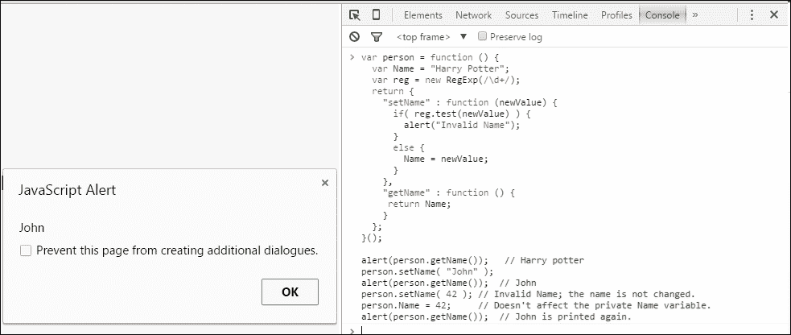

# 第九章. 使用 OOP 整理你的代码

在本章中，我们将学习**面向对象编程**（**OOP**）并讨论著名游戏**Hangman**的代码。

"面向对象编程（OOP）是一种使用抽象来创建基于现实世界的模型的编程范式。OOP 使用了之前确立的范式中的几种技术，包括模块化、多态性和封装。" 或者 "面向对象编程语言通常通过它们使用类来创建具有相同属性和方法的多重对象来识别。"

你可能已经假设 JavaScript 是一种面向对象编程语言。是的，你完全正确。让我们看看为什么它是面向对象的。如果一个计算机编程语言具有以下几个特性，我们称之为面向对象：

+   继承

+   多态性

+   封装

+   抽象

在继续之前，让我们来讨论一下**对象**。我们在 JavaScript 中以以下方式创建对象：

```js
var person = new Object();
person.name = "Harry Potter";
person.age = 22;
person.job = "Magician";
```

我们为一个人创建了一个对象。我们添加了一些人的属性。

如果我们想访问对象的任何属性，我们需要调用该属性。

假设你想显示前一个`person`对象的`name`属性弹窗。你可以使用以下方法来完成：

```js
person.callName = function(){
  alert(this.name);
};
```

我们可以将前面的代码写成以下形式：

```js
var person = {
  name: "Harry Potter",
  age: 22,
  job: "Magician",
  callName: function(){
  alert(this.name);
  }
};
```

# JavaScript 中的继承

继承意味着从父母或祖先那里获得某些东西（例如，特征、品质等）。在编程语言中，当一个类或对象基于另一个类或对象，以保持父类或对象的行为时，这被称为**继承**。

我们也可以说这是一个获取其他事物属性或行为的概念。

假设 X 从 Y 那里继承了一些东西；这就像 X 是 Y 的一种类型。

JavaScript 具有继承能力。让我们看看一个例子。鸟从动物那里继承，因为鸟是动物的一种。因此，鸟可以做动物能做的事情。

在 JavaScript 中，这种关系稍微复杂一些，需要一种语法。我们需要使用一个特殊对象，称为`prototype`，它将属性分配给一个类型。我们需要记住，只有函数才有原型。我们的`Animal`函数应该看起来类似于以下内容：

```js
function Animal(){
//We can code here. 
}; 
```

要添加一些函数的属性，我们需要添加一个原型，如下所示：

```js
Animal.prototype.eat = function(){
  alert("Animal can eat.");
};
```

让我们为我们的`Bird`函数创建原型。我们的函数和原型应该看起来类似于以下内容：

```js
function Bird(){
};
Bird.prototype = new Animal();
Bird.prototype.fly = function(){
  alert("Birds can fly.");
};
Bird.prototype.sing = function(){
  alert("Bird can sing.");
};
```

原型和函数的结果是，你创建的任何`Bird`都将具有`Animal`和`Bird`的属性。然而，如果你创建`Animal`，这将只具有`Animal`的属性。`Animal`的属性被`Bird`继承。

因此，我们可以说 JavaScript 具有继承属性。

# JavaScript 中的封装

在面向对象编程（OOP）中，**封装**是允许对象将公共和私有类的成员组合在一个单一名称下的最重要的概念之一。我们使用封装来保护我们的类免受意外或故意的错误。封装意味着将某物封装在或好像它在一个胶囊中。

现在，我们将看看 JavaScript 是否支持封装。如果它支持，我们可以说 JavaScript 是一种面向对象编程语言。让我们看看以下示例：

```js
var person = {
  "name" : "Harry Potter",
  "age" : 22,
};
alert(person.name);
person.name = "John";
alert(person.name);
```

如果我们在控制台运行这段代码，第一个警告框将显示以下图片：


我们将变量`name`改为`John`。因此，第二个警告框将与以下图片相似：


如果我们意外地将数字赋值给`name`变量会发生什么？

将数字赋值给`name`变量是完全可接受的。就 JavaScript 而言，一个变量可以接受任何类型的数据作为其值。然而，我们不想用数字代替名字。我们该怎么办？我们可以使用 JavaScript 的封装属性，如下所示：

```js
var person = function () {
  var Name = "Harry Potter";
  var reg = new RegExp(/\d+/);
  return { 
    "setName" : function (newValue) {
      if( reg.test(newValue) ) {
        alert("Invalid Name");
      }
      else {
        Name = newValue;
      }
    },
    "getName" : function () {
      return Name; 
    }
  }; 
}(); 

alert(person.getName());   // Harry potter
person.setName( "John" );
alert(person.getName());  // John
person.setName( 42 ); // Invalid Name; the name is not changed.
person.Name = 42;     // Doesn't affect the private Name variable.
alert(person.getName());  // John is printed again.
```

现在，如果我们把上面的代码在控制台运行，第一个输出将显示一个弹出窗口，显示**哈利·波特**，因为我们只调用了`getName()`函数。`getName()`函数有一个初始值，即`Harry Potter`：


第二次输出如下，因为我们改变了`person`的`Name`属性为`John`，并再次调用了`getName()`函数：


第三次输出将如下所示，因为我们尝试将一个数字推送到字符串变量中。名字不能是整数，因此，在`if`语句下出现了**无效名称**：


第四次输出将如下所示，因为数字没有被添加到人的`Name`属性中。因此，我们将得到最后推送到`Name`属性中的数据：



我们现在可以确认 JavaScript 支持封装。

JavaScript 也支持**多态**和**抽象**。如果你想了解它们，可以参考以下链接：

[`developer.mozilla.org/en-US/docs/Web/JavaScript/Introduction_to_Object-Oriented_JavaScript`](https://developer.mozilla.org/en-US/docs/Web/JavaScript/Introduction_to_Object-Oriented_JavaScript)

让我们来做些有趣的事情。你可能听说过一个叫做“猜字谜”的游戏。我们将讨论这个游戏中面向对象编程（OOP）的应用。首先，让我们来介绍一下这个游戏。

玩家需要猜一个单词。如果他猜对了单词，他就安全了；否则，他将被绞死。看看以下图片，以获得关于游戏的清晰概念，如下所示：


# 拆解猜字谜

Hangman 游戏有两个文件夹和一个 HTML 文件。这两个文件夹分别命名为`css`和`js`。`index.html` HTML 文件应该包含以下代码：

```js
<html lang="en" ng-app="hangman"> 
  <head>
    <title>Hangman</title>
    <link rel="stylesheet" href="css/styles.css">
    <script src="img/angular.min.js"></script>
  </head>
  <body ng-controller="StartHangman">
    <p>Hangman</p>
    <svg width="400" height="400">
      <rect ng-show="failedGuess.length >= 1" x="0" y="0" width="40" height="400"></rect>
      <rect ng-show="failedGuess.length >= 2" x="40" y="20" width="200" height="40"></rect>
      <rect ng-show="failedGuess.length >= 3" x="173" y="50" width="4" height="100"></rect>
      <circle ng-show="failedGuess.length >= 3" cx="175" cy="120" r="40"></circle>
      <line ng-show="failedGuess.length >= 4" x1="175" y1="150" x2="175" y2="185" style="stroke:rgb(0,0,0)" stroke-width="10"></line>
      <line ng-show="failedGuess.length >= 4" x1="175" y1="180" x2="100" y2="240" style="stroke:rgb(0,0,0)" stroke-width="10"></line>
      <line ng-show="failedGuess.length >= 5" x1="175" y1="180" x2="250" y2="240" style="stroke:rgb(0,0,0)" stroke-width="10"></line>
      <line ng-show="failedGuess.length >= 6" x1="175" y1="180" x2="175" y2="265" style="stroke:rgb(0,0,0)" stroke-width="10"></line>
      <line ng-show="failedGuess.length >= 7" x1="175" y1="260" x2="120" y2="340" style="stroke:rgb(0,0,0)" stroke-width="10"></line>
      <line ng-show="failedGuess.length >= 8" x1="175" y1="260" x2="230" y2="340" style="stroke:rgb(0,0,0)" stroke-width="10"></line>
    </svg>

    <div ng-show="stage == 'initial'">
      <h2>Please enter your secret words:</h2>
      <input type="text" ng-model="secretWords" autofocus ng-keyup="$event.keyCode == 13 ? startGame() : null">
      <button ng-click="startGame()">Enter</button>
    </div>

    <div ng-show="stage == 'play'">
      <h1>{{ answer }}</h1>
      <h2>Failed guess ({{ failedGuess.length }}) = {{ failedGuess}}</h2>

      <input type="text" ng-model="charGuess" id="char-guess" ng-keyup="$event.keyCode == 13 ? guess(charGuess) : null" placeholder="Guess a letter">
      <button ng-click="guess(charGuess)">Enter</button>
    </div>

    <div ng-show="stage == 'won'">
      <h1>You Win! :)</h1>
      <h2>That's right, the secret words is {{ secretWords }}</h2>
      <p>Press F5 to replay</p>
    </div>

    <div ng-show="stage == 'lost'">
      <h1>You Lose! :(</h1>
      <h2>The secret word is {{ secretWords }}</h2>
      <p>Press F5 to replay</p>
    </div>

    <script src="img/hangman.js"></script>
  </body>
</html>
```

`css`文件夹应该有一个`styles.css`文件。`styles.css`文件应该包含以下代码：

```js
body {
  font-family: monospace;
  text-align: center;
  font-size: 16px;
  line-height: 1.40;
}

input[type="text"] {
  padding: 5px;
  font-family: monospace;
  height: 30px;
  font-size: 1.8em;
  background-color: #fff;
  border: 2px solid #000;
  vertical-align: bottom;
}

svg {
  margin: 0 0 30px;
}

button {
  cursor: pointer;
  margin: 0;
  height: 44px;
  background-color: #fff;
  border: 2px solid #000;
}
```

`js`文件夹中应该有两个 JavaScript 文件，`angular.min.js`和`hangman.js`。

`angular.min.js`文件是一个框架。您可以从[`angularjs.org/`](https://angularjs.org/)下载它，或者它包含在本书的代码包中。

`hangman.js`文件应该包含以下代码：

```js
var hangman = angular.module('hangman', []).controller('StartHangman', StartHangman);
  function StartHangman($scope, $document) {
    $scope.stage = "initial";
    $scope.secretWords = "";
    $scope.answer = "";
    $scope.failedGuess = [];
    var hasWon = function() {
      var foundDash = $scope.answer.search(/-/);
      return (foundDash == -1);
    }
    var hasLost = function() {
      return ($scope.failedGuess.length >= 8);
    }
    $scope.startGame = function() {
      $scope.secretWords = $scope.secretWords.toLowerCase();
      for(i in $scope.secretWords) {
        $scope.answer += $scope.secretWords[i] == ' ' ? ' ' : '-';
      }
      $scope.stage = "play"
    }
    $scope.guess = function(ch) {
      ch = ch.toLowerCase();
      $scope.charGuess = "";
      if(ch.length != 1) {
        if(ch.length > 1) {
          alert("Please only enter one character at a time");
        }
      return ;
    }
    /* If ch is already in the failed guess list */
    for(i in $scope.failedGuess) {
      if(ch == $scope.failedGuess[i]) return ;
    }
    /* Check if it's part of the answer */
    var found = false;
    $scope.answer = $scope.answer.split(""); /* convert to array of char */
    for(i in $scope.secretWords) {
      if($scope.secretWords[i] === ch) {
        found = true;
        $scope.answer[i] = ch;
      }
    }
    $scope.answer = $scope.answer.join(""); /* convert back to string */
    if(!found) {
      $scope.failedGuess.push(ch);
    }
    if(hasWon()) {
      $scope.stage = "won";
    }
    if(hasLost()) {
      $scope.stage = "lost";
    }
  }
}
```

让我们讨论一下代码。

我们使用`var hangman = angular.module('hangman', []).controller('StartHangman', StartHangman);`来导入我们的`angular.min.js`文件并开始控制游戏代码的其余部分。

我们编写了一个`StartHangman($scope, $document) {}`函数，我们将在这里编写代码。我们从`angular.min.js`文件中传递了两个变量，`$scope`和`$document`。

我们初始化了一些变量，如下所示：

```js
$scope.stage = "initial";
$scope.secretWords = "";
$scope.answer = "";
$scope.failedGuess = [];
```

我们编写了两个函数，用于游戏的胜利和失败，如下所示：

```js
var hasWon = function() {
  var foundDash = $scope.answer.search(/-/);
  return (foundDash == -1);
}
var hasLost = function() {
  return ($scope.failedGuess.length >= 8);
}
```

我们在这里固定了猜测次数。然后，我们编写了一个开始游戏的函数。我们创建了一个对象，并使用了 JavaScript 的继承属性，如下所示：

```js
$scope.startGame = function() {
  $scope.secretWords = $scope.secretWords.toLowerCase();
  for(i in $scope.secretWords) {
    $scope.answer += $scope.secretWords[i] == ' ' ? ' ' : '-';
  }
  $scope.stage = "play"
}
```

我们从玩家那里获取输入以便将其存储为我们秘密的单词。

游戏的提示页面将类似于以下图片：


然后，我们最重要的函数`$scope.guess = function(ch){}`被引入。我们向该函数传递一个字符，并检查它是否与玩家输入的秘密单词中的任何字母匹配。

# 摘要

在本章中，你学习了面向对象语言的特点。我们还看到了在著名的 Hangman 游戏中使用面向对象特性的例子！我希望你喜欢创建和玩 Hangman。我们将在本书的下一章和最后一章中看到 JavaScript 的可能性。
