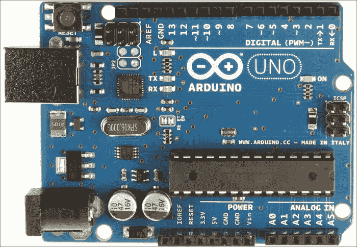
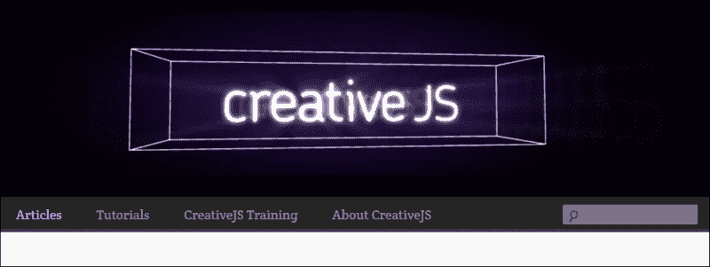
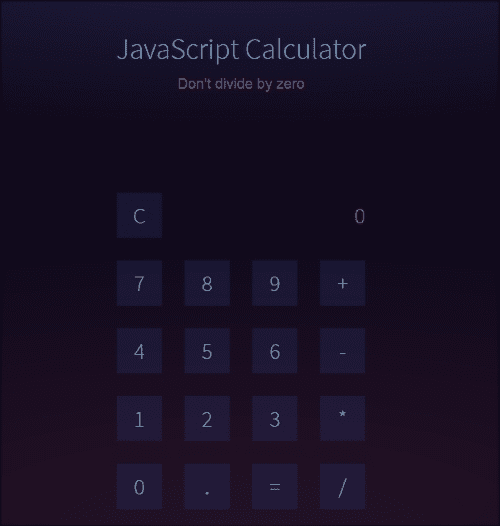
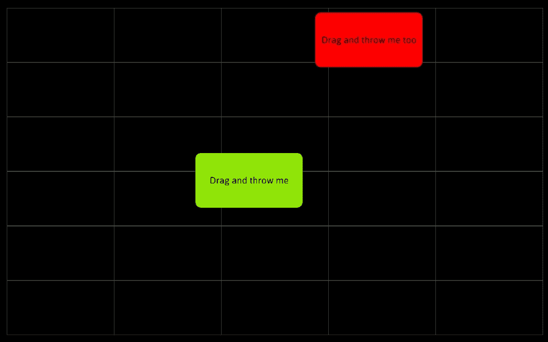
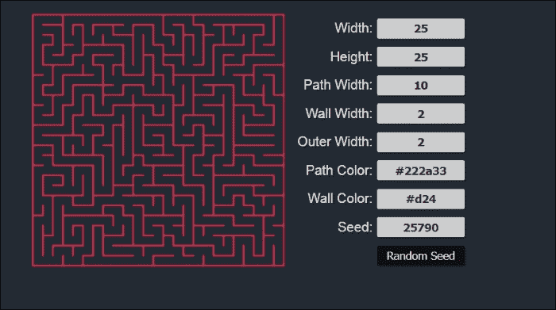
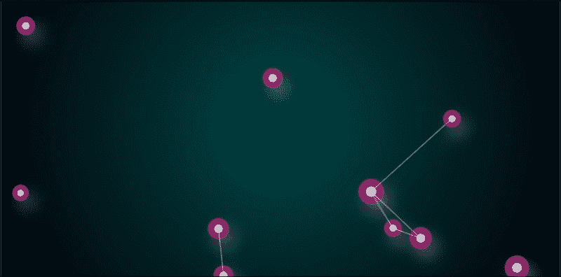
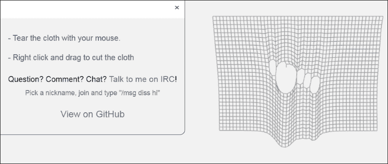
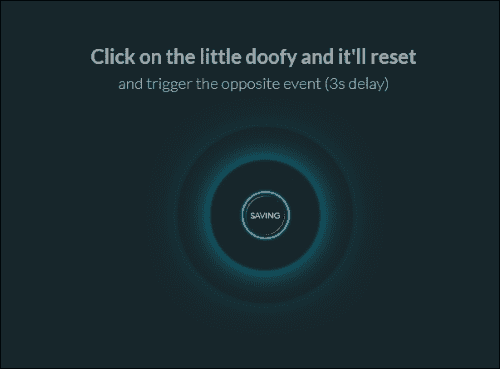
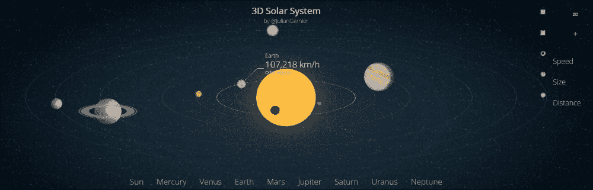

# 第十章。可能性

在整本书中，我们探讨了与 JavaScript 相关的许多主题。你学习了如何与控制台玩耍；用 JavaScript、HTML 标签、CSS 属性和控制语句解决问题；使用 jQuery；在画布上绘制；构建项目等等。然而，你是否曾想过通过阅读本书和学习 JavaScript 而获得的机会？

好吧，在本章中，我们将探讨为什么学习 JavaScript 很重要，以及 JavaScript 的应用领域。

# 将 JavaScript 作为你的第一门编程语言

JavaScript 是最容易开始学习的语言。它不需要任何软件来运行。一个现代浏览器和记事本就足够开始用 JavaScript 编码了。JavaScript 拥有一些最好的在线学习材料。

例如 Codecademy ([`www.codecademy.com`](https://www.codecademy.com))、Code School ([`www.codeschool.com`](https://www.codeschool.com))、CodePen ([`codepen.io`](http://codepen.io))、JS Bin ([`jsbin.com`](https://jsbin.com)) 和 JSFiddle ([`jsfiddle.net`](https://jsfiddle.net)) 等网站将帮助你快速学习 JavaScript。

## JavaScript 到处都是

JavaScript 是几乎在所有浏览器中运行的唯一语言；甚至在智能手机浏览器中也是如此。由于网络无处不在，JavaScript 也无处不在。

## JavaScript 开发者作为职业

如果你喜欢编程并想通过编程建立自己的职业生涯，JavaScript 是最适合这种需求的最佳语言之一。我可以这么说，很难找到比 JavaScript 更好的选择了。如果你看看一些网络开发趋势，你会发现实时网站就像桌面应用程序一样。在网站上进行大量用户交互，如拖放、音频和视频交互以及数据可视化，现在都很常见。所有这些大多都是使用 JavaScript 完成的。没有 JavaScript，我们就无法获得酷炫的网页应用程序（如 Google Map、Google Earth、Gmail、Facebook 等）。JavaScript 使一切成为可能。当你想构建网络应用程序时，没有其他语言比 JavaScript 更强大。现在的世界是基于网络的，而网络正是由 JavaScript 驱动的，以使其变得美丽、动态和安全。因此，选择 JavaScript 与 HTML 和 CSS 作为你的未来职业将是你在生活中做出的最佳决定之一。开发者被称为前端或全栈开发者。

# 所有任务都可以用 JavaScript 完成

使用 JavaScript，你可以做很多很酷的事情。从机器人技术到网络应用程序开发，JavaScript 是一个强大的工具。让我们看看人们如何在他们的技术生活中使用 JavaScript：

+   机器人技术

+   3D 游戏

+   为你的智能手机制作应用程序

+   运行网络服务器

+   运行 Ruby 和 Python

+   编写与操作系统无关的桌面应用程序

+   网络抓取和截图

+   网络分析

+   响应式和交互式内容

+   动画

+   创建 cookie

## 机器人技术

在机器人技术中，你需要用逻辑来控制你的机器人。在现实世界中，逻辑由微控制器处理。你可能听说过**Arduino**，这是一个处理微电子的开源硬件。基本上，Arduino 使用 C 代码来控制微控制器。然而，如果你知道 JavaScript，你也可以为其编写代码；与微处理器/微控制器一起工作并制作你的第一个机器人。你可以从[`nodebots.io/`](http://nodebots.io/)获取帮助，以了解 JavaScript 是如何用于构建机器人的。以下是一张 Arduino UNO 板子的图片：

Arduino UNO

## 三维游戏

我们在这本书中构建和开发了二维游戏。然而，相信我，你也可以用 JavaScript 构建令人惊叹的三维游戏。你甚至可以通过你喜欢的游戏手柄来玩它们。要使用游戏手柄玩游戏，你需要使用游戏手柄 API ([`wiki.mozilla.org/GamepadAPI`](https://wiki.mozilla.org/GamepadAPI))。

你可以在以下 URL 上玩一些用 JavaScript 构建的在线 3D 游戏：[`www.babylonjs.com/`](http://www.babylonjs.com/)。

## 为你的智能手机制作应用

你有没有想过为你的智能手机制作一个应用？你可以用 JavaScript 为你的智能手机制作应用。智能手机有不同的平台（例如，Android、iOS、Tizen、Firefox OS 等）。每个平台都有自己的 API 和不同的编程语言。因此，我们需要考虑我们的代码库可能运行在任何设备上。为了确保这一点，我们可以使用 JavaScript 引擎，因为它可以在任何平台上运行。你可以使用**Cordova** ([`cordova.apache.org/`](http://cordova.apache.org/))来了解如何使用 JavaScript 构建应用。Cordova 是一个基于每个设备 API 的 JavaScript 框架。你可以使用**PhoneGap** ([`phonegap.com/`](http://phonegap.com/))或**Meteor** ([`www.meteor.com/`](https://www.meteor.com/))来用 JavaScript 构建智能手机应用。

## 运行网络服务器

你可能听说过网络服务器。服务器用于广播网站。你可以用 JavaScript 来管理你的服务器。JavaScript 可以处理所有操作并确保你域的安全。你可以使用**Node.js** ([`nodejs.org/`](https://nodejs.org/))来运行最简单的网络服务器。要了解更多关于 JavaScript 网络服务器的信息，你可以看看[`www.firebase.com/`](https://www.firebase.com/)。你可能对 JavaScript 有基本的了解，这是在服务器上执行任务所必需的。使用其他框架构建网络服务器可能会有很高的成本；然而，使用 JavaScript，你可以免费做到这一点，你甚至不需要为此购买任何软件。

## 运行 Ruby 和 Python

JavaScript 还可以用几行外部代码在你的浏览器上运行**Python**或**Ruby**。你可以通过添加库来在你的浏览器上包含这些编程语言的运行环境。要了解更多关于在浏览器上包含库和运行 Ruby 和 Python 代码的信息，你可以查看[`www.firebase.com`](https://www.firebase.com)。

## 编写与操作系统无关的桌面应用程序

由于 JavaScript 是平台无关的，你可以在 JavaScript 的帮助下构建 Web 应用程序，并在任何平台上运行它们。任何平台上的用户都可以在他们的浏览器上运行基于 JavaScript 的应用程序。你甚至可以使用 JavaScript 制作桌面应用程序。查看[`appjs.com/`](http://appjs.com/)和[`electron.atom.io/`](http://electron.atom.io/)来制作你的第一个基于 JavaScript 的桌面应用程序。

## 网络抓取和截图

从网站提取信息的技术称为网络抓取。要了解更多关于网络抓取的信息，你可以访问[`www.webscraper.io/`](http://www.webscraper.io/)。JavaScript 可以帮助你进行网络抓取。你可以查看[`nrabinowitz.github.io/pjscrape/`](http://nrabinowitz.github.io/pjscrape/)来了解更多关于使用 JavaScript 进行网络抓取的信息。

你可以查看[`html2canvas.hertzen.com/`](https://html2canvas.hertzen.com/)来了解更多关于网站截图的信息。截图可以使用 JavaScript 完成。

## 网站分析

有时候，你可能需要知道谁在访问你的网站，你的网站通常被哪个 IP 地址访问，访问者属于哪个国家，以及更多关于跟踪访问者的信息。所有这些信息都可以使用 JavaScript 获取。

## 响应式和交互式内容

使用 JavaScript，你可以在你的网站和 Web 应用程序上创建响应式和交互式内容。你可以查看[`beta.rallyinteractive.com/`](http://beta.rallyinteractive.com/)、[`www.unfold.no/`](http://www.unfold.no/)、[`www.2advanced.com/`](http://www.2advanced.com/)和[`www.newquest.fr/`](http://www.newquest.fr/)，了解他们如何使用 JavaScript 使他们的网站变得响应式和交互式。

## 动画

JavaScript 的神奇之处在于你可以用它来做动画。有很多酷炫的 JavaScript 动画库。查看[`greensock.com/gsap`](http://greensock.com/gsap)来了解更多关于著名的 JavaScript 动画库**GreenSock**的信息。还有一个著名的 JavaScript 动画库叫做**Velocity.js**([`julian.com/research/velocity/`](http://julian.com/research/velocity/))。

## 创建 cookies

你可能听说过网络饼干。考虑一下，你在网站上输入用户名和密码，突然弹出一个提示，告诉你可以保存用户名和信息。你点击**记住密码**，然后信息就被存储在电脑上作为饼干。你的网络饼干是通过 JavaScript 创建的。网络饼干对于网站快速加载很重要。你可以从 [`www.allaboutcookies.org/cookies/`](http://www.allaboutcookies.org/cookies/) 了解更多关于网络饼干的信息。

# 出色的 JavaScript 示例

有一些网站可以可视化用户最新的 JavaScript 作品。其中之一是 [`creativejs.com/`](http://creativejs.com/)。你还可以在那里找到一些教程。"CreativeJS.com" 是寻找令人兴奋的 JavaScript 演示、项目、游戏以及其他他们认为很棒的东西的必去之地。他们有一个专门的团队为你带来最好的内容。以下截图是 "CreativeJS.com" 的主页：

这里有一些带有链接的 JavaScript 项目示例：

+   **出色的计算器**：以下计算器是用 JavaScript、HTML 和 CSS 构建的。按钮发光的动画是通过 JavaScript 实现的：

    这个计算器可以在 [`codepen.io/giana/pen/GJMBEv`](http://codepen.io/giana/pen/GJMBEv) 找到。

+   **拖放**：你可以用鼠标拖动一个方块并将其拖放到另一个方块上。拖动操作是通过 JavaScript 实现的。以下是这个项目的截图：

    这个项目可以在 [`greensock.com/draggable`](http://greensock.com/draggable) 找到。

+   **随机迷宫生成器**：你构建了一个名为 Rat-man 的游戏，其中你需要为猫和老鼠绘制地图，路径就像迷宫一样。以下链接将为你生成一个随机迷宫。我希望你注意他们那里使用的 JavaScript：

    这个游戏可以在 [`codepen.io/GabbeV/pen/viAec`](http://codepen.io/GabbeV/pen/viAec) 找到。

+   **粒子连接**：你可以在 [`codepen.io/garyconstable/pen/fEoLz`](http://codepen.io/garyconstable/pen/fEoLz) 玩连接粒子的游戏。这些粒子的运动是通过 JavaScript 控制的。以下是这个项目的截图：

+   **可撕布料**：如果你想制作布料的模拟，你可以访问链接 [`codepen.io/dissimulate/pen/KrAwx`](http://codepen.io/dissimulate/pen/KrAwx) 并在这里玩布料。布料的运动是通过 JavaScript 控制的。以下是这个项目的截图：

+   **霓虹元素**：你可以在你的网站上使用以下元素作为按钮。我希望你能学会它的代码是如何工作的。以下是这个项目的截图：

    这个项目可以在[`codepen.io/simeydotme/details/Gzfuh`](http://codepen.io/simeydotme/details/Gzfuh)找到。

+   **智能手机子菜单**：如果你在考虑用 JavaScript 制作智能手机应用，你肯定需要一个为应用设置的子菜单。你可以访问[`codepen.io/berdejitendra/pen/AgEzJ`](http://codepen.io/berdejitendra/pen/AgEzJ)学习如何为你的移动应用制作一个酷炫的子菜单。以下是这个项目的截图：

+   **3D 太阳系**：如果你热爱天文学和行星的运动，链接[`codepen.io/juliangarnier/pen/idhuG`](http://codepen.io/juliangarnier/pen/idhuG)将带给你邻近行星及其信息的令人惊叹的视觉展示。所有动态元素都是使用 JavaScript 创建的。以下是这个项目的截图：

# 摘要

我们已经到达了这本书的结尾。这本书并不是关于 JavaScript 的全部内容，而是 JavaScript 的起点。我希望你喜欢这本书，并且练习了书中讨论的所有练习和项目。我希望你会访问本章中的网站，并观察每个项目的代码，以便更多地了解 JavaScript。我希望有一天你能借助 JavaScript 创建自己的动态网站，用 JavaScript 构建智能手机应用，甚至可能用 JavaScript 构建一个机器人。你永远不知道！

我希望你已经学会了用 JavaScript 探索的许多令人惊叹的事物；现在是你用代码实验和玩转 JavaScript 的时候了。如果出了任何问题，不要担心。记住：

|   | *"第一次做对并不重要。最后一次做对至关重要。"* |   |
| --- | --- | --- |
|   | --*安德鲁·亨特和戴维·托马斯* |
