# 第四章：4. JavaScript 库和框架

概述

到本章结束时，你将能够使用 JavaScript 框架和库执行不同的任务；使用 jQuery 演示事件处理；使用流行的 JavaScript 框架；列出使用框架的注意事项和禁忌；并构建一个库

在本章中，你将学习如何以及何时将你的源代码与外部软件结合。

# 简介

在前面的章节中，你学习了如何利用条件逻辑、循环和最常见的数据结构。这些构成了编写程序和构建复杂 JavaScript 应用程序的基础和要素。然而，构建实际的软件是一个固有的挑战性任务；仅仅关注业务逻辑更是如此。因此，作为开发者，我们经常依赖外部软件，使我们能够专注于与我们产品或业务最相关的源代码。这些软件通过简化特定任务和为我们抽象复杂性来实现这一点。这些外部软件组件就是我们所说的**框架**或**库**。

以下是一些现代 JavaScript 框架可以为我们提供的任务：

+   复杂或动态单页应用程序（SPA）的性能渲染

+   管理客户端应用程序控制器和视图之间的持续数据流

+   创建复杂的动画

+   使用快速直观的服务器 API 进行创建

在我们深入探讨使用外部代码的原因和目的之前，我们需要明确“框架”和“库”这两个术语之间的区别。这将是下一节的主题。

# 框架与库的比较

库描述了一个执行特定任务的函数的外部集合。这些函数通过 API 使我们这些库的用户能够访问。一个有用的库是`lodash`，例如，它可以从数组中移除所有重复的值：

```js
const duplicatedArray = [1,2,1,2,3];
const uniqueArray = lodash.uniq(duplicatedArray)
// => [1,2,3]
```

相反，框架是库的一种特定形式。它们是可重用的代码框架，为 JavaScript 应用程序构建基础。与扩展你代码的功能的库不同，框架可以独立存在，并通过你的源代码增强来创建你喜欢的应用程序。

一个流行的框架是`Vue.js`，我们可以如下使用它：

```js
library-vue.js
1 // example.html
2 <div id="example">
3 <input :value="text" @input="update"/>
4 <div v-html="myOwnText"></div>
5 </div>
6 //————————————————————————————————
7 // example.js
8 new Vue({
9 el: '#example',
10 data: {
11 text: 'My first framework'
12 },
13  computed: {
14 myOwnText: function () {
15 return this.text
16 }
The full code is available at: https://packt.live/32MD4IN
```

如你所见，一般来说，框架比库更复杂。尽管如此，两者对软件开发同等重要。

尽管库和框架之间存在技术差异，我们将会将这些术语互换使用。在 JavaScript 世界中，描述外部源代码的另一个同义词是“包”。在 JS 资源中，你可能遇到的一个这样的包是`Vanilla.js`。我们将在下一节中对其进行探讨。

## Vanilla.js

这个特定的框架遵循非正式惯例，在名称中包含 JavaScript 文件扩展名`nameOfFramework.js`。然而，vanilla.js 不是一个框架；它甚至不是一个库。提到`vanilla.js`的人正在谈论没有外部代码或工具的纯 JavaScript。这个名字在 JavaScript 社区中是一个流行的笑话，因为一些开发者和非开发者认为我们为构建的每一件事都需要使用框架。我们将在稍后讨论这不是原因。

# 流行 JavaScript 框架

我们刚刚了解了 lodash.js，这是一个帮助开发者处理数据结构的库；（例如，用于创建唯一的数组）以及 Vue.js，这是一个用于构建模块化和动态用户界面的框架。这些只是两个非常流行且广泛使用的 JS 框架/库的例子。除了这些，还有大量不断增长的第三方包可供选择。每个包都有助于解决一组特定的专业问题。

一些现代且常用的替代方案，支持创建浏览器应用程序，例如 React.js、Vue.js 和 Angular.js。其他帮助你在应用程序中存储和管理数据的库包括 MobX、VueX 和 Redux。

再次强调，其他人可以将源代码转换，使其支持旧版浏览器引擎，例如**Babel**，或者为你处理和操作时间，例如 moment.js。

然后，还有像 Express.js 或 Hapi 这样的框架，让你能够为 Node.js 创建简单、易于维护和性能良好的 REST API。

一些包使构建**命令行界面**（**CLIs**）或桌面应用程序变得容易。

大多数 JavaScript 生态系统的构建和生产工具都作为库提供给社区。Webpack、Parcel 和 Gulp 就是这些工具中的几个。

可用的库并不都是同样流行或有用。它们的流行程度取决于几个关键事实：

+   是否解决了许多开发者烦恼的问题

+   它们的 API 定义和结构有多好

+   他们的文档质量

+   性能优化的水平

当你创建一个希望广为人知的包时，请记住这些。

## 永恒的 jQuery

一个已经存在超过十年的常青库是 jQuery。它几乎以某种方式触及了每个 Web 应用程序，并且属于每个构建浏览器应用程序的人的工具箱：

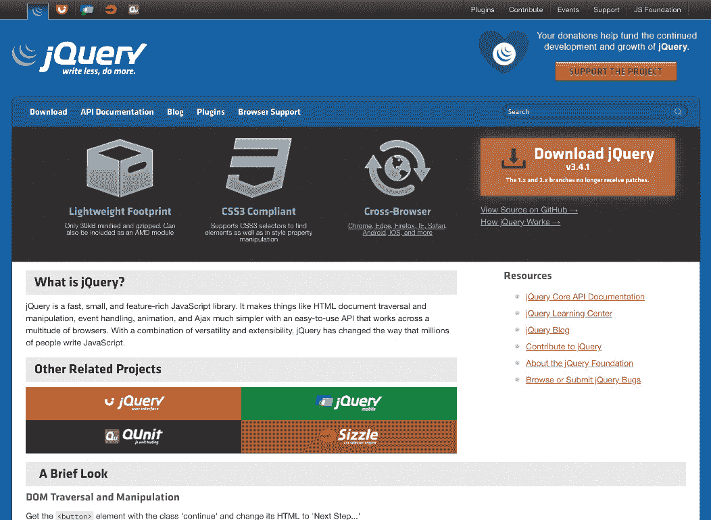

](img/C14377_04_01.jpg)

图 4.1：jQuery 文档

**jQuery**不是第一个，但无疑是世界上第一个被开发者用来简化工作的 JavaScript 库之一。自从它首次发布以来，许多维护者和工程师都为使 jQuery 成为今天的样子做出了贡献——即现代互联网的一个强大和基本组成部分，提供了许多不同的功能。

jQuery 提供，但不仅限于提供以下功能：

+   DOM 操作

+   事件处理

+   动画效果和过渡

当我们在本章后面更详细地查看 jQuery 时，我们将看到如何做这些事情。

## 哪里可以找到外部代码以及如何使用

在将库包含到您的程序中时，有几种不同的方法。根据这些方法，我们从不同的地方获取包。

一种方法是复制库的源代码，并按我们的意愿处理它。从安全性的角度来看，这种方法是最安全的，因为我们完全控制软件，可以将其定制以适应我们的需求。然而，这样做，我们就放弃了兼容性和自动更新和补丁。大多数开源项目将它们的代码托管在 GitHub 或其他版本控制平台上。因此，访问和分叉包代码相当容易。一旦我们下载了源代码，我们就可以做任何我们想做的事情，使其与我们的软件一起工作。可能的解决方案包括将其托管在我们的**云分发网络**（**CDN**）上，并从那里访问它，或者将其与我们的源代码捆绑在一起。

另一种方法是在运行时从客户端下载 CDN 上的包。专门托管 JavaScript 库的最受欢迎的 CDN 是[courseds.com](http://cdnjs.com)。它托管了数千个库，您可以在标记中包含它们，而无需担心存储位置或如何升级：

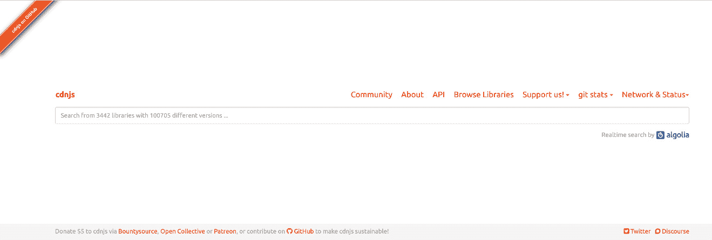

图 4.2：从 cdnjs.com 下载包

以下是如何在您的标记中包含 Vue.js 的示例：

```js
// myApplicationMarkup.html
<html>
<script src="img/vue.js"></script>
<script type="text/javascript">
console.log("Vue was loaded: ", !!Vue)
// => Vue was loaded: true
</script>
</html>
```

注意

如果您在运行时从浏览器中加载包来包含它们，您必须注意脚本标签的顺序。它们是从上到下加载的。因此，如果您在先前的示例中交换了两个脚本标签，console.log 将打印出没有加载`Vue.js`，尽管最终它会加载。

之前的方法获得了巨大的流行度，并且由于近年来 JavaScript 生态系统的开发，现在已经成为最常见的方法。它涉及到**Node.js 包管理器**（**npm**）。npm 是一个工具，正如其名称所暗示的，负责 Node.js 生态系统中的 JavaScript 包。npm 本身由三个部分组成：

+   [npmjs.com](http://lodash.com)网站，用于托管所有文档和包搜索

+   与`Node.js`一起安装的 CLI

+   存储并使所有模块可安装的注册表：

+   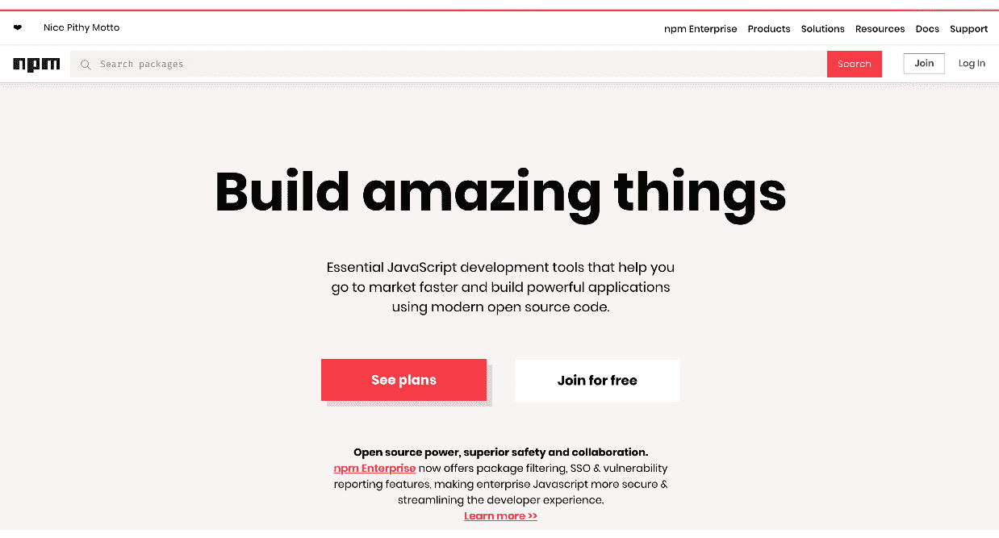

图 4.3：NPM 网站

使用 npm 需要在您的机器上安装一个`Node.js`版本，以及任何工具来打包您所有的 JavaScript 代码，使其在浏览器中可执行。

然后，您只需安装您在 npm 上找到的任何模块：

```js
// in your terminal
$ npm install <package>
```

此命令将包存储在特定文件夹中，称为**node_modules**。此文件夹包含您安装的所有库的源代码，在构建时间，打包器将它们与您的应用程序连接起来。

所述的所有方法都是有效的，并且各有其首选的使用场景。然而，你很可能在 `Node.js` 生态系统中设置新项目时最常使用后者，因为模块和 npm 就是从那里自然产生的。尽管如此，了解如何在没有 npm 的情况下使用外部资源仍然很有用，当你想要比整个项目设置更舒适、更快捷时。因此，让我们进行一个练习，我们将把第三方库加载到我们的代码中。

## 练习 4.01：在您的代码中使用第三方库

如我们所发现的，使用外部软件，即库和框架，是一项极其有用的技能，因为它可以节省大量资源并帮助您构建高度功能的应用程序。在这个练习中，我们将自己查找并使用一个库。我们将使用 `lodash` 库来创建一个包含唯一值的数组。让我们开始吧：

1.  创建一个新的 HTML 文件：

    ```js
    <html>
    <head></head>
    </html>
    ```

1.  查找最新版本的 `lodash` 的 CDN URL。为此，请导航到 `cdnjs.com` 并搜索 lodash，然后复制图中突出显示的 URL：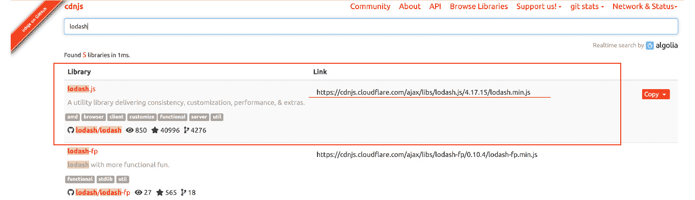

    图 4.4：cdnjs.com 上的 lodash 搜索结果

1.  要查看 `lodash` 文档，请导航到 [lodash.com](http://lodash.com)。在那里，你可以使用搜索栏来查找 "`uniq`" 函数：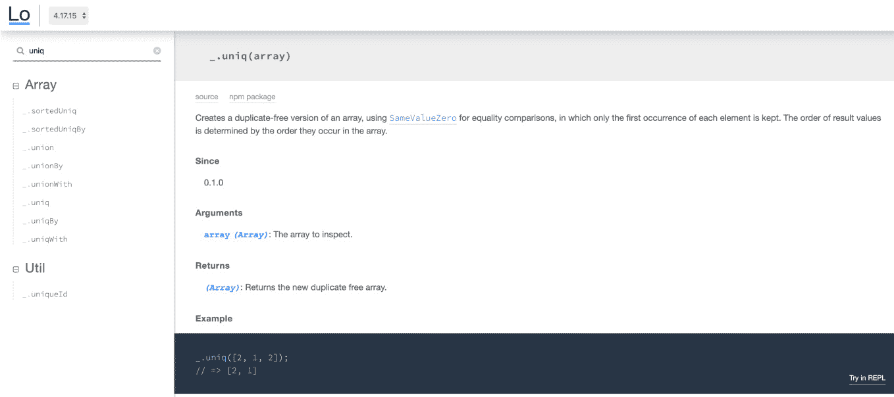

    图 4.5：lodash.com 的 uniq 函数文档

1.  在脚本标签的 `src` 属性中加载 CDN URL。为此，粘贴你在 *步骤 2* 中复制的 URL：

    ```js
    <html>
      <head>
        <script src="img/lodash.min.    js"></script>
      </head>
    </html>
    ```

1.  创建另一个 `script` 标签，并使用 *lodash* 编写 JS 代码来创建一个包含 `unique` 值的数组 `[1,5,5,2,6,7,2,1]`：

    ```js
    <html>
      <head>
        <script src="img/lodash.min.    js"></script><script type=„text/javascript">
          // create an array with duplicated values
          const exampleArray = [1,5,5,2,6,7,2,1];
          // use lodash.uniq to make the array contain unique values
          const uniqueArray = _.uniq(exampleArray);
          // print the unique array to the console
          console.log(uniqueArray);
          // => [1,5,2,6,7]
        </script>
      </head>
    </html>
    ```

1.  在浏览器中打开你的 HTML，包括 JavaScript，并验证你是否在浏览器开发工具控制台中创建了一个包含唯一值的数组：

1.  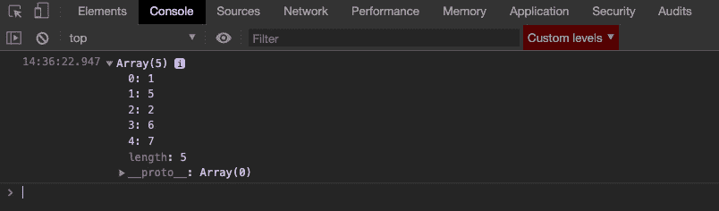

图 4.6：浏览器开发工具控制台中的唯一数组值

在这个练习中，我们使用了 *lodash* 库来创建一个包含唯一值的数组。

## jQuery 与 Vanilla.js

在本章的 *永恒的 jQuery* 部分中，我们之前查看过 jQuery 以及它在 JavaScript 社区中的卓越地位。为了展示为什么库和框架，尤其是 jQuery，变得流行，我们将将其与 `Vanilla.js`（纯 JS）进行比较。

### 操作 DOM

如果我们想在纯 JavaScript 中淡出并删除一个元素，我们将编写冗长且不够全面的代码：

```js
// Vanilla.js
const styles = document.querySelector('#example').style;
styles.opacity = 1;(function fade() {
styles.opacity -= .1;
styles.opacity< 0
? styles.display = "none"
: setTimeout(fade, 40)
})();
```

另一方面，使用 jQuery，我们可以在一行可理解的代码中完成所有这些操作：

```js
// jQuery
$('#example').fadeOut();
```

# 发送 XHR 请求

现代网页和应用程序的一个基本功能是从远程服务器请求额外的资源或数据。每个浏览器都提供了执行这些所谓的 XHR 请求的接口。这些接口可以从 JavaScript 中使用。正如我们可以在以下代码示例中看到，与 vanilla.js 相比，jQuery 让我们能够编写干净且易于理解的代码：

```js
// Vanilla.js
const request = new XMLHttpRequest();
request.open("POST", "/example/api", true);
request.onreadystatechange = function() {
if (request.readyState != 4 || request.status != 200) return;
console.log("Successful XHR!");
};
request.send("example=payload");
```

与前面的代码片段相比，在 jQuery 中调用服务器的代码更加清晰易读。它更易读，因为它非常清晰易懂，关于函数需要什么参数以及它将要做什么非常明确。让我们看看一个向`/example/api` URL 发送的`POST` Ajax 请求，带有指定的有效负载数据和当请求成功时被触发的函数：

```js
// jQuery
$.ajax({
type: "POST",
url: "/example/api",
data: "example=payload",
success: function() {
console.log("Successful XHR!");
}
});
```

注意

jQuery 将自己分配给`$`变量。因此，在代码示例中，`$.functionName`可以替换为`jquery.functionName`。

我们可以继续展示更多 jQuery 比原生 JS 更快达到目标的使用场景。相反，在接下来的练习中，我们将使用这个库，并从中获得一些第一手经验。具体来说，我们将编写代码来处理按钮点击事件，一次使用 jQuery，一次使用纯 JavaScript。

注意

所有现代主流浏览器中的开发者工具都已适应了`$`符号，但仅作为`document.querySelector`的包装器。

## 练习 4.02：使用 jQuery 处理点击事件

在这个练习中，我们将了解 jQuery 如何帮助我们响应当目标（在我们的例子中，是一个按钮）被点击时传播的事件。让我们开始吧：

1.  创建一个新的 HTML 文件，包括一个具有 ID `exampleButton`的按钮标签。这个按钮将是我们的目标：

    ```js
    <html>
      <body>
        <button id="exampleButton">Click me.</button>
      </body>
    </html>
    ```

1.  在[cdnjs.com](http://cdnjs.com)上找到最新的 jQuery CDN URL。

1.  阅读 jQuery 文档中的.`on()`函数([`api.jquery.com/on/`](https://api.jquery.com/on/))![图 4.7：JQuery.com 上的.on()函数文档]

    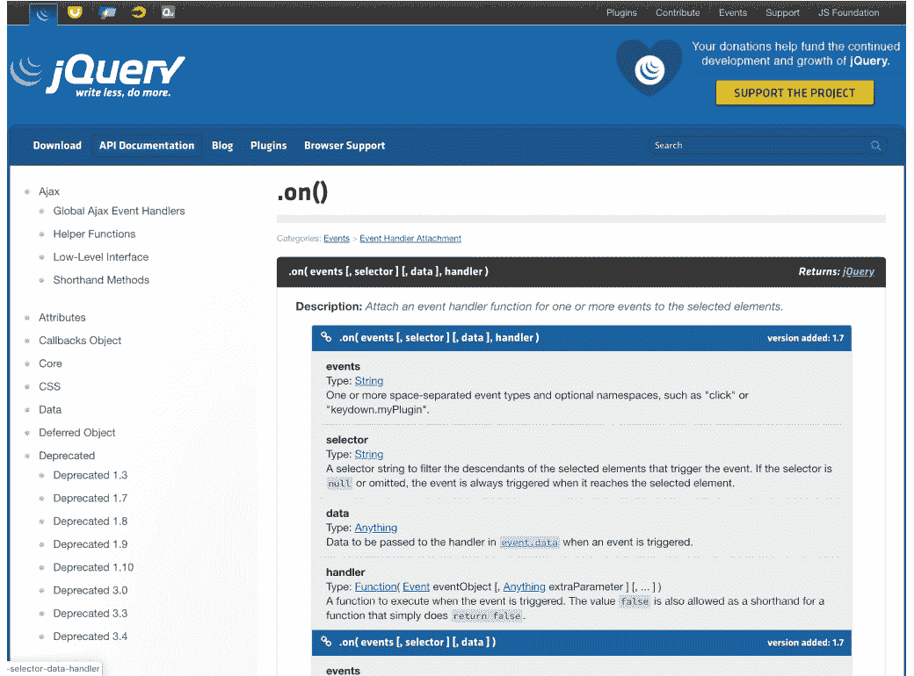

    图 4.7：JQuery.com 上的.on()函数文档

1.  加载 CDN URL：

    ```js
    <html>
      <head>
        <script src="img/jquery.min.    js"></script>
      </head>
      <body>
        <button id="exampleButton">Click me.</button>
      </body>
    </html>
    ```

1.  创建一个包含代码的脚本标签，当点击按钮时，将`Hello World`消息记录到控制台：

    ```js
    <html>
      <head>
        <script src="img/jquery.min.    js"></script>
      </head>
      <body>
        <button id="exampleButton">Click me.</button>
        <script type="text/javascript">
          $('#exampleButton').on('click', function() {
            console.log('Hello World')
          })
        </script>
      </body>
    </html>
    ```

1.  确保将`script`标签放置在按钮标签之后。

1.  在你的浏览器中打开 HTML 文件，并打开开发者工具控制台。

1.  点击`点击我`按钮，并验证它是否将`Hello World`打印到控制台：![图 4.8：使用 jQuery 点击事件输出 Hello World]

    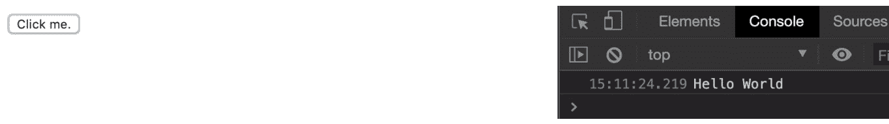

图 4.8：使用 jQuery 点击事件输出 Hello World

在这个练习中，你使用 jQuery 处理了一个由浏览器在按钮点击时触发的事件。你实现的处理程序会在按下`点击我`按钮后立即将`Hello World`打印到浏览器的控制台。

你也看到了如何轻松地使用像 jQuery 这样的库来完成那些否则需要手动完成的工作。

然而，在 vanilla.js 中处理点击事件也不是特别困难，你将在下一个练习中看到。

## 练习 4.03：使用 Vanilla.js 处理相同的事件

与前一个练习相比，这个练习演示了如何使用纯 JavaScript 创建一个在点击事件上被触发的处理程序。让我们开始吧：

1.  创建一个新的 HTML 文件，其中包含一个 ID 为`exampleButton`的按钮标签：

    ```js
    <html>
      <body>
        <button id="exampleButton">Click me.</button>
        </body>
    </html>
    ```

1.  创建一个包含 vanilla.js 代码的脚本标签，当点击按钮时，将`Hello World`消息记录到开发者工具控制台。`addEventListener`是浏览器为我们提供的原生 API。它接受`eventType`和`handlerFunction`作为参数：

    ```js
    <html>
      <body>
        <button id="exampleButton">Click me.</button>
        <script type="text/javascript">
          const button = document.querySelector('#exampleButton')
          button.addEventListener('click', function() {
            console.log('Hello World')
          })
        </script>
      </body>
    </html>
    ```

    再次确保将`script`标签放在按钮标签之后。

1.  在你的浏览器中打开 HTML 文件，并打开开发者工具控制台。点击“Click me.”按钮，并验证它是否将“Hello World”打印到控制台：![图 4.9：使用 Vanilla.js 的“Hello World”输出

    ![img/C14377_04_09.jpg]

图 4.9：使用 Vanilla.js 的“Hello World”输出

在前两个练习中，我们向一个按钮添加了事件监听器。我们使用 jQuery 做了一次，其他时候没有使用外部代码，而是使用了浏览器为我们提供的原生 API。

## 使用 jQuery 进行 UI 动画

除了我们在“操作 DOM 和发送 XHR 请求”部分的代码示例中看到的 jQuery 用法，以及在*练习 4.02：使用 jQuery 处理点击事件*中，还有一个重要的功能是`jQuery`为我们提供的：用户界面（UI）动画。

动画有助于使网站更具吸引力，并且可能意味着用户在使用你的应用程序时享受的体验更佳。通常，对用户输入的反应会被动画化，以突出显示交互已被认可或发生了变化。例如，出现的元素可以动画化，或者输入字段内的占位符可以动画化。继续以下练习，自己实现前面的 UI 动画示例。

## 练习 4.04：在按钮点击时动画化“Peek-a-boo”

在这个练习中，你将基于你使用 jQuery 处理事件的知识来构建。然而，相关部分将是动画化页面上的一个元素。

每当点击“Peek…`”按钮时，`…a-boo`标题就会显示出来。让我们开始吧：

1.  创建一个新的 HTML 文件，其中包含一个 ID 为`Peek...`的按钮标签、一个 ID 为`…a-boo`的标题，以及`display: none`样式属性：

    ```js
    <html>
      <head></head>
      <body>
        <button id="peek">Peek...</button>
        <h1 id="aboo" style="display: none;">...a-boo</h1>
      </body>
    </html>
    ```

1.  在脚本标签内加载最新的`jQuery` CDN URL，从`cdnjs.com`（见*练习 2，使用 jQuery 处理点击事件，步骤 2*）：

    ```js
    <html>
    <html>
      <head>
        <script src="https://cdnjs.cloudflare.com/ajax/libs/jquery/3.4.1/jquer
        y.min.js"></script>
      </head>
      <body>
        <button id="peek">Peek...</button>
        <h1 id="aboo" style="display: none;">...a-boo</h1>
      </body>
    </html><head>
        <script src="https://cdnjs.cloudflare.com/ajax/libs/jquery/3.4.1/jquer
        y.min.js"></script>
      </head>
      <body>
        <button id="peek">Peek...</button>
        <h1 id="aboo" style="display: none;">...a-boo</h1>
      </body>
    </html>
    ```

1.  创建一个包含选择 peek 按钮并添加`onClick`事件监听器代码的脚本标签：

    ```js
    <html>
      <head>
        <script src="img/jquery.min.    js"></script>
      </head>
      <body>
        <button id="peek">Peek...</button>
        <h1 id="aboo" style="display: none;">...a-boo</h1>
        <script type="text/javascript">
          const peekButton = $(‚#peek');
          peekButton.on('click', function() {});
        </script>
      </body>
    </html>
    ```

1.  在新的脚本标签内，编写额外的代码来选择`aboo`标题，并使用`jQuery.fadeToggle`函数来动画化标题，使其淡入淡出：

    ```js
    <html>
      <head>
        <script src="img/jquery.min.    js"></script>
      </head>
      <body>
        <button id="peek">Peek...</button>
        <h1 id="aboo" style="display: none;">...a-boo</h1>
        <script type="text/javascript">
          const peekButton = $('#peek');
          const abooHeadline = $('#aboo');
          peekButton.on('click', function() {
            abooHeadline.fadeToggle();
          });
        </script>
      </body>
    </html>
    ```

1.  在你的浏览器中打开 HTML 页面，并点击`peek`按钮。

1.  当你点击`peek`按钮时，你应该看到`aboo`标题淡入和淡出：

图 4.10：使用 Click 按钮的动画输出

在这个练习中，你使用了`jQuery`在浏览器中执行另一种类型的任务。UI 中的动画可以像我们的淡入淡出示例一样简单，但在构建游戏或创建 3D 动画时，它们也可以非常复杂。

到现在为止，你已经对 jQuery 以及其他库或框架能帮助你做什么有了概念。在下一节中，我们将探讨为什么以及何时放弃外部源代码可能更明智。

# 框架与核心 JavaScript

到目前为止，我们已经讨论了很多关于为什么、如何以及在什么情况下使用库的原因。但我们还没有讨论何时以及为什么不依赖它们可能是一个更好的主意。

首先，框架和库所能做的所有事情我们自己都可以做到。在商业环境中，或者为了提高开发速度，我们通常在面临“自制或购买”决策时选择购买。但有时，我们应该记住，将外部源代码添加到我们的程序中，甚至基于这些源代码构建，会增加我们拥有的源代码量。对于构建面向客户端的应用程序的 JavaScript 开发者来说，增加所需资源的整体大小尤其令人不快，因为我们应该优化性能（应用程序在客户端加载的速度）。一般来说，更多的 JavaScript 代码会导致以下情况：

+   更长的下载时间

+   更长的解析时间

+   更晚的执行延迟

+   可能阻止应用程序的渲染或可用性

尽管我们有复杂的优化算法，如摇树或死代码消除，这些算法有助于我们应对这些情况下的巨大包大小，但通常，最好的选择是亲自完成手头的任务。

另一个需要考虑的方面是我们应用程序的安全性。一些库或框架可能会打开我们无法控制的攻击向量，因为我们没有完全拥有或理解涉及的代码。然而，最受欢迎的库非常关注它们包的安全性，并且对于已知漏洞的补丁发布也非常迅速。

为了提供一个实际案例，说明库或框架可能对我们应用程序产生的负面影响，在接下来的两个练习中，我们将创建一个列表并将其渲染到屏幕上。第一个将使用外部库，而第二个将使用原生 JavaScript 编写。

## 练习 4.05：使用 React 渲染待办事项列表

在这个练习中，我们将显示一些列表标签作为假想`todo`列表的列表项。为此，我们将使用一个非常流行的库`react.js`及其互补的`react-dom.js`。让我们开始吧：

1.  在 HTML body 内部创建一个带有 head 和具有`root` ID 的 div 标签的新空 HTML 文件：

    ```js
    <html>
      <head></head>
      <body>
        <div id="root"></div>
      </body>
    </html>
    ```

1.  前往 `cdnjs.com` 获取最新的 `react.js` 和 `react-dom.js` CDN 网址，并将这些网址加载到 HTML 头部内的脚本标签中：

    ```js
    <script src="img/react.production.min.js" charset="utf-8"></script>
    <script src="img/react-dom.production.min.js" charset="utf-8"></script>
    ```

1.  使用 `react.js` 和 `react-dom` 创建三个列表项并将它们渲染到 `root` `div` 元素中：

    ```js
      <script type="text/javascript">
        const todoListItems = [
          'buy flowers',
          'tidy up',
          'go to the gym'
        ];
        const todoListElements = todoListItems.map(item =>
          React.createElement('li', null, item)
        );
        ReactDOM.render(todoListElements, document.getElementById('root'));
      </script>
    ```

1.  打开浏览器中的 HTML 页面，确保你的 `todo` 列表项正确显示。

1.  打开浏览器开发者工具的网络标签页，查看加载了多少千字节的 JavaScript：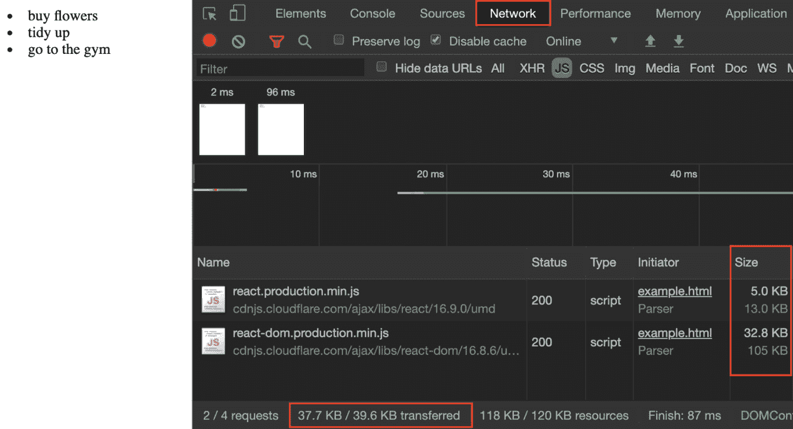

图 4.11：加载到网络标签页中的 JavaScript 的大小

在这个练习中，你学习了在哪里找到以及如何使用 React.js。尽管在这个练习中你只是创建了一个小型的静态待办事项列表，`React.js` 允许你创建复杂、动态的用户界面，而无需担心通常需要创建此类用户界面的原生浏览器 API。然而，正如我们之前提到的，使用框架也有代价，以千字节来衡量。

接下来，你将学习如何在不使用 React 的情况下完成相同的任务。之后，你将能够理解在构建应用程序时千字节与复杂性的权衡。

## 练习 4.06：不使用库渲染待办事项列表

在上一个练习中，我们使用了流行的库 React.js，加载了超过 `37 KB`（ZIP 格式）以及几百字节的 HTML，包括脚本标签，以创建和渲染三个项目的列表。在这个练习中，我们将做同样的事情，但我们将利用浏览器已经提供的所有功能。让我们开始吧：

1.  创建一个新的空 HTML 文件，并在 HTML 体的内部包含一个具有 `root` ID 的 div 标签：

    ```js
    <html>
      <body>
        <div id="root"></div>
      </body>
    </html>
    ```

1.  创建一个脚本标签，并编写一些 JS 代码来创建三个列表项并将它们渲染到 `root` div 元素中：

    ```js
    index.html
    4 <script type="text/javascript">
    5  const todoListItems = [
    6    'buy flowers',
    7    'tidy up',
    8    'go to the gym'
    9   ];
    10  const rootElement = document.getElementById('root');
    11  const listFragment = document.createDocumentFragment();
    12  todoListItems.forEach(item => {
    13   const currentItemElement = document.createElement('li');
    14   currentItemElement.innerText = item;
    15   listFragment.appendChild(currentItemElement)
    16   });
    The full code is available at: https://packt.live/2QYfUxb
    ```

1.  打开浏览器中的 HTML 页面，确保你的 `todoListItems` 正确显示。

1.  打开浏览器开发者工具的网络标签页，查看加载了多少千字节的 JavaScript：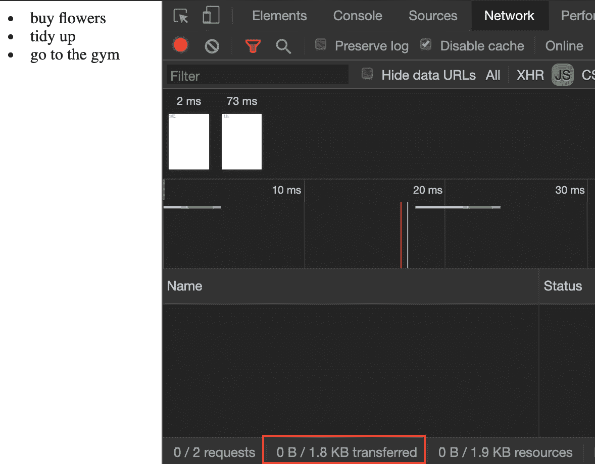

图 4.12：不使用库加载 JavaScript 的下载大小

完全没有，也就是说，0 KB 的额外 JavaScript。这使我们比使用 `react.js` 的方法在下载、解析和执行方面有 37 KB 的优势，同时实现了相同的功能。

当然，这是一个简化的例子。一般来说，现实世界中的应用程序比我们的练习更复杂。尽管如此，你可能会发现自己经常处于类似的情况，其中性能是一个需要考虑的因素，并且可以使用 `vanilla.js` 合理地完成这项任务。

我们已经详细讨论了库和框架是什么以及它们可以帮助我们做什么。为了真正理解库可能看起来是什么样的以及构建一个库实际上有多容易，我们将在接下来的练习中自己创建一个。

## 练习 4.07：自己创建一个库

我们库最初可能功能有限，但你可以投入一些精力，并根据需要扩展它。

`HeadlineCreator.js` 是我们库的名称。这是一个好名字，因为它已经暗示了它所做的事情；即创建标题。从技术角度讲，我们的库将执行以下操作：

+   在当前浏览器标签的全局窗口对象上可访问，就像我们之前使用 jQuery 时看到的那样：`window.headlineCreator`。

+   提供一个名为 `createHeadline` 的单一方法。

+   允许我们（通过 `createHeadline` 方法）使用给定的文本创建一个标题，并将其附加到给定的父元素。

+   为我们处理错误处理，例如，如果我们忘记定义要显示的文本或为父元素传递了无效的选择器

+   为了验证我们的库是否正常工作，并展示其用法的一个示例，我们将创建一个 HTML 页面，包括使用我们的 HeadlineCreator.js 库的 script 标签，除了创建库本身之外。

    让我们开始吧：

1.  创建一个空的 HTML 文件，包含一个 head 标签、一个 body 标签，以及一个 ID 为 `root` 的 div 标签：

    ```js
    <html>
      <head></head>
      <body>
        <div id="root"></div>
      </body>
    </html>
    ```

1.  在 `script` 标签内加载一个名为 `headlineCreator.js` 的本地 JS 文件：

    ```js
    <html>
      <head>
        <script src="img/headlineCreator.js"></script>
      </head>
      <body>
        <div id="root"></div>
      </body>
    </html>
    ```

1.  在同一目录中创建 `headlineCreator.js` 文件，该目录中创建了空的 HTML 文件。

1.  在 JavaScript 文件内部，创建一个 IIFE 并将其分配给 `headlineCreator` 变量：

    ```js
    // headlineCreator.js
    const headlineCreator = (function(){})();
    ```

    注意

    IIFE 代表“立即执行函数表达式”。这个名字听起来比实际要复杂。IIFE 是在定义的同时立即执行的功能。在框架或库中，它们的用例之一是防止与源代码中使用的变量发生名称冲突。这包括库。例如，在库中使用创建函数可能会导致奇怪的副作用，因为这是一个非常常见且模糊的名字。因此，库可能是一个与预期不同的不同函数。

1.  在立即执行函数表达式（IIFE）内部，创建另一个函数并将其命名为 `createHeadline`。这个函数接受两个参数，`text` 和 `parentElementSelector`：

    ```js
    // headlineCreator.js
    const headlineCreator = (() => {
     function createHeadline(text, parentElementSelector = '#root') {}
    })();
    ```

1.  在 IIFE `headlineCreator` 内部添加一个 `return` 语句。这个 `return` 语句将返回一个对象，该对象有一个名为 `createHeadline` 的唯一键，其值与函数名相同（就像我们在上一步中创建的函数名一样）：

    ```js
    {}return {
    createHeadline: createHeadline
      };;
    ```

1.  使用 DOM 查询扩展新函数，以查找作为 `createHeadline` 函数参数传递的 `parentElementSelector` 指定的元素。

1.  将 DOM 查询的结果分配给一个名为 `parentElement` 的变量：

    ```js
    {{const parentElement = document.querySelector(parentElementSelector);{e;;
    ```

1.  接下来，创建一个 `h1` 标签元素，并将此元素的 `innerText` 属性设置为传递给函数的 `text` 参数：

    ```js
    {{; const headlineToInsert = document.createElement('h1');
    headlineToInsert.innerText = text;}{e;;
    ```

1.  最后，将创建的标题附加到我们存储在 `parentElement` 中的节点：

    ```js
    {{;;;parentElement.appendChild(headlineToInsert);}{e;;
    ```

1.  刷新你的 HTML 页面，并在开发者工具的控制台中调用`window.headlineCreator.createHeadline`函数，使用你想要的任何参数。然后，查看结果：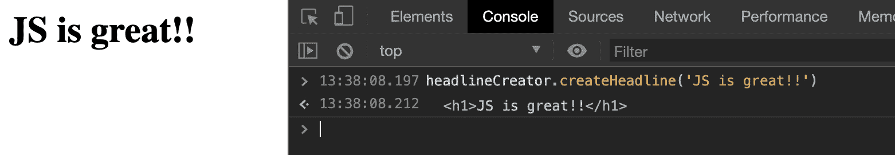

    图 4.13：控制台中的 window.headlineCreator.createHeadline 函数及其输出

1.  如果你愿意，你可以添加一些错误处理并返回新创建的标题元素，因为在这种情况下这被认为是良好的实践：

    ```js
    headlineCreator.js
    1 // headlineCreator.js
    2 window.headlineCreator = (function() {
    3   function createHeadline(text, parentElementSelector = '#root') {
    4     const parentElement = 5 document.querySelector(parentElementSelector);
    5    if (!text) {
    6       throw new Error('You forgot to pass the "text" parameter');
    7     }
    8     if (!parentElement) {
    9       throw new Error(
    10         `There was no node found for the Selector: "${parentElementSelector}"`
    11       );
    12     }
    The full code is available at: https://packt.live/2OIR6q0
    ```

1.  为了测试错误处理，只需调用`headlineCreator`函数而不传递文本参数：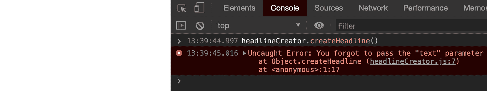

    图 4.14：控制台中的错误信息

1.  最后但同样重要的是，在 HTML 文件中添加一个 script 标签，并从那里调用`headlineCreator`库，这样每次加载 HTML 时都会创建一个标题：

    ```js
    <html>
      <head>
        <script src="img/headlineCreator.js" charset="utf-8"></script>
      </head>
      <body>
        <div id="root"></div>
        <script type="text/javascript">
          headlineCreator.createHeadline('This is the HeadlineCreator');
        </script>
      </body>
    </html>
    ```

    这将产生以下输出：

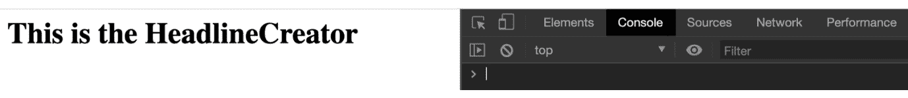

图 4.15：创建的 HeadlineCreator.js 库

通过这个练习，你已经了解到库的内部工作原理不必复杂且难以理解。`headlineCreator`库允许用户创建并将标题添加到指定的父元素中。尽管这是一个简化和几乎微不足道的用例，但它展示了构建和使用库的基本过程——即存在一个程序性问题，找到解决它的方法，抽象复杂性，并通过库提供给他人。

## 活动 4.01：将动画添加到待办事项应用中

在这个活动中，你被要求使用前面章节中的活动之一来动画化你一直在构建的`todo`列表应用。你可以使用以下三个库中的任何一个来完成此操作：

+   jQuery

+   Velocity.js

+   Anime.js

当你点击 Shuffle 按钮时，生成的`todo`列表应该会动画化待办事项。你可以使用任何你想要的精确动画，但我建议你从一个简单的动画开始，比如淡入淡出待办事项。

活动的步骤如下：

选择一个框架。为了更好地理解如何使用它们，在网上搜索它们并查看它们的文档（[`jquery.com`](https://jquery.com), [`velocityjs.org`](http://velocityjs.org), [`animejs.com`](https://animejs.com)):

1.  前往[cdnjs.com](http://cdnjs.com)获取 jQuery CDN URL。

1.  使用 script 标签将库加载到现有 Todo-List-HTML 的 head 标签中。这将使你能够在代码中使用 jQuery。

1.  在`activity.js`中，你需要更改`todoEle`变量。将其更改为 jQuery 元素。

1.  在`replaceListElements`函数中，你现在可以使用 jQuery 为你提供的`todoEle`元素上的函数。

1.  使用 jQuery 函数隐藏并清除元素内的内容。

1.  在 for 循环内部，创建 `liEle` 列表项元素，设置文本内容，并将其追加到 `listEle` 列表元素中。

1.  最后，缓慢地将新的排序好的 `todo` 列表，即 `listEle`，淡入。

1.  现在，在浏览器中打开 HTML 并点击 `Shuffle` 按钮。待办事项列表应该淡出、打乱顺序，然后再次淡入。你应该看到预期的输出。

1.  现在，我们将使用 `Velocity.js` 方法。访问 [cdnjs.com](http://cdnjs.com) 并获取 `velocity.js` CDN URL。

1.  使用脚本标签将库加载到现有的 Todo-List-HTML 的 head 标签中。这将允许你在代码中使用 `velocity.js`。

1.  在 `replaceListElements` 函数内部，你现在可以使用 `Velocity.js` 将列表元素 `listEle` 隐藏（通过将不透明度设置为 0），然后清空其内部元素。

1.  要将列表元素淡入，使用 `Velocity.js` 动画 `listEle` 并将不透明度设置为 1。在 `for` 循环之后设置代码。

1.  现在，在浏览器中打开 HTML 并点击 `Shuffle` 按钮。待办事项列表应该淡出、打乱顺序，然后再次淡入。

1.  最后，使用 `Animae` 方法，访问 [cdnjs.com](http://cdnjs.com) 并获取 `Anime.js` CDN URL。

1.  使用脚本标签将库加载到现有的 Todo-List-HTML 的 head 标签中。这将允许你在代码中使用 `Anime.js`。

1.  在 `replaceListElements` 函数内部，你现在可以使用 `Anime.js` 将列表元素 `listEle` 移出视图（使用 `translateX = -1000`），然后清空其内部元素。

1.  要显示重新打乱的待办事项列表，使用 Anime.js 动画 `listEle` 列表元素回到视图（`translateX = 0`）。在超时内这样做，以确保打乱操作已经完成。

    现在，在浏览器中打开 HTML 并点击 `Shuffle` 按钮。待办事项列表应该淡出、打乱顺序，然后再次淡入。它应该看起来如下：

    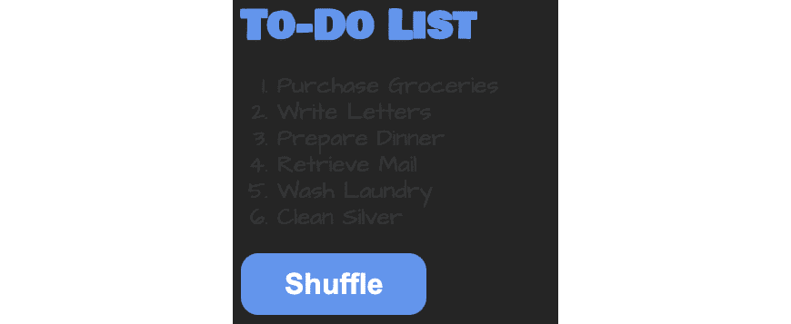

图 4.16：点击时动画待办事项列表

注意

本活动的解决方案可以在第 719 页找到。

# 摘要

在本章中，我们深入探索了 JavaScript 库的广阔世界。我们首先解释了库和框架这两个术语。从那里，我们查看了一些流行的框架以及它们能帮助我们做什么。本章中的练习展示了我们可以在哪里找到外部包以及如何使用它们。我们使用这些库所做的事情包括创建淡入淡出效果、从列表中删除重复条目以及将 DOM 元素渲染到文档中。我们还讨论了使用外部源代码的缺点。然而，本章最大的成就是创建了我们自己的库，这个库帮助我们创建标题。我们通过利用各种库来增强待办事项列表的 UI 效果来结束本章。

下一章将向我们展示如何在 JavaScript 中处理数据。我们将了解数据是如何表示的，它是如何被传递的，以及如何将特定类型转换为不同的类型。
