# 第八章：8. 浏览器 API

概述

到本章结束时，你将能够解释什么是 Web/浏览器 API；使用 JavaScript 在 HTML 中绘制；在浏览器中创建和控制音频；在浏览器中存储数据；在不同情况下决定使用哪种存储类型；测量和跟踪网站的性能；以及创建和管理浏览器与服务器之间的持续、双向连接。

在本章中，你将了解有趣的浏览器 API，并查看 JavaScript 的扩展功能。

# 简介

在上一章中，我们探讨了不同的 JavaScript 运行时环境的不同示例，并对它们的组件进行了概述。现在，我们将更深入地研究这些组件之一，即**浏览器对象模型**（**BOM**），以及它向 JavaScript 公开的 API。

BOM 是一组属性和方法，浏览器通过这些属性和方法将它们提供给 JavaScript。现在，你已经遇到了 BOM 的许多部分，例如`setTimeOut()`方法和文档属性，它具有许多方法，如`addEventListener()`。这是一个微妙但重要的观点，我们将在本章中讨论的方法和属性不是 JavaScript 编程语言的一部分；也就是说，它们不是 ECMAScript 规范的一部分——JavaScript 引擎是按照这个规范构建的——但它们是浏览器的方法和属性，并且构成了 JavaScript 和浏览器（以及通过扩展，与它运行的其他系统）之间的接口。

正如每个浏览器都有自己的 JavaScript 引擎实现一样，每个浏览器都以略微不同的方式实现 BOM。因此，作为开发者，检查你想要使用的功能的跨浏览器兼容性非常重要，并为不支持某些功能的浏览器实现**回退**或**polyfills**。通常情况下，特定浏览器的当前版本支持某些功能，但旧版本则不支持。

如我们之前提到的，你已经看到了 BOM 中一些更常用的方法。在这里，我们将更详细地探讨一些最常用且实用的浏览器 API，以及一些不太常用但功能强大的 BOM 方面，这将大大增加你可用工具的数量和功能，并允许你将一些超级酷甚至可能很有用的功能构建到你的网站和应用程序中。

# Canvas

图片和图表是创建引人入胜的网站和应用程序的基本组成部分。我们已经知道如何在我们的页面中包含图片和视频，但我们可以通过使用 JavaScript 和`<canvas>`元素来绘制自己的图片、图表，甚至复杂的视觉元素，如图表或游戏元素。有了它，我们可以绘制路径和矩形，并控制诸如描边和填充颜色、线段虚线、圆弧半径（或半径，如果你喜欢这样称呼）等。

使用 JavaScript 在 HTML 画布内绘制图形的过程可以分解为几个不同的步骤：

+   获取 HTML 的画布元素的引用。

+   获取一个新的画布渲染上下文，图形将绘制在其上。

+   根据需要设置各种绘图样式和选项（例如，线宽和填充颜色）。

+   定义构成图形的路径。

+   “描边”或填充定义的路径和形状——这是实际绘图发生的步骤。

在下面的练习中，我们将首先使用`fillRect()`方法。这个方法是我们可以在画布上绘制的方法之一，正如其名称所暗示的，它绘制一个矩形并用颜色填充它。为了描述矩形，我们需要四个信息：左上角`x`和`y`坐标，矩形的宽度和高度。因此，我们将传递给`fillRect()`的参数是一个`x`坐标，一个`y`坐标，宽度，和高度。

## 练习 8.01：使用 Canvas 元素绘制形状

让我们从一项练习开始，我们将学习如何与 Canvas 元素一起工作，API 的一些组成部分，以及我们如何使用它来绘制简单的形状。Canvas API 有许多方法和接口。在这个练习中，我们将查看一些最常用的方法。让我们开始吧：

1.  创建一个名为`index.html`的 HTML 文件，其中包含一个`<canvas>`元素，并在 HTML 主体的`DevTools`控制台中引用一个 JavaScript 文件。我们将把这个 JavaScript 文件命名为`canvas.js`：

    ```js
    <!-- index.html -->
    <!DOCTYPE html>
    <html>
      <head>
      </head>
      <body>
        <canvas id='canvas' style="border: 1px solid"></canvas>
        <script src='canvas.js'></script>
      </body>
    </html>
    ```

    我们已经给画布元素分配了一个 ID 为`'canvas'`，这样我们就可以在 JavaScript 中轻松选择它，并且有一个内联样式`"border: 1px solid"`，这样我们就可以看到画布在 HTML 页面中占据的区域。

1.  接下来，我们将在与`index.html`相同的目录下创建一个名为`canvas.js`的文件，并声明一个变量来保存对 HTML 画布元素的引用：

    ```js
    // canvas.js
    let canvas = document.getElementById('canvas');
    ```

1.  现在，我们将通过使用带有`'2d'`参数的`getContext()`方法创建一个渲染上下文，因为我们将会绘制 2D 图形。此方法接收一个字符串来表示上下文类型，并返回一个用于绘制和修改我们想要显示的图形的绘图上下文。有几种类型的上下文，但在这个 Canvas 的介绍中，我们只会查看`'2d'`上下文：

    ```js
    let context = canvas.getContext('2d');
    ```

    现在我们有了上下文，我们可以开始绘图了。画布对象使用网格系统，其原点位于左上角，因此`0`,`0`坐标位于画布的左上角。我们从这个原点开始绘制我们的图形。

1.  最后，我们将使用`fillRect()`方法在画布上绘制一个`100`乘`100`像素的矩形：

    ```js
    context.fillRect(10,10, 100, 100);
    ```

    现在，在浏览器中打开 HTML 文件。你应该会看到如下内容：

    

    图 8.1：带有内部正方形的简单画布

1.  你可能已经注意到了画布元素相当小。默认情况下，画布是 `300` x `150` 像素，所以让我们在我们的 JavaScript 中添加几行代码，以便在加载 HTML 页面时画布的尺寸与窗口的大小相匹配。我们将使用窗口对象的 `innerWidth` 和 `innerHeight` 属性——它们告诉我们视口的宽度和高度——来设置画布的宽度和高度：

    ```js
    // canvas.js
    let canvas = document.getElementById('canvas');
    canvas.width = window.innerWidth;
    canvas.height = window.innerHeight;
    let context = canvas.getContext('2d');
    context.fillRect(10,10, 100, 100);
    ```

1.  现在我们有一个更大的画布（假设你的浏览器窗口比 `300` x `150` 像素大），我们可以开始尝试使用这些和其他绘图方法。让我们添加几个更多的矩形，但稍微改变一下：

    ```js
    canvas.js
    let canvas = document.getElementById('canvas');
    canvas.width = window.innerWidth;
    canvas.height = window.innerHeight;
    let context = canvas.getContext('2d');
    context.fillStyle = 'yellow';
    context.fillRect(10,10,200,200);
    context.fillStyle = 'black';
    context.strokeRect(230, 10, 200, 200);
    context.setLineDash([10]);
    context.strokeRect(450, 10, 200, 200);
    context.setLineDash([0]);
    context.strokeStyle = 'red';
    context.strokeRect(10, 230, 200, 200);
    context.fillRect(450, 230, 200, 200);
    context.clearRect(500, 280, 100, 100);
    ```

1.  我们现在应该有五个新的矩形，看起来像这样（如果包括填充黑色矩形的末尾的 `clearRect()`，实际上有六个）：

图 8.2：六个更多矩形

在这个练习中，我们学习了如何使用 `canvas` 元素绘制所有格式的矩形。

练习中额外的代码相当直观，但仍有一些事情需要指出：

+   `fillStyle` 和 `strokeStyle` 属性可以接受任何有效的 CSS 颜色值（十六进制、RGB、RGBA、HSL、HSLA 或命名颜色）。

+   `setLineDash` 属性接受一个数字数组，用于确定绘制线条和空白的距离。列表会重复，所以如果你传入 `[5]`，线条和空白将重复，每个长度为 `5` 像素。如果你传入 `[5, 15]`，则所有线条都将为 `5` 像素，所有空白都将为 `15` 像素。

+   一旦设置，`fillStyle`、`strokeStyle` 和 `setLineDashvalues` 将持续应用于同一上下文中绘制的任何内容，所以如果你需要，请确保重置值，就像我们用 `setLineDash` 属性（否则红色矩形将是虚线）和 `fillStyle` 所做的那样。

+   `clearRect` 方法可以用来从画布的另一部分移除绘制的区域。

## 使用路径操纵形状

现在我们已经掌握了绘制矩形的技巧，我们将开始使用上下文对象上可用的其他一些方法绘制更有趣的形状。路径是一系列由线条连接的点。我们可以操纵这些路径的属性，如它们的曲率、颜色和粗细。这次，我们将首先介绍方法，然后看看它们是如何工作的：

+   `beginPath()`: 开始一个新的路径列表

+   `moveTo(x,y)`: 设置下一个路径绘制的起点

+   `lineTo(x,y)`: 从当前点创建一条到方法传入坐标的线

+   `closePath()`: 从最近的一个点创建一条到第一个点的线，从而封闭形状

+   `stroke()`: 绘制已描述的形状

+   `fill()`: 用纯色填充所描述的形状

这些方法可以用来画一个占据大部分画布宽度和高度的三角形。你可以用以下代码替换 canvas.js 中的上一段代码，或者创建一个新的 JavaScript 文件，并在 HTML 文件中的`<script>`标签的源属性中更改以反映新的 JavaScript 文件：

```js
canvas-1.js
let canvas = document.getElementById('canvas');
const width = window.innerWidth;
const height = window.innerHeight;
canvas.width = width
canvas.height = height
let context = canvas.getContext('2d');
context.beginPath();
context.moveTo(50, 50);
context.lineTo(width - 50, 50);
context.lineTo(width / 2, height - 50);
context.closePath();
context.stroke();
```

首先，我们将窗口的内部宽度和高度值赋给一个变量，因为我们将会多次使用它们。在获取到画布对象的引用后，我们开始一个新的路径，并将起始点移动到两个轴上的`50`像素处。然后，我们从一个当前点画一条线到内宽度的`50`像素处，顶部`50`像素处的一个点。接着，我们画一条线到一个内宽度的半数，底部`50`像素处的一个点。最后两个方法用于关闭路径，并使用`stroke()`方法绘制整个形状。


图 8.3：一个三角形

创建分形图案的步骤相当直接，但以下是一些需要记住的要点：

+   起始点应该是`canvas`元素的中部。

+   线条在四个方向之一绘制。

+   当点在画布边界内时，函数的线条绘制部分应重复执行。

+   在前面的例子中，线条在每画两条线后长度增加。然而，你也可以通过在每条线上增加线条长度来得到类似的结果。

## 活动 8.01：创建一个简单的分形

现在，我们将把关于 HTML Canvas 所学的知识应用到实践中。这次，我们将使用 JavaScript 重复绘制步骤以创建一个非常**简单的分形**。尝试创建一个像这样的图案：


图 8.4：一个基本模式

按照以下步骤创建分形：

1.  在画布中部初始化一个坐标变量作为起始点。

1.  创建一个循环。对于循环的每一次迭代，交替增加和减少坐标并绘制线条：

    +   通过增加或减少坐标值来使点向外螺旋移动

    +   从上一个点到新点画一条线

1.  当点达到画布的任何边缘时，结束循环。

在查看解决方案之前，先花些时间自己尝试做这个。

注意

本活动的解决方案可以在第 732 页找到。

目前，我们将继续学习另一个 Web API：Web Audio API。

# Web Audio API

此 API 提供了一套方法和对象，我们可以使用它们从各种来源向 HTML 添加音频，甚至允许开发者从头创建新声音。该 API 功能丰富，支持诸如声像、低通滤波器等多种效果，可以组合起来创建不同类型的音频应用程序。

与 Canvas API 类似，**Audio API**从音频上下文开始，然后在上下文中创建多个音频节点，形成一个音频处理图：

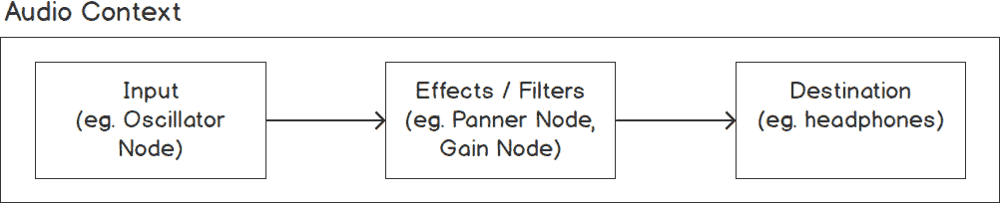

图 8.5\. 音频上下文及其音频处理图

一个 **音频节点** 可以是一个源、一个目的地或一个音频处理器，例如一个滤波器或增益节点，并且它们可以组合起来创建所需的音频输出，然后可以传递给用户的扬声器或耳机。

## 练习 8.02：创建振荡器波形

在这个练习中，我们将看到如何在 JavaScript 中创建 **一个简单的振荡器波形** 并将其输出到系统的音频输出设备。让我们开始吧：

1.  让我们先创建一个音频上下文并添加一个音量和振荡器节点。将以下代码输入到 Google Chrome 开发者工具的控制台窗口中（可以通过按 *F12* 键访问）：

    ```js
    // create the audio context
    let context = new AudioContext();
    // create a gain node
    let gain = context.createGain(); 
    // connect the gain node to the context destination
    gain.connect(context.destination);
    // create an oscillator node
    let osci = context.createOscillator(); 
    ```

1.  现在，我们将设置振荡器类型为 `'sawtooth'` 并将振荡频率设置为 `100`。除了 `'sawtooth'`，你还可以将振荡器类型设置为 `'sine'`、`'square'` 或 `'triangle'`。请随意尝试不同的频率：

    ```js
    // set the oscillation type
    osci.type = 'sawtooth';
    // set the oscillation frequency
    osci.frequency.value = 100;
    ```

    注意

    波形的频率指的是波形完成一个周期或周期的频率，**1 赫兹**（1 Hz）表示每秒一个周期。我们感知频率更高的声波为音调更高。

1.  最后，我们将振荡器连接到增益节点并调用振荡器的 `start()` 方法：

    ```js
    // connect the oscillator node to the gain node
    osci.connect(gain);
    // start the oscillation node playing
    osci.start(); 
    ```

如果你将音量调大运行此代码，你应该会听到连续的振荡声音（声音类似于你在收音机上找不到想要频道时听到的静电噪声）。一些浏览器在用户以某种方式与屏幕交互之前不会播放使用 Audio API 的声音。这是为了阻止开发者制作出令人讨厌的播放不需要声音的页面。如果你遇到错误，只需在运行代码之前在屏幕上的某个位置点击一下。

我们可以添加多个源节点，可以是相同类型（在我们的例子中是一个振荡器）或不同类型的，并且它们可以分别控制，或者共享其他音频节点，如增益或平衡节点。当然，我们也可以让我们的音频上下文对某些外部输入做出响应，例如用户输入或时间事件。

## 活动 8.02：使用两个振荡器播放声音和控制频率

让我们通过添加一些交互性来更好地利用音频 API。在这个活动中，我们将有两个振荡器播放声音，用户可以通过在 HTML 页面上移动光标来控制它们的频率。一个振荡器的频率将由光标的 `x` 位置控制，随着光标向页面右侧移动，频率增加，另一个振荡器的频率由 `y` 位置控制，随着光标向页面底部移动，频率增加。

在检查解决方案之前，看看你是否能实现这个目标；这将是对本章末尾活动的良好练习。

一些帮助你开始的建议：

+   两个振荡器应该在同一个上下文中，并且连接到同一个音量节点。

+   振荡器节点接口提供了四种预设的振荡器类型：`'sine'`（默认）、`'square'`、`'sawtooth'`和`'triangle'`。我们的两个振荡器可以有不同的类型，所以可以尝试不同的组合。

该活动的概要步骤如下：

1.  初始化一个音频上下文和一个音量节点。

1.  创建一个增益节点并将其连接到上下文的目的地。

1.  初始化两个振荡器（一个用于光标的每个坐标）。

1.  设置振荡器类型，将它们连接到增益节点，并调用它们的`start()`方法。

1.  创建一个`document`。

1.  根据光标的位置设置振荡器的频率。

    注意

    该活动的解决方案可以在第 733 页找到。

在我们继续到下一个 Web API 之前，这里有一些关于如何从当前播放的声音中提取数据并将其用于在我们的应用程序中可视化该声音的信息。

## 音频可视化

音频可视化是声音的图形表示。在音频程序中常见这种表示，它可以产生非常有趣的图案和形状。Web 音频有许多种类的音频节点。其中一种为音频可视化打开了许多可能性的是分析节点，它允许你访问其音频输入的波形和频率数据。除非你是声音技术人员，否则节点的内部工作原理相当晦涩，所以我们直接进入如何访问数据的方法。我们将使用一个额外的属性和一个方法来获取一些对可视化有用的数据：

+   `frequencyBinCount`：这实际上告诉我们我们有多少数据点可用于我们的数据可视化。

+   `getFloatTimeDomainData()`：此方法接受一个**Float32Array**作为参数，并将当前波形数据复制到它。（Float32Array 是一种特殊的数组，它接受 32 位浮点数。当数组被分成数组中的项目数量时，它表示波形。每个项目代表波形那一部分的振幅，从-1 到 1）。

如果我们有一个振荡器节点，我们可以创建一个分析节点，将其连接到振荡器，并使用前面的两个属性来获取在那个精确时刻播放的声音的波形数据：

```js
let oscillator = audioContect.createOscillator(); // create the oscillator
let analyser = audioContect.createAnalyser(); // create the analyser node
oscillator.connect(analyser); // connect the oscillator and the analyser
oscillator.start(); // start the oscillator playing
let waveform = new Float32Array(analyser.frequencyBinCount); 
// create a Float32Array which will hold the waveform data in the next step
analyser.getFloatTimeDomainData(waveform); // get the waveform data for the  sounds at this precise moment.
```

在创建音频可视化时，`getFloatTimeDomainData`函数会在每一帧被调用。本小节中的信息将在本章末尾的活动中有用，所以届时请参考它。

# Web 存储 API

在浏览器中存储数据可以是一种提高用户体验的绝佳方式。它可以避免用户等待从服务器获取相同数据，并且可以用来立即将之前访问过的页面恢复到离开时的状态，这意味着，例如，用户不需要重新填写表单中的相同部分。《Web Storage API》用于以键/值对的形式在浏览器中存储数据。它可以用来存储用户在表单中输入的数据，以便他们可以轻松返回并稍后完成它，或者它可能是用户在 Web 应用程序中选择的偏好，您想要在相同源内的页面之间传递的数据，或者您认为有保存价值的其他任何数据。《Web Storage API》是同步的，因此设置和检索数据将阻塞其他 JavaScript 代码，直到 Web 存储方法完成。Web 存储旨在存储相对较小的数据量，在这种情况下，同步不会对性能产生明显影响。

你可能听说过 cookie，它是浏览器内数据存储的一个例子。Web 存储与 cookie 有些相似，尽管它们各自的使用场景不同：cookie 是用来向服务器发送数据的，而 Web 存储仅设计用于客户端存储。此外，Web 存储允许存储更多的数据——通常，Web 存储的极限是`10 MB`（尽管，就像在 Web 开发的世界中许多事情一样，这完全取决于浏览器），而 cookie 的限制是`4 KB`。另一个关键的区别是，cookie 必须设置过期日期，否则它们将在会话结束时过期，而另一方面，一种 Web 存储只能通过 JavaScript 或清除浏览器缓存来删除。

Web Storage API 非常简单，但在我们深入探讨之前，让我们看看 Web 存储的两种变体，并介绍一些关于该接口的其他关键点。

通过 API 提供的两种 Web 存储方式是`sessionStorage`和`localStorage`。这两种存储方式的主要区别在于`sessionStorage`仅在当前会话活跃期间持续存在；也就是说，直到浏览器窗口关闭。另一方面，`localStorage`没有过期日期，将在客户端机器上持续存在，直到通过 JavaScript 或清除浏览器缓存来清除。`sessionStorage`和`localStorage`都遵循相同的源原则，这意味着由特定域名存储的数据只能由该域名访问。

可用于`sessionStorage`和`localStorage`的方法是相同的，API 的使用非常简单。我们有五种方法可供使用，但只有三到四种是常用的：

+   `setItem()` 方法是我们将键/值对存储在 Web 存储中的方式。它接受两个参数，都是字符串类型。第一个是项目的键，而第二个是其值：

    ```js
    // Sets key 'dog' with value 'woof'
    sessionStorage.setItem('dog', 'woof');
    ```

+   `getItem()` 方法允许我们获取存储中设置的任何项目。它接受一个参数，即我们想要检索的项目的键。如果提供的键在存储中不存在，则它将返回 null：

    ```js
    sessionStorge.getItem('dog');
    // gets the value of key 'dog'
    ```

+   `removeItem()` 方法接受一个参数，即您希望删除的项目的键：

    ```js
    sessionStorage.removeItem('dog');
    // removes the key 'dog' and its value
    ```

+   `clear()` 方法清除当前页面的整个存储，并且不接受任何参数：

    ```js
    sessionStorage.clear();
    // clears all sessionStorage for the current origin
    ```

+   `key()` 方法接受一个索引作为其参数，并返回该索引处的项目的键，如果该索引没有项目存在，则返回 `null`：

    ```js
    sessionStorage.key(0); 
    // returns the key of item at index 0 (if any)
    ```

此外，还有 `sessionStorage.length` 和 `localStorage.length` 属性，它们返回浏览器存储对象中存储的项目数量。

Web 存储对象的行为与 JavaScript 对象非常相似，我们可以通过点符号以及使用 `setItem` 和 `getItem` 方法来访问它们的属性：

```js
sessionStorage.planet = 'Mars'; 
// sets an item with the key 'planet'
sessionStorage.planet;
// returns the string 'Mars'
```

一个需要注意的重要点是，项目的值必须是基本数据类型，但这并不意味着我们不能使用 Web 存储存储更复杂的对象。如果我们想在 Web 存储中存储一个对象，我们可以在设置时使用 JSON 对象 `obj` 将其序列化，然后在再次检索时解析它：

```js
let obj = {
  name: 'Japan',
  continent: 'Asia'
};
sessionStorage.setItem('country', JSON.stringify(obj));
```

然后，我们可以将 `sessionStorage.getItem()` 与 `JSON.parse()` 结合起来检索对象：

```js
JSON.parse(sessionStorage.getItem('country'));
// Outputs the country object 'obj' defined above.
```

## 练习 8.03：使用 localStorage API 存储和填充姓名

让我们创建一个简单的网页，它接受一些用户信息，并使用 `localStorageAPI` 存储这些信息，以便用户下次访问页面时可以显示。如今，浏览器对 Web 存储的支持非常强大。尽管如此，考虑到 Web 存储可能不被支持的可能性，确保在用户的浏览器不支持 Web 存储时提醒用户。在这个练习中，我们将要求用户提供他们的名字和姓氏。让我们开始吧：

1.  首先，让我们创建一个带有标准样板 HTML 的 HTML 文件，并为用户的名字和姓氏添加几个输入框，如果浏览器不支持 Web 存储，则添加一个警告消息。我们将默认设置 `<p>` 标签的显示样式为 none：

    ```js
    <!-- index.html -->
    <!DOCTYPE html>
    <html>
      <head>
      </head>
      <body>
        <input type="text" id='first-name' placeholder='First name'>
        <input type="text" id='last-name' placeholder='Last name'>
        <p style='display: none;' id='warning'>Your browser doesn't support local storage</p>
        <script src='storage.js'></script>
      </body>
    </html>
    ```

    如果您在浏览器中打开这个 HTML 文件，它看起来会是这样：

    

    图 8.6\. 带有两个输入框的 HTML 页面

1.  接下来，我们将创建一个 JavaScript 文件，首先检查 `localStorage` 方法是否在窗口对象上可用。如果不可用，我们简单地返回并将警告消息的显示样式设置为 block，从而提醒用户页面将会有减少的功能：

    ```js
    // storage.js
    if (!window.localStorage) {
      // if localStorage is not supported then display the warning and return out to stop the rest of the code from being run.
      document.getElementById('warning').style.display = 'block';
    } else {
    ```

1.  如果浏览器支持`localStorage`，我们将继续将当前保存在`localStorage`中的`firstName`和`lastName`键的任何值分配给同名变量：

    ```js
      let firstName = localStorage.getItem('firstName');
      let lastName = localStorage.getItem('lastName');
    ```

1.  然后，我们将获取两个输入元素，如果`firstName`或`lastName`有值，那么这个值将被设置为相应的文本输入的值，从而将保存在`localStorage`中的任何字符串重新填充到相关的文本输入中：

    ```js
      let inputFName = document.getElementById('first-name');
      let inputLName = document.getElementById('last-name');
      if (firstName) {
        inputFName.value = firstName;
      }
      if (lastName) {
        inputLName.value = lastName;
      }
    ```

1.  我们需要做的最后一件事是为两个文本输入添加事件监听器，并在每次输入事件触发时将它们的当前值存储在`localStorage`中：

    ```js
      inputFName.addEventListener('input', event => {
        localStorage.setItem('firstName', event.target.value);
      });
      inputLName.addEventListener('input', event => {
        localStorage.setItem('lastName', event.target.value);
      });
    }
    ```

错误输出将如下所示：

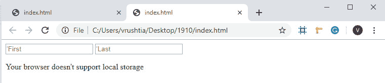

图 8.7：输出错误

输出如下所示，显示了存储的两个名称：

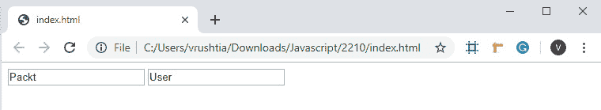

图 8.8：存储并填充了两个输入变量的 HTML 页面

这就完成了我们的简单应用程序。假设`localStorage`被支持，任何输入到文本输入中的字符串都将被保存并重新填充，即使页面刷新或浏览器或标签关闭后也是如此。

注意

在这里，我们的特性检测方法不够稳健，它不会检测，例如，当特性在浏览器中被禁用时。对于生产代码来说，更好的方法是在`localStorage`中尝试设置和获取一个项。如果获取的值符合预期，那么我们知道本地存储正在工作。

虽然 Web 存储 API 对于存储相对较小的数据量非常有用，但它并不适合存储较大的文件或数据结构。首先，我们只能在 Web 存储中存储字符串值，更重要的是，由于 API 是同步的，如果应用程序存储和检索大量数据，将会影响性能。

在我们想要客户端存储大量数据集、文件或 blob 的情况下，我们可以利用另一个浏览器 API：`IndexedDB` API。

# IndexedDB

**IndexedDB**是另一种客户端数据存储形式，它在某些重要方面与 Web 存储不同：

+   与 Web 存储不同，它非常适合存储大量数据，并且可以存储许多不同的数据类型。

+   该 API 比 Web 存储 API 具有更强大的功能，允许我们执行对索引数据的查询等操作。

+   它是一个异步 API，因此使用存储在 indexedDB 中的数据不会阻塞其他代码的执行。

最后两点暗示了使用 indexedDB 而不是 Web 存储的最大缺点：它的 API 和工作流程比 Web 存储的简单获取和设置方法更复杂。IndexedDB 经常被批评 API 过于复杂，但这是确保数据完整性的必要条件（关于这一点稍后讨论），而且无论如何，如果我们花时间理解一些核心概念，那么我们会发现它实际上并不那么复杂。

与 web 存储一样，indexedDB 遵循相同的源规则，这意味着只有位于同一域名、协议和端口的页面才能访问 indexedDB 的特定实例。在我们开始使用 indexedDB 之前，让我们检查一些其组件和核心概念。

一个 indexedDB 数据库包含一个或多个 **对象存储**。正如其名称所暗示的，对象存储是我们存储在数据库中的对象的容器。与 web 存储一样，indexedDB 中的对象以键/值对的形式存储，但与 web 存储 不同，值不需要是字符串类型。值可以是任何 JavaScript 数据类型，甚至是 blob 或文件。

这些对象通常是同一类型，但它们不需要具有完全相同的结构，正如您可能期望的传统数据库那样。例如，假设我们正在存储员工数据。对象存储中的两个对象可能都有薪资属性，但一个的值可能是 30,000，而另一个可能是三十万。

对象存储可以链接到索引（这些索引实际上是不同类型的对象存储）。这些索引用于高效查询我们存储在数据库中的数据。索引是自动维护的。我们将在稍后更详细地了解如何使用它们：

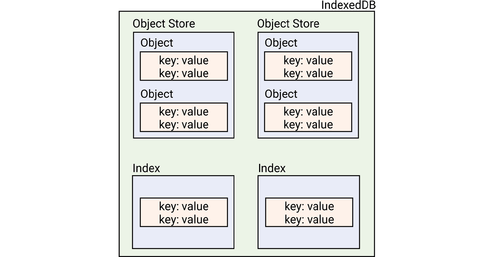

图 8.9：indexedDB 的布局

在 indexedDB 中，我们所有的 **创建、读取、更新和删除** （**CRUD**）操作都是在 **事务** 中执行的，我们将在稍后详细讨论。在事务内部工作可能看起来是一种复杂的方式，但它是一种有效的方法，可以防止同时在对同一记录进行写操作。考虑在同一页面上打开的两个页面，它们都在尝试更新同一记录。当一个页面打开事务时，另一个页面无法对同一记录执行操作。

与 indexedDB 一起工作的过程可以分为四个步骤：

1.  打开数据库。

1.  如果所需的存储尚不存在，则创建对象存储。

1.  处理事务：创建、读取、更新或删除记录或记录。

1.  关闭事务。

## 练习 8.04：创建对象存储并添加数据

让我们创建一个将保存动物记录的数据库。我们将更详细地执行前面的步骤来创建数据库、创建对象存储、开始事务并向数据库添加一些数据。将以下代码添加到 Google Chrome 开发者工具的控制台：

1.  我们将使用 `indexedDB.open()` 方法初始化一个名为 `request` 的变量，并将数据库名称 `animals` 和数据库版本号 `1` 作为参数传递。它返回一个请求对象，该对象将接收三个事件之一：`success`、`error` 或 `upgradeneeded`：

    ```js
    let request = window.indexedDB.open('animals', 1);
    ```

    当我们第一次调用 open 时，将触发 `upgradeneeded` 事件，我们可以附加一个 `onupgradeneeded` 事件处理函数，在其中我们将定义我们的对象存储。

1.  然后，我们将定义一个函数来处理`onupgradeneeded`事件，将`event.target.results`中的数据库分配给`db`变量，并创建一个`'mammals'`对象存储：

    ```js
    request.onupgradeneeded = event => { // handle the upgradeneeded event
      let db = event.target.result;
      db.createObjectStore('mammals', {
        keyPath: 'species'
      });
    };
    ```

    注意，我们在`open`方法中传递了第二个参数`1`。这是数据库的版本号，我们可以更改它以允许对对象存储进行更改，或者添加新的对象存储。我们稍后会看到它是如何工作的。

    数据库本身可通过请求对象的`result`属性访问。我们可以通过事件对象的`event.target`或通过请求对象（事件目标是请求对象）来访问它。

    然后，我们使用数据库的`createObjectStore()`方法创建一个新的存储。我们向此方法传递一个名称，这个名称可以是任何字符串，但通常应该描述正在存储的数据类型。我们还传递一个对象，其中包含键`keypath`和值为我们想要用于访问存储的对象的键，以及访问存储的对象。

1.  现在我们已经创建了数据库，我们可以继续插入一些对象。这次，当我们调用`indexedDB`对象的`open`方法时——假设没有错误——成功事件将被触发，我们访问数据库并继续事务。让我们回顾一下我们在`onsuccess`处理程序中做了什么。再次将数据库分配给`db`变量，并处理可能发生的错误（现在，我们只是将它们记录到控制台）：

    ```js
    request.onsuccess = event => {
      let db = event.target.result;
      db.onerror = error => {
        console.log(error);
      }
    ```

1.  使用`storeName`属性为`'mammals'`和类型为`'readwrite'`创建一个事务。这限制了事务只能对`'mammals'`对象存储执行读写操作：

    ```js
      let transaction= db.transaction('mammals', 'readwrite');
    ```

1.  接下来，我们将对象存储分配给`store`变量，并向存储中添加两个记录：

    ```js
      let store = transaction.objectStore('mammals');
      store.put({
        species: "Canis lupus",
        commonName: "Wolf",
        traits: ["Furry", "Likes to howl at moon"]
      });
      store.put({
        species: "Nycticebuscoucang",
        commonName: "Slow Loris",
        traits: ["Furry", "Every day is Sunday"]
      });
    ```

1.  然后，我们定义当事务接收到`'complete'`事件时应执行的操作，即关闭数据库，从而完成我们的事务：

    ```js
      transaction.oncomplete = () => {
        db.close();
      };
    };
    ```

1.  运行此代码后，假设没有错误，你可以打开 Chrome 的开发者工具，导航到`应用程序`标签页，并展开左侧的 IndexedDB 存储项。在这里，你会看到你刚刚创建的`animals`数据库，其中包含其哺乳动物对象存储，以及我们之前添加的两个条目：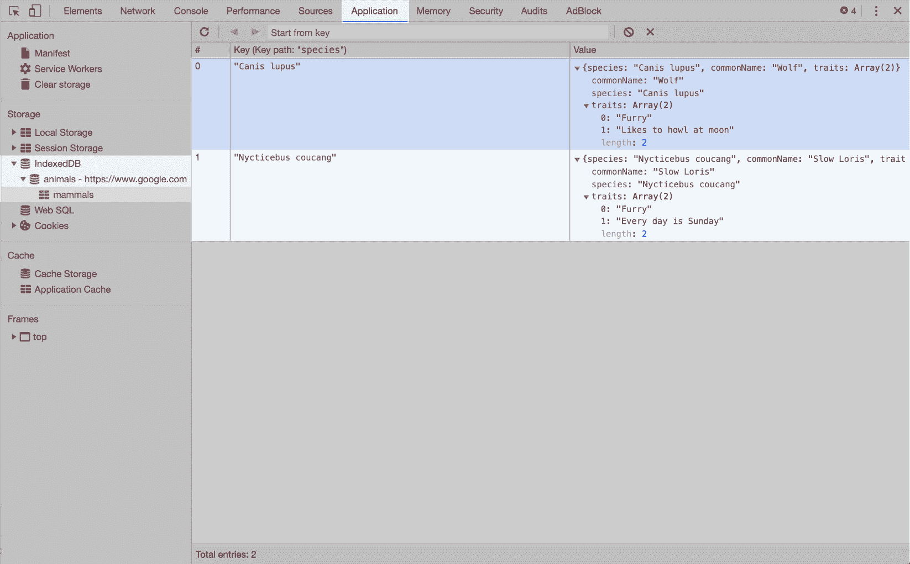

    图 8.10：在开发者工具中查看 IndexedDB

1.  现在你已经在数据库中保存了一些数据，让我们学习如何再次检索它。检索数据的过程与最初存储它的过程类似。当我们创建对象存储时，我们将`keyPath`设置为物种，因为我们知道这将是一个唯一的属性。我们可以使用这个属性来访问对象存储中的特定条目：

    ```js
    indexedDB-v2.js
    1 let request = window.indexedDB.open('animals', 1);
    2 
    3 request.onsuccess = event => {
    4   let db = event.target.result;
    5   db.onerror = error => {
    6     // handle an error
    7     console.log(error); 
    8   }
    9   let trx = db.transaction('mammals', 'readonly');
    10   let store = trx.objectStore('mammals');
    11   let animalReq = store.get('Nycticebuscoucang');
    12   animalReq.onsuccess = (event) => {
    13     console.log(event.target.result);
    14   };
    The full code is available at: https://packt.live/2q8v5bX
    ```

1.  就像我们之前做的那样，我们必须发起一个请求来打开数据库，并将一个`onsuccess`处理程序附加到该请求上。当成功事件被触发时，我们可以通过请求的结果或通过事件对象来访问数据库，即`event.target.result`。我们现在可以通过调用数据库的`transaction()`方法来创建一个事务，并指定我们想要的存储对象和事务类型，即哺乳动物和读写。

1.  接下来，我们通过调用事务的`objectStore()`方法来访问存储。我们现在可以调用`get()`方法，并传入我们想要访问的条目的`keyPath`值。这个`get()`方法返回另一个请求对象，它也会接收到成功和错误的事件。我们将一个最终的成功处理程序附加到`onsuccess`属性，它将访问`event.target.result`属性。这包含我们要找的条目。

    当我们第一次创建数据库时，以及每次我们随后的请求打开它时，我们都将数据库版本号作为`indexedDB.open()`方法的第二个参数传递。只要我们保持版本号不变，数据库将以一致的对象存储打开，但我们不允许对存储的结构进行任何更改，也无法将新对象存储添加到数据库中。如果我们想修改对象存储或添加新的，我们需要升级我们的数据库。我们通过简单地创建一个打开请求并将新版本号传递给第二个参数来完成此操作。

    这将触发请求的`onupgradeneeded`事件，并允许我们创建一个版本更改事务，这是唯一可以修改或添加对象存储的事务类型。版本号必须是整数，并且任何新版本都必须比数据库的当前版本号高。

    假设我们想要添加另一个对象存储，这次是为了`upgradeneeded`事件中的动物。当我们第一次创建数据库时，这个过程是相同的。当添加一个新的对象存储时，请求对象上的成功事件将被触发。这意味着我们可以在创建它之后立即向我们的新对象存储添加条目：

```js
indexedDB-v3.js
2 let request = window.indexedDB.open('animals', 2);
3 
4 // handle the upgradeneeded event
5 request.onupgradeneeded = event => {
6   let db = event.target.result;
7   // Our new cephalopods store
8   db.createObjectStore('cephalopods', {
9     keyPath: 'species'
10   });
11 };
12 
13 request.onsuccess = event => {
14   let db = event.target.result;
15   db.onerror = error => {
16     console.log(error) 
The full code is available at: https://packt.live/2pdYCAr
```

再次查看 Chrome 开发者工具的应用程序标签页，我们将看到我们新创建的头足类存储及其两个新条目：

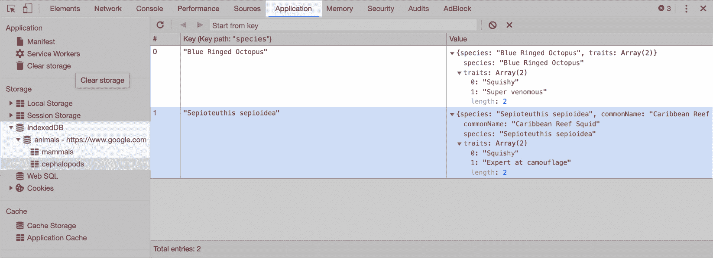

图 8.11：新的对象存储和 indexedDB 中的条目

在这个练习中，我们创建了一个包含动物记录的数据库。你可以进一步尝试添加不同的对象存储并向其中添加数据。

## 查询 IndexedDB

除了通过其键（在我们的例子中是物种）访问数据外，我们还可以对对象存储运行简单查询，以返回与我们的查询词匹配的多个条目。在 indexedDB 中的数据需要通过我们想要用于查询的任何键进行索引；与其他数据库不同，indexedDB 没有内置的搜索功能。如果我们决定想要使用与我们创建对象存储时设置的键路径不同的键，我们需要创建一个新的索引。

## 练习 8.05：查询数据库

在这个练习中，我们将看到如何使用与我们在创建 `objectStore` 时使用的 `keyPath` 不同的键。为此，我们将使用 `createIndex` 方法，该方法接受两个参数和一个作为第三个参数的 `options` 对象。第一个是我们想要与新的索引关联的名称，而第二个是我们想要链接到索引的数据键。这样做需要在创建数据库打开请求时再次更新数据库版本。让我们通过练习来看看我们如何实现这一点。就像我们之前做的那样，在 Google Chrome 的开发者工具中的代码片段中跟随：

1.  向打开动物数据库发出新的请求，并将一个函数分配给 `onupgradeneeded` 事件：

    ```js
    let request = window.indexedDB.open('animals', 3); // version 3 of the DB
    request.onupgradeneeded = event => {
    ```

1.  通过 `event.target.transaction.objectStore` 访问哺乳动物存储，并在其上调用 `createIndex()` 方法：

    ```js
      let store = event.target.transaction.objectStore('mammals');
      store.createIndex('traits', 'traits', {multiEntry: true, unique: false});
    };
    ```

    如我们之前提到的，`createIndex` 方法接受两个参数。在我们的例子中，我们使用特征作为这两个参数。第三个参数是一个 `options` 对象。在这里，你可以将唯一属性设置为 `true` 以确保数据库不允许存储此键的重复项，或者设置为 `false` 以允许具有此键相同值的多个记录。你还可以设置一个 `multiEntry` 参数。如果设置为 `true`，则数据库将为数组中的每个项目添加一个条目；如果设置为 `false`，则整个数组将作为一个条目进行索引。将此设置为 `true` 将允许我们通过单个特征查询条目，正如我们现在将看到的。

1.  接下来，我们为数据库的第三个版本创建一个数据库打开请求对象并创建另一个 `onsuccess` 事件处理函数：

    ```js
    let request = window.indexedDB.open('animals', 3);
    request.onsuccess = event => {
    ```

1.  然后，我们获取结果数据库，创建一个事务，访问存储，并使用我们想要查询的索引名称调用存储的 `index()` 方法：

    ```js
      let db = event.target.result;
      let trx = db.transaction('mammals', 'readonly');
      let store = trx.objectStore('mammals');
      let index = store.index('traits')
    ```

1.  然后，我们调用 `index.getAll()` 并将 `Furry` 的值作为参数，将返回的值分配给 `animalReq` 变量。像往常一样，此对象通过成功事件接收，我们可以通过该事件访问与我们的查询匹配的所有记录的数组：

    ```js
      let animalReq = index.getAll('Furry');
      animalReq.onsuccess = (event) => {
        console.log(event.target.result);
      };
    ```

1.  最后，我们创建一个错误事件处理函数来处理可能出现的任何错误：

    ```js
      animalReq.onerror = (error) => {
        console.log(error); // handle any error
      };
    };
    ```

1.  如果我们运行此代码，我们应该得到所有与我们的查询匹配的数据库条目：

![图 8.12：访问数据库中所有毛茸茸哺乳动物的结果

![img/C14377_08_12.jpg]

图 8.12：访问数据库中所有毛茸茸哺乳动物的结果

在这个练习中，我们学会了使用与 `keyPath` 和 `createIndex` 方法不同的键，该方法接受两个参数和一个作为第三个参数的 `options` 对象。

## IndexedDB 光标

如我们之前提到的，indexedDB 没有对未索引记录键的本地记录搜索功能。如果我们想在我们的数据库中实现这个功能，我们就得自己动手。然而，indexedDB 确实为我们提供了一个光标，它是一个表示对象存储中位置的对象，我们可以使用它来遍历数据库中的对象。与其他 indexedDB API 的部分一样，光标对象是基于事件的，因此我们必须等待成功事件触发后才能继续我们的操作：

```js
let request = window.indexedDB.open('animals', 3);
request.onsuccess = event => {
  let db = event.target.result;
  let trx = db.transaction('mammals', 'readonly');
  let store = trx.objectStore('mammals'); 
  let cursorReq = store.openCursor();
  cursorReq.onsuccess = e => {
    let cursor = e.target.result;
    if (cursor) {
      console.log(cursor.value); // do something with this entry.
      cursor.continue();
    } else {
      console.log('end of entries');
    };
  };
};
```

再次强调，我们将回顾获取数据库访问权限、打开事务和访问我们感兴趣的存储的过程。现在，我们可以使用对象存储的 `openCursor()` 方法来创建我们的光标。此方法可以接受两个可选参数：光标可以遍历的键的范围，以及当调用其 `continue()` 方法或 `advance()` 方法时告诉光标在记录中移动方向的参数。方向参数的可能值是 `next`、`nextunique`、`prev` 和 `prevunique`，默认为 `next`。

在我们的情况下，我们没有向 `openCursor()` 方法提供任何参数，所以它将遍历所有键，并逐个记录地向前移动。

我们首先定义了一个 `cursor.delete()` 方法。在我们的例子中，我们只是将记录记录到控制台，然后调用 `continue()` 方法。调用 `continue()` 会将光标移动到下一个记录，然后触发 `cursorReq` 对象的成功事件，再次启动这个过程。如果光标已经到达记录的末尾，光标对象将是 `null`，我们可以终止这个过程。

在 indexedDB 中有很多内容需要介绍——这实际上并不令人惊讶，因为它是比我们之前查看的 Web Storage API 更全面、功能更多、复杂性也更高的客户端数据库。

在我们继续进行练习以巩固对 indexedDB 的理解之前，这里是对我们所学内容的快速回顾：

+   IndexedDB 适合存储大量数据。

+   它可以存储比 Web Storage（任何 JavaScript 数据类型、文件或 blob）更多的数据类型。

+   它是基于事件的——几乎所有的操作都是从数据库请求的，并接收各种事件。

+   它是异步的。

+   它包括数据库、一个或多个对象存储、数据对象和索引（一种对象存储）。

+   所有操作都在事务内部发生，这确保了所有操作都成功完成，或者对象存储被回滚到事务前的状态。

+   我们可以针对指定的索引查询记录。

+   我们可以使用游标遍历对象存储中的记录，并使用它来创建我们自己的搜索功能，这符合我们应用程序的需求。

## 练习 8.06：获取、存储和查询数据

在这个练习中，我们将从远程 API 获取一些数据，将其存储在 indexedDB 数据库中，然后编写我们自己的函数来查询数据库以获取特定子集的数据。我们将通过向数据库添加 200 个 `todo` 项目并检索未完成的任务来实现这一点。

我们将要调用的 API 可以在 [`jsonplaceholder.typicode.com`](https://jsonplaceholder.typicode.com) 找到。如果我们向它的 `todos` 路径发起 GET 请求，我们将得到一个 `todo` 项目的列表作为响应。

然后，我们将创建一个 indexedDB 数据库和一个对象存储，并将所有这些数据存储在存储中。在这个例子中，我们将使用 fetch API，这是另一个用于在 JavaScript 中发起 HTTP 请求的浏览器 API。让我们开始吧：

1.  在 Google Chrome 开发者工具的新片段中，我们将从 API 获取数据：

    ```js
    const http = new XMLHttpRequest();
    http.open('GET', 'https://jsonplaceholder.typicode.com/todos');
    http.send();
    http.onload = event => {
      let todos = JSON.parse(event.target.responseText);
    ```

    在这里，我们使用 `XMLHttpRequest()` 构造函数向我们的 API 端点发起一个新的 HTTP GET 请求。

1.  然后，我们将一个函数设置到 HTTP 请求对象的 load 事件监听器上。这个事件处理器是我们从 API 接收 `todos` 数据的地方，也是我们将编写其余代码的地方。如果我们要在控制台输出 `todos` 变量，我们会看到以下格式的对象数组：

    ```js
    {
      userId: 1,
      id: 1,
      completed: false,
      title: "delectusautautem"
    }
    ```

1.  一旦我们将数据放入 `todos` 变量中，我们将创建一个名为 tasks 的新数据库和一个名为 `todos` 的新对象存储，并将对象存储的 `keyPath` 设置为 `todo` 项目的 id 属性（再次强调，所有这些都在 http 对象的 onload 处理器内部发生）：

    ```js
      let dbRequest = window.indexedDB.open('tasks', 1);
      dbRequest.onupgradeneeded = event => {
        // handle the upgradeneeded event
        let db = event.target.result;
        db.createObjectStore('todos', {
          keyPath: 'id'
        });
      };
    ```

1.  现在，我们可以继续将 `todo` 项目添加到数据库中。就像我们之前做的那样，我们将在 http.onload 事件处理器中添加一些代码。这次，我们将在 `dbRequest` 对象中添加一个 `onsuccess` 函数，在这个函数中，我们将从成功事件对象中获取数据库，并开始一个针对 `todos` 存储的 `readwrite` 事务。我们将使用 `forEach` 循环从事务中访问存储，并遍历 `todos` 数组中的每个项目，将其推入数据库：

    ```js
     dbRequest.onsuccess = event => {
        let db = event.target.result;
        let trx = db.transaction('todos', 'readwrite');
        let store = trx.objectStore('todos');
        todos.forEach(item => {
          store.put(item);
        });
        trx.oncomplete = () => {
          console.log('close');
          db.close();
        };
      };
    };
    ```

1.  选择开发者工具的 `Application` 选项卡，并在左侧展开 IndexedDB 列表。在这里，你应该找到包含 `todos` 对象存储的任务数据库，它现在应该包含 200 个 `todo` 项目：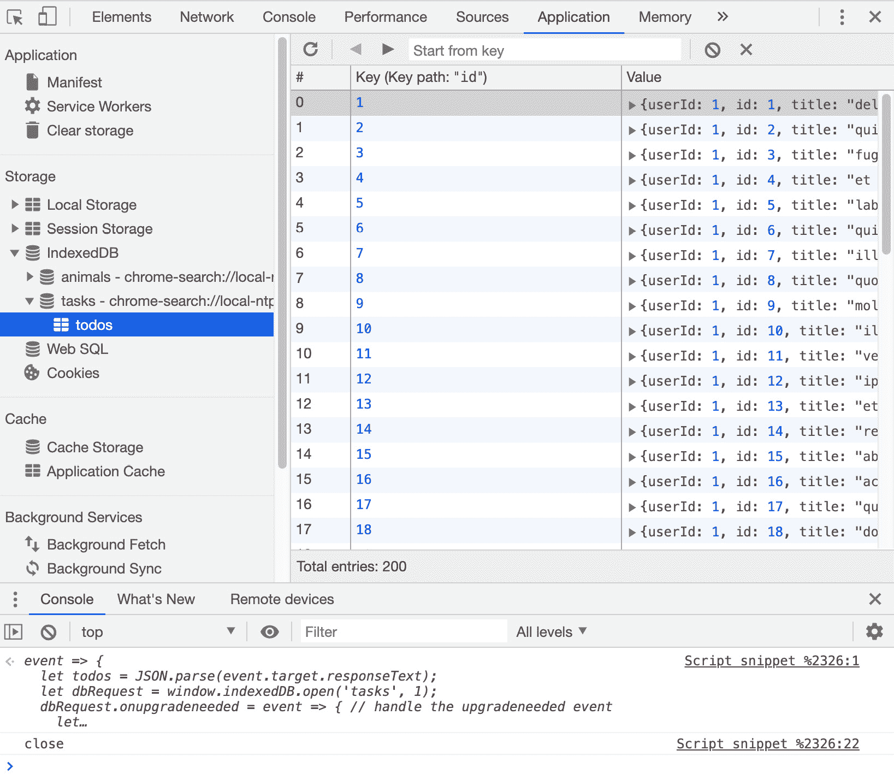

    图 8.13：添加数据后的 indexedDB

1.  在我们的数据安全地存储在数据库中后，我们将编写一个查询函数来获取所有未完成的`todo`项。首先，我们将实例化一个空数组来存储我们的未完成`todos`。然后，我们将使用 indexedDB 游标接口遍历记录。对于每条记录，我们将检查完成属性是否为`false`。如果是，我们将该记录推入数组。由于我们已经在数据库中有了我们的数据，最好注释掉最后一块代码，否则，我们将再次进行 HTTP 请求并保存所有`todos`的副本：

```js
exercise-8_06_1.js
1 let dbRequest = window.indexedDB.open('tasks', 1);
2 let outstandingTodos = [];
3 dbRequest.onsuccess = event => {
4   let db = event.target.result;
5   let trx = db.transaction('todos', 'readonly');
6   let store = trx.objectStore('todos');
7   let cursorReq = store.openCursor();
8   cursorReq.onsuccess = e => {
9     let cursor = e.target.result;
10     if (cursor) {
11       console.log(cursor.value)
12       if (!cursor.value.completed) outstandingTodos.push(cursor.value);
The full code is available at: https://packt.live/2qRT6Ek
```

这导致了以下输出：

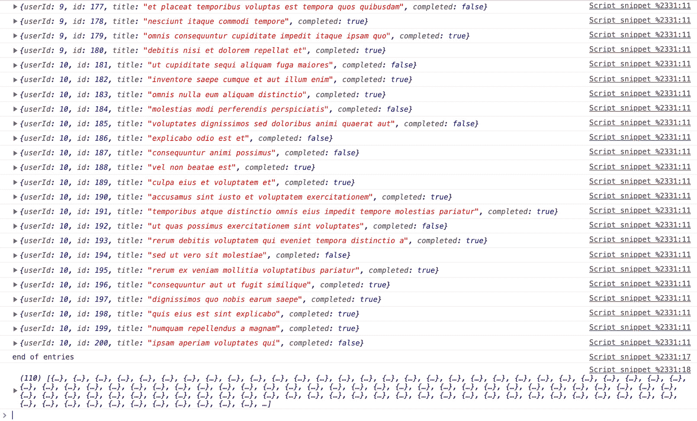


图 8.14：我们的查询函数的控制台输出

我们可以从前面的图中看到，完成属性是`false`，未完成的是`true`。在这个练习中，我们学习了如何从远程 API 获取一些数据，将其存储在`indexedDB`数据库中，然后编写我们自己的函数来查询数据库以获取特定子集的数据。

本节介绍了一个更复杂的 Web API。以下是 IndexedDB API 的核心原则的快速回顾：

+   IndexedDB 数据库包含数据库，其中包含一个或多个对象存储，这些对象存储包含实际的数据对象

+   （几乎）所有事情都是通过事件发生的，所以你经常使用事件处理器。

+   事务是业务发生的地方。事务仅适用于一个对象存储，可以是只读、读写或版本更改。

+   如果项目已经被该键索引，你可以通过其键名获取项目，或者你可以使用游标遍历一组记录。

现在，我们将查看一个浏览器 API，我们可以使用它来获取有关网站或应用程序性能的信息。这个 API 出人意料地被称为性能 API。

# 性能 API

当我们构建网站和 Web 应用程序时，能够衡量我们应用程序的性能对于确保良好的用户体验非常重要。我们在开发、测试阶段和在生产环境中这样做。随着我们的应用程序增长并添加新功能，确保我们正在进行的更改不会对性能产生负面影响同样重要。有几种方法可以衡量这一点，还有一些有用的工具可以帮助我们。其中一套工具是浏览器的**性能 API**和其他密切相关 API。

性能 API 允许我们以极高的精度计时事件：我们可以访问的时间测量以毫秒为单位表示，但准确到大约 5 微秒。使用这些 API，我们可以准确测量完成特定动作所需的时间，例如以下动作：

+   渲染我们页面第一个像素所需的时间

+   用户点击一个元素与下一个动作（例如，动画的开始或向服务器发送请求）之间的时间

+   各种页面资源加载所需的时间

+   信息从浏览器发送到服务器，然后获取回复所需的时间

该 API 还使我们能够访问在网站加载前浏览器收集的特定数据，例如以下内容：

+   导致页面加载的导航类型（从历史记录、导航事件或页面刷新）

+   DNS 响应 IP 地址所需的时间

+   建立 TCP 连接所需的时间

你还可以创建自定义测量来查看特定过程在应用程序中花费的时间。所有这些信息都可以用来创建一个网站的详细性能报告，帮助识别需要优化的应用程序区域，并跟踪你在对网站进行更改时的性能改进（或打击）。

假设你想知道你的页面加载需要多长时间。这是一个合理的问题，但在准确和有用地回答这个问题之前，你必须更具体地说明你的意思。首先，你需要问自己你实际上想要什么信息：从开发者的角度来看，这个问题可以解释为“我的 web 服务器发送所有请求的资源到浏览器，以及浏览器处理和渲染这些资源需要多长时间？”，但从用户的角度来看，这个问题更像是，“从我点击链接到页面完全加载需要多长时间？”。这两个问题都很重要，但用户的问题需要更多的信息来回答，而不仅仅是开发者的问题。因此，我们可以开始看到，我们需要分解所有发生的事件，以便能够回答这些问题，以及其他问题。这正是性能 API 发挥作用的地方：它为我们提供了许多我们可以使用的指标，包括在我们请求页面之前发生的过程。

首先，让我们分解一下当用户点击新域名网站链接时发生的一些关键步骤。实际上，涉及的步骤比这里显示的要多，但在这个例子中，真正没有必要剖析整个流程：

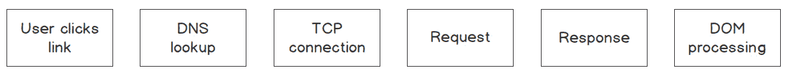


图 8.15：用户点击链接后的过程概述

让我们按以下步骤进行：

1.  当用户点击链接——比如一个 Google 搜索结果——浏览器向域名服务器（DNS）发送请求，并接收该域的 web 服务器 IP 地址。

1.  浏览器随后与 IP 地址处的服务器建立 TCP 连接。

1.  当这个连接过程完成后，浏览器请求页面数据。

1.  服务器响应这些数据，浏览器处理并显示页面给用户。这是一个非常高级、简化、概括的描述，当浏览器想要加载一个页面时会发生什么，并且假设没有出错。这里的要点是事情很多，并且有许多潜在的导航和页面加载被减慢的区域。使用性能 API 给我们提供了许多关键事件的计时。

打开浏览器到任意页面。在控制台，你可以查看该页面的性能数据。我们可以从浏览器中获取一个导航时间对象，它将给我们提供我们寻找的大部分信息。首先，我们将性能 API 的导航条目分配给一个变量：

```js
let navTiming = performance.getEntriesByType("navigation")[0]; // this returns an array, but we're only interested in one object.
```

`getEntriesByType` 方法返回浏览器存储的指定类型的所有性能计时条目。在这里，我们说我们想要所有导航类型的条目（只有一个条目，所以我们将得到一个包含一个对象的数组）。

在将返回数组中的 `0th` 对象的引用分配后，我们可以在控制台中通过输入变量的名称（即 `navTiming`）来查看该对象：

![Figure 8.16：Expanded navigation timing object]

![img/C14377_08_16.jpg]

图 8.16：展开的导航时间对象

展开导航条目对象，我们可以看到许多属性，我们可以使用这些属性来计算在导航和加载当前页面期间各种操作所花费的时间。让我们通过几个例子来了解一下，这样你就能抓住这个概念：

```js
let dnsLookupTime = navTiming.domainLookupEnd - navTiming.domainLookupStart;
```

这将给我们提供域名服务响应请求域的 IP 地址所需的总时间。浏览器通常会缓存特定域的 IP 地址，所以如果你之前访问过你正在测试的页面，这可能会得到零。让我们看看以下代码：

```js
let tcpConnectTime = navTiming.connectEnd - navTiming.connectStart
```

`connectStart` 和 `connectEnd` 属性是客户端与服务器建立 TCP 连接的时间和连接过程完成的时间。从其中一个减去另一个，我们得到总连接时间。让我们看看以下代码：

```js
navTiming.domComplete;
```

`domComplete` 属性是浏览器完成加载文档及其所有资源（如 CSS 和图片）的时间，而 `document.readyState` 属性被设置为 complete。这将回答我们用户的问题：“从点击链接的那一刻到页面完全加载需要多长时间？”。

如你所见，在这个导航时间条目中，你可以使用许多其他指标来计时导航和加载页面。但是，一旦我们的页面加载完成，用户开始与之交互，怎么办？显然，我们希望能够在网站使用期间测量其性能，性能 API 给我们提供了一些非常有用的方法来实现这一点。

我们可以使用性能 API 通过使用接口的`mark()`和`measure()`方法来测量我们网站或应用程序任何部分的性能。例如，假设你的应用程序涉及一些需要优化的 CPU 密集型处理，你可以使用性能标记来以高精度测量所需时间并测量不同优化方法的成功程度：

```js
function complicatedFunction() {
  let n = 0;
  for (let i = 0; i< 1e9;) {
    n = n + i++;
  }
  return n;
};
```

在这里，我们定义了一个执行一些任意计算的`for`循环的函数，我们可以在循环的开始和结束处使用`performance.mark()`方法，然后使用`performance.measure()`方法来测量这两个标记并返回结果：

```js
functioncomplicatedFunction() {
  let n = 0;
  performance.mark('compStart');
  for (let i = 0; i< 1e9;) {
    n = n + i++;
  }; 
  performance.mark('compEnd');
  console.log(n);
  performance.measure('compMeasure', 'compStart', 'compEnd');
  console.log(performance.getEntriesByName('compMeasure')[0].duration);
};
```

调用标记方法会创建一个带有提供名称的性能时间线条目（我们称之为`compStart`和`compEnd`）。然后我们可以使用`performance.measure()`来创建一个`performance.measure`条目，这将给我们提供开始和结束标记之间的精确时间。运行`complicatedFunction()`将给出以下输出：

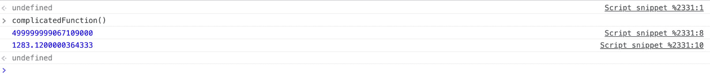

图 8.17：函数运行输出

## 练习 8.07：评估性能

假设我们想要向我们的应用程序添加一个新功能，该功能涉及与上一个示例中类似的 CPU 密集型过程，因此我们想要确保以尽可能高效的方式编写函数。我们可以使用性能 API 的`mark()`和`measure()`方法来找到运行特定代码段的确切时间，然后我们可以比较相同逻辑的两种不同实现。在这个练习中，我们将使用`mark()`方法标记我们想要比较的代码块的开始和结束点，并使用`measure()`方法来测量标记之间的确切时间。我们的输出将是时间差。

让我们拿上一个示例来比较 JavaScript 中不同循环函数的性能。让我们开始吧：

1.  这个第一个函数将测量`for`循环的性能。首先，声明一个函数并初始化一个变量，该变量将保存循环中使用的值：

    ```js
    function complicatedForLoop() {
      let n = 0;
    ```

1.  现在，我们将使用`performance.mark()`方法标记循环函数的开始，并给标记一个名为`forLoopStart`的名字：

    ```js
      performance.mark('forLoopStart');
    ```

1.  接下来，我们将运行`for`循环，它执行的计算与上一个示例中的相同：

    ```js
      for (let i = 0; i< 1e9;) {
        n = n + i++;
      }
      performance.mark('forLoopEnd');
      console.log(n);
      performance.measure('forLoopMeasure', 'forLoopStart', 'forLoopEnd');
      console.log(`for loop: ${performance.getEntriesByName('forLoopMeasure')[0].duration}`);
    };
    ```

1.  第二个函数将测量`while`循环的性能：

    ```js
    function complicatedWhileLoop() {
      let n = 0;
      let i = 0;
      performance.mark('whileLoopStart');
      while(i<1e9) {
        n = n + i++;
      }
      performance.mark('whileLoopEnd');
      console.log(n);
      performance.measure('whileLoopMeasure', 'whileLoopStart', 'whileLoopEnd');
      console.log(`while loop: ${performance.getEntriesByName('whileLoopMeasure')[0].duration}`)
    }
    ```

1.  现在，让我们运行这两个函数并比较性能：

    ```js
    complicatedForLoop();
    complicatedWhileLoop();
    ```

在这里，我们声明了两个函数，它们都产生相同的结果，但使用不同的 JavaScript 循环函数：一个`for`循环和一个`while`循环。我们在每个循环开始之前标记，并在循环结束时再次标记。然后我们测量标记，并将测量的持续时间记录到控制台。你得到了什么结果？

![图 8.18：对`for`循环和`while`循环的性能测试结果

图 8.18：for 循环和 while 循环的性能测试结果

您的结果可能会有很大差异，这取决于您运行的系统和 JavaScript 引擎，但您应该仍然能在两个循环语句之间看到明显的差异。本节深入探讨了相当高级的主题，可能不如绘制三角形那样令人兴奋。然而，应用程序的性能是需要牢记在心的，因为未能做到这一点可能会导致应用程序运行缓慢，人们会感到沮丧，并最终放弃使用。

# WebSocket API

通常，当浏览器在正常浏览过程中连接到服务器时，它使用 HTTP 或 HTTPS。就本主题而言，我们真正需要了解的 HTTP 是，每次浏览器想要从服务器发送或接收信息时，它都必须打开到该服务器的新连接，发出请求，然后关闭连接。这在大多数情况下是可以的，但它是一条单行道；服务器无法与浏览器建立连接。这意味着如果服务器收到一些新数据，它无法通知浏览器，而必须依赖于浏览器在某个时刻查询服务器并请求数据。很多时候，这是可以接受的，因为作为开发者，我们知道何时可以期待新数据可用，或者我们知道在应用程序中何时需要请求任何新数据。

当然，仅仅依赖开发者的敏锐度是不够的，因为在某些情况下，我们无法完全控制新数据何时以及以何种频率提供给服务器。这类情况的经典例子是实时聊天应用，例如 Facebook 的即时消息或微信。我们可能都熟悉这些应用的基本功能：两个人或更多人可以互相发送消息，并且消息会立即出现在接收者的设备上（除去网络延迟和处理时间）。

但这种功能是如何实现的呢？如果我们从 HTTP 的角度来考虑这个问题，就没有优雅的解决方案：客户端 A 想要通过服务器向客户端 B 发送消息。从客户端 A 发送消息到服务器没有问题——客户端可以打开一个 HTTP 连接，发送消息，服务器就会收到消息。但当服务器需要将这条消息转发给客户端 B 时，服务器无法在其端打开连接。在这种情况下，解决方案是所有已连接的客户端定期询问服务器是否有新消息，比如每 30 秒一次。这不是一个好的解决方案；这意味着会有很多不必要的连接打开和关闭，每个连接都携带相对大量的数据，以 HTTP 头部形式存在。此外，如果客户端在第一秒发送消息，那么接收客户端至少需要 29 秒才能知道这条消息——如果这是一条重要消息怎么办？

**WebSocket**是浏览器和客户端之间通信的另一种方式，允许双向通信；也就是说，服务器可以在任何时候向客户端发送消息。从高层次来看，连接过程相当简单：客户端通过 HTTP 连接到服务器，并包含一个包含 Upgrade 头部的 WebSocket 握手请求（这基本上告诉服务器客户端想要将协议升级到 WebSocket），服务器发送握手响应，然后将 HTTP 连接升级为 WebSocket 连接。然后就开始了。

这个 WebSocket 连接会无限期地保持活跃，服务器会保持一个可以随时与之通信的已连接客户端列表。如果连接中断，则客户端可以尝试重新打开连接。只要连接保持活跃，任何一方都可以在任何时候向另一方发送消息，如果需要，另一方也可以回复这些消息。这是一个开放的、双向的通信通道，由我们开发者决定如何使用它。

WebSocket 消息可以包含多种类型的数据，包括**字符串**、**ArrayBuffers**和**Blobs**。为了发送和接收 JavaScript 对象，我们可以在发送之前使用 JSON 对象将它们转换为字符串，然后在接收端解析它们。

设置 WebSocket 服务器相当复杂，本章节中包含太多细节。然而，我们可以轻松设置 WebSocket 客户端并连接到多个在线 WebSocket 测试服务器之一。

有几个 WebSocket 测试服务器我们可以使用。在这个例子中，我们将使用位于`wss://echo.websocket.org`的服务器。如果它不起作用，请随意寻找另一个在线服务器。需要注意的是，客户端和服务器必须在同一 HTTP 协议上启动，所以如果您在控制台打开的页面是 HTTPS，那么 WebSocket 服务器必须在 WSS 协议上（而不是 WS）。

打开您浏览器中的任意页面，打开开发者工具，然后打开控制台。

WebSocket 连接是事件驱动的，因此当我们创建连接时，我们必须为要处理的事件分配函数。

首先，让我们使用浏览器的 WebSocket 构造函数创建一个新的 WebSocket 连接。它需要一个服务器地址作为参数：

```js
let socket = new WebSocket('wss://echo.websocket.org');
```

如果您运行此代码，然后在控制台中访问 socket 对象，您将看到我们创建的新连接对象：

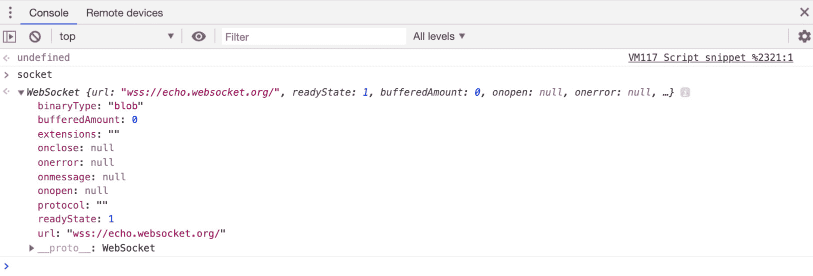


图 8.19：WebSocket 连接对象

在这里，我们可以看到我们连接到的服务器 URL，以及`onmessage`属性的事件监听器：

```js
socket.onmessage = event => console.log(event);
```

现在，我们已准备好向 WebSocket 服务器发送消息：

```js
socket.send("Hello websocket server");
```

我选择的 - 以及当然任何其他 WebSocket 测试服务器 - 将简单地输出你发送给它的任何消息作为响应。由于我们有一个附加到消息事件的处理器，该处理器将事件记录到控制台，我们应该在发送消息后不久在我们的控制台中看到这个事件对象：

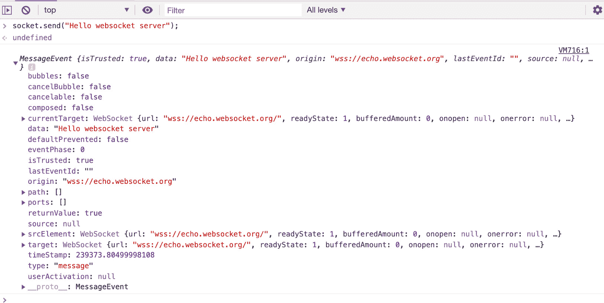

图 8.20：WebSocket 服务器的响应

我们现在有一个工作的 WebSocket 连接。如果服务器被编程为这样做，它可以在任何时候发送消息，只要连接保持打开。由于 WebSockets 对许多不同类型的应用程序都很有用，它们中没有内置特定的功能，尽管有一些非常常见的用例。我们需要开发系统来处理不同类型的消息，例如，发送一个带有“加入聊天组”操作的消息与一个常规的“向用户发送消息”操作。

## 练习 8.08：使用 WebSocket 创建聊天室

让我们创建一个小型应用，以便更充分地使用这个 WebSocket 服务器。我们将创建一个包含两个聊天室的应用程序：一个是群聊，另一个是只有一个用户的直接消息聊天室。由于 WebSocket 服务器功能有限，因为它所做的只是将接收到的消息发送回客户端。由于我们只有一个客户端，服务器将只响应我们发送的消息，所以这将是一个有点孤独的聊天。

对于这个应用，我们需要一个包含两个聊天消息列表的 HTML 页面：一个用于群聊，另一个用于直接消息聊天。我们还需要为这两个聊天线程添加一个输入框，以便我们可以输入我们的消息，以及沿途的一些其他元素。我们将为大多数元素分配相关的 ID，这样我们就可以在 JavaScript 中轻松获取它们。让我们开始吧：

1.  让我们从创建一个 HTML 页面开始，添加我们的 HTML 开头标签，在 `DevTools` 控制台中添加一个引用 JavaScript 文件的 head 标签，并添加我们的 body 开头标签：

    ```js
    <!-- index.html -->
    <!DOCTYPE html>
    <html>
      <head>
        <script src='scripts.js'></script>
      </head>
      <body>
    ```

1.  现在，在主体内部，我们将添加一个 `<h1>` 元素作为我们页面的标题：

    ```js
        <h1>The Echo Chamber</h1>
    ```

1.  让我们添加一个 `<h4>` 元素，这将让我们知道套接字是打开还是关闭（默认是关闭）：

    ```js
        <h4 id='socket-status'>Socket is closed</h4>
    ```

1.  让我们添加一个 `<h6>` 元素作为我们的群聊消息列表标题：

    ```js
        <h6>Group Chat</h6>
    ```

1.  让我们添加一个 `<ul>` 元素，我们将向其中追加新的群组消息：

    ```js
        <ul id='group-list'></ul>
    ```

1.  让我们在群聊中添加一个 `<input>` 元素，我们将在这里输入消息：

    ```js
        <input type="text" id='group-input'>
    ```

1.  让我们添加另一个 `<h6>` 元素用于私人聊天室：

    ```js
        <h6>Private Chat</h6>
    ```

1.  让我们添加一个 `<ul>` 元素用于私人聊天消息列表：

    ```js
        <ul id='dm-list'></ul>
    ```

1.  以下是我们编写私人消息所需的输入：

    ```js
        <input type="text" id='dm-input'>
    ```

1.  最后，我们需要添加我们的关闭 `<body>` 和 `<html>` 标签：

    ```js
      </body>
    </html>
    ```

    这将产生以下输出：

    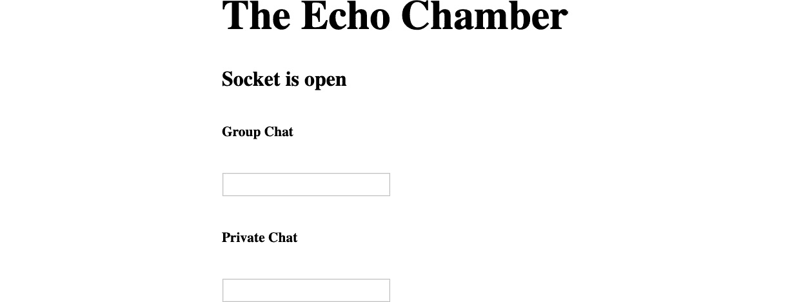

    图 8.21：我们新的聊天应用的 HTML

    现在让我们更详细地了解一下 JavaScript 的功能。我们需要获取一些 HTML 元素，以便在 JavaScript 中处理它们。我们需要打开一个新的 WebSocket 连接到我们的服务器，即`wss://echo.websocket.org`。我们希望在套接字打开或关闭时通知用户，因此我们将添加`onopen`和`onclose`套接字事件处理程序，并相应地设置我们的`<h4>`元素的文本。我们将监听用户在任一输入框中按下*Enter*键时的情况，然后向套接字服务器发送消息。服务器将回显我们的消息，因此我们将监听传入的消息，解码它们，并将它们附加到正确的消息列表的末尾。

    这是对我们的 JavaScript 将执行的操作的高级概述，让我们逐步通过代码。

1.  我们将使用一个监听`DOMContentLoaded`事件的监听器来开始 JavaScript 文件，并将我们的代码放在事件监听器的回调函数中：

    ```js
    // scripts.js
    // wait for page load
    document.addEventListener('DOMContentLoaded', () => { 
    ```

1.  接下来，我们将创建一个新的套接字连接到我们选择的服务器：

    ```js
      let socket = new WebSocket("wss://echo.websocket.org"); // create new  socket connection
    ```

1.  让我们获取我们需要的各种 HTML 元素的引用：

    ```js
      let dmInput = document.getElementById('dm-id'); // get the DM text input
      let groupInput = document.getElementById('group-input'); // get the group text input
      let dmList = document.getElementById('dm-list'); // get the dm messages list
      let groupList = document.getElementById('group-list'); // get the group  messages list
    ```

1.  现在，我们将设置套接字的`onopen`事件处理函数，该函数将`socket-status`元素的内部文本设置为 Socket is open：

    ```js
      socket.onopen = event => {
        document.getElementById('socket-status').innerText = "Socket is open"; 
        // set the status on open
      };
    ```

1.  我们还将为套接字的`onclose`事件设置一个函数，该函数将状态重置为 Socket is closed：

    ```js
      socket.onclose = event => {
        document.getElementById('socket-status').innerText = "Socket is closed";
        // set the status on close
      };
    ```

1.  接下来，我们将设置套接字的`onmessage`函数。此事件在从 WebSocket 服务器接收到消息时触发：

    ```js
      // prepare to receive socket messages
      socket.onmessage = event => { 
    ```

1.  我们将使用 JSON 对象的`parse()`方法将传入的数据从字符串解析回 JavaScript 对象，并将结果分配给一个变量：

    ```js
        // parse the data
        let messageData = JSON.parse(event.data); 
    ```

1.  我们将创建一个新的`<li>`元素，并将其分配给一个名为`newMessage`的变量：

    ```js
        // create a new HTML <li> element
        let newMessage = document.createElement('li'); 
    ```

1.  接下来，我们将`newMessage` `<li>`的内部文本值设置为消息数据的消息属性值：

    ```js
        // set the <li> element's innerText to the message text
        newMessage.innerText = messageData.message; 
    ```

1.  现在，我们将检查消息是否是针对群聊的，如果是，我们将将其追加到`groupList`中：

    ```js
        // if it's a group message
        if (messageData.action === 'group') { 
          // append to the group list
          groupList.append(newMessage); 
    ```

1.  如果它不是针对群聊的，那么我们将将其追加到 DM 列表中，然后关闭此事件处理函数：

    ```js
        } else {
          // append to the dm list
          dmList.append(newMessage); 
        };
      };
    ```

1.  接下来，我们将迭代 HTML 的两个输入元素：

    ```js
      // For each input element
      Array.from(document.getElementsByTagName('input')).forEach(input => { 
    ```

1.  我们将在输入元素上添加一个`keydown`事件监听器，并将处理函数分配给该事件：

    ```js
        // add a keydown event listener
        input.addEventListener('keydown', event => { 
    ```

1.  如果`keydown`事件是由具有`messageData`的键触发的：

    ```js
          // if it's keyCode 13 (the enter key)
          if (event.keyCode === 13) {
            // declare the message data object
            let messageData = {
              message: event.target.value,
            };
    ```

1.  现在，我们将检查目标输入是否是具有`group-input` ID 的那个，如果是的话，我们将在`messageData`变量上设置一个值为 group 的动作属性：

    ```js
            // check the message type by looking at the input element's ID
            if (event.target.id === 'group-input') {
              messageData.action = 'group';
    ```

1.  否则，我们将分配相同的属性，但值为 dm：

    ```js
            } else {
              messageData.action = 'dm';
            };
    ```

1.  然后，我们将使用`JSON.stringify()`方法将`messageData`对象转换为字符串，并使用我们最初创建的套接字连接对象的`send()`方法将其发送到 WebSocket 服务器：

    ```js
            // stringify the message and send it through the socket connection
            socket.send(JSON.stringify(messageData));
    ```

1.  最后，我们将清除目标输入框并关闭函数：

    ```js
            // clear the input element
            event.target.value = ''; 
          };
        });
      });
    });
    ```

在浏览器中打开 HTML 文件，如果你在任一输入框中输入消息，你应该在聊天列表中看到它被回显：

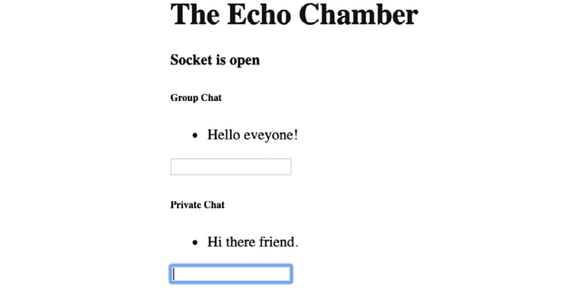

图 8.22：Echo Chamber 聊天应用的消息

这是对我们如何向 WebSocket API 添加自己的功能的一个快速了解。在任何需要实时数据在浏览器中显示的时候，WebSockets 都很有用，比如股票市场价格的更新，或者当与服务器保持持续开放连接有意义时，例如在聊天应用中。

## 活动 8.03：音频可视化

我们将把本章一开始就探讨的一些接口结合起来，即画布 API 和 Web Audio API。这个活动的目的是创建一个显示图形的页面，并且这个图形将根据我们在 *音频 API* 部分查看的 Audio `API 的 getFloatTimeDomainData` 方法进行动画处理。音频 API 的声音应由用户控制，图形应以某种方式表示音频（例如，动画可以根据声音的音量或频率变化）。

这个活动规格相当广泛，但你可以为两个 API 构建练习来提出一些想法，或者你可以利用本章前面 *Web Audio API* 部分的 *音频可视化* 子部分的中的信息。在查看解决方案之前，看看你能想出什么。

活动的高级步骤如下：

1.  创建一个简单的 HTML 文件，其中包含一个指向 JavaScript 文件的链接。

1.  在文档上添加一个事件监听器，监听点击事件。

1.  设置一个 HTML 画布元素和画布渲染上下文。

1.  设置一个包含一个或多个振荡器或其他音频源的音频上下文。

1.  将音频分析仪连接到音频上下文。

1.  开始音频源。

1.  在一个连续的循环中，使用音频 API 的 `getFloatTimeDomainData()` 方法的输出在画布上下文中绘制，以修改循环每次迭代中图形的一个或多个参数。

预期的输出应如下所示：


图 8.23：音频可视化输出图像的一帧

注意

这个活动的解决方案可以在第 734 页找到。

# 摘要

在本章中，我们探讨了几个最有用和有趣的浏览器 API，这些 API 为我们打开了广泛的功能，我们可以在 JavaScript 应用程序中使用。我们了解到，尽管这些 API 通常通过 JavaScript 访问，但它们并不是 JavaScript 引擎编程的 ECMAScript 规范的一部分，也不是 JavaScript 的核心功能的一部分。尽管我们在本章中涵盖了相当多的信息，但还有许多其他 API 可供我们使用。当与浏览器 API 一起工作时，检查特定功能在浏览器中的支持程度非常重要，因为一些 API 是实验性的或非标准的，而其他 API 则已过时或废弃。通常，某些浏览器将完全支持一个功能，其他浏览器将支持同一接口的某些方面，而其他浏览器则完全不支持。这有点像雷区，但请利用[caniuse.com](http://caniuse.com)，这是你在本书早期看到的，来引导你自己和你的项目走向正确的方向。

要查看可用的 Web API 列表，请查看 Mozilla 开发者网络页面：[`developer.mozilla.org/en-US/docs/Web/API`](https://developer.mozilla.org/en-US/docs/Web/API)。

到目前为止，你主要学习的是基于浏览器的传统 JavaScript。然而，JavaScript 还可以在浏览器之外的其他许多环境中运行。在下一章中，我们将探讨这些其他环境，特别是**Node.js**，它通常用于服务器端 JavaScript 执行。
