# 第十一章：11. 创建清洁且可维护的代码

概述

到本章结束时，你将能够识别和实现基本正则表达式（regex）；使用最佳实践来生成清洁且可维护的代码；利用代码质量工具，如 `ESLint`、`JSLint` 和 `JSHint`，并实施代码重构策略。

# 简介

在本章中，你将学习到可用于模式匹配和清洁编码的技术，这些技术在许多方面都有应用，甚至可能有助于你的测试。

**正则表达式**（简称 **regex**）是一种简洁而强大的方法，用于搜索和匹配模式。它们一开始可能看起来很陌生且令人畏惧，但一旦你掌握了基础知识，它们就会迅速变得不那么困难，因此你可能会认识到它们的有用性。正则表达式在许多涉及文本和数据的语言和工具中都很常见。因此，花时间学习它们是值得的。用正则表达式表达的模式通常比使用传统技术解析和匹配相同模式的等效代码要短得多。

利用正则表达式还可以导致清洁且可维护的编码实践。为了使编程项目成功，代码必须易于他人理解，并且必须是有序的、专注的和灵活的。本章介绍了编码技术和最佳实践，从为你的变量和方法选择最清晰、最易懂的名称开始。

# 什么是正则表达式？

**正则表达式**是一个字符序列，它形成一个用于搜索的模式。模式中的每个字符要么具有特殊含义（元字符），要么是为了匹配字符本身（字面量）。这一点可以通过以下示例最好地理解。

为了展示传统编码与正则表达式技术进行模式匹配之间的差异，考虑以下用于以传统方式匹配电话号码格式模式的代码。然后我们将使用正则表达式重写匹配逻辑以进行比较。为了使事情简单，我们只将寻找符合以下模式的电话号码，这对于电话号码来说很常见，尤其是在美国：

```js
	[2-9]XX-XXX-XXXX
```

在这里，`X` 可以是 `0-9` 之间的任何数字，第一个数字不能是零或一（只允许 `2-9`）。例如，`234-567-8901` 是这种格式下的有效电话号码。

你可以使用以下代码使用传统方法进行匹配：

```js
conventional.html
1 <html>
2 <head>
3   <meta charset="utf-8"/>
4 </head>
5 <body>
6 Enter a phone number in format XXX-XXX-XXXX:
7 <input type="text" id="phone">
8 <div id="msg"></div>
9 <script>
10 var phone = document.getElementById("phone");
11 phone.addEventListener("input", validatePhoneNumber);
12 function isDigit(character) {
13     return character >= '0' && character <= '9';
14 }
The full code is available at: https://packt.live/2CFKQtK
```

以下截图显示了在输入无效格式的数字时，前面代码的输出：

![图 11.1：输入数字格式不正确时的示例输出

![图片 C14377_11_01.jpg]

图 11.1：输入数字格式不正确时的示例输出

当输入有效格式的数字时，这是输出结果：

![图 11.2：正确输入数字时的示例输出

![图片 C14377_11_02.jpg]

图 11.2：输入数字格式正确时的示例输出

让我们关注 JavaScript 代码中的重要部分：

```js
var phone = document.getElementById("phone");
phone.addEventListener("input", validatePhoneNumber);
```

这些行设置了电话号码验证，该验证将在用户输入值时进行。它找到输入文本的 DOM 元素并为`input`事件添加事件监听器。此事件发生在`<input>`的值改变时，例如按键或粘贴值。当触发时，调用`validatePhoneNumber()`函数。

注意检查一个字符是否为数字的代码：

```js
function isDigit(character) {
    return character >= '0' && character <= '9';
}
```

这个函数有一个参数，它必须是一个字符。可能不太直观的是，JavaScript 允许在字符类型上使用大于或小于运算符。这允许我们检查字符是否在`0`和`9`字符之间的任何数字。

下面的代码是`validatePhoneNumber()`方法的代码：

```js
    var phoneNum = phone.value.trim();
    // check if phone number matches format [2-9]XX-XXX-XXXX
    var valid =
        phoneNum.length == 12 &&
        phoneNum.charAt(0) != '0' &&
        isDigit(phoneNum.charAt(0)) &&
        isDigit(phoneNum.charAt(1)) &&
        isDigit(phoneNum.charAt(2)) &&
        phoneNum.charAt(3) == '-' &&
```

这段代码执行以下操作：

+   检查电话号码的预期长度，以确保没有多余的字符，例如额外的数字、字母字符或符号。请注意，由于我们在最初读取电话号码值时调用了`trim()`函数，因此这个检查对首尾空白字符是宽容的。

+   检查第一个字符不是`0`。

+   检查前三个字符是否为数字（索引`0-2`）。

    注意

    我们可以不必多次调用`isDigit()`函数，而是可以向函数添加参数，以便在一次调用中检查多个字符。然而，为了这个练习的目的，我们选择保持代码更简单、更容易理解。

+   检查随后的`-`字符。

验证的其余部分重复，对于其余字符也是类似的。

最后，验证信息被形成并设置在`<div>`中：

```js
    var validMsg = "phone number entered is " +
        (valid ? "valid." : "INVALID!!!");
    document.getElementById("msg").innerHTML = validMsg;
```

我们现在将比较使用正则表达式的等效实现。我们将在下一节更系统、更深入地描述正则表达式，但就目前而言，我们将看看如何使用正则表达式技术进行编码，即使这可能对你来说现在还没有太多意义。我们将为之前提供的电话号码验证函数编写一个使用正则表达式的替代方案。所以，如果你现在还没有完全理解所有概念，不要担心，因为它们将在稍后详细解释。

考虑前面的代码，这是使用传统方法进行模式匹配的代码。让我们修改它，使其使用正则表达式。

要做到这一点，找到`validatePhoneNumber()`函数和`valid`变量的声明。然后，删除从该注释之上的整个表达式直到分号（`;`）字符。用以下内容替换你删除的区域：

```js
// check if phone number matches format [2-9]XX-XXX-XXXX
var valid = phoneNum.match(//);
```

到目前为止，你只在两个正斜杠之间的区域有一个正则表达式的框架。

在第一个正斜杠之后，添加一个`^`字符（称为撇号）。你的代码现在应该看起来像这样：

```js
var valid = phoneNum.match(/^/);
```

`^`符号是一个**锚点**，表示匹配应从字符串的开始处开始。

现在，添加字符`[2-9]`，使得代码现在看起来像这样：

```js
var valid = phoneNum.match(/^[2-9]/);
```

`[2-9]`字符指定了`2`和`9`。

到现在为止，你应该能够看到你如何逐步添加更多字符。以类似的方式，逐个添加剩余的字符，如下表左侧所示：

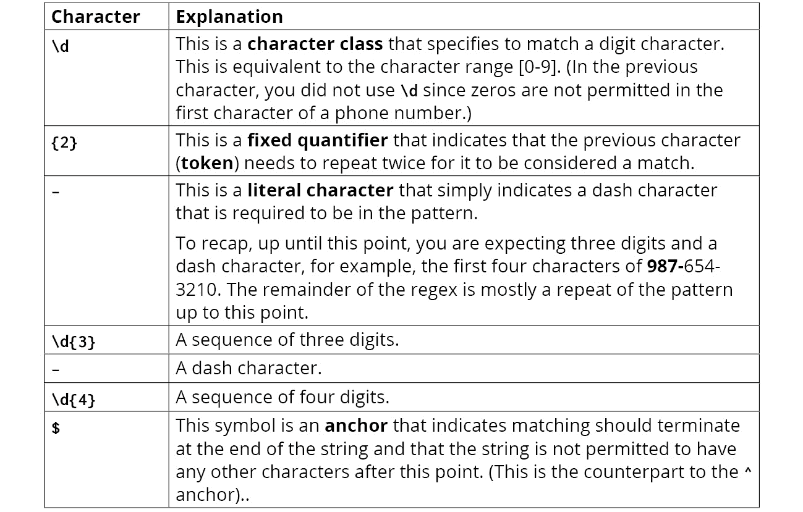

图 11.3：字符表

完整的代码现在应该看起来像这样：

```js
    // check if phone number matches format [2-9]XX-XXX-XXXX
    var valid = phoneNum.match(/^[2-9]\d{2}-\d{3}-\d{4}$/);
```

在这里，你已经看到了正则表达式的强大功能，以及所有这些都可以用一行代码表达。以下图中展示了正则表达式的不同概念：

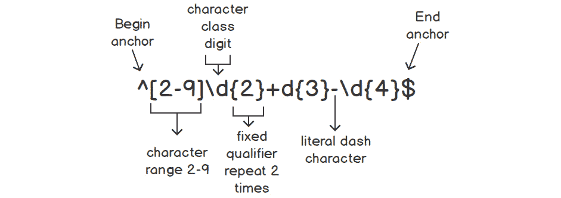

图 11.4：展示正则表达式中的不同概念

# 正则表达式详解

在接下来的章节中，以下样本短语被用来进行说明：

"The ships were loaded with all these belongings of the mother"

这个短语将被用来演示各种正则表达式概念，包括文本字符、单词边界、字符类等。

## 文本字符

最简单的正则表达式之一是`the`。这表示一个模式，如果`t`字符紧跟着`h`字符，最后是一个`e`字符，则匹配。这个表达式在样本短语中有四个匹配项：开头的`the`，倒数第二个单词，`the`，`these`单词中的`the`，以及作为单词`mother`一部分的`the`序列。

## 特殊字符、锚点和转义

如果一个正则表达式只有文本字符，它的用途将是有限的。在大多数情况下，你不想只匹配文本字符；因此，正则表达式有一系列具有特殊意义的字符。这些也被称为元字符。其中两个特殊字符是之前看到的`^`和`$` **锚点**，分别表示字符串的开始和结束。

因此，如果你将正则表达式更改为`^the`，那么现在短语开头的`the`将是唯一匹配的，因为这是短语中唯一一个位于字符串开头的`the`实例。锚点在需要避免匹配非预期匹配内容的情况下通常很重要。

以下是在正则表达式中具有特殊意义的最常见的字符：

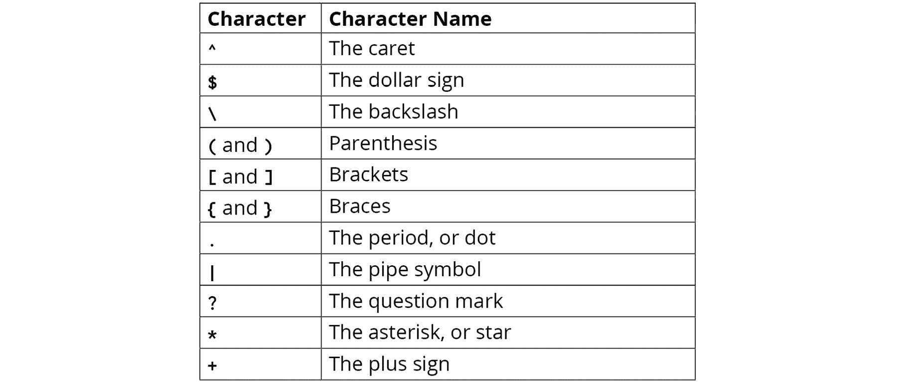

图 11.5：特殊字符

注意

如果你需要在你的正则表达式中使用这些字符作为文本字符，在大多数情况下，字符将需要被转义。你通过在字符前放置反斜杠`\`来实现这一点。

这里有两个例子：

+   如果你需要将美元符号作为模式的一部分进行匹配，你会使用`\$`。

+   一些不太明显的转义包括反斜杠字符本身（例如，你只需要使用两个连续的反斜杠，例如`\\`），以及点，其中`\.`是正确的转义序列。

## 单词边界

另一种类型的锚点是 `\b`（一个反斜杠后跟一个 `b`）。单词边界被定义为以下两种情况之一：

+   字符串的开始，后面跟着一个单词字符

+   空白字符和单词字符之间的字符，或者单词字符后面跟着空白字符或字符串的末尾

注意，单词字符被定义为以下内容。

+   如果将先前的正则表达式更改为 `\bthe`，样本短语中只有三个匹配项：之前的四个匹配项减去 `mother` 中的 `the`。 (模式的初始 `\b` 是特殊字符，其余的是字面字符。)

+   如果将正则表达式更改为 `\bthe\b`，只有两个独立的 `the` 单词会匹配，而不是 `these` 或 `mother` 中的那些。这是指定搜索整个单词的一种方法，但给定单词中没有其他前导或尾随字符。

## 简写字符类和单词字符

有多个 `\d` 序列，表示任何数字 `[0-9]`。

另一个是 `\w`，定义为 `[A-Za-z0-9_]`。 (字符类和范围将在下一节中更详细地定义。现在，这被读作大写字母 `A-Z` 的范围内的字符，小写字母 `a-z` 的范围内的字符，数字 `0-9` 的范围内的字符，或者下划线 `_` 字符。) 这里有一些例子：

+   如果在先前的示例短语上使用 `the\w` 正则表达式，只有单词 `these` 和 `mother` 中的 `the` 序列会匹配，因为其他两个 `the` 单词后面没有单词字符。

+   如果使用 `\wthe\w` 正则表达式，只有单词 `mother` 中的 `the` 序列会匹配，因为它是字符串中唯一一个 `the` 序列既被单词字符前缀又后缀的地方。这是指定如何搜索仅包含在单词中的字符的一种方法。

+   结合单词边界和单词字符简写，如果使用 `\bthe\w` 正则表达式，只有单词 `these` 中的 `the` 序列会匹配，因为它是字符串中唯一一个 `the` 序列从单词边界开始并且后面跟着一个单词字符的地方。

另一个常见的简写字符类是 `\s`，它是空白字符的简写，包括空格字符、制表符和换行符。

## 反向类

每个简写字符类都有一个相反的类，通过将字母转换为大写来表示：

+   `\B`：单词边界的相反，例如在单词中间

+   `\D`：表示任何非数字字符

+   `\W`：任何不在 `[A-Za-z0-9_]` 中的字符

+   `\S`：任何非空白字符

例如，作为上一节第一个示例的反面，如果使用 `the\W` 正则表达式在先前的示例短语上，只有两个 `the` 字符会匹配，包括尾随的空格字符。单词 `these` 和 `mother` 会匹配，因为在两种情况下 `the` 后面都有一个单词字符。

## 点字符

点号，`.`，匹配任何字符（除了换行符）。例如，`.h.` 正则表达式会寻找任何 `h` 并将其与它之前和之后的字符匹配，只要它不是换行符。以下高亮显示的字符是应用正则表达式到早期示例短语后的结果：

"The ships were loaded with all these belongings of the mother"

特别注意单词 `with` 的最后两个字母的第三次匹配，以及随后的空格字符。很容易忘记点号匹配任何字符，包括空格。如果你打算在模式中允许空格，这可能会是一个常见的错误。

## 集合

包含在方括号 `[...]` 中的一个或多个字符或字符类表示我们应该匹配给定的任何字符。这被称为**集合**。以下有两个例子：

+   `[AEIOUaeiou]` 正则表达式可以用来匹配元音字符。

+   当将集合与两个字面字符结合时，`[oi]ng` 正则表达式会匹配单词 `belongings`（来自示例短语）中的 `ong` 和 `ing`。

## 范围

一个 `[2-9]`，表示在 `2` 和 `9` 之间的字符。类似于集合，范围是在方括号 `[...]` 中指定的，并使用破折号字符来分隔表示范围的字符。

你之前看到的另一个范围是 `[A-Za-z0-9_]`，它指定了单词字符。这也显示了如何在单个表达式中指示多个范围，甚至是一个不属于范围的字符，因为这允许 `A-Z`、`a-z` 和 `0-9` 的字符，以及下划线字符。

## 排除集合和范围

正则集合和范围的相反，排除范围表示“匹配除以下字符之外的字符”。排除集合或范围是通过在表达式中第一个方括号后立即放置一个撇号字符 `^` 来表示的。

例如，`[^AEIOUaeiou]` 会匹配任何不是元音的字符。

破折号也可以包含在排除中，以表示要排除的字符范围。例如，`[⁰-9]` 会指示匹配任何不是数字的字符（类似于 `\d`）。

## 量词

**量词**指定了匹配给定字符、字符类或标记所需的数量。

最直接的可能是一个 `{4}`。例如，`a{4}` 正则表达式要求字母 `a` 重复四次，而 `\d{3}` 要求连续三个数字。

它的近亲，范围量词，可以使用类似于 `{min,max}` 的格式进行指定。这个量词会匹配在指定的最小和最大出现次数之间的任何内容。例如，`a{2,5}` 正则表达式会匹配 `aa`、`aaa`、`aaaa` 或 `aaaaa` 中的任何一个。

如果省略了逗号后的数字，则特殊类型的范围允许无界上限。例如，`a{3,}` 会匹配至少出现三次的连续 `a` 字符的任何数量。

## 简写量词

有三个量词使用得非常频繁，以至于为它们指定了特殊的快捷字符来表示它们。它们如下所示：


](img/C14377_11_06.jpg)

图 11.6：量词

将这些简写量词与我们之前介绍的概念（文字、字符类、集合、范围等）结合起来，以下是一些示例正则表达式以及它们会匹配的内容：

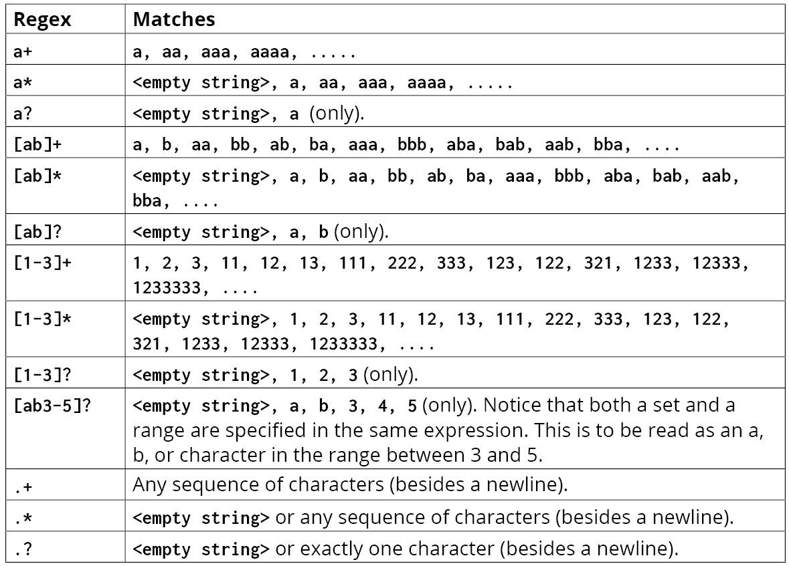

](img/C14377_11_07.jpg)

图 11.7：正则表达式及其匹配项

## 选择

假设您希望您的模式允许两个（或更多）单词中的任意一个。您可以通过使用管道 `|` 字符分隔单词来实现这一点，这相当于 `OR` 操作符，表示 `expression1 OR expression2`。

在大多数情况下，将备选表达式括在括号中也是一个好主意，例如 `(expression1|expression2)`，以将其与模式的其他部分分开。例如，要扫描一个单词 `the` 后跟一个或多个空白字符的情况，这将匹配 `mother` 或 `father`，正则表达式如下：

```js
    the\s+(mother|father)
```

## 许多其他正则表达式概念

本章仅对基本正则表达式概念进行了简要概述，并提供了良好的背景知识，以便您可以开始使用它们。鼓励您使用许多可用资源探索更多高级功能。以下是一些概念：

+   贪婪量词与懒惰量词：[`packt.live/33vxqvQ`](https://packt.live/33vxqvQ)

+   捕获组：[`packt.live/34Iq0G0`](https://packt.live/34Iq0G0)

+   回溯：[`packt.live/2NqrDCe`](https://packt.live/2NqrDCe)

+   预查和后查：[`packt.live/2NrkMbR`](https://packt.live/2NrkMbR)

+   粘性标志：[`packt.live/32q86Gw`](https://packt.live/32q86Gw)

+   正则表达式引擎实际工作原理的内部细节：[`packt.live/2oXQUKE`](https://packt.live/2oXQUKE)

## 模式规范和标志

到目前为止，我们已经涵盖了构成正则表达式模式的元素，但现在，我们将介绍这些模式如何在 JavaScript 代码中传达。最常见的方法是将模式括在成对的斜杠字符中，例如 `/pattern/`。也可以在第二个斜杠之后添加标志，但这不是必需的。

标志可以改变匹配和搜索的行为。最常见的标志如下：

+   `g`：如果指定，将返回所有匹配项（如果没有指定，默认情况下将返回第一个匹配项）。

+   `i`：使匹配不区分大小写；大写字母和小写字母之间没有区别。

其他包括 `m`（多行搜索）、`s`（点 `.` 匹配换行符）、`u`（Unicode 支持）和 `y`（粘性模式）。

## 使用 String.match() 查找匹配项

JavaScript `String` 类有几个内置方法，可以接受正则表达式参数。本节概述了其中一些。

您最常用的方法是 `String.match()`。此方法的行为不同，其返回值取决于是否包含 `g` 标志：

+   如果没有 `g` 标志：找到第一个匹配项后停止搜索。结果是包含匹配项作为数组元素的数组，额外的属性 `index` 指示匹配项找到的位置，以及一些额外的属性。（注意，如果正则表达式包含分组，它还有其他功能，但分组在本章中未涉及）

+   如果有 `g` 标志：搜索所有可能的匹配项，并返回找到的匹配项数组。返回值中没有其他属性。

## 练习 11.01：g 标志的影响

以下代码说明了是否存在 `g` 标志的差异。它匹配以字母 `t` 开头的单词。（`i` 标志也用于演示以使匹配不区分大小写。）让我们开始吧：

1.  在 Google Chrome 浏览器中，进入 `开发者工具`（菜单（屏幕右上角的三个点），`更多工具` | `开发者工具`，或者直接按 `F12` 键）。

1.  将以下内容输入控制台以设置测试字符串：

    ```js
        const str = "Here's the food for Tommy today";
        let match;
    ```

1.  `g` 标志不存在。输入以下内容：

    ```js
        let match = str.match(/\bt\w+/i);
    ```

    在接下来的步骤中，以 `>` 开头的代码片段的行表示你应该输入的内容。以 `<-` 开头的行是你预期的输出。

1.  让我们看看匹配了什么。为此，请输入以下内容：

    ```js
        > match[0]
       <- "the"
    ```

1.  检查匹配发生的字符索引：

    ```js
        > match.index
       <- 7
    ```

1.  由于没有 `g`，我们预期不会有更多的匹配项。为了验证这一点，请使用以下代码：

    ```js
        > match[1]
       <- undefined
    ```

    第一个表达式的匹配项将显示如下：

    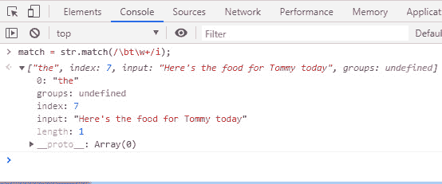

    图 11.8：第一个匹配表达式的完整输出

1.  `g` 标志存在。输入以下内容以重新分配匹配变量以包含 `g`（和 `i`）：

    ```js
        match = str.match(/\bt\w+/gi);
    ```

1.  按顺序输入剩余的行，检查每行的预期输出：

    ```js
        > match[0]
       <- "the"
        > match[1]
       <- "Tommy"
        > match[2]
       <- "today"
        > match[3]
       <- undefined
    ```

    带有 `g` 标志的表达式匹配将显示如下：

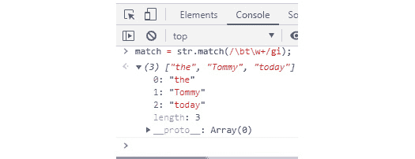

图 11.9：带有 g 标志的匹配表达式的完整输出

在这个练习中，你看到了如何使用 `String.match()` 方法的 `g` 标志来获取多个匹配项。接下来，你将学习其他涉及正则表达式的相关方法。

## 其他用于正则表达式的字符串方法

以下表格简要描述了与正则表达式相关的 String 对象中的其他一些方法：

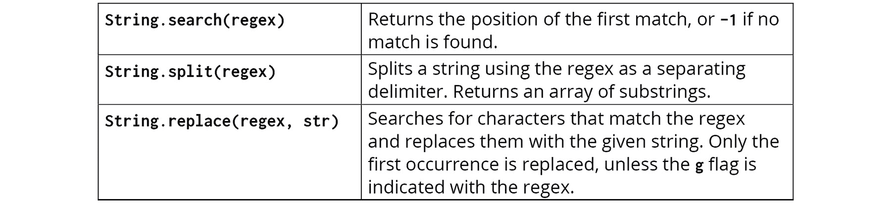

图 11.10：字符串方法

在使用 JavaScript 中的正则表达式时，还有一个有用的方法需要注意。`test()` 方法返回一个简单的 `true` 或 `false`，指示是否找到了匹配项。你可以在如下代码中使用它来测试字符串是否以字符 `hello` 开头：

```js
   if (/^hello/.test(str)) {

   }
```

注意

String 对象还有其他一些更高级的方法，这里没有涵盖。JavaScript 还有一个专门的内置 RegExp 对象，支持高级用例（`test()` 方法实际上属于 RegExp）。

## 练习 11.02：修改正则表达式以匹配模式

回想一下我们在本章开头提出的正则表达式模式，我们用它来匹配格式为 `XXX-XXX-XXXX` 的电话号码：

```js
    ^[2-9]\d{2}-\d{3}-\d{4}$
```

使用你到目前为止所学到的知识，在这个练习中，你将修改正则表达式以匹配稍有不同的电话号码格式：

```js
    (XXX) XXX-XXXX
```

有许多网站可以帮助你构建和测试正则表达式。我们将使用 [`regex101.com/`](https://regex101.com/) 来处理我们的正则表达式。让我们开始吧：

1.  首先，比较这两种格式，看看它们有多相似。注意，新的格式 `(XXX) XXX-XXXX` 在最后七位数字上与原始格式 `XXX-XXX-XXXX` 完全相同，只是在模式的开头有所不同。我们只需要将原始模式的前四个字符（三个数字和一个连字符，`XXX-`）替换为新字符（一个开括号，三个数字，一个闭括号和一个空格）。

1.  我们需要想出一个与 `(XXX)` 对应的正则表达式，包括一个不显示的尾随空格字符：

    ```js
        \([2-9]\d{2}\)
    ```

    让我们分析这段代码：

    +   `\(`：你需要匹配的第一个字符是一个括号。记住，括号在正则表达式中是特殊字符（元字符），所以它们需要用反斜杠转义，以表示你确实想要匹配括号字符。

    +   `[2-9]`：一个字符范围，用于匹配介于 2 和 9 之间的字符。

    +   `\d`：这是一个字符类，指定匹配一个数字字符。

    +   `{2}`：一个固定量词，表示前面的数字字符（\d）需要重复两次才能被认为是匹配。

    +   `\)`：闭括号，也进行了转义。

1.  通过与原始正则表达式的其余部分结合，你得到最终的正则表达式：

    ```js
        ^\([2-9]\d{2}\) \d{3}-\d{4}$
    ```

    为了测试这个解决方案，有许多网站可以帮助你构建和测试正则表达式。你可以访问 [`regex101.com/`](https://regex101.com/) 并在输入框中输入正则表达式。此外，在 TEST STRING 区域输入 `(234) 567-8910`，如图所示：


如您所见，MATCH INFORMATION 部分表明我们的测试字符串是一个完整的匹配。

在这个屏幕上发生了很多事情，有很多信息可以帮助你理解和处理正则表达式。如果你查看 REGULAR EXPRESSION 输入框，你会看到正则表达式的各个元素已经被着色，以帮助将其分解为其组成部分。EXPLANATION 区域更进一步，为每个字符或标记提供详细的解释。由于前面的截图中没有显示全部文本，以下是提供的解释：

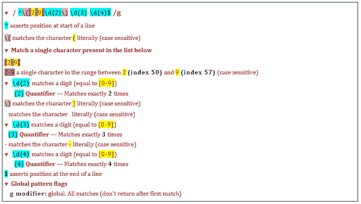


图 11.12：解释区域

## 在正则表达式中添加更多字符串

除了有一个通过匹配的测试字符串外，还应该放入其他类似的测试字符串，这些字符串不应该通过匹配。以下截图显示了 TEST STRING 区域中的一些其他此类模式，但请注意，只有这些模式中的第一个模式显示为匹配（正如预期的那样）：

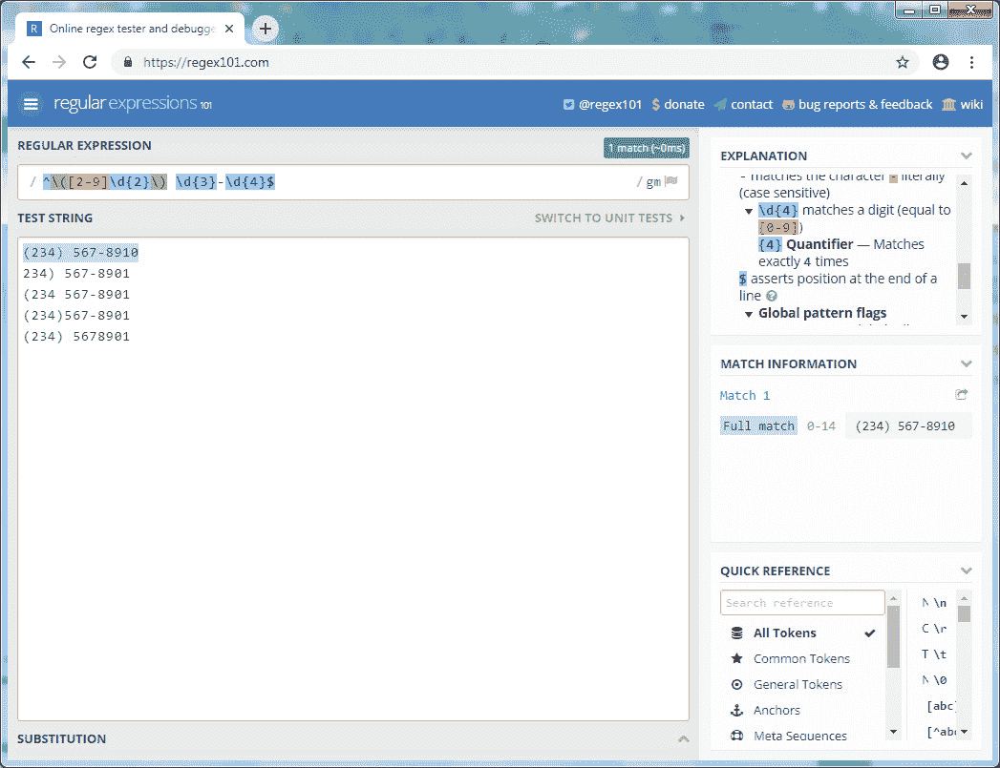

图 11.13：更多不期望匹配的测试字符串

在上一个练习中匹配电话号码的模式是可行的，但它寻找一个非常具体的模式。以下活动将挑战你使正则表达式更加灵活，以便它接受多种电话号码格式。

如果有人要求你提出一个正则表达式，使其能够匹配`XXX-XXX-XXXX`或`(XXX) XXX-XXXX`中的任意一种模式，你会怎么做？

挑战在于只提出一个正则表达式，使其能够匹配这两种电话号码格式。在提出一个好的解决方案之前，让我们先考虑一个不正确且简单的方法，它乍一看似乎是采取的最明显的方法，但实际上是有缺陷的，充满了陷阱。

注意到第二种格式与原始格式大部分相似，只是第一组三位数字以括号字符（`(`和`)`）开始和结束，并且后面是空格而不是破折号字符。你可能开始考虑通过在正则表达式中添加括号来表示这些差异，并简单地使用问号量词使它们成为可选的，并将破折号和空格放在一个集合中（使用**[]**语法）。这样的正则表达式看起来会像这样（强调的是新增部分）：

```js
    ^\(?[2-9]\d{2}\)?[- ]\d{3}-\d{4}$
```

问题在于这个正则表达式是不完整的，它也会允许一些不正确且不希望出现的格式匹配，如下所示：

+   `(234 567-8901` (没有结束括号)

+   `234) 567-8901` (没有起始括号)

+   `234 567-8901` (不恰当地使用空格字符)

+   `(234)-567-8901` (不恰当地使用破折号)

如果你将这些测试字符串输入到工具中，你也会看到这种情况：

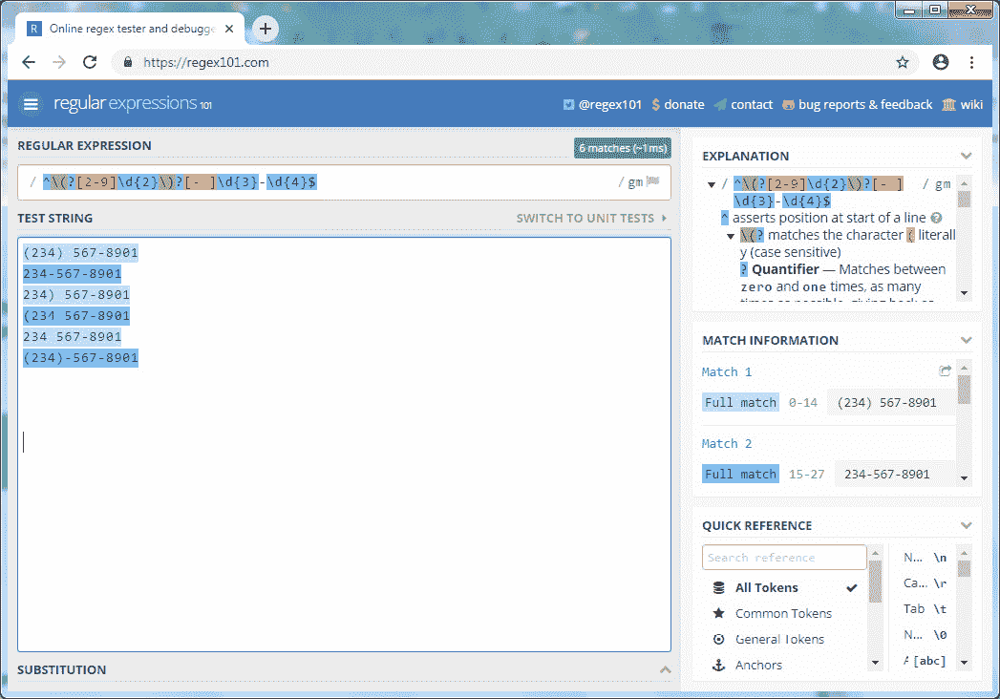

图 11.14：所有测试字符串都匹配，因为正则表达式有缺陷

只有前两个测试字符串应该匹配，但它们都匹配了（通过它们都被突出显示为蓝色来表示）。

## 活动内容 11.01：扩展电话号码匹配模式以接受多种格式

在上一个练习中，我们修改了一个正则表达式来匹配具有以下格式的电话号码：`(XXX) XXX-XXXX`。在这个活动中，我们将创建一个正则表达式，可以用来匹配`XXX-XXX-XXXX`或`(XXX) XXX-XXXX`中的任意一种模式。一旦完成这个活动，你应该会有一个接受`(XXX) XXX-XXXX`或`XXX-XXX-XXXX`号码格式的正则表达式。

活动的总体步骤如下：

1.  指出与每种格式对应的正则表达式片段是交替表达式的不同形式。

1.  将它们与上一练习中的原始正则表达式结合，以获得完整的正则表达式。

1.  现在，使用以下数字测试正则表达式：(234) 567-8901；234-567-8907；234) 567-8901；234 567-8901；234 567-8901；以及(234)-567-8901。

这个活动的预期输出应该是以下内容：

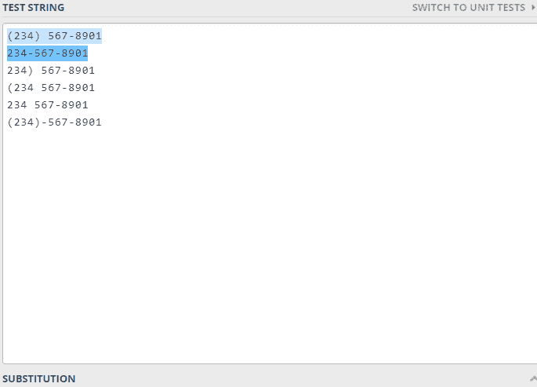

图 11.15：活动 11.01 的输出

注意

活动解决方案可以在第 745 页找到。

## 活动作业 11.02：扩展电话号码匹配模式以接受特定格式

在这个活动中，我们将`+XXX`（例如以下之一）：

```js
+97 (234) 567-8910
+97 234-567-8910
```

一旦你完成了这个活动，你应该有一个能够成功测试`+xxx`格式的正则表达式。

**步骤：**

1.  为`+XXX`模式（其中 1-3 位数字是可接受的）构造正则表达式。

1.  将此与原始正则表达式结合，以获得完整的正则表达式。

1.  修改正则表达式，允许使用空格或点字符作为数字分隔符，而不是仅使用破折号。

1.  使用以下数字测试模式：

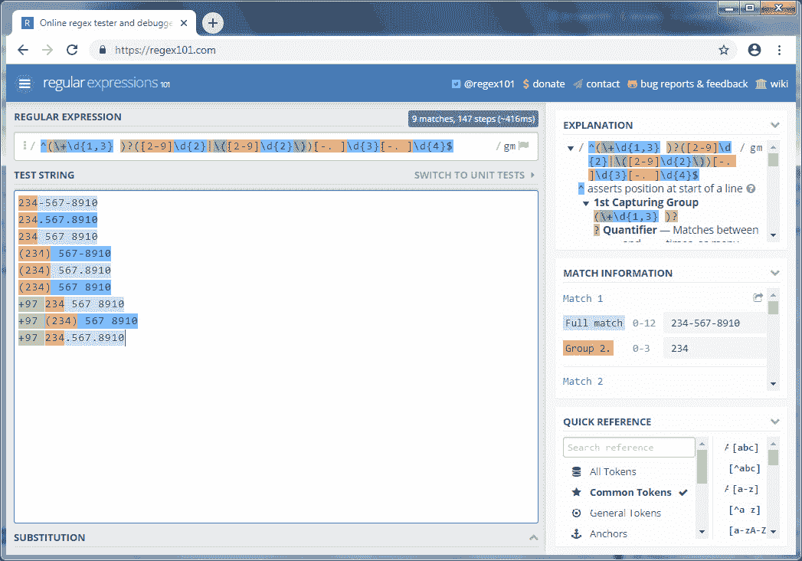

图 11.16：许多与正则表达式匹配的模式

注意

这个活动的解决方案可以在第 747 页找到。

## 有用的正则表达式

以下表格展示了一些用于不同目的的正则表达式。你应该能够使用我们介绍的概念来理解它们，但在大多数情况下，除了正则表达式本身外，不会提供进一步的解释：

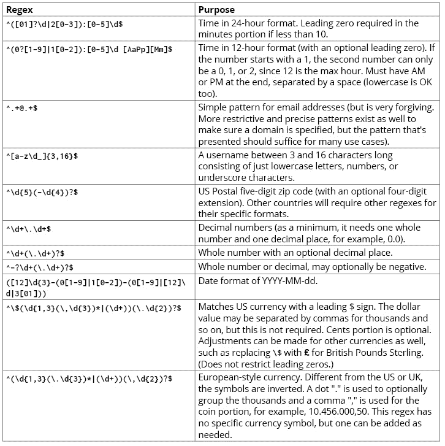

图 11.17：正则表达式及其用途

在这个主题中，你学习了正则表达式的基础及其用途。不过，有一个注意事项：虽然正则表达式非常强大，但它们也可能非常难以实现，正确使用它们可能需要一些练习。

现在，有一点要坦白。虽然我们的练习展示了用于验证电话号码的正则表达式，但它们是为了学习和教育正则表达式而设计的。在实际应用中，你可能希望考虑使用专门的库来进行此类验证。有几种这样的库可用，使用这些库的优点是它们经过深思熟虑、经过测试，并支持来自世界各地的各种选项和电话号码格式。其中一个这样的库是 Google 的[libphonenumber](http://libphonenumber)。

在下一个主题中，你将学习到整洁的编码。

# 整洁编码的最佳实践

代码往往比任何人想象的都要长寿。只需看看今天仍在使用的所有大型机系统。有时，即使是经验丰富的开发者也会对它感到困惑，在几周或几个月后再次查看自己编写的代码时，很难理解。软件开发者有责任在编码时采取良好的实践和习惯的心态。

代码几乎永远不会只写一次就不再使用。通常，你或其他人会在以后需要修改代码。如果你编写了干净的代码，你将帮助未来的自己和同事在那时更高效地工作。你也在使系统维护和修复错误变得更加容易。

本节中的许多想法和实践都基于罗伯特·C·马丁（Robert C. Martin）的书籍和博客，他也被称作“Uncle Bob”，是清洁编码领域的公认专家，并创作了广受欢迎的书籍、博客和培训视频。我们将只提供一个简要的概述和亮点，但关于这个主题已经写出了整本书。我们鼓励你深入研究这个主题。

以下是一段代码示例：

```js
    function circ(r) {
      return r * 2 * Math.PI;
    }
```

这段代码的目的是计算圆的周长，但根据它的编写方式，这对你来说可能并不明显。也许添加一些解释性注释会有所帮助，但将前面的代码与以下代码进行比较：

```js
    function circumference(radius) {
        return radius * 2 * Math.PI;
    }
```

你会同意这段代码更容易理解，并且几乎不会对其功能、参数和返回值产生任何疑问。将函数从 `circ` 重命名为 `circumference`，将参数从 `r` 重命名为 `radius` 就足以实现理解。这一切都无需添加任何解释性注释。

我们通过使用更好的命名改进了代码，但这里还有一个值得改进的地方。周长的常用公式是 `C = πd`，其中 `d` 是直径。如果你将我们的计算分成两个步骤，代码将更清晰。将前面的代码与以下代码进行比较：

```js
    function circumference(radius) {
        let diameter = radius * 2;
        return diameter * Math.PI;
    }
```

这个简单的更改使计算需要将半径乘以 2 的原因更加清晰，即先计算直径，然后再乘以π以得到周长。

这可能看起来不是很大的改进，并且可以说额外的代码行并没有增加多少价值或清晰度。在这个简单的例子中，你可能会正确地认为。但考虑一下以这种方式编码如何可能简化需要更复杂计算或逻辑的场景。

## 好的命名习惯

在命名变量、函数或其他对象时，请遵循以下指南：

+   `timeElapsedInDays`, `daysSinceCreation`, 和 `ageInDays`。一般来说，代码应该尽可能地自我文档化，注释应尽量保持最少。随着代码重构和逻辑随时间变化，注释有变得过时的倾向，程序员也往往会忘记更新它们。

+   如果它实际上是一个书籍数组，则使用 `bookList`。直接称为 `books` 更为可取。

+   `BookInfo` 和 `BookData`，你虽然使名称不同，但并没有使它们代表不同的含义。使用更具体的名称来区分每个类的用途。

+   `const yyyymmdstr = moment().format("YYYY/MM/DD");`

    现在，让我们与一个好的例子进行比较：

    ```js
        const currentDate = moment().format("YYYY/MM/DD");
    ```

+   `SECONDS_IN_DAY` 比起 `86400` 更有意义，并且更好地解释了这个数字代表什么。它还使得在搜索文本主体时更容易定位。

+   `Customer`、`Account` 和 `AddressParser`。避免使用像 `Manager`、`Processor`、`Data` 或 `Info` 这样的词，这些词要么是动词，要么过于通用。

+   `addFunds`、`deleteUser` 或 `save`。访问器和修改器应该以 `get` 或 `set` 前缀。

+   `fetch`、`retrieve` 和 `get` 都做同样的事情。最好选择一个单词并在代码中一致地使用它。

+   将 `eatMyShorts()` 用于表示 `abort()`。

+   **不要添加不必要的上下文**：如果你的类或对象已经具有描述性的名称，就没有必要在变量中重复该名称。看看以下示例。

    这是错误的：

    ```js
        const employee = {
            employeeFirstName: "Daniel",
            employeenLastName: "Rosenbaum",
            employeeActive: true
        };
        function fireEmployee(employee) {
            employee.employeeActive = false;
        }
    ```

    而这是好的：

    ```js
        const employee = {
            firstName: "John",
            lastName: "Smith",
            active: true
        };
        function fireEmployee(employee) {
            employee.active = false;
        }
    ```

以下是函数的最佳实践：

+   **函数应该只做一件事情并且保持简洁**：当函数简洁且功能有限时，它们更容易理解、测试和操作。它们也会读起来更清晰，并且更容易重构。结合良好的函数名，它们也是自我文档化的。

    这是一个糟糕的函数：

    ```js
        function phoneSubscribers(subscribers) {
            subscribers.forEach(subscriber => {
                const subscriberRecord = database.lookup(subscriber);
                if (subscriberRecord.isActive()) {
                    phoneSubscriber(subscriber);
                }
            });
        }
    ```

    这是一个好的函数：

    ```js
        function phoneActiveSubscribers(subscribers) {
            clients.filter(isActiveSubscriber).forEach(phone);
        }
        function isActiveSubscriber(subscriber) {
            const subscriberRecord = database.lookup(subscriber);
            return subscriberRecord.isActive();
        }
    ```

+   **限制函数参数的数量**：理想情况下，参数不应超过两个或三个。这使得测试更容易。如果有更多参数，考虑你的函数可能试图处理太多事情，应该拆分成多个函数。

+   **函数名应该说明其功能**：以下是一个糟糕的函数名示例：

    ```js
        function addToDate(date, month) {
          // ...
        }
        const date = new Date();
        // It's hard to tell from the function name what is added
        addToDate(date, 1);
    ```

    这是一个好的函数名：

    ```js
        function addMonthToDate(month, date) {
          // ...
        }
        const date = new Date();
        addMonthToDate(1, date);
    ```

+   如果 `doSomething()` 和 `doSomethingOrSomethingDifferentIfAFlagIsSet()`，那么是时候拆分函数了。

    看看以下代码：

    ```js
        function createFile(name, temp) {
          if (temp) {
            fs.create(`./temp/${name}`);
          } else {
            fs.create(name);
          }
        }
    ```

    而不是使用前面的代码，可以使用以下代码代替：

    ```js
        function createFile(name) {
          fs.create(name);
        }
        function createTempFile(name) {
          createFile(`./temp/${name}`);
        }
    ```

+   `playerX` 和 `playerY` 变量表示角色的当前坐标：

    ```js
        let playerX = 45, playerY = 100;
        const moveRight = (numSlots) => {
          playerX += numSlots;
        }
        moveRight(5);
    ```

    最好将 x 作为参数传递，并将结果重新赋值给函数外部的全局变量，这样函数保持纯净并保持可预测的返回值（并且使测试更容易）：

    ```js
        let playerX = 45, playerY=100;
        const moveRight = (playerX, numSlots) => playerX + numSlots;
        playerX = moveRight(playerX, 5);
    ```

    注意

    副作用和纯净函数在 *第十四章，理解函数式编程* 中有更详细的介绍。另一个重要例子是在进行修改时克隆对象、数组或列表，而不是直接在输入上进行修改。

+   **创建函数来捕获条件语句**：如果你有复杂的条件，你的代码可能会变得杂乱无章、缺乏焦点且难以理解。为你的条件创建专用函数并给它们起描述性的名称，可以使代码自我文档化并更容易理解。

    一个糟糕的函数示例：

    ```js
    if (serviceCall.state === "loading" && isEmpty(result)) {
        // ...
    }
    ```

    一个好的函数示例：

    ```js
    function shouldShowSpinner(serviceCall, result) {
        return serviceCall.state === "loading" && isEmpty(result);
    }
    if (shouldShowSpinner(serviceCall, result)) {
        // ...
    }
    ```

## JavaScript Linters

代码检查工具是一种分析源代码的工具，可以帮助您调试代码，查找潜在的问题和错误，并检查编码风格（这通常是主观的）。在项目中使用代码检查工具可以帮助您和您的团队提高代码质量，并提供一致的样式，这有助于平滑不同团队成员编写的代码之间的差异。

代码检查工具通常可以以三种不同的方式使用：

+   通过浏览器页面将您的代码键入或粘贴到工具的在线版本中。这是最简单的方法，但不适用于任何除了小范围检查之外的事情。

+   使用您 IDE 或文本编辑器的插件，在您键入时显示错误和警告，或者单独显示。

+   在构建源代码时运行扫描并生成报告，或者定期进行。 (如果需要，您甚至可以设置构建失败，如果扫描结果显示出足够严重的错误。)

对于 JavaScript，有几种可用的代码检查工具，包括以下几种：

+   **ESLint**：这是一个非常可配置和可定制的工具。这也许使得它成为最复杂且最难上手使用的代码检查工具。

+   **JSLint**：这是可以配置的，但在一个流行的但特定的编码风格上非常主观，如工具文档中所述。

+   **JSHint**：在可定制性方面，它介于其他两种之间。

## 练习 11.03：JSLint

这个练习将更详细地描述 `JSLint`，因为它最容易设置和开始使用，使用良好的编码风格，并且适合许多项目。让我们开始吧：

1.  打开一个网络浏览器，例如 Google Chrome，并访问 [www.jslint.com](http://www.jslint.com)。

1.  在屏幕下方的“选项”部分，选择“Assume → a browser”（这将设置扫描以定义通常在浏览器中可用的某些对象，例如 `document` 对象）：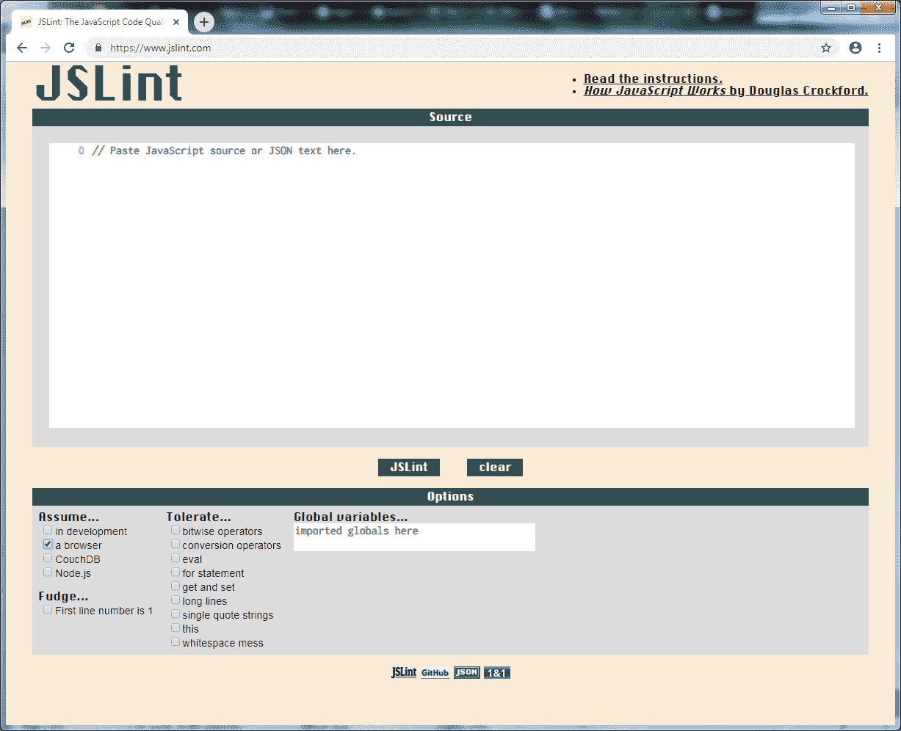

    图 11.18：JSLint 的在线版本

1.  将 `conventional.html` 文件中的代码粘贴到 *Source* 窗口中。

1.  点击 *JSLint* 按钮，这将产生一个输出结果，类似于以下截图所示：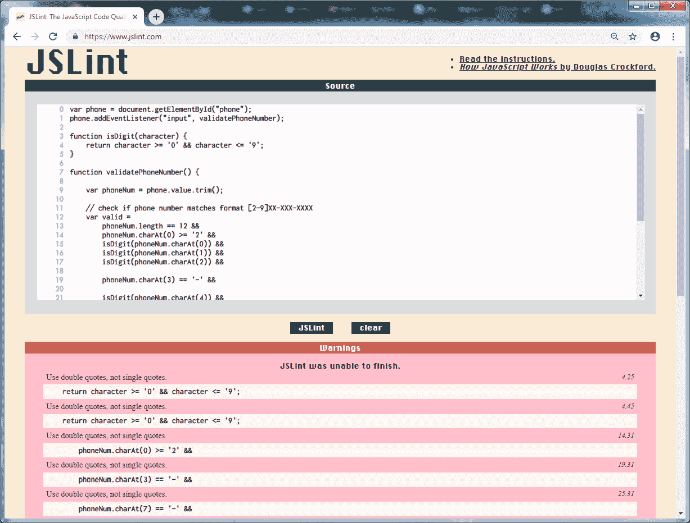

    图 11.19：扫描结果

1.  扫描结果有多个以下警告：`使用双引号，而不是单引号`。这可能是一个主观偏好的例子，因为在许多语言中，单字符通常使用单引号，而不是双引号。幸运的是，这是一个可配置的选项，如果您在“选项”部分选择“Tolerate → single quote strings”，如以下截图所示。再次点击 *JSLint* 按钮后，这将导致所有警告被移除：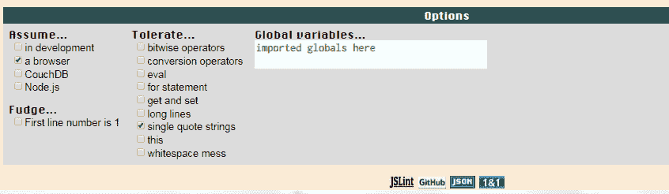

    图 11.20：Tolerate → single quote strings 选项

1.  通过一种特殊的注释语法指定允许单引号字符串（以及其他一些选项）的选项，这种语法以`/*jslint`开始。取消选择`Tolerate → single quote strings`选项，并将以下内容添加到代码顶部：

    ```js
        /*jslint
            single
        */
    ```

    点击 JSLint 按钮后，警告将继续为空。

这个练习解释了如何使用`Jslint`工具编译你的 JavaScript 代码。它还通过提供问题修复报告来帮助减少调试时间。

## 活动 11.03：重构为干净代码

养成使用干净编码最佳实践的习惯是一项基本技能。我们现在准备将我们新获得的干净编码技能付诸实践。

查看以下文件`<script>`部分的 JavaScript 代码，并找出你可以如何重构它以使其更干净、更容易维护和测试。

```js
activity_original_code.html
1 <html>
2 <head>
3 <meta charset="utf-8"/>
4 </head>
5 <body>
5 <span id="error" style="color: red"></span>
6 <table>
7   <tr>
8     <td># of hours:</td>
9     <td><input id="numHours" /></td>
10   </tr>
11   <tr>
12     <td>Pay rate per hour:</td>
13     <td><input id="payRate" /></td>
14     <td>(in ####.## format)</td>
15   </tr>
```

简而言之，这是一个简单的网页，根据小时数、每小时的工资率和工人类型计算工资。有三种类型的工人，他们的工资确定规则不同：`标准`工人，在`无加班费`时获得加班费，不获得任何加班费，以及`双倍加班费`工人，在 50 小时后支付**2 倍**工资。

对于两个数字字段也有格式检查（使用正则表达式实现）和显示验证错误消息的功能。以下屏幕截图显示了带有有效输入的输出（在这个实现中只有最小的颜色和样式）：

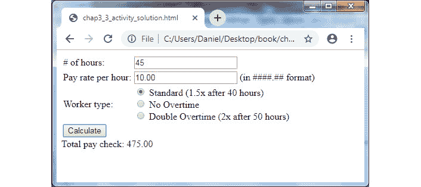

图 11.21：带有有效输入的示例输出

以下屏幕截图显示了带有验证错误的输出：

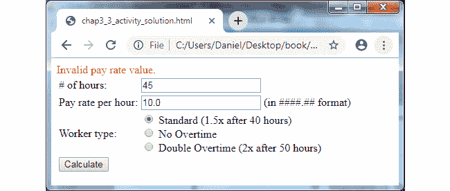

图 11.22：带有验证错误的示例输出

注意

这个活动的解决方案可以在第 748 页找到。

活动的总体步骤如下：

1.  要重构代码，创建一个名为`processForm()`的函数。

1.  创建一个名为`resetErrorsAndResults()`的函数。

1.  创建一个类来保存表单字段值并执行验证。

1.  接下来，创建一个名为`getFormFields()`的函数。此函数限于从表单获取值并创建`FormFields`类的实例。

1.  创建`displayError()`和`displayResult()`函数以显示错误和结果。

1.  最后，创建`calculateStandardWorkerPay()`、`calculateNoOvertimeWorkerPay()`和`calculateDoubleOvertimeWorkerPay()`函数，这些函数具有相同的两个参数和相同的返回值定义，以便可以在`doCalculation()`中抽象地调用。

# 摘要

在本章中，你学习了编写干净和可维护代码的最佳实践。正如你在本章的活动中所看到的，使用干净编码技术的重构代码比之前更长。然而，你可以看到，当前的代码比原始代码更干净，更容易理解和测试。

对于我们简单应用所展示的这种程度的重构，可以说是过度了，许多开发者都有这样的感觉。但真正体现这种编程风格价值的，其实是在复杂现实世界的应用中，以这种方式工作是一种良好的实践。开发者和技术负责人需要决定对于他们特定的项目，哪些标准和清洁编码实践是有意义的。

在下一章中，你将探索 JavaScript 所能提供的当前趋势和前沿特性。
