# 第十二章：12. 使用下一代 JavaScript

概述

到本章结束时，你将能够识别和选择可用于高级 JavaScript 开发的工具；在旧浏览器中使用最新的 JavaScript 语法；从客户端和服务器端应用程序开发的实用框架中选择；在项目中使用 `npm` 和 `Yarn`；使用 `Parcel` 进行无配置的资产管理；以及使用 webpack 实现可配置的资产管理。

# 简介

在上一章中，你学习了通过利用编码最佳实践、确保纯函数实现以及保持代码简洁来创建干净、可维护的代码。现在，尽管你的代码可能简洁且正确，但在部署应用程序时，仍有许多因素可能导致问题。

编写 JavaScript 应用程序并非原生的“**编写和部署**”实践。有许多需要注意的事项需要克服；例如，管理集成第三方模块、确保项目的正确目录结构以及确保你的代码在所有必要的环境中运行无误。

重要的是要记住，JavaScript 是一个不断发展的平台。自从其创建以来，JavaScript 总是在可用的运行时之间以及，最值得注意的是，在浏览器类型和版本之间存在差异。在其存在的早期，JavaScript 非常难以驾驭，浏览器之间存在明显的差异。在那个时期，开发者需要频繁地在每个浏览器中重复测试他们的应用程序，以确保其成功运行且无错误。即使现在，每个可用的现代浏览器都有不同的支持功能列表，并且尴尬的是，相似功能实现的微小差异可能会让一个没有防备的开发者陷入困境。试图编写适用于所有现代浏览器的代码可能会耗费时间，并且可能需要一些耐心。

幸运的是，有方法可以通过工具和库来克服这些差异。以下是一些方法：

+   **Polyfill** 库，它们向运行时添加缺失的功能，确保环境之间的更好匹配

+   支持编码方法的库，确保实用的跨运行时开发体验

+   **Transpilers**，它们将单一语言实现转换为支持多个不同运行时环境的代码

通过将这些工具包含在你的项目工作区中，你不仅可以节省部署代码时的数小时挫败感和不必要的头痛，还可以确保从开始就有一个愉快的开发体验。这个想法是支持你的创造力，而不是与工具作斗争。

本章将突出那些使使用 JavaScript 编码变得轻松的库和工具，并告知你如何查找信息，以便你可以定制你的开发体验。

# 浏览器差异

当用户查看网站或网络应用程序时，它按预期工作并且最好在所有浏览器中工作方式相似是很重要的。然而，对于许多开发者来说，确保这一点是一项艰巨的任务。不仅浏览器提供了略有不同的 JavaScript 实现，还有 HTML5 功能、**层叠样式表** (**CSS**) 支持，以及更多。克服这些差异一直是每个 JavaScript 开发者职业生涯中的重要任务，经验在确保应用程序在所有环境中工作方式相似中起着关键作用。

要查看不同浏览器类型和版本上哪些功能可用，你可以使用 *Can I Use* 网站，该网站列出了每个浏览器的功能和它们的兼容性：[`caniuse.com/`](https://caniuse.com/).

近年来，微软致力于消除这些差异。例如，在 iOS 设备上，微软的 Edge 浏览器使用 **WebKit**，这是谷歌的 Chrome 和苹果的 Safari 浏览器所使用的相同技术。因此，网络应用程序开发的未来看起来更加光明，浏览器之间的限制更少。然而，问题在于，并非所有用户都更新了他们互联网浏览器的最新版本，这意味着向后兼容性仍然是必要的。

## polyfills

解决浏览器兼容性问题的一个方法是使用 polyfills。这些是由第三方创建的库，用于弥合浏览器之间的差距，确保它们提供的功能与预期匹配。有许多 polyfill 库，每个库都声称在一系列浏览器和浏览器版本中提供特定的功能列表。其中最受欢迎的 polyfills 是 **Polyfill.io** ([`polyfill.io/v3`](https://polyfill.io/v3)).

Polyfill.io 是由 *Financial Times* 创建的，用于覆盖浏览器之间广泛的不一致。它是一个开源库，可以配置为仅包含你需要的功能，或者你可以简单地导入所有内容。通过将其包含在你的项目中，你可以平滑处理浏览器差异。

在你的应用程序中包含 Polyfill.io 与通过 `script` 标签添加它一样简单：

```js
<script crossorigin="anonymous" src="img/polyfill.min.js"></script>
```

然而，为了充分利用 Polyfill.io，最好通过 Polyfill.io 网站的“创建 Polyfill 包”页面适当地配置它以满足你的需求。

## 转译器

转译器是转换一种语言到另一种语言的工具。它们与编译器类似，但编译器通常将一种语言转换为机器代码或中间字节码。有许多转译器可以将不同的语言转换为 JavaScript，但其中在网页开发中最受欢迎的是 **Babel 转译器**，它将 JavaScript 转换为 JavaScript。这听起来可能有些奇怪，但想象一下能够利用 JavaScript 的所有最新功能，然后将其转译为在过去 5 年的所有主要浏览器上工作，而无需使用 polyfill 库。这正是 Babel 所做的。

Babel 转译器以及本章后面将要讨论的几个其他转译器。

## 开发方法库

作为覆盖浏览器差异裂缝的替代方案，可以利用提供统一开发方法且在旧浏览器中受支持的库。有许多库提供了一系列功能，从而使得以预定义、有见地的编程方式更容易。以下是一些这样的库：

+   **Underscore**、**Lodash**、**RxJS** 和 **Ramda** 函数式编程库

+   **React**、**Polymer** 和 **Riot** 组件化 UI 库

+   **Backbone** 和 **Knockout MVC** 框架

+   **jQuery** 和 **MooTools DOM** 操作库

前述每个库都可以与其他库和转译器一起使用，因此选择你的库可能是获得所需结果的重要步骤。我们将在本章后面查看一些有用的库。

# 包管理器

包管理器是提供对包含库的管理的支持的工具。这些包管理器可能提供可以在生产代码中使用的功能，提供对应用程序外部帮助测试代码的功能，或者甚至提供可以用来使开发更容易但最终从生产代码中丢弃的工具。

在实现包管理器时，会保留一个清单，以跟踪项目中导入的每个库及其版本号。这样，如果你要从项目中移除所有库，你可以轻松地重新安装曾经使用的库。这在将应用程序源代码存储在源代码库（如 GitHub）中非常有用，因为你只需要存储自己的代码。其他开发者可以通过包清单轻松安装你过去使用的任何库，从而确保源代码库的简洁。

许多年来，JavaScript 开发者最常用的包管理器是节点包管理器（npm）。然而，还有其他管理器可用，其中一些正在获得人气，包括 Yarn。

## 节点包管理器

当你安装 Node.js 时，节点包管理器（npm）会自动安装。因此，如果你跟随了第九章“使用 Node.js”的内容，那么你应该已经安装了它。要测试是否已安装，只需在你的终端中运行以下命令：

```js
npm -v
```

如果你确实在你的系统上安装了它，这将输出版本信息：


图 12.1：npm 版本

当使用 npm 与项目一起使用时，它会创建一个名为`package.json`的清单文件，该文件维护了一个用于与项目一起使用的生产环境和开发库的列表。任何已安装的包都存储在一个名为`node_modules`的目录中，npm 也会创建这个目录，并且它位于项目的根目录。出于简化目的，建议确保`node_modules`目录永远不会存储在你的项目源代码仓库中。

要开始使用 npm，你只需使用终端导航到你的项目目录，并执行以下命令：

```js
npm init
```

这将提示你回答一系列问题。如果你不知道要填什么，可以简单地按 Enter 键跳过它们，并使用提供的默认值。如果你愿意的话：

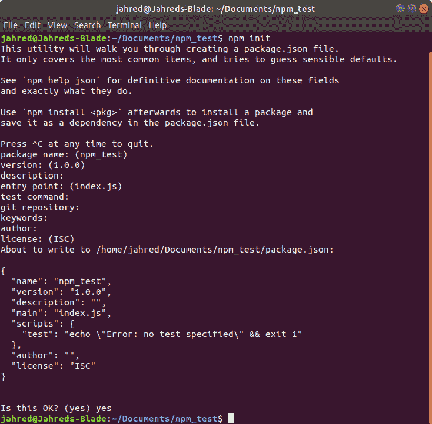

图 12.2：npm 初始化

完成后，它将创建一个包含前述截图详细 JSON 代码的裸骨`package.json`文件。现在，在这个时候，这个 JSON 将不包含任何模块，但这没关系。它所做和可以包含的是关于你的项目的元数据，例如其版本、初始索引或启动脚本，以及其他此类重要信息。

预定义的元数据属性之一是`scripts`对象。这是一个重要的条目，你很快就会熟悉。该对象中的每个条目都是一个可执行的命令快捷方式，你可以使用 npm 终端命令调用它。最初提供的那个实际上并没有做什么，除了输出一个错误，但如果你愿意，你可以运行它以查看其效果。通过在终端中执行以下命令来实现：

```js
npm run test
```

使用当前的 JSON，这将简单地输出以下错误：

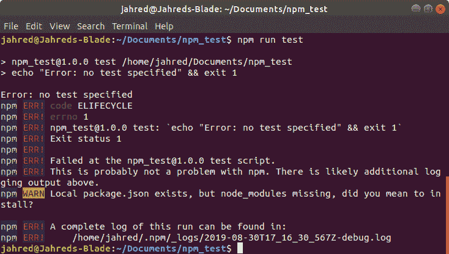

图 12.3：初始 package.json 输出

`package.json`文件的`scripts`部分对于实现自己的快捷命令非常有用，这样你就可以运行常见任务。你将在本章的后面大量使用它。

## 安装模块

包管理器的关键任务是安装模块。正如我们之前所述，将模块安装到项目中有两种主要方式。第一种是将它作为生产级模块安装。这意味着它可以在构建阶段被整合到你的部署脚本中：

```js
npm install --save-prod <module>
```

同样，要将其作为开发模块安装，你只需执行以下代码：

```js
npm install --save-dev <module>
```

每个已安装的模块都将添加到`package.json`文件中的一个列表中；对于生产模块是`dependencies`，对于开发模块是`devDependencies`。

在任何时间，一旦你的模块列表存在于`package.json`文件中，你只需在终端中调用以下命令即可安装所有模块：

```js
npm install
```

如果你的项目中不存在`node_modules`文件夹，这个命令将会创建它，并继续下载`dependencies`和`devDependencies`列表中包含的所有模块。

## Yarn 包管理器

Yarn 是 JavaScript 包管理器中较新的补充，但正在变得越来越受欢迎。它由 Facebook 联合 Google、Tilde Inc. 和 Exponent Inc. 共同构思，作为 npm 存储库的不同前端。它主要是为了提供一个比 npm 命令行工具更安全的替代品，因为 npm 命令行工具可以在安装模块时运行代码，这可能是一个安全风险。

您是否应该使用 Yarn 只是一个偏好问题。Yarn 项目暴露的问题可能会随着时间的推移由 npm 修复，并且可能已经不再相关。由于 Yarn 并没有在 npm 生态系统中取代太多东西，因此没有很大必要在 **npm CLI** 之上使用它。

## Babel 转译器

Babel 是一套将 JavaScript 转译为 JavaScript 的工具和库。它的好处是您今天可以使用最前沿的 JavaScript 特性，同时确保它们在广泛的浏览器和浏览器版本上运行，同时确保生成的代码量最小。

注意事项

当处理特别小的项目时，仍然可以创建比大多数浏览器上运行的脚本更短的脚本。使用 Babel 主要对中等至大型项目有益，许多现代 JavaScript 应用程序往往属于这一类。因此，如果您只是从字段或两个字段中读取一些值，并使用几行 JavaScript 验证它们，那么您可能最好完全跳过模块和转译器。

一个简单的 Babel 安装提供了三个开发时工具和一个需要编译到您的应用程序中的 polyfill 库。具体如下：

+   Babel 引擎核心

+   Babel 命令行界面

+   Babel 环境预设引擎

+   Babel/polyfill 库

每个 Babel 工具都可以使用 npm CLI 安装，并使用以 `@babel/` 前缀的包名。这被称为包作用域或命名空间，确保 npm 存储库中的其他包在名称相同的情况下不会发生冲突。

### @babel/core

`@babel/core` 工具提供了 Babel 转译器的引擎。它包含将 JavaScript 代码从一种形式转换为另一种形式的函数，尽管各种转换的逻辑可能不在 `@babel/core` 包本身中。所有 Babel 安装都必须包含 `@babel/core` 包才能正常工作。

### @babel/cli

`@babel/cli` 为 Babel 项目提供了命令行功能。这可以用来调用源代码的转译，以及包含额外的插件和配置。然而，您通常不会直接使用此 CLI。相反，您将创建一个新的 `scripts` 条目，并在单独的文件中提供配置。

### @babel/preset-env

`@babel/preset-env`工具为针对特定环境（如浏览器类型和版本）转换您的代码提供了智能指令。通常，您希望支持的环境范围越广，您生成的可部署转换代码就越大。此工具的配置将存在于配置文件中，这样您就只需指定一次。

### @babel/polyfill

`@babel/polyfill`是一个至少部分编译到您的可部署代码中的库。通过使用`@babel/preset-env`，Babel 从`@babel/polyfill`中选择元素包含在转换代码中。

### .babelrc 配置文件

`.babelrc`文件（注意文件名开头的点字符）是一个 JSON 配置文件，位于项目目录的根目录。此文件可以存储有关预设、插件以及各种其他对 Babel 安装有用的信息。

您将应用到此文件的最常见的配置是您希望支持的环境：

```js
{
"presets": [
    [
"@babel/preset-env", {
"targets": "> 0.25%, not dead"
      }
    ]
  ]
}
```

之前的例子要求 Babel 将代码转换为支持全球使用率超过 0.25%的浏览器。否则，这些浏览器不被认为是已死亡的，这意味着仍然得到积极支持的浏览器。

可以在[`packt.live/2NVxWwP`](https://packt.live/2NVxWwP)找到`.babelrc`配置文件支持的完整环境查询说明。

## 练习 12.01：一个基本的 Babel 项目

在这个练习中，您将使用 npm 创建一个可用的 Babel 转换器安装。这将是一个简单的设置，将产生一个能够将源模块化 JavaScript 应用转换为可部署文件库的工作环境。让我们开始吧：

1.  首先，在操作系统的`Documents`文件夹中使用终端创建一个名为`babel_app`的新目录。然后，导航到该目录：

    ```js
    cd ~/Documents/
    mkdir babel_app
    cd babel_app/
    ```

1.  然后，将文件夹初始化为 npm 项目。您可以为此使用所有默认设置：

    ```js
    npm init
    ```

    您应该看到以下类似的输出：

    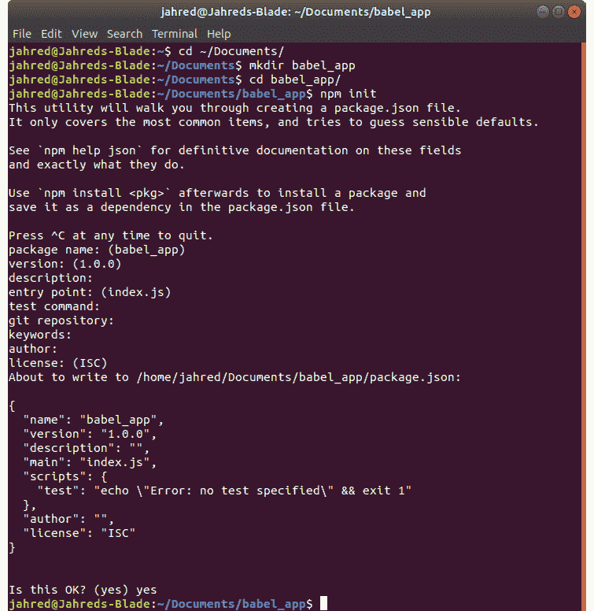

    图 12.4：npm 初始化

1.  现在 npm 已经设置好了，您可以安装 Babel 的开发库。这些库需要保存在`devDependencies`列表中：

    ```js
    npm install --save-dev @babel/core @babel/cli @babel/preset-env
    ```

    您将看到一些与将模块下载到`node_modules`目录有关的信息：

    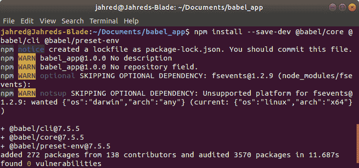

    图 12.5：已安装的开发模块

    这些文件不会被编译到您的结果转换应用中，因为它们用于执行转换本身。

1.  现在，您需要安装 Babel polyfill 库。此库将根据转换器的需求转换为您的结果应用：

    ```js
    npm install --save @babel/polyfill
    ```

    再次，这个模块将被保存在`node_modules`目录中：

    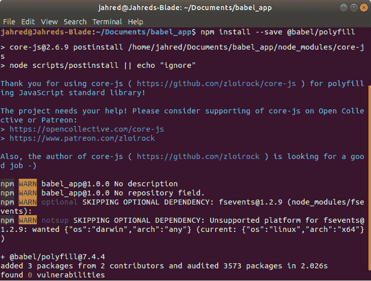

    图 12.6：Polyfill 模块安装

1.  安装了模块后，你现在需要配置 Babel。这需要一个名为`.babelrc`的新文件，它将包含适当的 JSON。Babel 有许多可能的可配置功能，但在这个练习中，你只需要指定环境预设。在项目目录的根目录中创建一个名为`.babelrc`的新文件，并填充以下内容：

    ```js
    {
      "presets": [
        "@babel/preset-env", {
          "targets": "> 0.25%, not dead"
        }
      ]
    }
    ```

1.  一切准备就绪后，你现在需要创建你的项目工作文件和目录。你可以按照你喜欢的任何方式布局你的项目，但在这个例子中，你将使用两个目录：一个`src`目录用于源文件，一个`dist`目录用于转换后的文件。请继续在项目目录的根目录中创建这些目录：

    ```js
    mkdirsrcdist
    ```

1.  接下来，你需要一个项目文件来进行转换。在`src`目录中，添加一个名为`index.js`的文件，并添加以下 JavaScript 代码：

    ```js
    [1, 2, 3].map((value) => console.log("Mapping value ", value));
    ```

    这个 JavaScript 使用了一点点 ES2015 规范，以胖箭头函数的形式。这意味着在转换时，你应该在源文件和转换后的文件中看到差异。

1.  现在，为了使一切正常工作，你需要修改`package.json`文件以包含一个执行 Babel 转换器的脚本。请打开该文件，然后在`scripts`数组中添加以下行：

    ```js
    "build": "npx babel src --out-dir dist"
    ```

    这行代码的意思是，当你运行它时，它将使用 npm 包运行器调用 Babel CLI 工具，并将`src`目录作为输入，将`dist`目录作为输出。别忘了在上一个行末添加逗号，否则你的 JSON 将是无效的。你的`package.json`文件现在应该看起来如下所示：

    ```js
    package.json
    1  {
    2  "name": "babel_app",
    3  "version": "1.0.0",
    4  "description": "",
    5  "main": "index.js",
    6  "scripts": {
    7  "test": "echo \"Error: no test specified\"&& exit 1",
    8  "build": "npx babel src --out-dir dist"
    9    },
    10 "author": "",
    11 "license": "ISC",
    12 "devDependencies": {
    13 "@babel/cli": "⁷.5.5",
    14 "@babel/core": "⁷.5.5",
    15 "@babel/preset-env": "⁷.5.5"
    The full code is available at: https://packt.live/32DKdv6
    ```

    注意每个模块条目旁边的版本号。如果你的版本号不同，不要慌张。安装这些模块所使用的步骤确保了下载了最新版本。你自己的文件与前面代码之间的任何差异仅仅意味着这些模块自从本章编写以来已经更新了。然而，一切应该仍然运行良好。

1.  最后，是时候运行转换器了。为此，只需通过 npm CLI 工具调用脚本即可：

    ```js
    npm run build
    ```

    执行后，查看`dist`目录。它现在也应该包含一个`index.js`文件。然而，这个文件的內容将与你在`src`目录中的`index.js`文件中输入的代码略有不同：

    ```js
    "use strict";
    [1, 2, 3].map(function (value) {
      return console.log("Mapping value ", value);
    });
    ```

    注意到 Babel 转换器移除了胖箭头函数语法，并用标准的函数定义替换了它。这样做是为了确保转换后的代码能在你在`.babelrc`配置文件中指定的环境中运行。Babel 允许你使用任何你想要使用的尖端特性，同时安心地知道你的转换后的应用程序应该正好在你需要的地方运行。

我们在这里描述的基本设置为即使是最大的应用程序也提供了一个强大的起点。许多专业的 JavaScript 开发公司使用 Babel 来确保代码的正确性、可移植性和灵活的工作环境，这样开发团队可以管理，而不需要每个开发者互相干扰。

虽然你所取得的成果是一个健壮、团队驱动的应用的绝佳起点，但还有更多可以做到的来进一步提升这一点。我们将在本章的剩余部分探讨这些额外的步骤。

# 使用 Parcel 的 Babel 应用程序

npm 作为包管理器工作得非常好，但其项目管理功能有限。在之前的练习中，你在 npm 的 `package.json` 文件中设置了一个脚本，该脚本执行了 Babel 编译器。编译器可以一次翻译一个 JavaScript 文件，并将生成的翻译文件放置在 `dist` 目录中，但这只是其中的一部分。通常，你的项目会有其他要求，例如以下内容：

+   确保你的文件合并成更少的 JavaScript 结果文件

+   定义热模块（将编译输出拆分成更小的块，以动态加载）

+   处理 CSS 文件

+   压缩图片

+   确保文件在构建之间不被缓存

你可以编写自己的脚本来管理你的项目，并从父脚本中通过 npm 执行它们，但这是一项大量重复性的工作，已经被其他人解决了。**Parcel** 是一个解决方案。

## 什么是 Parcel？

Parcel 被视为一个网络应用程序打包器。本质上，它是一个执行上一节中列出的任务的打包模块。使 Parcel 独特的是，它是一个零配置打包器。你只需从你的项目目录中调用它，它就会确定你的应用程序应该如何为分发做好准备。那么，唯一的要求就是调用 Parcel CLI 命令来启动它。

Parcel 通常作为全局模块安装在你的项目中。这意味着它不会存储在你的项目文件夹中的 `node_modules` 目录中，而是在你的操作系统环境路径上存在的 `node_modules` 目录中。为此，你不需要提供 `--save` 或 `--save-dev` 标志，而是提供一个 `-g` 标志，用于全局：

```js
npm install -g parcel
```

由于 Parcel 是全局安装的，安装不会修改 `package.json` 文件，因为它不需要被添加到 `dependencies` 或 `devDependencies` 列表中。

## 使用 Parcel

要使用 Parcel，你需要向 `package.json scripts` 对象中添加新的脚本。有多种方式可以调用 Parcel。第一种是简单地将主 JavaScript 文件作为唯一参数传递给 `parcel` CLI 工具：

```js
parcel src/index.js
```

这将请求 Parcel 处理 JavaScript 文件，并输出其开发构建版本。Parcel 遍历此文件，并确定是否有其他文件也需要处理。在处理阶段，Parcel 还会分析项目目录中存在的任何配置文件。`.babelrc`配置文件就是 Parcel 理解的一种文件。因此，通过其存在，Parcel 将确保任何 JavaScript 文件都通过 Babel 进行转换。如果存在其他工具的通用配置文件，或者源树中给定类型的文件（如 HTML 和 CSS 文件）也是如此，情况将相同：

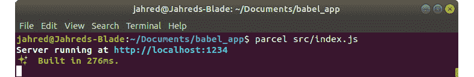

图 12.7：Parcel 开发构建

当作为开发构建处理时，Parcel 会在转换后的 JavaScript 中包含额外的代码。此外，调用 Parcel 以开发模式处理你的文件将不会返回。正如你可以在前面的屏幕截图中所见，以开发模式运行 Parcel 会启动一个特殊的发展服务器，你可以通过在浏览器中访问[`localhost:1234`](http://localhost:1234)来导航到该服务器。这仅仅是将你的转换后的应用程序展示得好像它正在远程服务器上运行。

运行的服务还利用文件系统监听器，以便当你更新项目中的文件时，该文件会自动重新处理，并且产生的更改会立即可用。如果你在文件更改时在浏览器中查看你的应用程序，浏览器会自动刷新以包含这些更改。这个特性大大加快了开发时间。

另一种调用 parcel CLI 工具的方法是提供`build`标志：

```js
parcel build src/index.js
```

`build`标志告诉 Parcel 处理源文件，以便它们为生产发布做好准备。这个版本将不会包含额外的浏览器更新代码，并且不会有开发服务器在运行：

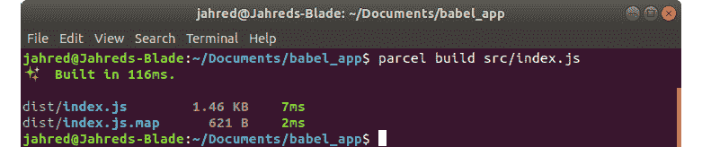

图 12.8：Parcel 生产构建

当将你的完成的应用程序部署到生产服务器时，开发功能是不必要的，并且只是增加了代码的冗余，因此能够不使用它们编译应用程序是一个必要的步骤。

## Parcel 中的模块化应用程序

使用 Parcel 提供了许多免费功能。在*第九章，使用 Node.js*中，你看到了如何在 Node.js 应用程序中获取模块。使用 Babel 和 Parcel 进行转换时，使用`import`关键字也能获取模块。

在构建应用程序时，最好将应用程序源代码拆分成更小的文件，这样管理代码会更简单。`import`关键字遵循 ES2015 规范，其中每个源目录中的模块`exports`一个或多个函数，然后可以使用`import`关键字将它们导入到其他模块中。如果一个模块`exports`只有一个函数，那么它可以简单地作为`default`函数导出：

```js
// myModule.js
const myFun = () => console.log("Hello, World!");
export default myFun;
```

在另一个模块中，此函数可以像这样通过命名引用导入：

```js
// index.js
import fun from "./myModule";
fun();  // ==> Hello, World!
```

注意，在命名导入模块时不需要`.js`扩展名，这与 Node.js 导入模块的方式非常相似。转换器会自动理解如何使用此格式引用外部文件。当处理`index.js`文件时，Parcel 会自动遍历所有导入的文件，并将它们一起转换。每个模块都会被跟踪，包括它们的链接模块等。生成的代码存储在`dist`目录下的单个 JavaScript 文件中。

如果一个模块包含多个函数，那么它可以使用对象格式导出它们。这省略了`default`关键字，因为现在必须使用特定的名称来挑选函数：

```js
// multiModule.js
const fun1 = () => console.log("I am function one");
const fun2 = () => console.log("I am function two");
export {fun1, fun2};
```

现在，在调用模块中，每个必需的函数都必须明确命名：

```js
// index.js
import {fun1, fun2} from "./multiModule";
fun1();
fun2();
```

使用这种方法，只需要导入您打算使用的函数。转换器将确保任何未调用的函数（从未被调用的函数）不会无谓地转换到生成的`dist`代码中。

## 练习 12.02：一个基本的 Parcel 项目

在这个练习中，您将更新在*练习 12.01：一个基本的 Babel 项目*中创建的应用程序，以包含一个 Parcel 构建系统。您还将包含一个额外的模块，以便您可以体验模块化应用程序开发是多么简单。让我们开始吧：

1.  首先，您需要安装 Parcel 工具。如果您还没有这样做，请全局安装它们：

    ```js
    npm install -g parcel
    ```

    如果您在 Mac 或 Linux 设备上收到一个错误，表明您权限不足，您需要在上一行之前添加`sudo`命令：

    ```js
    sudo npm install -g parcel
    ```

1.  接下来，在`src`目录中创建一个新文件，并将其命名为`index.html`。然后，添加以下标记：

    ```js
    <html>
    <head>
    <title>Babel App</title>
    <script src="img/index.js"></script>
    </head>
    <body>
    </body>
    </html>
    ```

    Parcel 通过处理文件树来工作。通过传递一个 HTML 文件作为主文件，不仅会处理 JavaScript 文件，还会处理应用程序中链接的 HTML、CSS 和其他此类资产。

1.  现在，更新`package.json`文件以包含新的`build`命令脚本：

    ```js
    "dev": "parcel src/index.html",
    "build": "parcel build src/index.html"
    ```

    `"build"`条目应替换我们之前使用的，它直接调用 Babel CLI。您的`package.json`文件现在应如下所示：

    ```js
    package.json
    1  {
    2  "name": "babel_app",
    3  "version": "1.0.0",
    4  "description": "",
    5  "main": "index.js",
    6  "scripts": {
    7  "test": "echo \"Error: no test specified\"&& exit 1",
    8  "dev": "parcel src/index.html",
    9  "build": "parcel build src/index.html"
    10   },
    11 "author": "",
    12 "license": "ISC",
    13 "devDependencies": {
    14 "@babel/cli": "⁷.5.5",
    15 "@babel/core": "⁷.5.5",
    The full code is available at: https://packt.live/32LScpY
    ```

1.  接下来，在`src`目录中添加一个名为`module.js`的新模块。此文件将演示 Parcel 中的模块加载。在此文件中，添加以下代码：

    ```js
    export default () => {
      [1, 2, 3].map((value) => console.log("Mapping value ", value));
    };
    ```

1.  现在，将此模块导入到`index.js`文件中，方法是替换其内容为以下内容：

    ```js
    import mapper from "./module";
    mapper();
    ```

1.  您现在可以通过简单地调用以下命令来以开发模式运行您的应用程序：

    ```js
    npm run dev
    ```

    您应该然后在终端中看到预期的开发服务器启动：

    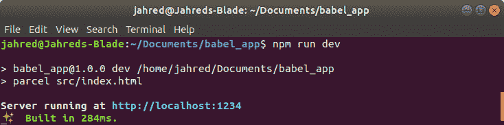

    图 12.9：运行开发服务器

    如果您在打开控制台的情况下启动浏览器，您将看到预期的内容：

    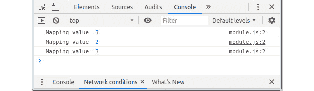

    图 12.10：控制台输出

1.  最后，通过在数组中添加额外的值来更新 `module.js`。当您保存文件时，浏览器应该立即刷新以显示最新的更改：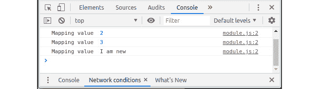

    图 12.11：更新后的控制台输出

1.  如果您查看 HTML 页面的源代码，您会发现 HTML 并没有像在 `src` 目录中那样引用 `index.js`。相反，JavaScript 文件将有一个随机名称，以防止浏览器缓存该文件：

    ```js
    <html>
    <head>
    <title>Babel App</title>
    <script src="img/src.e31bb0bc.js"></script>
    </head>
    <body>
    </body>
    </html>
    ```

在这个练习中我们创建的设置现在是一个许多 JavaScript 项目的完美起点。这个简单的构建提供了许多开发功能，这些功能能够增强您的编码并确保生产文件的最佳可靠性。

# 使用 Webpack 的 Babel 应用程序

Webpack 是一个用于 JavaScript 应用程序的应用程序打包器，它提供了一个更加可配置的体验。在版本 4 中，Webpack 团队引入了零配置支持，以特别与 Parcel 竞争。虽然 Webpack 是一个打包您的 JavaScript 和其他资源的优秀工具，但它确实需要相当多的配置，并且需要同样的耐心。

要使用 Webpack，您只需像安装任何 JavaScript 模块一样安装它。Webpack 主要由两部分组成：Webpack 引擎和 Webpack CLI。这两个可以同时安装，如下所示：

```js
npm install --save-dev webpack webpack-cli
```

如果您使用终端安装它，您应该看到以下输出：

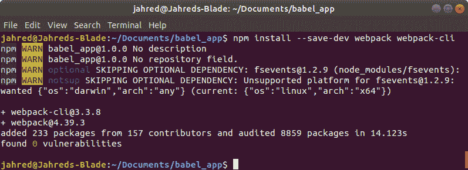

图 12.12：Webpack 安装

下载这些文件后，您可以在 `package.json` 文件中添加一个脚本来执行它们，如下所示：

```js
"wp": "webpack"
```

然后，通过在终端中运行脚本，它应该编译您的 JavaScript：

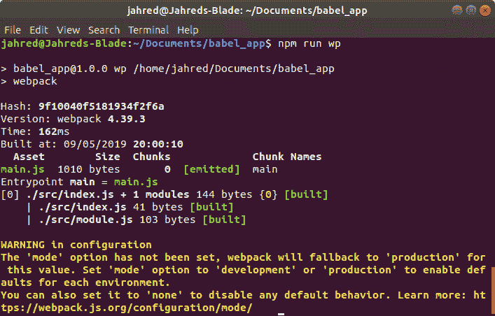

图 12.13：执行 Webpack 零配置

如您所见，在前面的屏幕截图中，`index.js` 和 `module.js` 文件都被编译成了一个名为 `main.js` 的文件。Webpack 默认将其入口点路径设置为 `src/index.js`，输出路径设置为 `dist/main.js`。

让我们明确指定源文件和输出文件，以尝试模拟 Parcel 构建。将您的 `wp` 脚本更新如下：

```js
"wp": "webpack src/index.html -o dist/index.html"
```

这将设置输入源为 `index.html` 文件，并请求输出放置在 `dist` 目录中，但使用相同的文件名。如果您运行此命令，您应该看到以下内容：

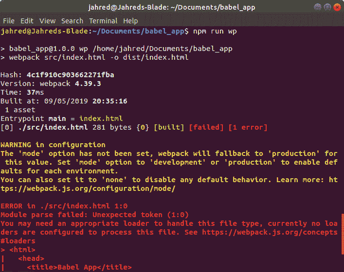

图 12.14：Webpack HTML 解析错误

如您所见，Webpack 对找到 HTML 文件并不太高兴。

现在，关于 webpack 的一个注意事项是它并不试图变得智能。前一次执行的编译输出不会使用 Babel 对您的代码进行转换，因此源文件中的箭头函数将进入输出文件夹。此外，零配置模式的 webpack 只会编译您的 JavaScript，这意味着任何包含在您的应用程序中的其他资产都需要一些配置才能被处理并发送到 `dist` 目录，包括任何 HTML 文件。

## Webpack 架构

Webpack 为您的应用程序提供了一个线性处理管道。使用源输入文件，它将构建一个依赖树，称为依赖图，并将处理配置了该文件类型的每个文件。该管道利用以下内容：

+   源输入文件或入口点

+   输出文件

+   加载器模块

+   插件模块

Webpack 需要对您的应用程序中的每种资产类型进行特定的配置，以便它知道如何处理它们。

## Webpack 加载器和插件

**加载器**和**插件**都是您在 webpack 管道中包含的代码模块。它们可以被认为是附加功能，因为 webpack 是一个管道，它们就像是它的“配件和附件。”加载器和插件都会影响 webpack 如何处理您的应用程序，但它们之间也相当不同。

加载器是一个在 webpack 管道开始时工作的模块；有时甚至在它开始之前。这些模块单独处理资产。例如，如果您想在 webpack 配置中使用 Babel，您需要包含 babel-webpack 加载器，该加载器会逐个转换正在处理的每个文件。

相反，插件通常在 webpack 管道的末端工作。这些模块影响整个输出包，并允许您对应用程序输出有更大的控制权。插件比加载器复杂得多，它们的配置通常反映了这一点。

## Webpack 配置

webpack 管道的配置被添加到一个名为 `webpack.config.js` 的文件中，该文件位于您的项目目录的根目录中。作为一个 JavaScript 文件，它由 Node.js 运行时执行，因此可以包含兼容 Node.js 的 JavaScript。

webpack 配置是从 `webpack.config.js` 文件导出的，就像任何 JavaScript 模块一样。导出的数据可以包括有关入口点路径、目标路径、加载器和插件的信息，如所需。

例如，一个简单的 `webpack.config.js` 文件，它指定了入口点和输出路径，可能看起来像这样：

```js
var path = require('path');
module.exports = {
  entry: path.join(__dirname, 'src', 'index.js'),
  output: {
    path: path.resolve(__dirname, 'dist'),
    filename: 'index.js'
  }
}
```

如果您创建了一个 `webpack.config.js` 文件，请确保重置您的 `package.json` 脚本，使其如下所示：

```js
"wp": "webpack"
```

如果不这样做，可能会导致结果混乱。

## 练习 12.03：一个基本的 WebPack 项目

在这个练习中，你将设置你的 webpack 安装，使其实现 Babel 转译，并且包含并处理你的`index.html`源文件。正如我们之前所述，你可以为 webpack 安装应用许多配置功能，但通过完成这个练习，你将更好地理解如何实现所需的任何加载器。让我们开始吧：

1.  虽然你的应用程序在`package.json`文件中包含了 Babel 转译器，但这对于 webpack 理解如何以及何时使用它来说是不够的。要利用 webpack 与 Babel，你需要包含并配置`Babel loader module`。在你的终端中运行以下命令以下载和安装 Babel 加载器：

    ```js
    npm install --save-dev babel-loader
    ```

1.  接下来，如果你有`webpack.config.js`文件，请打开它，并在`exports`对象中添加一个新的`module`部分。如果你还没有`webpack.config.js`文件，现在创建它并添加上一节中的代码：

    ```js
    module: {
      rules: [
        {
          test: /\.js$/,
          exclude: /node_modules/,
          use: {
            loader: "babel-loader"
          }
        }
      ]
    }
    ```

    这个新块提供了我们可以用来处理文件的 Babel 规则。本质上，它是在说“test：对于以`.js`结尾的文件名，exclude：排除`node_modules`文件夹中的任何文件，use：对找到的这些文件使用`babel-loader`。”

1.  在支持 Babel 转译后，你现在需要包含对 HTML 文件的支持。HTML 处理既是 JavaScript 处理的前置任务也是后置任务，因此它使用加载器和插件来完成。要安装这两个，运行以下代码：

    ```js
    npm install --save-dev html-webpack-plugin html-loader
    ```

    如果一切顺利，你应该会看到以下输出：

    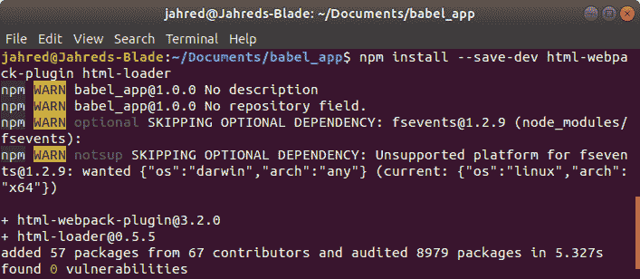

    图 12.15：Webpack HTML 加载器和插件安装

1.  安装了这些模块后，现在需要在`webpack.config.js`文件中进行配置。与 Babel 加载器一样，HTML 加载器应该被添加到`exports`对象的`modules`数组中。在`babel-loader`配置之后添加它：

    ```js
    {
      test: /\.html$/,
      use: [
        {
          loader: "html-loader",
          options: { minimize: true }
        }
      ]
    }
    ```

1.  实现 HTML 插件需要几个步骤。首先，你需要在页面顶部引入它：

    ```js
    const HtmlWebPackPlugin = require("html-webpack-plugin");
    ```

1.  在需要模块后，你可以通过将其添加到`exports`对象的`plugins`部分来配置它：

    ```js
    plugins: [
      new HtmlWebPackPlugin({
        template: "./src/index.html",
        filename: "./index.html"
      })
    ]
    ```

    注意，输出文件的目录不是必需的。HTML 插件将把它放在`dist`文件夹中，不管怎样。

    你的`webpack.config.js`文件现在应该如下所示：

    ```js
    webpack.config.js
    10   module: {
    11     rules: 
    12       {
    13         test: /\.js$/,
    14         exclude: /node_modules/,
    15         use: {
    16           loader: "babel-loader"
    17         }
    18       },
    19       {
    20         test: /\.html$/,
    21         use: [
    22           {
    23             loader: "html-loader",
    24             options: { minimize: true }
    25           }
    The full code is available at: https://packt.live/2XckybQ
    ```

1.  最后，执行你的 webpack 脚本。你现在应该会发现 JavaScript 输出已经被 Babel 正确转译，并且`index.html`文件也将出现在`dist`目录中。你的终端窗口应该如下所示：![图 12.16：成功的 webpack 转译

    ![图片 C14377_12_16.jpg

图 12.16：成功的 webpack 转译

配置 webpack 安装可能是一个相当长的试错过程。即使进行这个练习，你也可能注意到 `index.html` 文件仍然没有实现一个非缓存过程，即 JavaScript 输出被随机重命名以避免浏览器缓存。虽然 webpack 对于需要额外配置自由度的中到大项目是必需的，但对于那些需要简单设置且没有配置头痛的小项目，建议使用 Parcel。

## 其他流行打包器

对于你的 JavaScript 项目，有许多打包器工具可供选择，每个都有自己的优点和缺点。显然，选择打包器可能源于个人选择，也可能是项目经理、开发团队或投标项目的组织的要求。然而，在这些打包器中，尚未在本章中介绍的两个最受欢迎的工具是 Gulp 和 Grunt。

**Gulp** 和 **Grunt** 与你之前看到的示例略有不同，因为它们不使用配置文件。相反，它们使用你编写的 JavaScript 代码来完成类似于 webpack 和 Parcel 可以完成的任务。

Gulp 和 Grunt 被称为任务运行器。这意味着，你不需要为你的项目定义一个编码环境，它们充当一个你编写的应用程序来管理你正在编写的应用程序；如果你愿意，可以将其视为一种应用程序包装器。这两个打包器的工具集提供了一个框架来简化这个过程，它运行在 Node.js 运行时上。你只需编写你想要实现的功能并执行它。

在 Node.js 运行时运行的 `gulp` 打包器如下：

```js
var gulp = require('gulp');
gulp.task('build', () => { /* Compile production application */ });
gulp.task('build.dev', () => { /* Compile development application */ });
gulp.task('test.unit', () => { /* Run all unit tests */});
gulp.task('test.e2e', () => { /* Run all end-to-end tests */});
gulp.task('test', ['test.unit', 'test.e2e']);
```

在 Node.js 运行时运行的 `grunt` 打包器如下：

```js
module.exports = function(grunt) {
  grunt.initConfig(gruntConfig);
  grunt.loadNpmTasks('grunt-contrib-jshint');
  grunt.loadNpmTasks('grunt-contrib-uglify');
  grunt.loadNpmTasks('grunt-contrib-watch');
  grunt.registerTask('default', ['jshint', 'uglify']);
};
```

### 其他语言转译

JavaScript 平台是一个非常流行的平台。毕竟，它是大多数浏览器的事实上的脚本运行时。然而，JavaScript 语言并不一定受到每个人的喜爱。一些开发者更喜欢静态类型系统，而另一些则更喜欢与他们的首选服务器端语言有更好的互操作性。无论原因如何，这种爱恨交加的关系，加上 JavaScript 对浏览器本身的垄断，创造了一长串将转换为 JavaScript 的替代语言。其中一些更流行的语言包括以下内容：

+   TypeScript

+   Dart

+   CoffeeScript

+   Elm

+   ClojureScript

+   Haxe

+   Nim

+   PureScript

当然，这个列表比这要长得多，但前面的列表确实突出了其中一些更受欢迎的替代品，每个都有其自身的优点和缺点。

# TypeScript 语言

**TypeScript** 是 JavaScript 语言的有趣且重要的替代品。作为 JavaScript 语言的超集，TypeScript 由微软开发，并于 2014 年左右发布。它与 JavaScript 非常相似，但有一个对某些人来说非常重要的特性：严格的类型推断。

严格类型是变量具有固定类型的情况。这可能是一个数字、一个字符串或一个布尔值。通过严格类型，变量无法包含任何其他类型的值。这可以防止系统中出现许多错误。

让我们看看一个 JavaScript 问题。

开发者构建了一个接受两个数字并将它们相加的函数：

```js
function add(a, b) {
if (a && b && a + b) {
    return a + b;
  } else {
    throw "invalid parameters passed to 'add' function";
  }
}
```

现在，开发者已经想到了检查参数，首先检查 `a` 和 `b` 是否都提供了，然后检查这两个值是否可以相加。然而，正如你在 *第五章，超越基础* 中看到的，加法操作符是重载的，所以如果传递了一个字符串，它将被连接成一个新的字符串：

```js
add(1, 2);  // ==> 3
add(true, false);  // ==> "invalid parameters passed to 'add' function"
add(1, "2");  // ==> "12"
```

虽然如果开发者预期这样的结果，这是可以的，但它确实提出了可能被甚至经验丰富的开发者忽视的潜在风险。这样的错误是有问题的，因为它们不会在源代码中产生错误，而是在应用程序的更深处。

TypeScript 的静态类型可以通过确保传递给函数的值是特定类型来轻松解决这个问题：

```js
function add(a: number, b: number): number {
  return a + b;
}
```

所有类型都在编译时进行检查。在上面的例子中，检查类型内容不是必要的，因为编译器将确保函数以正确的参数数量被调用。如果某个参数是可选的，则可以使用 `?` 操作符将其标记为可选：

```js
function fun(a: number, b?: boolean) {}
```

这样的可选参数必须始终出现在参数列表的末尾。

当然，指定变量的类型不是必需的——编译器会推断它们。这意味着根据变量包含的第一个值，编译器会期望它始终包含该类型的值。如果你希望函数参数包含任何类型，它们仍然可以包含任何类型。

## 练习 12.04：一个基本的 TypeScript 项目

TypeScript 是专业 JavaScript 世界中的主要参与者，因此了解如何设置 TypeScript 项目是一个重要的技能。在这个练习中，你将通过使用 TypeScript 编译器创建一个最小的 webpack 项目。让我们开始吧：

1.  创建一个新的目录，并按照 *练习 12.03：一个基本的 Webpack 项目* 的说明初始化它。

1.  接下来，从 npm 安装 TypeScript 库。这些库将被保存为 `devDependencies`，因为 TypeScript 在编译后不是你的项目所必需的：

    ```js
    npm install --save-dev typescript ts-loader
    ```

    `ts-loader` 是一个 webpack 加载模块，因为 webpack 默认不知道或理解 `*.ts` 文件。

1.  TypeScript 编译器利用项目根目录中一个名为 `tsconfig.json` 的独特文档中的配置。这个文档的可能值非常广泛，但对于一个简单的项目，只需输入以下内容：

    ```js
    {
    "compilerOptions": {
    "outDir": "./dist/",
    "noImplicitAny": true,
    "module": "es6",
    "target": "es5",
    "allowJs": true
      }
    }
    ```

1.  打开 `webpack.config.js` 文件，并在 `rules` 列表中添加以下规则：

    ```js
    {
      test: /\.tsx?$/,
      use: 'ts-loader',
      exclude: /node_modules/,
    },
    ```

1.  将入口文件名从 `index.js` 更改为 `index.ts`。现在，你的整个 `webpack.config.js` 文件应该如下所示：

    ```js
    webpack.config.js
    28  plugins: [
    29    new HtmlWebPackPlugin({
    30      template: "./src/index.html",
    31      filename: "./index.html"
    32    })
    33  ],
    34  resolve: {
    35    extensions: [ '.tsx', '.ts', '.js' ],
    36  },
    37  output: {
    38    filename: 'bundle.js',
    39    path: path.resolve(__dirname, 'dist'),
    40  },
    41}
    The full code is available at: https://packt.live/2KhPK3Y
    ```

1.  现在，在 `src` 目录中提供一个 `index.ts` 文件，并添加以下内容：

    ```js
    export function hello(name: string): string {
      return 'Hello ' + name;
    }
    ```

1.  您现在可以使用以下代码编译应用程序：

    ```js
    npm run wp
    ```

您现在应该看到一个成功的编译输出，如下所示：

![图 12.17：使用 webpack 的 TypeScript]

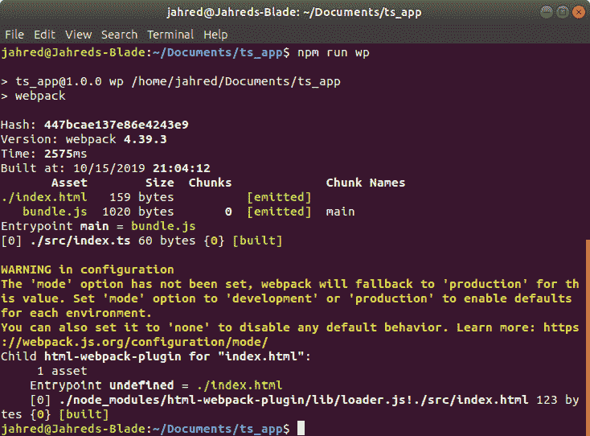

图 12.17：使用 webpack 的 TypeScript

您刚刚创建的是任何类型 TypeScript 应用程序的样板代码。创建 webpack 和 TypeScript 项目可能是您在许多未来的项目中反复进行的事情。

## Elm 和 ClojureScript

`null`和`undefined`值完全支持。

这些语言的目的在于通过输出更好的代码，同时提高开发者的编码能力。通过声明性和函数性思考，可以更快地解决问题并获得更好的结果。

## Haxe

Haxe 从不同的角度接近 JavaScript。它被创建为一个可以在许多平台（包括以下）上编译的统一语言：

+   Flash ActionScript 3

+   C++

+   C# (.NET)

+   Java

+   JavaScript

+   Neko（一个小型、本地的跨平台虚拟机）

+   HashLink（一个更快、更便携的跨平台虚拟机）

+   PHP

+   Python

+   Lua

由于热情的社区，支持的平台不断增多。

通过在许多平台上编译，Haxe 应用程序的源代码具有在这些平台之间可能可移植的好处。这意味着您可以为 JavaScript 客户端编写 Haxe 应用程序，同时也可以在 C#服务器应用程序中使用大量相同的代码。

# 代码支持库

在其相对较长的生命周期中，JavaScript 获得了一些流行的和有用的库，以帮助工程师进行应用程序开发。其中一些库仅提供有用的和可重用的函数，以减少代码复杂性，而其他则提供广泛的具有意见的框架。从用户界面到数据库管理，涵盖了所有内容，许多重叠的库提供了与竞争库略有不同的东西。

## jQuery

jQuery 是可用的最古老的运行实用库之一。作为一个通用工具，jQuery 通过提供一种简单的方式来操纵浏览器的文档对象模型（DOM）、执行动画、发送异步 JavaScript 和 XML（AJAX）请求、管理事件等，赋予了开发者权力。

在 jQuery 首次发布之前，在网页中查找和获取节点是一项费力的任务，同样处理来自 UI 控件的数据和事件也是如此。jQuery 的诞生缓解了早期浏览器中的许多问题，特别是在跨浏览器差异方面。

现在，jQuery 提供的许多功能现在在现代浏览器中都有，但该库本身仍然是许多寻求更统一方式来管理客户端应用程序开发的流行选择。

jQuery 提供了一个单一的全球引用对象，可以通过两种方式访问：

```js
jquery(<context>)
$(<context>)
```

jQuery 的普及意味着你很可能会在互联网上看到单独的`$`符号被使用，实际上，很少有库采用这个简单的符号，因为它是一个有效的变量符号。

jQuery 库在前面的章节中已有一定程度的介绍，因此这里不再提供更多信息。

## Underscore、Lodash 和 Ramda

函数式编程正变得越来越重要，其好处在许多不同的语言和平台上得到体现。虽然我们可以在 JavaScript 中以函数式编程，但它仍然缺乏更成熟函数式语言的一些特性。

为了克服这一缺点，JavaScript 社区提供了许多以函数式为导向的库，其中最受欢迎的是 Underscore、Lodash 和 Ramda。

Underscore 和 Lodash 之所以被命名为这样，是因为它们使用了`_`符号。就像 jQuery 的`$`符号一样，`_`符号为这两个库提供了一个单一的访问点。这两个库都提供了一种方法，如果应用程序中存在库命名空间冲突的可能性，可以将主要对象分配给不同名称的变量，但由于 Underscore 和 Lodash 提供了许多相同的功能，因此同时使用这两个库并不常见。Ramda 库使用大写字母`R`作为其库访问器：

```js
let toString = (v) => `${v}`;
// Lodash
_.map([1, 2], toString);  // ==> ["1", "2"]
// Underscore
_.map([1, 2], toString);  // ==> ["1", "2"]
// Ramda
R.map(toString, [1, 2]);  // ==> ["1", "2"]
```

虽然这三个库都提供了一些重叠的功能，但其中一些功能是这三个库中独有的。例如，Ramda 库提供了 lensing 功能，这是一种在满足给定标准的数据集合子集上操作的手段。

## 客户端框架概述

近年来，强大的 JavaScript 应用程序框架数量激增。许多框架提供了简化单页应用程序（SPA）开发以及模块化、动态加载应用程序的有趣方法。虽然框架长期以来一直是降低开发复杂性、支持工程团队和简化常见用例的重要要求，但现代框架通常将事情提升到了全新的水平。

多亏了移动互联网浏览，JavaScript 应用程序通常需要在浏览器中提供更多功能，而在服务器上则较少。这大大增加了复杂性，尽管许多大型应用程序需要许多工程师共同参与这样的 JavaScript 项目，但从头开始构建这些项目并不利于高效的项目。因此，框架现在变得越来越重要，以减少上市时间、提高标准和最佳实践，以及提升创造力。

## 模型、视图和控制

大多数应用程序框架实现了一种将应用程序逻辑划分为常见功能单元的架构。这些单元的主要抽象通常由模型（Model）、视图（View）和控制器（Controller）组成，其中模型代表应用程序的数据，视图代表信息如何呈现给用户，控制器是促进数据与事件之间处理的功能：

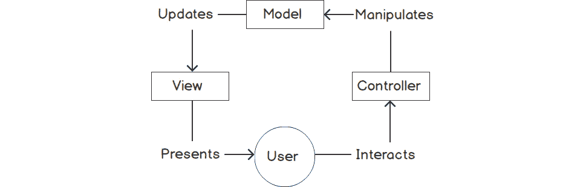

图 12.18：模型-视图-控制器

MVC（模型-视图-控制器）的概念在 JavaScript 语言出现之前就已经被很好地推导出来了，实际上，框架通常是从 MVC 派生出来，以更适应浏览器的某种模式，例如模型-视图-视图模型（MVVM）模式。然而，仅仅理解存在一个抽象，并知道其中角色的作用，有助于提高你对任何给定框架的采用。

## 虚拟 DOM

许多较新框架的另一个共同点是包含虚拟 DOM。这些是管理 DOM 内节点变化的渲染引擎。这意味着，开发者将不再直接操作网页中的 HTML，而是利用位于应用程序和 DOM 之间的 API。这样，当需要更新时，虚拟 DOM 将仅修改那些已更改的 DOM 元素，通过提供已知低延迟、高效率的方法。

当在模型和视图之间实现双向数据绑定时，虚拟 DOM 的一个巨大好处就显现出来了。如果用户在文本字段中输入一个值，相关的模型可以立即自动更新。同样，当模型更新时，这也可能触发另一个视图显示这个新值。

这被称为双向数据绑定，即当某个位置发生变化时，模型和其视图能够相互更新。通过使用虚拟 DOM，这些对浏览器的操作得到了极大的增强，这可能会以前导致用户体验下降。

## 响应式编程

现代框架中常见的另一个特性是响应式功能。当使用虚拟 DOM 实现双向数据绑定时，这通常是一种促进响应性、弹性和可伸缩性的响应式代码。其理念是，而不是轮询和拉取数据，当数据发生变化或新数据可用时，消息会被推送到。这些更新可能发生在应用程序内部或应用程序之间，例如浏览器和服务器之间。

响应式编程是一个如此重要的新范式，以至于整个库和框架都以它的名字命名，例如 RxJS（Rx 代表响应式）和 ReactJS。

# 流行框架

在可用的众多框架中，有三个在 JavaScript 社区中可能是最受欢迎的。它们如下：

+   **AngularJS**

+   **ReactJS**

+   **Vue.js**

## AngularJS

AngularJS 是由 Google 创建的，于 2010 年 10 月发布，并在 2014 年完全重写为 Angular2，改变了其许多独特的特性，并采用 TypeScript 作为其首选语言；尽管通过一些工作也可以使用 vanilla JavaScript。重写之后，Angular2 现在定期通过新版本进行增量更新。目前，Angular2 处于第 8 版，但仍被称为 Angular2，这可能会非常令人困惑。

AngularJS（及其继任者 Angular2）的学习曲线相对较高，繁荣了许多仅属于 Angular 社区的独特范例。然而，它是一个非常有意见的库，有助于确保开发团队以相同的方式使用它，从而消除任何潜在的功能模糊性。此外，AngularJS 是一个完全包容的框架，在构建复杂的基于浏览器的应用程序时，几乎提供了你可能需要的所有工具。

## ReactJS

ReactJS 是由 Facebook 的一位工程师构思和开发的。与 AngularJS 相比，ReactJS 并不试图为你做所有事情，而是声称仅仅是 UI 管理层，提供虚拟 DOM 功能和其他类似的好东西。围绕这个框架形成的社区已经创建了额外的库，这些库可以结合起来形成一个具有与 AngularJS 相似功能的生态系统。然而，与 AngularJS 不同，ReactJS 并不那么有意见，这意味着应用程序可以选择实现什么，以及在某种程度上如何实现。开发者也有更大的自由度，可以从竞争提供类似功能的众多库中选择。

## Vue.js

Vue.js 是由 Evan You 在 2013 年开发的，他是一位在 Google 工作的开发者，当时一直在使用 AngularJS，但他决定他只想保留他喜欢的 AngularJS 元素，并创建自己的轻量级框架。结果是，一个模块化框架，它提供了几乎与 AngularJS 相同的功能，但以可以按需选择的片段形式提供，例如 ReactJS，并且总文件大小远小于其他两个框架。

Vue.js 的学习曲线非常平缓，作为一个提供优秀应用开发结构但又不拘泥于团队环境中工作得很好的严格意见化范例的框架，它的受欢迎程度正在稳步上升。然而，这些往往阻碍了那些不那么常规项目的进展。

# 服务器端库

就像浏览器一样，服务器端 JavaScript 生态系统也有访问库和框架的权限，这些库和框架有助于应用程序的开发。由于 Node.js 也是 JavaScript，因此可以在浏览器和 Node.js 中利用许多库。例如，Lodash、Underscore 和 Ramda 没有浏览器特定的特性，在 Node.js 应用程序中也能正常工作。这是 Node.js 平台在最初发布后迅速起飞的关键原因之一；由于平台上有许多库已经可用，这些库是为浏览器应用程序创建的，因此开发人员可以在他们熟悉的方式下继续进行服务器端应用程序开发。

除了所有可能的以浏览器为中心的库之外，Node.js 还有一些自己的关键库，这些库提供了在浏览器中无法实现的功能，例如 REST 服务器功能或数据库对象关系映射（ORM）。

## Express

可能是 Node.js 最受欢迎的库之一，名为 Express。这个库使得构建 web 服务器变得极其简单，因为它提供了在请求发送到这些路由时建立路由和提供内容的功能。

Express 可以通过以下命令安装：

```js
npm install --save express
```

安装完成后，你可以编写一个简单的服务器应用程序，例如以下内容：

```js
const express = require('express')
const app = express()
const port = 4000; 
app.get("/say_hello", (request, response) => response.send("Hello, World!"))
app.listen(4000port, () => console.log(`Web server now listening on port: ${port}`))
```

一旦构建完成，web 服务器就可以像任何其他 Node.js 应用程序一样启动；例如：

```js
node index.js
```

Express 对象支持所有可能的 HTTP 调用类型，包括 `GET`、`PUT`、`POST` 和 `DELETE`，从而使得完全具备 REST 功能的服务器成为可能，但它也具备使用特殊 `static` 函数提供静态 HTML、JavaScript、CSS 和其他此类资产文件的能力。

Express 库非常完整，因此建议阅读其网站上的文档和指南，以便你能够真正感受到其功能。

## 请求

虽然 Express 充当 web 服务器，但 Request 库充当 web 客户端。在创建网络应用程序时，有时可能需要从另一个远程 web 服务器代理内容、数据或功能。Request 库允许为此目的与这些服务器进行通信。

请求可以通过以下命令安装：

```js
npm install --save request
```

一旦安装，你可以按以下方式使用 Request：

```js
const request = require("request")
request("https://www.google.com", function (error, response, data) {
  // do something with data
});
```

## Socket.IO

使用 HTTP 进行工作可能会很慢。客户端创建一个请求包并将其发送到接收服务器。然后，该服务器创建一个响应包并将其发送回调用者。每个请求/响应事务都是原子的，这意味着它独立于任何其他请求/响应事务发生，通常需要设置和断开一个独特的连接。

现代应用程序越来越倾向于利用 WebSocket。这些是“始终连接”的套接字，它们使用更快速、更敏捷的连接协议来发送数据，非常适合构建在线聊天室、多人游戏等应用程序，也适用于快速数据存储和检索。

虽然 WebSocket 使用自己的协议，但该协议仅处理数据传输的安全性和可靠性，而不是应用程序逻辑的具体要求。

为了解决这个问题，Socket.IO 提供了一个额外的层，使得使用 WebSocket 变得更加容易，从而为许多可以利用它的应用程序提供了通用的功能。

可以使用以下命令安装 Socket.IO：

```js
npm install --save socket.io
```

一个简单的 Socket.IO 服务器应用程序看起来如下所示：

```js
const app = require("express")()
const server = require("http").createServer(app)
const sio = require("socket.io")(server)
sio.on("connection", function(socket){
  console.log("Connection established");
});
```

## 活动 12.01：创建一个识别和编译 TypeScript 文件的项目

本章提供了大量关于调查更大 JavaScript 世界的信息。显然，你可以在语言或平台的基础知识之外学到很多东西，但知道在哪里寻找以及如何将新的库或框架集成到你的应用程序中，为你提供了必要的基石，从那里你可以进行实验并提高你的编码技能。

在这个活动中，你被要求为一个新的项目设置 TypeScript。你现在已经知道 TypeScript 是什么了。对于当前的项目，你的项目经理和开发同事都希望利用 TypeScript 的静态类型能力，以及其他功能，这将是一个大型项目。

本活动的任务是创建初始项目设置，确保 TypeScript 文件被正确识别并编译到输出文件夹。不需要提供任何代码，只需确保一切编译成功。项目经理很高兴在这个项目中使用 Parcel 以保持事情简单。

本活动的概要步骤如下：

1.  创建一个新的项目，并初始化 `npm`。

1.  将 Parcel 作为全局库安装。

1.  在应用程序中安装 TypeScript 库。

1.  创建必要的 TypeScript 配置，但要保持简单。

1.  在 `src` 目录中创建一个临时的 `.ts` 文件。

1.  将必要的脚本添加到 `package.json` 文件中。

1.  运行编译器并确保生成输出。你不应该看到任何错误。如果一切顺利，TypeScript 编译器应该显示 `Built in <x>ms` 的响应消息。

本活动的预期输出如下：


图 12.19：Parcel TypeScript 输出

注意

本活动的解决方案可以在第 752 页找到。

仅了解如何使用包管理器就能打开大量的能力，让你可以快速创建功能性的应用程序。在专业环境中工作，正确使用必要的工具至关重要，这将确保你的应用程序有一个良好的开端。

# 摘要

在本章中，我们回顾了市场上用于 JavaScript 高级开发的多种工具。我们学习了如何在旧浏览器中使用最新的 JavaScript 语法，并确定了可用于在其他语言中开发 JavaScript 应用程序的不同选项。我们还探讨了与 JavaScript 兼容的各种包管理器，例如 npm 和 Yarn，以及几个不同的框架，如 AngularJS、ReactJS 和 Vue.js。最后，我们查看了一些服务器端库，例如 Express、Request 和 Socket.IO。

在下一章中，我们将探讨一些其他高级 JavaScript 领域。
